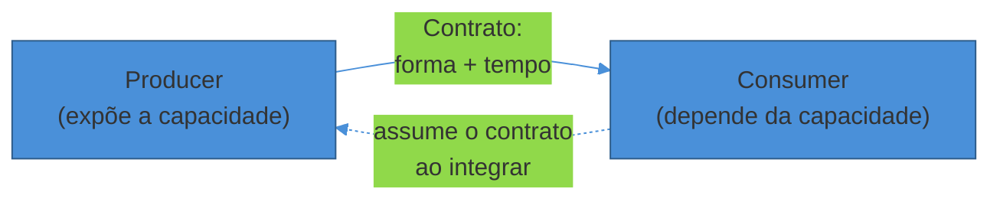
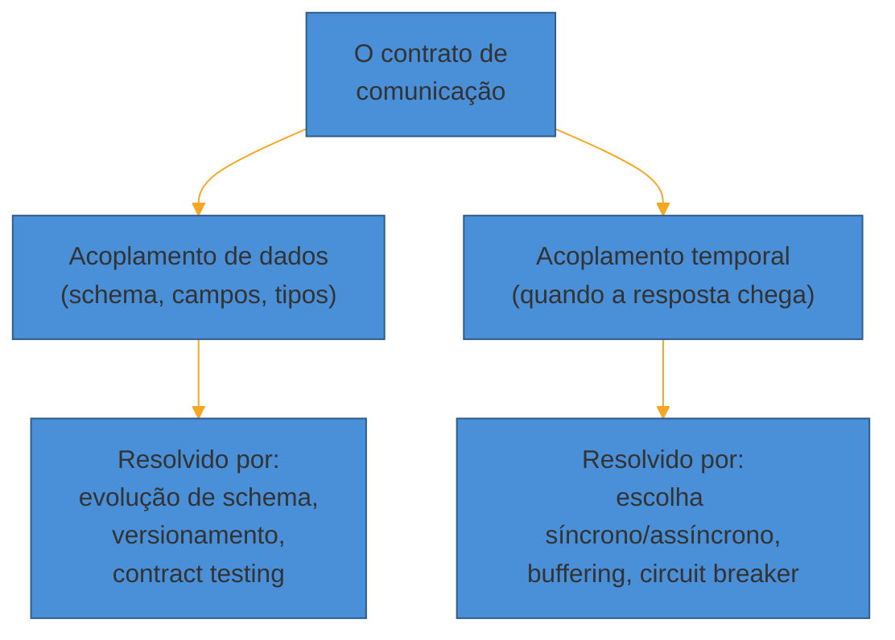

# O que é o contrato de comunicação

> [!abstract] TL;DR
> Todo sistema que troca dados com outro tem um **producer** (quem emite) e um **consumer** (quem recebe) — e entre eles não existe um cabo, existe um **contrato**: a promessa sobre forma dos dados e sobre tempo de resposta que os dois lados aceitam respeitar. "Protocolo" descreve o transporte (HTTP, AMQP, TCP); "formato" descreve a codificação (JSON, Protobuf, Avro); só "contrato" descreve o que interessa de verdade — o que cada lado pode assumir sobre o outro sem quebrar. O contrato carrega **duas dimensões de acoplamento** que evoluem de forma independente: acoplamento de **dados** (o schema, os campos, os tipos) e acoplamento **temporal** (se o consumer precisa que o producer responda *agora* ou pode aceitar a resposta depois). É essa segunda dimensão — síncrono vs assíncrono — que é o primeiro e mais importante eixo de decisão de toda a trilha: ele determina latência, disponibilidade e complexidade operacional antes mesmo de qualquer protocolo específico entrar em cena.

Três e vinte da tarde. O time de checkout do um e-commerce sobe uma mudança pequena, sem nada de especial: o serviço de recomendação de produtos, que roda em outro cluster, ganhou uma nova feature de "você também pode gostar" e agora demora, em média, 400ms a mais para responder.

Ninguém no time de checkout mexeu em nada. Mas o painel de latência do checkout, que sempre ficou estável em torno de 180ms, começa a subir. Primeiro para 500ms. Depois para 1,2s. Às 15h40, o time de plataforma abre um incidente: a taxa de conversão do carrinho caiu 12% e o número de erros 5xx no gateway triplicou.

A investigação leva vinte minutos para achar a causa, porque ela não está em nenhum dos dois serviços — está na **relação** entre eles. O endpoint de finalizar compra do checkout faz, no meio do fluxo, uma chamada HTTP síncrona para "buscar recomendações relacionadas ao pedido" antes de renderizar a tela de confirmação. Ninguém lembrava que essa chamada existia porque, historicamente, ela sempre foi rápida. Quando o serviço de recomendação ficou mais lento, cada requisição de checkout passou a **esperar** por ele — e como o pool de threads do checkout é limitado, threads começaram a ficar presas esperando recomendação, o pool esgotou, e requisições completamente não relacionadas (login, consulta de pedido) começaram a falhar por falta de threads livres.

Um serviço de recomendações — que não é sequer essencial para fechar uma compra — quase derrubou o checkout inteiro. Não por um bug de código. Por uma decisão de **contrato** tomada meses antes, sem que ninguém a tivesse nomeado como decisão: "eu, checkout, vou esperar você, recomendação, responder antes de seguir em frente." Essa frase — dita ou não em voz alta — é o contrato de comunicação entre os dois serviços. E é exatamente o tipo de decisão que esta trilha existe para tornar explícita.

## Producer e consumer: os dois papéis de toda comunicação

Antes de falar de protocolo, formato ou tecnologia, existe uma distinção mais básica que estrutura qualquer comunicação entre sistemas: alguém **produz** um dado ou uma solicitação, e alguém **consome** esse dado ou responde a essa solicitação.

- **Producer** (ou *provider*, ou *upstream*) — o lado que expõe uma capacidade: um endpoint HTTP, um tópico Kafka, uma fila. É quem decide o formato de saída e, em geral, quem paga o custo de manter compatibilidade quando muda algo.
- **Consumer** (ou *client*, ou *downstream*) — o lado que depende dessa capacidade para fazer seu próprio trabalho. É quem sofre primeiro quando o producer muda algo sem avisar.

Repare que esses papéis não são fixos por serviço — são fixos **por interação**. O serviço de checkout do exemplo acima é consumer do serviço de recomendação numa chamada, mas é producer quando o serviço de faturamento pergunta "esse pedido foi pago?". A maioria dos sistemas reais é as duas coisas ao mesmo tempo, em interações diferentes — o que só reforça por que pensar em "papéis por interação" é mais útil do que pensar em "tipos de serviço".

O vocabulário muda um pouco conforme o contexto: em REST, fala-se em *client* e *server*; em mensageria, em *producer* e *consumer* (ou *publisher* e *subscriber*); em contratos de dados e pipelines, a mesma dupla aparece como "produtor e consumidor de dados". O papel é sempre o mesmo — só o nome muda com a tecnologia. É por isso que, no resto desta trilha, você vai ver "producer/consumer" como o vocabulário-guia, independente de a comunicação ser um `POST` HTTP ou uma mensagem publicada num tópico.

## O contrato: a abstração que sobrevive à troca de tecnologia

Entre producer e consumer não existe um fio. Existe uma **promessa**. E o nome técnico correto para essa promessa é **contrato**, não "protocolo" e não "formato" — a distinção importa porque cada um desses três termos responde a uma pergunta diferente:

- **Protocolo** responde "como os bytes trafegam": HTTP/1.1, HTTP/2, AMQP, gRPC sobre HTTP/2, TCP puro. É a camada de transporte.
- **Formato** responde "como os dados são codificados": JSON, XML, Protobuf, Avro. É a camada de serialização.
- **Contrato** responde "o que cada lado pode assumir sobre o outro sem quebrar": quais campos existem, que tipo têm, se são obrigatórios, quanto tempo a resposta leva, o que acontece se der erro, se a operação pode ser repetida com segurança.

Um serviço de referência de "API contract" resume isso de forma direta: um contrato de API é o acordo formal e preciso que define os comportamentos esperados, entradas, saídas e efeitos colaterais que uma API garante a qualquer chamador — a API é, no sentido mais geral, um contrato entre quem provê o software e quem consome esse software sobre o que o sistema vai fazer ([API Security through Contract-Driven Programming, CMU SEI](https://www.sei.cmu.edu/blog/api-security-through-contract-driven-programming/)).

Note a diferença sutil entre **interface** e **contrato**, que a literatura recente vem separando com mais cuidado: uma interface é uma abstração de tempo de projeto que especifica a estrutura — métodos, propriedades, assinaturas esperadas — enquanto um contrato opera num nível diferente, incluindo comportamento em runtime, versionamento e descoberta, que a interface sozinha não cobre ([Why Interfaces and Contracts are not the same, Medium/Piovesan, 2025](https://medium.com/software-architecture-in-the-age-of-ai/why-interfaces-and-contracts-are-not-the-same-and-why-that-matters-with-10-examples-408524f6d17c)). Uma `interface` Java ou um `type` TypeScript descreve a forma dos dados dentro de um processo. Um contrato de comunicação entre sistemas descreve muito mais: descreve o que acontece quando o outro lado está fora do ar, quanto tempo você deve esperar antes de desistir, e se pode chamar a mesma operação duas vezes sem efeito colateral duplicado.

É por isso que "contrato" é a lente certa para esta trilha inteira, e não "protocolo" ou "formato": você pode trocar REST por gRPC (protocolo) ou trocar JSON por Protobuf (formato) sem necessariamente mudar o contrato — os mesmos campos, as mesmas garantias, o mesmo comportamento sob falha continuam valendo. Mas se você muda o contrato — um campo que era opcional vira obrigatório, uma resposta que era instantânea vira "chega em algum momento por e-mail" — o consumer quebra, não importa se o protocolo e o formato continuam idênticos. O contrato é a abstração que sobrevive à escolha de tecnologia; é nele que a decisão de arquitetura realmente mora.

> [!question]- Contrato é só a documentação da API (OpenAPI, .proto)?
> Não — a especificação (um arquivo OpenAPI, um `.proto`, um schema JSON Schema) é uma **representação** do contrato, não o contrato em si. O contrato de verdade é o conjunto de comportamentos que o consumer pode depender com segurança, estejam eles documentados ou não. E aqui mora uma armadilha conhecida como **Lei de Hyrum**: com um número suficiente de consumers, não importa o que você prometeu no contrato formal — todo comportamento observável do seu sistema vai ser, por alguém, tratado como parte do contrato ([Hyrum's Law](https://www.hyrumslaw.com/)). Se sua API sempre retorna os campos em uma certa ordem, ou sempre responde em menos de 50ms, ou sempre gera IDs sequenciais — alguém, algum dia, vai escrever código que depende disso, mesmo que sua documentação nunca tenha prometido nada daquilo. É uma razão prática (não só teórica) para tratar contrato como algo maior que a spec: a spec é o que você *pretende* prometer; o comportamento observado é o que você *de fato* prometeu, quer você quisesse ou não.

## Acoplamento: as duas dimensões que o contrato carrega

"Acoplamento" é uma palavra usada de forma frouxa em conversas de arquitetura — quase sempre como sinônimo genérico de "ruim, evite". Para decidir contratos de comunicação, vale separar em duas dimensões concretas, porque elas se comportam de formas diferentes e pedem soluções diferentes.

**Acoplamento de dados (ou de schema).** É o quanto o consumer depende da *forma* exata do que o producer envia — nomes de campo, tipos, estrutura aninhada, valores possíveis de um enum. Se o producer renomeia um campo de `client_id` para `customer_id`, todo consumer que lê `client_id` quebra, não importa se a comunicação era síncrona ou assíncrona, HTTP ou Kafka. Esse tipo de acoplamento é resolvido com disciplina de **evolução de schema**: adicionar campos novos como opcionais, nunca remover ou renomear campos sem um período de depreciação, usar um registro central que valide compatibilidade antes de aceitar uma mudança ([Schema Evolution & Compatibility, Confluent](https://docs.confluent.io/platform/current/schema-registry/fundamentals/schema-evolution.html)). Um padrão citado com frequência para isso é o *expand-contract*: primeiro você introduz o novo campo ao lado do antigo, migra os consumers um a um, e só então remove o antigo — nunca troca os dois no mesmo instante ([Schema Evolution in Real-Time Systems, Estuary, 2025](https://estuary.dev/blog/real-time-schema-evolution/)).

**Acoplamento temporal.** É o quanto o consumer precisa que o producer esteja disponível e responsivo *no exato momento* da interação. Numa chamada síncrona clássica — um `GET` HTTP, uma chamada RPC bloqueante — o consumer literalmente para de executar até o producer responder. Se o producer está fora do ar, lento, ou sobrecarregado, o consumer sente isso **imediatamente e proporcionalmente**. Foi esse acoplamento, e não um problema de schema, que quase derrubou o checkout na cena de abertura: o serviço de recomendação não mudou nenhum campo de resposta, só ficou mais lento — e essa lentidão se propagou porque o checkout estava temporalmente acoplado a ele.

A literatura de arquitetura de mensageria é enfática nessa distinção: interações síncronas levam a acoplamento temporal forte, enquanto interações assíncronas levam a acoplamento temporal fraco — comunicação síncrona introduz acoplamento temporal porque os dois serviços precisam estar disponíveis ao mesmo tempo para a interação funcionar ([Synchronous vs Asynchronous for Temporal Decoupling, Pentatech](https://pentatech.com.au/synchronous-vs-asynchronous-for-temporal-decoupling/)).

O ponto central — e a razão de estas duas dimensões merecerem seções separadas — é que elas são **independentes**. Você pode ter uma API REST (síncrona) com um contrato de dados extremamente estável, versão a versão, há anos — baixo acoplamento de dados, alto acoplamento temporal. E pode ter um tópico de eventos (assíncrono) cujo schema muda a cada duas semanas, quebrando consumers com frequência — baixo acoplamento temporal, alto acoplamento de dados. Tratar "acoplamento" como uma coisa só esconde que você pode resolver uma dimensão sem tocar na outra — e é exatamente isso que o resto da trilha faz: o Sub-galho 2 (síncrona) e o Sub-galho 3 (confiabilidade) atacam majoritariamente o acoplamento de dados; o Sub-galho 4 (assíncrona) ataca majoritariamente o acoplamento temporal.

## O eixo mestre: síncrono vs assíncrono

Chegamos ao eixo que organiza a trilha inteira. Antes de perguntar "REST ou gRPC?" ou "fila ou stream?", existe uma pergunta anterior e mais decisiva: **o consumer precisa da resposta agora, ou pode aceitar a resposta depois?**

Essa pergunta parece simples, mas dela decorrem quase todas as outras decisões de arquitetura de comunicação. Vale desembrulhar o que "síncrono" e "assíncrono" realmente significam, porque os dois termos são usados de forma um pouco inconsistente na indústria.

**Comunicação síncrona**: o consumer envia uma solicitação e **bloqueia** — sua execução para — até que o producer responda. O padrão clássico é requisição-resposta: `HTTP GET /pedidos/42`, uma chamada gRPC unária, uma consulta SQL síncrona. O consumer não segue em frente sem o resultado, porque, na maioria dos casos, ele *precisa* do resultado para decidir o próximo passo.

**Comunicação assíncrona**: o consumer envia uma solicitação (ou publica um evento) e **continua seu trabalho imediatamente**, sem esperar. A resposta, se houver, chega mais tarde — por uma mensagem em outra fila, um webhook, um callback, ou simplesmente porque o consumer nunca precisou de resposta nenhuma (o producer só precisava ser notificado de que algo aconteceu). O padrão clássico é publicação em fila ou tópico: `checkout.publish("pedido.criado", {...})` e seguir em frente sem saber (nem se importar, no curto prazo) quando ou se algum consumer vai processar aquele evento.

A diferença não é sobre tecnologia — é sobre **quem espera por quem, e por quanto tempo**. Dá para fazer uma chamada HTTP de forma "assíncrona" do ponto de vista do código (`fetch` sem `await` bloqueante) e ainda assim o *sistema* continuar temporalmente acoplado, porque o resultado daquela chamada é necessário para terminar a transação de negócio. E dá para usar uma fila e ainda ter acoplamento temporal disfarçado, se o consumer do lado que publicou fica em polling apertado esperando a resposta. O que importa é a **semântica do negócio**: essa operação pode ser adiada, ou o mundo real exige uma resposta imediata?

### O que a escolha propaga: latência, disponibilidade, complexidade

A escolha entre síncrono e assíncrono não fica contida numa única chamada — ela se propaga em três eixos que aparecem em praticamente toda decisão de arquitetura desta trilha.

**Latência.** Síncrono entrega, no caminho feliz, a latência mais baixa e mais previsível: a comunicação é direta, sem intermediário, a resposta volta "instantaneamente" comparado a passar por um broker de mensagens ([Request-Response vs Event-Driven Communication, Andy Crossman](https://medium.com/@andycrossman712/request-response-vs-event-driven-communication-key-tradeoffs-6084ab7a78c0)). Mas essa vantagem some sob carga: sistemas de requisição-resposta tendem a apresentar latência crescente rapidamente conforme os recursos saturam, exatamente o que aconteceu no checkout da abertura. Assíncrono, ao contrário, tem latência menos previsível no melhor caso (o evento pode demorar segundos para ser processado) mas muito mais estável sob pressão: se o consumer não acompanha o ritmo, a fila cresce — o que preserva o throughput, ainda que às custas de latência de ponta a ponta.

**Disponibilidade.** Este é o efeito mais contra-intuitivo e o mais importante da cena de abertura: numa cadeia de chamadas síncronas, a disponibilidade do sistema como um todo é, na prática, o **produto** das disponibilidades de cada elo. Se checkout depende sincronamente de recomendação, e recomendação tem 99,9% de disponibilidade, o checkout nunca pode ter disponibilidade maior que 99,9% — mesmo que o código do checkout seja perfeito. Assíncrono quebra exatamente essa propagação: uma fila funciona como um **buffer** entre os dois lados, decopulando-os em três dimensões — tempo (não precisam rodar no mesmo instante), disponibilidade (um pode cair sem derrubar o outro) e velocidade (o rápido não fica refém do lento) ([Producer-Consumer Problem with Backpressure](https://newsletter.scalablethread.com/p/how-to-solve-producer-consumer-problem)). Se o consumer de recomendação cair, os eventos ficam acumulados na fila — o checkout segue funcionando, e o processamento retoma quando o consumer volta.

**Complexidade operacional.** Aqui a balança se inverte. Síncrono é conceitualmente mais simples: chamou, esperou, recebeu, seguiu — o modelo mental é linear, fácil de depurar (um `stack trace` mostra a cadeia inteira), fácil de testar.

Assíncrono introduz peças novas que precisam de operação própria: um broker de mensagens para manter no ar, monitorar e escalar; a necessidade de lidar com mensagens duplicadas (então o consumer precisa ser **idempotente** — processar a mesma mensagem duas vezes sem efeito colateral duplicado); a possibilidade de mensagens fora de ordem; e, se o producer também precisa atualizar seu próprio banco de dados *e* publicar o evento, o chamado **dual write problem** — a chance de a escrita no banco ter sucesso mas a publicação do evento falhar (ou vice-versa), deixando o sistema inconsistente.

A solução canônica para isso, o **padrão Outbox**, salva o evento como parte da mesma transação de banco que grava o dado de negócio, e um processo separado o publica depois — transformando duas escritas em sistemas diferentes numa única transação atômica local, à custa de mais uma tabela e mais uma peça de infraestrutura para operar ([Transactional Outbox Pattern, AWS Prescriptive Guidance](https://docs.aws.amazon.com/prescriptive-guidance/latest/cloud-design-patterns/transactional-outbox.html)). Esse padrão específico — Outbox — é aprofundado no Sub-galho 4 desta trilha; aqui o que importa é reconhecer que ele existe *porque* a assincronia trocou um problema (acoplamento temporal) por outro (consistência entre duas escritas).

| Eixo | Síncrono | Assíncrono |
|------|----------|------------|
| Latência no caminho feliz | Baixa e previsível | Variável; degrada graciosamente sob carga |
| Disponibilidade composta | Produto das disponibilidades da cadeia | Cada lado isolado por um buffer |
| Modelo mental | Linear, fácil de rastrear | Distribuído no tempo, exige rastreamento explícito (correlation ID) |
| Falha do outro lado | Sentida na hora, proporcionalmente | Absorvida pela fila; sentida como atraso, não como erro |
| Consistência | Imediata (dentro da própria chamada) | Eventual; exige idempotência e, às vezes, Outbox |
| Infraestrutura extra | Nenhuma além do transporte | Broker de mensagens a operar e monitorar |
| Exemplo típico | `GET /pedido/42`, chamada gRPC unária | Publicar `pedido.criado` num tópico |

> [!question]- Isso é o mesmo eixo do teorema CAP?
> Relacionado, mas não idêntico. O CAP fala de consistência, disponibilidade e tolerância a partição *dentro* de um sistema distribuído que replica dados (ex.: um banco de dados distribuído decidindo se responde com dado possivelmente desatualizado ou se recusa a responder durante uma partição de rede) ([CAP Theorem, GeeksforGeeks](https://www.geeksforgeeks.org/system-design/cap-theorem-in-system-design/)). O eixo síncrono/assíncrono desta nota é sobre a **interação entre dois sistemas diferentes** — não sobre réplicas do mesmo dado. Mas os dois compartilham um parentesco: em ambos os casos, a decisão de "esperar por uma resposta garantidamente atualizada" ou "seguir em frente aceitando alguma forma de atraso/inconsistência" é o cerne do trade-off. Não é coincidência que sistemas que escolhem comunicação assíncrona quase sempre também aceitam consistência eventual — as duas escolhas nascem da mesma aposta: **disponibilidade e desacoplamento valem mais, aqui, do que uma resposta imediata e garantidamente fresca**.

### O contrato pressupõe uma rede que mente

Vale nomear uma suposição escondida por trás de todo contrato de comunicação: ele só existe porque dois processos que rodam em máquinas diferentes precisam se coordenar através de uma rede — e a rede, ao contrário de uma chamada de função dentro do mesmo processo, **mente**. Em 1994 Peter Deutsch, da Sun Microsystems, catalogou um conjunto de suposições que engenheiros costumam fazer sem perceber ao escrever código distribuído, e que James Gosling completou com uma oitava em 1997 — as chamadas **Oito Falácias da Computação Distribuída**: a rede é confiável; a latência é zero; a banda é infinita; a rede é segura; a topologia não muda; existe um administrador único; o custo de transporte é zero; a rede é homogênea ([Ably, *Navigating the 8 fallacies of distributed computing*](https://ably.com/blog/8-fallacies-of-distributed-computing)).

Nenhuma dessas frases é verdadeira, mas o código de quem nunca operou um sistema distribuído em produção costuma ser escrito **como se** fossem. É essa mesma suposição implícita — "a chamada para o serviço de recomendação vai ser rápida, como sempre foi" — que abriu a cena inicial desta nota.

O contrato de comunicação é, em essência, a forma como você **admite por escrito** que a rede vai falhar, atrasar e se comportar de forma imprevisível — e decide, com essa admissão em mãos, o que cada lado faz quando isso acontece: espera quanto tempo, tenta de novo quantas vezes, o que responde ao usuário enquanto isso.

Essa mesma tensão — entre o que o contrato promete e o que a rede realmente entrega — também aparece na forma como cada lado interpreta o que recebe. Jon Postel, ao especificar o TCP em 1980, cunhou o que ficou conhecido como **Lei de Postel** ou princípio da robustez: "seja conservador no que você envia, seja liberal no que você aceita" ([Robustness principle, Wikipedia](https://en.wikipedia.org/wiki/Robustness_principle)).

Aplicado a um contrato de API, isso significa: seu producer deve emitir respostas estritamente aderentes ao que promete (sempre com os campos documentados, sempre nos tipos certos), mas seu consumer deveria tolerar variações razoáveis do que recebe — um campo novo desconhecido não deveria quebrar o parser, um timestamp sem fuso horário poderia assumir UTC em vez de rejeitar a mensagem inteira.

É um princípio elegante, mas também discutido: especificações modernas baseadas em OpenAPI e JSON Schema, com validação estrita, nem sempre deixam espaço para o lado "liberal" da regra — e ser liberal demais no que se aceita pode mascarar erros que deveriam ter sido rejeitados ([Meet Hyrum and Postel, Nordic APIs](https://nordicapis.com/meet-hyrum-and-postel/)). Vale reter o espírito da lei — não force o consumer a quebrar por uma mudança inofensiva — sem tratá-la como desculpa para contratos frouxos.

### Por que essa escolha nunca é só técnica

Vale nomear uma armadilha de raciocínio comum: tratar síncrono vs assíncrono como uma decisão puramente de infraestrutura ("vamos usar Kafka porque é moderno") em vez de uma decisão que nasce do **requisito de negócio** da interação.

Volte ao checkout. A pergunta certa não é "o serviço de recomendação deveria usar fila?" — é "o resultado de recomendação é necessário para fechar a compra, ou é um enriquecimento que pode chegar depois, ou até nunca chegar, sem quebrar nada essencial?". A resposta, quase sempre, é a segunda: mostrar "você também pode gostar" é uma melhoria de experiência, não uma condição para o pedido ser válido. Uma vez que essa resposta de negócio está clara, a decisão técnica se torna quase óbvia: essa chamada nunca deveria ter sido síncrona e bloqueante no caminho crítico de checkout. Ela deveria, no mínimo, ter um timeout curto e agressivo com fallback ("não mostra recomendação se não vier rápido") ou, melhor ainda, ser buscada de forma assíncrona depois que o pedido já foi confirmado.

Compare com uma segunda interação no mesmo fluxo: "debitar o valor no cartão de crédito". Aqui a resposta de negócio é o oposto — o usuário *precisa* saber, antes de sair da tela, se o pagamento foi aprovado ou recusado. Essa interação tem uma razão de negócio real para ser síncrona (ou, no mínimo, para o usuário perceber uma espera explícita — um padrão que o Sub-galho 3 chama de "202 Accepted + polling", uma forma de simular síncrono sobre uma implementação assíncrona por trás).

O padrão geral, que vai se repetir nas próximas quatro notas deste sub-galho: **a pergunta síncrono/assíncrono nunca começa em "qual tecnologia eu prefiro" — começa em "o que o negócio exige que essa interação garanta, e quando"**. Toda tecnologia específica — REST, gRPC, GraphQL, Kafka, RabbitMQ, webhooks — é uma resposta *depois* dessa pergunta, nunca antes dela.

## Casos práticos

A distinção entre acoplamento de dados e acoplamento temporal, e a escolha síncrono/assíncrono que decorre dela, não é um exercício teórico — aparece em decisões documentadas publicamente por times de engenharia em produção.

**Idempotência em webhooks de pagamento.** Quando um provedor como Stripe entrega notificações de eventos por webhook — uma forma de comunicação assíncrona invertida, em que o producer (o provedor de pagamento) empurra o evento para o consumer (o backend do lojista) em vez de esperar ser consultado — a rede pode entregar a mesma notificação mais de uma vez: timeout na resposta do lojista, retry automático do provedor, duplicação de rede.

O contrato aqui não promete "entrega exatamente uma vez"; promete "pelo menos uma vez" e transfere para o consumer a responsabilidade de não processar o mesmo evento duas vezes — cada notificação carrega um ID único de evento, e o lojista precisa checar se aquele ID já foi tratado antes de debitar ou creditar de novo ([Stripe, *Designing robust and predictable APIs with idempotency*](https://stripe.com/blog/idempotency)). É o mesmo raciocínio de acoplamento temporal desta nota, só que invertido: aqui quem historicamente pensamos como "consumer" (o lojista) é quem sofre a falta de controle sobre o timing da chamada.

**Circuit breaker como resposta estrutural ao acoplamento temporal.** A adoção generalizada de microsserviços trouxe consigo um padrão inteiro — o *circuit breaker* — cuja única razão de existir é o acoplamento temporal descrito nesta nota. Quando um serviço downstream começa a falhar ou a responder devagar, threads do consumer ficam presas esperando, consumindo recursos que deveriam atender outras requisições completamente não relacionadas — o mesmo mecanismo, documentado de forma genérica pela comunidade de arquitetura de microsserviços, que abriu a cena inicial desta nota.

O circuit breaker "abre" depois de um limiar de falhas e passa a responder com erro rápido (ou um fallback) em vez de deixar cada chamada nova esperar um timeout inteiro, isolando a falha antes que ela se espalhe para trás na cadeia de chamadas ([microservices.io, *Circuit Breaker Pattern*](https://microservices.io/patterns/reliability/circuit-breaker.html)). É a resposta operacional padrão de mercado para quando uma interação precisa continuar síncrona por exigência de negócio, mas não pode deixar a disponibilidade composta da cadeia colapsar inteira quando um elo cai.

**Outbox como pré-condição para publicar eventos com segurança.** Sistemas que precisam gravar um estado de negócio *e* notificar outros sistemas do que aconteceu — "o pedido foi pago", "o pagamento foi estornado" — enfrentam o dual write problem descrito nesta nota: são duas operações em dois sistemas diferentes (o banco e o broker de mensagens), e uma pode ter sucesso sem a outra.

A prática documentada para isso é gravar o evento numa tabela de outbox dentro da mesma transação de banco que grava o estado de negócio, e um processo separado — um poller ou um mecanismo de *change data capture* — publicar dali para o broker depois, garantindo que o evento nunca "se perde" mesmo que o broker esteja fora do ar no instante exato da transação ([AWS Prescriptive Guidance, *Transactional Outbox pattern*](https://docs.aws.amazon.com/prescriptive-guidance/latest/cloud-design-patterns/transactional-outbox.html)). Esse padrão só existe porque uma equipe, em algum momento, escolheu assincronia — e precisou fechar a lacuna de consistência que essa escolha abriu.

## Armadilhas comuns

> [!warning] Tratar a rede como se fosse uma chamada de função local
> **O que acontece:** o código chama um serviço remoto sem tratar timeout, sem cogitar retry, sem considerar que a resposta pode nunca chegar — como se fosse um `import` dentro do mesmo processo. **Por quê:** as Oito Falácias da Computação Distribuída nomeiam exatamente essa ilusão, e frameworks modernos tornam a chamada remota tão parecida com uma chamada local (`await servico.buscarPedido(id)`) que é fácil esquecer que ela atravessou uma rede de verdade, sujeita a tudo que uma rede pode fazer de errado. **Como evitar:** todo contrato de comunicação precisa declarar, por escrito, timeout, política de retry e comportamento de fallback — nunca assumir implicitamente que "sempre respondeu rápido, então sempre vai responder rápido". Foi exatamente essa suposição não-declarada que derrubou o checkout na abertura desta nota.

> [!warning] Mudar o contrato sem tratar os consumers existentes como parte do problema
> **O que acontece:** o producer renomeia um campo, remove um valor de um enum, ou aperta uma validação que antes era permissiva — e consumers que nunca souberam da mudança quebram, mesmo que a "documentação oficial" nunca tivesse prometido explicitamente aquele comportamento específico. **Por quê:** pela Lei de Hyrum, com consumers suficientes, todo comportamento observável de um sistema — documentado ou não — acaba sendo tratado como parte do contrato por alguém, em algum lugar. **Como evitar:** tratar mudança de contrato como uma operação de duas pontas, não uma decisão unilateral do producer: expandir antes de contrair (adicionar o novo campo antes de remover o antigo), versionar de forma explícita, e comunicar depreciação com prazo — nunca trocar o contrato debaixo dos pés de quem já integrou.

> [!warning] Escolher assíncrono só porque parece a opção mais moderna
> **O que acontece:** o time decide "vamos publicar isso numa fila em vez de chamar direto" sem antes perguntar se a operação, pela natureza do negócio, pode mesmo ser adiada — e acaba escondendo um requisito de resposta imediata atrás de uma UX pior ("aguarde, processando...", um spinner que gira indefinidamente). **Por quê:** assíncrono troca um modo de falha visível na hora (erro 500, timeout) por um modo de falha que só aparece depois — uma fila que cresce silenciosamente, um consumer travado reprocessando a mesma mensagem, uma inconsistência percebida horas depois num relatório. Isso não é estrategicamente superior por padrão; é uma troca, com um custo diferente, não menor. **Como evitar:** a pergunta nunca é "síncrono ou assíncrono é melhor" em abstrato — é "essa interação específica pode, pela natureza do negócio, ser adiada sem quebrar a experiência ou a correção?". Autenticação, validação de pagamento no momento da compra, checagem de estoque antes de confirmar o carrinho — normalmente não podem. Enriquecimento, notificação, auditoria — quase sempre podem.

## Em entrevista

Numa entrevista de system design ou numa entrevista técnica sênior mais ampla, este é um dos poucos tópicos onde **nomear o eixo certo antes de qualquer diagrama** já sinaliza senioridade. Um candidato júnior, ao ouvir "desenhe um sistema de checkout", tende a ir direto para caixas e setas — "vou ter um serviço de pedidos, um de pagamento, um de notificação" — sem nunca dizer em voz alta *como* essas caixas se falam.

Um candidato sênior nomeia o contrato antes de desenhar: "entre pedido e pagamento eu preciso de resposta síncrona, porque o usuário precisa saber na hora se o cartão foi aprovado; entre pedido e notificação eu quero assíncrono, porque mandar o e-mail de confirmação pode acontecer com segundos de atraso sem ninguém perceber — e isso me dá a chance de desacoplar a disponibilidade dessas duas partes." Essa frase, sozinha, já toca dois dos quatro eixos clássicos de avaliação de uma entrevista de system design (design da solução coerente com requisitos; profundidade técnica ao antecipar o trade-off) — ver [[03-Dominios/Engenharia/Arquitetura/System Design/1 - Framework de entrevista/01 - O que é System Design e o que a entrevista avalia|a nota-mãe de System Design]] para o framework completo de avaliação.

Um erro comum de quem está estudando para entrevistas: memorizar "REST é síncrono, mensageria é assíncrona" como um fato de vocabulário, sem internalizar *por que* essa escolha se propaga em disponibilidade e latência. Se o entrevistador perguntar "por que você escolheria fila em vez de chamada direta aqui?", a resposta fraca é "porque é mais escalável" (vago, sem números, sem contexto). A resposta forte nomeia o acoplamento: "porque, se eu chamar o serviço de e-mail sincronamente, a disponibilidade do meu checkout fica limitada pela disponibilidade do serviço de e-mail — e não quero que um provedor de e-mail fora do ar impeça alguém de finalizar uma compra."

Vale também estar pronto para a pergunta inversa: "quando você **não** usaria fila, mesmo podendo?" — testando se você entende que assincronia tem custo, não só benefício (ver o callout de armadilha acima). Um "sempre assíncrono" indiscriminado é, na prática, tão fraco quanto "sempre síncrono" — os dois ignoram que a decisão nasce do requisito da interação, não de uma preferência estética por arquitetura moderna.

## How to explain in English

> "Every communication between systems has a producer — whoever exposes the capability — and a consumer — whoever depends on it. Between them there's no wire, there's a **contract**: a promise about the shape of the data and about timing. The first and most consequential decision in that contract is whether the interaction is **synchronous** — the consumer blocks until the producer responds — or **asynchronous** — the consumer fires and moves on, picking up the result later. That single choice propagates into latency, availability, and operational complexity: a chain of synchronous calls composes availability multiplicatively, so a slow downstream dependency becomes your own outage. A queue breaks that coupling by buffering between the two sides, at the cost of eventual consistency and the need for idempotent consumers."

| PT | EN |
|----|----|
| Contrato de comunicação | Communication contract |
| Producer / consumer | Producer / consumer |
| Acoplamento temporal | Temporal coupling |
| Acoplamento de dados / de schema | Data coupling / schema coupling |
| Síncrono / bloqueante | Synchronous / blocking |
| Assíncrono / não-bloqueante | Asynchronous / non-blocking |
| Disponibilidade composta | Compounded availability |
| Consistência eventual | Eventual consistency |
| Idempotência | Idempotency |
| Evolução de schema | Schema evolution |
| Mudança que quebra o consumer | Breaking change |
| Fila / broker de mensagens | Message queue / message broker |
| Desacoplar no tempo | Decouple in time |

## O que vem a seguir

Este eixo — síncrono vs assíncrono, e as duas dimensões de acoplamento que ele carrega — é o alicerce sobre o qual toda a trilha se apoia. As próximas quatro notas deste sub-galho percorrem a linha do tempo de *como* a indústria respondeu a essa pergunta em cada época: primeiro tentando fazer chamadas remotas parecerem chamadas locais (e falhando), depois com REST/GraphQL/gRPC atacando o lado síncrono de formas diferentes, depois com tempo real, e por fim com o que está emergindo agora.

- [[02 - RPC clássico e por que caiu]] — CORBA, DCOM, SOAP: a primeira geração tentou esconder a rede atrás de uma chamada de função comum, e por que essa ilusão desmoronou
- [[03 - A era REST, GraphQL, gRPC]] — por que REST virou o default do lado síncrono, e que problemas específicos fizeram GraphQL e gRPC surgirem como resposta
- [[05 - O que está emergindo e framework de decisão]] — fecha o sub-galho com a árvore de decisão que amarra tudo: qual estilo de comunicação para qual tipo de problema

## Veja também

- [[Comunicação entre Sistemas/index|Comunicação entre Sistemas]] — o galho-pai desta trilha
- [[2 - Comunicação síncrona/index|Comunicação síncrona]] — onde o acoplamento de dados do lado síncrono é destrinchado (REST, GraphQL, gRPC)
- [[4 - Comunicação assíncrona/index|Comunicação assíncrona e mensageria]] — onde o acoplamento temporal é aprofundado (filas, streams, Outbox, Saga)
- [[03-Dominios/Engenharia/Arquitetura/System Design/index|System Design]] — os building blocks de escala (cache, sharding, Pub/Sub) que operam em cima destas decisões de contrato

## Fontes

- Gregor Hohpe e Bobby Woolf — *Enterprise Integration Patterns* (2003) — os quatro estilos de integração (File Transfer, Shared Database, RPC, Messaging) e por que mensageria escala com menor acoplamento; ver resumo em [microservices.io, 2020](https://microservices.io/post/books/2020/05/14/2020-enterprise-integration-patterns.html).
- CMU Software Engineering Institute — [*API Security through Contract-Driven Programming*](https://www.sei.cmu.edu/blog/api-security-through-contract-driven-programming/) (acessado 2026-07-09) — definição formal de contrato de API.
- Enrico Piovesan — [*Why Interfaces and Contracts are not the same*](https://medium.com/software-architecture-in-the-age-of-ai/why-interfaces-and-contracts-are-not-the-same-and-why-that-matters-with-10-examples-408524f6d17c) (2025) — a distinção entre interface (tempo de projeto) e contrato (runtime, versionamento, descoberta).
- Hyrum Wright — [*Hyrum's Law*](https://www.hyrumslaw.com/) (acessado 2026-07-09) — todo comportamento observável de um sistema com consumers suficientes acaba sendo tratado como parte do contrato.
- Confluent — [*Schema Evolution and Compatibility*](https://docs.confluent.io/platform/current/schema-registry/fundamentals/schema-evolution.html) (acessado 2026-07-09) — tipos de compatibilidade e o papel do schema registry.
- Estuary — [*Schema Evolution in Real-Time Systems*](https://estuary.dev/blog/real-time-schema-evolution/) (2025) — o padrão expand-contract para evolução de schema sem quebrar consumers.
- Pentatech — [*Synchronous vs Asynchronous for Temporal Decoupling*](https://pentatech.com.au/synchronous-vs-asynchronous-for-temporal-decoupling/) (acessado 2026-07-09) — definição de acoplamento temporal em comunicação síncrona vs assíncrona.
- Scalable Thread — [*How to Solve Producer Consumer Problem with Backpressure*](https://newsletter.scalablethread.com/p/how-to-solve-producer-consumer-problem) (acessado 2026-07-09) — as três dimensões de desacoplamento que uma fila oferece: tempo, disponibilidade, velocidade.
- Andy Crossman — [*Request-Response vs Event-Driven Communication: Key Tradeoffs*](https://medium.com/@andycrossman712/request-response-vs-event-driven-communication-key-tradeoffs-6084ab7a78c0) (acessado 2026-07-09) — latência e throughput comparados entre os dois estilos sob carga.
- Microservices.io — [*Circuit Breaker Pattern*](https://microservices.io/patterns/reliability/circuit-breaker.html) (acessado 2026-07-09) — como chamadas síncronas em cadeia propagam falhas e esgotam recursos (o mecanismo por trás da cena de abertura).
- AWS Prescriptive Guidance — [*Transactional Outbox Pattern*](https://docs.aws.amazon.com/prescriptive-guidance/latest/cloud-design-patterns/transactional-outbox.html) (acessado 2026-07-09) — o dual write problem e como o padrão Outbox o resolve com uma transação local atômica.
- GeeksforGeeks — [*CAP Theorem in System Design*](https://www.geeksforgeeks.org/system-design/cap-theorem-in-system-design/) (acessado 2026-07-09) — consistência, disponibilidade e partição, e o parentesco conceitual com a escolha síncrono/assíncrono.
- Stripe — [*Designing robust and predictable APIs with idempotency*](https://stripe.com/blog/idempotency) (acessado 2026-07-09) — por que operações assíncronas e sujeitas a retry exigem idempotência no consumer.
- Leslie Lamport — citação sobre sistemas distribuídos (1987), catalogada em [Wikiquote](https://en.wikiquote.org/wiki/Leslie_Lamport) — "um sistema distribuído é aquele em que a falha de um computador que você nem sabia que existia pode tornar seu próprio computador inutilizável", o pano de fundo de por que acoplamento temporal importa.
- Ably — [*Navigating the 8 fallacies of distributed computing*](https://ably.com/blog/8-fallacies-of-distributed-computing) (acessado 2026-07-09) — as oito suposições falsas (Peter Deutsch, 1994; James Gosling, 1997) que motivam por que todo contrato de comunicação precisa admitir a falha da rede.
- Wikipedia — [*Robustness principle*](https://en.wikipedia.org/wiki/Robustness_principle) (acessado 2026-07-09) — a Lei de Postel ("seja conservador no que envia, liberal no que aceita"), origem em RFC 761/793 do TCP (Jon Postel, 1980).
- Nordic APIs — [*Meet Hyrum and Postel*](https://nordicapis.com/meet-hyrum-and-postel/) (acessado 2026-07-09) — a tensão entre a Lei de Postel e especificações estritas (OpenAPI/JSON Schema) no design de API moderno.
