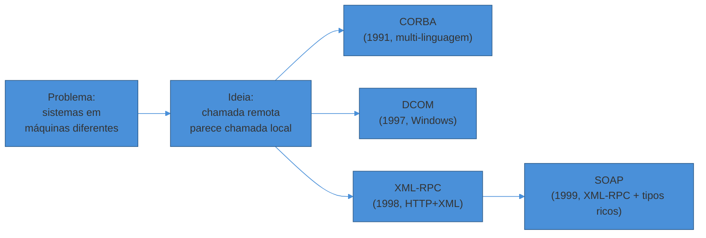
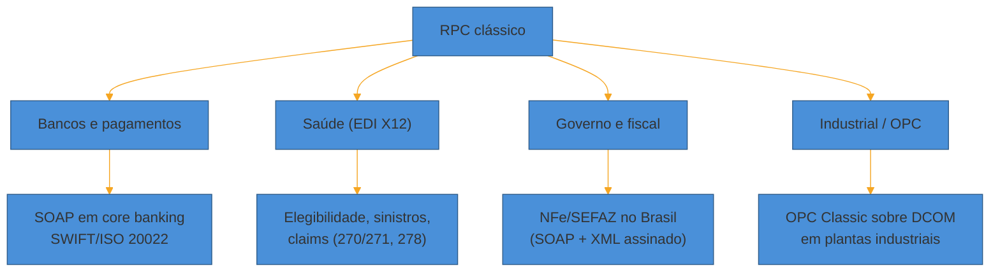

# RPC clássico e por que caiu

> [!abstract] TL;DR
> Antes do REST virar o default da indústria, sistemas distribuídos conversavam por **RPC clássico**: CORBA e DCOM tentaram fazer objetos remotos parecerem objetos locais; XML-RPC e SOAP tentaram fazer o mesmo por cima de HTTP e XML. Todos caíram pelo mesmo motivo — **acoplamento forte entre cliente e servidor** (mudou o contrato de um lado, quebrou o outro) somado a **complexidade de implementação** que crescia mais rápido que o valor entregue. Mas "caiu" não significa "sumiu": SOAP ainda move volumes bilionários por dia em pagamentos bancários (SWIFT, sistemas core), EDI baseado em X12/EDIFACT continua sendo a espinha dorsal de varejo e saúde nos EUA, e no Brasil toda Nota Fiscal Eletrônica passa por um webservice SOAP da SEFAZ. Reconhecer esses sistemas — não achar que são curiosidade de museu — é parte do ofício de quem trabalha com legado.

Um desenvolvedor pleno entra num projeto de integração bancária. A tarefa: consumir um endpoint que autoriza uma transferência TED. Ele abre a documentação esperando um `curl` de exemplo e um JSON de resposta. Em vez disso, encontra um arquivo `.wsdl` de 40KB, um exemplo de requisição em XML com um `<soapenv:Envelope>` cheio de namespaces, e uma nota de rodapé dizendo que a autenticação usa um certificado digital assinado dentro do próprio XML, seguindo uma especificação chamada WS-Security.

Ele nunca tinha visto aquilo. Passou a carreira inteira desenhando e consumindo APIs REST. A reação mais comum, nesse momento, é achar que caiu numa relíquia — algo que "ninguém mais usa" e que só sobrevive porque "o banco é lento para modernizar".

A segunda parte está certa. A primeira, não. O banco não está sendo lento por preguiça: aquele endpoint SOAP roda há 15 anos, processa milhões de transações sem nunca ter caído, e trocar o contrato significaria recertificar toda uma cadeia de parceiros que dependem dele. Entender **por que essa tecnologia existe, por que ela perdeu a corrida do mercado geral e por que continua rodando exatamente onde ainda roda** é o que separa quem trava diante de um `.wsdl` de quem reconhece o terreno e segue trabalhando.

Esta nota é sobre isso: a linha do tempo do RPC clássico — CORBA, DCOM, XML-RPC, SOAP/WSDL —, o motivo técnico de cada queda, e o mapa de onde cada um ainda está vivo em produção hoje.

## O problema que o RPC clássico tentou resolver

Antes de julgar essas tecnologias, vale entender o problema real que motivou sua criação. Nos anos 1990, sistemas corporativos começaram a se espalhar por múltiplas máquinas — não por moda, mas por necessidade: um servidor não aguentava a carga, ou partes do sistema rodavam em plataformas diferentes (um mainframe aqui, uma estação Unix ali, um servidor Windows acolá).

O programador que já sabia chamar uma função local — `calcularJuros(valor, taxa)` — queria continuar escrevendo código parecido, mesmo que `calcularJuros` agora rodasse em outra máquina, talvez em outra linguagem. A promessa do **RPC (Remote Procedure Call)** era exatamente essa: fazer uma chamada remota *parecer* uma chamada local, escondendo a rede atrás de uma interface familiar.

Essa promessa — "transparência de localização" — é o fio que conecta CORBA, DCOM, XML-RPC e, em menor grau, SOAP. E é também, como veremos, a raiz do problema que os derrubou.



> [!question]- RPC não é a mesma coisa que gRPC ou tRPC, que são "modernos"?
> É a mesma *ideia* — chamar uma função remota como se fosse local — mas implementações muito diferentes. gRPC (que a nota seguinte deste sub-galho cobre) resolve o mesmo problema com Protocol Buffers binários sobre HTTP/2, versionamento pensado desde o design e streaming nativo. A diferença não é "RPC é ruim, REST é bom" — é que as implementações *clássicas* de RPC (CORBA, DCOM, SOAP) cometeram erros específicos de acoplamento e complexidade que as gerações seguintes tentaram corrigir. gRPC é, tecnicamente, RPC — só que aprendeu com os erros do CORBA.

## CORBA: o sonho da interoperabilidade universal

**CORBA** (Common Object Request Broker Architecture) nasceu em 1991, mantida pela OMG (Object Management Group), um consórcio de mais de 700 empresas. A ambição era gigantesca: permitir que objetos escritos em C++, Java, Smalltalk, Ada ou qualquer outra linguagem conversassem entre si, rodando em qualquer sistema operacional, através de uma camada chamada **ORB (Object Request Broker)**.

O mecanismo central era o **IDL (Interface Definition Language)** — uma linguagem neutra para descrever a interface de um objeto remoto, da qual compiladores geravam stubs (do lado cliente) e skeletons (do lado servidor) automaticamente. Debaixo do capô, a comunicação viajava pelo protocolo **IIOP (Internet Inter-ORB Protocol)**.

Na década de 1990, isso era revolucionário. Sistemas de telecomunicações, bilhetagem de operadoras móveis, controle de tráfego aéreo e plataformas financeiras adotaram CORBA em escala — alguns processando milhões de mensagens por segundo.

### Por que CORBA caiu

A queda do CORBA é bem documentada — inclusive por gente de dentro do próprio ecossistema, como o artigo "The Rise and Fall of CORBA" (Michi Henning, *ACM Queue*, 2006), referência canônica sobre o tema. Os motivos se acumulam:

- **Complexidade da especificação.** A especificação do CORBA cresceu a ponto de boa parte dela nunca ter sido sequer implementada em produção — nem como prova de conceito. Implementar um object adapter completo exigia mais de 200 linhas de definição de interface para algo que hoje se resolveria em 30.
- **Curva de aprendizado íngreme.** Entender IDL, ORBs, POA (Portable Object Adapter), e a miríade de serviços CORBA (Naming Service, Trading Service, Transaction Service...) exigia meses de investimento antes de qualquer produtividade real.
- **Interoperabilidade que prometia mais do que entregava.** Apesar do nome "Common", ORBs de fornecedores diferentes frequentemente não conversavam entre si sem trabalho extra — o problema que CORBA prometia resolver reapareceu dentro do próprio CORBA.
- **Lacunas de segurança e versionamento.** A especificação original tratou segurança como reboque tardio, e evoluir uma interface sem quebrar clientes existentes era doloroso — o mesmo problema de acoplamento que veremos se repetir em DCOM e SOAP.
- **Alto custo de licenciamento** dos ORBs comerciais, num momento em que XML e a web emergente ofereciam alternativas mais baratas e simples.

> [!warning] O erro estrutural: transparência de localização vira acoplamento forte
> **O que acontece:** o objeto remoto parece, ao programador, idêntico a um objeto local — a rede está "escondida". **Por quê:** essa ilusão falha exatamente quando mais importa. Uma chamada de rede pode falhar de formas que uma chamada local nunca falha (timeout, partição, servidor fora do ar) — e o modelo de programação não deixa isso visível. Pior: para o cliente continuar funcionando, a interface do lado servidor não pode mudar de forma incompatível. Isso trava as duas pontas juntas — mudar servidor exige recompilar/religar clientes. É o oposto do desacoplamento que sistemas distribuídos deveriam buscar. **Como evitar (lição que a indústria levou adiante):** tornar a rede explícita no modelo (REST com HTTP como protocolo de primeira classe, gRPC com contratos versionáveis via Protobuf) em vez de escondê-la atrás de uma chamada de função disfarçada.

### Onde o CORBA ainda respira

CORBA não desapareceu — ele se retirou para os lugares onde reescrever custa mais do que manter. Sistemas de **telecomunicações** (bilhetagem — BSCS de operadoras móveis), **controle de tráfego aéreo**, **defesa e aeroespacial**, e alguns **sistemas financeiros de alta frequência** ainda rodam núcleos CORBA — porque foram construídos décadas atrás para operar em tempo real com garantias que a época só o CORBA oferecia, e a migração é cara e arriscada demais para sistemas que não podem falhar.

Um sinal simbólico da queda: em 2017, a JEP 320 removeu os módulos Java EE e CORBA do próprio JDK (Java 11) — depois de décadas embutidos na linguagem. A linha oficial da OpenJDK foi direta: "não há interesse significativo em desenvolver aplicações modernas com CORBA em Java."

## DCOM: a resposta da Microsoft, presa ao próprio ecossistema

Enquanto CORBA tentava ser universal, a Microsoft seguiu caminho próprio. **DCOM (Distributed Component Object Model)**, lançado em 1997, estendeu o **COM** (Component Object Model, de 1993) para permitir que componentes conversassem através da rede — não só dentro do mesmo processo ou máquina.

A ideia era a mesma do CORBA (objetos remotos parecendo locais), mas o escopo era deliberadamente mais estreito: DCOM foi construído para o ecossistema Windows, com forte integração a ferramentas como Visual Basic e Delphi, e adoção real em automação industrial (SCADA/OPC), administração remota via MMC (Microsoft Management Console) e sistemas corporativos internos.

### Por que DCOM caiu

O motivo é quase o oposto do CORBA — não foi complexidade universal demais, foi **escopo estreito demais**: DCOM foi construído para comunicar apenas com aplicações Windows/.NET, o que o tornava inadequado para ambientes heterogêneos — justamente o cenário que passou a dominar conforme a internet e sistemas multiplataforma se tornaram norma. Some a isso a complexidade notória de configurar segurança e portas de rede do DCOM (o protocolo negociava portas dinamicamente, um pesadelo para firewalls corporativos), e o terreno ficou fértil para alternativas mais simples.

A própria Microsoft substituiu DCOM em etapas: primeiro por **.NET Remoting** (2002, junto com o .NET Framework 1.0), depois por **WCF (Windows Communication Foundation)** a partir do .NET Framework 3.0 — que unificou RPC, mensageria e serviços web numa única API configurável. A documentação oficial da Microsoft hoje recomenda WCF como "a escolha segura e recomendada" no lugar de DCOM para chamadas gerenciadas entre servidores.

### Onde o DCOM ainda respira

DCOM sobrevive principalmente em **automação industrial** — protocolos como **OPC Classic** (usado para conectar sistemas SCADA e históricos industriais) dependem de DCOM até hoje, e atualizações de segurança do Windows seguem quebrando conectividade OPC remota em plantas industriais que não migraram para OPC UA (o sucessor, que abandona DCOM). Também aparece em ferramentas de **administração remota legada do Windows Server** e em aplicações corporativas internas antigas que nunca foram portadas.

> [!question]- Se DCOM e CORBA morreram, por que estudar os dois em vez de só o que substituiu?
> Porque reconhecer o *padrão* importa mais do que decorar a tecnologia específica. Quando você encontra qualquer sistema com "objeto remoto que parece objeto local", acoplamento forte de versão entre cliente e servidor, e um IDL/contrato binário proprietário — está diante de uma variação do mesmo problema que CORBA e DCOM tentaram resolver e acabaram sofrendo. Isso ajuda a diagnosticar rápido, mesmo em tecnologias que você nunca viu de perto: "ah, isso é RPC clássico, o acoplamento vai ser o problema aqui."

## XML-RPC: o RPC que aprendeu a falar HTTP

Enquanto CORBA e DCOM lutavam com protocolos binários proprietários, **Dave Winer**, da UserLand Software, propôs algo mais simples em 1998: por que não fazer RPC usando **HTTP como transporte** e **XML como formato de dados** — coisas que já atravessavam firewalls corporativos sem drama, ao contrário de IIOP ou DCOM?

O **XML-RPC** nasceu dessa ideia — uma especificação enxuta (cabe em poucas páginas) onde uma chamada remota vira um POST HTTP com um corpo XML descrevendo o método e os parâmetros, e a resposta vem no mesmo formato. Um exemplo ilustrativo de uma chamada XML-RPC:

```xml
POST /RPC2 HTTP/1.1
Host: exemplo.com
Content-Type: text/xml

<?xml version="1.0"?>
<methodCall>
  <methodName>examples.getTemperatura</methodName>
  <params>
    <param><value><string>Sao Paulo</string></value></param>
  </params>
</methodCall>
```

E a resposta:

```xml
<?xml version="1.0"?>
<methodResponse>
  <params>
    <param><value><double>24.5</double></value></param>
  </params>
</methodResponse>
```

Simples, legível, e — crucialmente — **transportável por qualquer infraestrutura HTTP existente**, incluindo proxies e firewalls corporativos que já liberavam a porta 80. Foi um salto real de simplicidade sobre CORBA e DCOM.

### Por que XML-RPC praticamente sumiu

XML-RPC não morreu por ser ruim — morreu por ser **rápido demais superado**. A própria Microsoft, junto com Dave Winer, Don Box e outros, ampliou o design do XML-RPC quase imediatamente para criar o **SOAP**, adicionando tipos de dados mais ricos, extensibilidade via cabeçalhos, e independência de transporte (não só HTTP). SOAP evoluiu do subconjunto de tipos do XML-RPC — e, com o peso do consórcio W3C e o apoio corporativo de IBM e Microsoft, tornou-se o sucessor de fato quase da noite para o dia.

### Onde o XML-RPC ainda respira

O exemplo mais visível é o próprio **WordPress**: o arquivo `xmlrpc.php`, presente desde as primeiras versões da plataforma, continua no núcleo do software até hoje — mantido por retrocompatibilidade, para sites e integrações antigas que nunca migraram para a REST API introduzida no WordPress 4.4 (2015). A documentação oficial da plataforma reconhece que os casos de uso originais praticamente desapareceram, mas o arquivo permanece ativo por padrão — o que, inclusive, virou um vetor comum de ataques de força bruta e abuso do método `system.multicall`, motivo pelo qual desabilitar `xmlrpc.php` é recomendação padrão de segurança para sites que não precisam dele.

Fora do WordPress, XML-RPC sobrevive pontualmente em sistemas de blogging mais antigos, alguns clientes de CMS legados, e integrações internas que nunca foram atualizadas — mas seu papel como padrão de mercado foi inteiramente absorvido pelo próprio sucessor que ele engendrou.

## SOAP e WSDL: o auge e o peso da stack WS-*

**SOAP** (Simple Object Access Protocol — o nome ficou irônico com o tempo, porque "simples" é a última palavra que descreveria a stack completa) foi submetido ao W3C em 2000 e rapidamente se tornou o padrão dominante de web services corporativos ao longo dos anos 2000.

A diferença central para o XML-RPC: SOAP separou a *mensagem* (o envelope XML) da *descrição do serviço*. Essa descrição vive num arquivo **WSDL (Web Services Description Language)** — um contrato formal, também em XML, que especifica cada operação disponível, os tipos de dados esperados, e como a mensagem deve ser transportada.

### Anatomia de um contrato SOAP/WSDL

Um WSDL tem cinco peças principais:

- `<types>` — os tipos de dados usados, geralmente descritos com XML Schema (XSD).
- `<message>` — a forma de cada mensagem de entrada e saída.
- `<portType>` — o conjunto de operações disponíveis (o "quê" o serviço faz).
- `<binding>` — como cada operação é transportada de fato (o protocolo concreto — normalmente SOAP sobre HTTP).
- `<service>` — o endereço físico (URL) onde o serviço pode ser acessado.

Um trecho ilustrativo de uma operação simples num WSDL:

```xml
<portType name="ConsultaSaldoPortType">
  <operation name="consultarSaldo">
    <input message="tns:ConsultaSaldoRequest"/>
    <output message="tns:ConsultaSaldoResponse"/>
  </operation>
</portType>

<binding name="ConsultaSaldoBinding" type="tns:ConsultaSaldoPortType">
  <soap:binding style="document" transport="http://schemas.xmlsoap.org/soap/http"/>
  <operation name="consultarSaldo">
    <soap:operation soapAction="urn:consultarSaldo"/>
    <input><soap:body use="literal"/></input>
    <output><soap:body use="literal"/></output>
  </operation>
</binding>
```

E a mensagem SOAP real, trocada em tempo de execução, é envelopada assim:

```xml
<soapenv:Envelope xmlns:soapenv="http://schemas.xmlsoap.org/soap/envelope/">
  <soapenv:Header>
    <!-- metadados: segurança, transação, roteamento -->
  </soapenv:Header>
  <soapenv:Body>
    <consultarSaldo xmlns="urn:exemplo:banco">
      <numeroConta>00123-4</numeroConta>
    </consultarSaldo>
  </soapenv:Body>
</soapenv:Envelope>
```

Repare na estrutura: **Envelope** (obrigatório, delimita a mensagem inteira), **Header** (opcional, carrega metadados como autenticação e transação), e **Body** (obrigatório, carrega o dado de fato) — mais um elemento **Fault** opcional para erros. É essa separação entre header e body que deu ao SOAP seu maior trunfo *e* seu maior peso: o header virou o lar de toda uma família de especificações adicionais, coletivamente chamadas de **WS-\*** — WS-Security, WS-Addressing, WS-ReliableMessaging, WS-AtomicTransaction, WS-Policy e dezenas de outras, cada uma resolvendo uma preocupação específica (segurança, confiabilidade, transações distribuídas) por cima do envelope básico.

### Por que SOAP e a stack WS-* caíram do favoritismo

A resposta tem duas camadas — uma técnica, outra de mercado.

**Camada técnica: peso e rigidez.**
- O formato XML é verboso por natureza — mensagens SOAP costumam ser significativamente maiores que o JSON equivalente, e em alguns benchmarks o overhead de parsing chega a reduzir o throughput a menos da metade do de REST sob carga comparável.
- **WS-Security**, o pilar de autenticação/criptografia da stack, adiciona overhead sério: assinatura e criptografia XML aumentam o tamanho da mensagem e exigem mais CPU e memória para processar — e depurar uma mensagem assinada ou criptografada que falhou é notoriamente difícil.
- Coordenar múltiplas especificações WS-\* interdependentes (WS-Policy definindo requisitos que WS-Security precisa cumprir, que por sua vez interage com WS-Addressing...) produzia configurações frágeis, difíceis de manter à medida que os sistemas evoluíam.
- Gerar e consumir clientes SOAP em algumas linguagens exigia construir XML manualmente — e SOAP é notoriamente intolerante a erros de formatação, ao contrário da leniência que REST/JSON cultivou.

**Camada de mercado: o custo não compensava para a maioria dos casos.** A internet que emergiu nos anos 2000 não era majoritariamente feita de integrações bancárias de alta segurança — era feita de aplicações web comuns, mobile emergente, e APIs públicas simples. Para esse universo, a verbosidade e a complexidade de configuração do SOAP eram custo puro, sem benefício correspondente. REST, com HTTP simples e JSON leve, ofereceu 80% do valor com 20% do esforço — e a indústria migrou em massa.

> [!warning] Confundir "simples de usar" com "sem trade-off"
> **O que acontece:** times descartam SOAP inteiramente como "tecnologia ruim" e tentam forçar REST em cenários que exigem exatamente o que SOAP oferece — contratos rigorosamente tipados, transações distribuídas, e segurança de mensagem ponta a ponta (não só transporte). **Por quê:** REST puro não tem um equivalente nativo e padronizado para transações distribuídas multi-recurso ou para assinatura granular de partes específicas de uma mensagem (em vez de só criptografar o canal com TLS). Esses requisitos não desapareceram — só ficaram menos comuns fora de setores regulados. **Como evitar:** perguntar qual problema o WS-\* resolvia antes de descartá-lo. Se a resposta é "meu sistema também precisa disso", talvez a solução moderna equivalente (ex.: Saga para transações distribuídas, JWS/JWE para assinatura de payload) seja o caminho — não simplesmente "trocar por REST e não pensar mais nisso".

## As quatro tecnologias lado a lado

Antes de mapear onde cada uma sobrevive, ajuda ver as quatro juntas — porque a comparação revela um padrão comum por trás de motivos aparentemente distintos de queda.

| | CORBA (1991) | DCOM (1997) | XML-RPC (1998) | SOAP (1999-2000) |
|---|---|---|---|---|
| **Transporte** | IIOP (binário, próprio) | RPC do Windows (proprietário) | HTTP | HTTP (majoritariamente), SMTP, JMS |
| **Formato de dados** | Binário (CDR) | Binário (proprietário) | XML | XML |
| **Contrato** | IDL | Type library COM | Nenhum formal | WSDL |
| **Alcance** | Multi-linguagem, multi-SO | Windows/.NET | Qualquer stack com HTTP | Qualquer stack com HTTP |
| **Motivo central da queda** | Complexidade da especificação, curva de aprendizado | Escopo estreito (só Windows), config. de firewall dolorosa | Superado quase de imediato pelo próprio sucessor (SOAP) | Verbosidade XML + peso da stack WS-\* |
| **Onde sobrevive hoje** | Telecom, defesa, aviação, sistemas de tempo real legados | Automação industrial (OPC Classic), admin remota legada | WordPress (`xmlrpc.php`, retrocompatibilidade) | Banking, EDI de saúde, fiscal (NFe/SEFAZ), seguradoras |

Note o padrão: em três das quatro linhas, o motivo de queda é uma combinação de **complexidade de implementação** e **acoplamento rígido de contrato**. É esse padrão duplo — não uma falha isolada de cada tecnologia — que a geração seguinte (REST, e mais tarde gRPC) atacou de frente.

> [!question]- SOAP 1.1 e SOAP 1.2 são a mesma coisa?
> Não exatamente, mas para efeito de reconhecimento em produção, tratam-se como a mesma família. SOAP 1.1 foi a versão que popularizou o padrão nos anos 2000; SOAP 1.2, padronizada pelo W3C em 2003, corrigiu inconsistências e formalizou a especificação — por exemplo, mudando o namespace do envelope e clarificando a semântica de binding HTTP. Sistemas mais novos (como o webservice da SEFAZ brasileira) usam 1.2; muitos sistemas legados mais antigos ainda falam 1.1. Na prática, um cliente SOAP bem escrito lida com as pequenas diferenças de namespace sem drama — o modelo mental (Envelope/Header/Body, WSDL como contrato) é idêntico nas duas versões.

## Armadilhas comuns ao encontrar RPC clássico em produção

> [!warning] Tentar "modernizar" sem entender por que ainda está lá
> **O que acontece:** um time novo herda um sistema com integração SOAP ou EDI e propõe substituí-la por REST/JSON como primeira ação, sem investigar o motivo da escolha original. **Por quê:** confunde "tecnologia antiga" com "decisão errada". Em setores regulados, o contrato rígido do SOAP/EDI muitas vezes *é* o requisito — auditoria, conformidade, certificação de segurança de mensagem — não um acidente histórico. **Como evitar:** perguntar por que a decisão foi tomada antes de propor trocá-la. Se a resposta for "era o único padrão maduro disponível na época" e nada mais amarra o sistema a ela, migração é viável. Se a resposta envolver conformidade regulatória ou um parceiro externo que só fala aquele protocolo, o caminho costuma ser um adaptador (uma camada REST/gRPC por cima do SOAP existente), não uma reescrita.

> [!warning] Ignorar o WSDL e tentar "adivinhar" o contrato
> **O que acontece:** o desenvolvedor lê alguns exemplos de request/response e tenta replicar o XML manualmente, ignorando o arquivo `.wsdl` disponível. **Por quê:** SOAP é notoriamente intolerante a erros de formatação — um namespace errado, uma tag na ordem trocada, e o serviço simplesmente rejeita a chamada com uma mensagem de erro pouco clara. **Como evitar:** usar o `.wsdl` para gerar o cliente automaticamente (a maioria das linguagens tem ferramentas para isso — `wsimport` em Java, `svcutil` em .NET, bibliotecas como Zeep em Python). O WSDL existe exatamente para eliminar esse tipo de adivinhação — ignorá-lo joga fora o principal benefício do formato.

> [!warning] Achar que "sistema com SOAP" implica "sistema mal escrito"
> **O que acontece:** o julgamento de que a tecnologia é datada se transfere, sem base, para a qualidade da engenharia por trás dela. **Por quê:** um sistema bancário rodando SOAP há 15 anos sem incidente de disponibilidade é, por definição, mais confiável em produção do que a maioria dos sistemas REST lançados no último ano. A idade da tecnologia de contrato não mede a qualidade da implementação. **Como evitar:** avaliar o sistema pelos seus próprios indicadores (uptime, taxa de erro, tempo de resposta) antes de emitir julgamento sobre a stack. Muitas vezes o código ao redor do SOAP é que precisa de atenção — não o protocolo em si.

## Onde o RPC clássico ainda está — de verdade — em produção

Esta é a parte que mais importa para quem trabalha com sistemas reais: **"legado" não é sinônimo de "morto"**. Reconhecer os lugares onde essas tecnologias seguem vivas evita dois erros opostos — tratá-las como curiosidade histórica inútil, ou tentar "modernizar" algo que está funcionando bem exatamente como é.



**Bancos e pagamentos.** SOAP continua movendo cerca de US$ 9 trilhões por dia em transações bancárias, segundo levantamentos de mercado recentes — e cerca de 15% das APIs em bancos, saúde e sistemas ERP ainda são baseadas em SOAP, com aproximadamente 55% das grandes organizações mantendo sistemas SOAP rodando lado a lado com tecnologias mais novas. A rede **SWIFT**, que conecta milhares de instituições financeiras globalmente para troca de instruções de pagamento, usava até novembro de 2025 o formato legado **MT (Message Type)** — uma estrutura de campos fixos que, embora não seja SOAP, é prima do mesmo período histórico e compartilha a mesma lógica de contrato rígido. A migração para o padrão mais flexível **ISO 20022** concluiu em novembro de 2025 — mas note o prazo: uma migração dessa magnitude, num sistema crítico global, levou quase duas décadas de planejamento até o "sunset" oficial do formato antigo. É a escala de tempo real da mudança de contrato em sistemas financeiros críticos.

**Saúde nos EUA.** O padrão **X12**, mandatado pelo HIPAA desde 1996, continua sendo a espinha dorsal de transações administrativas de saúde nos Estados Unidos — elegibilidade (270/271), autorização (278), sinistros. Em 2025, o X12 lançou uma atualização de especificação (008060), mas a versão 005010 continua sendo a mandatada oficialmente, porque a adoção formal via regulamentação federal é um processo de vários anos. Não é exagero dizer que, para qualquer engenheiro que trabalhe com integrações de saúde nos EUA, entender EDI/X12 é tão essencial quanto entender REST.

**Comércio B2B e cadeias de suprimento.** Fora da saúde, o **EDI** tradicional (X12 na América do Norte, **EDIFACT** predominando na Europa e Ásia) continua sendo o padrão de fato para pedidos, faturas e avisos de embarque entre grandes varejistas e seus fornecedores — Walmart, Target, Amazon e Home Depot, por exemplo, seguem exigindo X12 850/856/810 de todos os fornecedores. O mercado de ferramentas EDI, longe de encolher, segue em expansão — estimado em crescer de cerca de US$ 2 bilhões em 2023 para mais de US$ 4,5 bilhões até 2030.

**Governo e sistemas fiscais — o caso brasileiro.** Todo emissor de **Nota Fiscal Eletrônica (NFe)** no Brasil interage com a SEFAZ através de um **webservice SOAP 1.2**: o XML da nota é assinado digitalmente com certificado ICP-Brasil, enviado dentro de um envelope SOAP para o serviço `NfeAutorizacao`, e a SEFAZ retorna um protocolo de autorização (ou rejeição) num formato de resposta também SOAP/XML. É um sistema fiscal que processa bilhões de documentos por ano, construído sobre exatamente a stack que este texto descreve como "em declínio" — porque, no momento em que foi desenhado (final dos anos 2000), SOAP *era* o padrão corporativo maduro disponível, e trocar hoje significaria recertificar a infraestrutura fiscal de milhões de empresas.

**Automação industrial.** Como visto na seção sobre DCOM, o protocolo **OPC Classic** — usado para conectar sistemas SCADA, históricos de processo e controladores industriais — depende de DCOM até hoje em plantas que não migraram para o sucessor OPC UA, que abandona a dependência do DCOM.

> [!question]- Por que essas organizações simplesmente não migram?
> Três motivos que se combinam, e nenhum é "preguiça": **(1) custo de recertificação** — em setores regulados, qualquer mudança de contrato de integração pode exigir nova homologação com dezenas ou centenas de parceiros, cada um no seu próprio ritmo; **(2) risco assimétrico** — o sistema atual processa bilhões de reais/dólares sem incidentes; uma migração mal executada tem faixa de risco muito maior que o ganho de "modernizar"; **(3) efeito de rede** — trocar o protocolo de um lado só ajuda se todos os parceiros trocarem junto, e coordenar essa troca entre milhares de instituições independentes (como no caso do SWIFT) leva anos de planejamento formal, não um sprint de time. A migração do SWIFT MT para ISO 20022, por exemplo, foi anunciada com quase 20 anos de antecedência formal antes do sunset em 2025.

## Em entrevista

Em entrevistas de nível sênior, RPC clássico raramente é o tema central — mas aparece de duas formas indiretas, e ambas separam quem só conhece o hype atual de quem entende o arco histórico.

A primeira é a **pergunta de reconhecimento de legado**: "você já trabalhou com algum sistema que usa SOAP/EDI/algo mais antigo? Como você lidou com isso?" Aqui, o entrevistador não está testando se você sabe implementar SOAP do zero — está testando se você trava de pânico diante de tecnologia desconhecida ou se sabe navegar um `.wsdl`, reconhecer os padrões (envelope, contrato rígido, versionamento difícil) e trabalhar produtivamente mesmo fora da sua zona de conforto. Um sênior de verdade demonstra que consegue aprender a forma de qualquer contrato — REST, SOAP, gRPC, EDI — porque entende o *padrão* por trás de cada um, não decorou só um deles.

A segunda é a **pergunta de justificativa de escolha arquitetural**: "por que você escolheria REST em vez de RPC/SOAP aqui?" (ou o inverso). A resposta fraca é "porque SOAP é velho e REST é moderno". A resposta forte nomeia o trade-off real: acoplamento de contrato, overhead de payload, necessidade (ou não) de segurança de mensagem ponta a ponta, maturidade das ferramentas do ecossistema-alvo. Se o cenário envolve integração B2B regulada com um parceiro que só fala SOAP — a resposta correta às vezes é "eu implementaria um adaptador SOAP", não "eu convenceria o parceiro a migrar para REST". Reconhecer quando a decisão certa é *se adaptar ao legado* em vez de lutar contra ele é, paradoxalmente, um sinal de senioridade — o oposto de rejeitar tecnologia antiga por reflexo.

> [!question]- Isso significa que eu deveria aprender a implementar SOAP/CORBA a fundo para entrevista?
> Não — e essa não é a proposta desta nota. O sinal que interessa é *reconhecimento*, não *fluência de implementação*. Saber que um `.wsdl` define contrato e binding, que um envelope SOAP separa header (metadados/segurança) de body (dado), e que "legado" muitas vezes significa "crítico e bem testado", não "ruim" — isso já cobre o que uma entrevista sênior espera. Implementação profunda de SOAP/CORBA é um investimento de tempo que só vale a pena se o seu trabalho específico exigir (ex.: manutenção de core banking, integração de saúde nos EUA).

## Como explicar em inglês

Classic RPC — CORBA, DCOM, XML-RPC, SOAP — tried to make a remote call feel exactly like a local function call. That transparency was the whole appeal, and also the root failure: it hid the network, but hid the network's failure modes too, and it tightly coupled client and server around a rigid contract that was expensive to evolve.

None of these technologies "died" in the sense of disappearing from production. SOAP still routes an estimated $9 trillion a day in banking transactions. Healthcare EDI (X12) is mandated by HIPAA and still processes eligibility and claims transactions across the US. In Brazil, every electronic invoice (NFe) goes through a SOAP webservice at the tax authority. Recognizing these systems in a legacy codebase — instead of assuming they're dead curiosities — is part of being a senior engineer who can actually operate in the real world, not just in greenfield projects.

| PT | EN |
|----|----|
| RPC clássico | Classic RPC |
| Acoplamento forte | Tight coupling |
| Transparência de localização | Location transparency |
| Contrato de serviço | Service contract |
| Envelope (SOAP) | Envelope |
| Legado / sistema legado | Legacy system |
| Integração B2B | B2B integration |
| Retrocompatibilidade | Backward compatibility |
| Sistema crítico / de missão crítica | Mission-critical system |
| Modernização (de sistema legado) | Modernization |

## O que vem a seguir

O RPC clássico caiu porque acoplava demais e pesava demais — mas a pergunta que ficou em aberto foi "o que substitui isso, e por quê?". A próxima nota deste sub-galho mostra como **REST venceu como o novo default**, e por que **GraphQL** e **gRPC** surgiram depois, cada um resolvendo um problema específico que o REST não cobria bem (over-fetching de dados e performance de comunicação interna, respectivamente) — completando o arco que começou aqui.

- [[03 - A era REST, GraphQL, gRPC]] — por que REST venceu o mercado geral, e o que motivou GraphQL e gRPC a existirem como respostas específicas
- [[01 - O que é o contrato de comunicação]] — o conceito de contrato e acoplamento que esta nota aplicou historicamente ao RPC clássico

## Veja também

- [[Comunicação entre Sistemas/index|Comunicação entre Sistemas]] — o galho-pai desta trilha
- [[Mensageria/index|Mensageria]] — quando o contrato passa a ser assíncrono (fila/evento em vez de chamada síncrona), incluindo JMS e ESB, os primos enterprise do RPC clássico do lado da mensageria
- [[Arquitetura de Software]] — os estilos arquiteturais que sucederam a arquitetura orientada a objetos distribuídos do CORBA/DCOM

## Fontes

- **Michi Henning** — [*The Rise and Fall of CORBA*](https://cacm.acm.org/practice/the-rise-and-fall-of-corba/), ACM Queue, 2006 — análise técnica canônica dos motivos da queda do CORBA, escrita por alguém do próprio ecossistema.
- **OpenJDK** — [*JEP 320: Remove the Java EE and CORBA Modules*](https://openjdk.org/jeps/320) — remoção oficial dos módulos CORBA do Java 11 (2018), marco simbólico do declínio.
- **Microsoft Learn** — [*How to: Migrate Managed-Code DCOM to WCF*](https://learn.microsoft.com/en-us/dotnet/framework/interop/how-to-migrate-managed-code-dcom-to-wcf) — orientação oficial da Microsoft sobre a sucessão DCOM → .NET Remoting → WCF.
- **Wikipedia** — [*XML-RPC*](https://en.wikipedia.org/wiki/XML-RPC) e [*SOAP*](https://en.wikipedia.org/wiki/SOAP) — histórico de criação por Dave Winer (1998) e evolução para SOAP com Microsoft/IBM.
- **WordPress Developer Resources** — [*XML-RPC*](https://developer.wordpress.org/apis/xml-rpc/) e [*A Complete Guide on xmlrpc.php*](https://kinsta.com/blog/xmlrpc-php/), Kinsta, 2024 — sobrevivência do XML-RPC como retrocompatibilidade no WordPress.
- **W3C** — [*Web Services Description Language (WSDL) 1.1*](https://www.w3.org/TR/wsdl.html) — especificação formal de referência para a estrutura do WSDL.
- **Wikipedia** — [*WS-Security*](https://en.wikipedia.org/wiki/WS-Security) — origem (OASIS, IBM/Microsoft/VeriSign, 2002) e overhead de processamento da especificação.
- **DreamFactory** — [*45 SOAP to REST Conversion Statistics*](https://www.dreamfactory.com/hub/soap-to-rest-conversion-statistics), 2025 — estatísticas de mercado sobre a proporção SOAP/REST em setores regulados (banking, healthcare, ERP).
- **Stedi** — [*X12 HIPAA EDI Standard*](https://www.stedi.com/edi/hipaa) e **X12.org** — [*X12: Key Standards 2026 Updates*](https://ediacademy.com/blog/x12-key-standards-2026-updates/) — status do mandato HIPAA sobre X12 e atualização de especificação 008060/005010.
- **CCN.com** — [*Goodbye MT Format — SWIFT Retires Legacy Payments in Favor of ISO 20022*](https://www.ccn.com/news/technology/swift-retires-met-format-iso20022-migration-complete/), novembro de 2025 — conclusão da migração SWIFT MT → ISO 20022.
- **PaymentExpert** — [*Swift's ISO 20022 cutover: The end of MT and a 20-year promise*](https://paymentexpert.com/2025/11/21/swifts-iso-20022-cutover-the-end-of-mt-and-a-20-year-promise/), novembro de 2025 — escala de tempo da migração de um sistema financeiro crítico global.
- **BoldVan** — [*EDIFACT vs ANSI X12*](https://www.boldvan.com/blog/edifact-vs-ansi-x12-the-real-differences-that-impact-global-manufacturers/) — domínio regional de X12 (América do Norte) vs EDIFACT (Europa/Ásia) e uso por grandes varejistas.
- **Portal Nacional da NF-e (SEFAZ)** — [*Serviços Web NFE*](https://www.nfe.fazenda.gov.br/portal/webServices.aspx) e *Manual de Integração do Contribuinte* — especificação oficial do webservice SOAP 1.2 usado para autorização de Notas Fiscais Eletrônicas no Brasil.
- **Software Toolbox** — [*What is DCOM and Why Does It Matter for OPC?*](https://softwaretoolbox.com/resources/what-is-dcom) — sobrevivência do DCOM em automação industrial via OPC Classic.
