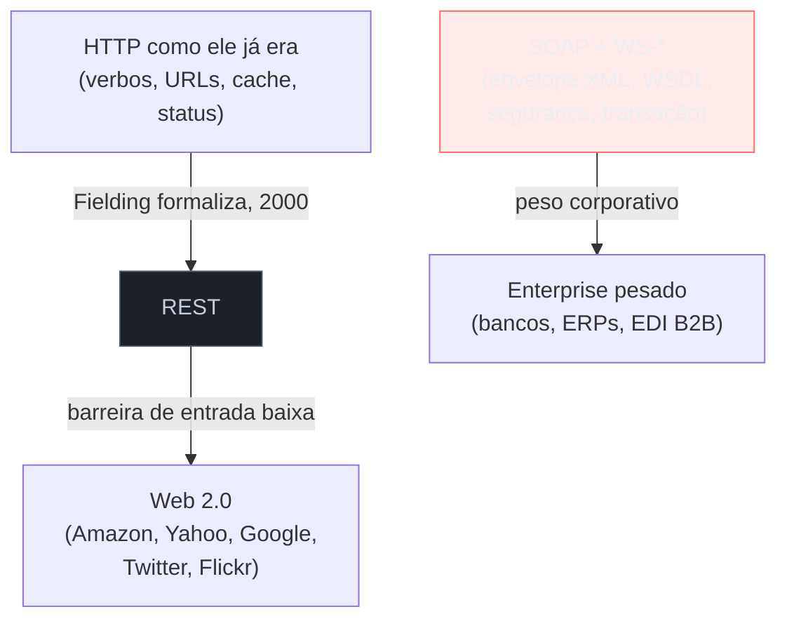
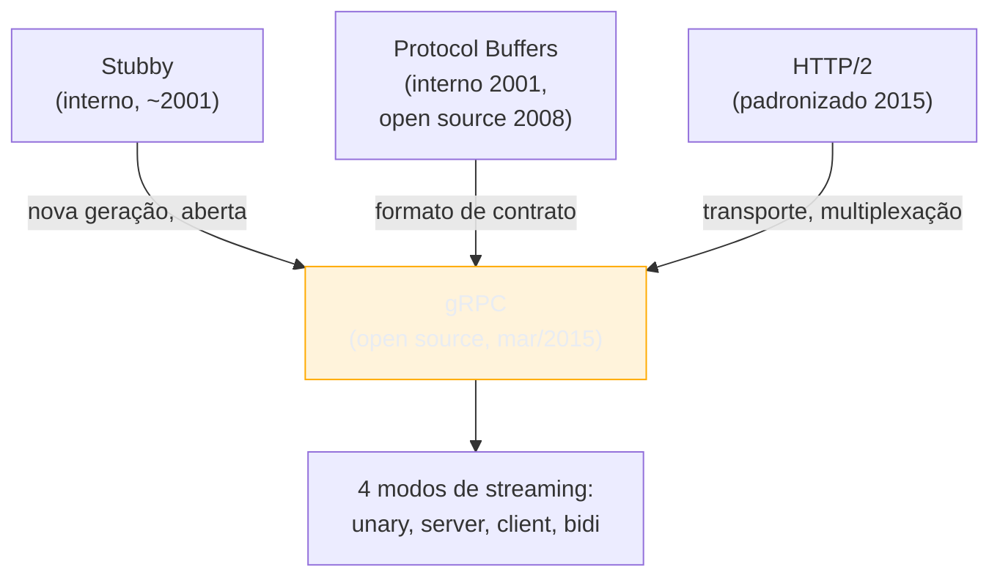

# A era REST, GraphQL, gRPC

> [!abstract] TL;DR
> Depois que CORBA, DCOM e SOAP afundaram sob o peso da própria complexidade (ver [[02 - RPC clássico e por que caiu]]), **REST venceu por ausência de concorrência séria** — não porque fosse tecnicamente superior, mas porque era *simples o bastante* para rodar sobre a infraestrutura que a web já tinha (HTTP, cache, URLs) sem exigir um stack de especificações à parte. REST se tornou o piso comum de 2005 a 2015. Só que "simples" tem um preço: REST devolve recursos inteiros, do jeito que o servidor decidiu modelá-los — e duas empresas bateram nesse limite em escalas diferentes. O **Facebook**, tentando reconstruir seus apps de celular em 2012, sufocava sob *over-fetching* e *under-fetching* em redes móveis lentas — e criou o **GraphQL**. O **Google**, coordenando bilhões de chamadas por segundo entre seus próprios microsserviços internos, já tinha resolvido esse problema havia uma década com o **Stubby** — e abriu essa solução ao mundo em 2015 como **gRPC**. Nenhum dos dois nasceu para substituir REST de forma geral; cada um nasceu para resolver uma dor **específica** que REST, por desenho, não resolve bem.

Julho de 2012. Dentro do Facebook, um grupo de engenheiros olha para os números do app de iOS e não gosta do que vê. O aplicativo trava. Demora para carregar o feed. As avaliações na App Store despencam. A causa raiz não é um bug isolado — é a arquitetura inteira do app, que é essencialmente um navegador embutido apontando para o site mobile do Facebook. Every scroll, every like, every comment dispara uma cascata de chamadas REST, cada uma trazendo de volta um JSON gigante — o objeto "post" inteiro, com o autor inteiro, com todas as configurações de privacidade, quando a tela só precisava do nome, da foto e do texto.

Na outra ponta do mundo tecnológico, o Google não tinha esse problema — porque nunca usou REST para comunicação interna em primeiro lugar. Desde o início dos anos 2000, um framework interno chamado **Stubby** já lidava com a escala que o Facebook estava descobrindo: dezenas de bilhões de chamadas por segundo entre milhares de serviços, com contratos binários compactos e chamadas de procedimento que pareciam funções locais.

Essas duas histórias, contadas lado a lado, respondem a uma pergunta que costuma ser feita ao contrário: "por que GraphQL e gRPC nasceram para substituir REST?" — a pergunta certa é **"que dor específica cada um resolvia, que REST não resolvia?"**. Porque a resposta muda tudo sobre quando você deveria (ou não) escolher cada um.

Esta nota é a terceira do sub-galho *Panorama e decisão* — depois de [[02 - RPC clássico e por que caiu]] mostrar por que a geração anterior de RPC (CORBA, DCOM, SOAP/WSDL) desmoronou, aqui contamos por que REST emergiu como o piso comum, e por que a década seguinte trouxe dois desafiantes que não brigam pelo mesmo território.

## Por que REST venceu: simplicidade contra peso morto

Para entender por que REST ganhou, é preciso lembrar contra o que ele estava competindo. Em 2000, quando Roy Fielding publicou sua tese de doutorado ["Architectural Styles and the Design of Network-based Software Architectures"](https://www.researchgate.net/publication/216797523_Architectural_Styles_and_the_Design_of_Network-based_Software_Architectures), formalizando o estilo arquitetural que batizou de REST (*REpresentational State Transfer*), a alternativa dominante em ambiente corporativo já era **SOAP**, introduzido dois anos antes por Dave Winer, Don Box, Bob Atkinson e Mohsen Al-Ghosein, e promovido pesadamente por Microsoft e IBM até virar recomendação oficial do W3C em maio de 2000.

SOAP não era simples — e não tentava ser. Era um protocolo completo: envelope XML rígido, WSDL descrevendo o contrato formalmente, e uma pilha inteira de especificações satélites conhecidas como **WS-\*** (WS-Security, WS-ReliableMessaging, WS-Transaction, WS-AtomicTransaction — cada uma resolvendo um problema real de sistemas distribuídos, cada uma adicionando uma camada de complexidade que só grandes fornecedores corporativos conseguiam implementar de forma completa e interoperável).

Fielding propôs outra coisa: em vez de inventar um protocolo por cima do HTTP, **usar o HTTP como ele já era desenhado para ser usado**. Os verbos (GET, POST, PUT, DELETE) já expressavam intenção. As URLs já endereçavam recursos. Os códigos de status já comunicavam resultado. Os cabeçalhos de cache (`Cache-Control`, `ETag`, `Expires`) já existiam havia anos, suportados por todo proxy, CDN e navegador do planeta — enquanto SOAP, por natureza, não tinha caching formal embutido; qualquer suporte a cache exigia lógica adicional por cima do protocolo.

O resultado prático: um cliente REST podia ser "tão simples quanto um navegador ou uma biblioteca HTTP em qualquer linguagem". Um cliente SOAP precisava fazer parsing de XML seguindo regras estritas descritas em WSDL. Essa assimetria de custo de entrada — não uma superioridade teórica de REST sobre SOAP — foi o que decidiu a corrida.



Não foi uma virada da noite para o dia. Nos primeiros anos dos 2000, SOAP dominava ambientes corporativos — Oracle, HP, Sun rodavam suas integrações sobre ele. Mas conforme a web amadurecia para o que ficou conhecido como "Web 2.0" — mashups, APIs públicas, apps que consumiam dados de terceiros — empresas como **Amazon, Yahoo e Google** foram migrando ou lançando suas APIs públicas diretamente em REST, o que acelerou a adoção em cascata: onde a empresa líder ia, o ecossistema seguia.

Vinte e cinco anos depois, o resultado dessa aposta é mensurável. O [State of the API Report 2025 da Postman](https://www.postman.com/state-of-api/2025/) registra REST em 93% de uso entre desenvolvedores pesquisados — de longe o estilo dominante, com GraphQL aparecendo em cerca de 33% (frequentemente coexistindo com REST no mesmo time, não substituindo). REST não venceu por ser perfeito. Venceu por ser *bom o suficiente e barato o suficiente* para virar o piso comum sobre o qual quase tudo mais se constrói.

> [!question]- REST "venceu" tecnicamente ou por acidente histórico?
> Um pouco dos dois, e a distinção importa para calibrar expectativa. Tecnicamente, REST tinha vantagens reais: reutilizar a infraestrutura HTTP existente (cache, proxies, CDNs, ferramentas de debug já maduras) é uma economia genuína de engenharia, não um truque de marketing. Mas o "acidente histórico" também pesou — a era Web 2.0 coincidiu com a explosão de APIs públicas voltadas a desenvolvedores externos, um cenário onde a simplicidade de REST (qualquer um consegue chamar um endpoint com `curl`) importava mais do que garantias formais de contrato que SOAP oferecia. Se a história tivesse acontecido em outra ordem — se a era das APIs públicas viesse *antes* da era da integração corporativa rígida — talvez REST tivesse vencido ainda mais rápido, sem o interlúdio SOAP. O ponto central: REST venceu no *contexto* de 2005-2015 (web pública, APIs abertas, HTTP maduro). Isso não significa que ele resolve bem todo problema — e é aí que entram GraphQL e gRPC.

## O ponto cego de REST: o recurso é fixo, o cliente não é

REST tem uma premissa embutida que funciona bem na maioria dos casos e mal em dois cenários específicos: **o formato da resposta é decidido pelo servidor, de uma vez, para todos os clientes**.

Quando você faz `GET /users/42`, o servidor devolve o que ele acha que é "um usuário" — nome, e-mail, avatar, configurações de privacidade, data de criação, o bio inteiro. Se a tela que consome esse dado só precisa do nome e do avatar (um item de lista, por exemplo), o resto do payload é desperdício: mais bytes na rede, mais parsing no cliente, mais bateria consumida em um celular. Isso é **over-fetching**.

O inverso também acontece. Se a tela precisa de "o post, o autor do post, e os últimos 3 comentários", e o endpoint `/posts/:id` só devolve o post — sem aninhar autor e comentários —, o cliente precisa fazer três requisições separadas e montar o resultado do lado dele. Isso é **under-fetching**, e cada requisição extra é uma viagem de ida e volta pela rede, cara em conexões móveis instáveis.

Nenhum dos dois problemas é fatal em uma aplicação web comum, com poucos tipos de tela e banda razoável. Mas em 2012, o Facebook tinha centenas de tipos de tela diferentes, cada uma precisando de um recorte ligeiramente distinto do mesmo grafo de dados (usuário, post, comentário, curtida, notificação — tudo conectado a tudo), rodando em redes 3G que na época eram lentas e caras por byte transferido. Over-fetching e under-fetching, multiplicados por escala, viraram o gargalo central da experiência do produto.

## GraphQL: o grafo do Facebook, aberto ao mundo

A resposta do Facebook não foi otimizar endpoints REST um a um — foi inverter quem decide a forma da resposta. **Lee Byron, Dan Schafer e Nick Schrock** lideraram, junto com o time de iOS, o desenvolvimento de uma API de grafo de objetos para o novo Feed de Notícias, colocando a primeira versão em produção no verão de 2012. A ideia central: em vez de o servidor definir de antemão "isto é um endpoint de usuário, devolve estes campos", o **cliente declara exatamente a forma dos dados que precisa**, em uma única requisição, e o servidor resolve essa forma percorrendo o grafo.

```graphql
query {
  user(id: "42") {
    name
    avatarUrl
    posts(last: 3) {
      title
      author {
        name
      }
      comments(last: 3) {
        text
        author { name }
      }
    }
  }
}
```

Uma única viagem de rede. Zero campos supérfluos — se a query não pede `email`, o `email` nunca sai do servidor. É a solução simétrica para os dois problemas ao mesmo tempo: over-fetching desaparece porque o cliente só pede o que usa; under-fetching desaparece porque o grafo inteiro fica acessível em uma query, sem N requisições encadeadas.

Ao final de 2014, todos os componentes do app de iOS do Facebook já eram servidos por essa API de grafo. Em 2015, seguindo o mesmo caminho que o React tinha trilhado (ferramenta interna, batizada, depois aberta), o Facebook publicou a especificação, uma implementação de referência, e o nome que ficou: **GraphQL**. O [post oficial de lançamento](https://engineering.fb.com/2015/09/14/core-infra/graphql-a-data-query-language/) descreve exatamente essa motivação — "uma API de busca de dados poderosa o bastante para descrever todo o Facebook, mas simples o bastante para ser fácil de aprender". Em 2018, o projeto migrou para a recém-criada GraphQL Foundation, sob o guarda-chuva da Linux Foundation, marcando a transição de "ferramenta de uma empresa" para "padrão de indústria".

Outra decisão de design que se tornou consequência estrutural: GraphQL expõe **um único endpoint** (tipicamente `/graphql`), em vez da miríade de rotas REST. Isso resolve, como efeito colateral, um segundo problema que REST sofre historicamente — versionamento. Em REST, mudar a forma de um recurso costuma forçar `/v1/users` → `/v2/users`, porque clientes antigos dependem implicitamente do formato antigo. Em GraphQL, como cada cliente já declara explicitamente os campos que quer, adicionar um campo novo ao schema não quebra ninguém — quem não pediu, não recebe, não percebe a mudança. Campos que precisam sair passam primeiro por um ciclo de **depreciação** (marcados, ainda funcionais, com aviso) antes de serem removidos de fato. O resultado: evolução contínua do schema, sem o ritual pesado de versões paralelas.

Empresas que adotaram GraphQL depois do Facebook ilustram bem que o padrão de dor se repete fora de redes sociais: o **GitHub** migrou parte de sua API pública para GraphQL justamente para reduzir o custo de integrações complexas envolvendo múltiplos recursos relacionados (repositórios, issues, pull requests, cada um com um grafo próprio de dependências). A **Shopify** lançou sua variante GraphQL da API Admin em maio de 2018, e hoje pratica um modelo de "custo calculado de query" — cada campo tem um peso, e a query inteira precisa caber num orçamento, uma resposta de engenharia direta ao risco inverso de GraphQL: queries mal desenhadas por clientes podem sobrecarregar o servidor de um jeito que REST, com endpoints fixos e previsíveis, nunca permitiria.

> [!warning] GraphQL resolve fetching, não resolve N+1 no backend
> **O que acontece:** o time troca REST por GraphQL esperando "resolver performance", mas o backend continua fazendo uma consulta ao banco por campo resolvido — se uma query pede 50 posts, cada um com seu autor, isso pode virar 51 consultas SQL (uma para os posts, uma para cada autor). **Por quê:** GraphQL resolve o problema de *rede* (quantos bytes trafegam, quantas viagens de ida e volta) — ele não resolve automaticamente o problema de *acesso a dados* no servidor. Cada campo do schema tem um "resolver" e, por padrão, nada impede que resolvers dispersos gerem uma avalanche de queries individuais. **Como evitar:** o padrão estabelecido é **DataLoader** (ou equivalente) — batching e cache por requisição, agrupando N chamadas individuais em uma única consulta em lote. Isso é aprofundado na nota de GraphQL do sub-galho 2 ([[2 - Comunicação síncrona/index|Comunicação síncrona]]); aqui fica só o alerta: GraphQL sem DataLoader é um jeito elegante de reintroduzir o mesmo problema de escala que ele nasceu para resolver.

## gRPC: o Stubby do Google, aberto ao mundo

Enquanto o Facebook resolvia um problema de borda — cliente móvel conversando com servidor, através de rede pública instável —, o Google enfrentava havia mais de uma década um problema de **interior**: como milhares de microsserviços, dentro dos próprios data centers, trocam bilhões de chamadas por segundo entre si, com o menor overhead possível.

A resposta interna do Google, criada por volta de **2001**, chamava-se **Stubby** — um framework de RPC que já resolvia, silenciosamente, a maior parte do que a indústria levaria mais uma década para reconhecer como problema: contratos fortemente tipados, serialização binária compacta, streaming bidirecional, balanceamento de carga e tolerância a falha embutidos. Rodando internamente, Stubby processava a escala "internet" do próprio Google — dezenas de bilhões de RPCs por segundo — muito antes de "internet-scale" virar um termo de marketing usado por qualquer startup.

Em março de 2015, o Google decidiu não apenas modernizar o Stubby internamente, mas **abrir a próxima geração dele ao mundo**. O resultado, batizado **gRPC**, foi lançado sob licença BSD, apoiado em dois pilares:

1. **Protocol Buffers ("Protobuf")** — o formato de serialização binário do Google, cujo desenvolvimento interno começou em 2001 (a versão original, "Proto1") e que já tinha sido aberto separadamente em 2008. Em vez de JSON textual, Protobuf define o contrato em um arquivo `.proto`, compila esse contrato para código gerado em cada linguagem, e serializa dados em binário compacto — tipicamente 70-90% menor que o equivalente em JSON, dependendo da estrutura dos dados.

2. **HTTP/2** — o gRPC não inventou um transporte próprio; ele adotou o HTTP/2, recém-padronizado, que resolve um problema estrutural do HTTP/1.1: o **head-of-line blocking**, onde requisições em uma mesma conexão TCP precisam esperar a resposta da requisição anterior antes de prosseguir. O HTTP/2 introduz **multiplexação** — múltiplos streams de requisição/resposta compartilhando a mesma conexão TCP, intercalados e reconstruídos de forma independente, sem que uma chamada lenta bloqueie as rápidas atrás dela.



O resultado prático: gRPC entrega, em benchmarks recentes, latência sensivelmente menor e throughput sensivelmente maior que REST/JSON para comunicação serviço-a-serviço — medições de 2025 chegam a reportar conexões gRPC cerca de 7x mais rápidas para receber dados e cerca de 10x para enviar, em cargas específicas de payload. O ganho vem de duas fontes combinadas: payload binário menor (menos bytes na rede) e multiplexação HTTP/2 (menos tempo de espera por conexão).

Só que essa velocidade tem um preço, o mesmo preço que SOAP pagava por seus benefícios: **acoplamento de contrato mais rígido e barreira de acesso mais alta**. Um cliente REST é qualquer coisa que fala HTTP — um navegador, um `curl`, uma extensão. Um cliente gRPC precisa de um código gerado a partir do `.proto`, o que é trivial dentro de um pipeline de build controlado (o cenário do Google, e de qualquer empresa rodando seus próprios microsserviços) e bem menos trivial quando o consumidor é um navegador de terceiro que você não controla — HTTP/2 e binário Protobuf não são coisas que JavaScript no navegador manipula nativamente sem uma camada de tradução (gRPC-Web).

Por isso, o padrão de adoção de gRPC não é "substituir REST na borda pública" — é **substituir REST na comunicação interna, entre serviços que a própria empresa controla nas duas pontas**. Empresas como **Netflix** (comunicação de alto throughput entre serviços de playback e metadados), **Square** (que migrou sua solução de RPC proprietária para gRPC, citando suporte multiplataforma e desempenho comprovado), **CockroachDB** (comunicação nó-a-nó no banco distribuído, onde eficiência binária é crítica para a velocidade e resiliência prometidas), além de **Docker, CoreOS/etcd, Uber, Spotify, Dropbox, Cisco** — todas usam gRPC primariamente para o "interior" da arquitetura, não para a "fachada" voltada ao público.

> [!question]- Se gRPC é tão mais rápido, por que não virou o novo default?
> Porque velocidade não é a única variável da equação, e a maioria dos sistemas não está no regime de carga onde a diferença importa. Um endpoint público consumido por navegadores, apps de terceiros e integrações ad-hoc ganha mais com "qualquer um consegue chamar isso com uma linha de `curl`" do que perderia com alguns milissegundos extras de latência. gRPC brilha exatamente onde REST tradicionalmente é fraco — comunicação intensiva, controlada nas duas pontas, sensível a latência e throughput — e é fraco exatamente onde REST brilha: acessibilidade universal, debugabilidade com ferramentas simples, cache HTTP nativo. Os dois não competem pelo mesmo território; competem por metade dele cada um, e um bom desenho de sistema costuma usar REST na borda e gRPC por dentro, ao mesmo tempo.

## Três respostas para três problemas — não uma escada de evolução

O erro mais comum ao aprender essa história é interpretá-la como uma linha do tempo de substituição — "SOAP morreu, REST veio, depois REST ficou velho e GraphQL/gRPC vieram substituir". Não é isso que os dados mostram. REST, com 93% de presença no relatório de 2025 da Postman, não está sendo substituído — está sendo **complementado** em pontos específicos onde a premissa dele (recurso fixo, endpoint por tipo de dado) não serve.

| Tecnologia | Nasceu para resolver | Onde brilha | Onde não é a escolha natural |
|---|---|---|---|
| **REST** | Simplificar a integração corporativa pesada de SOAP, reaproveitando a infraestrutura HTTP já madura | APIs públicas, integrações amplas, qualquer cenário onde acessibilidade e cache importam mais que performance de ponta | Grafos de dados complexos consumidos por muitos formatos de tela diferentes; comunicação interna de altíssimo throughput |
| **GraphQL** | Over-fetching/under-fetching em clientes com muitas variações de tela, sobre redes limitadas (o caso do Facebook mobile, 2012) | Front-ends com muitos formatos de consumo do mesmo grafo de dados (apps, web, painéis) | APIs simples com poucos tipos de recurso; times sem maturidade para lidar com custo de query e N+1 |
| **gRPC** | Comunicação interna de altíssima performance entre milhares de serviços controlados pela mesma organização (o caso do Stubby do Google) | Microsserviço-a-microsserviço, streaming bidirecional, sistemas distribuídos sensíveis a latência | Endpoints públicos consumidos diretamente por navegador; consumidores fora do seu controle de build |

Repare que a pergunta certa nunca é "qual é o melhor?" — é "qual dor específica eu tenho agora?". Se a dor é "meu cliente móvel faz 8 requisições REST para montar uma tela e desperdiça banda", a resposta aponta para GraphQL. Se a dor é "meus 40 microsserviços internos gastam CPU serializando/desserializando JSON e a latência p99 sofre com isso", a resposta aponta para gRPC. Se a dor não existe — se um conjunto pequeno de endpoints REST bem modelados já atende — trocar de estilo é resolver um problema que você não tem, ao custo de uma complexidade que você vai ter.

## Um sistema real usa os três ao mesmo tempo — e isso é o normal

O jeito mais rápido de fixar essa ideia é imaginar (não como caso real de nenhuma empresa específica, mas como composição plausível a partir dos padrões documentados acima) um e-commerce de porte médio desenhando sua camada de comunicação do zero:

- **Na borda pública**, o app mobile e o site consomem uma **API REST** para operações simples de catálogo e carrinho (listar produtos, ver detalhe, adicionar ao carrinho) — porque é o que qualquer integração de parceiro, qualquer ferramenta de terceiro, qualquer dev júnior consegue consumir sem fricção, e porque cache HTTP resolve boa parte da carga de leitura de graça.
- **Para o painel administrativo interno**, onde a mesma equipe de frontend precisa montar dezenas de telas diferentes puxando recortes variados dos mesmos dados de pedido/cliente/produto (o padrão exato que atingiu o Facebook em 2012), a API expõe uma camada **GraphQL** por cima — um único endpoint, uma query por tela, sem multiplicar variações de endpoint REST customizado para cada painel.
- **Entre os microsserviços internos** — o serviço de pedidos chamando o serviço de estoque, chamando o serviço de precificação, chamando o serviço de frete, todos rodando na mesma rede interna, sob o controle do mesmo time — a comunicação usa **gRPC**, porque a latência dessas chamadas se soma em cascata dentro de uma única requisição do usuário final, e o ganho de performance binária/HTTP2 se paga rápido em um caminho crítico chamado dezenas de vezes por segundo.

Isso não é uma composição exótica — é exatamente o padrão que a linha "REST para público, GraphQL para agregação de tela, gRPC para o interior" descreve, e é coerente com o que casos documentados (Netflix combinando GraphQL na borda e gRPC internamente, por exemplo) mostram na prática. A pergunta "qual devo usar?" quase sempre tem a resposta "depende de qual *camada* do sistema você está desenhando agora" — não uma escolha única, vitalícia, para o sistema inteiro.

Vale fechar o contraste com a nota anterior: SOAP não desapareceu completamente ([[02 - RPC clássico e por que caiu]] detalha onde ele sobrevive — EDI bancário, integrações de saúde, contratos B2B legados que dependem de garantias formais de transação e segurança que WS-\* oferece). O que aconteceu não foi extinção, foi **contenção de escopo**: SOAP ficou confinado aos nichos corporativos que genuinamente precisam do que ele oferece, enquanto REST, GraphQL e gRPC dividiram o restante do mapa, cada um no território onde nasceu resolvendo uma dor concreta.

## Em entrevista

Essa história cai em entrevistas sêniores de duas formas, e as duas testam a mesma coisa: **se você entende motivação, ou só decorou rótulos**.

A primeira forma é direta: "quando você escolheria GraphQL em vez de REST?" ou "por que usar gRPC internamente?". A resposta fraca lista features ("GraphQL tem query flexível, gRPC é rápido"). A resposta forte amarra a escolha à dor original: "GraphQL resolve o problema de um cliente que precisa de recortes muito diferentes do mesmo dado — se meu front tem 5 telas pedindo formatos distintos do mesmo recurso, GraphQL evita eu multiplicar endpoints REST customizados ou fazer o cliente agregar N chamadas." Isso mostra que você entende o *porquê*, não só o *o quê*.

A segunda forma é um teste de julgamento disfarçado de pergunta técnica: "reescreva essa API REST em GraphQL" ou "por que não usamos gRPC pra tudo, já que é mais rápido?". Aqui, o sinal que separa sênior é resistir à premissa da pergunta quando ela não se sustenta. Se o sistema em questão é uma API pública consumida por parceiros externos via navegador, "gRPC pra tudo" é um passo atrás — você perde acessibilidade e cache HTTP por uma velocidade que ninguém vai sentir num cenário onde a rede pública, não o serviço, é o gargalo. Dizer isso em voz alta — "eu resistiria a essa migração aqui, porque..." — é exatamente o comportamento que a rubrica de system design (ver [[03-Dominios/Engenharia/Arquitetura/System Design/index|System Design]]) recompensa: trade-off explícito, não adoção por hype.

> [!warning] "GraphQL/gRPC é mais moderno, então é melhor" é a armadilha clássica
> **O que acontece:** um candidato ou um time troca REST por GraphQL ou gRPC só porque é a tecnologia mais recente ouvida em uma conferência, sem mapear a dor real que está resolvendo. **Por quê:** confundir "mais novo" com "estrategicamente correto" é o mesmo erro de otimização prematura que aparece em qualquer decisão de arquitetura — trocar simplicidade por sofisticação sem que o problema exija. **Como evitar:** a pergunta que sempre precede a escolha de tecnologia é "que dor específica eu tenho, que a ferramenta atual não resolve?". Se a resposta é "nenhuma dor concreta, só queria usar algo mais moderno", fique com o que já funciona.

## How to explain in English

REST won not because it was technically perfect, but because it was *simple enough* to piggyback on infrastructure the web already had — HTTP verbs, URLs, caching headers — instead of requiring a heavyweight stack like SOAP's WS-\* specifications. That simplicity made it the default for public, developer-facing APIs from roughly 2005 onward, and it still dominates today (93% usage per Postman's 2025 State of the API Report).

GraphQL and gRPC didn't come to replace REST — they came to solve *specific* pain points REST doesn't address well. GraphQL was born at Facebook in 2012, when mobile apps kept over-fetching (getting more data than needed) or under-fetching (needing multiple round trips) from fixed REST endpoints over slow networks; it flips the model so the client declares the exact shape of data it needs in a single query. gRPC was born from Google's internal Stubby framework — solving the opposite problem: blazing-fast, strongly-typed communication between thousands of internal microservices, later open-sourced in 2015 on top of Protocol Buffers and HTTP/2.

> "I wouldn't reach for GraphQL or gRPC by default — I'd ask what specific pain we have. If our front-end is making multiple round trips to assemble one screen, that's a GraphQL signal. If we're paying real latency cost in service-to-service JSON serialization at scale, that's a gRPC signal. If neither pain exists, REST is still the right default — it's the one every client, proxy, and tool already speaks."

| PT | EN |
|----|----|
| Sobre-busca (retorno de dados demais) | Over-fetching |
| Sub-busca (dados insuficientes, exige múltiplas chamadas) | Under-fetching |
| Viagem de ida e volta (à rede) | Round trip |
| Grafo de objetos | Object graph |
| Endpoint único | Single endpoint |
| Contrato fortemente tipado | Strongly-typed contract |
| Multiplexação (HTTP/2) | Multiplexing |
| Bloqueio de cabeça de linha | Head-of-line blocking |
| Serialização binária | Binary serialization |
| Streaming bidirecional | Bidirectional streaming |
| Depreciação (de campo/endpoint) | Deprecation |
| Comunicação serviço-a-serviço | Service-to-service communication |

## O que vem a seguir

Esta nota respondeu "por que" — por que REST venceu, por que GraphQL e gRPC surgiram como respostas a dores específicas, e não como sucessores de REST. Ainda não entramos no eixo síncrono/assíncrono em profundidade nem no que veio depois desses três. A próxima nota deste sub-galho olha para um tipo de comunicação que nenhum dos três resolve nativamente bem: interações que precisam de **atualização contínua e bidirecional**, sem que o cliente precise perguntar repetidamente "mudou alguma coisa?".

- [[04 - Comunicação em tempo real]] — WebSocket, Server-Sent Events e WebTransport: o que substituiu o polling, e quando cada um vale
- [[05 - O que está emergindo e framework de decisão]] — fecha o sub-galho com tRPC, Connect, AsyncAPI, CloudEvents e uma árvore de decisão prática
- [[2 - Comunicação síncrona/index|Comunicação síncrona]] — o sub-galho seguinte aprofunda tecnicamente REST (Richardson Maturity Model, HATEOAS/HAL), GraphQL (schema, resolvers, DataLoader) e gRPC (Protobuf, os 4 tipos de streaming) — aqui ficou o "por quê", lá fica o "como"

## Veja também

- [[02 - RPC clássico e por que caiu]] — a geração anterior de RPC (CORBA, DCOM, SOAP/WSDL) e por que ela caiu
- [[01 - O que é o contrato de comunicação]] — o eixo síncrono/assíncrono que enquadra toda a trilha
- [[Comunicação entre Sistemas/index|Comunicação entre Sistemas]] — o galho-pai

## Fontes

- Roy T. Fielding — [*Architectural Styles and the Design of Network-based Software Architectures*](https://www.researchgate.net/publication/216797523_Architectural_Styles_and_the_Design_of_Network-based_Software_Architectures) (tese de doutorado, 2000) — origem formal de REST.
- Roy T. Fielding — [*REST APIs must be hypertext-driven*](https://roy.gbiv.com/untangled/2008/rest-apis-must-be-hypertext-driven) (blog, 20 out. 2008) — a crítica do próprio Fielding a APIs que se chamam REST sem HATEOAS.
- Treblle — [*From SOAP to REST: Tracing The History of APIs*](https://treblle.com/blog/from-soap-to-rest-tracing-the-history-of-apis) (acessado jul. 2026) — linha do tempo SOAP→REST e adoção em Amazon/Yahoo/Google.
- Meta Engineering — [*GraphQL: A data query language*](https://engineering.fb.com/2015/09/14/core-infra/graphql-a-data-query-language/) (14 set. 2015) — anúncio oficial de abertura do GraphQL, motivação original de 2012.
- Postman Blog — [*What is GraphQL? Part 1: The Facebook Years*](https://blog.postman.com/what-is-graphql-part-one-the-facebook-years/) (acessado jul. 2026) — detalhes do desenvolvimento interno 2012-2015, papel de Lee Byron/Nick Schrock/Dan Schafer.
- GraphQL Foundation — [graphql.org/blog/2015-09-14-graphql](https://graphql.org/blog/2015-09-14-graphql/) — post original de lançamento da spec.
- Google Open Source Blog — [*Introducing gRPC, a new open source HTTP/2 RPC Framework*](https://opensource.googleblog.com/2015/02/introducing-grpc-new-open-source-http2.html) (fev. 2015) — anúncio oficial do gRPC.
- gRPC.io — [*About gRPC*](https://grpc.io/about/) (acessado jul. 2026) — origem no Stubby (~2001), relação com Protocol Buffers e HTTP/2.
- Google Cloud Blog — [*gRPC: a true internet-scale RPC framework is now 1.0*](https://cloud.google.com/blog/products/gcp/grpc-a-true-internet-scale-rpc-framework-is-now-1-and-ready-for-production-deployments) (ago. 2016) — gRPC 1.0 e casos de produção.
- Protocol Buffers Documentation — [*History*](https://protobuf.dev/history/) (acessado jul. 2026) — Proto1 (2001) até open source (2008) e Proto3 (2015, junto do gRPC).
- Postman — [*2025 State of the API Report*](https://www.postman.com/state-of-api/2025/) (2025) — REST em 93% de uso, GraphQL em ~33%.
- Kong Inc. — [*GraphQL vs REST: Key Similarities and Differences Explained*](https://konghq.com/blog/learning-center/graphql-vs-rest) (acessado jul. 2026) — versionamento REST vs. evolução de schema GraphQL.
- restfulapi.net — [*Richardson Maturity Model*](https://restfulapi.net/richardson-maturity-model/) (acessado jul. 2026) — os 4 níveis, referência para o sub-galho 2.
- Nordic APIs — [*6 Examples of GraphQL in Production at Large Companies*](https://nordicapis.com/6-examples-of-graphql-in-production-at-large-companies/) (acessado jul. 2026) — casos GitHub, Shopify, Netflix.
- Shopify — [*graphql-design-tutorial*](https://github.com/Shopify/graphql-design-tutorial) (GitHub, acessado jul. 2026) — adoção de GraphQL na Admin API desde maio de 2018, custo calculado de query.
- Zuplo — [*REST vs gRPC: Performance, Use Cases & How to Choose*](https://zuplo.com/learning-center/rest-or-grpc-guide) (acessado jul. 2026) — comparação de latência/throughput 2025.
- Wallarm — [*gRPC vs. REST: Detailed Comparison 2025*](https://www.wallarm.com/what/grpc-vs-rest-comparing-key-api-designs-and-deciding-which-one-is-best) (2025) — benchmarks de payload/latência e casos de uso (Netflix, Square, CockroachDB).
- Algoroq — [*HTTP/2 Multiplexing Explained*](https://www.algoroq.io/concepts/http2-multiplexing/) (acessado jul. 2026) — head-of-line blocking em HTTP/1.1 e a solução via multiplexação.
