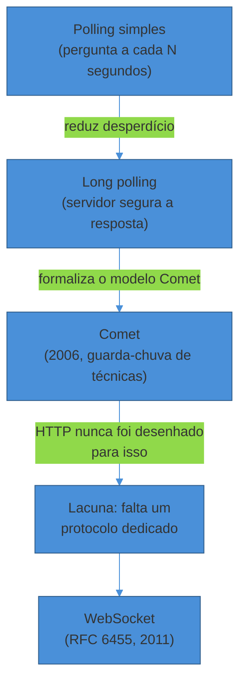
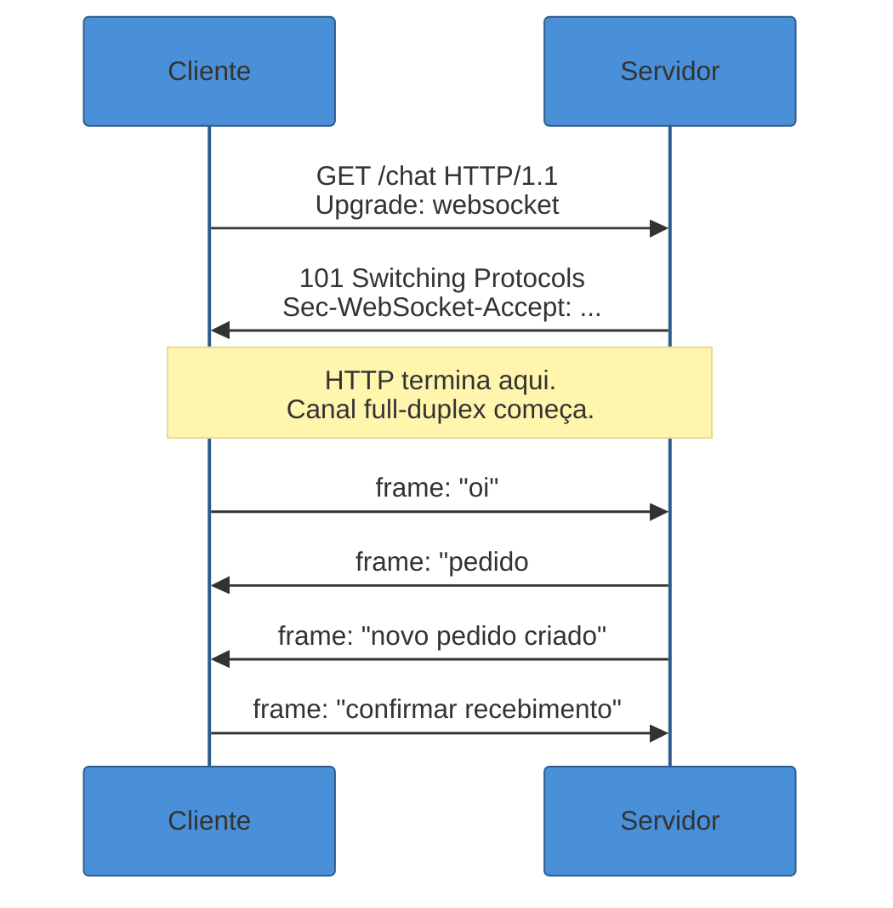
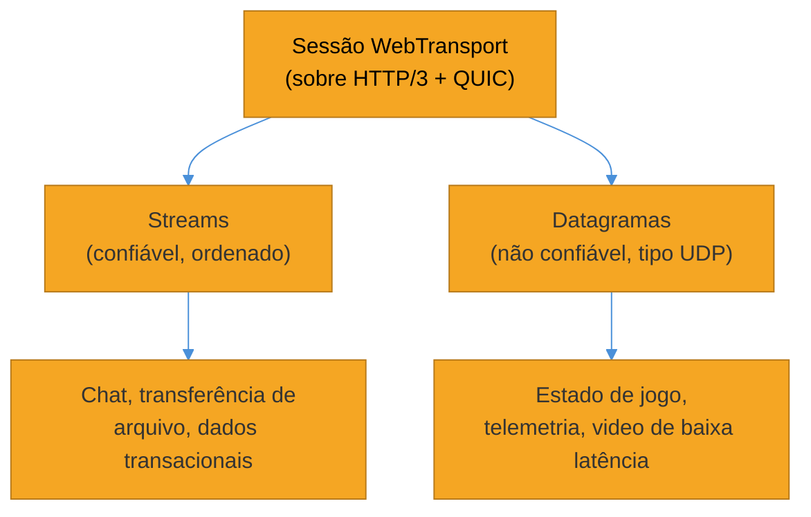

# Comunicação em tempo real

> [!abstract] TL;DR
> REST, GraphQL e gRPC (ver [[03 - A era REST, GraphQL, gRPC]]) resolvem bem o padrão "cliente pergunta, servidor responde uma vez". Nenhum dos três resolve nativamente **"o servidor precisa falar de novo, sem o cliente perguntar de novo"** — um preço atualizando, uma mensagem chegando, um token de LLM sendo gerado. A indústria tentou simular isso em cima de HTTP com **polling** e **long polling** por mais de uma década, até o **WebSocket** (RFC 6455, dezembro de 2011) formalizar um canal **full-duplex** persistente sobre uma única conexão TCP. Mas full-duplex é mais poder do que a maioria dos casos precisa: quando o fluxo é só **servidor → cliente** — like um chat de IA emitindo tokens, um dashboard atualizando métricas — **Server-Sent Events (SSE)**, padronizado junto do HTML5, entrega 90% do valor com uma fração da complexidade operacional, rodando sobre HTTP comum. E no horizonte, ainda emergente em 2026, está o **WebTransport**: construído sobre HTTP/3 e QUIC, ele ataca um problema que nem WebSocket nem SSE resolvem — o *head-of-line blocking* do TCP, que trava um stream inteiro quando um único pacote se perde. A pergunta que organiza esta nota nunca é "qual é o mais moderno" — é **"esse fluxo é bidirecional de verdade, ou é só o servidor com algo nôvo pra contar?"**

Um dashboard de operações mostra o número de pedidos em andamento de um e-commerce. A primeira versão, escrita num sprint apertado, é simples até a ingenuidade: a cada 2 segundos, o navegador dispara um `GET /pedidos/contagem` e redesenha o número. Funciona. Ninguém reclama — até o Black Friday, quando o time de operações abre trinta abas do mesmo dashboard, em trinta computadores diferentes, todos batendo no mesmo endpoint a cada 2 segundos.

O servidor, que aguentava tranquilamente o tráfego normal, começa a sentir. Não é o trabalho de calcular a contagem que pesa — é o **volume de conexões HTTP inteiras**, cada uma com seu handshake TCP, seus cabeçalhos, sua rodada completa de ida e volta, só para entregar, na maior parte das vezes, exatamente o mesmo número da vez anterior. Cem clientes chamando a cada 2 segundos são 50 requisições por segundo que, na prática, quase sempre respondem "nada mudou".

Na mesma época, um outro time da mesma empresa está integrando um assistente de IA no site de suporte. A primeira versão espera a resposta inteira do modelo de linguagem antes de mostrar qualquer coisa na tela — o usuário digita a pergunta, vê um spinner por três, quatro, seis segundos, e só então o parágrafo inteiro aparece de uma vez. A sensação é de um sistema travado, mesmo que ele esteja, tecnicamente, processando o tempo todo.

Os dois problemas são a mesma pergunta vestida de duas formas diferentes: **como o servidor avisa o cliente de algo novo, sem o cliente precisar ficar perguntando "mudou? mudou? mudou?"**. E, note bem, nenhum dos dois exige que o cliente também fale de volta em tempo real — o dashboard só *escuta* a contagem; o chat só *escuta* os tokens do modelo chegando. É essa distinção — quem realmente precisa falar, e em que direção — que decide qual das três tecnologias desta nota é a certa para cada caso.

## O ponto de partida: por que polling nunca foi realmente "tempo real"

Antes de qualquer protocolo dedicado existir, a única ferramenta disponível para simular atualização contínua era abusar do modelo requisição-resposta do HTTP. Vale entender essa geração de gambiarras — não como curiosidade histórica, mas porque ela ainda aparece em produção, geralmente sem que ninguém tenha decidido conscientemente usá-la.

**Polling simples (short polling).** O cliente pergunta em intervalos fixos — "mudou alguma coisa?" — e o servidor responde na hora, mudança ou não. É a solução do dashboard da abertura desta nota. O custo é duplo: **latência** (a notícia de uma mudança real pode esperar quase um intervalo inteiro para ser percebida) e **desperdício** (a maioria das respostas confirma que nada mudou, e cada uma delas paga o custo integral de uma requisição HTTP — handshake, cabeçalhos, ida e volta pela rede).

**Long polling.** Uma melhoria real, e não apenas cosmética: o servidor recebe a requisição e **segura a resposta em aberto** — não responde imediatamente — até que haja algo novo para entregar, ou até um timeout ser atingido. Assim que responde (com dado novo, ou vazio por timeout), o cliente imediatamente abre outra requisição igual. Isso reduz drasticamente o desperdício de respostas vazias e aproxima a latência percebida de "quase tempo real" — mas ainda paga o custo de reabrir uma conexão HTTP inteira a cada ciclo, e ainda exige que o servidor mantenha threads ou conexões penduradas esperando ([The Road to WebSockets, WebSocket.org](https://websocket.org/guides/road-to-websockets/)).

**Comet.** Termo cunhado em 2006 para batizar essa família de técnicas de "empurrar" dados do servidor para o navegador sem que o navegador precise perguntar repetidamente — o guarda-chuva sob o qual long polling e HTTP streaming (uma conexão HTTP que nunca fecha, indo enviando pedaços de dado ao longo do tempo) foram organizados. Ficou famoso em produtos como o Gmail e o Meebo da época — mas nunca foi um protocolo formal, era um conjunto de truques em cima de um protocolo que não foi desenhado para aquilo ([Ably, *The history of WebSockets*](https://ably.com/topic/websockets-history); [Comet (programming), Wikipedia](https://en.wikipedia.org/wiki/Comet_(programming))).

O problema estrutural de toda essa geração, resumido pela documentação de referência do próprio protocolo que viria depois: aplicações que precisam de comunicação bidirecional (mensagens instantâneas, jogos) historicamente exigiam "abusar" do HTTP para fazer *polling* do servidor por atualizações enquanto enviavam notificações de subida como chamadas HTTP separadas. O servidor era forçado a usar várias conexões TCP subjacentes diferentes por cliente — uma para enviar informação ao cliente, e uma nova a cada mensagem recebida — e o protocolo em si tinha overhead alto, com cada mensagem cliente-servidor carregando um cabeçalho HTTP inteiro ([RFC 6455](https://www.rfc-editor.org/rfc/rfc6455.html)).



> [!question]- Se long polling já reduzia bastante a latência, por que não parar por ali?
> Porque o custo que sobrava não era de latência — era de **custo por conexão**. Cada ciclo de long polling ainda abre uma conexão HTTP nova (ou reaproveita uma existente sob HTTP/1.1 keep-alive, com limites severos de conexões simultâneas por domínio), ainda carrega cabeçalhos HTTP completos a cada rodada, e ainda exige que o servidor mantenha uma thread ou um slot de conexão "pendurado" esperando por cada cliente conectado. Em escala — milhares de usuários simultâneos de um chat, por exemplo — esse overhead de reabrir conexões e manter conexões penduradas vira o próprio gargalo. O que faltava não era uma técnica melhor de simular tempo real; era um **protocolo desenhado desde o início** para manter uma conexão aberta, bidirecional, com overhead mínimo por mensagem — exatamente a lacuna que o WebSocket foi desenhado para fechar.

## WebSocket: a conexão que nunca fecha, falando nos dois sentidos

O **WebSocket** foi padronizado como **RFC 6455 em dezembro de 2011**, pelo IETF, depois de um processo que começou por volta de 2008, quando os desenvolvedores Michael Carter e Ian Hickson reconheceram as limitações do modelo Comet e começaram a desenhar um novo padrão para comunicação bidirecional em tempo real na web ([Taskade, *History of WebSockets*](https://www.taskade.com/blog/websockets-history)). Navegadores adicionaram suporte entre 2010 e 2012 — o padrão foi implementado em produção antes mesmo de ser formalmente ratificado, sinal de quão urgente era a lacuna que ele preenchia.

A ideia central é simples de enunciar e poderosa na prática: em vez de reabrir uma conexão HTTP a cada troca, o cliente e o servidor **negociam uma vez** — via um pedido HTTP especial — e, a partir daí, compartilham um único canal **TCP full-duplex**, que fica aberto pelo tempo que a interação durar. Full-duplex significa que os dois lados podem enviar dados a qualquer momento, de forma independente, sem esperar sua vez — diferente de requisição-resposta, onde o cliente sempre inicia e o servidor sempre responde.

### O handshake: HTTP por um instante, depois outra coisa

O truque de engenharia mais elegante do WebSocket é como ele nasce: **dentro do próprio HTTP**, para não precisar de portas novas, firewalls novos, ou infraestrutura nova. O cliente envia uma requisição `GET` comum, mas com cabeçalhos que pedem uma troca de protocolo:

```http
GET /chat HTTP/1.1
Host: exemplo.com
Upgrade: websocket
Connection: Upgrade
Sec-WebSocket-Key: dGhlIHNhbXBsZSBub25jZQ==
Sec-WebSocket-Version: 13
```

Se o servidor concorda, ele responde com o status `101 Switching Protocols` — um código HTTP raro, que existe justamente para dizer "a partir de agora, essa conexão fala outra coisa":

```http
HTTP/1.1 101 Switching Protocols
Upgrade: websocket
Connection: Upgrade
Sec-WebSocket-Accept: s3pPLMBiTxaQ9kYGzzhZRbK+xOo=
```

O `Sec-WebSocket-Accept` não é decorativo: o servidor concatena o `Sec-WebSocket-Key` recebido com uma GUID fixa (`258EAFA5-E914-47DA-95CA-C5AB0DC85B11`), calcula o hash SHA-1 do resultado e devolve o hash codificado em base64 — um mecanismo simples que garante que o servidor de fato entendeu o pedido como uma negociação WebSocket, e não um proxy antigo que apenas repassou os cabeçalhos sem entender o que significavam ([WebSocket.org, *WebSocket Handshake*](https://websocket.org/reference/handshake/)).

Depois desse handshake, os dois lados **param de falar HTTP**. Todo byte que segue usa o formato de frame binário do próprio WebSocket — mais compacto, com muito menos overhead por mensagem do que um cabeçalho HTTP inteiro repetido a cada troca. E, crucialmente, por ter nascido de dentro de uma requisição HTTP comum, a conexão WebSocket trafega pelas mesmas portas (80 e 443) e pela mesma infraestrutura — proxies, load balancers, CDNs — que qualquer tráfego web normal, sem exigir liberação especial de firewall ([MDN, *Protocol upgrade mechanism*](https://developer.mozilla.org/en-US/docs/Web/HTTP/Guides/Protocol_upgrade_mechanism)).



### O preço do full-duplex: estado que precisa ser operado

WebSocket resolve o problema de latência e overhead de forma definitiva — mas troca por um custo operacional real, que fica invisível até o sistema precisar rodar em mais de um servidor. Diferente de HTTP, que é **stateless** (cada requisição é independente; qualquer servidor atrás do load balancer pode atendê-la), uma conexão WebSocket é **stateful**: uma vez estabelecida, o tráfego entre cliente e servidor precisa continuar chegando *no mesmo processo* que aceitou o handshake original — não existe "qualquer servidor responde", porque o canal em si é a coisa que está viva.

Isso força uma decisão de arquitetura que sistemas puramente REST nunca precisam tomar: **sticky sessions** (sessão fixada) — o load balancer aprende a rotear cada cliente sempre para o mesmo servidor, em vez de distribuir livremente. Funciona, mas tem um custo assimétrico: quanto mais o sistema depende de sticky sessions, mais difícil fica escalar dinamicamente ou rebalancear tráfego — e quando um servidor cai, todo cliente fixado nele perde a sessão de uma vez só ([Ably, *When and how to load balance WebSockets at scale*](https://ably.com/topic/when-and-how-to-load-balance-websockets-at-scale)).

A solução de mercado documentada é **externalizar o estado**: guardar a sessão em algo como Redis (não na memória do processo do servidor), para que qualquer instância consiga atender qualquer cliente reconectando, e adicionar um **backplane de pub/sub** (Redis, Kafka, NATS) entre os servidores WebSocket — quando uma mensagem precisa alcançar clientes conectados em *outros* servidores, ela é publicada no backplane, e cada servidor a distribui para seus próprios clientes locais ([Ably, *How to scale WebSockets*](https://ably.com/topic/the-challenge-of-scaling-websockets)). Discord, por exemplo, resolve isso de forma ainda mais específica: cada "guild" (servidor de comunidade) roda como um processo Elixir isolado que funciona como ponto de roteamento central — uma arquitetura desenhada especificamente em torno do fato de que conexões em tempo real têm estado ([DEV Community, *Designing a Real-Time Chat System at Scale*](https://dev.to/damir-karimov/designing-a-real-time-chat-system-at-scale-53k7)).

> [!warning] Escolher WebSocket "porque é tempo real" sem precisar do sentido inverso
> **O que acontece:** um time implementa WebSocket para um dashboard, um feed de notificações, ou qualquer fluxo onde o cliente só *escuta* — e herda toda a complexidade de sticky sessions, backplane de pub/sub e reconexão manual sem nunca usar a metade "cliente fala com servidor" do full-duplex. **Por quê:** WebSocket é frequentemente ensinado como sinônimo de "tempo real", mas tempo real e bidirecional são coisas diferentes — a maioria dos casos de "tempo real" do mundo real (preço atualizando, notificação chegando, resposta de IA sendo gerada) só precisa que o **servidor** fale, não os dois lados. **Como evitar:** perguntar, antes de escolher a tecnologia: "o cliente realmente precisa enviar dados de volta *durante* o fluxo em tempo real, ou só no início (uma requisição HTTP comum) e no fim?". Se a resposta for "só escuto", SSE — a próxima seção desta nota — resolve o mesmo problema com uma fração da complexidade operacional.

### Onde WebSocket é, de fato, a escolha certa

Full-duplex genuíno tem candidatos naturais, e todos compartilham a mesma característica: **os dois lados precisam iniciar mensagens a qualquer momento, de forma imprevisível**. Chat (qualquer um dos participantes pode digitar a qualquer momento), jogos multiplayer em tempo real (o servidor emite estado do jogo, o cliente emite comandos do jogador, ambos constantemente), edição colaborativa de documentos (qualquer usuário pode digitar, o servidor precisa distribuir a mudança para todos os outros imediatamente), e ferramentas de trading financeiro (preços mudando em um sentido, ordens sendo enviadas no outro) são os exemplos canônicos citados de forma consistente pela literatura de comparação entre as três tecnologias ([WebSocket.org, *WebSocket vs SSE*](https://websocket.org/comparisons/sse/); [GetStream, *WebSocket vs Server-Sent Events*](https://getstream.io/blog/websocket-sse/)).

## Server-Sent Events: metade do poder, uma fração da complexidade

Enquanto o WebSocket resolvia o problema geral — comunicação bidirecional arbitrária —, uma parte considerável dos casos reais de "o servidor precisa avisar o cliente de algo" nunca precisou da metade "cliente fala de volta". A especificação **Server-Sent Events (SSE)** nasceu dessa observação, junto da própria especificação HTML5 do WHATWG, e formaliza exatamente esse caso mais simples: **o servidor empurra eventos, um após o outro, e o cliente só escuta**.

O mecanismo do lado do navegador é a interface **`EventSource`**, e o protocolo de transporte é `text/event-stream` — um formato de texto simples, legível, trafegando sobre **HTTP comum**, sem handshake especial, sem upgrade de protocolo, sem novo formato binário de frame ([HTML Living Standard, *9.2 Server-sent events*](https://html.spec.whatwg.org/multipage/server-sent-events.html)).

Um evento SSE, na prática, se parece com isto sendo transmitido pelo servidor:

```
event: token
data: {"content": "Olá"}
id: 1

event: token
data: {"content": ", como"}
id: 2

event: done
data: {}
id: 3
```

Cada bloco tem até quatro campos reconhecidos: `data` (o payload — pode se estender por múltiplas linhas, concatenadas), `event` (o tipo do evento, `message` por padrão se omitido), `id` (identificador único do evento, usado na reconexão) e `retry` (o tempo de reconexão em milissegundos, sugerido pelo servidor) ([Last-Event-ID, http.dev](https://http.dev/last-event-id)).

### A reconexão automática é o diferencial estrutural

O detalhe que costuma passar despercebido — e que é, na prática, uma das razões pelas quais SSE ganhou tração de novo em 2025-2026 — é que a **reconexão é parte do protocolo, não algo que você programa manualmente**. Se a conexão cai (rede instável, proxy corporativo derrubando conexões longas, timeout de servidor), o `EventSource` do navegador reconecta sozinho. E, ao reconectar, ele envia automaticamente um cabeçalho `Last-Event-ID` com o valor do último `id` recebido — permitindo que o servidor retome exatamente de onde parou, em vez de reenviar tudo do zero ([MDN, *Using server-sent events*](https://developer.mozilla.org/en-US/docs/Web/API/Server-sent_events/Using_server-sent_events)).

Compare isso com WebSocket: quando uma conexão WebSocket cai, o protocolo em si não define nenhum mecanismo de retomada — cabe inteiramente à aplicação (ou a uma biblioteca como Socket.IO, que adiciona reconexão com backoff exponencial por cima do protocolo cru) decidir como reconectar e como recuperar o estado perdido. SSE, ao contrário, resolveu esse problema **dentro da especificação**.

> [!question]- Se SSE é tão mais simples, por que não virou sempre a escolha padrão?
> Porque a simplicidade vem exatamente da restrição que a define: **unidirecionalidade**. Se o cliente precisa enviar dados durante o fluxo — não apenas no início, via uma requisição HTTP comum que dispara o stream, mas continuamente, de forma imprevisível — SSE simplesmente não serve, porque o protocolo não tem um canal de volta. Nesse caso, a "solução" vira gambiarra: abrir uma conexão SSE para receber e disparar requisições `POST` separadas para enviar, o que reintroduz boa parte do overhead que o WebSocket foi desenhado para eliminar. A regra prática, repetida de forma consistente pela literatura: escolha SSE quando você só precisa de *server push* com reconexão automática; escolha WebSocket quando o cliente também precisa iniciar mensagens a qualquer momento, não só no início da interação ([oneuptime.com, *SSE vs WebSockets*](https://oneuptime.com/blog/post/2026-01-27-sse-vs-websockets/view)).

### O limite de seis conexões — e por que HTTP/2 resolveu a maior parte dele

Existe uma armadilha técnica conhecida de SSE sob **HTTP/1.1**: navegadores limitam, por padrão, a **seis conexões simultâneas por domínio**. Uma conexão SSE nunca "termina" enquanto está ativa — ela permanece ocupando um dos seis slots indefinidamente. Isso significa que, sob HTTP/1.1, um usuário com múltiplas abas abertas do mesmo site pode facilmente esgotar o limite de conexões, travando outras requisições (imagens, chamadas de API) que dependem do mesmo domínio ([JavaScriptRoom, *SSE and Browser Limits*](https://www.javascriptroom.com/blog/server-sent-events-and-browser-limits/)).

**HTTP/2 resolve a maior parte desse problema por multiplexação**: uma única conexão TCP pode carregar centenas de streams independentes simultaneamente (tipicamente até ~100-200), então requisições normais e streams SSE compartilham a mesma conexão física sem competir pelo limite de seis. É uma das razões pelas quais a recomendação moderna é sempre servir SSE sobre HTTP/2 quando possível — o limite de seis conexões é, na prática, uma limitação de HTTP/1.1, não de SSE em si ([DEV Community, *Understanding HTTP/2 Parallel Requests*](https://dev.to/sibiraj/understanding-http2-parallel-requests-streams-vs-connections-3anf)).

### O caso canônico de 2026: streaming de tokens de LLM

Se existe um exemplo que fixa por que SSE continua absolutamente relevante — mesmo num mundo que já tem WebSocket há quinze anos —, é o streaming de respostas de modelos de linguagem. Um LLM gera texto **token a token**; SSE permite que cada token seja transmitido assim que é gerado, em vez de o cliente esperar a resposta completa — é exatamente o "efeito de máquina de escrever" que você vê ao conversar com ChatGPT ou Claude ([Simon Willison, *How streaming LLM APIs work*](https://til.simonwillison.net/llms/streaming-llm-apis)).

A API de Chat Completions da OpenAI, ao receber `stream: true`, retorna um objeto que transmite a resposta como eventos SSE apenas de dados — cada linha começando com `data:` seguida de um JSON parcial (um campo `delta` com o próximo pedaço de conteúdo, em vez do `message` completo), terminando com `data: [DONE]` ([OpenAI, *Streaming API responses*](https://developers.openai.com/api/docs/guides/streaming-responses)). A Claude API segue o mesmo desenho estrutural: com `"stream": true`, a resposta chega como uma sequência de eventos SSE nomeados — `content_block_start`, um ou mais `content_block_delta` (cada um carregando um pedaço de texto ou de "pensamento", no caso de extended thinking), `content_block_stop`, seguidos de `message_delta` e um `message_stop` final, com `ping` eventos intercalados para manter a conexão viva ([Anthropic, *Streaming messages*](https://platform.claude.com/docs/en/build-with-claude/streaming)).

Por que SSE, especificamente, e não WebSocket, para esse caso? Porque a interação é fundamentalmente unidirecional em fluxo: o cliente envia **uma** requisição (o prompt), e a partir daí só recebe — nunca precisa "responder" ao modelo no meio da geração de um único turno. É exatamente o formato para o qual SSE foi desenhado, e a razão pela qual a literatura de mercado chama SSE de "o padrão de fato para streaming de LLM" ([apito.ai, *Claude API Streaming (SSE) in Practice*](https://apito.ai/en/blog/dev-guides/claude-api-streaming-sse-guide/)).

Volte ao segundo cenário da abertura desta nota — o chat de suporte com IA que travava por seis segundos antes de mostrar qualquer coisa. A correção não é trocar toda a arquitetura por WebSocket; é reconhecer que o fluxo é servidor-para-cliente puro, e servir a resposta via SSE token a token. O usuário passa a ver texto aparecendo em menos de um segundo — mesmo que o modelo ainda leve os mesmos seis segundos para terminar a resposta inteira, a *percepção* de responsividade muda completamente, porque o sistema para de parecer travado.

> [!warning] SSE não tem retomada de *conteúdo* perdido no meio de um stream em progresso
> **O que acontece:** a conexão SSE cai no meio de uma resposta de LLM sendo transmitida. O navegador reconecta automaticamente (comportamento padrão do `EventSource`), mas se o servidor não implementar explicitamente lógica de retomada baseada no `Last-Event-ID`, a requisição recomeça do zero — o modelo é chamado de novo, o usuário vê tokens duplicados ou a resposta reiniciando. **Por quê:** a reconexão automática do SSE é uma garantia de *transporte* — o navegador volta a se conectar. Não é uma garantia de *aplicação* — o que acontece depois da reconexão depende inteiramente de como o servidor usa (ou ignora) o cabeçalho `Last-Event-ID`. Isso acontece com frequência em redes móveis e atrás de proxies corporativos, que costumam encerrar conexões HTTP de longa duração — não é um caso de borda raro. **Como evitar:** implementar o lado servidor do contrato de retomada — usar o `id` de cada evento de forma significativa (ex.: o índice do token gerado) e, ao receber um `Last-Event-ID` numa reconexão, retomar do ponto certo em vez de reiniciar a geração inteira. Provedores de LLM maduros e gateways de streaming corporativos tratam essa retomada como parte do contrato do produto, não como detalhe de implementação.

## WebTransport: o sucessor emergente, construído sobre HTTP/3

Tanto WebSocket quanto SSE compartilham uma limitação estrutural silenciosa, herdada da camada abaixo deles: os dois rodam sobre **TCP**. E TCP tem uma propriedade que faz sentido para a maioria dos usos da web, mas se torna um problema específico em cenários sensíveis a atraso — o **head-of-line blocking**: se um único pacote se perde na rede, a conexão TCP inteira **para** até aquele pacote específico ser retransmitido e confirmado, mesmo que dados completamente não relacionados já tivessem chegado depois dele. Numa rede móvel comum, com taxa de perda de pacote de 1%, isso pode adicionar picos de 100-200ms de latência à aplicação inteira, não só ao dado que se perdeu ([WebSocket.org, *WebSocket vs WebTransport*](https://websocket.org/comparisons/webtransport/)).

**WebTransport** ataca esse problema na raiz, mudando a camada de transporte: em vez de TCP, ele roda sobre **QUIC** — o protocolo de transporte que também é a base do **HTTP/3**, padronizado como RFC 9000 em 2021 depois de mais de seis anos de processo de padronização no IETF, construído sobre UDP. Cada stream dentro de uma conexão QUIC é gerenciado de forma **independente** — um pacote perdido no Stream A não bloqueia os Streams B, C ou D, que continuam entregando dados normalmente enquanto A se recupera. QUIC também usa um identificador de conexão que sobrevive à troca de rede (de Wi-Fi para dados móveis, por exemplo), sem derrubar a conexão inteira ([HTTP/3, Wikipedia](https://en.wikipedia.org/wiki/HTTP/3); protocolo detalhado em [[Redes e Protocolos]]).

### Streams confiáveis e datagramas não confiáveis — na mesma conexão

A diferença de desenho mais relevante do WebTransport em relação a WebSocket não é apenas performance — é **flexibilidade de garantia de entrega**, algo que nem WebSocket nem SSE oferecem. Uma única sessão WebTransport pode abrir, ao mesmo tempo:

- **Streams** — entrega ordenada e confiável, como TCP, ideal para dados que precisam chegar completos e na ordem certa: transferência de arquivo, mensagens transacionais, texto de chat.
- **Datagramas** — entrega não confiável, como UDP puro: rápida e leve, mas sem garantia de ordem ou de entrega, ideal para dados onde velocidade importa mais do que garantir cada pacote — atualização de estado de jogo, telemetria de sensor, onde um dado perdido é irrelevante porque o próximo, mais atual, já está a caminho ([VideoSDK, *What is WebTransport?*](https://www.videosdk.live/developer-hub/webtransport/what-is-webtransport)).

Essa dualidade tem impacto mensurável em cenários de latência crítica: em benchmarks de jogos multiplayer, a latência média de atualizações de estado não-confiáveis caiu de 75ms (usando WebSocket) para 49ms (usando datagramas WebTransport), com cerca de 40% menos atualizações de estado obsoletas chegando ao cliente. Em sistemas de streaming de jogo em nuvem, um stream unidirecional carrega o vídeo codificado do servidor ao cliente, enquanto mensagens de controle e métricas de stream trafegam como datagramas — adicionando apenas 1 a 3ms de latência extra para o canal de controle ([ACM, *A WebTransport-based System for Real-Time Game Streaming*, 2025](https://dl.acm.org/doi/10.1145/3744725.3744726)).



### Onde o WebTransport está — de verdade — em 2026

Vale ser honesto sobre maturidade, porque essa é justamente a armadilha de adotar tecnologia por hype em vez de por dor resolvida (o mesmo alerta que fechou [[03 - A era REST, GraphQL, gRPC]]). WebTransport ainda está em processo de padronização — os drafts `draft-ietf-webtrans-http3` e `draft-ietf-webtrans-overview` seguem em desenvolvimento ativo no IETF, sem RFC final publicado até a pesquisa desta nota ([IETF Datatracker, *WebTransport over HTTP/3*](https://datatracker.ietf.org/doc/draft-ietf-webtrans-http3/)).

Do lado de suporte de navegador, porém, 2026 marcou um ponto de virada real: WebTransport funciona em Chrome 97+, Edge 98+, Firefox 114+, Opera 83+, Samsung Internet 18+ — e, criticamente, o **Safari 26.4**, lançado em março de 2026, passou a suportar WebTransport por padrão. Esse lançamento específico é citado como o marco que moveu WebTransport de "prévia restrita a Chromium e Firefox" para **Baseline** — o termo da Web Platform para "funciona em todo navegador principal sem precisar de polyfill" ([TestMu AI, *WebTransport: Browser Support*](https://www.testmuai.com/learning-hub/webtransport-browser-support/)).

Ainda assim, a avaliação de mercado mais recente é cautelosa quanto à prontidão para produção geral: apesar da melhoria arquitetural real, a adoção segue em progresso — com suporte de navegador relativamente recente e infraestrutura de servidor ainda menos madura que a de WebSocket, WebSocket continua sendo a escolha prática para a maioria das aplicações de produção hoje, com WebTransport reservado para cenários onde a dor específica (perda de pacote em redes móveis, latência ultra-baixa para jogos e mídia em tempo real) justifica o investimento em uma pilha ainda emergente ([Instatunnel, *WebTransport vs WebSockets*](https://instatunnel.substack.com/p/webtransport-vs-websockets-architecting)).

> [!question]- WebTransport vai substituir WebSocket, como GraphQL "substituiu" REST?
> A resposta é a mesma armadilha de raciocínio que a nota anterior desmontou para REST/GraphQL/gRPC: não é uma escada de substituição, é uma resposta a uma dor **específica**. WebSocket resolve "preciso de um canal bidirecional persistente e simples" muito bem, e continua tendo suporte de navegador universal, infraestrutura de servidor madura (quinze anos de bibliotecas, proxies, load balancers testados em produção) e uma curva de aprendizado suave. WebTransport resolve um problema mais estreito e mais específico — "preciso de baixíssima latência e tolero perder alguns pacotes, e minha aplicação sofre especificamente com head-of-line blocking em redes com perda de pacote" — um perfil que descreve bem jogos em tempo real e mídia ao vivo, e descreve mal a maioria dos dashboards, chats e feeds de notificação comuns. Espere os dois coexistirem por muitos anos, do mesmo jeito que REST, GraphQL e gRPC coexistem hoje, cada um no território onde nasceu resolvendo uma dor concreta.

## As três tecnologias lado a lado

| | Polling / Long polling | WebSocket | Server-Sent Events | WebTransport |
|---|---|---|---|---|
| **Padronizado em** | Nunca formalizado (técnica, não protocolo) | RFC 6455, dez. 2011 | HTML5 / WHATWG (junto do EventSource) | Em processo no IETF (drafts ativos, 2026) |
| **Transporte** | HTTP request/response repetido | TCP, via upgrade de HTTP | HTTP comum (`text/event-stream`) | QUIC / HTTP/3 (sobre UDP) |
| **Direção** | Cliente pergunta, servidor responde | Full-duplex (os dois lados iniciam) | Unidirecional (servidor → cliente) | Bidirecional, com streams e datagramas independentes |
| **Reconexão** | Manual (nova requisição a cada ciclo) | Não especificada — aplicação decide | Automática, com `Last-Event-ID` | Depende da implementação da aplicação |
| **Estado no servidor** | Nenhum entre requisições | Alto — conexão persistente, stateful | Alto — conexão persistente, mas simples | Alto — conexão persistente, multiplexada |
| **Atravessa proxies/firewalls corporativos sem fricção** | Sim | Geralmente sim, mas pode ser bloqueado por proxies restritivos | Sim — é HTTP comum | Variável — QUIC roda sobre UDP, que alguns firewalls corporativos bloqueiam por padrão |
| **Onde brilha** | Nunca é a escolha de design — é o que sobra sem nada melhor disponível | Chat, jogos, colaboração em tempo real, trading | Notificações, dashboards, streaming de LLM, feeds | Jogos de baixa latência, streaming de mídia, telemetria de alta frequência |
| **Maturidade de produção (2026)** | Legado, evitar em desenho novo | Alta — 15 anos de bibliotecas e infra | Alta — simples e estável | Emergente — Baseline recente, infra de servidor ainda crescendo |

> [!question]- E se eu não tenho certeza se um fluxo é "unidirecional de verdade"?
> A pergunta prática que funciona quase sempre: **durante o tempo em que o stream está ativo, o cliente precisa enviar algo que não seja apenas "confirmo que recebi" ou "quero cancelar"?** Se a resposta é não — o cliente só inicia a interação (um clique, um prompt) e depois só escuta —, é candidato forte a SSE. Se durante o próprio fluxo o cliente também precisa originar mensagens novas e imprevisíveis (digitar no meio de uma conversa, mover um personagem, editar um documento junto com outra pessoa), é candidato a WebSocket. E se, além de bidirecional, o cenário tem restrições fortes de latência e tolerância a perda de dado específica (jogos, mídia ao vivo), vale investigar se WebTransport já está maduro o suficiente para o seu contexto de infraestrutura — mas, por padrão em 2026, comece perguntando "SSE ou WebSocket" antes de considerar WebTransport.

## Exemplo trabalhado: o mesmo produto, três decisões diferentes

Volte ao dashboard de operações e ao chat de suporte com IA da abertura — e some um terceiro fluxo, para fechar o quadro. Imagine que a mesma plataforma de e-commerce está desenhando sua camada de comunicação em tempo real do zero, com três necessidades reais:

**A contagem de pedidos no dashboard de operações.** O servidor sabe quando a contagem muda (um pedido novo chega, um pedido é cancelado). O dashboard só *escuta* — nunca precisa mandar nada de volta durante a sessão além de, no máximo, "desconecte-me". Solução: **SSE**. Um único endpoint `/eventos/pedidos` que o navegador assina via `EventSource`, emitindo um evento a cada mudança real de contagem — zero desperdício de requisições vazias, reconexão automática se a rede cair, e nenhuma necessidade de lidar com sticky sessions elaboradas, porque o modelo mental continua sendo "uma conexão HTTP de longa duração", não um protocolo binário novo.

**O chat de suporte com IA.** Cada turno da conversa é: o usuário manda uma pergunta (uma requisição HTTP comum, com o prompt inteiro), e o servidor responde token a token conforme o modelo gera. Dentro de um único turno, o fluxo é puramente servidor → cliente. Solução: **SSE**, exatamente como a Claude API e a OpenAI API já fazem nativamente — o cliente não precisa reinventar nada, só consumir o stream de eventos e ir concatenando os pedaços de texto na tela.

**O chat ao vivo entre o cliente e um atendente humano**, para os casos em que a IA escala para uma pessoa. Aqui, sim, os dois lados iniciam mensagens a qualquer momento, de forma imprevisível — o cliente digita, o atendente digita, indicadores de "está digitando..." precisam trafegar nos dois sentidos. Solução: **WebSocket**, com o cuidado operacional de externalizar o estado de sessão (Redis) e usar um backplane de pub/sub caso o sistema rode em mais de um servidor — porque, ao contrário dos dois casos anteriores, aqui o full-duplex genuíno é exigido pelo próprio requisito de negócio, não uma escolha de conveniência.

Repare que os três fluxos convivem no mesmo produto, cada um resolvido pela tecnologia certa para a *direção* real da conversa — não por uma escolha única, "tempo real = WebSocket", aplicada indiscriminadamente ao sistema inteiro. É o mesmo padrão de composição que a nota anterior descreveu para REST/GraphQL/gRPC dentro de um único e-commerce: a pergunta certa nunca é "qual tecnologia eu prefiro", é "o que esse fluxo específico exige da comunicação".

## Armadilhas comuns

> [!warning] Confundir "tempo real" com "precisa de WebSocket"
> **O que acontece:** qualquer feature descrita como "atualização em tempo real" vira, por reflexo, um projeto de WebSocket — mesmo quando o fluxo real é unidirecional. **Por quê:** WebSocket é o nome mais conhecido da categoria "tempo real", então vira sinônimo mental da categoria inteira, mesmo sendo apenas uma das três ferramentas — e a mais cara operacionalmente das três. **Como evitar:** nomear a direção do fluxo antes de nomear a tecnologia. "Servidor fala, cliente escuta" aponta para SSE; "os dois lados iniciam mensagens a qualquer momento" aponta para WebSocket.

> [!warning] Deixar polling "temporário" virar a arquitetura de produção
> **O que acontece:** um time implementa polling simples como solução rápida para uma primeira versão — "depois trocamos por algo melhor" — e a troca nunca acontece, porque o polling "funciona" até o volume crescer o suficiente para doer. **Por quê:** polling é sedutoramente fácil de implementar (é só uma chamada REST comum, repetida) e o custo de escala só aparece depois, quando já é doloroso migrar sob pressão. **Como evitar:** se o requisito de "atualização automática" está claro desde o início, vale investir em SSE (quase sempre mais simples de implementar do que parece, e sem o custo recorrente de requisições desperdiçadas) em vez de aceitar polling como ponto de partida "provisório".

> [!warning] Adotar WebTransport por estar na crista da onda, sem a dor que o justifica
> **O que acontece:** um time troca WebSocket por WebTransport citando "é o futuro" ou "resolve head-of-line blocking", sem que a aplicação de fato sofra com perda de pacote ou exija a latência ultra-baixa que justifica o investimento numa pilha ainda emergente. **Por quê:** é o mesmo padrão de otimização prematura já nomeado nas notas anteriores deste sub-galho — trocar simplicidade comprovada por sofisticação sem que o problema exija, especialmente arriscado numa tecnologia cuja padronização IETF ainda não fechou e cuja infraestrutura de servidor é bem menos madura que a de WebSocket. **Como evitar:** perguntar se a aplicação de fato roda em condições de rede com perda de pacote relevante (móvel, redes instáveis) e se a diferença de dezenas de milissegundos importa de verdade para o produto — jogos competitivos e streaming de mídia ao vivo sim; a maioria dos dashboards e chats, não.

## Em entrevista

Comunicação em tempo real aparece em entrevistas de system design com frequência — "desenhe um sistema de chat", "desenhe um feed de notificações ao vivo", "desenhe um placar de jogo em tempo real" são variações comuns. O sinal que separa um candidato júnior de um sênior aqui não é saber que "WebSocket existe" — é escolher a tecnologia certa **nomeando a direção do fluxo antes de desenhar qualquer caixa**.

Uma resposta fraca: "vou usar WebSocket para as notificações em tempo real" — dita sem examinar se o cliente de fato precisa falar de volta. Uma resposta forte nomeia o trade-off: "as notificações são só servidor-para-cliente — o usuário nunca precisa mandar nada de volta durante o fluxo — então eu usaria SSE, que é mais simples de operar e já resolve reconexão automaticamente. Se o produto tivesse um componente de chat bidirecional, aí sim eu reservaria WebSocket para essa parte específica, porque só ali o full-duplex é exigido de verdade."

Um segundo eixo de avaliação, mais avançado, é a consciência do **custo operacional de estado**: um candidato sênior, ao propor WebSocket para um sistema com múltiplos servidores, já antecipa a pergunta "como você lida com um usuário conectado ao servidor A recebendo uma mensagem originada no servidor B?" — e cita sticky sessions com seus trade-offs, ou um backplane de pub/sub, sem esperar o entrevistador perguntar. É o mesmo comportamento de "antecipar o trade-off antes de ser cutucado" que a rubrica de [[03-Dominios/Engenharia/Arquitetura/System Design/1 - Framework de entrevista/01 - O que é System Design e o que a entrevista avalia|System Design]] recompensa de forma consistente.

Vale também estar pronto para uma pergunta de fronteira: "por que não usar polling simples?" — a resposta fraca é "porque é lento". A resposta forte quantifica: "porque, com N usuários fazendo polling a cada 2 segundos, isso são N/2 requisições por segundo batendo no servidor, na maioria das vezes confirmando que nada mudou — um desperdício de conexões e CPU que cresce linearmente com o número de usuários, mesmo quando a taxa real de eventos é baixa."

> [!question]- Preciso saber implementar um servidor WebSocket do zero para entrevista?
> Não é o sinal que a maioria das entrevistas de system design está testando — a implementação de baixo nível (biblioteca `ws`, Socket.IO, um servidor SSE customizado) é conteúdo de trilha de linguagem específica, não de decisão arquitetural. O que interessa numa entrevista sênior é reconhecer o eixo (unidirecional vs bidirecional), nomear o trade-off de estado (WebSocket exige gerenciar conexões persistentes; SSE simplifica isso; polling evita o problema à custa de eficiência), e saber quando cada ferramenta é a escolha certa dado o requisito de negócio da interação — o mesmo padrão de raciocínio que as notas anteriores deste sub-galho já estabeleceram para REST/GraphQL/gRPC.

## How to explain in English

> "REST, GraphQL, and gRPC all solve request-response — the client asks once, the server answers once. None of them natively solve the case where the **server** needs to speak again without the client asking again — a price updating, a chat message arriving, an LLM streaming tokens. The industry spent over a decade faking this with polling and long polling on top of plain HTTP, until WebSocket (RFC 6455, 2011) formalized a persistent, full-duplex channel over a single TCP connection. But full-duplex is more power than most cases need. When the flow is purely server-to-client — an AI chat streaming tokens, a live dashboard — Server-Sent Events deliver most of the value with a fraction of the operational cost, running over plain HTTP with automatic reconnection built into the spec. And on the horizon, still maturing in 2026, WebTransport — built on HTTP/3 and QUIC — tackles a problem neither WebSocket nor SSE solves: TCP's head-of-line blocking, where a single lost packet stalls an entire stream."

> "The question I always ask first isn't 'which is more modern' — it's 'does this flow genuinely need the client to send data mid-stream, or does the server just have something new to say?' That single question routes almost every real-time decision correctly."

| PT | EN |
|----|----|
| Comunicação em tempo real | Real-time communication |
| Polling / Long polling | Polling / Long polling |
| Full-duplex / bidirecional | Full-duplex / bidirectional |
| Unidirecional (servidor → cliente) | Unidirectional (server-to-client) / server push |
| Handshake de upgrade (WebSocket) | Upgrade handshake |
| Conexão persistente / com estado | Persistent / stateful connection |
| Sessão fixada (load balancing) | Sticky session |
| Backplane de pub/sub | Pub/sub backplane |
| Reconexão automática | Automatic reconnection |
| Bloqueio de cabeça de linha | Head-of-line blocking |
| Datagrama (não confiável) | Datagram (unreliable) |
| Stream confiável | Reliable stream |
| Token de LLM / geração incremental | LLM token / incremental generation |

## O que vem a seguir

Esta nota fechou o mapa de "como o servidor fala sem o cliente perguntar de novo" — polling como ponto de partida insuficiente, WebSocket como a resposta bidirecional geral, SSE como a resposta unidirecional mais simples, e WebTransport como o sucessor emergente que ataca o head-of-line blocking herdado do TCP. A última nota deste sub-galho fecha o panorama inteiro: o que está surgindo além do que já vimos (tRPC, Connect, AsyncAPI, CloudEvents, o cruzamento com IA via MCP), e uma árvore de decisão que amarra as cinco notas — do contrato ao tempo real — numa pergunta prática: "qual estilo de comunicação para qual problema, agora".

- [[05 - O que está emergindo e framework de decisão]] — fecha o sub-galho com o que é hype e o que fica, mais a árvore de decisão completa

## Veja também

- [[01 - O que é o contrato de comunicação]] — o eixo síncrono/assíncrono que esta nota aplicou ao caso específico de push do servidor
- [[03 - A era REST, GraphQL, gRPC]] — a nota anterior, sobre o lado requisição-resposta que WebSocket/SSE/WebTransport complementam
- [[Redes e Protocolos]] — os detalhes de transporte (HTTP/1.1, HTTP/2, QUIC) que esta nota deliberadamente não repetiu
- [[2 - Comunicação síncrona/index|Comunicação síncrona]] — onde REST, GraphQL e gRPC são aprofundados tecnicamente
- [[Comunicação entre Sistemas/index|Comunicação entre Sistemas]] — o galho-pai desta trilha

## Fontes

- IETF — [RFC 6455: The WebSocket Protocol](https://www.rfc-editor.org/rfc/rfc6455.html) (dez. 2011) — especificação formal do WebSocket, motivação original contra polling.
- WebSocket.org — [*The Road to WebSockets: From HTTP Polling to RFC 6455*](https://websocket.org/guides/road-to-websockets/) (acessado 2026-07-09) — linha do tempo de polling a long polling a WebSocket.
- Taskade — [*History of WebSockets: How the Web Got Real-Time*](https://www.taskade.com/blog/websockets-history) (2026) — processo de padronização iniciado em 2008 por Michael Carter e Ian Hickson.
- Ably — [*The history of WebSockets*](https://ably.com/topic/websockets-history) (acessado 2026-07-09) — origem do modelo Comet (2006) e sua relação com WebSocket.
- Wikipedia — [*Comet (programming)*](https://en.wikipedia.org/wiki/Comet_(programming)) (acessado 2026-07-09) — definição formal do modelo Comet e suas técnicas (long polling, HTTP streaming).
- WebSocket.org — [*WebSocket Handshake: HTTP Upgrade at Protocol Level*](https://websocket.org/reference/handshake/) (acessado 2026-07-09) — anatomia do handshake, `Sec-WebSocket-Key`/`Accept`.
- MDN — [*Protocol upgrade mechanism*](https://developer.mozilla.org/en-US/docs/Web/HTTP/Guides/Protocol_upgrade_mechanism) (acessado 2026-07-09) — o status 101 e o mecanismo de upgrade HTTP.
- Ably — [*How to scale WebSockets for high-concurrency systems*](https://ably.com/topic/the-challenge-of-scaling-websockets) e [*When and how to load balance WebSockets at scale*](https://ably.com/topic/when-and-how-to-load-balance-websockets-at-scale) (acessado 2026-07-09) — sticky sessions, backplane de pub/sub, externalização de estado.
- DEV Community — [*Designing a Real-Time Chat System at Scale*](https://dev.to/damir-karimov/designing-a-real-time-chat-system-at-scale-53k7) (acessado 2026-07-09) — arquitetura de guild/gateway em Discord/Slack.
- WHATWG — [*HTML Living Standard, 9.2 Server-sent events*](https://html.spec.whatwg.org/multipage/server-sent-events.html) (acessado 2026-07-09) — especificação formal de SSE e EventSource.
- MDN — [*Using server-sent events*](https://developer.mozilla.org/en-US/docs/Web/API/Server-sent_events/Using_server-sent_events) (acessado 2026-07-09) — reconexão automática e `Last-Event-ID`.
- http.dev — [*Last-Event-ID*](https://http.dev/last-event-id) (acessado 2026-07-09) — campos do protocolo SSE (data/event/id/retry).
- JavaScriptRoom — [*Server Sent Events Browser Limits*](https://www.javascriptroom.com/blog/server-sent-events-and-browser-limits/) (acessado 2026-07-09) — limite de seis conexões por domínio sob HTTP/1.1.
- DEV Community — [*Understanding HTTP/2 Parallel Requests: Streams vs Connections*](https://dev.to/sibiraj/understanding-http2-parallel-requests-streams-vs-connections-3anf) (acessado 2026-07-09) — multiplexação HTTP/2 resolvendo o limite de conexões.
- Simon Willison — [*How streaming LLM APIs work*](https://til.simonwillison.net/llms/streaming-llm-apis) (acessado 2026-07-09) — SSE como padrão de fato para streaming de LLM.
- OpenAI — [*Streaming API responses*](https://developers.openai.com/api/docs/guides/streaming-responses) (acessado 2026-07-09) — formato de streaming da Chat Completions API.
- Anthropic — [*Streaming messages*](https://platform.claude.com/docs/en/build-with-claude/streaming) (acessado 2026-07-09) — eventos SSE nomeados da Claude API (content_block_delta, message_stop, etc.).
- apito.ai — [*Claude API Streaming (SSE) in Practice*](https://apito.ai/en/blog/dev-guides/claude-api-streaming-sse-guide/) (acessado 2026-07-09) — padrões de streaming de LLM via SSE.
- WebSocket.org — [*WebSocket vs WebTransport*](https://websocket.org/comparisons/webtransport/) (acessado 2026-07-09) — head-of-line blocking do TCP e como WebTransport o resolve.
- Wikipedia — [*HTTP/3*](https://en.wikipedia.org/wiki/HTTP/3) (acessado 2026-07-09) — QUIC como base de HTTP/3, RFC 9000 (2021).
- VideoSDK — [*What is WebTransport? The Complete Guide for Developers*](https://www.videosdk.live/developer-hub/webtransport/what-is-webtransport) (2025) — streams confiáveis vs. datagramas não confiáveis.
- ACM Digital Library — [*A WebTransport-based System for Real-Time Game Streaming*](https://dl.acm.org/doi/10.1145/3744725.3744726) (2025) — benchmarks de latência WebSocket vs. WebTransport em jogos.
- IETF Datatracker — [*draft-ietf-webtrans-http3*](https://datatracker.ietf.org/doc/draft-ietf-webtrans-http3/) e [*draft-ietf-webtrans-overview*](https://datatracker.ietf.org/doc/draft-ietf-webtrans-overview/) (acessado 2026-07-09) — status de padronização IETF do WebTransport, ainda em draft.
- TestMu AI — [*WebTransport: Browser Support, Features, Use Cases*](https://www.testmuai.com/learning-hub/webtransport-browser-support/) (acessado 2026-07-09) — suporte de navegador e marco do Safari 26.4 (mar. 2026).
- Instatunnel — [*WebTransport vs WebSockets: Architecting Real-Time Data Ingress*](https://instatunnel.substack.com/p/webtransport-vs-websockets-architecting) (acessado 2026-07-09) — avaliação de maturidade de produção em 2026.
- Ably — [*What is WebTransport and can it replace WebSockets?*](https://ably.com/blog/can-webtransport-replace-websockets) (acessado 2026-07-09) — enquadramento de coexistência, não substituição.
- Ably — [*WebSockets vs Server-Sent Events (SSE)*](https://ably.com/blog/websockets-vs-sse) e WebSocket.org — [*WebSocket vs SSE*](https://websocket.org/comparisons/sse/) (acessado 2026-07-09) — casos de uso canônicos de cada tecnologia.
