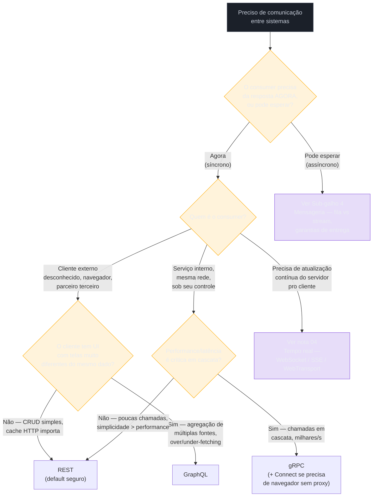

# O que está emergindo e framework de decisão

> [!abstract] TL;DR
> Toda geração de tecnologia de comunicação nasce resolvendo uma dor concreta de uma comunidade específica — e é fácil confundir "resolve minha dor" com "vai substituir tudo que veio antes". Esta nota mapeia cinco coisas emergindo agora — **tRPC** (RPC sem geração de código para monorepos 100% TypeScript), **Connect** (gRPC que funciona nativamente em navegador, sem proxy), **AsyncAPI** (o "OpenAPI dos eventos"), **CloudEvents** (o envelope padrão de evento adotado por AWS/Azure/Google) e **MCP** (o protocolo que conecta LLMs a ferramentas) — separando o que resolve uma dor real e permanece de onde a moda ainda não decantou. E fecha o sub-galho inteiro com uma árvore de decisão: dado que você já entende contrato ([[01 - O que é o contrato de comunicação]]), a história do RPC clássico ([[02 - RPC clássico e por que caiu]]), REST/GraphQL/gRPC ([[03 - A era REST, GraphQL, gRPC]]) e tempo real ([[04 - Comunicação em tempo real]]) — qual estilo você escolhe, e por quê?

Um time de plataforma de uma fintech (média, não gigante) está desenhando a comunicação de um produto novo do zero. O tech lead abre uma reunião de arquitetura com um slide de cinco tecnologias: tRPC, Connect, AsyncAPI, CloudEvents e — porque alguém do time leu um artigo na semana anterior — MCP. "Vamos adotar as cinco", ele propõe. "É pra onde o mercado está indo."

A reunião trava vinte minutos depois, quando alguém pergunta: "MCP resolve que problema *nosso*? A gente não está construindo um produto de IA que expõe ferramentas para um LLM. A gente está construindo um backend de pagamentos." Silêncio. Ninguém tinha uma resposta, porque ninguém tinha perguntado *qual dor* cada tecnologia resolve antes de colocá-la no slide — só que cada uma parecia estar "no radar".

Essa cena (recorrente, não factual de nenhuma empresa específica) resume o risco central de qualquer nota sobre "o que está emergindo": tecnologia nova gera um campo gravitacional que puxa adoção por hype, não por dor. E o antídoto não é ignorar o que é novo — é aplicar a mesma pergunta que atravessou as quatro notas anteriores deste sub-galho: **que dor específica essa tecnologia resolve, que a que eu já uso não resolve?** Se a resposta é concreta, vale investigar. Se a resposta é "é mais moderno", é hype — e hype, adotado cedo demais, é dívida técnica com prazo de vencimento oculto.

Esta nota percorre cinco tecnologias emergentes com essa pergunta em mãos, e termina fechando o sub-galho inteiro com um framework de decisão — a árvore que resume tudo que as quatro notas anteriores construíram, mais uma tabela curta de como cada linguagem trata essas decisões hoje.

## tRPC: RPC sem geração de código, só para quem já está 100% em TypeScript

A dor que motivou o tRPC é bem concreta e nasce de uma experiência frustrante e recorrente em times full-stack TypeScript: você define um endpoint no backend, define um tipo separado no frontend para consumir a resposta, e os dois começam a divergir silenciosamente. O backend adiciona um campo, renomeia outro, muda um tipo de `string` para `string | null` — e o frontend só descobre em produção, quando o campo esperado chega `undefined`. É o mesmo problema de acoplamento de dados descrito na [[01 - O que é o contrato de comunicação|nota 01]], mas numa versão particularmente dolorosa porque, tecnicamente, *o mesmo time* escreve os dois lados — o "drift" acontece mesmo sem fronteira organizacional.

A resposta do tRPC é radical em sua simplicidade: em vez de escrever um schema separado (um `.proto`, um SDL do GraphQL, um documento OpenAPI) e gerar código a partir dele, o tRPC faz o próprio código TypeScript do servidor *ser* o schema. O cliente importa apenas o tipo `AppRouter` do servidor — não a implementação, só o tipo — e o compilador TypeScript infere, através da fronteira de módulos, a forma exata de cada entrada e saída de cada procedimento. Não existe passo de build, não existe geração de código, não existe arquivo intermediário: a inferência de tipos do TypeScript, aplicada através do monorepo, faz o trabalho que normalmente exigiria um gerador de código como o `protoc` do gRPC ([tRPC — Move Fast and Break Nothing](https://trpc.io/); [How to Get Type Safety Without Code Generation Using tRPC and Hono, freeCodeCamp](https://www.freecodecamp.org/news/type-safety-without-code-generation-using-trpc-and-hono/)).

Isso é elegante — e também é exatamente o limite do tRPC. A técnica só funciona porque o compilador TypeScript consegue enxergar os dois lados do contrato *ao mesmo tempo*, dentro do mesmo grafo de módulos. No instante em que o consumer não é TypeScript — é um app mobile em Swift ou Kotlin, é um serviço em Go, é um parceiro externo que só fala HTTP — a mágica desaparece, porque não há como o compilador de outra linguagem "importar" um tipo TypeScript. tRPC não gera cliente para Go, Python ou Java; é TypeScript ponta a ponta ou não é nada ([tRPC vs gRPC: Which API Protocol Should You Choose in 2026?, Relia Software](https://reliasoftware.com/blog/trpc-vs-grpc)). Uma forma direta de resumir essa fronteira, citada por análises recentes do ecossistema: tRPC é um ótimo ótimo local para uma forma organizacional específica — uma única família de linguagem, disciplina de release compartilhada, e times de produto que valorizam velocidade mais que portabilidade poliglota; um backend mobile em Go, um time de serviço em Java e parceiros externos não se beneficiam da inferência TypeScript ([gRPC vs Connect-RPC vs tRPC 2026, APIScout](https://apiscout.dev/guides/grpc-vs-connect-rpc-vs-trpc-2026)).

Com ~2 milhões de downloads semanais em 2026, o tRPC se tornou o padrão de fato para aplicações full-stack TypeScript com um único cliente próprio — o cenário canônico é um monorepo Next.js/tRPC onde o mesmo time escreve API e frontend, sem nenhum consumer externo relevante ([Total Type Safety: TypeScript & tRPC in 2026](https://blog.weskill.org/2026/04/total-type-safety-typescript-trpc-in.html)). Não é sucessor de REST ou gRPC — é uma ferramenta de nicho muito bem talhada para o nicho que ataca. Fora dele, REST ou GraphQL continuam sendo a escolha, porque precisam de um contrato que qualquer linguagem consiga ler.

> [!question]- Se tRPC não serve fora de TypeScript, por que ele aparece tanto em conversa de arquitetura?
> Porque o cenário que ele resolve — monorepo full-stack TypeScript com um único frontend próprio — é extremamente comum no mundo de startups e produtos internos modernos (Next.js + Node/Bun no mesmo repositório). Para esse recorte específico, tRPC elimina uma classe inteira de bugs de "type drift" sem custo de infraestrutura adicional — nem geração de código, nem schema separado para manter sincronizado. É um caso onde a ferramenta certa para o nicho certo produz um ganho de produtividade real e mensurável, e por isso vira assunto — não porque vá substituir REST ou gRPC de forma ampla.

## Connect: gRPC que funciona no navegador sem proxy

A dor aqui é antiga e já apareceu na [[03 - A era REST, GraphQL, gRPC|nota 03]]: gRPC é ótimo para comunicação serviço-a-serviço, mas nunca funcionou bem em navegador, porque navegadores não dão ao JavaScript controle fino o suficiente sobre frames HTTP/2 para implementar o protocolo gRPC original. A solução histórica, gRPC-Web, resolve isso — mas exige um **proxy tradutor** (como o Envoy) entre o navegador e o backend gRPC, porque gRPC-Web fala um dialeto ligeiramente diferente do gRPC "de verdade". Esse proxy é uma peça de infraestrutura a mais para operar, depurar e manter.

A Buf (a empresa por trás do ecossistema moderno de ferramentas Protobuf) lançou o **Connect** em agosto de 2022 com uma proposta direta: um protocolo que fala HTTP idiomático desde a raiz — funciona nativamente em navegadores sem proxy, e ainda assim interopera com gRPC puro ([Connect-Web: It's time for Protobuf and gRPC to be your first choice in the browser, Buf](https://buf.build/blog/connect-web-protobuf-grpc-in-the-browser)). Um servidor Connect fala três protocolos simultaneamente — gRPC nativo, gRPC-Web e o protocolo Connect próprio — a partir do mesmo schema Protobuf e do mesmo código gerado, sem exigir nenhuma configuração extra para isso ([Introduction, Connect RPC](https://connectrpc.com/docs/introduction/)). Chamar uma API Connect é tão simples quanto usar `curl`: uma chamada unária no protocolo Connect é HTTP simples com corpo JSON ou Protobuf — nenhum cliente especial é necessário para inspecionar ou testar ([Connect: A better gRPC, Buf](https://buf.build/blog/connect-a-better-grpc)).

O ganho não é hipotético. Quando a própria Buf trocou gRPC-Web por Connect-Web no frontend do Buf Schema Registry, o bundle de JavaScript do serviço de demonstração encolheu 80% — porque a camada de tradução gRPC-Web, que precisa reimplementar boa parte do framing do HTTP/2 em JavaScript puro, simplesmente deixa de existir ([ConnectRPC: Where is it now?, kmcd.dev](https://kmcd.dev/posts/connectrpc-where-is-it-now/)).

O que separa Connect de ser "só mais um framework RPC" é que ele resolve uma dor de infraestrutura muito específica — eliminar o proxy tradutor — sem abrir mão do schema Protobuf tipado e do código gerado que fazem o gRPC valioso em primeiro lugar. É a mesma motivação do gRPC (tipagem forte, contrato explícito via `.proto`), aplicada a um lugar onde gRPC clássico nunca coube bem: o navegador e ambientes que exigem HTTP simples. Ele não compete com tRPC — resolve um problema diferente (poliglota, tipado via Protobuf) do que tRPC resolve (TypeScript puro, sem geração de código).

> [!warning] Confundir "funciona no navegador" com "substitui REST"
> **O que acontece:** um time lê sobre Connect, gosta da experiência de desenvolvimento, e propõe migrar toda a API pública — inclusive a consumida por parceiros externos via ferramentas genéricas de HTTP — para Connect. **Por quê:** Connect resolve bem o caso "meu próprio frontend consumindo meu próprio backend com tipagem forte compartilhada" — um cenário parecido ao do tRPC, mas poliglota. Para consumers realmente externos e desconhecidos (parceiros, terceiros, ferramentas genéricas), a simplicidade universal do REST sobre JSON ainda vence: qualquer cliente HTTP entende REST sem instalar nenhuma ferramenta de geração de código. **Como evitar:** aplicar a mesma pergunta de sempre — quem são os consumers desta API, e eles se beneficiam de tipagem Protobuf compartilhada, ou só precisam de "me dá o JSON"? Se é a segunda, REST continua sendo o piso correto.

## AsyncAPI: o "OpenAPI dos eventos"

Toda a comparação REST/GraphQL/gRPC deste sub-galho pressupõe comunicação síncrona — request/response. Mas o [[01 - O que é o contrato de comunicação|eixo mestre da nota 01]] também cobre o lado assíncrono, e ali existe uma lacuna de tooling que o OpenAPI nunca resolveu: OpenAPI foi desenhado para request-response síncrono sobre HTTP — assume que um cliente chama uma URL e espera um corpo JSON voltar. Pub/sub simplesmente não funciona assim: não há "requisição" nem "resposta" no sentido clássico, e sim canais, tópicos e mensagens que fluem numa direção ([What Is AsyncAPI? The Spec for Event-Driven APIs in 2026, Docsio](https://docsio.co/blog/asyncapi)).

O **AsyncAPI** nasce exatamente dessa lacuna: descreve APIs assíncronas, orientadas a evento — pub/sub sobre Kafka, MQTT, AMQP, WebSocket, NATS e protocolos similares — enquanto o OpenAPI descreve APIs REST síncronas — request e resposta sobre HTTP ([AsyncAPI: Bringing OpenAPI to Event-Driven Systems](https://james-carr.org/posts/2026-01-16-asyncapi-event-driven-documentation/)). A analogia com OpenAPI é deliberada e vai além do nome: assim como um documento OpenAPI permite gerar SDKs, validar contratos e alimentar um portal de documentação a partir de uma única especificação de uma API REST, um documento AsyncAPI faz o mesmo para uma API orientada a evento — descreve os canais (tópicos/filas), as mensagens que trafegam por eles, e os *bindings* específicos de cada protocolo (partições e tópicos do Kafka, exchanges e filas do AMQP, níveis de QoS do MQTT, parâmetros e headers de WebSocket) ([Introduction, AsyncAPI Initiative](https://www.asyncapi.com/docs/concepts/asyncapi-document)).

Em 2026 a especificação está na versão 3.1, com melhorias recentes que incluem especificação de latência de entrega de evento para frameworks de streaming como Apache Flink e Spark, e lógica AND que permite exigir múltiplos mecanismos de segurança simultaneamente ([3.1.0, AsyncAPI Initiative](https://www.asyncapi.com/docs/reference/specification/v3.1.0)). A adoção tem tração real: 86% dos líderes de TI citam data streaming como prioridade estratégica de topo, segundo o Relatório de Data Streaming 2025 da Confluent, o que empurra a demanda por um jeito padronizado de documentar contratos de eventos ([What Is AsyncAPI?, Docsio](https://docsio.co/blog/asyncapi)).

O ponto que separa AsyncAPI de moda passageira: ele não inventa um problema novo — ele preenche uma lacuna de tooling que a comunidade de mensageria sentia há anos (documentar um tópico Kafka de forma que gere código de producer/consumer, valide compatibilidade de schema e alimente um portal, do mesmo jeito que Swagger/OpenAPI já fazia para REST). Isso é adoção puxada por dor real, não por moda — mas ainda é um ecossistema jovem comparado à maturidade de 20+ anos do REST/OpenAPI, e vale tratar como "ainda consolidando", não "padrão universal já estabelecido".

## CloudEvents: o envelope padrão que a nuvem inteira concordou em usar

Se AsyncAPI descreve *a aplicação* — os canais, quem publica, quem assina — falta ainda um pedaço: como o **evento em si** é formatado, de forma que qualquer sistema, de qualquer fornecedor, consiga interpretá-lo sem um adaptador customizado. É esse o problema que o **CloudEvents** resolve: uma especificação CNCF que define um envelope padrão para metadados de evento — de onde veio, que tipo de evento é, quando aconteceu, qual o identificador — deixando o corpo específico do evento livre para o que a aplicação precisar carregar ([CNCF CloudEvents: A Li'l Message Envelope That Travels Far, The New Stack](https://thenewstack.io/cncf-cloudevents-a-lil-message-envelope-that-travels-far/)).

CloudEvents e AsyncAPI não competem — são complementares, e a diferença de escopo é precisa: CloudEvents foca no *evento* — define um envelope para os dados da sua aplicação, especificando metadados obrigatórios (como origem e tipo do evento) num envelope padrão; AsyncAPI foca na *aplicação* — como suas aplicações orientadas a evento se comunicam com o resto do mundo, os canais que usam ([AsyncAPI and CloudEvents, AsyncAPI Initiative](https://www.asyncapi.com/blog/asyncapi-cloud-events)). Na prática, um documento AsyncAPI pode descrever um canal cujo *payload* é, especificamente, um evento no formato CloudEvents — as duas specs se encaixam em camadas diferentes do mesmo problema, e usá-las juntas dá uma descrição completa: definição da aplicação, descrição dos canais, envelope estruturado, e dado funcional detalhado carregado no evento ([Simulating CloudEvents with AsyncAPI and Microcks, Red Hat Developer](https://developers.redhat.com/articles/2021/06/02/simulating-cloudevents-asyncapi-and-microcks)).

O sinal mais forte de que CloudEvents não é hype é a linha do tempo de maturação dentro da CNCF: aceito pela CNCF em maio de 2018, promovido a Incubating em outubro de 2019, e **graduado** — o nível de maturidade máximo da CNCF, reservado a projetos com adoção ampla, governança estável e uso em produção comprovado — em janeiro de 2024 ([Cloud Native Computing Foundation Announces the Graduation of CloudEvents](https://www.cncf.io/announcements/2024/01/25/cloud-native-computing-foundation-announces-the-graduation-of-cloudevents/)). A lista de adotantes confirma que isso não é teoria: o AWS EventBridge suporta enviar CloudEvents no formato JSON v1.0 e no *binding* HTTP; o Azure Event Grid tem suporte de primeira classe ao formato; o Google Cloud Eventarc suporta CloudEvents nativamente; e, dentro do ecossistema CNCF, o Knative Eventing usa CloudEvents como formato nativo de evento para construir aplicações orientadas a evento sobre Kubernetes ([Sending and receiving CloudEvents with Amazon EventBridge, AWS Compute Blog](https://aws.amazon.com/blogs/compute/sending-and-receiving-cloudevents-with-amazon-eventbridge/); [How to Use CloudEvents Schema with Azure Event Grid](https://oneuptime.com/blog/post/2026-02-16-how-to-use-cloudevents-schema-with-azure-event-grid/view); [CloudEvents, CNCF](https://www.cncf.io/projects/cloudevents/)). Mais de 340 contribuidores de 122 organizações diferentes passaram pelo projeto desde sua criação — um sinal de adoção ampla, não de nicho de entusiastas ([CloudEvents](https://cloudevents.io/)).

Vale a comparação direta com [[02 - RPC clássico e por que caiu|a nota 02]]: CORBA e DCOM também prometiam interoperabilidade universal e falharam porque cada fornecedor implementava sua própria variação incompatível. CloudEvents evita esse destino ao ser deliberadamente minúsculo em escopo — define só o envelope de metadados, não um framework de RPC completo, não um formato de payload obrigatório — e ao nascer já dentro da governança neutra da CNCF, em vez de sob o controle de um único fornecedor.

## MCP: o protocolo que conecta LLMs a ferramentas — e por que ele mora, principalmente, em outro domínio

A quinta tecnologia do slide de abertura é diferente das outras quatro em uma dimensão importante: seu motivo de existir não é comunicação serviço-a-serviço tradicional, é conectar um modelo de linguagem a fontes de dados e ferramentas externas de forma padronizada. A Anthropic lançou o **Model Context Protocol (MCP)** como um padrão aberto em novembro de 2024, para resolver um problema que toda equipe construindo agentes de IA enfrentava de forma redundante: cada integração de um LLM com uma ferramenta externa (um banco de dados, uma API, um sistema de arquivos) exigia código de integração customizado, sem reuso entre projetos ou fornecedores de modelo ([Introducing the Model Context Protocol, Anthropic](https://www.anthropic.com/news/model-context-protocol)).

Tecnicamente, MCP é construído sobre uma base que já apareceu nesta trilha: é um protocolo baseado em **JSON-RPC 2.0**, com uma camada de dados que define o formato de mensagem e três primitivas centrais — *Tool* (uma ação executável), *Resource* (dado só-leitura) e *Prompt* (um template reutilizável de interação) — e uma camada de transporte deliberadamente agnóstica, que roda sobre stdio (para processos locais na mesma máquina) ou sobre HTTP com Server-Sent Events opcional (para servidores remotos) ([Architecture overview, Model Context Protocol](https://modelcontextprotocol.io/docs/learn/architecture); [Model Context Protocol & JSON-RPC: How MCP Actually Works, Latenode](https://latenode.com/blog/model-context-protocol-json-rpc)). Em outras palavras: é RPC clássico — o mesmo padrão de chamada remota de procedimento que atravessou toda a [[02 - RPC clássico e por que caiu|nota 02]] — reaplicado a um domínio novo, com um vocabulário (tools/resources/prompts) desenhado especificamente para o que um agente de IA precisa fazer.

A velocidade de adoção surpreendeu boa parte do mercado. Depois do lançamento em novembro de 2024, a OpenAI adotou oficialmente o MCP em março de 2025, integrando o padrão em seus produtos, incluindo o app desktop do ChatGPT; o Google adotou MCP em seu stack de agentes Gemini ainda em 2025 ([Model Context Protocol - Wikipedia](https://en.wikipedia.org/wiki/Model_Context_Protocol)). Em dezembro de 2025, a Anthropic doou o MCP para a Agentic AI Foundation (AAIF), um fundo dirigido sob a Linux Foundation, cofundado por Anthropic, Block e OpenAI — movendo a governança do protocolo para fora do controle de um único fornecedor, o mesmo movimento de maturação que CloudEvents fez dentro da CNCF ([Donating the Model Context Protocol and establishing the Agentic AI Foundation, Anthropic](https://www.anthropic.com/news/donating-the-model-context-protocol-and-establishing-of-the-agentic-ai-foundation)). Em números: o MCP atingiu 97 milhões de downloads mensais de SDK em março de 2026, subindo de aproximadamente 2 milhões no lançamento em novembro de 2024, com mais de 10 mil servidores MCP públicos ativos cobrindo desde ferramentas de desenvolvedor até implantações em empresas da Fortune 500 ([MCP Hits 97M Downloads, Digital Applied](https://www.digitalapplied.com/blog/mcp-97-million-downloads-model-context-protocol-mainstream)).

Por que essa curva de adoção — comparável ou maior que a de qualquer outra tecnologia desta nota — não vira o assunto central desta trilha? Porque o problema que MCP resolve fica, deliberadamente, fora do escopo desta trilha: esta trilha cobre comunicação **entre sistemas de software tradicionais** — serviços, APIs, filas — enquanto MCP resolve comunicação entre um **modelo de linguagem** e ferramentas externas, um problema de um domínio adjacente (IA/agentes) que já tem sua própria casa no vault. Quem quiser aprofundar MCP — arquitetura completa, segurança, servidores oficiais, casos de uso de mercado — encontra em [[03-Dominios/Tecnologia/IA/MCP/01 - O que é MCP e por que importa|IA/MCP]]. O que fica registrado aqui é só o reconhecimento estrutural: por baixo do jargão de "tools" e "prompts", MCP é RPC — o mesmo padrão arquitetural desta trilha inteira, reaplicado a um novo tipo de consumer (um LLM em vez de um processo tradicional).

> [!question]- Vale a pena aprender MCP mesmo não trabalhando com IA?
> Vale entender o *padrão* — JSON-RPC com transporte agnóstico e um vocabulário de capacidades bem definido — porque esse padrão de design (separar "o que pode ser chamado" de "como os bytes trafegam") é reutilizável em qualquer RPC que você desenhar, com ou sem IA envolvida. O que não compensa, fora do domínio de IA, é aprender os detalhes de implementação de MCP (SDKs específicos, formatos de tool schema) — isso é investimento de tempo específico do domínio de agentes, não de comunicação entre sistemas em geral.

## O que é hype e o que fica: uma leitura honesta

Antes da árvore de decisão, vale nomear o julgamento que atravessou as quatro seções anteriores — porque é esse julgamento, mais do que qualquer feature individual, que separa quem lê tendência de quem só repete buzzword.

| Tecnologia | Dor real que resolve | Sinal de que não é só hype | Onde fica: nicho ou mainstream? |
|---|---|---|---|
| **tRPC** | Type drift entre client/server no mesmo repositório TypeScript | ~2M downloads/semana; virou padrão de fato em stacks Next.js full-stack | Nicho **muito bem definido** (monorepo 100% TS) — não generaliza |
| **Connect** | Proxy obrigatório do gRPC-Web em navegador | Buf trocou toda sua própria infraestrutura por Connect; adoção crescente em quem já usa Protobuf | Nicho técnico (times já investidos em gRPC/Protobuf que precisam de browser) |
| **AsyncAPI** | Falta de um "OpenAPI" para pub/sub | Spec madura (v3.1), CNCF-adjacente, tooling crescendo, mas ainda jovem vs. 20 anos de OpenAPI | Consolidando — vale acompanhar, ainda não é universal |
| **CloudEvents** | Falta de um envelope de evento padrão entre fornecedores de nuvem | Graduado na CNCF (2024), adotado nativamente por AWS/Azure/GCP/Knative | **Já é fato consumado** para quem integra múltiplas nuvens/brokers |
| **MCP** | Integração customizada e não-reusável entre LLM e ferramenta externa | Adotado por Anthropic, OpenAI, Google; doado para fundação neutra; 97M downloads/mês | Mainstream — mas em domínio adjacente (IA), não nesta trilha |

O padrão que emerge: **quanto mais estreito e concreto o problema que a tecnologia ataca, mais fácil separar sinal de ruído**. CloudEvents resolve uma coisa específica (formato de envelope) e por isso amadureceu rápido e de forma verificável — dá para checar, objetivamente, quem adotou. tRPC resolve uma coisa específica (type-safety num monorepo TS) e por isso tem adoção sólida *dentro do seu nicho*, sem pretender ser mais que isso. As tecnologias que preocupam são as que prometem resolver "tudo" — aí normalmente é hype disfarçado de arquitetura.

> [!warning] Adotar tecnologia emergente cedo demais é dívida técnica com prazo escondido
> **O que acontece:** um time adota uma tecnologia ainda em consolidação (baixa maturidade de tooling, comunidade pequena, specs ainda mudando) porque ela promete resolver um problema real — mas descobre, meses depois, que faltam bibliotecas maduras no seu stack, documentação é escassa, e contratar quem já conhece a ferramenta é difícil. **Por quê:** a curva de maturação de uma spec (draft → adoção ampla → tooling maduro → contratável no mercado) normalmente leva anos, não meses — CloudEvents levou de 2018 a 2024 para graduar na CNCF. Adotar no meio dessa curva significa herdar instabilidade que a spec ainda está resolvendo. **Como evitar:** perguntar, antes de adotar algo emergente em produção: "se essa tecnologia sumir ou mudar radicalmente em 18 meses, qual o custo de migrar de volta?" Se a resposta é "alto" (schema espalhado por dezenas de serviços, por exemplo), prefira esperar a curva de maturação avançar — ou isolar a adoção atrás de uma camada de abstração que absorva a mudança.

## A árvore de decisão: fechando o sub-galho inteiro

Chegou a hora de amarrar as quatro notas anteriores numa única pergunta guiada. Toda decisão de comunicação entre sistemas começa no mesmo lugar — o eixo mestre da [[01 - O que é o contrato de comunicação|nota 01]] — e se ramifica a partir dali.

Lendo a árvore de cima para baixo, ela é literalmente o resumo das quatro notas anteriores mais esta:

1. **Síncrono vs assíncrono** ([[01 - O que é o contrato de comunicação|nota 01]]) é sempre a primeira bifurcação — antes de qualquer protocolo específico, decida se o consumer pode tolerar esperar.
2. Se assíncrono, você sai desta sub-trilha e entra no Sub-galho 4 (mensageria) — fila de tarefa vs log de eventos, garantias de entrega, Outbox/Saga.
3. Se síncrono, a pergunta seguinte é **quem é o consumer** — é aqui que a história da [[02 - RPC clássico e por que caiu|nota 02]] ecoa: RPC clássico (CORBA, DCOM) caiu justamente por tentar servir *todos* os consumers com o mesmo protocolo binário fortemente acoplado, e a geração REST/GraphQL/gRPC ([[03 - A era REST, GraphQL, gRPC|nota 03]]) venceu ao aceitar que **consumers diferentes justificam protocolos diferentes**.
4. Se o consumer precisa de push contínuo do servidor (não só pergunta-e-resposta pontual), a decisão sai do escopo request-response e cai na [[04 - Comunicação em tempo real|nota 04]] — WebSocket, SSE ou WebTransport, dependendo de bidirecionalidade e transporte.
5. tRPC e Connect, as duas tecnologias emergentes de RPC discutidas nesta nota, entram como **variações dentro dos ramos gRPC/REST** — não como ramos novos: tRPC é "REST-like, mas só quando o consumer também é seu próprio time TypeScript"; Connect é "gRPC, mas quando o consumer inclui navegador sem proxy".

> [!question]- Essa árvore serve para qualquer sistema, sempre?
> Serve como ponto de partida, não como veredito automático. Sistemas reais raramente são uma única resposta — um e-commerce típico usa REST na borda pública, GraphQL no painel administrativo agregando múltiplas fontes, e gRPC entre microsserviços internos, tudo ao mesmo tempo (esse exato cenário composto está detalhado no exemplo trabalhado da [[03 - A era REST, GraphQL, gRPC|nota 03]]). A árvore ajuda a decidir *uma* interação por vez — a pergunta certa nunca é "qual protocolo eu uso no meu sistema?", é "qual protocolo eu uso *nesta* borda, para *este* consumer?".

## Comparação por linguagem: como cada uma trata isso hoje

Fechando o sub-galho, uma tabela curta — não um tutorial — de como cada linguagem do roster desta trilha (Java, TypeScript, Python, Go) lida com os três estilos hoje, em julho de 2026.

| | REST | gRPC | Tempo real / RPC alternativo |
|---|---|---|---|
| **Java** | Spring MVC/WebFlux é o padrão de fato havia décadas; `Java/Web e APIs REST` cobre em profundidade | **Spring gRPC**, projeto oficial do time Spring, ganhou auto-configuração nativa a partir do Spring Boot 4.1 (jun. 2026) — some a necessidade do starter comunitário `grpc-spring-boot-starter` para novos projetos ([Spring Boot Versions, HeroDevs](https://www.herodevs.com/blog-posts/spring-boot-versions-eol-dates-and-latest-releases-april-2026); [Spring gRPC](https://spring.io/projects/spring-grpc/)) | WebSocket via Spring; sem equivalente a tRPC (a inferência de tipo cross-módulo do TS não existe em Java) |
| **TypeScript / Node** | Amplamente usado (Express/Fastify/Hono); `Node/Integrações` cobre gRPC via `grpc-js`, GraphQL via Apollo/Mercurius | Suportado via `grpc-js`, mas menos idiomático que em Go/Java | **É a única linguagem onde tRPC faz sentido** — a peculiaridade central desta nota: inferência de tipo ponta a ponta sem geração de código só existe porque cliente e servidor compilam no mesmo grafo TypeScript |
| **Python** | FastAPI é o padrão moderno de fato, com tipagem via Pydantic | Suportado nativamente (`grpcio`), mas GraphQL via **Strawberry** (tipagem nativa por type hints, integração de primeira classe com FastAPI) tende a ser a escolha para agregação de tela ([FastAPI, Strawberry GraphQL](https://strawberry.rocks/docs/integrations/fastapi)) | Sem tRPC nem Connect nativos de peso; ecossistema gRPC maduro mas menos idiomático que Go |
| **Go** | Suportado, mas gRPC costuma ser a escolha default para serviço-a-serviço — não uma alternativa | **gRPC é cidadão de primeira classe**: o servidor da API do Kubernetes, serviços internos do GitHub e a infraestrutura de borda da Cloudflare rodam em Go sobre gRPC, e o padrão comum é "REST/JSON para fronteira externa, gRPC/Protobuf para interno" ([Golang RESTful & gRPC APIs, NewAge SysIT](https://newagesysit.com/blog/golang-api-in-the-united-states-building-restful-grpc-apis-for-enterprise-applications/)) | Connect nasceu com forte suporte em Go (`connect-go` foi a primeira implementação da Buf, substituindo `grpc-go` internamente) ([ConnectRPC: Where is it now?](https://kmcd.dev/posts/connectrpc-where-is-it-now/)) |

A leitura de fundo desta tabela: **gRPC generaliza bem entre as quatro linguagens** (é justamente sua proposta — poliglota por design, com 11+ linguagens suportadas oficialmente), enquanto **tRPC é uma peculiaridade legítima, não uma lacuna das outras linguagens** — ele não existe fora do TypeScript porque a técnica que o viabiliza (inferência de tipo cross-módulo em tempo de compilação) depende de um recurso específico do sistema de tipos do TypeScript, não de imaturidade de tooling em Java/Python/Go.

## Em entrevista

Perguntas sobre "o que está emergindo" aparecem com frequência crescente em entrevistas sêniores — não para testar se você decorou uma lista de ferramentas novas, mas para testar **critério de julgamento sob incerteza**, o mesmo eixo central avaliado em [[03-Dominios/Engenharia/Arquitetura/System Design/1 - Framework de entrevista/01 - O que é System Design e o que a entrevista avalia|entrevistas de system design]].

Uma pergunta comum: "o que você acha de tRPC/Connect/AsyncAPI? Vale adotar?" A resposta fraca é uma opinião genérica ("é legal", "parece promissor"). A resposta forte nomeia a dor específica que a tecnologia resolve e verifica se ela existe no seu contexto: "tRPC resolve type drift num monorepo TypeScript — se o time todo é TS e não há consumer externo relevante, faz sentido considerar. Se há um app mobile nativo ou um serviço em outra linguagem no roadmap, tRPC vira um beco sem saída e eu ficaria com REST ou gRPC."

Outra forma comum: "como você decide entre REST, GraphQL e gRPC para um sistema novo?" — que é literalmente a árvore de decisão desta nota, dita em voz alta: primeiro síncrono/assíncrono, depois quem é o consumer (externo desconhecido vs. interno controlado vs. agregador de tela), depois se performance em cascata é crítica.

> [!warning] Citar a tecnologia mais nova como resposta automática é red flag
> **O que acontece:** perguntado sobre uma decisão de comunicação, o candidato responde citando a ferramenta mais recente que conhece (tRPC, Connect, o que for), sem examinar se o contexto da pergunta pede por ela. **Por quê:** entrevistadores sêniores frequentemente incluem, de propósito, um detalhe no enunciado que invalida a tecnologia "da moda" — um consumer poliglota que mata a viabilidade do tRPC, por exemplo. Quem não presta atenção ao contexto cai na armadilha. **Como evitar:** a resposta madura sempre passa pela pergunta "quem são os consumers desta interação, e essa tecnologia foi desenhada para eles?" antes de nomear qualquer ferramenta.

## How to explain in English

None of these five technologies compete head-to-head with REST, GraphQL, or gRPC — each solves a narrow, specific pain that the established options don't address well, and understanding *which* pain is what separates real adoption from hype.

tRPC eliminates type drift between client and server, but only inside a single TypeScript codebase — it's not a general RPC replacement, it's a monorepo-specific optimization. Connect solves the browser-without-proxy problem that gRPC-Web never fully fixed, while keeping the strongly-typed Protobuf contract. AsyncAPI and CloudEvents are complementary: CloudEvents standardizes the event envelope (the "what"), AsyncAPI standardizes how event-driven applications describe their channels (the "how they talk"). MCP is architecturally just RPC — JSON-RPC with a transport-agnostic layer — reapplied to a new kind of consumer, an LLM instead of a traditional process.

> "Before I'd adopt any of these, I'd ask: what specific pain does this solve that my current stack doesn't? If the answer is concrete — like 'my frontend and backend are both TypeScript in one repo and we keep shipping type mismatches' — that's a real signal. If the answer is 'it's newer,' that's hype, and adopting it early means inheriting instability the spec is still working through."

| PT | EN |
|----|----|
| Geração de código | Code generation |
| Inferência de tipo (cross-módulo) | (Cross-module) type inference |
| Drift de tipo | Type drift |
| Monorepo | Monorepo |
| Envelope (de evento) | Envelope |
| Payload | Payload |
| Especificação / spec | Specification / spec |
| Maturidade (de um projeto open source) | Maturity |
| Graduado (nível CNCF) | Graduated |
| Governança neutra | Vendor-neutral governance |
| Poliglota | Polyglot |
| Ótimo local | Local optimum |
| Dívida técnica | Technical debt |
| Curva de adoção | Adoption curve |

## O que vem a seguir

Este sub-galho — o mapa antes do território — está completo. Você agora entende o contrato como abstração central, sabe por que a geração de RPC clássico caiu e onde ela sobrevive, entende as motivações que separam REST/GraphQL/gRPC, viu como comunicação em tempo real resolve um problema que nenhum dos três ataca nativamente, e tem, nesta nota, tanto o panorama do que está emergindo quanto uma árvore que resume a decisão inteira.

O próximo passo da trilha é descer da motivação para a técnica: o **Sub-galho 2 — Comunicação síncrona** aprofunda tecnicamente cada ramo direito da árvore acima — modelagem de recursos e o Richardson Maturity Model em REST, schema e resolvers em GraphQL, Protocol Buffers e os quatro tipos de streaming em gRPC — e fecha com uma comparação final de documentação como contrato (OpenAPI vs `.proto` vs SDL) e contract testing.

- **Sub-galho 2 — Comunicação síncrona** (ainda não escrito) — REST (Richardson Maturity Model, HATEOAS/HAL), GraphQL (schema, resolvers, DataLoader), gRPC (Protobuf, streaming) em profundidade técnica
- [[Comunicação entre Sistemas/index|Comunicação entre Sistemas]] — o galho-pai e o mapa da trilha inteira

## Veja também

- [[01 - O que é o contrato de comunicação]] — o eixo síncrono/assíncrono que esta árvore de decisão fecha
- [[02 - RPC clássico e por que caiu]] — por que RPC binário fortemente acoplado (o ancestral do MCP e do gRPC) caiu na primeira geração
- [[03 - A era REST, GraphQL, gRPC]] — a motivação de cada um dos três estilos que a árvore desta nota ramifica
- [[04 - Comunicação em tempo real]] — o ramo de push contínuo que a árvore desta nota referencia
- [[03-Dominios/Tecnologia/IA/MCP/01 - O que é MCP e por que importa|IA/MCP — O que é MCP e por que importa]] — aprofundamento completo do Model Context Protocol, fora do escopo desta trilha
- [[Mensageria/index|Mensageria]] — ferramenta específica de broker (Kafka, RabbitMQ, BullMQ), referência para o Sub-galho 4

## Fontes

- tRPC — [*Move Fast and Break Nothing*](https://trpc.io/) (acessado jul. 2026) — página oficial, proposta de valor central.
- freeCodeCamp — [*How to Get Type Safety Without Code Generation Using tRPC and Hono*](https://www.freecodecamp.org/news/type-safety-without-code-generation-using-trpc-and-hono/) (2026) — mecânica de inferência de tipo do tRPC.
- Relia Software — [*tRPC vs gRPC: Which API Protocol Should You Choose in 2026?*](https://reliasoftware.com/blog/trpc-vs-grpc) (2026) — limites poliglotas do tRPC, benchmarks de payload/latência.
- APIScout — [*gRPC vs Connect-RPC vs tRPC 2026*](https://apiscout.dev/guides/grpc-vs-connect-rpc-vs-trpc-2026) (2026) — comparação de arquitetura e "ótimo local" do tRPC.
- blog.weskill.org — [*Total Type Safety: TypeScript & tRPC in 2026*](https://blog.weskill.org/2026/04/total-type-safety-typescript-trpc-in.html) (abr. 2026) — números de adoção do tRPC.
- Buf — [*Connect: A better gRPC*](https://buf.build/blog/connect-a-better-grpc) (ago. 2022) — anúncio original do Connect.
- Buf — [*Connect-Web: It's time for Protobuf and gRPC to be your first choice in the browser*](https://buf.build/blog/connect-web-protobuf-grpc-in-the-browser) (2022) — motivação do Connect-Web, eliminação do proxy.
- Connect RPC — [*Introduction*](https://connectrpc.com/docs/introduction/) (acessado jul. 2026) — documentação oficial, suporte a três protocolos.
- kmcd.dev — [*ConnectRPC: Where is it now?*](https://kmcd.dev/posts/connectrpc-where-is-it-now/) (2026) — retrospectiva de adoção, redução de 80% de bundle na Buf.
- Docsio — [*What Is AsyncAPI? The Spec for Event-Driven APIs in 2026*](https://docsio.co/blog/asyncapi) (2026) — motivação, estatística de adoção (Confluent 2025 Data Streaming Report).
- AsyncAPI Initiative — [*3.1.0 Specification*](https://www.asyncapi.com/docs/reference/specification/v3.1.0) (2026) — versão atual da spec.
- AsyncAPI Initiative — [*Introduction*](https://www.asyncapi.com/docs/concepts/asyncapi-document) (acessado jul. 2026) — conceito de documento AsyncAPI, bindings por protocolo.
- james-carr.org — [*AsyncAPI: Bringing OpenAPI to Event-Driven Systems*](https://james-carr.org/posts/2026-01-16-asyncapi-event-driven-documentation/) (jan. 2026) — comparação direta com OpenAPI.
- The New Stack — [*CNCF CloudEvents: A Li'l Message Envelope That Travels Far*](https://thenewstack.io/cncf-cloudevents-a-lil-message-envelope-that-travels-far/) (acessado jul. 2026) — escopo e motivação do CloudEvents.
- CNCF — [*Cloud Native Computing Foundation Announces the Graduation of CloudEvents*](https://www.cncf.io/announcements/2024/01/25/cloud-native-computing-foundation-announces-the-graduation-of-cloudevents/) (25 jan. 2024) — graduação CNCF, linha do tempo de maturação.
- CNCF — [*CloudEvents*](https://www.cncf.io/projects/cloudevents/) (acessado jul. 2026) — página do projeto, número de adotantes.
- CloudEvents.io — [*CloudEvents*](https://cloudevents.io/) (acessado jul. 2026) — estatística de contribuidores e organizações.
- AWS Compute Blog — [*Sending and receiving CloudEvents with Amazon EventBridge*](https://aws.amazon.com/blogs/compute/sending-and-receiving-cloudevents-with-amazon-eventbridge/) (acessado jul. 2026) — suporte AWS EventBridge.
- OneUptime — [*How to Use CloudEvents Schema with Azure Event Grid*](https://oneuptime.com/blog/post/2026-02-16-how-to-use-cloudevents-schema-with-azure-event-grid/view) (fev. 2026) — suporte Azure Event Grid.
- AsyncAPI Initiative — [*AsyncAPI and CloudEvents*](https://www.asyncapi.com/blog/asyncapi-cloud-events) (acessado jul. 2026) — relação de complementaridade entre as duas specs.
- Red Hat Developer — [*Simulating CloudEvents with AsyncAPI and Microcks*](https://developers.redhat.com/articles/2021/06/02/simulating-cloudevents-asyncapi-and-microcks) (2021, referenciado 2026) — uso combinado das duas specs.
- Anthropic — [*Introducing the Model Context Protocol*](https://www.anthropic.com/news/model-context-protocol) (nov. 2024) — anúncio oficial do MCP.
- Model Context Protocol — [*Architecture overview*](https://modelcontextprotocol.io/docs/learn/architecture) (acessado jul. 2026) — camadas de dados e transporte, primitivas Tool/Resource/Prompt.
- Latenode — [*Model Context Protocol & JSON-RPC: How MCP Actually Works*](https://latenode.com/blog/model-context-protocol-json-rpc) (2026) — base JSON-RPC 2.0 do MCP.
- Wikipedia — [*Model Context Protocol*](https://en.wikipedia.org/wiki/Model_Context_Protocol) (acessado jul. 2026) — linha do tempo de adoção por OpenAI e Google.
- Anthropic — [*Donating the Model Context Protocol and establishing the Agentic AI Foundation*](https://www.anthropic.com/news/donating-the-model-context-protocol-and-establishing-of-the-agentic-ai-foundation) (dez. 2025) — doação de governança para a AAIF/Linux Foundation.
- Digital Applied — [*MCP Hits 97M Downloads*](https://www.digitalapplied.com/blog/mcp-97-million-downloads-model-context-protocol-mainstream) (2026) — números de adoção em março de 2026.
- HeroDevs — [*Spring Boot Versions, EOL Dates, and Latest Releases (July 2026)*](https://www.herodevs.com/blog-posts/spring-boot-versions-eol-dates-and-latest-releases-april-2026) (jul. 2026) — Spring Boot 4.1 e gRPC auto-configuration.
- Spring — [*Spring gRPC*](https://spring.io/projects/spring-grpc/) (acessado jul. 2026) — projeto oficial Spring gRPC.
- Strawberry GraphQL — [*FastAPI integration*](https://strawberry.rocks/docs/integrations/fastapi) (acessado jul. 2026) — Strawberry como GraphQL idiomático para FastAPI.
- NewAge SysIT — [*Golang RESTful & gRPC APIs for US Enterprise Apps 2026*](https://newagesysit.com/blog/golang-api-in-the-united-states-building-restful-grpc-apis-for-enterprise-applications/) (2026) — gRPC como cidadão de primeira classe em Go, casos Kubernetes/GitHub/Cloudflare.
