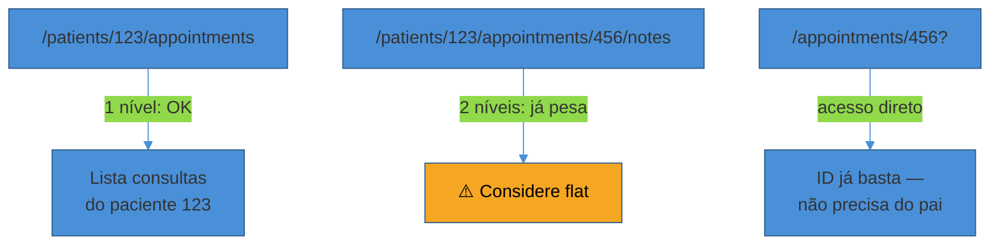
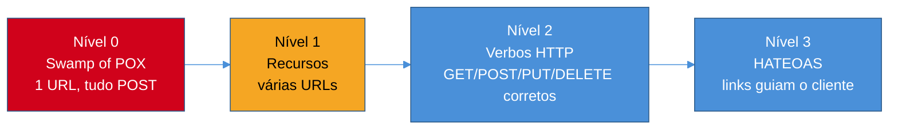

# REST — modelagem de recursos e maturidade

> [!abstract] TL;DR
> Modelar um recurso REST é traduzir o vocabulário do seu domínio em substantivos — `/patients`, não `/getPatient` — e usar os verbos HTTP para expressar a ação, não o path. As regras práticas (plural consistente, kebab-case no path, no máximo um nível de nesting, ações fora do CRUD como sub-resource action) resolvem 90% dos casos do dia a dia. O que a maioria dos times pula é o outro eixo, o de **maturidade**: o Richardson Maturity Model descreve quatro níveis, de "uma URL só, tudo POST" (nível 0) até HATEOAS (nível 3) — onde a resposta da API não só descreve o dado, mas também as ações possíveis a partir dele, via links. Quase toda API de produção séria para no nível 2 (recursos + verbos HTTP corretos); nível 3 é teoricamente "REST completo" segundo a definição original de Roy Fielding, mas é raro na prática — e entender exatamente por que é raro, não só que é raro, é o que separa quem decorou o modelo de quem sabe usá-lo numa decisão real.

Um time começa uma API nova do zero. A primeira decisão parece trivial: "como eu chamo o endpoint que aprova um pedido?" Alguém sugere `POST /approveOrder`. Outro discorda: "isso não é REST, isso é RPC com roupa de REST." Uma terceira pessoa lembra de um curso que fez — "REST de verdade tem uns níveis, tipo, o nível mais alto usa link nas respostas" — mas ninguém no time sabe dizer com precisão o que isso significa na prática, nem se vale a pena perseguir.

Essa cena se repete o tempo todo, e ela mistura dois problemas diferentes que vale separar desde já. O primeiro é de **vocabulário**: como nomear e estruturar os recursos — singular ou plural, nested ou flat, o que fazer quando uma ação não é um CRUD óbvio. O segundo é de **maturidade**: o quanto a sua API usa, de fato, os mecanismos que tornam uma interface "hipermídia" no sentido que Roy Fielding definiu em sua tese de doutorado em 2000 — e por que quase ninguém, na prática, chega lá. Esta nota resolve os dois, nessa ordem, porque o segundo só faz sentido depois que o primeiro está resolvido.

## Recursos são substantivos, não verbos

A ideia central de REST — *Representational State Transfer* — é que a sua API não expõe operações, expõe **recursos**: coisas que existem no seu domínio e que podem ser buscadas, criadas, atualizadas ou removidas. O verbo HTTP (`GET`, `POST`, `PUT`, `DELETE`) já carrega a ação; o path só precisa dizer *o quê*.

```
✅ GET  /patients/123
✅ POST /patients
✅ GET  /patients/123/appointments
✅ POST /patients/123/appointments

❌ GET  /getPatient?id=123
❌ POST /createPatient
❌ GET  /patientAppointments?patientId=123
```

A versão errada não é "feia" por acaso — ela quebra a promessa central de REST. Se o path já contém o verbo (`getPatient`), o HTTP verb (`GET`) vira redundante ou, pior, incoerente: nada impede alguém de escrever `POST /getPatient`, e agora o contrato mente sobre o que a operação faz. Um cliente que olha `GET /patients/123` sabe, sem ler documentação nenhuma, que aquilo é seguro de chamar de novo, de cachear, de fazer prefetch. `GET /getPatient?id=123` não oferece nenhuma dessas garantias implícitas — é só uma RPC disfarçada de REST.

**Convenções práticas que resolvem a maior parte dos casos:**

- **Plural consistente** — `/patients`, nunca `/patient`. O mesmo path base serve para a coleção (`GET /patients`) e para um item (`GET /patients/123`); alternar entre singular e plural dentro da mesma API é a inconsistência mais visível que existe. É a convenção dominante em APIs modernas — Stripe, GitHub, Twilio, todas plural-only ([Zuplo, *How to Choose the Right REST API Naming Conventions*](https://zuplo.com/learning-center/how-to-choose-the-right-rest-api-naming-conventions)).
- **kebab-case no path** — `/medical-records`, não `/medicalRecords` nem `/medical_records`. Hífen é o padrão de fato para paths com múltiplas palavras; é o que Google, Stripe e GitHub usam, e melhora legibilidade na barra de endereço e em logs ([DreamFactory, *Best Practices for Naming REST API Endpoints*](https://blog.dreamfactory.com/best-practices-for-naming-rest-api-endpoints)).
- **camelCase ou snake_case no JSON** — isso já é uma decisão de time, não uma regra universal. camelCase é convenção JavaScript e a maioria dos consumers modernos são front-ends JS; snake_case é o que GitHub usa no corpo das respostas, e funciona igualmente bem. O que importa não é qual você escolhe — é que a API inteira use **uma só**, sem misturar `firstName` num endpoint e `first_name` noutro.

> [!question]- Por que "consistência" aparece tanto nessas regras, em vez de uma regra fixa?
> Porque grande parte do valor de uma convenção de nomenclatura não vem da escolha em si — vem de ser **previsível**. Um consumer que aprendeu que `/patients` é plural e kebab-case já sabe, sem olhar documentação, que `/medical-records` também vai ser. Quebrar essa previsibilidade em um único endpoint (um `/patient` solitário no meio de uma API inteira plural) custa mais em confusão do que qualquer benefício estético de "esse recurso específico parecia melhor no singular". A regra de ouro é: escolha uma convenção, documente-a uma vez, e nunca mais discuta caso a caso.

## Relacionamentos: nested vs flat, e a regra do um nível

Quando um recurso só faz sentido dentro do contexto de outro — as consultas de um paciente específico, os comentários de um post específico — a tentação natural é aninhar o path inteiro, espelhando a hierarquia do banco de dados:

```
GET  /patients/123/appointments/456/notes/789/attachments/1
```

Isso funciona nos dois primeiros níveis e vira ilegível a partir do terceiro. A regra prática, repetida por praticamente toda guideline de API séria, é: **no máximo um nível de nesting**; a partir do segundo, use path flat com filtro:

```
✅ Nested (1 nível) — quando o sub-recurso só existe no contexto do pai
GET  /patients/123/appointments        ← lista consultas do paciente 123
POST /patients/123/appointments        ← cria consulta para o paciente 123

✅ Flat com query parameter — quando o recurso tem identidade própria
GET  /appointments?patient_id=123      ← lista, filtrada por paciente
GET  /appointments/456                  ← acesso direto por ID, sem precisar do pai
```

A razão prática por trás disso não é só estética. Um path profundamente aninhado cria dois problemas concretos: (1) o cliente precisa conhecer toda a cadeia de IDs pais só para acessar um recurso-folha, mesmo quando ele já tem o ID direto do recurso que quer; e (2) atualizações e remoções em paths aninhados ficam ambíguas — um `DELETE /patients/123/appointments/456` deveria falhar se a consulta 456 não pertence ao paciente 123, ou deveria ignorar o paciente e deletar mesmo assim? Nenhuma resposta é obviamente certa, e é exatamente esse tipo de ambiguidade que erros de API mal desenhada geram. Guias de mercado convergem para a mesma prática: nesting pode fazer sentido para *listar* uma coleção no contexto do pai, mas acessar, atualizar ou remover um recurso individual — especialmente um que tem identidade e ciclo de vida próprios — é mais claro por um path flat ([Khaled Al-Taheri, *Flat vs Nested REST Endpoints: Why Error Clarity Favors Flat Design*](https://medium.com/@kh.taheri/flat-vs-nested-rest-endpoints-why-error-clarity-favors-flat-design-599e77054fa3)). O guia de API da Zalando formaliza isso como limite explícito: no máximo 3 sub-recursos (nested paths) por API inteira, e cuidado redobrado além do segundo nível ([Zalando RESTful API Guidelines](https://opensource.zalando.com/restful-api-guidelines/)).



## Ações que não encaixam em CRUD

Nem toda operação do seu domínio é criar, ler, atualizar ou remover um recurso. "Aprovar um pedido", "reenviar um e-mail de confirmação", "cancelar uma consulta" — essas são **ações de negócio**, não mudanças triviais de campo, e forçá-las dentro do vocabulário CRUD costuma esconder a intenção real da operação.

Há três formas, todas usadas em produção por APIs de referência, cada uma com um trade-off diferente:

**1. Sub-resource action (a mais pragmática, e a mais comum na prática):**

```
POST /orders/123/approve
POST /emails/456/resend
POST /appointments/789/cancel
```

Não é REST "puro" no sentido estrito — `approve` é um verbo disfarçado de recurso — mas é claro, idiomático, e é exatamente o padrão que a própria Stripe usa: capturar um pagamento pré-autorizado é `POST /v1/charges/:id/capture`, não uma tentativa forçada de modelar "captura" como um novo recurso CRUD ([Stripe API Reference, *Capture a charge*](https://docs.stripe.com/api/charges/capture)). Quando uma das APIs mais estudadas do mercado, com um dos times de design de API mais respeitados, escolhe esse padrão em vez de pureza REST, isso é sinal de que "pragmático e claro" vence "teoricamente puro" na prática — desde que o time seja consistente sobre quando usar essa saída.

**2. PATCH com state change:**

```
PATCH /orders/123
{ "status": "approved" }
```

Funciona quando a "ação" é, de fato, só uma mudança de campo. O problema aparece quando cancelar, aprovar e reembolsar são operações com regras e efeitos colaterais completamente diferentes — nesse caso, esconder todas elas atrás de um único `PATCH { status: X }` obscurece qual validação/efeito colateral dispara para cada valor, e o cliente não tem como saber, sem ler a implementação, que `status: "cancelled"` também dispara um estorno automático.

**3. Recurso de comando:**

```
POST /order-approvals
{ "order_id": 123, "approver_id": 42 }
```

A opção mais "RESTful pura", tratando a própria ação como um recurso com identidade e ciclo de vida (você pode até fazer `GET /order-approvals/999` depois, para consultar o histórico da aprovação). Mais verboso, mas vale a complexidade quando a ação em si carrega metadados relevantes — quem aprovou, quando, com que justificativa — que merecem ser consultáveis depois.

Vale registrar como a Google formaliza esse mesmo problema nas suas *API Improvement Proposals* (AIPs): em vez de um sub-path (`/orders/123/approve`), a convenção Google usa dois-pontos para separar claramente ação de recurso — `POST /orders/123:approve`. A ideia é evitar a ambiguidade de `/orders/approve` poder ser lido como "um pedido cujo ID é literalmente a string `approve`"; o `:` deixa explícito, na sintaxe, que aquilo é uma operação, não um identificador ([AIP-136: Custom methods](https://google.aip.dev/136)). Não é a convenção mais comum fora do ecossistema Google Cloud, mas é um exemplo interessante de como o mesmo problema — "isso não é CRUD, e agora?" — recebe soluções sintaticamente diferentes dependendo de quem desenhou a guideline.

> [!warning] Modelar toda ação como recurso de comando "porque é mais RESTful"
> **O que acontece:** o time adota a opção 3 para tudo, inclusive ações triviais como "marcar notificação como lida" — e a API acumula dezenas de recursos de comando de vida curta (`POST /notification-reads`) que ninguém nunca consulta de volta. **Por quê:** pureza REST virou objetivo em si, em vez de meio para um fim. A opção 3 só paga o custo de verbosidade quando a ação carrega metadados que valem a pena consultar depois — se ninguém nunca vai fazer `GET` desse "recurso", ele não é um recurso, é uma ação com roupa de recurso. **Como evitar:** prefira sub-resource action (opção 1) como default; suba para recurso de comando só quando a ação tiver identidade, histórico e razão de ser consultada isoladamente — aprovações com auditoria, reembolsos com trilha regulatória, não "marcar como lido".

## Verbos HTTP em detalhe: idempotência e safety

Cada verbo HTTP carrega uma promessa implícita sobre o que pode acontecer se a requisição for repetida — e essa promessa é parte do contrato tanto quanto o path. A RFC 9110 (que consolidou e substituiu a RFC 7231 como a especificação atual de semântica HTTP) formaliza duas propriedades que valem entender com precisão, porque a indústria usa os termos de forma um pouco solta:

- **Safe** (seguro): o método não modifica estado no servidor — é só leitura. Clientes podem chamar métodos safe livremente, incluindo prefetch especulativo, sem risco de efeito colateral.
- **Idempotente**: executar a mesma requisição múltiplas vezes produz o mesmo efeito líquido que executar uma vez só. Isso é o que torna uma requisição segura de repetir depois de uma falha de rede — se você não sabe se o `PUT` chegou ao servidor, pode simplesmente reenviar sem medo de duplicar o efeito.

| Verbo | Uso | Idempotente | Safe | Corpo na requisição | Status comum |
|---|---|---|---|---|---|
| `GET` | Buscar | sim | sim | não | 200, 404 |
| `POST` | Criar, ações | **não** | não | sim | 201, 200, 202, 204 |
| `PUT` | Substituir (replace) | sim | não | sim (completo) | 200, 204 |
| `PATCH` | Atualizar parcial | não* | não | sim (diff) | 200, 204 |
| `DELETE` | Remover | sim | não | não | 204, 200 |
| `HEAD` | Metadados | sim | sim | não | 200, 404 |
| `OPTIONS` | Capabilities, CORS | sim | sim | não | 200, 204 |

Todo `safe` é, por definição, também idempotente — mas nem todo idempotente é safe. `DELETE` não é safe (ele muda estado), mas é idempotente: deletar o recurso 123 uma vez ou dez vezes seguidas deixa o sistema no mesmo estado final (o recurso não existe). `PUT` segue a mesma lógica: substituir o recurso inteiro pelo mesmo payload dez vezes produz o mesmo resultado que fazer uma vez.

`POST` é o caso que mais gera confusão — e é o motivo estrutural pelo qual retries automáticos de rede são perigosos em operações de criação. Se um cliente faz `POST /orders` e a conexão cai antes da resposta chegar, o cliente não sabe se o pedido foi criado ou não; um retry ingênuo pode criar dois pedidos idênticos. É exatamente esse problema que o padrão de **Idempotency-Key** (usado por Stripe e adotado como convenção de mercado) resolve, mas isso é aprofundado no Sub-galho 3 desta trilha — aqui o que importa é entender *por que* `POST` carrega esse risco estrutural que `PUT` e `DELETE` não carregam.

`PATCH` é o caso mais sutil da tabela, e a RFC 9110 é explícita: PATCH não é nem safe nem idempotente por definição — depende inteiramente de como o servidor a implementa. Um `PATCH` que define um campo para um valor fixo (`{"status": "approved"}`) é, na prática, idempotente — aplicá-lo duas vezes dá o mesmo resultado que uma vez. Mas um `PATCH` que expressa um incremento (`{"qty_delta": +1}`) não é — aplicá-lo duas vezes soma 2, não 1. A conclusão prática: nunca assuma idempotência de um `PATCH` só porque o verbo "parece" seguro; ela depende do que o body pede para fazer.

**PUT vs PATCH, a distinção que mais causa bugs de produção:**

```http
# PUT — substitui o recurso inteiro
PUT /patients/123
{ "name": "Maria", "email": "maria@example.com", "phone": "+5511..." }

# Se você PUT sem o campo phone, o phone é apagado —
# porque PUT representa "isto é o recurso completo agora".

# PATCH — modifica só os campos enviados
PATCH /patients/123
{ "email": "novo@example.com" }

# phone e name ficam intactos.
```

Esse é o bug clássico de quem trata `PUT` como "update parcial": um front-end que só manda os campos que o formulário exibiu, via `PUT`, apaga silenciosamente todo o resto — sem nenhum erro, porque do ponto de vista do servidor aquele `PUT` foi executado corretamente, exatamente como pedido.

## O Richardson Maturity Model: quatro níveis, um eixo de sofisticação

Até aqui, tudo o que esta nota cobriu — recursos como substantivos, nesting controlado, verbos com semântica correta — já coloca uma API num patamar razoável. Mas existe um framework formal, proposto por Leonard Richardson e popularizado por Martin Fowler, que organiza o quanto uma API realmente adota os princípios REST em quatro níveis progressivos — do "quase não é REST" até o que Roy Fielding, na definição original de 2000, chamaria de REST completo ([Martin Fowler, *Richardson Maturity Model*](https://martinfowler.com/articles/richardsonMaturityModel.html)).



### Nível 0 — Swamp of POX (Plain Old XML)

Uma única URL, um único verbo (quase sempre `POST`), e toda a "ação" viaja dentro do corpo da requisição. É como a maioria dos serviços SOAP clássicos funcionava: `POST /api` com um envelope XML dizendo o que fazer, ignorando completamente o vocabulário do HTTP. A URL não identifica nenhum recurso — é só um portão de entrada genérico ([restfulapi.net, *Richardson Maturity Model*](https://restfulapi.net/richardson-maturity-model/)).

```http
POST /api
<request>
  <action>getPatient</action>
  <id>123</id>
</request>
```

Isso não é "REST malfeito" — é a ausência quase total dos princípios REST, disfarçada de API HTTP porque usa o protocolo HTTP como transporte. A próxima nota desta trilha, sobre RPC clássico, aprofunda por que esse modelo dominou por décadas e por que caiu em desuso.

### Nível 1 — Recursos

O time percebe que uma URL só não escala e começa a distinguir recursos por identidade: em vez de um portão único, cada entidade ganha seu próprio endereço.

```http
POST /article/1
POST /article/2
```

Só que o verbo ainda é genérico (quase sempre `POST` para tudo) — a distinção está só na URL, não na semântica HTTP. É um avanço real (o cliente agora sabe *qual* recurso está afetando), mas ainda não usa o vocabulário do protocolo para expressar *o que* está fazendo com ele.

### Nível 2 — Verbos HTTP

Este é o nível onde a esmagadora maioria das APIs de produção sérias vive, e é também o nível que toda a seção anterior desta nota (recursos, nesting, verbos, idempotência) descreve. A API usa `GET`, `POST`, `PUT`, `PATCH`, `DELETE` com a semântica correta — cada verbo expressando uma intenção clara e consistente com HTTP — e usa status codes para comunicar resultado, não um payload genérico `{ "success": true }` embrulhado num `200 OK` sempre.

```http
GET    /patients/123        → 200 OK
POST   /patients             → 201 Created
DELETE /patients/123        → 204 No Content
```

Nível 2 é onde praticamente toda guideline pública de mercado — Google Cloud API Design Guide, Microsoft REST Guidelines, Zalando RESTful Guidelines — mira como alvo prático e suficiente. Interfaces de nível 2 são extremamente comuns; nível 0 e 1 puros são cada vez mais raros em produção séria ([Wikipedia, *Richardson Maturity Model*](https://en.wikipedia.org/wiki/Richardson_Maturity_Model)).

### Nível 3 — HATEOAS

O nível mais alto do modelo, e o que Fielding, na sua tese, tratava como parte inseparável da definição de REST — não um "extra opcional", mas uma das quatro restrições que definem o estilo arquitetural, ao lado de identificação de recursos, manipulação via representações e mensagens autodescritivas ([ics.uci.edu, *Fielding Dissertation, Chapter 5*](https://ics.uci.edu/~fielding/pubs/dissertation/rest_arch_style.htm)).

A ideia central: a resposta da API não deveria só descrever o **estado atual** do recurso — deveria também descrever, através de links embutidos na própria resposta, **quais ações são possíveis a partir dali**. O cliente não precisa saber de antemão, por documentação externa, que "para cancelar um pedido pendente, chame `POST /orders/{id}/cancel`" — a própria resposta do `GET /orders/123` já traz esse link, condicionalmente, só se o cancelamento for uma ação válida naquele estado atual.

```json
{
  "id": 123,
  "status": "pending",
  "total": 15000,
  "_links": {
    "self": { "href": "/orders/123" },
    "cancel": { "href": "/orders/123/cancel" },
    "customer": { "href": "/customers/42" }
  }
}
```

Repare no detalhe que faz HATEOAS mais do que "adicionar uns links na resposta": se o pedido já foi enviado (`status: "shipped"`), o link `cancel` simplesmente **não aparece** na resposta — porque cancelar não é mais uma ação válida. O cliente não precisa codificar a regra de negócio "só posso cancelar se status for pending"; ele só precisa verificar se o link existe. É esse mecanismo — o servidor guiando o cliente através de estado, via hipermídia, em vez do cliente hardcodar as transições de estado possíveis — que dá nome ao acrônimo: *Hypermedia As The Engine Of Application State*.

> [!question]- HATEOAS é a mesma coisa que "colocar link de paginação na resposta"?
> Não exatamente — colocar `next`/`prev` numa resposta paginada é HATEOAS *parcial*, e é, de longe, o uso mais comum de hipermídia que sobrevive na prática (quase toda API de nível 2 madura já faz isso, sem se autodenominar "nível 3"). HATEOAS completo, no sentido que Fielding descreveu, vai além: significa que o **cliente não precisa de nenhum conhecimento fora da banda** sobre a estrutura da API — nem mesmo a URL de outros recursos deveria estar hardcoded no cliente; tudo deveria ser descoberto navegando os links a partir de um ponto de entrada único. É essa versão mais radical — descoberta completa via hipermídia, sem cliente conhecer URLs de antemão — que é rara na prática, não o uso pontual de links de paginação ou de link para "próxima ação".

## HAL na prática: `application/hal+json`, `_links` e `_embedded`

Se você decide implementar HATEOAS de verdade, precisa de um formato consistente para representar esses links — senão cada endpoint inventa sua própria convenção, e o "sistema geral de descoberta" que HATEOAS promete nunca se materializa. **HAL** (Hypertext Application Language) é a convenção mais adotada para isso em JSON: uma especificação enxuta, publicada originalmente por Mike Kelly em 2011 e mantida como IETF Internet-Draft (`draft-kelly-json-hal`, última versão de outubro de 2023) ([IETF, *JSON Hypertext Application Language*](https://www.ietf.org/archive/id/draft-kelly-json-hal-11.html)).

O media type é `application/hal+json`, e a especificação gira em torno de duas convenções centrais:

**`_links`** — um objeto reservado dentro da representação do recurso, contendo pares de relação (`rel`) e link (`href`):

```json
{
  "id": 123,
  "name": "Consulta com Dr. Silva",
  "date": "2026-08-15T14:00:00Z",
  "_links": {
    "self": { "href": "/appointments/123" },
    "patient": { "href": "/patients/42" },
    "cancel": { "href": "/appointments/123/cancel" }
  }
}
```

**`_embedded`** — permite embutir representações completas (ou parciais) de recursos relacionados dentro da resposta principal, evitando uma segunda chamada quando o cliente provavelmente vai precisar daquele dado relacionado de qualquer forma:

```json
{
  "id": 123,
  "status": "confirmed",
  "_links": {
    "self": { "href": "/appointments/123" }
  },
  "_embedded": {
    "patient": {
      "id": 42,
      "name": "Maria Silva",
      "_links": { "self": { "href": "/patients/42" } }
    }
  }
}
```

Essa distinção entre `_links` (referência) e `_embedded` (dado embutido) é o que torna HAL flexível: a mesma API pode responder de forma enxuta por padrão (só links) e, quando o cliente sinaliza que precisa dos dados relacionados de imediato (via um parâmetro como `?embed=patient`), embutir a representação completa sem exigir uma segunda requisição.

Bitbucket é um exemplo real e documentado de API que usa HAL dessa forma — um objeto de repositório embute link para sua lista de pull requests, e um pull request linka para seus comentários e revisores, formando uma cadeia navegável de recursos relacionados sem que o cliente precise conhecer as URLs de antemão ([Sookocheff, *On choosing a hypermedia type for your API*](https://sookocheff.com/post/api/on-choosing-a-hypermedia-format/)).

HAL não é a única opção — **Siren** adiciona um conceito de "actions" explícitas (útil para expressar não só links, mas formulários inteiros: campos esperados, método HTTP, tipo de conteúdo), **JSON:API** é mais opinativo e cobre paginação/filtragem/relacionamentos como parte da própria spec, e **Collection+JSON** é voltado para coleções editáveis pelo usuário. Mas HAL é, disparado, o mais adotado por sua simplicidade — é fácil de gerar, fácil de parsear, e não impõe estrutura rígida sobre o resto do payload, o que reduz o atrito de adoção ([Zuplo, *A Deep Dive into Alternative Data Formats for APIs*](https://zuplo.com/learning-center/a-deep-dive-into-alternative-data-formats-for-apis-hal-siren-and-json-ld)). Em ecossistema Java/Spring, a biblioteca `spring-hateoas` implementa HAL nativamente via `@EnableHypermediaSupport`, com um `HalModelBuilder` dedicado desde a versão 1.1 ([Spring HATEOAS Reference Documentation](https://docs.spring.io/spring-hateoas/docs/current/reference/html/)) — a implementação em Java/Spring, incluindo exemplos de código, é aprofundada em `Java/Web e APIs REST`, fora do escopo comparativo desta trilha.

## Por que quase ninguém implementa HATEOAS de verdade

Aqui está a parte que mais separa quem decorou o Richardson Maturity Model de quem entende o trade-off por trás dele: **nível 3 é, na definição original, "REST completo" — e é também o nível que a esmagadora maioria das APIs de produção, incluindo APIs de empresas gigantes com times de arquitetura sofisticados, simplesmente não implementa**. GitHub, Google, Facebook — nenhuma dessas APIs públicas é HATEOAS-completa no sentido estrito, apesar de todas serem REST de alta qualidade em nível 2 ([Quora, *Why don't any of the big tech companies... use HATEOAS*](https://www.quora.com/Why-dont-any-of-the-big-tech-companies-like-Facebook-Google-Github-use-HATEOAS-on-their-RESTful-APIs)).

Vale entender as razões concretas, não só aceitar o fato:

**1. O cliente moderno já nasce acoplado à API por outro caminho.** A promessa original de HATEOAS resolvia um problema de 2000: um cliente genérico (imagine um navegador) que não sabia nada sobre a API de antemão, e precisava descobrir tudo navegando. Mas o cliente típico de hoje — um app mobile, um front-end React, um SDK gerado a partir de um OpenAPI — é desenvolvido **junto** com a API, pela mesma organização ou por um time que lê a documentação de antemão. Esse cliente já "sabe" que `POST /orders/{id}/cancel` existe porque um humano leu a spec e escreveu o código que chama aquele endpoint — a descoberta em runtime que HATEOAS oferece não resolve nenhum problema real que esse cliente já não tivesse resolvido de outra forma, com custo menor ([Pradeesh Kumar, *Do People Really Use HATEOAS in REST APIs?*](https://pradeesh-kumar.medium.com/do-people-really-use-hateoas-in-rest-apis-an-honest-industry-take-8eb29cbd2c99)).

**2. Falta padrão de mercado para representar *ações*, não só links.** HAL resolve bem "aqui está um link relacionado" — mas não resolve "aqui está um formulário que você precisa preencher para executar essa ação, com estes campos, deste tipo, validados assim". Sem um padrão amplamente adotado para isso (Siren tenta, HAL-FORMS tenta, mas nenhum tem a adoção que HAL tem para links simples), cada API que tenta ir além de "aqui está um link" acaba inventando sua própria convenção — e aí a promessa de "cliente genérico que entende qualquer API HATEOAS" desmorona, porque cada API fala um dialeto diferente.

**3. O custo de implementação e manutenção é real, e o retorno é incerto.** Construir uma API que calcula dinamicamente, a cada resposta, quais links são válidos dado o estado atual do recurso e as permissões do usuário autenticado, é trabalho de engenharia genuíno — e esse trabalho compete, no orçamento do time, com features que o produto está cobrando. Sem um cliente que de fato consome esses links dinamicamente (voltando ao ponto 1), o investimento tem retorno difícil de justificar.

**4. Clientes ainda quebram com mudanças, mesmo com HATEOAS.** Uma das promessas de HATEOAS é permitir evolução da API sem quebrar clientes — mas na prática, se o cliente hardcoda a lógica "se esse link existir, mostro o botão Cancelar", ele ainda está acoplado à *semântica* daquele link, mesmo sem estar acoplado à URL. Mudar o significado do que `cancel` representa ainda quebra o cliente, então parte do benefício prometido nunca se realiza de fato ([Openlight, *The Trouble with HATEOAS*](https://medium.com/openlight/the-trouble-with-hateoas-3ed0da733072)).

Isso não significa que HATEOAS seja inútil — significa que ele resolve um problema específico (clientes genéricos, descoberta em runtime, evolução de contrato sem versionamento) que a maioria das APIs corporativas típicas simplesmente não tem, porque seus clientes já são conhecidos e desenvolvidos em conjunto. Onde HATEOAS de fato aparece com adoção real é em contextos que ainda têm esse problema original: **APIs de pagamento com fluxos multi-etapa** (PayPal documenta e usa hipermídia real em partes do seu fluxo de checkout, guiando o cliente pelas próximas ações válidas de uma transação em progresso — aprovação, captura, estorno — via links contextuais na resposta, chamados de HATEOAS links na própria documentação oficial) ([PayPal Developer, *API responses*](https://developer.paypal.com/api/rest/responses/)), e **APIs internas de plataforma** onde o time controla tanto o servidor quanto os poucos clientes, e pode de fato aproveitar a flexibilidade de evolução que hipermídia oferece.

> [!warning] Confundir "nível 3 é o mais maduro" com "nível 3 é sempre a meta certa"
> **O que acontece:** um time lê sobre o Richardson Maturity Model, decide que "maturidade 3 = API de qualidade", e investe semanas construindo geração dinâmica de links HAL para uma API interna consumida por dois microsserviços que o próprio time mantém. **Por quê:** o nome "maturidade" sugere progressão linear onde mais é sempre melhor — mas o modelo descreve um eixo de **sofisticação de mecanismo**, não um eixo de **qualidade**. Uma API nível 2 bem desenhada, documentada via OpenAPI, consistente e previsível, é uma API de excelente qualidade — e é isso que a esmagadora maioria dos contextos de produção precisa. **Como evitar:** trate nível 3 como uma ferramenta específica para um problema específico (cliente genérico, fluxo multi-etapa com transições de estado, necessidade real de evolução sem versionar), não como destino obrigatório de toda API. Se ninguém consegue nomear qual cliente vai de fato navegar os links dinamicamente, o investimento não se paga.

## Casos práticos

**PayPal e o fluxo de pagamento como hipermídia real.** O caso mais citado de HATEOAS genuinamente útil em produção é justamente um fluxo com múltiplas etapas condicionais: um pagamento pode estar em estados diferentes (criado, aprovado, capturado, estornado), e as ações válidas mudam a cada estado. A resposta de uma chamada de pagamento inclui links contextuais — "aqui está o link para aprovar" só se aprovação for válida agora — permitindo que o cliente construa um fluxo dinâmico sem hardcodar a máquina de estados inteira ([PayPal Developer Docs, *API responses*](https://developer.paypal.com/api/rest/responses/)).

**Spring HATEOAS e o custo de manutenção em Java.** Para times Java que decidem investir em HATEOAS, a biblioteca `spring-hateoas` reduz drasticamente o boilerplate de gerar links via `WebMvcLinkBuilder`, evitando hardcode de URLs espalhado pelo código — mas o esforço de decidir, para cada estado de cada recurso, quais links devem ou não aparecer, continua sendo trabalho de domínio que a biblioteca não resolve sozinha ([Baeldung, *An Intro to Spring HATEOAS*](https://www.baeldung.com/spring-hateoas-tutorial)). Esse é o padrão comum: a parte "mecânica" (serializar `_links` em HAL) é resolvida por ferramenta; a parte "de negócio" (que links, quando) continua manual e é onde o custo real mora.

**GitHub e o meio-termo pragmático.** A API v3 do GitHub usa uma estrutura parecida com links tipados (`rel`/`href`) em partes específicas — paginação via header `Link`, por exemplo — sem se comprometer com HATEOAS completo em todo o corpo de toda resposta. É um exemplo de adoção seletiva: usar hipermídia onde ela resolve um problema real e concreto (navegação de páginas sem o cliente calcular offsets manualmente) sem tentar hipermidiar a API inteira.

## Armadilhas comuns

> [!warning] Tratar `PATCH` como sempre idempotente porque "parece" um verbo seguro
> **O que acontece:** o time assume que retentar um `PATCH` automaticamente, depois de um timeout, é sempre seguro — e implementa um mecanismo de incremento (`{"stock_delta": -1}`) que, ao ser reenviado por engano, decrementa o estoque duas vezes. **Por quê:** a RFC 9110 é explícita — `PATCH` não é safe nem idempotente por definição; depende inteiramente da semântica do que o body pede. Um `PATCH` que fixa um valor (`{"status": "approved"}`) é idempotente na prática; um que expressa uma operação relativa (delta, incremento, "adicionar a um array") não é. **Como evitar:** trate cada `PATCH` individualmente. Se o corpo representa um valor final, retries automáticos são seguros. Se representa uma operação relativa, exija o mesmo mecanismo de proteção contra duplicação que você usaria para `POST` — idempotency key ou uma verificação explícita de versão antes de aplicar.

> [!warning] Misturar convenções de nomenclatura dentro da mesma API
> **O que acontece:** metade dos endpoints usa `/customers` (plural, kebab-case), a outra metade usa `/UserAccount` (singular, PascalCase) porque foi escrita por um time diferente em uma sprint diferente — e todo consumer novo precisa aprender duas convenções para uma única API. **Por quê:** o valor de uma convenção de nomenclatura não vem da escolha específica (plural vs singular, kebab vs camel) — vem inteiramente da previsibilidade que ela gera. Uma API com duas convenções concorrentes é estrategicamente pior que uma API consistentemente "errada", porque o consumer não consegue generalizar o que aprendeu num endpoint para prever o próximo. **Como evitar:** documente a convenção uma vez, em um lugar visível (guia de estilo da API, não um comentário perdido em um PR), e trate desvio dela como item de code review obrigatório — não como decisão de gosto de quem escreveu aquele endpoint específico.

## Em entrevista

Numa entrevista técnica sênior, o Richardson Maturity Model aparece com frequência como pergunta de "você já ouviu falar de X" — e a resposta fraca é recitar os quatro níveis de cor, como se fosse uma lista decorada. A resposta que sinaliza senioridade nomeia o trade-off: "a maioria das APIs sérias que eu já trabalhei fica no nível 2 — recursos bem modelados, verbos HTTP corretos, status codes com significado — porque nível 3 resolve um problema de descoberta dinâmica que só importa quando o cliente é genuinamente desconhecido de antemão. Se eu e o time que consome a API somos a mesma empresa, ou coordenamos versões via OpenAPI, o ganho de HATEOAS raramente justifica o custo de manutenção."

Um sinal ainda mais forte de profundidade: saber apontar exceções concretas — "eu usaria hipermídia de verdade num fluxo de pagamento multi-etapa, tipo o que a PayPal faz, porque ali o conjunto de ações válidas muda de estado para estado e o cliente se beneficia de não precisar hardcodar essa máquina de estados." Isso mostra que você entende o *mecanismo*, não só a *definição*.

Sobre modelagem de recursos, a pergunta mais comum é situacional: "como você desenharia o endpoint para X ação que não é CRUD óbvio?" A resposta forte nomeia as três opções (sub-resource action, PATCH com state change, recurso de comando) e justifica a escolha pelo contexto — "eu usaria sub-resource action, tipo `/orders/123/cancel`, porque é o padrão que a Stripe usa e é claro sem ser verboso; só subiria para recurso de comando dedicado se a ação em si precisasse ser auditável ou consultável depois."

Vale também estar pronto para explicar idempotência sem hesitar: "`PUT` e `DELETE` são idempotentes por definição — repetir a chamada não muda o resultado final. `POST` não é, e é exatamente por isso que operações de criação em sistemas com retry automático de rede precisam de um mecanismo extra, como Idempotency-Key, para não duplicar o efeito." Isso conecta diretamente com o Sub-galho 3 desta trilha, sobre confiabilidade de contrato.

## How to explain in English

> "REST resource modeling starts from treating resources as nouns, not verbs — `/patients`, never `/getPatient`. Plural, consistent casing, and at most one level of nesting before you flatten with a query filter. For actions that don't map cleanly to CRUD, I default to a sub-resource action like `/orders/123/cancel` — it's the same pragmatic pattern Stripe uses for capturing a charge.
>
> Beyond naming, the Richardson Maturity Model describes how far an API goes toward Fielding's original REST definition: level 0 is a single endpoint accepting everything via POST, level 1 introduces per-resource URLs, level 2 uses proper HTTP verbs and status codes — which is where almost every serious production API lives — and level 3 is HATEOAS, where responses embed links describing which actions are valid from the current state.
>
> HATEOAS is theoretically 'complete REST,' but it's rare in practice, and I think that's the right call most of the time — not a failure of adoption. It solves a discovery problem for generic clients that don't know the API upfront. Most modern clients are built alongside the API, by the same team, reading the same OpenAPI spec — so runtime link discovery rarely pays for its implementation and maintenance cost. Where I've seen it genuinely earn its keep is multi-step stateful flows, like PayPal's payment approval chain, where the set of valid next actions actually changes with state."

| PT | EN |
|----|----|
| Recurso | Resource |
| Substantivo (não verbo) | Noun (not a verb) |
| Nesting / aninhamento | Nesting |
| Ação de sub-recurso | Sub-resource action |
| Recurso de comando | Command resource |
| Idempotente | Idempotent |
| Seguro (safe) | Safe |
| Nível de maturidade | Maturity level |
| Hipermídia | Hypermedia |
| Link contextual | Contextual link |
| Descoberta em runtime | Runtime discovery |
| Máquina de estados | State machine |
| Cliente genérico | Generic client |

## O que vem a seguir

Modelar recursos e entender maturidade REST resolve a pergunta "como eu desenho o endpoint e o que ele promete sobre repetição de chamada". A próxima peça do contrato é o que a API devolve quando algo dá certo ou dá errado — status codes com significado real, e como a RFC 9457 padroniza a forma de comunicar um erro de forma que o cliente consiga agir sobre ele, não só exibir uma mensagem genérica.

- [[02 - REST — o contrato de resposta]] — status codes, RFC 9457 Problem Details, content negotiation: o que a resposta promete além do corpo
- [[03 - Paginação, filtros e autenticação em REST]] — como listar coleções grandes e proteger o acesso sem reinventar convenções a cada endpoint
- [[06 - REST vs GraphQL vs gRPC — decisão]] — fecha o sub-galho comparando REST com as alternativas que resolvem problemas que REST modela mal

## Veja também

- [[1 - Panorama e decisão/01 - O que é o contrato de comunicação|O que é o contrato de comunicação]] — o eixo síncrono/assíncrono que enquadra por que REST é, por definição, síncrono
- [[Comunicação entre Sistemas/index|Comunicação entre Sistemas]] — o galho-pai desta trilha
- [[2 - Comunicação síncrona/index|Comunicação síncrona]] — MOC deste sub-galho

## Fontes

- Leonard Richardson e Mike Amundsen — *RESTful Web APIs* — a origem do Richardson Maturity Model e a leitura mais completa de HATEOAS aplicado.
- Martin Fowler — [*Richardson Maturity Model*](https://martinfowler.com/articles/richardsonMaturityModel.html) (acessado 2026-07-09) — a formalização mais citada dos quatro níveis.
- Roy Fielding — [*Architectural Styles and the Design of Network-based Software Architectures*, Capítulo 5](https://ics.uci.edu/~fielding/pubs/dissertation/rest_arch_style.htm) (2000) — a definição original das quatro restrições de interface REST, incluindo hipermídia como "engine of application state".
- restfulapi.net — [*Richardson Maturity Model*](https://restfulapi.net/richardson-maturity-model/) (acessado 2026-07-09) — descrição prática dos quatro níveis com exemplos.
- Wikipedia — [*Richardson Maturity Model*](https://en.wikipedia.org/wiki/Richardson_Maturity_Model) (acessado 2026-07-09) — panorama de adoção na indústria.
- IETF — [*JSON Hypertext Application Language* (draft-kelly-json-hal-11)](https://www.ietf.org/archive/id/draft-kelly-json-hal-11.html) (2023) — especificação formal de HAL, `_links` e `_embedded`.
- Kevin Sookocheff — [*On choosing a hypermedia type for your API*](https://sookocheff.com/post/api/on-choosing-a-hypermedia-format/) (acessado 2026-07-09) — comparação HAL vs Siren vs Collection+JSON vs JSON:API, incluindo o exemplo do Bitbucket.
- Zuplo — [*A Deep Dive into Alternative Data Formats for APIs: HAL, Siren, and JSON-LD*](https://zuplo.com/learning-center/a-deep-dive-into-alternative-data-formats-for-apis-hal-siren-and-json-ld) (acessado 2026-07-09) — trade-offs entre formatos de hipermídia.
- Pradeesh Kumar — [*Do People Really Use HATEOAS in REST APIs? An Honest Industry Take*](https://pradeesh-kumar.medium.com/do-people-really-use-hateoas-in-rest-apis-an-honest-industry-take-8eb29cbd2c99) (acessado 2026-07-09) — por que clientes modernos reduzem o valor prático de HATEOAS.
- Openlight (Reda Hmeid) — [*The Trouble with HATEOAS*](https://medium.com/openlight/the-trouble-with-hateoas-3ed0da733072) (acessado 2026-07-09) — por que HATEOAS não elimina totalmente o acoplamento semântico entre cliente e servidor.
- Quora — [*Why don't any of the big tech companies... use HATEOAS on their RESTful APIs?*](https://www.quora.com/Why-dont-any-of-the-big-tech-companies-like-Facebook-Google-Github-use-HATEOAS-on-their-RESTful-APIs) (acessado 2026-07-09) — panorama de não-adoção em APIs públicas de referência.
- PayPal Developer — [*API responses*](https://developer.paypal.com/api/rest/responses/) (acessado 2026-07-09) — exemplo documentado de HATEOAS links em fluxo de pagamento real.
- Baeldung — [*An Intro to Spring HATEOAS*](https://www.baeldung.com/spring-hateoas-tutorial) (acessado 2026-07-09) — implementação prática de HAL em Java/Spring.
- Spring HATEOAS — [Reference Documentation](https://docs.spring.io/spring-hateoas/docs/current/reference/html/) (acessado 2026-07-09) — `@EnableHypermediaSupport`, `HalModelBuilder`.
- Stripe API Reference — [*Capture a charge*](https://docs.stripe.com/api/charges/capture) (acessado 2026-07-09) — exemplo real de sub-resource action em produção.
- AIP-136 — [*Custom methods*](https://google.aip.dev/136) (acessado 2026-07-09) — convenção de dois-pontos do Google para separar ação de identificador de recurso.
- Zuplo — [*How to Choose the Right REST API Naming Conventions*](https://zuplo.com/learning-center/how-to-choose-the-right-rest-api-naming-conventions) (acessado 2026-07-09) — plural consistente e kebab-case como convenções dominantes de mercado.
- DreamFactory — [*Best Practices for Naming REST API Endpoints*](https://blog.dreamfactory.com/best-practices-for-naming-rest-api-endpoints) (acessado 2026-07-09) — kebab-case como padrão de facto.
- Khaled Al-Taheri — [*Flat vs Nested REST Endpoints: Why Error Clarity Favors Flat Design*](https://medium.com/@kh.taheri/flat-vs-nested-rest-endpoints-why-error-clarity-favors-flat-design-599e77054fa3) (acessado 2026-07-09) — a regra prática do um nível de nesting.
- Zalando — [*RESTful API Guidelines*](https://opensource.zalando.com/restful-api-guidelines/) (acessado 2026-07-09) — limites formais de nesting e nomenclatura em guideline corporativa pública.
- IETF — [RFC 9110, *HTTP Semantics*](https://www.rfc-editor.org/rfc/rfc9110.html) — definição atual (que substitui a RFC 7231) de métodos safe e idempotentes, incluindo a nuance de PATCH não ser nem safe nem idempotente por definição.
