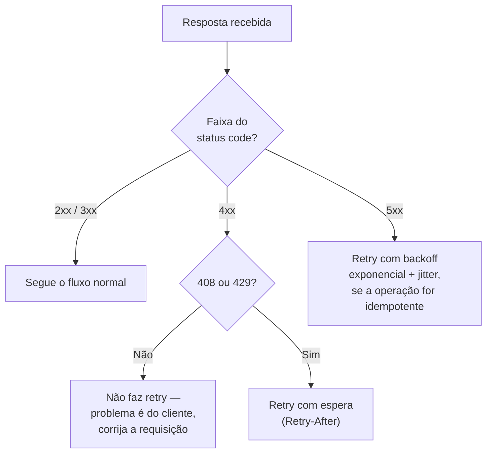

# REST — o contrato de resposta

> [!abstract] TL;DR
> A resposta de uma API REST é, ela mesma, um contrato — e tem três camadas que precisam concordar entre si: o **status code** (o veredito de uma linha, lido por proxies, caches e bibliotecas HTTP antes de qualquer byte do corpo), o **corpo do erro** (hoje padronizado pela RFC 9457 Problem Details, `application/problem+json`) e a **negociação de formato** (`Accept`/`Content-Type`, e o método `OPTIONS` para negociar operações). Um `200 OK` com `{"success": false}` no corpo quebra essa camada mais barata e mais importante do contrato — porque todo componente entre o cliente e o seu código (cache, proxy, biblioteca de retry, dashboard de SLO) lê o status code, não o corpo. A regra de ouro que organiza tudo: **4xx é "seu problema, não tente de novo sem mudar algo"; 5xx é "nosso problema, tente de novo depois"** — e é exatamente essa distinção que decide se um cliente HTTP deve fazer retry automático ou desistir.

Terça-feira, dez da manhã. Uma integradora de pagamentos processa cerca de 40 mil requisições por minuto num dos endpoints mais críticos do seu sistema: confirmação de cobrança. Um deploy de rotina sobe uma mudança pequena no serviço — um ajuste na validação de CPF que, por um erro de lógica, passa a rejeitar um subconjunto de CPFs válidos (os que começam com um dígito específico, por causa de uma regex mal escrita).

O problema não deveria ser grave: é um bug de validação, localizado, fácil de reverter. Mas o time notou algo estranho vinte minutos depois: a fila de retry do sistema de billing, que normalmente fica perto de zero, estava crescendo sem parar — e o CPU do serviço de cobrança estava subindo junto, mesmo sem aumento real de tráfego.

A investigação achou a causa em outro lugar que não o bug em si: o endpoint de confirmação de cobrança, escrito anos antes por outro time, sempre respondeu `200 OK` para *toda* requisição processada — sucesso ou falha — e colocava o resultado real num campo `{"success": true/false, "error": "..."}` dentro do corpo. O cliente HTTP usado pelos consumidores da API, uma biblioteca de retry configurada de forma padrão (razoável: "200 nunca precisa de retry, 5xx sempre precisa"), simplesmente não olhava o corpo. Via `200`, marcava como sucesso, e seguia em frente — só que o campo `success: false` continuava lá, ignorado, e o pedido de cobrança nunca era de fato confirmado no sistema de billing.

Quando o bug de validação começou a gerar um volume razoável de `success: false` disfarçados de `200`, ninguém no monitoring percebeu — porque o dashboard de erro, corretamente, olhava só a taxa de `4xx`/`5xx`, que continuava em zero. O sintoma real só apareceu de forma indireta: outro sistema, que *de fato* lia o campo `success` no corpo antes de decidir se deveria reenfileirar a cobrança para reprocessamento manual, começou a acumular uma fila gigante de "cobranças que falharam silenciosamente" — sem nenhum alarme técnico ter disparado, porque tecnicamente, para o HTTP, nada tinha falhado.

Esse é o custo concreto de tratar o status code como decoração. Ele não é só uma formalidade que os frameworks preenchem sozinhos — é a parte mais barata e mais amplamente lida do contrato de resposta, porque cada camada de infraestrutura entre o seu código e o cliente final — proxy, CDN, cache, biblioteca HTTP, dashboard de observabilidade — sabe interpretar um número de três dígitos sem precisar entender o seu domínio de negócio. Jogar fora essa camada e empurrar tudo para o corpo é forçar cada uma dessas camadas a ficar cega.

Esta nota entra no segundo pilar do contrato REST — depois de modelar recursos e verbos ([[01 - REST — modelagem de recursos e maturidade]]), a pergunta agora é: **quando a resposta sai, o que ela precisa dizer, e como dizer de um jeito que máquinas — não só humanos lendo documentação — consigam agir sobre isso?**

## Status codes: o veredito de uma linha

HTTP define mais de 60 status codes, mas a maioria das APIs precisa de menos de quinze deles usados com disciplina. O ponto central não é decorar a lista — é entender que cada faixa (2xx, 3xx, 4xx, 5xx) carrega uma **semântica de ação** diferente para quem recebe a resposta, e que escolher a faixa errada quebra o comportamento de quem consome a API antes mesmo de qualquer lógica de negócio entrar em cena.

### 2xx — sucesso, mas com granularidade

| Código | Quando usar | Detalhe que costuma passar batido |
|---|---|---|
| **200 OK** | `GET` que retornou dados, ou `PUT`/`PATCH`/`POST` que retornam um corpo de resposta | É o "sucesso genérico" — só use quando nenhum dos códigos abaixo é mais específico |
| **201 Created** | `POST` que criou um novo recurso | Inclua o header `Location` apontando para a URL do recurso recém-criado — muitos SDKs de cliente usam esse header para "descobrir" o ID gerado sem parsear o corpo |
| **202 Accepted** | Requisição aceita, mas processamento é assíncrono e ainda não terminou | Retorne um identificador de job/tarefa e, idealmente, uma URL para consultar o status depois — este padrão é aprofundado no Sub-galho 3 (webhooks e operações assíncronas) |
| **204 No Content** | Operação teve sucesso e não há corpo para retornar (DELETE típico, ou update sem payload de resposta) | Não inclua `Content-Type` na resposta — não há conteúdo para tipar |

```http
POST /pedidos
Content-Type: application/json

{ "cliente_id": 42, "itens": [...] }

HTTP/1.1 201 Created
Location: /pedidos/1071
Content-Type: application/json

{ "id": 1071, "status": "pendente", "criado_em": "2026-07-09T13:02:00Z" }
```

### 3xx — redirecionamento, raro mas relevante

APIs JSON puras raramente devolvem 3xx explicitamente, mas o mais comum de aparecer é o **304 Not Modified**, parte do mecanismo de cache condicional junto com `ETag`/`If-None-Match` (a nota de caching HTTP do Sub-galho 3 aprofunda esse fluxo). Vale notar que 304 não tem corpo — é um "nada mudou, use sua cópia" puro, resolvido inteiramente pelo protocolo, sem envolver a lógica de negócio.

### 4xx — o problema é do cliente

| Código | Quando usar | Confusão comum |
|---|---|---|
| **400 Bad Request** | O corpo da requisição é **sintaticamente** inválido — JSON malformado, tipo primitivo errado (string onde se espera número) | Usar 400 para erro de regra de negócio → isso é 422, não 400 |
| **401 Unauthorized** | Falta autenticação, ou as credenciais fornecidas são inválidas | O nome é um erro histórico de nomenclatura do próprio HTTP — 401 significa "não autenticado", não "não autorizado"; a resposta deve incluir o header `WWW-Authenticate` |
| **403 Forbidden** | O cliente está autenticado, mas não tem permissão para aquela operação naquele recurso | Decidir entre 403 e 404 quando o recurso existe mas o cliente não pode vê-lo — ver adiante |
| **404 Not Found** | O recurso não existe — nem para ninguém, nem para este cliente especificamente | Confundir "endpoint não existe" (erro de rota, quase sempre bug do cliente) com "recurso específico não existe" (ex.: `/pedidos/999999`, ID válido na forma mas inexistente) |
| **405 Method Not Allowed** | O verbo HTTP usado não é suportado por aquele recurso (ex.: `DELETE` num recurso só-leitura) | Inclua o header `Allow` listando os métodos que *são* suportados — é o mesmo header que o `OPTIONS` devolve, ver a seção de negociação de método adiante |
| **409 Conflict** | O estado atual do recurso impede a operação — ex.: criar um usuário com e-mail que já existe, ou uma atualização otimista que perdeu a corrida | Diferente de 422: aqui o payload está correto, mas o *momento* ou o *estado do servidor* é que impede a operação |
| **410 Gone** | O recurso existiu e foi removido **de forma permanente e intencional** | Confundir com 404 — a diferença é sinalizar intenção; ver adiante |
| **415 Unsupported Media Type** | O `Content-Type` da requisição não é suportado pelo endpoint | Ver a seção de content negotiation abaixo |
| **422 Unprocessable Entity** | O payload é sintaticamente válido, mas semanticamente inválido — falha uma regra de validação ou de negócio | Ver a distinção detalhada com 400 abaixo |
| **429 Too Many Requests** | O cliente excedeu um limite de taxa | Inclua o header `Retry-After` informando quanto tempo esperar — sem isso, o cliente só pode adivinhar |

### 5xx — o problema é do servidor

| Código | Quando usar |
|---|---|
| **500 Internal Server Error** | Um erro não tratado — na prática, um bug. Nunca exponha stack trace, nome de tabela ou query SQL no corpo da resposta |
| **502 Bad Gateway** | Um proxy ou gateway recebeu uma resposta inválida de um serviço upstream |
| **503 Service Unavailable** | O serviço está temporariamente indisponível — manutenção programada, sobrecarga, dependência crítica fora do ar. Inclua `Retry-After` quando souber estimar |
| **504 Gateway Timeout** | Um proxy ou gateway esperou por uma resposta upstream e ela não chegou a tempo |

### As três confusões que mais aparecem em code review

**401 vs 403 — quem é você vs o que você pode fazer.** A distinção formal do protocolo é clara mesmo que o nome de "401 Unauthorized" sugira o contrário: 401 significa "eu não sei quem você é — mande credenciais válidas"; 403 significa "eu sei exatamente quem você é, e a resposta é não" (Beeceptor, [401 vs 403](https://beeceptor.com/docs/concepts/401-vs-403/), acessado 2026-07-09). Uma diferença técnica que costuma passar batido: uma resposta 401 deve incluir o header `WWW-Authenticate`, informando ao cliente qual esquema de autenticação usar — é esse header, não o número em si, que formalmente separa os dois casos na especificação (SuperTokens, [Demystifying HTTP Error Codes 401 vs 403](https://supertokens.com/blog/http-error-codes-401-vs-403), acessado 2026-07-09).

**404 vs 403 — vazar ou não a existência do recurso.** Esta é uma decisão de modelo de ameaça, não de semântica pura: se um usuário autenticado tenta acessar `/admin/relatorios/42` sem permissão, responder 403 confirma que o recurso *existe* — informação que, em alguns domínios (dados de outro tenant, registros médicos, contas de terceiros), você não quer revelar nem a quem já está autenticado. Uma prática comum de segurança por obscuridade é responder 404 nesses casos, escondendo a existência do recurso atrás de "não encontrado" (Beeceptor, [401 vs 403](https://beeceptor.com/docs/concepts/401-vs-403/), acessado 2026-07-09). Não é uma regra universal — depende do quanto a existência do recurso, por si só, já é informação sensível no seu domínio.

**404 vs 410 — "nunca existiu ou não sei" vs "existiu e foi removido de propósito".** 404 é o estado padrão, agnóstico: o servidor não tem opinião sobre se o recurso um dia existiu. 410 é uma afirmação mais forte e mais rara de se implementar corretamente (exige manter um registro do que foi deletado, em vez de simplesmente parar de encontrar o registro): "isso existiu, e foi removido para sempre, de propósito — não espere que volte". Na prática, poucas APIs implementam 410 de verdade, porque isso exige manter um tombstone do recurso deletado em vez de simplesmente apagar a linha do banco; a maioria usa 404 tanto para "nunca existiu" quanto para "foi deletado", perdendo essa distinção.

**400 vs 422 — sintaxe vs semântica.** A forma mais direta de lembrar a diferença: **400 é "não consigo nem entender o que você mandou"; 422 é "entendi perfeitamente o que você mandou, e está errado"**. JSON com uma vírgula sobrando, um campo que deveria ser número e chegou como string, um corpo vazio onde se espera um objeto — tudo isso é 400, porque o parser nem consegue montar a estrutura de dados antes de aplicar qualquer regra. Um e-mail com formato sintaticamente válido mas de um domínio bloqueado, uma data de nascimento no futuro, um CPF com dígito verificador errado — tudo isso é 422, porque o parser terminou o trabalho dele com sucesso e foi a *sua* lógica de validação que rejeitou o conteúdo (codestudy.net, [400 vs 422 Status Codes](https://www.codestudy.net/blog/400-vs-422-response-to-post-of-data/), acessado 2026-07-09). Uma regra prática resume bem: corrija um 400 mudando *como* você formatou a requisição; corrija um 422 mudando *o que* você colocou nela.

## A regra de ouro: 4xx é seu, 5xx é nosso — e por que isso decide o retry

Depois de decorar a tabela, existe uma regra única que organiza tudo e que importa mais do que memorizar cada código individualmente:

> **4xx significa "o problema é seu — não adianta tentar de novo sem mudar alguma coisa". 5xx significa "o problema é nosso — pode tentar de novo, provavelmente vai funcionar depois".**

Essa regra não é só uma convenção estilística — é o contrato que praticamente toda biblioteca de HTTP client, toda malha de service mesh e todo circuit breaker do mercado usa para decidir, de forma automática, **se vale a pena fazer retry**. Retry logic deve, em geral, mirar erros do lado do servidor como 500 ou 503, que costumam indicar problemas temporários; já erros do lado do cliente como 404 ou 400 normalmente sinalizam questões que um retry não vai resolver (oneuptime.com, [How to Implement Network Retry Strategies](https://oneuptime.com/blog/post/2026-01-25-network-retry-strategies/view), acessado 2026-07-09).

Existem duas exceções notáveis dentro do 4xx que *são* retryáveis — e vale saber os dois de cor:

- **408 Request Timeout** — o servidor esperou pela requisição e ela não chegou completa a tempo; um retry pode simplesmente funcionar na próxima tentativa.
- **429 Too Many Requests** — o cliente excedeu um limite de taxa; um retry funciona, mas só depois de esperar o tempo indicado no header `Retry-After` — retentar imediatamente só piora o rate limit.

Client errors (4xx) raramente se beneficiam de retry — com as exceções específicas de 408, 429 e da família 5xx, que costumam ser retryáveis (api4.ai, [Best Practice: Implementing Retry Logic in HTTP API Clients](https://api4.ai/blog/best-practice-implementing-retry-logic-in-http-api-clients), acessado 2026-07-09).

Há uma segunda condição que precisa acompanhar qualquer retry, independente do status code: **idempotência**. Refazer automaticamente uma chamada que já teve efeito colateral (um `POST` que criou um recurso, por exemplo) sem alguma forma de proteção pode duplicar a operação — criar dois pedidos, cobrar duas vezes. A prática recomendada é usar backoff exponencial com jitter para evitar tempestades de retry, garantir que retries sejam seguros através de idempotência (ou de chaves de idempotência), e limitar o volume de retry com um orçamento (retry budget) para não causar falhas em cascata (denalibalser, [Best Practices for Retry](https://denalibalser.medium.com/best-practices-for-retry-685bf58de797), acessado 2026-07-09). O padrão Idempotency-Key, citado na nota-mãe desta trilha e aprofundado no Sub-galho 3, existe exatamente para tornar seguro o retry automático de operações não naturalmente idempotentes como `POST`.



> [!warning] Um `200 OK` com erro no corpo desativa essa engrenagem inteira
> Toda essa máquina de decisão — retry automático, dashboards de SLO, cache de proxy — depende de o status code refletir a realidade. Um `200` com `{"success": false}` engana cada uma dessas camadas simultaneamente: o cliente de retry nunca tenta de novo (achou que deu certo); o dashboard de erro nunca acusa nada (tecnicamente não houve erro HTTP); um proxy ou CDN pode até cachear a resposta de "sucesso" que, na verdade, carrega uma falha. É exatamente o cenário da abertura desta nota — e é por isso que a comunidade de design de API chama esse padrão de *soft error*: ele viola a premissa central do HTTP de que a linha de status comunica o estado da resposta, não o seu conteúdo (compiler.today, [200 OK: The 'Success' Response That Was Actually a Critical Error](https://www.compiler.today/api-development/200-ok-the-success-response-that-was-actually-a-critical-error), acessado 2026-07-09).

## RFC 9457 Problem Details: o formato padrão de erro

Sabendo *qual* status code usar, falta decidir *o que colocar no corpo* quando a resposta é um erro. Durante anos cada API inventou o próprio formato — um endpoint retorna `{"message": "..."}`, outro `{"error": "...", "code": 42}`, um terceiro devolve HTML de uma página de erro genérica do servidor de aplicação quando algo quebra num filtro antes de chegar ao seu código. Cada cliente que integra com múltiplas APIs precisa então escrever um parser de erro diferente para cada uma.

A resposta padronizada do mercado para esse problema é a **RFC 9457 — Problem Details for HTTP APIs**, publicada pela IETF em julho de 2023, que **obsoleta a RFC 7807** (de 2016) sem quebrar compatibilidade — a atualização é majoritariamente de esclarecimento, com melhorias em torno de como representar múltiplos problemas de uma vez e um registro compartilhado de tipos de problema comuns (datatracker.ietf.org, [RFC 9457](https://datatracker.ietf.org/doc/html/rfc9457), acessado 2026-07-09; redocly.com, [RFC 9457: Better information for bad situations](https://redocly.com/blog/problem-details-9457), acessado 2026-07-09). Se você está começando um projeto hoje, a referência correta a citar é a 9457, não a 7807 — mesmo que boa parte da documentação mais antiga na internet ainda mencione a numeração antiga.

O formato canônico é um objeto JSON, servido com o media type registrado `application/problem+json`:

```http
HTTP/1.1 422 Unprocessable Entity
Content-Type: application/problem+json

{
  "type": "https://api.exemplo.com/errors/validacao",
  "title": "Erro de validação",
  "status": 422,
  "detail": "O campo 'email' não tem um formato válido",
  "instance": "/pedidos/1071",
  "errors": [
    {
      "field": "email",
      "code": "formato_invalido",
      "message": "O e-mail deve ter o formato usuario@dominio.tld"
    },
    {
      "field": "data_nascimento",
      "code": "data_futura",
      "message": "A data de nascimento não pode estar no futuro"
    }
  ],
  "trace_id": "8f3e2a1c-9b7d-4e6f-a123-b45c6d7e8f90"
}
```

### Os cinco campos do padrão

| Campo | Descrição | Observação da RFC |
|---|---|---|
| `type` | URI que identifica a *categoria* do problema. Clientes podem usar esse valor para tomar decisões programáticas | Se ausente, assume o valor `"about:blank"`, que sinaliza "este problema não tem semântica além do próprio status code" |
| `title` | Resumo curto e legível por humanos do tipo do problema | Não deve variar entre ocorrências do mesmo tipo — é a legenda, não a instância |
| `status` | O mesmo código HTTP da resposta, repetido no corpo | Existe para clientes que inspecionam só o corpo (ex.: depois de o corpo ser persistido em log, separado do header HTTP original) |
| `detail` | Explicação legível por humanos, específica *desta* ocorrência | Pode e deve variar entre chamadas — é aqui que entra "o e-mail informado é inválido", não uma mensagem genérica |
| `instance` | URI que identifica a ocorrência específica deste problema | Útil para debugging e correlação — costuma ser a URL do recurso ou uma URI interna de rastreamento |

Vale uma nuance técnica que a própria especificação faz questão de registrar: no texto formal da RFC, **todos** esses membros são tecnicamente opcionais — "se o tipo do valor de um membro não corresponder ao tipo especificado, o membro DEVE ser ignorado" (rfc-editor.org, [RFC 9457](https://www.rfc-editor.org/rfc/rfc9457.html), acessado 2026-07-09). Na prática, porém, a convenção amplamente adotada pelo mercado — e a que vale seguir — é tratar `type`, `title` e `status` como o trio mínimo de toda resposta de erro, com `detail` e `instance` como enriquecimento quase sempre presente, mas formalmente opcional.

Além dos cinco campos padrão, a especificação permite **extensões**: campos customizados específicos do seu domínio, como o `errors` (lista de erros de campo) e o `trace_id` do exemplo acima. Definições de tipo de problema podem estender o objeto de detalhes do problema com membros adicionais específicos daquele tipo de problema; clientes que consomem problem details devem ignorar quaisquer extensões que não reconheçam (rfc-editor.org, [RFC 9457](https://www.rfc-editor.org/rfc/rfc9457.html), acessado 2026-07-09) — o que garante que adicionar um campo novo nunca quebra um cliente antigo, o mesmo espírito de evolução de schema aditiva discutido na nota-mãe desta trilha.

Uma garantia importante para quem se preocupa com compatibilidade retroativa: o gerador **deve usar o mesmo status code na resposta HTTP real**, para garantir que software HTTP genérico que não entende esse formato ainda se comporte corretamente (rfc-editor.org, [RFC 9457](https://www.rfc-editor.org/rfc/rfc9457.html), acessado 2026-07-09) — ou seja, Problem Details nunca substitui o status code correto; ele **complementa** o status code com uma explicação estruturada, nunca o esconde atrás de um 200 genérico.

### Boas práticas ao implementar

1. **Sirva com `Content-Type: application/problem+json`, não `application/json`.** Isso sinaliza inequivocamente ao cliente que o corpo é um erro estruturado — importante porque o media type `application/problem+json` frequentemente não é implementado como um subconjunto de `application/json` por bibliotecas e serviços, então clientes precisam incluir explicitamente `application/problem+json` no header `Accept` para garantir que recebem a informação de falha estendida (Zalando RESTful API Guidelines, via [DeepWiki](https://deepwiki.com/zalando/restful-api-guidelines/3.2-http-status-codes-and-error-handling), acessado 2026-07-09).
2. **Sempre inclua um identificador de correlação** (`trace_id` ou equivalente) — não como campo padrão da RFC, mas como extensão praticamente universal. Correlation ID é um identificador único que rastreia uma requisição de ponta a ponta através de todos os serviços, mantendo-se o mesmo do ponto de entrada até a resposta final; respostas de erro devem incluir esse identificador para que o suporte técnico consiga localizar exatamente aquela requisição nos logs (last9.io, [Correlation ID vs Trace ID](https://last9.io/blog/correlation-id-vs-trace-id/), acessado 2026-07-09). Devolver o ID também no header de resposta (`X-Trace-Id` ou similar), não só no corpo, é uma prática comum — assim ele fica disponível mesmo quando o corpo não é lido.
3. **Nunca vaze detalhe de implementação.** Stack trace, query SQL, nome de tabela interna — nada disso pertence ao campo `detail`. As diretrizes de API da Zalando são explícitas: nunca inclua stack traces em respostas de API (Zalando RESTful API Guidelines, acessado 2026-07-09).
4. **Escreva `detail` como uma instrução acionável, não uma descrição de estado.** "E-mail inválido" descreve o problema mas não ajuda a resolvê-lo; "o e-mail deve ter o formato `usuario@dominio.tld`" dá ao consumidor o próximo passo.
5. **Trate `type` como parte do contrato programático, não só documentação.** Se o cliente vai tomar decisões de código com base no tipo de erro (ex.: "se for erro de validação, mostra formulário; se for erro de permissão, redireciona para login"), o campo `type` — não `detail`, que pode variar em texto — é o que deve ser usado para essa checagem.
6. **Nunca dependa exclusivamente de o corpo ser Problem Details.** Clientes precisam ser robustos e não confiar cegamente em um objeto Problem JSON sempre estar presente, porque respostas de falha podem ser geradas por componentes de infraestrutura (um proxy, um WAF, um load balancer) que não conhecem essa convenção — um 502 de um proxy nunca vai vir com `application/problem+json` (Zalando RESTful API Guidelines, acessado 2026-07-09).

### Como outras stacks implementam — panorama, não tutorial

Problem Details deixou de ser exclusividade de Java: virou o formato de fato adotado por praticamente todo framework web moderno, cada um com sua própria camada de conveniência em cima do padrão RFC.

| Stack | Suporte | Nota |
|---|---|---|
| **Java / Spring** | Nativo desde Spring Framework 6.0, via a classe `ProblemDetail` e as interfaces `ErrorResponse`/`ErrorResponseException` | Cobertura completa, com exemplos e implementação de `@RestControllerAdvice`, já existe em [[03-Dominios/Tecnologia/Java/Web e APIs REST/10 - Problem Details — RFC 9457|Java/Web e APIs REST 10]] — não duplicado aqui |
| **.NET / ASP.NET Core** | Nativo desde .NET 7, via `IProblemDetailsService` e `IExceptionHandler`, habilitado com `AddProblemDetails()` + `UseExceptionHandler()` | `UseStatusCodePages()` converte automaticamente respostas de erro sem corpo em Problem Details (milanjovanovic.tech, [Problem Details for ASP.NET Core APIs](https://milanjovanovic.tech/blog/problem-details-for-aspnetcore-apis), acessado 2026-07-09) |
| **Python / FastAPI** | Não nativo — via bibliotecas de terceiros como `fastapi-problem-details` ou `fastapi-problem`, que registram handlers automáticos para erros não tratados, `RequestValidationError` e `HTTPException` | Padrão de comunidade, não parte do framework core (github.com/g0di, [fastapi-problem-details](https://github.com/g0di/fastapi-problem-details), acessado 2026-07-09) |
| **Go** | Sem suporte nativo na stdlib — vários pacotes de comunidade (`go-problem`, `http-problemdetails-go`) fornecem uma struct serializável com os campos padrão da RFC | Ecossistema fragmentado, sem um vencedor claro consolidado ainda |

A mensagem central desse panorama: o formato do corpo convergiu para um padrão único entre linguagens — o que muda é só o quanto cada framework automatiza a geração desse corpo a partir de uma exceção lançada no seu código.

## Content negotiation: como cliente e servidor concordam sobre formato

Status code e corpo de erro resolvem "o que a resposta diz". Falta uma terceira camada: "em que formato ela é servida" — e essa é a função da **content negotiation**.

O protocolo HTTP define dois vetores complementares:

| Direção | Header | Papel |
|---|---|---|
| Cliente informa o que aceita como resposta | `Accept` | "Eu consigo processar JSON, ou XML como segunda opção" |
| Cliente informa o que está enviando | `Content-Type` (na requisição) | "O corpo que estou mandando é JSON" |
| Servidor informa o que de fato enviou | `Content-Type` (na resposta) | "Isto que estou te devolvendo é JSON" |

O `Accept` funciona com uma lista de tipos MIME, cada um opcionalmente acompanhado de um fator de qualidade `q` que expressa preferência relativa entre formatos aceitáveis (MDN, [Content negotiation](https://developer.mozilla.org/en-US/docs/Web/HTTP/Guides/Content_negotiation), acessado 2026-07-09) — por exemplo, `Accept: application/json, application/xml;q=0.5` diz "prefiro JSON, mas aceito XML se for a única opção". O servidor calcula a interseção entre o que o cliente aceita e o que ele consegue produzir para aquele recurso, e escolhe o melhor formato dessa interseção.

Quando essa interseção é vazia, existem dois códigos de erro específicos para isso — e é comum vê-los trocados:

- **406 Not Acceptable** — nada que o servidor sabe produzir satisfaz o `Accept` do cliente (o cliente pediu algo que o servidor nunca oferece)
- **415 Unsupported Media Type** — o `Content-Type` que o cliente *enviou* na requisição não é um formato que o servidor sabe interpretar (o servidor não consegue nem ler o que chegou)

Um jeito rápido de não confundir os dois: 406 é sobre o que o servidor vai *devolver*; 415 é sobre o que o servidor recebeu e não consegue *ler*.

### Negociação de método: o que o `OPTIONS` resolve

Existe uma segunda forma de negociação, menos citada mas igualmente parte do contrato: **negociação de método**, resolvida pelo verbo `OPTIONS`. Um cliente pode enviar uma requisição `OPTIONS` para um recurso para descobrir, antes de tentar qualquer operação, quais métodos HTTP aquele recurso de fato suporta — sem disparar nenhum efeito colateral, porque `OPTIONS` é seguro por definição.

```http
OPTIONS /pedidos/1071 HTTP/1.1

HTTP/1.1 204 No Content
Allow: GET, PATCH, DELETE
```

O header `Allow` na resposta lista exatamente os métodos suportados por aquele recurso específico — o mesmo `Allow` que também deve acompanhar um `405 Method Not Allowed`, quando o cliente já tentou o método errado em vez de perguntar antes (http.dev, [OPTIONS](https://http.dev/options), acessado 2026-07-09). Isso permite que clientes genéricos — navegadores fazendo *preflight* de CORS, SDKs auto-descobertos, ferramentas de exploração de API — se adaptem dinamicamente às capacidades reais do servidor em vez de assumir um conjunto fixo de operações. `OPTIONS` é, aliás, exatamente o mecanismo por trás do preflight de CORS: antes de enviar uma requisição cross-origin com um método fora da lista segura do navegador, o browser dispara automaticamente um `OPTIONS` para checar se o servidor autoriza aquela operação.

Na prática, poucas APIs REST tradicionais dependem de `OPTIONS` como parte do fluxo de negócio do cliente — é mais comum aparecer implicitamente (CORS) do que ser chamado deliberadamente pelo consumidor de uma API. Mas em APIs que se levam a sério como hipermídia (o nível 3 de maturidade REST, discutido na nota anterior deste sub-galho), `OPTIONS` é uma peça legítima do vocabulário: descobrir o que é permitido fazer com um recurso é, no fim, uma forma de negociação de contrato tão real quanto negociar o formato do corpo.

## Casos práticos

**Stripe e o padrão `type` para decisão programática.** APIs de pagamento são um dos domínios onde clientes de fato tomam decisões automatizadas com base no tipo do erro — não só exibem uma mensagem. Um erro de cartão recusado, um erro de saldo insuficiente e um erro de dados inválidos exigem respostas de UX completamente diferentes por parte de quem integra, o que reforça por que o campo `type`/`code` de um erro estruturado precisa ser estável e documentado como parte formal do contrato, não como um texto solto que pode mudar a qualquer redeploy.

**Zalando e a robustez do lado do cliente.** As diretrizes públicas de API da Zalando — uma das referências mais citadas de design de API RESTful em produção — deixam explícito que mesmo adotando Problem Details como padrão interno, clientes não podem assumir cegamente que todo erro virá nesse formato, porque componentes de infraestrutura fora do controle do time de aplicação (um WAF, um load balancer, um proxy da borda) podem gerar respostas de erro no formato deles próprios. É um lembrete de que o contrato de resposta nunca é fechado inteiramente por uma única camada de software.

**FastAPI e a ausência de padrão nativo.** O fato de o ecossistema Python precisar de bibliotecas de terceiros (`fastapi-problem-details`, `fastapi-problem`) para obter Problem Details "de fábrica" — enquanto Java e .NET já vêm com isso na stdlib do framework — é, em si, um dado relevante para decisão de stack: times que dependem fortemente de padronização de erro entre múltiplos serviços podem achar mais barato obter essa consistência em frameworks que já a oferecem nativamente, em vez de garantir disciplina manual em cada serviço FastAPI.

## Armadilhas comuns

> [!warning] Retornar 200 para tudo e empurrar o resultado real para o corpo
> **O que acontece:** endpoints que sempre respondem `200 OK`, com um campo tipo `{"success": false, "error": "..."}` carregando o resultado real da operação. **Por quê:** quebra o contrato mais barato e mais amplamente lido do HTTP — proxies, caches, bibliotecas de retry e dashboards de SLO leem o status code, não o corpo. Foi exatamente esse padrão que escondeu uma falha de cobrança real atrás de uma métrica de "zero erros" na cena de abertura desta nota. **Como evitar:** o status code sempre reflete o resultado real da operação. Se a operação falhou por culpa do cliente, é 4xx; se falhou por culpa do servidor, é 5xx; só é 2xx se de fato teve sucesso — o corpo enriquece essa informação, nunca a substitui.

> [!warning] Confundir "endpoint inexistente" com "recurso inexistente" ao decidir entre 404 e 400
> **O que acontece:** uma rota que não existe na API (erro de integração do cliente, geralmente bug de configuração de URL) retorna o mesmo 404 genérico que um recurso específico e válido em forma, mas ausente no banco. **Por quê:** para um cliente automatizado que faz retry ou monitoramento, os dois cenários pedem ações completamente diferentes: "endpoint não existe" é um erro de integração que precisa de correção de código; "recurso não encontrado" pode ser um estado esperado do negócio (o ID foi consultado antes de ser criado, por exemplo). **Como evitar:** não é sempre possível (nem sempre vale a pena) diferenciar os dois casos no protocolo — mas quando a distinção importa para o consumidor, o campo `type` do Problem Details é o lugar certo para carregar essa granularidade extra que o status code sozinho não consegue expressar.

> [!warning] Tratar Problem Details como suficiente sem versionar os valores de `type`
> **O que acontece:** o time cria URIs de `type` ad hoc, sem registrar formalmente o que cada uma significa, e sem tratá-las como parte do contrato público versionado da API — um refactor interno muda o texto de `detail` ou o valor de `type` sem aviso. **Por quê:** pela mesma Lei de Hyrum discutida na nota-mãe desta trilha, clientes que tomam decisão programática com base no `type` de um erro tratam esse valor como parte do contrato, documentado ou não — mudar silenciosamente o valor de um `type` já em uso é, na prática, uma breaking change. **Como evitar:** trate cada valor de `type` como uma URI estável e documentada, sujeita às mesmas regras de evolução de contrato (nunca remover, só adicionar) que qualquer outro campo de resposta.

## Em entrevista

Numa entrevista técnica sênior — seja um design de API isolado, seja parte de uma pergunta maior de system design — a pergunta "como sua API comunica erro?" é uma forma indireta e eficiente de testar maturidade em design de contrato. Um candidato júnior tende a responder no nível do código: "eu lanço uma exceção e retorno uma mensagem de erro". Um candidato sênior responde no nível do contrato: "o status code carrega a semântica de ação — se o cliente deve tentar de novo ou não, se é ele que precisa mudar algo ou se é transitório do meu lado — e o corpo, no formato RFC 9457 Problem Details, carrega o detalhe estruturado para debugging e para decisão programática do consumidor, sem depender do cliente parsear texto livre."

Uma pergunta de acompanhamento comum é justamente a distinção 401 vs 403, ou 400 vs 422 — não porque decorar a tabela seja o objetivo, mas porque a resposta certa revela se o candidato entende *por que* a distinção existe (retry automático, segurança por obscuridade, granularidade de validação) em vez de ter simplesmente memorizado qual número vai com qual situação.

Uma pergunta mais avançada, que separa sênior de sênior-mais-experiente: "por que você nunca deveria retornar 200 com um campo de erro no corpo?" — a resposta forte nomeia explicitamente as camadas de infraestrutura que quebram silenciosamente (retry automático, cache, dashboards de SLO), não só "porque é feio" ou "porque não é RESTful". É a mesma lógica da cena de abertura desta nota: o custo de um soft error não aparece no seu próprio serviço — aparece, com atraso, em outro sistema que confiava no contrato.

## How to explain in English

> "The response half of a REST contract has three layers that must agree: the status code — the one-line verdict read by proxies, caches, and retry libraries before any business logic runs — the error body, standardized today by RFC 9457 Problem Details, and content negotiation, deciding the wire format via `Accept`/`Content-Type` and, less commonly, method negotiation via `OPTIONS`. The golden rule that organizes retry behavior across the whole industry: 4xx means 'your problem, don't retry without changing something'; 5xx means 'our problem, retry later is safe.' A `200 OK` with a `success: false` field in the body breaks that contract at the cheapest, most widely-read layer — every piece of infrastructure between your code and the caller reads the status line, not the body."

| PT | EN |
|----|----|
| Contrato de resposta | Response contract |
| Status code | Status code |
| Erro do cliente / erro do servidor | Client error / server error |
| Regra de ouro (4xx/5xx) | Golden rule (4xx/5xx) |
| Retry automático | Automatic retry |
| Backoff exponencial com jitter | Exponential backoff with jitter |
| Tentativa segura (idempotente) | Safe retry (idempotent) |
| Detalhes do problema | Problem details |
| Tipo de problema | Problem type |
| Vazamento de informação interna | Internal information leakage |
| Negociação de conteúdo | Content negotiation |
| Negociação de método | Method negotiation |
| Cabeçalho / header | Header |
| Identificador de correlação | Correlation ID / trace ID |
| Mudança que quebra o contrato | Breaking change |

## O que vem a seguir

Com status codes e Problem Details resolvendo "o que a resposta diz quando algo dá certo ou errado", a próxima nota deste sub-galho fecha o restante do vocabulário de contrato REST que toda API precisa decidir antes de ir para produção: como paginar listas grandes, como filtrar e ordenar, e o panorama comparativo de métodos de autenticação.

- [[03 - Paginação, filtros e autenticação em REST]] — offset vs cursor, filtering/sorting, e o mapa de decisão entre API key, JWT, OAuth e mTLS
- [[01 - REST — modelagem de recursos e maturidade]] — se você chegou direto nesta nota, vale voltar à modelagem de recursos e ao Richardson Maturity Model, que precede o contrato de resposta

## Veja também

- [[Comunicação entre Sistemas/index|Comunicação entre Sistemas]] — o galho-pai desta trilha
- [[2 - Comunicação síncrona/index|Comunicação síncrona]] — o sub-galho desta nota
- [[1 - Panorama e decisão/01 - O que é o contrato de comunicação|O que é o contrato de comunicação]] — a Lei de Hyrum e a distinção interface/contrato retomadas nesta nota
- [[03-Dominios/Tecnologia/Java/Web e APIs REST/10 - Problem Details — RFC 9457|Java — Problem Details com Spring ProblemDetail]] — implementação completa em Spring, não duplicada aqui
- [[03-Dominios/Tecnologia/Java/Web e APIs REST/07 - Content negotiation|Java — Content negotiation no Spring MVC]] — o mecanismo de `HttpMessageConverter` por trás da negociação de formato

## Fontes

- IETF — [RFC 9457: Problem Details for HTTP APIs](https://www.rfc-editor.org/rfc/rfc9457.html) (julho de 2023, acessado 2026-07-09) — especificação oficial, obsoleta a RFC 7807.
- IETF Datatracker — [RFC 9457](https://datatracker.ietf.org/doc/html/rfc9457) (acessado 2026-07-09) — versão indexada da RFC.
- Redocly — [RFC 9457: Better information for bad situations](https://redocly.com/blog/problem-details-9457) (acessado 2026-07-09) — resumo das mudanças em relação à RFC 7807.
- Zalando — [RESTful API and Event Guidelines, seção HTTP Status Codes and Error Handling](https://deepwiki.com/zalando/restful-api-guidelines/3.2-http-status-codes-and-error-handling) (acessado 2026-07-09) — boas práticas de Problem JSON em produção, incluindo robustez do lado do cliente.
- Compiler — [200 OK: The 'Success' Response That Was Actually a Critical Error](https://www.compiler.today/api-development/200-ok-the-success-response-that-was-actually-a-critical-error) (acessado 2026-07-09) — o antipadrão de soft error e seu impacto em cache/observabilidade.
- Beeceptor — [401 Unauthorized vs 403 Forbidden](https://beeceptor.com/docs/concepts/401-vs-403/) (acessado 2026-07-09) — distinção formal e o header `WWW-Authenticate`.
- SuperTokens — [Demystifying HTTP Error Codes 401 vs 403](https://supertokens.com/blog/http-error-codes-401-vs-403) (acessado 2026-07-09) — origem histórica do nome "Unauthorized" para 401.
- codestudy.net — [400 vs 422 Status Codes](https://www.codestudy.net/blog/400-vs-422-response-to-post-of-data/) (acessado 2026-07-09) — a distinção sintaxe (400) vs semântica (422).
- OneUptime — [How to Implement Network Retry Strategies](https://oneuptime.com/blog/post/2026-01-25-network-retry-strategies/view) (acessado 2026-07-09) — quando retry automático é seguro por faixa de status code.
- api4.ai — [Best Practice: Implementing Retry Logic in HTTP API Clients](https://api4.ai/blog/best-practice-implementing-retry-logic-in-http-api-clients) (acessado 2026-07-09) — 408/429/5xx como exceções retryáveis dentro do 4xx.
- Denali Balser — [Best Practices for Retry](https://denalibalser.medium.com/best-practices-for-retry-685bf58de797) (acessado 2026-07-09) — backoff exponencial, idempotência e retry budget.
- Last9 — [Correlation ID vs Trace ID](https://last9.io/blog/correlation-id-vs-trace-id/) (acessado 2026-07-09) — definições e boas práticas de identificadores de correlação em respostas de erro.
- MDN Web Docs — [Content negotiation](https://developer.mozilla.org/en-US/docs/Web/HTTP/Guides/Content_negotiation) (acessado 2026-07-09) — mecanismo de `Accept`/`Content-Type` e fator de qualidade `q`.
- http.dev — [OPTIONS — Expert Guide to HTTP methods](https://http.dev/options) (acessado 2026-07-09) — negociação de método e o header `Allow`.
- Milan Jovanović — [Problem Details for ASP.NET Core APIs](https://milanjovanovic.tech/blog/problem-details-for-aspnetcore-apis) (acessado 2026-07-09) — suporte nativo a Problem Details desde .NET 7.
- GitHub (g0di) — [fastapi-problem-details](https://github.com/g0di/fastapi-problem-details) (acessado 2026-07-09) — implementação de RFC 9457 para FastAPI via biblioteca de terceiros.
