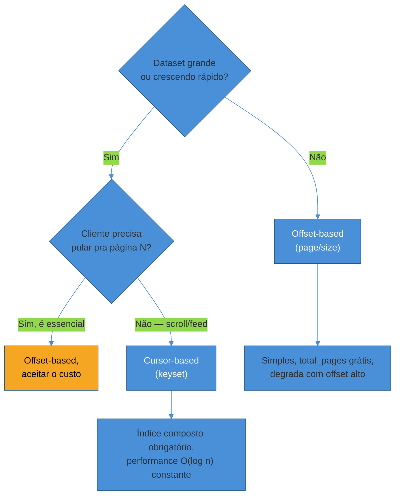
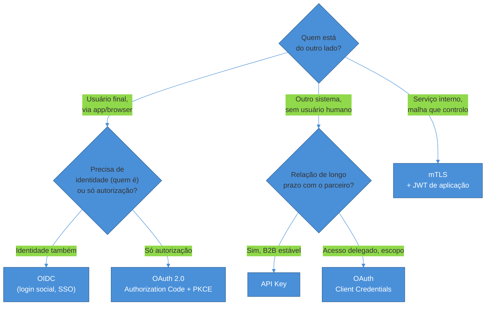

# Paginação, filtros e autenticação em REST

> [!abstract] TL;DR
> Três decisões que toda API REST de produção precisa tomar antes do primeiro cliente externo integrar: **como paginar** (offset é simples e quebra sob escala; cursor é mais complexo e escala linearmente), **como filtrar e buscar** (query params simples resolvem 80% dos casos; DSL e motor de busca dedicado só entram quando o simples não aguenta mais) e **como autenticar** (a pergunta certa não é "qual algoritmo de token", é "quem está do outro lado — um usuário, uma máquina, ou outro serviço meu — e o que isso implica para revogação"). As três compartilham um padrão: a opção mais simples é a certa até que um sintoma concreto (latência de `OFFSET` alto, filtro que virou if-else infinito, token que precisa ser revogado na hora) force a próxima opção mais complexa.

Uma API de agendamento médico começa pequena: uma tabela `consultas` com pouco mais de mil linhas, um endpoint `GET /consultas?page=2&size=20` que devolve página por página, e ninguém reclama porque ninguém nota — cada consulta ao banco de dados escaneia a tabela inteira, descarta as primeiras N linhas e devolve as 20 seguintes, e com mil linhas isso acontece em menos de um milissegundo.

Dois anos depois, a tabela tem 40 milhões de linhas — consultas de anos de operação em dezenas de clínicas — e o mesmo endpoint, na página 200 mil, leva oito segundos para responder. Não porque o código mudou. Porque `OFFSET 4000000` obriga o banco a atravessar quatro milhões de linhas irrelevantes antes de chegar às vinte que interessam, e esse custo cresce de forma linear com a profundidade da página, não com o tamanho da resposta.

No mesmo período, o time de produto pediu, em sequência: um filtro por especialidade, depois um filtro por status combinado com um intervalo de datas, depois "poder buscar o nome do paciente digitando qualquer parte do nome", depois "seria bom filtrar por múltiplas especialidades ao mesmo tempo, com E/OU entre as condições" — e o código de filtro, que começou como três `if` sobre query params, virou uma função de duzentas linhas com bugs de precedência lógica que ninguém mais entende de cabeça.

E, em paralelo, veio a decisão de autenticação — tomada rápido, no início, "vamos usar API Key porque é simples" — que se revelou certa para as integrações B2B com laboratórios parceiros, mas errada para o app do paciente final, que precisava de login com Google e de um jeito de revogar acesso na hora se o celular fosse roubado.

Nenhuma dessas três decisões — paginação, filtros, autenticação — é sobre sintaxe. Todas são sobre **o que a API vai sustentar quando crescer**, e essa é a lente que estrutura o resto desta nota.

## Paginação: offset é fácil de escrever, cursor é fácil de escalar

Toda coleção retornada por uma API REST de produção precisa de paginação — devolver `SELECT *` sem limite é uma forma garantida de, mais cedo ou mais tarde, derrubar o próprio serviço com uma única requisição maliciosa ou só desatenta. A pergunta real não é "paginar ou não", é **qual das duas estratégias dominantes usar** — e cada uma resolve um problema diferente às custas de outro.

### Offset-based: a estratégia que todo mundo aprende primeiro

```
GET /consultas?page=2&size=20
GET /consultas?offset=40&limit=20
```

```json
{
  "data": [ /* ... 20 registros ... */ ],
  "pagination": {
    "page": 2,
    "size": 20,
    "total_items": 1523,
    "total_pages": 77
  },
  "links": {
    "first": "/consultas?page=1&size=20",
    "prev": "/consultas?page=1&size=20",
    "next": "/consultas?page=3&size=20",
    "last": "/consultas?page=77&size=20"
  }
}
```

A implementação por trás é a tradução direta da linguagem humana "me dá a página 2": pule os primeiros 20 registros, pegue os 20 seguintes. É exatamente isso que o SQL faz — `SELECT * FROM consultas ORDER BY criada_em DESC OFFSET 40 LIMIT 20` —, e é exatamente por isso que o custo cresce com a profundidade: o banco de dados **não sabe pular** para a linha 40 diretamente; ele precisa ler e descartar as 40 anteriores primeiro, porque `OFFSET` opera sobre o resultado ordenado inteiro, não sobre um índice posicional mágico.

**Prós:**
- Modelo mental óbvio, mapeia direto para "página 1, página 2, página 3" de uma UI com números de página clicáveis.
- Permite pular direto para qualquer página (`page=50`), algo que a próxima estratégia não oferece.
- Retorna `total_items` e `total_pages` de graça, útil para UI que mostra "77 páginas" ou "mostrando 21-40 de 1.523".

**Contras — e por que eles aparecem tarde, quando já dói:**
- **Degradação de performance com offset grande.** Um `OFFSET 10000` faz o banco ler e descartar dez mil linhas antes de devolver a página — o tempo de resposta cresce, na prática, de forma aproximadamente linear com a profundidade da paginação. Em um benchmark citado sobre PostgreSQL, uma consulta na "página 50.000" chegou a ser quase oito mil vezes mais lenta que a equivalente com keyset pagination, com o tempo saltando de menos de 1ms para vários segundos ([Gold Lapel, *OFFSET Pagination Will Not Scale*](https://goldlapel.com/grounds/query-optimization/keyset-pagination)).
- **"Page drift" — duplicação ou omissão de registros.** Se um registro novo é inserido no topo do conjunto ordenado enquanto o cliente está navegando entre páginas, tudo desloca uma posição — um registro que estaria na página 3 aparece de novo (já visto) ou um registro pula direto da página 2 para a 4 sem nunca ser mostrado. É um bug silencioso: ninguém recebe erro, os dados só ficam sutilmente errados.
- **`COUNT(*)` caro.** Calcular `total_items` exige contar a tabela inteira sob os mesmos filtros — em tabelas de dezenas de milhões de linhas, isso pode custar tanto quanto (ou mais que) a própria consulta de dados.

**Quando usar:** datasets pequenos ou médios (a referência prática mais citada gira em torno de dezenas a poucas centenas de milhares de linhas), interfaces administrativas com "pular para a página X", dados que mudam pouco entre uma navegação e outra — painéis internos, listagens de CMS, relatórios que não crescem indefinidamente ([Gusto Embedded, *A Developer's Guide to API Pagination*](https://embedded.gusto.com/blog/api-pagination/)).

### Cursor-based (keyset): trocar "ir para a página N" por "continuar de onde parei"

```
GET /consultas?limit=20&after=eyJpZCI6MTIzLCJjcmlhZGFfZW0iOiIyMDI2LTA0LTAxIn0=
```

```json
{
  "data": [ /* ... 20 registros ... */ ],
  "pagination": {
    "has_more": true,
    "next_cursor": "eyJpZCI6MTQzLCJjcmlhZGFfZW0iOiIyMDI2LTA0LTAyIn0="
  }
}
```

O cursor é, tipicamente, um valor opaco (em geral base64 de um pequeno JSON) que codifica a posição exata do último registro visto — `{id: 143, criada_em: "2026-04-02"}`. Ao contrário do offset, o cursor não diz "pule N registros"; ele diz **"continue a partir exatamente daqui"**, o que o banco de dados consegue resolver com uma busca por índice, não com uma varredura.

```sql
-- Primeira página
SELECT * FROM consultas
WHERE ativa = true
ORDER BY criada_em DESC, id DESC
LIMIT 20;

-- Páginas seguintes (cursor = criada_em + id do último registro da página anterior)
SELECT * FROM consultas
WHERE ativa = true
  AND (criada_em, id) < ('2026-04-02 10:00:00', 143)
ORDER BY criada_em DESC, id DESC
LIMIT 20;
```

A comparação de tupla `(criada_em, id) <` é a peça central: ela permite ao banco usar um **índice composto** que corresponda exatamente às colunas e à direção do `ORDER BY` — o mesmo índice que atende ao `ORDER BY criada_em DESC, id DESC` resolve a cláusula `WHERE` da paginação diretamente, sem precisar escanear nada que já foi mostrado. É essa correspondência exata entre índice e cursor que garante desempenho constante — em torno de menos de 1 milissegundo — independentemente de a página pedida ser a segunda ou a milionésima ([StackSync, *PostgreSQL Keyset Pagination vs Offset*](https://www.stacksync.com/blog/keyset-cursors-postgres-pagination-fast-accurate-scalable)). Um detalhe fácil de esquecer: se o índice não bater exatamente com as colunas e a ordem do `ORDER BY`, o Postgres cai de volta para uma varredura e o cursor perde toda a vantagem — vale sempre confirmar com `EXPLAIN ANALYZE` que a consulta usa `Index Scan`, não `Seq Scan`.

**Por que a coluna `id` entra no índice mesmo quando o `criada_em` já ordena "quase" tudo?** Porque `criada_em` sozinho pode ter empates — duas consultas criadas no mesmo milissegundo — e sem um desempate estável (o `id`, que é único), o cursor pode pular ou repetir registros empatados. Esse é o motivo pelo qual toda implementação séria de keyset pagination usa uma **chave composta com pelo menos uma coluna única**, nunca uma coluna sozinha que pode repetir valor.

**Prós:**
- Performance constante mesmo em datasets enormes — o índice resolve a busca, não uma varredura.
- Imune a "page drift": como o cursor referencia uma posição real (não uma contagem), inserções e remoções em outras partes do conjunto não afetam páginas já visitadas ([Sequin, *Keyset Cursors, Not Offsets, for Postgres Pagination*](https://blog.sequinstream.com/keyset-cursors-not-offsets-for-postgres-pagination/)).
- Ideal para scroll infinito, feeds, timelines — exatamente os casos em que "pular para a página 40" não faz sentido de produto de qualquer forma.

**Contras:**
- Não dá para pular direto para uma página arbitrária — só "próxima" e (com dois cursores) "anterior".
- O cursor é opaco por design; o cliente não deveria tentar decodificá-lo ou construí-lo manualmente — é um detalhe de implementação do servidor, sujeito a mudar.
- Implementação mais complexa: exige desenhar o índice composto com cuidado e codificar/decodificar o cursor de forma consistente.

**Quando usar:** feeds, timelines, logs, qualquer dataset grande ou em mudança constante — a recomendação corrente da indústria em 2026 é tratar cursor como o **padrão seguro por default** para qualquer API pública ou voltada a cliente externo, reservando offset para casos claramente pequenos e estáticos ([getknit.dev, *API Pagination Best Practices*](https://www.getknit.dev/blog/api-pagination-best-practices)).

### Dois exemplos de mercado que confirmam a escolha

A Stripe pagina suas listas com `starting_after`/`ending_before` — o cliente pega o ID do último objeto de uma página e o usa como cursor para a próxima chamada, exatamente o padrão desta seção, sem expor offset numérico algum na API pública ([Stripe API Reference, *Pagination*](https://docs.stripe.com/api/pagination)).

O GitHub foi na direção oposta há anos — oferecia ambos os estilos em endpoints diferentes — mas em outubro de 2025 removeu explicitamente os parâmetros de paginação por offset (`page`, `first`, `last`) da API de alertas do Dependabot, deixando **apenas** os parâmetros de cursor (`before`, `after`, `per_page`) ([GitHub Changelog, *Dependabot alerts API offset-based pagination parameters deprecated*](https://github.blog/changelog/2025-10-14-dependabot-alerts-api-pagination-parameters-deprecated/)). É um sinal de mercado concreto: mesmo APIs enormes e já estabelecidas estão migrando de offset para cursor conforme o volume de dados cresce, não o contrário.



> [!question]- Dá para oferecer os dois estilos na mesma API?
> Dá, e várias APIs de mercado fazem isso por um tempo — mas cada estilo exige sua própria disciplina de índice e sua própria semântica de resposta (`total_pages` faz sentido para offset, não faz sentido de forma barata para cursor). Manter os dois em paralelo indefinidamente é manter duas implementações para testar e documentar. O padrão mais são, visto em APIs maduras como a do GitHub, é **começar com um e migrar deliberadamente para o outro** quando o volume de dados justificar — não manter os dois como opção permanente "só para garantir".

## Filtros, ordenação e busca: comece simples, DSL só sob demanda real

O segundo eixo de decisão é como o cliente recorta a coleção que está paginando. A tentação de over-engineering aqui é forte — é fácil ler sobre GraphQL e RSQL e querer construir uma DSL de filtros logo de cara. A regra prática, confirmada por praticamente toda guideline de API séria, é a oposta: **comece com query params simples, evolua para DSL só quando o simples visivelmente não aguentar mais**.

### Filtros simples via query params

```
GET /consultas?status=confirmada&especialidade=cardiologia&idade_min=18&idade_max=65
```

Convenções que cobrem a maioria dos casos reais:

- **Filtro exato:** `?status=confirmada`
- **Ranges:** `?idade_min=18&idade_max=65` ou, de forma mais explícita, `?idade[gte]=18&idade[lte]=65`
- **Múltiplos valores:** `?especialidade=cardio,dermato` (lista separada por vírgula) ou `?especialidade=cardio&especialidade=dermato` (parâmetro repetido) — escolha um e documente qual
- **Negação:** `?status_not=cancelada` — funciona, mas é pouco padronizado; não existe convenção universal aqui

Isso resolve, na prática, a maior parte das necessidades de filtro de uma API típica. O ponto de virada — quando query params simples deixam de bastar — costuma ser um destes três sintomas: (1) o cliente precisa combinar condições com `E`/`OU` de forma arbitrária ("status confirmado E (especialidade cardio OU dermato)"), algo que query params simples não expressam sem convenções ad-hoc; (2) o número de combinações de filtro cresce tanto que a lista de query params vira ilegível; (3) diferentes clientes pedem operadores diferentes (contém, começa com, maior que) para os mesmos campos.

### Filtros complexos: RSQL/FIQL como meio-termo entre query param e DSL completa

Quando o simples não aguenta mais, uma opção testada em mercado é uma mini-linguagem de consulta embutida num único parâmetro — o padrão mais citado nessa categoria é **RSQL** (RESTful Service Query Language), construído sobre o **FIQL** (Feed Item Query Language, originalmente desenhado para expressar filtros em feeds Atom de forma segura para URL, sem caracteres que precisem de encoding).

```
GET /consultas?query=status==confirmada;especialidade=in=(cardio,dermato);idade=ge=18
```

Os operadores básicos do RSQL cobrem o essencial: `==` (igual), `!=` (diferente), `=gt=`/`=ge=` (maior / maior-ou-igual), `=lt=`/`=le=` (menor / menor-ou-igual), `=in=`/`=out=` (dentro/fora de uma lista) — com `;` funcionando como `AND` e `,` como `OR`, e parênteses para alterar precedência quando necessário ([Baeldung, *REST Query Language with RSQL*](https://www.baeldung.com/rest-api-search-language-rsql-fiql)). RSQL é tecnicamente um superconjunto do FIQL: qualquer expressão FIQL válida também é RSQL válida, mas RSQL adiciona uma sintaxe mais legível para operadores lógicos (`and`/`or` como alternativa a `;`/`,`).

A alternativa a uma mini-linguagem embutida num parâmetro é um corpo JSON estruturado — mais verboso, mas mais fácil de validar com um schema e de gerar programaticamente a partir de uma UI de filtro visual:

```json
POST /consultas/search
{
  "filter": {
    "and": [
      { "status": { "eq": "confirmada" } },
      { "idade": { "gte": 18 } },
      { "especialidade": { "in": ["cardio", "dermato"] } }
    ]
  },
  "sort": [{ "criada_em": "desc" }],
  "limit": 20
}
```

> [!warning] Filtros dinâmicos são superfície de injeção
> Uma DSL de filtro que aceita expressões arbitrárias do cliente — RSQL incluso — é, por natureza, uma superfície de ataque se a implementação traduzir a expressão diretamente para SQL sem parametrização adequada. O OWASP nomeia essa classe especificamente como **RSQL Injection**: um atacante manipula a expressão de filtro para extrair dados fora do escopo pretendido ou executar comandos não autorizados ([OWASP, *RSQL Injection*](https://owasp.org/www-community/attacks/RSQL_Injection)). A defesa é a mesma de qualquer entrada dinâmica que vira consulta: usar um parser dedicado (nunca concatenar string), validar contra uma lista de campos permitidos (nunca deixar o cliente filtrar por qualquer coluna do banco), e parametrizar a consulta final.

**Regra prática:** comece com query params simples. Migre para RSQL/DSL apenas quando clientes pedirem consistentemente por combinações lógicas que query params simples não conseguem expressar — não migre antecipadamente "porque parece mais robusto".

### Ordenação (sorting)

```
GET /consultas?sort=nome,asc
GET /consultas?sort=-criada_em,nome
GET /consultas?sort=criada_em:desc,nome:asc
```

Existem pelo menos três convenções concorrentes em uso no mercado — prefixo `-` para descendente, sufixo `:desc`, ou par `campo,direção`. Nenhuma é objetivamente melhor; o que importa é escolher **uma** e documentá-la de forma consistente em toda a API, porque misturar convenções entre endpoints diferentes da mesma API é uma fonte silenciosa de bugs de integração.

Um detalhe que conecta esta seção com a anterior: se a API oferece paginação por cursor, o `sort` **não é opcional nem cosmético** — ele determina as colunas do índice composto que sustenta o cursor. Mudar o critério de ordenação padrão de uma API paginada por cursor, sem avisar, é uma mudança de contrato tão séria quanto remover um campo.

### Busca (full-text search)

```
GET /consultas?q=maria+silva
GET /consultas/search?q=maria
```

Um `LIKE '%query%'` direto no banco relacional funciona para protótipos e volumes pequenos, mas não escala: além de não usar índice de forma eficiente (o `%` inicial impede o uso de índices B-tree convencionais), não tem noção de relevância, sinônimos, ou tolerância a erro de digitação.

O primeiro degrau acima do `LIKE` ingênuo, sem sair do banco relacional, é a busca full-text nativa — no PostgreSQL, os tipos `tsvector`/`tsquery` com índice `GIN`, que oferecem tokenização, stemming (reduzir palavras à raiz) e ranking de relevância nativamente. Um estudo real de seis meses comparando as duas abordagens no mesmo produto encontrou que o Postgres FTS resolveu **85% das necessidades de busca** sem precisar de Elasticsearch, com latência P95 de cerca de 89ms para busca simples por palavra-chave — imperceptível na prática para a maioria dos usuários ([Medium/Navanath Jadhav, *PostgreSQL Full-Text Search vs Elasticsearch: I Ran Both for 6 Months*](https://navanathjadhav.medium.com/postgresql-full-text-search-vs-elasticsearch-i-ran-both-for-6-months-a585f60c8a5d)).

O motivo para migrar para um motor de busca dedicado (Elasticsearch, Meilisearch, Typesense) não é "Postgres FTS é ruim" — é um conjunto específico de necessidades que o Postgres não resolve bem: tolerância a erro de digitação (*fuzzy matching*), facetas de busca (contadores por categoria ao lado dos resultados), relevância ajustável de forma fina (BM25 com boost por campo), múltiplos idiomas simultâneos, ou volume que ultrapassa a casa de milhões de registros com busca de alta frequência ([Neon, *Comparing Native Postgres, ElasticSearch, and pg_search*](https://neon.com/blog/postgres-full-text-search-vs-elasticsearch)).

| Critério | PostgreSQL `tsvector` | Motor dedicado (Elasticsearch etc.) |
|---|---|---|
| Complexidade operacional | Nenhuma — já está no banco | Um sistema novo para operar, escalar, monitorar |
| Consistência com dados | Imediata (mesma transação) | Requer sincronização (CDC, dual write) |
| Fuzzy matching / typo tolerance | Limitado | Nativo e maduro |
| Facetas e agregações de busca | Possível, mas trabalhoso | Nativo |
| Volume confortável | Até a casa de milhões de linhas | Dezenas de milhões+ |
| Quando escolher | MVP, produto interno, busca não é o core do negócio | Busca é feature central (e-commerce, marketplace, catálogo grande) |

**Regra prática:** comece com `tsvector`/`GIN` se estiver no Postgres (ou equivalente no seu banco). Só introduza um motor de busca dedicado quando um sintoma concreto aparecer — relevância ruim, latência inaceitável, necessidade de facetas — nunca antecipadamente.

## Autenticação em REST: panorama de decisão, não tutorial de implementação

> [!info] O deep-dive de identidade
> Esta seção é o **panorama de decisão** de auth de API. O mergulho completo em protocolo e identidade — OAuth 2.1, OIDC, JWT vs sessão, tokens em produção (BFF), autorização de API (scopes vs permissions, enforcement no gateway vs serviço, token exchange) — vive na trilha [[03-Dominios/Engenharia/Auth e Identidade/index|Auth e Identidade]]; ver em especial [[2 - OAuth 2.1 e OpenID Connect/05 - Tokens em produção|Tokens em produção]] e [[3 - Autorização e multi-tenancy/04 - Autorização de API na prática|Autorização de API na prática]].

Chegamos ao ponto onde esta nota resiste, deliberadamente, à tentação mais forte do capítulo: virar um tutorial de "como implementar JWT" ou "como configurar OAuth". Essa implementação **já existe**, em profundidade, nas trilhas de linguagem deste vault — [[03-Dominios/Tecnologia/Node/Segurança/04 - JWT e autenticação com jsonwebtoken|Node/Segurança: JWT e autenticação com jsonwebtoken]], [[03-Dominios/Tecnologia/Node/Segurança/05 - OAuth 2.0 e OIDC com openid-client|Node/Segurança: OAuth 2.0 e OIDC com openid-client]], [[03-Dominios/Tecnologia/Java/Segurança/08 - JWT — estrutura, assinatura e validação|Java/Segurança: JWT — estrutura, assinatura e validação]] e [[03-Dominios/Tecnologia/Java/Segurança/12 - OAuth2 e OIDC Client e os grant types|Java/Segurança: OAuth2 e OIDC Client e os grant types]]. O que falta — e é o que esta seção entrega — é a pergunta anterior a qualquer implementação: **dado quem está do outro lado da chamada, qual método de autenticação é a escolha certa, e por quê?**

### Os seis métodos e a pergunta que cada um responde

| Método | Como funciona | Responde à pergunta |
|---|---|---|
| **Basic Auth** | `Authorization: Basic <base64(user:pass)>` — credenciais em texto claro (só protegidas pelo TLS do transporte) | "Preciso de algo simples, interno, sem infraestrutura extra" |
| **API Key** | Header customizado ou `Authorization: ApiKey <chave>` — identifica a aplicação, não uma pessoa | "Quem está chamando é outro sistema, não um usuário" |
| **Bearer Token opaco** | `Authorization: Bearer <token>` — token sem significado próprio, validado contra um armazenamento server-side | "Preciso de revogação imediata e não me importo de consultar um armazenamento a cada request" |
| **JWT** | `Authorization: Bearer <jwt>` — token self-contained, assinado, carrega claims (usuário, roles, tenant) | "Preciso validar sem round-trip a um banco, em um sistema distribuído" |
| **OAuth 2.0** | Fluxos de delegação (authorization code + PKCE, client credentials) — terceiros recebem acesso *em nome de* um usuário ou como aplicação | "Um terceiro precisa de acesso delegado, não a minha senha" |
| **OIDC** | OAuth 2.0 + uma camada de identidade (ID Token) sobre o mesmo fluxo | "Além de autorizar acesso, preciso *saber quem* é o usuário" |
| **mTLS** | Certificados X.509 apresentados por ambos os lados da conexão TLS | "A rede em si não é confiável — quero verificar identidade na camada de transporte, não só na aplicação" |

Repare no padrão por trás da tabela: cada método não é "melhor" ou "pior" que outro em abstrato — cada um responde a uma pergunta diferente sobre **quem** está se autenticando e **o que** a interação exige. A pergunta errada é "qual método de autenticação é mais seguro"; a certa é "quem está do outro lado, e o que essa relação específica exige".

### A pergunta que decide: usuário, máquina, ou serviço interno?

**Se quem chama é um usuário final, através de um app ou navegador**, a decisão gira em torno de OAuth 2.0/OIDC (para login social e SSO — "entrar com Google", "entrar com a conta corporativa") ou JWT emitido pelo seu próprio sistema (para sessão autenticada dentro de um app que você controla). A recomendação corrente é clara: **Authorization Code + PKCE é o fluxo correto para acesso delegado por usuário**; qualquer coisa mais simples (implicit grant, por exemplo) está oficialmente desencorajada há anos por razões de segurança que fogem ao escopo desta nota — ver a nota de OAuth 2.0/OIDC linkada acima para o detalhe dos fluxos.

**Se quem chama é outro sistema, sem um usuário humano por trás (integração B2B, webhook receptor, job agendado)**, API Key ou OAuth Client Credentials (uma variação de OAuth pensada para máquina-para-máquina, sem usuário envolvido) resolvem melhor que JWT de usuário — não existe "sessão de usuário" para carregar, só a identidade da aplicação chamadora.

**Se a comunicação é entre serviços internos, dentro de uma malha que você controla (microsserviços atrás do mesmo gateway)**, mTLS entra como opção pensada especificamente para essa relação: o princípio de "zero trust" — nunca confiar implicitamente na rede interna, verificar identidade em toda conexão, independentemente de origem — se aplica na camada de transporte, automaticamente, sem exigir que cada serviço implemente sua própria lógica de verificação de token ([Zuplo, *Top 7 API Authentication Methods Compared*](https://zuplo.com/learning-center/top-7-api-authentication-methods-compared)).

Um padrão de produção citado com frequência confirma que essas escolhas não são mutuamente exclusivas: sistemas maduros combinam camadas — mTLS no transporte entre serviços internos, JWT na camada de aplicação para identidade de usuário, API Key para identificar a aplicação cliente e OAuth para o consentimento do usuário — porque cada camada resolve uma preocupação diferente, e a autenticação single-method está cada vez mais rara em produção séria ([Zuplo, *Top 7 API Authentication Methods Compared*](https://zuplo.com/learning-center/top-7-api-authentication-methods-compared)).



### JWT: por que aparece tanto, e por que a revogação é o preço que se paga

JWT merece um parágrafo à parte não porque seja "o melhor" — é porque é o método mais mal compreendido, e o ponto de fricção mais comum em entrevista e em produção é sempre o mesmo: **revogação**.

Um JWT é self-contained: o servidor valida a assinatura e confia no conteúdo sem precisar consultar um banco de dados — é exatamente essa propriedade que o torna atraente em sistemas distribuídos, porque qualquer serviço que conheça a chave pública pode validar o token sozinho, sem round-trip a um serviço central de sessão.

Essa mesma propriedade é o que torna a revogação genuinamente difícil, não apenas inconveniente. Uma vez emitido, um JWT é válido até expirar — não existe "sessão para deletar", não existe "registro no banco para atualizar", porque, por design, não existe estado nenhum guardado no servidor sobre aquele token específico ([Michal Drozd, *JWT Revocation Strategies: When Stateless Tokens Need State*](https://www.michal-drozd.com/en/blog/jwt-revocation-strategies/)). Se um token vaza, ou um usuário faz logout, ou uma permissão precisa ser retirada imediatamente, não existe um botão "invalidar este token" — o que existe é apenas o relógio contando até a expiração.

A saída de mercado para esse problema tem um nome que expõe a ironia: **blacklist** (ou denylist) — reintroduzir um pedaço de estado central exatamente no sistema desenhado para não precisar de estado central. A cada requisição, o servidor consulta um armazenamento rápido (tipicamente Redis) para checar se aquele ID de token específico foi revogado antes de aceitar a assinatura como válida ([SuperTokens, *Revoke Access Using a JWT Blacklist*](https://supertokens.com/blog/revoking-access-with-a-jwt-blacklist)). O trade-off é nomeado sem meias palavras pela literatura: o custo de verificação sobe de "checar assinatura" para "checar assinatura + checar Redis" — o que devolve, de propósito, parte do custo de round-trip que o JWT existia para evitar, em troca da capacidade de revogar quando a segurança exige.

O padrão de mercado que evita reintroduzir esse custo em toda requisição é aceitar a janela de exposição, mas encurtá-la ao mínimo: **tokens de acesso de vida curta** (15 minutos a 1 hora) que expiram sozinhos rápido o suficiente para tornar blacklist desnecessário na maioria dos casos, combinados com um **refresh token de vida mais longa, armazenado server-side** (esse sim revogável, porque é consultado só na hora de renovar, não em toda requisição). É essa combinação — não o JWT sozinho — que a nota de implementação de JWT deste vault detalha; aqui o que importa reter é o motivo estrutural pelo qual essa combinação existe.

> [!warning] Não é "JWT é inseguro" — é "revogação de JWT tem um custo que precisa ser desenhado, não ignorado"
> Um erro comum, inclusive em entrevista, é tratar "JWT não pode ser revogado" como se fosse um defeito de implementação corrigível com mais cuidado. Não é — é uma consequência direta e inevitável da propriedade que torna o JWT útil em primeiro lugar (self-contained, sem consulta a estado central). A pergunta certa nunca é "como faço o JWT ser revogável sem nenhum custo" — é "essa aplicação específica pode tolerar um token válido por 15 minutos após o logout, ou precisa de revogação instantânea, e o que estou disposto a pagar em latência/complexidade para ter isso?". Sistemas bancários e de saúde, em geral, decidem que não podem tolerar essa janela — e aceitam o custo de blacklist ou usam bearer token opaco em vez de JWT justamente por essa razão.

### API Key: simples de emitir, fácil de errar na operação

API Keys resolvem bem o caso "outro sistema está chamando o meu, preciso identificar a aplicação" — mas a simplicidade do conceito esconde uma lista de erros operacionais comuns:

- **Nunca transmitir em query string** — URLs vazam em logs de servidor, em histórico de navegador, em ferramentas de proxy; sempre via header.
- **Usar um prefixo identificável** (`sk_live_...`, `pk_test_...`, no estilo Stripe) — facilita detecção automática se a chave vazar num commit público ou num log.
- **Hash no banco, nunca a chave em texto claro** — armazene `sha256(chave)`, não a chave; se o banco vazar, as chaves continuam inúteis para quem roubou o dump.
- **Suportar múltiplas chaves ativas por cliente** — permite rotação sem downtime: emite a nova, migra o cliente, revoga a antiga, sem uma janela em que o cliente fica sem acesso.
- **Rate limit por chave**, não só por IP — é a unidade de identidade real da API Key.

### Autorização: uma camada diferente, depois da autenticação

Vale nomear a fronteira, porque é fácil confundir as duas: autenticação responde "quem é você"; **autorização** responde "o que você pode fazer, sendo quem você é" — e é uma decisão posterior e distinta.

- **RBAC** (Role-Based Access Control) — usuários têm papéis, papéis têm permissões. Simples de raciocinar, resolve a maioria dos casos.
- **ABAC** (Attribute-Based Access Control) — a decisão consulta atributos do usuário, do recurso e do contexto (ex.: "médico só edita prontuário de paciente da própria clínica, em horário de expediente"). Mais flexível, mais caro de manter.
- **ReBAC** (Relationship-Based Access Control) — no estilo Google Zanzibar, a permissão nasce de uma relação explícita entre entidades ("Alice compartilhou este documento com Bob"). Ideal para sistemas de compartilhamento granular tipo Google Drive.

A escolha entre os três segue o mesmo padrão desta nota inteira: comece com RBAC (cobre a maior parte dos sistemas reais), suba para ABAC quando a regra de negócio depender de contexto que papel sozinho não captura, e só considere ReBAC quando o produto for, literalmente, sobre compartilhar recursos entre pessoas de forma granular.

## Casos práticos

**Zalando e a paginação em API pública de larga escala.** As diretrizes públicas de API da Zalando — uma referência de mercado citada com frequência em discussões de design de API — recomendam explicitamente cursor-based pagination como padrão para coleções que podem crescer sem limite previsível, reservando paginação por offset para casos em que o cliente precisa de acesso posicional direto e o tamanho do conjunto é conhecido e limitado ([Zalando RESTful API Guidelines, *Pagination*](https://github.com/zalando/restful-api-guidelines/blob/main/chapters/pagination.adoc)).

**OWASP e a categoria dedicada a autenticação quebrada.** A segunda posição do OWASP API Security Top 10 2023 — "API2:2023 Broken Authentication" — existe porque autenticação mal implementada continua sendo, ano após ano, uma das causas mais comuns de incidente real em APIs de produção: falta de rate limiting em endpoints de login (permitindo força bruta ou credential stuffing), tokens armazenados ou transmitidos de forma fraca, e reimplementação caseira de mecanismos de autenticação em vez de usar bibliotecas e padrões testados pela indústria ([OWASP API Security Top 10, *API2:2023 Broken Authentication*](https://owasp.org/API-Security/editions/2023/en/0xa2-broken-authentication/)). Uma frase do próprio documento resume o espírito desta seção: OAuth não é autenticação, e API Keys também não são — cada mecanismo resolve um problema específico, e tratá-los como intercambiáveis é a raiz de boa parte dos incidentes catalogados.

## Armadilhas comuns

> [!warning] Escolher offset por familiaridade e só perceber o problema em produção
> **O que acontece:** o time implementa `page`/`size` porque é o padrão mais ensinado e mais fácil de testar manualmente, sem considerar o volume de dados que a tabela vai atingir em produção — e o sintoma (latência crescente em páginas profundas) só aparece meses depois, quando a base já cresceu. **Por quê:** offset e cursor têm curvas de custo completamente diferentes — offset é O(n) na profundidade da página, cursor é O(log n) via índice — mas essa diferença só fica visível quando o dataset atinge uma escala que o ambiente de desenvolvimento raramente reproduz. **Como evitar:** decidir com base na trajetória esperada de crescimento do dataset, não só no tamanho atual. Se a tabela tem potencial de crescer para milhões de linhas e a API é pública ou de alto tráfego, cursor é o padrão mais seguro desde o início — trocar de estratégia depois de já ter clientes integrados é uma mudança de contrato cara.

> [!warning] Construir uma DSL de filtro antes de qualquer cliente pedir
> **O que acontece:** o time lê sobre RSQL ou sobre filtros estilo GraphQL e implementa uma DSL completa de filtros combináveis logo na primeira versão da API, "para não precisar migrar depois" — e acaba mantendo uma superfície grande de código (e de risco de injeção) para casos de uso que, na prática, nunca usam mais que dois ou três filtros simples combinados com E. **Por quê:** complexidade de filtro tem custo de manutenção e de segurança permanente (ver o callout de RSQL Injection acima) — pagar esse custo antes de ter evidência real de necessidade é otimização prematura. **Como evitar:** comece com query params simples; deixe a evolução para DSL ser guiada por pedidos reais e repetidos de cliente, não por antecipação.

> [!warning] Tratar "qual algoritmo de autenticação" como a decisão principal
> **O que acontece:** a discussão de auth vira "JWT ou sessão?" ou "HS256 ou RS256?" sem que ninguém tenha respondido antes "quem está chamando essa API, e essa relação precisa de revogação imediata?" — e a equipe só descobre que escolheu errado quando precisa revogar acesso de um usuário comprometido e percebe que o JWT emitido continua válido por mais quarenta minutos. **Por quê:** a pergunta sobre algoritmo é uma pergunta de implementação; a pergunta sobre quem está do outro lado e o que a relação exige (revogação, delegação, identidade de máquina vs de pessoa) é uma pergunta de arquitetura — e ela precisa vir primeiro, porque decide qual família de métodos sequer é candidata. **Como evitar:** para toda nova integração, nomear explicitamente antes de codificar: quem chama (usuário, máquina, serviço interno), se precisa de identidade além de autorização, e qual é o requisito de revogação (segundos, minutos, "não importa, o token expira em uma semana mesmo"). A tabela desta nota é o ponto de partida dessa conversa, não o fim dela.

## Em entrevista

Estes três temas aparecem com frequência em entrevistas de nível pleno/sênior — não como pergunta de "decore a sintaxe", mas como teste de raciocínio sobre trade-off. Um padrão recorrente: o entrevistador pergunta "como você paginaria uma coleção com milhões de registros?" — e a resposta fraca é "eu usaria `page` e `size`" (sem justificar), enquanto a resposta forte nomeia o trade-off explicitamente: "depende do tamanho esperado e de o cliente precisar de acesso posicional; para uma coleção que cresce sem limite e é acessada como feed, cursor-based evita a degradação de performance que `OFFSET` alto causa, ao custo de não permitir pular direto para uma página arbitrária."

Na parte de autenticação, a pergunta mais comum de entrevista sênior não é "explique JWT" — é "por que você não consegue revogar um JWT, e o que você faz a respeito?". Quem só decorou "JWT é stateless" sem entender a consequência trava aqui; quem entende nomeia o trade-off entre tokens de vida curta + refresh token server-side, ou a reintrodução deliberada de estado via blacklist, e justifica a escolha pelo requisito de negócio (banco precisa de revogação imediata; um blog não precisa).

Vale também estar pronto para a pergunta comparativa entre os três métodos de auth de sistema-a-sistema — API Key, OAuth Client Credentials, mTLS — porque candidatos frequentemente sabem descrever cada um isoladamente, mas travam ao explicar **quando** escolher um em vez do outro. A resposta forte usa a mesma pergunta desta nota: quem está do outro lado, e a relação é de aplicação identificada (API Key), de acesso delegado com escopo (OAuth) ou de confiança mútua na camada de rede (mTLS)?

## How to explain in English

> "Pagination has two dominant strategies: offset-based, which is simple to implement and lets clients jump to any page, but degrades linearly as the offset grows because the database has to scan and discard every skipped row; and cursor-based (keyset) pagination, which encodes the last seen position as an opaque token and resolves the next page through a composite index, giving constant-time performance regardless of depth — at the cost of losing random page access. For authentication, the real decision isn't which algorithm to use; it's who is on the other side of the call — a human user, a machine, or an internal service — and what that relationship requires in terms of revocation. JWT is popular because it's self-contained and needs no server-side lookup to validate, but that same property makes revocation genuinely hard: once issued, a JWT is valid until it expires, so systems that need immediate revocation either accept short-lived access tokens plus a revocable refresh token, or reintroduce state through a denylist."

| PT | EN |
|----|----|
| Paginação por offset | Offset-based pagination |
| Paginação por cursor / keyset | Cursor-based / keyset pagination |
| Índice composto | Composite index |
| Deslocamento de página ("page drift") | Page drift |
| Filtro / busca | Filtering / search |
| Busca textual completa | Full-text search |
| Motor de busca dedicado | Dedicated search engine |
| Token portador (bearer) | Bearer token |
| Chave de API | API key |
| Revogação de token | Token revocation |
| Lista de bloqueio (denylist) | Blacklist / denylist |
| Token de acesso / token de renovação | Access token / refresh token |
| Autenticação baseada em papel | Role-based access control (RBAC) |
| Autenticação mútua por certificado | Mutual TLS (mTLS) |

## O que vem a seguir

Paginação, filtros e autenticação fecham o pacote de decisões que qualquer API REST de produção enfrenta antes de servir tráfego real. As próximas notas do sub-galho saem do terreno REST e entram nas alternativas que a indústria construiu para resolver problemas específicos que REST, por desenho, não resolve bem — over-fetching e under-fetching (GraphQL) e comunicação interna de alta performance entre serviços (gRPC).

- [[04 - GraphQL — schema, resolvers e quando vale]] — como um schema tipado e resolvers resolvem o problema de over-fetching que a paginação e os filtros desta nota, por mais bem desenhados, não eliminam
- [[06 - REST vs GraphQL vs gRPC — decisão]] — a comparação final que fecha o sub-galho, incluindo como cada estilo documenta seu próprio contrato

## Veja também

- [[01 - REST — modelagem de recursos e maturidade]] — o desenho de recursos que esta nota pagina, filtra e protege
- [[02 - REST — o contrato de resposta]] — status codes e Problem Details, a outra metade do contrato de resposta REST
- [[03-Dominios/Tecnologia/Node/Segurança/04 - JWT e autenticação com jsonwebtoken|Node/Segurança: JWT e autenticação com jsonwebtoken]] — a implementação de JWT em Node/TS
- [[03-Dominios/Tecnologia/Node/Segurança/05 - OAuth 2.0 e OIDC com openid-client|Node/Segurança: OAuth 2.0 e OIDC com openid-client]] — a implementação de OAuth/OIDC em Node/TS
- [[03-Dominios/Tecnologia/Java/Segurança/08 - JWT — estrutura, assinatura e validação|Java/Segurança: JWT — estrutura, assinatura e validação]] — a implementação de JWT em Java
- [[03-Dominios/Tecnologia/Java/Segurança/12 - OAuth2 e OIDC Client e os grant types|Java/Segurança: OAuth2 e OIDC Client e os grant types]] — a implementação de OAuth/OIDC em Java
- [[Comunicação entre Sistemas/index|Comunicação entre Sistemas]] — o galho-pai desta trilha

## Fontes

- Gusto Embedded Blog — [*A Developer's Guide to API Pagination: Offset vs. Cursor-Based*](https://embedded.gusto.com/blog/api-pagination/) (acessado 2026-07-09) — panorama comparativo e critérios de escolha entre as duas estratégias.
- getknit.dev — [*API Pagination Best Practices: Cursor, Offset & Keyset Explained*](https://www.getknit.dev/blog/api-pagination-best-practices) (2026) — recomendação de cursor como default seguro para APIs públicas.
- Gold Lapel — [*OFFSET Pagination Will Not Scale. Might I Suggest Keyset?*](https://goldlapel.com/grounds/query-optimization/keyset-pagination) (acessado 2026-07-09) — benchmark de degradação de performance de offset em profundidade.
- StackSync — [*PostgreSQL Keyset Pagination vs Offset: Cursor-Based Guide*](https://www.stacksync.com/blog/keyset-cursors-postgres-pagination-fast-accurate-scalable) (acessado 2026-07-09) — requisitos de índice composto e implementação SQL de keyset pagination.
- Sequin — [*Keyset Cursors, Not Offsets, for Postgres Pagination*](https://blog.sequinstream.com/keyset-cursors-not-offsets-for-postgres-pagination/) (acessado 2026-07-09) — imunidade a page drift e consistência sob escrita concorrente.
- Stripe API Reference — [*Pagination*](https://docs.stripe.com/api/pagination) (acessado 2026-07-09) — exemplo de mercado de cursor pagination via `starting_after`/`ending_before`.
- GitHub Changelog — [*Dependabot alerts API offset-based pagination parameters deprecated*](https://github.blog/changelog/2025-10-14-dependabot-alerts-api-pagination-parameters-deprecated/) (14 out. 2025) — remoção de paginação por offset em favor de cursor.
- Zalando — [*RESTful API Guidelines: Pagination*](https://github.com/zalando/restful-api-guidelines/blob/main/chapters/pagination.adoc) (acessado 2026-07-09) — guideline pública de mercado sobre quando usar cada estratégia.
- Baeldung — [*REST Query Language with RSQL*](https://www.baeldung.com/rest-api-search-language-rsql-fiql) (acessado 2026-07-09) — sintaxe e operadores de RSQL/FIQL.
- OWASP — [*RSQL Injection*](https://owasp.org/www-community/attacks/RSQL_Injection) (acessado 2026-07-09) — risco de segurança em DSLs de filtro dinâmico.
- Medium/Navanath Jadhav — [*PostgreSQL Full-Text Search vs Elasticsearch: I Ran Both for 6 Months*](https://navanathjadhav.medium.com/postgresql-full-text-search-vs-elasticsearch-i-ran-both-for-6-months-a585f60c8a5d) (mai. 2026) — comparação real de produção entre as duas abordagens de busca.
- Neon — [*Comparing Native Postgres, ElasticSearch, and pg_search for Full-Text Search*](https://neon.com/blog/postgres-full-text-search-vs-elasticsearch) (acessado 2026-07-09) — critérios de quando migrar para motor dedicado.
- Zuplo — [*Top 7 API Authentication Methods Compared*](https://zuplo.com/learning-center/top-7-api-authentication-methods-compared) (2026) — tabela comparativa e padrões de combinação de métodos em produção.
- OWASP API Security Top 10 — [*API2:2023 Broken Authentication*](https://owasp.org/API-Security/editions/2023/en/0xa2-broken-authentication/) (acessado 2026-07-09) — vulnerabilidades comuns de autenticação em APIs.
- Michal Drozd — [*JWT Revocation Strategies: When Stateless Tokens Need State*](https://www.michal-drozd.com/en/blog/jwt-revocation-strategies/) (acessado 2026-07-09) — por que JWT não pode ser revogado nativamente e as estratégias de mitigação.
- SuperTokens — [*Revoke Access Using a JWT Blacklist*](https://supertokens.com/blog/revoking-access-with-a-jwt-blacklist) (acessado 2026-07-09) — implementação e custo de blacklist de tokens.
