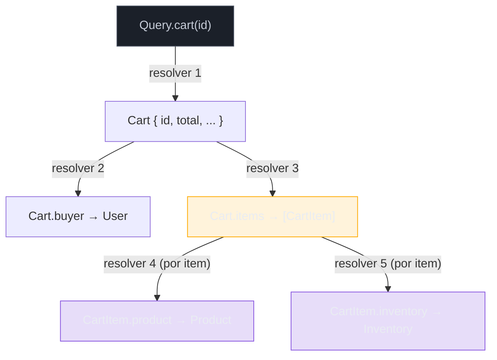
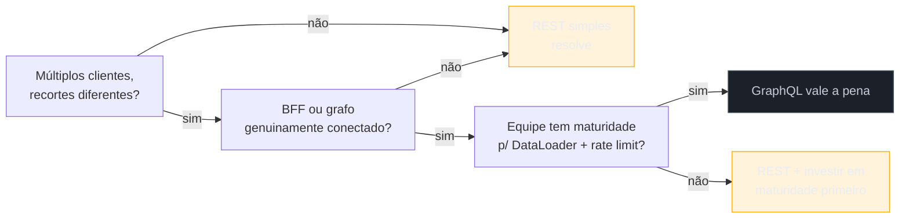

# GraphQL — schema, resolvers e quando vale

> [!abstract] TL;DR
> GraphQL substitui "um endpoint por formato de resposta" por **um schema tipado e um único endpoint**, onde o cliente declara exatamente os campos que quer e o servidor resolve essa forma via **resolvers** — uma função por campo, encadeada em árvore. O ganho central é resolver over-fetching/under-fetching em um só round-trip; o custo central é que **resolvers ingênuos reintroduzem o problema N+1** no banco de dados, um por um, campo a campo — e a solução padrão da indústria pra isso é o **DataLoader** (batching + cache por requisição). GraphQL vale quando múltiplos clientes (mobile, web, admin) precisam de recortes diferentes do mesmo grafo de dados; é overkill quando um CRUD simples com cache HTTP nativo já resolve o problema que você tem.

Imagine o app de checkout de um marketplace mobile. A tela de "resumo do pedido" precisa: o nome e endereço do comprador, os itens do carrinho (nome, preço, miniatura), o total com desconto aplicado, o status do estoque de cada item, e o método de pagamento salvo. Numa API REST convencional, sem um endpoint agregador dedicado, isso é **sete requisições HTTP encadeadas**: `GET /users/42`, `GET /carts/42`, `GET /products/101`, `GET /products/102`, `GET /inventory/101`, `GET /inventory/102`, `GET /payment-methods/42`. Cada uma paga o custo de uma viagem de ida e volta pela rede — em 4G decente isso é ~100-150ms cada; em conexão instável, muito mais. Sete requisições sequenciais (algumas dependem do resultado da anterior — você só sabe os IDs dos produtos depois de buscar o carrinho) podem facilmente estourar 1 segundo antes da tela sequer começar a renderizar.

A alternativa que [[1 - Panorama e decisão/03 - A era REST, GraphQL, gRPC|a nota anterior]] já contou na origem — Facebook, 2012, apps móveis afogados em over-fetching e under-fetching — resolve exatamente esse cenário: uma única query, um único round-trip, o cliente pedindo a forma exata que a tela precisa:

```graphql
query CheckoutSummary($cartId: ID!) {
  cart(id: $cartId) {
    total
    discount
    buyer {
      name
      address { city, zipCode }
    }
    items {
      product { name, thumbnailUrl, price }
      inventory { inStock }
    }
    paymentMethod { last4, brand }
  }
}
```

Uma requisição. Sete recortes de dados diferentes, vindos de (potencialmente) sete tabelas ou serviços diferentes, montados em uma única resposta JSON com exatamente a forma que a tela pediu — nada a mais, nada a menos. Esta nota é o "como" que [[1 - Panorama e decisão/03 - A era REST, GraphQL, gRPC|a nota anterior]] prometeu: schema, resolvers, o problema que ninguém avisa até bater nele (N+1), e o critério prático pra saber quando essa complexidade vale a pena.

## O schema é o contrato — e é escrito numa linguagem própria

Toda API GraphQL começa pelo **schema**, escrito na **Schema Definition Language (SDL)** — uma sintaxe declarativa, específica do GraphQL, que descreve todos os tipos de dado que a API pode devolver e todas as operações que ela aceita. O schema não é documentação gerada a partir do código (como o Swagger costuma ser em REST) — na maioria das implementações, o schema **é** o código-fonte da API, ou pelo menos a fonte de verdade que gera o resto.

```graphql
type Product {
  id: ID!
  name: String!
  price: Float!
  thumbnailUrl: String
  inventory: Inventory!
}

type Inventory {
  inStock: Boolean!
  quantity: Int
}

type Query {
  product(id: ID!): Product
  products(category: String, limit: Int = 20): [Product!]!
}

type Mutation {
  addToCart(productId: ID!, quantity: Int!): Cart!
}
```

Alguns elementos merecem nome próprio, porque aparecem em toda API GraphQL de produção:

- **Scalars** — os tipos primitivos embutidos: `Int`, `Float`, `String`, `Boolean`, `ID` (uma string tratada como identificador único). Schemas de produção quase sempre definem **scalars customizados** também — `DateTime`, `Email`, `URL`, `JSON` — porque os primitivos embutidos não capturam validação de domínio.
- **`!` (non-null)** — um tipo sem `!` é opcional (`String`, pode ser `null`); com `!` é obrigatório (`String!`, o servidor garante que nunca devolve `null` ali, e o cliente pode confiar nisso sem checagem defensiva). Essa marcação é um dos ganhos silenciosos de GraphQL sobre JSON solto em REST: o contrato de nulidade é parte do tipo, não uma convenção de documentação que ninguém garante em runtime.
- **Interfaces e Unions** — quando um campo pode devolver "uma coisa ou outra", o schema expressa isso de duas formas. **Interface** define um conjunto de campos comuns que múltiplos tipos compartilham (`interface Node { id: ID! }`, implementado por `Product`, `User`, `Order`); **Union** agrupa tipos sem exigir campos em comum (`union SearchResult = Product | User | Article`, útil pra uma busca global que devolve resultados heterogêneos). O cliente usa **fragments inline** (`... on Product { price }`) pra pedir campos específicos de cada tipo possível dentro de uma union ou interface.
- **Enums** — um conjunto fechado de valores válidos (`enum OrderStatus { PENDING, PAID, SHIPPED, CANCELLED }`), validado pelo próprio schema — o servidor rejeita qualquer valor fora da lista antes mesmo de rodar lógica de negócio.

O schema inteiro é introspectável — qualquer cliente pode perguntar ao servidor "qual é o seu schema?" via uma query especial (`__schema`), e é exatamente essa introspecção que ferramentas como GraphiQL, Apollo Studio e Postman usam pra gerar autocomplete, validação de query em tempo de escrita, e documentação interativa sem esforço manual do time de backend.

## Queries e mutations: leitura declarada, escrita com formato de função

GraphQL define três **tipos de operação raiz** no schema — `Query` (leitura), `Mutation` (escrita) e `Subscription` (streaming, tratada à parte mais adiante). A separação não é cosmética: ferramentas de tooling, cache de cliente (Apollo Client, Relay) e políticas de rate limiting tratam leitura e escrita de formas estruturalmente diferentes, então declarar a intenção no próprio schema economiza ambiguidade.

Uma **query** pede dados, sempre em forma de árvore aninhada — o cliente nunca "chama uma função", ele "navega um grafo":

```graphql
query {
  product(id: "101") {
    name
    price
    reviews(limit: 3) {
      rating
      comment
      author { name }
    }
  }
}
```

Uma **mutation** tem a mesma sintaxe de seleção de campos, mas o nome do campo raiz é sempre um verbo de intenção, e a convenção estabelecida (não uma regra imposta pela especificação, mas praticamente universal desde os primeiros guias oficiais) é que toda mutation aceita um único argumento de **input type** e devolve um **payload type** — não o objeto bruto modificado, mas um envelope que também carrega erros de validação de negócio:

```graphql
input AddToCartInput {
  productId: ID!
  quantity: Int!
}

type AddToCartPayload {
  cart: Cart
  errors: [UserError!]
}

type Mutation {
  addToCart(input: AddToCartInput!): AddToCartPayload!
}
```

Esse padrão — input/payload, em vez de argumentos soltos e retorno direto — existe porque mutations em produção quase sempre precisam devolver **dois tipos de coisa ao mesmo tempo**: o resultado (o carrinho atualizado) e erros de validação de negócio que não são erros de protocolo (estoque insuficiente, cupom expirado). GraphQL trata erros de protocolo (`errors` no nível raiz da resposta HTTP, sempre 200 OK) separadamente de erros de domínio — e por isso o payload de mutation carrega os erros de negócio como dado estruturado, não como código HTTP.

> [!question]- Por que GraphQL sempre devolve HTTP 200, mesmo quando algo deu errado?
> Porque uma única requisição GraphQL pode pedir vários campos, e alguns podem falhar enquanto outros têm sucesso — não existe um único "resultado" binário pra mapear num único código de status. A resposta HTTP quase sempre é 200 (a *transação HTTP* funcionou — o servidor recebeu, processou e respondeu), e o corpo JSON carrega um array `errors` no nível raiz, cada erro apontando pro campo específico que falhou (`path: ["cart", "items", 2, "product"]`), lado a lado com o campo `data` contendo o que teve sucesso. Isso é uma diferença estrutural real com REST, onde o código de status *é* o sinal primário de sucesso/falha — em GraphQL, o corpo é. Ferramentas de observabilidade e API Gateway que assumem "200 = sucesso" sem inspecionar o corpo tratam esse ponto errado o tempo todo, e é uma pegadinha real de operação, não só de design.

## Resolvers: uma função por campo, encadeada em árvore

O mecanismo que transforma uma query declarativa em dados reais é o **resolver** — uma função associada a cada campo do schema, responsável por produzir o valor daquele campo específico. A ideia central, que separa GraphQL de "só um jeito diferente de escrever REST", é que **cada campo é resolvido de forma independente**, em cascata: o resolver de `Query.cart` roda primeiro e devolve um objeto `Cart` parcial (normalmente só o ID); em seguida, para cada campo pedido dentro de `cart` (`total`, `buyer`, `items`), um resolver específico daquele campo roda, recebendo o resultado do resolver pai como contexto.

```js
const resolvers = {
  Query: {
    cart: (_, { id }, context) => context.db.carts.findById(id),
  },
  Cart: {
    buyer: (cart, _, context) => context.db.users.findById(cart.buyerId),
    items: (cart, _, context) => context.db.cartItems.findByCartId(cart.id),
  },
  CartItem: {
    product: (item, _, context) => context.db.products.findById(item.productId),
    inventory: (item, _, context) => context.db.inventory.findByProductId(item.productId),
  },
};
```

Repare a assinatura: todo resolver recebe `(parent, args, context, info)` — o valor do campo pai (`parent`), os argumentos passados na query (`args`), um objeto `context` compartilhado por toda a requisição (tipicamente carregando a conexão de banco, o usuário autenticado, e — crucial pro próximo tópico — instâncias de DataLoader), e `info` com metadados da própria query (raramente usado fora de casos avançados). Se um campo do schema tem o mesmo nome de uma propriedade que já existe no objeto pai (`cart.total`), a maioria das implementações usa um **resolver trivial padrão** automaticamente — você só escreve resolver explícito quando o campo precisa buscar dado de outro lugar (outra tabela, outro serviço, cálculo derivado).



O diagrama já denuncia o problema: se `Cart.items` devolve 10 itens, os resolvers `CartItem.product` e `CartItem.inventory` rodam **uma vez para cada item** — 10 chamadas ao resolver de produto, 10 ao de estoque, cada uma potencialmente disparando uma query SQL individual. É exatamente aqui que mora o problema mais citado (e mais mal-compreendido) de GraphQL em produção.

## O problema N+1 — e por que ele é do backend, não do protocolo

[[1 - Panorama e decisão/03 - A era REST, GraphQL, gRPC|A nota anterior]] já deixou um alerta sobre isso; aqui vai o mecanismo completo. Numa query que pede 50 posts, cada um com o nome do autor:

```graphql
query {
  posts(limit: 50) {
    title
    author { name }
  }
}
```

Sem nenhuma otimização, a execução ingênua é: 1 query para buscar os 50 posts (`SELECT * FROM posts LIMIT 50`), seguida de **50 queries separadas**, uma para cada post, buscando o autor daquele post específico (`SELECT * FROM users WHERE id = ?`, repetida 50 vezes). Isso é o clássico **N+1** — N chamadas adicionais para um resultado de tamanho N, quando uma única chamada em lote (`SELECT * FROM users WHERE id IN (...)`) resolveria tudo de uma vez.

O ponto que mais gera confusão: **N+1 não é um defeito do GraphQL como protocolo** — é uma consequência de como resolvers são desenhados por padrão: cada campo resolve de forma independente, sem saber que outros 49 resolvers irmãos estão prestes a pedir exatamente o mesmo tipo de dado (autor de um post) para IDs diferentes. ORMs em aplicações REST tradicionais sofrem exatamente do mesmo problema estrutural (é literalmente chamado de "N+1 query problem" há muito antes de GraphQL existir) — a diferença é que em REST o padrão de acesso costuma ser mais previsível (um endpoint, uma consulta bem otimizada de antemão), enquanto em GraphQL a **flexibilidade do cliente em pedir qualquer combinação de campos** torna o padrão de acesso imprevisível até a query chegar — o que faz N+1 aparecer com muito mais frequência, e de forma muito mais silenciosa, se ninguém desenhar os resolvers pensando nisso desde o início.

> [!warning] N+1 em produção é silencioso até a escala expor
> **O que acontece:** o time testa a API com 5, 10 registros no ambiente de dev, tudo parece rápido, e a API vai pra produção. Um cliente real pede uma lista de 200 itens numa única query, e o resolver dispara 200 consultas individuais ao banco — a latência da requisição salta de dezenas de milissegundos para vários segundos, e o banco de dados sofre um pico de conexões simultâneas que pode degradar outras partes do sistema. **Por quê:** o N+1 é proporcional ao tamanho do array retornado, não ao número de campos do schema — ele só aparece quando o array cresce o suficiente pra doer, o que frequentemente só acontece em produção, com dados reais. **Como evitar:** DataLoader (ou equivalente) desde o primeiro resolver que atravessa uma relação um-para-muitos ou muitos-para-um — não como otimização posterior, mas como padrão default de qualquer resolver que busca dado relacionado.

### DataLoader: batching e cache por requisição

A solução consolidada pela comunidade — nascida dentro do próprio Facebook, junto com o GraphQL, e hoje disponível como biblioteca (`dataloader` em Node, portada conceitualmente para praticamente toda linguagem com implementação GraphQL séria) — resolve o N+1 com dois mecanismos combinados, ambos escopados **por requisição** (nunca compartilhados entre requisições diferentes, o que causaria vazamento de dados entre usuários):

1. **Batching** — em vez de cada resolver disparar sua própria consulta imediatamente, o DataLoader **acumula todas as chamadas feitas dentro do mesmo tick do event loop** (na prática, dentro da mesma "rodada" de resolução de um nível da árvore) e as agrupa numa única função de carregamento em lote, fornecida pelo desenvolvedor.
2. **Caching por requisição** — se o mesmo ID for pedido duas vezes dentro da mesma requisição (comum quando o mesmo autor aparece em vários posts), o DataLoader devolve o resultado já buscado, sem nova consulta.

```js
const userLoader = new DataLoader(async (userIds) => {
  const users = await db.users.findByIds(userIds); // 1 consulta em lote
  return userIds.map(id => users.find(u => u.id === id));
});

// resolvers/Post.js
const resolvers = {
  Post: {
    author: (post, _, context) => context.loaders.user.load(post.authorId),
  },
};
```

Com essa mudança, a mesma query de 50 posts vira exatamente **2 consultas ao banco**: uma para os posts, uma única para todos os 50 autores agrupados por `WHERE id IN (...)`. A regra prática de operação: **um DataLoader novo por requisição** (nunca uma instância global de longa duração — isso vazaria dados entre usuários e cresceria sem limite de memória), tipicamente instanciado no `context` de cada requisição GraphQL.

> [!question]- DataLoader resolve todo tipo de N+1, mesmo com filtros e paginação por relação?
> Não automaticamente — DataLoader resolve bem o caso "buscar N entidades pelo mesmo tipo de chave" (autores por ID, produtos por ID). Quando a relação carrega argumentos próprios (`items(limit: 3, sortBy: PRICE)` — cada item da lista pedindo os *três* comentários *mais recentes* de cada post, não só "todos os comentários"), o batching fica mais complexo: a chave de cache deixa de ser só o ID, passa a incluir os argumentos, e a consulta em lote precisa aplicar `LIMIT`/`ORDER BY` por grupo — algo que bancos relacionais tradicionais não fazem de forma trivial (é o problema conhecido como "top-N por grupo"). Nesses casos, times de produção recorrem a: window functions (`ROW_NUMBER() OVER (PARTITION BY ...)` em bancos que suportam), a uma camada de agregação dedicada, ou aceitam buscar um pouco mais de dado do que o estritamente necessário e filtrar em memória. Não é um problema resolvido de graça — é o motivo de "resolvers bem desenhados" ser uma habilidade real, não um checkbox único.

## Subscriptions — a terceira operação, brevemente

O schema GraphQL define um terceiro tipo de operação raiz, `Subscription`, para o caso em que o cliente quer ser **notificado continuamente** quando algo muda no servidor — um novo comentário chegando, o status de um pedido mudando de `PAID` para `SHIPPED` — sem precisar perguntar repetidamente. A sintaxe de seleção de campos é idêntica à de uma query; a diferença é que a conexão permanece aberta e o servidor empurra um novo payload a cada evento relevante.

```graphql
subscription {
  orderStatusChanged(orderId: "9001") {
    status
    updatedAt
  }
}
```

O transporte por baixo de uma subscription quase sempre é **WebSocket** (o protocolo `graphql-ws` é hoje o padrão de fato, substituindo o mais antigo `subscriptions-transport-ws`) — o que significa que subscriptions herdam exatamente as mesmas características (conexão persistente, full-duplex, necessidade de lidar com reconexão e estado no servidor) já cobertas em profundidade em [[1 - Panorama e decisão/04 - Comunicação em tempo real|Comunicação em tempo real]]. Esta nota não aprofunda subscriptions além disso — o mecanismo interessante de GraphQL aqui não é o transporte (que é WebSocket puro e simples), é só a forma como o schema declara e tipa o que vai fluir por ele. Vale um alerta de escala que costuma pegar times de surpresa: subscriptions mantêm **uma conexão de longa duração por cliente conectado**, o que muda o perfil operacional do servidor — de "atender requisições curtas e soltar a conexão" para "sustentar milhares de conexões simultâneas abertas" —, a mesma discussão de custo operacional que WebSocket já traz fora do contexto GraphQL.

## Quando GraphQL vale a pena

A pergunta certa, como a nota anterior já estabeleceu para REST/GraphQL/gRPC em geral, nunca é "GraphQL é melhor que REST?" — é "que dor específica eu tenho, que um conjunto de endpoints REST bem modelados não resolve?". Os sinais que apontam para GraphQL, na prática:

- **Múltiplos clientes com necessidades de dados diferentes do mesmo domínio.** O caso canônico: um app mobile que quer o mínimo de bytes (bateria, rede móvel), um painel web que quer campos ricos e relações profundas, e um painel administrativo interno que quer *tudo*, incluindo campos que nunca apareceriam pro usuário final. Manter três variações de endpoint REST pra atender os três (`/mobile/orders/:id`, `/web/orders/:id`, `/admin/orders/:id`) é exatamente o tipo de duplicação que um schema único, consumido com queries diferentes por cliente, elimina.
- **BFF (Backend for Frontend).** GraphQL se tornou a escolha default pra essa camada de agregação — um serviço que fica entre o front-end e vários microsserviços internos, expondo um schema único que resolve campos de serviços diferentes por trás de cena. O cliente pede uma query; o BFF resolve `order` do serviço de pedidos, `inventory` do serviço de estoque, `paymentMethod` do serviço de pagamento, tudo numa única resposta — o cliente nunca sabe (nem precisa saber) que são três serviços diferentes.
- **Grafo de dados genuinamente conectado, navegado de formas variadas.** GitHub (issues → PRs → commits → reviews → autores) e Shopify (produtos → variantes → coleções → pedidos → clientes) são os exemplos citados na nota anterior — domínios onde "o que o cliente quer buscar a partir de que ponto de entrada" varia legitimamente de tela para tela.
- **Schema fortemente tipado como contrato de desenvolvimento.** Times grandes, com front-end e back-end desacoplados, ganham de graça: autocomplete no editor, validação de query em tempo de escrita (antes de rodar), geração de tipos TypeScript a partir do schema. Isso reduz uma classe inteira de bugs de integração que só REST + OpenAPI bem mantido também resolveria — mas GraphQL torna esse contrato *executável*, não apenas documentado.

## Quando GraphQL é overkill

O contrapeso, igualmente importante, e o motivo de REST continuar em 93% de uso segundo o [State of the API Report 2025 da Postman](https://www.postman.com/state-of-api/2025/) mesmo com GraphQL disponível há uma década:

- **CRUD simples com poucos tipos de recurso.** Se a API tem cinco entidades, cada uma consumida de forma previsível (lista, detalhe, criar, editar, apagar), o overhead de desenhar um schema, resolvers, e lidar com N+1 supera qualquer ganho real — endpoints REST bem modelados já resolvem isso sem fricção adicional.
- **Cache HTTP nativo é importante.** Esse é o ponto mais citado, e o mais concreto: GraphQL tipicamente expõe **um único endpoint via POST**, o que quebra o modelo de cache HTTP tradicional (proxies, CDNs e navegadores fazem cache por URL + método GET, de graça, há décadas). Uma API REST bem desenhada ganha cache em camadas inteiras (CDN cacheando `GET /products/101` sem nenhum código adicional); uma API GraphQL precisa reconstruir esse ganho manualmente — cache no nível de resolver, DataLoader, ou técnicas como **persisted queries** (o cliente manda só um hash da query, previamente registrada, permitindo cache por hash em vez de por corpo de requisição arbitrário). É trabalho de engenharia extra que REST recebe de graça da infraestrutura da web.
- **Equipe pequena ou sem maturidade em GraphQL.** Resolvers mal desenhados (sem DataLoader), schemas mal versionados (campos nunca depreciados, só acumulando), e queries sem limite de profundidade/complexidade são as três formas mais comuns de uma equipe pequena se afogar em GraphQL sem perceber até a escala expor o problema.
- **Rate limiting fica genuinamente mais complexo.** Numa API REST, `GET /products` tem um custo previsível — o servidor sabe de antemão o que vai custar antes de processar. Numa API GraphQL, o cliente pode compor uma query arbitrariamente profunda e cara (`products { reviews { author { posts { comments { author { ... } } } } } }`, aninhando relações repetidamente) — o mesmo endpoint pode custar 10ms ou 10 segundos, dependendo só da forma da query recebida. A resposta padrão da indústria é **query complexity analysis** (cada campo recebe um peso no schema, a query inteira precisa caber num orçamento — o modelo que a Shopify usa, já citado na nota anterior) ou **limite de profundidade** (rejeitar queries acima de N níveis de aninhamento) — nenhum dos dois é automático; ambos exigem desenho deliberado que REST simplesmente não precisa.



## GraphQL em Java e Node — citação, não tutorial

O aprofundamento de implementação já tem casa própria em cada trilha de linguagem; aqui fica só o mapa de onde procurar.

| Stack | Biblioteca principal | Nota canônica |
|---|---|---|
| **Node/TS** | Apollo Server, Mercurius (Fastify), GraphQL Yoga | [[03-Dominios/Tecnologia/Node/Integrações/06 - GraphQL com Apollo Server e Mercurius\|Node/Integrações 06]] — schema-first vs code-first, DataLoader, subscriptions, query complexity limiting, com snippets completos |
| **Java** | [graphql-java](https://www.graphql-java.com/) (motor de execução de baixo nível) e [Spring for GraphQL](https://docs.spring.io/spring-graphql/reference/) (integração oficial desde 2022, construída por cima do graphql-java, com suporte a `@QueryMapping`/`@MutationMapping`/`@SchemaMapping` e batch loading via `BatchMapping`) | ainda não há nota dedicada de GraphQL na trilha Java — lacuna sinalizada, não preenchida aqui (ver [[03-Dominios/Tecnologia/Java/Web e APIs REST/index\|Java/Web e APIs REST]] para o equivalente REST, hoje coberto em profundidade) |

A ideia central se repete em qualquer stack: um motor de execução que recebe o schema (SDL ou anotações), resolve cada campo por uma função equivalente a resolver, e alguma forma de batching (DataLoader em Node, `BatchMapping`/`DataLoader` do próprio `graphql-java` em Java) pra evitar N+1. O padrão problema→solução (N+1→DataLoader, cache quebrado→persisted queries, query cara→complexity limiting) não muda entre linguagens — só a sintaxe muda.

## Casos práticos

**GitHub e a migração para GraphQL v4.** O GitHub manteve por anos uma API REST v3 madura e amplamente documentada, e ainda assim lançou, em 2016, uma API GraphQL v4 em paralelo — não como substituição, mas como resposta a um padrão de uso específico: integrações que precisavam atravessar relações profundas (um repositório, suas issues, cada issue com seus comentários, cada comentário com reações e autor) e que, em REST, exigiam dezenas de chamadas encadeadas para montar uma única visão. A [documentação oficial do GitHub sobre por que usar a API GraphQL](https://docs.github.com/en/graphql/overview/about-the-graphql-api) é direta sobre o motivo: "solicite exatamente os dados que você precisa" e "obtenha muitos recursos em uma única requisição", nomeando os mesmos dois problemas — over-fetching e under-fetching — que motivaram o Facebook em 2012.

**Shopify e o custo calculado de query como proteção operacional.** Como citado na nota anterior, a Shopify não apenas adotou GraphQL para sua Admin API (maio de 2018) como também desenvolveu, cedo, um modelo de **custo por campo** — cada campo do schema carrega um peso, e toda query precisa caber num orçamento antes de ser executada. O [guia de design de GraphQL da própria Shopify](https://github.com/Shopify/graphql-design-tutorial) documenta esse raciocínio como resposta direta ao risco descrito nesta nota: sem um limite de custo, um cliente mal-intencionado (ou só descuidado) pode compor uma query legítima do ponto de vista de sintaxe, mas arbitrariamente cara do ponto de vista de execução — algo que uma API REST, com endpoints fixos e previsíveis, nunca permite por desenho.

## Armadilhas comuns

> [!warning] Adotar GraphQL só na borda pública, sem endereçar N+1 desde o início
> **O que acontece:** o time troca a API pública de REST para GraphQL, empolgado com a flexibilidade de query que os clientes ganham, mas escreve os primeiros resolvers do jeito mais direto — cada campo relacionado buscando seu próprio dado, sem batching. Funciona bem nos testes internos (poucos registros, poucos clientes simultâneos) e degrada assim que o primeiro cliente real faz uma query realista contra uma lista de tamanho de produção. **Por quê:** o custo do N+1 é proporcional ao tamanho do array percorrido pelo resolver, e esse tamanho normalmente só cresce depois do lançamento — o ambiente de desenvolvimento raramente reproduz a escala que expõe o problema. **Como evitar:** tratar DataLoader (ou equivalente) como parte do desenho inicial de qualquer resolver que atravessa uma relação um-para-muitos, não como otimização a ser adicionada "quando doer" — porque quando dói, já é produção, já é usuário real esperando a tela carregar.

> [!warning] Deixar o schema crescer sem depreciação disciplinada
> **O que acontece:** como adicionar um campo novo ao schema não quebra clientes existentes, o time trata isso como licença para nunca remover nada — campos antigos, mal desenhados, ou substituídos por versões melhores continuam no schema indefinidamente, "porque tirar dá trabalho e ninguém sabe quem ainda usa". **Por quê:** a ausência do ritual pesado de versionamento de REST (`/v1` → `/v2`) é uma vantagem real, mas ela só se sustenta se o time mantém disciplina equivalente por outro canal — a diretiva `@deprecated` do próprio schema, com prazo e comunicação ativa aos consumidores, em vez de acumulação silenciosa. **Como evitar:** tratar `@deprecated(reason: "...")` como parte do fluxo normal de evolução de schema — todo campo substituído entra em depreciação anunciada, com um prazo razoável, antes de sair — e revisar periodicamente quais campos deprecados já não têm tráfego real, como sinal de quando é seguro remover.

> [!warning] Expor o schema inteiro do banco de dados como schema GraphQL
> **O que acontece:** para acelerar o desenvolvimento, o time gera o schema GraphQL diretamente a partir do schema do banco de dados (tabelas viram tipos, colunas viram campos, um-para-muitos vira relação navegável) — sem nenhuma camada de modelagem entre os dois. O resultado expõe detalhes de implementação interna (nomes de coluna, tabelas de junção, campos administrativos) diretamente ao cliente, e qualquer refatoração de banco vira uma mudança de contrato público. **Por quê:** o schema GraphQL é um contrato de API, não um espelho de armazenamento — a mesma lição que já vale para REST (o recurso não é a tabela) se aplica aqui, só que o custo de errar é maior, porque o schema GraphQL costuma ficar mais exposto e mais navegável para o cliente do que uma coleção de endpoints REST. **Como evitar:** desenhar o schema a partir do que o *cliente* precisa expressar sobre o domínio, não a partir de como os dados estão fisicamente armazenados — mesmo que isso signifique escrever resolvers que traduzem entre os dois modelos.

## Em entrevista

A pergunta mais comum em entrevista sênior sobre GraphQL raramente é "explique o que é GraphQL" — é algum destes três formatos, testando profundidade real de quem já operou GraphQL em produção, não só leu a documentação:

1. **"Como você evita N+1 em resolvers GraphQL?"** A resposta fraca cita "DataLoader" como palavra mágica sem explicar o mecanismo. A resposta forte explica batching + cache por requisição, dá o exemplo concreto (50 posts, 50 autores, 2 queries em vez de 51), e sinaliza a armadilha real (uma instância de DataLoader por requisição, nunca global — do contrário, vazamento de dado entre usuários).
2. **"Quando você NÃO usaria GraphQL?"** Essa pergunta testa se o candidato entende trade-off, não só benefício. A resposta forte cita cache HTTP perdido, complexidade de rate limiting, e o overhead de manutenção de schema pra um domínio simples — não "GraphQL não tem desvantagem, é sempre melhor".
3. **"Como você limitaria o custo de uma query GraphQL maliciosa ou mal escrita?"** Testa se o candidato já bateu de frente com o problema de profundidade/complexidade arbitrária — a resposta forte cita query complexity analysis (peso por campo, orçamento por query) ou limite de profundidade, com um exemplo do tipo de query que provocaria o limite (aninhamento circular de relações).

> [!warning] "GraphQL resolve over-fetching" não é a resposta completa em entrevista
> **O que acontece:** o candidato recita "GraphQL resolve over-fetching e under-fetching" como se fosse a resposta completa, sem mencionar o custo que vem junto (N+1 no backend, cache HTTP perdido, rate limiting mais complexo). **Por quê:** entrevistadores sêniores procuram justamente o trade-off — dizer só o benefício, sem o custo, é o mesmo sinal fraco que recitar features sem entender motivação, já discutido na nota anterior. **Como evitar:** sempre emparelhar o ganho com o custo correspondente — "GraphQL resolve over/under-fetching na borda, mas desloca a complexidade pro backend (N+1) e pra infraestrutura (cache, rate limiting)". Isso sozinho já separa quem operou GraphQL de quem só leu sobre ele.

## How to explain in English

GraphQL replaces "one endpoint per response shape" with a single typed schema and a single endpoint, where the client declares exactly the fields it needs and the server resolves that shape through **resolvers** — one function per field, chained in a tree. The main win is collapsing multiple REST round-trips into one; the main cost is that naive resolvers reintroduce the classic **N+1 query problem**, one database call per field per item in a list — solved by **DataLoader**, which batches and caches requests within a single request scope.

> "I'd reach for GraphQL when different clients — mobile, web, an internal admin panel — genuinely need different shapes of the same data graph, or when I'm building a BFF aggregating multiple internal services behind one schema. I wouldn't reach for it for a simple CRUD API with a handful of resources — REST's native HTTP caching and lower operational complexity win there. And whenever I bring up GraphQL's benefits, I pair them with the cost: N+1 risk in resolvers unless DataLoader is there from day one, lost HTTP caching because everything's a POST to one endpoint, and rate limiting that needs query complexity analysis instead of a simple per-endpoint quota."

| PT | EN |
|----|----|
| Schema (linguagem de definição) | Schema (Schema Definition Language / SDL) |
| Resolver (função por campo) | Resolver |
| Consulta / Mutação / Assinatura | Query / Mutation / Subscription |
| Tipo não-nulo | Non-null type |
| Interface / União | Interface / Union |
| Enumeração | Enum |
| Fragmento (inline) | (Inline) fragment |
| Agregação em lote | Batching |
| Cache por requisição | Per-request cache |
| Consultas persistidas | Persisted queries |
| Análise de complexidade de query | Query complexity analysis |
| Limite de profundidade | Depth limiting |
| Backend for Frontend (agregador) | Backend for Frontend (BFF) |

## O que vem a seguir

Esta nota fechou o "como" de GraphQL — schema, resolvers, N+1/DataLoader, e o critério prático de quando vale a pena. A próxima nota deste sub-galho troca de eixo: em vez de "o cliente decide a forma da resposta" (GraphQL), entra o modelo que o Google abriu ao mundo pensando no *interior* da arquitetura — contratos binários fortemente tipados, HTTP/2 nativo, e streaming bidirecional de verdade.

- [[05 - gRPC — Protobuf, HTTP2 e streaming]] — Protocol Buffers, multiplexação HTTP/2, e os quatro modos de streaming (unary, server, client, bidirecional)
- [[06 - REST vs GraphQL vs gRPC — decisão]] — fecha o sub-galho comparando os três lado a lado: documentação como contrato (OpenAPI vs SDL vs `.proto`), contract testing, e a árvore de decisão final

## Veja também

- [[1 - Panorama e decisão/03 - A era REST, GraphQL, gRPC|A era REST, GraphQL, gRPC]] — a origem histórica e motivacional (Facebook, 2012) que esta nota aprofunda tecnicamente
- [[03-Dominios/Tecnologia/Node/Integrações/06 - GraphQL com Apollo Server e Mercurius|Node/Integrações 06]] — implementação completa em Node/TS (Apollo Server, Mercurius, snippets)
- [[1 - Panorama e decisão/04 - Comunicação em tempo real|Comunicação em tempo real]] — WebSocket, o transporte por trás de subscriptions
- [[2 - Comunicação síncrona/index|Comunicação síncrona]] — o sub-galho-pai

## Fontes

- GraphQL Foundation — [*GraphQL Specification*](https://spec.graphql.org/) (acessado jul. 2026) — especificação formal de schema, tipos, queries, mutations, subscriptions.
- GraphQL.org — [*Schemas and Types*](https://graphql.org/learn/schema/) (acessado jul. 2026) — SDL, scalars, interfaces, unions, enums.
- GraphQL.org — [*Mutations and Input Types*](https://graphql.org/learn/mutations/) (acessado jul. 2026) — padrão input/payload.
- Apollo GraphQL — [*Introduction to resolvers*](https://www.apollographql.com/docs/apollo-server/data/resolvers) (acessado jul. 2026) — assinatura de resolver, encadeamento em árvore.
- Meta Open Source — [*dataloader* (GitHub)](https://github.com/graphql/dataloader) (acessado jul. 2026) — implementação de referência do DataLoader, batching e cache por requisição.
- Apollo GraphQL — [*Dataloaders*](https://www.apollographql.com/docs/apollo-server/data/fetching-data#batching-and-caching) (acessado jul. 2026) — batching e caching aplicados a resolvers.
- Shopify — [*graphql-design-tutorial*](https://github.com/Shopify/graphql-design-tutorial) (GitHub, acessado jul. 2026) — custo calculado de query, mitigação de query cara.
- The Guild — [*graphql-ws*](https://github.com/enisdenjo/graphql-ws) (acessado jul. 2026) — protocolo de transporte de subscriptions sobre WebSocket, sucessor de `subscriptions-transport-ws`.
- Apollo GraphQL — [*Subscriptions*](https://www.apollographql.com/docs/apollo-server/data/subscriptions) (acessado jul. 2026) — modelo de subscriptions, custo operacional de conexões de longa duração.
- Spring Team — [*Spring for GraphQL Reference Documentation*](https://docs.spring.io/spring-graphql/reference/) (acessado jul. 2026) — `@QueryMapping`, `@MutationMapping`, `@SchemaMapping`, `BatchMapping`.
- graphql-java — [*graphql-java documentation*](https://www.graphql-java.com/documentation/getting-started) (acessado jul. 2026) — motor de execução Java de baixo nível, base do Spring for GraphQL.
- Postman — [*2025 State of the API Report*](https://www.postman.com/state-of-api/2025/) (2025) — REST 93%, GraphQL ~33% de uso reportado.
- Apollo GraphQL — [*Persisted Queries*](https://www.apollographql.com/docs/apollo-server/performance/apq) (acessado jul. 2026) — Automatic Persisted Queries como mitigação de cache HTTP perdido.
- WunderGraph — [*The Problem with N+1 Queries in GraphQL*](https://wundergraph.com/learn/graphql/thinking-in-graphs-solving-the-n-plus-1-problem) (acessado jul. 2026) — mecanismo detalhado do N+1 em resolvers GraphQL.
- Contentful — [*GraphQL vs REST APIs*](https://www.contentful.com/blog/graphql-vs-rest-api/) (acessado jul. 2026) — panorama de decisão, cache HTTP e BFF.
- GitHub Docs — [*About the GraphQL API*](https://docs.github.com/en/graphql/overview/about-the-graphql-api) (acessado jul. 2026) — motivação oficial do GitHub para a API GraphQL v4, lançada em 2016.
- GraphQL.org — [*Validation and Execution*](https://graphql.org/learn/validation/) (acessado jul. 2026) — depreciação de campos via `@deprecated`, ciclo de evolução de schema.
