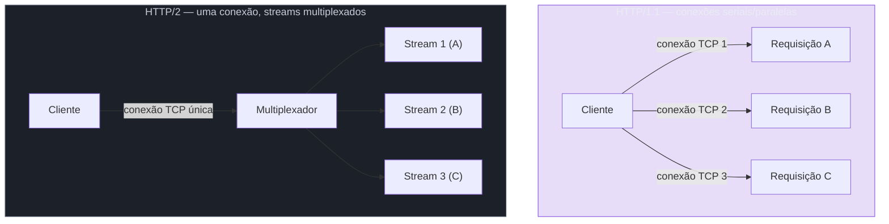
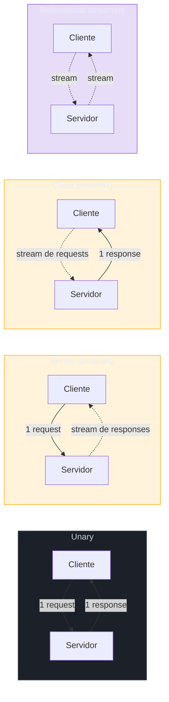
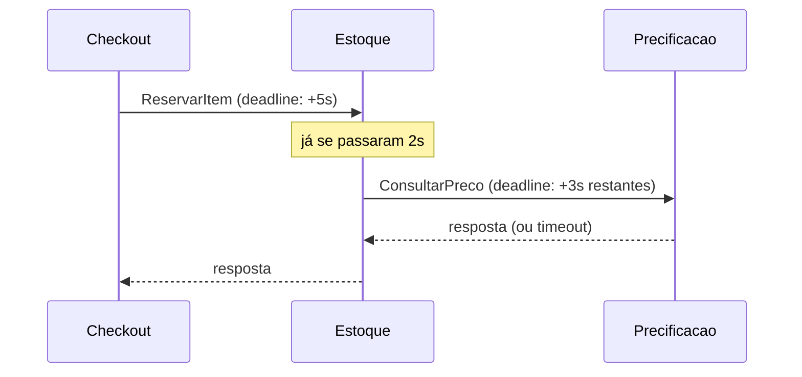
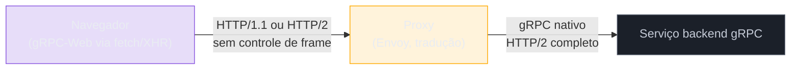

# gRPC — Protobuf, HTTP/2 e streaming

> [!abstract] TL;DR
> gRPC entrega desempenho substituindo **dois** elementos do stack REST/JSON simultaneamente: a **serialização** (JSON textual vira **Protocol Buffers** binário, definido em um arquivo `.proto` compilado pelo `protoc`) e o **transporte** (HTTP/1.1 vira **HTTP/2**, com multiplexação e compressão de cabeçalhos via HPACK). O contrato `.proto` também declara o **modo de chamada** — *unary* (função normal), *server streaming* (um pedido, muitas respostas), *client streaming* (muitos pedidos, uma resposta) ou *bidirectional streaming* (os dois lados enviam a vontade, na mesma conexão) — cada um resolvendo um formato diferente de interação que REST não modela nativamente. O preço: um cliente gRPC precisa de código gerado a partir do `.proto` (não existe "gRPC via `curl`"), e navegadores não falam gRPC nativamente — exigem uma camada de tradução chamada **gRPC-Web**, atrás de um proxy.

Um time de e-commerce está decidindo como o serviço de **checkout** vai conversar com o serviço de **estoque**, internamente, dentro da mesma rede. A primeira versão foi REST simples: `POST /estoque/reservar`, corpo JSON, resposta JSON. Funcionou bem com baixo tráfego. Mas a Black Friday chegou, e com ela um padrão que o time não tinha visto em produção: o serviço de checkout dispara **centenas de chamadas por segundo** para o de estoque, cada uma pequena — um `sku`, uma `quantidade`, um booleano de volta — mas o overhead por chamada começa a dominar o tempo total. Cada requisição HTTP/1.1 abre uma conexão TCP nova (ou compete por uma das poucas conexões persistentes do pool), carrega cabeçalhos HTTP inteiros e repetidos a cada vez (`Content-Type`, `Authorization`, `User-Agent`, `Accept`...), e serializa um payload pequeno em JSON textual — que para esse volume de chamadas pequenas custa proporcionalmente mais em parsing do que carregaria em dados úteis.

A dor aqui não é "JSON é ruim" nem "REST é lento" — em endpoints públicos, de baixo volume relativo, nenhum desses custos importa. A dor é específica de **comunicação interna, de alto volume, entre serviços que a própria empresa controla nas duas pontas** — exatamente o cenário onde o Google, com o **Stubby**, resolveu o mesmo problema em escala ainda maior uma década antes de abrir a solução ao mundo como **gRPC**, em 2015 (a origem completa — Stubby, Facebook/GraphQL como contraponto — já foi contada em [[1 - Panorama e decisão/03 - A era REST, GraphQL, gRPC|A era REST, GraphQL, gRPC]]; esta nota assume esse pano de fundo e mergulha no *como* técnico).

Esta é a quinta nota do sub-galho *Comunicação síncrona*. As três primeiras aprofundaram REST (modelagem, contrato de resposta, paginação/auth); a quarta cobriu GraphQL. Aqui o foco muda de "como desenhar um recurso" para "como desenhar uma chamada de procedimento remota eficiente" — Protocol Buffers, HTTP/2, os quatro modos de streaming, deadlines, interceptors e o problema real de levar tudo isso a um navegador.

## Protocol Buffers: o contrato que também é o formato de dados

Em REST, o contrato (o que o endpoint aceita e devolve) e o formato de serialização (JSON) são coisas separadas — você descreve o contrato em um documento OpenAPI à parte, e o JSON em si não impõe tipos fortes; qualquer campo pode, em tese, vir com um tipo diferente do esperado, e só a validação de aplicação pega isso. Em gRPC, contrato e formato são **a mesma coisa**: você escreve um arquivo `.proto`, e esse arquivo é ao mesmo tempo a especificação da API (equivalente ao OpenAPI) e a definição de como os bytes são organizados na rede.

```protobuf
syntax = "proto3";

package estoque.v1;

service EstoqueService {
  rpc ReservarItem (ReservaRequest) returns (ReservaResponse);
}

message ReservaRequest {
  string sku = 1;
  int32 quantidade = 2;
}

message ReservaResponse {
  bool sucesso = 1;
  string motivo = 2;
}
```

Repare nos números depois de cada campo (`= 1`, `= 2`). Eles não são um detalhe estético — são a **chave de identificação do campo no formato binário**. Protobuf não serializa nomes de campo (diferente de JSON, onde `"sku"` é uma string literal em todo payload); ele serializa apenas o número do campo e o valor. Isso é o que torna o binário compacto, e é também a regra central de evolução segura do contrato: **o número do campo, uma vez usado, nunca pode ser reaproveitado para outro campo** — mesmo depois que o campo original for removido, o número fica "queimado" (a boa prática é marcá-lo explicitamente com `reserved`), porque um consumidor rodando uma versão antiga do `.proto` pode continuar mandando dados codificados com aquele número.

O fluxo de trabalho, na prática:

1. Você (ou o time responsável pelo serviço "dono" do contrato) escreve o `.proto`.
2. O compilador **`protoc`**, com o plugin específico da linguagem-alvo, gera código: classes/structs tipados para as mensagens, e **stubs** — no cliente, um objeto que espelha os métodos do serviço, de forma que chamar `client.ReservarItem(req)` looks like chamar uma função local, mas por trás dispara serialização + chamada de rede + desserialização; no servidor, uma classe base que você estende para implementar a lógica de fato.
3. Cliente e servidor **compartilham o mesmo `.proto`** (geralmente versionado em um repositório dedicado, ou publicado via um registro de schemas) — o contrato é a fonte única de verdade, e o código gerado garante que cliente e servidor concordam sobre os tipos sem precisar de validação manual em runtime.

> [!question]- Por que não usar JSON Schema e ganhar tipagem sem abandonar JSON?
> Você pode — JSON Schema existe e resolve boa parte da validação de tipo. O que ele não resolve é o formato de serialização em si: mesmo com JSON Schema validando a forma, o payload continua sendo texto, com nomes de campo repetidos em cada mensagem, números representados como strings de dígitos (mais bytes que um inteiro binário), e um parser que precisa tokenizar caractere a caractere. Protobuf resolve os dois problemas ao mesmo tempo — tipagem forte *e* formato binário compacto — porque o `.proto` gera código específico de linguagem, não um schema interpretado em runtime.

### Binário vs texto: o tamanho importa quando o volume é alto

Benchmarks recentes mostram a mesma mensagem serializando para **99 bytes em Protobuf contra 214 bytes em JSON** para a mesma estrutura de dados — uma redução de mais de 50%, e em cargas com muitos campos numéricos a diferença de *velocidade* de serialização/desserialização chega a ser [23-38x mais rápida que JSON](https://jsontotable.org/blog/protobuf/protobuf-vs-json), porque Protobuf copia bytes diretamente onde JSON precisa fazer parsing textual de cada número. Para uma chamada isolada, isso é irrelevante — a diferença é imperceptível para um humano. Multiplicado por centenas de chamadas por segundo, como no cenário do checkout na Black Friday, o efeito acumulado em CPU de serialização e em bytes trafegados deixa de ser cosmético.

> [!warning] O binário compacto tem um preço: debugabilidade
> **O que acontece:** um payload REST/JSON pode ser lido a olho nu em qualquer inspetor de rede, log, ou até com `curl -v` puro. Um payload gRPC/Protobuf, capturado no fio, é uma sequência de bytes ilegível sem o `.proto` correspondente para decodificar. **Por quê:** o mesmo ganho que torna Protobuf compacto (sem nomes de campo, sem formatação textual) é o que o torna opaco sem a definição do schema à mão. **Como evitar:** ferramentas específicas preenchem essa lacuna — **grpcurl** funciona como um "`curl` para gRPC", capaz de listar serviços e invocar métodos via **reflection** do servidor (se habilitada) sem precisar de código gerado localmente. Times que operam gRPC em produção também investem em logging estruturado nas bordas do serviço (loggar o request/response já desserializado, não o payload no fio) — porque depurar direto no wire, sem essas camadas, é bem mais lento que abrir um payload JSON no navegador.

## HTTP/2: o transporte que faz a multiplexação valer a pena

Protobuf resolve o problema de *quantos bytes* trafegam. HTTP/2 resolve um problema diferente: *quanto tempo* uma conexão gasta esperando. Em HTTP/1.1, mesmo com conexões persistentes (`keep-alive`), cada requisição em uma conexão TCP precisa esperar a resposta da requisição anterior terminar antes que a próxima possa começar a ser processada nessa mesma conexão — o **head-of-line blocking** a nível de aplicação. Navegadores contornam isso abrindo múltiplas conexões TCP em paralelo (tipicamente 6 por domínio), mas cada conexão nova custa um handshake TCP (e, com TLS, também um handshake TLS) antes de trafegar um byte de dado útil.

HTTP/2 resolve isso com **multiplexação**: múltiplos *streams* (cada um representando uma requisição/resposta independente) compartilham a **mesma conexão TCP**, intercalados em frames e reconstruídos de forma independente do lado que recebe. Uma chamada lenta não bloqueia as rápidas atrás dela na mesma conexão — porque elas não estão "na fila" atrás dela, estão entrelaçadas.



O segundo ganho, menos falado mas igualmente relevante para gRPC, é a compressão de cabeçalhos via **HPACK**. Em chamadas gRPC de alto volume, os mesmos cabeçalhos (`content-type: application/grpc`, tokens de autenticação, metadados de tracing) se repetem em praticamente toda chamada dentro da mesma conexão. HPACK mantém uma **tabela dinâmica** de cabeçalhos já vistos e, depois da primeira transmissão, referencia repetições por índice em vez de reenviar o texto completo — reduzindo o overhead de cabeçalho em [até 85-90% em aplicações reais](https://jadhavsaurabh037.medium.com/grpc-deep-dive-efficient-network-communication-using-http-2-11bb97151b09), com estudos independentes registrando economias de banda de cabeçalho por volta de 76%. Para uma única chamada isolada isso não muda nada perceptível; para centenas de chamadas por segundo entre checkout e estoque, é banda e CPU de parsing que deixam de ser gastos repetidamente.

> [!question]- Por que gRPC não inventou um transporte próprio, já que HTTP/2 tem overhead de protocolo que um transporte binário dedicado não teria?
> Porque reinventar transporte é o mesmo erro que SOAP cometeu ao inventar um protocolo inteiro por cima do HTTP em vez de reaproveitá-lo. HTTP/2 já resolvia exatamente os dois problemas que gRPC precisava (multiplexação e compressão de cabeçalho), já tinha implementações maduras em toda infraestrutura de rede (proxies, load balancers, ferramentas de observabilidade), e já era um padrão aberto (RFC 7540, publicado em 2015 pela IETF) em vez de um formato proprietário. Adotar HTTP/2 deu ao gRPC compatibilidade "de graça" com boa parte do ecossistema de rede que já existia — o mesmo cálculo de custo-benefício que fez REST adotar HTTP puro em vez de inventar algo novo, só que aplicado a um transporte mais moderno.

## Os quatro tipos de streaming: RPC não é só pergunta-resposta

A palavra "streaming" no nome gRPC não é acidental — é a parte do modelo que REST e GraphQL, por desenho, não cobrem nativamente. O `.proto` declara o modo de cada RPC pela presença (ou ausência) da palavra-chave `stream` no tipo de requisição e/ou resposta, e essa escolha determina um padrão de interação completamente diferente.



### Unary — a chamada de função comum

```protobuf
rpc ReservarItem (ReservaRequest) returns (ReservaResponse);
```

Um request, um response — o modo mais usado, e o que corresponde diretamente a uma chamada REST tradicional. No cenário de abertura, `ReservarItem` é exatamente isso: o checkout pergunta "reserve este SKU nesta quantidade", o estoque responde "sim" ou "não, motivo X". A grande maioria dos serviços internos gRPC usa unary para a maior parte dos seus métodos — os outros três modos existem para os casos onde a forma pergunta-resposta simplesmente não descreve a interação.

### Server streaming — um pedido, muitas respostas ao longo do tempo

```protobuf
rpc AcompanharPreco (SkuRequest) returns (stream PrecoAtualizado);
```

O cliente envia um único request e recebe um **stream** de mensagens de volta, lendo a sequência até o servidor sinalizar o fim. O caso de uso canônico: um painel de precificação dinâmica quer acompanhar o preço de um SKU em tempo real, sem reabrir conexão a cada mudança — o cliente chama `AcompanharPreco` uma vez, e o servidor empurra uma nova mensagem `PrecoAtualizado` cada vez que o preço muda, na mesma conexão HTTP/2 aberta. Outro exemplo comum: exportar um relatório grande — o cliente pede "todos os pedidos de julho", e o servidor transmite os registros em lotes conforme lê do banco, em vez de montar a resposta inteira em memória antes de enviar.

### Client streaming — muitos pedidos, uma resposta consolidada

```protobuf
rpc RegistrarLeiturasSensor (stream LeituraSensor) returns (ResumoUpload);
```

O inverso: o cliente envia uma **sequência** de mensagens, e o servidor consolida tudo e responde **uma vez**, ao final. O exemplo clássico é upload de arquivo em pedaços — o cliente transmite chunks de um arquivo grande sem precisar montar tudo em memória antes de enviar, e o servidor confirma recebimento e integridade só no final. No cenário de logística de um e-commerce, um dispositivo de coleta em depósito poderia usar esse modo para transmitir centenas de leituras de código de barras conforme o operador escaneia itens, recebendo de volta um único resumo ("237 itens processados, 2 com erro") quando o lote termina.

### Bidirectional streaming — os dois lados falam a vontade, na mesma conexão

```protobuf
rpc Chat (stream Mensagem) returns (stream Mensagem);
```

Dois fluxos independentes compartilhando a mesma conexão — cliente e servidor podem enviar mensagens a qualquer momento, em qualquer ordem relativa, sem esperar um "turno" do outro lado. É o modo mais próximo de uma conexão WebSocket em espírito, mas com a tipagem forte e a eficiência binária do Protobuf. Casos de uso típicos: chat em tempo real, telemetria bidirecional (um cliente de jogo enviando posição do jogador continuamente enquanto recebe atualizações do estado do mundo), ou um serviço de tradução simultânea que recebe áudio em stream e devolve texto traduzido em stream, sem esperar o áudio terminar.

| Tipo | Request | Response | Caso de uso concreto |
|---|---|---|---|
| **Unary** | 1 mensagem | 1 mensagem | Reservar um item de estoque — pergunta, espera, recebe |
| **Server streaming** | 1 mensagem | stream | Acompanhar preço em tempo real; exportar relatório grande em lotes |
| **Client streaming** | stream | 1 mensagem | Upload de arquivo em chunks; coletor de código de barras enviando leituras |
| **Bidirectional streaming** | stream | stream | Chat; telemetria de jogo; tradução simultânea de áudio |

> [!question]- Se bidirectional streaming existe, por que não usar sempre esse modo — ele não é um superconjunto dos outros três?
> Tecnicamente, sim — bidirectional streaming *pode* emular os outros três modos. Na prática, isso joga fora informação valiosa que o modo mais restrito comunica de graça: quando você declara `unary`, qualquer engenheiro lendo o `.proto` sabe, sem ler implementação nenhuma, que essa chamada é pergunta-resposta simples, sem estado de conexão prolongado para gerenciar. Streaming — em qualquer direção — exige gerenciamento de conexão mais cuidadoso (o que fazer se o stream cai no meio? como sinalizar fim de forma limpa? como aplicar backpressure se um lado produz mais rápido do que o outro consome?). Usar o modo mais simples que resolve o problema é a mesma disciplina de "não usar gRPC pra tudo só porque é mais rápido" — aqui aplicada dentro do próprio gRPC.

## Deadlines: timeout que atravessa a cadeia de chamadas

Um detalhe que separa gRPC de "HTTP com timeout no cliente" é como ele trata prazo de execução. Em REST, o timeout costuma ser uma configuração isolada do cliente HTTP ("esperar no máximo 5 segundos por esta chamada") — e se esse cliente, dentro do prazo, chama um segundo serviço, esse segundo serviço não sabe nada sobre o relógio que já está correndo desde a chamada original.

gRPC formaliza isso como **deadline**: em vez de "espere 5 segundos a partir de agora" (um timeout, relativo), o cliente propaga um **ponto absoluto no tempo** que a chamada inteira — incluindo qualquer sub-chamada que o servidor faça a outros serviços — não deve ultrapassar. Se o serviço A chama o serviço B com um deadline de 5 segundos, e B por sua vez chama C, C recebe o **tempo restante real** daquele deadline original, não um novo prazo de 5 segundos contado a partir de quando C começou a trabalhar. Nenhum serviço na cadeia gasta tempo processando uma requisição cujo prazo, do ponto de vista de quem pediu originalmente, já expirou.



Mecanicamente, a propagação acontece via um cabeçalho HTTP/2 (`grpc-timeout`) que carrega o tempo restante — não o instante absoluto, porque relógios entre servidores diferentes podem estar levemente dessincronizados; converter para "tempo restante a partir de agora" em cada hop evita que esse desvio de relógio (*clock skew*) cause deadlines inconsistentes entre serviços.

> [!warning] Deadline não propaga sozinho — cada chamada intermediária precisa repassá-lo explicitamente
> **O que acontece:** um time implementa a chamada de A para B com deadline corretamente, mas o handler em B, ao chamar C, cria um client novo sem repassar o contexto/deadline recebido — e C acaba rodando com timeout default (às vezes nenhum timeout, o que é pior). **Por quê:** deadline não é uma propriedade "mágica" da conexão TCP — é um valor que precisa ser lido do contexto da chamada recebida e explicitamente passado adiante em cada chamada saindo. Nas linguagens com suporte a contexto implícito (Go com `context.Context`, por exemplo), isso é natural porque o deadline vive dentro do mesmo objeto que já é passado por convenção em toda função; em linguagens sem esse idioma, é fácil esquecer. **Como evitar:** tratar propagação de deadline como parte do contrato de toda função que faz uma chamada gRPC saindo — revisão de código e interceptors (próxima seção) ajudam a garantir isso de forma centralizada, em vez de depender de disciplina manual em cada handler.

## Interceptors: onde vive o código que não é lógica de negócio

Toda chamada gRPC, unary ou streaming, passa por um ponto de extensão chamado **interceptor** — o equivalente gRPC a middleware HTTP. Um interceptor executa código antes (e depois) do handler real da RPC, nos dois lados da conversa: no cliente, antes de enviar e depois de receber a resposta; no servidor, antes de invocar o handler e depois que ele termina.

A lista de usos típicos é praticamente idêntica à de middleware HTTP, e por um motivo — são os mesmos problemas, resolvidos no nível de transporte certo:

- **Autenticação/autorização** — validar um token de identidade antes de deixar a requisição chegar ao handler de negócio, de forma centralizada em vez de repetida em cada RPC.
- **Logging estruturado** — registrar toda chamada (método, duração, código de status) sem que cada handler precise lembrar de logar manualmente.
- **Métricas e tracing distribuído** — injetar/propagar IDs de correlação, medir latência por método, contar chamadas por código de erro.
- **Retry e circuit breaking** — interceptors de cliente podem decidir retentar uma chamada que falhou com um código transitório, sem que o código de negócio saiba que houve retry.
- **Rate limiting** — recusar uma chamada antes que ela consuma recursos do handler, no nível do servidor.

O ponto que faz interceptors valerem a pena (em vez de simplesmente escrever esse código dentro de cada handler) é o mesmo argumento de middleware em qualquer framework web: cross-cutting concerns escritos uma vez, aplicados a toda chamada por configuração, em vez de duplicados — e potencialmente esquecidos — em cada implementação de serviço. A ordem de encadeamento importa: um interceptor de autenticação precisa rodar antes de um de rate limiting por usuário, por exemplo, porque o segundo depende da identidade que o primeiro estabeleceu.

> [!question]- Interceptor de gRPC é "a mesma coisa" que middleware Express/Spring?
> Conceitualmente sim — mesmo padrão de responsabilidade (código que envolve a chamada real, cross-cutting, configurável por composição). A diferença prática é que interceptors gRPC precisam lidar explicitamente com os quatro modos de chamada: um interceptor unary intercepta uma chamada com início e fim claros; um interceptor de streaming precisa decidir se atua mensagem a mensagem dentro do stream, ou só no início/fim dele. Frameworks como grpc-java, grpc-go e grpc-web-node expõem assinaturas de interceptor separadas para unário e para streaming exatamente por essa diferença estrutural.

## gRPC-Web: por que o navegador precisa de um tradutor

Tudo até aqui assume que os dois lados da chamada — cliente e servidor — controlam totalmente a pilha de rede: quem fala gRPC decide como abre a conexão, como monta os frames HTTP/2, como lê trailers. Um navegador não te dá esse controle. A API `fetch`/XHR do JavaScript no navegador não expõe controle de frames HTTP/2 brutos, não permite ler **trailers** HTTP (metadados que o gRPC usa para carregar o código de status *depois* do corpo da resposta, não antes) e não tem suporte nativo para lidar eficientemente com payloads binários Protobuf no nível que gRPC exige.

Isso não é um detalhe implementável "com mais esforço" — é uma limitação estrutural da plataforma web, porque o modelo de segurança e as APIs do navegador foram desenhados décadas antes de HTTP/2 trailers existirem como conceito relevante para JavaScript. Resultado prático: **gRPC nativo não roda em navegador**, ponto final.

A solução é **gRPC-Web** — um protocolo companheiro (não o mesmo protocolo, uma variante compatível) que o cliente JavaScript fala, usando apenas o que o navegador expõe (requisições HTTP/1.1 ou HTTP/2 sem controle de frame bruto), e que precisa ser traduzido para gRPC "de verdade" antes de chegar ao serviço backend. Essa tradução acontece em um **proxy** — o mais usado em produção é o **Envoy**, com um filtro dedicado (`envoy.filters.http.grpc_web`) que recebe as requisições HTTP/1.1 codificadas em gRPC-Web e as reescreve como chamadas HTTP/2 gRPC padrão para o serviço real, e faz o caminho inverso na resposta.



Essa camada extra tem duas implicações práticas que vale nomear:

1. **Streaming no navegador é limitado.** Bidirectional streaming completo, como descrito antes, não funciona de forma nativa em gRPC-Web pela mesma limitação de trailers/frames — a maioria das implementações suporta unary e server streaming bem, e bidirectional streaming com restrições (ou nem suporta, dependendo do proxy e da versão).
2. **Operacionalmente, é mais uma peça no caminho.** Além do serviço backend, agora existe um proxy dedicado a manter, versionar e observar — não é uma decisão gratuita, é uma troca: aceitar essa complexidade operacional em troca de ter tipagem forte e eficiência binária também na borda voltada ao navegador.

> [!warning] "Vou expor gRPC direto pro frontend" é uma frase que sinaliza retrabalho
> **O que acontece:** um time decide usar gRPC internamente e, sem pensar duas vezes, tenta consumir o mesmo serviço direto do frontend web — e descobre, ao tentar implementar o cliente, que precisa de gRPC-Web e um proxy que não estava no plano original. **Por quê:** a decisão de usar gRPC internamente (serviço-a-serviço) e a decisão de expor uma API para o navegador são **decisões diferentes**, com trade-offs diferentes — a primeira otimiza para throughput/latência entre serviços controlados; a segunda precisa lidar com um cliente que a equipe não controla totalmente (o navegador do usuário) e uma camada extra de tradução. **Como evitar:** decidir a camada de borda separadamente da camada interna — como discutido na nota anterior deste sub-galho, um desenho comum é REST ou GraphQL na borda pública/navegador, gRPC por dentro. Se o navegador *precisa* falar gRPC-Web (por exemplo, um painel administrativo interno que já compartilha o `.proto` com o backend), planejar o proxy Envoy como parte da infraestrutura desde o início, não como surpresa de última hora.

## Por linguagem: onde gRPC já tem casa aprofundada

Esta nota fica no nível de modelo mental — motivação, Protobuf, HTTP/2, streaming, deadlines, interceptors, gRPC-Web. Implementação específica de linguagem, com código, já tem trilha própria em três das quatro linguagens cobertas por este vault; a tabela abaixo é ponto de entrada, não substituto.

| Linguagem | Papel no ecossistema gRPC | Onde aprofundar |
|---|---|---|
| **Go** | Cidadão nativo — Go é a linguagem em que o próprio time do gRPC mantém `grpc-go`, e `context.Context` (propagação implícita de deadline/cancelamento) encaixa quase perfeitamente no modelo de deadline do gRPC. Não existe trilha profunda de Go neste vault ainda — lacuna conhecida, fora do escopo desta trilha de comunicação preencher. | *(lacuna — sem trilha profunda ainda)* |
| **Java** | Protobuf e gRPC como parte do galho de Mensageria — cobre `.proto`, `protoc`, os 4 tipos de chamada e integração com Spring Boot via `grpc-spring-boot-starter`. | [[03-Dominios/Tecnologia/Java/Mensageria/27 - Protocol Buffers — a IDL e a serialização binária\|27 - Protocol Buffers]] e [[03-Dominios/Tecnologia/Java/Mensageria/28 - gRPC em Java — RPC síncrono sobre HTTP_2\|28 - gRPC em Java]] |
| **Python** | `grpc.aio` — API assíncrona oficial sobre `asyncio`, com `grpc.aio.insecure_channel()`/`grpc.aio.server()` e suporte nativo a streaming via generators assíncronos. Sem trilha profunda de Python neste vault ainda — mesma lacuna que Go. | *(lacuna — sem trilha profunda ainda)* |
| **TS/Node** | `grpc-js` — implementação pura em JavaScript/TypeScript (sem binding nativo obrigatório), integrando com o ecossistema Node de forma idiomática. | [[03-Dominios/Tecnologia/Node/Integrações/05 - gRPC com grpc-js\|05 - gRPC com grpc-js]] |

## Em entrevista

Duas perguntas cobrem a maior parte do que entrevistadores de sistemas distribuídos testam aqui, e as duas recompensam entender *mecanismo*, não só rótulo.

A primeira é direta: "por que gRPC é mais rápido que REST/JSON?". A resposta fraca diz "porque é binário". A resposta forte separa as duas fontes de ganho: **Protocol Buffers reduz o tamanho do payload e o custo de parsing** (benchmarks mostram reduções de tamanho na casa de 50%+ e ganhos de velocidade de serialização de dezenas de vezes em cargas numéricas pesadas), e **HTTP/2 reduz o custo por chamada** via multiplexação (uma conexão, muitos streams simultâneos, sem head-of-line blocking) e compressão de cabeçalho via HPACK (economia de até 85-90% de overhead de cabeçalho repetido). São dois mecanismos independentes que se somam — não um único truque.

A segunda testa julgamento arquitetural: "por que não expor tudo em gRPC, já que é mais rápido?". A resposta sênior nomeia os dois custos reais: **acesso** (cliente precisa de código gerado a partir do `.proto`; navegador precisa de gRPC-Web e um proxy dedicado — não existe "chamar com `curl`" trivial) e **debugabilidade** (binário no fio não é inspecionável sem ferramentas específicas como grpcurl, diferente de um payload JSON que qualquer inspetor de rede mostra legível). O padrão saudável de adoção — REST/GraphQL na borda pública, gRPC internamente entre serviços controlados — é a resposta que demonstra ter internalizado esse trade-off, não decorado.

Um terceiro ângulo, mais avançado, aparece em perguntas sobre resiliência: "como você garante que uma cadeia de chamadas gRPC não desperdiça trabalho em requisições já expiradas?" — a resposta aponta para **deadlines propagados** (não timeouts isolados por hop) como o mecanismo específico do gRPC para isso, e **interceptors** como o lugar certo para aplicar essa disciplina de forma centralizada em vez de manual em cada handler.

> [!warning] Confundir "gRPC" com "streaming" é um erro comum de vocabulário
> **O que acontece:** um candidato ou colega usa "vamos usar gRPC" como sinônimo de "vamos usar streaming", quando na prática a maioria das chamadas gRPC em produção é **unary** — uma chamada de função remota comum, sem stream nenhum. **Por quê:** streaming é a capacidade mais vistosa e mais citada do gRPC, mas é uma opção entre quatro modos, não a razão principal de adoção na maioria dos casos — a maior parte dos times adota gRPC pelo ganho de Protobuf+HTTP/2 em chamadas unary, e usa streaming apenas nos poucos métodos que genuinamente precisam de um fluxo contínuo de dados. **Como evitar:** ao descrever uma decisão de gRPC, ser específico sobre qual dos quatro modos está em jogo — "unary para as chamadas normais, server streaming só no endpoint de acompanhamento de preço" é uma frase que sinaliza entendimento real da ferramenta.

## How to explain in English

gRPC gets its performance edge from replacing two things REST/JSON relies on: the serialization format (JSON text becomes **Protocol Buffers**, a binary format defined in a `.proto` file and compiled by `protoc` into typed client/server code) and the transport (HTTP/1.1 becomes **HTTP/2**, which multiplexes many requests over a single TCP connection and compresses repeated headers via HPACK). The `.proto` contract also declares the call shape — **unary** (a normal function call), **server streaming** (one request, many responses over time), **client streaming** (many requests, one consolidated response), or **bidirectional streaming** (both sides send freely on the same connection) — each matching an interaction pattern REST doesn't model natively.

gRPC also formalizes **deadlines** as an absolute point in time that propagates across the whole call chain — not a per-hop timeout — so no downstream service wastes work on a request whose deadline, from the original caller's perspective, has already passed. **Interceptors** are gRPC's equivalent of middleware, the right place to centralize logging, auth, tracing, and deadline propagation instead of duplicating that logic in every handler.

The trade-off worth naming out loud in an interview: gRPC clients need generated code from the `.proto` — there's no "curl a gRPC endpoint" — and browsers can't speak gRPC natively at all, because they don't expose the raw HTTP/2 frame and trailer control gRPC needs. Browser clients need **gRPC-Web**, a companion protocol translated back to real gRPC by a proxy (commonly Envoy) sitting in front of the backend.

| PT | EN |
|----|----|
| Buffer de protocolo / serialização binária | Protocol Buffers / binary serialization |
| Arquivo de definição de interface | Interface Definition Language (IDL) / `.proto` file |
| Código gerado (stubs) | Generated code (stubs) |
| Multiplexação (HTTP/2) | Multiplexing |
| Bloqueio de cabeça de linha | Head-of-line blocking |
| Compressão de cabeçalhos | Header compression (HPACK) |
| Chamada unária | Unary call |
| Streaming do servidor / do cliente / bidirecional | Server streaming / client streaming / bidirectional streaming |
| Prazo (propagado) | Deadline |
| Interceptador | Interceptor |
| Trailers HTTP | HTTP trailers |
| Reflexão do servidor (gRPC) | Server reflection |

## O que vem a seguir

Esta nota mergulhou no mecanismo interno do gRPC — Protobuf, HTTP/2, os quatro modos de streaming, deadlines, interceptors e a barreira do navegador. A próxima e última nota deste sub-galho fecha o arco comparando os três estilos lado a lado — REST, GraphQL e gRPC — como uma decisão única, incluindo como cada um trata documentação de contrato (OpenAPI vs `.proto` vs SDL) e testes de contrato (Pact/Prism).

- [[06 - REST vs GraphQL vs gRPC — decisão]] — a decisão final, comparativa, que fecha o sub-galho
- [[03-Dominios/Tecnologia/Java/Mensageria/27 - Protocol Buffers — a IDL e a serialização binária|27 - Protocol Buffers]] e [[03-Dominios/Tecnologia/Java/Mensageria/28 - gRPC em Java — RPC síncrono sobre HTTP_2|28 - gRPC em Java]] — implementação Java aprofundada
- [[03-Dominios/Tecnologia/Node/Integrações/05 - gRPC com grpc-js|05 - gRPC com grpc-js]] — implementação Node/TS aprofundada

## Veja também

- [[1 - Panorama e decisão/03 - A era REST, GraphQL, gRPC|A era REST, GraphQL, gRPC]] — a origem do gRPC (Stubby, Google, 2015) e o contraste com GraphQL/REST
- [[04 - GraphQL — schema, resolvers e quando vale]] — o outro desafiante de REST, resolvendo um problema diferente (over/under-fetching, não performance interna)
- [[03-Dominios/Engenharia/Comunicação entre Sistemas/index|Comunicação entre Sistemas]] — o galho-pai

## Fontes

- gRPC.io — [*About gRPC*](https://grpc.io/about/) (acessado jul. 2026) — origem no Stubby, relação com Protocol Buffers e HTTP/2.
- gRPC.io — [*Deadlines*](https://grpc.io/docs/guides/deadlines/) (acessado jul. 2026) — semântica de deadline, propagação via `grpc-timeout`, diferença absoluto/relativo.
- gRPC Blog — [*gRPC and Deadlines*](https://grpc.io/blog/deadlines/) (acessado jul. 2026) — motivação de deadlines propagados vs timeouts isolados.
- Protocol Buffers Documentation — [*Language Guide (proto3)*](https://protobuf.dev/programming-guides/proto3/) (acessado jul. 2026) — sintaxe `.proto`, números de campo, regras de evolução.
- Earthly Blog — [*Protocol Buffers Best Practices for Backward and Forward Compatibility*](https://earthly.dev/blog/backward-and-forward-compatibility/) (acessado jul. 2026) — regras de compatibilidade, `reserved`, não reutilizar números de campo.
- JSON to Table — [*Protobuf vs JSON: Complete Technical Comparison & Performance Benchmarks*](https://jsontotable.org/blog/protobuf/protobuf-vs-json) (acessado jul. 2026) — benchmarks de tamanho (99 vs 214 bytes) e velocidade (23-38x).
- Outbrain Engineering (Medium) — [*Optimizing HTTP/2 header compression*](https://medium.com/outbrain-engineering/optimizing-http-2-header-compression-9867e0dc0d4c) (acessado jul. 2026) — mecanismo HPACK, tabela dinâmica, economia de banda.
- Saurabh Jadhav (Medium) — [*gRPC deep dive: Efficient network communication using HTTP/2*](https://jadhavsaurabh037.medium.com/grpc-deep-dive-efficient-network-communication-using-http-2-11bb97151b09) (acessado jul. 2026) — HPACK, multiplexação, redução de overhead de cabeçalho.
- Arpit Bhayani — [*Why gRPC Uses HTTP2*](https://arpitbhayani.me/blogs/grpc-http2/) (acessado jul. 2026) — motivação de escolha de transporte, head-of-line blocking.
- OneUpTime — [*How to Handle Interceptors in gRPC*](https://oneuptime.com/blog/post/2026-01-24-handle-interceptors-grpc/view) (acessado jul. 2026) — tipos de interceptor, casos de uso, ordem de encadeamento.
- gRPC Java — [*ServerInterceptor (grpc-all API)*](https://grpc.github.io/grpc-java/javadoc/io/grpc/ServerInterceptor.html) (acessado jul. 2026) — assinatura de interceptor server-side em Java.
- CodeWiz (Medium/Javarevisited) — [*Integrating gRPC Services to Web with gRPC-Web and Envoy*](https://medium.com/javarevisited/integrating-grpc-services-to-web-with-grpc-web-and-envoy-cbc43e528f50) (acessado jul. 2026) — por que browsers não falam gRPC nativo, papel do Envoy.
- Kreya — [*gRPC in the browser: gRPC-Web under the hood*](https://kreya.app/blog/grpc-web-deep-dive/) (acessado jul. 2026) — limitações de trailers/frames no navegador, tradução gRPC-Web.
- gRPC.io — [*Basics tutorial — Web*](https://grpc.io/docs/platforms/web/basics/) (acessado jul. 2026) — arquitetura oficial de gRPC-Web e proxy.
- gRPC Python Docs — [*gRPC AsyncIO API*](https://grpc.github.io/grpc/python/grpc_asyncio.html) (acessado jul. 2026) — `grpc.aio`, canais/servers assíncronos, streaming via generators.
- ByteSizeGo — [*Why gRPC and Go are a Match Made in Heaven*](https://www.bytesizego.com/blog/golang-grpc-made-in-heaven) (acessado jul. 2026) — papel de `context.Context` na propagação de deadline em Go.
- Apicoding — [*gRPC in Production: What the Documentation Doesn't Tell You*](https://apicoding.com/grpc-in-production-what-the-documentation-doesnt-tell-you/) (acessado jul. 2026) — dificuldade de inspeção do protocolo binário, papel de grpcurl.

