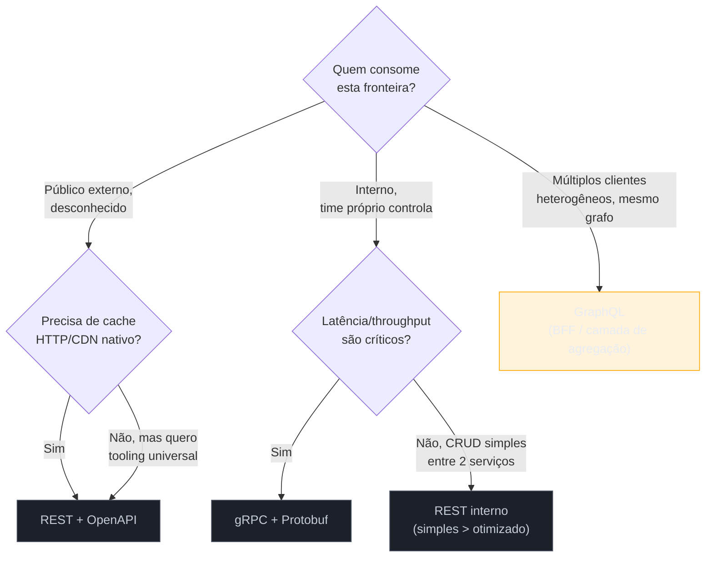
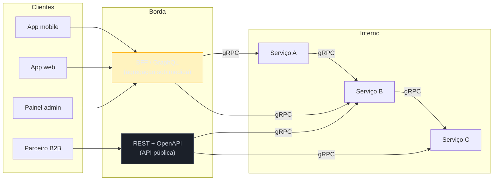
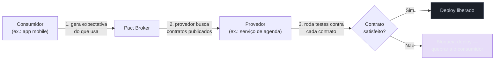

# REST vs GraphQL vs gRPC — decisão

> [!abstract] TL;DR
> A pergunta "REST, GraphQL ou gRPC?" quase nunca tem uma resposta única para um sistema inteiro — tem uma resposta por **fronteira de comunicação**. REST vence na borda pública (cache HTTP nativo, tooling universal, curva de aprendizado baixa). gRPC vence entre serviços internos que o próprio time controla (contrato forte via `.proto`, HTTP/2 multiplexado, streaming, 5-10x mais rápido que REST/GraphQL em benchmarks de payload binário). GraphQL vence numa camada de agregação — BFF — quando clientes heterogêneos (mobile, web, admin) precisam de formas diferentes do mesmo grafo de dados, e o custo de N+1/rate limiting/cache quebrado vale a pena pagar. Empresas como Netflix, Uber, Shopify e GitHub não escolhem um estilo — combinam os três, cada um na fronteira onde resolve melhor um problema específico. E documentação não é um anexo: OpenAPI, `.proto` e SDL GraphQL são, cada um, **o contrato em si**, não uma descrição dele — o que abre a porta para contract testing (Pact, Prism, Dredd) validar que a implementação não traiu a promessa.

Imagine uma arquiteta que acabou de assumir o desenho técnico de uma plataforma nova — uma marketplace de serviços de saúde, com três tipos de consumidor bem diferentes: um app mobile que precisa ser rápido e econômico em dados móveis, um painel administrativo interno que quer tudo relacionado numa tela só, e uma dúzia de parceiros B2B (laboratórios, convênios, clínicas) que vão integrar via API pública, cada um com seu próprio time e sua própria stack. Internamente, a plataforma vai ter uns quinze microsserviços — catálogo, agendamento, pagamento, notificação, busca — falando entre si o tempo todo.

A primeira reunião de arquitetura começa, previsivelmente, com alguém perguntando: "a gente vai usar REST ou GraphQL?" É a pergunta errada — não porque REST ou GraphQL sejam ruins, mas porque ela assume que existe **uma** resposta para um sistema que, na verdade, tem pelo menos três fronteiras de comunicação diferentes, cada uma com um público diferente, um padrão de consumo diferente, e um orçamento de complexidade diferente. As cinco notas anteriores deste sub-galho já deram profundidade a cada peça isolada — [[01 - REST — modelagem de recursos e maturidade|REST]], [[04 - GraphQL — schema, resolvers e quando vale|GraphQL]], [[05 - gRPC — Protobuf, HTTP2 e streaming|gRPC]]. O que falta, e o que esta nota fecha, é a síntese: como comparar as três lado a lado, como elas convivem numa arquitetura real, e como o contrato — documentado e testado — atravessa qualquer estilo que você escolher.

## Por que a pergunta certa é "onde", não "qual"

Cada um dos três estilos nasceu para resolver um problema específico, num contexto específico — e entender essa origem explica por que nenhum "venceu" de forma absoluta.

REST, formalizado por Roy Fielding em 2000, herdou diretamente a arquitetura da própria web: recursos endereçáveis por URL, verbos HTTP com semântica compartilhada, cache como cidadão de primeira classe do protocolo. É o estilo certo quando o consumidor é **desconhecido de antemão** — um navegador, um parceiro externo que você nunca vai conhecer pessoalmente, um agente de IA fazendo uma chamada HTTP genérica — porque HTTP, como transporte, já vem com décadas de infraestrutura (CDN, proxies, browsers, ferramentas de debug) que entendem seu vocabulário sem precisar de nenhuma biblioteca especial.

GraphQL nasceu dentro do Facebook, por volta de 2012, para resolver um problema muito concreto de over-fetching e under-fetching em apps mobile: uma tela do feed de notícias precisava de dados de posts, comentários, curtidas e perfis de autor, todos relacionados, e buscar isso via REST clássico significava ou uma cascata de requests sequenciais (N+1 do lado do cliente) ou endpoints super específicos por tela (`/feed-screen-data`) que explodiam em número e ficavam impossíveis de manter. GraphQL resolve isso invertendo o controle: o cliente descreve exatamente a forma dos dados que quer, numa única query, e o servidor resolve essa árvore.

gRPC, aberto pelo Google em 2015 (sucessor interno do protocolo Stubby, usado internamente desde os anos 2000), resolve um problema diferente dos dois anteriores: comunicação **entre serviços que o próprio time controla**, onde performance e um contrato tipado forte importam mais do que legibilidade humana do payload ou compatibilidade universal com browsers. Protocol Buffers como formato binário, HTTP/2 como transporte multiplexado, streaming nos dois sentidos — tudo isso otimiza para o cenário de "milhares de chamadas por segundo entre microsserviços na mesma rede interna", não para "um desenvolvedor terceiro lendo a resposta no DevTools do navegador".

> [!question]- Se cada um resolve um problema diferente, por que a comparação costuma ser apresentada como "escolha um"?
> Porque a maioria dos tutoriais e comparações nasce do contexto de quem está construindo **uma única API para um único tipo de consumidor** — um blog, um SaaS pequeno, um MVP. Nesse cenário, de fato, faz sentido escolher um estilo e seguir com ele. O problema aparece quando esse framing mental (escolha única, sistema inteiro) é aplicado a uma arquitetura de verdade, com múltiplas fronteiras de consumo — aí a pergunta certa deixa de ser "qual dos três" e vira "qual, em qual fronteira". A seção de padrão híbrido, mais adiante, mostra como empresas de escala real resolvem isso na prática.

## A matriz de decisão

Seis critérios recorrem em praticamente toda decisão real de arquitetura de API. Nenhum, isolado, decide — mas juntos formam um mapa razoável de quando cada estilo tende a vencer.

| Critério | REST | GraphQL | gRPC |
|---|---|---|---|
| **Público típico** | Externo, desconhecido, múltiplos consumidores heterogêneos | Clientes internos/parceiros próximos, formas de dado variadas por cliente | Interno, serviços que o próprio time controla |
| **Forma de consumo** | Um recurso por chamada, previsível | Uma query, forma sob demanda, agrega múltiplas fontes | Chamada de método remoto, contrato fixo por serviço |
| **Performance/latência** | Boa; overhead de JSON textual | Boa para agregação (menos round-trips); resolver caro pode ser lento | Melhor da classe — binário + HTTP/2 multiplexado, 5-10x mais rápido em benchmarks de payload |
| **Cache HTTP nativo** | Sim, de fábrica (`GET` + `Cache-Control`/`ETag`) | Não — quase tudo é `POST` em `/graphql`; exige persisted queries + cache hint por campo | Não se aplica da mesma forma — cache é responsabilidade da aplicação |
| **Curva de aprendizado** | Baixa — HTTP é ubíquo | Média-alta — schema, resolvers, DataLoader, complexidade de query | Média-alta — Protobuf, geração de código, HTTP/2, debugging binário |
| **Tooling/ecossistema** | Universal (qualquer linguagem, qualquer cliente HTTP) | Forte e maduro (Apollo, GraphiQL, federação) mas exige investimento próprio | Forte para service-to-service; fraco nativamente em browser |
| **Streaming** | Não nativo (poll ou SSE à parte) | Subscriptions (via WebSocket, separado do modelo request-response) | Nativo — 4 tipos: unary, server, client, bidirectional |



Repare que a árvore não tem um nó "vermelho" — nenhum dos três é "errado" em abstrato. O único uso genuinamente arriscado é aplicar a árvore inteira à fronteira errada: gRPC numa API pública consumida por navegador sem proxy (quebra, porque browsers não falam HTTP/2 puro), ou GraphQL numa API interna simples de dois serviços que só trocam um payload fixo (complexidade sem retorno).

> [!warning] Escolher o estilo pela popularidade do momento, não pela fronteira
> **O que acontece:** um time lê que "GraphQL é o futuro" (ou "gRPC é o que o Google usa") e reescreve a API pública inteira nesse estilo, mesmo quando o consumo real é majoritariamente CRUD simples, consumido por integrações de terceiros que só sabem fazer `curl`. **Por quê:** a decisão de estilo de API vira uma decisão de moda em vez de uma decisão de engenharia — o time otimiza para o problema que a tecnologia mais falada resolve, não para o problema que a própria plataforma tem. **Como evitar:** comece sempre pela pergunta "quem consome esta fronteira, e o que ela precisa de mim" — não "qual tecnologia estamos animados para usar". Se a resposta for "múltiplos clientes desconhecidos, querendo CRUD previsível", REST continua sendo o default correto em 2026, não uma escolha datada.

## Performance: o número que todo mundo cita e o que ele não conta

Benchmarks recentes (2026) mostram gRPC consistentemente 5-10x mais rápido que REST e GraphQL em cenários de alto volume, puxado por dois fatores: Protocol Buffers como serialização binária (mais compacta e rápida de parsear que JSON textual) e HTTP/2 como transporte, que multiplexa várias chamadas numa única conexão TCP em vez de abrir conexão nova por request como HTTP/1.1 costumava fazer. Em medições de latência ponta a ponta, números típicos giram em torno de REST na casa de 200-250ms, GraphQL em 150-180ms para queries complexas (porque agrega o que seriam múltiplas chamadas REST numa só), e gRPC na casa de 20-30ms para chamadas internas de baixa latência ([dasroot.net, *GraphQL vs REST vs gRPC: API Architecture Comparison in 2026*](https://dasroot.net/posts/2026/04/graphql-vs-rest-vs-grpc-api-architecture-comparison-2026/)).

O detalhe que esses números escondem, e que vale entender antes de usá-los para justificar uma migração: essa vantagem de gRPC se manifesta com força em chamadas **serviço-a-serviço, dentro da mesma rede interna**, onde o overhead de serialização e round-trip realmente domina o tempo total. Para chamadas do navegador até o backend — a fronteira onde o usuário sente a latência — a diferença prática entre REST, GraphQL e mesmo tRPC costuma ser irrelevante perto de fatores como latência de rede do usuário, tempo de renderização e cache do próprio navegador ([dasroot.net, 2026](https://dasroot.net/posts/2026/04/graphql-vs-rest-vs-grpc-api-architecture-comparison-2026/)). Em outras palavras: o ganho de performance de gRPC é real, mas ele paga o investimento de adoção principalmente **atrás da borda**, não na fronteira que o usuário final toca — o que reforça, de novo, que a pergunta certa é "em qual fronteira" antes de "qual estilo".

## Cache HTTP: a vantagem que REST não perde para ninguém

Um dos maiores trunfos silenciosos de REST é algo que nenhuma API GraphQL ou gRPC replica com a mesma naturalidade: `GET /patients/123` com um `Cache-Control: max-age=60` é cacheável por qualquer proxy, CDN ou navegador na cadeia, sem nenhum código adicional — o protocolo HTTP já resolve isso desde os anos 1990.

GraphQL, por padrão, quebra esse mecanismo de raiz: toda operação (mesmo uma leitura pura) tradicionalmente viaja como `POST /graphql`, com a query inteira no corpo — e `POST` nunca é cacheável por CDN de forma padrão, porque o corpo da requisição faz parte do que identificaria o recurso, e proxies HTTP não indexam corpo de `POST`. A correção de mercado para isso é **Automatic Persisted Queries** (APQ): em vez de mandar a query inteira a cada chamada, o cliente manda um hash da query (depois de registrá-la uma vez no servidor), o que permite transformar a chamada em `GET` com uma URL curta e determinística — cacheável por CDN como qualquer outra `GET` ([Apollo GraphQL Blog, *Automatic Persisted Queries and CDN caching with Apollo Server 2.0*](https://www.apollographql.com/blog/automatic-persisted-queries-and-cdn-caching-with-apollo-server-2-0)). Some a isso cache hints por tipo/campo no schema (não por endpoint inteiro, como REST faz) e dá pra recuperar boa parte do valor de cache — mas é infraestrutura que o time precisa construir e manter deliberadamente, não algo que "já vem de graça" como em REST.

gRPC não compete nesse eixo de forma alguma — cache não é parte do protocolo, e cada aplicação que precisa de cache para chamadas gRPC internas implementa a própria camada (geralmente um cache de aplicação, tipo Redis, na frente do serviço, não um mecanismo de transporte).

## O padrão híbrido: como o mercado realmente resolve isso

A conclusão prática de tudo até aqui — cada estilo vence numa fronteira diferente — não é só uma abstração teórica: é literalmente como as maiores plataformas do mundo desenham suas APIs hoje.

**Netflix** roda os três simultaneamente, cada um na fronteira certa: gRPC entre os microsserviços internos (centenas de milhares de chamadas por segundo, onde a performance binária compensa o investimento), GraphQL para os clientes mobile e web (agregando dados de dezenas de serviços numa única query por tela) e REST para integrações de terceiros, onde compatibilidade ampla importa mais do que performance de ponta ([Netflix TechBlog, *Beyond REST: Rapid Development With GraphQL Microservices*](https://netflixtechblog.com/beyond-rest-1b76f7c20ef6)). O detalhe mais interessante da jornada do Netflix é que a primeira versão do GraphQL deles era um único servidor central agregando tudo — um "One Graph" — e isso virou gargalo organizacional: toda mudança de schema de qualquer time precisava ser deployada junto, num único serviço monolítico de agregação. A correção foi migrar para **GraphQL federado**: cada domínio (catálogo, perfil, recomendação) mantém seu próprio subgrafo, e uma camada de composição (supergraph) une tudo numa API única do ponto de vista do cliente, sem acoplar os times entre si ([Apollo GraphQL Blog, *Redefining API Strategy: Why Netflix Platform Engineering Chose Federated GraphQL*](https://www.apollographql.com/blog/redefining-api-strategy-why-netflix-platform-engineering-chose-federated-graphql)).

**Uber** segue um desenho parecido, com uma divisão por natureza do consumo: REST para APIs voltadas a motoristas (integrações mais simples, parceiros externos), gRPC para serviços de localização em tempo real (onde latência baixa é literalmente o produto) e GraphQL para os apps de passageiro, agregando dados de viagem, pagamento e perfil numa camada só. gRPC se consolidou como padrão de fato para comunicação interna entre microsserviços em empresas dessa escala — Netflix, Uber e Google entre elas — precisamente porque nenhuma dessas chamadas nunca sai da rede interna, então as limitações de gRPC em browser são irrelevantes ali.

**Shopify** oferece o exemplo mais radical de convergência: em outubro de 2024, a plataforma marcou formalmente a REST Admin API como legada, exigindo que todo app novo (e, progressivamente, todo app existente) migre para a GraphQL Admin API. A justificativa declarada não é ideológica — é estrutural: o suporte a um limite expandido de variantes de produto (2048 por produto) simplesmente não é viável de forma performática via REST clássico, porque buscar um catálogo relacionado profundo via REST exigiria uma cascata de chamadas que GraphQL resolve numa query só ([Shopify Developer Changelog, *Deprecation timelines related to new GraphQL product APIs*](https://shopify.dev/changelog/deprecation-timelines-related-to-new-graphql-product-apis)). É um caso raro de uma plataforma pública inteira migrando de REST para GraphQL — mas justamente porque o padrão de consumo dela (parceiros construindo lojas com dados profundamente relacionados: produto, variante, inventário, preço) é o cenário exato para o qual GraphQL foi desenhado.

O padrão que emerge dessas três histórias — e se repete em GitHub, Airbnb e The New York Times — tem um nome comum na indústria: **Backend for Frontend (BFF)**. A ideia central: internamente, os serviços conversam entre si via REST ou gRPC (o que for mais adequado por par de serviços); e uma camada de agregação dedicada — geralmente GraphQL, às vezes um BFF REST customizado por tipo de cliente — fica entre esses serviços e os clientes finais, moldando os dados especificamente para o que cada tela ou cada app precisa. A Netflix, num estágio anterior da própria evolução, chegou a implementar BFFs literalmente como scripts (em Groovy) escritos pelos próprios desenvolvedores de UI — cada um sabendo exatamente que dado a própria tela precisava, e cada script funcionando como cliente fino de serviços gRPC ou REST por trás ([InfoQ, *Evolving the Federated GraphQL Platform at Netflix*](https://www.infoq.com/articles/federated-GraphQL-platform-Netflix/)).



> [!question]- Se o padrão híbrido é tão comum, por que ainda existe debate "REST vs GraphQL" como se fosse escolha única?
> Porque a maioria dos times nunca opera na escala onde as três fronteiras (pública, agregação, interna) ficam grandes o suficiente para justificar três tecnologias diferentes com times e ferramental dedicados a cada uma. Um sistema pequeno-médio, com uma dúzia de serviços e um único tipo de cliente, tem razão de sobra para escolher **um** estilo e seguir — nesse caso, o debate "qual escolher" é genuinamente sobre escolha única, e a resposta certa costuma ser REST, pelo custo de adoção mais baixo. O padrão híbrido só compensa quando a complexidade organizacional (times múltiplos, consumidores muito diferentes) já existe de qualquer forma — senão, é complexidade importada sem necessidade real, o mesmo erro do capítulo anterior sobre HATEOAS.

## gRPC-Web e o limite físico do browser

Vale entender por que "GraphQL como BFF" aparece tanto mais que "gRPC direto no browser" nesse padrão híbrido, e a razão não é preferência — é limitação técnica real. gRPC depende de recursos de HTTP/2 (como trailers HTTP e controle de frame bruto) que navegadores simplesmente não expõem via APIs JavaScript padrão (`fetch`, `XMLHttpRequest`). **gRPC-Web** contorna isso codificando trailers como uma mensagem especial dentro do corpo da resposta — mas isso exige um proxy tradutor (comumente Envoy) entre o navegador e o serviço gRPC real, e trava fora o streaming bidirecional completo, porque nenhum navegador estável, em 2026, expõe as primitivas necessárias para isso nativamente ([Kreya, *gRPC in the browser: gRPC-Web under the hood*](https://kreya.app/blog/grpc-web-deep-dive/)).

Uma alternativa mais recente, **Connect** (mantido pela Buf, a mesma empresa por trás de tooling moderno de Protobuf), ataca o problema por outro ângulo: em vez de tentar replicar gRPC completo no navegador, desenha um protocolo que já nasce "HTTP idiomático" — chamadas unárias funcionam como HTTP normal, sem proxy — e o mesmo servidor Connect fala simultaneamente o protocolo Connect, gRPC nativo e gRPC-Web, dependendo de quem está chamando ([Buf, *Connect: A better gRPC*](https://buf.build/blog/connect-a-better-grpc)). Isso não muda a conclusão prática desta nota — gRPC continua sendo, majoritariamente, uma escolha para comunicação interna, não para a fronteira que o navegador toca — mas explica por que, quando gRPC precisa mesmo aparecer na borda voltada a cliente, times de infraestrutura madura preferem Connect a gRPC-Web puro, evitando o proxy extra e a complexidade operacional que ele carrega.

## Documentação como contrato: OpenAPI, `.proto` e SDL

Uma ideia atravessa os três estilos e vale nomear explicitamente: **a documentação não é um artefato à parte da API — em cada um dos três estilos, ela é o próprio contrato**, a fonte de verdade que humanos e máquinas usam para saber o que a API promete.

**OpenAPI** (o padrão de fato para REST, antigo Swagger) descreve, num documento YAML/JSON, cada path, cada verbo, cada schema de request/response, cada código de status possível. A partir desse documento único, ferramentas geram clientes tipados em qualquer linguagem, servidores de mock, documentação interativa navegável (Swagger UI) e validação automática de que a implementação bate com o que foi prometido.

```yaml
openapi: 3.1.0
info:
  title: Marketplace API
  version: 1.0.0
paths:
  /appointments/{id}:
    get:
      summary: Busca uma consulta por ID
      parameters:
        - name: id
          in: path
          required: true
          schema: { type: integer }
      responses:
        '200':
          description: Consulta encontrada
          content:
            application/json:
              schema: { $ref: '#/components/schemas/Appointment' }
```

**`.proto`** (Protocol Buffers, para gRPC) descreve, num arquivo compacto de IDL (Interface Definition Language), cada mensagem, cada campo tipado e numerado, e cada método RPC de cada serviço. O compilador `protoc` (ou `buf` gera, a partir desse único arquivo, stubs de cliente e servidor em praticamente qualquer linguagem — Java, Go, Python, TypeScript — com tipagem forte compilada, não validada em runtime.

```protobuf
service AppointmentService {
  rpc GetAppointment (GetAppointmentRequest) returns (Appointment);
}

message GetAppointmentRequest {
  int64 id = 1;
}

message Appointment {
  int64 id = 1;
  string patient_name = 2;
  google.protobuf.Timestamp scheduled_at = 3;
}
```

**SDL** (Schema Definition Language, para GraphQL) descreve tipos, campos, queries e mutations disponíveis num único schema — a base de tudo que o servidor pode responder e tudo que o cliente pode pedir.

```graphql
type Appointment {
  id: ID!
  patientName: String!
  scheduledAt: DateTime!
}

type Query {
  appointment(id: ID!): Appointment
}
```

A diferença estrutural entre os três não é só sintática — é sobre **quem escreve o contrato primeiro**. Isso leva à mesma tensão em cada estilo, com nomes ligeiramente diferentes:

| Estilo | Contrato primeiro (design-first) | Código primeiro (code-first) |
|---|---|---|
| REST | Escreve o OpenAPI YAML antes de codar; gera stubs a partir dele | Anota controllers (ex.: springdoc no Spring Boot); OpenAPI é gerado como resultado |
| GraphQL | Escreve o SDL antes; resolvers implementam o que o schema já promete | Escreve resolvers com decorators/tipos; SDL é compilado a partir do código |
| gRPC | Escreve `.proto` antes (é praticamente o único fluxo comum); gera stubs cliente/servidor | Raro — Protobuf é, por natureza, quase sempre design-first |

Vale notar que gRPC é o único dos três onde a distinção quase não existe na prática — o `.proto` é estruturalmente o ponto de partida, porque sem ele não há nem tipos gerados para escrever o servidor. Em REST e GraphQL, a escolha é genuína e tem trade-off real: design-first força o time a pensar no contrato antes da implementação, o que costuma produzir APIs mais consistentes e amigáveis a consumidores externos, às custas de mais fricção no dia a dia (o schema pode ficar dessincronizado do código se ninguém disciplinar isso); code-first é mais rápido para iterar, mas o contrato vira consequência da implementação, não uma decisão deliberada — e é fácil vazar detalhes de implementação para o schema público sem perceber.

> [!warning] Deixar o contrato divergir do código em fluxos design-first
> **O que acontece:** o time escreve um OpenAPI ou SDL cuidadoso no início do projeto, mas conforme features são adicionadas sob pressão de prazo, o código evolui mais rápido que o documento — e seis meses depois o OpenAPI descreve uma API que não existe mais. **Por quê:** design-first só entrega o benefício de "contrato como fonte de verdade" se algum mecanismo automatizado garante que implementação e documento não divergem — sem isso, o documento vira ficção que ninguém confia, e todo mundo volta a ler o código-fonte para saber o que a API realmente faz. **Como evitar:** é exatamente isso que contract testing resolve — não é opcional depois que você escolhe design-first, é a peça que fecha o ciclo. Ver a seção seguinte.

## Contract testing: garantir que a implementação não traiu o contrato

Documentar o contrato resolve metade do problema — a outra metade é garantir que a implementação real continua honrando o que foi documentado, ao longo do tempo, conforme múltiplos times mexem no mesmo sistema. Três ferramentas cobrem ângulos diferentes desse problema, e vale entender a diferença porque elas não competem entre si — se complementam.

**Prism** (Stoplight) pega um documento OpenAPI existente e transforma num servidor de mock HTTP instantâneo — o time de front-end pode começar a integrar contra respostas realistas antes do backend sequer existir, e o mesmo Prism pode rodar em modo de validação, checando se as respostas reais do servidor batem com o schema documentado ([qaskills.sh, *Pact Contract Testing Guide 2026*](https://qaskills.sh/blog/pact-contract-testing-guide-2026)).

**Dredd** (originalmente da Apiary) faz o caminho inverso: lê o OpenAPI e chama cada exemplo documentado contra a API **real**, viva, checando se a resposta bate com o que foi prometido. É a ferramenta mais simples e mais antiga das três — o desenvolvimento ativo diminuiu, mas continua estável e em uso — e resolve uma pergunta bem específica: "a documentação está mentindo?"

**Pact** ataca um problema estruturalmente diferente dos dois anteriores, e por isso é o mais relevante numa arquitetura de microsserviços: **contract testing consumer-driven**. Em vez de validar contra um documento estático, Pact gera o contrato a partir do que o **consumidor** realmente usa da resposta — se o serviço provedor devolve trinta campos mas um consumidor específico só lê quatro, o contrato daquele par consumidor-provedor cobre só esses quatro campos. Isso significa que o provedor pode adicionar campos novos, reordenar o payload, ou mudar partes que nenhum consumidor toca, sem quebrar nada — o contrato só protege o que de fato importa para quem consome ([Pact Docs, *Introduction*](https://docs.pact.io/)). Isso resolve um problema real de escala organizacional: numa arquitetura com dezenas de serviços e times, testar end-to-end tudo contra tudo é caro demais e lento demais para rodar em todo PR; Pact permite que cada time valide, de forma isolada e rápida, que não quebrou ninguém que dependa dele — sem precisar subir o sistema inteiro.



Um desenho de mercado, para 2026, combina as três ferramentas em momentos diferentes do ciclo: Prism cedo, quando o backend ainda não existe e o front-end precisa de algo para integrar; Pact continuamente, entre serviços internos, como gate de CI antes de qualquer deploy; Dredd (ou seu sucessor mais ativo, Schemathesis) como verificação periódica de que a documentação pública não mentiu ([The Chaos and Order Blog, *API Contract Testing & API Tooling 2026 Deep-Dive*](https://www.youngju.dev/blog/culture/2026-05-25-api-contract-testing-pact-bruno-hoppscotch-msw-karate-schemathesis-2026-deep-dive.en)). GraphQL tem seu próprio ecossistema de validação de schema (linters de breaking change, como o GraphQL Inspector), e gRPC se beneficia de checagem de compatibilidade em nível de `.proto` (o `buf breaking` da Buf detecta mudanças que quebrariam clientes gerados) — mas o princípio por trás de todos é o mesmo: o contrato só vale alguma coisa se alguma automação garante, continuamente, que ninguém o violou silenciosamente.

> [!question]- Contract testing substitui testes de integração e end-to-end?
> Não — cada camada da pirâmide de testes de API cobre uma pergunta diferente, e contract testing não elimina as outras. Unit tests validam lógica isolada (um validador, um cálculo). Integration tests validam que o serviço, seu banco e suas dependências diretas funcionam juntos (tipicamente com Testcontainers subindo um Postgres real). Contract tests (Pact) validam que o **contrato entre dois serviços** não foi quebrado, sem precisar subir os dois sistemas completos ao mesmo tempo — o que os torna muito mais rápidos e baratos de rodar a cada PR do que um end-to-end real. End-to-end tests validam um fluxo de negócio completo, atravessando múltiplos serviços de verdade — são os mais caros e mais lentos, por isso ficam no topo da pirâmide, reservados para poucos fluxos críticos (ex.: "o checkout completo, do carrinho ao pagamento confirmado, funciona"). Contract testing preenche especificamente o vão que integration tests e end-to-end tests deixam entre si: a confiança de que *dois serviços específicos* continuam se entendendo, sem o custo de testar o sistema inteiro para descobrir isso.

## Casos práticos

**Uma API de checkout que expõe os três estilos ao mesmo tempo.** Imagine a plataforma de marketplace de saúde descrita na abertura: o app mobile do paciente consome um BFF GraphQL que agrega dados de agenda, pagamento e notificação numa query só, otimizando para a tela específica de "resumo da consulta". Os parceiros B2B (laboratórios, convênios) integram via REST + OpenAPI, porque é o que os times deles sabem consumir sem fricção, e porque a natureza da integração é CRUD simples e previsível — criar resultado de exame, consultar status de autorização. Internamente, o serviço de agendamento chama o serviço de notificação via gRPC, porque essa chamada acontece milhares de vezes por dia e o overhead de serialização JSON, multiplicado por esse volume, tem custo real de infraestrutura. Nenhuma dessas três decisões concorre com as outras — cada uma resolve o problema da fronteira onde vive.

**Uma migração mal-planejada: reescrever tudo em GraphQL "porque resolve N+1".** Um time observa que o app mobile faz cascatas de chamadas REST para montar uma tela e decide, ao invés de introduzir uma camada de agregação pontual, migrar a API pública inteira — incluindo a que os parceiros B2B consomem — para GraphQL. O resultado: os parceiros, que integravam via `curl` e scripts simples, agora precisam entender queries GraphQL, lidar com autenticação diferente por causa da ausência de cache HTTP nativo, e a equipe de plataforma passa a gerenciar rate limiting por custo de query (muito mais complexo que rate limiting por request count de REST) para uma audiência que nunca pediu essa flexibilidade. O problema real — over-fetching na tela mobile — tinha uma solução cirúrgica (um BFF GraphQL só para os clientes que precisavam dele); a solução aplicada resolveu o sintoma de um cliente importando complexidade para todos os outros.

**gRPC vazando para a fronteira errada.** Um time de plataforma, animado com os benchmarks de performance de gRPC, decide expor a API pública de parceiros B2B diretamente em gRPC, "porque é mais rápido". Os primeiros parceiros a tentar integrar — laboratórios com times pequenos, acostumados a `curl` e Postman — travam na primeira etapa: não há como testar um endpoint gRPC batendo numa URL no navegador, é preciso gerar stubs a partir do `.proto`, instalar ferramentas específicas (`grpcurl`, `evans`) só para inspecionar uma chamada manualmente, e depurar um payload binário sem um cliente HTTP genérico resolvendo o problema. A decisão técnica estava correta em abstrato (gRPC é mesmo mais rápido) mas errada na fronteira: o público que consome essa API — parceiros externos com tooling variado — é exatamente o público para quem REST/HTTP é o denominador comum. O time reverte para uma API pública REST + OpenAPI e mantém gRPC só entre os serviços internos, onde ele já vinha funcionando bem.

## Em entrevista

"REST ou GraphQL, quando usar cada um?" é, disparado, uma das perguntas mais recorrentes em entrevistas técnicas sênior sobre design de API — e a resposta que sinaliza profundidade não é uma lista de prós e contras decorada, é reconhecer que a pergunta, feita assim, já embute uma simplificação.

Uma resposta forte começa nomeando o eixo real: "a decisão certa não é sobre qual tecnologia é melhor em abstrato — é sobre quem consome essa fronteira específica da API. Se são múltiplos consumidores desconhecidos que querem CRUD previsível e se beneficiam de cache HTTP nativo, REST continua sendo o default certo. Se são clientes heterogêneos — mobile, web, admin — que precisam de formas diferentes do mesmo grafo de dados, e o time está disposto a investir em DataLoader, complexity limiting e uma estratégia de cache não-trivial, GraphQL numa camada de BFF resolve isso melhor do que REST resolveria."

Um sinal ainda mais forte é trazer gRPC para a conversa sem que o entrevistador precise puxar: "e para comunicação interna entre serviços que o meu próprio time controla, eu normalmente nem considero REST ou GraphQL — gRPC com Protobuf dá um contrato mais forte, tipado em compile-time, e performance melhor, sem o custo de compatibilidade com navegador que REST/GraphQL carregam para justificar HTTP/JSON." Isso demonstra que você pensa em arquitetura por fronteira, não por "qual é a tecnologia da vez" — e é exatamente esse framing, com exemplos reais (Netflix, Uber, Shopify) na manga, que separa quem decorou trade-offs de quem já desenhou um sistema assim de verdade.

Vale também estar pronto para a pergunta de acompanhamento mais comum: "e documentação, como isso muda entre os três?" A resposta forte nomeia que, em cada estilo, o contrato **é** a documentação — OpenAPI, `.proto`, SDL — e que sem contract testing (Pact sendo o nome mais citado) automatizado, esse contrato degrada silenciosamente conforme o sistema evolui, virando ficção que ninguém confia.

## How to explain in English

> "The REST vs GraphQL vs gRPC question rarely has one answer for an entire system — it has one answer per communication boundary. REST wins at the public edge: native HTTP caching, universal tooling, low barrier to entry for unknown external consumers. gRPC wins between internal services the team itself controls: a strongly-typed `.proto` contract, HTTP/2 multiplexing, and streaming, with 5-10x better throughput than REST or GraphQL in binary-payload benchmarks. GraphQL wins as an aggregation layer — a Backend-for-Frontend — when heterogeneous clients need different shapes of the same data graph, and the team is willing to invest in DataLoader, query-cost rate limiting, and a deliberate caching strategy since GraphQL breaks native HTTP caching by default.
>
> Companies operating at real scale — Netflix, Uber, Shopify, GitHub — don't pick one style; they combine all three, each at the boundary where it solves a specific problem best. And documentation isn't a side artifact in any of them — OpenAPI, the `.proto` file, and the GraphQL SDL each *are* the contract, not a description of it. That's exactly why contract testing matters: Pact validates that a provider hasn't broken what consumers actually depend on, Prism mocks an API from its OpenAPI spec before the backend even exists, and Dredd checks that the live API still matches its documented examples."

| PT | EN |
|----|----|
| Fronteira de comunicação | Communication boundary |
| Camada de agregação | Aggregation layer |
| Backend for Frontend (BFF) | Backend for Frontend (BFF) |
| GraphQL federado | Federated GraphQL |
| Contrato como fonte de verdade | Contract as source of truth |
| Design-first / code-first | Design-first / code-first |
| Contract testing | Contract testing |
| Consumer-driven | Consumer-driven |
| Query de custo (rate limiting) | Query cost (rate limiting) |
| Cache HTTP nativo | Native HTTP caching |
| Streaming bidirecional | Bidirectional streaming |
| Padrão híbrido | Hybrid pattern |

## O que vem a seguir

Esta nota fecha o sub-galho de comunicação síncrona: REST, GraphQL e gRPC, cada um modelado a fundo, e agora comparado e integrado numa decisão de arquitetura real. O que os três compartilham — e que nenhuma das seis notas até aqui aprofundou — é a pergunta de **como o contrato se sustenta ao longo do tempo**: o que acontece quando um cliente reenvia a mesma requisição por causa de uma falha de rede, como o contrato evolui sem quebrar consumidores existentes, como cache e requisições condicionais entram no protocolo, o que a API promete quando expõe rate limiting, e como uma operação lenta vira assíncrona sem trair o modelo request-response. Essas cinco perguntas — idempotência, versionamento, caching HTTP, rate limiting, webhooks — valem igualmente para REST, GraphQL e gRPC, e formam o próximo sub-galho desta trilha: **Confiabilidade do contrato**.

- **3 - Confiabilidade do contrato** (próximo sub-galho, ainda a escrever) — idempotência, versionamento e evolução segura, caching HTTP condicional, rate limiting como parte do contrato, webhooks e operações assíncronas.

## Veja também

- [[01 - REST — modelagem de recursos e maturidade|REST — modelagem de recursos e maturidade]] — recursos, verbos, Richardson Maturity Model
- [[02 - REST — o contrato de resposta|REST — o contrato de resposta]] — status codes, RFC 9457, content negotiation
- [[03 - Paginação, filtros e autenticação em REST|Paginação, filtros e autenticação em REST]] — offset vs cursor, filtros, panorama de auth
- [[04 - GraphQL — schema, resolvers e quando vale|GraphQL — schema, resolvers e quando vale]] — types, resolvers, N+1/DataLoader
- [[05 - gRPC — Protobuf, HTTP2 e streaming|gRPC — Protobuf, HTTP2 e streaming]] — Protocol Buffers, HTTP/2, os 4 tipos de streaming
- [[Comunicação entre Sistemas/index|Comunicação entre Sistemas]] — o galho-pai desta trilha
- [[2 - Comunicação síncrona/index|Comunicação síncrona]] — MOC deste sub-galho

## Fontes

- dasroot.net — [*GraphQL vs REST vs gRPC: API Architecture Comparison in 2026*](https://dasroot.net/posts/2026/04/graphql-vs-rest-vs-grpc-api-architecture-comparison-2026/) (acessado 2026-07-09) — matriz de decisão, benchmarks de latência 2026.
- Netflix TechBlog — [*Beyond REST: Rapid Development With GraphQL Microservices*](https://netflixtechblog.com/beyond-rest-1b76f7c20ef6) — arquitetura híbrida REST/GraphQL/gRPC do Netflix.
- Apollo GraphQL Blog — [*Redefining API Strategy: Why Netflix Platform Engineering Chose Federated GraphQL*](https://www.apollographql.com/blog/redefining-api-strategy-why-netflix-platform-engineering-chose-federated-graphql) (acessado 2026-07-09) — evolução do "One Graph" para GraphQL federado.
- InfoQ — [*Evolving the Federated GraphQL Platform at Netflix*](https://www.infoq.com/articles/federated-GraphQL-platform-Netflix/) (acessado 2026-07-09) — BFFs em Groovy, evolução para federação.
- Shopify Developer Changelog — [*Deprecation timelines related to new GraphQL product APIs*](https://shopify.dev/changelog/deprecation-timelines-related-to-new-graphql-product-apis) (acessado 2026-07-09) — deprecação da REST Admin API, migração para GraphQL.
- Apollo GraphQL Blog — [*Automatic Persisted Queries and CDN caching with Apollo Server 2.0*](https://www.apollographql.com/blog/automatic-persisted-queries-and-cdn-caching-with-apollo-server-2-0) — APQ como correção de mercado para cache HTTP em GraphQL.
- Kreya — [*gRPC in the browser: gRPC-Web under the hood*](https://kreya.app/blog/grpc-web-deep-dive/) (acessado 2026-07-09) — limitações técnicas de gRPC em navegadores.
- Buf — [*Connect: A better gRPC*](https://buf.build/blog/connect-a-better-grpc) (acessado 2026-07-09) — protocolo Connect como alternativa a gRPC-Web.
- Pact Docs — [*Introduction*](https://docs.pact.io/) (acessado 2026-07-09) — contract testing consumer-driven.
- qaskills.sh — [*Pact Contract Testing: A Complete Consumer-Driven Guide 2026*](https://qaskills.sh/blog/pact-contract-testing-guide-2026) (acessado 2026-07-09) — Pact, Prism, Dredd, papéis distintos.
- youngju.dev — [*API Contract Testing & API Tooling 2026 Deep-Dive: Pact, Bruno, Hoppscotch, MSW, Karate DSL, Schemathesis Compared*](https://www.youngju.dev/blog/culture/2026-05-25-api-contract-testing-pact-bruno-hoppscotch-msw-karate-schemathesis-2026-deep-dive.en) (acessado 2026-07-09) — panorama de ferramental de contract testing em 2026.
- Apollo GraphQL Blog — [*Schema-First vs Code-Only GraphQL*](https://www.apollographql.com/blog/schema-first-vs-code-only-graphql) (acessado 2026-07-09) — trade-off schema-first vs code-first.
- Martin Fowler / Roy Fielding — já citados em [[01 - REST — modelagem de recursos e maturidade]] — fundamento REST reaproveitado aqui por referência.
