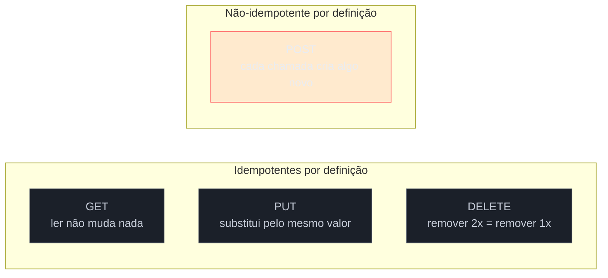
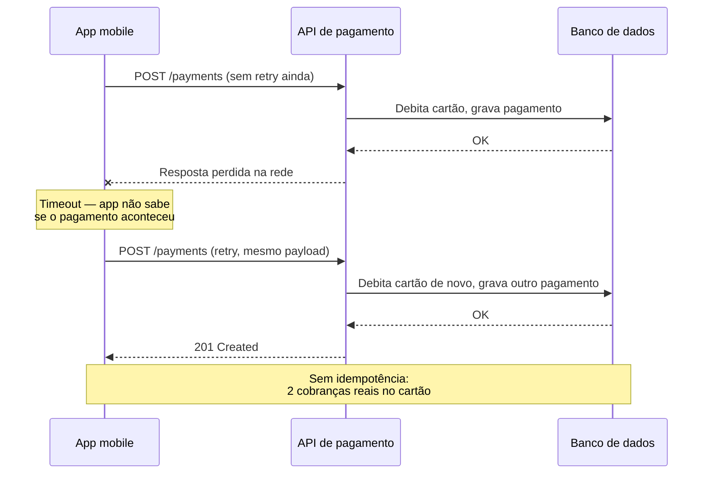
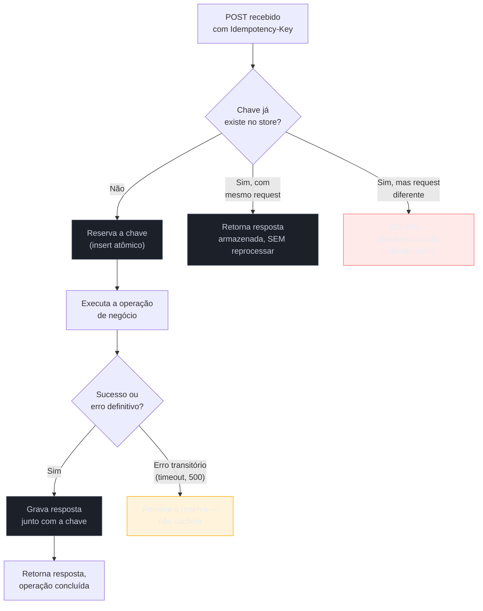

# Idempotência

> [!abstract] TL;DR
> Retry de rede é inevitável — timeouts, quedas de conexão móvel, load balancers reiniciando no meio de uma resposta. O problema não é o retry em si, é que **`POST` não é idempotente por definição**: reenviar a mesma criação de recurso cria dois recursos, e num pagamento isso significa cobrar o cliente duas vezes. O padrão que resolve isso, consolidado pela Stripe e hoje em processo de padronização como header HTTP oficial (`Idempotency-Key`, draft IETF), é simples de descrever e traiçoeiro de implementar direito: o cliente gera uma chave única por operação de negócio (não por tentativa de rede), o servidor armazena `(chave → resposta)` atomicamente com a própria operação — na mesma transação, nunca depois — e qualquer retry com a mesma chave recebe a resposta já processada, sem executar a lógica de novo. Os detalhes que separam uma implementação de produção de uma implementação de tutorial: armazenar a chave fora da transação cria uma janela de corrida onde dois requests concorrentes duplicam a criação; cachear só sucessos e deixar erros transitórios (500, timeout) sem chave salva trava o cliente para sempre num estado que nunca resolve; e um TTL longo demais deixa lixo acumulando, curto demais deixa o cliente vulnerável a duplicar exatamente na janela em que mais precisava de proteção.

Uma paciente está no meio de uma consulta de telemedicina na plataforma de marketplace de saúde que vem aparecendo como exemplo ao longo desta trilha — a mesma que decidiu expor REST na borda pública, GraphQL como BFF mobile e gRPC entre serviços internos. Ao final da consulta, o app pede a confirmação do pagamento: `POST /payments` com o valor da consulta e o token do cartão. A paciente está numa área de sinal fraco — um elevador, um túnel, um consultório com paredes grossas. O request sai do celular, o servidor processa o pagamento, debita o cartão, grava o registro no banco... e a resposta HTTP se perde no caminho de volta. Do lado do celular, a requisição simplesmente não retornou dentro do timeout configurado. O app, seguindo a lógica mais óbvia e mais perigosa que existe em engenharia de cliente HTTP — "não recebi resposta, então provavelmente falhou, deixa eu tentar de novo" — reenvia exatamente o mesmo `POST /payments`. O servidor, que não tem absolutamente nenhuma forma de saber que esse segundo request é uma repetição do primeiro e não uma segunda cobrança legítima, processa tudo de novo. A paciente sai da consulta com duas cobranças no extrato, um problema que só vai aparecer dias depois quando ela abrir o aplicativo do banco — e que vai custar ao time de suporte um caso de estorno, uma paciente irritada, e possivelmente uma reclamação formal.

Esse cenário não é hipotético nem raro — é, segundo quem constrói sistemas de pagamento em produção, uma das causas mais comuns de incidentes financeiros em fintechs e marketplaces: um timeout de rede entre cliente e gateway, o cliente e o backend retentando automaticamente, e o cliente sendo cobrado duas ou três vezes na mesma transação ([The Architect's Notebook, *What Happens When a Payment System Double-Charges*](https://thearchitectsnotebook.substack.com/p/what-happens-when-a-payment-system)). A causa raiz nunca é "o desenvolvedor esqueceu de tratar exceção" — é uma limitação estrutural do HTTP como protocolo: quando uma resposta se perde, o cliente não tem como distinguir entre "o servidor nunca recebeu o request" e "o servidor processou tudo, só a confirmação que não chegou". Essa nota trata do padrão que resolve esse problema de raiz — não impedindo o retry (impedir retry seria pior, porque aí falhas de rede reais nunca se recuperam), mas tornando o retry **seguro**, mesmo quando a operação por trás dele não é.

## O eixo que separa GET, PUT, DELETE de POST

Antes de entender o padrão, vale entender por que o problema existe especificamente em `POST` e não nos outros verbos — porque a resposta não é arbitrária, está embutida na própria semântica que o HTTP define para cada verbo desde o início.

**Idempotência**, na definição formal do protocolo HTTP, significa que executar a mesma operação N vezes produz o mesmo estado final que executar 1 vez — não que a resposta seja idêntica byte a byte, mas que o **efeito colateral no servidor** não se acumula a cada repetição.

- **`GET`** é idempotente (e também *safe* — não tem efeito colateral algum): buscar o mesmo recurso 10 vezes não muda nada no servidor.
- **`PUT`** é idempotente por definição do protocolo: `PUT /patients/123` com o mesmo corpo, executado 10 vezes, deixa o paciente 123 exatamente com os mesmos dados que uma única execução deixaria — porque PUT **substitui** o recurso inteiro pelo valor enviado, não o incrementa.
- **`DELETE`** é idempotente: deletar o recurso 123 uma vez o remove; deletar de novo não tem mais o que remover — o estado final (recurso ausente) é o mesmo, mesmo que a segunda chamada retorne `404` em vez de `204`.
- **`POST`**, por definição do protocolo, **não é idempotente** — e essa não-idempotência não é um bug de alguma implementação específica, é a semântica que a RFC 9110 (a especificação atual do HTTP) atribui ao verbo: `POST` significa "processe este dado segundo a semântica do recurso", o que tipicamente significa "crie um novo recurso subordinado". Repetir um `POST` de criação, por definição, cria um novo recurso a cada vez — dois pagamentos, dois pedidos, dois emails enviados.



> [!question]- Se PUT é idempotente "por definição", isso significa que uma implementação de PUT nunca pode ter bug de duplicação?
> Significa que o **contrato** promete idempotência — a implementação ainda precisa honrar essa promessa. `PUT /patients/123` com corpo completo, executado duas vezes, deve deixar o paciente exatamente igual nas duas execuções — isso é trivial de garantir porque PUT sempre sobrescreve o estado inteiro, não incrementa nada (não existe `PUT` que faça `saldo += 100`; isso seria uma operação `PATCH` ou um `POST` de ação, ambos não-idempotentes). Onde bugs de "PUT não-idempotente" aparecem na prática é quando o PUT dispara efeito colateral fora do próprio recurso — por exemplo, um `PUT /patients/123` que, além de atualizar o paciente, dispara um evento `patient.updated` para um sistema de auditoria a cada chamada. Nesse caso, o **recurso** continua idempotente, mas o **efeito colateral emitido** não é — e isso é exatamente o tipo de detalhe que faz idempotência ser uma disciplina de design, não um checkbox automático do verbo escolhido.

Um detalhe frequentemente esquecido: `PATCH`, o quarto verbo de escrita, **não tem idempotência garantida por definição** — depende de como o patch é expresso. `PATCH { "email": "novo@example.com" }` é idempotente (setar o mesmo valor duas vezes dá o mesmo resultado). Mas `PATCH { "op": "increment", "field": "retry_count" }` não é — cada chamada soma 1 de novo. Por isso PATCH fica numa zona cinzenta: o verbo em si não promete nada, quem promete é o formato do corpo que a API escolhe aceitar.

## O problema real: por que "só tratar exceção" não resolve

A reação instintiva de quem nunca lidou com esse problema em produção é "o cliente é que não devia reenviar sem confirmar que falhou de verdade" — mas essa reação ignora que o cliente **não tem informação suficiente para confirmar isso**. Um timeout de rede é fundamentalmente ambíguo: o request pode ter se perdido antes de chegar ao servidor (nesse caso, nada aconteceu, e retentar é seguro e necessário), ou pode ter chegado, sido processado com sucesso, e só a resposta é que se perdeu no caminho de volta (nesse caso, retentar sem proteção duplica o efeito). Do ponto de vista do cliente, os dois cenários são **indistinguíveis** — o socket simplesmente não trouxe resposta dentro do prazo.



Retry automático de rede não é um antipadrão — é, ao contrário, uma prática recomendada e presente em praticamente todo SDK HTTP sério (exponential backoff, circuit breakers, todos assumem que o cliente vai tentar de novo). O antipadrão é fazer retry **sem que o servidor tenha como reconhecer que é uma repetição**. A engenharia dangerously assume que "requisição sem resposta = servidor não fez o trabalho" — mas o servidor pode ter processado com sucesso e cobrado o cartão, com o recibo perdido no caminho, levando o app a assumir falha e reenviar automaticamente o mesmo request ([Dev Genius, *The $50,000 Bug: Why "Retry the Request" Is More Dangerous Than It Sounds*](https://blog.devgenius.io/the-50-000-bug-why-retry-the-request-is-more-dangerous-than-it-sounds-5f23a086ad10)).

> [!warning] "Vamos só desabilitar retry automático no app" não é a solução
> **O que acontece:** depois de um incidente de cobrança duplicada, um time decide que a correção mais simples é remover o retry automático do cliente — se o app não reenvia, não duplica. **Por quê:** isso troca um problema por outro pior. Sem retry, toda falha transitória de rede (comuníssima em conexão móvel) vira uma falha permanente do ponto de vista do usuário — o pagamento genuinamente não passou, e agora ninguém tenta de novo automaticamente. A taxa de checkouts abandonados por erro de rede sobe, e o usuário ainda não sabe se foi cobrado ou não. **Como evitar:** o retry continua sendo a resposta certa para falha de rede — o que precisa mudar é dar ao servidor a informação que falta para distinguir "isso é uma tentativa nova" de "isso é a mesma tentativa de novo". É exatamente isso que a chave de idempotência carrega.

## O padrão Idempotency-Key

A solução, popularizada pela Stripe e hoje adotada (com variações de nome) por praticamente todo provedor de pagamento sério — Adyen, PayPal (como `PayPal-Request-Id`), Braintree —, desloca a pergunta "isso é uma repetição?" de uma inferência do servidor (impossível de responder com certeza) para uma declaração explícita do cliente.

O fluxo, na forma consolidada pela Stripe:

1. **O cliente gera uma chave única por operação de negócio** — tipicamente um UUID v4 — no momento em que a intenção do usuário nasce (o clique em "confirmar pagamento"), não a cada tentativa de rede. Isso é crucial: a mesma chave precisa sobreviver ao retry, senão o padrão não protege nada.
2. **O cliente envia essa chave no header `Idempotency-Key`** em todo `POST` daquela operação — incluindo os retries.
3. **O servidor, ao receber o request, verifica se já processou essa chave antes.** Se sim, retorna a resposta armazenada da primeira execução, **sem executar a lógica de negócio de novo** — sem debitar o cartão outra vez, sem criar outro registro.
4. **Se é a primeira vez que vê a chave**, processa normalmente e armazena `(chave → request, response)` com um TTL — a Stripe usa pelo menos 24 horas antes de considerar a chave elegível para expurgo ([Stripe Docs, *Idempotent requests*](https://docs.stripe.com/api/idempotent_requests)).

```http
POST /payments HTTP/1.1
Idempotency-Key: 550e8400-e29b-41d4-a716-446655440000
Content-Type: application/json

{ "amount": 15000, "currency": "BRL", "card_token": "tok_abc123" }
```

Se esse exato request chegar de novo (retry de rede, ou o cliente clicando "confirmar" duas vezes por impaciência), a resposta é a mesma dos primeiros 201 — sem cobrar de novo:

```http
HTTP/1.1 201 Created
Idempotency-Key: 550e8400-e29b-41d4-a716-446655440000
Content-Type: application/json

{ "id": "pay_xyz789", "status": "succeeded", "amount": 15000 }
```



Um ponto sutil que a implementação precisa honrar: se a chave já existe mas o **corpo do request é diferente** do que gerou a chave da primeira vez, isso não é um retry legítimo — é reuso indevido de uma chave (bug do cliente, ou nome de variável colidindo com outra operação). A Stripe compara os parâmetros recebidos com os da primeira execução e retorna erro se não baterem, exatamente para blindar contra esse caso ([Stripe Docs, *Idempotent requests*](https://docs.stripe.com/api/idempotent_requests)).

## Padronização: de convenção da Stripe a header IETF

Por quase uma década, `Idempotency-Key` foi uma convenção de fato — cada provedor de pagamento implementava o mesmo padrão com nomes e detalhes ligeiramente diferentes, sem nenhuma especificação formal por trás. Isso está mudando: existe hoje um draft ativo no IETF (grupo de trabalho HTTPAPI), já na versão 07 em 2026, propondo `Idempotency-Key` como header HTTP padronizado — utilizável para tornar métodos não-idempotentes como `POST` e `PATCH` tolerantes a falha, com a expectativa de que cada recurso publique sua própria política de expiração de chave ([IETF Datatracker, *draft-ietf-httpapi-idempotency-key-header-07*](https://datatracker.ietf.org/doc/html/draft-ietf-httpapi-idempotency-key-header)).

O objetivo declarado do draft é unificar implementações que hoje divergem em detalhe apesar de resolverem o mesmo problema — a Stripe usa `Idempotency-Key`, a Adyen segue convenção parecida, mas a **PayPal usa um header proprietário, `PayPal-Request-Id`**, com semântica quase idêntica: um identificador único gerado pelo cliente que o servidor armazena por um período, permitindo repetir a chamada quantas vezes for preciso sem risco de criar ou completar a ação mais de uma vez ([PayPal Developer Docs, *Idempotency*](https://developer.paypal.com/api/rest/reference/idempotency/)). Uma diferença de comportamento vale registrar: a PayPal processa apenas o **primeiro** de dois requests simultâneos com o mesmo `PayPal-Request-Id` e pode falhar o segundo — uma implementação mais estrita quanto a concorrência do que apenas "servir a resposta cacheada", o que reforça que concorrência entre requests com a mesma chave é um caso que toda implementação séria precisa tratar explicitamente, não um detalhe secundário.

O Google Cloud também formalizou o mesmo conceito nas próprias diretrizes de design de API, sob o nome `request_id`: a finalidade principal é garantir idempotência, permitindo que o mesmo request seja emitido mais de uma vez sem que chamadas subsequentes tenham qualquer efeito adicional — em caso de falha de rede, o cliente reenvia, e o servidor detecta a duplicação, garantindo que o request só é processado uma vez (Google AIP-155, *Request identification*). A recomendação de formato converge com a prática da Stripe: até 36 caracteres ASCII, UUID aleatório recomendado.

> [!question]- Por que a indústria não convergiu direto pra um único nome de header, se todo mundo resolve o mesmo problema?
> Porque cada implementação nasceu isolada, dentro de uma empresa resolvendo o próprio problema de confiabilidade de pagamento, anos antes de qualquer esforço de padronização formal existir — a Stripe popularizou `Idempotency-Key` organicamente, por ser a API de pagamento mais influente entre desenvolvedores, e o padrão "pegou" por imitação de mercado, não por especificação. A PayPal já tinha a própria convenção estabelecida antes de `Idempotency-Key` virar sinônimo do padrão. O draft do IETF é justamente o esforço tardio de puxar essas implementações divergentes para um denominador comum — mas ele é recente o suficiente (ainda em draft, não RFC final) que a maioria das APIs em produção hoje ainda segue a convenção Stripe por conta própria, não uma especificação formal. Vale tratar isso como "convergência em andamento", não como um padrão já universalmente adotado.

## Os quatro detalhes que separam produção de tutorial

A descrição do padrão até aqui parece simples — e é, no nível conceitual. O que faz idempotência ser uma das perguntas técnicas que mais expõe superficialidade em entrevista sênior é que a implementação ingênua (uma tabela `idempotency_keys`, um `SELECT` antes de processar, um `INSERT` depois) tem pelo menos quatro formas de falhar silenciosamente sob condições que só aparecem em produção, sob carga real.

### 1. Armazenamento atômico com a operação — a race condition clássica

A falha mais comum de implementações de tutorial: verificar se a chave existe (`SELECT`), processar a operação, e só **depois** gravar a chave (`INSERT`) — como dois passos separados. Sob concorrência, isso tem uma janela de corrida real: dois requests com a mesma chave chegam quase simultaneamente (o app mobile reenviando um retry de rede enquanto o primeiro request ainda está em voo, por exemplo), ambos fazem o `SELECT` e **nenhum encontra** a chave ainda (porque nenhum terminou de gravar), e os dois seguem em frente processando o pagamento — resultado: dois pagamentos, exatamente o cenário que a chave deveria impedir. Esse é um TOCTOU clássico (time-of-check-to-time-of-use): mesmo com uma constraint `UNIQUE` na coluna da chave, um `SELECT` seguido de `INSERT` separado ainda deixa a janela aberta — o segundo `INSERT` falharia por violação de constraint, mas àquela altura a operação de negócio já rodou duas vezes.

A correção é fazer a **reserva da chave** ser, ela mesma, a operação atômica que decide quem processa: um `INSERT ... ON CONFLICT DO NOTHING` (Postgres 9.5+) tenta inserir a chave com um status `IN_PROGRESS` antes de processar qualquer lógica de negócio — se o insert afetar zero linhas, alguém já reservou essa chave, e a requisição atual sabe imediatamente que deve aguardar ou servir a resposta já existente, sem nunca chegar a executar a operação de novo.

```java
// Reserva atômica da chave — decide quem processa, antes de qualquer lógica de negócio
int rowsInserted = jdbcTemplate.update("""
    INSERT INTO idempotency_keys (key, status, created_at)
    VALUES (?, 'IN_PROGRESS', now())
    ON CONFLICT (key) DO NOTHING
    """, idempotencyKey);

if (rowsInserted == 0) {
    // Chave já existe — outra requisição está processando ou já processou
    return idempotencyStore.awaitOrReturnCached(idempotencyKey);
}

// Só quem conseguiu reservar chega até aqui — processa e grava na MESMA transação
Payment payment = paymentService.process(request);
idempotencyStore.markCompleted(idempotencyKey, payment, Duration.ofHours(24));
```

O ponto que fecha o raciocínio: gravar a chave e executar a operação de negócio **precisam estar na mesma transação de banco**, ou a operação inteira precisa ser desenhada para que a reserva da chave seja, ela mesma, o gate que decide se a operação roda. Se a chave for gravada numa transação separada da que debita o cartão, existe uma janela — por menor que seja — em que o débito aconteceu mas a chave ainda não foi persistida, e uma falha exatamente nessa janela (o processo crashar entre as duas escritas) deixa o sistema sem registro nenhum de que a chave já foi usada, abrindo espaço para reprocessamento no próximo retry.

> [!warning] Chave gravada fora da transação da operação
> **O que acontece:** o time implementa a chave de idempotência como uma camada de middleware genérica, que grava a chave num serviço de cache (Redis, por exemplo) **antes** de chamar a lógica de negócio que roda numa transação de banco separada. Funciona nos testes, porque a lógica é rápida e as duas escritas praticamente nunca se intercalam sob carga de desenvolvimento. **Por quê:** em produção, sob picos de tráfego ou latência de rede entre o serviço e o Redis, a janela entre "grava a chave" e "conclui a transação" cresce o suficiente para que dois requests concorrentes com a mesma chave passem pela checagem antes de qualquer um terminar — porque a checagem olha um estado (Redis) que não está sincronizado atomicamente com o estado que a operação realmente protege (o banco). **Como evitar:** a reserva da chave e a operação de negócio devem compartilhar a mesma garantia de atomicidade — o caminho mais simples é a mesma transação de banco relacional; se o armazenamento da chave precisa viver num sistema diferente (Redis, por exemplo, para performance), a operação de checar/reservar a chave via um comando atômico (`SET NX` no Redis) precisa ser o **primeiro** passo, antes de qualquer efeito colateral de negócio começar a rodar — nunca depois.

### 2. Cachear respostas de erro também — mas só as certas

Uma segunda armadilha, quase tão comum quanto a primeira: implementar o cache de `(chave → resposta)` só para o caminho de sucesso. Isso parece razoável à primeira vista — por que cachear um erro? — mas quebra o próprio propósito do padrão: se o primeiro request falhou com um erro **definitivo** (por exemplo, `422` porque o cartão foi recusado) e essa falha não é cacheada, um retry com a mesma chave vai processar a operação de novo, tentando debitar o cartão outra vez — exatamente o efeito duplicado que a chave deveria impedir, só que no caminho de erro em vez do de sucesso.

A distinção que resolve isso corretamente não é "cachear tudo" nem "não cachear nada" — é diferenciar **erros definitivos** de **erros transitórios**. Um erro nasce das propriedades intrínsecas do próprio request (cartão recusado, dado inválido) e vai falhar exatamente da mesma forma em qualquer retry — esse tipo deve ser cacheado, porque reprocessar não muda o resultado. Já um erro que nasce de um estado transitório do sistema (um timeout de rede até o gateway de pagamento, um lock de banco temporariamente ocupado, um `500` por sobrecarga momentânea) não deve ser cacheado — porque o próprio motivo de existir uma chave de idempotência é permitir que o cliente tente de novo **até dar certo**, e cachear um erro transitório trava o cliente permanentemente num estado que nunca teria chance de se resolver ([brandur.org, *Idempotency: The `is_transient` property*](https://brandur.org/fragments/is-transient)).

| Tipo de erro | Exemplo | Cachear? |
|---|---|---|
| Validação de payload | Campo obrigatório ausente, formato inválido | Sim — sempre vai falhar igual |
| Regra de negócio definitiva | Cartão recusado, saldo insuficiente | Sim — reprocessar não muda o resultado |
| Timeout para dependência externa | Gateway de pagamento não respondeu a tempo | Não — pode dar certo na próxima tentativa |
| Erro de infraestrutura transitório | `500` por lock de banco, pool de conexão esgotado | Não — é o próprio motivo de existir o retry |
| Conflito com request concorrente | Duas chamadas com a mesma chave "correndo" ao mesmo tempo | Não — reflete um estado momentâneo, não do request em si |

Uma implementação de referência marca isso com uma flag explícita (`is_transient`) na própria estrutura interna de erro, em vez de tentar inferir a partir do código de status HTTP — reconhecendo que a mesma família de status (um `500`, por exemplo) pode, em teoria, esconder tanto um erro definitivo quanto um transitório, dependendo do que causou. Na prática, a maioria das implementações usa uma heurística baseada em status: `400`/`422` (erro do cliente, definitivo) cacheia; `409`/`429`/`500`/timeout (estado transitório do sistema) não cacheia e permite retry livre.

### 3. Validar que o retry usa exatamente o mesmo request

O terceiro detalhe, menos citado mas igualmente importante: a chave de idempotência protege contra repetição do **mesmo** request, não contra qualquer chamada que reutilize a mesma string de chave. Se um cliente enviar `Idempotency-Key: abc-123` com `{"amount": 15000}` e, minutos depois, reenviar a mesma chave mas com `{"amount": 20000}` — seja por um bug (a chave foi gerada uma vez e reaproveitada indevidamente em duas operações diferentes) ou por má-fé — servir a resposta cacheada da primeira operação para o segundo payload estaria mentindo para o cliente sobre o que realmente aconteceu.

A prática correta, que a Stripe segue à risca, é comparar os parâmetros do request recebido com os do request que originou a chave na primeira vez — se não baterem, a API retorna um erro explícito (a Stripe usa um erro de tipo `idempotency_error`), nunca a resposta cacheada de uma operação diferente ([Stripe Docs, *Idempotent requests*](https://docs.stripe.com/api/idempotent_requests)).

### 4. TTL: nem curto demais, nem longo demais

O quarto detalhe é escolher por quanto tempo a chave (e a resposta associada) fica armazenada antes de expirar. Os dois lados do erro são reais:

- **TTL curto demais** deixa o cliente exposto exatamente na situação em que mais precisava de proteção: um retry que chega depois que a chave já expirou é tratado como uma operação nova, processando tudo de novo — o próprio cenário que o padrão existe para prevenir. Isso é particularmente perigoso em cenários de retry com backoff exponencial longo (um cliente que espera minutos entre tentativas por causa de rate limiting, por exemplo).
- **TTL longo demais** acumula registros indefinidamente no armazenamento, sem necessidade real — a esmagadora maioria dos retries legítimos acontece em segundos ou poucos minutos após a falha original, não dias depois.

A Stripe cravou 24 horas como o número de referência de mercado — chaves mais antigas que isso são elegíveis para expurgo, e uma reutilização de uma chave já expirada simplesmente gera um novo request, tratado como se a chave nunca tivesse existido ([Stripe Docs, *Idempotent requests*](https://docs.stripe.com/api/idempotent_requests)). Um refinamento que vale aplicar quando o erro é transitório: o TTL da resposta cacheada de um erro (quando ele for do tipo que se cacheia) deveria refletir por quanto tempo faz sentido aquele erro específico continuar válido — um erro de lock de banco não deveria ficar cacheado por 24h, porque o lock provavelmente já se resolveu em segundos; mas mesmo esse detalhe já foi coberto pela regra anterior — erros transitórios, via de regra, simplesmente **não são cacheados**, o que torna a pergunta do TTL específico para eles moot na maioria dos desenhos.

## Idempotência não é exclusiva de API HTTP

Vale nomear explicitamente uma conexão que passa despercebida com frequência: o problema resolvido aqui — como garantir que uma operação não se duplica quando ela pode ser executada mais de uma vez — não é exclusivo de chamadas HTTP. Ele reaparece, com a mesma raiz conceitual, em sistemas de mensageria: um consumidor Kafka ou RabbitMQ que processa mensagens sob garantia **at-least-once** (a garantia que praticamente todo broker de mensageria real oferece, por ser a única economicamente viável em escala) pode receber a mesma mensagem duas vezes — por um rebalanceamento de partição, por um redelivery após timeout de ack, por retry do próprio broker — e precisa da mesma disciplina de deduplicação para não processar o efeito duas vezes.

A diferença está no gatilho e no mecanismo, não no princípio: aqui, quem inicia a duplicidade é o **cliente HTTP**, retentando por timeout de rede, e a chave viaja explicitamente num header desenhado para esse propósito. No consumidor de mensageria, quem entrega a duplicata é o **próprio broker**, por causa de como o protocolo at-least-once funciona internamente, e a deduplicação tipicamente usa uma chave derivada da própria mensagem (um ID de evento, uma combinação de campos de negócio) armazenada numa tabela de controle — não um header HTTP, porque não existe HTTP nessa conversa. A nota [[03-Dominios/Tecnologia/Java/Mensageria/20 - Idempotência — o pilar do at-least-once|Idempotência — o pilar do at-least-once]], na trilha de Mensageria em Java, aprofunda esse lado — incluindo a pegadinha clássica de entrevista de que `enable.idempotence=true` do Kafka resolve duplicação do **produtor**, não tem nada a ver com a duplicação de **entrega** que o consumidor sofre. As duas notas compartilham a mesma definição-raiz de idempotência (`f(f(x)) = f(x)`); o que muda é o transporte que carrega a duplicata e o mecanismo específico que a resolve.

## Casos práticos

**Checkout de assinatura com retry de rede em conexão instável.** O app mobile da plataforma de marketplace de saúde gera um `Idempotency-Key` (UUID v4) no momento em que a paciente toca em "confirmar pagamento" — não a cada tentativa HTTP, mas uma vez por intenção de negócio. O primeiro `POST /payments` sai com essa chave, o servidor processa e debita o cartão, mas a resposta se perde por causa da rede instável do elevador. O app, com timeout de 10 segundos, reenvia automaticamente o mesmo `POST` com a mesma chave. O servidor reconhece a chave já reservada, identifica que o processamento já concluiu, e retorna a resposta original — `201 Created` com os dados do pagamento já existente — sem debitar o cartão de novo. A paciente vê "pagamento confirmado" na tela, sem nunca saber que, nos bastidores, dois requests HTTP tentaram a mesma operação.

**Falha na reserva atômica causando corrida sob pico de tráfego.** Um time implementa idempotência corretamente na maior parte do desenho — exceto que a checagem de chave existente usa um `SELECT` seguido de um `INSERT` em passos separados, não um `INSERT ... ON CONFLICT`. Em uso normal, com baixo volume, nunca dá problema — a janela entre os dois passos é curta o suficiente para nunca colidir. Numa Black Friday do marketplace, com volume 20x maior, dois retries do mesmo pagamento (o app reenviando agressivamente por causa de latência alta no gateway) chegam com menos de 10ms de diferença — tempo suficiente para os dois `SELECT`s rodarem antes de qualquer `INSERT` completar, e os dois processarem o pagamento. Dois débitos reais no cartão da paciente, um bug que só aparece sob a concorrência real de produção, nunca replicado nos testes locais rodando um request de cada vez.

**Erro transitório cacheado por engano, travando o cliente permanentemente.** Uma implementação inicial cacheia qualquer resposta — sucesso ou erro — associada à chave, sem distinguir tipo. Durante um pico de carga, o gateway de pagamento externo (fora do controle do time) fica temporariamente indisponível, e o processamento do pagamento falha com `503 Service Unavailable`. Essa resposta de erro é cacheada junto com a chave, com o mesmo TTL de 24h de qualquer sucesso. Quando o gateway volta a funcionar minutos depois e o app tenta de novo automaticamente — com a mesma chave, corretamente, seguindo o padrão — o servidor retorna o `503` cacheado em vez de tentar de novo, porque "já tem uma resposta para essa chave". A paciente fica travada, sem conseguir pagar, por até 24 horas, até a chave expirar — um bug que uma checagem simples de `is_transient` (ou uma regra de status code) teria evitado desde o início.

## Em entrevista

"Como você garante que um retry de pagamento não cobra o cliente duas vezes?" é uma pergunta clássica de entrevista sênior de backend — e a resposta que sinaliza profundidade real não para na descrição do padrão (chave de idempotência, cliente gera, servidor armazena). Ela precisa nomear pelo menos um dos detalhes que só aparecem sob produção: "eu garanto que a reserva da chave e a operação de negócio acontecem na mesma transação atômica — um `INSERT ... ON CONFLICT DO NOTHING` antes de qualquer efeito colateral rodar — porque um `SELECT` seguido de `INSERT` em passos separados deixa uma janela de corrida onde dois requests concorrentes passam pela checagem antes de qualquer um terminar de gravar."

Um segundo sinal forte é trazer a diferenciação de erro cacheável vs não-cacheável sem que o entrevistador precise puxar: "eu só cacheio erros que são intrínsecos ao próprio request — validação, cartão recusado — porque cachear um erro transitório, tipo timeout de gateway, trava o cliente num estado que nunca teria chance de se resolver, exatamente o oposto do que a chave deveria fazer." Isso demonstra que você já debugou esse tipo de bug em produção, não apenas leu sobre o padrão.

Vale também nomear a distinção entre POST e os demais verbos com precisão: "PUT e DELETE são idempotentes pela própria semântica do protocolo HTTP — PUT substitui o recurso inteiro, DELETE remove um estado que, uma vez removido, continua removido em qualquer repetição. POST não tem essa garantia porque, por definição, cada chamada cria um novo recurso subordinado — é aí que a chave de idempotência entra, especificamente para tornar operações de criação seguras sob retry." E, se a entrevista for de nível mais sênior ainda, mencionar que o padrão está em processo de padronização formal (draft IETF do header `Idempotency-Key`) mostra que você acompanha para onde a indústria está indo, não só o que já é convenção estabelecida.

## How to explain in English

> "Idempotency is about making retries safe. `GET`, `PUT`, and `DELETE` are idempotent by definition in HTTP — running them N times leaves the same final state as running them once. `POST` isn't: by definition, it creates a new subordinate resource on every call, so a naive retry after a network timeout can create the same payment twice. The fix is the Idempotency-Key pattern, popularized by Stripe and now being standardized as an IETF HTTP header: the client generates a unique key per business operation — not per network attempt — and sends it on every retry. The server stores `(key → response)` and, on a repeated key, returns the stored response instead of re-running the business logic.
>
> The part that separates a production implementation from a tutorial is in the details. First, the key reservation and the business operation must be atomic together — an `INSERT ... ON CONFLICT DO NOTHING` before any side effect runs, not a separate `SELECT` then `INSERT`, which leaves a race window where two concurrent requests both pass the check before either finishes writing. Second, you need to cache error responses too, but selectively: errors intrinsic to the request — validation failures, a declined card — should be cached, because retrying won't change the outcome; transient errors — a gateway timeout, a database lock — should never be cached, because caching them permanently traps the client in a state that would have resolved on its own. Third, the server must validate that a repeated key comes with the exact same payload, rejecting mismatched retries instead of silently returning a cached response for a different operation. And the TTL has to balance both directions — long enough to cover realistic retry windows, short enough not to accumulate stale records forever; 24 hours is the number Stripe settled on and the de facto industry reference."

| PT | EN |
|----|----|
| Idempotência | Idempotency |
| Chave de idempotência | Idempotency key |
| Operação idempotente | Idempotent operation |
| Retry de rede | Network retry |
| Race condition / condição de corrida | Race condition |
| Armazenamento atômico | Atomic storage |
| Reserva atômica da chave | Atomic key reservation |
| Erro transitório | Transient error |
| Erro definitivo | Definitive / non-transient error |
| Tempo de vida (TTL) | Time to live (TTL) |
| Chave reutilizada indevidamente | Idempotency key reuse mismatch |
| Padrão de mercado (Stripe) | Industry pattern (Stripe-style) |
| Draft de padronização IETF | IETF standardization draft |

## O que vem a seguir

Esta nota tratou de como o contrato se sustenta sob a repetição — retries seguros para operações que, por natureza, não seriam. A próxima peça da confiabilidade do contrato é sobre como ele se sustenta ao longo do **tempo**: como uma API evolui sem quebrar clientes que já dependem dela, o que é seguro mudar e o que nunca é, e como comunicar uma depreciação de forma que ninguém seja pego de surpresa. Isso é o que a próxima nota deste sub-galho cobre.

- [[02 - Versionamento e evolução de contrato|Versionamento e evolução de contrato]] — URL/header/query versioning, regras de evolução segura, deprecation (RFC 8594)

## Veja também

- [[Comunicação entre Sistemas/index|Comunicação entre Sistemas]] — o galho-pai desta trilha
- [[3 - Confiabilidade do contrato/index|Confiabilidade do contrato]] — MOC deste sub-galho
- [[2 - Comunicação síncrona/06 - REST vs GraphQL vs gRPC — decisão|REST vs GraphQL vs gRPC — decisão]] — sub-galho anterior, fecha a decisão de estilo síncrono
- [[03-Dominios/Tecnologia/Java/Mensageria/20 - Idempotência — o pilar do at-least-once|Idempotência — o pilar do at-least-once (Java/Mensageria)]] — a mesma disciplina aplicada a consumidores de mensageria at-least-once

## Fontes

- Stripe Docs — [*Idempotent requests*](https://docs.stripe.com/api/idempotent_requests) (acessado 2026-07-09) — mecanismo canônico: header, TTL de 24h, comparação de parâmetros, cache de erros.
- IETF Datatracker — [*draft-ietf-httpapi-idempotency-key-header-07*](https://datatracker.ietf.org/doc/html/draft-ietf-httpapi-idempotency-key-header) (acessado 2026-07-09) — draft de padronização do header `Idempotency-Key`.
- PayPal Developer Docs — [*Idempotency*](https://developer.paypal.com/api/rest/reference/idempotency/) (acessado 2026-07-09) — `PayPal-Request-Id`, comportamento sob requests concorrentes.
- Google AIP-155 — [*Request identification*](https://google.aip.dev/155) — `request_id` como padrão de idempotência nas diretrizes de API do Google Cloud.
- httptoolkit — [*Working with the new Idempotency Keys RFC*](https://httptoolkit.com/blog/idempotency-keys/) (acessado 2026-07-09) — contexto sobre o draft IETF, limitações e adoção.
- brandur.org — [*Idempotency: The `is_transient` property*](https://brandur.org/fragments/is-transient) (acessado 2026-07-09) — distinção entre erro cacheável e transitório.
- BackendBytes — [*Idempotency Patterns: Building Retry-Safe Distributed Systems*](https://backendbytes.com/articles/idempotency-patterns-distributed-systems/) (acessado 2026-07-09) — padrões de armazenamento e race conditions.
- The Architect's Notebook — [*What Happens When a Payment System Double-Charges*](https://thearchitectsnotebook.substack.com/p/what-happens-when-a-payment-system) (acessado 2026-07-09) — anatomia de um incidente real de cobrança duplicada.
- Dev Genius — [*The $50,000 Bug: Why "Retry the Request" Is More Dangerous Than It Sounds*](https://blog.devgenius.io/the-50-000-bug-why-retry-the-request-is-more-dangerous-than-it-sounds-5f23a086ad10) (acessado 2026-07-09) — caso concreto de retry sem proteção causando duplicação.
- RFC 9110 — [*HTTP Semantics*](https://www.rfc-editor.org/rfc/rfc9110.html) — definição formal de idempotência por verbo HTTP.
- [[03-Dominios/Tecnologia/Java/Mensageria/20 - Idempotência — o pilar do at-least-once]] — idempotência em consumidores de mensageria, conceito irmão reaproveitado por referência.

