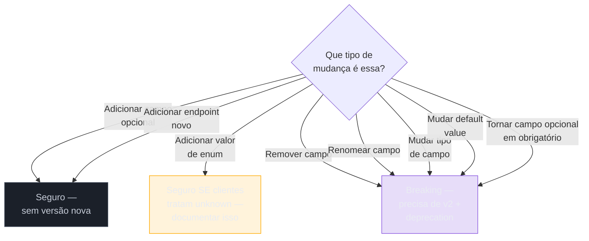
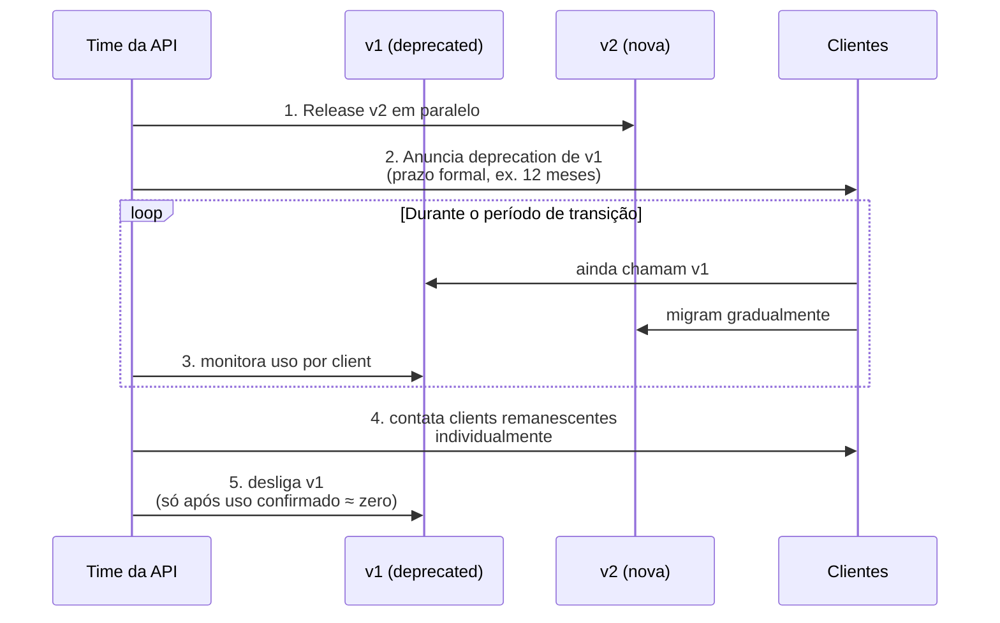

# Versionamento e evolução de contrato

> [!abstract] TL;DR
> Um campo `email_verificado` some da resposta de `GET /patients/{id}` numa sexta-feira à tarde, sem aviso, e quarenta integrações de laboratórios param de funcionar no fim de semana — porque cada uma delas lia esse campo por nome, e nenhuma delas foi avisada de que ele deixaria de existir. Esse é o cenário que este capítulo evita. A pergunta "URL, header ou query parameter?" é a parte fácil e menos importante do versionamento — as três estratégias têm prós e contras conhecidos, e URL path (`/v1/`, `/v2/`) é o default correto para a maioria das APIs públicas. O que separa uma API madura de uma que quebra seus consumidores com frequência é outra coisa: **a melhor versão nova é a que você nunca precisa lançar**. Isso significa desenhar a evolução do contrato com regras estritas — adicionar é seguro, remover nunca é, mudar tipo nunca é, enum e default value pedem cuidado redobrado — e, quando uma mudança quebra mesmo assim, seguir um processo disciplinado: paralelo `v1`/`v2`, deprecation com prazo formal (RFC 9745 e RFC 8594), monitorar quem ainda usa a versão antiga, e só desligar depois de confirmar que ninguém relevante depende dela. GraphQL e gRPC atacam o mesmo problema por ângulos diferentes — schema evolutivo com `@deprecated` e regras de compatibilidade binária de `.proto` — mas o princípio de fundo é idêntico nos três estilos: o contrato é uma promessa, e quebrar uma promessa sem aviso tem custo medível em confiança e em suporte.

Sexta-feira, 17h. O time de plataforma de uma marketplace de saúde faz um deploy de rotina: um campo interno, `email_verificado`, que ninguém do time lembrava por que existia, foi removido do payload de `GET /patients/{id}` numa limpeza de código. Ninguém revisou o OpenAPI antes do merge — a mudança parecia trivial, "só um campo morto". Segunda de manhã, o time de suporte recebe trinta e cinco tickets de laboratórios parceiros: os sistemas deles, que liam `email_verificado` para decidir se enviavam notificação por e-mail ou por SMS, começaram a lançar exceção de desserialização em cada chamada. Nenhum desses parceiros tinha sido avisado — porque, do ponto de vista do time que fez o deploy, remover um campo não parecia uma mudança que merecesse aviso.

Esse incidente — real na estrutura, ainda que os nomes sejam fictícios aqui — é o tipo de coisa que acontece com regularidade assustadora em plataformas sem uma política de evolução de contrato. Um levantamento recente de mercado sobre integrações quebradas mostra o padrão: empresas sem estratégia de versionamento explícita quebram integrações de clientes em média 4,2 vezes por ano, cada incidente gerando entre 40 e 80 tickets de suporte e um aumento temporário de 12-18% no churn — e o caso citado só parou de repetir depois que a empresa formalizou versionamento por URL mais uma política de deprecation de doze meses, ficando dezoito meses sem uma única reclamação de breaking change ([Speakeasy, *Versioning Best Practices in REST API Design*](https://www.speakeasy.com/api-design/versioning/), acessado 2026-07-09). A nota anterior deste sub-galho, [[01 - Idempotência]], tratou de como o contrato se sustenta sob retry. Esta trata de como ele se sustenta sob o tempo — meses e anos de evolução, com dezenas de consumidores que você nunca vai conhecer pessoalmente, cada um dependendo, sem saber, de detalhes do payload que pareciam irrelevantes para quem os removeu.

## A pergunta fácil: onde colocar a versão

Antes de chegar ao que de fato separa uma API que evolui bem de uma que quebra seus clientes, vale fechar rápido a parte mecânica: onde a versão vive na requisição. Existem três lugares comuns, e a escolha entre eles é bem menos consequente do que costuma parecer nas discussões de arquitetura.

### URL path versioning

```
GET /api/v1/patients
GET /api/v2/patients
```

É a estratégia mais comum, e a razão é pragmática, não estética: a versão é visível em qualquer lugar — logs, DevTools do navegador, um `curl` colado num chat — o roteamento é trivial (cada versão pode literalmente apontar para um conjunto diferente de handlers), e o comportamento de cache HTTP é previsível por padrão: `/v1/patients` e `/v2/patients` são chaves de cache distintas para qualquer CDN, sem nenhuma configuração especial ([dasroot.net, *API Versioning Strategies: Path, Header, or Content Negotiation*](https://dasroot.net/posts/2026/04/api-versioning-strategies-path-header-content-negotiation/), acessado 2026-07-09).

O contra mais citado é de pureza conceitual: do ponto de vista de REST, o recurso `/patients/{id}` é o mesmo recurso em `v1` e em `v2` — só a *representação* dele mudou — e colocar a versão na URL confunde identidade de recurso com formato de representação. Na prática, esse argumento perde para a conveniência operacional na maioria das APIs públicas: é a escolha de Stripe (em parte), GitHub e a esmagadora maioria das APIs REST publicadas hoje.

### Header versioning

```
GET /api/patients
Accept: application/vnd.medespecialista.v2+json
```

ou, de forma mais simples e cada vez mais comum, um header dedicado:

```
GET /api/patients
X-API-Version: 2
```

Aqui a URL permanece estável entre versões — o que é conceitualmente mais correto (a URL identifica o recurso; o header negocia a representação) — mas o custo aparece em dois lugares: é menos visível (não dá para testar rápido colando a URL no navegador) e, mais seriamente, qualquer CDN ou proxy intermediário que faça cache de `GET /api/patients` sem configurar `Vary: X-API-Version` (ou `Vary: Accept`) corre o risco real de servir a versão errada para o cliente errado — o erro de produção mais comum associado a essa estratégia ([dasroot.net, 2026](https://dasroot.net/posts/2026/04/api-versioning-strategies-path-header-content-negotiation/)). Header versioning tende a fazer mais sentido para APIs internas entre times com tooling consistente e disciplina de configurar cache corretamente, ou quando o objetivo explícito é esconder a mecânica de versionamento do consumidor.

### Query parameter versioning

```
GET /api/patients?version=2
```

É a opção menos recomendada das três, e por um motivo estrutural: a versão fica misturada com parâmetros de negócio (filtros, paginação, ordenação) na mesma query string, o que cria ambiguidade de parsing e convida a bugs sutis (um cliente que monta a query string dinamicamente pode, sem querer, sobrescrever ou omitir `version`). Caching também é inconsistente — algumas CDNs tratam cada combinação de query string como chave de cache distinta, outras ignoram query parameters no cálculo da chave por padrão, o que produz comportamento imprevisível dependendo de qual CDN está na frente ([dasroot.net, 2026](https://dasroot.net/posts/2026/04/api-versioning-strategies-path-header-content-negotiation/)).

### Versionamento por data: a alternativa que Stripe e Shopify escolheram

Um quarto padrão, menos discutido nos tutoriais introdutórios mas cada vez mais comum entre APIs de plataforma madura, merece menção: **versionamento por data**, em vez de por inteiro sequencial.

**Stripe** não versiona por `v1`/`v2` — versiona por data (`2023-10-16`, por exemplo). O mecanismo é elegante: na primeira chamada que uma conta faz à API, ela é automaticamente fixada ("pinned") na versão mais recente disponível naquele momento, e todas as chamadas seguintes dessa conta usam essa versão implicitamente, a menos que o cliente sobrescreva isso explicitamente com um header `Stripe-Version` numa chamada específica, ou atualize a versão fixada pelo dashboard ([Stripe Docs, *Versioning*](https://docs.stripe.com/api/versioning), acessado 2026-07-09). Isso garante que nenhum integrador é pego de surpresa por uma mudança — a conta continua na versão em que começou até decidir, deliberadamente, migrar.

**Shopify** aplica uma variação com cadência fixa: novas versões (nomeadas `YYYY-MM`, ex. `2026-04`) são lançadas todo início de trimestre, cada versão estável é suportada por no mínimo doze meses, com pelo menos nove meses de sobreposição entre versões consecutivas — o suficiente para qualquer integrador planejar a migração com folga, sem correria de última hora ([Shopify Dev, *About Shopify API versioning*](https://shopify.dev/docs/api/usage/versioning), acessado 2026-07-09).

**GitHub** segue um esquema parecido para sua REST API: o header `X-GitHub-Api-Version` identifica a versão pela data de lançamento (ex. `2026-03-10`); requisições sem esse header usam silenciosamente a versão legada padrão (`2022-11-28`), e cada versão permanece suportada por vinte e quatro meses após uma versão mais nova ser lançada ([GitHub Docs, *API Versions*](https://docs.github.com/en/rest/about-the-rest-api/api-versions?apiVersion=2026-03-10), acessado 2026-07-09).

O padrão comum a esses três exemplos é que a data comunica algo que um inteiro sequencial não comunica: quando aquela versão foi congelada, o que torna trivial cruzar a versão com o changelog e entender exatamente o que mudou desde então — sem precisar consultar uma tabela externa de "o que significa v3".

> [!question]- Se versionamento por data é tão elegante, por que ele não é o default universal?
> Porque ele exige mais infraestrutura do lado do servidor do que parece à primeira vista: o backend de Stripe, por exemplo, mantém uma camada de tradução que reformata a resposta da versão "atual" interna para a forma exata que cada data de versão promete — na prática, dezenas de transformações acumuladas ao longo dos anos, cada uma isolada e testada. Isso só compensa o investimento quando a API tem uma base de integradores grande o suficiente para que a alternativa (forçar todo mundo a migrar junto, ou manter múltiplos branches de código por versão) seja pior. Para uma API nova, com poucos consumidores, URL path versioning simples continua sendo o ponto de partida mais barato — a sofisticação de versionamento por data é algo para crescer *em direção a*, não para começar.

## A pergunta que importa de verdade: como evitar precisar de uma versão nova

As três estratégias acima resolvem "onde a versão mora na requisição" — mas nenhuma delas resolve o problema real, que é: **quando, exatamente, uma mudança exige uma versão nova?** A resposta certa reduz drasticamente a frequência com que a pergunta "URL, header ou query?" precisa ser respondida, porque a maior parte da evolução de uma API bem desenhada não deveria, na prática, quebrar nenhum consumidor existente.

A regra geral por trás de toda essa seção: **mudanças aditivas são seguras; mudanças que alteram ou removem o que já existe não são** ([freeCodeCamp, *How to Handle Breaking Changes for API and Event Schemas*](https://www.freecodecamp.org/news/how-to-handle-breaking-changes/), acessado 2026-07-09). Seis regras concretas, cada uma com sua própria armadilha característica:

### 1. Adicionar campos é seguro

```json
// v1 — payload original
{ "id": 42, "name": "Maria Silva" }

// depois — campo novo adicionado, mesmo endpoint, mesma versão
{ "id": 42, "name": "Maria Silva", "verified_at": "2026-07-01T10:00:00Z" }
```

Clientes bem escritos ignoram campos desconhecidos — é o princípio de "postura liberal" que sustenta décadas de evolução de protocolos na web. A adição de um novo atributo é uma mudança não-breaking, desde que o campo não seja obrigatório para o cliente processar a resposta ([freeCodeCamp, 2026](https://www.freecodecamp.org/news/how-to-handle-breaking-changes/)). Isso vale para campos de resposta; para campos de **request**, a regra correspondente é: novos campos devem ser opcionais, nunca obrigatórios, para não quebrar clientes que já enviam o payload sem eles.

### 2. Remover ou renomear campos nunca é seguro

É exatamente o incidente que abriu esta nota. Clientes que acessam um campo pelo nome falham na hora em que esse campo some — não existe uma forma de remover um campo consumido em produção sem, de fato, quebrar quem o consome ([freeCodeCamp, 2026](https://www.freecodecamp.org/news/how-to-handle-breaking-changes/)). Renomear é matematicamente equivalente a remover-mais-adicionar: do ponto de vista do cliente que lia o nome antigo, o campo simplesmente sumiu.

A técnica de transição segura, quando renomear é mesmo necessário, é *adicionar o campo novo ao lado do antigo*, manter os dois durante um período de transição, marcar o antigo como deprecated, e só removê-lo depois — nunca trocar um pelo outro no mesmo deploy.

### 3. Nunca mude o tipo de um campo existente

```json
// antes
{ "age": 34 }

// nunca faça isto no mesmo campo, mesma versão:
{ "age": "34 years" }
```

Se `age` era `number`, virar `string` (ou vice-versa) quebra qualquer cliente com tipagem estática ou desserialização estrita — mesmo que o *valor* continue "correto" para um humano lendo o JSON. Esse tipo de mudança costuma passar despercebido em revisão de código porque "parece" pequena; é uma das causas mais comuns de falha silenciosa em produção, porque muitos clientes só descobrem o problema quando a desserialização já falhou em runtime.

### 4. Enum values: adicione com cuidado

Este é o caso mais sutil dos seis, porque a mudança parece estritamente aditiva — "só adicionei um valor novo ao enum" — mas o efeito no cliente depende inteiramente de como ele trata valores desconhecidos:

```json
{ "status": "pending" }
```

Um consumidor típico em TypeScript ou Java pode ter escrito algo como:

```ts
switch (status) {
  case "pending": ...
  case "confirmed": ...
  case "cancelled": ...
  default: throw new Error(`unexpected status: ${status}`)
}
```

Se o servidor introduz um valor novo — `"rescheduled"`, por exemplo — sem que o cliente saiba, o `default` desse `switch` explode. Isso não é hipotético: clientes gerados automaticamente a partir de OpenAPI ou de outros geradores de SDK costumam lançar exceção explícita de desserialização quando recebem um valor de enum fora do conjunto conhecido no momento em que o cliente foi gerado ([Tyk, *Enums in API design: Everything you need to know*](https://tyk.io/blog/api-design-guidance-enums/), acessado 2026-07-09). A prática recomendada de mercado é tratar toda lista de valores de enum como potencialmente aberta desde o desenho inicial — documentar explicitamente que consumidores devem tratar valores desconhecidos com um caso `default`/`unknown` explícito, em vez de lançar exceção, e alguns geradores de SDK modernos já oferecem essa opção nativamente ("open enums", que continuam funcionando mesmo quando a API evolui a lista de valores) ([Speakeasy, *Evolving enums for evolving APIs*](https://www.speakeasy.com/blog/open-enums), acessado 2026-07-09).

### 5. Default values: nunca mude

Se um campo opcional `currency` sempre veio como `"USD"` quando omitido, e um dia o comportamento padrão silenciosamente vira `"BRL"` (porque a maioria da nova base de clientes é brasileira), todo cliente que dependia do comportamento antigo — mesmo sem nunca ter enviado `currency` explicitamente — passa a receber um resultado diferente, sem nenhuma mudança visível no próprio request que enviou. É uma das formas mais traiçoeiras de breaking change, porque nada na assinatura da API mudou — só o comportamento por trás dela.

### 6. Deprecation antes de remoção — sempre

A última regra amarra as outras cinco: toda remoção — de campo, de endpoint, de valor de enum — passa primeiro por um período em que o elemento é marcado como deprecated e continua funcionando, e só depois disso é de fato removido. Nunca remoção direta.

> [!warning] Tratar "campo não documentado" como "campo removível sem aviso"
> **O que acontece:** um time decide remover um campo que nunca apareceu no OpenAPI publicado — foi adicionado ad hoc por algum desenvolvedor, ficou lá, ninguém documentou — assumindo que, por não estar documentado, nenhum cliente pode estar usando. **Por quê:** clientes reais inspecionam respostas reais, não só a documentação. Se o campo aparece no payload, algum integrador — especialmente parceiros B2B com times próprios de engenharia — pode ter escrito código contra ele, documentado ou não. "Não documentado" não é sinônimo de "seguro para remover". **Como evitar:** trate todo campo que já apareceu em produção, documentado ou não, como parte do contrato de fato. Se ele precisa sumir, siga o mesmo processo de deprecation formal — anúncio, prazo, monitoramento de uso — que qualquer outra breaking change.



> [!question]- E se a mudança quebra só um consumidor interno, que o próprio time controla?
> Vale a mesma disciplina, com um atalho legítimo: se você tem certeza absoluta — via telemetria real, não suposição — de que nenhum consumidor ativo usa o campo ou comportamento em questão, é possível remover sem o processo completo de deprecation formal. O Zalando RESTful API Guidelines chama isso explicitamente: em situações controladas, é possível fazer uma mudança tecnicamente incompatível de forma não-breaking, *se* nenhum consumidor da API estiver de fato usando o aspecto afetado ([Zalando RESTful API Guidelines, *Compatibility*](https://github.com/zalando/restful-api-guidelines/blob/main/chapters/compatibility.adoc), acessado 2026-07-09). O risco desse atalho é sempre a mesma pergunta da seção anterior: "documentado" e "usado" não são a mesma coisa, e só telemetria real — não a ausência de reclamações — comprova que ninguém usa.

## O processo real de breaking change

Quando uma mudança realmente precisa quebrar o contrato — porque nenhuma das seis regras de evolução segura resolve o problema, por exemplo uma reestruturação profunda do modelo de dados — o processo que separa uma migração tranquila de um incidente de suporte tem cinco passos, na ordem:

**1. Release `v2` em paralelo com `v1`.** A versão antiga continua funcionando, exatamente como sempre funcionou, enquanto a nova coexiste ao lado dela. Nenhum cliente é forçado a migrar no dia do deploy.

**2. Comunique a deprecation de `v1` com prazo explícito.** Não "vamos desligar em algum momento" — uma data concreta, anunciada com antecedência real. A prática de mercado recomenda anunciar pelo menos seis meses antes do desligamento efetivo, e nunca antecipar uma data já publicada ([Zuplo, *How to Sunset an API*](https://zuplo.com/learning-center/how-to-sunset-an-api), acessado 2026-07-09). Comunicação por um único canal não é suficiente — changelog, e-mail direto para contas com chave de API ativa, banner no painel de desenvolvedor e o próprio header HTTP (próxima seção) reforçam a mesma mensagem por ângulos diferentes.

**3. Monitore uso de `v1` por client.** Toda chamada autenticada carrega uma API key (ou client ID) — é possível, e deveria ser rotina, agregar métricas de "quais contas ainda fazem chamadas para a versão deprecated" ao longo do período de transição. Sem esse dado, o time está decidindo às cegas se é seguro desligar.

**4. Avise clients que ainda usam `v1` individualmente.** Passado boa parte do prazo de deprecation, a lista de contas que ainda usam a versão antiga geralmente encolhe para um punhado de integradores — e vale contatá-los diretamente, não só confiar no anúncio genérico. É a diferença entre "avisamos publicamente" e "confirmamos que quem precisava saber, soube".

**5. Desligue `v1` só depois de confirmar que ninguém relevante usa.** O critério de "pronto para desligar" não é a data no calendário — é o dado de uso batendo zero (ou perto disso, com os remanescentes já cientes e sem plano de migrar). Se uma conta relevante ainda depende da versão antiga na véspera do prazo, a decisão madura é estender o prazo publicamente, não desligar de qualquer forma e lidar com o incêndio depois.

O contraexemplo mais citado do que acontece quando esse processo é ignorado é o desligamento do acesso gratuito à API v1.1/v2 do Twitter, em fevereiro de 2023: a comunicação com desenvolvedores foi mínima — em parte porque boa parte do time de developer relations tinha sido cortada nos meses anteriores — e milhares de aplicativos de terceiros (bots, dashboards, agendadores) pararam de funcionar de uma hora para outra, sem aviso individual e sem janela de transição real ([Engadget, *Twitter shut off its free API and it's breaking a lot of apps*](https://www.engadget.com/twitter-shut-off-its-free-api-and-its-breaking-a-lot-of-apps-222011637.html), acessado 2026-07-09). O próprio fundador do Twitter, anos depois, chamou publicamente o fechamento do acesso à API de "a pior coisa que fizemos" à plataforma ([Hacker News, citando Jack Dorsey](https://news.ycombinator.com/item?id=29664742), acessado 2026-07-09) — um lembrete de que o custo de uma migração malfeita não é só técnico, é reputacional, e dura anos.



## O header formal de deprecation: RFC 8594 e RFC 9745

A comunicação de deprecation não precisa (nem deveria) depender só de e-mail e changelog — o protocolo HTTP tem headers padronizados especificamente para isso, e usá-los permite que ferramentas automatizadas (proxies, SDKs, dashboards de observabilidade) detectem e alertem sobre deprecation sem que ninguém precise ler um e-mail.

**`Sunset`** (RFC 8594, publicada em 2019) indica que um recurso está previsto para se tornar não-responsivo a partir de uma data específica — o valor é um timestamp HTTP-date ([RFC 8594, *The Sunset HTTP Header Field*](https://datatracker.ietf.org/doc/html/rfc8594), acessado 2026-07-09):

```
Sunset: Sat, 31 Dec 2026 23:59:59 GMT
```

**`Deprecation`** (RFC 9745, publicada como Internet Standards Track em março de 2025) formaliza um header que já circulava de forma ad hoc havia anos — indica que o recurso *já está* deprecated a partir de uma data (que pode ser passada ou futura), sem que isso, por si só, mude o comportamento do recurso: ele continua funcionando exatamente como antes, só carrega o aviso ([RFC 9745, *The Deprecation HTTP Response Header Field*](https://datatracker.ietf.org/doc/rfc9745/), acessado 2026-07-09). O padrão de mercado atual — e o que substitui o antigo hábito de reaproveitar o header genérico `Warning`, que tinha semântica pouco específica e não era compatível com RFC 9111 — é usar os dois headers juntos, cada um comunicando uma coisa diferente: `Deprecation` diz "isto já não é mais o caminho recomendado", `Sunset` diz "e vai parar de responder nesta data" ([Zalando RESTful API Guidelines, *Deprecation*](https://github.com/zalando/restful-api-guidelines/blob/main/chapters/deprecation.adoc), acessado 2026-07-09):

```http
HTTP/1.1 200 OK
Deprecation: Sun, 11 Nov 2026 23:59:59 GMT
Sunset: Sun, 11 May 2027 23:59:59 GMT
Link: <https://api.example.com/v2/patients>; rel="successor-version"
Link: <https://api.example.com/docs/migration/v1-to-v2>; rel="deprecation"
```

O `Link` com `rel="successor-version"` aponta diretamente para o recurso substituto — machine-readable, então um cliente automatizado (ou um SDK bem construído) pode, em teoria, seguir esse link programaticamente. O `rel="deprecation"`, definido pela própria RFC 9745, aponta para uma página com contexto humano — o guia de migração, a justificativa da mudança, o prazo completo.

Vale registrar por que os dois headers são tratados como uma dupla, e não um substituto do outro: `Deprecation` sozinho diz "pare de usar isto, mas ainda funciona hoje"; `Sunset` sozinho diz "isto vai parar de responder", sem dizer claramente se já é hoje o momento de migrar ou se ainda há alternativa recomendada. Juntos, cobrem tanto o "o que fazer" quanto o "até quando você tem".

> [!question]- Um cliente que ignora esses headers sofre alguma consequência imediata?
> Não, e essa é exatamente a limitação estrutural desse mecanismo: `Deprecation` e `Sunset` são, por design, headers informativos — a resposta continua com status `200 OK`, o corpo continua idêntico, nada quebra automaticamente na hora. Um cliente mal-instrumentado pode simplesmente nunca inspecionar esses headers e seguir usando a versão deprecated até o dia em que ela literalmente para de responder. É por isso que o processo de cinco passos da seção anterior não pode depender só desses headers — eles são um canal a mais de comunicação (o único que chega automaticamente a qualquer cliente HTTP, sem precisar de e-mail cadastrado), não um mecanismo de enforcement. Ferramentas de observabilidade modernas conseguem varrer logs de tráfego e sinalizar proativamente quando uma equipe está consumindo endpoints marcados como deprecated — fechando parte dessa lacuna do lado de quem opera a API, não do cliente.

## GraphQL e gRPC: o mesmo problema, ferramentas diferentes

As seis regras de evolução segura e o processo de cinco passos valem, em espírito, para qualquer estilo de API — mas GraphQL e gRPC, já aprofundados nas notas 04 e 05 do sub-galho anterior ([[2 - Comunicação síncrona/04 - GraphQL — schema, resolvers e quando vale|GraphQL]], [[2 - Comunicação síncrona/05 - gRPC — Protobuf, HTTP2 e streaming|gRPC]]), têm mecanismos próprios que vale nomear rapidamente aqui, por contraste, sem repetir o que já foi coberto lá.

### GraphQL: evolução de schema sem versão

GraphQL toma uma posição de design deliberadamente diferente de REST: em vez de versionar a API inteira, o schema evolui continuamente, e o próprio modelo de execução — o cliente só recebe os campos que pediu explicitamente — já elimina boa parte do problema que versionamento tenta resolver em REST. Adicionar um tipo novo, um campo novo, uma query nova, nunca quebra um cliente existente, porque nenhum cliente existente está pedindo esse campo ([GraphQL.org, *Best Practices*](https://graphql.org/faq/best-practices/), acessado 2026-07-09).

A remoção segue um caminho próprio, via diretiva `@deprecated`:

```graphql
type Patient {
  id: ID!
  name: String!
  legacyStatus: String @deprecated(reason: "Use `status` instead.")
  status: PatientStatus!
}
```

Um campo marcado como `@deprecated` continua funcionando normalmente para quem já o consulta — a deprecation em si não é uma mudança breaking — mas ferramentas de introspecção, IDEs e documentação interativa (GraphiQL, Apollo Studio) sinalizam o aviso para qualquer desenvolvedor explorando o schema, e plataformas de observabilidade de GraphQL conseguem medir, campo a campo, quais clientes ainda fazem queries que tocam o campo deprecated ([Apollo GraphQL Docs, *Schema Deprecations*](https://www.apollographql.com/docs/graphos/schema-design/guides/deprecations), acessado 2026-07-09). Só depois que esse uso cai a zero — mesma lógica do passo 3-5 do processo REST — o campo é de fato removido do schema.

O paralelo com o padrão de versionamento por data é direto: **Shopify aplica o mesmo esquema de release trimestral (`YYYY-MM`) à sua API GraphQL Admin que aplica à REST Admin API** — cada versão do schema GraphQL, não só do REST, carrega uma data, com a mesma janela de doze meses de suporte e nove de sobreposição ([Shopify Dev, *ApiVersion*](https://shopify.dev/docs/api/admin-graphql/latest/objects/apiversion), acessado 2026-07-09). Isso mostra que "GraphQL não precisa de versão" é uma meia-verdade: o *schema* evolui sem versão campo a campo, mas plataformas de escala real ainda versionam a *API como um todo* — o pacote de breaking changes acumuladas que só podem acontecer numa fronteira de versão — mesmo usando GraphQL.

### gRPC: compatibilidade binária de `.proto`

gRPC ataca o problema num nível mais baixo: como o formato de serialização (Protocol Buffers) é binário e depende de números de campo, não de nomes, a regra central de evolução segura em `.proto` é uma só, e é absoluta: **um número de campo, uma vez usado, nunca pode ser reutilizado para outro propósito** ([Protocol Buffers Docs, *Language Guide (proto3)*](https://protobuf.dev/programming-guides/proto3/), acessado 2026-07-09). Se um campo `int32 old_field = 6` é removido e, meses depois, alguém adiciona um campo novo reaproveitando o número `6`, sistemas antigos que ainda serializam mensagens com o campo antigo vão ser desserializados incorretamente pelo lado novo — o número de campo é, literalmente, como o protocolo identifica qual valor é qual, então reaproveitar o número corrompe dados silenciosamente, sem erro explícito.

A prática recomendada, ao invés de simplesmente apagar a linha do campo removido, é uma das duas:

```protobuf
message Patient {
  int64 id = 1;
  string name = 2;
  // old_field removido — número reservado, nunca mais reutilizável
  reserved 6;
  reserved "old_field";
}
```

ou, quando código de migração ainda precisa ler o campo antigo por um tempo, marcar como deprecated em vez de remover:

```protobuf
message Patient {
  int64 id = 1;
  string name = 2;
  int32 old_field = 6 [deprecated = true];
}
```

A ferramenta que fecha esse ciclo automaticamente é o **`buf breaking`**, da Buf: comparado a rodar revisão manual de `.proto`, `buf breaking` compara o schema atual contra uma versão anterior (o commit anterior, o `main`, uma tag) e sinaliza qualquer incompatibilidade — de código gerado, de formato wire, ou de JSON — antes que o merge aconteça, com categorias de checagem que vão da mais estrita (quebra código gerado por arquivo) até a mais permissiva (só quebra o formato binário de fio) ([Buf Docs, *Detecting breaking changes*](https://buf.build/docs/breaking/), acessado 2026-07-09). Integrado a CI, isso transforma a regra "nunca reutilize um número de campo" de uma convenção que depende de disciplina humana em um gate automatizado que bloqueia o PR antes de qualquer coisa quebrar em produção — o equivalente, em gRPC, ao que contract testing (Pact) faz para REST e GraphQL, mencionado na nota anterior do sub-galho de comunicação síncrona.

> [!question]- Por que gRPC não tem um header de Deprecation equivalente ao HTTP?
> Porque gRPC não é HTTP no sentido em que REST é — ele roda sobre HTTP/2 como transporte, mas o contrato vive inteiramente no `.proto`, não em headers de aplicação. O equivalente funcional ao par `Deprecation`/`Sunset` é a opção `[deprecated = true]` no próprio campo ou serviço, combinada com comentários no `.proto` (que viram documentação gerada automaticamente para quem consome os stubs) e, opcionalmente, comunicação fora de banda (changelog do repositório de `.proto`s, versão do pacote publicado). O princípio de fundo — avisar antes de quebrar — é idêntico; só o canal muda, porque o consumidor de gRPC nunca vê um header HTTP de aplicação diretamente, vê o stub gerado a partir do `.proto`.

## Casos práticos

**Uma API que nunca precisou de `v3`.** Uma plataforma de agendamento médico opera desde `v1` há quatro anos sem nunca ter lançado uma `v2`. Como? Toda mudança que a princípio "pareceria" exigir uma nova versão foi resolvida de outro jeito: um campo que mudaria de tipo (`duration` de minutos inteiros para uma string ISO 8601) virou, em vez disso, um campo novo (`duration_iso8601`) ao lado do antigo, com o antigo marcado como deprecated e removido só dezoito meses depois, quando a telemetria confirmou uso zero. Um novo tipo de consulta (`telemedicine`) que exigia um valor de enum novo em `appointment_type` foi documentado explicitamente como "valores futuros possíveis, trate com `default`" desde o primeiro dia do enum — então quando o valor apareceu de fato, nenhum cliente quebrou. A disciplina de nunca usar as seis regras erradas, aplicada por quatro anos seguidos, tornou uma versão nova desnecessária.

**Uma migração de `v1` para `v2` feita direito.** Um provedor de pagamentos precisa mudar a estrutura de resposta de `POST /charges` de forma genuinamente incompatível — o modelo de erros muda de um código numérico solto para um objeto estruturado (o padrão RFC 9457, já coberto em [[2 - Comunicação síncrona/02 - REST — o contrato de resposta|REST — o contrato de resposta]]). `v2` é lançada em paralelo, com `Deprecation` e `Sunset` presentes em toda resposta de `v1` desde o primeiro dia, apontando via `Link` para o guia de migração. Seis meses depois, telemetria mostra que 95% do tráfego já migrou; a equipe contata individualmente as cinco contas restantes (todas parceiros grandes, cada um com um ponto de contato dedicado), confirma prazo de migração de cada uma, e só desliga `v1` um mês depois que a última confirma ter migrado — dois meses além do prazo originalmente anunciado, porque a regra real nunca foi a data no calendário, foi o uso confirmado em zero.

**A migração que falha por pressa.** Um time decide que precisa lançar `v2` em duas semanas, pressionado por uma feature de negócio que depende da nova estrutura. `Deprecation` e `Sunset` são adicionados no dia do lançamento de `v2`, com `Sunset` marcado para trinta dias depois — tempo insuficiente para qualquer integrador B2B real reagir, revisar, testar e fazer deploy da própria mudança. Quando o prazo chega, ainda há tráfego relevante em `v1`; o time desliga mesmo assim, porque "o prazo já foi anunciado". O resultado é o mesmo padrão do incidente do Twitter em miniatura: tickets de suporte, integrações quebradas, e a lição tardia de que um prazo de deprecation curto demais não é mais rápido — só transfere o custo da migração do calendário do time de plataforma para o pronto-socorro do suporte.

## Em entrevista

"Como você versiona uma API?" costuma ser feita como se fosse uma pergunta sobre sintaxe — URL, header ou query — e responder só com isso é a resposta de quem nunca operou uma API com consumidores de verdade por anos. A resposta que sinaliza profundidade sênior começa de trás para frente: "a decisão mecânica de onde colocar a versão importa menos do que a disciplina de evolução que evita precisar trocar de versão. Eu trato toda mudança de contrato contra seis regras: adicionar campo é seguro, remover ou renomear nunca é, nunca mudo o tipo de um campo existente, enum values eu documento como conjunto potencialmente aberto desde o início, nunca mudo um default value, e toda remoção passa por deprecation antes."

Um segundo sinal forte é trazer o processo de migração sem que o entrevistador precise perguntar: "quando uma breaking change é mesmo inevitável, eu não desligo a versão antiga no dia em que a nova sai — rodo as duas em paralelo, anuncio um prazo real (meses, não semanas), instrumento a API para saber exatamente quais clientes ainda usam a versão antiga, e só desligo depois de confirmar uso zero, não porque o calendário chegou." Citar o par de headers formais — `Deprecation` (RFC 9745) e `Sunset` (RFC 8594) — e explicar a diferença entre os dois ("um diz o quê, o outro diz até quando") demonstra que você conhece o mecanismo padronizado, não só a prática informal.

Uma boa pergunta de acompanhamento nessa conversa é sobre GraphQL e gRPC: "e se a API não é REST?" — responder que GraphQL evita boa parte do problema porque o cliente só recebe o que pediu, usando `@deprecated` campo a campo em vez de versão de API inteira, mas que plataformas de escala (cita-se Shopify) ainda versionam o schema inteiro por data para agrupar breaking changes; e que gRPC ataca o problema no nível binário, onde a regra central e não-negociável é nunca reutilizar um número de campo — mostra que você pensa em evolução de contrato como um princípio, não como uma técnica amarrada a REST.

## How to explain in English

> "API versioning has an easy question and a hard one. The easy one is mechanical — URL path, header, or query parameter — and URL path (`/v1/`, `/v2/`) is the pragmatic default for most public APIs because it's visible, cacheable, and simple to route. The hard question, and the one that actually matters, is: how do you evolve a contract without needing a new version at all? Six rules cover most of it: adding a field is safe, removing or renaming one never is, never change an existing field's type, treat enum value sets as potentially open from day one, never change a default value, and every removal goes through deprecation first — never straight deletion.
>
> When a breaking change is genuinely unavoidable, the real process has five steps: release the new version alongside the old one, announce deprecation with a real deadline — months, not weeks — monitor per-client usage of the deprecated version, reach out individually to whoever's still on it as the deadline nears, and only shut it down once usage is confirmed near zero, not because a calendar date arrived. The formal signal for this is a pair of HTTP headers: `Deprecation` (RFC 9745) says 'this is no longer the recommended path,' and `Sunset` (RFC 8594) says 'and it stops responding on this date.' Twitter's abrupt 2023 API shutdown, done with almost no warning, is the textbook example of what happens when that process is skipped — thousands of third-party apps broke overnight, and even Twitter's own founder later called it the worst thing the company did to its platform.
>
> GraphQL and gRPC face the same problem from different angles: GraphQL evolves its schema continuously, using `@deprecated` field-by-field instead of versioning the whole API, though platforms like Shopify still date-version the entire schema to batch breaking changes; gRPC treats it as a binary compatibility problem at the `.proto` level, where the one non-negotiable rule is that a field number, once used, can never be reused for something else."

| PT | EN |
|----|----|
| Versionamento por URL/header/query | URL/header/query versioning |
| Versionamento por data | Date-based versioning |
| Evolução segura de contrato | Safe contract evolution |
| Mudança aditiva | Additive change |
| Breaking change | Breaking change |
| Deprecation com prazo | Deprecation with a deadline |
| Monitorar uso por client | Monitor per-client usage |
| Número de campo reservado | Reserved field number |
| Enum aberto | Open enum |
| Contrato como promessa | Contract as a promise |
| Desligar (uma versão) | Sunset (a version) |
| Uso confirmado em zero | Confirmed zero usage |

## O que vem a seguir

Versionamento resolve como o contrato muda ao longo de meses e anos sem quebrar quem depende dele — mas existe uma dimensão de confiabilidade que opera numa escala de tempo bem mais curta: cada requisição individual, e o que acontece quando ela se repete. A próxima nota deste sub-galho trata de **caching HTTP e requisições condicionais** — `Cache-Control`, `ETag`, `If-None-Match` para evitar retransmitir dados que não mudaram, e `If-Match` para optimistic locking, evitando que duas atualizações concorrentes pisem uma na outra sem que ninguém perceba.

- [[03 - Caching HTTP e requisições condicionais]] — próxima nota do sub-galho.

## Veja também

- [[01 - Idempotência]] — a nota anterior deste sub-galho: por que POST não é idempotente e como o Idempotency-Key pattern resolve retries seguros.
- [[2 - Comunicação síncrona/06 - REST vs GraphQL vs gRPC — decisão|REST vs GraphQL vs gRPC — decisão]] — contrato como documentação (OpenAPI/.proto/SDL) e contract testing, base para entender por que evolução de contrato importa nos três estilos.
- [[2 - Comunicação síncrona/04 - GraphQL — schema, resolvers e quando vale|GraphQL — schema, resolvers e quando vale]] — schema, resolvers, aprofundamento do modelo que sustenta evolução sem versão.
- [[2 - Comunicação síncrona/05 - gRPC — Protobuf, HTTP2 e streaming|gRPC — Protobuf, HTTP2 e streaming]] — Protocol Buffers e HTTP/2, base técnica das regras de compatibilidade binária citadas aqui.
- [[3 - Confiabilidade do contrato/index|Confiabilidade do contrato]] — MOC deste sub-galho.
- [[Comunicação entre Sistemas/index|Comunicação entre Sistemas]] — o galho-pai desta trilha.
- [[03-Dominios/Engenharia/Dados/4 - Qualidade, governança e organização/02 - Data contracts e schema evolution|Data contracts e schema evolution]] — as mesmas regras de compatibilidade back/forward aplicadas ao contrato de **dados** (schema de tabela/evento que analytics consome), com shift-left e silent breakage.

## Fontes

- RFC 8594 — [*The Sunset HTTP Header Field*](https://datatracker.ietf.org/doc/html/rfc8594) (IETF, 2019; acessado 2026-07-09) — especificação formal do header `Sunset` e da relação de link `sunset`.
- RFC 9745 — [*The Deprecation HTTP Response Header Field*](https://datatracker.ietf.org/doc/rfc9745/) (IETF, Internet Standards Track, março de 2025; acessado 2026-07-09) — especificação formal do header `Deprecation`, sucessora do uso ad hoc anterior.
- Zalando RESTful API Guidelines — [*Deprecation*](https://github.com/zalando/restful-api-guidelines/blob/main/chapters/deprecation.adoc) (acessado 2026-07-09) — processo de deprecation, uso conjunto de `Deprecation`/`Sunset`, substituição do header `Warning`.
- Zalando RESTful API Guidelines — [*Compatibility*](https://github.com/zalando/restful-api-guidelines/blob/main/chapters/compatibility.adoc) (acessado 2026-07-09) — regras de compatibilidade e mudanças controladas não-breaking.
- Speakeasy — [*Versioning Best Practices in REST API Design*](https://www.speakeasy.com/api-design/versioning/) (acessado 2026-07-09) — caso "IntegrationFlow", custo de integrações quebradas sem versionamento.
- freeCodeCamp — [*How to Handle Breaking Changes for API and Event Schemas*](https://www.freecodecamp.org/news/how-to-handle-breaking-changes/) (acessado 2026-07-09) — taxonomia de mudanças aditivas vs breaking.
- dasroot.net — [*API Versioning Strategies: Path, Header, or Content Negotiation*](https://dasroot.net/posts/2026/04/api-versioning-strategies-path-header-content-negotiation/) (acessado 2026-07-09) — comparação de estratégias, comportamento de cache por estratégia.
- Stripe Docs — [*Versioning*](https://docs.stripe.com/api/versioning) (acessado 2026-07-09) — modelo de pinning por conta e header `Stripe-Version`.
- Shopify Dev — [*About Shopify API versioning*](https://shopify.dev/docs/api/usage/versioning) (acessado 2026-07-09) — versionamento por data, cadência trimestral, janela de suporte.
- Shopify Dev — [*ApiVersion — GraphQL Admin*](https://shopify.dev/docs/api/admin-graphql/latest/objects/apiversion) (acessado 2026-07-09) — mesmo esquema de data aplicado ao schema GraphQL.
- GitHub Docs — [*API Versions*](https://docs.github.com/en/rest/about-the-rest-api/api-versions?apiVersion=2026-03-10) (acessado 2026-07-09) — header `X-GitHub-Api-Version`, janela de suporte de 24 meses.
- Engadget — [*Twitter shut off its free API and it's breaking a lot of apps*](https://www.engadget.com/twitter-shut-off-its-free-api-and-its-breaking-a-lot-of-apps-222011637.html) (acessado 2026-07-09) — impacto do desligamento abrupto da API v1.1/v2 em fevereiro de 2023.
- Hacker News (citando declaração pública de Jack Dorsey) — [*Twitter's founder admits that shutting down the API was "worst thing we did"*](https://news.ycombinator.com/item?id=29664742) (acessado 2026-07-09).
- GraphQL.org — [*Best Practices*](https://graphql.org/faq/best-practices/) (acessado 2026-07-09) — filosofia de evolução contínua de schema sem versionamento.
- Apollo GraphQL Docs — [*Schema Deprecations*](https://www.apollographql.com/docs/graphos/schema-design/guides/deprecations) (acessado 2026-07-09) — uso da diretiva `@deprecated`, monitoramento de uso por campo.
- Tyk — [*Enums in API design: Everything you need to know*](https://tyk.io/blog/api-design-guidance-enums/) (acessado 2026-07-09) — risco de crash em clientes ao receber valores de enum desconhecidos.
- Speakeasy — [*Evolving enums for evolving APIs*](https://www.speakeasy.com/blog/open-enums) (acessado 2026-07-09) — conceito de "open enums" para evolução segura.
- Protocol Buffers Docs — [*Language Guide (proto3)*](https://protobuf.dev/programming-guides/proto3/) (acessado 2026-07-09) — regra de não reutilização de número de campo, opção `deprecated`, `reserved`.
- Buf Docs — [*Detecting breaking changes*](https://buf.build/docs/breaking/) (acessado 2026-07-09) — `buf breaking`, categorias de checagem, integração em CI.
