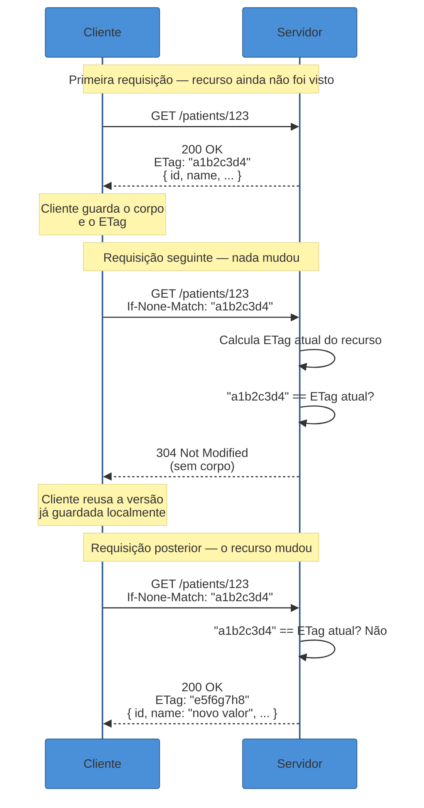
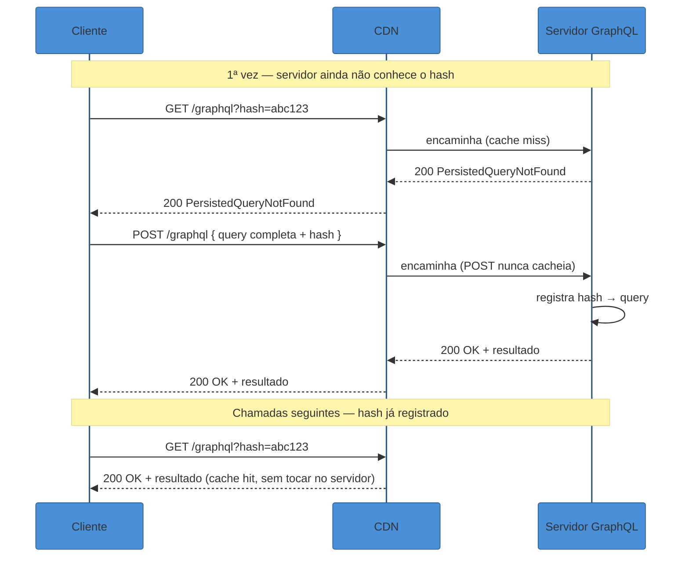

# Caching HTTP e requisições condicionais

> [!abstract] TL;DR
> Caching HTTP não é só "acelerar respostas" — é uma camada de **confiabilidade do contrato** com duas faces. `Cache-Control` diz a caches (browser, proxy, CDN) por quanto tempo uma resposta é segura de reutilizar sem perguntar ao servidor de novo, com `no-store`/`no-cache`/`public`/`private`/`max-age`/`stale-while-revalidate` cobrindo do "nunca guarde" ao "sirva o velho enquanto busca o novo em segundo plano". `ETag` + `If-None-Match` resolvem um problema diferente: evitar reenviar um corpo que não mudou, respondendo `304 Not Modified` sem payload. O mesmo mecanismo, invertido — `If-Match` numa escrita (`PUT`/`PATCH`) — vira **optimistic locking**: o servidor só aplica a mudança se o ETag enviado bater com o estado atual, e responde `412 Precondition Failed` quando outro cliente já mudou o recurso no meio do caminho, evitando o **lost update**. GraphQL, por rodar quase tudo como `POST /graphql`, perde essa cadeia de graça — a correção de mercado é persisted queries (transformar a query em uma `GET` cacheável) e cache hints por campo, não um substituto genérico.

Imagine duas pessoas com acesso ao mesmo prontuário de paciente numa plataforma de saúde: uma enfermeira abre o registro às 14h02 para atualizar a pressão arterial, um médico abre o mesmo registro às 14h03 para adicionar uma prescrição. Os dois carregam a tela com o estado do paciente naquele instante. A enfermeira termina de digitar às 14h05 e salva. O médico, que já estava com a tela aberta antes da enfermeira salvar, termina às 14h07 e também salva — sobrescrevendo, sem saber, a atualização de pressão arterial que a enfermeira acabou de registrar. Nenhum dos dois recebeu erro. Nenhum dos dois sabe que algo se perdeu. O sistema simplesmente aceitou a última escrita como se fosse a única que existisse — esse é o **lost update problem**, e ele é silencioso por natureza: não aparece em logs de erro, não dispara alerta, só aparece quando alguém nota, dias depois, que um dado crítico sumiu sem explicação.

O mesmo domínio tem um segundo problema, mais mundano mas igualmente caro: um app mobile de agenda médica que busca a lista de horários disponíveis a cada 10 segundos, porque o produto quer "tempo real". Se a API não expõe nenhum sinal de que o conteúdo não mudou desde a última busca, o servidor recalcula a lista inteira, serializa o JSON completo, e devolve o mesmo payload de 40KB, requisição após requisição, a maior parte das vezes sem nenhuma mudança real por trás. Multiplicado por milhares de usuários simultâneos, isso não é só desperdício de CPU do servidor — é banda que o usuário paga (literalmente, em planos de dados limitados) para receber informação que ele já tinha.

Os dois problemas — a escrita perdida e o desperdício de banda — parecem não relacionados, mas nascem do mesmo vazio de design: a API não trata "o estado atual do recurso" como algo que o cliente e o servidor podem **comparar** antes de agir. É exatamente isso que caching HTTP e requisições condicionais resolvem — e a peça central dos dois mecanismos, olhando de perto, é a mesma: um identificador do estado atual do recurso, comparado antes de decidir o que fazer.

## Cache-Control: o cliente decide (delegado pelo servidor)

`Cache-Control` é o cabeçalho que o servidor usa para dizer, de forma explícita, **quem** pode guardar essa resposta, **por quanto tempo**, e **o que fazer** quando esse tempo expira. Ele existe porque, sem essa instrução explícita, qualquer cache no caminho — o navegador, um proxy corporativo, uma CDN — teria que adivinhar se é seguro reutilizar uma resposta antiga, e adivinhar errado custa caro dos dois lados: cachear demais serve dado desatualizado, cachear de menos desperdiça a infraestrutura de cache que a própria internet já construiu.

A especificação vigente é a [RFC 9111 — HTTP Caching](https://datatracker.ietf.org/doc/html/rfc9111) (2022), que obsoletou a RFC 7234 e consolidou o comportamento de cache em HTTP/1.1 e HTTP/2. Ela define um "cache" formalmente como qualquer sistema — local ao cliente ou compartilhado entre múltiplos usuários (um proxy, uma CDN) — que guarda respostas para reduzir latência e tráfego de rede em requisições futuras equivalentes.

```http
# Não cachear em lugar nenhum — nem browser, nem proxy, nem CDN
Cache-Control: no-store

# Pode cachear, mas sempre revalide com o servidor antes de servir
# (na prática, quase sempre acompanhado de ETag — ver seção seguinte)
Cache-Control: no-cache

# Cacheável publicamente (inclusive por CDN/proxy compartilhado) por 5 minutos
Cache-Control: public, max-age=300

# Cacheável só no browser do próprio usuário, nunca em cache compartilhado
Cache-Control: private, max-age=300

# Fresco por 60s; entre 60s e 360s, sirva o cache "velho" imediatamente
# enquanto revalida em segundo plano
Cache-Control: max-age=60, stale-while-revalidate=300
```

Vale nomear a confusão mais comum entre as duas primeiras diretivas: `no-store` significa "nunca guarde essa resposta em lugar nenhum" — é o nível certo para dados sensíveis (extrato bancário, dados médicos individuais) onde nem uma cópia temporária no disco do navegador é aceitável. `no-cache`, apesar do nome sugerir o mesmo, é mais permissivo: **pode** guardar a resposta, mas precisa revalidar com o servidor antes de reutilizá-la — na prática, isso quase sempre significa "guarde, mas sempre mande um `If-None-Match` antes de servir do cache", o que conecta diretamente com a seção seguinte.

`public` vs `private` resolve uma pergunta diferente: quem tem permissão de guardar a cópia. `public` autoriza qualquer cache no caminho, inclusive caches compartilhados entre múltiplos usuários (uma CDN, um proxy corporativo) — apropriado para conteúdo que é igual para todo mundo, como o catálogo de produtos de uma loja. `private` restringe o cache ao próprio navegador do usuário — apropriado para respostas personalizadas, como "meus pedidos" ou "meu perfil", onde uma CDN guardando essa resposta e servindo para outro usuário seria um vazamento de dados grave.

Há uma terceira peça que costuma passar despercebida até causar um bug difícil de reproduzir: o cabeçalho `Vary`. `Cache-Control` decide **se** e **por quanto tempo** cachear; `Vary` decide **o quê**, exatamente, identifica uma cópia cacheada como distinta de outra para a mesma URL. Se um endpoint devolve conteúdo diferente dependendo do `Accept-Language` do cliente (português para um usuário, inglês para outro) ou do `Accept-Encoding` (corpo comprimido em gzip vs brotli vs sem compressão), e o servidor não declara `Vary: Accept-Language, Accept-Encoding`, um cache intermediário — que só indexa por URL — pode servir a versão em inglês para um usuário que pediu português, simplesmente porque essa foi a primeira resposta que ficou guardada para aquela URL. `Vary` resolve isso instruindo o cache a manter cópias separadas por combinação de cabeçalhos, não uma cópia única por URL.

Vale nomear também a diferença entre caching de **assets estáticos** (JS, CSS, imagens) e caching de **respostas de API dinâmicas**, porque a estratégia dominante para cada um é oposta. Assets estáticos costumam usar **cache busting via URL versionada** — o build gera um nome de arquivo com hash do conteúdo embutido (`app.a1b2c3.js`), e a resposta carrega `Cache-Control: public, max-age=31536000, immutable`: um ano inteiro de cache, porque, se o conteúdo mudar, o nome do arquivo muda junto, e a URL antiga nunca precisa ser invalidada — ela simplesmente para de ser referenciada. Respostas de API dinâmicas não têm esse luxo: a URL (`/patients/123`) é estável por definição — é o identificador do recurso — então a única forma de saber se o conteúdo mudou é revalidar, o que é exatamente o papel do `ETag` e do `If-None-Match` da próxima seção.

### Stale-while-revalidate: o cache que mente um pouco, de propósito

A diretiva `stale-while-revalidate`, formalizada na [RFC 5861 — HTTP Cache-Control Extensions for Stale Content](https://datatracker.ietf.org/doc/html/rfc5861), resolve uma tensão real entre dois objetivos que parecem opostos: servir sempre a resposta mais rápida possível (o que favorece cache agressivo) e nunca servir dado desatualizado (o que favorece revalidar sempre). A extensão permite que o cache sirva uma resposta **já expirada** imediatamente — sem esperar nenhuma viagem de rede — enquanto dispara, em paralelo e sem bloquear o cliente, uma revalidação em segundo plano que atualiza o cache para a próxima requisição ([web.dev, *Keeping things fresh with stale-while-revalidate*](https://web.dev/articles/stale-while-revalidate)).

Com `Cache-Control: max-age=1, stale-while-revalidate=59`, o comportamento é: dentro do primeiro segundo, a resposta está "fresca" e é servida direto do cache sem qualquer verificação. Entre 1 e 60 segundos, a resposta está "stale" (velha), mas ainda dentro da janela de `stale-while-revalidate` — o cache serve essa versão desatualizada imediatamente ao usuário, e dispara uma requisição de revalidação em paralelo que atualiza o cache para a próxima chamada. Depois de 60 segundos, a janela se esgota e uma requisição normal, bloqueante, é necessária.

O ganho prático é esconder a latência de revalidação do usuário: em vez de "espere 200ms enquanto eu confirmo se isso ainda é válido", o padrão é "aqui está a resposta agora (mesmo que tenha alguns segundos de idade), e enquanto você já está usando ela, eu confirmo em segundo plano se preciso atualizar algo". Para uma lista de horários disponíveis que muda a cada poucos minutos, essa troca — alguns segundos de possível desatualização em troca de latência zero percebida — costuma valer muito mais do que a garantia de estar sempre 100% atualizado.

> [!question]- Se `stale-while-revalidate` serve dado desatualizado de propósito, isso não contradiz o objetivo de caching que é "sempre estar certo"?
> Não — e a confusão vem de tratar "caching HTTP" como sinônimo de "sempre 100% correto". Caching sempre foi uma troca deliberada entre correção perfeita e performance; o que muda entre as diretivas é **onde** você desenha essa linha. `no-store`/`no-cache` escolhem correção máxima às custas de latência. `max-age` puro escolhe performance às custas de uma janela de possível desatualização (o dado pode estar velho até `max-age` segundos, sem ninguém notar). `stale-while-revalidate` é uma terceira posição, mais sofisticada: ele garante que a janela de desatualização é curta e limitada (`stale-while-revalidate` segundos, não infinito) e que o sistema se autocorrige em segundo plano sem custar latência ao usuário atual. A pergunta certa nunca é "isso pode estar errado?" — quase toda decisão de cache aceita algum grau disso — é "por quanto tempo, e o negócio tolera essa janela?".

## ETag e requisições condicionais: comparar antes de reenviar

`Cache-Control` resolve "por quanto tempo posso reutilizar isso sem perguntar". `ETag` resolve um problema complementar: quando o cliente **precisa** perguntar (porque o `max-age` expirou, ou porque a resposta é `no-cache`), como perguntar de um jeito que não custe o mesmo que buscar tudo de novo.

Um `ETag` é um identificador opaco — uma string qualquer, sem significado interpretável fora do servidor que a gerou — que representa o estado exato de um recurso num dado momento. O servidor devolve esse identificador junto com a resposta; da próxima vez que o cliente quiser o mesmo recurso, ele manda esse identificador de volta no cabeçalho `If-None-Match`, perguntando, em essência, "isso ainda é o estado atual?".



A economia real está no `304 Not Modified`: quando o ETag bate, o servidor não recalcula, não serializa, e não envia o corpo — só o código de status e o cabeçalho, tipicamente algumas dezenas de bytes contra os quilobytes de um payload JSON completo. Para uma API consultada com alta frequência (o app de horários batendo a cada 10 segundos, do exemplo de abertura), essa diferença acumulada em milhares de requisições é a diferença entre uma API que escala tranquila e uma que queima CPU e banda recalculando a mesma resposta indefinidamente.

A regra formal está na [RFC 7232 — HTTP/1.1 Conditional Requests](https://datatracker.ietf.org/doc/html/rfc7232): se o `If-None-Match` não bate com o ETag atual do recurso, o servidor **deve** processar a requisição normalmente (`200 OK` com o corpo atualizado e o novo ETag); se bate, o servidor **deve** responder `304 Not Modified` para métodos seguros (`GET`/`HEAD`) — sem corpo — ou `412 Precondition Failed` para métodos que alteram o recurso, o gancho para a próxima seção.

### Como o ETag é calculado, na prática

A RFC não prescreve o algoritmo — só exige que o valor mude sempre que o recurso muda de estado, e que seja opaco (o cliente não deve tentar interpretar o conteúdo do próprio ETag, só compará-lo). Na prática, três estratégias dominam:

- **Hash do corpo** (MD5, SHA-256, ou um hash mais rápido como xxHash): calculado sobre a serialização final da resposta. Garante correção total — dois estados diferentes do recurso quase nunca colidem no mesmo hash — mas custa CPU a cada requisição, porque exige gerar o corpo completo antes de decidir se ele mudou (o que elimina parte do ganho de performance do próprio mecanismo, a não ser que o hash seja calculado de forma incremental ou cacheado junto com os dados).
- **Campo `version`** do recurso: se o modelo de dados já mantém um contador de versão (comum em sistemas que já implementam algum controle de concorrência no banco), reutilizar esse valor como ETag é praticamente gratuito — não exige nenhum cálculo adicional, só formatar o número existente.
- **`updated_at` formatado**: usar o timestamp da última modificação, já presente na maioria dos modelos de dados, como base do ETag. É a opção mais barata de implementar, mas carrega uma armadilha real de granularidade — se dois updates acontecem dentro da mesma janela de precisão do timestamp (por exemplo, dois updates no mesmo milissegundo, ou pior, no mesmo segundo se a coluna só guarda essa precisão), o ETag não detecta a mudança.

> [!warning] ETag diferente por servidor atrás de um load balancer
> **O que acontece:** um cliente recebe um ETag do servidor A, revalida depois contra o servidor B (outro nó atrás do mesmo load balancer), e recebe um ETag diferente mesmo que o recurso não tenha mudado — forçando um download completo desnecessário, ou pior, quebrando a lógica de cache de forma silenciosa e intermitente. **Por quê:** isso acontece quando o algoritmo de geração do ETag inclui algo específico daquele processo ou máquina — um número de inode do sistema de arquivos, um timestamp de geração do processo, ou qualquer dado que não seja parte do estado lógico do recurso em si. **Como evitar:** o ETag precisa ser determinístico em relação ao **estado do dado**, não ao processo que o serviu — hash do corpo, `version` do banco e `updated_at` são todos seguros nesse sentido, porque vêm da fonte de dados compartilhada (o banco), não de cada instância do servidor de aplicação.

Vale nomear também a distinção entre ETag **forte** e **fraco** (prefixo `W/`), que a RFC 7232 formaliza: um ETag forte garante que dois recursos com o mesmo valor são byte a byte idênticos — necessário para operações como range requests (baixar só uma parte de um arquivo grande). Um ETag fraco (`W/"a1b2c3d4"`) garante só equivalência semântica — o conteúdo é "o mesmo" para efeitos práticos, mesmo que os bytes exatos difiram (o caso clássico é o mesmo JSON comprimido com gzip numa resposta e com brotli em outra: bytes diferentes, conteúdo idêntico). Para a maioria das APIs REST — onde o objetivo é cache/revalidação, não range requests — o ETag fraco é suficiente e, em geral, mais barato de calcular, porque não exige garantir identidade byte a byte.

## Optimistic locking com If-Match: o mesmo mecanismo, invertido, evitando lost updates

Se `If-None-Match` numa leitura pergunta "isso ainda é o mesmo?", `If-Match` numa escrita pergunta a mesma coisa com uma consequência bem mais séria: "eu só quero fazer essa mudança **se** o recurso ainda estiver exatamente como eu vi da última vez — se alguém mexeu nele nesse meio-tempo, não aplique, me avise".

Esse é exatamente o mecanismo que resolve o cenário de abertura desta nota — a enfermeira e o médico editando o mesmo prontuário. Sem `If-Match`, um `PUT` simplesmente sobrescreve o que existe, não importa o que tenha mudado entre o `GET` e o `PUT` do cliente. Com `If-Match`, o cliente carrega o ETag junto com o recurso no `GET` inicial, e envia esse mesmo ETag de volta no cabeçalho `If-Match` da escrita:

```http
# 1. Enfermeira busca o prontuário
GET /patients/123
HTTP/1.1 200 OK
ETag: "a1b2c3d4"
{ "id": 123, "name": "Maria", "bloodPressure": null, ... }

# 2. Médico busca o mesmo prontuário (mesmo ETag, ainda não mudou)
GET /patients/123
HTTP/1.1 200 OK
ETag: "a1b2c3d4"
{ "id": 123, "name": "Maria", "bloodPressure": null, ... }

# 3. Enfermeira salva primeiro, com o ETag que ela tinha
PUT /patients/123
If-Match: "a1b2c3d4"
{ "bloodPressure": "120/80", ... }

HTTP/1.1 200 OK
ETag: "e5f6g7h8"    # novo ETag, porque o recurso mudou

# 4. Médico tenta salvar com o ETag antigo — o recurso já mudou
PUT /patients/123
If-Match: "a1b2c3d4"
{ "prescription": "Ibuprofeno 400mg", ... }

HTTP/1.1 412 Precondition Failed
# A escrita da enfermeira NÃO foi perdida.
# O médico precisa buscar o estado atual (GET de novo) e reaplicar sua mudança.
```

O detalhe que faz esse padrão funcionar é que o servidor não está comparando "o ETag que o médico mandou é válido em abstrato" — está comparando "o ETag que o médico mandou ainda bate com o ETag **atual** do recurso, agora, no momento exato da escrita". Como a enfermeira salvou primeiro e mudou o recurso (gerando um novo ETag `"e5f6g7h8"`), o ETag antigo que o médico carrega (`"a1b2c3d4"`) já não corresponde a mais nada — e o servidor rejeita a escrita com `412 Precondition Failed` em vez de aceitar cegamente e apagar a atualização de pressão arterial.

Esse padrão tem nome formal: **optimistic concurrency control** (ou optimistic locking). "Otimista" porque o sistema assume, por padrão, que conflitos são raros — não trava o recurso preventivamente (como um lock pessimista faria, bloqueando qualquer outra leitura/escrita até a primeira transação terminar) — e só detecta o conflito no momento da escrita, quando ele de fato acontece. Isso é uma troca deliberada de performance: locking pessimista paga o custo de coordenação em toda operação, mesmo quando não há conflito real; locking otimista deixa tudo fluir livremente na maior parte do tempo, e só paga o custo — rejeitar uma escrita e pedir para o cliente tentar de novo — nos casos raros em que dois clientes realmente colidem no mesmo recurso, ao mesmo tempo ([ByteByteGo, *Pessimistic vs Optimistic Locking*](https://bytebytego.com/guides/pessimistic-vs-optimistic-locking/)).

> [!question]- 412 Precondition Failed ou 409 Conflict — qual é o código certo?
> A distinção formal, pela [RFC 7232](https://datatracker.ietf.org/doc/html/rfc7232), é que `412 Precondition Failed` é a resposta quando uma condição explícita enviada pelo próprio cliente — o `If-Match` — não foi satisfeita; é literalmente "você me pediu para só fazer isso *se* X, e X não é verdade". `409 Conflict` é mais genérico: sinaliza que a requisição não pode ser processada por causa do estado atual do recurso, sem necessariamente envolver um cabeçalho condicional explícito do cliente (por exemplo, tentar criar um recurso com um identificador que já existe). Na prática de optimistic locking com ETag, `412` é o código tecnicamente correto e o mais amplamente usado por APIs de referência — Google Cloud Secret Manager e a API FHIR do Google Cloud Healthcare, por exemplo, adotam `412` explicitamente para esse cenário. Algumas APIs devolvem `409` por preferência de design (é um código mais familiar para times que não trabalham com condicionais HTTP no dia a dia), mas isso mistura duas semânticas diferentes — vale manter `412` reservado para "sua condição `If-Match`/`If-None-Match` falhou" e `409` para conflitos de estado que não vieram de um cabeçalho condicional.

O padrão não é teórico nem raro — é como AWS S3 resolve o mesmo problema em escala de infraestrutura de armazenamento. Em agosto de 2024, a AWS anunciou suporte a **conditional writes** no S3: um `PutObject` pode carregar `If-None-Match: *` para garantir "só grave se esse objeto ainda não existir" (evitando dois clientes criarem o mesmo objeto simultaneamente), e em novembro do mesmo ano, suporte a `If-Match` com o ETag do objeto para o caso simétrico — "só grave se o objeto ainda estiver exatamente como eu vi da última vez" ([AWS News, *Amazon S3 adds new functionality for conditional writes*](https://aws.amazon.com/about-aws/whats-new/2024/11/amazon-s3-functionality-conditional-writes/)). É o mesmo mecanismo HTTP condicional desta nota, resolvendo o mesmo problema — lost updates em escritas concorrentes — na escala de um dos serviços de armazenamento mais usados do mundo.

> [!warning] Tratar 412 como erro do usuário, não como sinal a ser tratado pelo cliente
> **O que acontece:** o front-end recebe um `412 Precondition Failed` e mostra uma mensagem genérica de "erro ao salvar" — o usuário perde o trabalho que acabou de digitar, sem entender por quê, e tenta de novo às cegas (o que provavelmente falha de novo, com o mesmo ETag desatualizado). **Por quê:** `412` num fluxo de optimistic locking não é uma falha do sistema — é o sistema funcionando exatamente como projetado, informando que o mundo mudou debaixo do usuário. Tratá-lo como um erro genérico joga fora justamente a informação que o torna útil. **Como evitar:** o cliente precisa reagir ao `412` de forma específica — buscar o estado atual (`GET` de novo, pegando o ETag mais recente), e então decidir como reconciliar: reaplicar a mudança sobre o novo estado automaticamente (quando seguro), mostrar as duas versões para o usuário escolher, ou, no mínimo, avisar explicitamente "alguém mais atualizou isso enquanto você editava — revise antes de salvar de novo". Ferramentas de edição colaborativa (Notion, Google Docs) vão além disso com merge automático de granularidade fina, mas mesmo o tratamento mais simples — recarregar e pedir confirmação — já evita silenciosamente perder dados.

## O que GraphQL perde, e como o mercado compensa

Tudo até aqui — `Cache-Control` cacheável por CDN, `ETag`/`If-None-Match` evitando reenvio de corpo, `If-Match` prevenindo lost updates — depende de uma premissa que [[2 - Comunicação síncrona/06 - REST vs GraphQL vs gRPC — decisão|a nota que fecha o sub-galho anterior]] já havia sinalizado: o mecanismo é HTTP nativo, e HTTP nativo significa `GET` idempotente, com URL identificando o recurso, e corpo de resposta que caches sabem indexar.

GraphQL quebra essa premissa na raiz: por convenção histórica, toda operação — inclusive uma leitura pura — viaja como `POST /graphql`, com a query inteira (e as variáveis) dentro do corpo da requisição. E `POST`, por especificação, nunca é cacheável por padrão em nenhum cache HTTP — proxies e CDNs não indexam corpo de requisição como parte da chave de cache, então duas queries GraphQL diferentes, enviadas ao mesmo endpoint `/graphql`, são indistinguíveis do ponto de vista de qualquer cache HTTP tradicional ([Apollo GraphQL Blog, *Caching GraphQL results in your CDN*](https://www.apollographql.com/blog/caching-graphql-results-in-your-cdn)). Isso significa: sem nenhum tratamento adicional, uma API GraphQL não tem `304 Not Modified`, não tem CDN cacheando respostas públicas, e não tem — de graça — o equivalente de optimistic locking via `If-Match`, porque não há um único "recurso" identificável por URL ao qual anexar um ETag; uma query pode combinar dezenas de recursos numa única resposta.

A correção de mercado dominante é **Automatic Persisted Queries (APQ)**: em vez de mandar a query inteira a cada chamada, o cliente registra a query uma vez (calculando um hash SHA-256 dela) e, nas chamadas seguintes, manda só o hash — o que é curto o suficiente para caber numa URL, transformando a operação numa `GET` real, com uma URL determinística que qualquer CDN sabe cachear normalmente ([Apollo GraphQL Docs, *Automatic Persisted Queries*](https://www.apollographql.com/docs/apollo-server/performance/apq)).



O ganho é duplo: bandwidth reduzido (hash é muito menor que a query completa) e, principalmente, a operação volta a ser uma leitura idempotente e cacheável no sentido HTTP tradicional — repare que só a primeira chamada de cada query paga o custo de um `POST` não-cacheável; todas as seguintes, incluindo as de outros usuários que fazem a mesma pergunta, viram `GET`s que a CDN já conhece. A evolução mais recente desse padrão — **trusted documents** (às vezes ainda chamada pelo nome legado "persisted queries") — vai além do ganho de cache e vira também um mecanismo de segurança: o servidor só executa operações previamente registradas e aprovadas em code review, rejeitando qualquer query arbitrária enviada por um cliente não confiável ([benjie.dev, *GraphQL Trusted Documents*](https://benjie.dev/graphql/trusted-documents)) — mas essa técnica só funciona para clientes que o próprio time controla (apps mobile, front-end interno); uma API GraphQL pública, consumida por terceiros com queries arbitrárias, não pode usar trusted documents, porque as operações desses clientes nunca são conhecidas de antemão.

A segunda peça da compensação é **cache em nível de resolver**, não de resposta inteira: em vez de tentar cachear "a resposta completa da query X" (que muda a cada combinação diferente de campos pedidos), servidores GraphQL como Apollo Server permitem anotar cache hints por **campo** — `@cacheControl(maxAge: 60)` num campo específico do schema, ou dinamicamente via `info.cacheControl.setCacheHint()` dentro do próprio resolver. O servidor calcula então o `maxAge` efetivo da resposta inteira como o **menor** valor entre todos os campos incluídos naquela query específica — se um campo tem `maxAge: 0` (nunca cacheável), a resposta inteira herda essa restrição, e se qualquer campo é marcado `PRIVATE`, o escopo da resposta inteira vira privado também ([Apollo GraphQL Docs, *Server-Side Caching*](https://www.apollographql.com/docs/apollo-server/performance/caching)). É uma estratégia de cache genuinamente diferente de `Cache-Control` em REST — não cacheia a URL, cacheia o **resultado por campo**, e projeta o cache efetivo da query a partir da composição desses campos — mas resolve, de outra forma, boa parte do mesmo objetivo: evitar recalcular e reenviar dado que não mudou.

> [!question]- Se essas soluções existem, por que a matriz de decisão da nota anterior lista "cache HTTP nativo" como vantagem exclusiva de REST?
> Porque "existe uma correção de mercado" e "vem de graça, sem esforço adicional" são coisas diferentes — e essa diferença é exatamente o trade-off que importa numa decisão de arquitetura. Em REST, `GET /patients/123` com `Cache-Control` é cacheável por qualquer CDN, sem nenhuma infraestrutura adicional além de configurar o cabeçalho — é literalmente parte do protocolo desde os anos 1990. Em GraphQL, o mesmo resultado — cache eficaz em CDN — exige que o time implante e opere APQ (com um armazenamento de hashes, geralmente Redis, com TTL configurado) **e** desenhe cache hints deliberados por campo no schema **e** entenda a semântica de composição de `maxAge`/`scope` entre campos. Nenhuma dessas peças é impossível — Netflix, GitHub e Shopify rodam GraphQL em escala de produção com cache funcionando — mas é trabalho de engenharia que REST não cobra. A vantagem que a matriz registra não é "GraphQL não pode ser cacheado", é "REST cacheia de graça, GraphQL cacheia com investimento deliberado" — e essa diferença de custo é um dos fatores reais na decisão de onde usar cada estilo, coerente com o padrão híbrido (BFF GraphQL na agregação, REST na borda pública) que a nota anterior detalha.

## Armadilhas comuns

Os três problemas a seguir aparecem repetidamente em auditorias de API real — nenhum é exótico, e todos passam despercebidos em ambiente de desenvolvimento (com um único usuário, uma única instância de servidor, um único idioma) para só se manifestar em produção, sob carga e concorrência real.

> [!warning] Marcar resposta personalizada como `public`
> **O que acontece:** um endpoint que devolve dados específicos do usuário logado (`GET /me/dashboard`, `GET /me/orders`) é marcado com `Cache-Control: public, max-age=60` — talvez por copiar e colar a configuração de um endpoint de catálogo genuinamente público. Uma CDN guarda essa resposta e a serve para o **próximo** usuário que bater na mesma URL, vazando dados de um usuário para outro. **Por quê:** `public` não distingue "esse endpoint pode ser acelerado" de "essa resposta específica é igual para todo mundo" — ele autoriza qualquer cache compartilhado a reutilizar a resposta, e nada na URL sozinha sinaliza que o conteúdo varia por identidade do requisitante (a menos que o `Vary` esteja correto, e mesmo assim a maioria das CDNs não varia por cookie de sessão/token de autenticação por padrão). **Como evitar:** qualquer resposta que dependa de "quem está perguntando" — não só "o quê" está sendo perguntado — deve ser `private` (cache só no cliente) ou `no-store`, nunca `public`. Trate isso como uma revisão obrigatória de segurança em qualquer endpoint autenticado, não como um detalhe de performance.

> [!warning] Esquecer o `Vary` num endpoint com conteúdo negociado
> **O que acontece:** um endpoint serve conteúdo comprimido em `gzip` para alguns clientes e em `brotli` para outros (dependendo do `Accept-Encoding` de cada um), ou traduzido conforme `Accept-Language`. Sem `Vary` declarado corretamente, um cache intermediário guarda a primeira versão que viu para aquela URL — e passa a servir essa mesma versão para todo mundo, independentemente do que o próximo cliente realmente pediu. **Por quê:** por padrão, um cache HTTP identifica uma entrada só pela URL (e método). Sem `Vary`, ele não tem como saber que duas requisições para a mesma URL, com cabeçalhos `Accept-*` diferentes, deveriam produzir — e guardar — respostas distintas. **Como evitar:** declarar `Vary` com todos os cabeçalhos de requisição que de fato influenciam o corpo da resposta. O custo é real (mais entradas de cache, taxa de acerto mais baixa) mas é a única forma correta de misturar content negotiation com caching compartilhado — a alternativa seria abrir mão de um dos dois.

> [!warning] Recalcular um ETag forte sobre um corpo grande a cada requisição
> **O que acontece:** um endpoint que devolve um payload grande (um relatório, uma listagem extensa) calcula o ETag como hash SHA-256 do corpo serializado **antes** de decidir se vale a pena responder `304`. O servidor paga o custo de montar a query completa, serializar o JSON inteiro e hashear tudo isso — a cada requisição, mesmo quando o resultado final é "nada mudou, responda 304 sem corpo". **Por quê:** hash-do-corpo é o método de ETag mais correto, mas também o mais caro — ele exige ter o corpo final pronto antes de poder decidir se precisa enviá-lo, o que anula boa parte do ganho de performance que a revalidação condicional deveria trazer. **Como evitar:** preferir `version` ou `updated_at` como base do ETag sempre que o modelo de dados já expõe algum desses campos de forma barata — eles permitem decidir "mudou ou não mudou" com uma leitura simples, sem precisar montar o payload inteiro primeiro. Reservar hash-do-corpo para os casos em que não existe nenhum campo de versão confiável e a correção do hash vale o custo computacional.

## Casos práticos

**Um catálogo de produtos servido por CDN com `stale-while-revalidate`.** Uma loja de e-commerce expõe `GET /products/{id}` com `Cache-Control: public, max-age=60, stale-while-revalidate=600`. A grande maioria das visitas recebe a resposta direto da CDN, sem sequer chegar ao servidor de origem — e mesmo quando o cache expira (após 60s), a CDN continua servindo a versão levemente desatualizada por até 10 minutos enquanto revalida em segundo plano, então nenhum usuário jamais espera pela revalidação. O servidor de origem só é de fato consultado quando um produto muda de preço/estoque com frequência maior do que a janela de `stale-while-revalidate` — o que, para a maioria dos produtos, é raro o suficiente para essa configuração absorver praticamente todo o tráfego de leitura sem sacrificar correção de forma perceptível.

**Um app de agenda usando `ETag` para eliminar payload redundante.** O app mobile de horários do exemplo de abertura passa a enviar `If-None-Match` a cada polling de 10 segundos, com o ETag calculado a partir do campo `version` da tabela de agenda (incrementado a cada alteração). Na esmagadora maioria dos ciclos de 10 segundos, nada mudou — o servidor responde `304 Not Modified` em poucos milissegundos, sem tocar no banco além de uma leitura do `version` atual, sem serializar JSON, sem transferir os 40KB do payload completo. Só quando um horário de fato muda, o `version` incrementa, o ETag muda, e o servidor devolve o corpo atualizado inteiro. O resultado prático: a mesma frequência de polling que antes custava um payload completo a cada chamada agora custa, na maior parte do tempo, uma resposta vazia — reduzindo tanto a carga no servidor quanto o consumo de dados do usuário, sem abrir mão da atualização quase em tempo real que o produto pedia.

**Um formulário de edição de perfil sem `If-Match`, e o incidente que motivou adicioná-lo.** Um time lança uma tela de edição de perfil onde `PUT /users/{id}` simplesmente sobrescreve o registro inteiro com o que o formulário enviou. Um usuário abre a tela em duas abas do navegador — uma para editar o telefone, outra (esquecida, aberta há horas) para editar o endereço. Ele edita o telefone na primeira aba e salva. Horas depois, sem perceber que a segunda aba estava desatualizada, ele mexe em outro campo nela e salva também — e o `PUT` da segunda aba, carregando o estado antigo de todos os campos (inclusive o telefone antigo, porque essa aba nunca recarregou), sobrescreve silenciosamente o telefone que tinha acabado de ser corrigido. O time só descobre o problema quando o suporte recebe reclamações de "atualizei meu telefone mas voltou para o antigo" — sem nenhum erro nos logs, porque, do ponto de vista do servidor, cada `PUT` foi uma requisição válida e bem-sucedida. A correção: `GET /users/{id}` passa a devolver um `ETag`, e `PUT` passa a exigir `If-Match` com esse valor — a segunda aba, ao tentar salvar com um ETag já desatualizado, recebe `412 Precondition Failed` em vez de sobrescrever silenciosamente, e o front-end usa esse sinal para recarregar o estado atual antes de deixar o usuário tentar de novo.

**Uma API GraphQL de agregação adotando APQ depois de um susto de custo de CDN.** O time de plataforma percebe que, mesmo com uma CDN configurada na frente do endpoint `/graphql`, a taxa de acerto de cache está em praticamente zero — todo tráfego chega direto ao servidor de origem, mesmo para queries que se repetem centenas de vezes por minuto entre usuários diferentes pedindo a mesma tela. A causa: cada requisição é um `POST`, e a CDN, corretamente, nunca cacheia `POST`. Depois de habilitar Automatic Persisted Queries e migrar o cliente para enviar as chamadas recorrentes como `GET /graphql?hash=...`, a taxa de acerto de cache sobe para a faixa de 70-80% nas queries mais usadas — o servidor de origem passa a processar só as queries novas (a primeira vez que cada hash aparece) e as que legitimamente mudam a cada chamada (mutations, queries com variáveis muito específicas). O ganho não veio de reescrever a API para REST — veio de reconhecer que o problema não era GraphQL em si, era o transporte HTTP subjacente não estar configurado para aproveitar cache, e corrigir exatamente essa lacuna.

## Em entrevista

"Como você evita que dois usuários sobrescrevam a alteração um do outro numa API REST?" é uma pergunta que testa diretamente se o candidato conhece optimistic locking via ETag — ou se só conhece o nome sem entender o mecanismo. Uma resposta fraca menciona "usar um lock" sem especificar como isso se traduz num protocolo stateless como HTTP. Uma resposta forte nomeia o fluxo completo: "o servidor expõe um `ETag` representando o estado atual do recurso em cada `GET`; o cliente carrega esse ETag junto com os dados e, ao enviar a atualização, inclui esse mesmo valor no cabeçalho `If-Match`; o servidor compara o `If-Match` recebido com o ETag atual do recurso — se bateram, aplica a mudança e gera um ETag novo; se não bateram, significa que alguém alterou o recurso nesse meio-tempo, e o servidor recusa a escrita com `412 Precondition Failed` em vez de sobrescrever silenciosamente."

Um sinal ainda mais forte é nomear o nome formal do padrão — "isso é optimistic concurrency control: o sistema assume que conflitos são raros e só paga o custo de detectá-los quando de fato acontecem, ao contrário de um lock pessimista que bloqueia acesso concorrente preventivamente, mesmo quando não há conflito real" — e citar um exemplo de produção fora do contexto de API REST pura, como o suporte da AWS a conditional writes no S3 via `If-Match`/`If-None-Match`, mostrando que o mesmo mecanismo HTTP resolve o mesmo problema em domínios diferentes.

Uma pergunta complementar comum é "por que `Cache-Control` sozinho não resolve isso?" — a resposta certa distingue os dois mecanismos com clareza: `Cache-Control` controla **por quanto tempo um cliente pode reutilizar uma cópia sem perguntar ao servidor**, o que é sobre performance de leitura; `ETag`/`If-Match` controla **se uma escrita deve ser aceita dado o estado que o cliente acredita que existe**, o que é sobre correção de escrita concorrente. São mecanismos que compartilham a mesma primitiva (um identificador de estado do recurso), mas resolvem problemas diferentes — confundir os dois é um sinal de que o candidato decorou os nomes sem entender o "porquê" de cada um.

## How to explain in English

> "Cache-Control and ETag solve two different problems that share the same underlying primitive — an identifier for the current state of a resource. Cache-Control tells any cache along the path — browser, proxy, CDN — how long it's safe to reuse a response without asking the server again, from `no-store` (never cache) to `stale-while-revalidate` (serve the stale copy instantly while revalidating in the background, hiding latency from the user). ETag plus `If-None-Match` solve a different problem: avoiding resending a body that hasn't changed — the server responds `304 Not Modified` with no payload when the client's cached ETag still matches.
>
> The same mechanism, inverted on a write, becomes optimistic locking: the client sends `If-Match` with the ETag it last saw, and the server only applies the update if that ETag still matches the resource's current state — returning `412 Precondition Failed` if someone else already changed it in the meantime. That's exactly what prevents the lost update problem: two users editing the same record, one silently overwriting the other's change without either of them knowing anything went wrong.
>
> GraphQL loses this whole chain by convention, because nearly every operation — even a pure read — travels as `POST /graphql`, and POST is never cacheable by default in HTTP. The market's fix is Automatic Persisted Queries: the client registers a query once and sends only its hash afterward, short enough to become a real, cacheable `GET` URL — plus field-level cache hints in the resolver layer, since there's no single resource URL to attach an ETag to when one query can combine dozens of underlying resources."

| PT | EN |
|----|----|
| Requisição condicional | Conditional request |
| Requisições que exigem revalidação | Cache validation |
| Escrita perdida | Lost update |
| Controle de concorrência otimista | Optimistic concurrency control |
| Bloqueio pessimista | Pessimistic locking |
| Servir o velho enquanto revalida | Stale-while-revalidate |
| Consultas persistidas | Persisted queries |
| Documentos confiáveis | Trusted documents |
| Dica de cache por campo | Field-level cache hint |
| Identificador opaco de estado | Opaque state identifier |
| Cache compartilhado | Shared cache |

## O que vem a seguir

Caching e optimistic locking resolvem "como o contrato se comporta quando nada de errado acontece, e como ele se protege quando duas escritas colidem". Falta ainda a peça que protege o contrato do lado oposto: quantas vezes um cliente pode chamar a API antes que o servidor precise se defender — e o que a API deve **prometer** sobre esse limite, não só como aplicá-lo internamente. Essa é a próxima nota do sub-galho.

- [[04 - Rate limiting como contrato]] — headers de resposta que comunicam o limite (`X-RateLimit-*`), o padrão `429` + `Retry-After`, e tiers de acesso — o algoritmo por trás (token bucket, sliding window) já está aprofundado no capítulo de Rate Limiting do System Design; aqui, o foco é só o que a API expõe como parte do contrato.

## Veja também

- [[01 - Idempotência]] — a peça irmã deste capítulo: enquanto caching e optimistic locking protegem leituras e escritas concorrentes, idempotência protege contra reenvio da **mesma** escrita por falha de rede.
- [[02 - Versionamento e evolução de contrato]] — como o contrato muda ao longo do tempo sem quebrar quem já confia nele; caching/ETag protege o instante, versionamento protege a evolução.
- [[2 - Comunicação síncrona/06 - REST vs GraphQL vs gRPC — decisão|REST vs GraphQL vs gRPC — decisão]] — a matriz de decisão que já registrava "cache HTTP nativo" como vantagem de REST; esta nota detalha o porquê e como GraphQL compensa.
- [[Confiabilidade do contrato/index|Confiabilidade do contrato]] — MOC deste sub-galho.
- [[Comunicação entre Sistemas/index|Comunicação entre Sistemas]] — o galho-pai desta trilha.

## Fontes

- IETF — [RFC 9111: HTTP Caching](https://datatracker.ietf.org/doc/html/rfc9111) (acessado 2026-07-09) — especificação vigente de caching HTTP, obsoleta a RFC 7234.
- IETF — [RFC 7232: Hypertext Transfer Protocol (HTTP/1.1): Conditional Requests](https://datatracker.ietf.org/doc/html/rfc7232) (acessado 2026-07-09) — semântica formal de ETag, If-None-Match, If-Match, 304 e 412.
- IETF — [RFC 5861: HTTP Cache-Control Extensions for Stale Content](https://datatracker.ietf.org/doc/html/rfc5861) (acessado 2026-07-09) — stale-while-revalidate e stale-if-error.
- web.dev — [*Keeping things fresh with stale-while-revalidate*](https://web.dev/articles/stale-while-revalidate) (acessado 2026-07-09) — comportamento prático da diretiva, exemplo de janelas de tempo.
- MDN Web Docs — [*ETag header*](https://developer.mozilla.org/en-US/docs/Web/HTTP/Reference/Headers/ETag) (acessado 2026-07-09) — ETag forte vs fraco, casos de uso de compressão.
- ByteByteGo — [*Pessimistic vs Optimistic Locking*](https://bytebytego.com/guides/pessimistic-vs-optimistic-locking/) (acessado 2026-07-09) — trade-off de performance entre as duas estratégias de controle de concorrência.
- AWS News — [*Amazon S3 adds new functionality for conditional writes*](https://aws.amazon.com/about-aws/whats-new/2024/11/amazon-s3-functionality-conditional-writes/) (2024-11, acessado 2026-07-09) — If-Match/If-None-Match aplicados a conditional writes em escala de armazenamento.
- Google Cloud Docs — [*Use entity tags for optimistic concurrency control*](https://cloud.google.com/secret-manager/docs/etags) (acessado 2026-07-09) — ETag em produção no Secret Manager.
- Apollo GraphQL Blog — [*Caching GraphQL results in your CDN*](https://www.apollographql.com/blog/caching-graphql-results-in-your-cdn) (acessado 2026-07-09) — por que POST quebra cache HTTP em GraphQL.
- Apollo GraphQL Docs — [*Automatic Persisted Queries*](https://www.apollographql.com/docs/apollo-server/performance/apq) (acessado 2026-07-09) — mecanismo de APQ, hash SHA-256, integração com CDN via GET.
- Apollo GraphQL Docs — [*Server-Side Caching*](https://www.apollographql.com/docs/apollo-server/performance/caching) (acessado 2026-07-09) — `@cacheControl`, cache hints dinâmicos por resolver, composição de maxAge/scope.
- benjie.dev — [*GraphQL Trusted Documents*](https://benjie.dev/graphql/trusted-documents) (acessado 2026-07-09) — evolução de persisted queries para trusted documents, limitação em APIs públicas.
- [[API Design]] — versão anterior (monólito) do conteúdo de caching HTTP, seção "Caching HTTP", reescrita e aprofundada nesta nota.
