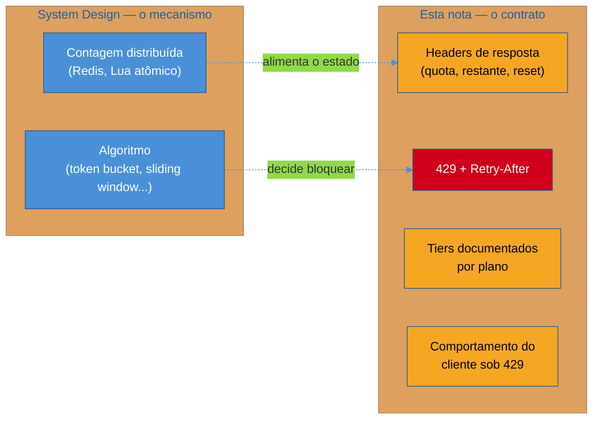
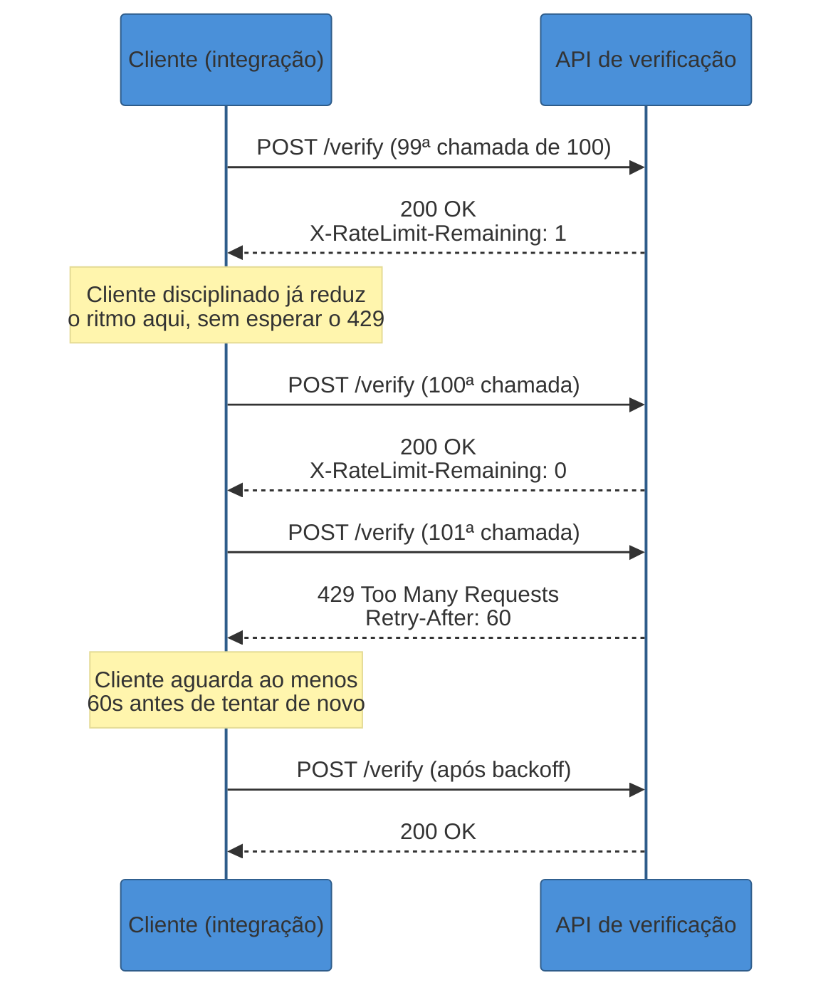
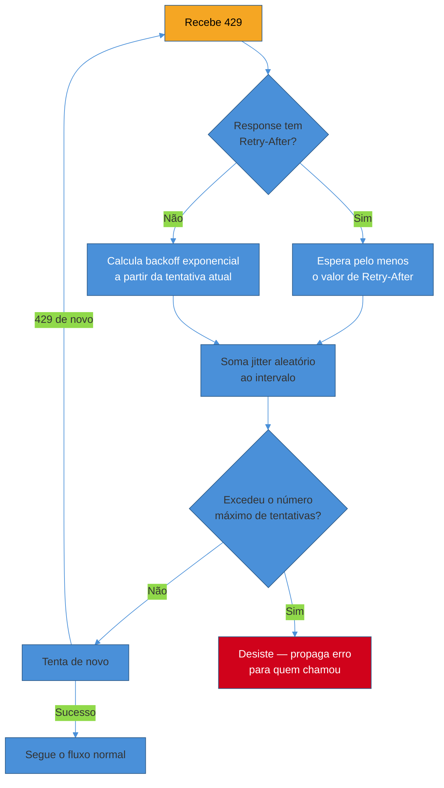

# Rate limiting como contrato

> [!abstract] TL;DR
> Esta nota **não** explica como implementar rate limiting — token bucket, sliding window e a contagem distribuída em Redis já têm casa em [[03-Dominios/Engenharia/Arquitetura/System Design/3 - Padrões recorrentes/04 - Rate Limiting|System Design — Rate Limiting]]. O que falta ali é o outro lado da mesma decisão: rate limiting não é só um componente de infraestrutura que o servidor roda internamente, é uma promessa que a API faz ao cliente — quantas chamadas ele tem direito de fazer, quanto ainda resta, quando o contador reseta, e o que fazer quando o limite estoura. Um servidor pode implementar o algoritmo mais sofisticado do mundo internamente e ainda quebrar essa promessa se devolver um `429` sem `Retry-After`, sem informar quanto resta, ou — pior — sem nunca dizer nada até o cliente já ter estourado o limite. O padrão consolidado de mercado (GitHub, Stripe, Twitter/X) é expor o estado da cota em todo response via headers (`X-RateLimit-*`, hoje convergindo para o padrão IETF `RateLimit`/`RateLimit-Policy`, ainda em draft em 2026), sinalizar excesso com `429 Too Many Requests` + `Retry-After`, e documentar tiers por plano. Do lado do cliente, o contrato exige reciprocidade: reagir a `429` com **backoff exponencial com jitter**, nunca com retry imediato — porque retry sem backoff, sob rate limit, não é resiliência, é o próprio cliente martelando um portão fechado até o resto do sistema também cair.

Um time de integração acaba de conectar o backend da plataforma de marketplace de saúde — a mesma que expõe REST na borda pública ao longo desta trilha — a uma API externa de verificação de documentos, usada no fluxo de cadastro de novos profissionais de saúde. O código que consome essa API é simples: um loop que, para cada profissional pendente de verificação, dispara um `POST /verify` e, se a resposta não vier `200` dentro de 5 segundos, tenta de novo imediatamente — sem esperar, sem limite de tentativas. Funciona perfeitamente em desenvolvimento, com um profissional de cada vez.

Em produção, num dia de pico de cadastros, o volume sobe e a API externa começa a responder `429 Too Many Requests` para uma fração das chamadas — um comportamento absolutamente normal e esperado de qualquer API com rate limiting, a própria razão de existir do mecanismo. O problema não está na API externa, está no cliente: o loop, ao ver `429` em vez de `200`, trata como qualquer outro erro transitório e tenta de novo **imediatamente**, sem olhar se a resposta trouxe alguma instrução de quanto esperar. Cada retry imediato consome mais uma unidade da cota já estourada, o que gera outro `429`, que gera outro retry, numa espiral que não apenas falha para aquele profissional específico — mantém o cliente inteiro preso batendo contra um limite que só cresce, e que, em APIs com política de banimento temporário por abuso repetido, pode escalar de "atrasado" para "bloqueado" em minutos.

Esse incidente não nasceu de rate limiting mal implementado do lado do servidor — nasceu de um **contrato mal lido do lado do cliente**. E é exatamente aqui que esta nota se diferencia da irmã em System Design: lá, a pergunta é "como o servidor decide, internamente, quando bloquear uma requisição". Aqui, a pergunta é "o que o servidor expõe pra fora sobre essa decisão, e o que o cliente precisa fazer com essa informação para não amplificar o próprio problema que o rate limit existe para conter".

## O que muda de perspectiva: componente interno vs promessa externa

[[03-Dominios/Engenharia/Arquitetura/System Design/3 - Padrões recorrentes/04 - Rate Limiting|A nota de System Design]] já cobriu as cinco famílias de algoritmo — token bucket, leaky bucket, fixed window, sliding window log, sliding window counter — e o desafio de contar de forma consistente entre múltiplos nós via Redis. Esse conhecimento não se repete aqui. O que muda é o observador: system design pergunta "como o rate limiter decide", esta nota pergunta "o que a API comunica sobre essa decisão, e como um cliente bem-comportado reage a ela" — a mesma cerca vista de dentro (quem constrói o limitador) versus de fora (quem consome a API e precisa se comportar diante dela).



> [!question]- Se o algoritmo já está resolvido em outro lugar, por que essa nota precisa existir separadamente — não bastava um parágrafo a mais na nota de System Design?
> Porque o público e a pergunta que motivam cada nota são diferentes, mesmo compartilhando o mesmo mecanismo de fundo. A nota de System Design serve quem está *projetando* o rate limiter — a pergunta é de capacidade, precisão de contagem, custo de memória, consistência distribuída. Esta nota serve quem está *desenhando o contrato* que qualquer cliente (interno ou de terceiros) vai consumir, ou quem está *escrevendo o cliente* que precisa se comportar bem diante de um `429` alheio — perguntas de design de API e de engenharia de cliente HTTP, não de infraestrutura de contagem. Um engenheiro pode dominar profundamente sliding window counter e ainda devolver um `429` sem `Retry-After`, porque nunca parou para pensar no que o cliente do outro lado precisa saber. São competências adjacentes, mas distintas — e é por isso que a trilha de Comunicação entre Sistemas trata o contrato como assunto próprio, separado da trilha de System Design, que trata da engenharia por trás dele.

## Os headers: comunicando a cota antes que ela estoure

O erro de design mais comum em APIs que fazem rate limiting mal é tratar o `429` como a única forma de comunicação sobre o limite — o cliente só descobre que existe uma cota no momento em que já a violou. Uma API bem desenhada informa o estado da cota em **toda resposta**, sucesso ou erro, para que um cliente bem-comportado consiga se autorregular antes de bater no teto.

O padrão de fato mais difundido em produção — usado por GitHub, Twitter/X, e a maioria das APIs REST públicas — é a família de headers prefixados `X-RateLimit-`:

```http
HTTP/1.1 200 OK
X-RateLimit-Limit: 5000
X-RateLimit-Remaining: 4987
X-RateLimit-Reset: 1720549200
```

Na API do GitHub, por exemplo, `X-RateLimit-Limit` informa o teto por hora (5.000 requisições por hora para chamadas autenticadas, 60 para não autenticadas), `X-RateLimit-Remaining` quantas ainda restam na janela atual, e `X-RateLimit-Reset` o timestamp Unix em que o contador zera de novo ([GitHub Docs, *Rate limits for the REST API*](https://docs.github.com/en/rest/using-the-rest-api/rate-limits-for-the-rest-api)). O detalhe que separa uma integração ingênua de uma robusta: um cliente disciplinado não espera o `429` para agir — ele observa `X-RateLimit-Remaining` chegando perto de zero e passa a espaçar as próprias chamadas antes de estourar, numa forma de rate limiting cooperativo do lado do cliente.

O `X-RateLimit-` não é, porém, um padrão formal — é uma convenção de fato, nascida de implementações independentes que convergiram no mesmo prefixo por imitação de mercado, sem especificação central. Isso trouxe a mesma fragmentação que a nota de Idempotência descreveu para `Idempotency-Key`: cada provedor varia detalhes. A **Stripe**, por exemplo, não usa `X-RateLimit-*` — em vez disso devolve um `429` acompanhado de um header proprietário, `Stripe-Rate-Limited-Reason`, que explica *qual* limite foi violado (a Stripe aplica limites diferentes para leitura, escrita e endpoints específicos, além de um limite de concorrência separado do limite de taxa — quantas requisições estão em voo simultaneamente, não quantas por segundo) ([Stripe Docs, *Rate limits*](https://docs.stripe.com/rate-limits)).

### O padrão IETF em formação: `RateLimit` e `RateLimit-Policy`

Como no caso do `Idempotency-Key`, existe hoje um esforço formal de padronização — o draft `draft-ietf-httpapi-ratelimit-headers`, do mesmo grupo de trabalho HTTPAPI do IETF, já na revisão 11 em maio de 2026, com status Standards Track ainda não convertido em RFC final ([IETF Datatracker, *draft-ietf-httpapi-ratelimit-headers-11*](https://datatracker.ietf.org/doc/html/draft-ietf-httpapi-ratelimit-headers)). Diferente do `X-RateLimit-*` de fato, o draft define apenas dois campos — `RateLimit` (estado atual da cota) e `RateLimit-Policy` (a política declarada) — com uma sintaxe estruturada de parâmetros nomeados em vez de três headers separados:

```http
HTTP/1.1 200 OK
RateLimit: "default";r=4987;t=1800
RateLimit-Policy: "default";q=5000;w=3600
```

Onde `q` é a cota total alocada pela política, `w` a janela em segundos, `r` a quantidade de unidades de cota ainda disponíveis, e `t` a janela efetiva restante em segundos até o reset. O draft também define um parâmetro `pk` (partition key) opcional, para APIs que aplicam cotas separadas por recurso ou por identidade dentro do mesmo endpoint — por exemplo, um limite por chave de API e outro, mais amplo, por organização inteira — e um parâmetro `qu` para nomear a unidade da cota quando ela não é simplesmente "número de requisições" (pode ser `content-bytes`, `concurrent-requests`, entre outras) ([IETF, *RateLimit header fields for HTTP*, draft-11](https://datatracker.ietf.org/doc/html/draft-ietf-httpapi-ratelimit-headers)).

| Aspecto | `X-RateLimit-*` (de fato) | `RateLimit`/`RateLimit-Policy` (IETF draft) |
|---|---|---|
| Status | Convenção de mercado, sem spec formal | Internet-Draft, Standards Track, ainda não é RFC (2026) |
| Número de headers | 3 (Limit, Remaining, Reset) | 2 (estado + política) |
| Formato do valor | Inteiros simples | Parâmetros estruturados nomeados (`q`, `w`, `r`, `t`, `pk`, `qu`) |
| Multi-cota no mesmo response | Não nativo — geralmente um conjunto por endpoint | Nativo via múltiplos itens na lista, um por partição |
| Adoção real em 2026 | Ampla (GitHub, Twitter/X, maioria das APIs REST) | Ainda incipiente — a maioria das APIs em produção segue `X-RateLimit-*` |

> [!question]- Vale a pena adotar o header IETF em uma API nova hoje, mesmo ainda em draft?
> Depende do público. Se a API é consumida majoritariamente por clientes que você controla (mobile app próprio, outros serviços internos), o custo de adotar o padrão em formação é baixo e a mudança futura para RFC final tende a ser incremental. Se a API é pública e consumida por integradores de terceiros que já esperam `X-RateLimit-*` por convenção de mercado — o padrão que praticamente toda ferramenta de client HTTP e biblioteca de rate-limit-aware retry já sabe interpretar —, expor **os dois** simultaneamente (o de fato e o formal) durante a transição é uma estratégia razoável, exatamente como muitas APIs de pagamento hoje expõem tanto `Idempotency-Key` quanto variações proprietárias. O ponto que não muda independente da escolha: informar a cota em toda resposta, não só no momento da violação, é o que importa — o formato específico do header é um detalhe de codificação sobre esse princípio.

## O 429: o momento em que o contrato é rompido, com aviso

Quando a cota estoura, a resposta correta — endossada tanto pela convenção de mercado quanto pela própria especificação HTTP — é `429 Too Many Requests`, definido originalmente pela RFC 6585 (*Additional HTTP Status Codes*, 2012) especificamente para esse cenário: o usuário enviou requisições demais num intervalo de tempo. O código sozinho, porém, não é suficiente — o que transforma um `429` de "porta fechada sem explicação" em "aviso acionável" é o header `Retry-After`.

```http
HTTP/1.1 429 Too Many Requests
Retry-After: 60
Content-Type: application/problem+json

{
  "type": "https://api.marketplace-saude.example/errors/rate-limit-exceeded",
  "title": "Rate limit exceeded",
  "status": 429,
  "detail": "Limite de 1000 requisições por hora excedido para este cliente.",
  "instance": "/verify"
}
```

`Retry-After` está formalmente definido pela RFC 9110 (a consolidação atual da semântica HTTP) e aceita duas formas de valor — um número de segundos (`Retry-After: 60`) ou uma data HTTP absoluta no formato IMF-fixdate (`Retry-After: Wed, 09 Jul 2026 14:30:00 GMT`) ([RFC 9110, §10.2.3 — *Retry-After*](https://www.rfc-editor.org/rfc/rfc9110.html)). Um bug de parsing comum e fácil de evitar: bibliotecas de cliente que assumem cegamente que o valor é sempre um inteiro em segundos quebram silenciosamente no dia em que a API decide (ou já decide, dependendo do provedor) enviar uma data — o parsing precisa checar o formato antes de interpretar.

O corpo do erro no exemplo acima segue o formato `application/problem+json`, definido pela RFC 9457 (*Problem Details for HTTP APIs*, que substitui a RFC 7807 anterior) — um vocabulário padronizado de `type`/`title`/`status`/`detail`/`instance` para erros de API, que evita cada API inventar o próprio formato de erro do zero ([RFC 9457, *Problem Details for HTTP APIs*](https://www.rfc-editor.org/rfc/rfc9457.html)). Não é obrigatório usar esse formato especificamente para rate limiting — mas, dado que a API já precisa comunicar um erro estruturado, alinhar com um padrão existente em vez de inventar `{"error_code": "RATE_LIMITED", "msg": "..."}` do zero reduz o atrito de quem integra com múltiplas APIs ao longo da carreira.



> [!warning] `429` sem `Retry-After` transfere um custo de coordenação para o cliente
> **O que acontece:** a API devolve `429 Too Many Requests` mas não inclui `Retry-After` — só o código de status, sem nenhuma pista de quanto tempo esperar.
> **Por quê:** sem essa informação, o cliente é forçado a adivinhar o intervalo de espera — e implementações ingênuas tendem a escolher um valor curto demais (retentando cedo demais, prolongando o próprio bloqueio) ou hardcoded (um `sleep(5)` fixo que não reflete a janela real da API, funcionando bem para um limite e mal para outro). Em escala, isso multiplica o problema: dezenas de clientes de terceiros, cada um adivinhando um intervalo diferente, geram um padrão de tráfego caótico contra o mesmo endpoint, exatamente o oposto do que o rate limit deveria produzir.
> **Como evitar:** sempre incluir `Retry-After` em toda resposta `429` — mesmo que o valor seja uma estimativa conservadora derivada da janela do algoritmo interno (token bucket, sliding window, o que quer que esteja rodando por trás). O custo de calcular e expor esse valor é baixo; o custo de não expor recai inteiro sobre os clientes, multiplicado pelo número de integrações.

## Tiers: comunicando limites diferentes por plano

Rate limiting raramente é um número único e fixo para toda a base de clientes — a maioria das APIs comerciais usa tiers, onde o limite varia por plano contratado, e às vezes por categoria de operação dentro do mesmo plano. A Stripe é um exemplo bem documentado: em modo live, o limite básico é de 100 operações de leitura e 100 de escrita por segundo por conta, com a opção de negociar limites maiores (até a casa de dezenas de milhares por segundo) para contas de alto volume via contato comercial; o ambiente de teste (sandbox) opera com uma fração desses limites — um quarto dos valores de produção ([Stripe Docs, *Rate limits*](https://docs.stripe.com/rate-limits)). O GitHub segue o mesmo princípio de tier por identidade: 60 requisições/hora para chamadas não autenticadas, 5.000/hora para chamadas autenticadas com um usuário comum, e 15.000/hora para GitHub Apps operando em nome de organizações Enterprise Cloud ([GitHub Docs, *Rate limits for the REST API*](https://docs.github.com/en/rest/using-the-rest-api/rate-limits-for-the-rest-api)).

O que muda de design, do ponto de vista do contrato, não é o algoritmo por trás de cada tier — é **como a diferença é comunicada**. Três decisões concretas que uma API com tiers precisa tomar de forma explícita, não implícita:

1. **O limite do tier aparece nos headers de toda resposta**, não só na documentação estática — um cliente no plano "Starter" que faz upgrade para "Pro" deveria ver `X-RateLimit-Limit` refletir o novo teto na próxima chamada, sem precisar consultar uma página separada para saber se o upgrade já "pegou".
2. **A distinção entre limites por endpoint e limites globais é nomeada.** O GitHub separa explicitamente rate limit primário (teto por hora) de rate limit secundário (comportamentos como concorrência excessiva, sem um contador consultável) — um cliente que só monitora `X-RateLimit-Remaining` pode ser bloqueado por um limite secundário sem nenhum aviso prévio nos headers, porque esse tipo de limite não é exposto da mesma forma ([GitHub Docs, *Rate limits for the REST API*](https://docs.github.com/en/rest/using-the-rest-api/rate-limits-for-the-rest-api)).
3. **A resposta ao excesso é consistente entre tiers**, mesmo que o número mude — `429` + `Retry-After` continuam sendo o vocabulário, independente de o limite estourado ser de 60/hora ou de 100.000/segundo. Inconsistência aqui (um tier retornando `403` para excesso, outro `429`) força cada integração a tratar cada plano como um caso especial.

## O outro lado do contrato: o que se espera do cliente

Até aqui, esta nota tratou do que o **servidor** expõe. Mas um contrato tem duas partes — e a metade que mais frequentemente falha na prática, causando o tipo de incidente descrito na abertura, é o comportamento esperado do **cliente** diante de um `429`.

A resposta correta não é "parar de tentar" nem "tentar de novo imediatamente" — é **backoff exponencial com jitter**: esperar um intervalo que cresce a cada tentativa consecutiva (1s, 2s, 4s, 8s...), com um componente aleatório somado para evitar que múltiplos clientes, todos bloqueados ao mesmo tempo pelo mesmo motivo, sincronizem as próprias tentativas de retry e gerem um novo pico simultâneo no momento exato em que a janela reabre — o problema conhecido como *thundering herd* ([AWS Prescriptive Guidance, *Retry with backoff pattern*](https://docs.aws.amazon.com/prescriptive-guidance/latest/cloud-design-patterns/retry-backoff.html)).



Três regras práticas, na ordem de prioridade que um cliente de produção deveria seguir:

- **`Retry-After`, quando presente, tem prioridade sobre qualquer cálculo próprio de backoff** — o servidor conhece a própria janela interna melhor do que qualquer heurística que o cliente possa inferir de fora; ignorar o valor recebido e aplicar um backoff genérico mais curto reintroduz o mesmo risco que o header existe para prevenir.
- **Sempre limitar o número máximo de tentativas** (tipicamente entre 3 e 5) — sem um teto, um serviço genuinamente indisponível por tempo prolongado prende a requisição original num loop de espera crescente indefinidamente, consumindo recursos do próprio cliente sem nunca desistir e propagar o erro para quem precisa decidir o que fazer a seguir (avisar o usuário, enfileirar para retry manual, etc.) ([Zuplo, *HTTP 429 Too Many Requests: Causes, Headers & Retry Logic*](https://zuplo.com/learning-center/http-429-too-many-requests-guide)).
- **Retry sob `429` só é seguro se a operação for idempotente** — a mesma disciplina descrita em [[01 - Idempotência|Idempotência]] se aplica aqui: se o `POST` que sofreu o `429` não carrega uma chave de idempotência, reenviá-lo cegamente após o backoff corre o mesmo risco de duplicação já discutido naquela nota, independente do motivo original do retry ser timeout de rede ou rate limit.

> [!question]- Por que não simplesmente sempre esperar o valor de `Retry-After` e nunca calcular backoff exponencial por conta própria — não seria mais simples confiar cegamente no servidor?
> Porque `Retry-After` só existe quando a API o envia — e nem toda API que faz rate limiting inclui esse header de forma consistente (a convenção `X-RateLimit-*`, por não ser padronizada, tem adoção desigual desse detalhe específico entre implementações). Um cliente robusto precisa de um plano B: quando `Retry-After` está ausente, cair para um backoff exponencial calculado localmente é a alternativa razoável — daí a ordem de prioridade "use `Retry-After` se existir, senão calcule". Depender cegamente só do header deixa o cliente sem defesa nenhuma contra APIs (inclusive internas, mal implementadas por outro time) que devolvem `429` sem essa cortesia.

## Casos práticos

**Integração corrigida: de retry cego a backoff cooperativo.** Retomando o incidente da abertura — o time responsável pela integração de verificação de documentos reescreve o loop de chamadas para primeiro checar `X-RateLimit-Remaining` a cada resposta bem-sucedida, reduzindo proativamente o ritmo de disparo quando o valor cai abaixo de um piso de segurança (por exemplo, 10% da cota), e para tratar `429` com um backoff exponencial que respeita `Retry-After` quando presente, com um teto de 5 tentativas antes de enfileirar o profissional pendente para reprocessamento manual em vez de insistir indefinidamente. O volume de `429` recebidos cai a praticamente zero nos dias seguintes — não porque o volume de chamadas mudou, mas porque o cliente parou de se comportar como o próprio gatilho do problema que o rate limit existia para conter.

**Tier documentado incorretamente causando surpresa em produção.** Uma API interna do marketplace expõe limites diferentes por tier de parceiro (clínicas pequenas vs. redes de hospitais), mas só documenta esses números numa página de portal do desenvolvedor, sem refletir o valor real nos headers `X-RateLimit-Limit` de cada resposta — o header sempre mostra o mesmo número genérico, desatualizado desde antes da segmentação por tier existir. Um parceiro grande, com limite contratado de 10.000 requisições/hora, monitora o header (que mostra incorretamente 1.000) e passa a implementar throttling client-side mais agressivo do que o necessário, subutilizando a própria cota contratada — um bug de contrato que não gera erro nenhum, só desperdício silencioso de capacidade que o cliente pagou para ter.

## Em entrevista

Uma pergunta comum é "como uma API deveria se comunicar quando um cliente excede o rate limit?" — e a resposta que só nomeia "`429`" fica na superfície. Uma resposta mais completa nomeia o par `429` + `Retry-After` como o mínimo, e vai além: "a API deveria expor o estado da cota em toda resposta, não só no momento do estouro — headers como `X-RateLimit-Remaining` permitem que um cliente bem-comportado reduza o próprio ritmo antes de bater no limite, em vez de descobrir o problema só quando já violou o contrato."

Um segundo sinal de profundidade é reconhecer a fragmentação de convenções — "`X-RateLimit-*` é o padrão de fato mais usado hoje, mas não é formal; existe um draft do IETF (`RateLimit`/`RateLimit-Policy`) tentando padronizar isso, ainda não é RFC" — porque mostra familiaridade com o estado real do ecossistema, não uma resposta memorizada de um único formato.

Um terceiro sinal, o que mais frequentemente separa quem já operou uma integração real de quem só leu sobre o assunto, é nomear a metade do contrato que pertence ao **cliente**: "receber um `429` não é motivo para retentar imediatamente — o comportamento correto é backoff exponencial com jitter, respeitando `Retry-After` quando presente, com um teto de tentativas — porque um cliente que retenta sem espaçar contra um rate limit não está sendo resiliente, está amplificando exatamente o problema que o rate limit existe para conter." E, se a conversa avançar para o algoritmo por trás do rate limiter em si — token bucket, sliding window, a contagem distribuída via Redis — essa é a hora de nomear explicitamente que esse é um tópico separado, de system design, não de design de contrato de API.

## How to explain in English

> "Rate limiting has two sides that get conflated. The algorithm side — token bucket, sliding window, distributed counting across nodes — is a system design problem: how the server decides, internally, when to throttle. The contract side is different: what the API exposes to the outside world about that decision, and what a well-behaved client is supposed to do with it. A server can implement the most sophisticated rate limiter in the world and still break the contract if it returns a bare `429` with no `Retry-After`, no indication of remaining quota, or worse, no signal at all until the client has already blown past the limit.
>
> The de facto standard is exposing quota state on every response via headers — `X-RateLimit-Limit`, `X-RateLimit-Remaining`, `X-RateLimit-Reset` — so a disciplined client throttles itself before hitting the wall, not after. There's also a formal IETF effort in progress, `RateLimit`/`RateLimit-Policy`, still a draft as of 2026, using structured parameters instead of three separate headers — but most production APIs today still follow the `X-RateLimit-*` convention. When the limit is exceeded, the response should be `429 Too Many Requests` with a `Retry-After` header — either delay-seconds or an HTTP-date — so the client isn't left guessing how long to wait.
>
> The other half of the contract, and the one that actually causes production incidents, is client behavior: on receiving a `429`, the correct response is exponential backoff with jitter — never an immediate retry, and never a fixed backoff shared by every client, because that synchronizes retries into a new spike right when the window reopens. `Retry-After`, when present, takes priority over any client-side backoff calculation, because the server knows its own window better than any external heuristic. And if the request being retried isn't idempotent, the same discipline from idempotency keys applies — a blind retry under rate limiting carries the exact same duplication risk as a blind retry under a network timeout."

| PT | EN |
|----|----|
| Limite de requisições | Rate limit |
| Cota | Quota |
| Cota restante | Remaining quota |
| Reset da janela | Window reset |
| Excesso de requisições | Rate limit exceeded / throttling |
| Recuo exponencial | Exponential backoff |
| Ruído aleatório (anti-sincronização) | Jitter |
| Efeito manada (retries sincronizados) | Thundering herd |
| Limite por plano/nível | Tier-based limit |
| Limite de concorrência | Concurrency limit |
| Cliente bem-comportado | Well-behaved client |
| Draft de padronização IETF | IETF standardization draft |

## O que vem a seguir

Esta nota tratou de como o contrato se comunica quando ele diz "não" — o vocabulário de headers, o `429`, e a reciprocidade esperada do cliente. A última peça da confiabilidade do contrato trata do outro extremo: operações que não terminam na hora, e como o contrato precisa se ajustar quando a resposta imediata simplesmente não existe — `202 Accepted` seguido de polling, webhooks com assinatura e retry, e o que muda quando quem confirma o resultado deixa de ser o cliente que perguntou.

- [[05 - Webhooks e operações assíncronas|Webhooks e operações assíncronas]] — 202 Accepted + polling, webhooks (HMAC, retry, dedup), bulk operations

## Veja também

- [[Comunicação entre Sistemas/index|Comunicação entre Sistemas]] — o galho-pai desta trilha
- [[3 - Confiabilidade do contrato/index|Confiabilidade do contrato]] — MOC deste sub-galho
- [[03 - Caching HTTP e requisições condicionais|Caching HTTP e requisições condicionais]] — nota anterior deste sub-galho
- [[03-Dominios/Engenharia/Arquitetura/System Design/3 - Padrões recorrentes/04 - Rate Limiting|Rate Limiting (System Design)]] — os algoritmos e a contagem distribuída por trás desta nota
- [[01 - Idempotência|Idempotência]] — a mesma disciplina de retry seguro se aplica ao reenviar após um `429`

## Fontes

- IETF Datatracker — [*draft-ietf-httpapi-ratelimit-headers-11*](https://datatracker.ietf.org/doc/html/draft-ietf-httpapi-ratelimit-headers) (acessado 2026-07-09) — draft de padronização dos headers `RateLimit`/`RateLimit-Policy`, versão 11 de maio de 2026.
- GitHub Docs — [*Rate limits for the REST API*](https://docs.github.com/en/rest/using-the-rest-api/rate-limits-for-the-rest-api) (acessado 2026-07-09) — headers `X-RateLimit-*`, distinção entre limite primário e secundário, tiers por tipo de autenticação.
- Stripe Docs — [*Rate limits*](https://docs.stripe.com/rate-limits) (acessado 2026-07-09) — tiers por plano/modo, `Stripe-Rate-Limited-Reason`, limite de concorrência separado do limite de taxa.
- RFC 6585 — [*Additional HTTP Status Codes*](https://www.rfc-editor.org/rfc/rfc6585) — definição original do status `429 Too Many Requests`.
- RFC 9110 — [*HTTP Semantics*, §10.2.3 Retry-After](https://www.rfc-editor.org/rfc/rfc9110.html) — sintaxe formal do header `Retry-After` (delay-seconds ou HTTP-date).
- RFC 9457 — [*Problem Details for HTTP APIs*](https://www.rfc-editor.org/rfc/rfc9457.html) (acessado 2026-07-09) — formato `application/problem+json`, sucessor da RFC 7807.
- AWS Prescriptive Guidance — [*Retry with backoff pattern*](https://docs.aws.amazon.com/prescriptive-guidance/latest/cloud-design-patterns/retry-backoff.html) (acessado 2026-07-09) — backoff exponencial com jitter, mitigação de thundering herd.
- Zuplo — [*HTTP 429 Too Many Requests: Causes, Headers & Retry Logic*](https://zuplo.com/learning-center/http-429-too-many-requests-guide) (acessado 2026-07-09) — boas práticas de retry do lado do cliente, teto de tentativas.
- [[03-Dominios/Engenharia/Arquitetura/System Design/3 - Padrões recorrentes/04 - Rate Limiting]] — algoritmos e contagem distribuída, fronteira explícita com esta nota.
- [[03-Dominios/Engenharia/Comunicação entre Sistemas/API Design]] — seção "Rate limiting em APIs", conteúdo-base reforçado e expandido nesta nota.
