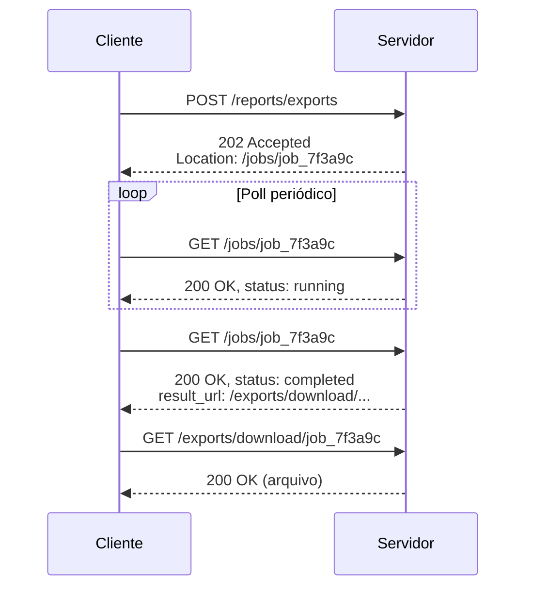
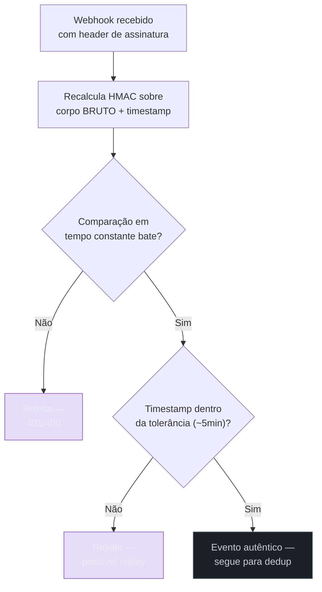

# Webhooks e operações assíncronas

> [!abstract] TL;DR
> Nem toda resposta cabe num request-response síncrono. Quando uma operação leva mais que alguns segundos (exportar um relatório, processar um pagamento em lote, gerar um vídeo), o servidor não pode segurar a conexão HTTP aberta esperando — ele responde `202 Accepted` de imediato e devolve um identificador de acompanhamento; o cliente então **puxa** o resultado periodicamente (*polling*) ou o servidor **empurra** o resultado quando fica pronto, via **webhook**. Um webhook é o inverso de uma API normal: em vez de o cliente chamar você, você vira o cliente e chama o sistema de quem contratou a integração — o que significa herdar, de graça, todos os problemas de confiabilidade de um cliente HTTP real (timeout, endpoint fora do ar, resposta lenta) só que agora do lado de quem estava acostumado a ser o servidor. Isso exige assinatura criptográfica pra provar autenticidade (HMAC com timestamp, contra replay), retry com backoff exponencial pra sobreviver a indisponibilidade momentânea do consumidor, deduplicação via ID do evento porque o mesmo evento pode chegar mais de uma vez, e um plano B explícito (dead letter + replay manual) pra quando tudo isso falha mesmo assim. Um terceiro padrão, bulk operations, resolve o problema simétrico — processar N itens numa única chamada — com a mesma pergunta de fundo por trás: o que acontece quando parte do lote falha e parte funciona? Os três padrões compartilham uma tensão comum: **o contrato síncrono promete uma resposta imediata que a operação de fato não tem**, e cada padrão é uma forma diferente de administrar esse descompasso sem mentir para o cliente sobre o estado real das coisas.

Uma healthtech de médio porte processa reembolsos de plano de saúde via um sistema de pagamento de terceiros — o fluxo é: a clínica submete o reembolso pela API da healthtech, a healthtech repassa pro provedor de pagamento, e quando o provedor termina de processar (o que pode levar de segundos a minutos, dependendo do banco emissor), ele dispara um webhook de volta pra healthtech confirmando o resultado. Um sábado de manhã, um deploy rotineiro no provedor de pagamento derruba o endpoint de webhook da healthtech por 40 minutos — nada dramático, um certificado TLS expirado num load balancer, corrigido rápido. O provedor de pagamento, como qualquer sistema de webhook bem desenhado, reenviou os eventos que falharam durante a janela de indisponibilidade, com backoff exponencial, e todos chegaram eventualmente. O problema não foi a perda de dados — foi o **silêncio**: ninguém no time da healthtech percebeu a janela de 40 minutos, porque não existia alerta configurado para "endpoint de webhook respondendo erro" — só para "API principal fora do ar", que nunca chegou a cair. Os reembolsos ficaram em estado `pending` no banco da healthtech por até uma hora até os retries do provedor os resolverem, e o primeiro sinal de que algo tinha acontecido foi um ticket de suporte de uma clínica perguntando por que o status do reembolso dela "sumiu" por quase uma hora. Nada quebrou de forma permanente — mas o incidente expôs que o time tinha construído o *happy path* do webhook (receber, validar assinatura, processar) sem construir a disciplina operacional em volta dele: monitoramento do próprio endpoint receptor, alertas de fila de retry crescendo, e um dashboard pra saber, sem grep de log, quantos eventos estavam pendentes de reentrega. É exatamente esse gap — entre "o padrão funciona no design" e "o padrão sobrevive a um sábado de manhã com certificado vencido" — que esta nota tenta fechar.

## O primeiro padrão: 202 Accepted e polling

A forma mais simples de lidar com uma operação que não cabe num request-response síncrono é não fingir que ela cabe. Em vez de o cliente esperar, com a conexão HTTP aberta, até a operação terminar — o que é frágil (qualquer timeout de proxy, load balancer ou biblioteca HTTP no meio do caminho derruba a conexão antes da resposta chegar) e caro (mantém um worker do servidor ocupado pelo tempo inteiro da operação) —, o servidor aceita o pedido, devolve uma resposta imediata reconhecendo que o trabalho começou, e deixa o cliente decidir como e quando checar o resultado.

O código de status que existe especificamente para isso, definido desde as primeiras versões do HTTP e reafirmado pela RFC 9110 (a especificação atual de semântica HTTP), é o `202 Accepted`: a requisição foi aceita para processamento, mas o processamento ainda não terminou — e não há garantia, no próprio protocolo, de que vá terminar com sucesso ([RFC 9110, §15.3.3](https://www.rfc-editor.org/rfc/rfc9110.html#name-202-accepted)).

```http
POST /reports/exports HTTP/1.1
Content-Type: application/json

{ "format": "csv", "date_range": "2026-06" }
```

```http
HTTP/1.1 202 Accepted
Location: /jobs/job_7f3a9c

{ "job_id": "job_7f3a9c", "status": "pending" }
```

A partir daí, o cliente consulta o recurso de acompanhamento — apontado pelo header `Location`, seguindo a mesma convenção usada em `201 Created` para apontar pro recurso recém-criado — periodicamente, até o status mudar de `pending`/`running` para um estado terminal:

```http
GET /jobs/job_7f3a9c HTTP/1.1
```

```http
HTTP/1.1 200 OK

{ "job_id": "job_7f3a9c", "status": "running", "progress": 45 }
```

```http
HTTP/1.1 200 OK

{ "job_id": "job_7f3a9c", "status": "completed", "result_url": "/exports/download/job_7f3a9c" }
```



Duas diretrizes de mercado — a Azure Architecture Center, no que chama de *Asynchronous Request-Reply Pattern*, e as diretrizes de API do Google Cloud/Fabric — convergem no mesmo desenho: o recurso de acompanhamento (`Operation`, `job`) tem um identificador, um status, e opcionalmente um resultado ou erro; enquanto a operação está em andamento, o endpoint de status responde `200 OK` com o status intermediário (nunca `202` de novo — o `202` é só a resposta ao `POST` inicial); e quando termina, o servidor pode tanto embutir o resultado direto na resposta do status quanto redirecionar, via `303 See Other`, para um recurso de resultado separado — `303` sinaliza corretamente ao cliente "vá buscar isso com `GET`", diferente de um redirect genérico que poderia reenviar o método original ([Microsoft Learn, *Asynchronous Request-Reply Pattern*](https://learn.microsoft.com/en-us/azure/architecture/patterns/asynchronous-request-reply); [Google AIP-151, *Long-running operations*](https://google.aip.dev/151)).

Um detalhe de design que aparece com frequência em entrevista: **10 segundos** é a régua informal mais citada como limiar entre "resposta síncrona aceitável" e "isso precisa virar operação assíncrona" — não é uma regra do protocolo, é uma heurística de experiência do usuário, adotada explicitamente pelo Google AIP como ponto de partida ("*a good rule of thumb is 10 seconds*") e reforçada por múltiplos guias de API design de mercado. Abaixo disso, um cliente esperando a resposta ainda é uma experiência razoável; acima, a percepção de "travou" começa, e seguir bloqueando a conexão é o design errado.

> [!question]- Por que não simplesmente devolver `200 OK` com um corpo `{ "status": "processing" }` em vez de `202 Accepted`?
> Porque `200 OK` promete, pela própria semântica do protocolo, que a requisição foi processada com sucesso — e "aceitei seu pedido mas ainda não fiz nada" não é a mesma afirmação que "processei seu pedido". Ferramentas de observabilidade, proxies, e o próprio cliente HTTP tomam decisões diferentes baseadas no código de status: um `200` sinaliza "pode seguir em frente", enquanto um `202` sinaliza explicitamente "isso ainda não terminou, volte depois". Usar `200` para uma operação pendente é o tipo de atalho que funciona nos testes (onde ninguém está checando o código de status com rigor) e confunde qualquer cliente automatizado que trata `2xx` como sinônimo de sucesso definitivo — inclusive ferramentas de retry, que podem decidir "não preciso reprocessar isso, já veio `200`" quando na verdade a operação nem começou de verdade.

O padrão de polling tem um limite prático que vale nomear: ele funciona bem quando o cliente **pode esperar** e tem controle sobre o próprio loop de consulta, mas escala mal quando existem muitos clientes esperando por muitos jobs simultaneamente — cada poll é uma requisição HTTP inteira, com toda a sobrecarga de conexão, autenticação e roteamento que isso implica, multiplicada pelo intervalo de checagem. É exatamente esse custo que os outros dois padrões mencionados na literatura — webhook e Server-Sent Events/WebSocket — existem para evitar, cada um trocando "o cliente pergunta repetidamente" por "o servidor avisa quando muda", com trade-offs próprios. SSE e WebSocket, para atualização em tempo real de progresso, já foram tratados em [[4 - Comunicação em tempo real|Comunicação em tempo real]] no primeiro sub-galho desta trilha; esta nota foca no terceiro caminho — o servidor empurrando o resultado via uma nova requisição HTTP, de servidor para servidor.

## O segundo padrão: webhooks

Um webhook inverte o papel que toda a trilha até aqui assumiu como fixo: até agora, "seu sistema" era sempre o servidor, recebendo requisições de clientes. No modelo de webhook, seu sistema **vira o cliente** — ele é quem inicia a conexão HTTP, contra um servidor que pertence a quem se inscreveu para receber notificações. É o mesmo protocolo, a mesma semântica de request-response, só que com os papéis trocados: o "seu backend" de sempre não recebe mais nada, ele **envia**.

```http
POST https://cliente.com/webhooks/pagamentos HTTP/1.1
Content-Type: application/json
X-Webhook-Event: payment.succeeded
X-Webhook-Id: evt_8f2a1c9d
X-Webhook-Signature: t=1720540800,v1=3d5e7f...

{
  "id": "evt_8f2a1c9d",
  "type": "payment.succeeded",
  "created_at": "2026-07-09T14:20:00Z",
  "data": {
    "payment_id": "pay_ab12",
    "amount": 15000,
    "currency": "BRL"
  }
}
```

Essa inversão de papel não é um detalhe estético — ela é a raiz de quase todo problema de confiabilidade que o resto desta seção resolve. Quando você é o servidor de uma API pública tradicional, você controla o próprio uptime, escolhe seu próprio timeout, e sabe exatamente quando algo deu errado do seu lado. Quando você é quem **envia** o webhook, você depende de um servidor que não controla — o endpoint do cliente pode estar fora do ar, atrás de um firewall mal configurado, respondendo devagar por estar sobrecarregado, ou simplesmente não existir mais porque alguém trocou de infraestrutura sem atualizar a URL cadastrada. E, ao contrário de uma chamada síncrona onde a falha aparece na hora, uma falha de entrega de webhook pode passar despercebida — como no incidente da healthtech na abertura desta nota — se ninguém estiver observando ativamente o próprio pipeline de envio.

### Segurança: provar que o webhook é seu

Como o endpoint do cliente é, por natureza, um endpoint HTTP público (ou pelo menos acessível pela internet), qualquer um pode, em teoria, mandar um `POST` fingindo ser você — forjando um evento `payment.succeeded` falso, por exemplo, na esperança de que o sistema do cliente confie cegamente no payload e libere algo que não deveria (acesso, mercadoria, reembolso). A defesa padrão de mercado é assinatura criptográfica via HMAC, com um segredo compartilhado combinado previamente entre as duas partes:

```
signature = HMAC-SHA256(webhook_secret, timestamp + "." + corpo_do_request)
```

O formato consolidado pela Stripe — que virou referência de fato para praticamente todo provedor de webhook do mercado — embute o timestamp na própria assinatura, num header como `t=1720540800,v1=3d5e7f...`: `t` é o momento em que o evento foi assinado, `v1` é o HMAC-SHA256 calculado sobre a concatenação do timestamp com o corpo bruto do request ([Stripe Docs, *Webhook signatures*](https://docs.stripe.com/webhooks) — via [Hooklistener, *Stripe Webhook Security Guide*](https://www.hooklistener.com/learn/stripe-webhook-security-guide)). Do lado de quem recebe, a verificação tem três passos:

1. **Recalcular o HMAC** usando o mesmo segredo compartilhado, sobre o corpo **bruto** do request — nunca o corpo já parseado como JSON, porque reserializar um objeto pode alterar espaçamento, ordem de chaves ou formatação de números o suficiente para quebrar a assinatura.
2. **Comparar em tempo constante**, não com uma comparação de string ingênua (`==`) — uma comparação normal retorna falso no primeiro byte divergente, o que teoricamente permite a um atacante medir o tempo de resposta e inferir a assinatura correta byte a byte; funções como `crypto.timingSafeEqual` (Node.js) ou `hmac.compare_digest` (Python) sempre levam o mesmo tempo, independente de onde a divergência ocorre ([InventiveHQ, *How HMAC Webhook Signatures Work*](https://inventivehq.com/blog/how-hmac-webhook-signatures-work-complete-guide)).
3. **Validar o timestamp**, rejeitando qualquer evento assinado com mais de alguns minutos de diferença do relógio local — a Stripe usa uma tolerância padrão de 5 minutos no próprio SDK. Isso é o que impede um **replay attack**: sem o timestamp na assinatura, um evento legítimo capturado por qualquer um com acesso à rede (um proxy comprometido, um log vazado) poderia ser reenviado indefinidamente, e a assinatura continuaria válida para sempre — porque nada na assinatura em si expira.



> [!warning] Verificar a assinatura, mas manter o endpoint em HTTP
> **O que acontece:** um time implementa toda a lógica de assinatura HMAC corretamente, incluindo comparação em tempo constante e validação de timestamp — mas o endpoint que recebe o webhook ainda aceita conexões em HTTP puro, sem TLS, "porque é só um ambiente interno" ou por um erro de configuração de infraestrutura que ninguém notou. **Por quê:** HMAC prova que o payload não foi alterado e veio de quem tem o segredo — mas não impede que o payload seja **lido** em trânsito por qualquer um posicionado na rede entre o remetente e o endpoint, se a conexão não é criptografada. Para eventos que carregam dados sensíveis (valores de pagamento, dados de paciente, tokens), isso expõe informação mesmo que a integridade da mensagem esteja formalmente garantida. **Como evitar:** HTTPS é pré-requisito não-negociável para qualquer endpoint de webhook que trafegue dado sensível — a assinatura HMAC protege contra forjamento e adulteração, não contra escuta de rede; as duas defesas são complementares, nunca substitutas uma da outra.

### Confiabilidade: webhooks vão falhar, planeje para isso

A premissa de design correta para qualquer sistema que envia webhooks não é "o endpoint do cliente vai estar disponível" — é o oposto: **o endpoint do cliente vai falhar em algum momento**, por motivos completamente fora do seu controle, e o desenho precisa absorver isso sem perder eventos nem duplicar efeitos.

**Retry com backoff exponencial.** Quando o endpoint do cliente responde com erro (qualquer coisa fora da faixa `2xx`) ou não responde dentro de um timeout curto (a Stripe recomenda que o endpoint responda em até 10 segundos), o remetente reagenda a entrega, aumentando o intervalo entre tentativas a cada falha — a Stripe, como referência de mercado, tenta por até **3 dias** em modo produção, com um cadenciamento que a documentação oficial não publica em detalhe, mas que integrações de terceiros relatam como algo próximo de: imediato, ~5 minutos, ~30 minutos, ~2 horas, ~5 horas, ~10 horas, e depois a cada ~12 horas até fechar a janela de 3 dias ([Stripe Docs, *Webhooks*](https://docs.stripe.com/webhooks); [Hookdeck, *Guide to Stripe Webhooks*](https://hookdeck.com/webhooks/platforms/guide-to-stripe-webhooks-features-and-best-practices)). O motivo do backoff crescer exponencialmente, em vez de tentar de novo a cada poucos segundos indefinidamente, é duplo: dá tempo real para o time do lado receptor perceber e corrigir o problema (um certificado vencido, um deploy quebrado) antes de esgotar as tentativas, e evita que um endpoint já sobrecarregado receba uma rajada de retries que só piora a situação.

**Deduplicar do lado de quem recebe.** Como o próprio mecanismo de retry implica que o mesmo evento pode chegar mais de uma vez — o remetente não tem como saber com certeza se um timeout significa "o cliente não recebeu" ou "o cliente recebeu, processou, e só a confirmação se perdeu" (o mesmo dilema fundamental tratado em [[01 - Idempotência|Idempotência]], só que agora do lado do consumidor de webhook em vez do cliente de API) —, todo webhook de qualidade carrega um identificador único e estável por evento: `id` na Stripe, `X-Shopify-Webhook-Id` na Shopify, `webhook-id` no padrão Standard Webhooks. Quem recebe deve armazenar esse ID (com constraint de unicidade no banco) e curto-circuitar qualquer processamento se o ID já foi visto — a mesma disciplina de idempotência da nota 01 deste sub-galho, aplicada no sentido inverso do fluxo HTTP.

**Dead letter e dashboard de replay.** Depois de esgotar as tentativas de retry sem sucesso, o evento não pode simplesmente desaparecer — ele precisa ser marcado como falho, ficar visível para quem opera o sistema, e idealmente reenviável manualmente. O GitHub, por exemplo, não reenvia automaticamente entregas falhas de webhook — mas mantém um histórico de "Recent deliveries" (últimos 3 dias na versão cloud, até 7 em algumas versões enterprise) com um botão de "Redeliver" por evento, além de uma API para redelivery programático ([GitHub Docs, *Redelivering webhooks*](https://docs.github.com/en/webhooks/testing-and-troubleshooting-webhooks/redelivering-webhooks)). Esse par — visibilidade do que falhou, mecanismo de reenviar manualmente — é o que teria evitado o incidente da healthtech na abertura desta nota: não porque impede a falha (um certificado vencido continua sendo um certificado vencido), mas porque torna a falha **visível** em minutos, em vez de depender de um ticket de suporte para alguém perceber.

| Situação | Sem plano de confiabilidade | Com retry + dedup + dead letter |
|---|---|---|
| Endpoint do cliente cai por 40 min | Eventos daquela janela somem silenciosamente | Retries entregam tudo assim que o endpoint volta |
| Mesmo evento processado 2x por retry | Efeito duplicado (cobrança, email, liberação de acesso) | ID do evento deduplicado — só processa uma vez |
| Retries esgotam sem sucesso | Ninguém sabe que o evento nunca chegou | Fica marcado como falho, visível em dashboard, reenviável |

> [!question]- Se dá tanto trabalho fazer webhook direito, por que não usar sempre polling e evitar todo esse problema?
> Porque polling tem o próprio custo, só que distribuído de um jeito diferente: cada cliente inscrito precisa manter um loop de consulta rodando, gastando requisições (e, em escala, gastando dinheiro de infraestrutura tanto do lado de quem consulta quanto de quem responde) mesmo quando não há nada de novo — a maioria dos polls retorna "nada mudou". Webhook troca esse custo distribuído e constante por um custo concentrado e sob demanda: só existe tráfego quando algo de fato acontece, e a latência de notificação cai de "próximo intervalo de poll" para "quase instantâneo". O trade-off é justamente inverter quem carrega o fardo da confiabilidade — no polling, é o cliente quem decide quando perguntar de novo se não recebeu resposta (controle total, sem downtime alheio no meio); no webhook, é quem envia quem precisa lidar com a possibilidade de que o destino esteja fora do ar. Sistemas de webhook maduros, aliás, resolvem esse trade-off adotando internamente uma fila de mensageria — Kafka, SQS, RabbitMQ — entre o evento de origem e o envio HTTP, justamente para herdar as garantias de durabilidade e retry de uma fila sem perder a conveniência do push para o cliente final ([Hookdeck, *An Introduction to Asynchronous Processing and Message Queues*](https://dev.to/hookdeck/an-introduction-to-asynchronous-processing-and-message-queues-1bm9)).

### Design do payload: evento fino ou evento gordo?

Uma decisão de design que aparece cedo em qualquer implementação de webhook, e que a indústria tem migrado de posição ao longo do tempo, é quanto de dado colocar dentro do próprio evento. Duas escolas:

- **Evento gordo (*fat event*):** o payload carrega o estado completo do recurso no momento do evento — no exemplo desta nota, isso significaria incluir todos os campos do pagamento, não só o ID. **Vantagem:** quem recebe processa sem precisar fazer nenhuma chamada adicional de volta pra API.
- **Evento fino (*thin event*):** o payload carrega só o tipo do evento e um identificador — o cliente, ao receber, faz uma chamada de API própria para buscar o estado atual do recurso, se precisar dos detalhes.

A vantagem do evento fino, que vem ganhando tração como prática recomendada mesmo em provedores historicamente "gordos" como a própria Stripe, é dupla: performance (menos dado trafegado, menos superfície de payload pra manter compatível ao longo do tempo) e, mais importante, **correção sob concorrência** — se dois eventos chegam fora de ordem (o próximo parágrafo detalha por que isso é a norma, não a exceção), um evento fino força o cliente a buscar o estado **atual** do recurso via API antes de agir, em vez de confiar cegamente no snapshot que veio embutido no evento mais antigo, que pode já estar desatualizado no momento em que é processado ([Hookdeck, *What Are Thin Events?*](https://hookdeck.com/webhooks/guides/what-are-thin-events); [Hookdeck, *Webhooks Fetch Before Process*](https://hookdeck.com/webhooks/guides/webhooks-fetch-before-process-pattern)). Uma posição intermediária pragmática, adotada por boa parte do mercado, é incluir no payload só os campos que o consumidor típico precisa para decidir **o que fazer a seguir** (o ID do recurso, um status resumido, talvez um valor-chave), deixando o resto para uma consulta explícita à API se for necessário — nem tão magro que force uma chamada extra sempre, nem tão gordo que acople o formato do evento ao schema interno completo do recurso.

### Eventos: naming, imutabilidade e o problema da ordem

O padrão de nomenclatura consolidado na indústria para o tipo do evento é `recurso.ação`, no singular e no passado (para ações já concluídas) — `payment_intent.succeeded` na Stripe, `pull_request.opened` no GitHub, `orders/create` na Shopify (com uma variação de separador, mas a mesma lógica semântica). A convenção existe porque espelha como desenvolvedores já pensam sobre APIs — um substantivo que identifica o quê, um verbo que identifica o quê aconteceu com ele — e porque nomes previsíveis facilitam filtrar e rotear eventos sem precisar inspecionar o payload inteiro ([Svix, *Webhook Event Naming Conventions*](https://www.svix.com/resources/webhook-university/implementation/webhook-event-naming-conventions/)).

Dois princípios adicionais completam o design de eventos:

- **Imutabilidade:** um evento é um fato que já aconteceu — `payment.succeeded` não deveria, depois de emitido, ser "corrigido" ou reeditado. Se algo mudou depois (um estorno, por exemplo), isso vira um **novo** evento (`payment.refunded`), não uma alteração retroativa do evento anterior. Essa disciplina é o que permite qualquer consumidor tratar o histórico de eventos recebidos como um log confiável, sem se preocupar que um evento já processado possa "mudar de ideia" depois.
- **Versionamento do schema:** quando o formato de um evento precisa evoluir de um jeito que quebraria consumidores existentes, a prática consolidada — a mesma discutida em [[02 - Versionamento e evolução de contrato|Versionamento e evolução de contrato]] para o resto do contrato — é versionar o próprio tipo do evento em vez de mudar o payload silenciosamente. A Stripe resolve isso de um jeito específico e vale nomear: cada endpoint de webhook é fixado (*pinned*) numa versão da API no momento em que é criado, e todo evento futuro daquele endpoint é serializado nessa versão fixada — mesmo que a conta como um todo já tenha migrado pra uma versão mais nova da API. Para migrar um endpoint de webhook para uma versão mais nova sem quebrar nada, a recomendação é rodar dois endpoints em paralelo por um período — um na versão antiga, um na nova, ambos recebendo o mesmo evento em paralelo — até confirmar que o consumidor lida bem com o novo formato ([Stripe Docs, *Handle webhook versioning*](https://docs.stripe.com/webhooks/versioning)).

O ponto que mais surpreende quem está implementando um consumidor de webhook pela primeira vez é que **ordem não é garantida** — e isso não é uma falha do provedor, é uma consequência estrutural de como sistemas de entrega em escala funcionam: eventos podem ser processados por servidores diferentes, retentados em momentos diferentes após uma falha parcial, ou atrasados por variação de latência de rede, o que significa que `subscription.deleted` pode, de fato, chegar antes de `subscription.created` para a mesma assinatura, ou `order.updated` antes de `order.created`. A Stripe declara isso explicitamente na própria documentação, e a mesma ausência de garantia de ordem aparece na Shopify, na Paddle e na esmagadora maioria dos provedores de mercado ([Hook Mesh, *Why You Shouldn't Rely on Webhook Ordering*](https://gethookmesh.io/blog/webhook-ordering-guarantees/)). Um consumidor bem desenhado, portanto, não assume sequência — ele trata cada evento como um sinal independente e, quando a ordem importa de fato (por exemplo, para reconstruir o estado atual de um recurso), busca o estado mais recente via API em vez de confiar que os eventos chegaram na sequência em que aconteceram. É a mesma lógica, aplicada de novo, por trás da recomendação de evento fino da seção anterior.

## O terceiro padrão: bulk operations

O terceiro padrão de operação assíncrona resolve um problema diferente dos dois primeiros: não é "essa operação demora demais para uma resposta síncrona", é "eu preciso fazer a mesma operação N vezes, e fazer N requisições HTTP separadas é caro e lento". A resposta é aceitar uma lista de operações num único request e processar todas de uma vez:

```http
POST /pacientes/bulk HTTP/1.1
Content-Type: application/json

{
  "operations": [
    { "action": "create", "data": { "name": "Alice" } },
    { "action": "create", "data": { "name": "Bob" } },
    { "action": "update", "id": 42, "data": { "email": "bob@example.com" } }
  ]
}
```

O ponto de decisão que separa uma implementação ingênua de uma implementação de produção é: **o que acontece quando parte do lote falha e parte funciona?** Existem, na prática, três respostas possíveis, e só duas delas são defensáveis:

- **Silêncio (evitar):** devolver `200 OK` genérico independente de quantos itens falharam de verdade, deixando o cliente adivinhar o que funcionou — essa opção é citada de forma consistente na literatura de API design como o antipadrão a evitar, porque esconde informação crítica atrás de um código de status que promete sucesso total.
- **Tudo ou nada (transacional):** a operação inteira roda dentro de uma única transação de banco — se qualquer item falhar, tudo é revertido, e o cliente recebe um erro único descrevendo o que quebrou. Mais simples de implementar e de raciocinar sobre, mas força o cliente a corrigir um erro de cada vez e reenviar o lote inteiro de novo, mesmo que 999 dos 1000 itens estivessem perfeitos.
- **Parcial, com `207 Multi-Status`:** cada item do lote é processado independentemente, e a resposta carrega o resultado individual de cada um — sucesso ou erro — permitindo ao cliente saber exatamente o que passou e o que precisa ser corrigido, sem perder o trabalho que já deu certo.

```http
HTTP/1.1 207 Multi-Status
Content-Type: application/json

{
  "results": [
    { "status": 201, "id": 100 },
    { "status": 201, "id": 101 },
    { "status": 422, "error": { "field": "email", "message": "formato inválido" } }
  ]
}
```

O código `207 Multi-Status` nasceu na especificação do WebDAV (RFC 4918), não no HTTP core — mas se tornou o código de fato adotado pelo mercado sempre que uma resposta única precisa carregar múltiplos resultados independentes, mesmo fora do contexto original de WebDAV ([Apidog, *What Is Status Code: 207 Multi-Status?*](https://apidog.com/blog/status-code-207-multi-status/); [discussão da Zalando sobre guidelines de bulk/207](https://github.com/zalando/restful-api-guidelines/issues/127)).

> [!question]- Quando escolher tudo-ou-nada em vez de parcial, se parcial dá mais informação pro cliente?
> Quando a consistência entre os itens do lote é parte do próprio requisito de negócio — se os N itens representam uma única operação lógica que só faz sentido como um todo (por exemplo, um lote de lançamentos contábeis que precisa fechar em zero, ou uma migração de dados onde um item inconsistente invalida os outros), então permitir sucesso parcial deixaria o sistema num estado intermediário inválido, que é pior do que simplesmente rejeitar o lote inteiro e pedir correção. A régua prática: se os itens são **independentes** entre si (criar 500 pacientes, onde cada criação não depende do resultado das outras), parcial com `207` dá a melhor experiência. Se os itens formam uma **unidade lógica** (uma transferência bancária composta de débito + crédito, por exemplo), tudo-ou-nada é o desenho correto — e nesse caso a operação provavelmente nem deveria ser modelada como "bulk de itens independentes" para começo de conversa, e sim como uma única operação atômica com múltiplos efeitos internos.

Duas considerações adicionais de design, menos discutidas mas igualmente importantes em produção: **limite de tamanho** (nunca aceitar um lote sem teto — 10 milhões de itens numa única requisição não é bulk, é um vetor de negação de serviço contra o próprio servidor) e **ganho de performance real** (bulk só se justifica se for de fato mais rápido, no agregado, do que N requisições individuais — se a implementação interna simplesmente faz um loop chamando a mesma lógica de criação individual item por item, sem nenhum ganho de I/O em lote no banco, a complexidade adicional do endpoint bulk não se paga). A Shopify, no design da própria API de bulk operations do GraphQL Admin, resolve esse problema de forma assíncrona e híbrida com o primeiro padrão desta nota: uma mutação `bulkOperationRunQuery` inicia o processamento em background, e o cliente acompanha via polling do campo `status` da operação ou, alternativamente, via um webhook de conclusão — a própria documentação recomenda o webhook sobre polling justamente para reduzir chamadas redundantes de API ([Shopify Dev Docs, *Perform bulk operations with the GraphQL Admin API*](https://shopify.dev/docs/api/usage/bulk-operations/queries)) — uma confirmação direta de que os três padrões desta nota não são alternativas isoladas, mas frequentemente se combinam no mesmo desenho.

## O fio que amarra os três padrões: webhooks são mensageria invertida

Voltando ao ponto que abriu a seção de webhooks: quando seu sistema vira o cliente que envia um `POST` para outro servidor, ele herda exatamente a mesma classe de problema que um **consumidor de fila de mensageria** enfrenta — só que a "fila", nesse caso, não é uma abstração de infraestrutura com garantias formais, é a infraestrutura HTTP crua do lado do destinatário.

O paralelo é direto, item por item:

| Problema | Mensageria (fila/stream) | Webhook |
|---|---|---|
| Garantia de entrega | At-least-once é a norma prática — o broker reentrega até o consumidor confirmar (*ack*) | Retry até esgotar a janela (ex.: 3 dias na Stripe) — o "consumidor" confirma implicitamente respondendo `2xx` |
| Duplicação possível | Sim — reentrega após timeout de ack, rebalanceamento de partição | Sim — mesmo evento reenviado após timeout ou erro transitório |
| Solução para duplicação | Idempotência no consumidor, deduplicação por ID de mensagem | Idempotência no consumidor, deduplicação por ID de evento |
| Ordem garantida | Só dentro de uma partição/fila FIFO — entre partições, não | Não, na esmagadora maioria dos provedores — explicitamente documentado assim |
| O que fazer quando falha demais | Dead letter queue — mensagem sai do fluxo normal, fica visível para inspeção manual | Marcar como falho, visível em dashboard, reenviável manualmente |
| Quem inicia a comunicação | O broker empurra para o consumidor (ou o consumidor puxa, a depender do modelo) | Quem envia o evento empurra para o endpoint do destinatário |

A diferença real entre os dois mundos não está no problema — é estruturalmente o mesmo problema de **garantia de entrega sob falha parcial** — mas no **mecanismo por trás da garantia**. Uma fila de mensageria de verdade (Kafka, RabbitMQ, SQS) é construída, desde a base, com durabilidade formal: a mensagem existe fisicamente em disco, replicada, esperando confirmação de consumo, independente de quem está do outro lado estar disponível ou não. Um webhook não tem esse chão embaixo por padrão — se quem envia não implementar retry, fila interna e dead letter por conta própria, uma falha do lado do destinatário simplesmente perde o evento, sem nenhuma rede de segurança. É justamente por isso que sistemas de webhook maduros, na prática, **constroem uma fila de mensageria interna** entre o evento de origem e o envio HTTP externo — o webhook nunca deixa de ser, no fundo, uma fila com uma cara de API pública na ponta de saída.

Essa é a ponte que fecha este sub-galho e abre o próximo: tudo que apareceu aqui — at-least-once, deduplicação por ID, ausência de garantia de ordem, dead letter — reaparece, com o mesmo nome e a mesma lógica de fundo, no próximo sub-galho desta trilha, que mergulha de cabeça em mensageria e comunicação assíncrona de verdade: filas de tarefa, streams de eventos, e os brokers (Kafka, RabbitMQ, SQS) que implementam essas garantias como infraestrutura de primeira classe, em vez de reconstruídas manualmente em cima de HTTP.

## Casos práticos

**Exportação de relatório grande, com fallback de polling quando o webhook falha.** Uma plataforma de marketplace de saúde oferece exportação de relatórios financeiros mensais para clínicas parceiras — uma operação que, para clínicas grandes, pode levar minutos processando milhares de registros. O fluxo aceita ambos os padrões: o cliente pode fornecer um `callback_url` no `POST /reports/exports` (e recebe um webhook quando pronto) ou, se não fornecer, cai automaticamente no padrão de polling via `GET /jobs/{id}`. Uma clínica configura o `callback_url`, mas o firewall corporativo dela bloqueia requisições de entrada não anunciadas — o webhook nunca chega, mesmo com retry. Como o sistema também expõe o job de acompanhamento por polling, o time de suporte da clínica consegue, mesmo sem o webhook funcionando, checar manualmente o status via `GET /jobs/{id}` e recuperar o relatório — o design que oferece os dois caminhos em paralelo evita que uma falha de infraestrutura do lado do cliente vire um bloqueio total.

**Webhook de pagamento processado fora de ordem, resolvido com fetch-before-process.** Voltando ao exemplo de abertura: durante os 40 minutos de indisponibilidade do endpoint da healthtech, o provedor de pagamento acumula uma fila de retries pendentes para múltiplos eventos do mesmo pagamento — `payment.processing`, seguido minutos depois por `payment.succeeded`. Quando o endpoint volta, os retries de ambos os eventos chegam, mas fora de ordem: `payment.succeeded` chega antes de `payment.processing`, porque cada evento tem seu próprio cronograma de retry independente. Como o consumidor foi desenhado seguindo o princípio de evento fino — buscando o estado atual do pagamento via API a cada evento recebido, em vez de confiar no snapshot embutido —, o resultado final está correto de qualquer forma: não importa em que ordem os dois eventos chegam, a última consulta ao estado real do pagamento sempre reflete o que de fato aconteceu.

**Bulk import de pacientes com validação parcial.** Uma clínica sobe uma planilha de 2.000 pacientes migrando de outro sistema, convertida para um `POST /pacientes/bulk`. O endpoint processa cada registro de forma independente — sem transação única cobrindo o lote inteiro, porque os registros não têm dependência lógica entre si — e devolve `207 Multi-Status` com 1.987 sucessos e 13 erros de validação (emails duplicados, CPFs mal formatados). A equipe de operação da clínica corrige só os 13 registros problemáticos e reenvia um segundo lote menor, sem precisar re-subir os 1.987 que já foram importados corretamente — o desenho parcial economiza retrabalho real, comparado a um tudo-ou-nada que teria descartado a importação inteira por 13 linhas com problema.

## Em entrevista

Uma pergunta clássica de entrevista sênior de backend é "como você desenharia a confirmação de um pagamento assíncrono processado por um provedor terceiro?" — e a resposta que sinaliza profundidade real não para em "eu usaria um webhook". Ela nomeia a inversão de papel explicitamente: "meu sistema vira cliente HTTP do provedor, o que significa que herdo os mesmos problemas de confiabilidade que qualquer cliente tem — preciso assumir que o endpoint que estou chamando pode estar fora do ar, e desenhar retry com backoff exponencial em vez de tratar a primeira falha como definitiva." Um segundo sinal forte é levantar a questão de segurança sem que o entrevistador precise puxar: "assino o payload com HMAC, incluindo o timestamp na assinatura — sem timestamp, um evento legítimo capturado uma vez poderia ser reenviado indefinidamente como replay, porque a assinatura por si só nunca expira."

Vale nomear com precisão a diferença entre os dois padrões desta nota: "202 Accepted com polling é o cliente perguntando repetidamente se terminou; webhook é o servidor avisando quando terminar — a troca é entre controle total do lado do cliente sobre quando consultar, versus latência quase zero de notificação, com o custo de que agora quem envia o webhook precisa lidar com a possibilidade real de o destino estar indisponível." E, se a entrevista aprofundar em confiabilidade de webhook especificamente, mencionar que ordem de entrega não é garantida — e que a solução correta não é tentar impor ordem artificialmente, é desenhar o consumidor para buscar o estado atual via API em vez de confiar no snapshot do evento — costuma separar quem já debugou um bug real de "evento chegou fora de ordem" de quem só leu sobre o padrão em um tutorial.

## How to explain in English

> "There are three patterns for handling work that doesn't fit a synchronous request-response: the 202 Accepted plus polling pattern, webhooks, and bulk operations. For long-running work — anything that takes more than a few seconds — the server responds `202 Accepted` immediately with a `Location` header pointing to a status resource, and the client polls that resource until it reaches a terminal state. Google's API guidelines use ten seconds as the rough threshold for when an operation should stop being synchronous.
>
> A webhook flips the client-server relationship: instead of the client polling you, you become the client and push an HTTP POST to a URL the subscriber registered. That inversion is the source of almost every reliability problem webhooks have — you no longer control the uptime of the endpoint you're calling. So a production webhook sender needs three things: HMAC signature verification with a timestamp baked into the signature, specifically to prevent replay attacks, since a signature with no expiry could be captured once and replayed forever; exponential-backoff retries — Stripe retries for up to three days in live mode — because the receiving endpoint will go down sometimes, and that's not a bug, it's an assumption you design around; and deduplication on the receiving end, keyed by a stable event ID, because at-least-once delivery means the same event can legitimately arrive more than once. A detail that surprises people the first time: webhook ordering is explicitly not guaranteed by virtually every major provider — Stripe says so outright — so a well-built consumer treats each event as an independent signal and fetches the current resource state via API rather than trusting the payload's snapshot, instead of assuming events arrive in the order they happened.
>
> Bulk operations solve a different problem — processing many items in one request instead of N separate ones — and the key design decision is what happens when part of the batch fails. `207 Multi-Status`, borrowed from WebDAV, lets each item report its own result independently, which is almost always better than an all-or-nothing transaction unless the items are logically coupled and a partial success would leave the system in an invalid state.
>
> The thread that ties all three together: a webhook is, structurally, message queuing with no formal infrastructure behind it — the same at-least-once delivery, the same need for idempotent consumers, the same lack of ordering guarantees you'd get from Kafka or RabbitMQ, except the 'queue' is just the raw HTTP surface on the receiving end. Mature webhook senders end up building an actual internal queue in front of the HTTP delivery step, because that's the only way to get real durability guarantees instead of reconstructing them by hand."

| PT | EN |
|----|----|
| Operação de longa duração | Long-running operation |
| Consulta periódica / sondagem | Polling |
| Webhook | Webhook |
| Callback HTTP | HTTP callback |
| Assinatura HMAC | HMAC signature |
| Ataque de replay | Replay attack |
| Comparação em tempo constante | Timing-safe / constant-time comparison |
| Retry com backoff exponencial | Exponential backoff retry |
| Entrega pelo menos uma vez | At-least-once delivery |
| Deduplicação | Deduplication |
| Fila de mensagens mortas | Dead letter queue |
| Reenvio manual | Manual redelivery / replay |
| Evento fino / evento gordo | Thin event / fat event |
| Ordem de entrega não garantida | Delivery ordering not guaranteed |
| Operação em lote | Bulk operation |
| Sucesso parcial | Partial success |
| Tudo ou nada (transacional) | All-or-nothing (transactional) |

## O que vem a seguir

Este sub-galho tratou de como o contrato síncrono se sustenta sob falha, retry e o tempo — idempotência, evolução de versão, caching, rate limiting, e agora os três padrões para quando a resposta simplesmente não cabe num request-response imediato. O fio que webhooks deixaram amarrado — a mesma disciplina de garantia de entrega, deduplicação e ordenação que aparece aqui reaparece, com infraestrutura de verdade por trás, em filas e streams de eventos — é exatamente o ponto de entrada do próximo sub-galho da trilha: **Comunicação assíncrona**, um mergulho em message queue vs event streaming, garantias de entrega formais, o padrão Outbox para transações distribuídas, e o legado de ESB/JMS que a indústria foi deixando para trás.

## Veja também

- [[01 - Idempotência]] — a mesma disciplina de deduplicação desta nota (ID de evento, chave estável, curto-circuito em reprocessamento) aplicada do lado do cliente de API em vez do consumidor de webhook.
- [[02 - Versionamento e evolução de contrato]] — o versionamento de eventos de webhook segue a mesma lógica de evolução segura tratada aqui para o contrato REST como um todo.
- [[04 - Rate limiting como contrato]] — a contraparte defensiva: enquanto esta nota trata de operações que o servidor aceita processar de forma assíncrona, rate limiting trata de quando o servidor deve simplesmente recusar.
- [[Confiabilidade do contrato/index|Confiabilidade do contrato]] — MOC deste sub-galho, agora completo.
- [[Comunicação entre Sistemas/index|Comunicação entre Sistemas]] — o galho-pai desta trilha.

## Fontes

- IETF — [RFC 9110: HTTP Semantics, §15.3.3 — 202 Accepted](https://www.rfc-editor.org/rfc/rfc9110.html#name-202-accepted) (acessado 2026-07-09) — definição formal do código de status.
- Microsoft Learn — [*Asynchronous Request-Reply Pattern*](https://learn.microsoft.com/en-us/azure/architecture/patterns/asynchronous-request-reply) (acessado 2026-07-09) — desenho canônico do padrão 202 + polling, uso de 303 para redirecionamento de resultado.
- Google AIP-151 — [*Long-running operations*](https://google.aip.dev/151) (acessado 2026-07-09) — heurística dos 10 segundos, recurso `Operation`, expiração de operações.
- Stripe Docs — [*Receive Stripe events in your webhook endpoint*](https://docs.stripe.com/webhooks) (acessado 2026-07-09) — janela de retry de 3 dias, timeout de resposta de 10s.
- Hookdeck — [*Guide to Stripe Webhooks: Features and Best Practices*](https://hookdeck.com/webhooks/platforms/guide-to-stripe-webhooks-features-and-best-practices) (acessado 2026-07-09) — cadenciamento aproximado do backoff exponencial da Stripe.
- Hooklistener — [*Stripe Webhook Security Guide*](https://www.hooklistener.com/learn/stripe-webhook-security-guide) (acessado 2026-07-09) — formato do header `Stripe-Signature`, tolerância de timestamp de 5 minutos.
- InventiveHQ — [*How HMAC Webhook Signatures Work: A Complete Guide*](https://inventivehq.com/blog/how-hmac-webhook-signatures-work-complete-guide) (acessado 2026-07-09) — comparação em tempo constante contra timing attack.
- GitHub Docs — [*Redelivering webhooks*](https://docs.github.com/en/webhooks/testing-and-troubleshooting-webhooks/redelivering-webhooks) (acessado 2026-07-09) — modelo de dashboard e replay manual do GitHub.
- Svix — [*Webhook Event Naming Conventions*](https://www.svix.com/resources/webhook-university/implementation/webhook-event-naming-conventions/) (acessado 2026-07-09) — convenção `resource.action`, exemplos de mercado.
- Hookdeck — [*What Are Thin Events? Notification-Only Webhook Pattern*](https://hookdeck.com/webhooks/guides/what-are-thin-events) (acessado 2026-07-09) — trade-off evento fino vs gordo.
- Hookdeck — [*Webhooks Fetch Before Process: Patterns and Event Types*](https://hookdeck.com/webhooks/guides/webhooks-fetch-before-process-pattern) (acessado 2026-07-09) — padrão de buscar estado atual em vez de confiar no snapshot do evento.
- Stripe Docs — [*Handle webhook versioning*](https://docs.stripe.com/webhooks/versioning) (acessado 2026-07-09) — versão de API fixada por endpoint de webhook, migração com endpoints paralelos.
- Hook Mesh — [*Why You Shouldn't Rely on Webhook Ordering*](https://gethookmesh.io/blog/webhook-ordering-guarantees/) (acessado 2026-07-09) — ausência de garantia de ordem em Stripe, Shopify, Paddle.
- Hookdeck — [*An Introduction to Asynchronous Processing and Message Queues*](https://dev.to/hookdeck/an-introduction-to-asynchronous-processing-and-message-queues-1bm9) (acessado 2026-07-09) — webhook como fila de mensageria com fachada HTTP.
- Apidog — [*What Is Status Code: 207 Multi-Status? The Bulk Operation Report*](https://apidog.com/blog/status-code-207-multi-status/) (acessado 2026-07-09) — origem WebDAV do 207, adoção fora do contexto original.
- Zalando — [*Provide guidelines on batch/bulk requests and 207*](https://github.com/zalando/restful-api-guidelines/issues/127) (acessado 2026-07-09) — discussão de mercado sobre bulk e status parcial.
- Shopify Dev Docs — [*Perform bulk operations with the GraphQL Admin API*](https://shopify.dev/docs/api/usage/bulk-operations/queries) (acessado 2026-07-09) — bulk assíncrono combinando polling e webhook de conclusão.
- Svix — [*Idempotency and Deduplication*](https://www.svix.com/resources/webhook-university/reliability/idempotency-and-deduplication/) (acessado 2026-07-09) — at-least-once, deduplicação por ID de evento.
- [[API Design]] — versão anterior (monólito) do conteúdo de operações de longa duração, webhooks e bulk operations, reescrita e aprofundada nesta nota.
