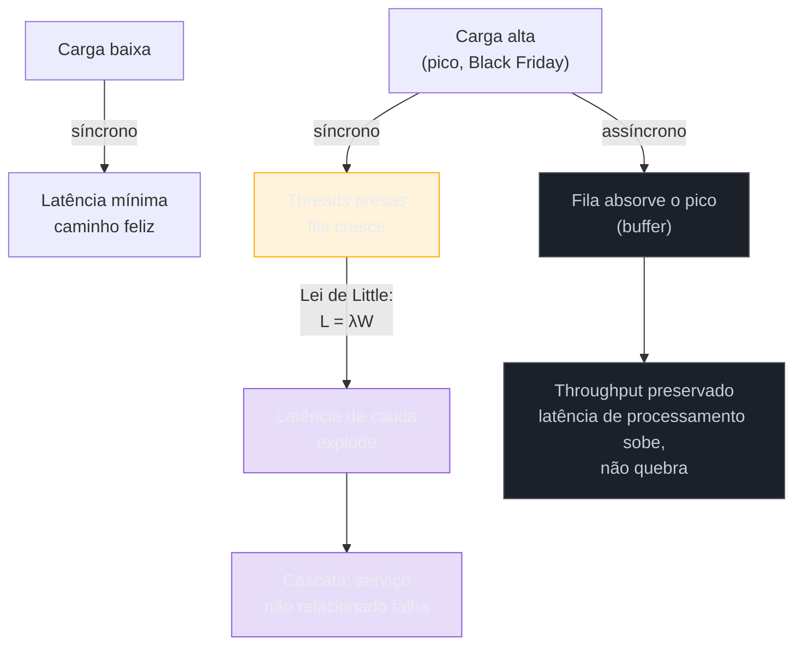
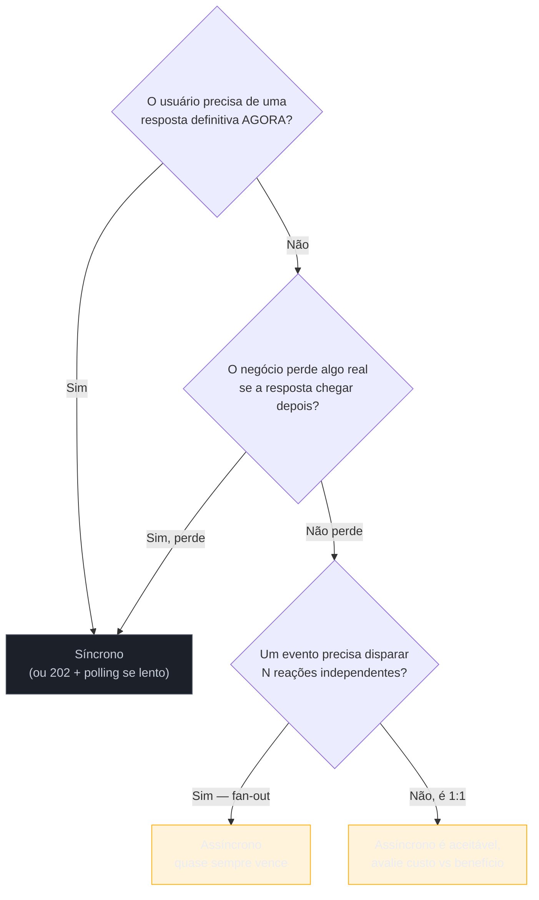

# Síncrono vs assíncrono — quando desacoplar

> [!abstract] TL;DR
> Desacoplar no tempo não é uma escolha de tecnologia — é uma escolha de **quanto o negócio pode esperar**. Síncrono compra a latência mais baixa possível no caminho feliz e um modelo mental linear, fácil de depurar; o preço é que a disponibilidade da cadeia inteira vira o produto das disponibilidades de cada elo, e sob carga a latência explode em vez de degradar. Assíncrono compra o oposto: throughput estável sob pico, cada lado isolado por um buffer, e a chance de múltiplos consumers reagirem ao mesmo fato (fan-out). O preço não é abstrato — é debugging sem stack trace único, eventual consistency como modelo mental que todo o time precisa aprender, um broker novo para operar, e garantias de entrega que precisam ser desenhadas, nunca assumidas. A pergunta certa nunca é "qual é melhor" — é "essa interação específica pode ser adiada sem quebrar a experiência ou a correção do negócio?".

Sexta-feira, 23h58, dois minutos antes da meia-noite de uma campanha de Black Friday. O time de checkout de um e-commerce médio recebe um alerta: latência de finalização de compra subindo de 220ms para 4 segundos. O pagamento está sendo aprovado — os logs do gateway de cartão mostram 200 OK em menos de 300ms, consistentemente. O problema não está lá.

Está no passo seguinte do fluxo: depois de aprovar o pagamento, o endpoint de checkout faz uma chamada HTTP síncrona para o serviço de e-mail, que dispara a confirmação de compra ("seu pedido #48213 foi confirmado"). Esse serviço de e-mail, historicamente rápido, está sob pressão — o provedor de SMTP terceirizado começou a limitar taxa de envio por causa do volume de Black Friday em todos os clientes dele, não só neste. Cada chamada ao serviço de e-mail agora demora entre 2 e 6 segundos para retornar. E o endpoint de checkout **espera** essa resposta antes de devolver "compra confirmada" para o navegador do cliente.

O pagamento já foi cobrado. O pedido já existe no banco, com status `pago`. Mas o cliente, olhando pra tela, só vê um spinner girando — porque o servidor está preso esperando um e-mail que, para o negócio, não tinha nenhuma razão para bloquear coisa nenhuma. Um punhado de clientes, impacientes, atualiza a página ou fecha a aba. Alguns tentam comprar de novo, achando que a primeira tentativa falhou. Por volta da meia-noite, o time descobre pedidos duplicados no banco — cobranças reais, em cartões reais, por um problema que não tinha nada a ver com pagamento, estoque, ou qualquer coisa que pareça "crítica" à primeira vista. Tinha a ver com uma decisão de contrato nunca questionada: "checkout espera o e-mail responder antes de dizer ao cliente que deu certo."

Essa cena é uma variação da mesma história que abre a nota anterior desta trilha — [[1 - Panorama e decisão/01 - O que é o contrato de comunicação|O que é o contrato de comunicação]], onde o checkout ficava refém da latência do serviço de recomendação. Lá, o ponto era nomear o eixo: todo contrato carrega uma dimensão de **acoplamento temporal**, e essa dimensão é a mais decisiva de todas. Aqui, o ponto é diferente e mais afiado: **quando, exatamente, vale a pena pagar o preço de desacoplar essa dimensão?** Porque desacoplar no tempo não é grátis — troca um conjunto de problemas visíveis na hora (erro 500, timeout, spinner infinito) por um conjunto de problemas que só aparecem depois, silenciosamente, se ninguém desenhar as garantias com cuidado.

## O eixo, revisitado: latência vs throughput, não "rápido vs lento"

A tentação, ao comparar síncrono e assíncrono, é resumir a diferença como "síncrono é rápido, assíncrono é lento" — e essa simplificação erra o ponto central. O que muda não é a velocidade em abstrato; é **o que cada modelo otimiza** e **sob qual condição** ele se comporta bem.

Latência é quanto tempo uma única operação leva, do início ao fim. Throughput é quantas operações o sistema consegue completar por unidade de tempo. No caminho feliz, com pouca carga, comunicação síncrona entrega a menor latência possível: sem intermediário, sem espera de fila, a resposta volta o mais rápido que a rede e o processamento permitem ([Request-Response vs Event-Driven Communication, Andy Crossman](https://medium.com/@andycrossman712/request-response-vs-event-driven-communication-key-tradeoffs-6084ab7a78c0)). É exatamente por isso que o checkout do exemplo funcionava bem em terça-feira às 14h — poucas requisições, e-mail respondendo rápido, ninguém notando o acoplamento.

O problema aparece quando a carga sobe. Aqui vale um resultado de teoria de filas conhecido como **Lei de Little** (`L = λW` — o número médio de itens no sistema é igual à taxa de chegada multiplicada pelo tempo médio de espera), que formaliza uma intuição que qualquer engenheiro de produção já sentiu na pele: latência é proporcional ao comprimento médio da fila, e além de um certo ponto de utilização (empiricamente, algo entre 70% e 80% de saturação de um recurso compartilhado), a fila cresce descontroladamente e a latência de cauda dispara — não de forma linear, mas exponencial ([Applying Little's Law, LiveSession](https://livesession.io/blog/applying-littles-law-queue-management-and-system-performance); [Latency vs Throughput, System Overflow](https://www.systemoverflow.com/learn/design-fundamentals/latency-throughput/trade-offs-between-latency-and-throughput-in-system-design-decisions)). Numa chamada síncrona, essa fila se manifesta como **threads presas esperando**: o pool de threads do checkout é finito, e cada chamada bloqueada ao serviço de e-mail ocupa uma thread inteira até o timeout ou a resposta. Quando o e-mail ficou lento, cada requisição de checkout consumiu uma thread por 2 a 6 segundos em vez de 20 milissegundos — o pool esgotou, e requisições completamente não relacionadas ao e-mail (consulta de pedido, login) começaram a falhar por falta de recurso, não porque tivessem qualquer problema próprio.

Esse mecanismo — thread pool exhaustion propagando falha para trás na cadeia de chamadas — é bem documentado na literatura de confiabilidade de microsserviços: quando um serviço downstream fica lento, as threads do serviço chamador ficam bloqueadas esperando, consumindo recursos que deveriam atender outras requisições; se o serviço A esgota suas threads esperando o serviço B, os serviços que chamam A também começam a bloquear, e em poucos minutos uma única dependência lenta congela a arquitetura inteira ([The Silent Killer of Microservices: Thread Pool Exhaustion](https://powersoft2026.substack.com/p/the-silent-killer-of-microservices)). Um caso relatado publicamente descreve exatamente essa dinâmica: a latência de um provedor de pagamento subiu de 180ms para 2,4 segundos, e em seis minutos esse atraso se propagou por catorze serviços dependentes — em sete minutos, mais de um terço das requisições de checkout estava expirando no gateway. É a mesma forma de falha da cena de abertura desta nota, só que medida em minutos em vez de horas.

Assíncrono responde a essa mesma pressão de um jeito estruturalmente diferente. Um broker de mensagens funciona como um **buffer** entre producer e consumer, absorvendo o descompasso entre a taxa em que os eventos chegam e a taxa em que são processados — três dimensões de desacoplamento nascem desse buffer: tempo (os dois lados não precisam estar ativos no mesmo instante), disponibilidade (um lado pode cair sem derrubar o outro) e velocidade (o lado rápido não fica refém do lento) ([Producer-Consumer Problem with Backpressure, Scalable Thread](https://newsletter.scalablethread.com/p/how-to-solve-producer-consumer-problem)). Um documento da AWS Builders' Library formaliza isso com um princípio direto: quando você constrói sobre uma fila como o SQS, a disponibilidade do seu producer passa a ser proporcional à disponibilidade da própria fila — não mais à disponibilidade do consumer que está do outro lado ([Avoiding Insurmountable Queue Backlogs, AWS](https://aws.amazon.com/builders-library/avoiding-insurmountable-queue-backlogs/)). Se o serviço de e-mail cair inteiro durante a Black Friday, os eventos `pedido.confirmado` ficam acumulados na fila; o checkout segue publicando e respondendo ao cliente normalmente, e os e-mails saem quando o serviço de e-mail voltar — atrasados, mas sem nunca ter travado uma única compra.

> [!question]- Isso significa que a fila absorve qualquer pico, sem limite?
> Não — a fila muda **onde** a pressão aparece, não a elimina. Se a taxa de chegada de eventos ficar consistentemente maior que a taxa de processamento dos consumers por tempo suficiente, o backlog da fila cresce sem parar, e em algum momento você tem um problema tão real quanto o de threads presas: mensagens processadas horas ou dias depois de terem sido geradas, o que pode ser inaceitável dependendo do negócio (um e-mail de confirmação atrasado em 10 minutos é tolerável; um alerta de fraude atrasado em 10 minutos, não). A resposta operacional é escalar consumers dinamicamente conforme a profundidade da fila cresce, e, quando isso não é suficiente, rejeitar trabalho de forma mais agressiva no producer em vez de deixar o backlog crescer indefinidamente ([Avoiding Insurmountable Queue Backlogs, AWS](https://aws.amazon.com/builders-library/avoiding-insurmountable-queue-backlogs/)). Assíncrono degrada de forma mais graciosa que síncrono sob pico — mas "gracioso" não é "infinito".

## O que o desacoplamento custa de verdade

Até aqui, o argumento parece unilateral a favor de assíncrono: menor acoplamento, melhor comportamento sob carga, disponibilidade isolada. Mas esse argumento, sozinho, é a metade perigosa da história — e é exatamente a metade que leva times a adotar mensageria por reflexo, sem entender o que estão comprando.

### 1. Debugging perde o fio único

Numa chamada síncrona, seguir o que aconteceu é, na maior parte das vezes, trivial: um *stack trace* mostra a cadeia inteira de chamadas, de cima a baixo, num único processo lógico. Você bota um breakpoint, segue o fio, chega na causa.

Numa cadeia assíncrona, esse fio se rompe. Rastrear um evento através de sete consumers assíncronos é estruturalmente mais difícil que rastrear uma requisição através de sete serviços síncronos, porque a decisão de quando (e se) cada consumer processa o evento não é mais parte da mesma pilha de execução — o desacoplamento temporal esconde a sequência de operações dentro de uma requisição e dificulta saber quais serviços dependem de quais ([Tracing asynchronous systems, Datadog](https://www.datadoghq.com/blog/parent-child-vs-span-links-tracing/); [Debugging Distributed Systems, Orkes](https://orkes.io/blog/debugging-distributed-systems/)). Não existe mais "o" pedido de checkout indo até o fim — existe um evento publicado, que pode ser consumido agora, em cinco minutos, ou nunca (se o consumer estiver com bug e descartando silenciosamente).

A resposta canônica da indústria a esse problema é o **correlation ID**: um identificador único gerado na origem da interação de negócio e propagado através de todo evento, log e span de cada consumer que toca aquele fluxo, permitindo reconstruir a linha do tempo depois, em ferramentas de observabilidade, em vez de na hora, num debugger ([Correlation IDs, Microsoft Engineering Fundamentals Playbook](https://microsoft.github.io/code-with-engineering-playbook/observability/correlation-id/)). O OpenTelemetry, hoje, formaliza isso com *distributed tracing* que costura operações assíncronas entre serviços — mas essa costura é um investimento de infraestrutura de observabilidade que você precisa fazer **antes** de ter o incidente, não durante. Um time que troca uma chamada síncrona por uma fila sem instrumentar correlation ID está trocando "fácil de depurar" por "impossível de depurar", não por "mais difícil de depurar".

### 2. Eventual consistency é um modelo mental, não um detalhe técnico

Num sistema síncrono, "o dado está certo" é uma pergunta simples: você fez a chamada, recebeu a resposta, e o que veio de volta é, por definição, o estado atual no momento da resposta. Num sistema assíncrono, essa garantia desaparece — o evento que diz "pedido confirmado" pode já ter sido publicado enquanto o dado em algum outro serviço downstream (o dashboard de vendas, o índice de busca) ainda reflete o estado anterior, por segundos, minutos, ou — se algo falhar silenciosamente — para sempre.

A literatura de sistemas distribuídos é direta sobre o custo cognitivo disso: consistência eventual é um modelo de raciocínio muito mais exigente para quem desenvolve, porque contraria a intuição de programação de processo único, onde uma variável sempre reflete o último valor atribuído a ela; com garantias de consistência mais fracas, quem desenvolve precisa considerar dado desatualizado, resolução de conflito e operações idempotentes como parte normal do design, não como exceção ([Eventual Consistency, Design Gurus](https://www.designgurus.io/answers/detail/what-is-eventual-consistency-and-how-does-it-differ-from-strong-consistency-in-distributed-systems)). Isso não é um problema que se resolve escrevendo mais testes — é um modelo mental que o time inteiro precisa internalizar: perguntas de código de revisão mudam de "essa função está correta?" para "essa função está correta assumindo que o evento pode chegar duas vezes, fora de ordem, ou nunca?".

### 3. Infraestrutura extra, com operação própria

Um broker de mensagens — Kafka, RabbitMQ, SQS, BullMQ, qualquer um — não é uma biblioteca que você importa; é um sistema distribuído novo que passa a fazer parte do seu ambiente de produção, com seu próprio ciclo de vida: implantar um message broker traz complexidade adicional em design arquitetural, gestão de schema de mensagem e overhead operacional — brokers exigem monitoramento, escalonamento e manutenção dedicados, com upgrades de versão, patches de segurança e planejamento de capacidade recorrentes ([Message Broker, DataOps School](https://dataopsschool.com/blog/message-broker/)). Sem um cluster replicado, uma queda do broker interrompe o fluxo de mensagens inteiro — e planejar alta disponibilidade para esse componente é, ele mesmo, um projeto de infraestrutura, não uma linha de configuração.

Isso não é argumento contra usar broker — é argumento contra tratá-lo como decisão gratuita. Antes de escolher assíncrono, vale perguntar em voz alta: "quem vai operar esse broker daqui a seis meses, quando o time que o escolheu já tiver mudado de projeto?"

### 4. Garantias de entrega não vêm de graça — precisam ser desenhadas

A suposição mais perigosa de quem começa a usar mensageria é achar que "publicar um evento" é equivalente, em confiabilidade, a "chamar uma função". Não é. Um broker pode entregar uma mensagem mais de uma vez (retry, reconexão, timeout de confirmação), pode entregá-la fora de ordem (partições diferentes, consumers paralelos), ou — dependendo da configuração — pode perdê-la. Cada uma dessas garantias (at-most-once, at-least-once, exactly-once) tem um custo de desempenho e de implementação diferente, e a mais comum na prática — at-least-once — exige que **todo consumer seja idempotente**: capaz de processar a mesma mensagem duas vezes sem duplicar o efeito. Esse assunto — garantias de entrega, ordenação e idempotência no consumer — é aprofundado na [[02 - Message queue vs event streaming|próxima nota]] deste sub-galho; o ponto aqui é reconhecer que "usar fila" não é uma decisão única — é um pacote de sub-decisões, cada uma com seu próprio custo, que precisa ser desenhado explicitamente, nunca assumido por padrão.

Some a esses quatro custos um quinto, mais sutil, herdado da nota anterior: se o producer precisa gravar seu próprio estado no banco *e* publicar um evento sobre essa mudança, você criou o **dual write problem** — duas escritas em dois sistemas diferentes (banco e broker) que podem divergir se uma tiver sucesso e a outra falhar. A prática canônica para fechar essa lacuna é o padrão **Outbox**: gravar o evento como parte da mesma transação que grava o dado de negócio, e um processo separado publicá-lo depois, transformando duas escritas possivelmente inconsistentes numa única transação atômica local ([Outbox Pattern, Conduktor](https://www.conduktor.io/glossary/outbox-pattern-for-reliable-event-publishing); [Transactional Outbox, AWS Prescriptive Guidance](https://docs.aws.amazon.com/prescriptive-guidance/latest/cloud-design-patterns/transactional-outbox.html)). Esse padrão — aprofundado em [[04 - Outbox e Saga]] mais adiante neste sub-galho — só existe porque a assincronia trocou um problema (acoplamento temporal) por outro (consistência entre duas escritas), e é um bom lembrete de que desacoplar nunca é "resolver" um trade-off — é trocá-lo por outro, deliberadamente.

> [!warning] Assíncrono não é sempre melhor
> **O que acontece:** um time decide "vamos publicar isso numa fila em vez de chamar direto" porque parece a opção mais moderna ou mais "escalável" — sem antes perguntar se a operação, pela natureza do negócio, pode mesmo ser adiada. **Por quê:** assíncrono troca um modo de falha visível na hora (erro 500, timeout) por um modo de falha que só aparece depois — uma fila que cresce silenciosamente, um consumer travado reprocessando a mesma mensagem, uma inconsistência percebida horas depois num relatório. Isso não é estrategicamente superior por padrão; é uma troca, com um custo diferente, não menor. **Como evitar:** tratar a escolha como uma decisão de negócio primeiro, técnica depois — ver o framework abaixo. Times maduros de arquitetura recomendam começar com comunicação síncrona e in-process sempre que possível, e só introduzir mensageria assíncrona quando uma necessidade real de negócio justificar a complexidade adicional ([Modular Monolith Communication Patterns, Milan Jovanović](https://www.milanjovanovic.tech/blog/modular-monolith-communication-patterns)) — não o inverso.

## O framework de decisão: o que o cliente precisa agora?

Toda a discussão acima converge numa pergunta prática, a mesma que a nota anterior já havia introduzido e que aqui ganha um teste mais afiado: **o resultado dessa operação precisa existir, confirmado, antes que o consumer siga em frente — ou o consumer pode seguir em frente com "aceito, processando" e o resultado chegar depois?**

Vale desmontar essa pergunta em três testes concretos, na ordem em que costumam aparecer numa decisão real de arquitetura.

**Teste 1 — o usuário precisa de uma resposta definitiva agora?** Se a interface precisa mostrar "aprovado" ou "recusado" antes que o usuário saia da tela — autorização de pagamento, validação de login, checagem de estoque no momento de confirmar o carrinho — a operação tem uma razão de negócio real para ser síncrona, ou, na pior das hipóteses, precisa simular síncrono com um padrão de espera explícita. É esse o caso do "202 Accepted + polling": o cliente recebe imediatamente a confirmação de que a solicitação foi aceita, junto com uma referência (`Location` header) para um endpoint de status que ele consulta até o processamento terminar — um jeito de expor uma operação internamente assíncrona atrás de uma experiência que ainda comunica progresso de forma clara, em vez de deixar o usuário no escuro ([Asynchronous Request-Reply Pattern, Microsoft Learn](https://learn.microsoft.com/en-us/azure/architecture/patterns/asynchronous-request-reply)). Esse padrão específico — que fecha o círculo com mensageria "invertida" — é aprofundado em [[3 - Confiabilidade do contrato/05 - Webhooks e operações assíncronas]].

**Teste 2 — o negócio perde alguma coisa real se a resposta chegar depois?** Enriquecimento de dados, notificação, geração de relatório, atualização de índice de busca, sincronização de analytics — nenhuma dessas operações muda se o resultado do checkout chega ao cliente hoje ou se o e-mail de confirmação sai 30 segundos depois. Um exemplo documentado com frequência na indústria: no fluxo de checkout, pagamento e redução de estoque acontecem de forma síncrona, porque o usuário precisa saber na hora se o pedido teve sucesso — mas o evento de "pedido confirmado" é publicado numa fila, e a partir dali a confirmação por e-mail, a notificação ao armazém, a atualização de analytics e o recálculo de recomendações acontecem todos de forma assíncrona, em paralelo, sem que nenhum deles bloqueie o outro nem o checkout original ([System Design Interview Handbook, message queues](https://www.systemdesigninterview.com/guides/system-design-interview-handbook/27-message-queues-asynchronous-processing)). É exatamente o padrão **web-queue-worker**: a aplicação web publica um evento assim que o trabalho síncrono termina, e um serviço separado — o worker — consome esse evento e faz o trabalho que pode esperar, isolando a latência de envio do e-mail da latência do checkout ([Web Queue Worker Architecture, NimblePros](https://blog.nimblepros.com/blogs/web-queue-worker-architecture-review/)). É esse exato padrão que teria evitado o incidente de Black Friday da abertura desta nota: publicar `pedido.confirmado` e devolver a resposta ao cliente imediatamente, deixando o e-mail (e sua lentidão momentânea) inteiramente fora do caminho crítico.

**Teste 3 — um único evento precisa disparar várias reações independentes?** Esse é o caso em que assíncrono deixa de ser "aceitável" e passa a ser **quase sempre a escolha certa**, mesmo que a operação individual fosse rápida o suficiente para ser síncrona. Quando "pedido confirmado" precisa, ao mesmo tempo, atualizar o estoque, notificar o armazém, disparar o e-mail, atualizar o painel de analytics e recalcular recomendações, fazer isso de forma síncrona significaria o checkout chamar cinco serviços diferentes, um atrás do outro (ou em paralelo, mas ainda esperando todos responderem) — cinco pontos de falha síncrona onde antes havia um só, e a disponibilidade composta do checkout despencando a cada novo consumer adicionado. Esse padrão — **fan-out**, um evento disparando múltiplas ações paralelas ou entregue a múltiplos assinantes de uma vez — é a razão de existir do modelo pub/sub: cada assinatura de um tópico recebe cada mensagem publicada, de forma independente e processada em paralelo, sem que o producer tenha qualquer conhecimento de quantos ou quais consumers existem ([Fan-Out, GetStream.io](https://getstream.io/glossary/fan-out/); [Fan-Out Pattern com Pub/Sub, OneUptime](https://oneuptime.com/blog/post/2026-02-02-pubsub-fan-out/view)). Adicionar um sexto consumer — digamos, um novo serviço de detecção de fraude que precisa reagir a todo pedido confirmado — não exige tocar no código do checkout nem dos outros cinco consumers; basta criar uma nova assinatura no mesmo tópico. É esse desacoplamento de "quantos ouvintes existem" que nenhuma cadeia de chamadas síncronas replica sem acumular acoplamento a cada novo consumer.

A tabela abaixo condensa o framework num formato consultável — mas vale ler as três colunas como perguntas em sequência, não como uma lista neutra de opções equivalentes:

| Pergunta | Resposta "sim" aponta para | Exemplo |
|---|---|---|
| O usuário precisa de confirmação definitiva agora? | Síncrono | Autorização de cartão, validação de login, checagem de estoque no carrinho |
| A operação pode falhar sem prejuízo imediato ao caminho crítico? | Assíncrono | Enviar e-mail, gerar relatório, indexar para busca |
| Um evento precisa notificar N sistemas independentes? | Assíncrono (fan-out) | "Pedido confirmado" → estoque + armazém + e-mail + analytics + fraude |
| A resposta é rápida e o consumer é o único interessado? | Síncrono, por simplicidade | Consultar saldo, buscar detalhe de um recurso |
| Picos de tráfego podem sobrecarregar o consumer? | Assíncrono, como buffer | Upload de vídeo → fila de transcodificação |

Vale registrar o contraponto, para não deixar o framework parecer mais unilateral do que é: engenheiros com experiência em arquitetura recomendam, de forma consistente, **começar síncrono por padrão** — comunicação em processo através de interfaces bem definidas é a escolha certa para consultas que precisam de resultado imediato, e reduz a complexidade operacional que uma equipe carrega desde o primeiro dia ([Modular Monolith Communication Patterns, Milan Jovanović](https://www.milanjovanovic.tech/blog/modular-monolith-communication-patterns)). Assíncrono entra quando uma dor concreta aparece — latência ruim sob carga, acoplamento de disponibilidade indesejado, necessidade real de fan-out — não como aposta antecipada em uma escala que ainda não existe.

## Casos práticos

**YouTube e o upload de vídeo.** Quando alguém sobe um vídeo, o servidor que recebe o upload não transcodifica, ali mesmo, o arquivo para dez resoluções diferentes — isso levaria minutos e estouraria qualquer timeout de requisição HTTP razoável. Em vez disso, o handler de upload publica uma mensagem numa fila e responde imediatamente ao usuário que o upload foi recebido; processos worker consomem essas mensagens e fazem a transcodificação em segundo plano, terminando quando terminarem, sem que o navegador do usuário precise ficar com a conexão aberta esperando ([System Design Interview Handbook, message queues](https://www.systemdesigninterview.com/guides/system-design-interview-handbook/27-message-queues-asynchronous-processing)). É o Teste 2 do framework acima aplicado de forma direta: o resultado (vídeo processado) não precisa existir no instante da resposta HTTP — só precisa existir eventualmente, e o usuário aceita esse contrato implicitamente ao ver "processando..." em vez de "pronto".

**Flash sale e absorção de pico.** Um cenário citado com frequência em entrevistas de system design: um serviço de pagamento processa normalmente 100 pedidos por segundo, mas uma promoção relâmpago gera 5.000 pedidos no mesmo segundo. Uma cadeia inteiramente síncrona de checkout → pagamento simplesmente não sobrevive a esse pico — o serviço de pagamento seria sobrecarregado instantaneamente, gerando timeout em cascata. Colocar uma fila entre a captura do pedido e o processamento de pagamento não elimina o trabalho a ser feito, mas **redistribui no tempo**: o pedido é aceito instantaneamente (o cliente vê "pedido recebido"), e o processamento de pagamento consome a fila no ritmo que sua própria capacidade permite, sem perder nenhum pedido — apenas atrasando o processamento de alguns por alguns segundos a mais.

**O padrão Web-Queue-Worker como ponto de partida.** Times que estão adotando mensageria pela primeira vez costumam usar exatamente a arquitetura da abertura desta nota como modelo de referência: a aplicação web trata do caminho síncrono e crítico (aceitar o pedido, cobrar o cartão), publica um evento assim que esse caminho termina, e um serviço worker separado consome esse evento para fazer todo o trabalho que pode esperar — e-mail, notificação, atualização de índice. É descrito como uma base sólida para times começando com arquiteturas orientadas a eventos, precisamente porque separa com clareza o que é síncrono do que é assíncrono, em vez de misturar os dois modelos dentro do mesmo serviço ([Web Queue Worker Architecture Review, NimblePros](https://blog.nimblepros.com/blogs/web-queue-worker-architecture-review/)).

## Armadilhas comuns

> [!warning] Achar que "publicar assíncrono" resolve o problema de latência do consumer
> **O que acontece:** o time publica um evento achando que "desacoplou" o consumer, mas o consumer continua processando de forma síncrona e sequencial, um evento de cada vez, e a fila simplesmente vira um ponto de acúmulo cada vez maior — a latência que sumiu da resposta HTTP reaparece, ampliada, como atraso de processamento. **Por quê:** a fila muda **onde** a pressão se manifesta (de "thread bloqueada" para "backlog crescente"), mas não elimina a necessidade de capacidade de processamento suficiente do lado do consumer. Sem escalar consumers ou paralelizar o processamento, o throughput real do sistema continua limitado pelo elo mais lento — só que agora escondido atrás de uma fila que parece saudável do lado de fora. **Como evitar:** monitorar a profundidade da fila e o *consumer lag* como métricas de primeira classe, com alarme antes que o backlog vire um problema visível ao usuário; escalar consumers dinamicamente conforme a fila cresce, em vez de assumir que "publicar assíncrono" é sinônimo de "problema resolvido".

> [!warning] Ignorar o custo de operar o broker
> **O que acontece:** a decisão de adotar Kafka, RabbitMQ ou qualquer broker é tomada olhando só para o ganho de desacoplamento, sem que ninguém pergunte quem vai fazer upgrade de versão, aplicar patch de segurança, dimensionar cluster, e responder a um alerta de broker fora do ar às 3 da manhã. **Por quê:** um broker de mensagens é um sistema distribuído novo, com seu próprio ciclo de vida operacional — não uma biblioteca que se importa e esquece. Sem plano de alta disponibilidade, uma queda do broker interrompe o fluxo de mensagens inteiro, inclusive para consumers e producers que nada têm a ver com o motivo original da queda. **Como evitar:** tratar "quem opera o broker" como parte da decisão arquitetural, não como detalhe de implementação a resolver depois — em times pequenos, preferir um broker gerenciado (SQS, um Kafka gerenciado) para reduzir esse custo operacional, mesmo que isso limite alguma flexibilidade de configuração.

## Em entrevista

Este é um dos poucos pontos numa entrevista de system design onde a maturidade do candidato aparece não na resposta técnica, mas na **ordem** em que ele chega até ela. Um candidato júnior, ao desenhar um checkout, tende a escolher tecnologia primeiro — "vou usar Kafka porque é escalável" — e só depois tentar justificar essa escolha. Um candidato sênior faz o caminho inverso: nomeia, para cada interação do fluxo, se o negócio exige resposta imediata ou tolera atraso, e só então escolhe a tecnologia que implementa essa decisão.

Uma resposta forte, quando o entrevistador pergunta "por que fila aqui e chamada direta ali?", soa como isto: "a cobrança do cartão precisa ser síncrona porque o usuário tem que saber, antes de sair da tela, se o pagamento foi aprovado — não posso adiar essa informação sem quebrar a experiência. Já a confirmação por e-mail e a atualização do índice de busca não têm essa exigência: publico um evento `pedido.confirmado` assim que o pagamento é aprovado, e deixo que consumers separados cuidem do resto em paralelo. Isso significa que, se o provedor de e-mail estiver degradado, o checkout continua funcionando normalmente — o pior caso vira 'e-mail atrasado', não 'compra travada'."

Vale estar preparado também para a pergunta inversa, que testa se o candidato entende o custo, não só o benefício: "quando você **não** usaria fila, mesmo podendo?" A resposta fraca é "sempre uso fila, é mais escalável" — que ignora completamente o custo de debugging, consistência eventual e operação de broker discutido nesta nota. A resposta forte nomeia o trade-off explicitamente: "eu evitaria fila numa consulta simples de saldo, onde o consumer é o único interessado no resultado e precisa dele imediatamente — ali, a latência extra de publicar/consumir e a complexidade de rastrear o fluxo assíncrono não compram nada, só custam." Esse tipo de resposta toca diretamente o eixo de "trade-offs e justificativa" do [[03-Dominios/Engenharia/Arquitetura/System Design/1 - Framework de entrevista/01 - O que é System Design e o que a entrevista avalia|framework de avaliação de System Design]] — sinaliza que o candidato não decorou "fila é bom", decorou **quando** fila é bom.

## How to explain in English

> "Synchronous and asynchronous aren't a 'fast vs slow' choice — they optimize for different things under different conditions. Synchronous gives you the lowest possible latency on the happy path and a mental model you can literally step through with a debugger; the cost shows up under load, when blocked threads pile up and the whole chain's availability becomes the product of every link's availability. Asynchronous buys you stable throughput under spikes and lets one event fan out to many independent consumers — but that's not free either: you trade a stack trace for a correlation ID, immediate consistency for eventual consistency the whole team has to reason about, and you take on a broker that needs its own operational lifecycle. The real question is never 'which is better' — it's 'does this specific interaction need to guarantee something right now, or can it be accepted and processed later without breaking the business?'"

| PT | EN |
|----|----|
| Desacoplar no tempo | Decouple in time |
| Latência vs throughput | Latency vs throughput |
| Lei de Little | Little's Law |
| Exaustão de pool de threads | Thread pool exhaustion |
| Falha em cascata | Cascading failure |
| Buffer / absorver o pico | Buffer / absorb the spike |
| Backlog da fila / profundidade da fila | Queue backlog / queue depth |
| Consistência eventual | Eventual consistency |
| Correlation ID | Correlation ID |
| Consumer idempotente | Idempotent consumer |
| Fan-out (um evento, N consumers) | Fan-out (one event, N consumers) |
| "Aceito, processando" (202 + polling) | "Accepted, processing" (202 + polling) |
| Padrão Web-Queue-Worker | Web-Queue-Worker pattern |
| Problema de escrita dupla | Dual write problem |

## O que vem a seguir

Esta nota estabeleceu **quando** vale a pena pagar o preço da assincronia — mas "usar assíncrono" ainda esconde uma segunda decisão, igualmente importante: uma vez que você decidiu desacoplar no tempo, seu evento é uma **tarefa para ser executada uma vez** (fila de trabalho) ou um **fato imutável que outros sistemas podem querer reler no futuro** (log de eventos)? Essas duas respostas levam a arquiteturas e ferramentas bem diferentes, e é exatamente aí que o resto do sub-galho começa a se desenrolar: primeiro o panorama comparativo de fila vs stream, depois as garantias de entrega que todo consumer assíncrono precisa respeitar, depois os padrões (Outbox, Saga) que fecham as lacunas de consistência que a assincronia abre, e por fim o legado e o que está emergindo no espaço.

- [[02 - Message queue vs event streaming]] — a segunda decisão: fila de tarefa ou log de eventos, e o panorama comparativo de brokers (Kafka, RabbitMQ, SQS, NATS, Pulsar, BullMQ)
- [[03 - Garantias de entrega e ordenação]] — at-most-once, at-least-once, exactly-once, e por que idempotência no consumer não é opcional
- [[04 - Outbox e Saga]] — como fechar a lacuna de consistência aberta pelo dual write problem citado nesta nota

## Veja também

- [[1 - Panorama e decisão/01 - O que é o contrato de comunicação|O que é o contrato de comunicação]] — introduz o eixo síncrono/assíncrono como a primeira dimensão de decisão da trilha; esta nota aprofunda o "quando" e o "quanto custa"
- [[Mensageria/Mensageria|Mensageria]] — panorama de ferramenta (Kafka, RabbitMQ, BullMQ) que implementa as decisões discutidas aqui
- [[3 - Confiabilidade do contrato/05 - Webhooks e operações assíncronas]] — o padrão 202 Accepted + polling, aprofundado
- [[03-Dominios/Engenharia/Arquitetura/System Design/index|System Design]] — os building blocks de escala (message queue, Pub/Sub) que operam em cima desta decisão

## Fontes

- System Overflow — [*Trade Offs Between Latency and Throughput in System Design Decisions*](https://www.systemoverflow.com/learn/design-fundamentals/latency-throughput/trade-offs-between-latency-and-throughput-in-system-design-decisions) (acessado 2026-07-09) — definição de latência vs throughput e o ponto de saturação de recursos compartilhados.
- LiveSession — [*Applying Little's Law: Queue Management and System Performance*](https://livesession.io/blog/applying-littles-law-queue-management-and-system-performance) (acessado 2026-07-09) — a Lei de Little (`L = λW`) e a relação entre comprimento de fila e latência.
- Andy Crossman — [*Request-Response vs Event-Driven Communication: Key Tradeoffs*](https://medium.com/@andycrossman712/request-response-vs-event-driven-communication-key-tradeoffs-6084ab7a78c0) (acessado 2026-07-09) — latência no caminho feliz síncrono vs comportamento sob carga.
- Powersoft2026 (Substack) — [*The Silent Killer of Microservices: Thread Pool Exhaustion*](https://powersoft2026.substack.com/p/the-silent-killer-of-microservices) (2026) — o mecanismo de exaustão de threads e a cascata de 14 serviços em 6 minutos.
- Scalable Thread — [*How to Solve Producer Consumer Problem with Backpressure*](https://newsletter.scalablethread.com/p/how-to-solve-producer-consumer-problem) (acessado 2026-07-09) — as três dimensões de desacoplamento que uma fila oferece (tempo, disponibilidade, velocidade).
- AWS Builders' Library — [*Avoiding Insurmountable Queue Backlogs*](https://aws.amazon.com/builders-library/avoiding-insurmountable-queue-backlogs/) (acessado 2026-07-09) — disponibilidade do producer proporcional à disponibilidade da fila, e como lidar com backlog crescente.
- Datadog — [*Tracing asynchronous systems in your event-driven architecture*](https://www.datadoghq.com/blog/parent-child-vs-span-links-tracing/) (acessado 2026-07-09) — por que rastrear eventos assíncronos é estruturalmente mais difícil que rastrear chamadas síncronas.
- Microsoft — [*Correlation IDs, Engineering Fundamentals Playbook*](https://microsoft.github.io/code-with-engineering-playbook/observability/correlation-id/) (acessado 2026-07-09) — o padrão de correlation ID como substituto do stack trace único em fluxos assíncronos.
- Design Gurus — [*What is eventual consistency and how does it differ from strong consistency?*](https://www.designgurus.io/answers/detail/what-is-eventual-consistency-and-how-does-it-differ-from-strong-consistency-in-distributed-systems) (acessado 2026-07-09) — o custo cognitivo da consistência eventual como modelo de raciocínio.
- DataOps School — [*What is Message Broker?*](https://dataopsschool.com/blog/message-broker/) (2026) — overhead operacional de manter um broker de mensagens em produção.
- Conduktor — [*Outbox Pattern for Reliable Event Publishing*](https://www.conduktor.io/glossary/outbox-pattern-for-reliable-event-publishing) (acessado 2026-07-09) — definição do dual write problem e como o Outbox o resolve.
- AWS Prescriptive Guidance — [*Transactional Outbox Pattern*](https://docs.aws.amazon.com/prescriptive-guidance/latest/cloud-design-patterns/transactional-outbox.html) (acessado 2026-07-09) — detalhamento do padrão Outbox.
- Milan Jovanović — [*Modular Monolith Communication Patterns*](https://www.milanjovanovic.tech/blog/modular-monolith-communication-patterns) (acessado 2026-07-09) — recomendação de começar síncrono por padrão e introduzir mensageria só quando uma dor real justificar.
- Microsoft Learn — [*Asynchronous Request-Reply Pattern*](https://learn.microsoft.com/en-us/azure/architecture/patterns/asynchronous-request-reply) (acessado 2026-07-09) — o padrão 202 Accepted + polling para simular resposta síncrona sobre processamento assíncrono.
- System Design Interview Handbook — [*Message Queues & Asynchronous Processing*](https://www.systemdesigninterview.com/guides/system-design-interview-handbook/27-message-queues-asynchronous-processing) (acessado 2026-07-09) — exemplos de upload de vídeo e checkout com fan-out de eventos.
- NimblePros — [*Web Queue Worker Architecture Review*](https://blog.nimblepros.com/blogs/web-queue-worker-architecture-review/) (acessado 2026-07-09) — o padrão Web-Queue-Worker como base para separar caminho síncrono de trabalho assíncrono.
- GetStream.io — [*Fan-Out — What is it and how does it work?*](https://getstream.io/glossary/fan-out/) (acessado 2026-07-09) — definição de fan-out e o modelo pub/sub.
- OneUptime — [*How to Build Pub/Sub Event Fan-Out Architectures*](https://oneuptime.com/blog/post/2026-02-02-pubsub-fan-out/view) (2026) — múltiplas assinaturas independentes sobre o mesmo tópico.
