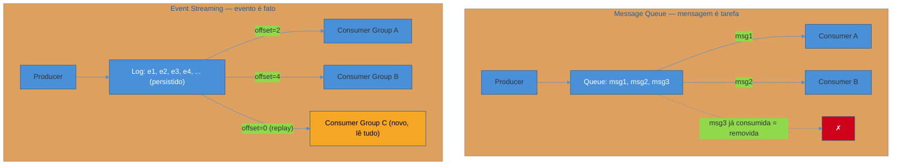
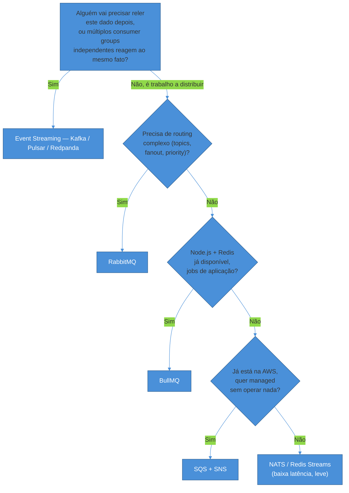

# Message queue vs event streaming

> [!abstract] TL;DR
> "Fila" e "stream" não são sinônimos de "mensageria assíncrona" — são dois **modelos mentais diferentes** para o mesmo problema geral, e escolher entre eles antes de escolher qualquer produto específico é a decisão que evita retrabalho caro depois. **Message queue (fila de tarefa)**: mensagem é removida após consumo, cada mensagem vai para exatamente um consumer (competing consumers), sem replay — o modelo é "processe esta tarefa e esqueça". **Event streaming (log)**: mensagem persiste num log ordenado, múltiplos consumer groups leem o mesmo dado de forma independente, replay é possível — o modelo é "registre este fato para quem quiser ler, hoje ou daqui a seis meses". A pergunta que decide qual modelo usar não é "qual broker é mais rápido" — é **"alguém, além de quem consome agora, vai precisar reler este dado depois?"**. Se sim, streaming. Se não, e o que importa é distribuir trabalho entre workers, fila. Na prática de 2026 a linha ficou mais borrada — RabbitMQ ganhou Streams (log com replay dentro de um broker de fila) e o Kafka 4.0 ganhou Share Groups via KIP-932 (fila com competing consumers dentro de um broker de log) — mas o modelo mental continua sendo o primeiro filtro de decisão, mesmo quando o produto escolhido sabe fazer os dois.

Um time de plataforma da marketplace de saúde que acompanha esta trilha — a mesma que já decidiu expor REST na borda pública, GraphQL como BFF mobile e gRPC entre serviços internos — está prestes a lançar o módulo de notificações: quando uma consulta é confirmada, o sistema precisa enviar email, SMS, push notification, e atualizar um painel de analytics em tempo real para o time de operações. O tech lead, que usou RabbitMQ no emprego anterior para filas de processamento de imagem, propõe RabbitMQ de novo — "já sei mexer, é rápido de subir". Um engenheiro que acabou de sair de uma empresa data-heavy insiste em Kafka — "é o padrão de mercado, todo mundo usa". A decisão é tomada numa reunião de 20 minutos, sem nenhuma das duas pessoas nomear explicitamente **por que** cada ferramenta resolveria o problema — só qual delas cada um já conhece.

Seis meses depois, o time de analytics pede para reprocessar o histórico completo de "consulta confirmada" dos últimos três meses, porque um bug no pipeline de métricas perdeu dados de duas semanas. Se o time tivesse escolhido RabbitMQ — o que aconteceu, porque o tech lead venceu a reunião —, a resposta é simples e desconfortável: **não dá**. As mensagens de "consulta confirmada" de três meses atrás foram consumidas, processadas, e removidas da fila há muito tempo. Não existe "voltar no tempo" numa fila que trata mensagem como tarefa descartável. A única saída é reconstruir os dados a partir de outra fonte — o banco relacional, com joins caros e sem a granularidade exata dos eventos originais — ou aceitar a lacuna. Um problema que teria sido um comando de replay de dez minutos, com a ferramenta certa, virou um projeto de uma semana de reconstrução manual.

Essa não é uma história sobre RabbitMQ ser "pior" que Kafka — é sobre a pergunta errada ter sido feita na hora certa. "Qual ferramenta eu já conheço?" e "qual é mais rápida em benchmark?" são perguntas válidas, mas são a segunda e a terceira pergunta. A primeira, que devia ter vindo antes de qualquer nome de produto entrar na conversa, é: **este dado é uma tarefa a ser executada uma vez, ou um fato que alguém vai querer reler?** Essa nota existe para responder essa pergunta com precisão suficiente para nunca mais precisar adivinhar.

## Dois modelos mentais, não duas marcas

A confusão mais comum em quem está começando com mensageria é tratar "Kafka vs RabbitMQ" como a pergunta central — como se fosse escolher entre dois sabores do mesmo prato. Na realidade, por trás dos nomes de produto existem dois **modelos de dados** fundamentalmente diferentes, e entender o modelo antes do produto evita boa parte das decisões erradas.

### Message queue: a mensagem é uma tarefa

No modelo de fila — herdado diretamente dos [[03-Dominios/Engenharia/Comunicação entre Sistemas/Mensageria/index|padrões clássicos de mensageria enterprise]] (Point-to-Point Channel, na formulação canônica de Hohpe e Woolf em *Enterprise Integration Patterns*) —, cada mensagem representa uma unidade de trabalho a ser executada exatamente uma vez, por exatamente um consumer.

- A mensagem entra na fila, um consumer a pega, processa, e a mensagem é **removida** — ela não existe mais para ninguém.
- Se vários consumers estão inscritos na mesma fila, cada mensagem vai para **um só** deles — esse padrão chama-se **competing consumers**, porque os consumers competem pelas mensagens disponíveis, cada um pegando as próximas que chegarem. É a forma natural de escalar throughput: adicionar mais workers processa mais mensagens em paralelo, sem que nenhum trabalho seja duplicado.
- Não existe replay por padrão. Uma vez consumida (e confirmada via ack), a mensagem se foi. A fila é, por natureza, **transiente** — existe para o tempo entre "a tarefa foi criada" e "a tarefa foi processada", não como registro histórico.

O caso de uso canônico: redimensionar uma imagem enviada pelo usuário, enviar um email transacional, processar um pagamento em background. Ninguém precisa "reler" o evento "redimensionar esta imagem" depois que ela já foi redimensionada — o trabalho foi feito, o resultado está salvo em outro lugar, a mensagem cumpriu seu papel e pode desaparecer.

### Event streaming: o evento é um fato imutável

No modelo de streaming, popularizado pelo Apache Kafka e formalizado na literatura por Martin Kleppmann em *Designing Data-Intensive Applications*, a unidade não é uma tarefa a ser executada — é um **fato que aconteceu**, registrado de forma imutável num log ordenado.

- O evento é **anexado** ao log (append-only) e **permanece lá** pelo período de retenção configurado — que pode ser dias, semanas, ou indefinidamente. Consumir um evento não o remove.
- Múltiplos **consumer groups** independentes podem ler o mesmo log, cada um mantendo seu próprio ponteiro de posição (**offset**) — o serviço de notificação lê do offset 42, o serviço de analytics lê do offset 100, sem que a leitura de um afete a do outro. Isso é fundamentalmente diferente de competing consumers: aqui, cada consumer group recebe **todos** os eventos, não uma fatia deles.
- **Replay é uma capacidade de primeira classe**, não um workaround: um consumer group novo pode nascer meses depois do evento original ter sido produzido, resetar seu offset para o início do log, e reprocessar todo o histórico como se estivesse acontecendo agora.

A diferença estrutural mais citada na literatura técnica: em mensageria estilo AMQP/JMS clássico, receber uma mensagem é **destrutivo** — ela é apagada do broker ao ser recebida, então rodar o mesmo consumer de novo nunca reproduz o mesmo resultado. Um broker log-based inverte essa premissa: a mensagem persiste no armazenamento, então reprocessar o mesmo trecho do log é uma operação de primeira classe, não uma exceção ([Kleppmann, *Designing Data-Intensive Applications*, cap. 11]).

> [!question]- Se o log é persistido, ele não cresce para sempre e não fica caro?
> Cresce, mas dentro de um limite configurável — retenção por tempo (ex.: 7 dias, 30 dias) ou por tamanho (ex.: 100GB por partição), e o broker descarta automaticamente o que passa da janela. A diferença para uma fila não é "guarda tudo para sempre" — é "guarda por tempo suficiente para replay útil ser possível", que costuma ser dias a semanas na maioria dos casos reais, e potencialmente indefinido quando o log é, ele mesmo, a fonte de verdade (um padrão chamado *compacted topic* no Kafka, onde só o último valor por chave é mantido — útil para representar "estado atual", não histórico completo). O ponto central não muda: o custo de armazenamento é uma escolha explícita de configuração, não uma consequência automática do modelo.

**Resumo em uma frase:** fila trata a mensagem como uma tarefa descartável depois de feita; stream trata o evento como um fato que vale a pena guardar, porque alguém — hoje ou daqui a meses — pode precisar relê-lo.

## Tabela comparativa: os eixos que realmente importam

| Aspecto | Message Queue | Event Streaming |
|---|---|---|
| Modelo mental | Fila de tarefas | Log imutável de fatos |
| O que acontece ao consumir | Mensagem é removida (destrutivo) | Evento permanece (não-destrutivo) |
| Replay | Não, por padrão | Sim — reposicionar offset |
| Quem recebe cada mensagem | Um consumer (competing consumers) | Todo consumer group (leitura independente) |
| Ordenação | Limitada — FIFO só em filas dedicadas / single-consumer | Garantida por partição/chave, não globalmente |
| Retenção | Até o consumo (minutos a dias, tipicamente) | Configurável — dias a indefinido |
| Modelo de entrega | Push (broker empurra pro consumer) | Pull (consumer busca do offset dele) |
| Throughput típico (2026) | Milhares a dezenas de milhares/s (RabbitMQ classic ~50k/s por nó) | Centenas de milhares a milhões/s (Kafka ~1M/s por broker) |
| Complexidade operacional | Menor — um binário, poucos conceitos | Maior — partições, replicação, consumer groups, tuning |
| Caso de uso canônico | Background jobs, RPC assíncrono, distribuir trabalho | Event-driven architecture, CDC, analytics, auditoria |

> [!warning] Throughput não é o critério de decisão
> **O que acontece:** um time escolhe Kafka porque "é mais rápido" — 1 milhão de mensagens/segundo contra 50 mil do RabbitMQ clássico — sem que o volume real do sistema chegue perto de exigir isso. **Por quê:** throughput é uma propriedade que só importa quando o volume real do sistema se aproxima do limite da alternativa mais simples. Um sistema que processa 200 jobs por segundo nunca vai sentir a diferença entre 50 mil e 1 milhão — mas vai sentir, todo santo dia, a diferença de complexidade operacional entre subir um binário do RabbitMQ e operar um cluster Kafka com partições, replicação e (mesmo pós-KRaft) um controller quorum para manter saudável. **Como evitar:** decida pelo modelo de dados primeiro (replay? múltiplos consumer groups independentes? é fato ou é tarefa?) — throughput e latência são o segundo filtro, aplicado só depois que o modelo já elegeu um pequeno conjunto de candidatos plausíveis.

## A regra prática de decisão

A pergunta que resolve a maior parte dos casos, antes de qualquer benchmark:

**A regra em uma frase:** se a pergunta do sistema é "como processo esta tarefa em background?", é fila; se a pergunta é "como múltiplos serviços reagem, hoje e no futuro, a este fato que aconteceu?", é streaming — e só depois de responder essa pergunta vale abrir a segunda conversa, sobre qual produto específico dentro do modelo escolhido.

## Panorama de brokers — quando cada um vale

Cada linha da tabela anterior tem um produto de referência, mas escolher **qual** produto dentro do modelo certo ainda é uma decisão real, com trade-offs próprios. Esta seção é um mapa de decisão — o aprofundamento de cada ferramenta mora nas páginas dedicadas em [[03-Dominios/Engenharia/Comunicação entre Sistemas/Mensageria/index|Mensageria]].

### Apache Kafka — o padrão de streaming

Kafka é hoje o broker com maior adoção declarada em pesquisas de mercado — cerca de 39,6% de participação na categoria de mensageria/processamento em background, à frente do RabbitMQ com 28,5% ([6sense, *Apache Kafka Market Share*](https://6sense.com/tech/queueing-messaging-and-background-processing/apache-kafka-market-share), acessado 2026-07-09). O Stack Overflow Developer Survey reporta uso por cerca de 12% dos desenvolvedores profissionais, contra 9-10% do RabbitMQ.

O ecossistema mudou de forma relevante em 2026: o **Kafka 4.0**, lançado em janeiro de 2026, tornou o **KRaft** (consenso baseado em Raft, embutido no próprio Kafka) o único modo de operação — o ZooKeeper, dependência externa que o Kafka carregava desde sempre, foi removido completamente da distribuição, não apenas descontinuado em favor de um modo alternativo ([Apache Kafka, *4.0.0 Release Announcement*](https://kafka.apache.org/blog/2025/03/18/apache-kafka-4.0.0-release-announcement/); Java Code Geeks, *Kafka 4.0 & KRaft: The End of ZooKeeper*, acessado 2026-07-09). Isso reduz a superfície operacional — um sistema distribuído a menos para manter saudável — mas não elimina a complexidade de partições, replicação e tuning que Kafka sempre exigiu.

Mais surpreendente para quem enxerga Kafka e fila como mundos separados: o **KIP-932 ("Queues for Kafka")**, com **Share Groups**, chegou a produção plena na série 4.2 em 2026, permitindo que múltiplos consumers dentro do mesmo grupo processem mensagens da **mesma partição** de forma cooperativa — cada mensagem é "travada" para um consumer até ser confirmada (ack) ou o lock expirar, exatamente o padrão de competing consumers que antes era exclusividade de filas clássicas ([Instaclustr, *Apache Kafka 4.0 share groups*](https://www.instaclustr.com/blog/apache-kafka-4-0-share-groups-what-you-need-to-know-about-queues-for-kafka/), acessado 2026-07-09; Spring, *Introducing Share Consumer Support*](https://spring.io/blog/2025/10/14/introducing-spring-kafka-share-consumer/)). Isso não muda a recomendação de modelo mental desta nota — Share Groups são uma opção de scaling dentro do Kafka, não um motivo para tratar toda fila como caso de streaming —, mas é o sinal mais claro de que a fronteira entre os dois modelos está deixando de ser uma fronteira de produto.

**Ideal para:** event streaming, arquitetura orientada a eventos entre microsserviços, CDC, pipelines de analytics, replay de histórico, log de auditoria — cenários onde alto throughput sustentado (acima de ~50MB/s) e retenção longa importam de verdade.

→ Deep dive: [[03-Dominios/Engenharia/Comunicação entre Sistemas/Mensageria/Kafka|Kafka]]

### RabbitMQ — a fila com routing flexível

RabbitMQ continua sendo a escolha de referência quando o problema é **routing complexo** — exchanges do tipo direct, topic, fanout e headers permitem regras de roteamento que Kafka simplesmente não modela nativamente, porque o Kafka roteia por tópico/partição, não por conteúdo da mensagem. Suporte nativo a **priority queues**, request-reply via `reply-to`/`correlation-id`, e múltiplos protocolos (AMQP, MQTT, STOMP) mantêm o RabbitMQ competitivo em cenários de integração heterogênea.

A versão **4.1**, lançada em fevereiro de 2026, aprofundou o suporte a **Streams** — um terceiro tipo de fila (além de classic e quorum) que se comporta como um log append-only com replay por offset, aproximando o RabbitMQ de capacidades que antes eram exclusivas do Kafka, ainda que dentro de um cluster desenhado primariamente para filas ([CloudAMQP, *RabbitMQ Streams and Replay Features*](https://www.cloudamqp.com/blog/rabbitmq-streams-and-replay-features-part-1-when-to-use-rabbitmq-streams.html), acessado 2026-07-09). Em benchmarks de 2026, RabbitMQ Streams tuned chega à faixa de 1 milhão de msg/s — competitivo com Kafka em throughput bruto —, enquanto filas clássicas continuam na faixa de dezenas de milhares por segundo por nó ([tech-insider.org, *Kafka vs RabbitMQ: 1M msgs/sec vs 40K*](https://tech-insider.org/kafka-vs-rabbitmq-2026/), acessado 2026-07-09).

**Ideal para:** task queues com routing complexo, workflows internos, RPC assíncrono, filas com prioridade, integração com sistemas legados via AMQP/MQTT/STOMP.

→ Deep dive: [[03-Dominios/Engenharia/Comunicação entre Sistemas/Mensageria/RabbitMQ|RabbitMQ]]

### AWS SQS + SNS — managed, simples, sem ops

SQS (fila) e SNS (pub/sub) são a combinação de referência quando o sistema já vive na AWS e o objetivo é **zero operação de infraestrutura de mensageria**. Não há cluster para dimensionar, não há partição para planejar — a AWS opera tudo.

Em 2026, o **SQS FIFO em modo de alta capacidade** suporta até 70.000 mensagens por segundo sem batching (mais com batching), e o **SNS FIFO** com `FifoThroughputScope=MessageGroup` distribui o tráfego por partições internas mantendo ordenação estrita por grupo de mensagens — números que aproximam o SQS/SNS de cenários que antes exigiam Kafka ou RabbitMQ dedicados só para atingir throughput alto ([AWS Docs, *High throughput FIFO topics in Amazon SNS*](https://docs.aws.amazon.com/sns/latest/dg/fifo-high-throughput.html), acessado 2026-07-09). O padrão clássico de fan-out na AWS é **SNS → múltiplas filas SQS**: um evento publicado uma vez no SNS, entregue a N filas SQS independentes, cada uma alimentando um serviço consumidor diferente — pub/sub e distribuição de trabalho combinados numa única arquitetura.

**Ideal para:** times já na AWS que querem fila/pub-sub sem operar broker próprio, integração nativa com Lambda, baixo a médio volume com custo previsível.

### NATS (com JetStream) — leve, cloud-native, sub-milissegundo

NATS nasce com filosofia oposta à do Kafka: o núcleo é um roteador pub/sub *fire-and-forget*, sem persistência, com latência sub-milissegundo — **JetStream** é a camada opcional que adiciona persistência e streaming quando necessário, embutida no mesmo binário, sem processo separado para operar ([timderzhavets.com, *NATS JetStream vs Kafka*](https://timderzhavets.com/blog/nats-jetstream-vs-kafka-choosing-the-right-persistent/), acessado 2026-07-09). Em benchmarks de 2026 com payloads de 1KB, JetStream atinge cerca de 820 mil msg/s contra ~1,2 milhão do Kafka batched — uma diferença real, mas pequena o suficiente para não ser o critério decisivo na maioria dos casos.

A vantagem central do NATS não é throughput — é **simplicidade operacional radical**: um único binário, sem ZooKeeper, sem cluster de coordenação externo, com suporte nativo a MQTT, AMQP e WebSockets para interoperar com dispositivos heterogêneos, o que o torna atrativo em cenários de IoT e edge computing além de microsserviços cloud-native.

**Ideal para:** microsserviços cloud-native de baixa latência, pub/sub de alta performance operado por times pequenos, integração edge-to-cloud.

### Apache Pulsar — multi-tenant e geo-replicado nativamente

Pulsar resolve um problema que Kafka deixa como exercício de configuração manual: **multi-tenancy real**. A hierarquia tenant/namespace/topic é nativa do modelo de dados, com autenticação, autorização e cotas de recurso por tenant como cidadãos de primeira classe — no Kafka, o equivalente é convenção de nomenclatura de tópicos, ACLs por tópico, e quotas por client ID, uma solução mais frágil sob operação real (um time inundando seu próprio tópico pode saturar I/O de disco compartilhado com outro time) ([PipeCode, *Apache Pulsar vs Kafka for Data Engineering*](https://pipecode.ai/blogs/apache-pulsar-vs-kafka-data-engineering-architecture), acessado 2026-07-09).

A **geo-replicação assíncrona** também é embutida — namespaces inteiros replicam entre clusters geograficamente distribuídos sem processo externo, enquanto o equivalente no Kafka (MirrorMaker 2 ou Confluent Replicator) exige operar um cluster Kafka Connect adicional só para essa função. A arquitetura do Pulsar separa camada de compute (brokers) de camada de storage (Apache BookKeeper) — o que simplifica escalabilidade horizontal, ao custo de operar dois sistemas em vez de um.

**Ideal para:** plataformas multi-tenant genuínas, requisitos de geo-replicação nativa entre 3+ regiões, cenários que precisam tanto de streaming quanto de queuing (estilo RabbitMQ) no mesmo sistema.

### BullMQ — job queue para Node.js sobre Redis

BullMQ é o padrão de fato para background jobs em aplicações Node.js — não é um broker de propósito geral, é uma **biblioteca de job queue** construída sobre Redis, com API rica: prioridade, delay, retry, cron, rate limiting, e desde a versão 5.71 (março de 2026) suporte a OpenTelemetry e *flow producers* para dependências de job em formato DAG ([1xapi.com, *BullMQ 5 Background Jobs in Node.js*](https://1xapi.com/blog/bullmq-5-background-job-queues-nodejs-2026-guide), acessado 2026-07-09; bullmq.io).

A escolha de arquitetura mais relevante do BullMQ: transições de estado da fila acontecem via scripts Lua atômicos direto no Redis, o que elimina updates parciais que corrompem estado de fila sob workers concorrentes — um detalhe de implementação que evita uma classe inteira de bugs sutis em produção.

**Ideal para:** background jobs em aplicações Node.js — processamento de vídeo, pipelines de IA, jobs agendados — quando Redis já está disponível na stack e não há necessidade de pub/sub genuíno (BullMQ não é event streaming; é fila de tarefas).

→ Deep dive: [[03-Dominios/Engenharia/Comunicação entre Sistemas/Mensageria/BullMQ|BullMQ]]

### Redpanda — Kafka sem a bagagem operacional

Vale nomear brevemente uma alternativa que ganhou tração real em 2026: Redpanda implementa o protocolo de wire do Kafka (qualquer client Kafka funciona sem alteração), mas é escrito em C++ com o framework Seastar, sem JVM, sem ZooKeeper, distribuído como binário único — ZooKeeper + brokers Kafka + Schema Registry + Kafka Connect viram um único cluster Redpanda com tudo embutido ([redpanda.com, *Redpanda vs Kafka overview*](https://www.redpanda.com/compare/redpanda-vs-kafka), acessado 2026-07-09). Não é um modelo de dados diferente — é a mesma proposta de streaming do Kafka, com pegada operacional menor. Vale considerar quando o modelo de decisão já apontou para streaming, mas o time quer evitar a complexidade operacional histórica do Kafka.

### Tabela-resumo de brokers

| Broker | Modelo | Throughput (2026) | Ops | Ideal para |
|---|---|---|---|---|
| Kafka | Log | ~1M msg/s por broker | Alta (menor pós-KRaft) | Event streaming, EDA, CDC, analytics |
| RabbitMQ | Queue (+ Streams) | ~50k/s classic, ~1M/s Streams tuned | Média | Task queues, routing complexo, RPC assíncrono |
| SQS + SNS | Queue/PubSub managed | Até 70k/s (SQS FIFO alta capacidade) | Zero | AWS-native, fan-out simples, sem ops |
| NATS (+JetStream) | PubSub/Queue leve | ~820k/s (JetStream) | Baixa | Microsserviços cloud-native, edge/IoT |
| Pulsar | Log/Queue | Altíssimo | Alta (2 sistemas) | Multi-tenant, geo-replicação, streaming+queuing |
| BullMQ | Queue (app-level) | Médio, dependente do Redis | Baixa (usa Redis existente) | Jobs de aplicação Node.js |
| Redpanda | Log (Kafka-compatible) | Comparável a Kafka | Baixa (binário único) | Streaming com menos peso operacional |

## Armadilhas comuns

> [!warning] Escolher pelo currículo do time, não pelo problema
> **O que acontece:** a decisão entre fila e stream — e entre produtos dentro de cada modelo — é tomada com base em "qual ferramenta o time já sabe operar", sem nomear explicitamente qual propriedade do modelo (replay, multi-tenancy, throughput, ops) o sistema realmente precisa. **Por quê:** familiaridade é um critério real e válido — reduz risco de operação —, mas quando é o único critério, decisões que exigiam streaming acabam implementadas em fila (perdendo replay para sempre) ou decisões simples de fila ganham a complexidade operacional de um cluster Kafka sem nenhum benefício de replay ou multi-consumer sendo usado de verdade. **Como evitar:** nomear a pergunta "alguém vai precisar reler este dado, ou múltiplos serviços independentes reagem ao mesmo fato?" explicitamente na decisão, antes de qualquer nome de produto entrar na conversa — mesmo que a resposta final ainda leve em conta o que o time já sabe operar.

> [!warning] Pulsar ou Kafka multi-cluster para um fan-out que SNS resolveria
> **O que acontece:** um time adota Pulsar pela geo-replicação nativa e multi-tenancy, ou monta MirrorMaker 2 sobre Kafka, para um cenário que na prática é "publicar um evento e entregar para três filas em uma única região". **Por quê:** a complexidade operacional de operar brokers e storage separados (Pulsar) ou um cluster Connect adicional (MirrorMaker) só se paga quando os requisitos de multi-tenancy ou replicação entre regiões são reais e presentes hoje — não como precaução para uma escala hipotética. **Como evitar:** dimensionar pela necessidade atual documentada, não pela ambição de roadmap; SNS → múltiplas SQS, ou um único cluster Kafka/RabbitMQ bem configurado, resolvem a esmagadora maioria dos casos de fan-out de uma região.

> [!warning] Tratar Kafka Share Groups ou RabbitMQ Streams como "agora dá tudo no mesmo broker"
> **O que acontece:** depois de saber que Kafka 4.x tem Share Groups (competing consumers) e RabbitMQ tem Streams (log com replay), um time conclui que a escolha de broker deixou de importar — "qualquer um dos dois faz as duas coisas agora". **Por quê:** as capacidades convergiram parcialmente, mas cada broker continua **otimizado** para o modelo original — Kafka Share Groups é uma opção de scaling dentro de um sistema desenhado para log, com o overhead operacional de partições e replicação que isso implica; RabbitMQ Streams roda dentro de um cluster desenhado para filas, sem o ecossistema de stream processing (Kafka Streams, Flink, Schema Registry) que faz o Kafka valer a pena para EDA pesado. **Como evitar:** usar a capacidade convergente como rede de segurança para casos de borda — não como justificativa para ignorar o modelo mental predominante do sistema ao escolher o broker principal.

## Casos práticos

**Notificações de consulta confirmada — o cenário de abertura, revisitado.** A marketplace de saúde, depois do incidente de replay perdido, revisita a decisão com o framework certo: "consulta confirmada" é um **fato de negócio** que múltiplos serviços (email, SMS, push, analytics) precisam reagir de forma independente, e que o time de dados eventualmente vai querer reprocessar (novos modelos de recomendação treinados sobre o histórico, por exemplo). Isso aponta claramente para streaming — Kafka publicando o evento `consultation.confirmed` uma vez, com quatro consumer groups independentes lendo o mesmo tópico, cada um no seu próprio ritmo, e a opção de resetar offset e reprocessar histórico sempre disponível.

**Processamento de imagem de exame enviado pelo paciente.** O mesmo sistema, num módulo diferente: quando um paciente faz upload de uma imagem de exame, o sistema precisa redimensionar, gerar thumbnail, e rodar OCR para extrair metadados — três passos que, uma vez concluídos, não têm razão para serem "relidos" depois. Isso é trabalho a distribuir entre workers, não um fato para múltiplos serviços reagirem — modelo de fila. Como a stack de processamento de imagem já roda em Node.js, BullMQ sobre o Redis que a aplicação já usa para cache resolve sem introduzir infraestrutura nova.

**Migração cara por escolha inicial de baixo volume.** Um cenário citado com frequência na literatura de mercado 2026: um time escolhe NATS no início de um produto por sua simplicidade operacional — decisão correta para o volume da época — mas, à medida que o volume de mensagens cresce ordens de grandeza além do previsto, a ausência de replay robusto e de um ecossistema de stream processing (Kafka Streams, Flink) força uma migração completa para Kafka meses depois, sob pressão de produção, em vez de ter sido uma decisão deliberada desde o início ([relatos de mercado sobre subestimar necessidades futuras de escala, ver Fontes]). A lição não é "sempre comece com Kafka" — seria trocar um erro pelo oposto — é nomear explicitamente, na decisão inicial, se o crescimento esperado do sistema é compatível com o modelo escolhido, não só com o produto escolhido.

## Em entrevista

"Qual a diferença entre Kafka e RabbitMQ?" é uma das perguntas mais previsíveis de entrevista sênior em sistemas distribuídos — e a resposta que sinaliza superficialidade é uma lista de features ("Kafka tem partições, RabbitMQ tem exchanges"). A resposta que sinaliza profundidade nomeia o **modelo** antes do produto: "a diferença fundamental não é de performance, é de modelo de dados — RabbitMQ trata mensagem como tarefa que desaparece ao ser consumida, Kafka trata evento como fato que persiste num log, permitindo múltiplos consumer groups independentes lerem o mesmo dado e replay de histórico. Eu escolho pelo modelo primeiro: se preciso de replay ou múltiplos consumers reagindo ao mesmo fato, é streaming; se estou distribuindo trabalho entre workers, é fila."

Um sinal ainda mais forte é trazer, sem que o entrevistador precise puxar, que a linha entre os dois modelos está ficando mais tênue: "vale mencionar que em 2026 essa distinção deixou de ser estritamente de produto — RabbitMQ ganhou Streams, um modo de log com replay, e o Kafka 4.0 ganhou Share Groups via KIP-932, que trazem competing consumers para dentro de um tópico Kafka. Isso não muda como eu decido — ainda penso primeiro em modelo de dados —, mas mudou quais produtos conseguem atender os dois modelos sem trocar de ferramenta." Isso demonstra que você acompanha para onde a indústria está indo, não apenas o que já virou senso comum há cinco anos.

Vale também nomear o critério de throughput com precisão, porque entrevistadores costumam testar se o candidato usa número como enfeite: "throughput é o terceiro critério na minha decisão, não o primeiro — RabbitMQ Streams tuned chega perto de 1 milhão de mensagens por segundo, competitivo com Kafka, então 'Kafka é mais rápido' deixou de ser um argumento sólido por si só. O que continua diferenciando os dois é o modelo mental: fila de tarefa versus log de fatos."

## How to explain in English

> "The core distinction isn't Kafka versus RabbitMQ as products — it's two different mental models for asynchronous messaging. A message queue treats a message as a task: once consumed, it's gone, and each message goes to exactly one consumer — that's the competing consumers pattern, ideal for distributing background work. Event streaming treats an event as an immutable fact: it's appended to a persisted, ordered log, multiple independent consumer groups can read the same event without affecting each other, and replay — resetting an offset and reprocessing history — is a first-class capability, not a workaround.
>
> The decision I make first isn't about throughput or latency — it's 'will someone need to reread this data later, or do multiple independent services need to react to the same fact?' If yes, streaming — Kafka, Pulsar, Redpanda. If it's just distributing work across workers, queue — RabbitMQ for complex routing, BullMQ for Node.js jobs on Redis, SQS when I'm already on AWS and want zero ops, NATS when I need sub-millisecond latency with minimal operational footprint.
>
> What's interesting about 2026 specifically is that the line between the two models is blurring at the product level — RabbitMQ shipped Streams, a log-based queue type with replay, and Kafka 4.0 shipped Share Groups via KIP-932, bringing native competing-consumers semantics into a Kafka topic. That doesn't change how I decide — I still reason model-first — but it means the products themselves are converging on being able to do both."

| PT | EN |
|----|----|
| Fila de mensagens | Message queue |
| Fluxo de eventos | Event stream / event streaming |
| Consumidores concorrentes | Competing consumers |
| Grupo de consumidores | Consumer group |
| Reprocessamento | Replay / reprocessing |
| Log imutável | Immutable log |
| Ponteiro de posição | Offset |
| Retenção | Retention |
| Roteamento complexo | Complex routing |
| Fila de tarefas | Task queue |
| Multilocação / multi-tenancy nativa | Native multi-tenancy |
| Geo-replicação | Geo-replication |
| Fila prioritária | Priority queue |

## O que vem a seguir

Escolher entre fila e stream resolve a pergunta "qual modelo usar" — mas dentro de qualquer um dos dois modelos ainda existe uma pergunta separada, igualmente central: **que promessa de entrega o broker faz, e o que acontece quando ela falha?** Uma mensagem pode ser perdida, duplicada, ou entregue fora de ordem — e essas garantias não são "recursos do produto", são decisões de design que se pagam (ou cobram caro) em produção. É isso que a próxima nota deste sub-galho aprofunda.

- [[03 - Garantias de entrega e ordenação|Garantias de entrega e ordenação]] — at-most-once, at-least-once, exactly-once, idempotência no consumer, ordenação por partição/fila/FIFO

## Veja também

- [[Comunicação entre Sistemas/index|Comunicação entre Sistemas]] — o galho-pai desta trilha
- [[4 - Comunicação assíncrona/index|Comunicação assíncrona]] — MOC deste sub-galho
- [[01 - Síncrono vs assíncrono — quando desacoplar|Síncrono vs assíncrono — quando desacoplar]] — a decisão anterior, sobre desacoplar no tempo antes mesmo de escolher fila ou stream
- [[03-Dominios/Engenharia/Comunicação entre Sistemas/Mensageria/Mensageria|Mensageria]] — panorama completo de mensageria, incluindo padrões (DLQ, retry, Outbox) fora do escopo desta nota
- [[03-Dominios/Engenharia/Comunicação entre Sistemas/Mensageria/Kafka|Kafka]] — deep dive na ferramenta de streaming de referência
- [[03-Dominios/Engenharia/Comunicação entre Sistemas/Mensageria/RabbitMQ|RabbitMQ]] — deep dive na fila com routing flexível
- [[03-Dominios/Engenharia/Comunicação entre Sistemas/Mensageria/BullMQ|BullMQ]] — deep dive na job queue de Node.js

## Fontes

- 6sense — [*Apache Kafka Market Share*](https://6sense.com/tech/queueing-messaging-and-background-processing/apache-kafka-market-share) (acessado 2026-07-09) — participação de mercado Kafka vs RabbitMQ.
- Apache Kafka — [*4.0.0 Release Announcement*](https://kafka.apache.org/blog/2025/03/18/apache-kafka-4.0.0-release-announcement/) (acessado 2026-07-09) — KRaft como único modo, remoção do ZooKeeper.
- Java Code Geeks — [*Kafka 4.0 & KRaft: The End of ZooKeeper*](https://www.javacodegeeks.com/2026/02/kafka-4-0-kraft-the-end-of-zookeeper.html) (acessado 2026-07-09) — contexto da migração KRaft.
- Instaclustr — [*Apache Kafka 4.0 share groups: What you need to know about queues for Kafka*](https://www.instaclustr.com/blog/apache-kafka-4-0-share-groups-what-you-need-to-know-about-queues-for-kafka/) (acessado 2026-07-09) — KIP-932, Share Groups, competing consumers dentro do Kafka.
- Spring — [*Introducing Share Consumer Support (Kafka Queues) in Spring for Apache Kafka*](https://spring.io/blog/2025/10/14/introducing-spring-kafka-share-consumer/) (acessado 2026-07-09) — status de produção do KIP-932 na série 4.2.
- CloudAMQP — [*RabbitMQ Streams and Replay Features, Part 1*](https://www.cloudamqp.com/blog/rabbitmq-streams-and-replay-features-part-1-when-to-use-rabbitmq-streams.html) (acessado 2026-07-09) — RabbitMQ Streams, replay por offset.
- tech-insider.org — [*Kafka vs RabbitMQ: 1M msgs/sec vs 40K [2026]*](https://tech-insider.org/kafka-vs-rabbitmq-2026/) (acessado 2026-07-09) — benchmarks de throughput 2026.
- AWS Docs — [*High throughput FIFO topics in Amazon SNS*](https://docs.aws.amazon.com/sns/latest/dg/fifo-high-throughput.html) (acessado 2026-07-09) — SNS FIFO alta capacidade, throughput SQS FIFO.
- timderzhavets.com — [*NATS JetStream vs Kafka: Choosing the Right Persistent Messaging Layer*](https://timderzhavets.com/blog/nats-jetstream-vs-kafka-choosing-the-right-persistent/) (acessado 2026-07-09) — arquitetura e benchmarks NATS/JetStream vs Kafka.
- PipeCode — [*Apache Pulsar vs Kafka for Data Engineering*](https://pipecode.ai/blogs/apache-pulsar-vs-kafka-data-engineering-architecture) (acessado 2026-07-09) — multi-tenancy nativa e geo-replicação do Pulsar.
- redpanda.com — [*Redpanda vs Kafka overview*](https://www.redpanda.com/compare/redpanda-vs-kafka) (acessado 2026-07-09) — Redpanda como Kafka-compatible sem JVM/ZooKeeper.
- 1xapi.com — [*BullMQ 5 Background Jobs in Node.js (2026 Guide)*](https://1xapi.com/blog/bullmq-5-background-job-queues-nodejs-2026-guide) (acessado 2026-07-09) — features BullMQ 5.71, flow producers, OpenTelemetry.
- Enterprise Integration Patterns — [*Point-to-Point Channel*](https://www.enterpriseintegrationpatterns.com/patterns/messaging/PointToPointChannel.html) e [*Publish-Subscribe Channel*](https://www.enterpriseintegrationpatterns.com/patterns/messaging/PublishSubscribeChannel.html) (Hohpe & Woolf) — formalização clássica dos dois padrões de canal que fundamentam fila e streaming.
- Martin Kleppmann — *Designing Data-Intensive Applications*, cap. 11 (O'Reilly, 2017) — distinção formal entre message brokers tradicionais e log-based message brokers.
- [[03-Dominios/Engenharia/Comunicação entre Sistemas/Mensageria/Mensageria]] — conteúdo-base desta nota, seções "Message Queue vs Event Streaming" e "Comparação de brokers", sintetizado e atualizado com dados de 2026.
