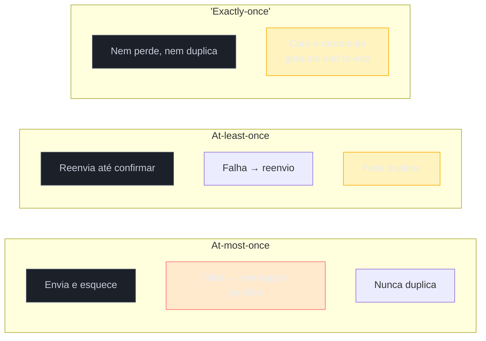
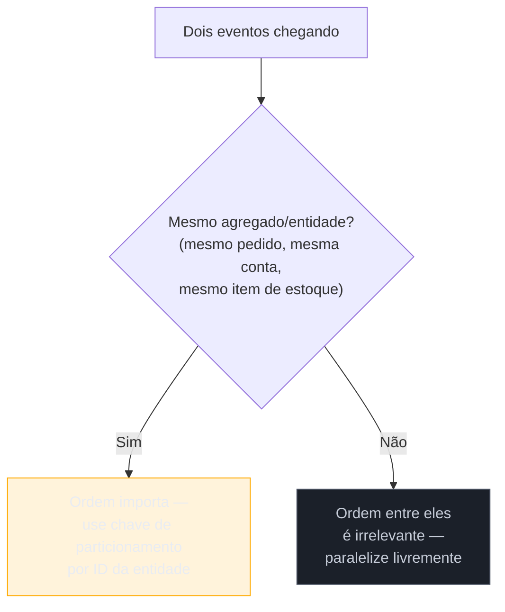

# Garantias de entrega e ordenação

> [!abstract] TL;DR
> Todo broker de mensageria promete uma de três garantias sobre cada mensagem: **at-most-once** (pode perder, nunca duplica — rápido e descartável), **at-least-once** (nunca perde, pode duplicar — o padrão da indústria, quase todo broker sério usa isso por default) e **exactly-once** (nem perde, nem duplica — caro, complexo, e na maior parte dos casos reais é uma aproximação de at-least-once mais idempotência do consumer, não uma garantia genuína de rede). Junto disso vem um segundo problema, independente mas correlato: **ordenação**. Sistemas distribuídos não garantem ordem global barata — o que existe na prática é ordenação **por partição** (Kafka), **por fila single-consumer** (RabbitMQ) ou **por grupo de mensagens** (SQS FIFO), e a regra que separa quando isso importa de quando não importa é simples de enunciar e fácil de esquecer sob pressão de prazo: eventos do **mesmo agregado** (o mesmo pedido, o mesmo item de estoque, a mesma conta) precisam de ordem; eventos de agregados **diferentes** não precisam de ordem nenhuma entre si.

Um evento `pagamento.aprovado` chega ao serviço de faturamento duas vezes, com quinze segundos de diferença. O código, escrito sem pensar nessa possibilidade, processa os dois: gera duas cobranças no cartão do cliente, dois emails de confirmação, um registro contábil duplicado que só alguém do financeiro vai notar dias depois, numa reconciliação de fim de mês. Em paralelo, num serviço vizinho de estoque, dois eventos sobre o mesmo SKU — `estoque.reservado` e `estoque.liberado` — chegam na ordem trocada: o consumer processa a liberação antes da reserva, porque um deles atravessou uma partição mais congestionada que a outra e chegou primeiro por pura coincidência de timing de rede. O estoque, que deveria terminar reservado, termina liberado — e o sistema vende um item que já tinha sido prometido a outro cliente.

Nenhum desses dois bugs nasce de um erro óbvio de código. Nascem de uma suposição implícita — "mensagem chega uma vez, na ordem que foi enviada" — que é falsa por padrão em qualquer sistema distribuído sério, e que só vira visível quando o volume de tráfego, uma falha de rede, ou um rebalanceamento de partição expõe a lacuna. Esta nota trata dos dois problemas separadamente porque eles **são** separados — um sistema pode garantir ordem perfeita e ainda assim duplicar mensagens; pode garantir "nunca duplica" e ainda assim entregar totalmente fora de ordem — mas os dois compartilham a mesma raiz: a rede não tem memória, e qualquer garantia forte sobre ela precisa ser construída em cima dela, nunca assumida de graça.

## O eixo das três garantias de entrega

Toda discussão séria de mensageria — de artigo técnico a pergunta de entrevista sênior — se ancora nesse vocabulário de três termos, porque eles descrevem o que **pode** dar errado numa entrega de mensagem através de uma rede que falha. A pergunta que cada garantia responde é: quando algo falha no meio do caminho (o producer não recebe confirmação, o broker cai, o consumer trava antes de confirmar o processamento), o que o sistema escolhe fazer?



### At-most-once — pode perder, nunca duplica

**O que é:** o producer envia a mensagem e segue em frente sem esperar confirmação (ou espera, mas não retenta se a confirmação falha); o consumer processa e marca como concluído **antes** de garantir que o processamento realmente terminou com sucesso. Se qualquer coisa falhar no meio do caminho — a rede, o broker, o próprio consumer — a mensagem é perdida e ninguém tenta de novo.

**Por que existe:** é a garantia mais barata em latência e simplicidade — nenhum retry, nenhuma deduplicação, nenhum armazenamento de estado sobre "já processei isso?". Quando a mensagem individual não tem valor suficiente para justificar o custo de garantir a entrega, at-most-once é a escolha correta, não uma negligência.

**Quando usar:** métricas de telemetria com amostragem (perder um ponto entre milhões não muda a curva), logs de debug de baixa prioridade, contadores de cliques em um dashboard onde um dado a menos não afeta decisão nenhuma. A régua prática: se a resposta para "o que acontece se essa mensagem específica simplesmente sumir?" for "nada que importe", at-most-once está correto.

### At-least-once — nunca perde, pode duplicar

**O que é:** o producer reenvia a mensagem até receber confirmação explícita de que o broker a persistiu; o broker reentrega ao consumer até receber confirmação explícita (`ack`) de que o processamento terminou. Isso garante que a mensagem **nunca** se perde silenciosamente — mas abre uma janela onde a mesma mensagem pode ser entregue mais de uma vez: o consumer processa com sucesso, mas o `ack` se perde na volta (rede caiu, o processo do consumer morreu entre processar e confirmar, um rebalanceamento de partição reatribuiu a mensagem para outra instância antes do `ack` chegar) — e o broker, sem confirmação, reentrega.

**Por que é o default de praticamente todo broker de produção:** é a única combinação que é, ao mesmo tempo, economicamente viável em escala e segura contra perda de dado — e perda de dado é, na esmagadora maioria dos domínios de negócio, mais cara que duplicação, porque duplicação tem solução conhecida (idempotência) enquanto perda de dado geralmente não tem volta. Kafka, RabbitMQ, SQS standard e a maior parte dos brokers de mercado usam at-least-once como garantia padrão.

**O preço a pagar:** at-least-once **exige** que o consumer seja idempotente — capaz de processar a mesma mensagem duas, três, dez vezes, e produzir exatamente o mesmo efeito no sistema que uma única execução produziria. Sem essa disciplina, a garantia "nunca perde" vira, na prática, "duplica silenciosamente", que costuma ser um bug pior do que perder dado — porque perder dado geralmente é percebido rápido (falta algo), enquanto duplicar é percebido tarde, quando o efeito colateral (uma cobrança dobrada, um estoque decrementado duas vezes) já se espalhou pelo sistema.

### "Exactly-once" — o termo mais mal-entendido de mensageria

**O que promete:** que cada mensagem produz exatamente um efeito observável — nem perdida, nem duplicada — do ponto de vista de quem consome. É a garantia mais desejável e a mais cara de todas, e também a mais frequentemente vendida de forma imprecisa por marketing de ferramenta.

> [!warning] "Exactly-once" como termo de marketing enganoso
> **O que acontece:** um time escolhe um broker porque a documentação anuncia "suporte a exactly-once delivery" e assume que isso resolve o problema de duplicação de uma vez por todas — sem precisar pensar em idempotência no próprio código. **Por quê:** exactly-once **delivery** genuína — no sentido estrito de "a mensagem atravessa a rede exatamente uma vez, sem exceção, sob qualquer falha" — é matematicamente impossível de garantir em um sistema distribuído real. A causa é estrutural, não uma limitação de implementação específica: para o producer saber que o broker recebeu a mensagem, ele precisa de uma confirmação; se essa confirmação se perde (mesmo que o broker tenha recebido perfeitamente), o producer, sem saber disso, reenvia — e agora existem duas cópias no sistema, a menos que *algum outro mecanismo* (deduplicação, idempotência) absorva a diferença. O que a maioria dos vendors realmente entrega, quando anuncia "exactly-once", é **exactly-once processing** ou **"effectively-once"** — o efeito observado é único, mas isso é construído em cima de at-least-once + deduplicação/idempotência internos ao sistema, não uma ausência genuína de duplicação na rede. **Como evitar:** ao avaliar qualquer claim de "exactly-once" de uma ferramenta, a pergunta certa não é "vocês têm exactly-once?" — é "exactly-once **dentro de qual fronteira**, e o que acontece quando a mensagem sai dessa fronteira para um sistema externo?". Kafka é o exemplo mais honesto disso: o EOS (Exactly-Once Semantics) do Kafka funciona de verdade **dentro do cluster Kafka** — produtor idempotente + transações multi-partição + consumer transacional —, mas no momento em que o efeito de processar essa mensagem sai do Kafka para outro sistema (um banco de dados, uma chamada HTTP externa, um email enviado), a garantia para de valer, porque esse sistema externo não participa da transação do Kafka.

O mecanismo real por trás do EOS do Kafka combina três peças, cada uma resolvendo uma fatia específica do problema:

1. **Produtor idempotente** (`enable.idempotence=true`, default desde o Kafka 3.0): o broker atribui um Producer ID (PID) e um número de sequência a cada lote enviado por aquele produtor; se o mesmo lote chegar duas vezes por causa de um retry de rede, o broker reconhece o número de sequência repetido e descarta a duplicata **antes** de gravar no log — o que resolve duplicação causada pelo **produtor** retentando, mas só dentro de uma única sessão de produtor.
2. **Transações**: permitem que um conjunto de escritas em múltiplas partições/tópicos aconteça atomicamente — tudo é commitado junto ou nada é, o que importa especialmente em pipelines de stream processing que leem de um tópico, processam, e escrevem em outro (read-process-write).
3. **Consumers em modo `read_committed`**: um consumer configurado para ler apenas mensagens de transações já commitadas nunca vê o resultado parcial de uma transação que falhou no meio.

> [!question]- Se `enable.idempotence=true` já é default no Kafka desde a versão 3.0, isso significa que meu consumer não precisa mais se preocupar com duplicação?
> Não — e essa é uma das pegadinhas clássicas de entrevista técnica sobre Kafka. `enable.idempotence=true` resolve a duplicação causada pelo **produtor** retentando o envio da mesma mensagem (por exemplo, um timeout de rede entre o produtor e o broker levando a um reenvio automático). Isso é inteiramente diferente da duplicação de **entrega** que o **consumer** pode sofrer: um rebalanceamento de partição que reatribui uma mensagem já processada mas ainda não confirmada (`ack`) para uma nova instância do consumer group, ou um consumer que processa a mensagem com sucesso mas morre antes de fazer commit do offset. Nenhuma dessas duas situações tem relação com o produtor — e `enable.idempotence` não protege contra nenhuma delas. Enquanto seu consumer não estiver dentro de uma transação Kafka-para-Kafka completa (produtor idempotente + transação + `read_committed`), ele continua precisando da própria disciplina de idempotência, exatamente como descrito na seção seguinte.

**Quando exactly-once genuíno vale o custo:** operações financeiras críticas onde duplicação é inaceitável e a fronteira transacional pode ser mantida inteiramente dentro do mesmo sistema — contabilidade interna, movimentação de saldo dentro de uma única plataforma. Fora dessa fronteira estreita, o padrão real de mercado — inclusive em sistemas financeiros — é at-least-once mais idempotência disciplinada, porque é mais simples de raciocinar, mais barato de operar, e produz exatamente o mesmo resultado observável quando bem implementado.

| Garantia | Pode perder? | Pode duplicar? | Custo | Quando usar |
|---|---|---|---|---|
| At-most-once | Sim | Não | Mínimo | Telemetria amostrada, logs de baixa prioridade |
| At-least-once | Não | Sim | Baixo-médio | A maioria dos casos reais — com consumer idempotente |
| "Exactly-once" | Não (na fronteira do sistema) | Não (na fronteira do sistema) | Alto | Pipelines internos Kafka-para-Kafka, contabilidade dentro de um único sistema |

**Resumo em uma frase:** at-least-once mais um consumer idempotente é, na prática, a forma mais barata e mais robusta de conseguir o mesmo efeito observável que "exactly-once" promete — sem pagar o custo de coordenação distribuída que a garantia genuína exigiria.

## Idempotência no consumer — a consequência prática do at-least-once

Se at-least-once é a garantia que a maioria dos sistemas usa, e at-least-once por definição pode duplicar, a única forma de um sistema real ser confiável é o **consumer** absorver essa duplicação sem produzir efeito duplicado. Essa é exatamente a mesma disciplina que a nota [[3 - Confiabilidade do contrato/01 - Idempotência|Idempotência]] já cobriu em profundidade do lado de uma API HTTP — armazenamento atômico de uma chave, distinção entre erro cacheável e transitório, TTL bem calibrado — e vale reafirmar aqui apenas a ponte conceitual, sem repetir os detalhes de implementação já tratados lá: **um consumer é idempotente se processar a mesma mensagem N vezes produz exatamente o mesmo efeito que processar 1 vez**, a mesma definição matemática (`f(f(x)) = f(x)`) por trás do padrão `Idempotency-Key`.

A diferença prática entre os dois lados está apenas em **quem inicia a duplicidade e de onde vem a chave de deduplicação**. No lado HTTP, é o cliente que retenta por timeout de rede, e a chave viaja explicitamente num header desenhado para esse propósito (`Idempotency-Key`). No consumer de mensageria, é o **broker** quem reentrega — por rebalanceamento de partição, por timeout de `ack`, por retry interno — e a chave de deduplicação tipicamente não vem de um header dedicado, mas de um identificador que já existe na própria mensagem: um `event_id` gerado pelo producer no momento da criação do evento, ou uma chave de negócio natural do domínio (um `payment_intent_id`, um número de pedido).

As táticas de implementação mais comuns, todas equivalentes em espírito à disciplina de idempotência HTTP, mas adaptadas ao formato de consumer de fila/tópico:

**1. Tabela de eventos processados, checada antes de agir:**

```java
@KafkaListener(topics = "pagamentos")
public void handle(PagamentoAprovadoEvent event) {
    if (processedEventsRepo.exists(event.getEventId())) {
        log.info("Evento {} já processado, ignorando", event.getEventId());
        return;
    }
    faturamentoService.registrarCobranca(event);
    // Registrar na MESMA transação do efeito de negócio — não depois, separado
    processedEventsRepo.save(new ProcessedEvent(event.getEventId()));
}
```

**2. Upsert em vez de insert cego**, deixando o próprio banco absorver a repetição:

```sql
INSERT INTO faturas (pedido_id, valor, status)
VALUES (?, ?, 'cobrado')
ON CONFLICT (pedido_id) DO UPDATE SET status = EXCLUDED.status;
```

**3. Operações que já são idempotentes por natureza**, evitando a necessidade de checagem explícita — setar um status é idempotente (`status = 'confirmado'` duas vezes dá o mesmo resultado); incrementar um contador não é (`contador += 1` duas vezes soma dobrado). Desenhar o efeito de negócio para usar `set` em vez de `increment`, sempre que a semântica de negócio permitir, elimina uma classe inteira de bug antes mesmo de precisar de deduplicação explícita.

O ponto que a nota de idempotência HTTP já deixou estabelecido e que vale reforçar aqui, porque é onde implementações de tutorial costumam falhar: gravar "processei esse evento" e executar o efeito de negócio **precisam estar na mesma transação atômica** — não em duas escritas separadas, uma no banco de negócio e outra numa tabela de controle isolada. Se as duas escritas estiverem em transações diferentes, existe uma janela real onde o efeito de negócio aconteceu mas o registro de deduplicação ainda não foi persistido — e uma falha exatamente nessa janela deixa o sistema exposto a reprocessar o mesmo evento no próximo redelivery, sem nenhum registro de que já tinha sido tratado.

## Ordenação de mensagens — um problema separado, frequentemente confundido com o anterior

Vale nomear explicitamente por que ordenação é tratada nesta mesma nota, mas como um problema **distinto**: uma mensagem pode ser entregue com garantia forte de "nunca duplica, nunca perde" e mesmo assim chegar fora de ordem — os dois eixos são ortogonais. Sistemas distribuídos, por natureza, têm múltiplos caminhos de rede, múltiplas partições processando em paralelo, múltiplos consumers competindo — e nenhuma dessas fontes de paralelismo tem, de graça, uma noção de "quem chegou primeiro" que sobreviva ao trajeto. Ordenação **global** — toda mensagem de todo produtor, numa única linha do tempo consistente — é cara o suficiente para exigir abrir mão de paralelismo quase inteiro; o que os brokers de mercado oferecem, na prática, é ordenação **parcial**, dentro de um escopo bem definido.

### Kafka: ordenação por partição

Um tópico Kafka é dividido em partições, e a garantia de ordem do Kafka é estrita **dentro de uma partição**: se a mensagem A foi escrita antes da mensagem B na mesma partição, todo consumer vai ler A antes de B, sem exceção. Entre partições diferentes, não existe garantia de ordem nenhuma — duas mensagens em partições distintas podem chegar ao consumer em qualquer ordem relativa, mesmo que uma tenha sido publicada visivelmente antes da outra no relógio de parede.

A ferramenta que transforma essa garantia parcial em algo útil é a **chave de particionamento**: o producer calcula um hash da chave escolhida (por exemplo, o ID do pedido ou o ID do cliente) para decidir em qual partição a mensagem cai — e, como o hash da mesma chave sempre aponta para a mesma partição, todas as mensagens daquela entidade caem sempre na mesma fila ordenada.

```java
// Todas as mensagens do pedido 42 vão para a mesma partição — ordem garantida entre elas
producer.send("pedidos", "pedido-42", eventoJson);
```

O trade-off é direto: se a exigência real é ordem **global** entre todas as mensagens do tópico, a única forma de garantir isso no Kafka é usar uma única partição — o que elimina o paralelismo que é justamente a razão de existirem múltiplas partições. Uma armadilha adicional que costuma passar despercebida: **adicionar partições a um tópico existente quebra a garantia de ordem por chave que já estava em vigor** — porque o mapeamento chave→partição é feito por `hash(chave) mod número_de_partições`, e mudar o número de partições muda o resultado desse cálculo para chaves que já existiam, redirecionando eventos futuros da mesma entidade para uma partição diferente da que os eventos antigos ocuparam.

### RabbitMQ: ordenação por fila

RabbitMQ preserva ordem estrita (FIFO) quando a fila tem **um único consumer** ativo. O problema aparece quando múltiplos consumers competem pela mesma fila (o padrão *competing consumers*, usado justamente para escalar throughput): cada consumer pega mensagens em paralelo, e não há garantia de que terminem de processar na mesma ordem em que pegaram — um consumer mais lento pode terminar depois de outro que pegou uma mensagem posterior.

A feature que resolve isso sem abrir mão de ter múltiplos consumers registrados (para failover, não para paralelismo) é o **Single Active Consumer** (SAC): apenas um consumer entre os registrados fica ativo de fato a qualquer momento; se ele cai, outro assume — preservando ordem estrita porque, na prática, só um processa por vez. Combinado com um `prefetch` de 1 (o consumer só recebe a próxima mensagem depois de confirmar a anterior), o RabbitMQ garante ordem mesmo em cenários de reentrega — uma mensagem redelivered volta para o início da fila antes da próxima entrega acontecer.

### SQS: FIFO queues por grupo de mensagens

O SQS padrão (standard queue) não garante ordem nenhuma — mensagens podem chegar fora de sequência mesmo em uso normal, sem qualquer falha envolvida. A variante **FIFO** resolve isso através do conceito de `MessageGroupId`: mensagens com o mesmo `MessageGroupId` são entregues estritamente na ordem em que chegaram; mensagens de grupos diferentes não têm relação de ordem entre si — a mesma lógica de "chave de particionamento" do Kafka, com nome diferente. O custo histórico dessa garantia era throughput reduzido, mas a AWS introduziu filas FIFO de alto throughput que aumentam o limite distribuindo a carga entre mais grupos de mensagens em paralelo, mantendo ordem dentro de cada grupo individual.

### A regra prática

O critério que decide se ordenação importa de verdade não é sobre o tipo de mensagem — é sobre se as mensagens em questão **descrevem o mesmo agregado ou entidade de negócio**.



- **Ordem importa** quando processar fora de sequência muda o resultado final: `estoque.reservado` seguido de `estoque.liberado` do **mesmo SKU** — inverter a ordem deixa o estoque num estado errado. `pedido.criado` seguido de `pedido.cancelado` do **mesmo pedido** — processar o cancelamento antes da criação é, na melhor das hipóteses, um no-op incorreto, e na pior, uma exceção não tratada.
- **Ordem não importa** quando os eventos são de entidades independentes: `pedido.criado` do cliente A e `pedido.criado` do cliente B não têm relação nenhuma entre si — processar o de B antes do de A não muda nada no resultado de nenhum dos dois. Forçar ordem global entre eventos independentes só adiciona gargalo sem nenhum ganho de correção.

A implicação de design prática: a chave de particionamento (Kafka), o grupo de mensagens (SQS FIFO), ou a decisão de usar Single Active Consumer (RabbitMQ) deve ser escolhida com base no **identificador do agregado**, nunca de forma genérica ou aleatória — usar o ID do pedido, do item de estoque, da conta, garante que tudo que precisa de ordem entre si cai na mesma fila/partição, enquanto tudo que é independente continua paralelizável entre partições/filas diferentes.

**Resumo em uma frase:** ordenação forte custa paralelismo, então a decisão certa não é "quero tudo ordenado" nem "não preciso de ordem nenhuma" — é "quais eventos descrevem a mesma entidade, e só esses precisam viajar na mesma fila ordenada".

## Casos práticos

**Cobrança duplicada por reentrega em rebalanceamento de partição.** Um serviço de faturamento consome o tópico `pagamentos` via Kafka, sem nenhuma tabela de deduplicação — a suposição implícita da equipe era "o Kafka já garante que cada mensagem chega uma vez". Durante um deploy que reinicia instâncias do consumer group, o Kafka reatribui partições entre as instâncias remanescentes (rebalanceamento); uma mensagem que já tinha sido processada por uma instância, mas cujo commit de offset ainda não tinha sido persistido no momento do rebalanceamento, é reentregue à instância que assumiu a partição. Sem checagem de `event_id` já processado, o efeito de negócio — gerar a cobrança — roda de novo. O cliente vê duas cobranças no extrato, exatamente o cenário que a idempotência do consumer existe para prevenir; a correção foi adicionar a tabela `processed_events`, checada e gravada na mesma transação que gera a cobrança.

**Estoque em estado inconsistente por ordenação quebrada.** Um serviço de estoque publica eventos `estoque.reservado` e `estoque.liberado` para o mesmo SKU sem usar uma chave de particionamento consistente — o producer publica cada evento com uma chave aleatória (gerada por evento, não por SKU), então dois eventos do mesmo item podem cair em partições diferentes e chegar ao consumer fora de ordem. Numa Black Friday com volume alto, um evento de liberação (disparado por um timeout de reserva expirada) chega e é processado **antes** do evento de reserva que o originou, porque a reserva ficou temporariamente presa numa partição mais congestionada. O item termina marcado como "disponível" quando deveria estar reservado, e é vendido duas vezes. A correção: particionar por `sku_id` em vez de gerar uma chave aleatória por mensagem, garantindo que todo evento do mesmo item caia sempre na mesma partição, na ordem em que foi publicado.

**Exactly-once anunciado, duplicação real fora da fronteira do broker.** Um time escolhe um broker que anuncia "exactly-once delivery" na própria documentação de marketing e, confiando nisso, remove a checagem de idempotência que já existia no consumer — assumindo que o broker resolve o problema de ponta a ponta. O pipeline em questão lê do broker e escreve num serviço de email transacional externo (fora do broker). Sob uma falha específica — o consumer processa a mensagem, dispara o envio do email, mas crasha antes de confirmar o offset — o broker reentrega a mesma mensagem, e o efeito colateral externo (o email) roda de novo, porque a garantia "exactly-once" do broker cobre apenas o que acontece **dentro dele**, nunca o efeito que sai para um sistema externo que não participa da mesma transação.

## Em entrevista

"Qual a diferença entre at-least-once e exactly-once, e por que a maioria dos sistemas usa at-least-once mesmo quando duplicação parece perigosa?" é uma pergunta clássica de entrevista sênior de sistemas distribuídos — e a resposta que sinaliza profundidade real não para na definição de dicionário. Ela precisa nomear que exactly-once **delivery** genuína é impossível de garantir através de uma rede que pode perder confirmações — e que o que sistemas reais chamam de "exactly-once" é, quase sempre, at-least-once combinado com deduplicação/idempotência, funcionando dentro de uma fronteira transacional específica (o exemplo mais citável é o EOS do Kafka, que funciona dentro do cluster mas não se estende automaticamente a sistemas externos).

Um segundo sinal forte é trazer a pegadinha do `enable.idempotence` do Kafka sem que o entrevistador precise puxar: "produtor idempotente resolve duplicação causada pelo **produtor** retentando um envio; não tem nada a ver com a duplicação de **entrega** que o consumer sofre por rebalanceamento ou timeout de ack — são dois problemas diferentes que só coincidem no nome". Isso demonstra que você já debugou esse tipo de confusão em produção, não apenas leu a documentação.

Sobre ordenação, o sinal que separa quem já operou sistema de mensageria em escala de quem só estudou o conceito é a resposta à pergunta "como você garante ordem num tópico Kafka com múltiplas partições?" — a resposta errada, de quem nunca lidou com isso, é "usa uma fila FIFO" genérica ou "ordena no consumer depois"; a resposta certa nomeia a chave de particionamento por ID de agregado, explica que ordem garantida é sempre **por partição**, nunca global (a menos que se abra mão de paralelismo com uma única partição), e sabe dizer que aumentar o número de partições de um tópico existente quebra a garantia de ordem por chave que já estava em vigor — um detalhe operacional que só aparece depois de causar (ou debugar) esse bug uma vez.

## How to explain in English

> "Every messaging system makes a choice about what happens when something fails mid-delivery: at-most-once means a message can be lost but never duplicated — cheap, used for data where losing a point doesn't matter, like sampled telemetry. At-least-once means a message is never lost but can be delivered more than once — this is the default for almost every production broker, because losing data is almost always worse than duplicating it, and duplication has a known fix. 'Exactly-once' is the term that gets misused the most: genuine exactly-once *delivery* is provably impossible over an unreliable network, because if an acknowledgment gets lost, the sender has no way to know whether the message actually arrived, so it retries — and now there might be two copies unless something else absorbs the difference. What most systems that advertise exactly-once actually deliver is exactly-once *processing*, or 'effectively-once' — built on top of at-least-once plus deduplication or idempotency, and usually only within a specific transactional boundary. Kafka's exactly-once semantics, for example, genuinely hold inside the Kafka cluster — idempotent producer plus multi-partition transactions plus read-committed consumers — but the guarantee stops the moment the effect of processing a message leaves Kafka for an external system, like a database write or an email send, that isn't part of that transaction.
>
> Ordering is a separate axis entirely — a system can guarantee zero duplication and still deliver messages out of order, because distributed systems have multiple parallel paths by default, and none of them carry an inherent sense of 'what came first' across that parallelism. What real brokers offer is partial ordering: Kafka guarantees order within a partition, RabbitMQ guarantees FIFO order with a single active consumer, SQS FIFO guarantees order within a message group. The practical rule for whether ordering actually matters: if two events describe the same aggregate — the same order, the same inventory item, the same account — order matters and you should partition by that entity's ID. If they describe independent entities, ordering between them is irrelevant, and forcing it just adds bottleneck for no correctness gain."

| PT | EN |
|----|----|
| Garantia de entrega | Delivery guarantee / delivery semantics |
| No máximo uma vez | At-most-once |
| Pelo menos uma vez | At-least-once |
| Exatamente uma vez (aproximação) | Exactly-once (approximation) / effectively-once |
| Processamento idempotente | Idempotent processing |
| Consumer idempotente | Idempotent consumer |
| Reentrega | Redelivery |
| Rebalanceamento de partição | Partition rebalance |
| Ordenação parcial | Partial ordering |
| Chave de particionamento | Partitioning key |
| Agregado / entidade de negócio | Aggregate / business entity |
| Consumidores concorrentes | Competing consumers |
| Fronteira transacional | Transactional boundary |

## O que vem a seguir

Garantir que uma mensagem chega uma vez só (ou de forma segura para reprocessar) e na ordem certa resolve metade do problema de confiabilidade assíncrona — a outra metade é garantir que a **publicação** do evento em si não perca sincronia com a transação de negócio que a originou. Se o serviço grava o pedido no banco e falha ao publicar o evento correspondente (ou vice-versa), o sistema fica inconsistente de um jeito que nenhuma garantia de entrega, sozinha, resolve. É exatamente esse problema — e o padrão que o resolve na origem — que a próxima nota deste sub-galho cobre.

- [[04 - Outbox e Saga|Outbox e Saga]] — como garantir atomicidade entre escrita no banco e publicação de evento, e como coordenar transações que atravessam múltiplos serviços

## Veja também

- [[Comunicação entre Sistemas/index|Comunicação entre Sistemas]] — o galho-pai desta trilha
- [[4 - Comunicação assíncrona/index|Comunicação assíncrona]] — MOC deste sub-galho
- [[Mensageria/Mensageria|Mensageria]] — panorama de ferramentas (Kafka, RabbitMQ, SQS, BullMQ) e implementação prática das garantias descritas aqui
- [[3 - Confiabilidade do contrato/01 - Idempotência|Idempotência]] — a mesma disciplina de idempotência aplicada ao lado HTTP/API, com os detalhes de armazenamento atômico e TTL que esta nota não repetiu

## Fontes

- Confluent — [*Exactly-once Semantics is Possible: Here's How Apache Kafka Does It*](https://www.confluent.io/blog/exactly-once-semantics-are-possible-heres-how-apache-kafka-does-it/) (acessado 2026-07-09) — mecanismo do EOS: produtor idempotente, transações, `read_committed`.
- Apache Kafka / cwiki — [*Idempotent Producer*](https://cwiki.apache.org/confluence/display/KAFKA/Idempotent+Producer) (acessado 2026-07-09) — como `enable.idempotence` deduplica no broker via PID + sequence number.
- Conduktor — [*Kafka Idempotent Producer (enable.idempotence)*](https://www.conduktor.io/kafka/idempotent-kafka-producer) (acessado 2026-07-09) — escopo e limite do produtor idempotente (só dentro da sessão do produtor).
- ByteByteGo — [*At most once, at least once, exactly once*](https://blog.bytebytego.com/p/at-most-once-at-least-once-exactly) (acessado 2026-07-09) — panorama comparativo das três garantias.
- EventSourcingDB — [*Exactly Once is a Lie*](https://docs.eventsourcingdb.io/blog/2025/11/20/exactly-once-is-a-lie/) (acessado 2026-07-09) — crítica ao termo como promessa de marketing; distinção delivery vs processing.
- Brave New Geek — [*You Cannot Have Exactly-Once Delivery*](https://bravenewgeek.com/you-cannot-have-exactly-once-delivery/) (acessado 2026-07-09) — argumento formal de por que exactly-once delivery é impossível numa rede não confiável.
- Google Cloud Docs — [*Exactly-once delivery — Pub/Sub*](https://docs.cloud.google.com/pubsub/docs/exactly-once-delivery) (acessado 2026-07-09) — exactly-once do Pub/Sub restrito a pull subscriptions, trade-off de throughput.
- Google Cloud Docs — [*Order messages — Pub/Sub*](https://docs.cloud.google.com/pubsub/docs/ordering) (acessado 2026-07-09) — ordering keys, comportamento de redelivery em cadeia.
- Confluent — [*Apache Kafka Partition Key: A Comprehensive Guide*](https://www.confluent.io/learn/kafka-partition-key/) (acessado 2026-07-09) — hash de chave, ordenação por partição, efeito de adicionar partições.
- Baeldung — [*Ensuring Message Ordering in Kafka*](https://www.baeldung.com/kafka-message-ordering) (acessado 2026-07-09) — estratégias e configurações de ordenação.
- RabbitMQ Docs — [*Consumer Prefetch*](https://www.rabbitmq.com/docs/consumer-prefetch) (acessado 2026-07-09) — prefetch e impacto em ordenação sob múltiplos consumers.
- RabbitMQ Blog — [*How quorum queues deliver locally while still offering ordering guarantees*](https://www.rabbitmq.com/blog/2020/06/23/quorum-queues-local-delivery) (acessado 2026-07-09) — Single Active Consumer e garantias de ordem em quorum queues.
- AWS Docs — [*FIFO queue delivery logic — Amazon SQS*](https://docs.aws.amazon.com/AWSSimpleQueueService/latest/SQSDeveloperGuide/FIFO-queues-understanding-logic.html) (acessado 2026-07-09) — `MessageGroupId`, deduplicação por 5 minutos, ordenação por grupo.
- AWS Docs — [*Enabling high throughput for FIFO queues*](https://docs.aws.amazon.com/AWSSimpleQueueService/latest/SQSDeveloperGuide/enable-high-throughput-fifo.html) (acessado 2026-07-09) — throughput por grupo de mensagens em filas FIFO de alto throughput.
- NATS Docs — [*JetStream*](https://docs.nats.io/nats-concepts/jetstream) (acessado 2026-07-09) — deduplicação por publish ID e double-ack como mecanismo de exactly-once no JetStream.
- Cockroach Labs — [*Idempotency and ordering in event-driven systems*](https://www.cockroachlabs.com/blog/idempotency-and-ordering-in-event-driven-systems/) (acessado 2026-07-09) — ordenação por agregado vs ordenação global em arquitetura orientada a eventos.
- Martin Kleppmann — *Designing Data-Intensive Applications*, cap. 11 (Stream Processing) — fundamento teórico de exactly-once semantics e idempotência em processamento de streams.
- [[3 - Confiabilidade do contrato/01 - Idempotência]] — idempotência do lado HTTP/API, conceito irmão reaproveitado por referência nesta nota.
