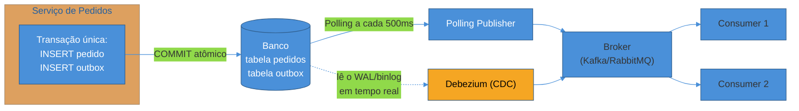
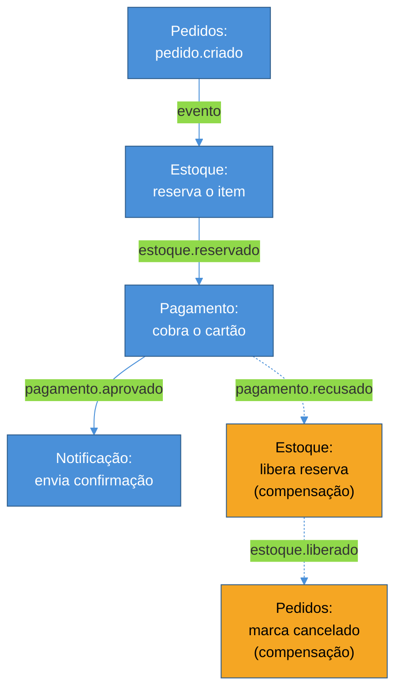
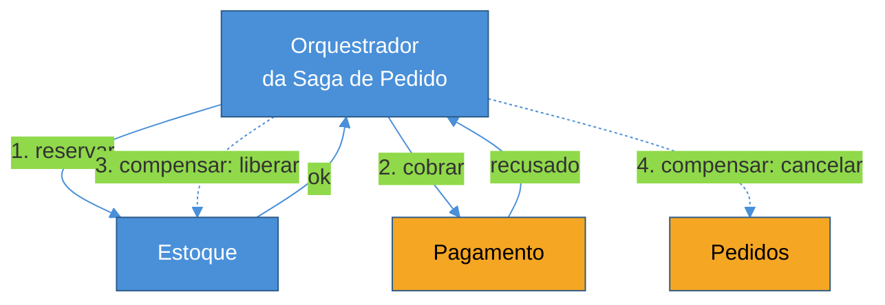

# Outbox e Saga

> [!abstract] TL;DR
> Duas escritas que precisam acontecer juntas — "salvar no banco" e "publicar o evento" — nunca são realmente atômicas quando vivem em dois sistemas diferentes: é o **dual-write problem**. O **Outbox Pattern** resolve a versão local desse problema: grava o evento numa tabela `outbox` dentro da **mesma** transação de banco que grava o dado de negócio, e um processo separado (poller ou CDC/Debezium lendo o WAL) publica esse evento no broker de forma confiável, depois. Isso não elimina a necessidade de idempotência no consumer — o outbox garante **at-least-once**, nunca exactly-once — mas elimina a inconsistência silenciosa de "commitei o banco e o evento simplesmente sumiu". A **Saga** resolve um problema vizinho, mas diferente: quando uma operação de negócio atravessa múltiplos serviços e não existe uma transação ACID que cubra todos eles, a saga substitui rollback de banco por **compensação** — uma sequência de transações locais, cada uma com uma ação que desfaz seu efeito se um passo posterior falhar. Duas formas de coordenar essa sequência competem: **coreografia** (cada serviço reage a eventos, sem coordenador central — desacoplado, mas o fluxo completo só existe na cabeça de quem olha os logs de todos os serviços ao mesmo tempo) e **orquestração** (um orquestrador central comanda cada passo — visibilidade e depuração fáceis, ao custo de acoplar todo mundo ao orquestrador). Nenhuma das duas dispensa idempotência nem outbox — sagas modernas de produção usam os dois patterns desta nota, empilhados.

Sexta-feira à noite, pico de tráfego de um e-commerce comum. Um cliente finaliza a compra do item que faltava pro carrinho de presente de aniversário da esposa. O serviço de pedidos roda exatamente o código que qualquer tutorial de mensageria ensina no primeiro exemplo:

```java
@Transactional
public void criarPedido(Pedido pedido) {
    pedidoRepo.save(pedido);          // grava no banco — COMMIT
    kafka.send("pedidos.criados", pedido.toEvent());  // publica no broker
}
```

O `save` roda dentro da transação, comita, e o banco confirma: o pedido existe, com status `criado`. Um milissegundo depois, a chamada ao Kafka — que está fora da transação de banco, porque não existe transação que abranja PostgreSQL e Kafka ao mesmo tempo — tenta publicar o evento `pedido.criado`. Nesse exato instante, o broker está passando por um rebalanceamento de partição, ou a rede entre o serviço e o cluster Kafka sofre um blip de dois segundos, ou o processo do serviço recebe um `SIGKILL` de um autoscaler nervoso um instante antes da chamada de rede completar. O `send()` lança uma exceção — ou pior, nem lança, porque o timeout do client Kafka nunca é notificado do resultado real.

O pedido existe no banco. O evento nunca saiu. Nenhum serviço downstream — estoque, pagamento, notificação — jamais fica sabendo que esse pedido foi criado. Do ponto de vista do cliente, a compra "deu certo": a tela mostra confirmação, porque o `@Transactional` do banco comitou sem erro nenhum visível na resposta HTTP (o erro do Kafka, se for tratado às pressas, no máximo aparece num log que ninguém lê até o cliente ligar reclamando, dias depois, que o pedido nunca chegou). O dado não foi perdido — está lá, na tabela `pedidos`, com status `criado`, imóvel. Mas o **efeito** que aquele dado deveria disparar — reservar estoque, iniciar cobrança, notificar o centro de distribuição — nunca aconteceu, e não existe nenhum sinal de erro em lugar nenhum que aponte pra essa lacuna. É o tipo de bug que passa em todo teste de unidade (o banco está sempre disponível no laptop do desenvolvedor) e só aparece em produção, sob a carga e a instabilidade de rede que só produção tem.

Esta nota trata de dois padrões que resolvem duas versões do mesmo problema de fundo — como sustentar uma operação de negócio que precisa de mais de uma escrita atômica, num mundo sem transações distribuídas baratas. O **Outbox** resolve a versão mais simples: uma escrita local, um evento a publicar. A **Saga** resolve a versão mais dura: uma cadeia de escritas espalhadas por serviços diferentes, cada um dono de seu próprio banco, sem nenhuma autoridade central capaz de travar todos eles ao mesmo tempo.

## O dual-write problem, nomeado com precisão

**O que é:** dual write acontece toda vez que uma operação lógica precisa escrever em dois sistemas diferentes — um banco relacional e um broker de mensagens, um banco e um índice de busca, um banco e o cache — e essas duas escritas não podem, estruturalmente, fazer parte da mesma transação ACID. A causa-raiz não é um bug de implementação corrigível com mais cuidado no código: é a ausência de atomicidade **distribuída** — transações ACID garantem tudo-ou-nada dentro de uma única base de dados; no momento em que a operação cruza a fronteira para um segundo sistema independente, essa garantia simplesmente não existe mais, porque nenhum dos dois sistemas sabe nada sobre o estado do outro.

**Por que "escrever no banco primeiro, publicar depois" nunca resolve isso de verdade:** existem exatamente duas ordens possíveis para as duas escritas, e as duas têm uma janela de falha:

- **Banco primeiro, depois broker** (o exemplo acima): se a publicação falhar depois do commit do banco, o dado de negócio existe mas o evento nunca sai — o cenário do pedido fantasma.
- **Broker primeiro, depois banco**: se o commit do banco falhar depois da publicação, o evento já saiu pro mundo — outros serviços já podem estar reagindo a ele — mas o dado de negócio que o originou nunca existiu de verdade. Um serviço de estoque recebe `pedido.criado` e reserva um item para um pedido que, no banco de pedidos, não existe.

Nenhuma das duas ordens é "mais certa" — as duas são dual-write, e as duas têm uma janela de inconsistência real, só que em direções opostas.

> [!question]- Por que não usar uma transação distribuída de verdade — 2PC, XA — e resolver isso na raiz?
> Porque o custo de 2PC (two-phase commit) é alto demais para o ganho que ele entrega em arquitetura de microsserviços, e a indústria abandonou esse caminho por um motivo estrutural, não por moda. 2PC funciona coordenando um "prepare" (todo participante trava os recursos e sinaliza "pronto para commitar") seguido de um "commit" (o coordenador manda todo mundo efetivar). O problema é que, entre o `prepare` e o `commit`, **todo participante fica bloqueado segurando locks** — se o coordenador cair nesse meio-tempo, cada participante fica preso indefinidamente, sem saber se deve commitar ou reverter, até o coordenador voltar. Isso é aceitável dentro de um único banco de dados (onde o coordenador é o próprio motor transacional, altamente confiável e local); é inaceitável entre serviços de times diferentes, com deploys independentes, latência de rede variável e disponibilidade individual menor que 100% — bloquear um serviço inteiro esperando outro responder é exatamente o acoplamento temporal que a arquitetura assíncrona existe para evitar (ver [[01 - Síncrono vs assíncrono — quando desacoplar|nota anterior deste sub-galho]]). Brokers de mensagem modernos (Kafka, RabbitMQ, SQS) também, em geral, não participam de coordenadores XA — então mesmo tecnicamente, 2PC entre um banco relacional e um broker de eventos costuma nem estar disponível como opção.

O Outbox Pattern e a Saga não fingem que esse problema não existe — eles aceitam a ausência de atomicidade distribuída como fato estrutural e constroem garantias equivalentes em cima disso, sem nunca travar um serviço esperando outro.

## Outbox Pattern — atomicidade sem transação distribuída

**O que é, em uma frase:** em vez de escrever no banco e depois publicar no broker (duas escritas separadas, dois sistemas), o serviço escreve **duas linhas na mesma transação do mesmo banco** — uma na tabela de negócio, outra numa tabela `outbox` — e delega a publicação real no broker a um processo separado que lê essa tabela depois.

```java
@Transactional
public void criarPedido(Pedido pedido) {
    pedidoRepo.save(pedido);
    outboxRepo.save(new OutboxEvent(
        "pedido.criado",
        pedido.getId(),
        serialize(pedido.toEvent())
    ));
    // Uma única transação, um único COMMIT — ou as duas linhas existem, ou nenhuma existe.
}
```

**Por que isso resolve o problema:** o banco relacional já sabe fazer atomicidade dentro de si mesmo — é justamente a garantia ACID que ele oferece de graça, há décadas. Ao mover a "intenção de publicar um evento" para dentro do próprio banco (como uma linha numa tabela, em vez de uma chamada de rede para um sistema externo), o Outbox transforma um problema de atomicidade **distribuída** (banco + broker, impossível sem 2PC) num problema de atomicidade **local** (duas tabelas do mesmo banco, trivial — é a mesma transação de sempre). Se a transação falhar, nenhuma das duas linhas existe. Se comitar, as duas existem — inclusive a que registra "esse evento precisa ser publicado".

A publicação real, pro Kafka/RabbitMQ/SQS, vira responsabilidade de um segundo processo, desacoplado da transação de negócio original — e é aí que entram as duas variações do padrão:

### Polling Publisher — o caminho simples

Um job roda em intervalos curtos, lê as linhas pendentes da tabela `outbox`, publica cada uma no broker, e marca como publicada (ou deleta a linha).

```java
@Scheduled(fixedDelay = 500)
public void publicarPendentes() {
    List<OutboxEvent> pendentes = outboxRepo.findPendentes(100);
    for (var evento : pendentes) {
        kafka.send(evento.getTopico(), evento.getPayload());
        outboxRepo.marcarPublicado(evento.getId());
    }
}
```

É simples de implementar, roda com as ferramentas que qualquer time já tem (um scheduler, uma query), e funciona bem em volumes baixos e médios. O preço é latência (o evento só sai no próximo tick do poller, não instantaneamente) e uma carga de leitura constante no banco, que em volume alto de escrita pode competir por recursos com o próprio tráfego transacional que a tabela `outbox` está tentando servir.

### Transaction log tailing (CDC) — o caminho de escala

Em vez de um processo consultando a tabela por fora, uma ferramenta de **Change Data Capture** lê diretamente o log de transações do banco (o WAL do PostgreSQL, o binlog do MySQL) — o mesmo mecanismo interno que o banco usa para replicação — e emite um evento toda vez que uma linha nova aparece na tabela `outbox`. **Debezium**, hoje o padrão de mercado open source pra isso, roda como um connector do Kafka Connect: monitora o WAL, detecta o `INSERT` na tabela `outbox` no instante em que ele é comitado, e publica o payload correspondente no tópico Kafka certo — sem nunca rodar uma query `SELECT` contra a tabela de negócio.

A vantagem é dupla: **latência quase zero** (o evento sai assim que a transação comita, não no próximo polling) e **zero carga de leitura adicional** no banco (o WAL já existe, o banco já o escreve independente do Debezium existir ou não). O preço é mais peças móveis — um cluster Kafka Connect rodando, permissão de replicação configurada no banco, uma dependência operacional a mais para monitorar — e um acoplamento mais estreito aos detalhes internos do motor de banco escolhido.



> [!warning] Outbox garante at-least-once, nunca exactly-once
> **O que acontece:** um time implementa o Outbox Pattern, vê que o problema do pedido fantasma desapareceu, e assume que resolveu "o problema de duplicação" também — removendo, ou nunca implementando, a checagem de idempotência no lado consumer. **Por quê:** tanto o Polling Publisher quanto o CDC podem publicar um evento no broker e **morrer antes de marcar esse evento como publicado** (o processo cai entre o `kafka.send()` bem-sucedido e o `UPDATE outbox SET publicado = true`). Na próxima execução, o mesmo evento é lido de novo da tabela — porque, do ponto de vista do relay, ele ainda está marcado como pendente — e publicado uma segunda vez. O Outbox elimina a janela de **perda** (o evento nunca fica preso só no banco sem sair), mas não elimina a possibilidade de **duplicação** — a mesma dualidade que a nota anterior deste sub-galho já nomeou como at-least-once. **Como evitar:** o consumer que lê do outro lado do broker precisa da mesma disciplina de idempotência já detalhada em [[03 - Garantias de entrega e ordenação|Garantias de entrega e ordenação]] — um `event_id` estável (o ID gerado no momento em que a linha da outbox foi criada, não um novo ID a cada tentativa de publicação) e uma checagem atômica de "já processei isso" antes de aplicar o efeito de negócio. Outbox e idempotência no consumer não são alternativas — são as duas metades da mesma garantia de ponta a ponta.

**Resumo em uma frase:** o Outbox Pattern não inventa atomicidade entre banco e broker — ele move o problema para dentro do banco, onde atomicidade já existe de graça, e transforma a publicação real numa operação assíncrona e retentável que precisa de idempotência do outro lado, exatamente como qualquer entrega at-least-once.

## Saga — coordenando o que o Outbox, sozinho, não alcança

O Outbox resolve uma escrita local mais um evento. Mas o cenário do pedido do início desta nota não termina com "publicar o evento `pedido.criado`" — ele continua: alguém precisa **debitar o estoque**, alguém precisa **cobrar o pagamento**, alguém precisa **notificar o cliente e o centro de distribuição**. Cada um desses passos vive num serviço diferente, com seu próprio banco, seu próprio time, seu próprio ciclo de deploy. Não existe — e não deveria existir — uma transação ACID única que trave as tabelas de pedidos, estoque, pagamento e notificação ao mesmo tempo: isso recriaria exatamente o acoplamento síncrono forte que a arquitetura de microsserviços existe para evitar.

**O que é uma Saga, em uma frase:** uma sequência de transações **locais**, uma por serviço, onde cada transação tem uma **ação compensatória** definida de antemão — uma operação que desfaz o efeito daquela transação especificamente, caso um passo posterior da sequência falhe.

O ponto central, fácil de deixar passar batido na primeira leitura: **compensação não é rollback**. Rollback de banco desfaz uma transação que nunca foi confirmada — o efeito nunca existiu do ponto de vista de qualquer outro observador. Compensação desfaz o efeito de uma transação que **já foi confirmada, já é visível, e pode já ter disparado outros efeitos colaterais** (um email de confirmação de pagamento já pode ter sido enviado antes de a compensação rodar). "Estornar o pagamento" não é "fingir que a cobrança nunca aconteceu" — é uma segunda operação de negócio, com seu próprio rastro contábil, que produz o efeito líquido equivalente a não ter cobrado, mas sem apagar a história de que a cobrança aconteceu e foi revertida.

### O exemplo trabalhado: pedido atravessando três serviços

Continuando o cenário desta nota — pedido, estoque, pagamento, notificação — a saga completa, na ordem feliz, seria:

1. **Serviço de Pedidos** cria o pedido com status `pendente` (transação local, com Outbox publicando `pedido.criado`).
2. **Serviço de Estoque** reserva os itens do pedido (transação local, com Outbox publicando `estoque.reservado`).
3. **Serviço de Pagamento** cobra o cartão do cliente (transação local, com Outbox publicando `pagamento.aprovado`).
4. **Serviço de Notificação** envia a confirmação (efeito colateral externo, sem necessidade de compensação própria — só reenvio se falhar).

Agora o caso que interessa de verdade: o passo 3 falha — o cartão foi recusado por saldo insuficiente. Nesse ponto, o estoque **já foi reservado** (passo 2 já comitou e é visível). Reverter isso não é "desfazer uma transação pendente" — é rodar uma nova operação de negócio, a compensação:

- **Serviço de Estoque** executa `liberarReserva(pedidoId)` — uma transação local nova, que devolve o item ao estoque disponível.
- **Serviço de Pedidos** atualiza o status do pedido para `cancelado_pagamento_recusado` — outra transação local nova.

Nenhum desses dois passos é um `ROLLBACK` de SQL. São `INSERT`s e `UPDATE`s novos, desenhados de antemão especificamente para desfazer o efeito observável dos passos anteriores.

### Coreografia — cada serviço reage a eventos

Na coreografia, não existe coordenador. Cada serviço publica um evento quando termina sua parte, e os serviços seguintes da cadeia estão inscritos nesses eventos — reagindo, cada um por conta própria, sem que ninguém tenha uma visão centralizada do fluxo inteiro.



**A favor:** desacoplamento máximo — o serviço de Pagamento não precisa saber que existe um serviço de Notificação, só precisa publicar `pagamento.aprovado` e seguir em frente; adicionar um quinto serviço à saga (por exemplo, um serviço de fidelidade que credita pontos) não exige tocar em nenhum dos quatro serviços existentes, só inscrever o novo serviço no evento certo. Escala bem em throughput, porque não existe um ponto central por onde toda mensagem precisa passar.

**Contra:** o fluxo completo da saga **não existe em lugar nenhum do código** — ele só existe implicitamente, espalhado pelos handlers de evento de quatro serviços diferentes, em quatro repositórios diferentes. Para entender "o que acontece quando um pagamento é recusado", alguém precisa ler o código do serviço de Pagamento (que publica o evento de recusa), depois adivinhar quem está inscrito nesse evento, ler o código do serviço de Estoque, e assim por diante. Depurar uma saga coreografada em produção — "por que esse pedido ficou preso em `pendente` por três dias?" — costuma exigir correlacionar logs de quatro serviços diferentes por `pedido_id`, sem um único lugar que mostre o estado atual da saga inteira.

### Orquestração — um coordenador central comanda os passos

Na orquestração, existe um componente explícito — o orquestrador — que conhece a sequência completa da saga e chama cada serviço, um de cada vez, decidindo o que fazer a seguir com base na resposta.



```
OrderSagaOrchestrator:
  1. EstoqueService.reservar(pedido)   → sucesso
  2. PagamentoService.cobrar(pedido)   → FALHA (cartão recusado)
  3. Compensar (ordem inversa):
     3a. EstoqueService.liberarReserva(pedido)
     3b. PedidoService.marcarCancelado(pedido)
```

**A favor:** o fluxo completo existe em um único lugar — o código (ou a definição BPMN/DSL) do orquestrador. Depurar "por que esse pedido ficou preso" é olhar o estado da instância da saga naquele orquestrador, que sabe exatamente em qual passo parou e por quê. Ramificações condicionais complexas (se o cliente é VIP, pular a etapa de aprovação manual; se o valor passa de determinado limite, exigir uma verificação extra) são naturais de expressar num único lugar, em vez de espalhadas por handlers de eventos de serviços diferentes.

**Contra:** o orquestrador vira um ponto de acoplamento — todo serviço participante precisa expor uma API que o orquestrador conhece e chama diretamente (ou reage a comandos específicos dele), o que é um acoplamento mais forte do que "publicar um evento genérico e não saber quem está ouvindo". E o orquestrador, se malfeito, vira um ponto único de falha ou um monólito disfarçado — se toda regra de negócio da saga vive só ali, o orquestrador cresce até virar o serviço que sabe demais sobre todo mundo, o antipadrão que a arquitetura de microsserviços tentava evitar desde o início.

Em produção, orquestradores raramente são escritos à mão do zero — ferramentas como **Temporal** (workflows como código comum, com replay determinístico) e **Camunda 8** (workflows modelados em BPMN, rodando sobre o motor Zeebe) existem justamente para dar durabilidade, retry automático e visibilidade a esse tipo de coordenação, sem que cada time reinvente a máquina de estados da saga do zero.

### Quando usar cada uma

| Critério | Coreografia | Orquestração |
|---|---|---|
| Número de passos/serviços | Poucos, fluxo simples e linear | Muitos, ou com ramificações condicionais |
| Visibilidade do fluxo completo | Implícita, espalhada | Explícita, num só lugar |
| Acoplamento | Mínimo — serviços só conhecem eventos | Serviços conhecem (ou são conhecidos por) o orquestrador |
| Facilidade de depuração | Baixa sem tooling de tracing distribuído | Alta — estado da saga é consultável |
| Ponto único de falha | Não — broker é o único componente compartilhado | Sim, se o orquestrador cair (mitigável com HA) |
| Adicionar um novo passo | Barato — só inscrever no evento certo | Exige alterar a definição do orquestrador |

> [!question]- Uma saga precisa escolher coreografia OU orquestração, ou dá pra misturar as duas?
> Sagas de produção misturam com frequência. Um padrão comum é usar orquestração dentro de um domínio bem definido (o fluxo interno de "processar um pedido", coordenado por um orquestrador que conhece Estoque, Pagamento e Notificação) e coreografia entre domínios ou bounded contexts diferentes (o evento final `pedido.processado`, publicado ao fim da orquestração, é consumido de forma totalmente desacoplada por um serviço de Analytics, um de Fidelidade, um de Recomendação — nenhum dos quais precisa fazer parte da saga transacional, porque nenhum deles tem uma ação compensatória relevante se falhar). A régua prática: onde existe uma cadeia real de compensação a coordenar, orquestração tende a escalar melhor em complexidade; onde o consumo é só "reagir a um fato que já aconteceu", sem nenhuma necessidade de desfazer nada, coreografia via evento simples basta e evita acoplamento desnecessário ao orquestrador.

## Isolamento: o que a Saga não garante, e como conviver com isso

Uma limitação estrutural que costuma pegar quem chega de um mundo só-transações-ACID: sagas **não têm isolamento**. Entre o passo 2 (estoque reservado) e o passo 3 (pagamento cobrado), o pedido está num estado intermediário, **visível** para qualquer outra parte do sistema que consulte o banco de Estoque — não existe um "lock global" escondendo esse estado parcial até a saga inteira terminar, porque não existe transação distribuída nenhuma para prover esse isolamento.

Isso abre uma classe de anomalias que a literatura sobre sagas (a partir do trabalho seminal de Garcia-Molina e Salem, retomado por Chris Richardson em *Microservices Patterns*) nomeia com precisão:

- **Lost update:** uma saga sobrescreve uma atualização feita por outra saga concorrente, sem perceber.
- **Dirty read:** uma saga lê um dado que está no meio de ser modificado por outra saga, ainda não confirmado como definitivo.
- **Fuzzy/non-repeatable read:** duas leituras dentro da mesma saga, do mesmo dado, retornam valores diferentes porque outra saga alterou o dado entre as duas leituras.

**Contramedidas conhecidas**, nenhuma delas trivial de implementar corretamente:

- **Semantic lock:** o passo compensável marca o registro com um flag (`RESERVADO`, `EM_PROCESSAMENTO`) que sinaliza "este dado ainda pode mudar" — outras sagas que leiam esse registro sabem que não podem tratá-lo como definitivo até o flag sumir.
- **Commutative updates:** desenhar as operações de forma que a ordem de execução não importe para o resultado final (`debitar(10)` seguido de `debitar(5)` dá o mesmo resultado que a ordem inversa; `setar(valor)` não tem essa propriedade).
- **Pessimistic view:** reordenar os passos da saga para colocar os passos de maior risco de negócio o mais cedo possível, reduzindo a janela em que um estado inconsistente fica exposto.

Na prática de produção, a maioria dos sistemas não implementa essas contramedidas formalmente para toda saga — usa um subconjunto pragmático (semantic lock via status, principalmente) e aceita que sagas são, por natureza, um modelo de **consistência eventual**, não de isolamento forte. O ponto crítico para quem desenha o sistema é nunca tratar o estado intermediário de uma saga como se tivesse a mesma garantia de invisibilidade que uma transação ACID oferece — porque não tem.

## Casos práticos

**Fatura duplicada por relay do Outbox reiniciado no meio da publicação.** Um marketplace de serviços implementa Outbox com Polling Publisher: um job lê 200 linhas pendentes por vez, publica cada uma no RabbitMQ, e faz um único `UPDATE ... WHERE id IN (...)` no fim do lote inteiro para marcar todas como publicadas. Durante um deploy, o processo do job recebe `SIGTERM` depois de publicar 140 das 200 mensagens do lote, mas antes de rodar o `UPDATE` final — porque o `UPDATE` só acontece uma vez, no fim, não mensagem a mensagem. Na próxima execução, o novo processo lê a tabela, encontra as mesmas 200 linhas ainda marcadas como pendentes (nenhuma tinha sido marcada como publicada), e publica as 200 de novo — incluindo as 140 que já tinham saído. O time de faturamento recebe eventos de cobrança duplicados para 140 clientes, e só percebe quando a área de suporte começa a receber reclamações de cobrança em dobro. A correção teve duas partes: marcar cada linha como publicada individualmente, logo após o `send()` bem-sucedido daquela linha específica (não em lote, no fim), e — mais importante, porque isso sozinho não elimina a janela de falha — implementar a checagem de idempotência no consumer de faturamento, que já deveria existir independente desse bug específico.

**Saga presa havia dias porque a compensação nunca foi tentada de novo.** Uma plataforma de logística usa orquestração para coordenar "despachar um pedido": reservar veículo, calcular rota, notificar motorista. Numa saga específica, o passo de "notificar motorista" falha porque o serviço de push notification está com uma instância degradada, retornando 503 de forma intermitente. A saga tenta compensar — liberar o veículo reservado — mas essa chamada de compensação também falha, porque o serviço de frota, coincidentemente, está passando por uma migração de banco no mesmo instante. O orquestrador, escrito sem plano explícito para "compensação que falha", simplesmente loga o erro e para de processar aquela instância da saga — sem retry automático, sem alerta, sem fila morta. O veículo fica marcado como reservado no banco de frota por três dias, indisponível para qualquer outro despacho, até um operador notar manualmente, numa auditoria de rotina, que existia um veículo "preso" sem nenhum pedido ativo associado. A correção: toda ação compensatória, no orquestrador, passou a ter a mesma política de retry com backoff exponencial do passo original, e um limite de tentativas que, ao esgotar, publica num tópico de DLQ monitorado — trocando "silêncio até alguém notar por acaso" por "alerta acionável em minutos".

## Armadilhas comuns

> [!warning] Compensação que assume que sempre funciona
> **O que acontece:** o código de compensação (`liberarReserva`, `estornarPagamento`) é escrito e testado só no caminho feliz — assumindo que, se o passo original funcionou, o passo compensatório também vai funcionar. **Por quê:** não existe garantia nenhuma disso. Uma ação compensatória é uma chamada de rede (ou uma escrita de banco) como qualquer outra, sujeita às mesmas falhas transitórias — timeout, serviço fora do ar, banco temporariamente indisponível. Se `liberarReserva` falhar no meio de uma cadeia de compensação, o sistema fica num estado pior do que antes: nem o efeito original foi mantido, nem a compensação completou. **Como evitar:** ações compensatórias precisam da mesma disciplina de retry com backoff e idempotência que qualquer chamada de rede assíncrona exige (ver [[Mensageria/Mensageria|panorama de retry e backoff]]), e o design da saga precisa ter um plano explícito para "compensação que falha depois de esgotar os retries" — tipicamente uma fila morta (DLQ) alertando um humano, porque em algum ponto a automação para e alguém precisa decidir manualmente.

> [!warning] Saga tratada como transação ACID disfarçada
> **O que acontece:** um time desenha uma saga de dez passos, esperando que ela se comporte como uma transação ACID grande — "no fim das contas, ou tudo funciona ou nada funciona, certo?" — e escreve o restante do sistema (telas, relatórios, integrações) assumindo essa garantia. **Por quê:** uma saga garante **atomicidade eventual** (no fim, ou todos os passos completaram, ou todos foram compensados) — nunca isolamento, nunca durabilidade instantânea do estado final. Durante a execução, estados intermediários são reais, visíveis, e podem durar segundos, minutos ou — se algum passo estiver lento ou preso — muito mais que isso. **Como evitar:** qualquer parte do sistema que consulte o estado de um pedido "em saga" precisa saber lidar com estados intermediários explicitamente (`pagamento_pendente`, `estoque_reservado_aguardando_pagamento`) em vez de assumir só `criado`/`concluído`/`cancelado`. Isso é decisão de modelagem de domínio, não detalhe de implementação — e precisa aparecer na UI e nas APIs, não só no banco.

> [!warning] Marcar a linha da outbox como publicada em lote, não por mensagem
> **O que acontece:** o relay do Outbox (polling ou até um consumer que processa em lote) publica N mensagens no broker e só depois marca todas como publicadas de uma vez, num único `UPDATE` no fim do lote — em vez de marcar cada linha logo após a publicação individual bem-sucedida daquela linha. **Por quê:** isso amplia a janela de duplicação em caso de falha no meio do lote — se o processo morre depois de publicar 140 de 200 mensagens, mas antes do `UPDATE` final, as 200 (não só as 60 restantes) voltam a ser candidatas a publicação na próxima execução, porque nenhuma foi marcada individualmente. **Como evitar:** marcar cada linha como publicada imediatamente após o `send()` correspondente ter sido confirmado, mensagem a mensagem — aceitando o custo extra de uma escrita por mensagem em troca de uma janela de duplicação muito menor. A duplicação residual continua exigindo idempotência no consumer, mas o volume de mensagens duplicadas por uma falha no meio do processo cai de "o lote inteiro" para "no máximo uma".

## Em entrevista

Saga é uma das perguntas mais citadas em entrevista sênior de sistemas distribuídos, e o motivo é que a resposta de dicionário ("é um jeito de fazer transação distribuída sem 2PC, com compensação") sinaliza pouco — qualquer pessoa que leu um artigo consegue dizer isso. O que separa quem já implementou de quem só leu é a resposta a "o que acontece quando um passo de compensação falha?" — porque essa é a pergunta que revela se a pessoa pensou no caso feliz e parou, ou se pensou na cadeia inteira de falha até o fim. A resposta forte nomeia explicitamente: retry com backoff na própria compensação, um ponto de escalonamento humano quando os retries se esgotam (DLQ + alerta), e a aceitação de que "sistema totalmente automatizado que nunca precisa de intervenção manual" é uma meta que sagas reais raramente atingem sob toda condição de falha.

Um segundo sinal forte é conseguir argumentar os dois lados de coreografia vs orquestração sem cair no reflexo de "orquestração é sempre melhor porque dá mais controle" — a resposta que demonstra julgamento nomeia que coreografia escala melhor em número de serviços desacoplados e que orquestração centraliza um ponto de falha e de acoplamento, e conecta a escolha ao **tamanho e à complexidade real da saga em questão**, não a uma preferência genérica.

Um terceiro sinal, mais raro e mais valioso: mencionar sem que o entrevistador precise perguntar que sagas **não têm isolamento** — que o estado intermediário é visível, e que isso é uma limitação estrutural do modelo, não um detalhe de implementação a ser corrigido depois. Poucos candidatos chegam a esse nível sem terem debugado um caso real de dirty read entre sagas concorrentes.

> [!question]- "Por que não usar simplesmente uma fila com retry para coordenar os passos, em vez de uma saga formal?"
> Porque uma fila com retry, sozinha, resolve **entrega** confiável de cada passo individual — mas não resolve o que fazer quando um passo do meio falha depois que passos anteriores já produziram efeitos visíveis. Sem o conceito explícito de compensação, um time que só usa fila-com-retry tende a descobrir, tarde, que precisa de uma lógica ad-hoc de "desfazer o que já rodou" espalhada e inconsistente pelo código — o que é, na prática, reinventar uma saga informal, sem o vocabulário e a disciplina que o padrão formal traz (compensação desenhada de antemão, ordem de reversão definida, tratamento explícito de falha na própria compensação).

## Casa dos padrões de implementação Java

Esta nota trata Outbox e Saga em nível de decisão e mecanismo — quando escolher cada abordagem de saga, o que o Outbox garante e o que ele não garante. A implementação Java completa e comentada — código Spring Boot com `@Transactional`, integração com Debezium, exemplos de orquestração com Spring State Machine ou frameworks dedicados — já tem casa profunda em outra trilha, e não é repetida aqui:

- [[03-Dominios/Tecnologia/Java/Mensageria/21 - O padrão Outbox|O padrão Outbox]] — implementação Spring Boot completa, com CDC via Debezium.
- [[03-Dominios/Tecnologia/Java/Mensageria/22 - Saga — transações distribuídas por eventos|Saga — transações distribuídas por eventos]] — implementação prática de coreografia e orquestração em Java.

## How to explain in English

> "The dual-write problem happens whenever an operation needs to write to two different systems — a database and a message broker, for instance — and those two writes can't be part of the same ACID transaction. Writing to the database first and publishing second means the publish can fail after the commit, leaving a 'ghost' record with no event ever sent. The Outbox Pattern solves this by writing the event to an outbox table in the *same* local transaction as the business write — atomicity happens where it's cheap, inside a single database — and a separate process, either a polling job or a CDC tool like Debezium reading the database's write-ahead log, publishes that event to the broker afterward. This guarantees at-least-once delivery, never exactly-once, so the consumer on the other end still needs to be idempotent.
>
> The Saga pattern solves a related but different problem: coordinating a business transaction that spans multiple services, each owning its own database, with no distributed ACID transaction covering all of them. Instead of a rollback, a saga uses compensation — each local transaction has a corresponding compensating action that semantically undoes its effect if a later step in the sequence fails. Compensation isn't a rollback: the original effect was already committed and may already be visible to other observers, so undoing it is a new business operation, not erasing history. Two coordination styles exist: choreography, where each service reacts to events with no central coordinator — maximally decoupled but the full flow only exists implicitly, scattered across services — and orchestration, where a central coordinator calls each step directly, trading that decoupling for centralized visibility and easier debugging. Neither replaces the other pattern in this note: production sagas typically use outbox-backed event publishing at every step, and orchestration engines like Temporal or Camunda handle the coordination layer instead of hand-rolled state machines."

| PT | EN |
|----|----|
| Problema de escrita dupla | Dual-write problem |
| Padrão Outbox / caixa de saída | Outbox pattern |
| Tabela de saída | Outbox table |
| Publicador por polling | Polling publisher |
| Captura de dados de mudança | Change data capture (CDC) |
| Leitura do log de transações | Transaction log tailing |
| Transação de duas fases | Two-phase commit (2PC) |
| Saga | Saga |
| Transação local | Local transaction |
| Ação compensatória / compensação | Compensating action / compensation |
| Coreografia | Choreography |
| Orquestração | Orchestration |
| Orquestrador | Orchestrator (saga coordinator) |
| Isolamento (ausência de) | (Lack of) isolation |
| Trava semântica | Semantic lock |
| Atualização comutativa | Commutative update |

## O que vem a seguir

Outbox e Saga são, historicamente, respostas modernas a um problema que a indústria já tentou resolver antes — com filas transacionais JMS, com barramentos de integração corporativos (ESB) prometendo orquestrar tudo de forma centralizada, com XA transactions tentando estender o modelo ACID através de fronteiras de sistema. Entender por que essas soluções mais antigas perderam espaço, e onde exatamente elas ainda sobrevivem — em bancos, em seguradoras, em sistemas que não têm pressa nenhuma de migrar — é o assunto da próxima nota deste sub-galho.

- [[05 - Legado e padrões enterprise]] — JMS, IBM MQ e ESB: o que resolviam, por que a indústria migrou para brokers modernos, e onde o legado ainda aparece.

## Fontes

- **Chris Richardson** — [*Pattern: Transactional outbox*](https://microservices.io/patterns/data/transactional-outbox.html) (acessado 2026-07-09) — definição canônica do padrão, catálogo de microservices.io.
- **Chris Richardson** — [*Pattern: Saga*](https://microservices.io/patterns/data/saga.html) (acessado 2026-07-09) — definição canônica de saga, coreografia vs orquestração.
- **Chris Richardson** — [*Pattern: Polling publisher*](https://microservices.io/patterns/data/polling-publisher.html) (acessado 2026-07-09) — variação de polling do outbox.
- **Chris Richardson** — [*Pattern: Transaction log tailing*](https://microservices.io/patterns/data/transaction-log-tailing.html) (acessado 2026-07-09) — variação de CDC do outbox.
- **Debezium** — [*Reliable Microservices Data Exchange With the Outbox Pattern*](https://debezium.io/blog/2019/02/19/reliable-microservices-data-exchange-with-the-outbox-pattern/) (acessado 2026-07-09) — implementação de referência com Debezium e o Outbox Event Router.
- **Confluent** — [*Understanding the Dual-Write Problem and Its Solutions*](https://www.confluent.io/blog/dual-write-problem/) (acessado 2026-07-09) — panorama do dual-write problem e das soluções (outbox, CDC, saga).
- **Cockroach Labs** — [*Message queuing and the database: Solving the dual write problem*](https://www.cockroachlabs.com/blog/message-queuing-database-kafka/) (acessado 2026-07-09) — dual-write problem do ponto de vista do banco de dados.
- **Decodable** — [*Revisiting the Outbox Pattern*](https://www.decodable.co/blog/revisiting-the-outbox-pattern) (acessado 2026-07-09) — trade-offs entre polling e log tailing em escala.
- **Microsoft Learn / Azure Architecture Center** — [*Saga design pattern*](https://learn.microsoft.com/en-us/azure/architecture/patterns/saga) (acessado 2026-07-09) — definição de saga, compensação, isolamento.
- **Temporal** — [*Saga Orchestration vs Choreography*](https://temporal.io/blog/to-choreograph-or-orchestrate-your-saga-that-is-the-question) (acessado 2026-07-09) — trade-offs de coordenação e o papel de motores de workflow modernos.
- **eclipse/microprofile-lra (GitHub)** — [*Isolation Problem of Saga*](https://github.com/eclipse/microprofile-lra/issues/21) (acessado 2026-07-09) — discussão técnica sobre anomalias de isolamento em sagas.
- **Ajit Singh** — [*Saga Pattern Explained: Distributed Transactions for Microservices*](https://singhajit.com/saga-pattern-distributed-transactions/) (acessado 2026-07-09) — contramedidas de isolamento (semantic lock, commutative updates, pessimistic view).
- **Hossein Nejati Javaremi** — [*The Two-Phase Commit Problem: Why Distributed Transactions Are Hard*](https://hosseinnejati.medium.com/the-two-phase-commit-problem-why-distributed-transactions-are-hard-80fd2f16aebf) (acessado 2026-07-09) — por que 2PC bloqueia e não escala em microsserviços.
- **Thorben Janssen** — [*Distributed Transactions - Don't use them for Microservices*](https://thorben-janssen.com/distributed-transactions-microservices/) (acessado 2026-07-09) — argumento prático contra 2PC em arquitetura de microsserviços.
- **Pat Helland (via Garcia-Molina & Salem, retomado por Chris Richardson)** — *Microservices Patterns*, cap. 4 (Managing transactions with sagas) — fundamento teórico de sagas, isolamento e contramedidas, formulação original de Garcia-Molina e Salem (1987).
- Hohpe & Woolf — *Enterprise Integration Patterns* — vocabulário clássico de mensageria transacional que precede o Outbox Pattern moderno.
- [[03-Dominios/Engenharia/Comunicação entre Sistemas/Mensageria/Mensageria|Mensageria]] — seções "Outbox Pattern" e "Saga (transações distribuídas)", conteúdo-base reformulado nesta nota com profundidade adicional.
- [[03 - Garantias de entrega e ordenação]] — idempotência do consumer, pré-requisito reaproveitado por referência aqui.

## Veja também

- [[Comunicação entre Sistemas/index|Comunicação entre Sistemas]] — o galho-pai desta trilha
- [[4 - Comunicação assíncrona/index|Comunicação assíncrona]] — MOC deste sub-galho
- [[Mensageria/index|Mensageria]] — panorama de ferramentas e implementação prática de retry/backoff citada nas armadilhas
- [[03-Dominios/Tecnologia/Java/Mensageria/index|Java — Mensageria]] — trilha de implementação profunda em Java, incluindo Outbox e Saga
