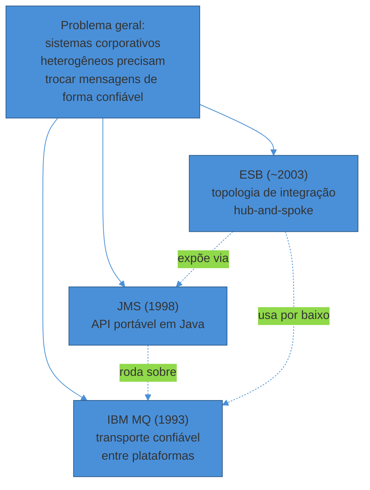
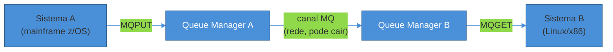
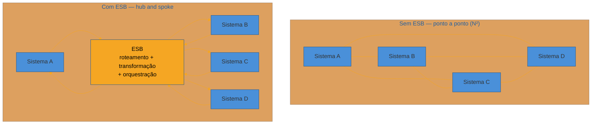

# Legado e padrões enterprise

> [!abstract] TL;DR
> Antes de Kafka e RabbitMQ virarem o vocabulário padrão de mensageria, a indústria já resolvia desacoplamento assíncrono com três peças específicas: **JMS** (a API Java padronizada para mensageria, ainda viva sob o nome Jakarta Messaging), **IBM MQ** (o "avô" da mensageria enterprise, rodando desde 1993 no coração de bancos e sistemas de pagamento), e o **ESB — Enterprise Service Bus** (o padrão arquitetural dos anos 2000-2010 que tentou centralizar roteamento, transformação e orquestração de integração num "barramento" único). Os dois primeiros continuam vivos e produtivos onde confiabilidade extrema importa mais que velocidade de mudança. O terceiro caiu — não porque a ideia de integrar sistemas fosse ruim, mas porque **centralizar inteligência de negócio numa camada compartilhada por toda a empresa** vira gargalo, ponto único de falha e o oposto do desacoplamento que deveria entregar. A lição que a geração seguinte (microsserviços, brokers leves) levou adiante tem nome — "smart endpoints, dumb pipes" — e é a mesma lição que a nota anterior desta trilha já viu no RPC clássico: colocar demais numa camada compartilhada sempre volta para acoplar o sistema inteiro.

Uma desenvolvedora pleno entra num banco para trabalhar na integração entre o sistema de abertura de conta e o motor de análise de crédito. No primeiro dia, o arquiteto sênior abre um diagrama que ela nunca tinha visto: dezenas de caixas — "Sistema de Cadastro", "Motor de Score", "Core Bancário", "Antifraude" — todas conectadas não umas às outras, mas a uma caixa central enorme rotulada **"ESB — TIBCO BusinessWorks"**. Nenhuma seta vai direto de um sistema a outro. Tudo passa pelo barramento.

Ela pergunta o óbvio: "por que não Kafka, ou uma API REST direto entre os dois sistemas?" A resposta do arquiteto é uma mistura de história e cicatriz: "porque em 2009, quando isso foi desenhado, essa *era* a forma certa de fazer. E hoje, mexer nesse ESB é como mexer numa represa — quase tudo que esse banco processa passa por ali, e ninguém aqui sabe mais explicar todas as regras de transformação que foram acumuladas dentro dele nos últimos quinze anos."

Essa cena se repete em bancos, seguradoras e grandes varejistas o mundo inteiro. Um desenvolvedor que só conhece Kafka, RabbitMQ e SQS chega a um sistema real e encontra um ESB roteando tudo, ou um `MQGET`/`MQPUT` num terminal 3270 falando com um mainframe, ou um `@JmsListener` do Spring lendo de uma fila que existe desde antes dele nascer. A reação errada é achar que aquilo é curiosidade morta. A reação certa é reconhecer: **isso é o legado enterprise de mensageria — JMS, IBM MQ e ESB —, e entender por que ele existe, por que perdeu força, e onde ainda está vivo é parte do ofício de quem trabalha com sistemas reais.**

Esta nota é o equivalente, do lado assíncrono, da nota sobre [[03-Dominios/Engenharia/Comunicação entre Sistemas/1 - Panorama e decisão/02 - RPC clássico e por que caiu|RPC clássico e por que caiu]]: mesmo modelo — o que resolvia, por que caiu (ou não caiu, no caso do MQ), onde ainda sobrevive.

## O problema que essas três peças tentaram resolver

Antes de julgar cada uma individualmente, vale separar o que cada peça realmente resolve — porque é comum confundir as três, e elas atacam problemas diferentes:

- **JMS** resolve um problema de *portabilidade de API*: como o código Java fala com "uma fila" sem amarrar ao broker específico por baixo.
- **IBM MQ** resolve um problema de *confiabilidade de transporte*: como garantir que uma mensagem chegue, exatamente uma vez, mesmo que a rede caia no meio do caminho, mesmo entre um mainframe z/OS e um servidor Linux.
- **ESB** resolve um problema de *topologia de integração*: como conectar N sistemas sem criar N² conexões ponto a ponto, cada uma com sua própria lógica de transformação e roteamento.



> [!question]- Se são três problemas diferentes, por que estudar juntos numa nota só?
> Porque na prática das empresas que os adotaram, eles quase sempre aparecem **empilhados**: uma aplicação Java fala JMS, o JMS é implementado por um IBM MQ (ou WebSphere MQ, seu nome de meio), e o ESB usa MQ como um dos seus transportes por baixo dos panos para rotear mensagens entre dezenas de sistemas. Entender os três separadamente evita confundir "minha aplicação usa MQ" com "minha aplicação usa ESB" — são camadas diferentes, frequentemente combinadas, mas não a mesma coisa.

## JMS: a API que a indústria Java padronizou para mensageria

Em meados dos anos 1990, cada fornecedor de middleware de mensagem — IBM com MQSeries, TIBCO com Rendezvous, e outros — tinha sua própria API proprietária. Uma aplicação Java escrita para falar com MQSeries não rodava contra Rendezvous sem reescrever a camada de mensageria inteira. Era o mesmo problema de portabilidade que JDBC já tinha resolvido para bancos de dados relacionais.

A resposta veio em 1998: **JMS (Java Message Service)**, especificada pela Sun Microsystems e um consórcio de fornecedores sob o Java Community Process (JSR 914) — a primeira API de mensageria enterprise a receber apoio amplo da indústria. A ideia central era simples: definir uma interface Java comum, e deixar que cada fornecedor de broker (IBM MQ, TIBCO, mais tarde ActiveMQ, HornetQ, Artemis) implementasse essa interface por baixo. O código de aplicação chama `Session.createProducer()`, `MessageProducer.send()`, `MessageConsumer.receive()` — e o broker concreto por trás é um detalhe de configuração, não de código.

JMS define dois modelos de troca de mensagem, que valem a pena nomear porque a terminologia aparece constantemente em sistemas reais:

- **Point-to-point (fila/`Queue`)**: uma mensagem enviada a uma fila é entregue a exatamente um consumer — o mesmo modelo de "competing consumers" que a nota anterior deste sub-galho já cobriu para mensageria moderna. Mensagens ficam retidas na fila até serem consumidas, mesmo que nenhum consumer esteja ativo no momento do envio.
- **Publish/subscribe (`Topic`)**: uma mensagem publicada num tópico é entregue a todos os subscribers ativos — o análogo pré-Kafka de um modelo fan-out.

```java
// Exemplo ilustrativo — JMS clássico (javax.jms), não código de produção real
ConnectionFactory factory = ...; // injetado, aponta pro broker (IBM MQ, ActiveMQ Artemis...)
try (JMSContext context = factory.createContext()) {
    Queue fila = context.createQueue("FILA.ABERTURA.CONTA");
    context.createProducer()
           .setProperty("origem", "sistema-cadastro")
           .send(fila, "{\"contaId\": \"12345\", \"status\": \"pendente\"}");
}
```

### Por que JMS não "caiu" como o RPC clássico

Diferente de CORBA e DCOM, JMS não foi substituído por uma geração seguinte que resolveu os mesmos problemas de forma mais simples — porque JMS não tenta esconder a rede atrás de uma chamada de função (o erro estrutural que derrubou o RPC clássico). JMS sempre foi explicitamente assíncrono: enviar uma mensagem e continuar não é uma ilusão de chamada local, é o modelo real. Isso poupou o JMS do problema central que este sub-galho já mapeou nas notas anteriores: acoplamento temporal disfarçado de chamada síncrona.

O que aconteceu com JMS foi outra coisa — uma **mudança de marca, não de morte**. Em 2017, quando a Oracle transferiu Java EE para a Eclipse Foundation, disputas sobre o uso do trademark "Java" forçaram a renomeação de todas as especificações: `javax.jms` virou `jakarta.jms`, e "Java Message Service" virou formalmente **Jakarta Messaging**. Tecnicamente é uma mudança que quebrou compatibilidade binária (todo `import javax.*` teve que virar `import jakarta.*`) — mas o modelo de programação, os conceitos de `Queue`/`Topic`, e a proposta de portabilidade continuam intactos.

> [!question]- Então times ainda escrevem JMS puro em 2026?
> Raramente diretamente — quase sempre por trás de uma abstração mais alta. O Spring oferece `JmsTemplate` e `@JmsListener` desde as primeiras versões do Spring Framework, e o Spring Boot continua auto-configurando esse suporte nas versões atuais (3.x), inclusive com ActiveMQ Artemis embutido para testes. O padrão comum em 2026 é: código de aplicação usa a abstração do framework (`JmsTemplate`, ou equivalente em Jakarta EE puro com `@MessageDriven`), e por baixo roda um broker JMS-compatível — historicamente IBM MQ ou TIBCO EMS em bancos, mais frequentemente ActiveMQ Artemis em sistemas mais novos que ainda preferem o modelo JMS a migrar totalmente para Kafka/RabbitMQ. O ponto que interessa reconhecer: se você vê `@JmsListener`, `MessageListener`, ou um `ConnectionFactory` com `queue`/`topic`, está diante do modelo JMS — mesmo que o broker por trás seja moderno.

Um detalhe técnico que separa JMS de brokers modernos e explica por que ele ainda é escolhido em sistemas transacionais: JMS tem suporte nativo a **transações distribuídas via XA** (o protocolo de two-phase commit do X/Open group). Um Message-Driven Bean (MDB) em Jakarta EE pode participar da mesma transação global que uma escrita em banco de dados — ou ambas commitam, ou ambas fazem rollback. Isso não é trivial de replicar com a mesma garantia num broker Kafka moderno (que resolve consistência de forma diferente, via idempotência e Outbox, como a nota anterior deste sub-galho já cobriu) — e é um dos motivos técnicos concretos, não só inerciais, para sistemas financeiros legados continuarem no modelo JMS/XA.

**JMS em uma frase:** não é um broker, é o contrato de API que fez a mensageria em Java ser portável entre fornecedores — e sobreviveu porque nunca tentou esconder a assincronia atrás de uma ilusão de chamada síncrona.

## IBM MQ: o avô que continua de pé

Se JMS é a API, **IBM MQ** é, historicamente, o broker mais associado a ela — embora tecnicamente sejam coisas diferentes (MQ tem sua própria API nativa, MQI, além de expor uma interface JMS-compatível).

A origem é anterior ao próprio JMS: no final dos anos 1980, engenheiros da IBM em Hursley (Reino Unido) perceberam que precisavam de uma forma de comunicar sistemas transacionais como o CICS com sistemas não-IBM, sem exigir que os dois lados estivessem disponíveis ao mesmo tempo — o mesmo problema de acoplamento temporal que abre toda essa trilha. O resultado, lançado comercialmente em dezembro de 1993, foi o **MQSeries** — um "gerenciador de filas" (queue manager) com um conjunto pequeno de ideias que se tornaram o vocabulário padrão da mensageria enterprise: filas como buffers nomeados, um processo dono dessas filas, uma interface de programação comum (a MQI), e canais para mover mensagens entre queue managers em hosts diferentes. Em 2002 foi renomeado para WebSphere MQ, e em 2014 voltou a se chamar simplesmente **IBM MQ**.



### Por que confiabilidade extrema, não velocidade, é o critério do MQ

A pergunta que costuma travar quem só conheceu mensageria moderna: "se Kafka processa milhões de mensagens por segundo e MQ é visto como mais lento e pesado, por que um banco continua usando MQ?" A resposta não é sobre throughput — é sobre um conjunto específico de garantias que MQ foi desenhado, desde o início, para nunca comprometer:

- **Entrega garantida com persistência transacional** — uma mensagem enviada com qualidade de serviço "persistent" sobrevive a uma queda do queue manager, porque é gravada em disco antes de ser confirmada ao produtor (write-ahead logging), e só é removida depois que o consumidor confirma o processamento.
- **Integração nativa com mainframe** — MQ fala diretamente com CICS e IMS em z/OS, algo que brokers modernos não foram desenhados para fazer nativamente. Para um banco cujo core roda em mainframe há décadas, isso não é um detalhe — é o motivo de existir.
- **Certificação e suporte formal para ambientes regulados** — instituições financeiras que precisam demonstrar conformidade (auditoria, SLA contratual, suporte 24/7 com contrato formal) valorizam décadas de histórico de produção mais do que benchmarks de throughput.

Os números de 2026 mostram por que isso continua importando: 43 dos 50 maiores bancos do mundo rodam infraestrutura IBM Z, o mainframe processa cerca de 73% do volume de transações financeiras globais em valor, e IBM MQ é integrado diretamente a redes de pagamento em tempo real como Fedwire e RTP (Real-Time Payments) nos EUA, além de sistemas SWIFT. Não é exagero dizer que boa parte do dinheiro que se move no mundo, em algum ponto do caminho, atravessa um `MQPUT`.

> [!warning] Confundir "legado" com "estagnado"
> **O que acontece:** um engenheiro assume que, por rodar desde 1993, o IBM MQ parou de evoluir — e trata qualquer sistema baseado nele como candidato automático a substituição completa. **Por quê:** a estabilidade e retrocompatibilidade do MQ (uma aplicação escrita para MQ dos anos 2000 frequentemente ainda roda sem modificação) são, às vezes, confundidas com falta de modernização. Na realidade, o MQ continua recebendo releases ativos — a versão 10.0 LTS chegou em junho de 2026 com foco em conectividade nativa com Kafka (via IBM MQ Advanced), operação Kubernetes-nativa via operator, e integração mais profunda com o restante do portfólio IBM depois da aquisição da Confluent em março de 2026. **Como evitar:** avaliar a decisão de manter MQ pelos requisitos reais que ele atende (mainframe, XA, regulação), não pela idade do produto. Em muitos casos a decisão correta em 2026 não é "trocar MQ por Kafka" — é usar os dois juntos, com MQ garantindo a confiabilidade do core transacional e Kafka distribuindo esses eventos para consumidores de analytics e sistemas mais novos.

**IBM MQ em uma frase:** não é lento por acidente nem por atraso tecnológico — é conservador por design, porque o requisito que resolve (nunca perder uma transação financeira, mesmo sob falha de rede ou de mainframe) pesa mais do que throughput bruto.

## ESB: quando integrar tudo por um único barramento vira o problema

A terceira peça deste legado é diferente das outras duas em um aspecto crucial: **JMS e IBM MQ continuam vivos porque resolvem um problema real de forma que ninguém superou completamente. O ESB caiu porque a própria indústria concluiu que a ideia central — centralizar integração num barramento compartilhado — tinha um defeito estrutural.**

### De onde veio a ideia

O conceito de Enterprise Service Bus surgiu no início dos anos 2000 — publicado inicialmente por analistas do Gartner, Roy W. Schulte e Yefim V. Natis — como a resposta prática a um problema real da **SOA (Service-Oriented Architecture)**, o paradigma arquitetural dominante da época. SOA propunha reutilizar serviços de negócio como componentes desacoplados; o ESB era a peça de infraestrutura que fazia essa promessa funcionar na prática. A alternativa que o ESB substituía era pior: conexões ponto a ponto entre cada par de sistemas, que crescem em complexidade quadrática (N sistemas geram até N² conexões, cada uma com sua lógica própria de tradução de formato). O ESB propôs um modelo **hub-and-spoke**: todo sistema conecta a um barramento central, que assume a responsabilidade de rotear, transformar formato de dados, converter protocolo, e (em implementações mais ambiciosas) orquestrar a composição de múltiplas chamadas.



Produtos como **TIBCO BusinessWorks**, **IBM WebSphere ESB**, **MuleSoft** (antes de se reposicionar como plataforma iPaaS) e **Oracle Service Bus** dominaram esse mercado ao longo dos anos 2000 e início dos 2010, vendidos como a espinha dorsal de integração de grandes empresas.

### Por que a indústria migrou para longe do ESB

A crítica mais influente e citada — e que moldou boa parte da arquitetura de microsserviços que veio depois — veio de Martin Fowler e James Lewis, no artigo seminal sobre microsserviços de 2014, com o princípio que ficou conhecido como **"smart endpoints, dumb pipes"**. A ideia central: um ESB coloca inteligência sofisticada de roteamento, coreografia, transformação e regras de negócio dentro do próprio mecanismo de integração. Fowler e Lewis argumentaram o oposto — os serviços deveriam ser donos da própria lógica de domínio, comunicando-se por protocolos simples (HTTP/REST) ou, quando mensageria fosse necessária, por um "barramento burro" que só roteia mensagens, deixando toda a inteligência nos endpoints.

O que aconteceu na prática, em empresa após empresa, é o padrão que a desenvolvedora da abertura desta nota encontrou: o ESB, concebido como camada neutra de integração, foi absorvendo cada vez mais lógica de negócio ao longo dos anos — mapeamentos de campo simples viraram regras condicionais complexas, e roteamentos que deveriam ser triviais passaram a embutir decisões de negócio inteiras. O resultado é bem documentado na literatura de arquitetura:

- **Ponto único de falha e gargalo de performance.** Toda integração do ambiente passa pelo mesmo componente central — uma rota malconfigurada, um vazamento de memória, ou um bug numa regra de transformação pode se propagar para todos os sistemas conectados, transformando a camada que deveria trazer resiliência no ponto mais crítico e frágil de toda a arquitetura.
- **Dependência de um time centralizado.** Como toda mudança de integração passa pelo ESB, qualquer alteração — mesmo pequena, mesmo isolada a dois sistemas — exige coordenação com o time dono do barramento, que se torna gargalo organizacional, não só técnico.
- **Lock-in de fornecedor.** A lógica de negócio acumulada em produtos proprietários (TIBCO, WebSphere, Oracle Service Bus) é difícil e cara de migrar — o oposto do desacoplamento que a integração deveria entregar.
- **Fricção com entrega contínua.** Fluxos de integração dentro de um ESB tipicamente não são versionáveis nem testáveis com a mesma facilidade que código de aplicação, dificultando integração num pipeline de CI/CD moderno.

> [!warning] "Microsserviços é o anti-padrão do ESB" — o resumo mais citado do mercado
> **O que acontece:** arquitetos que viveram a era do ESB descrevem a migração para microsserviços literalmente como uma reação contra o modelo ESB — não como uma evolução natural, mas como uma correção de rota. **Por quê:** o ESB tentou resolver acoplamento entre sistemas concentrando decisão numa camada compartilhada. Isso troca um tipo de acoplamento (ponto a ponto entre sistemas) por outro, potencialmente pior (todo sistema acoplado à disponibilidade, à governança e ao conhecimento tribal de um único barramento central). Microsserviços resolvem o mesmo problema de integração invertendo a responsabilidade: cada serviço é dono da própria lógica e comunica-se por contratos simples — a mesma filosofia que REST e gRPC aplicaram do lado síncrono desta trilha, e que brokers leves (Kafka, RabbitMQ) aplicaram do lado assíncrono, sem tentar embutir regra de negócio no meio do caminho. **Como evitar:** ao desenhar integração hoje, resistir à tentação de colocar transformação de negócio numa camada de infraestrutura compartilhada — mesmo que pareça conveniente no curto prazo ("é só adicionar mais uma regra aqui"). Cada adição desse tipo é um passo em direção ao mesmo destino que o ESB chegou.

### Onde o ESB ainda roda de verdade

Assim como CORBA e SOAP, o ESB não desapareceu — recuou para onde reescrever custa mais do que manter. Vendors evitam hoje o rótulo "ESB" (MuleSoft se reposicionou como plataforma **iPaaS — Integration Platform as a Service**, e mantém a maior fatia desse mercado reposicionado, com cerca de 34% de participação e mais de 8.500 clientes em 2026, à frente de concorrentes como TIBCO Cloud Integration e IBM webMethods), mas a arquitetura hub-and-spoke com barramento central continua rodando por baixo em:

- **Bancos e seguradoras** que investiram pesado em ESB durante os anos 2000-2010 e cuja integração central, hoje, é tão entranhada nos processos de negócio que reescrevê-la do zero é um projeto de anos, não de sprints.
- **Grandes varejistas e empresas com dezenas de sistemas legados** herdados de fusões e aquisições, onde o ESB continua sendo o único ponto que "sabe" como todos os sistemas conversam entre si — conhecimento que, em muitos casos, não está documentado em lugar nenhum além da configuração do próprio barramento.
- **Setores regulados que ainda estão em transformação digital** — estimativas de mercado de 2019 já projetavam que ESBs continuariam em uso por integrações legadas por 5 a 10 anos até a digitalização completar; em 2026, esse prazo ainda não terminou para boa parte dessas empresas.

**ESB em uma frase:** não é a mensageria que caiu — é a decisão de centralizar inteligência de negócio numa camada de integração compartilhada, o mesmo tipo de acoplamento estrutural que o RPC clássico já tinha ensinado a evitar, só que na assincronia em vez da chamada síncrona.

## As três peças lado a lado

| | JMS | IBM MQ | ESB |
|---|---|---|---|
| **O que é** | API padronizada de mensageria em Java | Broker/middleware de transporte confiável | Padrão arquitetural de integração centralizada |
| **Nasceu** | 1998 (JSR 914) | 1993 (MQSeries) | ~2003 (conceito Gartner) |
| **Problema que resolvia** | Portabilidade entre fornecedores de broker | Entrega garantida entre plataformas heterogêneas | Evitar N² conexões ponto a ponto |
| **Status hoje** | Vivo, renomeado (Jakarta Messaging) | Vivo, evoluindo (v10.0 LTS, 2026) | Em declínio como padrão dominante; sobrevive de fato em legado |
| **Motivo de não ter caído / de ter caído** | Nunca escondeu a assincronia atrás de ilusão síncrona | Confiabilidade extrema (XA, mainframe) sem substituto direto | Centralização de lógica de negócio virou gargalo e ponto único de falha |
| **Onde vive hoje** | Por trás de `JmsTemplate`/Spring, sistemas Jakarta EE | Bancos, pagamentos (Fedwire/RTP/SWIFT), mainframe | Bancos/seguradoras legados, reposicionado como iPaaS (MuleSoft) |

> [!question]- Isso significa que um time começando um projeto novo hoje deveria escolher JMS/MQ/ESB?
> Não é essa a proposta. Para um sistema novo (greenfield), a escolha padrão de 2026 raramente é JMS/MQ/ESB — é Kafka, RabbitMQ, SQS, ou um broker gerenciado equivalente, cobertos nas notas anteriores deste sub-galho. O valor de conhecer JMS/MQ/ESB não é "usar por escolha" — é **reconhecer quando você herda um sistema que já os usa**, entender por que a decisão fez sentido no contexto histórico dela, e saber quando a resposta certa é integrar com um adaptador (uma ponte entre o mundo legado e o mundo moderno, como o próprio IBM MQ já oferece nativamente via conectores Kafka) em vez de propor uma reescrita completa por reflexo.

## Armadilhas comuns ao encontrar esse legado em produção

> [!warning] Tratar "sistema com MQ/ESB" como sinônimo de "sistema mal arquitetado"
> **O que acontece:** um engenheiro júnior ou pleno vê um `MQGET`/`MQPUT` ou um roteamento ESB e assume, sem investigar, que está diante de tecnologia ruim ou decisão errada. **Por quê:** a idade da tecnologia não mede a qualidade do sistema que a usa — o mesmo padrão já visto na nota sobre RPC clássico. Um sistema bancário rodando MQ há vinte anos sem incidente de perda de transação é, objetivamente, mais confiável do que boa parte dos sistemas Kafka lançados no ano passado. **Como evitar:** avaliar o sistema pelos indicadores reais dele (uptime, taxa de erro, tempo de resposta), não pela idade da tecnologia de mensageria por trás.

> [!warning] Propor substituir o ESB inteiro antes de mapear o que ele realmente faz
> **O que acontece:** um time novo, ao herdar um ESB central, propõe "matar o ESB" e migrar tudo para microsserviços com Kafka num único projeto. **Por quê:** depois de anos acumulando lógica, o ESB frequentemente esconde regras de negócio que ninguém mais documentou fora da própria configuração do barramento — mapear tudo isso antes de desligar qualquer rota é obrigatório, e costuma revelar mais complexidade do que o esperado. **Como evitar:** aplicar o padrão **Strangler Fig** (já coberto na trilha de [[03-Dominios/Engenharia/Arquitetura/System Design/index|System Design]]) — extrair rotas do ESB uma de cada vez para serviços novos, mantendo o barramento vivo para o que ainda não foi migrado, em vez de tentar uma substituição de uma vez só.

> [!warning] Ignorar que MQ e ESB frequentemente ficam por baixo de sistemas que "parecem" modernos
> **O que acontece:** uma API REST nova, bem desenhada, é colocada na frente de um sistema legado — e o time assume que, por a fachada ser moderna, a integração por trás também é. **Por quê:** é comum uma API REST/GraphQL recente servir apenas de fachada (façade) para um IBM MQ ou ESB legado por trás, que continua sendo o verdadeiro ponto de integração — e herda as limitações de throughput, latência e disponibilidade da camada legada, mesmo que a interface pública pareça atual. **Como evitar:** ao investigar performance ou disponibilidade de um sistema que "parece moderno", sempre perguntar o que existe atrás da fachada — a resposta, em empresas com décadas de história, frequentemente inclui MQ ou ESB.

## Em entrevista

Assim como RPC clássico, JMS/IBM MQ/ESB raramente são o tema central de uma entrevista sênior — mas aparecem como sinal de maturidade em duas perguntas frequentes.

A primeira é a **pergunta de reconhecimento direto**: "você já trabalhou com algum sistema que usa mensageria mais antiga — JMS, MQ, um ESB?" Aqui, assim como no RPC clássico, o entrevistador não está avaliando fluência de implementação — está avaliando se você trava diante de tecnologia desconhecida ou se sabe reconhecer o padrão (fila/tópico, confiabilidade via XA, centralização de roteamento) e trabalhar produtivamente mesmo fora da sua zona de conforto recente com Kafka/RabbitMQ.

A segunda é a **pergunta de justificativa arquitetural**, geralmente formulada como "por que você usaria (ou não usaria) um ESB aqui?" ou "como você decidiria entre manter o MQ existente e migrar para Kafka?". A resposta fraca é "ESB é ruim, tudo devia ser microsserviços com Kafka". A resposta forte nomeia o trade-off real: um ESB centraliza integração às custas de acoplamento organizacional e ponto único de falha — a troca certa depende de quanto a empresa precisa de governança centralizada versus autonomia de time. Da mesma forma, "migrar de MQ para Kafka" tem sentido quando o requisito real é throughput de eventos para analytics — mas não tem sentido quando o requisito real é XA/two-phase commit com um sistema mainframe, caso em que a resposta madura costuma ser integrar os dois (o próprio caminho que a IBM adotou oficialmente depois de adquirir a Confluent em 2026), não substituir um pelo outro.

> [!question]- Vale a pena aprender a configurar um ESB ou implementar JMS a fundo para entrevista?
> Não como prioridade. O sinal que interessa é *reconhecimento e julgamento de trade-off*, não fluência de configuração de produto específico (TIBCO BusinessWorks, WebSphere ESB). Saber que um ESB centraliza roteamento/transformação e por que isso vira gargalo, que JMS separa `Queue` (point-to-point) de `Topic` (pub/sub), e que IBM MQ garante entrega via persistência transacional — isso cobre o que uma entrevista sênior espera. Implementação profunda só vale investimento de tempo se o trabalho específico exigir manutenção real desses sistemas.

## Como explicar em inglês

Before Kafka and RabbitMQ became the default vocabulary for messaging, enterprises solved asynchronous decoupling with three specific pieces: JMS, the standardized Java API for messaging (still alive today as Jakarta Messaging); IBM MQ, the grandfather of enterprise messaging, running since 1993 at the core of banks and payment systems; and the Enterprise Service Bus, the 2000s-2010s architectural pattern that tried to centralize integration routing and transformation through a single hub.

The first two are still alive and productive wherever extreme reliability matters more than speed of change — IBM MQ still moves a meaningful share of the world's real-time payment traffic. The ESB, on the other hand, declined as an industry default because centralizing business logic in a shared integration layer creates a bottleneck and a single point of failure — the same lesson the industry already learned from classic RPC, just applied to the asynchronous side. Recognizing this legacy — instead of assuming it's dead — is part of being a senior engineer who can operate in real production systems, not only in greenfield projects.

| PT | EN |
|----|----|
| Barramento de serviços | Service bus |
| Ponto a ponto (fila) | Point-to-point (queue) |
| Publicação/assinatura (tópico) | Publish/subscribe (topic) |
| Roteamento centralizado | Centralized routing |
| Transação distribuída | Distributed transaction |
| Confirmação em duas fases | Two-phase commit |
| Ponto único de falha | Single point of failure |
| Sistema de missão crítica | Mission-critical system |
| Fachada (camada de integração) | Façade / integration layer |

## O que vem a seguir

JMS, IBM MQ e ESB mostram o lado enterprise, formal e centralizado do desacoplamento assíncrono — o oposto do que a próxima e última nota deste sub-galho vai explorar: **padrões emergentes que tentam resolver o mesmo problema de integração de forma leve, descentralizada e orientada a contrato explícito**, sem depender de um barramento único nem de uma especificação pesada. CloudEvents padroniza o envelope de um evento independente do broker; AsyncAPI faz para eventos o que OpenAPI faz para REST; e webhooks — já vistos como "mensageria invertida" na trilha de confiabilidade do contrato — fecham o círculo entre o mundo síncrono e o assíncrono desta trilha inteira.

- [[06 - O que está emergindo em mensageria]] — CloudEvents, AsyncAPI e o fechamento do sub-galho
- [[04 - Outbox e Saga]] — como sistemas modernos resolvem transação distribuída sem depender de XA/two-phase commit
- [[03-Dominios/Engenharia/Comunicação entre Sistemas/1 - Panorama e decisão/02 - RPC clássico e por que caiu|RPC clássico e por que caiu]] — o mesmo arco histórico, do lado síncrono

## Veja também

- [[Comunicação entre Sistemas/index|Comunicação entre Sistemas]] — o galho-pai desta trilha
- [[4 - Comunicação assíncrona/index|Comunicação assíncrona]] — este sub-galho
- [[Mensageria/index|Mensageria]] — ferramenta específica (Kafka, RabbitMQ, BullMQ), o contraste moderno com JMS/MQ/ESB
- [[03-Dominios/Engenharia/Arquitetura/System Design/index|System Design]] — Strangler Fig e outros padrões de migração de sistemas legados

## Fontes

- **Kaustubh Saha** — [*The Evolution of Java Message Service (JMS): From Boilerplate to Modern Jakarta Messaging*](https://medium.com/@kaustubh.saha/the-evolution-of-java-message-service-jms-from-boilerplate-to-modern-jakarta-messaging-36b37dce77ed), Medium — histórico de JMS 1.1 a Jakarta Messaging.
- **Oracle** — [*Getting Started with Java Message Service (JMS)*](https://www.oracle.com/technical-resources/articles/java/intro-java-message-service.html) — modelos point-to-point e publish/subscribe, API oficial.
- **Wikipedia** — [*Jakarta Messaging*](https://en.wikipedia.org/wiki/Jakarta_Messaging) — origem como JSR 914, renomeação para Jakarta EE.
- **Eclipse Foundation** — [*Renaming Java EE Specifications for Jakarta EE*](https://blogs.eclipse.org/post/wayne-beaton/renaming-java-ee-specifications-jakarta-ee) — motivo técnico/legal da mudança `javax.*` → `jakarta.*`.
- **Baeldung** — [*Java EE vs J2EE vs Jakarta EE*](https://www.baeldung.com/java-enterprise-evolution) — linha do tempo da transição Oracle → Eclipse Foundation (2017).
- **Mainframe Master** — [*IBM MQ History — MQSeries, WebSphere MQ, and IBM MQ*](https://www.mainframemaster.com/tutorials/mq/mq-history) — origem em Hursley, lançamento em 1993, renomeações.
- **Wikipedia** — [*IBM MQ*](https://en.wikipedia.org/wiki/IBM_MQ) — histórico de nomes (MQSeries → WebSphere MQ → IBM MQ).
- **American Banker** — [*Why some banks still lean on mainframes*](https://www.americanbanker.com/news/why-some-banks-still-lean-on-mainframes) — 43 dos 50 maiores bancos rodando IBM Z, 73% do volume transacional global em valor.
- **Enterprise Viewpoint** — [*The Crucial Role of IBM MQ in Fedwire and Real-Time Payments*](https://enterpriseviewpoint.com/the-crucial-role-of-ibm-mq-in-fedwire-and-real-time-payments/) — MQ integrado a Fedwire, RTP e SWIFT.
- **IBM** — [*Introducing IBM MQ v10.0*](https://www.ibm.com/new/announcements/introducing-ibm-mq-v10-0) — release LTS de junho de 2026, foco em Kubernetes e conectividade Kafka.
- **Avada Software** — [*IBM's Confluent Acquisition: What Architects Need to Know About MQ & Kafka*](https://avadasoftware.com/ibm-confluent-acquisition/) — aquisição da Confluent pela IBM (março de 2026) e integração MQ + Kafka.
- **SAP Help Portal** — [*Using JMS XA Transactions*](https://help.sap.com/docs/SAP_NETWEAVER_740/c591e2679e104fcdb8dc8e77771ff524/29a97723457b4780888248a721df338e.html) e **Oracle Docs** — [*Understanding EJB Transaction Services*](https://docs.oracle.com/cd/E16439_01/doc.1013/e13981/undejdev008.htm) — mecanismo de two-phase commit via XA em JMS/EJB.
- **Gregor Hohpe & Bobby Woolf** — *Enterprise Integration Patterns: Designing, Building, and Deploying Messaging Solutions*, Addison-Wesley, 2004 — referência canônica de padrões de mensageria enterprise, base conceitual de ESB e MOM.
- **IBM** — [*What Is an Enterprise Service Bus (ESB)?*](https://www.ibm.com/think/topics/esb) — definição formal, modelo hub-and-spoke.
- **CIO.com** — [*ESB Persists As Application Integration Tool*](https://www.cio.com/article/289079/service-oriented-architecture-esb-persists-as-application-integration-tool.html) — origem do conceito por Roy W. Schulte e Yefim V. Natis (Gartner), contexto de SOA nos anos 2000.
- **Martin Fowler & James Lewis** — [*Microservices*](https://martinfowler.com/articles/microservices.html), martinfowler.com, 2014 — o princípio "smart endpoints and dumb pipes" e a crítica direta ao modelo ESB.
- **Perforce Software** — [*ESB vs. Microservices: Key Differences & Why Microservices Is an ESB Antipattern*](https://www.perforce.com/blog/aka/esb-vs-microservices) — "microservices is essentially an ESB antipattern", riscos de centralização.
- **Hossein Nejati Javaremi** — [*ESB (Enterprise Service Bus): The Good, the Bad, and the Legacy*](https://hosseinnejati.medium.com/esb-enterprise-service-bus-the-good-the-bad-and-the-legacy-b88a0bc4536e), Medium — ESB como monólito disfarçado, ponto único de falha.
- **6sense** — [*MuleSoft — Market Share, Competitor Insights in iPaaS*](https://6sense.com/tech/integrations-platform-as-a-service-ipaas/mulesoft-market-share) — participação de mercado 2026 (MuleSoft ~34%, TIBCO Cloud Integration ~2,9%).
- **AsyncAPI Initiative** — [*AsyncAPI and CloudEvents*](https://www.asyncapi.com/blog/asyncapi-cloud-events) — relação complementar entre os dois padrões, preparando a próxima nota do sub-galho.
