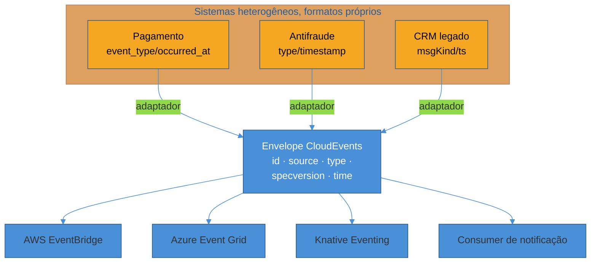

# O que está emergindo em mensageria

> [!abstract] TL;DR
> Uma fintech que integra cinco sistemas — pagamento, antifraude, notificação, contabilidade, CRM — descobre que cada um publica evento num formato diferente: um usa `timestamp`, outro `createdAt`, outro `occurred_at`; um usa `event_type`, outro `type`, outro nem tem campo de tipo. Todo consumer novo precisa de um adaptador escrito à mão. **CloudEvents** resolve essa fragmentação padronizando o **envelope** — os metadados que todo evento carrega (quem publicou, que tipo é, quando aconteceu), deixando o corpo específico livre. **AsyncAPI** resolve o problema irmão, um nível acima: como você descreve, documenta e gera código para os **canais e mensagens** de um sistema assíncrono inteiro — o mesmo papel que o OpenAPI cumpre para REST, mas pub/sub nunca teve. As duas specs são complementares, não concorrentes, e a combinação delas fecha uma lacuna de tooling que a comunidade de mensageria sentia havia anos. Esta nota fecha, também, o sub-galho inteiro de comunicação assíncrona com a síntese que a nota anterior deixou pendurada: **um webhook é mensageria sem infraestrutura formal por trás** — mesma garantia at-least-once, mesma necessidade de idempotência, mesma ausência de ordem garantida, só que a "fila" é a superfície HTTP crua do lado do destinatário.

Em fevereiro de 2026, a Intuit — dona do QuickBooks, usado por milhões de pequenas empresas para contabilidade — anunciou que ia aposentar o formato proprietário `eventNotifications` que seus webhooks usavam havia anos, e substituir por CloudEvents. O prazo, estendido uma vez, fechou em 31 de julho de 2026: depois dessa data, qualquer integração que ainda esperasse o formato antigo simplesmente para de reconhecer os campos que precisa. A assinatura HMAC continuou igual — isso não mudou —, mas tudo que dependia de ler `realmId`, `entityName` ou a estrutura aninhada específica da Intuit precisou ser reescrito para ler `source`, `type`, `subject` e `time` no novo envelope padronizado ([Maesn, *QuickBooks Webhooks to CloudEvents Migration Guide*](https://www.maesn.com/blog/quickbooks-webhooks-cloudevents)). O risco mais citado pelos desenvolvedores afetados não foi um erro ruidoso — foi o oposto: um parser antigo, apontando para o campo errado, simplesmente não lança exceção, só passa a receber `undefined` silenciosamente, e o desenvolvedor só descobre quando um cliente reclama que uma fatura sumiu.

Esse episódio, concreto e datado, é o retrato perfeito do problema que esta nota resolve. Não é hipotético, não é "boa prática recomendada em blog" — é um vendor de peso real trocando um formato proprietário por um padrão aberto, sob pressão de uma data-limite, porque manter cada integração com seu próprio dialeto de evento parou de valer a pena. As quatro notas anteriores deste sub-galho construíram o vocabulário para entender **por que** filas e streams existem, que garantias oferecem, e como transações distribuídas e sistemas legados lidaram com esse mundo. Esta nota, a última do sub-galho, olha para o problema seguinte, um nível acima de "qual broker eu uso": **quando você tem múltiplos sistemas, múltiplos brokers e múltiplos formatos, como você evita que cada par de sistemas precise de um adaptador sob medida?**

## O problema que nasce quando você tem mais de um formato de evento

Voltando ao exemplo de abertura: uma fintech de médio porte processa transações através de cinco sistemas internos, cada um construído em época diferente, por time diferente, às vezes em linguagem diferente. O sistema de pagamento publica no Kafka um evento assim:

```json
{
  "event_type": "payment.captured",
  "occurred_at": "2026-07-09T14:20:00Z",
  "payload": { "payment_id": "pay_ab12", "amount": 15000 }
}
```

O sistema de antifraude, herdado de uma aquisição, publica na mesma fila Kafka, mas com um formato completamente diferente, porque foi escrito por outro time, em outra época:

```json
{
  "type": "FRAUD_CHECK_COMPLETED",
  "timestamp": 1720540800,
  "data": { "paymentId": "pay_ab12", "riskScore": 0.02 }
}
```

E o sistema de notificação, que precisa reagir a eventos de **ambos**, termina com dois parsers completamente distintos — um para cada formato — só para responder à mesma pergunta em ambos os casos: "que tipo de evento é esse, de onde veio, quando aconteceu?". Cada novo sistema que entra no ecossistema multiplica esse problema: com cinco sistemas publicando eventos, no pior caso você tem até 5×4 = 20 pares de adaptador possíveis, cada um mantido manualmente, cada um capaz de quebrar silenciosamente quando um dos lados muda um nome de campo sem avisar.

Esse é exatamente o tipo de problema que a [[03-Dominios/Engenharia/Comunicação entre Sistemas/1 - Panorama e decisão/01 - O que é o contrato de comunicação|nota 01 do sub-galho 1]] chamou de acoplamento pelo formato do dado — só que aqui ele se multiplica pela quantidade de sistemas, em vez de aparecer entre apenas dois. E, ao contrário do mundo síncrono, onde OpenAPI virou o padrão de fato para descrever o contrato de uma API REST duas décadas atrás, o mundo assíncrono nunca teve um equivalente amplamente adotado — cada broker, cada time, cada empresa inventou seu próprio jeito de estruturar um evento. É essa lacuna, dupla, que CloudEvents e AsyncAPI preenchem: uma resolve o formato do **evento individual**, a outra resolve a descrição da **aplicação inteira** que troca esses eventos.

## CloudEvents: o envelope que todo mundo concordou em usar

### O que o envelope resolve, e o que ele deliberadamente não resolve

CloudEvents é uma especificação da CNCF (Cloud Native Computing Foundation) que define um conjunto pequeno de **atributos de contexto** — metadados sobre o evento — que qualquer evento, publicado por qualquer sistema, em qualquer broker, deveria carregar de forma consistente. A ideia central, e o motivo pelo qual funciona onde tentativas anteriores de padronização universal (o mesmo tipo de promessa que CORBA e DCOM fizeram e não cumpriram, como visto na [[02 - RPC clássico e por que caiu|nota 02 do sub-galho 1]]) falharam, é a **minimalidade deliberada**: CloudEvents não tenta padronizar o corpo do evento, não impõe um protocolo de transporte, não define um framework de RPC — define só o envelope, e deixa tudo o mais livre.

A especificação define **quatro atributos obrigatórios**, que todo evento CloudEvents precisa carregar:

| Atributo | O que é | Exemplo |
|---|---|---|
| `id` | Identificador do evento — junto com `source`, precisa ser único para cada evento distinto | `"evt_8f2a1c9d"` |
| `source` | De onde o evento veio — o contexto/sistema que o produziu, normalmente uma URI | `"/pagamentos/gateway-b"` |
| `type` | Que tipo de evento é — segue a mesma convenção `recurso.ação` já vista em [[05 - Webhooks e operações assíncronas|webhooks]] | `"com.fintech.payment.captured"` |
| `specversion` | Qual versão da especificação CloudEvents está sendo usada | `"1.0"` |

Além desses quatro, a spec define **atributos opcionais** que cobrem os casos mais comuns sem forçar todo evento a carregá-los: `time` (quando o evento aconteceu, em RFC 3339), `subject` (o sujeito específico do evento dentro do contexto de `source` — útil quando `source` é genérico demais para filtrar, por exemplo distinguir qual conta bancária dentro de "o serviço de contas"), `datacontenttype` (o content-type do corpo — `application/json`, `application/protobuf`, etc.) e `dataschema` (uma URI apontando para o schema que valida o corpo do evento) ([CloudEvents Spec, GitHub cloudevents/spec](https://github.com/cloudevents/spec/blob/main/cloudevents/spec.md)). Um evento completo, do exemplo da fintech, reescrito no envelope CloudEvents:

```json
{
  "specversion": "1.0",
  "id": "evt_8f2a1c9d",
  "source": "/pagamentos/gateway-b",
  "type": "com.fintech.payment.captured",
  "time": "2026-07-09T14:20:00Z",
  "subject": "pay_ab12",
  "datacontenttype": "application/json",
  "data": {
    "payment_id": "pay_ab12",
    "amount": 15000,
    "currency": "BRL"
  }
}
```

Note que o corpo específico — o que a nota anterior chamou de "evento fino ou evento gordo" — continua completamente livre dentro do campo `data`. CloudEvents não decide isso por você; ele só garante que qualquer sistema, olhando só para `type`, `source` e `time`, já sabe o suficiente para rotear, filtrar e logar o evento sem precisar entender a semântica de negócio específica daquele domínio.

> [!question]- Além dos atributos opcionais oficiais, dá pra adicionar campos próprios?
> Sim — a especificação permite **atributos de extensão**: qualquer par nome/valor adicional, definido pela aplicação ou por uma extensão registrada na comunidade, desde que não colida com os nomes reservados. A extensão mais notável, e a que mais aparece em produção, é a de **distributed tracing**: ela carrega o `traceparent` do W3C Trace Context (o mesmo padrão que atravessa chamadas HTTP síncronas) dentro do próprio evento, permitindo que uma ferramenta de observabilidade como Jaeger ou Zipkin reconstrua o trace completo de uma transação mesmo quando ela atravessa múltiplos saltos assíncronos — publica, é consumido, publica de novo — sem perder o fio da requisição original ([CloudEvents Distributed Tracing Extension, GitHub](https://github.com/cloudevents/spec/blob/v1.0.2/cloudevents/extensions/distributed-tracing.md)). É um lembrete direto de que tracing distribuído, tratado normalmente só no contexto de chamadas síncronas encadeadas, também precisa de solução quando a cadeia passa por uma fila no meio — e CloudEvents dá o lugar certo para carregar essa informação sem inventar um mecanismo novo.

### Content mode: onde os metadados vivem no transporte

Um detalhe técnico que separa quem só leu o JSON de exemplo de quem entende como CloudEvents efetivamente atravessa um broker é o **content mode** — como os atributos de contexto são transportados junto com o dado, que varia por protocolo:

- **Structured mode:** todos os atributos de contexto e o dado ficam juntos, dentro de um único corpo — exatamente como o JSON de exemplo acima. É o modo mais simples de implementar e depurar, porque o evento inteiro é uma única unidade autocontida.
- **Binary mode:** os atributos de contexto viajam fora do corpo — como headers HTTP, ou como headers de registro Kafka — e o corpo carrega só o `data`, no formato nativo que a aplicação já usa (Avro, Protobuf, JSON puro). É o modo mais eficiente quando o payload já é binário e você não quer pagar o custo de serializar tudo dentro de um envelope JSON.

No Kafka especificamente, o binding oficial de CloudEvents mapeia isso de forma direta: em modo binário, o `data` vai no valor do registro Kafka tal como está, e cada atributo de contexto (`ce_id`, `ce_source`, `ce_type` etc.) vira um header do registro — o que significa que um consumer que já usa Schema Registry com Avro ou Protobuf para o payload continua funcionando exatamente como antes, e ganha os metadados de roteamento do CloudEvents de graça, nos headers, sem precisar tocar no schema do dado em si ([Quarkus, *Sending and Receiving Cloud Events with Kafka*](https://quarkus.io/blog/kafka-cloud-events/)). Isso resolve uma objeção comum de quem já investiu pesado em Schema Registry: CloudEvents não compete com Avro/Protobuf/Schema Registry — ele empilha em cima, cobrindo só o roteamento e a proveniência, deixando a validação estrutural do dado exatamente onde já estava.

### Por que a adoção é fato consumado, não promessa

A linha do tempo de maturação da CNCF é o sinal mais objetivo de que CloudEvents não é moda passageira: aceito pela CNCF em maio de 2018, promovido a Incubating em outubro de 2019, e **graduado** — o nível máximo de maturidade da CNCF, reservado a projetos com governança estável e adoção comprovada em produção — em janeiro de 2024, com mais de 340 contribuidores de 122 organizações passando pelo projeto ([CNCF, *Cloud Native Computing Foundation Announces the Graduation of CloudEvents*](https://www.cncf.io/announcements/2024/01/25/cloud-native-computing-foundation-announces-the-graduation-of-cloudevents/)). Essa mesma linha do tempo já apareceu, de forma mais resumida, na [[03-Dominios/Engenharia/Comunicação entre Sistemas/1 - Panorama e decisão/05 - O que está emergindo e framework de decisão|nota de panorama do sub-galho 1]] — o que muda aqui é o nível de detalhe técnico e, principalmente, o caso concreto de 2026 (Intuit) que confirma que a adoção continua se ampliando, não estagnou depois da graduação.

A lista de quem adota CloudEvents nativamente, hoje, cobre os principais provedores de nuvem: AWS EventBridge suporta receber e enviar CloudEvents no formato JSON v1.0, tanto pelo binding HTTP quanto por API destinations, permitindo filtrar e rotear eventos CloudEvents sem entender a lógica de negócio dentro deles ([AWS Compute Blog, *Sending and receiving CloudEvents with Amazon EventBridge*](https://aws.amazon.com/blogs/compute/sending-and-receiving-cloudevents-with-amazon-eventbridge/)); Azure Event Grid tem suporte de primeira classe ao schema CloudEvents, inclusive nos Namespaces mais recentes do serviço ([Microsoft Learn, *Event Grid Namespaces — support for CloudEvents schema*](https://learn.microsoft.com/en-us/azure/event-grid/namespaces-cloud-events)); e, dentro do ecossistema Kubernetes nativo da CNCF, o Knative Eventing usa CloudEvents como formato **nativo** de evento — toda a integração entre EventBridge e Knative Eventing, por exemplo, é possível precisamente porque os dois falam o mesmo envelope CloudEvents, sem tradutor no meio ([Knative Eventing overview](https://knative.dev/docs/eventing/)).



## AsyncAPI: o "OpenAPI dos eventos"

### A lacuna que o OpenAPI nunca resolveu

Se CloudEvents resolve o formato do evento individual, falta ainda descrever o sistema inteiro que troca esses eventos: que canais existem, que mensagens trafegam por cada um, quem publica e quem assina, e como gerar código de producer/consumer e documentação a partir disso — exatamente o que o OpenAPI faz para uma API REST há mais de uma década. O problema é estrutural: OpenAPI foi desenhado assumindo request-response síncrono sobre HTTP — um cliente chama uma URL e espera um corpo JSON voltar. Pub/sub não tem essa forma: não existe "requisição" nem "resposta" no sentido clássico, existem canais, tópicos e mensagens fluindo numa direção, possivelmente sem nenhum cliente esperando nada de volta ([Docsio, *What Is AsyncAPI? The Spec for Event-Driven APIs in 2026*](https://docsio.co/blog/asyncapi)).

**AsyncAPI**, criado em 2017 por Fran Méndez especificamente porque OpenAPI não conseguia descrever arquiteturas orientadas a evento sem workarounds artificiais, preenche essa lacuna adaptando as estruturas centrais do OpenAPI — schemas, componentes reutilizáveis, segurança — ao vocabulário do mundo assíncrono ([Nordic APIs, *AsyncAPI vs OpenAPI: What's The Difference?*](https://nordicapis.com/asyncapi-vs-openapi-whats-the-difference/)). A versão atual, 3.1 (2026), reorganizou o vocabulário central em torno de três conceitos que valem entender em profundidade, porque são o coração de como um documento AsyncAPI descreve um sistema assíncrono:

- **Channels (canais):** o mecanismo de transporte — um tópico Kafka, uma fila RabbitMQ, um canal WebSocket — junto com a estrutura das mensagens que ele suporta. Um canal, na versão 3.0+ da spec, é desacoplado de quem publica ou assina nele — a mesma definição de canal pode ser referenciada por múltiplas operações.
- **Messages (mensagens):** a forma concreta do dado que trafega por um canal — schema do payload, headers, exemplos — normalmente definida uma vez em `components` e referenciada de múltiplos lugares, evitando duplicação.
- **Operations (operações):** o que uma aplicação **faz** com um canal — `send` (envia) ou `receive` (recebe). Essa é a mudança mais significativa da versão 3.0 em relação à 2.x: em vez dos verbos ambíguos `publish`/`subscribe` (ambíguos porque dependiam de qual lado — servidor ou cliente — estava descrevendo a própria perspectiva), `send`/`receive` descrevem sem ambiguidade o que **a aplicação sendo documentada** faz, sem depender de convenção sobre de qual lado a spec está sendo escrita ([AsyncAPI 3.0.0 Release Notes](https://www.asyncapi.com/blog/release-notes-3.0.0); [Mete Atamel, *AsyncAPI gets a new version 3.0 and new operations*](https://atamel.dev/posts/2024/05-13_asyncapi_30_send_receive/)).

Um documento AsyncAPI mínimo, descrevendo o mesmo evento de pagamento da fintech, ilustra como esses três conceitos se encaixam:

```yaml
asyncapi: 3.0.0
info:
  title: Serviço de Pagamentos
  version: 1.0.0
servers:
  producao:
    host: kafka.fintech.internal:9092
    protocol: kafka
channels:
  pagamentoCapturado:
    address: payments.captured
    messages:
      PaymentCaptured:
        $ref: '#/components/messages/PaymentCaptured'
operations:
  publicarPagamentoCapturado:
    action: send
    channel:
      $ref: '#/channels/pagamentoCapturado'
components:
  messages:
    PaymentCaptured:
      payload:
        type: object
        properties:
          payment_id: { type: string }
          amount: { type: integer }
```

Esse documento sozinho já responde as perguntas que, sem ele, ficariam espalhadas em código, comentário e conhecimento tribal do time: que tópico existe, que estrutura de mensagem ele carrega, e o que a aplicação faz com ele (nesse caso, publica).

### Bindings: onde a especificidade de cada broker entra

Uma pergunta natural, dado que AsyncAPI é deliberadamente agnóstico de protocolo (suporta Kafka, AMQP, MQTT, WebSocket, JMS, IBM MQ, STOMP, entre outros), é: como uma spec genérica captura o detalhe específico de cada broker — partições e chaves do Kafka, exchanges e routing keys do AMQP, QoS do MQTT? A resposta é o mecanismo de **bindings**: um objeto que só carrega informação específica de protocolo, aplicável em quatro pontos diferentes do documento — no servidor, no canal, na operação e na mensagem. Um binding Kafka no nível de servidor pode declarar a URL do Schema Registry usado e o vendor (Confluent, Apicurio); um binding Kafka no nível de mensagem pode declarar a chave de partição esperada ([AsyncAPI Bindings, GitHub asyncapi/bindings](https://github.com/asyncapi/bindings)). Isso é o que permite ao mesmo tempo (a) um vocabulário comum entre qualquer protocolo assíncrono e (b) documentação e geração de código fiéis ao comportamento real de cada broker específico — sem forçar Kafka e MQTT a fingir que são a mesma coisa.

### Geração de código e documentação: o mesmo ganho do OpenAPI, agora para eventos

O ganho prático de ter um documento AsyncAPI formal — em vez de descrição em prosa espalhada por READMEs desatualizados — é o mesmo que OpenAPI já provou para REST: um documento estruturado alimenta ferramentas, em vez de exigir leitura humana repetida. O ecossistema de ferramentas maduro em 2026 cobre três frentes:

- **AsyncAPI Studio:** editor visual no navegador que valida o documento em tempo real e renderiza a documentação interativa a partir dele — o equivalente ao Swagger UI do mundo OpenAPI ([AsyncAPI Studio](https://studio.asyncapi.com/)).
- **AsyncAPI Generator:** a ferramenta oficial de linha de comando que recebe o documento e um *template* — oficial ou da comunidade — e produz literalmente qualquer artefato definível em template: documentação Markdown/HTML, código de producer/consumer em Node.js, configuração, SDKs inteiros ([AsyncAPI Generator, GitHub asyncapi/generator](https://github.com/asyncapi/generator)).
- **Geradores especializados por linguagem:** o Modelina gera só os modelos/classes de dado a partir do schema das mensagens, útil quando você quer tipagem forte sem gerar um framework inteiro; existem geradores dedicados a Go (`asyncapi-codegen`, que gera desde o código de conexão ao broker até a aplicação) e Python (`asyncapi-codegen`), além do framework Glee em TypeScript, que gera não só modelos mas o esqueleto inteiro de aplicação event-driven a partir do documento ([AsyncAPI Generator tools](https://www.asyncapi.com/tools/generator)).

O padrão de fundo, o mesmo padrão citado desde a nota de panorama do sub-galho 1: em vez de escrever o schema do evento em três lugares (o código do producer, a documentação para o time consumidor, e a validação de runtime), você escreve o documento AsyncAPI uma vez e deriva os três a partir dele. É a mesma economia que OpenAPI trouxe para REST, vinte anos depois, agora aplicada à metade assíncrona do contrato que este sub-galho tratou até aqui.

### Onde AsyncAPI e CloudEvents se encaixam juntos

CloudEvents e AsyncAPI não competem — cobrem camadas diferentes do mesmo problema, e a diferença de escopo é precisa: **CloudEvents foca no evento** — define o envelope de metadados que uma mensagem individual carrega; **AsyncAPI foca na aplicação** — como um sistema orientado a evento se comunica com o resto do mundo, quais canais existem, quem publica e assina cada um ([AsyncAPI Initiative, *AsyncAPI and CloudEvents*](https://www.asyncapi.com/blog/asyncapi-cloud-events)). Na prática, um documento AsyncAPI pode descrever um canal cujo payload, especificamente, segue o formato CloudEvents — as duas specs se encaixam em camadas complementares: definição da aplicação (AsyncAPI), descrição dos canais (AsyncAPI), envelope estruturado do evento (CloudEvents), dado funcional específico do domínio (dentro do `data` do CloudEvents). Usadas juntas, cobrem a descrição completa de um sistema assíncrono — algo que nem uma nem outra, sozinha, faria por completo.

| | CloudEvents | AsyncAPI |
|---|---|---|
| **O que descreve** | O evento individual (metadados do envelope) | O sistema inteiro (canais, mensagens, operações) |
| **Pergunta que responde** | "De onde veio esse evento específico, que tipo é, quando aconteceu?" | "Que canais existem, o que trafega por cada um, quem publica e quem assina?" |
| **Escopo CNCF/governança** | Graduado na CNCF (jan. 2024) | Iniciativa própria (Linux Foundation-adjacente), não é projeto CNCF |
| **Maturidade em 2026** | Fato consumado para múltiplas nuvens/brokers | Consolidando — spec madura (3.1), mas ecossistema mais jovem que OpenAPI |
| **Equivalente síncrono** | — (não tem equivalente REST direto) | AsyncAPI está para pub/sub como OpenAPI está para REST |

> [!question]- Se as duas specs resolvem problemas diferentes, dá pra usar só uma?
> Dá, e depende do que dói mais no seu contexto. Se o problema é só "cada evento tem um formato de metadados diferente e ninguém consegue rotear sem um adaptador customizado" — o cenário de abertura desta nota —, CloudEvents sozinho já resolve. Se o problema é "ninguém sabe documentar nem gerar código a partir dos canais e mensagens que o sistema usa" — a dor que motivou o AsyncAPI —, ele sozinho já ajuda, mesmo sem CloudEvents no payload. A combinação das duas vale quando você tem ambos os problemas ao mesmo tempo, o que é comum em organizações de porte médio para cima com múltiplos times publicando eventos: aí o documento AsyncAPI descreve a aplicação e referencia CloudEvents como o formato de payload de cada canal, cobrindo as duas camadas de uma vez.

## Casos práticos

**Migração de webhook proprietário para CloudEvents sob prazo regulatório-comercial.** O caso Intuit/QuickBooks, já citado na abertura, vale detalhar como cenário completo: antes da migração, cada integração de terceiro precisava de um parser específico para o formato `eventNotifications`, aninhado e proprietário. Depois de trocar para CloudEvents, qualquer consumer que já soubesse ler o envelope padrão — porque também integrava com AWS EventBridge ou Azure Event Grid, por exemplo — reaproveitava boa parte da lógica de roteamento e validação de assinatura que já tinha construído para outros provedores. O ponto que mais gerou risco na migração, segundo o guia de integração da Maesn, não foi a assinatura HMAC (que continuou idêntica) — foi justamente o tipo de falha silenciosa que um envelope padronizado deveria evitar: parsers antigos, apontando para o campo errado do payload legado, param de encontrar o dado esperado e passam a processar `undefined` sem lançar exceção nenhuma, o que é particularmente perigoso em um domínio de contabilidade, onde um evento "perdido" silenciosamente pode significar uma fatura que nunca é reconciliada.

**AsyncAPI describindo um sistema de notificações multi-canal, multi-broker.** Uma plataforma de e-commerce de médio porte publica eventos de pedido tanto num tópico Kafka interno (para o serviço de faturamento e o de estoque) quanto numa fila SQS (para disparar notificações por email via um serviço de terceiro que só integra com SQS). Sem um documento formal, o time de plataforma mantinha esse mapeamento — que evento vai para qual canal, com qual schema — em um documento de wiki que ficava desatualizado a cada duas ou três mudanças de schema. Ao formalizar isso em um único documento AsyncAPI, com dois `servers` (um Kafka, um SQS) e bindings específicos para cada um, o time ganhou duas coisas de uma vez: a documentação interativa gerada automaticamente (via AsyncAPI Studio) parou de divergir da realidade, porque o documento *é* a fonte de verdade consultada tanto por humanos quanto pela geração de código; e a validação de schema das mensagens, antes feita manualmente em cada PR, passou a ser checada automaticamente contra o documento como parte do pipeline de CI — um novo campo obrigatório adicionado sem atualizar o AsyncAPI quebra o build, em vez de quebrar em produção semanas depois.

## O fio que fecha o sub-galho: webhooks são mensageria invertida

A [[05 - Webhooks e operações assíncronas|nota anterior deste sub-galho]] terminou com uma frase que ficou pendurada de propósito: *"um webhook é, estruturalmente, mensageria com nenhuma infraestrutura formal por trás"*. Chegou a hora de fechar esse fio, ponto a ponto, com o vocabulário que este sub-galho inteiro construiu.

Relembrando o mecanismo: num webhook, o papel de "servidor" e "cliente" se inverte em relação a como o resto desta trilha tratou comunicação — quem antes recebia requisições (seu backend) passa a **enviar** um `POST` HTTP para um endpoint que pertence a outra parte. E, no instante em que você vira o cliente que inicia essa chamada, você herda exatamente a mesma classe de problema que um **consumer de fila** enfrenta — só que sem o chão de garantias formais que um broker de verdade oferece por padrão.

| Problema de confiabilidade | Como aparece em fila/stream ([[03 - Garantias de entrega e ordenação|nota 03]]) | Como aparece em webhook ([[05 - Webhooks e operações assíncronas|SG3-05]]) |
|---|---|---|
| **Garantia de entrega** | At-least-once é o default de praticamente todo broker de produção — o broker reentrega até o consumer confirmar (`ack`) | Retry até esgotar a janela (ex.: 3 dias na Stripe) — o "consumer" confirma implicitamente respondendo `2xx` |
| **Por que duplica** | `ack` se perde na volta, ou rebalanceamento de partição reatribui a mensagem antes da confirmação chegar | Timeout ou erro transitório do lado do destinatário — o remetente não sabe se o evento chegou ou só a confirmação se perdeu |
| **Solução para duplicação** | Idempotência no consumer + deduplicação por ID de mensagem | Mesma disciplina — idempotência no consumer + deduplicação por ID de evento — só que aplicada do outro lado da requisição HTTP |
| **Ordenação** | Garantida só dentro de uma partição/fila FIFO — entre partições, nenhuma garantia | Não garantida na esmagadora maioria dos provedores — declarado explicitamente até por provedores de peso (Stripe, Shopify, Paddle) |
| **O que fazer quando falha demais** | Dead letter queue — mensagem sai do fluxo normal, fica visível para inspeção manual | Marcar como falho, visível em dashboard, reenviável manualmente (o "Redeliver" do GitHub) |
| **Quem carrega o fardo da confiabilidade** | O broker — durabilidade formal, replicação, retenção configurável | Quem envia o webhook — se não implementar retry e fila interna por conta própria, a falha simplesmente perde o evento |

A diferença real entre os dois mundos nunca esteve no **problema** — é estruturalmente o mesmo problema de garantia de entrega sob falha parcial que atravessou a [[03 - Garantias de entrega e ordenação|nota 03]] inteira — mas no **mecanismo por trás da garantia**. Uma fila de verdade (Kafka, RabbitMQ, SQS) nasce, desde a base, com durabilidade formal: a mensagem existe fisicamente em disco, replicada, esperando confirmação de consumo, independente de o consumidor estar disponível ou não naquele instante. Um webhook não tem esse chão por padrão — é só HTTP entre dois pontos, e toda a disciplina de confiabilidade (retry com backoff, deduplicação, dead letter) precisa ser **reconstruída manualmente** em cima dele, porque o protocolo em si não promete nada disso. É exatamente por essa razão que sistemas de webhook maduros — como a própria observação já feita na nota anterior — terminam **construindo uma fila de mensageria interna** entre o evento de origem e o envio HTTP externo: o webhook nunca deixa de ser, no fundo, uma fila disfarçada de chamada HTTP simples.

O movimento de 2026 que abriu esta nota confirma essa convergência de mais um ângulo: a própria Intuit, ao trocar seu formato proprietário de webhook por CloudEvents, está aplicando o mesmo raciocínio de padronização de envelope que Kafka/EventBridge/Event Grid já aplicam para eventos internos — reconhecendo, na prática, que um webhook **é** um evento, só entregue por outro canal de transporte (HTTP direto, em vez de um broker intermediário). A fronteira entre "mensageria" e "webhook" nunca foi uma fronteira de arquitetura — foi sempre só uma fronteira de **infraestrutura**: quem carrega a fila (um broker dedicado, ou a memória e o disco de quem envia o `POST`).

```mermaid
%%{init: {"theme": "base", "themeVariables": {"primaryColor": "#4A90D9", "primaryBorderColor": "#2E5C8A", "lineColor": "#4A90D9"}}}%%
graph TD
    E["Evento acontece<br/>(pagamento capturado)"] --> Q{"Como notificar<br/>o interessado?"}

    Q -->|"Fila/stream dedicado<br/>(Kafka, RabbitMQ, SQS)"| BROKER["Broker com<br/>durabilidade formal"]
    Q -->|"HTTP direto<br/>(webhook)"| WH["POST para endpoint<br/>do destinatário"]

    BROKER --> G1["At-least-once por padrão<br/>do próprio broker"]
    WH --> G2["At-least-once só se<br/>VOCÊ implementar retry"]

    G1 --> DEDUP["Idempotência +<br/>dedup por ID"]
    G2 --> DEDUP

    style E fill:#4A90D9,color:#fff
    style BROKER fill:#4A90D9,color:#fff
    style WH fill:#F5A623,color:#000
    style G2 fill:#F5A623,color:#000
    style DEDUP fill:#4A90D9,color:#fff
```



## Síntese: o que os sub-galhos 3 e 4 juntos ensinaram sobre confiabilidade de entrega

Vale nomear, antes de fechar, o arco completo que os dois últimos sub-galhos desta trilha construíram juntos — porque é essa síntese, mais que qualquer padrão isolado, que sobrevive quando os detalhes específicos de cada tecnologia forem esquecidos.

O sub-galho 3 (Confiabilidade do contrato) tratou de como o contrato **síncrono** sobrevive sob falha, retry e o tempo: idempotência como pré-requisito para qualquer retry seguro, versionamento como disciplina de evolução sem quebrar quem já consome, caching e requisições condicionais para não pagar o custo de refazer trabalho que não mudou, rate limiting como o contrato que protege o servidor de ser sobrecarregado, e finalmente — na ponte para este sub-galho — os três padrões (202+polling, webhook, bulk) para quando a resposta simplesmente não cabe num request-response imediato.

O sub-galho 4 (Comunicação assíncrona) pegou esse fio e mergulhou na infraestrutura formal que resolve, de fábrica, boa parte do que webhooks precisam reconstruir na mão: a diferença entre desacoplar de verdade e só adiar o acoplamento, fila de tarefa versus log de eventos, as três garantias de entrega (at-most/at-least/"exactly-once") e por que ordenação nunca é global — só por partição ou agregado —, o padrão Outbox para não perder a atomicidade entre banco de dados e evento publicado, o legado de JMS/ESB que ensinou, do jeito difícil, os limites do acoplamento forte em mensageria, e agora, para fechar, os dois padrões de padronização (CloudEvents, AsyncAPI) que resolvem a fragmentação de formato antes que ela vire dívida técnica silenciosa.

O fio único que atravessa os dois sub-galhos inteiros, do início ao fim: **toda promessa de confiabilidade — síncrona ou assíncrona — é construída em cima de uma rede que não tem memória e que falha de formas parciais e imprevisíveis.** Nenhum protocolo, nenhum broker, nenhuma especificação elimina essa realidade; o que cada padrão faz é dar um vocabulário e um mecanismo específico para **absorver** a falha sem mentir para quem consome sobre o que realmente aconteceu — seja um `202 Accepted` que não finge que o trabalho já terminou, seja um HMAC com timestamp que não finge que um evento capturado uma vez não pode ser reenviado, seja um `ack` de broker que não finge que "processado" e "confirmado" são sempre o mesmo instante.

## Armadilhas comuns

> [!warning] Adotar CloudEvents "por padrão" sem consumer que se beneficie
> **O que acontece:** um time introduz CloudEvents em todos os eventos internos de um sistema fechado, onde produtor e consumidor são o mesmo time, no mesmo repositório, sem nenhum plano de integrar com nuvem pública, Knative ou terceiros — e paga o custo de envelope extra (mais bytes, mais uma camada de indireção para todo mundo aprender) sem nenhum benefício real de interoperabilidade. **Por quê:** o valor de CloudEvents nasce especificamente da **heterogeneidade** — múltiplos produtores, múltiplos consumidores, possivelmente múltiplos brokers ou fornecedores de nuvem. Um sistema fechado, de time único, já resolve esse problema de outro jeito: um schema Avro/Protobuf compartilhado internamente, sem precisar de um envelope adicional para interoperabilidade que não existe. **Como evitar:** perguntar, antes de adotar — "quantos produtores e consumidores distintos, potencialmente de times ou empresas diferentes, vão trocar esse evento?" Se a resposta é "só nós, sempre", o ganho de CloudEvents é marginal; se a resposta envolve múltiplos times, parceiros externos, ou integração com serviços gerenciados de nuvem (EventBridge, Event Grid, Eventarc), o envelope paga o próprio custo rapidamente.

> [!warning] Tratar CloudEvents/AsyncAPI como "mais um formato pra aprender" em vez de resolver um problema concreto
> **O que acontece:** um time lê sobre CloudEvents ou AsyncAPI, gosta da ideia, e propõe migrar toda a mensageria interna para os dois padrões — mesmo em um sistema fechado, com um único time, sem plano de integração externa nem múltiplos formatos concorrendo. **Por quê:** o valor de ambas as specs nasce da heterogeneidade — múltiplos publicadores, múltiplos consumidores, potencialmente múltiplos fornecedores de nuvem ou brokers. Onde essa heterogeneidade não existe, o custo de adotar (aprender o vocabulário, reescrever adaptadores, treinar o time) supera o ganho. **Como evitar:** aplicar a mesma pergunta que atravessou toda a trilha — "que dor específica isso resolve, que eu já não resolvo de outro jeito?" — antes de adotar. Se a resposta é concreta ("temos cinco sistemas publicando em formatos diferentes e cada consumer novo exige um adaptador manual"), vale a pena. Se é "parece mais moderno", é o mesmo hype já nomeado na nota de panorama do sub-galho 1.

> [!warning] Confundir "documento AsyncAPI existe" com "documento AsyncAPI está atualizado"
> **O que acontece:** um time escreve um documento AsyncAPI completo no início de um projeto, gera a documentação e o código inicial a partir dele — e depois volta a editar o código do producer/consumer diretamente, sem tocar mais no documento, porque "já geramos o que precisávamos". **Por quê:** um documento AsyncAPI só entrega valor contínuo se ele for a **fonte de verdade viva**, igual um documento OpenAPI de uma API REST ativa — assim que o código diverge do documento sem o documento ser atualizado, a documentação gerada a partir dele vira, na prática, tão enganosa quanto o wiki desatualizado que o AsyncAPI deveria substituir, só que agora com uma aparência de autoridade formal que engana ainda mais rápido quem confia nela sem checar. **Como evitar:** tratar a atualização do documento AsyncAPI como parte do mesmo pull request que muda o schema de uma mensagem ou adiciona um canal — idealmente com uma checagem automática de CI que valida o documento contra o schema real usado em runtime, do mesmo jeito que contract testing (Pact/Prism, já citado no fechamento do sub-galho 2) valida um contrato OpenAPI contra o comportamento real de uma API síncrona.

## Em entrevista

Uma pergunta que aparece com frequência crescente em entrevistas sêniores de arquitetura, à medida que sistemas orientados a evento se tornam mais comuns: "como você padronizaria a comunicação de eventos entre múltiplos times, cada um publicando no seu próprio formato?" A resposta fraca cita uma ferramenta sem justificar a escolha. A resposta forte separa os dois problemas antes de nomear qualquer tecnologia: "primeiro eu perguntaria se o problema é o formato do evento em si — cada time usando um campo de timestamp diferente, um vocabulário de tipo diferente — ou se é a falta de documentação e geração de código a partir dos canais que existem. O primeiro é resolvido por um envelope padrão tipo CloudEvents; o segundo por uma spec que descreve a aplicação inteira, tipo AsyncAPI. Frequentemente os dois problemas coexistem, e nesse caso eles se combinam: AsyncAPI descreve os canais, e o payload de cada canal segue CloudEvents."

Uma segunda pergunta comum, que costuma aparecer como follow-up depois de qualquer discussão sobre webhooks: "que garantias de entrega um webhook oferece, comparado a uma fila de mensageria de verdade?" — e a resposta que sinaliza profundidade nomeia a inversão explicitamente: "estruturalmente, o mesmo problema — at-least-once, precisa de idempotência, sem ordem garantida — mas sem a infraestrutura formal de durabilidade que um broker oferece de fábrica. Quem envia o webhook precisa reconstruir manualmente retry, dead letter e deduplicação, que num Kafka ou SQS já vêm prontos."

## How to explain in English

> "CloudEvents and AsyncAPI solve two different layers of the same problem: once you have more than one system publishing events, in more than one format, every new consumer needs a hand-written adapter to understand each producer's dialect. CloudEvents standardizes the envelope — a small set of required attributes like id, source, type, and specversion — so any consumer can route and filter an event without understanding its business-specific payload. It's deliberately minimal: it doesn't touch the event body, doesn't mandate a transport, doesn't try to be a full RPC framework — that minimalism is exactly why it succeeded where earlier universal-interoperability promises, like CORBA, failed. It graduated as a CNCF project in January 2024 and is natively supported by AWS EventBridge, Azure Event Grid, and Knative Eventing.
>
> AsyncAPI solves the layer above that: how you describe an entire event-driven application — its channels, the messages that flow through them, who sends and who receives — the same role OpenAPI plays for REST, which never had an async equivalent because OpenAPI assumes synchronous request-response. From a single AsyncAPI document you can generate documentation, client and server code, and validate a schema, the same productivity gain OpenAPI already proved for REST twenty years ago. The two specs are complementary, not competing: AsyncAPI can describe a channel whose payload happens to follow the CloudEvents envelope, giving you both layers at once.
>
> And here's the thread that closes out reliability across this entire pair of sub-tracks: a webhook is structurally message queuing with no formal infrastructure underneath it. Same at-least-once delivery, same need for idempotent consumers, same lack of ordering guarantees you'd get from Kafka — except the 'queue' is just the raw HTTP surface on the receiving end, and whoever sends the webhook has to rebuild retry, deduplication, and dead-lettering by hand, because the protocol itself doesn't promise any of that."

| PT | EN |
|----|----|
| Envelope (de evento) | Envelope |
| Atributo de contexto | Context attribute |
| Atributo obrigatório / opcional | Required / optional attribute |
| Atributo de extensão | Extension attribute |
| Content mode (structured/binary) | Content mode (structured/binary) |
| Canal | Channel |
| Operação (send/receive) | Operation (send/receive) |
| Binding (de protocolo) | (Protocol) binding |
| Geração de código | Code generation |
| Graduado (nível CNCF) | Graduated |
| Governança neutra | Vendor-neutral governance |
| Mensageria sem infraestrutura formal | Message queuing with no formal infrastructure |
| Fardo da confiabilidade | Reliability burden |

## O que vem a seguir

Este sub-galho — Comunicação assíncrona — está completo. Você entende agora quando desacoplar no tempo vale a pena, a diferença entre fila de tarefa e log de eventos, as três garantias de entrega e por que ordenação nunca é global, como o Outbox resolve a atomicidade entre banco e evento publicado, o que o legado de JMS/ESB ensinou sobre acoplamento forte em mensageria, e, nesta última nota, como CloudEvents e AsyncAPI padronizam formato e descrição de sistema assíncrono — fechando o loop que os webhooks do sub-galho 3 deixaram aberto.

Com os quatro sub-galhos completos — Panorama e decisão, Comunicação síncrona, Confiabilidade do contrato, Comunicação assíncrona —, a trilha inteira chega ao seu último passo: o **capstone**, ainda não escrito, que costura os quatro sub-galhos num único walkthrough — desenhar a comunicação de um sistema do zero, decidindo ponto a ponto REST vs gRPC vs GraphQL na borda, fila vs stream internamente, onde idempotência é obrigatória, onde webhook entra — amarrando tudo que esta trilha construiu em um cenário concreto, em vez de quatro áreas separadas de conhecimento.

- **Capstone da trilha** (ainda não escrito) — walkthrough único de ponta a ponta, aplicando as decisões dos quatro sub-galhos a um cenário concreto de sistema
- [[Comunicação assíncrona/index|Comunicação assíncrona]] — MOC deste sub-galho, agora completo
- [[Comunicação entre Sistemas/index|Comunicação entre Sistemas]] — o galho-pai e o mapa da trilha inteira

## Veja também

- [[05 - Webhooks e operações assíncronas]] — a nota do sub-galho 3 que deixou pendurado o gancho que esta nota fecha
- [[03 - Garantias de entrega e ordenação]] — o vocabulário de at-least-once/deduplicação/ordenação que a tabela de comparação desta nota reaplica a webhooks
- [[03-Dominios/Engenharia/Comunicação entre Sistemas/1 - Panorama e decisão/05 - O que está emergindo e framework de decisão|Sub-galho 1 — O que está emergindo e framework de decisão]] — panorama geral de CloudEvents/AsyncAPI junto com tRPC/Connect/MCP; esta nota é o aprofundamento técnico
- [[02 - RPC clássico e por que caiu]] — o mesmo padrão de promessa de interoperabilidade universal que CORBA/DCOM prometeram e não cumpriram, contrastado com a minimalidade deliberada do CloudEvents
- [[Mensageria/index|Mensageria]] — ferramenta específica de broker (Kafka, RabbitMQ, BullMQ), referência deste sub-galho

## Fontes

- CloudEvents Spec — [*spec.md*, GitHub cloudevents/spec](https://github.com/cloudevents/spec/blob/main/cloudevents/spec.md) (acessado jul. 2026) — atributos obrigatórios e opcionais, definição formal.
- CloudEvents — [*Distributed Tracing Extension*, GitHub v1.0.2](https://github.com/cloudevents/spec/blob/v1.0.2/cloudevents/extensions/distributed-tracing.md) (acessado jul. 2026) — extensão de tracing, relação com W3C Trace Context.
- CNCF — [*Cloud Native Computing Foundation Announces the Graduation of CloudEvents*](https://www.cncf.io/announcements/2024/01/25/cloud-native-computing-foundation-announces-the-graduation-of-cloudevents/) (25 jan. 2024) — linha do tempo de maturação, número de contribuidores/organizações.
- AWS Compute Blog — [*Sending and receiving CloudEvents with Amazon EventBridge*](https://aws.amazon.com/blogs/compute/sending-and-receiving-cloudevents-with-amazon-eventbridge/) (acessado jul. 2026) — suporte nativo AWS EventBridge.
- Microsoft Learn — [*Event Grid Namespaces — support for CloudEvents schema*](https://learn.microsoft.com/en-us/azure/event-grid/namespaces-cloud-events) (acessado jul. 2026) — suporte nativo Azure Event Grid.
- Knative — [*Eventing overview*](https://knative.dev/docs/eventing/) (acessado jul. 2026) — CloudEvents como formato nativo do Knative Eventing.
- Quarkus — [*Sending and Receiving Cloud Events with Kafka*](https://quarkus.io/blog/kafka-cloud-events/) (acessado jul. 2026) — binding Kafka, content mode binário, headers vs. valor do registro.
- Maesn — [*QuickBooks Webhooks to CloudEvents Migration Guide*](https://www.maesn.com/blog/quickbooks-webhooks-cloudevents) (2026) — caso concreto da migração Intuit, prazo 31 jul. 2026.
- AsyncAPI Initiative — [*3.1.0 Specification*](https://www.asyncapi.com/docs/reference/specification/v3.1.0) (2026) — versão atual da spec.
- AsyncAPI Initiative — [*3.0.0 Release Notes*](https://www.asyncapi.com/blog/release-notes-3.0.0) (acessado jul. 2026) — mudança `send`/`receive`, desacoplamento de canais e operações.
- Mete Atamel — [*AsyncAPI gets a new version 3.0 and new operations*](https://atamel.dev/posts/2024/05-13_asyncapi_30_send_receive/) (2024) — explicação prática da mudança de verbos na v3.
- Nordic APIs — [*AsyncAPI vs OpenAPI: What's The Difference?*](https://nordicapis.com/asyncapi-vs-openapi-whats-the-difference/) (acessado jul. 2026) — origem do AsyncAPI, comparação estrutural com OpenAPI.
- Docsio — [*What Is AsyncAPI? The Spec for Event-Driven APIs in 2026*](https://docsio.co/blog/asyncapi) (2026) — motivação, estatística de adoção (Confluent 2025 Data Streaming Report).
- AsyncAPI Initiative — [*AsyncAPI and CloudEvents*](https://www.asyncapi.com/blog/asyncapi-cloud-events) (acessado jul. 2026) — relação de complementaridade entre as duas specs.
- AsyncAPI Bindings — [*GitHub asyncapi/bindings*](https://github.com/asyncapi/bindings) (acessado jul. 2026) — mecanismo de bindings por protocolo, Kafka/AMQP.
- AsyncAPI Studio — [*studio.asyncapi.com*](https://studio.asyncapi.com/) (acessado jul. 2026) — editor visual, validação e documentação interativa.
- AsyncAPI Generator — [*GitHub asyncapi/generator*](https://github.com/asyncapi/generator) (acessado jul. 2026) — geração de documentação e código a partir de templates.
- AsyncAPI Tools — [*Generator*](https://www.asyncapi.com/tools/generator) (acessado jul. 2026) — panorama de geradores especializados (Modelina, Go, Python, Glee).
- [[05 - Webhooks e operações assíncronas]] — fonte interna do gancho "webhooks são mensageria invertida" que esta nota fecha.
- [[03 - Garantias de entrega e ordenação]] — fonte interna do vocabulário de garantias de entrega reaplicado nesta nota.
