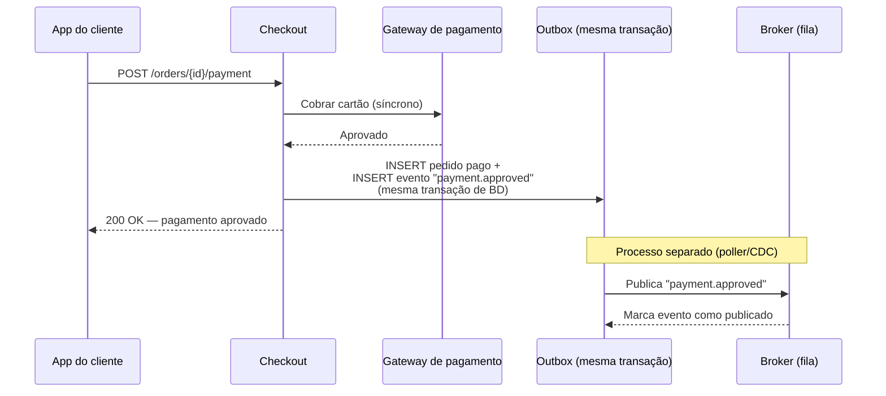
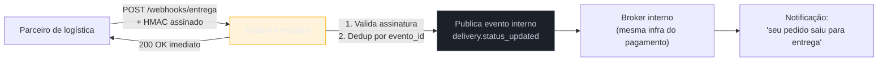
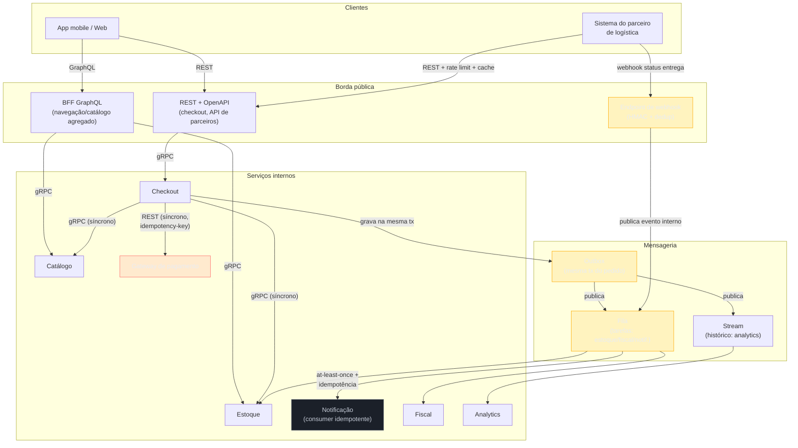

# Desenhando a comunicação de um sistema do zero

> [!abstract] TL;DR
> As 22 notas anteriores desta trilha ensinaram peças isoladas: REST vs GraphQL vs gRPC, idempotência, fila vs stream, Outbox, webhooks, CloudEvents. Esta nota é a costura — um walkthrough único, do primeiro ao último fio, desenhando a camada de comunicação de um sistema de e-commerce do zero: checkout, pagamento assíncrono pós-aprovação, notificação, integração com parceiros externos via webhook. Cada decisão de comunicação que o sistema precisa — borda pública, chamadas internas, o corte síncrono/assíncrono, confiabilidade do pagamento, escolha de broker, garantias de entrega, webhook de parceiro, rate limiting e cache — aparece na ordem em que apareceria numa sessão de design real, cada uma linkada para a nota que a fundamenta e cada uma justificada pelo motivo específico deste cenário, não repetida do zero. O cenário de e-commerce é ilustrativo — não é caso real de nenhum projeto específico.

Uma tech lead se senta para desenhar, do zero, a camada de comunicação de uma plataforma de e-commerce nova. O produto: catálogo, carrinho, checkout com pagamento, confirmação por notificação (email/push), e integração com parceiros de logística que avisam quando um pedido sai para entrega. Nada exótico — é o tipo de sistema que qualquer entrevista de arquitetura sênior usa como pano de fundo, e é exatamente por isso que serve como fio condutor aqui: cada decisão que aparece é genérica o suficiente para se generalizar, e específica o suficiente para forçar uma escolha real, não uma lista de tecnologias.

O erro mais comum nessa sessão não é escolher a tecnologia errada — é abrir a reunião perguntando "REST ou gRPC?" como se essa fosse uma pergunta que se responde uma vez, para o sistema inteiro. A [[03-Dominios/Engenharia/Comunicação entre Sistemas/2 - Comunicação síncrona/06 - REST vs GraphQL vs gRPC — decisão|nota de decisão do sub-galho 2]] já desmontou essa pergunta: a resposta certa não é "qual", é "qual, em qual fronteira". Esta nota aplica esse princípio ao sistema inteiro, fronteira por fronteira, na ordem em que uma sessão de design real percorreria — de fora para dentro, do síncrono para o assíncrono, do controlado para o externo.

```mermaid
graph LR
    classDef destaque fill:#FFAA0024,stroke:#FFAA00,color:#E9ECF2
    A["1. Borda externa<br/>app ↔ backend"] --> B["2. Comunicação interna<br/>serviço ↔ serviço"]
    B --> C["3. Corte<br/>síncrono/assíncrono"]
    C --> D["4. Confiabilidade<br/>do pagamento"]
    D --> E["5. Escolha<br/>do broker"]
    E --> F["6. Garantias<br/>de entrega"]
    F --> G["7. Parceiro externo<br/>via webhook"]
    G --> H["8. Rate limiting<br/>e cache"]
    H --> I["9. O que fica<br/>de fora"]

    class D destaque
    class E destaque
    class G destaque
```



Esse é o roteiro. Cada bloco em âmbar é um ponto onde a decisão errada custa caro em produção — vale prestar atenção redobrada neles, tanto nesta nota quanto numa entrevista real.

## 1. A camada externa: o app conversa com o backend como?

A primeira fronteira que qualquer sessão de design encontra é a mais visível: como o app mobile e o site conversam com o backend. O catálogo de produtos tem várias telas com necessidades de dados bem diferentes — a home lista produtos em destaque com poucos campos (nome, preço, thumbnail), a página de produto precisa de tudo (descrição, variantes, avaliações, produtos relacionados, disponibilidade em estoque por região), e o carrinho precisa de um subconjunto ainda diferente, recalculado a cada mudança.

Aplicando a árvore de decisão que fecha o [[03-Dominios/Engenharia/Comunicação entre Sistemas/1 - Panorama e decisão/05 - O que está emergindo e framework de decisão|sub-galho 1]]: o consumidor aqui é "cliente externo desconhecido, navegador e app mobile" — a primeira pergunta da árvore já aponta para fora do universo gRPC (que exige proxy ou Connect para funcionar em navegador, [[03-Dominios/Engenharia/Comunicação entre Sistemas/2 - Comunicação síncrona/05 - gRPC — Protobuf, HTTP2 e streaming|nota de gRPC]]) e coloca REST e GraphQL como as duas opções reais. A pergunta seguinte da árvore — "o cliente tem UI com telas muito diferentes do mesmo dado?" — é exatamente o que a página de produto versus a home ilustram: a mesma entidade `Product`, consumida em formas radicalmente diferentes por telas diferentes. Isso é o cenário canônico de over-fetching/under-fetching que motivou o GraphQL desde o Facebook em 2012, detalhado na [[03-Dominios/Engenharia/Comunicação entre Sistemas/2 - Comunicação síncrona/04 - GraphQL — schema, resolvers e quando vale|nota de GraphQL]].

A decisão, seguindo a matriz da [[03-Dominios/Engenharia/Comunicação entre Sistemas/2 - Comunicação síncrona/06 - REST vs GraphQL vs gRPC — decisão|nota REST vs GraphQL vs gRPC]]: um BFF GraphQL na borda voltada ao app mobile e ao site, agregando catálogo, estoque e preço numa query por tela. Isso não significa que o catálogo em si "é" GraphQL — o catálogo continua sendo um serviço com seu próprio contrato interno; GraphQL vive na camada de agregação, o padrão Backend-for-Frontend que a própria nota de decisão documenta em Netflix, Uber e Shopify. A alternativa rejeitada — REST puro na borda, com uma cascata de chamadas do app (`GET /products/123`, depois `GET /products/123/stock`, depois `GET /products/123/reviews`) — funcionaria, mas pagaria em latência de rede móvel exatamente o custo que GraphQL existe para evitar: round-trips seriais numa conexão que já é o gargalo.

> [!question]- E o checkout em si — também vai por GraphQL?
> Não necessariamente. A árvore de decisão não é "escolha um estilo para o app inteiro" — é "escolha por fronteira de interação". O fluxo de checkout (criar pedido, aplicar cupom, iniciar pagamento) é uma sequência de mutações bem definidas, sem o problema de agregação heterogênea que motivou GraphQL na navegação do catálogo — cabe perfeitamente como REST (`POST /orders`, `POST /orders/{id}/payment`), inclusive porque simplifica idempotência (seção 4) e cache HTTP condicional (seção 8), que REST oferece de fábrica e GraphQL quebra por padrão. Um sistema real frequentemente mistura os dois dentro do mesmo app — GraphQL para navegação/leitura agregada, REST para o fluxo transacional do checkout — sem que isso seja inconsistência; é exatamente o padrão híbrido que a nota de decisão descreve.

Cache HTTP nativo é outro fator que pesa a favor de manter o checkout em REST: `GET /orders/{id}` com `ETag` permite ao app verificar se o status do pedido mudou sem baixar o payload inteiro de novo — mecanismo que a [[03-Dominios/Engenharia/Comunicação entre Sistemas/3 - Confiabilidade do contrato/03 - Caching HTTP e requisições condicionais|nota de caching HTTP]] detalha e que GraphQL, por rodar sobre `POST`, não oferece sem investimento adicional (Automatic Persisted Queries).

## 2. Comunicação interna: checkout conversa com estoque e catálogo como?

Descendo um nível, o serviço de checkout precisa consultar dois outros serviços internos a cada requisição: catálogo (o produto ainda existe? qual o preço atual?) e estoque (há unidades disponíveis nesta região?). Essa é uma fronteira completamente diferente da anterior — o consumidor não é mais um app desconhecido rodando no celular de alguém, é outro serviço, na mesma rede, que o mesmo time (ou um time irmão) controla.

A árvore de decisão do sub-galho 1 muda de ramo aqui: "serviço interno, mesma rede, sob seu controle" leva à pergunta de performance/latência em cascata. E cascata é exatamente o que acontece: uma única requisição de checkout pode disparar múltiplas chamadas a estoque (uma por item do carrinho) antes de confirmar que o pedido pode prosseguir. Em picos de tráfego — Black Friday sendo o exemplo óbvio de um e-commerce — essas chamadas somam-se na casa de milhares por segundo, e cada milissegundo de overhead de serialização se multiplica pelo volume.

Esse é precisamente o cenário onde gRPC vence, segundo a [[03-Dominios/Engenharia/Comunicação entre Sistemas/2 - Comunicação síncrona/05 - gRPC — Protobuf, HTTP2 e streaming|nota de gRPC]]: Protocol Buffers como serialização binária compacta, HTTP/2 multiplexando várias chamadas na mesma conexão TCP, e um contrato `.proto` tipado em tempo de compilação — nada de payload textual JSON sendo parseado a cada chamada interna que ninguém de fora do time vai ler no DevTools. Os benchmarks citados na nota de decisão (gRPC 5-10x mais rápido que REST/GraphQL em cenários de alto volume) se manifestam com força justamente aqui — serviço-a-serviço, dentro da mesma rede — e não na fronteira que o usuário toca, que já foi resolvida na seção anterior.

```protobuf
service EstoqueService {
  rpc VerificarDisponibilidade (VerificarDisponibilidadeRequest) returns (Disponibilidade);
}

message VerificarDisponibilidadeRequest {
  string produto_id = 1;
  string regiao = 2;
  int32 quantidade = 3;
}
```

A decisão simétrica — checkout → catálogo, checkout → estoque — não precisa ser idêntica em todo par de serviços do sistema. Se um serviço interno recebe poucas chamadas (por exemplo, um serviço de configuração de frete, consultado uma vez por checkout, não uma vez por item), a simplicidade de REST interno ganha da otimização de gRPC — a mesma ramificação "Não — poucas chamadas, simplicidade > performance" que a árvore do sub-galho 1 já previa. Não existe "o padrão interno do sistema"; existe uma decisão por par de serviços, guiada por volume e criticidade de latência.

## 3. O ponto de decisão síncrono vs assíncrono: o coração da sessão

Chega o momento mais importante da sessão inteira — o que separa quem desenha um sistema ingênuo de quem desenha um sistema que sobrevive a produção. O checkout dispara, na sequência, várias ações depois que o pagamento é confirmado: baixa de estoque, emissão de nota fiscal, envio de email/push de confirmação, atualização de dashboards de analytics. A pergunta que decide tudo daqui para frente é a mesma que abre a [[03-Dominios/Engenharia/Comunicação entre Sistemas/4 - Comunicação assíncrona/01 - Síncrono vs assíncrono — quando desacoplar|nota 01 do sub-galho 4]]: **o consumidor desta ação precisa da resposta agora, ou pode esperar?**

Uma única ação nessa lista tem resposta "agora": a aprovação do pagamento em si. O cliente está com o cartão na mão, esperando a tela confirmar — se a aprovação demora 8 segundos porque o sistema está enfileirando tudo de forma assíncrona "por princípio", a experiência já falhou antes de qualquer outra decisão de arquitetura importar. A chamada ao gateway de pagamento (interno ou externo) precisa ser síncrona: o checkout chama, espera, e só avança na jornada quando sabe se o cartão foi aprovado ou recusado.

Todo o resto da lista tem resposta "pode esperar", e cada item ilustra um motivo ligeiramente diferente para desacoplar, conforme o framework da nota:

- **Baixa de estoque** não precisa acontecer no mesmo milissegundo em que o pagamento é aprovado — um atraso de alguns segundos não muda a experiência do cliente, e desacoplar evita que uma lentidão momentânea no serviço de estoque bloqueie a confirmação do pagamento.
- **Emissão de nota fiscal** depende de um serviço fiscal externo que pode estar lento ou fora do ar — se essa chamada fosse síncrona, uma indisponibilidade da Receita ou de um provedor de NF-e derrubaria o checkout inteiro, mesmo que o pagamento tenha sido aprovado perfeitamente.
- **Notificação** (email/push) é, por natureza, best-effort — o cliente não está olhando a tela esperando o email chegar; um atraso de segundos ou até minutos é imperceptível.
- **Analytics** tolera atraso de minutos ou horas sem problema nenhum — é o exemplo mais puro de "throughput importa mais que latência" do framework da nota.



Note o desenho: o cliente recebe a confirmação assim que o pagamento é aprovado e o pedido é gravado — não espera nenhuma das quatro ações downstream. Isso é literalmente a definição de desacoplamento temporal que abre o sub-galho 4: o produtor (checkout) não bloqueia esperando o consumidor (estoque, fiscal, notificação, analytics) processar.

> [!warning] Tornar tudo assíncrono "por padrão" é tão errado quanto tornar tudo síncrono
> **O que acontece:** um time, animado com os benefícios de desacoplamento, decide que até a aprovação do pagamento deveria ser assíncrona — o cliente recebe um "202 Accepted, estamos processando" e só sabe se o pagamento passou minutos depois, via polling ou push. **Por quê:** o custo de complexidade da assincronia — mencionado explicitamente na nota 01 do sub-galho 4 — só se paga quando o consumidor de fato tolera esperar. Aplicado ao pagamento, isso quebra a expectativa fundamental de qualquer checkout: saber, na hora, se a compra foi concluída. **Como evitar:** a régua não é "assíncrono é melhor" nem "síncrono é mais simples" — é, item por item, "este consumidor específico pode esperar, ou não?". O gateway de pagamento não pode; a nota fiscal pode.

## 4. Confiabilidade do pagamento: idempotência e versionamento desde o dia 1

A chamada síncrona ao gateway de pagamento carrega um risco que qualquer chamada de rede carrega: o cliente (aqui, o próprio checkout, agindo como cliente do gateway) pode nunca receber a resposta, mesmo que o gateway tenha processado a cobrança com sucesso — um timeout de rede não diz "a cobrança não aconteceu", diz só "eu não sei o que aconteceu". Se o checkout, ao ver o timeout, simplesmente tenta de novo, o risco é cobrar o cliente duas vezes.

Esse é exatamente o problema que a [[03-Dominios/Engenharia/Comunicação entre Sistemas/3 - Confiabilidade do contrato/01 - Idempotência|nota de idempotência]] resolve, e aqui ele não é opcional — é o requisito mais crítico de todo o sistema, porque envolve dinheiro real saindo do cartão de alguém. A implementação segue o padrão descrito na nota, o mesmo consolidado pela Stripe: o cliente (o checkout) gera uma `Idempotency-Key` única por tentativa de cobrança e a envia em todo retry da mesma operação lógica.

```http
POST /payments/charge HTTP/1.1
Idempotency-Key: chk_a1b2c3-attempt-1
Content-Type: application/json

{ "order_id": "ord_9f21", "amount": 15000, "currency": "BRL" }
```

Do lado do gateway, a chave é armazenada de forma atômica junto com o resultado da primeira tentativa — se o mesmo `Idempotency-Key` chegar de novo (porque o checkout retentou após um timeout), o gateway devolve a resposta já computada, sem cobrar de novo. Sem esse mecanismo, a decisão de desacoplar tudo depois do pagamento (seção 3) seria construída em cima de uma fundação que pode duplicar a própria cobrança que gerou os eventos — o pior lugar possível para duplicar em todo o sistema.

O segundo cuidado desta fronteira, pensado desde o dia 1 e não como retrofit, é versionamento. A API de pagamento é o contrato mais sensível do sistema — mudar a forma como um campo é serializado, ou renomear `amount` para `amount_cents`, quebra qualquer integração que dependa dela, incluindo processos internos de reconciliação financeira. A [[03-Dominios/Engenharia/Comunicação entre Sistemas/3 - Confiabilidade do contrato/02 - Versionamento e evolução de contrato|nota de versionamento]] estabelece a regra de ouro que se aplica aqui com peso redobrado: adicionar campo é seguro, remover ou renomear não é — e qualquer mudança que quebre compatibilidade nesta API específica exige uma versão nova, nunca uma alteração silenciosa da versão vigente. Dado que esta API provavelmente vai sobreviver anos e acumular integrações internas (relatórios financeiros, auditoria, suporte), o custo de negligenciar versionamento aqui é assimétrico: um erro de payload numa API de catálogo gera um bug visual; um erro de payload na API de pagamento gera uma reconciliação financeira quebrada, potencialmente semanas depois de o bug ter sido introduzido.

## 5. A escolha do broker: fila para o pagamento, stream para o analytics

Com o Outbox gravando o evento `payment.approved` na mesma transação do pedido (voltamos a esse padrão na próxima seção), a pergunta seguinte é: que infraestrutura de mensageria recebe e distribui esse evento? A [[03-Dominios/Engenharia/Comunicação entre Sistemas/4 - Comunicação assíncrona/02 - Message queue vs event streaming|nota de message queue vs event streaming]] traça exatamente essa distinção, e o sistema de e-commerce precisa das duas coisas ao mesmo tempo, para necessidades diferentes:

- **Fila de tarefa** para processar o pagamento aprovado até a conclusão de cada ação downstream (baixar estoque, emitir nota fiscal, enviar notificação) — o padrão é "cada mensagem processada uma vez, por um worker, e depois descartada" (ou movida para dead letter se falhar). Uma fila clássica (RabbitMQ, SQS) serve bem: o volume por consumidor não exige retenção de histórico, só entrega confiável de tarefa.
- **Stream de eventos** para analytics e qualquer consumidor que precise do histórico completo, não só do estado mais recente — reconstruir métricas de conversão por região, treinar um modelo de recomendação com o histórico de compras, ou permitir que um novo serviço, criado meses depois, "replay" todo o histórico de pedidos desde o início. Um log de eventos (Kafka) é o que a nota descreve como vencedor aqui, justamente porque retenção configurável e replay são a característica central do estilo stream, ausente numa fila de tarefa tradicional.

O mesmo evento `payment.approved`, portanto, tem dois destinos possíveis a partir do broker — e a decisão de arquitetura madura não escolhe um dos dois, escolhe os dois, cada um resolvendo o problema certo: publicar em um tópico Kafka (satisfazendo tanto o consumo de tarefa via um grupo de consumers quanto a retenção para analytics) ou, alternativamente, publicar em ambos — uma fila dedicada para tarefas de curto prazo e um tópico de streaming para o histórico — dependendo de quanto a equipe quer acoplar as duas necessidades na mesma infraestrutura.

A garantia que amarra a gravação do pedido pago à publicação do evento — para que "pagamento aprovado" nunca se perca mesmo se o processo cair entre gravar o pedido e publicar o evento — é o **Outbox pattern**, detalhado na [[03-Dominios/Engenharia/Comunicação entre Sistemas/4 - Comunicação assíncrona/04 - Outbox e Saga|nota de Outbox e Saga]]. O diagrama de sequência da seção 3 já mostrou o mecanismo: o checkout grava o pedido e o evento `payment.approved` na mesma transação de banco de dados (a tabela de outbox), e um processo separado — poller ou CDC (Change Data Capture, lendo o write-ahead log do banco) — publica esse evento no broker de forma assíncrona, marcando-o como publicado só depois de confirmação. Sem Outbox, existiria uma janela onde o pedido está gravado como pago mas o evento nunca chega a ser publicado — se o processo cair entre o commit da transação e a chamada ao broker, o estoque nunca é baixado, a nota fiscal nunca é emitida, e ninguém percebe até um cliente reclamar que "pagou mas não recebeu confirmação".

## 6. Garantias de entrega: notificação não pode duplicar

O serviço de notificação consome o evento `payment.approved` do broker e dispara o email/push de confirmação. A pergunta que a [[03-Dominios/Engenharia/Comunicação entre Sistemas/4 - Comunicação assíncrona/03 - Garantias de entrega e ordenação|nota de garantias de entrega]] resolve aparece aqui de forma muito concreta: qual das três garantias — at-most-once, at-least-once, "exactly-once" — o consumidor de notificação precisa assumir?

A resposta prática, que a nota já adianta como o default de mercado: **at-least-once**. Praticamente todo broker de produção (Kafka, RabbitMQ, SQS) reentrega uma mensagem se a confirmação (`ack`) não chega a tempo — seja porque o consumer travou processando, seja porque um rebalanceamento de partição reatribuiu a mensagem antes do `ack` original chegar. Isso significa que o mesmo evento `payment.approved` pode, legitimamente, chegar duas vezes ao serviço de notificação. Se o consumer simplesmente dispara um email a cada mensagem recebida, sem nenhuma proteção adicional, o cliente recebe dois emails de confirmação para a mesma compra — pequeno, mas exatamente o tipo de falha visível que mina confiança no sistema sem que nada tenha "quebrado" tecnicamente.

A solução é a mesma disciplina de idempotência da seção 4, aplicada agora do lado do consumidor: o serviço de notificação armazena, com constraint de unicidade, o ID do evento já processado (o `id` do CloudEvents, se o envelope for adotado — seção 9) e curto-circuita qualquer reprocessamento do mesmo ID.

```sql
INSERT INTO eventos_processados (evento_id, processado_em)
VALUES ('evt_8f2a1c9d', now())
ON CONFLICT (evento_id) DO NOTHING;
-- se 0 linhas afetadas, o evento já foi processado — não reenvia o email
```

O padrão inteiro — at-least-once no broker, idempotência no consumer — é o mesmo par de garantias que apareceu na cobrança do cartão (seção 4), só que espelhado do lado assíncrono: lá, o cliente (checkout) protegia contra retry duplo numa chamada síncrona; aqui, o consumer protege contra entrega duplicada numa chamada assíncrona. É o mesmo princípio de fundo, aplicado nos dois lados do corte síncrono/assíncrono que a seção 3 estabeleceu.

## 7. O parceiro externo: webhook de status de entrega

A integração com o parceiro de logística inverte, pela primeira vez nesta sessão, o papel de quem inicia a comunicação. Até aqui, o sistema sempre recebeu chamadas (do app, de si mesmo entre serviços) ou consumiu de um broker que ele mesmo controla. Agora, quando o parceiro de logística atualiza o status de uma entrega ("saiu para entrega", "entregue", "tentativa falhou"), é o **parceiro** quem inicia — ele chama um endpoint do e-commerce, via webhook.

A [[03-Dominios/Engenharia/Comunicação entre Sistemas/3 - Confiabilidade do contrato/05 - Webhooks e operações assíncronas|nota de webhooks]] descreve exatamente essa inversão de papel como a raiz de todo problema de confiabilidade que ela resolve: o e-commerce, ao expor um endpoint que recebe `POST` de um sistema externo, precisa provar autenticidade (o parceiro é mesmo quem diz ser?) e sobreviver a duplicação e desordem, os mesmos riscos que apareceram na seção 6, agora vindos de fora da própria infraestrutura.

- **Autenticidade:** o parceiro assina o payload com HMAC, incluindo timestamp na assinatura — o mesmo desenho consolidado pela Stripe que a nota detalha. O e-commerce recalcula o HMAC sobre o corpo bruto, compara em tempo constante, e rejeita eventos com timestamp fora de uma janela de tolerância (proteção contra replay attack).
- **Retry e reentrega:** se o endpoint do e-commerce estiver temporariamente fora do ar (deploy, pico de tráfego derrubando um pod), o parceiro deve reentregar com backoff exponencial — e o e-commerce, do lado receptor, não pode assumir que cada webhook chega exatamente uma vez.
- **Deduplicação:** cada evento de status de entrega carrega um ID estável — o e-commerce armazena esse ID e curto-circuita reprocessamento, a mesma disciplina exata da seção 6, agora aplicada a um evento que entra pela porta HTTP em vez de sair de um tópico Kafka.

O reconhecimento explícito que a [[03-Dominios/Engenharia/Comunicação entre Sistemas/4 - Comunicação assíncrona/06 - O que está emergindo em mensageria|última nota do sub-galho 4]] deixa amarrado é o mais importante desta seção: **um webhook é mensageria invertida** — estruturalmente o mesmo problema de garantia de entrega sob falha parcial que a seção 6 resolveu para o consumidor interno de notificação, só que sem a infraestrutura formal de um broker por trás. Não existe Kafka nem RabbitMQ garantindo durabilidade entre o parceiro e o endpoint do e-commerce — existe só HTTP cru, e toda a disciplina (retry, dedup, dead letter) precisa ser reconstruída manualmente dos dois lados. Por isso, times maduros — como a própria nota descreve — terminam colocando uma fila interna entre a chegada do webhook e o processamento real: o endpoint recebe o `POST`, valida a assinatura, e imediatamente publica um evento interno (`delivery.status_updated`) num tópico próprio do sistema, devolvendo `200 OK` ao parceiro assim que possível. Dali para frente, o processamento (atualizar o pedido, notificar o cliente que o pacote saiu para entrega) segue as mesmas garantias já estabelecidas nas seções 5 e 6 — o webhook vira, na prática, só mais um produtor externo alimentando a mesma infraestrutura de mensageria interna que o pagamento já usa.



## 8. Rate limiting e cache: a API pública que os parceiros consomem

O e-commerce também expõe uma API — a que os próprios parceiros de logística (e possivelmente marketplaces integrados) consomem para consultar status de pedido, catálogo e disponibilidade. Duas preocupações de contrato entram aqui, ambas tratadas como defesa e eficiência, não como feature de produto.

**Rate limiting como contrato.** A API pública de parceiros precisa comunicar, de forma explícita, quantas chamadas por minuto cada parceiro pode fazer — e o que acontece quando esse limite é excedido. A [[03-Dominios/Engenharia/Comunicação entre Sistemas/3 - Confiabilidade do contrato/04 - Rate limiting como contrato|nota de rate limiting]] estabelece que essa comunicação acontece via headers de resposta padronizados e um `429 Too Many Requests` com `Retry-After`, permitindo que o cliente (o sistema do parceiro) se auto-regule sem adivinhar. Sem isso, um parceiro com um bug de loop infinito na própria integração pode bombardear a API do e-commerce sem aviso — o mesmo cenário citado no capstone-modelo da trilha de System Design, onde rate limiting por API key protege o sistema principal de uma integração externa com bug, sem afetar o tráfego legítimo do app. O algoritmo por trás do limite (token bucket, sliding window) é escopo de outra trilha — [[03-Dominios/Engenharia/Arquitetura/System Design/3 - Padrões recorrentes/04 - Rate Limiting|System Design]] — aqui o que importa é o contrato que a API expõe, não a implementação interna.

**Caching HTTP para o catálogo.** A consulta de disponibilidade e preço de produto, feita repetidamente pelos parceiros (e pelo BFF da seção 1), se beneficia diretamente do mecanismo que a [[03-Dominios/Engenharia/Comunicação entre Sistemas/3 - Confiabilidade do contrato/03 - Caching HTTP e requisições condicionais|nota de caching HTTP]] descreve: `Cache-Control` com um TTL curto para dados que mudam com frequência moderada (preço, disponibilidade), e `ETag`/`If-None-Match` para que um parceiro que já tem o dado em cache não pague o custo de reprocessar um payload idêntico — um `304 Not Modified` responde em frações do tempo e do tráfego de um `200` completo. Esse mecanismo só existe de fábrica porque a decisão da seção 1 manteve o catálogo consultável via REST — é exatamente o trunfo que a nota de decisão do sub-galho 2 credita a REST e que GraphQL, rodando sobre `POST`, não replica sem investimento adicional (Automatic Persisted Queries).

## 9. O que não usar aqui — e o que faria sentido

Uma sessão de design madura não é só sobre o que escolher — é também sobre nomear, com clareza, o que fica de fora e por quê, sem alucinar necessidade onde não existe.

**SOAP e ESB não têm lugar neste sistema — a menos que apareça um ERP bancário legado.** A [[03-Dominios/Engenharia/Comunicação entre Sistemas/1 - Panorama e decisão/02 - RPC clássico e por que caiu|nota de RPC clássico]] e a [[03-Dominios/Engenharia/Comunicação entre Sistemas/4 - Comunicação assíncrona/05 - Legado e padrões enterprise|nota de legado enterprise]] documentam, com honestidade, onde SOAP/WSDL e ESB ainda sobrevivem: EDI em bancos e seguradoras, integrações B2B legadas que ninguém teve orçamento para migrar. Um e-commerce novo, construído do zero em 2026, não tem motivo para adotar nenhum dos dois — mas se este sistema precisasse, algum dia, integrar um sistema de conciliação financeira de um banco parceiro antigo, seria exatamente o tipo de fronteira onde SOAP ainda aparece, não por escolha, mas porque o outro lado do contrato não muda. Reconhecer isso — em vez de fingir que XML/WSDL nunca mais existe — é o mesmo tipo de honestidade que separa um design sênior de um design ingênuo: a tecnologia certa depende de quem está do outro lado do contrato, e às vezes quem está do outro lado é um sistema de 1998.

**tRPC e Connect não entram, pela mesma razão de sempre: consumidor poliglota.** A [[03-Dominios/Engenharia/Comunicação entre Sistemas/1 - Panorama e decisão/05 - O que está emergindo e framework de decisão|nota de tecnologias emergentes]] é clara sobre o limite do tRPC: só funciona quando cliente e servidor compilam no mesmo grafo TypeScript, sem consumidor externo relevante. Este sistema tem parceiros externos, um app mobile nativo (possivelmente Swift/Kotlin, não TypeScript) e times potencialmente distintos por serviço — o cenário exato onde tRPC vira um beco sem saída, não um ganho.

**AsyncAPI e CloudEvents fariam sentido conforme o sistema cresce — não no MVP.** A [[03-Dominios/Engenharia/Comunicação entre Sistemas/4 - Comunicação assíncrona/06 - O que está emergindo em mensageria|última nota do sub-galho 4]] nomeia exatamente a condição que justifica adotar os dois: heterogeneidade de produtores e consumidores. No desenho desta sessão, os eventos (`payment.approved`, `delivery.status_updated`) ainda nascem de um número pequeno de serviços, todos sob o mesmo time — o custo de formalizar CloudEvents como envelope e documentar tudo via AsyncAPI supera o ganho enquanto o sistema é pequeno. O ponto de virada é o mesmo que o caso da Intuit (QuickBooks) ilustrou na nota: quando o número de produtores e consumidores cresce — mais serviços internos, mais parceiros publicando eventos em formatos próprios, talvez integração com EventBridge ou Event Grid — cada consumer novo passa a exigir um adaptador sob medida, e é aí que o envelope padronizado (CloudEvents) e a documentação formal dos canais (AsyncAPI) começam a se pagar. Nomear esse ponto de virada, em vez de adotar cedo demais "porque é moderno" ou tarde demais "porque nunca tinha ouvido falar", é a mesma disciplina de julgamento que atravessa a nota inteira de tecnologias emergentes.

> [!question]- Vale a pena documentar os eventos com AsyncAPI desde o primeiro dia, mesmo pequeno?
> Documentar formalmente os canais desde cedo tem um custo baixo se o time já vai escrever a documentação de qualquer forma — nesse caso, começar em AsyncAPI em vez de um wiki que degrada é estritamente melhor, porque o documento gera artefatos (validação, esqueleto de código) que um wiki não gera. O que não compensa cedo é o envelope CloudEvents por si só, se todos os produtores e consumidores são o mesmo time — ali, um schema Avro/Protobuf compartilhado internamente já resolve o problema sem a camada adicional. A régua da nota de emergentes se aplica sem exceção: adote o que resolve uma dor concreta que você já tem, não a que você pode vir a ter.

## O diagrama completo: a arquitetura de comunicação do sistema

Juntando as nove decisões anteriores numa única imagem — cada seta rotulada com a tecnologia escolhida e o motivo, não a tecnologia "da moda":



Vermelho no gateway de pagamento não é acidente: é o único ponto do diagrama inteiro onde a comunicação é estritamente síncrona e bloqueante, o único onde uma falha impede a resposta ao cliente na hora. Tudo em âmbar é onde a confiabilidade precisa de desenho deliberado — Outbox, fila, webhook — porque são exatamente os pontos onde "a rede não tem memória e falha de formas parciais e imprevisíveis", a frase que fecha a última nota do sub-galho 4. Tudo em azul é comunicação que, tendo sido bem desenhada nas seções anteriores, já opera com as garantias certas por padrão.

## Reflexão final: como a trilha inteira se costura

Voltando ao início desta nota: a pergunta errada era "REST ou gRPC?", feita como se existisse uma resposta única. A pergunta certa, que esta sessão inteira respondeu nove vezes, sempre com uma resposta diferente, foi "quem consome esta fronteira, o que ela precisa de mim, e o que já sei sobre esse tipo de decisão?" — e a resposta a essa segunda parte é, literalmente, as 22 notas anteriores desta trilha.

O eixo síncrono/assíncrono da [[03-Dominios/Engenharia/Comunicação entre Sistemas/1 - Panorama e decisão/01 - O que é o contrato de comunicação|primeira nota da trilha inteira]] apareceu de novo, em cada uma das nove seções, como a pergunta mestra por trás de toda decisão — mesmo quando a resposta óbvia era "síncrono" (o pagamento) ou "assíncrono" (tudo o resto). A história do RPC clássico explicou por que nenhuma tecnologia única serve para todo consumidor — e essa lição apareceu tanto na seção 1 (por que GraphQL não é REST) quanto na seção 9 (por que SOAP ainda sobrevive em fronteiras específicas). Idempotência apareceu duas vezes — na cobrança do cartão e no consumer de notificação — porque é a mesma disciplina, espelhada nos dois lados do corte síncrono/assíncrono. E webhooks e mensageria interna se revelaram, na seção 7, como o mesmo problema de garantia de entrega, só que com infraestrutura formal de um lado e HTTP cru do outro.

Nenhuma dessas nove decisões foi tomada isoladamente das outras oito — decidir gRPC internamente (seção 2) só faz sentido porque a decisão de desacoplar o pós-pagamento (seção 3) já reduziu a superfície onde performance em cascata é crítica; decidir Outbox (seção 5) só faz sentido porque idempotência (seção 4) já garantiu que o evento que ele publica não representa uma cobrança duplicada. É essa interdependência — não uma lista de tecnologias, mas um grafo de decisões que se sustentam mutuamente — que faz de "desenhar a comunicação de um sistema" uma disciplina, não uma escolha de ferramenta.

## Em entrevista

Esta sessão inteira é, quase palavra por palavra, o tipo de walkthrough que aparece em entrevistas de arquitetura sênior e em rounds de system design com foco em comunicação — seja como pergunta isolada ("como você desenharia a comunicação de um e-commerce?") seja como aprofundamento de uma pergunta mais ampla de system design, no momento em que o candidato chega ao deep dive (ver [[03-Dominios/Engenharia/Arquitetura/System Design/Conduzindo a entrevista completa|Conduzindo a entrevista completa]], da trilha irmã). O sinal que separa quem decorou tecnologias de quem já desenhou algo assim de verdade é a ordem em que as decisões aparecem e o motivo dado para cada uma — nunca "eu usaria Kafka porque é o que todo mundo usa", sempre "eu separaria fila de stream porque o pagamento precisa de garantia de tarefa processada uma vez, e o analytics precisa de histórico replayable".

Três perguntas de acompanhamento comuns, e como esta nota já as respondeu:

- **"E se o gateway de pagamento externo cair no meio da cobrança?"** — a resposta aponta direto para a seção 4: idempotência via `Idempotency-Key` garante que um retry seguro não duplica a cobrança, independente de quantas vezes o checkout tenta.
- **"Como você garante que o evento de pagamento aprovado nunca se perde?"** — aponta para o Outbox pattern da seção 5: gravar pedido e evento na mesma transação de banco elimina a janela onde um processo pode cair entre os dois.
- **"E se o parceiro de logística mandar o mesmo webhook duas vezes?"** — aponta para a seção 7: deduplicação por ID de evento, a mesma disciplina do consumer de notificação da seção 6, aplicada do lado receptor do webhook.

> [!warning] Responder com uma lista de tecnologias em vez de um grafo de decisões
> **O que acontece:** perguntado "como você desenharia a comunicação deste sistema?", o candidato lista tecnologias — "eu usaria GraphQL, gRPC, Kafka, webhooks com HMAC" — sem conectar cada uma a uma fronteira específica e a um motivo específico. **Por quê:** uma lista de tecnologias, por mais correta que seja individualmente, não demonstra a habilidade que a pergunta testa — que é justamente a capacidade de mapear cada decisão a um requisito real do cenário, não a familiaridade com os nomes. **Como evitar:** narrar a decisão na mesma ordem desta sessão — de fora para dentro, do síncrono para o assíncrono — nomeando, a cada passo, quem é o consumidor e por que essa fronteira específica pede essa tecnologia específica, exatamente como as nove seções acima fizeram.

## How to explain in English

> "When I design the communication layer of a system from scratch, I don't ask 'REST or gRPC' as a single question for the whole system — I ask it once per boundary. For the public edge, where the consumer is an unknown mobile app or a browser, I default to REST for transactional flows like checkout, because it gets native HTTP caching and idempotency for free; and I add a GraphQL BFF specifically where the client needs different shapes of the same data across screens — that's an aggregation problem, not a general replacement for REST. For internal service-to-service calls that stay inside my own network, I switch to gRPC when call volume and cascading latency justify the binary-protocol investment, and keep it simple REST otherwise.
>
> The decision that matters most is the sync/async cut: payment authorization has to be synchronous, because the customer is waiting to know if the charge went through — but everything downstream of a successful payment (stock update, invoice, notification, analytics) can and should be asynchronous, because none of those consumers need an immediate answer. Once something crosses into async, I treat idempotency as non-negotiable on both sides of the boundary: an Idempotency-Key on the synchronous payment call to survive retries without double-charging, and idempotent consumers downstream to survive at-least-once delivery without double-processing. I use the Outbox pattern to guarantee the 'payment approved' event is never lost between the database commit and the message being published — writing both in the same transaction closes that gap completely.
>
> For external partners, webhooks are structurally the same reliability problem as internal messaging, just without a broker's formal durability underneath — so I sign every payload with HMAC and a timestamp to prevent replay, and I deduplicate by event ID on the receiving end exactly the way I would for a Kafka consumer. And I'm explicit about what I'm not adopting yet — no SOAP unless a legacy banking partner forces it, no CloudEvents or AsyncAPI until the number of event producers and consumers actually creates the fragmentation problem those specs solve."

| PT | EN |
|----|----|
| Fronteira de comunicação | Communication boundary |
| Camada de agregação (BFF) | Aggregation layer (BFF) |
| Corte síncrono/assíncrono | Sync/async cut |
| Chave de idempotência | Idempotency key |
| Padrão Outbox | Outbox pattern |
| Entrega pelo menos uma vez | At-least-once delivery |
| Consumer idempotente | Idempotent consumer |
| Mensageria invertida | Inverted messaging |
| Assinatura HMAC | HMAC signature |
| Limite de requisições (rate limiting) | Rate limiting |
| Requisição condicional / ETag | Conditional request / ETag |
| Grafo de decisões | Decision graph |
| Fila de tarefa vs log de eventos | Task queue vs event log |

## Fontes

Esta é uma nota de síntese — a pesquisa de fundo já está nas 22 notas dos quatro sub-galhos, cada uma citada e linkada ao longo do texto. As referências abaixo cobrem só as fontes citadas diretamente nesta nota, fora do que as notas anteriores já documentaram em profundidade.

- Stripe Docs — [*Idempotent requests*](https://docs.stripe.com/api/idempotent_requests) — padrão de `Idempotency-Key` aplicado à cobrança do gateway de pagamento (seção 4).
- Stripe Docs — [*Receive Stripe events in your webhook endpoint*](https://docs.stripe.com/webhooks) — modelo de retry/assinatura aplicado ao webhook do parceiro de logística (seção 7).
- Netflix TechBlog — [*Beyond REST: Rapid Development With GraphQL Microservices*](https://netflixtechblog.com/beyond-rest-1b76f7c20ef6) — precedente de arquitetura híbrida REST/GraphQL/gRPC, referenciado na decisão da seção 1.
- Maesn — [*QuickBooks Webhooks to CloudEvents Migration Guide*](https://www.maesn.com/blog/quickbooks-webhooks-cloudevents) — caso da Intuit usado como referência do ponto de virada para adoção de CloudEvents (seção 9).
- [[03-Dominios/Engenharia/Arquitetura/System Design/Conduzindo a entrevista completa|Conduzindo a entrevista completa]] — capstone-modelo da trilha irmã, cuja estrutura de walkthrough único esta nota replica.

## A trilha completa: as 22 notas, por sub-galho

Para quem chegou aqui direto — o mapa completo do que esta nota costurou, organizado como a trilha foi construída.

**[[03-Dominios/Engenharia/Comunicação entre Sistemas/1 - Panorama e decisão/index|Sub-galho 1 — Panorama e decisão]]** (o mapa antes do território)
- [[03-Dominios/Engenharia/Comunicação entre Sistemas/1 - Panorama e decisão/01 - O que é o contrato de comunicação|01 — O que é o contrato de comunicação]]
- [[03-Dominios/Engenharia/Comunicação entre Sistemas/1 - Panorama e decisão/02 - RPC clássico e por que caiu|02 — RPC clássico e por que caiu]]
- [[03-Dominios/Engenharia/Comunicação entre Sistemas/1 - Panorama e decisão/03 - A era REST, GraphQL, gRPC|03 — A era REST, GraphQL, gRPC]]
- [[03-Dominios/Engenharia/Comunicação entre Sistemas/1 - Panorama e decisão/04 - Comunicação em tempo real|04 — Comunicação em tempo real]]
- [[03-Dominios/Engenharia/Comunicação entre Sistemas/1 - Panorama e decisão/05 - O que está emergindo e framework de decisão|05 — O que está emergindo e framework de decisão]]

**[[03-Dominios/Engenharia/Comunicação entre Sistemas/2 - Comunicação síncrona/index|Sub-galho 2 — Comunicação síncrona]]** (REST, GraphQL, gRPC em profundidade)
- [[03-Dominios/Engenharia/Comunicação entre Sistemas/2 - Comunicação síncrona/01 - REST — modelagem de recursos e maturidade|01 — REST: modelagem de recursos e maturidade]]
- [[03-Dominios/Engenharia/Comunicação entre Sistemas/2 - Comunicação síncrona/02 - REST — o contrato de resposta|02 — REST: o contrato de resposta]]
- [[03-Dominios/Engenharia/Comunicação entre Sistemas/2 - Comunicação síncrona/03 - Paginação, filtros e autenticação em REST|03 — Paginação, filtros e autenticação em REST]]
- [[03-Dominios/Engenharia/Comunicação entre Sistemas/2 - Comunicação síncrona/04 - GraphQL — schema, resolvers e quando vale|04 — GraphQL: schema, resolvers e quando vale]]
- [[03-Dominios/Engenharia/Comunicação entre Sistemas/2 - Comunicação síncrona/05 - gRPC — Protobuf, HTTP2 e streaming|05 — gRPC: Protobuf, HTTP/2 e streaming]]
- [[03-Dominios/Engenharia/Comunicação entre Sistemas/2 - Comunicação síncrona/06 - REST vs GraphQL vs gRPC — decisão|06 — REST vs GraphQL vs gRPC: decisão]]

**[[03-Dominios/Engenharia/Comunicação entre Sistemas/3 - Confiabilidade do contrato/index|Sub-galho 3 — Confiabilidade do contrato]]** (o contrato sob falha, retry e o tempo)
- [[03-Dominios/Engenharia/Comunicação entre Sistemas/3 - Confiabilidade do contrato/01 - Idempotência|01 — Idempotência]]
- [[03-Dominios/Engenharia/Comunicação entre Sistemas/3 - Confiabilidade do contrato/02 - Versionamento e evolução de contrato|02 — Versionamento e evolução de contrato]]
- [[03-Dominios/Engenharia/Comunicação entre Sistemas/3 - Confiabilidade do contrato/03 - Caching HTTP e requisições condicionais|03 — Caching HTTP e requisições condicionais]]
- [[03-Dominios/Engenharia/Comunicação entre Sistemas/3 - Confiabilidade do contrato/04 - Rate limiting como contrato|04 — Rate limiting como contrato]]
- [[03-Dominios/Engenharia/Comunicação entre Sistemas/3 - Confiabilidade do contrato/05 - Webhooks e operações assíncronas|05 — Webhooks e operações assíncronas]]

**[[03-Dominios/Engenharia/Comunicação entre Sistemas/4 - Comunicação assíncrona/index|Sub-galho 4 — Comunicação assíncrona]]** (desacoplar no tempo)
- [[03-Dominios/Engenharia/Comunicação entre Sistemas/4 - Comunicação assíncrona/01 - Síncrono vs assíncrono — quando desacoplar|01 — Síncrono vs assíncrono: quando desacoplar]]
- [[03-Dominios/Engenharia/Comunicação entre Sistemas/4 - Comunicação assíncrona/02 - Message queue vs event streaming|02 — Message queue vs event streaming]]
- [[03-Dominios/Engenharia/Comunicação entre Sistemas/4 - Comunicação assíncrona/03 - Garantias de entrega e ordenação|03 — Garantias de entrega e ordenação]]
- [[03-Dominios/Engenharia/Comunicação entre Sistemas/4 - Comunicação assíncrona/04 - Outbox e Saga|04 — Outbox e Saga]]
- [[03-Dominios/Engenharia/Comunicação entre Sistemas/4 - Comunicação assíncrona/05 - Legado e padrões enterprise|05 — Legado e padrões enterprise]]
- [[03-Dominios/Engenharia/Comunicação entre Sistemas/4 - Comunicação assíncrona/06 - O que está emergindo em mensageria|06 — O que está emergindo em mensageria]]

## Veja também

- [[03-Dominios/Engenharia/Comunicação entre Sistemas/index|Comunicação entre Sistemas]] — o galho-pai e o mapa da trilha inteira
- [[03-Dominios/Engenharia/Arquitetura/System Design/index|System Design]] — a trilha irmã que desenha o sistema inteiro; esta trilha aprofunda especificamente a camada de contrato
- [[03-Dominios/Engenharia/Comunicação entre Sistemas/Mensageria/index|Mensageria]] — ferramenta específica de broker (Kafka, RabbitMQ, BullMQ) referenciada nas seções 5-7

> [!info] Sobre o cenário
> O sistema de e-commerce usado nesta nota (checkout + pagamento assíncrono + notificação + integração com parceiro de logística) é um cenário ilustrativo e genérico, escolhido por ser reconhecível em qualquer entrevista ou sessão de design — não é caso real de nenhum projeto ou cliente específico.
