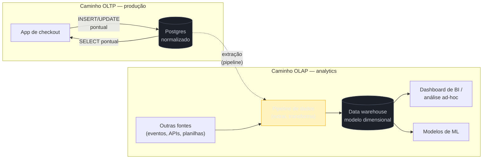
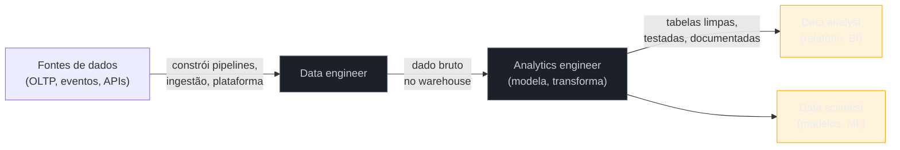

# O que é engenharia de dados

> [!abstract] TL;DR
> Todo sistema de software sério nasce **transacional (OLTP)**: escritas curtas, linha a linha, com consistência forte — o carrinho de compras, o cadastro de cliente, o pedido que acabou de ser pago. Mais cedo ou mais tarde, alguém pergunta "qual foi o faturamento por categoria nos últimos dois anos?" — e essa pergunta é de outra natureza: leitura massiva, agregação sobre milhões de linhas, **analítica (OLAP)**. Rodar as duas cargas no mesmo banco de produção é uma receita de contenção, lentidão e, eventualmente, incidente. **Engenharia de dados** é a disciplina que constrói a ponte entre os dois mundos: os pipelines, os armazéns (*data warehouses*) e as plataformas que movem dado bruto de onde ele nasce (o OLTP) até onde ele vira decisão (o OLAP e além — ML, produtos de dados). Esta nota abre a trilha estabelecendo a divisão fundadora — OLTP vs OLAP —, por que o banco transacional não escala para analytics, o que a disciplina de engenharia de dados de fato faz, e onde ela termina e outros papéis (analytics engineer, data scientist, data analyst) começam.

> [!question]- Perguntas que esta nota responde
> - Qual a diferença real entre um sistema OLTP e um sistema OLAP — e por que ela não é só "tamanho da query"?
> - Por que rodar um relatório pesado direto no banco de produção é perigoso, mesmo que a query "funcione"?
> - O que engenharia de dados faz, na prática, que banco de dados sozinho não resolve?
> - Onde termina o trabalho do data engineer e começa o do analytics engineer, do data scientist e do data analyst?

## A pergunta que trava o banco de produção

Imagine um e-commerce de porte médio. O time de produto já resolveu o problema difícil: catálogo, carrinho, checkout, pagamento, estoque. Tudo roda sobre um Postgres bem modelado, com transações que garantem que um pedido pago debita o estoque certo e nunca perde uma venda por causa de uma race condition. É um sistema OLTP saudável — a teoria por trás dele (o modelo relacional, ACID, normalização, índices) mora em [[03-Dominios/Ciência/Banco de Dados/index|Banco de Dados]], e não vamos reexplicá-la aqui.

Um dia, a diretoria comercial pede um número: **faturamento por categoria de produto, por mês, dos últimos dois anos**. Parece uma consulta razoável — é só um `GROUP BY`, certo?

Alguém escreve a query. Ela junta a tabela de pedidos com a de itens de pedido, com a de produtos, com a de categorias — quatro ou cinco `JOIN`s, porque o banco está corretamente normalizado para não duplicar dado. Ela filtra por uma janela de dois anos, que em um e-commerce ativo pode significar dezenas de milhões de linhas na tabela de itens de pedido. Ela agrupa por categoria e por mês, e soma.

A query, em forma simplificada, se parece com isto:

```sql
SELECT
    c.nome AS categoria,
    date_trunc('month', p.criado_em) AS mes,
    SUM(i.quantidade * i.preco_unitario) AS faturamento
FROM pedidos p
JOIN itens_pedido i ON i.pedido_id = p.id
JOIN produtos pr ON pr.id = i.produto_id
JOIN categorias c ON c.id = pr.categoria_id
WHERE p.criado_em >= now() - interval '2 years'
  AND p.status = 'pago'
GROUP BY c.nome, date_trunc('month', p.criado_em)
ORDER BY mes;
```

Não há nada de errado na sintaxe. É uma query SQL correta, do tipo que qualquer curso de banco de dados ensina a escrever. O problema não está na query — está em **onde ela roda**.

Ela roda. E enquanto roda — trinta segundos, dois minutos, às vezes mais, dependendo do volume e dos índices disponíveis — ela segura um punhado de páginas do banco em memória, compete por I/O com todo o tráfego de checkout que está acontecendo *agora*, e em bancos com isolamento mais rígido pode até ser bloqueada por, ou bloquear, transações de escrita concorrentes. Em produção, no pico de vendas, é exatamente quando esse relatório tende a ser pedido — a diretoria comercial quer ver o desempenho da Black Friday *durante* a Black Friday — e exatamente quando o banco não tem folga nenhuma para dar.

O resultado, na prática, costuma ser um dos dois: o relatório demora tanto que vira inviável rodar mais de uma vez por dia, ou — no pior cenário — ele contribui para deixar o checkout lento justamente na hora de maior receita. Nenhuma linha de código está "errada". O banco está fazendo exatamente o que foi desenhado para fazer. O problema é que **ele foi desenhado para outra coisa**.

Uma reação comum, na primeira vez que isso acontece, é tentar consertar dentro do próprio banco: adicionar um índice, reescrever o `JOIN`, agendar o relatório para rodar de madrugada. Essas táticas ajudam — e vale a pena aplicá-las, já que a teoria de índices e otimização de query mora em [[03-Dominios/Ciência/Banco de Dados/07 - Índices|Banco de Dados 07]] e [[03-Dominios/Ciência/Banco de Dados/08 - EXPLAIN e otimização|Banco de Dados 08]] — mas elas atacam o sintoma, não a causa. A causa é estrutural: o banco foi modelado e dimensionado para outra carga de trabalho, e nenhuma otimização pontual muda isso quando o volume de dado e o número de perguntas analíticas crescem, o que é exatamente o que acontece conforme o negócio cresce.

## OLTP vs OLAP: a divisão fundadora

O nome técnico para essas duas naturezas de carga de trabalho é **OLTP** (*Online Transaction Processing*) e **OLAP** (*Online Analytical Processing*) — uma distinção que remonta aos anos 1990, quando a indústria de bancos de dados percebeu que "banco de dados" não era uma categoria única, e sim duas com necessidades opostas[^kimball].

**OLTP** é o mundo das operações do dia a dia: criar um pedido, atualizar um saldo, cadastrar um cliente. As características:

- Muitas transações **curtas**, cada uma tocando poucas linhas.
- Forte ênfase em **consistência** e **integridade** — é inaceitável perder ou duplicar um pedido.
- O modelo de dados é **normalizado**: cada fato mora em um lugar só, para nunca ficar inconsistente entre duas cópias.
- O padrão de acesso é **ponto**: "me dê o pedido #48219", não "me dê a soma de todos os pedidos de 2024".

**OLAP** é o mundo das perguntas de negócio: quanto vendemos, de que, para quem, quando. As características:

- Poucas queries, mas cada uma **varre milhões de linhas** e faz agregação pesada (soma, média, contagem, janelas de tempo).
- A prioridade é **velocidade de leitura em escala**, não a menor latência de uma escrita isolada.
- O modelo de dados tende a ser **desnormalizado** de propósito — menos `JOIN`s, mais colunas repetidas, porque ler rápido importa mais que economizar espaço em disco.
- O padrão de acesso é **de varredura**: "me dê o total de vendas por categoria, por mês, dos últimos dois anos".

| Dimensão | OLTP | OLAP |
|---|---|---|
| Operação típica | INSERT/UPDATE pontual | SELECT com agregação massiva |
| Volume por operação | Poucas linhas | Milhões de linhas |
| Prioridade | Consistência, integridade | Vazão de leitura, velocidade de agregação |
| Modelo de dados | Normalizado (3FN) | Desnormalizado (dimensional, ver nota 03) |
| Usuário típico | A aplicação, o cliente final | Analista, dashboard de BI, modelo de ML |
| Exemplo | Checkout de um e-commerce | "Faturamento por categoria, últimos 2 anos" |

> [!info] Onde a teoria de cada lado mora
> Tudo que sustenta o lado OLTP — o modelo relacional, SQL, **ACID** e transações, normalização, índices — já tem 16 notas dedicadas em [[03-Dominios/Ciência/Banco de Dados/index|Banco de Dados]]. Em especial, a formalização de transações e ACID está na nota [[03-Dominios/Ciência/Banco de Dados/05 - Transações e ACID|Banco de Dados 05]], e o custo de normalização/desnormalização é tratado em [[03-Dominios/Ciência/Banco de Dados/04 - Modelagem e normalização|Banco de Dados 04]]. Esta trilha **não reexplica** esse conteúdo — ela assume que você já sabe o que é um índice B-tree ou o que garante o "D" de ACID, e constrói a partir daí o que muda quando a carga de trabalho vira analítica: modelagem dimensional, warehousing e os pipelines que alimentam esse mundo, cobertos a partir da nota 02 desta trilha.

Uma analogia que ajuda a fixar a distinção sem depender de jargão: pense na caixa registradora de uma loja física e no livro-razão que o contador revisa no fim do ano. A caixa registradora processa uma venda de cada vez, na hora, e não pode nunca errar o troco ou perder um registro — é o mundo OLTP. O contador, meses depois, não olha para uma venda isolada; ele soma milhares de transações, por categoria, por mês, procurando padrão e tendência — é o mundo OLAP. Ninguém tenta fazer a auditoria anual *na própria caixa registradora, no meio do expediente* — e é exatamente essa mistura que o exemplo do e-commerce, no início desta nota, mostrou dar errado.

Em uma frase: **OLTP responde "o que está acontecendo agora, com este registro específico"; OLAP responde "o que aconteceu, agregado, com todos os registros de um período".**

> [!question]- Isso é a mesma coisa que "banco SQL vs banco NoSQL"?
> Não — é um eixo ortogonal, e misturar os dois é um erro comum de quem está entrando na área agora. OLTP vs OLAP fala sobre **o tipo de carga de trabalho** (transacional vs analítica); SQL vs NoSQL fala sobre **o modelo de dados e a linguagem de consulta** (relacional vs documento, chave-valor, grafo etc.). Existem bancos OLTP relacionais (Postgres, MySQL) e OLTP não-relacionais (MongoDB, DynamoDB, para certos padrões de acesso). E existem bancos OLAP que falam SQL (BigQuery, Snowflake, Redshift) e sistemas analíticos que não falam SQL nativamente (mecanismos de processamento distribuído como Spark, embora hoje a maioria ofereça uma camada SQL por cima). O NoSQL como categoria — e quando ele de fato compensa a perda de garantias ACID — tem nota própria em [[03-Dominios/Ciência/Banco de Dados/14 - NoSQL e polyglot persistence|Banco de Dados 14]]; aqui o eixo que importa é outro: transacional vs analítico.

Para ancorar a distinção em ferramentas reais — sem transformar isso em tutorial, o que foge do escopo tool-neutral desta trilha —, vale nomear alguns exemplos conhecidos de cada lado:

| Categoria | Exemplos conhecidos |
|---|---|
| Banco OLTP relacional | PostgreSQL, MySQL, SQL Server |
| Banco OLTP não-relacional | MongoDB, DynamoDB, Cassandra (para certos padrões de acesso) |
| Data warehouse OLAP na nuvem | Snowflake, Google BigQuery, Amazon Redshift |
| Motor de processamento distribuído | Apache Spark, Presto/Trino |

Nenhuma dessas ferramentas é ensinada nesta trilha em nível de tutorial — elas aparecem só para dar concretude ao vocabulário. O objetivo aqui é você reconhecer, ao ouvir qualquer um desses nomes numa reunião ou entrevista, de que lado da divisão OLTP/OLAP ele normalmente vive — não operá-lo.

Vale também notar que a fronteira entre os dois mundos não é absolutamente rígida. Existem sistemas híbridos — rotulados de **HTAP** (*Hybrid Transactional/Analytical Processing*) — que tentam servir as duas cargas a partir da mesma base, geralmente isolando fisicamente as duas cargas por baixo do capô (uma cópia otimizada para linha, outra para coluna, sincronizadas em tempo quase real). São a exceção que confirma a regra: mesmo quando o produto promete "um banco só", ele ainda precisa, internamente, tratar as duas cargas com mecanismos distintos — porque as necessidades continuam opostas, só a superfície visível ao usuário é unificada.

## Por que o banco transacional não basta para analytics

Voltando ao exemplo do e-commerce: por que não simplesmente otimizar a query, adicionar um índice, e seguir rodando o relatório no mesmo Postgres? Porque o problema não é uma query lenta — é um **descasamento estrutural** entre o que o banco foi desenhado para fazer e o que está sendo pedido dele. Quatro razões concretas:

**1. Contenção de recursos.** Um banco OLTP é dimensionado para responder rápido a muitas transações pequenas e concorrentes. Uma query analítica que varre milhões de linhas consome CPU, memória de buffer e I/O de disco por um tempo muito maior que qualquer transação de checkout individual — e enquanto ela roda, disputa esses mesmos recursos com o tráfego de produção. Você não quer que a curiosidade de um analista, por mais legítima que seja, derrube a experiência de compra de um cliente.

**2. O modelo normalizado é péssimo para ler analiticamente.** Normalização existe para proteger a integridade da escrita — cada fato mora em um lugar, evitando anomalias de atualização. Mas essa mesma propriedade que protege a escrita penaliza a leitura agregada: para responder "faturamento por categoria" você precisa reconstruir, via `JOIN`, uma informação que o modelo deliberadamente espalhou por várias tabelas. Quanto mais normalizado o esquema, mais `JOIN`s uma pergunta analítica precisa atravessar — e cada `JOIN` extra sobre tabelas grandes é custo que se acumula.

**3. Escala de leitura é outro problema de engenharia.** Um índice B-tree, ótimo para achar uma linha específica em milissegundos, não ajuda muito quando a query precisa varrer e agregar a tabela inteira. Bancos analíticos usam estruturas de armazenamento fundamentalmente diferentes — **armazenamento colunar**, por exemplo, que lê só as colunas necessárias para a agregação em vez da linha inteira — precisamente porque o padrão de acesso é outro. Adaptar um banco linha-a-linha (row-store) para se comportar como um banco colunar não é uma questão de configuração; é outra arquitetura de armazenamento.

**4. Isolar o risco.** Mesmo que a contenção fosse tolerável hoje, ela cresce junto com o negócio — mais pedidos, mais analistas, mais dashboards. Separar as duas cargas desde o início significa que um pico de curiosidade analítica nunca vira um incidente de produção, e que investir em performance analítica (índices, agregações pré-computadas, um motor colunar) não exige tocar no sistema que processa dinheiro de verdade.

> [!warning] "A query funciona, então está tudo bem"
> **O que acontece:** um relatório analítico roda direto no banco de produção porque, isoladamente, ele retorna o resultado certo — ninguém percebeu problema. **Por quê:** o dano não aparece na query em si, aparece na *contenção* que ela causa em outras transações concorrentes — algo que só se manifesta sob carga real, no pico de tráfego, exatamente quando o relatório também costuma ser pedido. **Como evitar:** trate "correto" e "seguro de rodar em produção" como perguntas separadas. Qualquer leitura que varra uma fração relevante de uma tabela grande de produção é candidata a sair do banco transacional — para uma réplica de leitura, no mínimo, e idealmente para um sistema analítico dedicado.

> [!warning] "Uma réplica de leitura já resolve o problema"
> **O que acontece:** o time aponta o relatório para uma réplica de leitura do Postgres, em vez do primário, e considera o problema de contenção resolvido. **Por quê:** a réplica tira o risco de contenção direta sobre o primário — um ganho real, e um primeiro passo legítimo — mas herda o mesmo modelo normalizado e o mesmo motor de armazenamento linha-a-linha. A query ainda precisa de cinco `JOIN`s para responder a mesma pergunta, e ainda compete por recursos com qualquer outra carga que a réplica sirva (inclusive lag de replicação sob carga pesada). É alívio de contenção, não resolução do descasamento de modelo. **Como evitar:** use réplica de leitura como paliativo de curto prazo ou como fonte de extração para um pipeline — nunca como destino final de analytics recorrente e pesado. O modelo dimensional e o motor colunar do warehouse resolvem o problema que a réplica só alivia.

> [!warning] Construir streaming quando batch diário resolveria
> **O que acontece:** o time monta uma arquitetura de processamento em tempo real (filas, consumidores, janelas de agregação) para alimentar um relatório que a diretoria só olha uma vez por dia, de manhã. **Por quê:** streaming é mais visível, mais "moderno" e mais interessante de construir — mas também é ordens de magnitude mais complexo de operar (lidar com eventos fora de ordem, reprocessamento, exactly-once, backpressure) do que um pipeline batch que roda uma vez por noite. Complexidade que não compra frescor que ninguém usa é puro custo. **Como evitar:** pergunte primeiro qual frescor a decisão de negócio realmente exige, e só então escolha o mecanismo. Streaming se justifica quando a decisão consome o dado em minutos ou segundos — detecção de fraude, personalização em tempo real. Para a maioria dos relatórios de negócio, batch diário ou de poucas horas é não só suficiente, é a escolha certa.

O caminho que a engenharia de dados propõe, em vez de forçar a pergunta analítica dentro do banco errado, é extrair os dados do OLTP, transformá-los num modelo pensado para leitura agregada, e servi-los a partir de um sistema desenhado para isso — o **data warehouse**. O diagrama abaixo contrasta os dois caminhos:



Repare no detalhe do diagrama: a extração para o pipeline é uma linha **pontilhada** saindo do Postgres. Ela precisa ser desenhada com cuidado — geralmente via réplica de leitura, captura de mudanças (*change data capture*) ou exportação incremental agendada — justamente para não repetir o mesmo erro de contenção, agora na extração em vez do relatório direto. Esse desenho fino é aprofundado ao longo da trilha, a partir do sub-galho sobre ingestão.

## O que é, de fato, a disciplina de engenharia de dados

Com o problema concreto na mesa, dá para nomear a disciplina com precisão. **Engenharia de dados** é o trabalho de projetar, construir e operar os sistemas que movem dado do lugar onde ele nasce (bancos transacionais, eventos de aplicação, APIs de terceiros, planilhas, sensores) até o lugar onde ele vira valor — análise, relatório, modelo de machine learning, produto orientado a dados[^reis].

Reis e Housley, em *Fundamentals of Data Engineering*, formalizam isso como um **ciclo de vida**: gerar, ingerir, armazenar, transformar e servir dados — com governança, segurança, qualidade de dados, DataOps e arquitetura de dados atravessando todas essas etapas como preocupações transversais[^reis]. Esta nota de abertura não desenvolve o ciclo inteiro — é justamente o que a próxima nota da trilha faz —, mas já dá para adiantar por que essas preocupações transversais importam tanto quanto as etapas em si. Um pipeline pode extrair, transformar e servir dado perfeitamente do ponto de vista técnico e ainda assim falhar como produto: se ninguém sabe de onde um número no dashboard veio (falta de governança/catalogação), se um vazamento expõe dado de cliente que nunca deveria ter saído do banco de origem (falta de segurança), ou se a tabela de faturamento silenciosamente some uma categoria de produto por três meses sem ninguém perceber (falta de qualidade de dados e de monitoramento). Nenhum desses problemas é resolvido por escrever uma query melhor — são problemas de **engenharia de sistema**, com os mesmos cuidados de confiabilidade, observabilidade e operação que qualquer sistema distribuído exige. Só que aqui o produto final não é uma funcionalidade de usuário: é **dado confiável e disponível para quem precisa decidir com ele**.

Dois termos que valem ser fixados aqui, porque a trilha inteira vai usá-los:

- **Data warehouse** — um sistema de armazenamento e processamento desenhado especificamente para cargas OLAP: leitura agregada em escala, geralmente sobre um modelo dimensional (fatos e dimensões — o tema da nota 03 desta trilha). Snowflake, BigQuery e Redshift são exemplos conhecidos de ferramenta que implementa esse papel; a trilha não ensina nenhuma delas a fundo — elas aparecem como âncora de exemplo, não como tutorial.
- **Pipeline de dados** — o conjunto de processos automatizados que movem e transformam dado entre etapas do ciclo de vida (por exemplo, do Postgres de produção até as tabelas do warehouse). "ETL" e "ELT" são os dois padrões clássicos de organizar esse movimento, e ganham nota própria mais adiante na trilha.
- **Data lake** — um armazenamento de dado bruto, geralmente barato e schema-on-read (o esquema é aplicado na hora de ler, não na hora de gravar), que guarda tudo — estruturado, semiestruturado, não estruturado — antes ou em paralelo ao processamento que alimenta o warehouse. Não é sinônimo de data warehouse: o lake tende a priorizar custo e flexibilidade de armazenamento; o warehouse prioriza estrutura e velocidade de consulta. Arquiteturas modernas frequentemente combinam os dois — um padrão às vezes chamado de **lakehouse** — mas essa combinação é assunto de ferramenta, não de fundamento, e fica para quando a trilha chegar em arquitetura de armazenamento.

Um eixo que atravessa qualquer pipeline, e que merece ser nomeado já nesta nota de abertura porque molda praticamente toda decisão adiante, é a troca entre **frescor do dado** e **custo/complexidade**. Um pipeline que roda a cada 24 horas é simples de construir e operar, e para a maioria dos relatórios de negócio ("faturamento do mês passado") um atraso de um dia é irrelevante. Um pipeline quase em tempo real — que reflete uma venda no warehouse segundos depois dela acontecer — é ordens de magnitude mais complexo de construir e operar, e só vale o investimento quando a decisão que depende dele realmente precisa desse frescor: detecção de fraude no momento da transação, por exemplo, ou um painel operacional que o time de logística consulta durante o próprio expediente. A distinção entre processar em **lote** (*batch*, o pipeline que roda periodicamente) e processar em **fluxo** (*streaming*, o pipeline que reage evento a evento) é justamente o eixo técnico por trás dessa troca — e ganha nota própria no sub-galho de ingestão desta trilha. Por ora, o ponto a fixar é de julgamento, não de ferramenta: **a primeira pergunta antes de desenhar qualquer pipeline não é "qual ferramenta", é "que frescor essa decisão de negócio realmente exige"** — porque construir streaming para um relatório mensal é desperdício de engenharia, e construir batch diário para detecção de fraude é uma decisão que custa dinheiro real todo dia em que ela roda.

> [!question]- Isso substitui o que eu já sei de banco de dados?
> Não — instrumenta. Um data warehouse ainda é, no fundo, um sistema de banco de dados, e ainda fala SQL na maioria dos casos. O que muda é o motor de armazenamento por baixo (colunar em vez de linha-a-linha), o modelo de dados (dimensional em vez de normalizado a 3FN) e o padrão de otimização (para varredura agregada, não para transação pontual). Você não descarta o que aprendeu em [[03-Dominios/Ciência/Banco de Dados/index|Banco de Dados]] — você aprende quando esse ferramental deixa de ser suficiente, e o que entra no lugar.

## Uma disciplina que existe há mais tempo do que parece

Vale desarmar uma impressão comum: que "engenharia de dados" é um rótulo novo, inventado junto com o boom recente de IA e ferramentas como dbt e Snowflake. Não é. A separação entre sistemas operacionais e sistemas de suporte à decisão já era discutida por Bill Inmon nos anos 1990, quando ele cunhou a própria definição clássica de **data warehouse**: "uma coleção de dados orientada por assunto, integrada, variável no tempo e não volátil, projetada para apoiar decisões gerenciais"[^inmon]. Kimball, contemporâneo de Inmon, discordava dele sobre *como* construir esse warehouse (top-down, com um modelo corporativo único, na visão de Inmon; bottom-up, por data marts dimensionais que se integram aos poucos, na visão de Kimball) — mas os dois já reconheciam, três décadas atrás, que analytics precisa de um sistema próprio, separado do operacional[^kimball].

O que mudou, e mudou de fato, foi a escala e o ferramental. Nos anos 2000 e início dos 2010, a resposta da indústria para "dados demais para um warehouse tradicional caber" foi o ecossistema **Hadoop** — processamento distribuído em clusters de máquinas commodity, MapReduce, e depois Spark como motor mais ergonômico por cima da mesma ideia. Era poderoso, mas exigia equipes de infraestrutura de dados robustas só para manter o cluster no ar. A década seguinte trouxe os **data warehouses na nuvem** (Redshift a partir de 2012, BigQuery, Snowflake) que separam armazenamento de computação — você paga pelo que consulta, não por um cluster ligado o tempo todo — e isso baixou drasticamente a barreira de entrada para times menores fazerem analytics em escala. É esse movimento, combinado com ferramentas de transformação como dbt (a partir de 2016) e de orquestração como Airflow, que a indústria passou a chamar de **modern data stack**: warehouse na nuvem no centro, ingestão via ferramentas gerenciadas, transformação via SQL versionado, e BI por cima — um padrão de composição de ferramentas, não uma tecnologia única[^reis].

Essa história curta importa porque explica por que a disciplina, apesar de "antiga" em seus fundamentos, parece nova em suas ferramentas: o problema (separar operacional de analítico) é dos anos 1990; a forma prática e acessível de resolvê-lo mudou radicalmente nos últimos dez anos. Em linha do tempo resumida:

- **Anos 1990** — Inmon e Kimball formalizam o conceito de data warehouse e a necessidade de separar sistemas operacionais de sistemas de suporte à decisão; as duas escolas (top-down vs bottom-up) coexistem até hoje como referência de modelagem.
- **Anos 2000–2010** — o volume de dado cresce além do que um único servidor de banco relacional processa com folga; o ecossistema Hadoop (MapReduce, depois Spark) populariza processamento distribuído em clusters, geralmente on-premise ou em infraestrutura própria.
- **A partir de 2012** — os data warehouses gerenciados na nuvem (Redshift, depois BigQuery e Snowflake) separam armazenamento de computação e removem boa parte do fardo operacional de manter um cluster no ar.
- **A partir de 2016** — ferramentas de transformação como dbt trazem disciplina de engenharia de software (versionamento, testes, CI) para a camada de SQL analítico, dando origem ao papel de analytics engineer e ao rótulo "modern data stack".
- **Anos 2020 em diante** — a linha entre data lake e data warehouse se turva com arquiteturas de **lakehouse**, e a demanda por dados de alta qualidade para treinar modelos de machine learning e IA generativa eleva ainda mais o peso estratégico da disciplina dentro das organizações.

Nenhuma dessas eras "substitui" a anterior por completo — times ainda operam clusters Hadoop legados, e a escolha entre Inmon e Kimball ainda aparece em decisões reais de modelagem. O que a linha do tempo mostra é a direção: cada década baixou a barreira de entrada para fazer bem o que Inmon e Kimball já sabiam, nos anos 1990, que precisava ser feito.

> [!question]- Isso é a mesma coisa que "big data"?
> Não exatamente, embora os dois termos apareçam juntos com frequência. "Big data" descreve uma característica do dado — volume, velocidade e variedade grandes o suficiente para que ferramentas tradicionais de banco único não deem conta (a formulação clássica dos "3 Vs", cunhada por analistas do setor no início dos anos 2000). Engenharia de dados é a **disciplina** que constrói os sistemas para lidar com dado nessa escala — mas também lida perfeitamente bem com dado que não é "big" no sentido estrito. Um e-commerce de porte médio, como o do exemplo desta nota, provavelmente nunca vai gerar volume que justifique o rótulo "big data" — e ainda assim se beneficia integralmente de ter um data warehouse separado do banco de produção. O tamanho do dado muda a ferramenta certa para cada etapa; não muda a necessidade da disciplina.

## Os papéis e onde cada um pega o bastão

"Trabalhar com dados" virou um guarda-chuva enorme, e a confusão de papéis é uma fonte comum de fricção em equipes reais — alguém contratado como "data engineer" acaba escrevendo dashboard, ou um "analista de dados" acaba tentando manter um pipeline de produção sem o ferramental certo para isso. Vale separar quatro papéis que aparecem com frequência ao redor da mesma base de dados:

**Data engineer.** Constrói e opera a infraestrutura e os pipelines: ingestão de dados de múltiplas fontes, orquestração, o warehouse em si, garantias de qualidade e confiabilidade dos dados. É um papel de engenharia de plataforma — o produto dele são os *sistemas* que movem e armazenam dado, não um relatório específico.

**Analytics engineer.** Um papel mais recente, popularizado junto com a ascensão de ferramentas como dbt, que fica entre o data engineer e o consumidor final de dados. Modela e transforma dados já ingeridos no warehouse em tabelas limpas, testadas e documentadas — aplicando disciplina de engenharia de software (versionamento, testes, revisão de código) a algo que antes era feito em SQL solto e sem controle[^dbt]. Se o data engineer constrói a estrada, o analytics engineer decide como organizar o tráfego que passa por ela.

**Data scientist.** Usa os dados já modelados e confiáveis para construir modelos estatísticos e de machine learning, testar hipóteses, e explorar perguntas que vão além de "o que aconteceu" para "o que provavelmente vai acontecer" ou "o que causa o quê". Depende fortemente da qualidade do trabalho das duas camadas anteriores — um modelo de ML treinado sobre dado sujo ou mal modelado herda esse problema.

**Data analyst.** Foca em relatório, dashboard e resposta a perguntas de negócio no dia a dia — "por que as vendas caíram em março?", "qual segmento de cliente cresce mais rápido?". Consome o que o warehouse já entrega modelado, sem tipicamente construir a infraestrutura por trás.



Para fixar a diferença de foco de cada papel numa única tabela:

| Papel | Pergunta central | Produto do trabalho |
|---|---|---|
| Data engineer | "Como o dado chega aqui, de forma confiável e em escala?" | Pipelines, plataforma de ingestão, warehouse operacional |
| Analytics engineer | "Como organizar este dado bruto em tabelas confiáveis e fáceis de consultar?" | Modelos transformados, testados e documentados no warehouse |
| Data scientist | "O que os dados preveem, ou o que causa o quê?" | Modelos estatísticos e de machine learning |
| Data analyst | "O que aconteceu, e por quê, em termos de negócio?" | Relatórios, dashboards, recomendações |

As fronteiras entre esses papéis não são rígidas — em times pequenos, uma mesma pessoa acumula dois ou três desses chapéus — mas a distinção conceitual importa mesmo assim: ela diz **em que ponto do ciclo de vida** um problema deveria ser resolvido. Se um relatório está lento porque a query é malfeita, é problema de analytics engineering (o modelo). Se ele está lento porque o pipeline que alimenta o warehouse está atrasado ou instável, é problema de data engineering (a plataforma). Confundir os dois leva times a otimizar a query errada enquanto o cano que alimenta os dados continua vazando.

Um atrito real e recorrente em times que estão amadurecendo essa divisão: o data analyst pede um campo novo no dashboard, descobre que o dado não existe no warehouse, e tenta resolver "rapidinho" escrevendo uma extração direto do Postgres de produção — reintroduzindo, por um atalho bem-intencionado, exatamente o problema de contenção que a arquitetura inteira existe para evitar. A resposta madura não é proibir a curiosidade do analista; é dar a ele um caminho seguro e razoavelmente rápido para pedir um campo novo — o que, na prática, significa ter um data engineer ou analytics engineer disponível para priorizar esse pedido, e um pipeline desenhado para ser estendido sem reescrita completa.

> [!question]- E o "data architect"? E o "ML engineer"?
> Aparecem com frequência crescente em organizações maiores, mas não são o foco desta trilha de fundamentos. **Data architect** desenha a visão de longo prazo de como os dados fluem pela organização inteira — que warehouse usar, como nomear e catalogar tabelas, que padrões de governança adotar — um papel mais estratégico que operacional. **ML engineer** fica na fronteira entre data science e engenharia de software pura: pega o modelo que o data scientist validou e o coloca em produção, servindo previsões em escala e com confiabilidade. Ambos aparecem nesta trilha como papéis vizinhos, não como capítulos próprios — o foco aqui é a espinha dorsal que sustenta todos eles: os dados em si, movidos e armazenados de forma confiável.

> [!question]- Se eu já sou desenvolvedor backend sênior, o que muda aqui?
> Muita coisa transfere direto: você já entende sistemas distribuídos, filas, idempotência, particionamento — conceitos centrais em pipelines de dados também. O que é genuinamente novo é o **eixo de otimização**: engenharia de aplicação otimiza para latência de uma transação isolada e correção sob concorrência; engenharia de dados otimiza para vazão de leitura agregada sobre volumes enormes, e tolera uma latência de "frescor" (o dado de ontem à noite, não de agora) que seria inaceitável num sistema transacional. Essa troca deliberada de latência por escala e simplicidade de modelo é o fio condutor da trilha inteira.

## Voltando ao e-commerce: o que muda na prática

Fechando o exemplo de abertura: com engenharia de dados no desenho, a pergunta "faturamento por categoria, últimos 2 anos" nunca toca o Postgres de produção diretamente. O caminho passa a ser outro:

1. Um pipeline extrai, periodicamente (a cada hora, a cada dia — dependendo da necessidade de frescor), os dados relevantes do Postgres — via réplica de leitura ou captura de mudanças, nunca via query pesada na base primária.
2. Esses dados são transformados num modelo dimensional: uma tabela de fatos de vendas, ligada a dimensões de produto, categoria, tempo, cliente — um esquema desenhado para responder perguntas agregadas com o mínimo de `JOIN`s (o tema da nota 03 desta trilha).
3. O resultado vive num warehouse com motor de armazenamento colunar, dimensionado especificamente para varredura agregada.
4. A diretoria comercial roda o relatório contra o warehouse — quantas vezes quiser, sem que isso tenha qualquer efeito sobre o checkout que está processando pedidos em paralelo.

Nada disso elimina o Postgres — ele continua sendo, corretamente, o sistema de registro (*system of record*) para o pedido em si. O que muda é que a pergunta analítica ganhou seu próprio sistema, desenhado para o trabalho que ela de fato exige.

Vale notar o que se ganha e o que se perde nessa troca, porque nenhuma decisão de arquitetura é de graça. **Ganha-se**: isolamento total entre a carga de produção e a carga analítica (o relatório pode rodar o dia inteiro, sem risco para o checkout); velocidade de consulta ordens de magnitude maior para a pergunta agregada (o motor colunar do warehouse foi feito exatamente para isso); e um modelo de dados desenhado para responder perguntas de negócio sem exigir que quem escreve a query entenda o esquema normalizado inteiro da aplicação. **Perde-se**: frescor perfeito (o relatório reflete o estado do pipeline na última execução, não o segundo exato em que a venda aconteceu) e simplicidade operacional (agora existe um sistema a mais para manter no ar, monitorar e depurar quando algo quebra). Para a pergunta "faturamento por categoria dos últimos dois anos", essa troca é claramente vantajosa — ninguém precisa daquele número com defasagem de segundos. Para outras perguntas, a resposta pode ser diferente, e é exatamente por isso que a primeira pergunta de qualquer projeto de dados é sempre "que frescor esta decisão realmente exige", não "que ferramenta está na moda".

## Em entrevista

Em entrevistas de nível sênior — seja para uma vaga de data engineering, seja para uma vaga de backend que toca em analytics —, o sinal que mais separa candidato experiente de candidato só-de-livro é justamente essa distinção OLTP/OLAP feita com naturalidade. Uma resposta fraca fica no vocabulário: "OLAP é para análise, OLTP é para transação". Uma resposta forte amarra a distinção a uma decisão concreta: "eu jamais rodaria uma agregação sobre a tabela de pedidos inteira direto na base de produção — eu extrairia para um warehouse, mesmo que isso signifique o relatório enxergar o dado com um atraso de algumas horas, porque a alternativa é arriscar contenção no sistema que processa vendas ao vivo".

Uma pergunta comum de sistema: "como você desenharia a arquitetura de dados para um e-commerce que precisa de relatórios de vendas confiáveis, sem impactar o checkout?" A resposta madura reconhece o trade-off central da trilha inteira — trocar frescor por segurança e escala — e nomeia o mecanismo (extração incremental, modelo dimensional, warehouse dedicado) sem se perder em ferramenta específica. Nomear "eu usaria dbt" ou "eu usaria Snowflake" sem primeiro explicar *por que* separar as cargas é o sinal de quem decorou nome de ferramenta sem entender o problema que ela resolve.

Outra pergunta comum, mais direta: "por que não simplesmente colocar um índice melhor e rodar o relatório na produção mesmo?" A resposta fraca defende a posição só no eixo de performance ("com um índice, a query fica rápida"). A resposta forte reconhece que performance de uma query isolada não é a única variável em jogo — contenção de recursos sob carga concorrente, o custo de manter índices analíticos "de emergência" num banco que precisa continuar rápido para escrita, e o fato de que o problema volta a aparecer a cada pergunta nova que a diretoria fizer, porque o modelo de dados por baixo continua sendo o mesmo modelo normalizado, pensado para outra coisa.

Um terceiro eixo, mais avançado, que aparece em entrevistas de arquitetura: "como você decide entre construir a plataforma de dados in-house ou usar um data warehouse gerenciado?" Não há resposta única, mas o raciocínio maduro passa por volume de dados, orçamento, tamanho do time e criticidade do dado para o negócio — o mesmo tipo de trade-off "build vs. buy" que aparece em qualquer decisão de infraestrutura. A resposta que soa mais sênior não escolhe um lado por reflexo; ela lista as variáveis que decidiriam o caso concreto.

## How to explain in English

> "OLTP handles many short, row-level transactions with strong consistency guarantees — think checkout, order creation. OLAP handles the opposite workload: few queries, but each one aggregates across millions of rows. Running heavy analytical queries directly against a production transactional database causes resource contention and doesn't scale, because the two workloads optimize for opposite things. Data engineering is the discipline that bridges them: building the pipelines and warehouses that move raw data into a shape built for analysis, without ever putting that load on the system of record."

| PT | EN |
|----|----|
| Processamento transacional | Online Transaction Processing (OLTP) |
| Processamento analítico | Online Analytical Processing (OLAP) |
| Armazém de dados | Data warehouse |
| Pipeline de dados | Data pipeline |
| Modelo dimensional | Dimensional model |
| Armazenamento colunar | Columnar storage |
| Sistema de registro | System of record |
| Ingestão de dados | Data ingestion |
| Engenheiro de dados | Data engineer |
| Engenheiro de analytics | Analytics engineer |
| Cientista de dados | Data scientist |
| Analista de dados | Data analyst |
| Frescor do dado | Data freshness |

## O que vem a seguir

Estabelecemos a divisão fundadora (OLTP vs OLAP), por que o banco transacional não serve para analytics, e o mapa de papéis ao redor do dado. Falta ainda algo estrutural: engenharia de dados, vista de fora, parece um monte de ferramentas soltas (ingestão, warehouse, transformação, orquestração), mas por baixo existe um **ciclo de vida** com etapas e responsabilidades bem definidas — é o que organiza tudo que a trilha cobre a partir daqui.

- [[02 - O ciclo de vida da engenharia de dados]] — as etapas (gerar, ingerir, armazenar, transformar, servir) e as preocupações transversais (qualidade, governança, DataOps) que atravessam todas elas

## Fontes

- Reis, Joe & Housley, Matt — *Fundamentals of Data Engineering: Plan and Build Robust Data Systems*, O'Reilly, 2022 — fonte canônica do ciclo de vida da engenharia de dados, da distinção de papéis (data engineer, analytics engineer, data scientist) e da narrativa histórica Hadoop → modern data stack.
- Kimball, Ralph & Ross, Margy — *The Data Warehouse Toolkit: The Definitive Guide to Dimensional Modeling*, 3ª edição, Wiley, 2013 — origem da modelagem dimensional e da abordagem bottom-up de data warehousing.
- Inmon, W. H. — *Building the Data Warehouse*, 4ª edição, Wiley, 2005 — a definição clássica de data warehouse e a abordagem top-down, contraponto histórico a Kimball.
- Codd, E. F. — *Providing OLAP (On-Line Analytical Processing) to User-Analysts: An IT Mandate*, 1993 — o white paper que cunhou o termo OLAP em contraste com OLTP.
- dbt Labs — [*What is analytics engineering?*](https://www.getdbt.com/blog/what-is-analytics-engineering) — a definição do papel de analytics engineer que se consolidou junto com a adoção de dbt.

[^kimball]: Kimball & Ross, *The Data Warehouse Toolkit*; Codd, *Providing OLAP to User-Analysts*, 1993. [^reis]: Reis & Housley, *Fundamentals of Data Engineering*, O'Reilly, 2022. [^dbt]: dbt Labs, *What is analytics engineering?*. [^inmon]: Inmon, W. H., *Building the Data Warehouse*, 4ª edição, Wiley, 2005.
