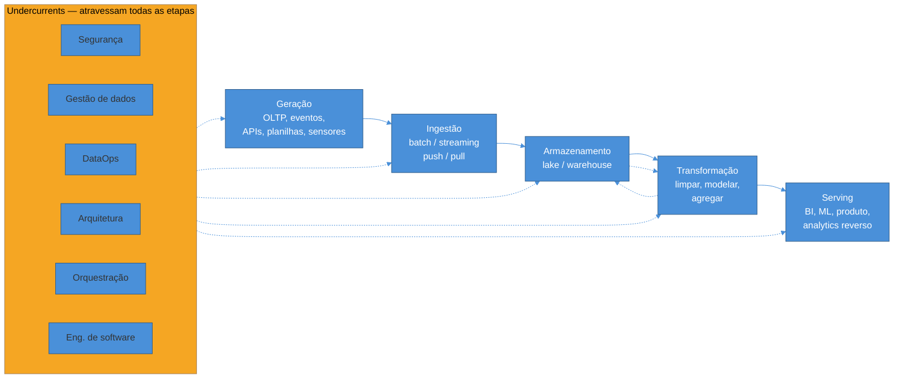

# O ciclo de vida da engenharia de dados

> [!abstract] TL;DR
> A nota anterior mostrou *por que* engenharia de dados existe: separar a carga transacional (OLTP) da carga analítica (OLAP). Esta nota mostra *como* o trabalho se organiza por dentro. Reis e Housley descrevem um **ciclo de vida** de cinco etapas — **geração, ingestão, armazenamento, transformação e serving** — que qualquer pipeline percorre, do dado bruto até a decisão de negócio. Mas o ciclo de vida sozinho não basta para entender o trabalho real: existem seis **correntes subterrâneas** (*undercurrents*) — segurança, gestão de dados, DataOps, arquitetura de dados, orquestração e engenharia de software — que não são etapas, e sim preocupações que atravessam *todas* as etapas ao mesmo tempo. Esta nota é o mapa da trilha inteira: cada etapa e cada undercurrent aponta para o sub-galho que a aprofunda adiante.

> [!question]- Perguntas que esta nota responde
> - Quais são as cinco etapas do ciclo de vida da engenharia de dados, e o que acontece em cada uma?
> - Por que armazenamento não é "só mais uma etapa", e sim algo que atravessa o ciclo inteiro?
> - O que são as "undercurrents" (correntes subterrâneas), e por que elas não aparecem como etapas do diagrama?
> - Como esse ciclo de vida organiza o resto da trilha — qual nota futura cobre qual etapa?

## O pedido que atravessa cinco etapas antes de virar um número

Retome o e-commerce da nota anterior. Um cliente clica em "finalizar compra", o pagamento é aprovado, e o pedido é gravado no Postgres de produção — uma linha na tabela `pedidos`, outra em `itens_pedido`, tudo dentro de uma transação ACID que garante que o estoque foi debitado corretamente. Esse momento — o pedido nascendo no banco transacional — é só o primeiro de cinco movimentos que o dado precisa fazer antes de virar a linha "faturamento por categoria" que a diretoria vê num dashboard, meses depois.

Vale a pena percorrer os cinco movimentos com esse mesmo pedido em mente, porque cada um deles é, na prática, um sub-galho inteiro desta trilha — e é fácil, quando alguém começa na área, confundir "aprender engenharia de dados" com "aprender uma ferramenta" (Airflow, dbt, Kafka), sem primeiro entender que cada ferramenta resolve uma etapa específica de um ciclo maior. Sem esse mapa, o aprendizado vira uma pilha de nomes soltos; com ele, cada ferramenta nova que você encontrar no mercado só precisa ser encaixada num lugar já conhecido.

**1. Geração.** O pedido nasce no Postgres de checkout — mas "geração" é mais amplo que isso. No mesmo e-commerce, um evento de clique é gerado pelo frontend a cada página vista; uma chamada à API de frete gera uma resposta de uma transportadora terceira; o time financeiro sobe uma planilha mensal de metas de venda; um sensor de estoque num centro de distribuição gera uma leitura de temperatura a cada minuto. Dado nasce em formatos, cadências e sistemas completamente diferentes, e a engenharia de dados normalmente não controla como ele nasce — ela recebe o que os sistemas de origem produzem, do jeito que produzem.

**2. Ingestão.** O pedido — e o evento de clique, e a resposta da API, e a planilha, e a leitura do sensor — precisam ser *trazidos para dentro* da plataforma de dados. É aqui que a primeira decisão de arquitetura aparece: o pedido é capturado em **lote** (uma extração noturna que pega todos os pedidos do dia) ou em **fluxo** (cada pedido pago dispara um evento que chega ao pipeline em segundos)? E a extração é **puxada** pelo pipeline (uma query que varre o Postgres periodicamente) ou **empurrada** pela origem (a aplicação publica o evento assim que o pagamento é confirmado, sem que o pipeline precise perguntar)?

**3. Armazenamento.** Em algum ponto — na verdade, em *vários* pontos — o dado precisa ficar parado em algum lugar. O pedido bruto, assim como chegou da ingestão, pode pousar num data lake; depois de limpo e modelado, uma versão dele vive numa tabela de fatos no data warehouse; um cache intermediário pode guardar um resultado parcial de um passo de transformação. Armazenamento não é uma parada única no meio do caminho — é uma preocupação que existe *antes* da ingestão terminar, *durante* a transformação, e *depois* do serving, o que é exatamente por que esta etapa recebe tratamento especial mais adiante nesta nota.

**4. Transformação.** O pedido bruto, do jeito que chegou do Postgres, ainda não responde "faturamento por categoria". Ele precisa ser limpo (descartar pedidos cancelados, tratar valores nulos), reestruturado num modelo pensado para leitura agregada (uma tabela de fatos de vendas ligada a dimensões de produto, categoria, tempo — o modelo dimensional que a nota 03 do sub-galho de modelagem aprofunda) e, muitas vezes, agregado (soma por categoria, por mês). É a etapa em que o dado bruto vira **dado útil** — e também a etapa mais próxima do que a nota anterior chamou de trabalho de analytics engineering.

**5. Serving.** Por fim, o dado transformado precisa chegar a quem vai usá-lo: o dashboard de BI que a diretoria abre toda segunda-feira, o modelo de machine learning que prevê churn, o próprio produto (uma recomendação de "quem comprou isso também comprou aquilo" exibida de volta no site), ou uma exportação para uma ferramenta de marketing — o que o mercado chama de **analytics reverso** (*reverse ETL*), porque o dado, depois de todo o caminho de ida, volta a alimentar um sistema operacional.

Cinco etapas, um pedido, uma jornada inteira até virar decisão. O diagrama abaixo resume o ciclo — e já adianta o ponto central desta nota: as cinco etapas não bastam para descrever o trabalho real.

Repare nas duas setas pontilhadas entre armazenamento e transformação, no sentido de ida e volta: não é acidente de desenho. Um pipeline raramente transforma o dado uma vez só e entrega; ele costuma ler do armazenamento, transformar um pedaço, gravar de volta, ler de novo para o próximo passo. É exatamente por isso que armazenamento aparece no meio do ciclo mas na prática "vaza" para as duas etapas vizinhas — ponto que a próxima seção desenvolve.

## Ingestão: a primeira bifurcação de arquitetura

Antes de seguir para armazenamento, vale demorar um instante na ingestão, porque é ali que a primeira decisão de arquitetura de verdade aparece — e ela se divide em dois eixos independentes, fáceis de confundir quando alguém está começando na área.

O primeiro eixo é **lote (batch) vs fluxo (streaming)**: o dado é capturado em blocos, periodicamente (a cada hora, a cada noite), ou é capturado evento a evento, quase no instante em que acontece? O segundo eixo é **push vs pull**: quem inicia a captura — a origem empurra o dado ativamente para o pipeline assim que ele existe, ou o pipeline pergunta periodicamente à origem "tem algo novo"? Os dois eixos são ortogonais: dá para ter ingestão em lote via pull (uma query noturna que varre o Postgres) ou em lote via push (a origem deposita um arquivo por hora num bucket); dá para ter streaming via pull (o pipeline consome continuamente uma fila) ou, mais raramente, via push direto (a aplicação chama uma API do pipeline a cada evento).

| | Pull (o pipeline pergunta) | Push (a origem empurra) |
|---|---|---|
| **Batch** | Query agendada que varre a tabela de pedidos a cada noite | Exportação periódica de arquivo para um bucket |
| **Streaming** | Pipeline consome continuamente de uma fila (Kafka, Kinesis) | Aplicação chama webhook/API do pipeline a cada evento |

No e-commerce do exemplo, a escolha mais comum na prática é uma combinação: **captura de mudanças** (*change data capture*, CDC) lendo o log de transação do Postgres — uma forma de pull contínuo e de baixo impacto, porque lê o log de replicação em vez de rodar query pesada na tabela — alimentando um fluxo quase em tempo real para eventos críticos (pagamento aprovado), e extração em lote, mais simples e barata, para dados que não precisam de frescor imediato (catálogo de produtos, atualizado poucas vezes ao dia).

> [!warning] Escolher streaming porque "é o jeito moderno de fazer"
> **O que acontece:** o time monta ingestão via CDC e streaming para toda fonte de dados, incluindo tabelas que mudam poucas vezes ao dia, porque streaming parece a escolha tecnicamente superior. **Por quê:** streaming resolve um problema — frescor — que a maioria dos relatórios de negócio não tem. Ele custa mais para operar (infraestrutura de fila, consumidores, tratamento de eventos fora de ordem) e não compra nada quando ninguém consome esse frescor extra. A mesma armadilha já apareceu na nota anterior, no contexto de banco de dados; aqui ela reaparece especificamente na escolha de ingestão. **Como evitar:** decida o eixo batch/streaming fonte por fonte, não para o pipeline inteiro de uma vez. Pagamento aprovado, talvez precise de streaming, se alimenta detecção de fraude. Catálogo de produto, quase certamente não precisa.

A escolha de ingestão — batch vs streaming, push vs pull, e as ferramentas que materializam cada combinação (Fivetran e Airbyte para batch gerenciado; Kafka e Kinesis para streaming) — ganha tratamento de profundidade no sub-galho 3 (Pipelines) desta trilha, ainda por escrever; mensageria e streaming *como mecanismo de comunicação entre sistemas* — filas, tópicos, garantias de entrega — já tem lar próprio na trilha [[03-Dominios/Engenharia/Comunicação entre Sistemas/index|Comunicação entre Sistemas]], e não é reaberto aqui.

## Armazenamento: a etapa que está em todo lugar

Das cinco etapas, armazenamento é a única que não tem uma posição fixa e exclusiva no fluxo. As outras quatro têm um ponto de entrada e um ponto de saída razoavelmente claros — geração acontece na origem, ingestão acontece na fronteira de entrada, transformação acontece depois de ingerir, serving acontece no fim. Armazenamento acontece **o tempo todo**, entre qualquer par de etapas vizinhas:

- O dado pode ser armazenado **assim que ingerido**, bruto, num data lake — antes de qualquer transformação, para preservar a fonte original caso algo dê errado adiante.
- Ele pode ser armazenado **de novo, transformado**, numa tabela intermediária, antes do próximo passo de agregação — comum em pipelines com várias etapas de transformação encadeadas.
- Ele pode ser armazenado **uma terceira vez**, já no formato final, na camada que o serving consulta — as tabelas de fatos e dimensões do warehouse, otimizadas para leitura agregada.

Cada uma dessas paradas tem um propósito diferente, um formato diferente e frequentemente um sistema diferente. É por isso que Reis e Housley tratam armazenamento como algo que "sustenta" as outras etapas, mais do que uma etapa isolada entre ingestão e transformação[^reis]. A decisão de *onde* e *como* armazenar cada versão do dado — lake vs warehouse, formato de arquivo colunar (Parquet, ORC) vs orientado a linha, particionamento por data ou por categoria — é aprofundada em [[03 - Warehouse, lake e lakehouse]] e [[04 - Armazenamento colunar e formatos]], os dois primeiros sub-galhos de armazenamento desta trilha.

> [!info] Onde cada etapa vira sub-galho da trilha
> O ciclo de vida desta nota é o esqueleto de tudo que vem a seguir. Ingestão, transformação e a orquestração que as costura formam o **sub-galho 3 (Pipelines)**; as decisões de armazenamento (warehouse, lake, lakehouse, formatos colunares) formam o **sub-galho 1**, nas notas [[03 - Warehouse, lake e lakehouse]] e [[04 - Armazenamento colunar e formatos]]; a modelagem de dados dentro da transformação (esquema dimensional, fatos e dimensões) forma o **sub-galho 2**; e as undercurrents de qualidade, governança e contratos de dados formam o **sub-galho 4**. Serving, cobrindo BI, ML e analytics reverso com mais profundidade, é tratado como parte final do sub-galho 3, já que depende diretamente do que a ingestão e a transformação entregam.

> [!question]- Por que não tratar armazenamento como "etapa 3 de 5" e seguir em frente?
> Porque isso esconde uma decisão de arquitetura importante: cada parada de armazenamento tem um trade-off próprio entre custo, velocidade de leitura e flexibilidade de esquema. Um data lake, schema-on-read, é barato e aceita qualquer formato — mas não é otimizado para responder "faturamento por categoria" rápido. Um data warehouse, schema-on-write e colunar, responde essa pergunta em segundos — mas custa mais por armazenar e exige que o dado já tenha passado por transformação. Tratar as duas paradas como "a mesma etapa" leva a escolher um sistema só para as duas necessidades, repetindo, em miniatura, o mesmo erro de misturar OLTP e OLAP que a nota anterior descreveu.

## Undercurrents: o que atravessa tudo e não é uma etapa

Se você desenhasse só as cinco etapas e parasse por aí, teria uma foto tecnicamente correta e perigosamente incompleta. Um pipeline pode ingerir, armazenar, transformar e servir dado com perfeição técnica — e ainda assim ser um fracasso, se ninguém sabe de onde um número veio, se um vazamento expõe dado de cliente, ou se uma categoria de produto some silenciosamente do relatório por três meses sem que ninguém perceba. Nenhum desses problemas mora *dentro* de uma etapa específica — eles atravessam todas elas ao mesmo tempo. Reis e Housley chamam essas preocupações de **undercurrents** (correntes subterrâneas): não são um passo do fluxo, são a água que corre por baixo de cada passo[^reis]. São seis:

**Segurança.** Quem pode ler o quê, em cada etapa. O dado bruto do pedido, ainda no lake, pode conter e-mail e endereço do cliente — informação sensível que precisa de controle de acesso desde a ingestão, não só no dashboard final. Um vazamento raramente acontece na etapa de serving, onde a atenção costuma estar concentrada; ele acontece na etapa "esquecida" — um bucket de lake mal configurado, uma credencial de pipeline com permissão ampla demais.

**Gestão de dados (data management / governança).** Saber o que cada tabela significa, quem é dono dela, de onde ela vem e se ela pode ser confiada. Um dashboard que mostra "faturamento" sem que ninguém saiba se aquele número já desconta devoluções é um problema de governança, não de tecnologia — a query pode estar tecnicamente correta e ainda assim responder a pergunta errada, porque ninguém documentou a definição do métrico.

**DataOps.** A aplicação de práticas de confiabilidade operacional — monitoramento, alertas, testes automatizados de qualidade, versionamento — ao trabalho de dados, por analogia direta com DevOps aplicado a software[^dataops]. Um pipeline sem DataOps pode falhar silenciosamente numa terça de madrugada e só ser percebido quando alguém, dias depois, nota que um número no dashboard "parece estranho".

**Arquitetura de dados.** As decisões estruturais de longo prazo: que sistemas compõem a plataforma, como eles se conectam, que padrões se repetem entre pipelines diferentes. É o nível acima de qualquer pipeline individual — decide, por exemplo, se a organização inteira usa um warehouse central ou vários data marts federados, escolha que ecoa a antiga disputa Inmon vs Kimball mencionada na nota anterior.

**Orquestração.** A coordenação de *quando* e *em que ordem* cada passo do pipeline roda — a transformação só pode começar depois que a ingestão termina; um relatório só deve rodar depois que a tabela de fatos foi atualizada. Ferramentas como Airflow existem precisamente para modelar essas dependências como um grafo e executá-las de forma confiável, com retry e alerta quando algo falha — sem, no entanto, virar tutorial de ferramenta aqui; a orquestração ganha tratamento próprio no sub-galho de pipelines.

**Engenharia de software.** No fundo, um pipeline de dados é software, e merece os mesmos cuidados: código versionado, testado, revisado; tratamento de erro; observabilidade. A tentação, especialmente em times pequenos, é tratar scripts de pipeline como algo mais informal que "código de verdade" — e é exatamente essa informalidade que produz os pipelines frágeis, sem teste, que quebram silenciosamente e cujo diagnóstico consome dias.

> [!warning] Tratar undercurrents como "etapa 6" no fim do pipeline
> **O que acontece:** o time constrói ingestão, armazenamento, transformação e serving, e só então "adiciona" segurança, monitoramento e documentação — como um passo final de polimento antes de lançar. **Por quê:** undercurrents não são algo que se aplica depois; são propriedades que cada etapa já deveria ter desde o desenho. Adicionar controle de acesso depois que o dado já está espalhado por três sistemas é ordens de magnitude mais caro do que desenhar o controle de acesso junto com a ingestão. O mesmo vale para qualidade de dados: validar o dado só no fim do pipeline significa que um erro na ingestão só é descoberto depois de já ter contaminado toda transformação seguinte. **Como evitar:** trate cada undercurrent como uma pergunta a fazer em *toda* etapa, não como uma fase separada: "quem pode ler este dado aqui?", "este passo está documentado e monitorado?", "esse código de transformação está testado?". O sub-galho 4 desta trilha, sobre qualidade, governança e contratos de dados, aprofunda como operacionalizar essas perguntas — mas o hábito de perguntá-las já começa aqui.

> [!question]- As undercurrents têm ordem de prioridade entre si?
> Não uma ordem fixa — a ênfase muda com o contexto. Um pipeline que lida com dado de saúde ou financeiro dá prioridade absoluta a segurança e governança, por exigência regulatória, mesmo que isso implique um pipeline mais lento. Um time pequeno em estágio inicial de produto pode aceitar menos rigor de DataOps (menos automação, mais operação manual) em troca de velocidade de entrega, sabendo que vai pagar esse débito conforme escala. O que não muda é que as seis correntes existem *sempre*, em algum grau — a decisão madura é sobre quanto investir em cada uma dado o contexto, não sobre ignorar alguma delas por completo.

## Percorrendo o pedido pelas seis undercurrents

Para fixar que undercurrents não são abstração, vale voltar ao mesmo pedido do e-commerce e nomear onde cada corrente aparece, silenciosamente, nas cinco etapas já percorridas:

| Etapa | O que undercurrent aparece, concretamente |
|---|---|
| Geração | *Segurança*: o Postgres já deveria restringir quem lê a coluna de e-mail do cliente, antes mesmo de qualquer dado sair dali. |
| Ingestão | *Orquestração*: a extração noturna só deve rodar depois que o processamento de fechamento de caixa do dia terminou, para não capturar um estado intermediário. *DataOps*: se a extração falhar, alguém precisa ser alertado antes que o dashboard mostre um número desatualizado sem aviso. |
| Armazenamento | *Governança*: alguém precisa documentar que a tabela de fatos de vendas exclui pedidos cancelados — senão dois analistas calculam "faturamento" de formas diferentes e chegam a números diferentes. |
| Transformação | *Engenharia de software*: o código SQL ou Python que limpa e agrega o pedido deveria ter teste automatizado, revisão de código e versionamento — os mesmos cuidados de qualquer software de produção. |
| Serving | *Arquitetura*: a decisão de se o dashboard lê direto do warehouse ou de uma camada de cache/BI intermediária é uma escolha estrutural que afeta todos os relatórios futuros, não só este. |

Nenhuma dessas seis aparições é uma etapa nova do fluxo — todas convivem dentro das cinco etapas já descritas. É exatamente essa convivência que o diagrama desta nota tentou capturar com a faixa das undercurrents por baixo do fluxo principal: elas não somam uma sexta caixa na linha; elas tingem as cinco que já existem.

## Serving: o mesmo dado, três exigências diferentes

Vale desdobrar a última etapa um pouco mais, porque "serving" esconde três destinos com requisitos bem distintos, e confundi-los leva a desenhar um único caminho de entrega quando três eram necessários.

**BI e dashboards** toleram alguma latência (o relatório de segunda-feira pode refletir o fechamento de domingo à noite) e valorizam sobretudo consistência do número — o mesmo "faturamento" precisa bater entre dois dashboards diferentes, ou a confiança da organização inteira no dado desmorona. **Modelos de machine learning**, ao contrário, muitas vezes têm exigência de latência mais dura na hora de *servir uma previsão* (uma recomendação precisa aparecer em milissegundos, na página do produto), mesmo que o *treinamento* do modelo em si tolere dado de horas ou dias atrás — uma distinção entre o pipeline de treino e o pipeline de inferência que fica mais para o território de ML engineering do que de engenharia de dados propriamente, e não é aprofundada nesta trilha. **Analytics reverso** exporta dado já modelado de volta para uma ferramenta operacional — por exemplo, uma lista de clientes com risco alto de cancelamento é sincronizada de volta para a ferramenta de CRM, onde o time de retenção já trabalha todo dia — e a exigência aqui é sobretudo de compatibilidade de formato com a ferramenta de destino, mais do que velocidade extrema.

| Destino | Tolerância a atraso | Exigência principal |
|---|---|---|
| BI / dashboard | Horas a um dia costuma ser aceitável | Consistência do número entre relatórios |
| Modelo de ML (inferência) | Frequentemente milissegundos a segundos | Latência de resposta, disponibilidade |
| Analytics reverso | Minutos a horas, geralmente | Compatibilidade de formato com a ferramenta de destino |

Essa tabela também explica por que "serving" não é uma etapa homogênea: o mesmo warehouse pode alimentar os três destinos ao mesmo tempo, mas cada um consome o dado através de uma camada de acesso diferente — uma API de baixa latência para o modelo de ML, uma conexão SQL direta ou uma camada semântica para o BI, e um conector de sincronização periódica para o analytics reverso.

## O ciclo não é uma linha reta

O diagrama desta nota desenha as cinco etapas em fila, da esquerda para a direita, e isso ajuda a fixar a sequência básica — mas é uma simplificação que vale desarmar antes de fechar o mapa. Na prática, o ciclo de vida tem pelo menos três formas de "voltar para trás" que o diagrama linear esconde:

**Serving alimenta geração.** Um modelo de machine learning treinado sobre dado do warehouse pode gerar uma recomendação de produto que é exibida de volta no site — e o clique do cliente nessa recomendação é, ele mesmo, um novo dado gerado, que entra de novo pela ingestão. O ciclo, olhado ao longo do tempo, é mais um laço do que uma linha: serving de uma rodada vira geração da próxima.

**Transformação frequentemente exige voltar à ingestão.** É comum, ao modelar uma tabela de fatos, descobrir que falta um campo — talvez a origem nunca capturou o canal de aquisição do cliente (orgânico, pago, indicação), e ninguém percebeu isso até tentar montar o relatório de marketing. A resposta não é contornar dentro da transformação; é voltar à ingestão e pedir que ela capture o campo que falta — o que geralmente significa também voltar à geração, pedindo ao time de produto que instrumente esse dado na origem.

**Armazenamento é revisitado repetidamente**, como a seção anterior já mostrou — bruto, intermediário, final — dentro do mesmo pipeline, sem que isso conte como "voltar" no sentido de retrabalho, mas como parte normal do fluxo de ida.

> [!question]- Se o ciclo tem laços, por que ensinar como uma sequência linear?
> Porque a sequência linear é o *caminho de ida* padrão de um pedaço de dado específico, e continua sendo a forma mais clara de organizar o aprendizado e o desenho de um pipeline novo. Os laços de retroalimentação são reais e importantes de reconhecer — principalmente o de serving realimentando geração, que é como sistemas de recomendação e personalização funcionam — mas eles acontecem *entre* execuções do ciclo, não dentro de uma única passagem do dado. Entender a linha reta primeiro, e depois reconhecer onde ela se dobra em laço, é mais fácil que tentar aprender as duas coisas ao mesmo tempo.

## Em entrevista

Uma pergunta comum em entrevista de nível sênior: "descreva o ciclo de vida de um pipeline de dados, do início ao fim". A resposta fraca lista as cinco etapas como se fossem uma receita linear e para por aí. A resposta forte nomeia as cinco etapas *e* imediatamente acrescenta que armazenamento não é um ponto único, e que existem preocupações — segurança, governança, DataOps — que precisam estar presentes desde o primeiro dia de desenho, não como polimento de fim de projeto. É esse segundo movimento que separa quem estudou o livro de quem já foi cobrado, numa reunião de incidente, a explicar por que um número saiu errado três semanas atrás e ninguém percebeu.

Uma pergunta de sistema frequente: "como você desenharia a arquitetura de dados para um pedido de e-commerce, do checkout até o dashboard de BI?" A resposta madura percorre as cinco etapas nomeando a decisão em cada uma — captura via CDC ou extração agendada na ingestão, lake para dado bruto e warehouse dimensional para dado modelado no armazenamento, agregação por categoria e tempo na transformação, dashboard consumindo do warehouse no serving — e fecha nomeando pelo menos uma undercurrent relevante ao cenário, por exemplo segurança sobre dado pessoal do cliente ou monitoramento do pipeline de ingestão.

Uma pergunta mais avançada, de arquitetura: "o que você prioriza primeiro ao montar uma plataforma de dados nova — o pipeline ou a governança?" Não há resposta de "certo e errado" isolada, mas a resposta que soa sênior reconhece o trade-off: não dá para esperar o pipeline "estar pronto" para só então pensar em segurança e qualidade, porque nesse ponto o custo de retrofitar já subiu; e também não dá para travar a entrega do primeiro pipeline esperando um programa de governança perfeito e completo. O caminho maduro é incremental — desenhar controles mínimos de segurança e um mínimo de observabilidade desde o primeiro pipeline, e amadurecer governança e DataOps conforme a plataforma cresce.

## How to explain in English

> "The data engineering lifecycle has five stages: generation, ingestion, storage, transformation, and serving. Data is born in operational systems, gets brought into the data platform (batch or streaming), lands in storage — often more than once, in raw and modeled forms — gets cleaned and modeled during transformation, and finally reaches consumers through BI dashboards, ML models, or reverse ETL back into operational tools. Running underneath all five stages are the undercurrents: security, data management, DataOps, data architecture, orchestration, and software engineering. They're not a sixth stage — they're cross-cutting concerns that need to be designed into every stage from day one, not bolted on at the end."

| PT | EN |
|----|----|
| Ciclo de vida da engenharia de dados | Data engineering lifecycle |
| Geração | Generation |
| Ingestão | Ingestion |
| Armazenamento | Storage |
| Transformação | Transformation |
| Serving | Serving |
| Analytics reverso | Reverse ETL |
| Correntes subterrâneas | Undercurrents |
| Gestão de dados / governança | Data management / governance |
| Contrato de dados | Data contract |
| Orquestração | Orchestration |
| Processamento em lote | Batch processing |
| Processamento em fluxo | Stream processing |

## O que vem a seguir

Com o mapa do ciclo de vida estabelecido — as cinco etapas e as seis undercurrents que as atravessam —, o próximo passo natural é entrar na primeira etapa que merece tratamento próprio: onde o dado *fica*. Armazenamento aparece em quase todo ponto do ciclo, e a escolha entre data warehouse, data lake e a combinação dos dois (lakehouse) molda praticamente toda decisão de arquitetura adiante.

- [[03 - Warehouse, lake e lakehouse]] — as três arquiteturas de armazenamento analítico, seus trade-offs de custo, estrutura e velocidade de consulta, e quando cada uma faz sentido

## Fontes

- Reis, Joe & Housley, Matt — *Fundamentals of Data Engineering: Plan and Build Robust Data Systems*, O'Reilly, 2022 — fonte canônica do ciclo de vida (geração, ingestão, armazenamento, transformação, serving) e das seis undercurrents (segurança, gestão de dados, DataOps, arquitetura de dados, orquestração, engenharia de software).
- Kimball, Ralph & Ross, Margy — *The Data Warehouse Toolkit: The Definitive Guide to Dimensional Modeling*, 3ª edição, Wiley, 2013 — referência de modelagem dimensional citada como destino da etapa de transformação.
- DataKitchen — [*What is DataOps?*](https://datakitchen.io/what-is-dataops/) — origem e definição do termo DataOps como aplicação de práticas DevOps ao trabalho de dados.

[^reis]: Reis & Housley, *Fundamentals of Data Engineering*, O'Reilly, 2022, capítulos 2 e 3 (o ciclo de vida e as undercurrents). [^dataops]: DataKitchen, *What is DataOps?*; Reis & Housley, *Fundamentals of Data Engineering*, capítulo 3.
