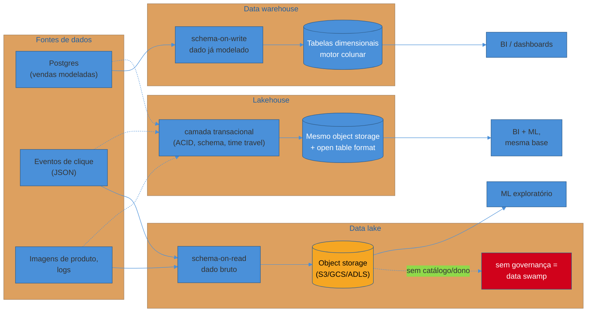

# Warehouse, lake e lakehouse

> [!abstract] TL;DR
> Depois que os dados saem do OLTP, eles precisam morar em algum lugar pensado para leitura agregada — mas "esse lugar" não é uma escolha única. **Data warehouse** guarda dado estruturado e modelado, com esquema aplicado na escrita (*schema-on-write*): rápido de consultar, caro por gigabyte, bem governado. **Data lake** guarda qualquer dado, bruto, barato, com esquema aplicado só na leitura (*schema-on-read*): flexível, mas sem disciplina vira um **data swamp** — um depósito de arquivos que ninguém consegue confiar. **Lakehouse** é a tentativa de ter os dois ao mesmo tempo: armazenamento barato de object storage por baixo, com uma camada transacional em cima (ACID, schema, *time travel*) que devolve as garantias de warehouse sem abrir mão do custo do lake. Nenhum dos três é "o certo" — cada um responde a uma combinação diferente de custo, maturidade de time e exigência de governança, e a decisão sênior é escolher com esses três eixos em mente, não por modismo de ferramenta.

> [!question]- Perguntas que esta nota responde
> - Qual a diferença real entre *schema-on-write* e *schema-on-read* — e por que essa é a linha que separa warehouse de lake?
> - O que é, na prática, um "data swamp" — e por que um data lake vira um sem governança?
> - O que o lakehouse resolve que nem warehouse nem lake resolviam sozinhos?
> - Por que "separar storage de compute" foi a virada que tornou o data warehouse na nuvem viável para times pequenos?
> - Como decidir, num caso concreto, entre as três arquiteturas — sem cair em "lakehouse é sempre melhor"?

## O armazém que a diretoria pediu, e o pântano que ninguém queria

Retomando o e-commerce da nota anterior desta trilha: depois de extrair os dados de vendas do Postgres de produção — um banco OLTP relacional, cuja teoria (modelo relacional, normalização, ACID) mora inteira em [[03-Dominios/Ciência/Banco de Dados/index|Banco de Dados]] e não é reexplicada aqui —, alguém precisa decidir **onde** esse dado vai morar antes de virar relatório. A resposta óbvia, para quem vem de um mundo relacional, é "num banco, só que maior" — um data warehouse, com tabelas de fatos e dimensões, schema bem definido, e uma query SQL de agregação rodando rápido porque o motor por baixo é colunar (o tema da próxima nota desta trilha).

Só que o time também recebe, ao mesmo tempo, outras demandas: os eventos de clique no site (semiestruturados, em JSON, chegando aos milhões por dia), os logs de aplicação (texto livre, sem schema algum), as imagens dos produtos que o time de ML quer usar para treinar um classificador de categoria automático, e uma planilha que o time financeiro insiste em subir toda sexta-feira. Nada disso cabe confortavelmente numa tabela de warehouse — não porque o warehouse seja ruim, mas porque ele foi desenhado para outra coisa: dado **já modelado**, com schema **já decidido antes de qualquer linha ser escrita**.

A resposta da indústria para esse segundo problema foi o **data lake**: um armazenamento barato que aceita qualquer formato, sem exigir que ninguém decida o schema antes de gravar. E aqui mora a primeira armadilha desta nota — porque um data lake sem governança não vira um repositório rico de possibilidades. Vira um **data swamp**: um amontoado de arquivos que ninguém sabe o que contém, sem dono, sem contrato, sem catálogo — onde encontrar um dado específico exige abrir arquivo por arquivo, torcendo para que o nome da pasta ainda signifique alguma coisa.

Entender por que warehouse, lake e lakehouse existem — e não são intercambiáveis — é o que esta nota cobre.

## Schema-on-write vs schema-on-read: o eixo que separa os dois mundos

Antes de nomear qualquer arquitetura, vale isolar a decisão de design que está por trás de todas elas — porque ela é o eixo que efetivamente separa warehouse de lake, mais do que qualquer detalhe de ferramenta.

**Schema-on-write** significa que o esquema — nomes de coluna, tipos, restrições — é definido **antes** de qualquer dado ser gravado, e todo dado que entra precisa se conformar a ele. É como preencher um formulário impresso: os campos já existem, e você só pode escrever dentro deles. Um data warehouse tradicional funciona assim: a tabela `fato_vendas` tem colunas fixas, e uma linha que não se encaixa nesse formato — um campo faltando, um tipo errado — é rejeitada ou precisa de transformação antes de entrar.

**Schema-on-read** significa que o dado é gravado **como está**, sem forçar estrutura nenhuma, e o esquema só é aplicado no momento em que alguém lê e interpreta esse dado. É como jogar recibos soltos numa caixa e só organizá-los quando alguém precisa fazer a declaração de imposto de renda — a organização acontece na hora do uso, não na hora de guardar. Um data lake funciona assim por padrão: você pode gravar um JSON de evento de clique, um CSV de vendas e um arquivo de log de texto puro lado a lado, e cada consumidor decide, na hora de ler, como interpretar aquele arquivo.

> [!question]- Schema-on-read não é simplesmente "não ter schema"?
> Não — e essa confusão é a raiz de muitos data swamps. Schema-on-read não elimina a necessidade de schema; ela **adia** quem aplica o schema e quando. Alguém, em algum momento, ainda precisa saber que aquele arquivo JSON tem um campo `timestamp` no formato ISO 8601 e um campo `produto_id` que é inteiro — só que essa responsabilidade passou do momento da escrita para o momento da leitura, e do time que grava para o time que consome. Se ninguém documenta essa estrutura implícita em lugar nenhum, o dado não ficou "sem schema" — ficou com um schema que existe só na cabeça de quem o escreveu, e que se perde assim que essa pessoa sai do time. É exatamente esse vácuo de responsabilidade que transforma um lake bem-intencionado em um pântano.

A tabela resume a troca:

| Eixo | Schema-on-write (warehouse) | Schema-on-read (lake) |
|---|---|---|
| Quando o schema é decidido | Antes da escrita | No momento da leitura |
| Custo de ingestão | Mais alto (validar, transformar antes de gravar) | Mais baixo (grava como está) |
| Custo de consulta | Mais baixo (dado já limpo e tipado) | Mais alto (cada leitura reinterpreta o dado) |
| Flexibilidade para dado novo | Baixa (mudar schema é uma migração) | Alta (grava qualquer formato sem mudar nada) |
| Risco principal | Rigidez — dado que não se encaixa é rejeitado ou distorcido | Perda de confiabilidade — sem disciplina, ninguém sabe o que tem lá dentro |

Em uma frase: **schema-on-write paga o custo de organizar na entrada para economizar na saída; schema-on-read faz o oposto — e cada escolha empurra o custo para quem sofre menos com ele, dependendo de quantas vezes o dado será lido versus escrito.**

## Data warehouse: dado modelado, consulta rápida, governança forte

Um **data warehouse** é um sistema de armazenamento e processamento desenhado especificamente para cargas OLAP: dado estruturado, já limpo e modelado — tipicamente em esquema dimensional, fatos e dimensões, o tema do próximo sub-galho desta trilha —, otimizado para leitura agregada em escala através de um motor de armazenamento colunar (o assunto da próxima nota).

O warehouse aplica schema-on-write com rigor: uma linha só entra na tabela `fato_vendas` se tiver os campos certos, nos tipos certos. Esse rigor tem um preço em flexibilidade — adicionar uma coluna nova é uma migração, não um "gravar e seguir em frente" — mas compra de volta previsibilidade, governança e velocidade de consulta. Quem escreve uma query contra um warehouse bem modelado sabe exatamente o que vai encontrar: nomes de coluna estáveis, tipos consistentes, sem surpresa de formato.

**Um pouco de história, porque ela explica por que o warehouse é caro do jeito que é.** Bill Inmon, nos anos 1990, definiu data warehouse como "uma coleção de dados orientada por assunto, integrada, variável no tempo e não volátil, projetada para apoiar decisões gerenciais"[^inmon] — uma definição que já embutia a ideia de dado **integrado e limpo antes de chegar lá**, ao contrário do dado bruto que um sistema operacional produz. Kimball, contemporâneo de Inmon, discordava de *como* chegar lá (bottom-up, por data marts dimensionais, em vez do modelo corporativo único top-down de Inmon)[^kimball] — mas os dois construíam sobre a mesma premissa: um warehouse é dado **já trabalhado**, não dado bruto.

Durante décadas, isso significou hardware dedicado e caro — um cluster de banco colunar on-premise, dimensionado para o pico de uso, ligado o tempo todo, custando dinheiro mesmo nas horas em que ninguém consultava nada. A virada aconteceu com os warehouses gerenciados na nuvem: o Amazon Redshift, lançado em 2012, foi um dos primeiros a popularizar em escala a ideia de separar **armazenamento** de **computação** — você paga pelo espaço que ocupa e, separadamente, pelo poder de processamento que usa quando roda uma query, podendo escalar um sem mexer no outro. Google BigQuery levou essa ideia ainda mais longe, com um modelo *serverless* onde você nem gerencia cluster — só paga pela consulta. Snowflake, fundado especificamente em torno dessa separação como diferencial arquitetural, consolidou o padrão que hoje é esperado de qualquer warehouse moderno na nuvem.

> [!question]- Por que separar storage de compute foi tão importante assim?
> Porque, antes disso, warehouse era dimensionado para o **pico** — você comprava (ou alugava) capacidade de processamento suficiente para o dia de maior carga do ano, e essa capacidade ficava ociosa o resto do tempo, cobrando o mesmo preço. Separar as duas camadas significa três coisas concretas: (1) você pode ter petabytes armazenados custando centavos por GB, sem pagar por processamento nenhum enquanto ninguém consulta nada; (2) quando uma consulta pesada chega, o sistema aloca poder de processamento só para aquele momento, e libera depois — pagando por segundo ou por consulta, não por cluster ligado; (3) múltiplos times podem escalar leitura de forma independente — o time de BI rodando dashboards não compete por recursos com o pipeline de transformação noturno, porque cada um pode ter sua própria fatia de compute apontando para o mesmo dado armazenado. É essa elasticidade — pagar pelo que usa, escalar leitura sem duplicar ou mover o dado — que baixou a barreira de entrada para times pequenos fazerem analytics em escala, sem precisar de uma equipe de infraestrutura só para manter um cluster no ar.

Voltando ao e-commerce: os dados de **vendas já modelados** — a tabela de fatos com quantidade, preço, categoria, data — são o exemplo canônico do que vai para o warehouse. É dado que o negócio já sabe como quer consultar, com schema estável, alimentando dashboards e relatórios que a diretoria olha todo dia.

> [!warning] Jogar todo dado bruto dentro do warehouse "para não perder nada"
> **O que acontece:** o time, sem um data lake disponível, começa a carregar dado bruto e não estruturado — logs inteiros, payloads de evento, exports de planilha sem tratamento — direto nas tabelas do warehouse, "só para garantir que fica guardado em algum lugar". **Por quê:** um warehouse cobra por armazenamento estruturado e otimizado para consulta — que é caro por design, porque parte desse custo paga justamente a estrutura e a velocidade de leitura que schema-on-write compra. Dado bruto que ninguém consulta com frequência, guardado nesse formato caro, é dinheiro pago por uma propriedade (consulta rápida) que esse dado específico nunca vai usar. Em times que crescem rápido, essa prática infla a fatura do warehouse em ordens de magnitude sem qualquer ganho de valor. **Como evitar:** dado que ainda não tem schema definido, ou que é consultado raramente, vai para armazenamento barato (lake ou o próprio object storage por trás de um lakehouse) — não para dentro das tabelas do warehouse. O warehouse é para dado que **já** ganhou a estrutura que justifica seu custo.

## Data lake: dado bruto, barato, guarda tudo — até virar pântano

Um **data lake** é o oposto deliberado: armazenamento barato, schema-on-read, que aceita qualquer formato — estruturado (CSV, tabelas exportadas), semiestruturado (JSON, XML, logs de evento) ou não estruturado (imagens, áudio, texto livre) — sem exigir que ninguém decida antecipadamente como esse dado será usado.

**A origem também é histórica e concreta.** No fim dos anos 2000, o volume de dado que empresas como Yahoo e depois o restante da indústria precisavam processar excedeu o que um warehouse relacional tradicional aguentava com um custo razoável. A resposta foi o ecossistema **Hadoop**: o HDFS (*Hadoop Distributed File System*) como camada de armazenamento distribuído barato, rodando em clusters de máquinas commodity, e o MapReduce (depois substituído em boa parte por Spark, mais ergonômico) como motor de processamento por cima. O termo "data lake" foi cunhado nesse contexto para descrever esse repositório de dado bruto, em contraste deliberado com o data warehouse — a metáfora era literal: um lago recebe água de qualquer rio, sem tratamento prévio, enquanto uma garrafa engarrafada (o warehouse) já passou por um processo de purificação antes de chegar à prateleira.

O Hadoop on-premise deu lugar, na década seguinte, ao **object storage na nuvem** — Amazon S3, Google Cloud Storage, Azure Data Lake Storage (ADLS) — que oferece a mesma proposta (armazenamento barato, schema-on-read, qualquer formato) sem exigir que ninguém opere um cluster HDFS. Hoje, quando alguém fala "data lake", na prática está quase sempre falando de um bucket de object storage guardando arquivos em formatos como Parquet, JSON ou CSV — o detalhe de qual formato de arquivo e qual camada por cima organiza esses arquivos é o assunto da próxima nota desta trilha.

O que o data lake compra, comparado ao warehouse: custo por gigabyte ordens de magnitude menor, e a liberdade de guardar dado **antes** de saber exatamente como ele será usado — importante quando o time de ML quer experimentar com dado bruto que ainda não tem um caso de uso definido, ou quando a empresa quer reter histórico completo de eventos "só por garantia", sem pagar o preço de modelá-lo todo antecipadamente.

### O anti-padrão: quando o lake vira pântano

> [!warning] Data swamp — o lake sem governança
> **O que acontece:** o time grava dado bruto no lake ano após ano — eventos, exports, logs, experimentos de ML — sem catalogar o que cada pasta contém, sem dono definido, sem contrato de schema, sem processo de expurgo do que já não serve. Em algum momento, encontrar um dado específico exige abrir arquivo por arquivo, adivinhando pelo nome da pasta ou pela data de modificação. **Por quê:** schema-on-read transfere a responsabilidade de entender a estrutura do dado para quem lê — mas se ninguém documenta essa estrutura em nenhum lugar central (um catálogo de dados, um contrato, um dicionário mínimo), essa responsabilidade simplesmente **desaparece**. O lake continua tecnicamente funcionando — os arquivos estão lá, acessíveis — mas ninguém mais confia neles o suficiente para usar em decisão de negócio, porque ninguém sabe se aquele JSON de 2024 ainda reflete o schema atual, se está duplicado em outro lugar, ou se já foi substituído por uma versão mais nova sob outro nome de pasta. **Como evitar:** todo dado que entra no lake precisa de um mínimo de metadado — dono, schema esperado (mesmo que aplicado só na leitura), data de ingestão, propósito. Um catálogo de dados (ferramenta ou processo) que indexa o que existe no lake é a diferença entre "reservatório organizado" e "pântano". Esse tema — contratos e governança de dados — ganha nota própria mais adiante na trilha; aqui o ponto é reconhecer o sintoma antes de cair nele.

O e-commerce, de novo: os **eventos de clique** brutos, as **imagens de produto**, os **logs de aplicação** são o exemplo canônico do que vai para o lake — dado que ninguém quer perder, mas que também ninguém sabe ainda, com certeza, exatamente como vai modelar. Guardá-los brutos, baratos, é a decisão certa — desde que alguém assuma a governança mínima que evita o pântano.

> [!question]- Um data lake substitui a necessidade de um data warehouse?
> Raramente sozinho. Um data lake resolve o problema de reter dado bruto e barato, mas a maioria das perguntas de negócio recorrentes — os dashboards que a diretoria olha toda semana — se beneficia de um schema estável e de um motor de consulta otimizado para agregação, que é justamente o que o warehouse entrega. Na prática, a maior parte das organizações que operam um data lake também mantém algum sistema de consulta rápida por cima dele (seja um warehouse separado, seja a camada tabular de um lakehouse) — o lake sozinho tende a ser bom em reter, e mediano em servir consulta recorrente com a agilidade que o negócio pede.

## Lakehouse: as garantias do warehouse, sobre o custo do lake

Por anos, a resposta padrão foi operar os dois sistemas em paralelo: um data lake para dado bruto e barato, um data warehouse separado para dado modelado e consultável rápido — com um pipeline de ETL constantemente copiando e transformando dado de um para o outro. Essa duplicação tem custo real: o mesmo dado vive duas vezes, em dois sistemas, com dois processos de sincronização que podem divergir, e dobrando a superfície de governança.

O **lakehouse** é a tentativa de eliminar essa duplicação: manter o dado **uma vez só**, em object storage barato (a mesma base do lake), mas adicionar uma **camada transacional e tabular** por cima que devolve as garantias que antes só o warehouse tinha — transações **ACID**, aplicação de schema (com evolução controlada), e **time travel** (consultar o estado da tabela como ela era em um ponto no passado, útil tanto para auditoria quanto para recuperação de erro).

O mecanismo que viabiliza isso é uma camada de metadado — chamada de **open table format** — que se posiciona entre os arquivos brutos (tipicamente Parquet) e quem consulta, registrando quais arquivos compõem a versão atual da tabela, qual schema ela tem, e o histórico de versões anteriores. É essa camada que transforma "uma pasta cheia de arquivos Parquet" em algo que se comporta, para quem consulta, como uma tabela de banco de dados de verdade — com `INSERT`, `UPDATE`, `DELETE` e consistência transacional, mesmo o dado morando fisicamente em object storage comum.

> [!info] Fora de escopo aqui — nota 04 cobre o mecanismo
> Os nomes que fazem essa camada existir — **Apache Iceberg**, **Delta Lake**, **Apache Hudi** — e o detalhe técnico de como cada um implementa ACID e time travel sobre arquivos Parquet ficam para [[04 - Armazenamento colunar e formatos]]. Aqui a ideia a fixar é conceitual: o lakehouse é o **padrão arquitetural** (object storage + camada transacional); o open table format é a **peça técnica** que faz esse padrão funcionar. Você pode entender e defender a decisão de arquitetura sem ainda saber a diferença entre Iceberg e Delta.

> [!info] Caducidade — estado do ecossistema em 2026-07
> Em meados de 2026, o mercado converge fortemente em torno do Apache Iceberg como formato de tabela aberto dominante — lido e escrito nativamente por Snowflake, Databricks, AWS, Google Cloud e Microsoft — enquanto o Delta Lake mantém a maior base instalada isolada, puxada pelo ecossistema Databricks[^lakehouseguide]. A "guerra de formatos" que dominou 2023-2024 é considerada, por boa parte da indústria, uma questão essencialmente resolvida a favor da interoperabilidade via Iceberg, com camadas de tradução entre formatos (UniForm, XTable) suavizando o que resta de fragmentação. Esse estado é dinâmico — revisar ao enriquecer esta nota ou a nota 04.

Voltando ao e-commerce pela última vez: um lakehouse permitiria que a **mesma** tabela de fatos de vendas — os mesmos arquivos Parquet em object storage — servisse tanto o dashboard de BI que precisa de consulta rápida e schema estável (o caso de uso clássico de warehouse) quanto um notebook de data science explorando o dado bruto com Spark, sem que ninguém precisasse copiar o dado de um sistema para o outro. É essa unificação — um único armazenamento, múltiplos motores de consulta por cima — que motiva a adoção do padrão, quando o volume e a diversidade de consumidores justificam a complexidade extra de operar essa camada transacional.

> [!question]- O lakehouse elimina a necessidade de governança, já que o schema é aplicado?
> Não — ele reduz um tipo de risco (schema quebrado, dado corrompido por escrita concorrente) mas não substitui um catálogo nem donos de dado definidos. Um lakehouse mal catalogado ainda pode acumular centenas de tabelas que ninguém documentou, cada uma com ACID e schema garantidos individualmente, mas sem ninguém sabendo qual delas é a fonte confiável de "faturamento por categoria". A camada transacional resolve o problema técnico de integridade; a governança — quem é dono, o que cada tabela significa, quem pode ler o quê — continua sendo um problema organizacional que nenhuma tecnologia resolve sozinha. É o mesmo aviso do data swamp, só que aplicado uma camada acima.

Em linha do tempo resumida, os três paradigmas não se substituem — eles se acumulam, cada um resolvendo o gargalo que o anterior não cobria:

- **Anos 1990** — Inmon e Kimball formalizam o data warehouse: dado integrado, modelado, schema-on-write, para suportar decisão gerencial.
- **Fim dos anos 2000** — o volume de dado excede o que warehouses relacionais tradicionais processam a custo razoável; o ecossistema Hadoop (HDFS + MapReduce, depois Spark) populariza o data lake como repositório barato de dado bruto, schema-on-read.
- **A partir de 2012** — warehouses gerenciados na nuvem (Redshift, depois BigQuery e Snowflake) separam armazenamento de computação, tornando analytics em escala acessível para times sem equipe de infraestrutura dedicada.
- **Meados dos anos 2010 em diante** — Hadoop on-premise dá lugar a object storage na nuvem (S3, GCS, ADLS) como base física do data lake moderno.
- **A partir de ~2019–2020** — surgem os open table formats (Delta Lake, depois Apache Iceberg e Apache Hudi), trazendo ACID e schema para cima de object storage — a peça técnica que formaliza o padrão **lakehouse**.
- **Anos 2020 em diante** — o lakehouse amadurece de proposta para arquitetura de produção; em 2026, o mercado converge fortemente em torno do Iceberg como formato de tabela dominante, com Delta mantendo a maior base instalada isolada.

## Quando cada um: o quadro comparativo

Nenhuma das três arquiteturas é estritamente superior — cada uma otimiza para uma combinação diferente de custo, estrutura e maturidade organizacional. O diagrama abaixo contrasta o caminho que o mesmo conjunto de fontes de dados percorre em cada uma:

Repare no vermelho: o data swamp não é uma quarta arquitetura — é o **destino padrão** de um data lake quando ninguém assume a governança que a caixa laranja do diagrama (object storage sem catálogo nem dono) exige. É esse risco, mais do que qualquer limitação técnica, que empurra times maduros em direção ao lakehouse ou a um lake fortemente governado.

| Dimensão | Data warehouse | Data lake | Lakehouse |
|---|---|---|---|
| Schema | On-write (definido antes de gravar) | On-read (aplicado na leitura) | Híbrido — on-write com evolução controlada, via camada transacional |
| Custo por GB | Alto | Baixo | Baixo (mesma base do lake) |
| Velocidade de consulta agregada | Alta (motor colunar dedicado) | Variável — depende do motor de consulta usado por cima | Alta, quando bem otimizado (mesmas técnicas do warehouse aplicadas sobre object storage) |
| Tipos de dado suportados | Estruturado | Estruturado, semiestruturado, não estruturado | Estruturado, semiestruturado, não estruturado |
| Garantias transacionais (ACID) | Nativas | Ausentes, por padrão | Nativas, via open table format |
| Governança "de fábrica" | Forte (schema força disciplina) | Fraca — exige processo e ferramenta à parte | Forte (schema + histórico de versões + catálogo) |
| Risco principal | Custo e rigidez para dado não estruturado | Virar data swamp sem disciplina | Complexidade operacional extra da camada transacional |
| Maturidade de time exigida | Média — SQL e modelagem dimensional bastam | Baixa para gravar, alta para manter governado | Alta — exige entender tanto object storage quanto a camada tabular |
| Caso de uso típico | Relatórios de BI, dashboards executivos, dado já bem entendido | Retenção de dado bruto, ML exploratório, dado cujo uso ainda não está definido | Organizações que precisam servir os dois casos de uso a partir da mesma base, em escala |

O ponto sênior aqui não é "qual arquitetura é melhor" — é reconhecer que a pergunta certa é **qual carga de trabalho, qual orçamento e qual maturidade de time** a organização tem hoje. Um time pequeno, com um punhado de fontes de dados bem conhecidas e a maior parte das perguntas sendo "relatório de BI", provavelmente está mais bem servido por um warehouse gerenciado na nuvem puro e simples — a complexidade extra de operar um lakehouse não se paga se ninguém precisa da flexibilidade de schema-on-read. Uma organização maior, com dado de ML, eventos de alto volume e múltiplos times de consumo com necessidades diferentes, tende a justificar o investimento em lakehouse — mas só se tiver a maturidade de engenharia para operar a camada transacional e o catálogo que a acompanha, sem os quais o lakehouse vira, na prática, um data swamp com um nome mais bonito.

> [!warning] Adotar lakehouse porque é a arquitetura "mais moderna"
> **O que acontece:** o time migra de um warehouse gerenciado, que já funcionava bem, para uma arquitetura de lakehouse — motivado por artigos e conferências, não por uma dor concreta que o warehouse atual não resolvia. **Por quê:** o lakehouse resolve um problema específico — evitar duplicar dado entre lake e warehouse separados, e servir múltiplos motores de consulta sobre a mesma base. Se a organização nunca teve esse problema (porque nunca operou um lake separado, ou porque um único motor de consulta já atende todo mundo), a migração só importa a complexidade operacional de gerenciar a camada transacional (compactação de arquivos, manutenção de catálogo, tuning de performance) sem eliminar duplicação nenhuma, porque não havia duplicação para eliminar. **Como evitar:** nomeie a dor concreta antes de escolher a arquitetura. "Estamos copiando o mesmo dado duas vezes, entre sistemas diferentes, e isso já causou divergência real" é uma dor que justifica lakehouse. "Vimos numa conferência que é o futuro" não é.

### O e-commerce em três estágios de maturidade

Vale ancorar o quadro comparativo numa progressão concreta, porque a resposta certa muda junto com a organização — não é uma escolha que se faz uma vez e nunca se revisita.

**Estágio 1 — e-commerce pequeno, um time de dados de duas pessoas.** As perguntas de negócio são poucas e conhecidas: faturamento por categoria, taxa de conversão, ticket médio. Não existe volume de dado não estruturado relevante, e o time não tem capacidade de operar infraestrutura extra. Um **warehouse gerenciado na nuvem**, sozinho, atende tudo — schema-on-write força disciplina cedo, e a separação storage/compute mantém o custo baixo enquanto o volume ainda é pequeno.

**Estágio 2 — e-commerce em crescimento, time de dados de meia dúzia de pessoas, chegada de ML.** Times de recomendação e de detecção de fraude começam a pedir dado bruto — cliques, sessões, imagens de produto — que ainda não tem schema definido, e cuja utilidade para um modelo de ML só vai ficar clara depois de meses de experimentação. Forçar esse dado dentro do warehouse, modelado, seria prematuro: ninguém sabe ainda que forma o schema deveria ter. Um **data lake**, operando ao lado do warehouse, com um mínimo de governança (dono por domínio de dado, catálogo básico) resolve — desde que alguém assuma essa governança desde o primeiro arquivo gravado, não depois que o pântano já se formou.

**Estágio 3 — e-commerce maduro, múltiplos times de consumo, dado em petabytes.** BI, ciência de dados e um pipeline de treinamento de modelo de recomendação em produção todos precisam consultar essencialmente a mesma base de eventos e vendas, cada um com uma ferramenta diferente por cima. Manter lake e warehouse como sistemas separados agora significa duplicar terabytes de dado e operar dois processos de sincronização que já divergiram publicamente pelo menos uma vez. É neste estágio — não antes — que o investimento em **lakehouse** se paga: consolidar a base física, ganhar as garantias transacionais que faltavam no lake, e servir todos os consumidores a partir do mesmo lugar.

> [!question]- Dá pra migrar de warehouse direto para lakehouse, pulando o data lake?
> Sim, e é um caminho comum em organizações que nunca chegaram a operar um data lake separado — especialmente quando o motivo da migração é técnico (querer suportar dado semiestruturado ou não estruturado que o warehouse não modela bem) em vez de ser motivado por duplicação entre sistemas. Nesse caso, o lakehouse é adotado desde o início como "warehouse com mais flexibilidade de tipo de dado", não como consolidação de dois sistemas preexistentes. O risco a evitar é o mesmo do estágio 2: adotar a flexibilidade de schema-on-read sem, ao mesmo tempo, adotar a disciplina de governança que evita o data swamp — a camada transacional do lakehouse ajuda (schema aplicado, histórico de versões), mas não substitui um catálogo e donos de dado definidos.

## Em entrevista

Uma pergunta comum de arquitetura sênior: "quando você recomendaria um data lake em vez de um data warehouse?" A resposta fraca lista características genéricas ("lake é mais barato e flexível"). A resposta forte amarra a recomendação ao eixo schema-on-write vs schema-on-read e ao tipo de consumidor: "se o dado ainda não tem um caso de uso bem definido — eventos brutos, dado não estruturado para ML exploratório — vale pagar o custo de schema-on-read e reter tudo barato num lake. Se o dado já vai virar dashboard de BI com schema estável, faz mais sentido pagar o custo de modelar na entrada e ganhar velocidade de consulta com um warehouse."

Outra pergunta frequente: "explique o que é um lakehouse sem citar nenhuma ferramenta específica." A resposta madura descreve o padrão arquitetural — object storage barato por baixo, camada transacional que aplica ACID/schema/time-travel por cima — sem depender de saber o nome de nenhum open table format específico. Candidatos que só sabem dizer "é tipo Databricks" sem explicar o mecanismo revelam que decoraram marketing, não arquitetura.

Uma terceira, mais avançada, testando julgamento: "sua empresa tem um data lake que virou um data swamp — o que você faz primeiro?" A resposta fraca propõe migrar tudo para um lakehouse ou warehouse imediatamente. A resposta forte reconhece que o problema raiz é de **governança**, não de tecnologia — antes de mover ou reformatar qualquer dado, é preciso um inventário do que existe, donos definidos por domínio de dado, e um catálogo mínimo. Só depois disso faz sentido decidir se a solução técnica é warehouse, lake bem governado, ou lakehouse — trocar a tecnologia sem resolver a governança recria o mesmo pântano, só que com um nome novo.

## How to explain in English

> "A data warehouse stores structured, already-modeled data with schema-on-write — the schema is defined before any row is written, which makes queries fast and predictable but ingestion more rigid. A data lake stores raw data of any shape — structured, semi-structured, or unstructured — cheaply, applying schema only at read time. Without governance, a data lake degrades into a 'data swamp': nobody knows what's in it or whether they can trust it. A lakehouse tries to get both: cheap object storage like a lake, plus a transactional layer on top — ACID transactions, schema enforcement, time travel — that gives warehouse-level guarantees without duplicating data between two separate systems."

| PT | EN |
|----|----|
| Armazém de dados | Data warehouse |
| Lago de dados | Data lake |
| Casa do lago / lakehouse | Lakehouse |
| Pântano de dados | Data swamp |
| Esquema na escrita | Schema-on-write |
| Esquema na leitura | Schema-on-read |
| Armazenamento de objetos | Object storage |
| Separação de armazenamento e computação | Storage/compute separation |
| Formato de tabela aberto | Open table format |
| Viagem no tempo (consulta a versão anterior) | Time travel |
| Governança de dados | Data governance |
| Catálogo de dados | Data catalog |

## O que vem a seguir

Warehouse, lake e lakehouse dizem **onde** o dado mora e sob que garantias — mas ainda falta responder **em que formato**, no nível de arquivo, o dado é fisicamente gravado e lido, e o que exatamente uma camada como Iceberg ou Delta faz por baixo para transformar arquivos Parquet soltos numa tabela transacional. É esse detalhe técnico — armazenamento colunar, compressão, encoding, e os open table formats que habilitam o lakehouse — que fecha este sub-galho de fundamentos.

- [[04 - Armazenamento colunar e formatos]] — row vs colunar, Parquet/ORC/Avro, e como Iceberg/Delta/Hudi implementam ACID e time travel sobre arquivos comuns

## Fontes

- Inmon, W. H. — *Building the Data Warehouse*, 4ª edição, Wiley, 2005 — a definição clássica de data warehouse, orientada por assunto e schema-on-write.
- Kimball, Ralph & Ross, Margy — *The Data Warehouse Toolkit: The Definitive Guide to Dimensional Modeling*, 3ª edição, Wiley, 2013 — a abordagem bottom-up de warehousing, contraponto histórico a Inmon.
- Reis, Joe & Housley, Matt — *Fundamentals of Data Engineering: Plan and Build Robust Data Systems*, O'Reilly, 2022 — a narrativa histórica Hadoop → object storage → modern data stack, e a discussão de trade-offs entre warehouse, lake e lakehouse.
- Armbrust, Michael et al. — [*Lakehouse: A New Generation of Open Platforms that Unify Data Warehousing and Advanced Analytics*](http://cidrdb.org/cidr2021/papers/cidr2021_paper17.pdf), CIDR 2021 — o paper acadêmico que formaliza a arquitetura lakehouse e o papel da camada transacional sobre object storage.
- Alex Merced / Dremio — [*The 2025 & 2026 Ultimate Guide to the Data Lakehouse and the Data Lakehouse Ecosystem*](https://iceberglakehouse.com/posts/2025-09-2026-guide-to-data-lakehouses/), 2026 — estado do mercado de open table formats e consolidação em torno do Iceberg, usado para a nota de caducidade acima.
- Databricks — [*What is an open lakehouse? Open data standards, explained*](https://www.databricks.com/blog/what-open-lakehouse-open-data-standards-explained) — visão de fornecedor sobre interoperabilidade de formatos abertos no lakehouse.

[^inmon]: Inmon, W. H., *Building the Data Warehouse*, 4ª edição, Wiley, 2005. [^kimball]: Kimball & Ross, *The Data Warehouse Toolkit*, 3ª edição, Wiley, 2013. [^lakehouseguide]: Alex Merced / Dremio, *The 2025 & 2026 Ultimate Guide to the Data Lakehouse and the Data Lakehouse Ecosystem*, 2026.
