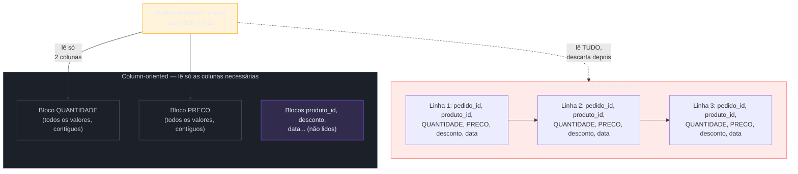
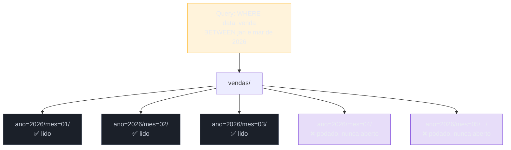
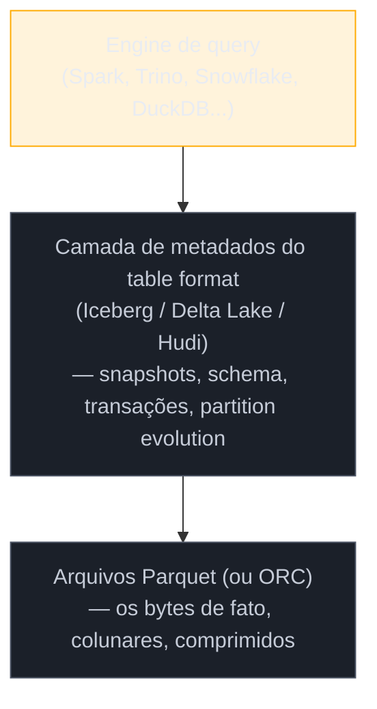

# Armazenamento colunar e formatos

> [!abstract] TL;DR
> Um data warehouse não é rápido para agregação "porque é warehouse" — ele é rápido porque, por baixo, guarda o dado de um jeito fisicamente diferente de um banco transacional: **coluna a coluna**, não linha a linha. Essa mudança de layout físico é o que torna uma soma sobre 50 milhões de linhas uma questão de segundos, não de minutos, porque o disco lê só a coluna que a agregação precisa — e porque valores do mesmo tipo, colados uns nos outros, comprimem de um jeito que uma linha heterogênea nunca comprime. Sobre esse alicerce físico se apoiam os **formatos de arquivo** — Parquet, ORC, Avro — que decidem como os bytes ficam organizados em disco, e, mais recentemente, os **formatos de tabela** — Iceberg, Delta Lake, Hudi — que adicionam uma camada de metadados sobre um monte de arquivos Parquet soltos para dar a eles transação, evolução de schema e a capacidade de "voltar no tempo". Esta nota fecha o sub-galho de fundamentos indo do porquê físico (row vs. columnar) até o estado da arte de 2026 no ecossistema de lakehouse aberto.

> [!question]- Perguntas que esta nota responde
> - Por que uma agregação sobre uma coluna é ordens de magnitude mais rápida num banco colunar do que num banco linha-a-linha, em termos de bytes lidos do disco?
> - O que dictionary encoding e run-length encoding fazem, e por que colunas comprimem melhor que linhas?
> - Quando usar Parquet, quando usar ORC, quando usar Avro — e por que nenhum dos três é "melhor" em absoluto?
> - Como o layout físico dos arquivos (particionamento, tamanho de arquivo) afeta o desempenho de uma query analítica?
> - O que Iceberg, Delta Lake e Hudi resolvem que um diretório cheio de arquivos Parquet, sozinho, não resolve?
> - Qual desses três formatos de tabela é o "padrão" em 2026, e por que essa pergunta tem uma resposta menos definitiva do que parece?

## Uma coluna, cinquenta milhões de linhas

Volte à pergunta que abriu a nota 01 desta trilha: "faturamento por categoria, por mês, dos últimos dois anos". Suponha agora que essa pergunta já roda contra um data warehouse dedicado — não mais contra o Postgres de produção — e pergunte-se por que ela é rápida ali. A resposta não é "porque o warehouse tem mais CPU" ou "porque o índice é melhor". É mais fundamental que isso: é uma questão de **quantos bytes o disco precisa ler**.

Uma tabela de itens de pedido, num banco relacional convencional, guarda cada linha fisicamente contígua em disco: `pedido_id`, `produto_id`, `quantidade`, `preco_unitario`, `desconto`, `criado_em` — todos os valores de uma linha vizinhos uns dos outros, num único bloco de página. Esse layout é chamado **row-oriented** (orientado a linha), e ele é exatamente o que um sistema OLTP quer: quando o checkout busca ou atualiza *um pedido inteiro*, ele lê um bloco só e pega todos os campos de uma vez — rápido, porque a operação típica toca a linha inteira.

Agora troque a pergunta: em vez de "me dê o pedido #48219 inteiro", pergunte "some `quantidade * preco_unitario` de todas as linhas, agrupado por mês". Num layout row-oriented, para responder isso o motor **ainda precisa ler a linha inteira** de cada registro — inclusive `desconto`, `criado_em`, e qualquer outra coluna que a agregação não usa — porque é assim que os bytes estão organizados fisicamente no disco: um registro é uma unidade indivisível de I/O. Se a tabela tem vinte colunas e a agregação só precisa de duas, o motor ainda paga o custo de trazer as vinte para a memória, só para descartar dezoito delas depois de ler.

O armazenamento **columnar** (colunar) inverte esse layout: em vez de guardar linha por linha, ele guarda **coluna por coluna** — todos os valores de `quantidade` contíguos em um bloco, todos os valores de `preco_unitario` contíguos em outro bloco, e assim por diante. Para responder "some `quantidade * preco_unitario`, agrupado por mês", o motor colunar lê **só os blocos de `quantidade`, `preco_unitario` e `criado_em`** — e nem toca em `desconto`, `pedido_id` ou qualquer outra coluna irrelevante para essa pergunta. Menos bytes lidos do disco significa menos I/O, que costuma ser o gargalo dominante numa varredura de milhões de linhas — a CPU quase sempre tem folga de sobra; o disco (ou a rede, em storage de objeto na nuvem) é o recurso escasso.

Esse ganho de I/O é a razão física de fundo por trás de todo o resto que a trilha construiu até aqui: por que o motor de armazenamento de um data warehouse é diferente do motor do Postgres, e por que "adaptar" um banco row-oriented para se comportar como analítico não é questão de configuração, como já adiantado na nota 01. É outra estrutura de dado em disco, de baixo para cima.

> [!question]- Isso significa que colunar é sempre melhor?
> Não — é melhor para o padrão de acesso OLAP, e pior para o padrão OLTP. Se a operação típica é "insira este pedido inteiro" ou "atualize o status deste pedido específico", o layout row-oriented é o certo: a escrita toca uma linha inteira de uma vez, e fazer isso num layout colunar significa espalhar a escrita por dezenas de blocos diferentes (um por coluna) — caro e, em muitas implementações colunares, nem sequer otimizado para escrita pontual e frequente. É por isso que bancos colunares em geral não competem para ser o banco transacional da aplicação; eles são bons no que foram desenhados para ser bons, e ruins fora disso — o mesmo raciocínio de descasamento estrutural que abriu a nota 01.

## Por que uma coluna comprime melhor que uma linha

O ganho de I/O colunar tem um efeito colateral tão importante quanto ele mesmo: **compressão**. Uma coluna inteira de valores do mesmo tipo — todas as datas de uma coluna `criado_em`, ou todos os nomes de categoria de uma coluna `categoria` — tende a ter baixa cardinalidade e alta redundância local. Uma linha, ao contrário, mistura tipos completamente diferentes lado a lado (um inteiro, um texto, uma data, um decimal), e não existe um algoritmo de compressão genérico que aproveite bem essa mistura.

Duas técnicas de encoding fazem a maior parte do trabalho pesado:

**Dictionary encoding.** Se uma coluna `categoria` tem só quinze valores distintos possíveis ("Eletrônicos", "Moda", "Casa"...) repetidos ao longo de milhões de linhas, o motor guarda um dicionário pequeno (cada valor distinto mapeado a um número inteiro curto) e substitui a coluna inteira por uma sequência de números pequenos. Em vez de repetir a string "Eletrônicos" um milhão de vezes, o disco guarda o inteiro `3` um milhão de vezes — e um milhão de inteiros pequenos ocupa uma fração do espaço de um milhão de strings.

**Run-length encoding (RLE).** Quando a mesma coluna vem ordenada ou parcialmente ordenada (o que é comum depois de particionar ou ordenar por uma chave), sequências longas do mesmo valor aparecem em fileira — cem linhas seguidas com `categoria = "Eletrônicos"`, por exemplo. RLE substitui essa fileira inteira por um par `(valor, quantidade de repetições)`: em vez de guardar "Eletrônicos" cem vezes, guarda "Eletrônicos, ×100". Combinado com dictionary encoding — a sequência vira só `(3, ×100)` — o ganho de espaço é dramático justamente nas colunas de baixa cardinalidade que aparecem toda hora num modelo dimensional (categoria, região, status, tipo).

Nenhuma das duas técnicas funciona bem sobre uma linha, porque uma linha mistura uma coluna de baixa cardinalidade (`categoria`) com uma de altíssima cardinalidade (`pedido_id`, praticamente único por linha) — e o algoritmo de compressão precisa lidar com a mistura inteira de uma vez, sem conseguir explorar o padrão de nenhuma coluna isoladamente. É por isso que uma tabela convertida de row-oriented para colunar tipicamente encolhe várias vezes de tamanho em disco, sem perder nenhuma informação — o ganho vem inteiramente de reorganizar os mesmos bytes de um jeito que expõe a redundância que já existia, mas que o layout por linha escondia.

> [!info] Onde essa compressão aparece na prática
> Formatos de arquivo colunares como Parquet e ORC não são só "um jeito de guardar bytes" — eles embutem essas técnicas de encoding no próprio formato, com metadados por coluna (estatísticas de min/max, contagem de valores distintos, o encoding escolhido) que o motor de query usa para decidir, antes mesmo de ler o dado, se vale a pena ler aquele bloco. Isso é o assunto da próxima seção.

## Parquet, ORC e Avro: três formatos, três propósitos

Armazenamento colunar é um **princípio**; **Parquet**, **ORC** e **Avro** são **formatos de arquivo** concretos — especificações de como os bytes de uma tabela ficam organizados dentro de um arquivo em disco (ou em storage de objeto, como S3). Vale separar os três com precisão, porque são o vocabulário mínimo que qualquer stack de dados usa no dia a dia.

**Apache Parquet** é colunar, de código aberto, originado num projeto conjunto entre Twitter e Cloudera em 2013, e hoje é o formato de fato padrão para analytics no ecossistema aberto — lido nativamente por Spark, Trino/Presto, Snowflake, BigQuery, DuckDB e praticamente todo motor de query moderno. Guarda dados organizados em "row groups" (blocos de linhas) subdivididos por coluna dentro de cada row group, com metadados de estatísticas (min, max, contagem de nulos) por bloco de coluna — o que permite ao motor de query pular blocos inteiros sem lê-los, se as estatísticas garantem que nenhuma linha daquele bloco pode satisfazer o filtro da query (uma técnica chamada *predicate pushdown*, ou "empurrar o filtro para dentro do arquivo").

**Apache ORC** (*Optimized Row Columnar*) é também colunar, e resolve essencialmente o mesmo problema que Parquet, com raízes e adoção mais fortes no ecossistema Hive/Hadoop original. Tecnicamente competitivo com Parquet — os dois têm índices por bloco, compressão e predicate pushdown — a diferença na prática é mais de ecossistema e convenção de time do que de superioridade técnica de um sobre o outro: um time que já vive em Hive/Hadoop legado tende a ver ORC nativamente bem suportado; a maioria das stacks novas em 2026 escolhe Parquet por padrão, simplesmente porque é o formato com adoção mais ampla e ferramental mais numeroso ao redor.

**Apache Avro**, ao contrário dos dois anteriores, é **row-oriented** — guarda cada registro inteiro contíguo, com o schema embutido no próprio arquivo (serializado uma vez no cabeçalho, não repetido por linha). Isso o torna ruim para agregação analítica pelo mesmo motivo que qualquer layout row-oriented é ruim para isso — mas excelente para dois cenários onde Parquet e ORC não brilham: **streaming/ingestão** (Kafka usa Avro extensivamente como formato de mensagem, porque cada evento é lido e processado inteiro, um de cada vez — o padrão de acesso é OLTP-like, não OLAP) e **evolução de schema** (Avro foi desenhado desde o início para tolerar produtor e consumidor lendo versões diferentes do schema, adicionando ou removendo campos sem quebrar compatibilidade — uma preocupação central quando dezenas de serviços produzem eventos de forma independente e evoluem em ritmos diferentes).

| Formato | Orientação | Melhor para | Ecossistema típico |
|---|---|---|---|
| Parquet | Colunar | Leitura analítica em escala, o padrão de fato | Spark, Trino, Snowflake, BigQuery, DuckDB, quase tudo |
| ORC | Colunar | Leitura analítica, historicamente Hive/Hadoop | Hive, Presto legado |
| Avro | Linha (row-oriented) | Streaming, ingestão, schema evolution | Kafka, pipelines de ingestão |
| CSV / JSON | Linha, texto plano | Intercâmbio simples, dado semiestruturado, nenhuma otimização | Exports, APIs, logs |

> [!question]- Por que não usar Avro (ou CSV) direto no warehouse, já que "linha" é mais simples?
> Porque simplicidade de escrita não é a métrica que importa num warehouse — a métrica que importa é custo de leitura agregada, e é exatamente aí que row-oriented perde para colunar, pelas razões físicas da primeira seção desta nota. O padrão comum de pipeline é justamente **usar Avro (ou JSON) na ingestão**, onde o padrão de acesso é escrever evento a evento e schema muda com frequência, e **converter para Parquet ao aterrissar no lake ou warehouse**, onde o padrão de acesso vira leitura agregada em escala. Os dois formatos não competem pelo mesmo lugar no pipeline — cada um faz o trabalho para o qual foi desenhado, o mesmo raciocínio de "ferramenta certa para o padrão de acesso certo" que atravessa a trilha inteira.

> [!warning] Escolher formato por hype, não por padrão de acesso
> **O que acontece:** um time escolhe ORC "porque é o que a Cloudera recomendava" ou Avro "porque parece mais simples", sem examinar se o padrão de leitura dominante daquela tabela é agregação em massa ou registro individual. **Por quê:** o custo de um formato errado só aparece depois — quando a tabela cresce e as queries analíticas começam a demorar, ou quando o pipeline de ingestão trava porque o formato escolhido não tolera schema evolution. **Como evitar:** a pergunta certa não é "qual formato é melhor", é "essa tabela é lida por linha (streaming, lookup pontual) ou lida em agregação (analytics)?" — e o formato segue dessa resposta, não de preferência de ferramenta.

## Particionamento, partition pruning e o problema dos small files

Formato de arquivo resolve como os bytes ficam organizados *dentro* de um arquivo. Mas um warehouse ou lake real não guarda uma tabela como um arquivo Parquet único — ele guarda como **muitos** arquivos Parquet, organizados numa estrutura de diretórios que reflete uma escolha deliberada de **particionamento físico**.

O caso canônico: uma tabela de vendas particionada por data, em que cada dia (ou mês) vira um diretório próprio — `vendas/ano=2026/mes=07/dia=12/arquivo.parquet`, e assim por diante. Quando uma query filtra `WHERE data_venda BETWEEN '2026-01-01' AND '2026-03-31'`, o motor de query não precisa nem abrir os arquivos de abril em diante — ele sabe, só pelo caminho do diretório, que aqueles arquivos não podem conter linha nenhuma que satisfaça o filtro, e **pula o arquivo inteiro sem lê-lo**. Essa técnica se chama **partition pruning** (poda de partição), e é o análogo, em nível de arquivo inteiro, do que o predicate pushdown faz em nível de bloco de coluna dentro de um arquivo Parquet: os dois mecanismos existem para que o motor leia o mínimo possível de bytes antes de responder a pergunta.

A escolha de **por qual coluna particionar** é uma decisão de arquitetura real, não um detalhe: particionar por uma coluna que a maioria das queries filtra (data, quase sempre; às vezes região ou tenant) traz ganho enorme; particionar por uma coluna de altíssima cardinalidade (um ID de cliente único, por exemplo) produz milhões de diretórios minúsculos, o que leva ao segundo problema estrutural desta seção.

**O problema dos small files.** Cada arquivo, por menor que seja, carrega um custo fixo de abertura — ler seus metadados, checar suas estatísticas, listar seu caminho no storage. Se um pipeline grava dados em lote frequente e pequeno (um arquivo novo a cada poucos minutos, por exemplo), uma partição de um único dia pode acabar com milhares de arquivos minúsculos em vez de poucos arquivos bem dimensionados. O motor de query paga o custo fixo de abrir cada um desses milhares de arquivos antes mesmo de começar a ler dado de fato — e em storage de objeto na nuvem (S3, GCS), cada abertura de arquivo é uma chamada de rede, não uma leitura de disco local, o que torna o custo ainda mais alto. A prática corretiva se chama **compaction**: um processo periódico que reagrupa muitos arquivos pequenos em poucos arquivos maiores e bem dimensionados (tipicamente na faixa de 100MB–1GB por arquivo), sem mudar o conteúdo lógico da tabela — só o layout físico por baixo.

> [!question]- Quem decide o tamanho ideal de arquivo e quando compactar?
> Isso varia por engine e por formato de tabela (a próxima seção), mas o princípio geral é o mesmo: arquivos grandes demais perdem o benefício do partition pruning fino (o motor lê arquivo demais mesmo filtrando bem); arquivos pequenos demais pagam custo fixo de abertura demais. A faixa de 100MB a 1GB por arquivo é uma heurística comum na indústria, não uma lei — e formatos de tabela modernos como Iceberg e Delta Lake, cobertos a seguir, incluem rotinas de compaction automatizada justamente para tirar essa decisão operacional do time humano.

## O pulo do gato: formato de arquivo não é formato de tabela

Até aqui, a nota tratou "uma tabela" como se fosse só "um monte de arquivos Parquet numa pasta, particionados por data". E durante anos, na prática, era exatamente isso — um data lake clássico era, literalmente, um diretório de arquivos Parquet ou ORC num storage de objeto, com o esquema de particionamento como única estrutura organizadora. Esse desenho funciona até aparecer um punhado de perguntas que um monte de arquivos, sozinho, não sabe responder:

- Se dois processos escrevem na mesma tabela ao mesmo tempo, o que garante que um leitor nunca veja um estado parcial — metade dos arquivos novos, metade dos antigos?
- Se uma query lê a tabela enquanto um pipeline está no meio de reescrever um punhado de arquivos, o que impede o leitor de ver um resultado inconsistente?
- Como adicionar uma coluna nova à tabela sem quebrar todo pipeline que já lê os arquivos antigos, que não têm essa coluna?
- Como responder "como essa tabela estava há três dias, antes daquele pipeline com bug ter rodado" — sem manter uma cópia inteira da tabela para cada dia?
- Como mudar o esquema de particionamento (de "por mês" para "por dia", por exemplo) sem reescrever a tabela inteira do zero?

Nenhuma dessas perguntas é sobre o formato do *arquivo* — Parquet, isoladamente, não tem opinião sobre nenhuma delas, porque um arquivo Parquet só sabe descrever a si mesmo. Todas essas perguntas são sobre uma camada acima: como a **coleção de arquivos**, no seu conjunto, se comporta como uma tabela única, transacional e versionada. É esse o problema que os **open table formats** — **Apache Iceberg**, **Delta Lake** e **Apache Hudi** — resolvem: uma camada de **metadados transacionais** por cima de um conjunto de arquivos Parquet (ou, no caso do Hudi, também outros formatos), que registra, de forma versionada, exatamente quais arquivos compõem qual versão lógica da tabela em qual momento.

Vale fixar a distinção com uma frase que separa dois níveis diferentes de abstração: **Parquet é formato de arquivo — descreve como bytes de uma coleção de linhas ficam organizados dentro de um arquivo. Iceberg, Delta Lake e Hudi são formatos de tabela — descrevem como um conjunto de arquivos, no seu todo, se comporta como uma tabela transacional.** Um formato de tabela normalmente *usa* Parquet por baixo como formato de arquivo — não o substitui, empilha sobre ele.

Quatro capacidades que essa camada de metadados adiciona, concretamente, sobre um diretório de Parquet solto:

**Transações ACID.** Cada mudança na tabela (inserir, atualizar, deletar, compactar) vira um **commit atômico** que produz um novo **snapshot** — uma versão inteira e consistente da tabela, referenciada por um arquivo de metadados próprio. Um leitor sempre enxerga um snapshot completo e consistente, nunca um estado parcial de uma escrita em andamento — a mesma garantia de isolamento que um banco OLTP dá, agora aplicada a um conjunto de arquivos num storage de objeto que, por si só, não tem noção nenhuma de transação.

**Schema evolution.** Adicionar, renomear ou remover uma coluna vira uma operação de metadados — o formato de tabela versiona o schema junto com os dados, e sabe reconciliar um arquivo Parquet antigo (sem a coluna nova) com o schema atual da tabela (que já tem a coluna) na hora de ler, sem precisar reescrever arquivo histórico nenhum.

**Time travel.** Como cada mudança produz um snapshot versionado, é possível consultar a tabela **como ela estava em qualquer snapshot anterior** — "me mostre esses dados como estavam antes daquele pipeline com bug ter rodado ontem à noite" — sem manter uma cópia física separada para cada dia. Isso também viabiliza auditoria e reprodutibilidade de pipeline (rodar um job de novo contra o estado exato de uma versão passada).

**Partition evolution.** Mudar o esquema de particionamento de uma tabela existente (de particionar por mês para particionar por dia, por exemplo) deixa de exigir reescrever a tabela inteira do zero — o formato de tabela registra que dados antigos seguem um esquema de partição e dados novos seguem outro, e o motor de query sabe navegar essa mistura de forma transparente.

> [!info] Estado do ecossistema de open table formats — 2026-07
> O ecossistema segue sem um vencedor único consolidado, mas com uma tendência de convergência clara:
> - **Apache Iceberg** se tornou o formato de referência para lakehouse aberto novo em 2026 — governança vendor-neutral (projeto Apache, não controlado por uma única empresa), suporte nativo pelos três grandes provedores de nuvem (AWS, Google Cloud, Azure), leitura/escrita por praticamente todo motor relevante (Spark, Flink, Trino, Snowflake, BigQuery, DuckDB), e a especificação v3 fechou as principais lacunas de recurso que ainda existiam frente aos concorrentes. A aquisição da Tabular (empresa fundada pelos criadores originais do Iceberg) pela Databricks em 2024 — a mesma empresa por trás do Delta Lake — foi um sinal forte de que até o concorrente direto reconheceu a tração de Iceberg.
> - **Delta Lake** continua sendo o formato com a maior base instalada, sobretudo dentro do ecossistema Databricks e Microsoft Fabric, onde funcionalidades como **Liquid Clustering** (reorganização física adaptativa, substituindo particionamento fixo tradicional) mantêm vantagem de performance dentro daquele ecossistema.
> - **Apache Hudi** mantém posição forte e mais nichada em cargas de **streaming e upserts/CDC** (*change data capture*) intensivos — casos de uso com atualização linha a linha muito frequente, onde a indexação a nível de registro do Hudi tem vantagem sobre os outros dois.
> - O mercado não convergiu para um vencedor único, mas convergiu para **interoperabilidade**: **Delta Lake UniForm** gera metadados Iceberg automaticamente ao lado dos commits Delta, permitindo que engines compatíveis com Iceberg leiam tabelas Delta sem conversão de dados (hoje, majoritariamente em uma via — escreve-se em Delta, expõe-se como Iceberg); e o **Apache XTable** (projeto incubado na Apache) faz tradução de metadados nas duas direções entre Iceberg, Delta e Hudi, sem duplicar os dados físicos — ainda inicial, com arestas em sincronização incremental, mas já viável para migração pontual entre formatos.
> - Formatos emergentes que vale nomear sem aprofundar: **Apache Paimon**, pensado desde a origem para streaming; e **DuckLake**, que guarda os metadados de tabela num banco SQL comum (em vez de arquivos de metadados no próprio storage de objeto) — uma aposta de simplicidade operacional ainda em estágio inicial de adoção. A escolha prática recomendada pela indústria em 2026 deixou de ser binária: como UniForm e XTable tornam a barreira de troca menor, o critério passa a ser "otimize para sua carga de trabalho dominante (streaming pesado → considere Hudi; já vive em Databricks → Delta com UniForm; construindo lakehouse novo, multi-engine, sem vendor lock-in → Iceberg) e deixe a interoperabilidade cobrir o resto".

> [!question]- Isso substitui o que a nota 03 desta trilha explica sobre warehouse, lake e lakehouse?
> Não — instrumenta. A nota [[03 - Warehouse, lake e lakehouse]] cobre o **paradigma**: por que um lake existe, o que é um data swamp, o que muda quando lake e warehouse convergem em lakehouse. Esta nota aqui cobre o **mecanismo técnico** que torna esse paradigma viável na prática: sem armazenamento colunar comprimido e sem uma camada de metadados transacional por cima dos arquivos, um "data lakehouse" seria só um data lake com um nome mais bonito — os open table formats são, literalmente, o que separa o lakehouse de 2026 do data swamp que o lake corria risco de virar antes deles existirem.

## Contraste rápido com o lado OLTP

Vale fechar amarrando de volta ao que a trilha já assumiu como conhecido desde a nota 01: nada do que essa nota descreve substitui índice B-tree, e os dois mecanismos não competem pelo mesmo problema. Um índice B-tree, como tratado em [[03-Dominios/Ciência/Banco de Dados/07 - Índices|Banco de Dados 07]], existe para achar **uma linha específica** rapidamente dentro de uma tabela enorme — o padrão de acesso OLTP. Partition pruning e leitura colunar existem para **evitar ler linhas que não interessam** numa varredura agregada de milhões de registros — o padrão de acesso OLAP. Um banco pode ter índice B-tree e nunca precisar de layout colunar (se ele só serve consultas pontuais); um warehouse colunar normalmente nem tem índice B-tree tradicional, porque a pergunta que ele responde não é "ache esta linha", é "agregue todas as linhas que casam este filtro" — e para essa pergunta, blocos de coluna com estatísticas de min/max e partition pruning fazem o trabalho que um índice faria no outro mundo.

## Em entrevista

Uma pergunta clássica de nível pleno/sênior: "por que Parquet é mais rápido que CSV para analytics?" A resposta fraca fica em "porque é binário e comprimido". A resposta forte nomeia o mecanismo físico: layout colunar significa que o motor só lê as colunas que a query realmente usa, em vez da linha inteira; compressão via dictionary encoding e RLE explora a homogeneidade de tipo dentro de uma coluna, algo que uma linha heterogênea não permite; e metadados por bloco (min/max, contagem de nulos) habilitam predicate pushdown — pular blocos inteiros sem sequer descomprimi-los, se as estatísticas já garantem que o filtro não pode casar ali.

Uma pergunta mais avançada, de arquitetura de dados: "o que Iceberg (ou Delta Lake) resolve que um monte de arquivos Parquet particionados, sozinho, não resolve?" A resposta que soa sênior nomeia especificamente: transação atômica sobre múltiplos arquivos (nenhum leitor vê estado parcial de uma escrita em andamento), schema evolution sem reescrever histórico, time travel para auditoria e reprocessamento, e partition evolution sem migração completa da tabela. Quem responde só "governança de metadados" sem nomear pelo menos duas dessas capacidades concretas está no nível de quem decorou o nome da ferramenta sem ter internalizado o problema que ela resolve — o mesmo padrão de sinal fraco vs. forte que a nota 01 já descreveu para OLTP/OLAP.

Um terceiro eixo, comum em entrevistas de plataforma de dados em 2026: "Iceberg, Delta ou Hudi — qual você escolheria?" Não existe resposta de memorização correta aqui, e o entrevistador está testando se o candidato reconhece isso. A resposta madura nomeia o critério (carga de trabalho dominante, ecossistema de engines já em uso, se há necessidade de streaming/CDC pesado, se há preocupação de vendor lock-in) antes de nomear uma ferramenta — e reconhece que a interoperabilidade via UniForm/XTable tornou essa decisão menos irreversível do que era há poucos anos.

## How to explain in English

> "Analytical queries want columnar storage, not row storage, because an aggregation over one column shouldn't have to read every other column on disk. Columnar formats like Parquet also compress far better than row formats, because a column of homogeneous values — dictionary-encoded, run-length-encoded — squeezes down in a way a heterogeneous row never does. On top of that, physical file layout matters: partitioning by date lets the query engine skip entire files it knows can't match the filter, and file-size compaction avoids the small-files problem. But a folder of Parquet files isn't a table by itself — that's what table formats like Apache Iceberg, Delta Lake, and Apache Hudi add: transactional metadata on top, giving you ACID commits, schema evolution, time travel, and partition evolution without rewriting the underlying files."

| PT | EN |
|----|----|
| Armazenamento orientado a linha | Row-oriented storage |
| Armazenamento colunar | Columnar storage |
| Codificação por dicionário | Dictionary encoding |
| Codificação por repetição (RLE) | Run-length encoding (RLE) |
| Empurrar o filtro (poda de bloco) | Predicate pushdown |
| Particionamento | Partitioning |
| Poda de partição | Partition pruning |
| Problema dos arquivos pequenos | Small files problem |
| Compactação | Compaction |
| Formato de arquivo | File format |
| Formato de tabela (aberto) | (Open) table format |
| Evolução de schema | Schema evolution |
| Viagem no tempo (consultar snapshot antigo) | Time travel |
| Evolução de particionamento | Partition evolution |
| Instantâneo (versão consistente da tabela) | Snapshot |

## O que vem a seguir

Com esta nota, o sub-galho de **Fundamentos de engenharia de dados** está completo: a divisão OLTP/OLAP, o ciclo de vida da disciplina, os paradigmas de warehouse/lake/lakehouse e, agora, o mecanismo físico — colunar, formatos de arquivo, formatos de tabela — que torna tudo isso viável na prática. O próximo sub-galho parte desse chão para uma pergunta diferente: dado que os fatos já vivem num warehouse colunar, **como modelar** essas tabelas para que perguntas de negócio sejam fáceis e rápidas de responder — o assunto de modelagem dimensional, esquema estrela e esquema floco de neve.

- [[2 - Modelagem para analytics/index|Modelagem para analytics]] — o próximo sub-galho, abrindo com modelagem dimensional: fatos, dimensões, e por que o modelo desnormalizado da nota 01 desta trilha é desenhado especificamente para tirar proveito do armazenamento colunar descrito aqui

## Fontes

- Reis, Joe & Housley, Matt — *Fundamentals of Data Engineering: Plan and Build Robust Data Systems*, O'Reilly, 2022 — base do capítulo de armazenamento (row vs. columnar, formatos de arquivo, table formats).
- Apache Parquet — [documentação oficial](https://parquet.apache.org/docs/) — especificação do formato, row groups, column chunks, estatísticas por bloco.
- Apache Iceberg — [documentação oficial](https://iceberg.apache.org/docs/latest/) — especificação de snapshots, schema evolution, partition evolution, spec v3.
- Delta Lake — [Unifying the open table formats with Delta Lake Universal Format (UniForm) and Apache XTable](https://delta.io/blog/unifying-open-table/) — mecanismo do UniForm e a estratégia de interoperabilidade.
- Apache XTable (Incubating) — [site oficial do projeto](https://xtable.apache.org/) — tradução omnidirecional de metadados entre Iceberg, Delta e Hudi.
- AWS Big Data Blog — [Expand data access through Apache Iceberg using Delta Lake UniForm on AWS](https://aws.amazon.com/blogs/big-data/expand-data-access-through-apache-iceberg-using-delta-lake-uniform-on-aws/) — exemplo concreto de UniForm expondo metadados Iceberg a partir de tabelas Delta.
- Onehouse — [Apache Hudi vs Delta Lake vs Apache Iceberg — Feature Comparison Deep Dive](https://www.onehouse.ai/blog/apache-hudi-vs-delta-lake-vs-apache-iceberg-lakehouse-feature-comparison) — comparação de recursos entre os três table formats, incluindo o ponto forte de Hudi em CDC/streaming.
- WebSearch (2026-07-12): estado de adoção de Iceberg/Delta/Hudi em 2026 (Iceberg como formato de referência multi-engine e vendor-neutral, Delta com maior base instalada via Databricks/Fabric, Hudi forte em streaming/CDC; aquisição da Tabular pela Databricks em 2024; Iceberg spec v3) e mecanismo de interoperabilidade via UniForm e Apache XTable.
