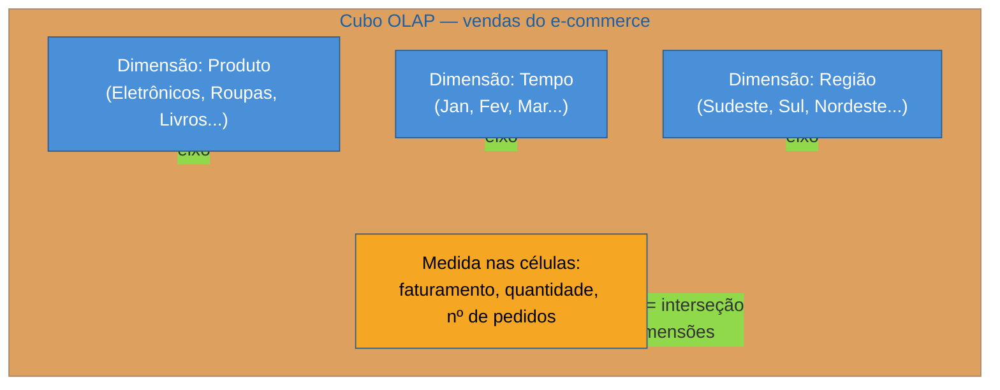

# Por que modelar pra analytics

> [!abstract] TL;DR
> O mesmo schema que protege a escrita de um sistema OLTP — normalizado a 3FN, cada fato num lugar só — é o schema errado para ler analiticamente: quem faz BI precisa atravessar meia dúzia de `JOIN`s e entender um mapa de tabelas que só existe para blindar a integridade transacional, não para responder "faturamento por categoria por mês". Modelar para analytics inverte a prioridade: em vez de otimizar para nunca duplicar um fato, otimiza-se para que uma pessoa consiga **ler o esquema em cinco minutos** e para que a agregação rode rápido — mesmo que isso signifique guardar o mesmo dado em mais de um lugar de propósito. Essa troca tem nome, **denormalização deliberada**, e tem uma metáfora que organiza todo o vocabulário que vem depois: o **cubo OLAP**, com eixos (dimensões: produto, tempo, região) e o que se soma nas células (medidas: faturamento, quantidade). O modelo dimensional — tema da próxima nota — é a forma relacional de materializar esse cubo.

> [!question]- Perguntas que esta nota responde
> - Por que um banco OLTP bem normalizado é ruim para responder perguntas analíticas, mesmo com índices bons?
> - O que muda de mentalidade quando o objetivo passa a ser "leitura agregada e esquema legível" em vez de "integridade de escrita"?
> - O que é denormalização deliberada, e por que ela não é "preguiça de modelar direito"?
> - O que é o cubo OLAP — dimensões, medidas, slice, dice, drill-down, roll-up, pivot — e por que esse vocabulário antecede qualquer discussão de star schema?

## A mesma pergunta, o mesmo banco, o mesmo problema

[[1 - Fundamentos de engenharia de dados/01 - O que é engenharia de dados|A nota de abertura desta trilha]] mostrou o e-commerce clássico: um Postgres bem modelado, ACID, normalizado — perfeito para processar checkout — travando quando a diretoria pediu "faturamento por categoria de produto, por mês, dos últimos dois anos". A resposta daquela nota foi arquitetural: **tire a carga analítica do banco de produção**, mande para um data warehouse. Ponto resolvido — só que só pela metade.

Porque suponha que a extração já aconteceu. O dado saiu do Postgres, chegou ao warehouse, ninguém mais compete por recursos com o checkout. Ótimo. Agora um analista abre esse warehouse e tenta responder a mesma pergunta — "faturamento por categoria, por mês" — e encontra lá dentro... o mesmo schema normalizado que tinha no Postgres. `pedidos`, `itens_pedido`, `produtos`, `categorias`, cada um em sua tabela, ligados por chave estrangeira, exatamente como a teoria de normalização manda[^kimball]. A query ainda precisa dos mesmos quatro ou cinco `JOIN`s. Ela não vai mais derrubar o checkout — mas continua lenta, continua difícil de escrever, e continua exigindo que o analista entenda a topologia inteira do banco transacional só para somar uma coluna.

Isolar a carga resolveu o problema de **contenção**. Não resolveu o problema de **modelo**. E é esse segundo problema — como organizar o dado, uma vez que ele já está seguro num warehouse dedicado — que esta nota abre.

## Por que o modelo que protege a escrita atrapalha a leitura

Vale relembrar, sem reexplicar, o que a [[03-Dominios/Ciência/Banco de Dados/04 - Modelagem e normalização|Banco de Dados 04]] já cobre em detalhe: normalização existe para garantir que **cada fato do mundo more em exatamente um lugar** do banco. O nome do médico não se repete em cada consulta dele; o nome da categoria não se repete em cada item de pedido. Essa propriedade elimina as anomalias de atualização, inserção e exclusão — se o nome de uma categoria muda, você atualiza uma linha, não milhares. É teoria sólida, e ela é exatamente certa para o problema que resolve: **proteger a integridade de um sistema que escreve o tempo todo**.

O problema é que essa mesma propriedade — "um fato, um lugar" — é o oposto do que uma leitura agregada quer. Pense de novo na query do faturamento:

```sql
SELECT
    c.nome AS categoria,
    date_trunc('month', p.criado_em) AS mes,
    SUM(i.quantidade * i.preco_unitario) AS faturamento
FROM pedidos p
JOIN itens_pedido i ON i.pedido_id = p.id
JOIN produtos pr ON pr.id = i.produto_id
JOIN categorias c ON c.id = pr.categoria_id
WHERE p.criado_em >= now() - interval '2 years'
  AND p.status = 'pago'
GROUP BY c.nome, date_trunc('month', p.criado_em)
ORDER BY mes;
```

Cada `JOIN` nessa query existe porque o modelo normalizado **deliberadamente espalhou** a informação de categoria para longe da informação de venda — o nome da categoria mora na tabela `categorias`, não repetido em cada item vendido, porque é isso que a 3FN exige. Para responder "faturamento por categoria" o banco precisa desfazer, em tempo de leitura, exatamente a separação que a normalização impôs em tempo de escrita. Quanto mais rigorosamente normalizado o esquema, mais tabelas uma pergunta de negócio simples precisa atravessar — e cada `JOIN` extra sobre tabelas de milhões de linhas é custo que se acumula, mesmo fora do banco de produção.

Há um segundo custo, mais silencioso que o de performance: o **custo cognitivo**. Um esquema normalizado de verdade, numa aplicação de porte médio, facilmente passa de cinquenta ou cem tabelas — pedidos, itens, produtos, categorias, fornecedores, endereços, variações de SKU, tabelas de junção para relações muitos-para-muitos, histórico de preço, e por aí vai. Cada uma dessas tabelas existe por uma boa razão de integridade transacional. Mas um analista de negócio, ou um analytics engineer montando um dashboard, não tem — e não deveria precisar ter — o modelo mental de como o time de backend decidiu representar `variacao_sku_historico_preco`. Ele quer responder "quanto vendemos, de quê, para quem, quando" sem precisar de um curso de arqueologia sobre o schema da aplicação.

> [!question]- Isso significa que normalização foi um erro de design lá no Postgres?
> Não — é o oposto. O Postgres normalizado está certo *para o que ele faz*: proteger a escrita, evitar que um pedido pago debite o estoque errado, garantir que o preço de um produto não fique inconsistente entre duas linhas. O erro seria usar aquele mesmo modelo para responder perguntas analíticas — são duas cargas com prioridades opostas, e a nota [[1 - Fundamentos de engenharia de dados/01 - O que é engenharia de dados|de abertura da trilha]] já formalizou isso como OLTP vs OLAP. Modelar pra analytics não é "consertar" o Postgres; é construir, num sistema separado, um modelo diferente, otimizado para outra pergunta.

## A mudança de mentalidade: dois eixos de otimização

Se normalização otimiza para "nunca duplicar um fato", modelagem para analytics otimiza para dois eixos diferentes, e os dois importam igualmente:

**1. Velocidade de leitura agregada.** Menos `JOIN`s significa menos trabalho para o motor de banco reconstruir a informação na hora de agregar. Se a categoria já está ao lado da venda, a soma por categoria vira uma varredura direta, não uma reconstrução via chave estrangeira.

**2. Compreensão humana do esquema.** Este eixo é fácil de subestimar porque não aparece em nenhum `EXPLAIN ANALYZE` — mas é tão real quanto o primeiro. Um analista de negócio, um analytics engineer, ou até um modelo de linguagem gerando SQL a partir de uma pergunta em português, precisa conseguir **olhar para o esquema e entender o que cada tabela significa** sem decorar cem tabelas normalizadas nem ler a documentação inteira da aplicação. Um esquema com cinco ou dez tabelas, cada uma com um papel óbvio ("essa é a tabela de vendas, essa é a de produtos, essa é a de tempo"), é um esquema que se autoexplica. Um esquema com cem tabelas normalizadas, por mais correto que seja, não se autoexplica — ele exige arqueologia.

O caminho para servir os dois eixos ao mesmo tempo tem nome: **denormalização deliberada**.

> [!info] Denormalização deliberada não é "não normalizar"
> É fácil confundir denormalização deliberada com simplesmente não ter aprendido a normalizar. São coisas opostas. Denormalização deliberada é uma decisão **posterior** e **informada**: você entende exatamente que redundância está introduzindo, por que ela é segura neste contexto (o dado no warehouse é derivado, recarregado por pipeline, não editado à mão por um usuário concorrente), e o que ganha em troca (menos `JOIN`s, esquema legível). É o oposto de um design acidental — é uma escolha de engenharia, com trade-off nomeado, feita depois de já se entender a teoria da normalização o suficiente para saber o que está sendo abdicado.

Concretamente: em vez de manter `nome_categoria` só na tabela `categorias` e forçar todo consumidor a fazer `JOIN` até lá, um modelo para analytics pode replicar `nome_categoria` diretamente numa tabela mais próxima da venda. Isso introduz redundância — o mesmo texto "Eletrônicos" aparece em milhares de linhas em vez de uma só. Num banco OLTP isso seria um convite a anomalia de atualização. Num warehouse alimentado por pipeline, recarregado periodicamente a partir da fonte de verdade, essa redundância é inofensiva: se o nome da categoria mudar, o próximo carregamento do pipeline propaga a mudança para todas as linhas de uma vez — não é uma pessoa editando uma linha por vez e esquecendo as outras. A garantia de consistência migrou de "o modelo relacional impede a divergência" para "o pipeline garante que toda recarga reflete o estado atual da fonte" — um mecanismo diferente, adequado a um contexto diferente (dado derivado, não dado de origem).

Em uma frase: **normalizar protege quem escreve; denormalizar deliberadamente protege quem lê — e modelar para analytics é escolher conscientemente a segunda prioridade, porque no warehouse ninguém escreve linha a linha, todo mundo lê em massa.**

## A metáfora que organiza tudo: o cubo OLAP

Antes de qualquer forma concreta de tabela — isso é assunto da [[02 - Modelagem dimensional|próxima nota]] —, vale internalizar a imagem mental que toda a modelagem dimensional materializa: o **cubo OLAP** (*Online Analytical Processing*), uma metáfora que E. F. Codd formalizou em 1993 ao cunhar o próprio termo OLAP[^codd].

Pense no faturamento do e-commerce não como uma tabela de linhas, mas como um cubo de números. Cada aresta do cubo é uma **dimensão** — um jeito de fatiar o dado:

- **Produto** — qual categoria, qual item foi vendido.
- **Tempo** — em que dia, mês, trimestre a venda aconteceu.
- **Região** — em que cidade, estado, país o cliente estava.

Dentro do cubo, em cada célula — na interseção de um produto específico, um mês específico, uma região específica — mora uma **medida**: um número que faz sentido somar, contar ou tirar média. Faturamento, quantidade vendida, número de pedidos. Perguntar "faturamento por categoria por mês" é simplesmente **projetar** o cubo em duas de suas dimensões e somar a medida ao longo da terceira (região, neste caso, é somada por inteiro).



A metáfora do cubo vem acompanhada de um pequeno vocabulário de operações, que aparece com frequência em qualquer discussão de BI ou entrevista de dados:

- **Slice** — fatiar o cubo fixando um valor de uma dimensão: "mostre só a região Sudeste" reduz o cubo de três dimensões para duas.
- **Dice** — fatiar por um subconjunto de valores em várias dimensões ao mesmo tempo: "Eletrônicos e Livros, só no Sudeste, só no primeiro trimestre" — um bloco menor dentro do cubo original, não uma fatia única.
- **Drill-down** — descer para um nível de detalhe maior dentro de uma dimensão: de "faturamento por trimestre" para "faturamento por mês", ou de "faturamento por categoria" para "faturamento por produto individual".
- **Roll-up** — o oposto do drill-down: subir para um nível mais agregado, de "por mês" para "por trimestre", de "por produto" para "por categoria".
- **Pivot** (ou *rotação*) — trocar quais dimensões aparecem nas linhas e quais aparecem nas colunas de uma visualização, sem mudar o dado por baixo — o mesmo cubo, olhado de outro ângulo.

> [!question]- Isso é só um jeito bonito de falar de `GROUP BY`?
> É um jeito de **pensar** sobre o problema antes de escrever o `GROUP BY` — e essa ordem importa. Quando alguém pede "faturamento por categoria por mês", pensar em termos de cubo deixa claro, antes de qualquer SQL, que existem duas dimensões envolvidas (produto e tempo) e uma medida (faturamento), e que região está sendo somada por inteiro (não é uma dimensão da pergunta). Drill-down, roll-up e pivot também descrevem exatamente o que acontece quando alguém interage com um dashboard de BI — clica para "abrir" um mês em dias, ou arrasta uma dimensão da linha para a coluna de uma tabela dinâmica — sem que a pessoa escreva SQL nenhum. O vocabulário do cubo existe porque ferramentas de BI e planilhas dinâmicas (a tabela dinâmica de qualquer planilha é, literalmente, uma interface de pivot sobre um cubo) tornaram essas operações o modo dominante de explorar dado analítico, muito antes de existir um dashboard SQL por trás.

O ponto que esta seção prepara, e que a próxima nota constrói em detalhe: um banco relacional não tem "cubos" nativamente — ele tem tabelas e chaves. O **modelo dimensional** de Kimball é precisamente a forma de organizar tabelas relacionais de modo que elas se comportem, na prática, como esse cubo: uma tabela central com as medidas (que vira, na terminologia de Kimball, a **tabela de fatos**) cercada de tabelas menores, uma por dimensão (produto, tempo, região — as **tabelas de dimensão**), desenhadas especificamente para que slice, dice, drill-down e roll-up sejam consultas simples, com poucos `JOIN`s, em vez da travessia de dezenas de tabelas normalizadas.

> [!info] Onde este vocabulário para, e onde a próxima nota começa
> Esta nota não define star schema, grão, chave substituta (*surrogate key*), nem os tipos de tabela de fato — tudo isso é o corpo de [[02 - Modelagem dimensional]] e de [[03 - Star vs snowflake e tipos de fato]]. O que importa fixar aqui é só o **porquê** (normalização atrapalha leitura agregada e compreensão humana) e o **vocabulário do cubo** (dimensão, medida, slice, dice, drill-down, roll-up, pivot) — o alfabeto que a modelagem dimensional inteira usa para se explicar.

## Voltando ao e-commerce: a mesma pergunta, agora trivial

Feche o círculo com o exemplo que abriu a trilha. "Faturamento por categoria de produto, por mês, dos últimos dois anos" era perigosa no Postgres de produção — cinco `JOIN`s, dezenas de milhões de linhas, risco de contenção com o checkout. Num modelo dimensional, com uma tabela de fatos de vendas cercada de dimensões de produto, tempo e cliente, essa mesma pergunta vira algo próximo de:

```sql
SELECT
    dp.categoria,
    dt.ano_mes,
    SUM(f.faturamento) AS faturamento_total
FROM fato_vendas f
JOIN dim_produto dp ON dp.produto_key = f.produto_key
JOIN dim_tempo dt ON dt.tempo_key = f.tempo_key
WHERE dt.ano_mes BETWEEN '2024-07' AND '2026-07'
GROUP BY dp.categoria, dt.ano_mes
ORDER BY dt.ano_mes;
```

Dois `JOIN`s, cada um contra uma tabela pequena (dimensões costumam ter milhares de linhas, não milhões), contra uma tabela de fatos desenhada especificamente para ser somada em massa. A query não é só mais rápida — ela é **legível**: qualquer pessoa que olhe para `fato_vendas`, `dim_produto` e `dim_tempo` entende o que cada uma representa, sem precisar saber que por trás da aplicação existe uma tabela `variacao_sku_historico_preco`. Essa dupla vitória — menos trabalho para o motor, menos trabalho para a cabeça de quem lê — é o motivo pelo qual todo data warehouse sério, décadas depois de Kimball formalizar a ideia, ainda modela dados dessa forma[^kimball].

## Casos práticos

### Cenário 1: o mesmo dashboard, dois esquemas

Um analista de BI recebe a tarefa de montar um dashboard de "desempenho comercial" para a diretoria, com filtros por categoria, região e mês — exatamente as operações de slice e dice descritas acima. Se ele monta esse dashboard direto sobre uma cópia 1:1 do schema normalizado do Postgres (a réplica de leitura, por exemplo), cada filtro que ele adiciona na ferramenta de BI vira, por baixo, mais um `JOIN` na query gerada — e a ferramenta de BI, que não sabe nada sobre o negócio, tende a gerar SQL genérico e pouco otimizado para esse tipo de travessia. O dashboard fica lento sempre que alguém aplica dois ou três filtros ao mesmo tempo, e o próprio analista, ao depurar por que uma consulta trava, precisa entender de cabeça a cardinalidade de `itens_pedido` e o plano de `JOIN` que o Postgres escolhe.

Se o mesmo analista monta o dashboard sobre um modelo dimensional — uma tabela de fatos de vendas cercada de dimensões de produto, tempo e região —, cada filtro vira uma cláusula `WHERE` contra uma dimensão pequena, e a agregação central roda direto contra a tabela de fatos, desenhada para isso. Slice e dice deixam de ser operação de risco e viram o modo natural de uso da ferramenta — que é, no fim, o que a diretoria esperava desde o início: apertar um filtro e ver o número, sem esperar.

### Cenário 2: por que o time de ML também quer uma tabela "achatada"

Um time de ciência de dados quer treinar um modelo simples de propensão de recompra e pede, ao analytics engineer, uma tabela com uma linha por cliente e várias colunas — total gasto nos últimos 90 dias, categoria favorita, tempo desde a última compra, região. Essa tabela parece, à primeira vista, uma "wide table" — a mesma forma que a armadilha abaixo alerta para não usar de propósito único e cru. A diferença é o contexto de uso: aqui a tabela larga é um **produto derivado**, construído deliberadamente a partir do modelo dimensional (uma consulta de agregação contra `fato_vendas` e as dimensões), pensado para alimentar um algoritmo que espera exatamente esse formato — uma linha por entidade, colunas como *features*. Não é o modelo de armazenamento do warehouse que virou plano; é uma visão específica, construída sob medida, em cima de um modelo dimensional que continua existindo por baixo. A confusão comum é achar que, porque o time de ML "só quer uma tabela achatada", o warehouse inteiro deveria ser modelado assim — quando, na real, é a modelagem dimensional que torna barato gerar essa tabela achatada sob demanda, sempre que um novo caso de uso pedir.

## Armadilhas comuns

> [!warning] "Já que estou denormalizando, denormalizo tudo em uma tabela só"
> **O que acontece:** ao decidir abandonar a normalização estrita, alguém propõe ir direto para uma única tabela larga com todas as colunas — venda, produto, categoria, cliente, região, tudo junto — em vez de organizar em fatos e dimensões. **Por quê:** parece mais simples à primeira vista (zero `JOIN`), mas joga fora exatamente o benefício de compreensão que motivou a mudança: uma tabela com centenas de colunas misturando granularidades diferentes (uma linha por venda, mas com atributos de cliente que se repetem em cada compra dele) é tão difícil de entender quanto um schema normalizado — só que agora também repete dado de forma descontrolada, sem a disciplina de saber qual redundância é intencional. Essa abordagem existe e tem nome (*wide table*, ou *One Big Table*), e tem lugar em certos contextos — mas é decisão informada, comparada explicitamente contra fatos e dimensões, não um atalho por preguiça de modelar. **Como evitar:** entenda primeiro o modelo fato/dimensão — que separa o que é medido (a venda) do que descreve o contexto da medida (produto, tempo, cliente) — antes de decidir abrir mão dele. A comparação informada entre essa abordagem e alternativas mais largas é o assunto de [[05 - Além de Kimball]], mais adiante neste sub-galho.

> [!warning] Denormalizar sem um pipeline que garanta a recarga
> **O que acontece:** o time denormaliza uma coluna (por exemplo, replica `nome_categoria` dentro de várias tabelas do warehouse) mas deixa alguém editar esse valor manualmente, direto no warehouse, "só dessa vez", quando um nome de categoria muda. **Por quê:** a segurança da denormalização deliberada não vem do modelo relacional — ele não impede mais a divergência, já que o mesmo fato agora mora em vários lugares — ela vem inteiramente do **pipeline**: toda vez que o pipeline recarrega, ele propaga a mudança para todas as cópias de uma vez, a partir de uma única fonte de verdade. Uma edição manual quebra essa garantia silenciosamente: na próxima recarga, ou o pipeline sobrescreve a edição manual (perdendo o ajuste), ou o pipeline não toca naquela linha (deixando uma divergência que ninguém mais vai notar até um relatório dar número errado). **Como evitar:** trate qualquer tabela alimentada por pipeline como somente leitura para humanos. Se um valor precisa de correção, a correção entra na fonte de origem (ou numa regra de transformação do próprio pipeline), nunca como `UPDATE` manual direto no warehouse.

> [!warning] Achar que o cubo OLAP exige uma ferramenta OLAP dedicada
> **O que acontece:** ao ouvir "cubo OLAP", alguém assume que é preciso adotar um motor de cubo proprietário (tecnologia MDX, por exemplo) ou uma ferramenta de BI específica para "ter" um cubo. **Por quê:** a confusão troca a **metáfora** (dimensões, medidas, slice, dice) pela **implementação histórica** de um produto específico. O vocabulário do cubo nasceu antes da maioria das ferramentas modernas de BI e continua útil como forma de pensar, mas o modelo dimensional relacional — fatos e dimensões em tabelas SQL comuns — já entrega, na prática, o comportamento do cubo, sem exigir um motor MDX dedicado. A maioria dos warehouses modernos (Snowflake, BigQuery, Redshift) responde a slice/dice/drill-down via SQL simples contra um esquema bem modelado. **Como evitar:** trate "cubo OLAP" como vocabulário conceitual, não como requisito de ferramenta. Ferramentas de BI (Power BI, Looker, dbt) e camadas semânticas específicas podem facilitar a experiência de drill-down e pivot para o usuário final — mas são citação, não pré-requisito, para o modelo dimensional funcionar.

## Em entrevista

Uma pergunta comum em entrevista de dados de nível pleno para sênior: "por que não usar o mesmo modelo relacional normalizado dentro do data warehouse, já que ele está correto?" A resposta fraca aceita a premissa e defende normalização em geral. A resposta forte separa os dois contextos: normalização está correta *para proteger escrita concorrente* — e um warehouse não tem escrita concorrente linha a linha, tem recarga em lote via pipeline. Sem esse risco, o custo da normalização (mais `JOIN`s, esquema ilegível para quem consome) deixa de ter contrapartida que o justifique, e a denormalização deliberada passa a ser estritamente vantajosa.

Uma pergunta mais avançada, de arquitetura: "como você explicaria modelagem dimensional para alguém que só conhece OLTP?" A resposta que soa sênior não começa por "star schema" ou "tabela de fatos" — ela começa pela intuição do cubo: dimensões são os eixos pelos quais você quer fatiar a pergunta (produto, tempo, região), medidas são os números que você quer somar dentro de cada fatia (faturamento, quantidade), e o modelo dimensional é só a forma relacional de deixar essas fatias baratas de calcular. Ir direto ao jargão sem passar pela intuição é o sinal mais comum de quem decorou terminologia sem ter internalizado o motivo dela existir.

Uma terceira pergunta, mais prática: "me dê um exemplo de quando você aceitaria dado duplicado de propósito." A resposta forte nomeia o mecanismo de segurança, não só o benefício: "eu duplicaria o nome da categoria dentro da tabela de fatos (ou de uma dimensão desnormalizada) se isso eliminasse um `JOIN` numa query de leitura frequente — desde que o dado seja recarregado por pipeline a partir de uma única fonte de verdade, nunca editado à mão em múltiplos lugares, porque é o pipeline, não o modelo relacional, quem garante que a duplicata não diverge."

## How to explain in English

> "A normalized OLTP schema is optimized to protect writes — every fact lives in exactly one place, so updates never go inconsistent. That same property is exactly what makes it painful to read analytically: answering an aggregate question means reconstructing, through several joins, information the schema deliberately spread apart. Modeling for analytics flips the priority. It optimizes for fast aggregate reads and for a schema a human can actually understand without memorizing a hundred normalized tables — which means accepting deliberate, controlled redundancy instead of eliminating it. The mental model behind this is the OLAP cube: dimensions are the axes you slice by — product, time, region — and measures are the numbers you sum inside each slice — revenue, quantity. Dimensional modeling is just the relational way of making that cube cheap to query."

| PT | EN |
|----|----|
| Denormalização deliberada | Deliberate denormalization |
| Cubo OLAP | OLAP cube |
| Dimensão | Dimension |
| Medida | Measure |
| Fatiar (por um valor) | Slice |
| Fatiar (por vários valores) | Dice |
| Detalhar (nível mais fino) | Drill-down |
| Agregar (nível mais alto) | Roll-up |
| Rotacionar a visualização | Pivot |
| Anomalia de atualização | Update anomaly |
| Tabela larga | Wide table |
| Compreensão do esquema | Schema readability / understandability |

## O que vem a seguir

Esta nota deu o porquê e o vocabulário — cubo, dimensões, medidas, denormalização deliberada — mas ainda não construiu nenhuma tabela. A próxima nota faz exatamente isso: pega a metáfora do cubo e a materializa em tabelas relacionais reais, com nomes técnicos precisos (fato, dimensão, grão, chave substituta) e o desenho que se tornou padrão da indústria para isso.

- [[02 - Modelagem dimensional]] — fatos e dimensões, o conceito de grão, e como a tabela central de medidas se conecta às tabelas de contexto ao redor dela

## Fontes

- Kimball, Ralph & Ross, Margy — *The Data Warehouse Toolkit: The Definitive Guide to Dimensional Modeling*, 3ª edição, Wiley, 2013 — a fonte canônica da modelagem dimensional e da lógica de denormalização deliberada para leitura analítica.
- Codd, E. F. — *Providing OLAP (On-Line Analytical Processing) to User-Analysts: An IT Mandate*, 1993 — o white paper que cunhou o termo OLAP e formalizou a metáfora do cubo multidimensional em contraste com o processamento transacional.
- [[03-Dominios/Ciência/Banco de Dados/04 - Modelagem e normalização|Banco de Dados 04]] — a teoria de normalização e anomalias de atualização que este contraste pressupõe, sem reexplicar.
- [[1 - Fundamentos de engenharia de dados/01 - O que é engenharia de dados|Fundamentos de engenharia de dados 01]] — a divisão OLTP vs OLAP e o exemplo do e-commerce que esta nota retoma.

[^kimball]: Kimball & Ross, *The Data Warehouse Toolkit*, 3ª edição, Wiley, 2013. [^codd]: Codd, E. F., *Providing OLAP to User-Analysts: An IT Mandate*, 1993.
