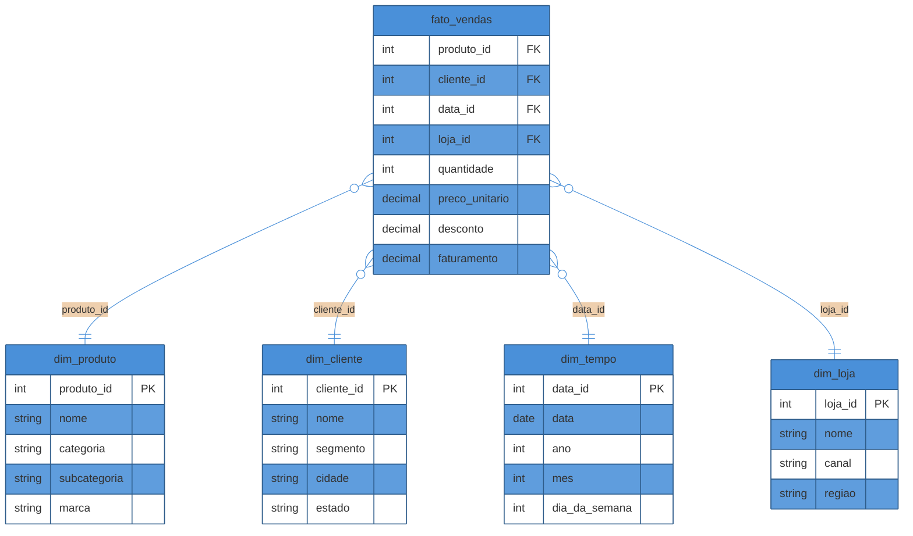

# Modelagem dimensional

> [!abstract] TL;DR
> Modelagem dimensional é a técnica de Ralph Kimball para organizar dado analítico em duas categorias: **fatos** (o que se mede — faturamento, quantidade) e **dimensões** (o contexto que qualifica a medida — qual produto, qual cliente, quando, onde). A fato fica no centro, cada dimensão a um `JOIN` de distância — um **star schema** (esquema estrela). A decisão que precede qualquer outra é o **grão**: o que representa uma linha da fato, declarado antes de escolher uma única coluna. Medidas se comportam diferente em agregação — aditivas somam em qualquer dimensão, semi-aditivas não somam em tempo, não-aditivas nunca somam — e confundir essas categorias produz números de negócio errados sem nenhum erro de sintaxe. Esta nota estabelece o núcleo: fato, dimensão, grão, star schema e os 4 passos de Kimball para desenhar qualquer modelo — aplicados ao exemplo de vendas de um e-commerce.

> [!question]- Perguntas que esta nota responde
> - O que exatamente vai numa tabela-fato e o que vai numa tabela-dimensão — e por que a distinção não é arbitrária?
> - Por que o grão precisa ser decidido antes de qualquer coluna, e por que grão fino é quase sempre a escolha certa?
> - Por que um star schema deixa a mesma pergunta analítica trivial de escrever, quando a versão normalizada exigia cinco `JOIN`s?
> - O que muda entre uma medida aditiva, semi-aditiva e não-aditiva — e por que somar a errada dá um número que parece certo mas é falso?
> - Quais são os 4 passos de Kimball para desenhar um modelo dimensional do zero?

## A pergunta trivial que devia ser difícil

A [[1 - Fundamentos de engenharia de dados/01 - O que é engenharia de dados|nota 01 da trilha]] deixou um problema em aberto: extrair o Postgres de produção para um warehouse resolve a contenção, mas não resolve, sozinho, a pergunta "faturamento por categoria, por mês". Se você simplesmente copiar o esquema normalizado do OLTP — pedidos, itens_pedido, produtos, categorias, cada um em sua tabela — para dentro do warehouse, a query continua precisando dos mesmos cinco `JOIN`s de antes. Você resolveu o problema de *onde* a query roda, mas não o de *como* ela é escrita. A [[01 - Por que modelar pra analytics|nota anterior deste sub-galho]] argumenta por que o modelo normalizado é a estrutura errada para leitura agregada; esta nota resolve o "então qual é a estrutura certa" com um nome e um método: **modelagem dimensional**.

O método tem autor e livro-fonte: Ralph Kimball, em *The Data Warehouse Toolkit*, publicado originalmente em 1996 e hoje na 3ª edição (2013, com Margy Ross)[^kimball]. A ideia central é simples de enunciar e surpreendentemente difícil de aplicar bem na primeira tentativa: **separe o que se mede do que descreve a medida**. Tudo que é número que você soma, conta ou calcula vai para um tipo de tabela. Tudo que é atributo textual por onde você filtra, agrupa ou rotula vai para outro tipo. Essa separação, aplicada com disciplina, produz o desenho mais reconhecível de toda a modelagem analítica: o **star schema**.

## Tabela-fato: o que se mede

Uma **tabela-fato** (*fact table*) guarda as medidas de um processo de negócio — os números que a diretoria quer somar, contar ou comparar — mais as chaves estrangeiras que apontam para o contexto de cada medida. No exemplo do e-commerce: cada linha de item de pedido vendido gera uma linha na fato, com colunas como `quantidade`, `preco_unitario`, `desconto` e `faturamento`, mais chaves para produto, cliente, data e loja.

Duas propriedades definem o formato físico de uma tabela-fato, e as duas seguem diretamente da natureza do que ela guarda:

- **Longa.** Ela cresce a cada evento de negócio que acontece — cada venda, cada clique, cada transação. Uma fato de vendas de um e-commerce ativo acumula milhões ou bilhões de linhas ao longo do tempo, e continua crescendo enquanto o negócio existir. Não há teto natural.
- **Estreita.** Poucas colunas — normalmente as chaves estrangeiras para as dimensões, mais um punhado de medidas numéricas. Não há descrição textual solta na fato: "nome do produto" não mora aqui, mora na dimensão de produto, referenciada por uma chave.

> [!question]- Uma fato pode ter zero medidas?
> Pode, e tem nome: **factless fact table**. Ela guarda só chaves estrangeiras, sem nenhuma coluna numérica — serve para registrar que um *evento* ou uma *relação* aconteceu, não uma quantidade. Exemplo clássico: uma fato que registra "aluno X compareceu à aula Y no dia Z", sem nenhuma medida associada — a própria existência da linha é o fato que importa. Para o e-commerce, um exemplo seria uma fato de "produto visualizado", sem medida nenhuma além da própria ocorrência. Não é o caso do exemplo principal desta nota (vendas tem medidas claras), mas vale saber que o padrão existe.

O DDL simplificado da fato de vendas do e-commerce, já adiantando a seção de exemplo trabalhado:

```sql
CREATE TABLE fato_vendas (
    produto_id     INT REFERENCES dim_produto(produto_id),
    cliente_id     INT REFERENCES dim_cliente(cliente_id),
    data_id        INT REFERENCES dim_tempo(data_id),
    loja_id        INT REFERENCES dim_loja(loja_id),
    quantidade     INT,
    preco_unitario DECIMAL(10,2),
    desconto       DECIMAL(10,2),
    faturamento    DECIMAL(12,2)
);
```

Repare: nenhuma coluna de texto solto. Nome do produto, categoria, cidade do cliente — tudo isso vive do outro lado do `JOIN`, na dimensão.

## Tabela-dimensão: o contexto que qualifica a medida

Uma **tabela-dimensão** (*dimension table*) guarda o contexto descritivo: os atributos por onde alguém vai querer filtrar ("só a categoria Eletrônicos"), agrupar ("por região") ou rotular um relatório ("mostre o nome do produto, não só o ID"). No e-commerce: `dim_produto` (nome, categoria, subcategoria, marca), `dim_cliente` (nome, segmento, cidade, estado), `dim_tempo` (data, ano, mês, dia da semana), `dim_loja` (nome, canal, região).

O formato físico de uma dimensão é o espelho da fato:

- **Larga.** Muitas colunas, quase todas descritivas — texto, categorias, hierarquias (produto → subcategoria → categoria; loja → região → país).
- **Curta.** Uma dimensão de produto de um e-commerce médio tem milhares ou dezenas de milhares de linhas — uma por produto distinto — não milhões. Cresce devagar comparado à fato, que ganha uma linha nova a cada venda.

DDL simplificado de uma dimensão:

```sql
CREATE TABLE dim_produto (
    produto_id   INT PRIMARY KEY,
    nome         VARCHAR(200),
    categoria    VARCHAR(100),
    subcategoria VARCHAR(100),
    marca        VARCHAR(100)
);
```

Repare que `categoria` e `subcategoria` estão **desnormalizadas** dentro de `dim_produto` — de propósito. No modelo OLTP normalizado (onde a teoria mora em [[03-Dominios/Ciência/Banco de Dados/04 - Modelagem e normalização|Banco de Dados 04]]), categoria seria uma tabela própria, referenciada por chave estrangeira, para nunca duplicar o nome da categoria. Aqui, o objetivo é o oposto: eliminar o `JOIN` extra que essa normalização exigiria numa query analítica. O preço dessa escolha — redundância de texto, mais espaço em disco — é pago de bom grado, porque espaço em disco é barato e tempo de consulta é o recurso que se está otimizando.

> [!question]- Isso não devia estar em outra tabela, `dim_categoria`?
> Poderia — e em alguns desenhos está, quando a hierarquia de categoria é complexa o suficiente para merecer sua própria dimensão (por exemplo, se categorias têm atributos próprios, como uma meta de margem por categoria, que não fazem sentido dentro de produto). Quando uma dimensão se desmembra em várias tabelas ligadas por hierarquia, o desenho deixa de ser um star schema puro e vira um **snowflake schema** — a variação coberta em [[03 - Star vs snowflake e tipos de fato]]. Nesta nota, para manter o exemplo no star schema mais simples e didático, categoria fica embutida em `dim_produto`.

Para fixar a distinção entre os dois tipos de tabela numa única referência:

| Característica | Tabela-fato | Tabela-dimensão |
|---|---|---|
| O que guarda | Medidas numéricas + FKs | Atributos descritivos |
| Formato físico | Longa e estreita | Larga e curta |
| Cresce com | Cada evento de negócio (venda, clique) | Cadastro/alteração de entidade (produto novo, cliente novo) |
| Volume típico | Milhões a bilhões de linhas | Milhares a dezenas de milhares de linhas |
| Exemplo no e-commerce | `fato_vendas` | `dim_produto`, `dim_cliente`, `dim_tempo`, `dim_loja` |
| Papel na query | O que se agrega (`SUM`, `COUNT`, `AVG`) | O que filtra e agrupa (`WHERE`, `GROUP BY`) |

### Chaves substitutas: por que `produto_id` na dimensão não é o mesmo ID do OLTP

Repare que `produto_id`, na dimensão de produto do exemplo, é declarado como um inteiro simples — não necessariamente o mesmo ID usado na tabela `produtos` do Postgres de origem. Essa escolha tem nome: **chave substituta** (*surrogate key*), um identificador gerado pelo próprio warehouse, sem significado de negócio, que existe só para servir de chave primária da dimensão e chave estrangeira da fato.

A alternativa óbvia seria reaproveitar a **chave natural** — o ID de produto que já existe no sistema de origem. Kimball recomenda evitar essa alternativa, por uma razão que só fica clara quando uma dimensão muda: se um produto muda de categoria e você precisa manter o histórico de vendas antigas associado à categoria antiga (em vez de reescrever o passado com a categoria nova), a chave natural sozinha não separa "produto X antes da mudança" de "produto X depois da mudança" — as duas versões têm o mesmo ID de origem. Uma chave substituta permite gerar uma linha nova na dimensão a cada mudança relevante, mantendo cada versão do produto como uma entidade distinta para fins de histórico. Esse mecanismo — e quando de fato vale a pena pagar o custo de manter múltiplas versões — é o assunto central de [[04 - Slowly Changing Dimensions]]; aqui basta reter que a separação entre chave substituta (do warehouse) e chave natural (do sistema de origem) é o que torna esse histórico possível.

Vale registrar desde já, sem desenvolver aqui: dimensões **mudam com o tempo**. Um produto muda de categoria, um cliente muda de cidade, uma loja muda de região. O que fazer quando isso acontece — sobrescrever o valor antigo, manter histórico, ou algo entre os dois — é uma decisão de modelagem própria, tratada em [[04 - Slowly Changing Dimensions]]. Por ora, assuma que os atributos de dimensão são estáveis; a nota 04 volta a essa suposição e a desfaz.

## O grão: a decisão mais importante do modelo inteiro

Antes de desenhar uma única coluna de fato ou dimensão, existe uma pergunta que precisa de resposta explícita, por escrito, com a equipe de negócio de acordo: **o que representa uma linha da tabela-fato?** Essa resposta é o **grão** (*grain*), e Kimball a coloca, sem meias palavras, como a decisão mais importante de todo o processo de modelagem dimensional[^kimball].

Para a fato de vendas do e-commerce, algumas respostas possíveis para "o que é uma linha":

- **Uma linha por item de pedido** — o pedido #4821 com 3 itens gera 3 linhas na fato, uma por produto comprado.
- **Uma linha por pedido** — o mesmo pedido gera 1 linha, com quantidade e faturamento já somados entre os itens.
- **Uma linha por dia por produto** — todas as vendas de um produto num dia inteiro, pré-agregadas numa única linha.

Essas três opções não são apenas "mais ou menos detalhadas" — são **modelos diferentes**, que respondem perguntas diferentes com facilidade diferente. Se o grão é "por pedido", a pergunta "quantas unidades da categoria Eletrônicos vendemos" fica impossível de responder direto da fato, porque a informação de produto individual já foi perdida na agregação. Se o grão é "por dia por produto", a pergunta "qual foi o desconto médio por cliente" também fica impossível, porque cliente não aparece nesse grão. O grão determina, de forma irreversível sem reprocessar tudo de novo, **quais perguntas o modelo consegue responder**.

> [!warning] Declarar o grão depois de já ter desenhado as colunas
> **O que acontece:** o time começa a listar medidas e dimensões ("precisamos de faturamento, quantidade, produto, cliente...") e só percebe, na hora de escrever a primeira query real, que não sabe se uma linha da fato é um pedido inteiro ou um item de pedido — e diferentes desenvolvedores assumiram respostas diferentes ao escrever os pipelines de carga.
> **Por quê:** sem o grão declarado primeiro, cada pessoa que toca no modelo assume implicitamente o grão que faz sentido para o problema que ela está resolvendo naquele momento — e essas suposições divergem silenciosamente, porque nada no esquema força a declaração.
> **Como evitar:** escreva o grão em uma frase, antes de qualquer coluna: "uma linha desta fato representa ___". Coloque essa frase como comentário no topo do DDL e na documentação do modelo. Se a frase não sair fácil, é sinal de que o processo de negócio ainda não foi entendido o suficiente para modelar.

A regra prática de Kimball, depois de listar as opções, é quase sempre a mesma: **prefira o grão mais fino disponível — o grão atômico**[^kimball]. Para o e-commerce, isso significa modelar por item de pedido, não por pedido nem por dia agregado. A razão é uma combinação de duas garantias que só o grão atômico oferece:

1. **Toda pergunta futura, mesmo a que ninguém pensou ainda, é respondível.** Se você tem o dado no grão mais fino, sempre pode agregar para cima na hora da query ("some por pedido", "some por dia") — mas nunca pode desagregar algo que já foi somado antes de chegar na fato. Grão fino é uma aposta segura contra perguntas de negócio que ainda não existem.
2. **A dimensionalidade fica completa.** No grão "por item de pedido", cada linha carrega produto, quantidade, preço unitário, desconto daquele item específico — nenhuma dessas informações precisa ser perdida numa pré-agregação. No grão "por pedido", já não há mais como saber qual produto específico gerou qual fatia do faturamento.

O contraponto real é volume: grão atômico gera mais linhas, mais espaço em disco, potencialmente mais tempo de consulta se a query não estiver bem otimizada. Mas armazenamento é, na esmagadora maioria dos casos, mais barato do que a alternativa — perder a capacidade de responder uma pergunta de negócio porque o dado já foi agregado demais cedo demais. Por isso a diretriz de Kimball é tão categórica: comece pelo grão atômico, e só pré-agregue *em cima* dele, para casos de performance específicos, nunca *no lugar* dele.

## Star schema: a fato no centro, as dimensões ao redor

Com fato, dimensão e grão definidos, o desenho físico que emerge naturalmente é o **star schema** (esquema estrela): a tabela-fato no centro, cercada pelas tabelas-dimensão, cada uma ligada à fato por exatamente um `JOIN` — nunca uma dimensão ligada a outra dimensão. Visualmente, com a fato no meio e os "raios" saindo para cada dimensão, o desenho lembra uma estrela — daí o nome.



Duas propriedades tornam o star schema o padrão dominante para servir consultas de BI, e ambas seguem diretamente do desenho "cada dimensão a um `JOIN` de distância":

- **Fácil de entender.** Qualquer pessoa — analista, ferramenta de BI, ou o próprio motor de query — olha o esquema e reconhece imediatamente o que é medida (fato) e o que é contexto (dimensão). Não há ambiguidade sobre onde procurar "nome da categoria" ou "faturamento". Ferramentas de BI (Power BI, Tableau, Looker) literalmente esperam esse formato para gerar filtros e agregações automaticamente.
- **Rápido de consultar.** Como nenhuma dimensão precisa passar por outra dimensão para chegar à fato, o número de `JOIN`s numa query analítica é, na pior das hipóteses, igual ao número de dimensões que a pergunta toca — nunca mais. Comparado ao modelo normalizado, onde uma dimensão como "categoria" podia estar a dois ou três `JOIN`s de distância da fato (produto → categoria, cada um em tabela própria), o star schema achata essa cadeia inteira num único salto.

> [!question]- Por que não simplesmente colocar tudo numa tabela só, sem `JOIN` nenhum?
> Essa opção existe e tem nome — **One Big Table** (OBT) ou tabela larga desnormalizada — e é coberta em [[05 - Além de Kimball]]. O motivo de o star schema ainda ser o padrão dominante, em vez de OBT sempre, é que fatos e dimensões crescem em ritmos e por razões diferentes: a fato ganha uma linha a cada venda, a dimensão de produto muda quando um produto novo é cadastrado ou um atributo é corrigido. Separar as duas evita duplicar toda a informação de produto em cada uma das milhões de linhas de venda daquele produto — e mantém a atualização de um atributo de dimensão (corrigir o nome de uma categoria, por exemplo) como uma operação em uma linha da dimensão, não em milhões de linhas da fato. O `JOIN` que o star schema exige é o preço dessa economia, e motores colunares modernos são desenhados justamente para tornar esse preço baixo.

## Medidas e aditividade: por que nem toda soma é uma soma válida

Nem toda medida numérica de uma fato se comporta da mesma forma quando agregada — e tratar todas como se somassem livremente em qualquer dimensão é uma das formas mais silenciosas de produzir um número de negócio errado, porque a query roda sem erro e devolve um resultado que *parece* plausível. Kimball classifica medidas em três categorias de aditividade[^kimball]:

- **Aditiva.** Soma corretamente em qualquer dimensão do modelo. `faturamento` é o exemplo canônico: somar o faturamento de todos os produtos, de todos os clientes, de todos os dias de um mês — o resultado é sempre um número que significa a mesma coisa, "faturamento total do período". A maioria das medidas de contagem e valor monetário em fatos transacionais é aditiva.
- **Semi-aditiva.** Soma corretamente em algumas dimensões, mas não em tempo. O exemplo clássico é **saldo de estoque**: somar o saldo de estoque de dois produtos diferentes, no mesmo dia, faz sentido — "estoque total daqueles dois produtos hoje". Mas somar o saldo de estoque do mesmo produto ao longo de 30 dias não faz sentido nenhum — o resultado não é "estoque acumulado do mês", é um número sem significado de negócio, porque estoque é uma fotografia de um instante, não um fluxo que se acumula. Para medidas semi-aditivas em tempo, a operação correta costuma ser média ou último valor, nunca soma.
- **Não-aditiva.** Nunca soma, em nenhuma dimensão. Percentuais, razões e preços unitários são os exemplos típicos. `preco_unitario` no exemplo do e-commerce é não-aditivo: somar o preço unitário de 10 itens vendidos não produz "preço unitário total" — produz um número sem sentido nenhum de negócio. Para agregar uma medida não-aditiva, é preciso recalculá-la a partir de componentes aditivos (por exemplo, `faturamento total / quantidade total` para obter um "preço médio", que é uma medida derivada, não a soma da coluna original).

> [!warning] Somar uma coluna não-aditiva porque "a query rodou sem erro"
> **O que acontece:** um relatório soma `preco_unitario` (ou uma coluna de percentual, como taxa de desconto) através de várias linhas da fato, e apresenta o resultado como se fosse um número de negócio válido.
> **Por quê:** SQL não distingue, sintaticamente, uma soma que faz sentido de uma que não faz — `SUM(preco_unitario)` é uma expressão perfeitamente válida, e o banco de dados a executa sem reclamar. A validade da agregação é uma propriedade do **significado de negócio** da medida, não da sintaxe da query, e isso não aparece em lugar nenhum do schema a menos que alguém documente.
> **Como evitar:** documente a aditividade de cada medida junto com a definição da fato (um comentário no DDL, um dicionário de dados, uma anotação na ferramenta de catálogo). Para medidas não-aditivas, prefira nem armazenar a coluna bruta na fato — calcule-a sob demanda a partir de componentes aditivos (`faturamento` e `quantidade`, nesse caso), para que a única forma de obter "preço médio" seja através de uma divisão explícita, nunca de uma soma acidental.

Um exemplo numérico curto deixa o erro concreto. Suponha duas linhas em `fato_vendas`: um item vendido por `preco_unitario = 100` (quantidade 1) e outro por `preco_unitario = 10` (quantidade 5). `SUM(preco_unitario)` devolve `110` — um número que não corresponde a nada que a diretoria pediu. O caminho correto depende do que se quer responder: para "faturamento total", soma-se `faturamento` (aditivo, dá `100 + 50 = 150`); para "preço médio ponderado por unidade vendida", calcula-se `SUM(faturamento) / SUM(quantidade)` (`150 / 6 = 25`), nunca `AVG(preco_unitario)` (que daria `55`, ignorando que uma das vendas teve 5 vezes mais unidades que a outra). A mesma coluna bruta, tratada com a operação errada, produz três respostas diferentes para "qual foi o preço" — e só uma delas corresponde à pergunta de negócio real.

> [!warning] Misturar grãos diferentes na mesma tabela-fato
> **O que acontece:** alguém adiciona, na mesma `fato_vendas` de grão "por item de pedido", uma linha de resumo diário pré-agregado — "total do dia", por conveniência de um relatório específico — sem sinalizar que essa linha tem um grão diferente das demais.
> **Por quê:** qualquer `SUM` subsequente sobre a fato inteira agora conta a mesma venda duas vezes — uma vez nas linhas atômicas, outra na linha de resumo que as agrega. O erro não aparece em testes pontuais (a query "faturamento de um produto específico num dia específico" pode até bater), só aparece quando alguém soma a fato inteira sem filtrar por grão, o que é exatamente o uso mais comum de uma fato.
> **Como evitar:** uma tabela-fato tem exatamente um grão, sem exceção. Se você precisa de uma versão pré-agregada para performance, crie outra fato — uma fato de snapshot separada, com seu próprio grão declarado — em vez de misturar níveis de detalhe na mesma tabela. Esse padrão de fato agregada tem nome próprio e é aprofundado em [[03 - Star vs snowflake e tipos de fato]].

## Os 4 passos de Kimball para desenhar qualquer modelo dimensional

Kimball formaliza o processo de desenho num roteiro de quatro passos, sempre nesta ordem — a ordem importa, porque cada passo depende da resposta do anterior[^kimball]:

1. **Escolher o processo de negócio.** Não "o departamento" nem "o sistema" — o **evento mensurável** que a organização quer acompanhar. "Vendas" é um processo de negócio; "o time comercial" não é. Cada processo de negócio normalmente vira uma fato própria.
2. **Declarar o grão.** A frase "uma linha desta fato representa ___", discutida na seção anterior — decidida antes de qualquer coluna, com o time de negócio de acordo sobre o nível de detalhe.
3. **Identificar as dimensões.** Dado o grão já fixado, quais os "eixos" pelos quais alguém vai querer filtrar ou agrupar essa fato? Para vendas por item de pedido: produto, cliente, data, loja/canal — cada um vira uma tabela-dimensão.
4. **Identificar os fatos (medidas).** Só depois de grão e dimensões fixados, listar os números que cabem nesse grão: quantidade, preço unitário, desconto, faturamento. Se uma medida não faz sentido no grão já declarado (por exemplo, "faturamento total do mês" não cabe no grão "por item de pedido" — é uma agregação, calculada na query, não uma coluna armazenada), ela fica fora da fato.

> [!question]- E se eu descobrir, no passo 4, que preciso de uma dimensão nova?
> Volte ao passo 3. Os quatro passos não são estritamente lineares na prática — é comum ir e voltar entre "que dimensões preciso" e "que medidas preciso" algumas vezes antes de fechar o desenho. O que é rígido é a **ordem de precedência**: processo de negócio e grão vêm sempre antes, porque toda decisão de dimensão e medida depende deles. Mudar o grão depois que dimensões e medidas já foram fixadas costuma exigir refazer o modelo inteiro — por isso o grão é a decisão que se protege com mais cuidado no início.

## Exemplo trabalhado: vendas do e-commerce, do zero ao star schema

Aplicando os quatro passos ao e-commerce da trilha:

**1. Processo de negócio:** vendas — o evento de um item de produto sendo vendido dentro de um pedido pago.

**2. Grão:** uma linha da fato representa **um item de pedido vendido** — se o pedido #4821 tem 3 produtos diferentes, ele gera 3 linhas na fato. Grão atômico, pelas razões discutidas antes.

**3. Dimensões:** `dim_produto` (o que foi vendido), `dim_cliente` (quem comprou), `dim_tempo` (quando), `dim_loja` (onde/por qual canal — loja física ou app).

**4. Fatos (medidas):** `quantidade` (aditiva), `preco_unitario` (não-aditiva), `desconto` (aditiva), `faturamento` (aditiva — já calculado como `quantidade × preco_unitario − desconto`, para não obrigar toda query a refazer essa conta).

O resultado é exatamente o star schema do diagrama da seção anterior. Agora a pergunta que abriu a [[1 - Fundamentos de engenharia de dados/01 - O que é engenharia de dados|nota 01 da trilha]] — "faturamento por categoria, por mês, dos últimos dois anos" — que exigia cinco `JOIN`s contra o modelo normalizado do OLTP, vira isto contra o star schema:

```sql
SELECT
    p.categoria,
    t.ano,
    t.mes,
    SUM(f.faturamento) AS faturamento_total
FROM fato_vendas f
JOIN dim_produto p ON p.produto_id = f.produto_id
JOIN dim_tempo t   ON t.data_id = f.data_id
WHERE t.data >= CURRENT_DATE - INTERVAL '2 years'
GROUP BY p.categoria, t.ano, t.mes
ORDER BY t.ano, t.mes;
```

Dois `JOIN`s — um para chegar à categoria, um para chegar ao mês — contra os quatro ou cinco da versão normalizada original. Nenhum `JOIN` intermediário para "descobrir" a categoria de um produto através de uma tabela própria de categorias: ela já está desnormalizada dentro de `dim_produto`. E se a pergunta mudar amanhã para "faturamento por segmento de cliente, por região da loja", a estrutura da query não muda — só troca qual dimensão entra no `JOIN` e no `GROUP BY`, porque toda dimensão está a exatamente um salto da fato. É essa previsibilidade — mesma forma de query, dimensão trocada — que faz o star schema ser tão amigável para ferramentas de BI, que literalmente geram esse tipo de query automaticamente a partir de cliques do usuário.

Em uma frase: **modelagem dimensional em uma frase: separe medida de contexto, declare o grão antes de tudo, e deixe cada dimensão a um `JOIN` da fato — o resto do desenho segue disso.**

## O que o star schema básico ainda não resolve

Duas perguntas ficam deliberadamente de fora desta nota, porque merecem tratamento próprio:

A primeira é **variação do próprio star schema**: quando uma dimensão é desmembrada em várias tabelas ligadas por hierarquia (o *snowflake schema*), e os diferentes tipos de fato além da transação simples que este exemplo cobriu — fato de snapshot periódico (uma fotografia do saldo de estoque a cada dia, por exemplo — voltando à medida semi-aditiva discutida acima) e fato de snapshot acumulativo (que acompanha um processo com múltiplas etapas, como o ciclo de vida de um pedido do carrinho à entrega). Essas variações — e quando cada uma se justifica — são o assunto de [[03 - Star vs snowflake e tipos de fato]].

A segunda é o que fazer quando uma dimensão **muda**: um produto troca de categoria, um cliente muda de cidade, uma loja é remodelada e muda de canal. Sobrescrever o valor antigo ou preservar o histórico é uma decisão de modelagem com nome e taxonomia próprios — **Slowly Changing Dimensions** — coberta em [[04 - Slowly Changing Dimensions]].

## Em entrevista

Uma pergunta de sistema comum em entrevistas de data engineering: "desenhe um modelo de dados para analytics de vendas de um e-commerce." A resposta que soa júnior lista tabelas soltas sem justificar a ordem: "eu teria uma tabela de vendas, uma de produtos, uma de clientes". A resposta sênior segue os quatro passos de Kimball na ordem certa, verbalizando cada decisão: primeiro nomeia o processo de negócio ("vendas"), depois declara o grão explicitamente ("uma linha por item de pedido, porque quero poder desagregar por produto e não perder granularidade") e só então lista dimensões e medidas — deixando claro que o grão foi uma escolha deliberada, não um acidente de implementação.

Uma pergunta que aparece com frequência para testar profundidade: "qual a diferença entre uma tabela-fato e uma tabela-dimensão, em termos de tamanho e forma?" A resposta fraca fica no nível "fato tem números, dimensão tem texto". A resposta forte amarra forma física a comportamento de crescimento: "fato é longa e estreita, porque ganha uma linha a cada evento de negócio e cresce sem teto; dimensão é larga e curta, porque cresce devagar — uma linha por entidade distinta, não por evento — e carrega os atributos que uma ferramenta de BI usa para filtrar e rotular."

Uma terceira pergunta, mais avançada, testa se o candidato entende o motivo por trás da regra, não só a regra: "por que preferir o grão mais fino possível, se isso significa mais linhas e mais espaço em disco?" A resposta madura reconhece o trade-off nomeado explicitamente — espaço em disco é barato, mas informação perdida numa agregação prematura não volta — e cita que qualquer pergunta futura ainda desconhecida continua respondível a partir do grão atômico, o que não é verdade para dado já pré-agregado.

## How to explain in English

> "Dimensional modeling separates what you measure from what describes the measurement. Fact tables hold numeric measures — revenue, quantity — plus foreign keys to dimensions; they're long and narrow, growing with every business event. Dimension tables hold descriptive context — product, customer, date, store; they're wide and short. The single most important decision is the grain: what one row of the fact table represents, declared before a single column is designed. Get that right, keep every dimension one join away from the fact — a star schema — and the same aggregation query that took five joins against a normalized OLTP schema collapses to one or two."

| PT | EN |
|----|----|
| Modelagem dimensional | Dimensional modeling |
| Tabela-fato | Fact table |
| Tabela-dimensão | Dimension table |
| Grão | Grain |
| Esquema estrela | Star schema |
| Medida aditiva | Additive measure |
| Medida semi-aditiva | Semi-additive measure |
| Medida não-aditiva | Non-additive measure |
| Chave estrangeira | Foreign key |
| Grão atômico | Atomic grain |
| Fato sem medida | Factless fact table |
| Processo de negócio | Business process |

## O que vem a seguir

O star schema desta nota é o desenho básico — uma fato, dimensões desnormalizadas, grão atômico. Na prática, dimensões às vezes se desmembram em hierarquias próprias, e nem todo processo de negócio se modela como uma simples transação: alguns pedem uma fotografia periódica do estado (estoque), outros pedem acompanhar um processo de múltiplas etapas do início ao fim (o ciclo de um pedido). Esses dois eixos de variação — a forma do schema e o tipo de fato — são o próximo degrau.

- [[03 - Star vs snowflake e tipos de fato]] — quando desmembrar uma dimensão em snowflake, e os três tipos de fato (transaction, periodic snapshot, accumulating snapshot)
- [[04 - Slowly Changing Dimensions]] — o que fazer quando o contexto descrito por uma dimensão muda no tempo

## Fontes

- Kimball, Ralph & Ross, Margy — *The Data Warehouse Toolkit: The Definitive Guide to Dimensional Modeling*, 3ª edição, Wiley, 2013 — fonte canônica de todo o vocabulário desta nota: fato, dimensão, grão, star schema, os 4 passos de desenho e a taxonomia de aditividade de medidas.
- Kimball Group — [*Kimball Dimensional Modeling Techniques*](https://www.kimballgroup.com/data-warehouse-business-intelligence-resources/kimball-techniques/) — resumo de referência, mantido pelo grupo fundado por Ralph Kimball, com a lista atualizada de técnicas de modelagem dimensional.
- Kimball Group — [*Declare the Grain*](https://www.kimballgroup.com/2003/06/declare-the-grain/), Design Tip, 2003 — artigo curto e específico sobre por que declarar o grão é o primeiro passo, não um detalhe posterior.

[^kimball]: Kimball & Ross, *The Data Warehouse Toolkit*, 3ª edição, Wiley, 2013 — capítulos 1-3 cobrem os 4 passos, o grão e a taxonomia de aditividade de medidas.
