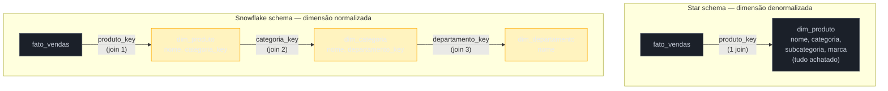
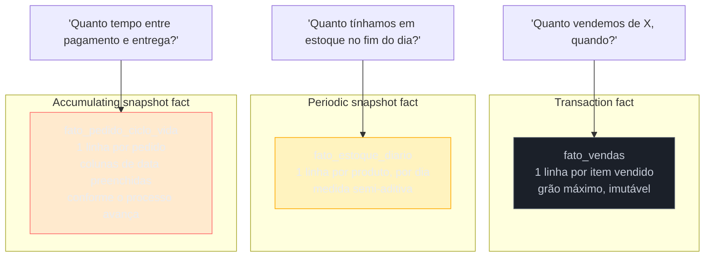
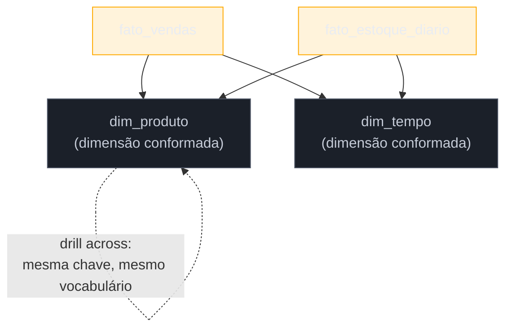

# Star vs snowflake e tipos de fato

> [!abstract] TL;DR
> A nota anterior estabeleceu fato, dimensão e grão — o vocabulário mínimo da modelagem dimensional ([[02 - Modelagem dimensional]]). Esta nota cobre as **variações** que aparecem assim que você começa a modelar de verdade. Primeiro, a escolha estrutural entre **star schema** (dimensão denormalizada, uma tabela só) e **snowflake schema** (dimensão normalizada em sub-tabelas): o consenso de Kimball é preferir star quase sempre, porque o espaço economizado pelo snowflake não compensa o custo em joins e legibilidade. Segundo, os **três tipos clássicos de tabela-fato** — transaction, periodic snapshot e accumulating snapshot — que respondem a naturezas diferentes de pergunta de negócio, ilustrados com o ciclo vendas/estoque/pedido de um e-commerce. Terceiro, **dimensões conformadas** e a **bus matrix**, o mecanismo que permite comparar processos de negócio diferentes sem reconstruir cada dimensão do zero. Fecha com um trio de dimensões especiais — degenerada, junk e role-playing — que resolvem casos de borda comuns sem inflar o modelo.

> [!question]- Perguntas que esta nota responde
> - Qual a diferença real entre star schema e snowflake schema, e quando cada um se justifica?
> - Por que Kimball recomenda star quase sempre, mesmo sabendo que ele "desperdiça" espaço com redundância?
> - O que diferencia um fato transacional de um fato de snapshot periódico e de um fato de snapshot acumulado — e quando usar cada um?
> - O que é uma dimensão conformada, e por que ela é a base da consistência entre relatórios diferentes?
> - O que é a bus matrix de Kimball, e para que ela serve no planejamento de um warehouse?
> - O que são dimensão degenerada, junk dimension e role-playing dimension?

## O modelo cresce, e a primeira decisão aparece

Depois de fechar o grão e desenhar a primeira tabela de fatos com suas dimensões — o trabalho da nota anterior —, a próxima decisão prática de quem está modelando um data mart de verdade costuma ser esta: a dimensão `dim_produto` guarda categoria, subcategoria e marca do produto. Essas três informações moram em outras entidades no mundo operacional — categoria tem seu próprio cadastro, subcategoria também, marca também. **Elas viram colunas dentro de `dim_produto`, ou viram tabelas próprias, ligadas por chave estrangeira?**

A resposta parece, à primeira vista, uma questão de gosto ou de "boas práticas de modelagem" — o reflexo de quem vem do mundo OLTP é normalizar, porque foi isso que qualquer curso de banco de dados ensinou como certo (a teoria completa está em [[03-Dominios/Ciência/Banco de Dados/04 - Modelagem e normalização|Banco de Dados 04]]). Mas em modelagem dimensional essa resposta tem um nome, um trade-off conhecido, e uma recomendação bastante assertiva de Kimball — que é exatamente o que esta nota desenvolve antes de seguir para os tipos de fato e as dimensões compartilhadas entre processos.

## Star schema: a dimensão como uma tabela só

No **star schema** (esquema estrela), cada dimensão é **uma única tabela desnormalizada**. `dim_produto` traz, na mesma linha, o nome do produto, sua categoria, sua subcategoria e sua marca — tudo achatado, sem tabelas satélite. O nome vem do desenho visual: uma tabela de fatos no centro, ligada diretamente a cada dimensão ao redor, formando uma estrela.

```sql
-- dim_produto no formato star: tudo em uma linha
CREATE TABLE dim_produto (
    produto_key       INTEGER PRIMARY KEY,   -- surrogate key
    produto_id_origem VARCHAR,               -- chave natural do OLTP
    nome_produto       VARCHAR,
    categoria          VARCHAR,               -- achatado, não é FK
    subcategoria        VARCHAR,               -- achatado, não é FK
    marca               VARCHAR                -- achatado, não é FK
);
```

Uma consulta que soma vendas por categoria precisa de **um único join** entre `fato_vendas` e `dim_produto` — nada além disso, porque categoria já é uma coluna na própria dimensão.

## Snowflake schema: a dimensão normalizada em sub-tabelas

No **snowflake schema** (esquema floco de neve), a mesma dimensão é quebrada em uma cadeia de tabelas normalizadas: `dim_produto` guarda só o que é do produto em si e uma chave estrangeira para `dim_categoria`; `dim_categoria`, por sua vez, guarda só o nome da categoria e uma chave estrangeira para `dim_departamento`. O nome também vem do desenho: a dimensão, em vez de um retângulo só ligado à fato, se ramifica em galhos — como os braços de um floco de neve.

```sql
-- mesma informação, formato snowflake: normalizada em cadeia
CREATE TABLE dim_produto (
    produto_key        INTEGER PRIMARY KEY,
    produto_id_origem  VARCHAR,
    nome_produto        VARCHAR,
    categoria_key       INTEGER REFERENCES dim_categoria(categoria_key)
);

CREATE TABLE dim_categoria (
    categoria_key       INTEGER PRIMARY KEY,
    nome_categoria       VARCHAR,
    departamento_key     INTEGER REFERENCES dim_departamento(departamento_key)
);

CREATE TABLE dim_departamento (
    departamento_key     INTEGER PRIMARY KEY,
    nome_departamento     VARCHAR
);
```

A mesma consulta — soma de vendas por categoria — agora precisa de **três joins**: `fato_vendas` → `dim_produto` → `dim_categoria`. E se a pergunta subir um nível, para departamento, é um join a mais ainda.

O diagrama abaixo contrasta as duas formas para a mesma informação:



## O trade-off, e por que Kimball prefere star

A tentação de normalizar a dimensão vem de um instinto correto em outro contexto: normalização evita redundância e anomalia de atualização — se o nome de uma categoria muda, no snowflake você atualiza uma linha em `dim_categoria`; no star, você teria a mesma string repetida em toda linha de `dim_produto` que pertence àquela categoria, e precisaria atualizar todas de uma vez (ou aceitar a redundância como parte do desenho).

Só que esse instinto, aqui, resolve o problema errado. Kimball é explícito: **o espaço economizado pela normalização de uma dimensão é irrelevante** diante do volume de uma tabela de fatos — dimensões são, por natureza, muito menores que fatos (milhares ou milhões de linhas de dimensão contra bilhões de linhas de fato), então normalizar a dimensão economiza uma fração insignificante do espaço total do warehouse. Em troca dessa economia mínima, o snowflake paga um preço real e recorrente:

| Critério | Star | Snowflake |
|---|---|---|
| Joins para uma pergunta simples | 1 por dimensão | N por dimensão (um por nível de hierarquia) |
| Legibilidade da query | Alta — quem escreve não precisa saber a hierarquia interna | Baixa — precisa conhecer a cadeia de tabelas satélite |
| Performance de leitura agregada | Melhor — menos joins, motor colunar aproveita melhor | Pior — cada join extra custa, mesmo em warehouse colunar |
| Espaço em disco | Maior (redundância deliberada) | Menor (normalizado) |
| Facilidade para ferramentas de BI navegarem | Alta — a maioria assume star por padrão | Menor — hierarquias profundas confundem alguns geradores de SQL automático |
| Custo de manutenção de atualização em massa | Requer reescrever várias linhas se um atributo muda | Requer atualizar uma linha só |

**A recomendação de Kimball, resumida**: modele em star sempre que possível. O ganho em legibilidade e velocidade de consulta — que é literalmente o motivo de existir um data warehouse separado do OLTP, como a nota anterior e a de abertura da trilha estabeleceram — supera de longe a economia marginal de espaço que motivaria normalizar. Um analista escrevendo uma query ad hoc, ou uma ferramenta de BI gerando SQL automaticamente a partir de cliques, lida muito melhor com "uma tabela, uma junção" do que com uma cadeia de tabelas satélite cuja hierarquia ele precisa conhecer de antemão.

> [!question]- Então o snowflake nunca se justifica?
> Existem dois cenários legítimos, e vale reconhecê-los em vez de tratar star como regra absoluta sem exceção. **Primeiro**: uma dimensão gigantesca com um atributo de baixíssima cardinalidade repetido — por exemplo, uma dimensão de produto com milhões de linhas, onde uma sub-hierarquia (país de fabricação, digamos) muda raramente e é reusada por múltiplas dimensões diferentes; normalizar só essa fatia específica pode valer a pena. **Segundo**: uma hierarquia muito profunda e muito estável, reusada por várias dimensões-irmãs, onde manter a consistência centralizada (atualizar o nome do departamento em um lugar só) importa mais do que a velocidade de uma query pontual — geografia (país → estado → cidade) é o exemplo clássico, às vezes normalizada como `dim_geografia` separada mesmo dentro de um esquema majoritariamente star. Fora desses casos pontuais, a orientação segue sendo star por padrão — e mesmo nesses casos, muitos times preferem resolver com uma tabela de "outrigger" isolada, mantendo o resto do modelo em star puro, a snowflakar a dimensão inteira.

> [!warning] Normalizar a dimensão "porque é boa prática"
> **O que acontece:** alguém vindo de OLTP modela `dim_produto` já normalizada em `dim_categoria` e `dim_departamento`, por reflexo — é assim que se modela banco de dados "direito". **Por quê:** o reflexo de normalizar existe para proteger a integridade da escrita frequente e concorrente — exatamente a preocupação que não existe numa dimensão de warehouse, que é escrita ocasionalmente (via pipeline, em lote) e lida constantemente, por muitas queries agregadas diferentes. **Como evitar:** pergunte "essa dimensão vai ser lida por quem escreve SQL ad hoc ou por ferramenta de BI automática?" quase sempre a resposta pede star. Reserve o snowflake para os dois cenários legítimos descritos acima — não como padrão.

## Os três tipos de tabela-fato

Enquanto a decisão star vs snowflake muda a forma da **dimensão**, existe outra decisão que muda a forma da própria **tabela de fatos**: que tipo de fato ela é. Kimball descreve três padrões que cobrem a esmagadora maioria dos casos reais — e reconhecer qual deles uma pergunta de negócio pede é tão importante quanto acertar o grão (assunto da nota anterior).

### Transaction fact — uma linha por evento atômico

O **fato transacional** é o mais comum e o mais granular dos três: **uma linha por evento discreto**, no momento exato em que ele acontece. No e-commerce, cada item de um pedido gera uma linha em `fato_vendas` — produto, quantidade, preço, o cliente que comprou, a data da venda. O evento não se repete: uma vez registrado, ele não muda (salvo estorno, tratado como evento novo, não como edição do original).

```sql
-- fato_vendas: uma linha por item de pedido vendido
CREATE TABLE fato_vendas (
    data_key      INTEGER REFERENCES dim_tempo(data_key),
    produto_key   INTEGER REFERENCES dim_produto(produto_key),
    cliente_key   INTEGER REFERENCES dim_cliente(cliente_key),
    pedido_id     VARCHAR,        -- dimensão degenerada, ver adiante
    quantidade    INTEGER,
    preco_unitario NUMERIC,
    valor_total    NUMERIC
);
```

É o tipo de fato ideal para perguntas do tipo "quanto vendemos de X, quando, para quem" — a granularidade máxima permite qualquer agregação por cima (soma por dia, por categoria, por cliente), porque nada foi pré-agregado na hora de gravar.

### Periodic snapshot fact — uma linha por período por entidade

O **fato de snapshot periódico** registra, em vez de um evento, **um estado a cada período fixo** — uma linha por dia, por semana ou por mês, por entidade monitorada. No e-commerce, o exemplo natural é o **saldo de estoque**: perguntar "quanto vendemos" é uma pergunta de transação, mas perguntar "quanto tínhamos em estoque no fim de cada dia" não é — estoque não é um evento que acontece uma vez, é um **nível** que existe em todo instante, e só faz sentido capturá-lo em cortes regulares de tempo.

```sql
-- fato_estoque_diario: uma linha por produto, por dia
CREATE TABLE fato_estoque_diario (
    data_key       INTEGER REFERENCES dim_tempo(data_key),
    produto_key    INTEGER REFERENCES dim_produto(produto_key),
    saldo_final     INTEGER,    -- quantidade em estoque no fim do dia
    valor_estocado   NUMERIC     -- saldo_final × custo unitário
);
```

Esse tipo de fato é particularmente útil para **medidas semi-aditivas** — grandezas que fazem sentido somar por algumas dimensões, mas não por todas. Saldo de estoque soma corretamente entre produtos diferentes num mesmo dia ("quanto temos em estoque hoje, no total"), mas **não** soma corretamente entre dias diferentes ("quanto tínhamos em estoque na semana inteira" não é a soma dos sete saldos diários — é, no máximo, uma média ou o valor do último dia). O mesmo padrão vale para saldo de conta bancária, snapshot de assinaturas ativas, ou qualquer "quantidade que existe" em vez de "evento que aconteceu".

### Accumulating snapshot fact — uma linha por instância de processo, atualizada em cada marco

O **fato de snapshot acumulado** é o mais incomum dos três, e o que gera mais confusão em quem está aprendendo modelagem dimensional pela primeira vez: ele modela **um processo com início, meio e fim previsíveis**, com **uma linha por instância** do processo, e essa linha vai sendo **atualizada** (não inserida de novo) conforme o processo avança por seus marcos.

O exemplo canônico no e-commerce é o **ciclo de vida do pedido**: um pedido nasce, é pago, é enviado, é entregue — quatro marcos, cada um com sua própria data. Em vez de quatro linhas separadas (uma por evento, como seria num fato transacional), o accumulating snapshot usa **uma linha por pedido**, com uma coluna de data para cada marco — e essas colunas começam nulas, sendo preenchidas conforme o pedido avança.

```sql
-- fato_pedido_ciclo_vida: uma linha por pedido, atualizada a cada marco
CREATE TABLE fato_pedido_ciclo_vida (
    pedido_id           VARCHAR PRIMARY KEY,
    data_criacao_key     INTEGER REFERENCES dim_tempo(data_key),
    data_pagamento_key    INTEGER REFERENCES dim_tempo(data_key),  -- NULL até ser pago
    data_envio_key        INTEGER REFERENCES dim_tempo(data_key),  -- NULL até ser enviado
    data_entrega_key      INTEGER REFERENCES dim_tempo(data_key),  -- NULL até ser entregue
    valor_pedido          NUMERIC,
    dias_ate_pagamento     INTEGER,  -- calculado quando data_pagamento_key é preenchida
    dias_ate_envio          INTEGER,
    dias_ate_entrega        INTEGER
);
```

Isso é exatamente o que faz esse tipo de fato ser tão bom para medir **lead time entre etapas de um processo**: "quantos dias, em média, entre pagamento e envio?" é uma pergunta que o accumulating snapshot responde com uma subtração direta entre duas colunas da mesma linha — sem precisar juntar quatro linhas de eventos separados e calcular a diferença entre elas, que seria o caminho (mais custoso e mais propenso a erro) se o mesmo processo fosse modelado como fato transacional.

> [!warning] Tentar responder lead time com um fato transacional
> **O que acontece:** o time modela o ciclo do pedido como quatro linhas em `fato_vendas` (criado, pago, enviado, entregue) e depois tenta calcular "tempo até o envio" com um self-join complicado, procurando o par de linhas do mesmo pedido em estados diferentes. **Por quê:** fato transacional é ótimo para "o que aconteceu e quando", mas péssimo para "quanto tempo passou entre duas coisas que aconteceram com a mesma entidade" — a pergunta de lead time atravessa múltiplos eventos da mesma instância, e é justamente esse atravessamento que o accumulating snapshot resolve de fábrica, com uma linha por instância e colunas de data lado a lado. **Como evitar:** quando a pergunta de negócio é sobre **duração entre marcos de um processo com fim previsível** (pedido, ticket de suporte, esteira de aprovação de crédito), modele como accumulating snapshot desde o início — não tente extrair lead time de um fato transacional depois que ele já está em produção.

### As três lado a lado, no mesmo domínio de e-commerce



| Tipo de fato | Granularidade | Atualização | Pergunta que responde bem | Exemplo no e-commerce |
|---|---|---|---|---|
| Transaction | Um evento atômico | Insert-only, nunca atualiza | "O que aconteceu, quando, quanto" | Item de pedido vendido |
| Periodic snapshot | Uma entidade, por corte de tempo fixo | Insert periódico (uma linha nova por período) | "Qual o nível/saldo em cada momento" (medidas semi-aditivas) | Saldo de estoque no fim de cada dia |
| Accumulating snapshot | Uma instância de processo | Update repetido na mesma linha, a cada marco | "Quanto tempo entre etapas de um processo" | Ciclo de vida do pedido (criado → pago → enviado → entregue) |

## Dimensões conformadas: a mesma dimensão em múltiplos fatos

Um e-commerce raramente tem uma tabela de fatos só. Ao lado de `fato_vendas`, existe `fato_estoque_diario`; talvez exista também `fato_devolucoes`, `fato_avaliacoes`. A pergunta que surge naturalmente é: cada tabela de fatos precisa da sua própria `dim_produto`, ou elas compartilham a mesma?

A resposta de Kimball é o conceito de **dimensão conformada** (*conformed dimension*): a mesma dimensão — com as mesmas chaves substitutas (surrogate keys), os mesmos atributos, os mesmos valores — é **reutilizada por múltiplas tabelas de fatos**. `dim_produto` é uma dimensão só, e tanto `fato_vendas` quanto `fato_estoque_diario` referenciam exatamente essa mesma tabela via `produto_key`.

O benefício concreto disso é o **drill across**: a capacidade de comparar processos de negócio diferentes na mesma consulta, porque eles falam da mesma dimensão com o mesmo vocabulário. "Qual categoria vende mais em proporção ao estoque médio que mantém?" é uma pergunta que atravessa `fato_vendas` e `fato_estoque_diario` — e ela só é trivial de responder porque as duas tabelas usam a mesma `dim_produto`, com a mesma `produto_key` e a mesma definição de categoria. Se cada fato tivesse sua própria versão da dimensão produto — com categorias nomeadas ou codificadas de formas ligeiramente diferentes —, comparar os dois processos exigiria primeiro reconciliar as duas versões da dimensão, um trabalho de "tradução" que devia ter sido resolvido uma vez, na modelagem, não repetido a cada análise.



Isso não significa que toda dimensão precisa ser idêntica em todo lugar — `fato_estoque_diario` talvez use só um subconjunto dos atributos de `dim_produto` (não precisa de todos os atributos de marketing, por exemplo). Kimball chama isso de conformidade **parcial**: os atributos compartilhados batem exatamente; os atributos extras, quando existem só em um contexto, não quebram a conformidade, desde que a interseção seja consistente.

## A bus matrix: planejando a reutilização antes de modelar

Reconhecer, depois do fato, que duas dimensões deveriam ter sido a mesma é um retrabalho caro — significa migrar chaves, reconciliar histórico, reescrever pipelines. Kimball propõe uma ferramenta de **planejamento**, não de modelagem em si, para evitar esse problema: a **bus matrix** (matriz de barramento, numa tradução literal que raramente é usada — o termo em português corrente é o mesmo, "bus matrix" ou "matriz de processos").

A ideia é simples de descrever e poderosa na prática: uma tabela onde as **linhas são os processos de negócio** (vendas, estoque, devoluções, atendimento ao cliente, marketing) e as **colunas são as dimensões candidatas** (produto, tempo, cliente, loja, funcionário). Cada célula marca se aquele processo usa aquela dimensão.

| Processo de negócio | dim_produto | dim_tempo | dim_cliente | dim_loja | dim_funcionario |
|---|---|---|---|---|---|
| Vendas | X | X | X | X | X |
| Estoque diário | X | X | | X | |
| Devoluções | X | X | X | X | X |
| Atendimento ao cliente | | X | X | | X |
| Campanhas de marketing | X | X | X | | |

O valor da matriz aparece antes de qualquer linha de SQL ser escrita: ela deixa visível, de uma vez, que `dim_produto`, `dim_tempo` e `dim_cliente` são candidatas fortes a dimensão conformada — aparecem em quase todo processo — enquanto `dim_funcionario` é mais localizada. Times que modelam processo por processo, sem essa visão de conjunto, acabam criando uma `dim_cliente` para vendas e outra ligeiramente diferente para atendimento, porque cada equipe modelou isoladamente — exatamente o problema que a bus matrix existe para prevenir, ao forçar a pergunta "essa dimensão já existe em outro processo?" antes de criar uma nova.

> [!question]- A bus matrix substitui um modelo de dados corporativo único, ao estilo Inmon?
> Não — é o contraponto bottom-up dessa ideia. Kimball não propõe modelar a empresa inteira de uma vez, de cima para baixo, antes de entregar qualquer data mart (a abordagem associada a Inmon, mencionada na nota de abertura da trilha). A bus matrix permite construir **um data mart de cada vez**, por processo de negócio, e ainda assim garantir que eles se encaixem como peças do mesmo quebra-cabeça — porque as dimensões compartilhadas foram planejadas com antecedência, mesmo que implementadas aos poucos. É arquitetura incremental com integração garantida, não arquitetura monolítica de uma vez só.

## Três dimensões especiais, resolvendo casos de borda comuns

Fechando o vocabulário desta nota, três padrões nomeados por Kimball que resolvem situações que aparecem com frequência e mereceriam, sem eles, soluções improvisadas e inconsistentes entre times:

**Degenerate dimension (dimensão degenerada)** — um atributo que parece dimensão (tem cara de "chave de negócio"), mas não tem atributos próprios que justifiquem uma tabela de dimensão separada. O número do pedido é o exemplo clássico: ele identifica o pedido, aparece em `fato_vendas` como uma coluna comum (sem chave estrangeira para lugar nenhum), e serve para agrupar os itens de um mesmo pedido — mas não existe uma "`dim_pedido`" com atributos próprios, porque tudo que descreve o pedido (cliente, data, loja) já é modelado como dimensões separadas.

**Junk dimension (dimensão de "miudezas")** — quando um fato acumula várias flags e indicadores de baixa cardinalidade (pedido veio de cupom? sim/não; forma de pagamento à vista ou parcelado; canal de venda site ou app), agrupar todos eles numa única dimensão "junk" evita poluir a tabela de fatos com múltiplas colunas booleanas soltas ou criar uma dimensão minúscula para cada flag isolada. A junk dimension combina essas flags numa tabela pequena, com uma linha para cada combinação observada.

**Role-playing dimension (dimensão com múltiplos papéis)** — a mesma dimensão física é referenciada mais de uma vez pelo mesmo fato, desempenhando papéis diferentes. `dim_tempo` é o exemplo mais comum: `fato_pedido_ciclo_vida`, visto acima, referencia `dim_tempo` quatro vezes — uma para `data_criacao_key`, outra para `data_pagamento_key`, outra para `data_envio_key`, outra para `data_entrega_key`. É a mesma tabela física, mas cada referência representa um papel diferente — e ferramentas de BI costumam precisar de um "alias" (uma view ou um apelido) para cada papel, para não confundir qual instância de `dim_tempo` está sendo usada em cada join.

## Em entrevista

A pergunta mais comum sobre este tema em entrevista técnica de dados é direta: "qual a diferença entre star e snowflake, e qual você usaria?" A resposta fraca descreve só a forma ("star é achatado, snowflake é normalizado"). A resposta forte amarra a forma ao trade-off e à recomendação prática: "eu modelaria em star por padrão, porque a economia de espaço que o snowflake oferece é irrelevante perto do volume de uma tabela de fatos, e o custo em joins extras prejudica tanto a performance quanto a legibilidade para quem escreve query ad hoc ou para ferramentas de BI. Eu só normalizaria uma dimensão específica se ela fosse enorme e tivesse uma sub-hierarquia estável e muito reusada."

Outra pergunta frequente, mais situacional: "como você modelaria o estoque de um produto ao longo do tempo?" — testando se o candidato reconhece que essa não é uma pergunta de fato transacional. A resposta madura nomeia diretamente o periodic snapshot fact, explica por que estoque é uma medida de nível (não de evento) e por que ela é semi-aditiva — soma entre produtos, não soma entre dias.

Uma terceira pergunta, típica de entrevista mais avançada de arquitetura de dados: "como você mediria o tempo médio entre pedido feito e pedido entregue, num warehouse com milhões de pedidos?" A resposta fraca tenta calcular isso a partir de eventos separados, com self-joins. A resposta forte nomeia o accumulating snapshot fact desde o início — uma linha por pedido, colunas de data para cada marco, cálculo de lead time como subtração direta entre colunas da mesma linha — e explica por que esse desenho evita o self-join custoso que a alternativa exigiria.

Por fim, vale estar preparado para a pergunta sobre consistência entre relatórios: "o time de vendas e o time de estoque publicam números de produto que às vezes não batem — o que pode estar errado?" A resposta madura aponta para ausência de dimensões conformadas: se `fato_vendas` e `fato_estoque_diario` não compartilham a mesma `dim_produto`, com as mesmas chaves e a mesma taxonomia de categoria, drill across entre os dois processos vai gerar inconsistência — e a correção estrutural é conformar a dimensão, não corrigir número a número em cada relatório.

## How to explain in English

> "Star schema flattens each dimension into a single denormalized table; snowflake schema normalizes a dimension into a chain of related tables. Kimball's guidance is to prefer star almost always — the disk space saved by normalizing a dimension is negligible compared to a fact table's volume, while the extra joins snowflake requires hurt both query performance and readability. On the fact side, transaction facts capture one row per atomic event, periodic snapshot facts capture one row per entity per fixed time period — useful for semi-additive measures like inventory balance — and accumulating snapshot facts capture one row per process instance, with date columns filled in as the process reaches each milestone, which makes lead-time measurement a simple column subtraction instead of a costly self-join. Conformed dimensions — the same dimension table shared across multiple fact tables — are what makes drill-across between business processes possible, and the bus matrix is the planning tool that identifies which dimensions should be conformed before any data mart is built."

| PT | EN |
|----|----|
| Esquema estrela | Star schema |
| Esquema floco de neve | Snowflake schema |
| Dimensão desnormalizada | Denormalized dimension |
| Fato transacional | Transaction fact |
| Fato de snapshot periódico | Periodic snapshot fact |
| Fato de snapshot acumulado | Accumulating snapshot fact |
| Medida semi-aditiva | Semi-additive measure |
| Tempo de espera / prazo entre etapas | Lead time |
| Dimensão conformada | Conformed dimension |
| Comparar processos entre fatos diferentes | Drill across |
| Matriz de processos de negócio | Bus matrix |
| Dimensão degenerada | Degenerate dimension |
| Dimensão de miudezas / indicadores | Junk dimension |
| Dimensão com múltiplos papéis | Role-playing dimension |
| Chave substituta | Surrogate key |

## O que vem a seguir

Esta nota fechou o vocabulário estrutural da modelagem dimensional: como formatar a dimensão (star vs snowflake), como formatar o fato (os três tipos clássicos), e como planejar o reuso entre processos (dimensões conformadas, bus matrix). Falta um problema que todo modelo dimensional enfrenta mais cedo ou mais tarde e que nenhum dos conceitos vistos até aqui resolve: **dimensões mudam com o tempo**. Um produto muda de categoria, um cliente muda de endereço, um funcionário muda de cargo — e a pergunta "eu quero ver o histórico como ele era, ou como ele é agora?" tem várias respostas possíveis, cada uma com sua própria técnica.

- [[04 - Slowly Changing Dimensions]] — os padrões SCD (tipos 0 a 6), chaves substitutas como mecanismo de versionamento, e o problema das dimensões que chegam atrasadas

## Fontes

- Kimball, Ralph & Ross, Margy — *The Data Warehouse Toolkit: The Definitive Guide to Dimensional Modeling*, 3ª edição, Wiley, 2013 — fonte canônica de star vs snowflake, dos três tipos de fato, de dimensões conformadas e da bus matrix.
- Kimball Group — *Kimball Dimensional Modeling Techniques* (kimballgroup.com/data-warehouse-business-intelligence-resources/kimball-techniques/) — compêndio de referência rápida das técnicas, incluindo dimensões degeneradas, junk e role-playing.
- Ross, Margy & Kimball, Ralph — *The Kimball Group Reader: Relentlessly Practical Tools for Data Warehousing and Business Intelligence*, 2ª edição, Wiley, 2015 — coletânea de artigos originais sobre bus matrix e conformidade de dimensões.
