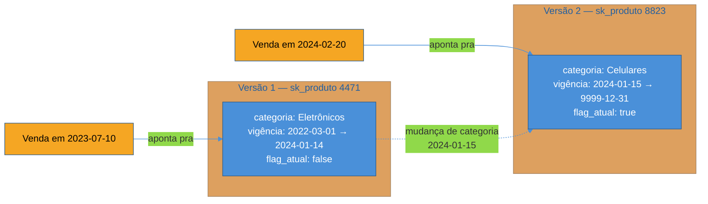

# Slowly Changing Dimensions

> [!abstract] TL;DR
> Dimensões não são estáticas: um cliente muda de cidade, um produto muda de categoria, um vendedor muda de time. Se o pipeline simplesmente **sobrescrever** o atributo mudado, o histórico mente — vendas antigas passam a aparecer sob o rótulo novo, como se aquele produto sempre tivesse pertencido à categoria atual. **Slowly Changing Dimensions (SCD)** é a família de técnicas de Kimball para decidir, atributo por atributo, o que fazer quando uma dimensão muda: **Tipo 0** nunca deixa mudar, **Tipo 1** sobrescreve (perde o passado, mas é simples), **Tipo 2** cria uma linha nova por versão (preserva o histórico inteiro, é o padrão-ouro), **Tipo 3** guarda só o valor anterior numa coluna extra (histórico raso de uma mudança). O mecanismo que torna o Tipo 2 possível é a **chave substituta** (*surrogate key*): a tabela de fatos nunca aponta para o ID natural do sistema de origem, e sim para a versão exata da dimensão vigente no momento do evento.

> [!question]- Perguntas que esta nota responde
> - Por que sobrescrever um atributo de dimensão "quebra" relatórios que já foram fechados e publicados?
> - Qual a diferença prática entre SCD Tipo 1, Tipo 2 e Tipo 3 — e quando cada um é a escolha certa?
> - Como o Tipo 2 de fato funciona: que colunas de controle ele precisa, e como a fato sabe qual versão da dimensão usar?
> - Por que a fato nunca aponta para a chave natural do produto, e sim para uma chave substituta gerada pelo warehouse?
> - O que fazer quando um fato chega antes de a dimensão existir, ou quando um registro histórico chega atrasado?

## O relatório de 2023 que passou a mentir

Retome o `dim_produto` e o `fato_vendas` da nota anterior. Existe um produto, "Smartphone X", cadastrado desde 2022 sob a categoria "Eletrônicos". Em janeiro de 2024, o time de catálogo reorganiza a taxonomia da loja e move esse produto para uma categoria nova, mais específica: "Celulares". É uma mudança de negócio legítima e banal — do tipo que acontece o tempo todo em qualquer catálogo vivo.

O jeito mais óbvio de refletir essa mudança no warehouse é rodar um `UPDATE` na linha do produto na `dim_produto`, trocando `categoria` de "Eletrônicos" para "Celulares". Parece inofensivo: o dado "está certo" agora, reflete a realidade atual do catálogo.

Só que existe uma tabela de fatos ligada a essa dimensão pela mesma chave, e ela guarda vendas desde 2022. Depois do `UPDATE`, qualquer relatório que agrupe `fato_vendas` por `dim_produto.categoria` — inclusive um relatório fechado há meses, sobre vendas de 2023 — passa a mostrar as vendas de 2023 daquele smartphone sob "Celulares". Mas em 2023 esse produto **não existia** sob essa categoria; a categoria "Celulares" nem tinha sido criada ainda. O número de faturamento por categoria de 2023, que a diretoria já apresentou ao conselho, silenciosamente mudou — sem que ninguém tenha alterado uma linha de fato, sem alerta, sem log de auditoria visível numa query comum.

Esse é o problema central que esta nota resolve: **dimensões não são fotografias estáticas do mundo — elas mudam, e a maneira como o modelo trata essa mudança decide se o histórico continua contável ou vira ficção retroativa.** Kimball batizou essa família de decisões de **Slowly Changing Dimensions (SCD)**[^kimball] — "lentamente" porque, ao contrário dos fatos (que chegam em fluxo constante, um evento após o outro), os atributos de uma dimensão mudam esporadicamente: um produto troca de categoria uma vez a cada muitos meses, não a cada segundo.

> [!question]- "Sobrescrever" não é sempre errado?
> Não — é uma escolha válida em muitos casos, só não é a escolha *automática* e correta em todos. A pergunta que decide é: **esse atributo, quando muda, invalida análises históricas que dependiam do valor antigo?** Se a resposta for sim (categoria de produto, região de cliente, time de vendedor), sobrescrever destrói informação que alguém vai precisar reconstruir. Se a resposta for não (corrigir um erro de digitação no nome do cliente, por exemplo), sobrescrever é exatamente a coisa certa a fazer — o valor "errado" nunca deveria ter existido, então não há histórico legítimo a preservar. SCD é justamente o vocabulário para tomar essa decisão de propósito, atributo por atributo, em vez de aplicar a mesma regra cega a toda a dimensão.

## Os tipos de SCD: um espectro de "quanto histórico eu preciso"

Kimball descreve seis tipos numerados, mas na prática a esmagadora maioria dos casos reais se resolve com três: Tipo 1, Tipo 2 e Tipo 3. Os outros (0, 4, 6) são casos especiais que valem conhecer de nome. Vale ler os tipos como um espectro — de "nunca muda" a "todo o histórico completo preservado" — e não como uma lista solta de opções equivalentes.

### Tipo 0 — o atributo que nunca muda

Alguns atributos de dimensão são, por definição, imutáveis: a data de nascimento de um cliente, o número de série original de um equipamento, a data de contratação de um funcionário. **SCD Tipo 0** é a decisão explícita de que, mesmo que uma correção pareça tentadora, o valor original é retido para sempre — o pipeline simplesmente ignora qualquer tentativa de alterar esse atributo depois do primeiro carregamento.

Isso não é preguiça de modelagem; é intencional. Se um sistema fonte "corrigir" a data de nascimento de um cliente (um erro de digitação real, ou uma fraude cadastral descoberta depois), a maioria das organizações ainda quer que o warehouse retenha o valor original como registrado historicamente — porque decisões e relatórios já tomados usaram aquele valor, e a auditoria de "o que sabíamos, e quando" depende de nunca reescrever esse campo.

A fronteira entre Tipo 0 e Tipo 1 costuma confundir quem está começando, porque os dois "não versionam" a mudança — a diferença é o que acontece com a tentativa de mudança. Tipo 1 aceita a mudança e sobrescreve; Tipo 0 **rejeita** a mudança, mantendo o valor original mesmo que o sistema de origem envie um valor diferente. Na prática, isso costuma ser implementado como uma regra explícita no pipeline: "para esta coluna, ignore qualquer valor recebido depois da primeira carga".

### Tipo 1 — sobrescrever (sem histórico)

**SCD Tipo 1** é o `UPDATE` direto: quando o atributo muda na fonte, o pipeline sobrescreve o valor antigo na dimensão, sem deixar rastro do que era antes. É a técnica mais simples de implementar — não precisa de coluna de controle nenhuma, não precisa de lógica de versionamento, o `MERGE`/`UPSERT` do pipeline atualiza a linha existente e pronto.

O custo é exatamente o que abriu esta nota: **qualquer relatório histórico que dependa do valor antigo do atributo passa a mentir**, porque o passado é silenciosamente reescrito com o presente. Tipo 1 é a escolha certa quando o valor antigo nunca teve significado analítico legítimo — o exemplo canônico é corrigir um erro de digitação: o nome do cliente estava grafado errado, a correção não é uma "mudança de negócio" que merece ser rastreada, é a correção de um dado que sempre esteve errado.

> [!warning] Aplicar Tipo 1 num atributo que merecia Tipo 2
> **O que acontece:** o time aplica sobrescrita simples em `categoria_produto`, porque é a técnica mais fácil de implementar no pipeline, sem parar para perguntar se aquele atributo tem valor analítico histórico. **Por quê:** Tipo 1 é sedutor justamente porque não exige nenhuma coluna de controle nem lógica extra — é o caminho de menor esforço de engenharia. Mas a facilidade de implementação não tem nenhuma relação com se o atributo *deveria* preservar histórico. **Como evitar:** antes de decidir o tipo de SCD de um atributo, pergunte explicitamente: "se esse valor mudar, algum relatório fechado no passado deveria continuar mostrando o valor antigo?". Se a resposta for sim, é Tipo 2 (ou 3), não Tipo 1 — não importa o esforço extra de implementação.

### Tipo 2 — nova linha por versão (o padrão-ouro)

**SCD Tipo 2** é a técnica mais importante da família, e a que resolve de fato o problema desta nota: em vez de sobrescrever o atributo mudado, o pipeline insere uma **linha inteiramente nova** na dimensão, representando a nova versão do registro — mantendo a linha antiga intacta, com seu próprio período de vigência.

Isso exige colunas de controle que o Tipo 1 dispensa:

| Coluna | Papel |
|---|---|
| Chave substituta (surrogate key) | Identificador sintético, único por **versão** do registro — não por entidade de negócio |
| Chave natural | O ID original do sistema de origem, repetido em todas as versões do mesmo registro |
| `data_inicio_vigencia` | A partir de quando esta versão passou a valer |
| `data_fim_vigencia` | Até quando esta versão valeu (`NULL` ou uma data-sentinela como `9999-12-31` na versão vigente) |
| `flag_atual` (*is_current*) | Booleano que marca, entre todas as versões da mesma chave natural, qual é a vigente agora |
| `versao` (opcional) | Número sequencial da versão, útil para depuração e para ordenar versões sem depender de datas |

Quando o "Smartphone X" muda de categoria em janeiro de 2024, o Tipo 2 não altera a linha existente — ele **encerra a vigência** da linha antiga (`data_fim_vigencia = 2024-01-15`, `flag_atual = false`) e **insere uma linha nova**, com uma surrogate key diferente, `categoria = 'Celulares'`, `data_inicio_vigencia = 2024-01-15`, `data_fim_vigencia = NULL`, `flag_atual = true`. A chave natural do produto (o SKU, digamos) é a mesma nas duas linhas — é assim que se sabe que são a "mesma entidade de negócio" em versões diferentes.

Veja como isso fica na `dim_produto` sob SCD Tipo 2, usando o exemplo do smartphone:

| sk_produto | sku (chave natural) | nome | categoria | data_inicio_vigencia | data_fim_vigencia | flag_atual |
|---|---|---|---|---|---|---|
| 4471 | SKU-9001 | Smartphone X | Eletrônicos | 2022-03-01 | 2024-01-14 | false |
| 8823 | SKU-9001 | Smartphone X | Celulares | 2024-01-15 | 9999-12-31 | true |

Repare no que essa tabela resolve: uma venda registrada em `fato_vendas` em julho de 2023 aponta, na sua coluna de chave estrangeira, para `sk_produto = 4471` — a versão vigente naquele momento, com `categoria = 'Eletrônicos'`. Uma venda de fevereiro de 2024 aponta para `sk_produto = 8823`, com `categoria = 'Celulares'`. O relatório de faturamento por categoria de 2023 continua correto — ele nunca precisou ser "corrigido" nem foi retroativamente alterado, porque a fato nunca perdeu a referência à versão certa. É este mecanismo — a fato apontando para a surrogate key da versão vigente no instante do evento, não para a chave natural do produto — que faz o Tipo 2 funcionar; sem ele, não haveria como distinguir "este SKU antes da mudança" de "este SKU depois da mudança" em nenhuma consulta.

O trade-off do Tipo 2 é justamente o inverso do Tipo 1: preserva o histórico completo, mas custa mais linhas na dimensão (uma por versão, não uma por entidade), mais complexidade no pipeline de carga (precisa detectar mudança, encerrar vigência da versão antiga, gerar surrogate key nova) e uma pegadinha real de consulta — qualquer `JOIN` entre fato e dimensão que não use a surrogate key correta (por exemplo, um `JOIN` acidental pela chave natural, sem filtrar por vigência) duplica linhas de fato, uma para cada versão histórica do produto.

> [!question]- Quantas linhas de dimensão o Tipo 2 gera, na prática?
> Depende de quantos atributos rastreados mudam e com que frequência — mas para a maioria dos catálogos reais, o número de versões por entidade é pequeno (poucas unidades ao longo de anos), não centenas. Se um atributo muda com frequência muito alta (um preço que oscila diariamente, por exemplo), tratá-lo como Tipo 2 explode o tamanho da dimensão sem necessariamente agregar valor analítico — nesse caso, a técnica certa costuma ser mover esse atributo volátil para dentro da tabela de fatos (como uma medida ou um atributo degenerado) em vez de versionar a dimensão inteira por causa dele. Kimball chama atenção para essa armadilha: nem todo atributo que muda merece rastreamento Tipo 2 — só os que têm valor analítico ao serem correlacionados ao histórico de fatos.

Para tornar o mecanismo concreto, veja como fica a lógica de carga incremental (o passo do pipeline que decide, a cada execução, se um produto mudou e o que fazer a respeito) em pseudo-SQL, no estilo `MERGE` que a maioria dos warehouses modernos suporta:

```sql
-- Passo 1: encerra a vigência da versão atual, se algum atributo rastreado mudou
UPDATE dim_produto
SET data_fim_vigencia = CURRENT_DATE - INTERVAL '1 day',
    flag_atual = false
WHERE sku = :sku_origem
  AND flag_atual = true
  AND categoria <> :categoria_nova;  -- só encerra se o atributo rastreado realmente mudou

-- Passo 2: insere a nova versão, só se o passo 1 encerrou alguma linha
INSERT INTO dim_produto (sk_produto, sku, nome, categoria, data_inicio_vigencia, data_fim_vigencia, flag_atual)
SELECT nextval('seq_sk_produto'), :sku_origem, :nome_novo, :categoria_nova, CURRENT_DATE, DATE '9999-12-31', true
WHERE EXISTS (
    SELECT 1 FROM dim_produto
    WHERE sku = :sku_origem AND flag_atual = false AND data_fim_vigencia = CURRENT_DATE - INTERVAL '1 day'
);
```

O detalhe que costuma sair errado na primeira implementação: o `WHERE categoria <> :categoria_nova` no passo 1 não é decoração — sem ele, o pipeline encerraria e recriaria uma versão nova **toda vez que rodar**, mesmo quando nada mudou de fato, inflando a dimensão com versões idênticas. Detectar mudança real (comparando o registro que chega da origem contra a versão `flag_atual = true` já existente, atributo por atributo) é o passo que a maioria das ferramentas de ELT modernas (dbt snapshots, por exemplo) automatiza — mas a lógica por baixo é sempre esta: comparar, encerrar se mudou, inserir a versão nova.

> [!warning] Vigências que se sobrepõem
> **O que acontece:** uma consulta que junta `fato_vendas` com `dim_produto` filtrando por data do evento devolve **linhas duplicadas** para o mesmo produto — o mesmo evento de venda casando com duas versões da dimensão ao mesmo tempo. **Por quê:** um bug comum na lógica de carga deixa a `data_fim_vigencia` da versão antiga um dia depois (ou igual) à `data_inicio_vigencia` da versão nova, criando uma sobreposição de um dia onde as duas vigências são simultaneamente "verdadeiras" para aquela data. **Como evitar:** trate o intervalo de vigência como **semiaberto** por convenção — `[data_inicio_vigencia, data_fim_vigencia)`, início inclusivo e fim exclusivo — e valide, como teste de qualidade de dados recorrente, que nenhuma chave natural tem duas versões com intervalos que se sobrepõem. A maioria dos frameworks de teste de dados (dbt tests, Great Expectations) tem um teste pronto para exatamente esse invariante.

### Como decidir qual tipo aplicar a um atributo

A pergunta "que tipo de SCD eu uso?" não tem uma resposta universal — ela é respondida **atributo por atributo**, dentro da mesma dimensão. É perfeitamente normal (e comum) que `dim_produto` trate `categoria` com Tipo 2, `nome` com Tipo 1 (corrigir erro de digitação não merece histórico) e `data_cadastro` com Tipo 0 (imutável por definição). Um roteiro de decisão prático:

1. **O atributo pode mesmo mudar, ou é imutável por natureza?** Se imutável (data de nascimento, data de contratação), Tipo 0.
2. **Alguma análise histórica legítima depende do valor antigo desse atributo?** Se não — o valor antigo era só um erro a corrigir — Tipo 1.
3. **Sim, o histórico importa, e há um `JOIN` fato-dimensão já existente sobre esse atributo (relatórios agrupam por ele)?** Tipo 2 — é o caso da categoria de produto, região de cliente, time de vendedor.
4. **O histórico importa, mas só como "antes vs. depois" de um evento pontual e conhecido, sem necessidade de rastrear múltiplas trocas?** Tipo 3 pode bastar, com bem menos custo de armazenamento e consulta que o Tipo 2.
5. **O atributo muda com frequência muito alta (diária, por exemplo) e versionar via Tipo 2 explodiria o tamanho da dimensão?** Considere Tipo 4 (mini-dimensão) ou mover o atributo para a fato.

| Pergunta central | Tipo indicado |
|---|---|
| Nunca muda, por definição | Tipo 0 |
| Muda, mas o valor antigo nunca teve valor analítico (correção de erro) | Tipo 1 |
| Muda, e relatórios históricos dependem do valor vigente em cada época | Tipo 2 |
| Muda, mas só interessa comparar "antes" e "depois" de uma mudança pontual | Tipo 3 |
| Muda com frequência muito alta, valor analítico baixo por versão | Tipo 4 (mini-dimensão) |

### Tipo 3 — nova coluna (histórico raso)

**SCD Tipo 3** guarda o valor anterior numa coluna extra ao lado do valor atual — em vez de uma nova linha, uma nova coluna. Para o mesmo exemplo, a dimensão ganharia `categoria_atual = 'Celulares'` e `categoria_anterior = 'Eletrônicos'`, na mesma linha do produto, sem duplicar registro.

A limitação é dura: o Tipo 3 só guarda **uma** mudança de cada vez. Se o produto mudar de categoria de novo no futuro, o valor em `categoria_anterior` é sobrescrito, e a categoria de dois trocas atrás desaparece — o Tipo 3 não é uma linha do tempo, é uma memória de curtíssimo prazo. Por isso ele é usado com moderação, tipicamente para comparações do tipo "antes e depois" de uma reorganização pontual e conhecida (uma reestruturação de território de vendas, por exemplo, onde o negócio quer comparar volume "antes vs. depois" da mudança, mas não precisa de um histórico de N reestruturações).

### Tipo 4 e Tipo 6 — variações que compõem os anteriores

Dois padrões adicionais aparecem com menos frequência, e vale só nomeá-los:

- **Tipo 4 — mini-dimensão.** Separa os atributos de mudança muito frequente (que explodiriam uma dimensão Tipo 2, como discutido acima) numa tabela pequena e independente — uma "mini-dimensão" — ligada à fato por sua própria chave, mantendo a dimensão principal enxuta e estável. Exemplo clássico: uma faixa de renda estimada do cliente, recalculada mensalmente por um modelo de scoring — versionar isso via Tipo 2 dentro de `dim_cliente` geraria uma linha nova por cliente todo mês; separar numa `dim_faixa_renda` pequena, referenciada por `fato_vendas` junto com `dim_cliente`, resolve sem inflar a dimensão principal.
- **Tipo 6 — híbrido.** Combina Tipo 1 + Tipo 2 + Tipo 3 na mesma dimensão: mantém histórico completo via nova linha (Tipo 2), *e* uma coluna com o valor atual sempre atualizado em todas as versões históricas via sobrescrita (Tipo 1), *e* opcionalmente uma coluna de valor anterior (Tipo 3) — servindo tanto a pergunta "como era" quanto "qual é hoje" na mesma tabela, sem precisar de `JOIN` adicional para achar a versão vigente. É útil quando o mesmo relatório precisa comparar, lado a lado, "sob qual categoria essa venda foi feita" e "em qual categoria esse produto está hoje", sem duas consultas separadas.

Nenhum dos dois é o ponto de entrada recomendado para quem está aprendendo SCD — eles resolvem problemas de otimização específicos depois que o Tipo 2 já é bem compreendido.

Vale notar que uma dimensão Tipo 2 serve, na prática, dois tipos de consulta bem diferentes, e confundir os dois é uma fonte comum de relatório errado:

- **Consulta "como era" (point-in-time).** Junta a fato com a dimensão pela surrogate key gravada em cada linha de fato — é o que os exemplos acima fazem, e é o padrão correto para qualquer relatório histórico/analítico.
- **Consulta "como é hoje" (current-state).** Filtra a dimensão por `flag_atual = true` e junta por chave natural — usada quando a pergunta é sobre o estado presente da entidade, não sobre o histórico ("me dê a lista de produtos atualmente na categoria Celulares"), independentemente de sob qual categoria as vendas passadas aconteceram.

Um dashboard de BI mal configurado que sempre filtra por `flag_atual = true`, inclusive para relatórios que deveriam mostrar histórico ponto-no-tempo, reintroduz silenciosamente o mesmo problema do Tipo 1 — só que trocando o `UPDATE` físico por um filtro de consulta que sempre traz a versão mais recente.

## Chaves substitutas: por que a fato nunca aponta pro SKU

A nota anterior já adiantou o vocabulário: a `dim_produto` usa uma **chave substituta** (*surrogate key*) — um identificador sintético, gerado pelo próprio warehouse, sem significado de negócio — em vez da **chave natural** (o SKU, o CPF do cliente, o código do vendedor no sistema de origem)[^kimball]. Esta nota mostra por que essa escolha não é estética: ela é a **pré-condição estrutural** que torna o Tipo 2 possível.

Pense assim: se `fato_vendas` apontasse diretamente para o SKU do produto (a chave natural), só poderia existir **uma** linha de dimensão por SKU — porque é assim que uma chave primária natural funciona, um valor identifica uma entidade. Não haveria como ter duas linhas de "Smartphone X" simultaneamente na dimensão, uma para cada versão de categoria, porque as duas teriam o mesmo SKU e colidiriam como chave. A chave substituta rompe esse vínculo de um-para-um: cada **versão** do produto ganha sua própria surrogate key, permitindo múltiplas linhas para o mesmo SKU sem violar unicidade — e é exatamente essa liberdade que o Tipo 2 explora.

Contraste direto:

| | Chave natural | Chave substituta |
|---|---|---|
| Origem | Vem do sistema de origem (SKU, CPF, matrícula) | Gerada pelo warehouse (inteiro sequencial, sem significado de negócio) |
| Estabilidade | Pode mudar de formato entre sistemas fonte, ou ser reaproveitada por engano | Estável por construção — nunca reaproveitada |
| Cardinalidade com a entidade | Uma por entidade de negócio | Uma por **versão** da entidade (permite múltiplas por entidade) |
| O que a fato deveria referenciar | Nunca diretamente | Sempre — é o que torna o SCD Tipo 2 possível |

O diagrama abaixo mostra a linha do tempo do "Smartphone X" sob SCD Tipo 2 — as duas versões da dimensão, e como cada evento de venda (a fato) se conecta à versão que estava vigente na sua própria data, nunca à versão vigente hoje:



Repare que a venda de 2023 nunca "sabe" que a categoria vai mudar no futuro — ela referencia a surrogate key 4471, que continua existindo, imutável, com `categoria = 'Eletrônicos'`, para sempre. A venda de 2024 referencia a surrogate key 8823, criada só quando a mudança aconteceu. Nenhuma das duas linhas de fato precisa ser tocada quando a próxima mudança de categoria ocorrer — o versionamento vive inteiramente do lado da dimensão.

Um detalhe que costuma escapar de quem está aprendendo: a chave natural **não desaparece** da dimensão — ela continua lá, como uma coluna comum (não a chave primária), justamente para permitir agrupar todas as versões históricas do "mesmo produto de negócio" quando isso for necessário (por exemplo, "quantas categorias esse SKU já passou ao longo da vida do catálogo?"). O que muda é qual coluna serve de chave primária da dimensão e de chave estrangeira na fato — e essa é sempre a surrogate key, nunca a natural.

## Dimensões e fatos que chegam fora de ordem

Dois problemas relacionados, e comuns o suficiente para merecer nome próprio, aparecem quando o mundo real não coopera com a ordem "primeiro a dimensão existe, depois o fato acontece":

**Late-arriving dimension.** Um fato chega ao pipeline antes de a dimensão correspondente existir — por exemplo, uma venda é registrada para um cliente cujo cadastro ainda não foi processado pelo pipeline de ingestão (uma corrida entre dois pipelines, ou uma dimensão que é carregada com menos frequência que a fato). A saída padrão é inserir uma linha "placeholder" na dimensão — com atributos desconhecidos marcados como tal (`categoria = 'Desconhecida'`, por exemplo) — só para que a fato tenha uma surrogate key válida para referenciar; quando o registro real da dimensão chegar, a linha placeholder é atualizada (ou substituída, dependendo da implementação) com os atributos corretos.

**Late-arriving fact / correção retroativa de histórico.** Um evento antigo é reportado com atraso — uma venda de seis meses atrás, corrigida ou lançada tardiamente por algum motivo operacional — e precisa ser associado à versão da dimensão que estava vigente **naquela data**, não à versão vigente hoje. Isso exige que o pipeline de carga saiba localizar, entre as várias linhas Tipo 2 do mesmo produto, aquela cujo intervalo `[data_inicio_vigencia, data_fim_vigencia)` contém a data do evento atrasado — não simplesmente usar a versão `flag_atual = true`. Em SQL, essa resolução costuma ficar assim, no momento de carregar a fato:

```sql
SELECT f.venda_id, f.quantidade, dp.sk_produto
FROM staging_vendas f
JOIN dim_produto dp
  ON dp.sku = f.sku_origem
 AND f.data_venda >= dp.data_inicio_vigencia
 AND f.data_venda <  dp.data_fim_vigencia   -- intervalo semiaberto, ver armadilha acima
```

Note que essa junção **não** filtra por `flag_atual = true` — ela resolve a versão correta pela data do próprio evento, que é justamente o que permite a uma venda atrasada de seis meses atrás casar com a versão histórica certa da dimensão, mesmo que essa versão já tenha sido substituída há muito tempo.

Vale registrar por que essas duas situações têm nome próprio em vez de serem tratadas como "bug" caso a caso: elas são **previsíveis** em qualquer pipeline real — fontes de dados diferentes nunca chegam perfeitamente sincronizadas, e sistemas operacionais volta e meia corrigem ou reenviam eventos passados. Um pipeline de dados maduro projeta a carga de dimensão e de fato assumindo que chegada fora de ordem *vai* acontecer, em vez de tratar cada ocorrência como incidente isolado.

## Casos práticos

O exemplo do smartphone fixa o mecanismo, mas vale ver o mesmo raciocínio aplicado a outras dimensões clássicas — porque o problema de fundo (histórico que precisa ser preservado ou não) se repete em praticamente todo catálogo de dimensão de um warehouse.

### Cenário 1: cliente que muda de cidade

Um cliente de e-commerce se muda de São Paulo para Belo Horizonte. A `dim_cliente` tem um atributo `cidade`, usado por relatórios de segmentação regional — "faturamento por região, por trimestre". Se `cidade` fosse Tipo 1, a mudança de endereço reescreveria retroativamente todas as compras antigas desse cliente como se sempre tivessem vindo de Belo Horizonte, distorcendo o histórico de faturamento por região dos trimestres anteriores à mudança.

A modelagem correta trata `cidade` como Tipo 2: uma nova linha para o cliente, com `sk_cliente` nova, `cidade = 'Belo Horizonte'`, vigência a partir da data da mudança de endereço. As compras feitas enquanto o cliente morava em São Paulo continuam referenciando a surrogate key antiga, preservando a região correta daquele período no relatório trimestral. Repare que o atributo `nome_cliente`, na mesma dimensão, provavelmente é Tipo 1 — corrigir um nome mal digitado no cadastro não tem o mesmo peso analítico que mudar de região.

### Cenário 2: vendedor que muda de time

Uma empresa de vendas B2B reorganiza sua força comercial: um vendedor que pertencia ao "Time Sudeste" passa a integrar o "Time Nacional de Contas-Chave", numa promoção. A `dim_vendedor` tem um atributo `time`, usado para calcular comissão trimestral e desempenho por equipe.

Se `time` fosse sobrescrito (Tipo 1), o trimestre em que o vendedor ainda pertencia ao Time Sudeste passaria a contar, retroativamente, para as métricas do Time Nacional — inflando o desempenho reportado de uma equipe que, na época, nem existia para aquele vendedor. Com Tipo 2, a venda feita em março (quando o vendedor ainda era do Time Sudeste) referencia a surrogate key da versão antiga, e continua corretamente atribuída ao Time Sudeste nos relatórios trimestrais fechados — mesmo que hoje, ao consultar o cadastro atual do vendedor, ele apareça no Time Nacional.

Esses dois cenários reforçam o mesmo ponto do exemplo do smartphone: **a decisão de aplicar Tipo 2 não é sobre o tipo de entidade (cliente, produto, vendedor) — é sobre se o atributo específico que mudou tem peso em alguma métrica agregada por período.** Qualquer atributo usado como critério de agrupamento em relatório (`GROUP BY categoria`, `GROUP BY time`, `GROUP BY regiao`) é candidato natural a Tipo 2; atributos usados só como rótulo descritivo (nome, e-mail de contato) costumam bastar com Tipo 1.

## Em entrevista

Uma pergunta muito comum em entrevistas de modelagem de dados: "como você lida com um atributo de dimensão que muda ao longo do tempo?" A resposta fraca cita "SCD" sem detalhar. A resposta forte nomeia o tipo certo para o caso concreto perguntado — "se é um atributo cujo histórico importa analiticamente, eu uso Tipo 2: nova linha por versão, com `data_inicio_vigencia`, `data_fim_vigencia` e `flag_atual`, e a fato aponta pela surrogate key da versão vigente no momento do evento, não pela chave natural" — e sabe explicar por que Tipo 1 seria uma escolha errada nesse caso específico (perderia o histórico), sem soar como quem decorou os seis tipos numerados sem entender o trade-off por trás.

Uma pergunta de acompanhamento típica: "por que a fato não referencia diretamente o SKU do produto?" A resposta madura amarra isso à mecânica do Tipo 2: se a fato apontasse para a chave natural, seria impossível ter duas versões simultâneas do mesmo produto na dimensão — a surrogate key é o que rompe esse vínculo de um-para-um e permite o versionamento.

Uma terceira pergunta, mais avançada, testa julgamento de engenharia, não só vocabulário: "vocês têm um atributo que muda todo dia — vale a pena versionar ele com Tipo 2?" A resposta forte reconhece que nem todo atributo merece rastreamento histórico completo: um atributo de mudança muito frequente explode o tamanho da dimensão sem necessariamente entregar valor analítico, e a alternativa madura é considerar mini-dimensão (Tipo 4) ou mover o atributo para a fato como medida, em vez de aplicar Tipo 2 cegamente a tudo que muda.

## How to explain in English

> "Dimensions aren't static snapshots — a customer changes city, a product changes category. If you overwrite the attribute in place, historical reports silently rewrite the past: 2023 sales for that product start showing up under the new category, even though that category didn't exist in 2023. Slowly Changing Dimensions is Kimball's framework for handling that: Type 1 overwrites — simple, but loses history, fine for correcting genuine data errors. Type 2 inserts a brand-new row per version — with a surrogate key, an effective-date range, and a current flag — preserving full history; the fact table always references the surrogate key of the version that was active at the time of the event, never the natural key. Type 3 adds a 'previous value' column, which only tracks one change at a time. Type 2 is the default choice whenever historical accuracy actually matters, and it's exactly why fact tables should never reference a source system's natural key directly — natural keys can't represent multiple simultaneous versions of the same entity."

| PT | EN |
|----|----|
| Dimensão com mudança lenta | Slowly Changing Dimension (SCD) |
| Chave substituta | Surrogate key |
| Chave natural | Natural key (business key) |
| Sobrescrever (sem histórico) | Overwrite (Type 1) |
| Nova linha por versão | New row per version (Type 2) |
| Data de início de vigência | Effective start date |
| Data de fim de vigência | Effective end date |
| Flag de registro vigente | Current flag (`is_current`) |
| Mini-dimensão | Mini-dimension |
| Dimensão que chega atrasada | Late-arriving dimension |
| Fato que chega atrasado | Late-arriving fact |

## O que vem a seguir

Esta nota fechou o problema clássico do histórico dimensional — como versionar dimensões sem perder o passado, e o papel estrutural da chave substituta nisso. O que falta é dar um passo atrás e questionar a própria arquitetura Kimball como padrão único: existem outras escolas de modelagem para o mesmo problema de fundo (dado bruto até dado analisável), com trade-offs bem diferentes de star schema e SCD.

- [[05 - Além de Kimball]] — Inmon vs. Kimball, Data Vault, wide tables e a arquitetura medallion como alternativas e complementos ao modelo dimensional clássico

## Fontes

- Kimball, Ralph & Ross, Margy — *The Data Warehouse Toolkit: The Definitive Guide to Dimensional Modeling*, 3ª edição, Wiley, 2013 — fonte canônica dos tipos de SCD (0 a 6), do uso de chaves substitutas e do tratamento de dimensões e fatos de chegada tardia.
- Kimball Group — *Kimball Dimensional Modeling Techniques: Slowly Changing Dimensions* (kimballgroup.com/data-warehouse-business-intelligence-resources/kimball-techniques/slowly-changing-dimensions-techniques/) — referência de consulta rápida dos tipos SCD, com exemplos e variações.
- Ross, Margy & Kimball, Ralph — *The Kimball Group Reader: Relentlessly Practical Tools for Data Warehousing and Business Intelligence*, 2ª edição, Wiley, 2015 — artigos originais sobre mini-dimensões (Tipo 4) e o híbrido Tipo 6.

[^kimball]: Kimball & Ross, *The Data Warehouse Toolkit*, 3ª edição, Wiley, 2013, capítulos sobre técnicas de dimensão.
