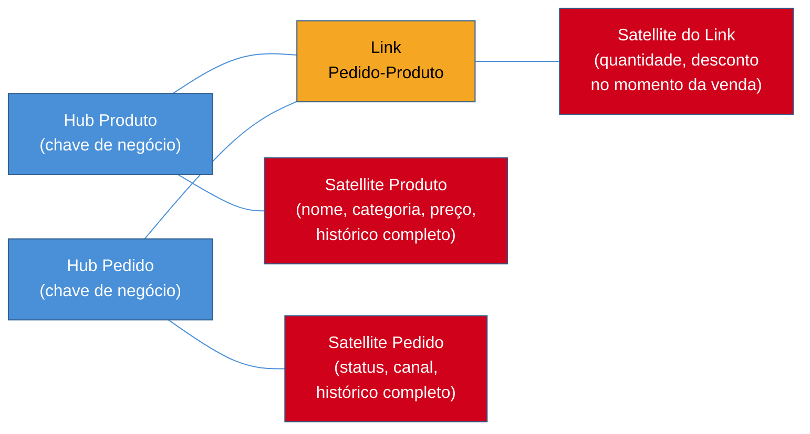
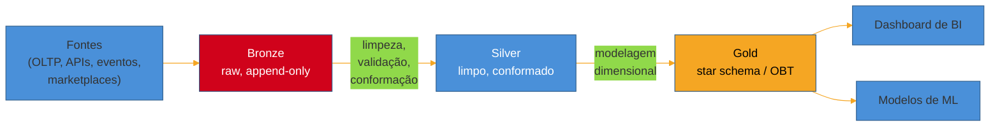

# Além de Kimball

> [!abstract] TL;DR
> As três notas anteriores construíram o vocabulário de Kimball — fato, dimensão, grão, star schema, SCD — como se fosse a única resposta certa para "como modelar dado pra analytics". Não é. É a resposta **mais usada**, e para a maioria dos casos continua sendo a certa, mas o campo é mais largo. Bill Inmon discordava de Kimball desde os anos 1990 sobre *como chegar* ao warehouse — um corporate warehouse normalizado no centro, versus data marts dimensionais desde o primeiro dia. Dan Linstedt propôs uma terceira via, o **Data Vault**, pensada para auditoria e ingestão de muitas fontes voláteis. O armazenamento colunar barateou tanto a leitura que hoje é viável desnormalizar até o osso — a **One Big Table**, sem join nenhum. E o **medallion architecture** (bronze/silver/gold) do mundo lakehouse organiza o *fluxo* de refinamento do dado, não substitui nenhuma dessas modelagens — a camada gold frequentemente **é** um star schema. Esta nota fecha o sub-galho de modelagem mapeando essas quatro abordagens e, mais importante, dando o critério de quando cada uma se justifica — porque adotar a complexidade de um Data Vault ou a rigidez de um Inmon sem o problema que os justifica é puro custo de engenharia sem retorno.

> [!question]- Perguntas que esta nota responde
> - Qual a diferença real entre a abordagem de Inmon e a de Kimball para construir um data warehouse — e por que "quem venceu o debate" é a pergunta errada?
> - O que são Hubs, Links e Satellites no Data Vault, e por que essa modelagem existe?
> - O que é uma One Big Table, e por que ela só ficou viável com armazenamento colunar moderno?
> - O que é medallion architecture (bronze/silver/gold), e por que ela não compete com star schema — ela o contém?
> - Como decidir, na prática, quando vale sair do star schema padrão para uma dessas alternativas?

## O debate que a trilha adiou até agora

Lá na nota de abertura desta trilha, uma frase ficou pendurada sem desenvolver: Kimball e Inmon discordavam sobre *como* construir um data warehouse, mas os dois já reconheciam, nos anos 1990, que analytics precisa de um sistema separado do operacional. As três notas seguintes deste sub-galho — grão, fato, dimensão, star vs snowflake, SCD — desenvolveram integralmente o lado de Kimball. É hora de abrir o outro lado, e de mostrar que o campo não parou nos anos 1990: depois de Kimball e Inmon vieram Data Vault, wide tables e o padrão de camadas do lakehouse moderno. Nenhum desses "substitui" Kimball — cada um resolve um problema que o star schema, sozinho, resolve mal ou não resolve.

Vale entrar com uma pergunta prática, do tipo que aparece quando um time de dados cresce e ganha uma segunda ou terceira fonte de dado volátil: um sistema de e-commerce que hoje vende só no site próprio começa a vender também via marketplace, e cada marketplace manda o catálogo de produto num formato ligeiramente diferente, com uma frequência de atualização diferente, e às vezes manda dado retroativo corrigindo um pedido de semanas atrás. Modelar isso direto como uma `dim_produto` única, ao estilo Kimball, funciona — até o dia em que uma auditoria pergunta "por que esse produto aparece com categoria diferente em dois relatórios do mês passado, e qual das duas fontes estava certa, e quando isso mudou?". É exatamente esse tipo de pergunta — auditoria, proveniência, mudança de fonte — que motivou as abordagens que esta nota cobre.

## Inmon vs Kimball: o debate clássico

Bill Inmon e Ralph Kimball publicaram, na mesma década, duas visões de como um data warehouse deveria nascer — e as duas ainda aparecem em decisões reais de arquitetura hoje, décadas depois.

**Inmon: top-down, o Corporate Information Factory.** Na visão de Inmon, o data warehouse é um repositório corporativo único, normalizado (tipicamente em 3FN), que serve como fonte única da verdade para a organização inteira. Ele nasce de um esforço de modelagem abrangente — entender e representar as entidades de negócio da empresa toda, não de um departamento — antes de qualquer área específica consumir dado dele. A partir desse warehouse central, **data marts** dimensionais (aí sim, no estilo Kimball) são derivados para áreas específicas — vendas, marketing, financeiro —, cada um alimentado a partir da mesma fonte normalizada e consistente. É o que Inmon batizou de *Corporate Information Factory*: um núcleo normalizado, com marts dimensionais nas bordas para consumo.

**Kimball: bottom-up, o bus arquitetural.** Na visão de Kimball, você não espera o warehouse corporativo inteiro ficar pronto para entregar valor. Você modela dimensionalmente desde o primeiro dia, processo de negócio por processo de negócio — vendas primeiro, depois estoque, depois atendimento — cada um virando um data mart dimensional que já é consultável e útil. A integração entre esses marts, para que eles não virem silos incompatíveis, vem das **dimensões conformadas** — a mesma `dim_produto`, com as mesmas chaves e a mesma taxonomia, reusada em todos os marts que precisam dela — planejadas com antecedência via a **bus matrix**, como a nota 03 desta trilha já cobriu em detalhe.

Os dois lados concordam em mais coisa do que a rivalidade histórica sugere: os dois querem consistência entre áreas, os dois usam modelo dimensional em algum ponto do caminho (Inmon nos marts derivados, Kimball no warehouse inteiro), e os dois reconhecem que o modelo normalizado de origem (o OLTP) não serve para consulta analítica direta. A diferença real é **onde a normalização mora e quando o valor aparece**:

| Dimensão | Inmon (top-down) | Kimball (bottom-up) |
|---|---|---|
| Ponto de partida | Warehouse corporativo normalizado (3FN) | Data marts dimensionais desde o dia 1 |
| Modelo dimensional aparece | Só nos data marts, derivados do warehouse | No warehouse inteiro, desde o início |
| Tempo até primeiro valor entregue | Longo — exige modelar a empresa toda primeiro | Curto — primeiro processo de negócio já é consultável |
| Consistência entre áreas | Forte por construção (uma única fonte normalizada) | Depende de governança ativa (dimensões conformadas, bus matrix) |
| Risco principal | Projeto caro e lento, pode nunca "terminar" | Silos entre marts, se a integração não for planejada |
| Custo de mudança de escopo | Alto — mexe no modelo corporativo central | Mais baixo — cada mart é relativamente isolado |

Nenhuma das duas visões "venceu" o debate, e tratar a pergunta como torcida de time é um erro de quem só leu resumo. O que decide, na prática, é o contexto organizacional: uma seguradora ou banco com forte exigência regulatória e times de dados maduros pode absorver o custo inicial de um modelo corporativo Inmon, porque a consistência forte por construção compensa a lentidão de entrega. Uma startup ou um time de dados pequeno que precisa mostrar valor rápido, com poucos processos de negócio para modelar de início, tende a se beneficiar mais da entrega incremental de Kimball — desde que alguém leve a sério a disciplina de dimensões conformadas, porque é exatamente aí que a abordagem bottom-up degenera em silo, se governada mal.

> [!question]- Isso significa que toda empresa madura devia migrar para Inmon?
> Não — na prática, a maioria dos data warehouses modernos que você vai encontrar no mercado são essencialmente Kimball, com um verniz de disciplina corporativa por cima (dimensões conformadas bem geridas, um catálogo de dados, um time de governança). Puro Inmon — um corporate warehouse normalizado, com marts dimensionais só nas bordas — é mais raro de ver hoje, em parte porque o custo inicial é alto e as ferramentas modernas de transformação (dbt e afins) tornaram a disciplina bottom-up mais fácil de manter do que era nos anos 1990, quando Kimball propôs a alternativa. Isso não invalida Inmon — em domínios muito regulados, com integração corporativa como requisito não negociável, a lógica dele ainda se aplica, e frequentemente aparece hoje sob outro nome: **Data Vault**, o assunto da próxima seção, que resolve um problema parecido (integração e auditoria corporativa) com uma modelagem diferente da de Inmon original.

## Data Vault: a terceira via, pensada para auditoria

Dan Linstedt propôs, nos anos 2000 e refinado como **Data Vault 2.0** na década seguinte, uma modelagem que ataca diretamente os dois pontos fracos que Inmon e Kimball deixam expostos em ambientes com muitas fontes voláteis e exigência forte de auditoria: rastreabilidade completa de onde cada dado veio e quando mudou, e resiliência a mudança de esquema na fonte sem precisar re-modelar o warehouse inteiro.

A ideia central do Data Vault é separar, em tabelas distintas, três coisas que o modelo dimensional mistura numa única `dim_produto`: **a identidade do negócio**, **os relacionamentos entre identidades** e **os atributos descritivos que mudam no tempo**. Cada uma vira um tipo de tabela:

**Hub — a chave de negócio, e só ela.** Um Hub guarda a lista de identidades únicas de um conceito de negócio — o ID de produto, o ID de cliente, o ID de pedido — junto com metadados de proveniência (de que fonte veio, quando foi carregado pela primeira vez). Ele não guarda nenhum atributo descritivo. `hub_produto` sabe que o produto `SKU-4471` existe; ela não sabe o nome dele, nem a categoria.

**Link — o relacionamento entre Hubs.** Um Link registra que duas ou mais identidades de negócio se relacionam — um pedido contém um produto, um cliente fez um pedido — também com metadados de proveniência de quando esse relacionamento foi observado pela primeira vez. `link_pedido_produto` conecta `hub_pedido` e `hub_produto`, sem carregar nenhum atributo além da própria existência do relacionamento e de quando ele apareceu.

**Satellite — os atributos descritivos, com histórico completo.** É aqui que o nome do produto, a categoria, o preço de tabela realmente moram — e cada Satellite guarda, por natureza, o histórico completo de mudança desses atributos ao longo do tempo, sem precisar de nenhuma técnica adicional de versionamento. Um Satellite associado a `hub_produto` guarda uma linha por versão do conjunto de atributos, com uma data de início de validade — o equivalente, dentro do Data Vault, ao que um SCD tipo 2 faz no modelo dimensional (ver nota 04 desta trilha), só que como parte estrutural do modelo, não como uma técnica aplicada por cima dele.



Repare no que essa separação compra. Quando um novo marketplace começa a mandar o catálogo de produto num formato diferente, você não precisa re-modelar `hub_produto` — a chave de negócio (o SKU) continua a mesma. Você só adiciona um novo Satellite (ou estende o existente) para os atributos que essa fonte específica traz, sem tocar no que já existe. Cada Hub, Link e Satellite pode ser carregado de forma **independente e em paralelo**, porque a chave de negócio no Hub não depende de nenhum outro objeto ter sido carregado primeiro — uma propriedade valiosa quando o volume de ingestão é alto e vem de múltiplas fontes simultâneas. E como cada Satellite guarda proveniência (de onde veio, quando chegou) junto com o histórico completo de mudança, responder "de onde veio esse dado, e o que ele dizia em qualquer ponto do passado" é uma consulta direta ao modelo, não uma reconstrução forense.

Para tornar isso concreto, o mesmo domínio de e-commerce usado nas notas anteriores do sub-galho, modelado em Data Vault, ficaria parecido com isto (simplificado, sem os campos de proveniência que normalmente acompanham cada tabela):

```sql
-- Hub: só a chave de negócio
CREATE TABLE hub_produto (
    hub_produto_key   UUID PRIMARY KEY,   -- surrogate key do Data Vault
    sku               TEXT NOT NULL,      -- chave de negócio (a mesma em toda fonte)
    carregado_em      TIMESTAMP,
    fonte             TEXT                -- de qual sistema esse SKU foi visto pela primeira vez
);

-- Link: o relacionamento entre Hubs
CREATE TABLE link_pedido_produto (
    link_key          UUID PRIMARY KEY,
    hub_pedido_key    UUID REFERENCES hub_pedido,
    hub_produto_key   UUID REFERENCES hub_produto,
    carregado_em      TIMESTAMP
);

-- Satellite: os atributos, versionados no tempo
CREATE TABLE sat_produto (
    hub_produto_key   UUID REFERENCES hub_produto,
    valido_desde      TIMESTAMP,
    nome              TEXT,
    categoria         TEXT,
    preco_tabela      NUMERIC,
    fonte             TEXT,               -- de qual sistema este atributo veio
    PRIMARY KEY (hub_produto_key, valido_desde)
);
```

Repare que `sat_produto` já é, por desenho, uma tabela que acumula histórico — cada mudança de categoria ou preço gera uma nova linha com um novo `valido_desde`, sem precisar de nenhuma técnica adicional de SCD por cima. E se um segundo marketplace passar a mandar atributos de produto num formato próprio, a resposta arquitetural é criar `sat_produto_marketplace_x` como um Satellite adicional ligado ao mesmo `hub_produto` — sem tocar em `sat_produto` nem em `hub_produto`. É exatamente essa propriedade — estender sem re-modelar o que já existe — que o modelo dimensional puro não oferece com a mesma naturalidade: adicionar uma fonte nova a uma `dim_produto` Kimball tipicamente significa alterar a tabela existente ou reconciliar os dois conjuntos de atributos numa única linha por produto.

O custo é real e não deve ser minimizado: um domínio de negócio modesto, que em star schema viraria uma dúzia de tabelas (algumas dimensões, uma ou duas fatos), em Data Vault facilmente vira dezenas de tabelas — um Hub, um ou mais Satellites e múltiplos Links por conceito de negócio. Consultar o Data Vault diretamente, com todos esses joins entre Hub, Link e Satellite, é lento e pouco ergonômico para quem quer só responder "faturamento por categoria" — não é isso que o Data Vault foi desenhado para servir bem. Na prática, times que adotam Data Vault quase sempre constroem uma camada dimensional (star schema, Kimball) **por cima** dele, como camada de consumo — o Data Vault vira o repositório auditável de verdade histórica, e o star schema derivado vira o que o analista e o dashboard realmente consultam.

> [!question]- Data Vault é uma alternativa a Kimball, ou uma camada anterior a ele?
> Na prática moderna, mais a segunda coisa que a primeira. É raro encontrar uma organização que serve BI e dashboards direto de um Data Vault — o modelo existe para absorver a complexidade e a volatilidade de múltiplas fontes de forma auditável, e depois alimentar uma camada dimensional (star schema) que é o que de fato chega ao analista. Pense em Data Vault como um "3FN para a era de integração de muitas fontes" — ele ocupa, na arquitetura, um papel parecido ao que o warehouse corporativo normalizado de Inmon ocupava: uma camada de integração e verdade histórica, com o consumo dimensional derivado dela. Não é coincidência que Data Vault seja, por vezes, descrito como "uma forma moderna e mais flexível de implementar a visão de Inmon".

> [!warning] Adotar Data Vault "porque é mais robusto", sem o problema que o justifica
> **O que acontece:** um time adota Data Vault 2.0 para um domínio com poucas fontes, baixa exigência de auditoria e um volume que um star schema resolveria com folga — atraído pela reputação de robustez do modelo. **Por quê:** Data Vault multiplica o número de tabelas e a complexidade de carga e consulta em troca de auditabilidade e resiliência a mudança de fonte — benefícios reais, mas que só compensam quando o domínio de fato tem muitas fontes voláteis ou exige rastreabilidade forte por regulação. Sem esse problema, o time paga o custo de modelagem e consulta sem nenhum retorno correspondente. **Como evitar:** pergunte primeiro quantas fontes alimentam o domínio, com que frequência o esquema delas muda, e que nível de auditoria a organização exige por regulação ou por política interna. Se a resposta for "uma fonte, esquema estável, sem exigência de auditoria formal", star schema direto é a escolha certa — Data Vault resolveria um problema que não existe.

## One Big Table: desnormalizar até o osso

A modelagem dimensional de Kimball já é, por si só, uma desnormalização deliberada em relação ao 3FN do OLTP — a nota 01 desta trilha cobriu esse contraste. Mas o star schema ainda tem joins: a tabela de fatos referencia dimensões por chave estrangeira, e qualquer consulta precisa reunir fato e dimensões de volta. O barateamento do armazenamento colunar e o amadurecimento dos motores analíticos modernos abriram espaço para ir além — desnormalizar completamente, numa única tabela larguíssima que já carrega, em cada linha, todos os atributos de dimensão como colunas próprias. É a **One Big Table** (OBT), também chamada de *wide table*.

Em vez de `fato_vendas` com chaves estrangeiras para `dim_produto`, `dim_cliente`, `dim_tempo`, uma OBT de vendas teria, na mesma linha, a medida de venda **e** o nome do produto, a categoria, o nome do cliente, o segmento dele, o dia da semana, o mês — tudo já resolvido, sem nenhum `JOIN` necessário para consultar. Uma pergunta como "faturamento por categoria" vira um `GROUP BY` direto sobre uma única tabela, sem nenhuma junção.

A vantagem central é dupla: **consulta trivialmente simples** — qualquer ferramenta de BI, ou qualquer analista com SQL básico, consegue escrever a query certa sem entender um esquema de várias tabelas relacionadas — e **performance excelente em motores colunares modernos**, que já são otimizados para varrer poucas colunas de uma tabela larga rapidamente, e para os quais o custo de um `JOIN` (mesmo que pequeno em teoria) ainda representa uma etapa a mais de processamento distribuído a evitar.

O custo, correspondente à vantagem, é redundância massiva: o nome da categoria do produto se repete em toda linha de venda daquele produto, em vez de existir uma vez só em `dim_produto`. Isso custa espaço em disco — cada vez mais barato, mas não de graça — e, mais importante, custa **flexibilidade de mudança**. Lembra do problema de dimensões que mudam no tempo, coberto na nota 04 desta trilha (Slowly Changing Dimensions)? Numa OBT, ele fica genuinamente mais difícil: se a categoria de um produto muda, você precisa decidir se reescreve retroativamente todas as linhas históricas que carregam aquele valor (perdendo o histórico de "como era antes"), ou se aceita que a OBT reflete só o estado mais recente no momento da carga — perdendo a distinção fina entre SCD tipo 1, 2 e 3 que o modelo dimensional oferece de forma nativa. E cada atributo novo que alguém quer expor vira uma coluna nova na tabela inteira — uma OBT de produção com anos de decisões acumuladas pode facilmente chegar a centenas de colunas, a maioria delas irrelevante para a maior parte das consultas.

Para ancorar com o mesmo domínio de e-commerce: uma `fato_vendas` em star schema tem, tipicamente, um punhado de chaves estrangeiras e medidas — `produto_key`, `cliente_key`, `tempo_key`, `quantidade`, `valor`. A OBT equivalente já chega com `produto_nome`, `produto_categoria`, `produto_subcategoria`, `produto_marca`, `cliente_nome`, `cliente_segmento`, `cliente_cidade`, `cliente_uf`, `ano`, `mes`, `dia_semana`, `nome_do_mes` — e assim por diante, uma coluna para cada atributo de cada dimensão que algum consumidor já pediu, acumulado ao longo do tempo. A vantagem de consulta é real: um analista de BI escreve `SELECT categoria, SUM(valor) FROM obt_vendas GROUP BY categoria` sem precisar saber que `dim_produto` existe. A desvantagem de manutenção também é real: essa mesma tabela, seis meses depois, tem colunas que só um relatório específico usa, e ninguém lembra por que `cliente_flag_experimento_x` ainda está lá.

> [!warning] Uma OBT por dashboard, sem dimensão compartilhada por baixo
> **O que acontece:** cada time de BI cria sua própria OBT, desnormalizada do jeito que for mais conveniente para o dashboard dele — sem nenhuma dimensão conformada compartilhada entre elas. **Por quê:** cada OBT nasce isolada, então nada garante que "categoria de produto" signifique a mesma coisa, com a mesma taxonomia, em todas elas. É o mesmo problema de silo que motivou a bus matrix de Kimball — só que agora multiplicado, porque cada OBT já é, por natureza, uma cópia redundante de atributos que deveriam ter uma única fonte de verdade. **Como evitar:** manter um star schema com dimensões conformadas como camada de base, e gerar as OBTs *a partir dele* — como uma materialização de consumo, nunca como o modelo estrutural único do warehouse.

> [!question]- Então OBT substitui o star schema como abordagem padrão?
> Não, e é importante não ler esta seção como "OBT venceu, star schema é coisa do passado". OBT funciona muito bem como **camada final de consumo** — a tabela que um dashboard específico ou uma ferramenta de self-service BI consulta diretamente, já pré-achatada para aquele uso. Ela funciona mal como **modelo estrutural do warehouse inteiro**: manter dezenas de OBTs, uma para cada caso de uso, sem nenhuma dimensão compartilhada por baixo, reintroduz o problema de silo que a bus matrix de Kimball existe para prevenir — cada OBT vira sua própria ilha, com sua própria definição de "categoria de produto", potencialmente divergente das outras. O padrão mais comum na prática é ter um star schema bem modelado, com dimensões conformadas, como fonte de verdade — e materializar OBTs específicas *a partir dele*, como uma view desnormalizada e materializada para consumo, não como substituto do modelo de base.

## Medallion architecture: bronze, silver, gold

A quarta abordagem desta nota é de natureza diferente das três anteriores — e essa diferença é o ponto mais importante a fixar. Inmon, Kimball e Data Vault são formas de **modelar** o dado — como desenhar as tabelas e seus relacionamentos. **Medallion architecture** é uma forma de organizar o **fluxo de refinamento** do dado através de camadas sucessivas, popularizada pelo Databricks no contexto do lakehouse (o armazenamento híbrido já coberto na nota 03 do sub-galho de fundamentos desta trilha, [[1 - Fundamentos de engenharia de dados/03 - Warehouse, lake e lakehouse|Warehouse, lake e lakehouse]]).

A ideia é simples de enunciar e poderosa na prática: o dado entra bruto e vai ganhando qualidade e estrutura conforme atravessa três camadas nomeadas por metal, numa progressão de "menos confiável, mais fiel à fonte" para "mais confiável, mais pronto para consumo":

**Bronze — dado bruto, tal como chegou.** A camada bronze ingere o dado exatamente como a fonte o entregou — mesmo schema, mesmos valores, incluindo erros, duplicatas e inconsistências que a fonte eventualmente tenha. É tipicamente *append-only*: nada é sobrescrito, tudo que chegou fica registrado, com metadados de quando e de onde veio. O valor da bronze é servir de registro de auditoria e de ponto de reprocessamento — se uma regra de transformação mudar ou um bug for descoberto na silver, dá para reprocessar a partir da bronze sem precisar re-extrair da fonte original.

**Silver — limpo, validado, conformado.** Na camada silver, o dado passa por limpeza (remoção de duplicata, tratamento de nulo, correção de tipo), validação (regras de qualidade, valores dentro de faixas esperadas) e conformação entre fontes diferentes (o mesmo conceito de negócio, vindo de duas fontes distintas, ganha uma representação única e consistente). É o equivalente, em espírito, ao trabalho que um analytics engineer faz com dbt sobre tabelas brutas — mas silver ainda não é necessariamente modelado para consumo de negócio; é dado confiável e íntegro, ainda organizado próximo da estrutura da fonte.

**Gold — agregado e modelado para consumo.** É na camada gold que a modelagem dimensional entra em cena. Gold é onde o dado silver, já limpo e conformado, é reorganizado especificamente para responder perguntas de negócio — e essa reorganização, na grande maioria dos casos práticos, **é** um star schema Kimball, ou uma OBT materializada para um caso de uso específico, ou (com menos frequência) uma camada Data Vault se a organização precisar da auditabilidade extra. Gold é a camada que um dashboard de BI ou um analista consulta diretamente.



O ponto que mais gera confusão — e que vale grifar explicitamente — é este: **medallion não compete com Kimball, ele o contém.** "Onde entra o star schema no medallion?" é uma pergunta com resposta direta: na camada gold. Medallion responde "em que ordem e com que disciplina o dado é refinado, de fonte bruta até pronto para consumo"; Kimball (ou Data Vault, ou OBT) responde "como o dado é estruturado *dentro* daquela camada gold, uma vez que já está limpo". São perguntas ortogonais, e um projeto de dados maduro no lakehouse tipicamente responde as duas ao mesmo tempo — camadas bronze/silver/gold para organizar o pipeline, star schema (ou variantes) dentro da gold para organizar o consumo. A movimentação e transformação de dado entre essas camadas — os pipelines em si, ETL vs ELT — é o assunto do próximo sub-galho desta trilha, não desta nota.

> [!info] Estado em 2026-07
> Databricks, Microsoft Fabric e Azure recomendam medallion como padrão organizacional default de suas implementações de lakehouse, e o padrão segue amplamente discutido e adotado por comunidades de engenharia de dados neste período — sem sinal de substituição por outro paradigma de camadas. A busca não trouxe dado quantitativo específico sobre adoção relativa de wide tables/OBT versus star schema na camada gold; a leitura conceitual desta nota (gold frequentemente é dimensional, com OBT reservada a casos de consumo específico) reflete o consenso qualitativo encontrado, não uma medição de mercado.

> [!question]- Bronze/silver/gold é o mesmo que ETL/ELT?
> Não, embora os dois apareçam juntos com frequência em descrições de arquitetura moderna. ETL e ELT descrevem **a ordem das operações** de um pipeline — se a transformação acontece antes ou depois da carga no destino. Bronze/silver/gold descreve **camadas de destino**, nomeando o estado de refinamento do dado em cada ponto de repouso, independentemente de qual ferramenta ou ordem de operação o levou até ali. Na prática, um pipeline ELT moderno costuma carregar bruto em bronze e depois transformar, camada a camada, até chegar em gold — os dois conceitos se encaixam bem, mas respondem perguntas diferentes. ETL vs ELT como decisão de pipeline é o assunto de abertura do próximo sub-galho desta trilha.

## As quatro abordagens lado a lado

Antes da síntese final, vale ver as quatro abordagens desta nota reunidas num único quadro de referência — não para memorizar, mas para ter à mão na hora de justificar uma escolha de arquitetura:

| Abordagem | Resolve | Custo principal | Serve consumo direto? |
|---|---|---|---|
| Kimball (star schema) | A pergunta de negócio, com o mínimo de joins e complexidade | Governança de dimensões conformadas exige disciplina contínua | Sim — é o padrão pensado exatamente para isso |
| Inmon (top-down) | Consistência corporativa forte, por construção | Tempo e custo alto até entregar o primeiro valor | Não diretamente — via data marts derivados |
| Data Vault 2.0 | Auditoria, proveniência, muitas fontes voláteis, carga paralela | Explosão de tabelas, consulta direta lenta e pouco ergonômica | Não — quase sempre exige camada dimensional derivada |
| One Big Table | Consulta trivial, performance em motor colunar, self-service BI | Redundância massiva, SCD difícil, explosão de colunas | Sim — é a própria definição de camada de consumo |
| Medallion (bronze/silver/gold) | Organização do fluxo de refinamento no lakehouse | Nenhum, por si só — é ortogonal, não uma modelagem | Só na camada gold, e só se ela for modelada para isso |

## Quando fugir do star schema

Juntando as quatro abordagens desta nota numa única síntese de julgamento sênior: **star schema continua sendo o default correto para a grande maioria dos casos de BI**, e nada nesta nota deveria ser lido como motivo para abandoná-lo por padrão. As alternativas resolvem problemas específicos, que a maioria dos projetos de dados simplesmente não tem:

- **Data Vault** compensa quando o domínio tem muitas fontes voláteis, esquemas que mudam com frequência, e uma exigência real — regulatória ou organizacional — de auditoria e rastreabilidade completa de proveniência. Sem esse problema, ele só multiplica tabelas e complexidade de consulta sem retorno.
- **One Big Table** compensa como camada final de consumo — um dashboard específico, uma ferramenta de self-service BI, um motor colunar que se beneficia de zero joins — não como modelo estrutural de todo o warehouse. Sem um caso de consumo que realmente precise dessa simplicidade extrema, ela só acumula redundância e dificulta lidar com dimensões que mudam.
- **Medallion architecture** não é uma alternativa ao star schema — é a organização do pipeline que entrega dado *até* a camada onde o star schema (ou uma variante) mora. Adotar bronze/silver/gold é quase sempre uma boa ideia num ambiente lakehouse, independente da modelagem escolhida para a gold.
- **Inmon (top-down)** compensa em organizações grandes, com exigência forte de consistência corporativa e recursos para sustentar um esforço de modelagem abrangente antes de entregar valor às áreas. Fora desse contexto, o tempo até o primeiro valor entregue costuma pesar mais do que a consistência extra compra.

O erro comum, e o que esta nota quer deixar como lição central, não é escolher a abordagem errada por falta de conhecimento — é **adotar a complexidade de uma alternativa sem primeiro nomear o problema concreto que ela resolveria**. Se ninguém consegue apontar "temos N fontes que mudam de esquema com frequência e uma exigência de auditoria X" antes de propor Data Vault, ou "este dashboard específico precisa de zero latência de join, e aceitamos a redundância" antes de propor uma OBT, a resposta certa quase sempre é: comece pelo star schema, com dimensões conformadas bem planejadas via bus matrix, e só migre uma parte do modelo para uma alternativa quando o problema que ela resolve aparecer de fato — não antes.

## Em entrevista

Uma pergunta clássica de entrevista de dados de nível sênior é direta: "Inmon ou Kimball — qual você usaria?" A resposta fraca escolhe um lado por reflexo, como se fosse torcida de time. A resposta forte recusa a dicotomia e amarra a escolha ao contexto: "depende do tamanho e da maturidade do time de dados, e de quanto a organização consegue esperar por valor. Para a maioria dos times, eu começaria bottom-up, ao estilo Kimball, com disciplina de dimensões conformadas desde o início para não acabar em silo — e reservaria uma abordagem mais próxima de Inmon, ou de Data Vault, para domínios com exigência real de consistência corporativa ou auditoria regulatória."

Outra pergunta frequente, mais técnica: "quando você usaria Data Vault em vez de modelagem dimensional pura?" A resposta madura nomeia o problema específico — múltiplas fontes voláteis, necessidade de auditoria e proveniência, carga paralela em alta escala — e reconhece o trade-off: mais tabelas, consulta direta mais difícil, geralmente exige uma camada dimensional derivada por cima para servir consumo. Citar Data Vault sem mencionar esse custo é sinal de quem decorou o nome sem entender o trade-off.

Uma terceira pergunta, cada vez mais comum com a ascensão do lakehouse: "como bronze/silver/gold se relaciona com star schema?" A resposta fraca trata os dois como concorrentes. A resposta forte explica que são ortogonais — medallion organiza o fluxo de refinamento, star schema (ou Data Vault, ou OBT) organiza a estrutura da camada gold — e que a maioria dos lakehouses maduros usa os dois ao mesmo tempo.

Uma quarta pergunta, típica de discussão de arquitetura mais avançada: "seu dashboard de vendas está lento mesmo com um star schema bem modelado — o que você tentaria antes de sair criando uma OBT?" A resposta fraca pula direto para "eu desnormalizaria tudo". A resposta forte investiga primeiro a causa concreta da lentidão — o motor de consulta está de fato pagando o custo do join, ou o gargalo é outra coisa (falta de particionamento, estatísticas desatualizadas, um filtro que não usa a chave certa)? — e só recomenda uma OBT materializada quando o join realmente for o gargalo identificado *e* o caso de uso for específico o suficiente para justificar mais uma tabela redundante para manter. Recomendar OBT como reflexo, sem diagnosticar primeiro, é o mesmo erro de julgamento que recomendar Data Vault sem nomear o problema de auditoria que o justificaria.

## How to explain in English

> "Kimball and Inmon disagree on how to build a data warehouse, not on whether analytics needs one. Inmon goes top-down: a single normalized corporate warehouse first, with dimensional data marts derived from it. Kimball goes bottom-up: dimensional data marts from day one, integrated through conformed dimensions. Data Vault is a third approach built for auditability and high-volume ingestion from many volatile sources — it splits business keys (Hubs), relationships (Links), and time-varying descriptive attributes (Satellites) into separate tables, at the cost of many more tables and harder direct querying. One Big Table takes denormalization to the extreme — a single wide table with every dimension attribute pre-joined as a column — trading redundancy and harder slowly-changing-dimension handling for zero-join, dead-simple queries, usually as a consumption-layer artifact rather than the warehouse's core model. Medallion architecture (bronze/silver/gold) is orthogonal to all of this — it organizes the *pipeline's* refinement stages, not the model itself; the gold layer is frequently a star schema. None of these replace Kimball as the default — they solve specific problems Kimball's plain star schema doesn't address, and adopting their complexity without that specific problem is pure engineering cost with no return."

| PT | EN |
|----|----|
| Fábrica corporativa de informação | Corporate Information Factory |
| Abordagem de cima para baixo | Top-down approach |
| Abordagem de baixo para cima | Bottom-up approach |
| Cofre de dados | Data Vault |
| Concentrador (chave de negócio) | Hub |
| Vínculo (relacionamento) | Link |
| Satélite (atributos com histórico) | Satellite |
| Auditabilidade | Auditability |
| Proveniência do dado | Data lineage / provenance |
| Tabela única larga | One Big Table (OBT) / wide table |
| Arquitetura medalhão | Medallion architecture |
| Camada bruta | Bronze layer |
| Camada limpa/conformada | Silver layer |
| Camada de consumo | Gold layer |
| Ortogonal (não concorrente) | Orthogonal |

## O que vem a seguir

Este sub-galho fechou o vocabulário de modelagem dimensional — por que modelar diferente do OLTP, fato e dimensão, star vs snowflake, tipos de fato, SCD — e agora as abordagens que vão além dele: Inmon, Data Vault, OBT, medallion. Falta responder a pergunta que qualquer um desses modelos, uma vez desenhado no papel, ainda deixa em aberto: **como o dado de fato chega até lá?** Um star schema bem desenhado é só um esquema vazio até um pipeline preencher `fato_vendas` e `dim_produto` com dado real, extraído da fonte, transformado e carregado — e a decisão de *quando* transformar (antes ou depois de carregar) é a primeira bifurcação técnica do próximo sub-galho.

- [[3 - Pipelines - movimentação e transformação/index|Pipelines: movimentação e transformação]] — abre com ETL vs ELT: a ordem das operações que move dado da fonte até o modelo que este sub-galho ensinou a desenhar

## Fontes

- Inmon, W. H. — *Building the Data Warehouse*, 4ª edição, Wiley, 2005 — a definição e a abordagem top-down do Corporate Information Factory.
- Kimball, Ralph & Ross, Margy — *The Data Warehouse Toolkit: The Definitive Guide to Dimensional Modeling*, 3ª edição, Wiley, 2013 — a abordagem bottom-up, dimensões conformadas e bus matrix, contraponto histórico a Inmon.
- Linstedt, Dan & Olschimke, Michael — *Building a Scalable Data Warehouse with Data Vault 2.0*, Morgan Kaufmann, 2015 — fonte canônica de Hubs, Links e Satellites e da metodologia Data Vault 2.0.
- Databricks — [*What is the medallion lakehouse architecture?*](https://www.databricks.com/glossary/medallion-architecture) — definição e justificativa das camadas bronze/silver/gold no contexto do lakehouse.
- Reis, Joe & Housley, Matt — *Fundamentals of Data Engineering: Plan and Build Robust Data Systems*, O'Reilly, 2022 — panorama das abordagens de modelagem e do papel do lakehouse no ciclo de vida da engenharia de dados.
