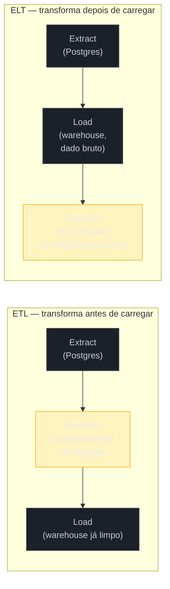
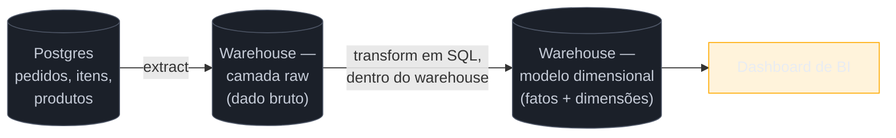

# ETL vs ELT

> [!abstract] TL;DR
> Todo pipeline de dados resolve o mesmo problema — mover dado da fonte até o warehouse, transformando-o pelo caminho — mas existem duas ordens possíveis para os três verbos: **extrair, transformar, carregar** (ETL) ou **extrair, carregar, transformar** (ELT). ETL nasceu quando armazenamento e computação no warehouse eram caros demais para desperdiçar com dado bruto: você transformava fora, num servidor intermediário, e só carregava o resultado já limpo. ELT é a virada da nuvem — separar armazenamento de computação (ver [[03-Dominios/Engenharia/Dados/1 - Fundamentos de engenharia de dados/03 - Warehouse, lake e lakehouse|nota 03 do SG1]]) tornou barato guardar o dado bruto e caro só o que você efetivamente processa, então faz mais sentido carregar tudo primeiro e deixar o próprio warehouse — com seu poder de computação elástico — fazer a transformação em SQL. Esta nota estabelece as duas ordens, por que ELT venceu como padrão no mundo cloud, e as situações concretas em que ETL clássico ainda é a escolha certa — porque a resposta não é "ELT sempre", é "ELT por padrão, ETL quando há uma razão".

> [!question]- Perguntas que esta nota responde
> - O que muda, na prática, entre transformar antes de carregar (ETL) e carregar antes de transformar (ELT)?
> - Por que a indústria migrou majoritariamente de ETL para ELT a partir da adoção de warehouses na nuvem?
> - Em que situações concretas ETL clássico ainda é a escolha certa, mesmo hoje?
> - O que é um pipeline como grafo (DAG), e o que é "reverse ETL"?

## O e-commerce depois do warehouse

A [[03-Dominios/Engenharia/Dados/1 - Fundamentos de engenharia de dados/01 - O que é engenharia de dados|nota de abertura da trilha]] deixou o e-commerce num ponto específico: o Postgres de produção continua sendo o sistema de registro do pedido, e um pipeline extrai periodicamente os dados relevantes para um warehouse com modelo dimensional, onde a diretoria comercial roda "faturamento por categoria, últimos dois anos" sem tocar o banco transacional. Essa frase — "extrai... para um warehouse com modelo dimensional" — esconde uma decisão de arquitetura que ainda não foi aberta: **onde**, exatamente, os dados de vendas viram um esquema em estrela de fatos e dimensões?

Existem só duas respostas possíveis. Ou o dado é transformado *antes* de chegar ao warehouse — extraído do Postgres, processado num servidor ou motor intermediário, e só o resultado já limpo é carregado — ou o dado bruto é despejado no warehouse primeiro, e a transformação acontece *lá dentro*, usando o próprio motor do warehouse para rodar o SQL que constrói o esquema em estrela. A primeira ordem é **ETL**; a segunda é **ELT**. A letra que muda de posição — o T de "transform" — carrega o essencial da diferença: não é só uma questão de sigla, é uma questão de **onde mora o trabalho pesado de processamento**, e essa escolha tem consequências reais de custo, velocidade e flexibilidade.

## O que é um pipeline de dados, retomando

Antes de comparar as duas ordens, vale fixar o vocabulário que a nota de abertura já introduziu, mas não desenvolveu: um **pipeline de dados** é o conjunto de processos automatizados que movem e transformam dado entre etapas do ciclo de vida — da fonte operacional (o Postgres do e-commerce) até o destino que serve decisão (o warehouse, e dali dashboards, modelos de ML, ou outros sistemas). Esse ciclo de vida completo — gerar, ingerir, armazenar, transformar, servir, com governança e qualidade atravessando tudo — é o assunto da [[03-Dominios/Engenharia/Dados/1 - Fundamentos de engenharia de dados/02 - O ciclo de vida da engenharia de dados|nota 02 do SG1]]; esta nota entra especificamente nas duas etapas do meio: **ingestão** (o "E" e o "L" de extrair e carregar) e **transformação** (o "T"), e na ordem em que elas acontecem.

Um pipeline não é uma linha reta — é melhor pensado como um **grafo de passos com dependências**: extrair a tabela de pedidos depende de nada; construir a tabela de fatos de vendas depende de ter extraído pedidos, itens e produtos; um relatório de faturamento por categoria depende da tabela de fatos já pronta. Formalmente, esse grafo é um **DAG** — *directed acyclic graph*, grafo direcionado sem ciclos: cada passo aponta para o próximo, e nunca existe um caminho que volte a um passo já executado, porque isso criaria uma dependência circular impossível de resolver. Esse formato é o que faz o pipeline **componível**: cada nó pode ser testado, reexecutado e depurado isoladamente, sem precisar entender o pipeline inteiro de uma vez. Quem decide *quando* e *em que ordem* cada nó desse grafo roda — o motor que agenda, monitora e reexecuta cada passo — é o **orquestrador**, assunto da nota 04 desta trilha; aqui o ponto a fixar é mais simples: ETL e ELT são duas formas diferentes de desenhar os **nós** desse grafo, não de decidir a ordem de execução deles.



## ETL: o padrão clássico

**ETL** — *Extract, Transform, Load* — é a ordem canônica que dominou data warehousing dos anos 1990 até meados dos anos 2010. O fluxo:

1. **Extract** — o dado é lido da fonte operacional (o Postgres do e-commerce, um ERP, um arquivo CSV exportado de um sistema legado).
2. **Transform** — o dado passa por um servidor ou motor de processamento **intermediário**, separado tanto da fonte quanto do warehouse — historicamente uma ferramenta de ETL dedicada (Informatica PowerCenter, IBM DataStage, Talend), rodando limpeza, junção, agregação e o reshape para o modelo dimensional de destino.
3. **Load** — só o resultado já transformado, limpo e no formato final, é carregado no warehouse.

A lógica por trás dessa ordem era puramente econômica. Nos anos 1990 e 2000, um data warehouse era hardware dedicado e caro — armazenamento e capacidade de processamento vinham empacotados juntos, numa máquina ou cluster que a empresa comprava e operava. Cada byte gravado e cada ciclo de CPU consumido *dentro* do warehouse custava dinheiro real e finito. Fazia sentido, então, tirar o trabalho pesado de transformação do warehouse e rodá-lo num servidor de staging separado, mais barato de escalar horizontalmente — e carregar no warehouse só o dado já no formato final, sem desperdiçar a capacidade cara dele com dado intermediário ou sujo. Kimball formaliza esse fluxo como parte do **back room** do data warehouse — a área de staging onde o dado é extraído, limpo, conformado e preparado antes de chegar às tabelas de fatos e dimensões que o usuário final consulta[^kimball].

> [!info] O legado do ETL ainda está em toda parte
> Boa parte do vocabulário e das ferramentas que a indústria usa hoje — inclusive em contextos ELT — carrega o nome "ETL" por herança histórica. Você ainda vai ouvir "o time de ETL", "a pipeline de ETL quebrou", mesmo quando o fluxo real é ELT. O nome do padrão virou sinônimo genérico de "pipeline de dados que alimenta o warehouse", mesmo quando a ordem técnica real das etapas já não é ETL. Vale reconhecer o uso frouxo do termo sem se confundir sobre qual ordem está de fato acontecendo.

## ELT: a virada da nuvem

**ELT** — *Extract, Load, Transform* — inverte as duas últimas etapas:

1. **Extract** — igual ao ETL: o dado é lido da fonte.
2. **Load** — o dado **bruto**, sem transformação, é carregado direto no warehouse, geralmente numa camada de staging dentro do próprio warehouse (às vezes chamada de *raw layer* ou *bronze layer*).
3. **Transform** — a transformação acontece **dentro do warehouse**, em SQL, usando o próprio motor de processamento do warehouse — não um servidor externo.

Essa inversão só faz sentido econômico graças a uma mudança arquitetural que a [[03-Dominios/Engenharia/Dados/1 - Fundamentos de engenharia de dados/03 - Warehouse, lake e lakehouse|nota 03 do SG1]] já cobriu em detalhe: a **separação entre armazenamento e computação**. Warehouses na nuvem como Snowflake, BigQuery e Redshift desacoplaram as duas coisas — você paga por armazenamento (barato, ilimitado, cresce sozinho) e paga separadamente por computação (elástica, liga e desliga sob demanda, escala para cima só quando uma query pesada está rodando). Isso muda completamente o cálculo que justificava o ETL clássico:

- **Guardar dado bruto deixou de ser caro.** Armazenamento em nuvem custa centavos por gigabyte-mês. Não existe mais razão econômica forte para filtrar ou agregar dado *antes* de guardá-lo — guarde tudo, decida depois o que fazer com ele.
- **O warehouse virou, ele mesmo, um motor de transformação capaz.** Um warehouse moderno processa SQL sobre bilhões de linhas com paralelismo massivo — a mesma capacidade de computação que antes só um motor de processamento distribuído dedicado (Hadoop, Spark) oferecia. Não há mais necessidade de "poupar" o warehouse do trabalho pesado; ele foi desenhado, na era cloud, exatamente para isso.
- **Dado bruto preservado é um seguro contra mudança de regra de negócio.** Se a definição de "faturamento" muda — passa a incluir frete, ou excluir devoluções de um jeito diferente —, com ELT você só reescreve o SQL de transformação e roda de novo sobre o dado bruto já carregado. Com ETL clássico, se a lógica de transformação mudou de um jeito que exige reprocessar dado histórico que só existia na forma já transformada, pode ser necessário **re-extrair** da fonte original — que, meses depois, pode já ter mudado de esquema, ou o dado antigo simplesmente não existir mais na forma bruta.
- **Menos peças móveis.** ETL clássico exige manter um servidor ou motor de transformação separado, com sua própria infraestrutura, monitoramento e escalonamento. ELT elimina essa camada inteira — a transformação roda como SQL dentro do sistema que você já opera e monitora de qualquer forma.

No exemplo do e-commerce: em vez de transformar pedidos, itens e produtos num servidor de staging antes de carregar, o pipeline moderno extrai as tabelas do Postgres e carrega o dado **bruto** — pedidos crus, itens crus, produtos crus — direto no warehouse. É só depois, com SQL rodando dentro do warehouse (o assunto detalhado da nota 03 desta trilha), que esse dado bruto vira a tabela de fatos de vendas ligada às dimensões de produto, categoria e tempo.



Para tornar isso menos abstrato, veja como a etapa de "transform" do ELT se parece na prática, dentro do warehouse — sem entrar na ferramenta específica (dbt e SQLMesh são o assunto tool-specific da nota 03 desta trilha), só na forma do SQL que resolve o problema:

```sql
-- Camada raw: dado bruto, tal como chegou do Postgres, sem tratamento
-- (já carregado por um passo de "load" anterior)

-- Camada transformada: roda DENTRO do warehouse, sobre o dado já carregado
CREATE TABLE analytics.fato_vendas AS
SELECT
    p.id AS pedido_id,
    date_trunc('month', p.criado_em) AS mes,
    pr.categoria_id,
    SUM(i.quantidade * i.preco_unitario) AS faturamento
FROM raw.pedidos p
JOIN raw.itens_pedido i ON i.pedido_id = p.id
JOIN raw.produtos pr ON pr.id = i.produto_id
WHERE p.status = 'pago'
GROUP BY p.id, date_trunc('month', p.criado_em), pr.categoria_id;
```

Repare que essa query se parece muito com a query que a nota de abertura da trilha mostrou travando o Postgres de produção — mas aqui ela roda contra `raw.pedidos`, uma cópia do dado dentro do warehouse, usando o motor colunar do warehouse, sem disputar recurso nenhum com o checkout. É esse deslocamento — a mesma lógica de transformação, movida para o sistema certo — que faz ELT funcionar sem reintroduzir o problema original.

Um vocabulário que você vai encontrar em qualquer discussão prática de ELT, e que vale reconhecer aqui mesmo sem aprofundar (a ferramenta que o opera é assunto da nota 03): camadas costumam ser nomeadas **raw** (ou *bronze* — dado bruto, tal como chegou), **staging/intermediate** (ou *silver* — limpo, tipado, ainda granular) e **marts** (ou *gold* — o modelo dimensional final, pronto para consumo). Essa progressão em camadas dentro do próprio warehouse é o "T" do ELT acontecendo em etapas controladas, versionadas e testáveis — não uma transformação monolítica de uma vez só.

> [!question]- Isso significa que ETL "perdeu" e é ferramenta ultrapassada?
> Não — ETL clássico continua vivo e correto em contextos específicos, cobertos na próxima seção. O que mudou foi o **padrão default**: dez anos atrás, a pergunta de arquitetura era "como transformar antes de carregar"; hoje, a pergunta default é "carregamos bruto e transformamos lá dentro — a menos que exista uma razão concreta para não fazer isso". É uma mudança de ponto de partida, não uma regra absoluta.

## Onde ETL ainda vale — e por quê

A afirmação "ELT venceu" precisa de uma ressalva importante, porque tratá-la como regra absoluta é o tipo de erro que soa bem numa conversa casual e mal numa decisão de arquitetura real. Existem situações concretas em que transformar **antes** de carregar continua sendo a escolha certa:

**1. Compliance e dado sensível.** Se uma fonte contém CPF, número de cartão, dado de saúde ou qualquer informação sob regulação (LGPD, HIPAA, PCI-DSS), pode ser **obrigatório** mascarar, tokenizar ou remover esse dado *antes* que ele toque qualquer sistema além da fonte original — incluindo o warehouse. Carregar o dado bruto sensível primeiro e "prometer" mascarar depois, dentro do warehouse, muitas vezes não satisfaz o requisito regulatório, porque o dado sensível já passou, ainda que brevemente, por um sistema que não deveria vê-lo. Aqui a transformação (mascaramento) precisa acontecer estritamente antes do load. No e-commerce do exemplo-fio: a tabela `clientes` do Postgres provavelmente guarda CPF em texto puro, porque o checkout precisa dele para emitir nota fiscal. Um pipeline ELT ingênuo carregaria essa coluna sem alteração para dentro de `raw.clientes` — expondo CPF de texto puro a qualquer analista com acesso de leitura ao warehouse, um acesso tipicamente bem mais amplo do que o acesso ao Postgres de produção. A correção não é abandonar ELT para o pipeline inteiro; é aplicar um passo de mascaramento (hash, tokenização, ou simplesmente não extrair a coluna) só nessa fonte específica, antes do load — um "T" pequeno e cirúrgico dentro de uma arquitetura que, em tudo o mais, continua sendo ELT.

**2. Redução de volume caro.** Se a fonte gera um volume descomunal de dado bruto — telemetria de sensores de IoT, logs de clickstream brutos — e a maior parte desse volume é ruído ou granularidade que ninguém nunca vai consultar, pode ser mais barato agregar ou filtrar **antes** de carregar do que pagar para guardar e depois processar tudo dentro do warehouse. A separação storage/compute barateou guardar dado bruto, mas não o tornou de graça — em volumes realmente grandes, o custo de ingestão e armazenamento ainda pesa na conta.

**3. Fontes que exigem pré-processamento pesado e específico.** Dado não-estruturado ou semiestruturado — texto livre que precisa de NLP, imagem que precisa de visão computacional, um formato proprietário que só uma biblioteca específica sabe decodificar — muitas vezes precisa de processamento que SQL dentro do warehouse não faz bem ou não faz de jeito nenhum. Nesses casos, faz sentido rodar essa etapa de transformação especializada num motor externo (um job Spark, um script Python) antes de o resultado — já num formato tabular sensato — ser carregado no warehouse.

**4. Contratos e SLAs herdados.** Organizações com décadas de investimento em ferramentas de ETL tradicionais (Informatica, DataStage), processos de governança amarrados a essas ferramentas, e equipes treinadas nesse paradigma nem sempre têm um caso de negócio claro para migrar tudo para ELT de uma vez — mesmo reconhecendo que, para pipelines novos, ELT seria a escolha default.

> [!warning] "ELT sempre, ETL nunca"
> **O que acontece:** um time decide, por princípio, que toda transformação deve acontecer dentro do warehouse, e carrega dado de PII sem mascaramento numa camada raw "porque depois a gente transforma lá dentro". **Por quê:** ELT como *default* é uma boa heurística de custo e simplicidade — mas tratá-la como regra absoluta ignora que existem razões (compliance sendo a mais comum e mais grave) para transformar antes de carregar, não depois. O erro geralmente só aparece quando um auditor ou um incidente de segurança pergunta "por que esse CPF em texto puro está numa tabela raw acessível a qualquer analista com permissão de leitura no warehouse?". **Como evitar:** trate "onde transformar" como uma decisão caso a caso, não como dogma de arquitetura. A pergunta certa antes de desenhar qualquer pipeline novo é: existe uma razão concreta (compliance, custo de volume, natureza do dado) para transformar antes de carregar? Se não houver, ELT é o padrão sensato. Se houver, use ETL para essa fonte específica — sem que isso comprometa a escolha de ELT para as outras.

Um jeito prático e comum de resolver o dilema, na prática de campo: pipelines híbridos, onde uma etapa mínima e bem delimitada de transformação (mascarar um campo de PII, por exemplo) acontece antes do load — um "T" pequeno e cirúrgico —, e o grosso da modelagem (juntar tabelas, calcular métricas, montar o esquema em estrela) acontece depois, dentro do warehouse, como ELT de fato. Isso não é "ETL disfarçado de ELT" — é reconhecer que os dois padrões não são mutuamente exclusivos numa arquitetura real; a pergunta relevante é onde cada *pedaço* de transformação precisa acontecer, não escolher um rótulo único para o pipeline inteiro.

A virada não foi instantânea nem simultânea em toda a indústria — ela acompanhou, ano a ano, a mesma linha do tempo que a [[03-Dominios/Engenharia/Dados/1 - Fundamentos de engenharia de dados/01 - O que é engenharia de dados|nota de abertura da trilha]] traçou para o "modern data stack" como um todo: o Redshift, a partir de 2012, foi um dos primeiros warehouses gerenciados a tornar a separação storage/compute acessível fora de gigantes de tecnologia; BigQuery e Snowflake consolidaram esse modelo ao longo da década seguinte; e a partir de 2016, ferramentas como dbt deram à transformação-dentro-do-warehouse a disciplina de engenharia de software (versionamento, testes, revisão de código) que faltava para ELT deixar de ser "SQL solto rodando direto na produção do warehouse" e virar prática de engenharia madura. ELT como padrão dominante é, portanto, produto de duas mudanças que precisaram acontecer juntas: o warehouse ficou barato e potente o bastante para assumir a transformação, e o ferramental amadureceu o suficiente para essa transformação não virar bagunça.

## O quadro comparativo

| Dimensão | ETL | ELT |
|---|---|---|
| Ordem | Extract → Transform → Load | Extract → Load → Transform |
| Onde a transformação roda | Servidor/motor intermediário (staging externo) | Dentro do próprio warehouse (SQL) |
| O que chega ao warehouse | Dado já limpo e modelado | Dado bruto, tal como veio da fonte |
| Pressuposto econômico | Armazenamento e computação no warehouse são caros | Armazenamento e computação são baratos e desacoplados |
| Reprocessar com regra nova | Pode exigir re-extração da fonte | Basta rodar o SQL de novo sobre o bruto já carregado |
| Peças de infraestrutura | Fonte + motor de transformação externo + warehouse | Fonte + warehouse (a transformação é interna) |
| Quando ainda é a escolha certa | PII/compliance antes do load, redução de volume caro, pré-processamento especializado | Padrão default no mundo cloud, quando não há razão para o contrário |
| Ferramentas historicamente associadas | Informatica, DataStage, Talend | dbt, SQLMesh, rodando sobre Snowflake/BigQuery/Redshift |

## Reverse ETL: o serving indo além do BI

Uma tendência que vale nomear, sem aprofundar aqui: **reverse ETL** é o movimento inverso de tudo que esta nota descreveu até agora — pegar dado já modelado e confiável *dentro* do warehouse e movê-lo **de volta** para sistemas operacionais, como um CRM (Salesforce), uma ferramenta de marketing (HubSpot, Braze) ou um sistema de suporte. A ideia: se o warehouse já sabe, com precisão, que um cliente é de alto valor e está em risco de churn — porque a analytics engineering já calculou isso a partir de dado de pedidos, suporte e uso —, por que esse número deveria viver só num dashboard que um analista olha uma vez por semana? Reverse ETL sincroniza esse dado de volta para dentro do CRM, onde o time de vendas o vê no mesmo lugar em que já trabalha todo dia, sem precisar abrir uma ferramenta de BI separada.

O nome é, na origem, uma ironia — segue exatamente o padrão ELT (ou ETL, dependendo da implementação) só que com a fonte e o destino invertidos em relação ao pipeline tradicional: o warehouse vira fonte, o sistema operacional vira destino. Ferramentas como Hightouch e Census se posicionam nesse espaço, chamado de **data activation** — dado parado de "ativo" (influenciando uma ação real, no sistema onde a ação acontece) em vez de só "visível" (num relatório que alguém precisa lembrar de consultar). É um sinal de que a etapa de **servir** dado, no ciclo de vida da engenharia de dados, deixou de significar só "alimentar um BI" — ela agora inclui devolver inteligência para dentro dos próprios sistemas operacionais que geraram o dado bruto no início do ciclo.

Levando isso de volta ao e-commerce: imagine que a tabela de fatos de vendas, já modelada no warehouse, permite calcular — cruzando histórico de pedidos, tickets de suporte e frequência de acesso — quais clientes têm alto valor de vida (LTV) mas não compram há mais de 60 dias, um sinal de risco de churn que só existe *depois* de cruzar múltiplas fontes dentro do warehouse. Sem reverse ETL, esse sinal mora só num dashboard que o time de CRM talvez consulte uma vez por semana. Com reverse ETL, esse mesmo sinal é sincronizado de volta para dentro do CRM como um campo customizado no perfil do cliente — visível para o vendedor exatamente no momento em que ele já está olhando aquele cliente, sem precisar lembrar de checar um dashboard separado. O cálculo pesado continua acontecendo uma vez só, no warehouse; o que reverse ETL resolve é a "última milha" de levar o resultado para onde a ação de negócio de fato acontece.

> [!question]- Reverse ETL substitui integração de sistemas tradicional?
> Não, complementa. Integração ponto-a-ponto entre sistemas operacionais (o CRM conversando direto com o sistema de billing, por exemplo) continua existindo e resolvendo um problema diferente — sincronizar estado operacional em tempo real entre dois sistemas de registro. Reverse ETL resolve outro problema: levar uma **inteligência derivada** (um score, uma segmentação, uma métrica calculada a partir de múltiplas fontes já cruzadas no warehouse) para dentro de um sistema operacional que, sozinho, nunca teria acesso a esse cruzamento. A fonte da verdade do cálculo continua sendo o warehouse; o CRM só recebe o resultado já pronto.

## Em entrevista

O sinal que separa uma resposta decorada de uma resposta de quem já desenhou pipeline de verdade é justamente saber quando defender ELT e quando defender ETL. Uma resposta fraca trata a pergunta "ETL ou ELT?" como se tivesse uma resposta certa universal: "ELT, porque é mais moderno". Uma resposta forte amarra a escolha ao contexto: "por padrão eu carregaria bruto e transformaria dentro do warehouse — mas se a fonte tem PII sujeito a LGPD, eu mascararia esse campo específico antes do load, porque a regra de compliance não espera o dado chegar limpo depois; ela exige que ele nunca tenha estado exposto em texto puro fora da fonte original".

Uma pergunta comum de sistema: "por que a indústria migrou de ETL para ELT?" A resposta madura não fica só em "porque a nuvem ficou barata" — ela nomeia o mecanismo específico: a separação entre armazenamento e computação eliminou o incentivo econômico de poupar o warehouse do trabalho de transformação, e o próprio warehouse ganhou capacidade de processamento suficiente para fazer esse trabalho em SQL, eliminando a necessidade de um motor de transformação externo dedicado.

Outra pergunta frequente, mais de julgamento: "você desenharia um pipeline que carrega dado bruto de cartão de crédito direto no warehouse?" A resposta fraca aceita sem pensar, porque "é assim que ELT funciona". A resposta forte reconhece o limite: dado regulado por PCI-DSS provavelmente não deveria tocar o warehouse em texto puro, então essa fonte específica pede um passo de transformação (tokenização, mascaramento) antes do load — um ETL pontual, dentro de uma arquitetura predominantemente ELT.

Uma terceira pergunta, comum em entrevistas que testam profundidade além do vocabulário: "se vocês descobrem, seis meses depois, que a regra de cálculo de faturamento estava errada, o que muda entre ter escolhido ETL ou ELT?" A resposta que demonstra experiência real não fica só em "com ELT é mais fácil" — ela explica o mecanismo: com ELT, o dado bruto de seis meses atrás ainda está preservado na camada raw do warehouse, então corrigir a regra é reescrever o SQL de transformação e rodar de novo sobre esse histórico. Com ETL clássico, se a etapa de transformação descartou informação que a regra antiga não precisava mas a nova precisa — um campo que não fazia parte do modelo de destino original —, corrigir o histórico pode exigir voltar à fonte, e a fonte, seis meses depois, pode já ter sido purgada, arquivada ou ter mudado de esquema. É esse cenário concreto — não uma preferência estética por "mais moderno" — que explica por que preservar o dado bruto tem valor de negócio real, não só valor técnico.

## How to explain in English

> "ETL and ELT describe the same three steps — extract, transform, load — in a different order. ETL transforms the data in an intermediate engine before loading only the clean result into the warehouse; that made sense when warehouse storage and compute were expensive and bundled together. ELT loads raw data into the warehouse first and transforms it there, in SQL, using the warehouse's own elastic compute. The shift happened because cloud warehouses decoupled storage from compute, making it cheap to keep raw data around and cheap to process it on demand. ELT is the default today, but ETL still wins when you must transform before loading — masking PII for compliance being the clearest case."

| PT | EN |
|----|----|
| Extração | Extract |
| Transformação | Transform |
| Carregamento | Load |
| Pipeline de dados | Data pipeline |
| Grafo direcionado acíclico | Directed acyclic graph (DAG) |
| Orquestrador | Orchestrator |
| Camada bruta / crua | Raw layer |
| Separação de storage e compute | Storage/compute separation |
| Mascaramento de dado | Data masking |
| Dado sensível / PII | Sensitive data / PII |
| Reverse ETL | Reverse ETL |
| Ativação de dados | Data activation |

## O que vem a seguir

Esta nota estabeleceu a ordem (ETL vs ELT) e tocou de leve no "E" e no "L" — extrair e carregar — sem entrar no **como**: como decidir entre lote e incremental, o que é captura de mudanças (CDC), e o que garante que reprocessar a mesma extração duas vezes não duplica dado. Esse é o assunto específico da próxima nota.

- [[02 - Ingestão de dados]] — batch vs incremental, change data capture, idempotência na extração, e o papel das ferramentas gerenciadas de EL (Fivetran, Airbyte)

## Fontes

- Reis, Joe & Housley, Matt — *Fundamentals of Data Engineering: Plan and Build Robust Data Systems*, O'Reilly, 2022 — capítulo sobre a etapa de transformação do ciclo de vida, contraste ETL/ELT e o efeito da separação storage/compute na escolha de arquitetura.
- Kimball, Ralph & Ross, Margy — *The Data Warehouse Toolkit: The Definitive Guide to Dimensional Modeling*, 3ª edição, Wiley, 2013 — formalização do "back room" (staging, extração, transformação) do data warehouse clássico, base conceitual do ETL.
- dbt Labs — [*What is ELT (and why is it winning)?*](https://www.getdbt.com/blog/elt-vs-etl) — argumento canônico do ecossistema dbt para a virada ELT no contexto de warehouses na nuvem.
- Fivetran — [*ETL vs. ELT: What's the difference?*](https://www.fivetran.com/blog/etl-vs-elt) — perspectiva de ferramenta de ingestão gerenciada sobre quando cada padrão se aplica.
- Hightouch — [*What is Reverse ETL?*](https://hightouch.com/blog/what-is-reverse-etl) — definição de reverse ETL e do conceito de data activation.
