# Ingestão de dados

> [!abstract] TL;DR
> Ingestão é o "E" de qualquer pipeline — trazer dado de fontes heterogêneas (bancos OLTP, APIs de terceiros, arquivos, planilhas, eventos) para dentro da plataforma de dados. É também a parte mais frágil: fontes mudam schema sem avisar, APIs de terceiros têm limite de taxa, dado chega sujo, e o volume só cresce. A decisão central desta nota é **como capturar o que mudou** sem varrer a tabela inteira a cada carga: **full load** (recarrega tudo, simples e caro) contra **incremental** (só o delta, eficiente mas exige rastrear mudança), e dentro do incremental, **CDC baseado em query** (consulta periódica por `updated_at`, simples mas perde deletes) contra **CDC baseado em log** (lê o transaction log da origem, captura tudo com baixo impacto — a técnica moderna, via ferramentas como Debezium). Fecha com um requisito não negociável de qualquer ingestão: **idempotência** — reprocessar o mesmo lote não pode duplicar dado, porque falha e retry são o estado normal de um pipeline, não a exceção.

> [!question]- Perguntas que esta nota responde
> - Por que a ingestão é consistentemente a etapa mais frágil de um pipeline de dados?
> - Qual a diferença entre full load e carga incremental, e quando cada um é a escolha certa?
> - O que é CDC (Change Data Capture), e por que log-based CDC é considerado a técnica moderna?
> - Como o log-based CDC reaproveita o mesmo mecanismo que a replicação de banco de dados?
> - Por que idempotência é um requisito inegociável de ingestão, e não um "nice to have"?
> - Qual a diferença entre push e pull na hora de trazer dado pra dentro da plataforma?

## O pedido que nunca chega dobrado — e o que nunca falta

Imagine o pipeline de analytics de um e-commerce de porte médio. A tabela `pedidos` no Postgres de produção recebe uma linha nova a cada compra e é atualizada várias vezes ao longo da vida de um pedido — pago, separado, enviado, entregue, eventualmente cancelado ou devolvido. O time de dados precisa dessa tabela refletida no warehouse para dois usos concretos: um dashboard de operações que o time de logística consulta ao longo do dia, e um relatório mensal de faturamento por categoria que a diretoria olha uma vez por mês.

A primeira tentativa, ingênua e comum, é a mais simples de imaginar: todo dia de madrugada, rodar `SELECT * FROM pedidos` inteiro e recarregar a tabela correspondente no warehouse do zero. Funciona bem — enquanto a tabela tem alguns milhares de linhas. Com alguns milhões de pedidos acumulados, essa consulta sozinha já pesa na base de produção (é uma varredura completa, o mesmo tipo de query pesada que a nota de abertura desta trilha descreveu como perigosa de rodar direto na origem), demora cada vez mais para terminar, e desperdiça banda e processamento reprocessando pedidos de dois anos atrás que não mudaram uma vírgula desde então. Pior: se o pipeline cair no meio da carga e for reiniciado, existe o risco real de duplicar linhas no warehouse, ou de deixar o warehouse num estado parcialmente atualizado que ninguém percebe até o relatório de faturamento bater errado.

Esse cenário concentra, num só exemplo, os quatro problemas que tornam a ingestão a etapa mais frágil de qualquer pipeline:

- **Fontes mudam schema sem avisar.** Alguém no time de backend adiciona uma coluna `pedidos.canal_venda`, renomeia `status` para `status_pedido`, ou muda o tipo de um campo — e o pipeline de ingestão, que não é dono desse schema, quebra ou (pior) silenciosamente ingere dado errado.
- **APIs de terceiros têm limite de taxa (*rate limit*).** Se parte do dado vem de uma API externa — um gateway de pagamento, uma transportadora, uma ferramenta de marketing —, o pipeline não controla a frequência com que pode consultar; excede o limite e recebe erro 429, precisa de backoff, e o volume de dado disponível por chamada é decidido por quem opera a API, não por quem constrói o pipeline.
- **Dado chega sujo.** Formatos inconsistentes, campos nulos onde não deveriam estar, encoding quebrado em um arquivo CSV exportado manualmente, planilhas com cabeçalho fora do lugar — a ingestão é o primeiro ponto de contato com a realidade desordenada dos sistemas de origem, antes de qualquer camada de transformação limpar algo.
- **Volume cresce, e a estratégia que funcionava não escala.** O que era um `SELECT *` de segundos vira uma varredura de minutos, depois de horas, até o ponto em que ela simplesmente não cabe mais na janela de tempo disponível — o problema central que motiva tudo que vem a seguir nesta nota.

Nenhum desses problemas é resolvido pela camada de transformação (a nota 03 desta trilha) ou pela orquestração (nota 04). Eles são resolvidos, ou evitados, na forma como o dado é capturado na origem — o assunto desta nota. Vale situar essa etapa dentro do pipeline como um todo: seja a arquitetura ETL ou ELT — a virada entre as duas é o assunto de [[01 - ETL vs ELT]], a nota anterior deste sub-galho —, a ingestão é sempre o "E" (*extract*): o primeiro contato do pipeline com o dado de origem, antes de qualquer transformação. É também, na prática, a etapa mais exposta ao que o time de dados não controla — o schema da fonte, a disponibilidade da API, a qualidade do dado — e por isso a mais frágil das duas letras que abrem qualquer sigla de pipeline.

## Full load vs incremental: recarregar tudo ou só o que mudou

A primeira decisão de qualquer ingestão é escolher entre duas estratégias de carga.

**Full load** (carga completa) recarrega a tabela ou o conjunto de dados inteiro a cada execução, geralmente truncando o destino e reescrevendo tudo do zero. A vantagem é a simplicidade radical: não existe lógica de "o que mudou desde a última vez" para acertar, o pipeline não precisa de estado, e qualquer inconsistência se corrige sozinha na próxima execução, porque tudo é recomeçado do zero. É a escolha certa para tabelas pequenas e de baixa frequência de mudança — uma tabela de configuração com duzentas linhas, uma lista de países, um catálogo de categorias que muda uma vez por trimestre. Para a tabela `pedidos` do exemplo, com milhões de linhas crescendo todo dia, full load deixa de ser viável: o tempo de execução cresce sem limite, o custo de processamento e I/O na fonte cresce junto, e a janela de carga (o tempo disponível, normalmente durante a madrugada, para o pipeline rodar sem competir com tráfego de produção) eventualmente estoura.

**Carga incremental** ingere apenas o que mudou desde a última execução bem-sucedida — só os pedidos novos, e só os pedidos existentes que tiveram algum campo alterado. É ordens de magnitude mais eficiente em volume e tempo, mas troca simplicidade por uma exigência nova: o pipeline precisa saber **o que já foi capturado antes**, e precisa de um mecanismo confiável para identificar "o que mudou desde então".

A técnica mais comum para isso é o **watermark** (também chamado de *high-water mark*): o pipeline guarda, em algum lugar persistente, o ponto até onde já processou — tipicamente o valor mais alto de uma coluna de controle (`updated_at`, um `id` autoincremental, ou um número de sequência lógico) na última execução. Na próxima carga, a consulta busca só linhas com esse valor maior que o watermark salvo. Para a coluna funcionar como watermark, ela precisa de duas garantias: ser **monotonicamente crescente** (nunca voltar atrás) e ser **atualizada de forma confiável a cada mudança** — se um `UPDATE` na aplicação esquecer de tocar `updated_at`, aquela mudança fica invisível para o pipeline, um bug silencioso e difícil de detectar até alguém notar um número errado no relatório.

O watermark resolve boa parte do problema, mas tem duas lacunas conhecidas: ele não enxerga **deletes** (uma linha apagada da origem simplesmente some, sem deixar rastro de que existiu e foi removida) e ele ainda exige rodar uma consulta contra a base de origem a cada execução, ainda que mais leve que um full load. É exatamente essa segunda lacuna — o custo de continuar consultando a fonte — que motiva a técnica mais moderna de ingestão incremental: **CDC**.

## CDC: capturar mudança, não redescobrir o estado inteiro

**CDC (*Change Data Capture*)** é o nome geral para a família de técnicas que capturam mudanças (inserts, updates, deletes) de uma fonte de dados no momento em que elas acontecem, ou logo depois, em vez de recalcular "o que mudou" por comparação de estado a cada execução. Existem duas formas de implementar CDC, com trade-offs bem diferentes.

### Query-based CDC

É a evolução direta do watermark descrito acima: consultar periodicamente a fonte por linhas com `updated_at` maior que o último check, ou por um número de sequência que só cresce. É a forma mais simples de CDC — não exige acesso privilegiado à infraestrutura da fonte, funciona com qualquer banco que exponha uma coluna de controle, e é fácil de implementar num script relativamente direto.

As limitações, no entanto, são reais e conhecidas:

- **Perde deletes.** Uma linha apagada não aparece em nenhuma consulta por `updated_at`, porque ela simplesmente não existe mais para ser consultada.
- **Perde estados intermediários.** Se um pedido muda de status três vezes entre duas execuções do pipeline (pago → separado → enviado), a consulta só vê o estado final — o histórico de transições intermediárias se perde, o que é um problema sério se alguém precisa de auditoria ou de métricas de tempo entre etapas.
- **Ainda pesa na fonte.** Mesmo filtrando por `updated_at`, a consulta ainda é uma query contra a base de produção, competindo por recursos com o tráfego transacional — só que com impacto bem menor que um full load.
- **Exige que a coluna de controle exista e seja mantida corretamente** em toda tabela relevante — uma disciplina que depende do time de aplicação, não do time de dados.

### Log-based CDC

A alternativa mais moderna é ler diretamente o **log de transações** do banco de origem — o WAL (*write-ahead log*) no PostgreSQL, o binlog no MySQL — em vez de consultar as tabelas. Esse log é, estruturalmente, **o mesmo mecanismo que o banco usa internamente para replicação**: cada operação de escrita é registrada no log antes (ou como parte) de ser aplicada ao dado, e réplicas de leitura funcionam lendo e reaplicando esse mesmo fluxo de eventos. Log-based CDC conecta um consumidor a esse fluxo — na prática, o pipeline de ingestão se comporta, para o banco de origem, como mais uma réplica de leitura. Como esse conceito de log de transações e replicação já foi tratado em profundidade em [[03-Dominios/Ciência/Banco de Dados/12 - Replicação, sharding e CAP|Banco de Dados 12]], esta nota não reexplica o mecanismo — só aponta o reaproveitamento: CDC log-based **não é uma técnica nova de banco de dados**, é uma aplicação nova (ingestão analítica) de uma capacidade que já existia para outro fim (replicação).

Isso dá a log-based CDC três vantagens decisivas sobre query-based:

- **Captura tudo** — inserts, updates e deletes, incluindo estados intermediários, porque cada operação vira um evento no log, não uma linha de tabela a ser consultada depois.
- **Baixo impacto na fonte.** Ler o log é uma operação bem mais leve, do ponto de vista da base de origem, do que rodar consultas repetidas contra as tabelas — o mesmo motivo pelo qual replicação por log não degrada o banco primário.
- **Quase em tempo real.** Como o consumidor lê o log continuamente, a defasagem entre uma mudança acontecer na origem e ela aparecer no destino cai para segundos, em vez de depender do intervalo entre execuções agendadas de uma consulta.

O preço dessas vantagens é complexidade operacional: log-based CDC normalmente exige acesso privilegiado ao banco de origem (permissão para ler o WAL/binlog, às vezes configuração especial como *logical replication slots* no Postgres), uma infraestrutura de streaming para transportar os eventos capturados (tipicamente Kafka ou equivalente — o transporte por mensageria em si é assunto de [[03-Dominios/Engenharia/Comunicação entre Sistemas/index|Comunicação entre Sistemas]], não desta nota), e cuidado redobrado com o ciclo de vida do log (retenção, *slot* que não pode ficar preso indefinidamente sob risco de encher o disco da origem). A ferramenta mais citada nesse espaço é o **Debezium** — uma plataforma open source que lê logs de transação de bancos como PostgreSQL, MySQL, SQL Server e MongoDB e publica os eventos capturados em tópicos Kafka, geralmente usada como o "conector CDC" dentro de uma arquitetura maior (não é, sozinha, um pipeline completo de ingestão para warehouse).

```mermaid
graph LR
    classDef neutro fill:#1B2029,stroke:#4E5666,color:#C6CCD8
    classDef destaque fill:#FFAA0024,stroke:#FFAA00,color:#E9ECF2
    PG["Postgres<br/>(pedidos)"] -->|"toda escrita<br/>vira entrada"| WAL["Transaction log<br/>(WAL / binlog)"]
    WAL -->|"lido como<br/>réplica de leitura"| CDC["Conector CDC<br/>(ex.: Debezium)"]
    CDC -->|"eventos:<br/>insert/update/delete"| Bus["Streaming<br/>(Kafka ou equivalente)"]
    Bus -->|"quase em<br/>tempo real"| DW["Warehouse<br/>(tabela de pedidos)"]

    class PG neutro
    class WAL neutro
    class CDC destaque
    class Bus destaque
    class DW neutro
```

Voltando ao exemplo do e-commerce: full load da tabela `pedidos` deixou de ser viável quando o volume passou de alguns milhões de linhas — a varredura completa não cabe mais na janela noturna, e o impacto na base de produção se tornou visível em métricas de latência do checkout. Query-based CDC (consultar por `updated_at`) já seria uma melhoria real, mas perderia os cancelamentos (deletes lógicos, se implementados como remoção de linha) e os estados intermediários que o time de logística precisa para medir tempo entre "separado" e "enviado". Log-based CDC resolve as duas lacunas: cada mudança de status do pedido — pago, separado, enviado, entregue, cancelado — vira um evento capturado do WAL do Postgres, entregue ao warehouse em segundos, sem tocar as tabelas de produção com uma única consulta a mais.

> [!question]- CDC substitui a necessidade de saber SQL ou entender o schema da origem?
> Não. CDC resolve *como capturar* a mudança, não *o que ela significa*. Entender o schema da tabela `pedidos`, o significado de cada valor de `status`, e como esses eventos devem virar tabelas de fatos e dimensões no warehouse continua sendo trabalho de modelagem (o assunto da nota anterior desta trilha, sobre modelagem para analytics) e de transformação (nota 03 deste sub-galho). CDC entrega o evento bruto — "esta linha mudou, e o novo valor é este" — não entrega significado de negócio.

Para comparar as três estratégias lado a lado, com os mesmos critérios que motivaram a progressão do exemplo do e-commerce:

| Critério | Full load | Query-based CDC | Log-based CDC |
|---|---|---|---|
| Captura deletes | Sim (por reconstrução completa) | Não | Sim |
| Captura estados intermediários | Sim (mas reprocessa tudo) | Não | Sim |
| Impacto na fonte | Alto (varredura completa) | Médio (consulta filtrada, mas repetida) | Baixo (lê o log, comporta-se como réplica) |
| Latência típica | Horas (janela de batch) | Minutos a horas (intervalo de polling) | Segundos |
| Complexidade de implementação | Baixa | Baixa a média | Média a alta (acesso privilegiado, infraestrutura de streaming) |
| Exige coluna de controle na origem | Não | Sim (`updated_at` ou sequência) | Não (lê o log diretamente) |
| Escala com volume grande | Não | Parcialmente | Sim |

Nenhuma linha dessa tabela decide sozinha qual técnica usar — a escolha depende de quanto volume a fonte tem hoje, quanto vai crescer, que frescor a decisão de negócio realmente exige (o mesmo critério de julgamento que abriu a trilha), e quanto acesso privilegiado à infraestrutura de origem o time de dados de fato consegue obter. Um catálogo de produtos com duzentas linhas nunca vai justificar log-based CDC; uma tabela de eventos de clique com bilhões de linhas por dia dificilmente sobrevive com full load.

### Schema drift: a fonte muda por baixo do pipeline

Um problema transversal às três estratégias, e uma das causas mais comuns de incidente em ingestão, é o **schema drift** — a fonte muda de estrutura sem que o pipeline seja avisado com antecedência. Alguém no time de backend adiciona uma coluna, muda o tipo de um campo de `varchar` para `text`, ou renomeia uma coluna que o pipeline dependia por nome. Em full load, o efeito costuma aparecer rápido e visível — a query quebra, ou o schema do destino simplesmente não bate mais. Em CDC, o efeito pode ser mais traiçoeiro: eventos continuam chegando, mas com um campo a mais, ou faltando, e o pipeline pode silenciosamente descartar ou nulificar dado novo sem lançar erro nenhum, até alguém notar meses depois que uma métrica está sistematicamente errada.

As respostas mais comuns não eliminam o problema — reduzem sua superfície: contratos de dados explícitos entre quem gera o dado (o time de aplicação) e quem consome (o time de dados), evolução de schema tolerante (aceitar coluna nova sem quebrar, mas alertar sobre ela) em vez de rígida (falhar duro em qualquer mudança), e monitoramento que compara o schema esperado com o schema observado a cada execução, alertando sobre divergência antes que ela vire um número errado num dashboard. Esse é também um dos motivos pelos quais ferramentas de EL gerenciadas (citadas mais adiante nesta nota) investem tanto em "schema evolution automático" como recurso de produto: é um problema difícil e recorrente o bastante para justificar ferramenta dedicada, não só disciplina de processo.

> [!question]- E se eu precisar reprocessar um histórico inteiro depois que o pipeline já está rodando incremental?
> Esse cenário — chamado de **backfill** — aparece com frequência: um bug é corrido na lógica de transformação e todo o histórico precisa ser recalculado, ou uma tabela nova de origem precisa ser ingerida do zero mesmo com o pipeline incremental já em produção. A resposta não é abandonar o watermark ou o CDC contínuo — é rodar, paralelamente e de forma controlada, uma carga full load pontual (ou uma leitura do snapshot inicial que a maioria dos conectores CDC oferece, chamada de *initial snapshot*) para preencher o histórico, e então retomar o fluxo incremental normal a partir do ponto em que o snapshot parou. Debezium e ferramentas equivalentes tipicamente resolvem isso nativamente: na primeira execução, capturam um snapshot completo da tabela; depois, alternam para ler apenas o log de transações dali em diante. Backfill controlado — sem duplicar nem perder dado na transição entre snapshot e log — é justamente onde a idempotência da próxima seção se torna decisiva.

## Idempotência: reprocessar não pode duplicar

Falha e retry não são exceção num pipeline de dados — são o estado normal de operação. A rede cai no meio de uma carga, o warehouse fica temporariamente indisponível, um job é interrompido e reiniciado pelo orquestrador (o assunto da nota 04 desta trilha). Se a ingestão não for desenhada para lidar com isso, o resultado mais comum é duplicação: o mesmo lote de pedidos é inserido duas vezes no warehouse porque o pipeline não sabia que aquele lote específico já tinha sido processado antes da falha.

**Idempotência**, aqui, é a propriedade de que executar a mesma operação de ingestão múltiplas vezes produz o mesmo resultado final que executá-la uma única vez. Não é um refinamento opcional — é um requisito de design que precisa estar presente desde a primeira versão de qualquer pipeline de ingestão, porque a alternativa (confiar que nada nunca falha) simplesmente não sobrevive ao primeiro incidente de produção. As técnicas mais comuns para garantir isso:

- **Chave de deduplicação.** Cada registro capturado carrega um identificador único e estável (o `id` do pedido, combinado com um número de sequência ou timestamp do evento de origem) que permite ao destino reconhecer "este registro específico já foi processado" e descartar a repetição, em vez de inserir de novo.
- **Upsert / merge, em vez de insert puro.** Ao carregar no warehouse, a operação não é "inserir uma linha nova" — é "inserir se não existe, atualizar se já existe" (o padrão `MERGE` do SQL, ou `INSERT ... ON CONFLICT` no Postgres). Isso torna reprocessar o mesmo lote seguro por construção: rodar o mesmo upsert duas vezes com o mesmo dado produz o mesmo estado final que rodar uma vez.
- **Escolher a garantia de entrega certa.** Sistemas distribuídos descrevem três garantias possíveis para uma mensagem ou evento: *at-most-once* (entrega no máximo uma vez, risco de perda), *at-least-once* (entrega ao menos uma vez, risco de duplicata) e *exactly-once* (entrega exatamente uma vez — o ideal, mas caro e, em muitos sistemas distribuídos reais, inalcançável de forma absoluta sem cooperação explícita do consumidor). Na prática, a maioria dos pipelines de ingestão opera com garantia **at-least-once no transporte, combinada com idempotência na escrita** — ou seja, aceita-se que o mesmo evento possa chegar duas vezes, e a responsabilidade de não duplicar passa para a chave de deduplicação e o upsert no destino, não para uma promessa (frequentemente ilusória) de que a mensagem nunca vai repetir.

Para o exemplo do e-commerce: se o conector CDC reenvia o evento de "pedido #48219 mudou para status enviado" duas vezes por causa de um retry de rede, um upsert por `id` do pedido garante que o warehouse termine no mesmo estado — `status = enviado` — independente de quantas vezes o mesmo evento chegou. Sem essa garantia, o warehouse acumularia duas linhas para o mesmo pedido, e qualquer contagem de pedidos enviados no relatório de operações estaria inflada.

Vale um cuidado extra sobre a chave de deduplicação em si: ela precisa identificar o **evento**, não só a linha. Para um insert isolado, o `id` do pedido já basta. Mas quando o mesmo pedido sofre múltiplas mudanças (pago, depois separado, depois enviado), usar só o `id` como chave de upsert faz sentido para refletir o **estado atual** — é exatamente o comportamento desejado num modelo de "última versão vence". Se, em vez disso, o objetivo é preservar o **histórico** de cada mudança de status (relevante para o time de logística medir tempo entre etapas), a chave de deduplicação precisa incluir também algo que identifique o evento específico — um número de sequência do log, ou um timestamp de alta precisão do próprio evento de origem — e a escrita deixa de ser um upsert por `id` e passa a ser um insert idempotente por `(id_pedido, sequência_do_evento)`, preservando uma linha por transição de estado em vez de sobrescrever. Confundir os dois modelos — tratar um requisito de histórico como se fosse só "estado atual", ou vice-versa — é um erro de design comum o bastante para merecer decisão explícita antes de escrever a primeira linha do pipeline, não descoberta meses depois quando alguém pede um relatório que o modelo escolhido não consegue responder.

## Push vs pull: quem inicia a movimentação

Um último eixo, ortogonal aos anteriores, é quem toma a iniciativa de mover o dado.

Em **pull**, o pipeline de ingestão puxa o dado ativamente — roda uma consulta agendada, faz *polling* periódico numa API, dispara uma extração numa janela definida. É o modelo mais comum em ingestão batch e em query-based CDC: o pipeline decide quando ir buscar, e a fonte só responde à pergunta.

Em **push**, a fonte empurra o dado para o pipeline no momento em que o evento acontece — um *webhook* de um provedor de pagamento notificando "esta cobrança foi confirmada", um evento publicado numa fila que o pipeline consome. Log-based CDC tem, na prática, um comportamento próximo ao push: o conector reage a cada entrada nova no log, em vez de perguntar periodicamente "o que mudou".

A escolha entre os dois raramente é livre — depende do que a fonte oferece. Um Postgres sob seu controle permite CDC log-based (pull disfarçado de reação a log) ou consulta agendada (pull puro). Uma API de terceiros que só oferece endpoint de consulta força o pipeline a fazer pull por polling, respeitando o limite de taxa da API. Uma API que oferece *webhooks* abre a opção de push, geralmente mais eficiente (a fonte só notifica quando há algo novo, em vez do pipeline perguntar repetidamente "mudou alguma coisa?" e receber "não" na maioria das vezes) — mas exige que o pipeline tenha um endpoint disponível para receber essas notificações, o que nem toda arquitetura de plataforma de dados oferece de imediato.

## Batch vs streaming, aqui e adiante

Full load e carga incremental, tal como descritos nesta nota, normalmente rodam em **batch** — um processo periódico que move um lote de dado de cada vez, seja a cada hora, seja a cada dia. Log-based CDC, por sua natureza de reagir a eventos do log continuamente, já empurra a ingestão na direção de **streaming** — processar evento a evento, à medida que ele acontece, sem esperar por um lote se acumular.

Esta nota trata desse eixo apenas na medida em que ele afeta a *captura* do dado na origem: full load é sempre batch; query-based CDC é tipicamente batch (rodado em intervalos); log-based CDC tende a ser contínuo, o que abre caminho para streaming completo. A decisão mais ampla — quando vale a pena construir um pipeline de streaming de ponta a ponta, os padrões lambda e kappa, e a fronteira com mensageria (Kafka e afins) — é tratada em profundidade na nota 05 deste sub-galho, sobre dados em movimento. Aqui, o ponto a fixar é mais estreito: **CDC log-based é o que torna streaming de ingestão viável em primeiro lugar**, porque sem um log de transações para consumir continuamente, "ingestão em tempo real" exigiria fazer polling agressivo demais para ser sustentável contra qualquer fonte real.

> [!info] Estado em 2026-07-12 — ferramentas de EL (Extract & Load) mudam rápido
> O mercado de ferramentas de ingestão gerenciada segue ativo e em consolidação. **Fivetran** continua como referência de CDC totalmente gerenciado — replicação baseada em log para Postgres, MySQL, SQL Server, Oracle e MongoDB, com schema evolution automático e monitoramento embutido. **Airbyte** segue como a opção open source mais adotada por times que preferem controle e extensibilidade, com conectores CDC construídos sobre o próprio Debezium para os principais bancos relacionais. **dlt** (*data load tool*) se consolidou como biblioteca Python open source para ingestão *code-first* — pipelines escritos em Python puro, com inferência e evolução automática de schema, popular entre times que preferem programar a ingestão a configurá-la numa UI. **Debezium** continua a base de referência para log-based CDC, tipicamente publicando eventos capturados em tópicos Kafka, usado tanto diretamente quanto como motor por baixo de outras ferramentas (incluindo Airbyte). O padrão de adoção comum em 2026: times combinam uma ferramenta gerenciada para a cauda longa de conectores SaaS (que ninguém quer manter manualmente) com uma ferramenta open source ou CDC direto para as cargas banco-a-warehouse mais críticas, onde controle de custo e latência importam mais. Nenhuma dessas ferramentas é ensinada em tutorial nesta trilha — elas aparecem só como referência de mercado; o conceito que importa reter é CDC em si, não o nome do produto.

## Voltando ao e-commerce: o desenho final da ingestão

Fechando o fio condutor: a ingestão de `pedidos` no pipeline de analytics do e-commerce evolui em três estágios possíveis, cada um resolvendo a limitação do anterior. Full load funcionava quando o catálogo de pedidos era pequeno, mas parou de caber na janela de carga assim que o volume cresceu para milhões de linhas — e continuar nesse caminho significaria brigar por recursos com o checkout de produção a cada madrugada. Query-based CDC seria um primeiro alívio real — só os pedidos com `updated_at` recente —, mas deixaria buracos: cancelamentos que apagam a linha, e o histórico de status intermediário que o time de logística precisa para medir tempo de separação e envio. Log-based CDC fecha essas duas lacunas ao ler o próprio WAL do Postgres — o mesmo mecanismo que sustenta réplicas de leitura desse banco — capturando cada `INSERT`, `UPDATE` e `DELETE` como evento, com defasagem de segundos e impacto mínimo na base de produção. O upsert por `id` do pedido no warehouse garante que reprocessar o mesmo evento (por retry de rede, por reinício do conector) nunca duplique uma linha. É esse desenho — CDC log-based, entrega at-least-once, escrita idempotente por upsert — que a maioria das plataformas de dados maduras usa hoje para ingerir de bancos transacionais sob seu controle.

## Em entrevista

Uma pergunta comum de nível sênior: "como você traria os dados de pedidos de um Postgres de produção para o warehouse, sabendo que o volume é de milhões de linhas e cresce todo dia?" A resposta fraca fica em "eu rodaria uma query agendada". A resposta forte nomeia a progressão e o motivo de cada escolha: full load não escala nesse volume; query-based CDC por `updated_at` melhora, mas perde deletes e estados intermediários; log-based CDC — lendo o WAL, o mesmo log usado para replicação — resolve as duas lacunas com baixo impacto na fonte, e é por isso que ferramentas modernas de ingestão (Debezium e equivalentes) leem o log em vez de consultar a tabela repetidamente.

Uma pergunta que separa quem só decorou o termo CDC de quem entende o mecanismo: "por que log-based CDC tem menos impacto na base de origem do que consultar a tabela periodicamente?" A resposta madura conecta ao que já é sabido de banco de dados — ler o log de transações é, estruturalmente, o mesmo trabalho que uma réplica de leitura já faz; o conector CDC se comporta, do ponto de vista do banco primário, como mais uma réplica, não como um cliente adicional rodando `SELECT`s pesados contra as tabelas.

Uma terceira pergunta comum, sobre confiabilidade: "seu pipeline de ingestão falhou no meio de uma carga e foi reiniciado — o que garante que o dado não duplicou no warehouse?" A resposta fraca responde com "a gente confia que não falha". A resposta forte nomeia o mecanismo: idempotência via chave de deduplicação e upsert no destino, desenhada assumindo desde o início que falha e retry vão acontecer — e que a garantia de entrega realista, na maioria dos sistemas distribuídos, é at-least-once, nunca exactly-once garantido de ponta a ponta sem esforço extra.

## How to explain in English

> "Data ingestion is the most fragile part of a pipeline because the source is out of your control — schemas change without notice, third-party APIs rate-limit you, and volume keeps growing. The key decision is how you capture what changed: full load re-reads everything every run, which stops scaling once the source gets large. Incremental load only pulls the delta, using a watermark — the highest value of a timestamp or sequence column seen so far. Change Data Capture, or CDC, is the more robust way to do incremental: query-based CDC polls for recently updated rows, but it misses deletes and intermediate states. Log-based CDC reads the source database's transaction log directly — the same log used for replication — capturing every insert, update, and delete with near-real-time latency and minimal load on the source. Whatever the method, the pipeline has to be idempotent: retries are normal, not exceptional, so writes use upsert keyed by a stable identifier, accepting at-least-once delivery and de-duplicating on write rather than promising exactly-once end to end."

| PT | EN |
|----|----|
| Ingestão de dados | Data ingestion |
| Carga completa | Full load |
| Carga incremental | Incremental load |
| Marca d'água / ponto de controle | Watermark / high-water mark |
| Captura de mudança de dados | Change Data Capture (CDC) |
| CDC baseado em consulta | Query-based CDC |
| CDC baseado em log | Log-based CDC |
| Log de transações | Transaction log |
| Log de escrita antecipada | Write-ahead log (WAL) |
| Idempotência | Idempotency |
| Inserir ou atualizar (mescla) | Upsert / merge |
| Entrega ao menos uma vez | At-least-once delivery |
| Entrega exatamente uma vez | Exactly-once delivery |
| Empurrar / puxar dado | Push / pull |

## O que vem a seguir

Ingestão resolve como o dado bruto entra na plataforma, capturado com eficiência e sem duplicar. Mas dado bruto no warehouse não é, ainda, dado pronto para responder pergunta de negócio — falta modelar, limpar, testar e documentar. Essa é a etapa de transformação, e a era em que ela passou a ser feita majoritariamente em SQL versionado, testado e revisado como código.

- [[03 - Transformação SQL-first]] — analytics engineering, modularidade, testes e lineage na camada de transformação

## Fontes

- Reis, Joe & Housley, Matt — *Fundamentals of Data Engineering: Plan and Build Robust Data Systems*, O'Reilly, 2022 — capítulos sobre ingestão, CDC e as garantias de entrega em pipelines de dados.
- Kleppmann, Martin — *Designing Data-Intensive Applications*, O'Reilly, 2017 — fundamentação de change data capture, log de transações como fonte da verdade, e garantias de entrega (at-least-once, exactly-once) em sistemas distribuídos.
- Debezium — [documentação oficial](https://debezium.io/documentation/) — referência canônica de log-based CDC sobre WAL/binlog e publicação em Kafka.
- [[03-Dominios/Ciência/Banco de Dados/12 - Replicação, sharding e CAP|Banco de Dados 12 — Replicação, sharding e CAP]] — o mecanismo de log de transações e replicação que o log-based CDC reaproveita.
- Bruin — [*The Best Data Ingestion Tools in 2026*](https://getbruin.com/blog/best-data-ingestion-tools-2026/), 2026 — panorama de mercado de ferramentas de ingestão gerenciada e open source, usado para o `[!info]` de caducidade.
- Streamkap — [*Best CDC Tools Compared: A 2026 Guide to Change Data Capture Platforms*](https://streamkap.com/resources-and-guides/best-cdc-tools-compared), 2026 — comparação de ferramentas de CDC e latências típicas por categoria (sub-segundo, minutos, batch).
- Weld — [*Top 8 CDC Tools 2026*](https://weld.app/blog/cdc-tools), 2026 — panorama adicional de ferramentas de CDC e posicionamento de mercado usado para checar o estado de Fivetran, Airbyte e Debezium em 2026.
