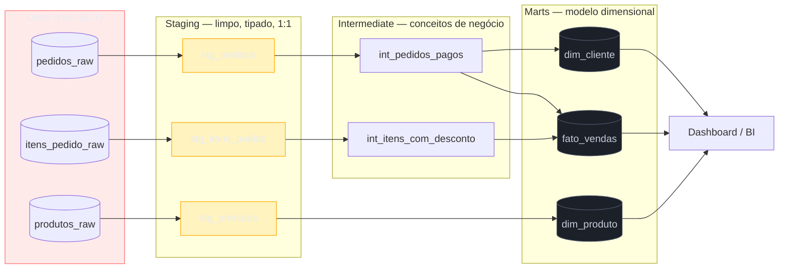
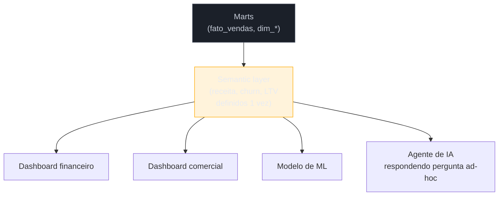

# Transformação SQL-first

> [!abstract] TL;DR
> Antes de existir um nome para isso, transformar dado era escrever um `SELECT INTO` gigante numa stored procedure, ou um script Python de 800 linhas rodando de madrugada num cron esquecido — sem versionamento, sem teste, sem ninguém sabendo de onde uma tabela vinha ou o que quebrava se uma coluna mudasse de tipo. **Analytics engineering** é a resposta: tratar a camada de transformação com a mesma disciplina que engenharia de software já aplica a código — SQL versionado em git, cada modelo é um `SELECT` que vira tabela ou view, modelos referenciam outros modelos formando um grafo de dependência derivado automaticamente do próprio código, testes de dados declarativos rodam antes do merge, e documentação/lineage nascem do código em vez de viverem numa wiki desatualizada. O paradigma popularizado pelo dbt a partir de 2016 virou, em 2026, pré-requisito de qualquer stack de dados séria — a ponto de a própria dbt Labs ter se fundido à Fivetran. Esta nota cobre o modelo mental (tool-neutral) por trás disso: modularidade em camadas, testes, documentação-como-código, ambientes/CI, e a **semantic layer** que resolve o problema de cada dashboard calcular "receita" de um jeito diferente.

> [!question]- Perguntas que esta nota responde
> - O que exatamente quebrou no jeito antigo de transformar dado (SQL solto, stored procedures, scripts espalhados)?
> - O que significa, na prática, "tratar SQL analítico como código" — versionar, testar, documentar?
> - Como um conjunto de `SELECT`s isolados vira um grafo de dependência sem ninguém desenhar esse grafo à mão?
> - Que tipos de teste fazem sentido numa camada de transformação, e onde termina o trabalho desta nota e começa o de qualidade de dados?
> - O que é uma semantic layer, e por que ela virou pré-requisito de projeto de BI em 2026?
> - Onde exatamente termina "transformação" e começa "orquestração"?

## O SQL que ninguém mais entende

Volte ao e-commerce desta trilha. O pipeline já extraiu pedidos brutos do Postgres de produção e pousou os dados, praticamente intactos, dentro do data warehouse — o padrão ELT que a nota 01 desta trilha descreve. Chegou a hora de transformar esse dado bruto em algo que um analista consiga consultar sem reconstruir, a cada pergunta, o esquema inteiro da aplicação de origem.

Num time sem disciplina de transformação, isso normalmente acontece de um destes jeitos:

- Alguém escreve um `SELECT` gigante, com quinze `CASE WHEN` e seis `JOIN`, direto na ferramenta de BI — e ele vive só ali, dentro da configuração do dashboard, invisível para qualquer outra pessoa do time.
- Alguém cria uma **stored procedure** no warehouse que recalcula uma tabela de resumo todo dia de madrugada — sem teste, sem revisão de código, e sem ninguém saber se ela ainda está rodando até o dia em que o número do dashboard fica visivelmente errado.
- Alguém escreve um script Python que lê tabelas brutas, aplica uma dúzia de regras de negócio em pandas, e escreve de volta no warehouse — um script que só uma pessoa do time sabe editar, porque só ela lembra por que aquela linha específica existe.

O problema comum aos três: **a lógica de negócio que define "o que é uma venda válida" ou "como calcular receita líquida" mora espalhada, sem versão, sem teste e sem documentação**. Seis meses depois, alguém precisa mudar uma regra — digamos, passar a excluir pedidos cancelados do cálculo de receita — e a pergunta "quais tabelas e dashboards dependem dessa lógica?" não tem resposta confiável. Ninguém sabe o **lineage** (a linha de origem: de onde um número vem, por quais transformações ele passou). A mudança sai, quebra um dashboard que ninguém lembrava que existia, e o time de dados passa a ser visto como frágil — não porque o SQL estivesse errado, mas porque **a disciplina em volta do SQL** nunca existiu.

> [!warning] "Funciona, então está documentado o suficiente"
> **O que acontece:** uma stored procedure ou um script de transformação roda direito por meses, e ninguém sente falta de documentação — até o dia em que precisa mudar algo. **Por quê:** "funcionar" e "ser seguro de mudar" são propriedades diferentes. Sem saber que outras tabelas e dashboards dependem de um modelo, qualquer alteração vira aposta — você só descobre o efeito colateral depois que o dashboard errado já foi visto por alguém. **Como evitar:** tratar o lineage como produto do próprio código de transformação, não como artefato manual à parte. Se o grafo de dependência não é gerado automaticamente a partir de como os modelos se referenciam, ele vai ficar desatualizado — é questão de tempo.

Para fixar o contraste antes de entrar no paradigma que resolve isso:

| Dimensão | SQL solto (antes) | SQL-first (analytics engineering) |
|---|---|---|
| Onde a lógica mora | Espalhada — dashboard, stored procedure, script isolado | Modelos versionados num repositório único |
| Como muda | Editada direto em produção, sem revisão | Pull request, revisado, testado antes do merge |
| Como se sabe o impacto | Descoberto quando algo quebra | Grafo de dependência gerado do código |
| Como se valida qualidade | Ninguém valida até o número parecer errado | Testes declarativos rodam a cada execução |
| Como se documenta | Wiki à parte, quase sempre desatualizada | Descrição junto do modelo, no mesmo commit |

## Analytics engineering: disciplina de software aplicada a SQL

**Analytics engineering** é o nome que se consolidou, a partir de 2016 com a ascensão do dbt, para o trabalho de aplicar práticas de engenharia de software à camada de transformação analítica[^dbt-ae]. O papel já apareceu na nota 01 desta trilha, como o elo entre o data engineer (que constrói a plataforma e a ingestão) e o data analyst/data scientist (que consome tabelas prontas). Esta nota aprofunda **o que**, na prática, esse papel faz — o paradigma, não uma ferramenta específica.

O modelo mental, hoje associado a ferramentas como dbt e SQLMesh mas **não exclusivo de nenhuma delas**, tem cinco ideias centrais:

1. **Transformação é `SELECT`, não `INSERT`/`UPDATE` imperativo.** Em vez de escrever passo a passo como popular uma tabela (insira isto, depois atualize aquilo), você declara *o que* a tabela final deveria conter — um `SELECT` puro. A ferramenta de transformação decide, por baixo, como materializar isso: como tabela recriada do zero, como view, ou de forma incremental (só as linhas novas). Essa é a virada declarativa: você descreve o resultado, não o procedimento.
2. **Cada modelo é um arquivo versionado em git.** Um modelo de transformação — o `SELECT` que define uma tabela — vive num arquivo `.sql`, sob controle de versão, exatamente como qualquer código de aplicação. Isso traz de graça tudo que git já resolve: histórico de mudanças, quem mudou o quê e por quê, revisão de código via pull request antes de qualquer alteração ir para produção.
3. **Modelos referenciam outros modelos, e o grafo nasce disso.** Em vez de escrever o nome físico de uma tabela (`analytics.stg_pedidos`), um modelo referencia *outro modelo* por um mecanismo de referência simbólica. A ferramenta resolve essas referências, descobre a ordem correta de execução, e **deriva o grafo de dependência (DAG) automaticamente** — ninguém desenha esse grafo à mão, e ele nunca fica desatualizado, porque é gerado do próprio código a cada execução.
4. **Testes de dados são declarativos, não scripts avulsos.** Em vez de um script separado que verifica se uma coluna tem valor nulo, você declara a asserção junto do modelo — "esta coluna nunca é nula", "este valor é único", "esta chave estrangeira sempre existe do outro lado". A ferramenta roda essas asserções como parte do próprio pipeline de transformação e falha cedo, antes que o dado ruim chegue ao dashboard.
5. **Documentação e lineage nascem do código, não de uma wiki à parte.** Descrição de cada modelo e de cada coluna vive ao lado da definição; o grafo de dependência entre modelos é visualizável automaticamente. Quem se pergunta "que outras tabelas e dashboards quebram se eu mudar esta coluna?" tem uma resposta rastreável, não uma pergunta em um canal de chat torcendo para alguém lembrar.

> [!info] Caducidade (2026-07) — o estado do ecossistema
> O dbt (Data Build Tool, lançado em 2016 pela dbt Labs) foi a ferramenta que popularizou e nomeou esse paradigma, e em 2026 **virou table-stakes** — pré-requisito básico, não diferencial — em qualquer stack analítica séria sobre um warehouse SQL. Dois movimentos recentes marcam o estado atual do ecossistema:
> - **Fivetran e dbt Labs completaram uma fusão total em junho de 2026** (anunciada em outubro de 2025), unindo a ferramenta líder de ingestão (EL) gerenciada com a ferramenta líder de transformação sob uma mesma empresa — consolidação explícita ao redor da narrativa de "infraestrutura de dados confiável para agentes de IA"[^fivetran-dbt]. dbt Core permanece open source sob licença Apache 2.0.
> - **dbt Fusion**, o motor de nova geração escrito em Rust (com entendimento nativo de SQL através de múltiplos dialetos de warehouse), promete análise estática do projeto inteiro e ganhos de performance de parsing/compilação relatados em até 30x sobre o dbt Core clássico — feedback mais rápido em CI e erros descobertos antes de rodar a query de verdade[^dbt-fusion].
> - **SQLMesh** (Tobiko) se consolidou como alternativa credível ao dbt, partindo de uma premissa diferente: entender a *semântica* do SQL (não só o texto), o que habilita recursos como detecção automática de mudanças "breaking" entre versões de um modelo.
> - A **semantic layer** (adiante nesta nota) amadureceu de recurso experimental para componente esperado de qualquer projeto de BI que leve governança de métricas a sério. Nada disso muda o modelo mental descrito aqui — só acelera a engine por baixo e consolida quem é dono de qual pedaço do ecossistema. Verifique o estado das ferramentas antes de decidir entre elas; esta nota ensina o paradigma, não uma ferramenta.

## Os pilares do paradigma SQL-first

### Modularidade: staging → intermediate → marts

O primeiro instinto de quem começa a transformar dado é escrever um único `SELECT` gigante que sai do dado bruto direto para a tabela final que o dashboard consome. Funciona para uma pergunta — e vira um pesadelo de manutenção na segunda pergunta parecida, porque a mesma lógica de limpeza (converter tipo, renomear coluna, filtrar linha inválida) acaba copiada e colada em vários lugares.

O padrão que resolve isso é organizar os modelos em **camadas**, cada uma com uma responsabilidade só:

- **Staging** — um modelo por tabela de origem, fazendo só o mínimo: renomear colunas para um padrão consistente, converter tipos, filtrar linhas obviamente inválidas. Staging nunca junta tabelas nem aplica regra de negócio — é a camada de "dado bruto, mas limpo e com nome decente".
- **Intermediate** — combina modelos de staging para expressar um conceito de negócio intermediário: "pedidos com status normalizado", "itens de pedido com desconto já aplicado". Existe para não repetir a mesma lógica de junção em cinco modelos finais diferentes.
- **Marts** — o produto final, no formato que o consumidor (dashboard, analista, modelo de ML) de fato usa. É aqui que o modelo dimensional da nota 02 desta trilha (fatos e dimensões) ganha vida: `fato_vendas`, `dim_produto`, `dim_cliente` são modelos de mart, construídos a partir de modelos intermediate, que por sua vez vêm de modelos de staging.



O ganho de organizar em camadas é o mesmo ganho de qualquer boa separação de responsabilidades em software: cada modelo é fácil de entender isoladamente, a lógica de limpeza existe em um lugar só (princípio DRY aplicado a SQL), e o grafo de referências entre camadas — derivado automaticamente do código, como descrito acima — vira a documentação viva de como um dado bruto vira um número de negócio.

> [!question]- Isso não é só reinventar "views em cascata"?
> Parcialmente, sim — e é exatamente essa a virada de valor: views em cascata sempre foram possíveis num banco relacional comum. O que faltava era a **disciplina em volta**: versionamento em git, revisão de código antes de mudar uma view de produção, testes automáticos que rodam antes de qualquer alteração ir para frente, e um grafo de dependência gerado automaticamente em vez de descoberto na marra quando algo quebra. O SQL em si não é a novidade; o que envolve o SQL é.

### Materialização: view, tabela ou incremental

Declarar um modelo como um `SELECT` puro resolve *o que* ele produz, mas ainda existe uma decisão de engenharia sobre *como* esse resultado vira algo consultável — a **estratégia de materialização**. Três opções cobrem a maioria dos casos:

- **View** — o `SELECT` não roda antecipadamente; ele é recalculado a cada consulta. Barato de manter (nada para reprocessar), mas cada consulta paga o custo de reprocessar tudo — aceitável para um modelo de staging fino, ruim para um mart consultado o dia inteiro por um dashboard.
- **Tabela (recriação total)** — o modelo roda por completo a cada execução do pipeline e substitui a tabela inteira. Simples de raciocinar (o resultado é sempre coerente com o `SELECT` atual), mas custa proporcionalmente ao volume total de dado, mesmo quando só uma fração mudou desde a última execução.
- **Incremental** — o modelo processa só as linhas novas ou alteradas desde a última execução, e as anexa (ou atualiza) na tabela existente, em vez de recriá-la inteira. É o equivalente, na camada de transformação, à ingestão incremental que a nota 02 desta trilha descreve para a camada de extração — e carrega o mesmo tipo de risco: decidir corretamente "o que mudou desde a última vez" é mais difícil que parece, e um critério mal definido silenciosamente perde ou duplica linha.

A escolha entre as três não é estética — é uma troca entre custo de processamento, simplicidade de raciocínio e frescor. Um modelo de staging fino sobre uma tabela pequena pode viver bem como view; `fato_vendas`, alimentado por milhões de linhas por dia, quase sempre exige materialização incremental para não recalcular o histórico inteiro a cada execução do pipeline.

### Testes de dados: asserções que rodam antes do dashboard quebrar

Um modelo intermediate ou de mart carrega uma promessa implícita: "esta coluna nunca é nula", "esta chave é única", "todo produto referenciado aqui existe na tabela de produtos". No paradigma SQL-first, essas promessas viram **testes declarativos** que rodam junto do pipeline de transformação — tipicamente quatro categorias:

- **Not null** — uma coluna essencial (chave primária, valor monetário) nunca pode vir vazia.
- **Unique** — uma chave não pode se repetir onde a lógica de negócio exige unicidade.
- **Valores aceitos** — uma coluna categórica (status do pedido, por exemplo) só pode assumir um conjunto conhecido de valores; um valor novo e inesperado é sinal de mudança na fonte que ninguém avisou.
- **Integridade referencial** — toda chave estrangeira num modelo de fato precisa existir na dimensão correspondente; um pedido referenciando um produto inexistente é dado corrompido, não uma peculiaridade.

Além dessas quatro asserções padrão, é possível escrever **testes customizados** — qualquer consulta que deveria retornar zero linhas quando o dado está saudável (por exemplo, "nenhum pedido pago pode ter valor total negativo"). O ganho central é que esses testes **falham cedo**, na própria execução do pipeline, antes que o dado ruim chegue a um dashboard e alguém tome uma decisão de negócio em cima de um número errado.

Um teste customizado, no modelo mental tool-neutral, nada mais é do que uma consulta que **deveria retornar zero linhas** quando o dado está saudável:

```sql
-- Teste custom: nenhum pedido pago pode ter valor total negativo
SELECT pedido_id, valor_total
FROM fato_vendas
WHERE status = 'pago'
  AND valor_total < 0;
```

Se essa consulta retorna alguma linha, o teste falhou — e a ferramenta de transformação impede o modelo de avançar, ou pelo menos alerta antes que o número chegue a um dashboard. Não há mágica na mecânica: é o mesmo princípio de uma asserção de teste unitário (`assert resultado == esperado`), só que expressa em SQL e rodando contra dado real de produção a cada execução do pipeline, em vez de contra um caso fictício isolado.

> [!info] Onde isso se aprofunda
> Esta nota cobre testes de dados como parte do fluxo de transformação — a disciplina de escrever a asserção junto do modelo. A observabilidade de dados em profundidade (monitoramento contínuo, detecção de anomalia, alertas de frescor e volume, SLA de qualidade) é assunto do sub-galho de qualidade e governança mais adiante nesta trilha, que trata "confiar no que o pipeline entrega" como tema central. Da mesma forma, **data contracts** — acordos formais entre quem produz e quem consome um dado, sobre schema e SLA — pertencem a esse mesmo sub-galho seguinte. Aqui, teste de dado é ferramenta do desenvolvedor de transformação; lá, qualidade de dado é disciplina organizacional inteira.

### Documentação e lineage como código

Um problema recorrente em times sem disciplina de transformação: a documentação, quando existe, vive numa wiki separada do código, e as duas divergem em semanas. No paradigma SQL-first, a descrição de cada modelo e de cada coluna é declarada **junto** da definição do modelo — no mesmo commit, na mesma revisão de código. Isso não elimina o esforço de escrever documentação, mas elimina a divergência estrutural entre "o código faz" e "a wiki diz que o código faz", porque as duas coisas vivem no mesmo lugar e mudam juntas.

O **lineage** — de onde um dado vem, por quais transformações passou até chegar numa coluna de um dashboard — deixa de ser uma investigação manual (abrir cinco arquivos SQL e seguir `JOIN` por `JOIN` na mão) e vira um grafo navegável, gerado automaticamente a partir das referências entre modelos descritas no item anterior. Isso responde, de forma confiável, à pergunta que abriu esta nota: "o que quebra se eu mudar esta coluna?" — antes de mudar, não depois que o dashboard errado já foi visto.

### Ambientes e CI: testar a transformação antes de ela valer

Uma prática que separa um time maduro de um time que "usa dbt mas continua no improviso" é ter **ambientes separados** — tipicamente um ambiente de desenvolvimento, onde um analytics engineer testa uma mudança de modelo contra um recorte ou clone dos dados, e um ambiente de produção, que os dashboards de verdade consultam. Uma mudança de modelo nunca vai direto para produção: ela é proposta como *pull request*, roda os testes declarativos automaticamente (o que a disciplina de **DataOps** chama de CI para transformação de dados — aplicar a mesma disciplina de integração contínua que já existe em engenharia de software para o pipeline de dados), e só é mesclada depois de passar.

Esse fluxo — mudança proposta, testada automaticamente, revisada por outra pessoa, só então promovida — é o que transforma "eu acho que essa mudança está certa" em "essa mudança passou pelos mesmos portões de qualidade que qualquer outro código do sistema passa". É o mesmo raciocínio de esteira de CI/CD que qualquer engenheiro de software já aplica a código de aplicação, agora aplicado ao SQL que produz os números que a empresa usa para decidir.

Um refinamento que aparece em projetos maduros, à medida que o número de modelos cresce para centenas ou milhares: rodar **todos** os testes e reconstruir **todos** os modelos a cada pull request fica caro e lento — minutos ou horas de CI para uma mudança de uma linha num modelo isolado. A resposta é limitar a execução de CI aos modelos efetivamente afetados pela mudança — o próprio modelo alterado e tudo que depende dele a jusante no grafo, identificado automaticamente a partir das referências entre modelos. É o mesmo princípio de qualquer suíte de teste que aprende a rodar só o que uma mudança pode ter afetado, em vez da bateria inteira a cada commit — só que aqui o "grafo de dependência" não precisa ser inferido por heurística de import; ele já existe, explícito, como subproduto do próprio modelo de referências entre `SELECT`s.

> [!question]- Quem escreve esses testes e revisa esses pull requests?
> Tipicamente o próprio analytics engineer que está mudando o modelo escreve o teste junto da mudança — o mesmo hábito de "quem muda o comportamento, escreve o teste que prova o comportamento" que já vale para código de aplicação. A revisão de pull request, por sua vez, é o momento em que outra pessoa do time — outro analytics engineer, ou o data engineer responsável pela plataforma — confere não só se o SQL está correto, mas se a mudança respeita o contrato implícito que outros modelos e dashboards já assumem sobre aquela tabela. É trabalho de time, não de uma pessoa isolada validando a própria mudança.

## Semantic layer: uma definição de métrica, não cinco

Mesmo com modelos bem construídos, testados e documentados, um problema persiste em muitas organizações: **cada time calcula "receita" de um jeito diferente**. O time financeiro exclui reembolsos; o time de produto conta pedido no momento da compra, não do pagamento; o time comercial usa uma janela de atribuição diferente para calcular receita "da campanha X". Três dashboards, três números diferentes para a mesma pergunta — e a reunião vira debate sobre qual número está certo em vez de debate sobre o que fazer com ele.

A **semantic layer** (camada semântica, ou camada de métricas) resolve isso definindo métricas de negócio — receita, churn, *lifetime value*, taxa de conversão — **uma vez só**, de forma centralizada e versionada, geralmente por cima dos modelos de mart já transformados. A definição inclui não só a fórmula (como agregar), mas também as dimensões pelas quais a métrica pode ser cortada (por categoria, por região, por mês) e os filtros que fazem parte da definição canônica (por exemplo, "receita" já exclui pedidos cancelados por definição, então ninguém precisa lembrar de filtrar isso de novo em cada query). Todo dashboard, toda ferramenta de BI, todo modelo de ML que precisa de "receita" consulta essa mesma definição — em vez de reimplementá-la, ligeiramente diferente, em cada lugar.



Em 2026, a semantic layer ganhou um motivo adicional de peso: **agentes de IA que respondem perguntas de negócio em linguagem natural** ("qual foi a receita do trimestre?") precisam de uma fonte confiável e única de definição de métrica para não inventar um número plausível, mas errado. Uma definição de métrica bem-governada na semantic layer é, ao mesmo tempo, a fonte que alimenta o dashboard tradicional e o contexto que um agente consulta antes de responder — o que tornou a camada semântica, na prática, um pré-requisito de qualquer projeto de BI ou de IA analítica que leve governança a sério, e não mais um recurso opcional de ferramentas mais avançadas.

> [!question]- Semantic layer é a mesma coisa que "cubo OLAP"?
> Aparentada, não idêntica. Um cubo OLAP clássico pré-computa e materializa combinações de agregação para consulta rápida — uma técnica de performance sobre um modelo já fixo. Uma semantic layer moderna é, antes de tudo, uma camada de **definição e governança de métrica**: ela pode traduzir a pergunta "receita por região, mês passado" numa query SQL gerada na hora contra os modelos de mart, sem necessariamente pré-computar nada. O que as duas compartilham é o objetivo de fundo — dar a quem consulta uma resposta consistente, sem que cada pessoa reimplemente a lógica de agregação à mão.

## Quando SQL-first não é suficiente

Nem toda transformação cabe confortavelmente num `SELECT`. Vale nomear os limites do paradigma, porque um sinal de maturidade em entrevista — e no trabalho real — é saber quando ele não é a resposta certa:

- **Lógica que não expressa bem em SQL declarativo.** Transformações que dependem de laços com estado complexo, chamadas a serviço externo linha a linha, ou algoritmos que SQL não modela naturalmente (parsing de texto livre não estruturado, certas operações de geolocalização, a maior parte de feature engineering para modelos de ML) tendem a viver melhor em código procedural — Python, tipicamente — orquestrado ao lado dos modelos SQL, não dentro deles à força.
- **Streaming e processamento evento a evento.** O paradigma SQL-first, mesmo em sua forma incremental, ainda pensa em execuções discretas do pipeline. Transformação contínua sobre um fluxo de eventos — a diferença entre "recalcular a cada 10 minutos" e "reagir a cada evento assim que ele chega" — é outro modelo de execução, coberto na nota 05 desta trilha.
- **Volume ou complexidade que exigem processamento distribuído dedicado.** Para a maioria dos casos de analytics, um warehouse moderno com motor colunar dá conta de agregações pesadas via SQL puro. Casos de escala ou complexidade computacional muito acima disso — certos pipelines de ML em lote, processamento de dado não estruturado em massa — ainda se beneficiam de um motor de processamento distribuído dedicado (Spark, por exemplo), com SQL rodando por cima como camada de conveniência, não como motor único.

O ponto de julgamento, como em qualquer decisão de arquitetura desta trilha, não é "SQL-first é superior" ou "SQL-first é limitado" em abstrato — é reconhecer que a grande maioria das transformações analíticas de um negócio (agregar, juntar, filtrar, calcular métrica) cabe bem em SQL declarativo e versionado, e reservar código procedural para os casos genuinamente mal servidos por esse modelo.

## Voltando ao e-commerce: staging, marts e uma métrica

Fechando o fio condutor desta trilha: os pedidos brutos que chegaram ao warehouse via ELT (nota 01) e ingestão incremental (nota 02) passam agora pela camada de transformação:

1. **Staging** — `stg_pedidos`, `stg_itens_pedido`, `stg_produtos`: cada um espelha uma tabela de origem, com tipos corrigidos e nomes de coluna padronizados, sem nenhuma regra de negócio ainda.
2. **Intermediate** — `int_pedidos_pagos` filtra só pedidos com status pago; `int_itens_com_desconto` calcula o valor líquido de cada item já com desconto aplicado. Nenhum dashboard consulta esses modelos diretamente — eles existem para não repetir essa lógica em cada mart.
3. **Marts** — `fato_vendas`, `dim_produto`, `dim_cliente`, `dim_tempo`: o modelo dimensional (star schema) da nota 02 desta trilha, pronto para consulta agregada.
4. **Semantic layer** — sobre `fato_vendas`, a métrica "receita líquida" é definida uma vez: soma do valor de item com desconto, para pedidos pagos, excluindo cancelamentos. O dashboard financeiro, o dashboard comercial e um eventual agente de IA respondendo "qual foi a receita de outubro?" consultam a mesma definição — nenhum dos três recalcula a regra à mão.

Cada etapa tem teste declarativo (chave de `fato_vendas` referenciando uma linha existente em cada dimensão, coluna de valor nunca nula), cada modelo é um arquivo versionado com pull request revisado antes de ir para produção, e o grafo inteiro — de `pedidos_raw` até a métrica de receita — é navegável a partir do próprio código, sem ninguém ter desenhado esse mapa à mão.

## Onde esta nota termina

Esta nota cobriu **o quê** e **por quê** transformar SQL com disciplina de engenharia de software — modelos, camadas, testes, documentação, semantic layer. Ela não cobre **quando e em que ordem os modelos de fato executam** — isso é orquestração: agendar, sequenciar, lidar com falha e reprocessamento de um DAG de transformação (e de ingestão) em produção. É o assunto da próxima nota desta trilha.

## Em entrevista

Uma pergunta comum de nível sênior: "como você organizaria a transformação de dados de um time que hoje só tem SQL solto em scripts?" A resposta fraca nomeia uma ferramenta ("eu instalaria dbt") sem explicar o problema que ela resolve. A resposta forte descreve o paradigma: versionar cada transformação como um `SELECT` em git, organizar em camadas (staging → intermediate → marts) para eliminar lógica duplicada, declarar testes de dado junto de cada modelo para falhar cedo, e deixar documentação e lineage nascerem do próprio código em vez de uma wiki que diverge. Só depois disso nomear uma ferramenta concreta como exemplo.

Outra pergunta frequente: "por que times de dados adotam uma semantic layer, se já têm um data warehouse bem modelado?" A resposta madura reconhece que modelo dimensional bem feito resolve *como armazenar* o dado para consulta rápida, mas não resolve *quem define* o que "receita" significa — e sem uma definição de métrica centralizada e versionada, cada dashboard e cada analista reimplementa essa lógica de um jeito ligeiramente diferente, gerando números que discordam entre si mesmo consultando o mesmo warehouse.

Um terceiro eixo, mais avançado: "que testes de dado você priorizaria num pipeline de transformação novo?" A resposta sênior não lista testes genéricos por listar — ela amarra cada teste a um risco de negócio concreto: unicidade de chave numa tabela de fato evita dupla contagem de venda; integridade referencial entre fato e dimensão evita que um relatório perca linhas silenciosamente num `JOIN`; valores aceitos numa coluna de status pega, cedo, uma mudança não anunciada no sistema de origem.

## How to explain in English

> "Analytics engineering brings software engineering discipline to the SQL transformation layer: every transformation is a version-controlled SELECT statement, models reference other models so the dependency graph — the DAG — is derived automatically instead of drawn by hand, data tests are declared alongside each model and run before bad data reaches a dashboard, and documentation and lineage are generated from the code itself. A semantic layer sits on top, defining business metrics like revenue or churn exactly once so every dashboard, analyst, and AI agent queries the same definition instead of five slightly different ones."

| PT | EN |
|----|----|
| Engenharia de analytics | Analytics engineering |
| Transformação SQL-first | SQL-first transformation |
| Modelo (de transformação) | Model |
| Camada de staging | Staging layer |
| Camada intermediate | Intermediate layer |
| Camada de marts | Marts layer |
| Grafo de dependência / DAG | Dependency graph / DAG |
| Teste de dado | Data test |
| Lineage (linhagem de dado) | Data lineage |
| Documentação como código | Documentation as code |
| Camada semântica | Semantic layer |
| Métrica | Metric |
| Ambiente (dev/prod) | Environment (dev/prod) |
| Integração contínua para dados | DataOps / CI for data |

## O que vem a seguir

Modelos transformados, testados e documentados ainda precisam **rodar** — na ordem certa, no horário certo, com recuperação sensata quando algo falha. Essa é a camada de orquestração: o sistema que sequencia o DAG de transformação (e de ingestão) em produção.

- [[04 - Orquestração]] — DAG, idempotência, backfill, agendamento vs. orientado a evento, o orquestrador como sistema de produção

## Fontes

- dbt Labs — [*What is analytics engineering?*](https://www.getdbt.com/blog/what-is-analytics-engineering) — a definição canônica do papel e do paradigma SQL-first popularizado pelo dbt.
- Fivetran — [*Fivetran + dbt Labs Complete Merger to Create the Data Infrastructure for Trusted AI Agents*](https://www.fivetran.com/press/fivetran-dbt-labs-complete-merger-to-create-the-data-infrastructure-for-trusted-ai-agents), junho de 2026 — confirmação da fusão completa entre Fivetran e dbt Labs, anunciada em outubro de 2025 e concluída em junho de 2026; dbt Core permanece Apache 2.0. (WebSearch, 2026-07)
- dbt Labs — [*dbt Fusion engine*](https://docs.getdbt.com/docs/fusion) e [*About Fusion*](https://docs.getdbt.com/docs/fusion/about-fusion) — documentação do motor de nova geração em Rust, com análise estática e ganhos de performance de parsing/compilação. (WebSearch, 2026-07)
- Reis, Joe & Housley, Matt — *Fundamentals of Data Engineering: Plan and Build Robust Data Systems*, O'Reilly, 2022 — enquadramento do ciclo de vida e da fronteira entre data engineering e analytics engineering, referenciado na nota 01 desta trilha.

[^dbt-ae]: dbt Labs, *What is analytics engineering?*. [^fivetran-dbt]: Fivetran, *Fivetran + dbt Labs Complete Merger to Create the Data Infrastructure for Trusted AI Agents*, junho de 2026. [^dbt-fusion]: dbt Labs, documentação do dbt Fusion engine, docs.getdbt.com/docs/fusion.
