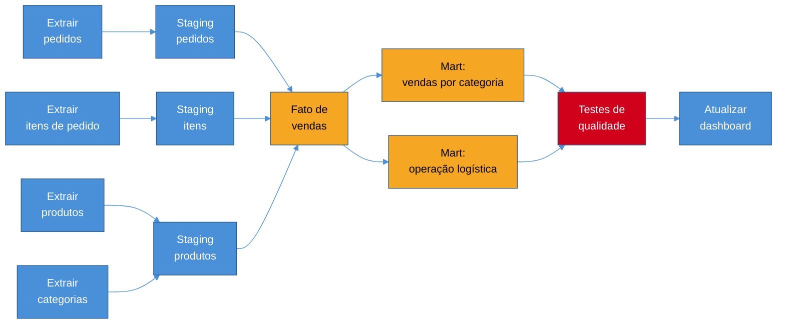

# Orquestração

> [!abstract] TL;DR
> Um pipeline de dados real não é um script — é dezenas de passos com dependências entre si: extrair pedidos, carregar bruto, transformar staging, construir marts, rodar testes de qualidade, atualizar dashboard. Rodar isso na ordem certa, esperando cada dependência terminar, tratando falha e sabendo o que reexecutar quando algo muda, é um problema de engenharia próprio — resolvido por um **orquestrador**. O modelo mental central é o **DAG** (*directed acyclic graph*): tarefas são nós, dependências são arestas, e a ausência de ciclos garante que o grafo sempre tem uma ordem de execução válida. Em cima desse modelo, esta nota cobre por que cada tarefa precisa ser **idempotente**, o que é um **backfill** e por que ele só é seguro com idempotência, a escolha entre **scheduling por tempo** e **disparo por evento**, por que o próprio orquestrador precisa ser tratado como sistema de produção confiável, e a virada recente de orquestrar **tarefas** para orquestrar **ativos de dados** — a ideia por trás de Dagster e da própria evolução do Airflow.

> [!question]- Perguntas que esta nota responde
> - Por que "rodar os scripts na ordem certa com cron" não escala, e o que um orquestrador de fato resolve que cron não resolve?
> - O que é um DAG, formalmente, e por que a ausência de ciclos é uma exigência, não um detalhe técnico?
> - Por que cada tarefa de um pipeline precisa ser idempotente, e o que acontece quando uma tarefa falha no meio do DAG?
> - O que é backfill, e por que ele só é seguro quando as tarefas são idempotentes?
> - Quando um pipeline deveria ser agendado por tempo e quando deveria reagir a um evento?
> - Por que o orquestrador em si precisa de monitoramento e alerta, e o que acontece quando ele cai?
> - O que muda entre orquestrar tarefas e orquestrar ativos de dados — e por que essa é a direção que a indústria está tomando?

## O cron que virou um inferno de scripts frágeis

Volte ao pipeline de analytics do e-commerce que a trilha vem construindo desde a nota 01. Numa fase inicial, ele parece simples: um script Python roda de madrugada, extrai pedidos do Postgres, carrega no warehouse, e uma segunda tarefa transforma esse dado bruto nas tabelas de staging. Um `cron` disparando os dois scripts em sequência, com um `sleep` de margem entre eles, resolve — por enquanto.

O pipeline cresce, porque pipeline de dados sempre cresce. Agora existem: extração de pedidos, extração de itens de pedido, extração de produtos e categorias, uma tarefa de staging para cada uma dessas fontes, a construção da tabela de fatos de vendas (que depende de *todas* as staging anteriores estarem prontas), a construção de duas tabelas de marts diferentes a partir dos fatos (uma para o dashboard de vendas, outra para o time de logística), uma bateria de testes de qualidade de dados que precisa rodar depois dos marts e antes de qualquer dashboard ser atualizado, e finalmente um passo que atualiza o cache do BI. Dez, quinze passos, com uma teia de dependências que não é mais uma linha reta.

Rodar isso com `cron` e `sleep` degrada rápido, e degrada de formas previsíveis:

- **A ordem vira suposição, não garantia.** O `sleep` de trinta minutos entre extração e staging funcionava quando o volume era pequeno; no dia em que a extração demora quarenta minutos porque o Postgres estava sob carga pesada, a tarefa de staging começa a ler uma tabela de origem incompleta — silenciosamente, sem erro nenhum, só um número errado no relatório da manhã seguinte.
- **Falha parcial não tem resposta.** Se a terceira de quinze tarefas falha, o que acontece com as doze seguintes? Um script ingênuo continua rodando sobre dado que nunca chegou a existir; um script mais cauteloso aborta tudo — mas então alguém precisa descobrir manualmente onde parou, e reiniciar a partir dali, geralmente às três da manhã, geralmente sob pressão.
- **Paralelismo vira acidente, não decisão.** As duas extrações de produtos e categorias não dependem uma da outra — poderiam rodar ao mesmo tempo, economizando tempo real de execução. Mas nada no desenho de "scripts em sequência com sleep" sabe disso; ele só sabe rodar na ordem em que foi escrito.
- **Reprocessar um dia específico vira arqueologia.** Um bug é corrigido na lógica de transformação de fevereiro; alguém precisa recalcular os marts daquele mês inteiro. Com scripts soltos, isso significa descobrir manualmente quais variáveis de data cada script espera, editá-las à mão, e rodar tudo de novo torcendo para não esquecer um passo.

Nenhum desses problemas é sobre a lógica de cada tarefa individual — cada script, isolado, pode estar perfeitamente correto. O problema é **coordenação**: saber a ordem certa, esperar as dependências, reagir à falha, e permitir reprocessamento controlado. É exatamente esse problema — coordenação entre tarefas, não a lógica de cada uma — que um **orquestrador** resolve.

> [!question]- Isso não é o mesmo problema que Kubernetes resolve?
> Não — são coordenações de naturezas diferentes, e é um erro comum de quem vem de infraestrutura confundir os dois. Kubernetes orquestra **containers**: garante que um conjunto de processos de longa duração (um serviço web, um worker) continue rodando, com a réplica certa, reiniciando o que morre — coordenação *de infraestrutura*, sem noção de "esta tarefa depende daquela ter terminado com sucesso". Um orquestrador de dados coordena **tarefas com dependências e um começo e fim bem definidos** — "rode B só depois que A terminar com sucesso, e se A falhar, não rode B" — coordenação *de fluxo de trabalho*. Na prática, muitos orquestradores de dados até rodam suas tarefas *dentro* de containers gerenciados por Kubernetes — as duas camadas coexistem, cada uma resolvendo o problema que a outra não resolve.

## DAG: o modelo que sustenta tudo

A nota 01 desta trilha já introduziu o vocabulário: um pipeline é melhor pensado como um **DAG** — *directed acyclic graph*, grafo direcionado sem ciclos. Cada tarefa é um **nó**; cada dependência entre tarefas é uma **aresta direcionada**, apontando de quem precisa terminar primeiro para quem depende desse resultado. A propriedade "acíclico" não é um detalhe formal — é a garantia estrutural que torna o grafo executável: se A dependesse de B e B dependesse de A, não existiria nenhuma ordem válida para rodar os dois, porque cada um exigiria que o outro já tivesse terminado primeiro. Um DAG, por definição, sempre admite pelo menos uma **ordem topológica** — uma sequência em que cada nó aparece depois de todos os nós dos quais ele depende.

É essa garantia que o orquestrador explora. Dado o grafo completo, ele calcula uma ordem de execução válida, dispara tarefas independentes em paralelo (as duas extrações que não dependem uma da outra, por exemplo), espera cada dependência ser satisfeita antes de disparar o nó seguinte, e — ponto central para o que vem depois nesta nota — sabe exatamente **quais nós precisam ser reexecutados** quando algo muda, porque essa informação está no próprio grafo: se a extração de produtos precisa rodar de novo, todo nó que depende dela, direta ou transitivamente, também precisa.

Repare no paralelismo natural que o grafo expõe: as quatro extrações não dependem umas das outras e podem rodar ao mesmo tempo; as três tarefas de staging também são independentes entre si, e só convergem no nó de fato de vendas. Um orquestrador enxerga essa estrutura e paraleliza automaticamente — algo que "scripts em sequência com sleep" nunca faz, porque não tem noção nenhuma de grafo, só de ordem no arquivo.

> [!question]- Preciso desenhar o DAG manualmente, nó por nó?
> Depende da ferramenta e do modelo (tarefa vs ativo, discutido mais adiante nesta nota), mas na maioria dos orquestradores modernos você declara as dependências, não a ordem — normalmente em código (Python, no caso do Airflow e do Dagster): "a tarefa de fato de vendas depende das tarefas de staging X, Y e Z". O orquestrador infere o grafo completo e a ordem topológica a partir dessas declarações locais; você nunca precisa escrever "primeiro rode isso, depois aquilo" explicitamente. É esse desacoplamento — declarar dependência, não sequência — que torna o DAG reorganizável sem reescrever tudo quando um passo novo entra no meio do fluxo.

## Idempotência: por que cada tarefa precisa sobreviver a rodar duas vezes

A nota 02 desta trilha já estabeleceu a idempotência como requisito de ingestão: reprocessar o mesmo lote não pode duplicar dado no destino. No nível do orquestrador, a mesma propriedade reaparece — mas agora aplicada a **cada tarefa do DAG**, não só à etapa de ingestão.

Falha é o estado normal de operação de qualquer pipeline com dezenas de tarefas rodando diariamente: uma conexão com o warehouse cai no meio de uma transformação, uma tarefa estoura o tempo limite porque o volume do dia foi maior que o normal, uma dependência externa (uma API de terceiros, um serviço de outro time) fica indisponível por alguns minutos. O orquestrador reage a isso com **retry automático** — reexecutar a tarefa que falhou, geralmente com um número máximo de tentativas e um intervalo crescente entre elas (*backoff* exponencial, para não bater na mesma dependência indisponível repetidamente sem dar tempo dela se recuperar). Esse retry só é seguro se a tarefa for **idempotente**: rodá-la de novo, do zero, precisa produzir o mesmo resultado final que rodá-la uma vez, mesmo que a primeira tentativa tenha parcialmente escrito dado antes de falhar.

Na prática, isso significa desenhar cada tarefa para uma das duas formas seguras:

- **Substituir, não acumular.** A tarefa que constrói o mart de vendas por categoria não faz `INSERT` incremental sobre o que já existe — ela recalcula e substitui a partição ou tabela inteira daquele intervalo de execução (`CREATE OR REPLACE`, ou um `DELETE` seguido de `INSERT` dentro de uma transação). Rodar duas vezes produz o mesmo resultado, porque a segunda execução simplesmente sobrescreve o que a primeira deixou.
- **Upsert por chave estável**, o mesmo mecanismo já discutido na nota 02 para ingestão, aplicado agora à transformação: se a tarefa insere ou atualiza por uma chave de negócio (o `id` do pedido, a combinação categoria+mês), rodar de novo com o mesmo dado converge para o mesmo estado, em vez de duplicar linhas.

Quando uma tarefa falha **no meio** de um DAG maior, o comportamento correto do orquestrador não é abortar tudo nem seguir cegamente em frente — é marcar aquela tarefa e tudo que dela depende como pendente, reexecutar a partir do ponto de falha (não do início do DAG inteiro, o que desperdiçaria o trabalho já concluído pelas tarefas anteriores), e só disparar as tarefas seguintes depois que a reexecução tiver sucesso. Isso só funciona sem risco de duplicação ou inconsistência porque cada tarefa, individualmente, é idempotente — a reexecução de uma tarefa específica não é um caso especial que exige tratamento à parte; é o mesmo código rodando de novo, com a mesma garantia de resultado.

> [!warning] Tarefa idempotente na primeira versão, quebrada depois
> **O que acontece:** uma tarefa de transformação nasce como `INSERT` puro, sem `DELETE` nem chave de upsert, porque na primeira versão do pipeline ninguém imaginou que ela precisaria ser reexecutada. Meses depois, um retry automático dispara essa tarefa duas vezes por causa de uma instabilidade momentânea no warehouse — e o mart de vendas duplica silenciosamente todas as linhas daquela execução. **Por quê:** idempotência não é uma propriedade que aparece "naturalmente" com o tempo — ela precisa ser desenhada explicitamente, e sua ausência só costuma aparecer no primeiro incidente real de retry, exatamente quando já é tarde para corrigir sem sujar dado em produção. **Como evitar:** tratar "esta tarefa pode rodar duas vezes sem corromper o resultado?" como pergunta obrigatória de design antes de qualquer tarefa entrar em produção — não como item de backlog para "quando der tempo".

## Backfill: reprocessar o passado com segurança

**Backfill** é o nome para um cenário que todo pipeline de produção enfrenta mais cedo ou mais tarde: reprocessar um intervalo histórico inteiro, não só a execução do dia. O gatilho típico é um bug corrigido na lógica de transformação — alguém descobre que a fórmula de faturamento por categoria estava contando frete como parte do valor do produto desde janeiro, corrige a lógica, e agora precisa recalcular todos os marts daquele mês inteiro, não só os de hoje em diante.

O que torna backfill tratável, em vez de uma operação manual arriscada, é a ideia de **intervalo de dados** (*data interval*, também chamado de *execution date* ou *logical date* em muitos orquestradores): cada execução do DAG não roda "agora", roda **para uma data lógica específica** — a execução do dia 15 de janeiro processa os dados *daquele* dia, mesmo que o job de fato rode fisicamente na madrugada do dia 16. Essa distinção entre "quando o job roda de verdade" e "para qual período de dado ele está processando" é o que permite ao orquestrador disparar, sob demanda, uma execução inteira para qualquer data passada — janeiro inteiro, um dia específico de março, uma semana de fevereiro — exatamente como se ela estivesse rodando pela primeira vez, só que com a data lógica apontando para o passado.

É aqui que a idempotência da seção anterior deixa de ser só higiene de engenharia e vira a condição que torna backfill seguro. Se cada tarefa do DAG substitui (ou faz upsert sobre) a partição correspondente à sua data lógica, rodar o backfill de janeiro inteiro — trinta e uma execuções, uma por dia, cada uma recalculando sua própria fatia — produz exatamente o mesmo estado final que teria existido se a lógica corrigida tivesse rodado desde o início. Sem idempotência, o mesmo backfill duplicaria ou corromperia dado em vez de corrigi-lo — o remédio vira mais um problema para depurar.

Vale uma distinção prática que separa backfill "fácil" de backfill "caro": se as tarefas do pipeline particionam naturalmente por data (a tabela de fatos de vendas é gravada em partições diárias, por exemplo), recalcular só as partições afetadas é barato e localizado. Se o pipeline foi desenhado sem essa noção de partição — uma única tabela monolítica recalculada por completo a cada execução — um backfill de um mês inteiro pode significar reprocessar o histórico inteiro do zero, mesmo que só um mês precisasse mudar. Particionar por data lógica desde o desenho inicial é uma das decisões de arquitetura mais baratas de tomar cedo e mais caras de retrofitar depois.

## Scheduling vs event-driven: o que dispara a execução

Até aqui, esta nota tratou implicitamente o disparo do DAG como algo agendado por tempo — "roda todo dia às 2h da manhã". Esse é o modo mais comum e mais simples de operar um orquestrador, mas não é o único, e a escolha entre os dois carrega um trade-off real.

**Scheduling por tempo** (*time-based scheduling*) dispara o DAG num relógio fixo — a cada hora, todo dia às 2h, toda segunda-feira. É previsível, simples de raciocinar sobre, e suficiente para a maioria dos pipelines de negócio, onde a pergunta "que frescor esta decisão realmente exige" (o fio condutor desde a nota de abertura da trilha) já respondeu "um dia de atraso é aceitável". O risco: se a fonte atrasar — o Postgres de produção demora mais que o normal para gerar o extrato do dia —, o pipeline dispara na hora certa mas sobre dado incompleto, silenciosamente.

**Disparo por evento** (*event-driven*) inverte a lógica: o DAG não roda num horário fixo, roda **quando algo específico acontece** — um arquivo novo chega num bucket de armazenamento, uma tabela upstream termina de ser atualizada, uma mensagem chega numa fila. O mecanismo mais comum para isso são **sensores** (no vocabulário do Airflow) ou **triggers**: um componente que fica esperando (ou reagindo a uma notificação) por essa condição, e só então dispara o DAG. Isso resolve o problema de disparar cedo demais sobre dado incompleto — mas troca previsibilidade de horário por dependência de que o evento de fato aconteça e seja observável; um sensor mal configurado que nunca detecta a condição de disparo é um pipeline que simplesmente nunca roda, silenciosamente, até alguém notar a ausência do dado esperado.

Muitos pipelines reais combinam os dois: um sensor espera a tabela upstream ficar pronta (event-driven), mas o sensor em si só começa a checar dentro de uma janela de tempo esperada (scheduling), evitando ficar rodando checagens desnecessárias a noite inteira. A escolha certa depende de quão previsível é o horário da fonte, e de quanto custa (em atraso ou em dado incompleto) errar para um lado ou para o outro.

> [!warning] Scheduling por tempo com margem de segurança grande demais
> **O que acontece:** para evitar disparar sobre dado incompleto, alguém agenda o pipeline para rodar bem depois do horário em que a fonte *costuma* terminar — por exemplo, às 6h da manhã para uma fonte que normalmente termina às 3h. A margem de três horas parece prudente. **Por quê:** essa margem é uma aposta silenciosa, não uma garantia. No dia em que a fonte atrasa mais que o normal — e fontes atrasam, principalmente sob pico de tráfego —, o pipeline dispara na hora agendada mesmo assim, sobre dado ainda incompleto, porque scheduling por tempo não sabe nada sobre o estado real da fonte, só sobre o relógio. **Como evitar:** quando a fonte tem um sinal observável de "terminei" — uma tabela marcada como completa, um arquivo de manifesto, um evento de conclusão —, preferir sensor/trigger sobre esse sinal a uma margem de tempo estimada. Reservar scheduling por tempo puro para fontes que genuinamente não oferecem esse sinal.

## O orquestrador como sistema de produção

Existe um ponto fácil de esquecer, precisamente porque o orquestrador tende a ficar invisível quando está funcionando bem: **ele próprio é um sistema distribuído em produção**, com os mesmos riscos de qualquer outro — indisponibilidade, degradação de performance, bugs de versão, sobrecarga quando muitos DAGs competem pelos mesmos workers. Se o orquestrador cai, ou fica sem capacidade de disparar novas tarefas, **todo pipeline que depende dele para rodagem para** — não só um pipeline específico, o portfólio inteiro de DAGs que ele coordena.

Isso muda o que "confiabilidade de pipeline de dados" significa na prática: não basta que cada tarefa individual seja bem escrita e idempotente — o próprio orquestrador precisa de monitoramento de disponibilidade, alerta quando uma tarefa falha (não só quando o orquestrador em si cai), e visibilidade sobre **SLA de pipeline**: até que horas o mart de vendas precisa estar pronto para o dashboard matinal fazer sentido, e o que dispara um alerta quando esse prazo está em risco de ser perdido. Um DAG que historicamente termina às 5h e hoje ainda não terminou às 7h é um sinal que alguém precisa ver *antes* que o time de negócio abra o dashboard e encontre dado de ontem, sem explicação.

Esse é também o ponto exato em que esta nota para de aprofundar, porque o assunto tem casa própria: observabilidade de pipeline, definição e monitoramento de SLA, estratégia de alerta e de resposta a incidente, e a disciplina mais ampla de operar sistemas distribuídos com confiabilidade são tratados em profundidade em [[03-Dominios/Engenharia/Operação/index|Operação]]. O que vale reter aqui é só o gancho: um orquestrador de dados não é "infraestrutura que só existe" — ele é um sistema que precisa ser operado com o mesmo rigor de qualquer outro sistema crítico, porque sua falha não produz um erro isolado, produz o silêncio de todo um portfólio de pipelines.

## Task-based vs asset-based: duas formas de pensar o mesmo grafo

Tudo que esta nota cobriu até aqui — DAG, idempotência, backfill, scheduling — parte de um modelo mental específico: o orquestrador coordena **tarefas**. Você declara "faça X, depois faça Y, depois faça Z", e o orquestrador garante a ordem, o retry, a paralelização. É o modelo histórico, e ainda o mais comum na indústria.

Uma segunda forma de pensar o mesmo problema vem ganhando terreno: em vez de orquestrar tarefas, orquestrar **ativos de dados** (*data assets*) — declarar não "faça isso", mas "esta tabela de fatos de vendas deve existir, estar atualizada, e depender destas outras tabelas". A diferença parece sutil, mas muda o que o sistema sabe sobre si mesmo. Num modelo task-based puro, o orquestrador sabe que a "tarefa de construir fatos de vendas" rodou com sucesso; ele não necessariamente sabe, como conceito de primeira classe, que **a tabela de fatos de vendas em si** é o produto que importa, quando ela foi materializada pela última vez, ou quais outras tabelas dependem dela rio abaixo. Num modelo asset-based, a tabela — o ativo — é o nó central do grafo; a tarefa que a produz é um detalhe de implementação por trás dele.

Essa virada de foco traz benefícios concretos: lineage de dado (de onde cada tabela vem, o que depende dela) passa a ser um subproduto automático do próprio grafo de declaração, em vez de documentação mantida à parte; observabilidade de "este ativo está atualizado?" fica nativa, em vez de inferida a partir de logs de execução de tarefa; e um mesmo ativo pode ser declarado uma vez e reutilizado por múltiplos pipelines que dependem dele, sem duplicar a lógica de "quando isso precisa rodar de novo". O contraponto é que o modelo asset-based exige pensar o pipeline inteiro em termos de "o que deve existir", o que nem sempre mapeia limpo para processos que são genuinamente sobre ação e não sobre dado materializado (disparar uma notificação, por exemplo, não é naturalmente um "ativo").

> [!info] Estado em 2026-07-12 — Airflow 3 absorveu o modelo asset-based
> Dagster popularizou o conceito de *software-defined assets* como seu modelo central desde o lançamento, e por anos essa foi a diferença mais citada entre os dois orquestradores: Airflow orquestrando tarefas, Dagster orquestrando ativos. O Apache Airflow 3.0 (GA em abril de 2025) reduziu boa parte dessa distância: a antiga noção de *Datasets* do Airflow 2.x evoluiu para **Assets** de primeira classe, com visão de produtores, consumidores e lineage na própria UI, e a versão 3.2 acrescentou particionamento nativo de asset — o maior avanço em *data-aware scheduling* desde que Assets foram introduzidos. Na prática de 2026, a linha entre "orquestrador de tarefa" e "orquestrador de ativo" ficou mais tênue do que era há poucos anos: Airflow ainda tem o modelo de tarefa como base histórica, mas oferece orquestração ciente de ativo por cima dela; Dagster mantém o ativo como modelo nativo desde o primeiro dia. Prefect e Mage seguem como alternativas relevantes, com ênfase em ergonomia Python e menor sobrecarga operacional. Nenhuma dessas ferramentas é ensinada em tutorial nesta trilha — o conceito que importa reter é a distinção tarefa/ativo em si, não o nome do produto vencedor de uma safra específica. — [Apache Airflow 3.2.0: Data-Aware Workflows at Scale](https://airflow.apache.org/blog/airflow-3.2.0/), [Apache Airflow® 3 is Generally Available!](https://airflow.apache.org/blog/airflow-three-point-oh-is-here/)

> [!warning] Forçar todo pipeline no molde de "ativo"
> **O que acontece:** um time migra (ou adota desde o início) um orquestrador asset-based e tenta modelar *tudo* como ativo — inclusive passos que são puramente ação, como "enviar notificação por e-mail quando o mart terminar" ou "invalidar o cache do dashboard". **Por quê:** o modelo asset-based ganha clareza precisamente porque um ativo corresponde a algo que existe e pode ser inspecionado (uma tabela, um arquivo). Forçar uma ação sem estado materializado a virar um "ativo" produz nós artificiais no grafo — um "ativo e-mail-enviado" que ninguém consulta como dado — só para manter a consistência do modelo, adicionando complexidade sem o benefício de lineage que o modelo promete. **Como evitar:** tratar task-based e asset-based como ferramentas complementares, não como dogma. A maioria dos orquestradores modernos (incluindo Dagster e o Airflow 3) permite misturar os dois: ativos para o que é dado materializado, tarefas simples para ação pura — sem forçar todo nó do grafo pelo mesmo molde.

Para fixar o vocabulário de ferramenta, sem tutorial, tool-neutral como o resto da trilha:

| Ferramenta | Modelo predominante | Nota |
|---|---|---|
| Apache Airflow | Historicamente task-based; asset-aware desde a v3 | O orquestrador mais adotado por tempo de mercado; DAGs em Python |
| Dagster | Asset-based desde a origem | *Software-defined assets* como conceito central; forte em lineage e testabilidade |
| Prefect | Task-based, ênfase em Python nativo e fluxos reativos | Popular por menor sobrecarga de configuração |
| Mage | Híbrido, com foco em notebook-first e pipelines de dado+IA | Mais recente, ganhando tração em times que combinam engenharia de dados com ML |

## Em entrevista

Uma pergunta comum de nível sênior: "como você desenharia a orquestração de um pipeline com quinze passos e dependências complexas?" A resposta fraca nomeia uma ferramenta ("eu usaria Airflow") sem explicar o problema que ela resolve. A resposta forte começa pelo modelo — "eu modelaria como um DAG, com cada passo idempotente, para que retry e backfill sejam seguros por construção" — e só depois, se perguntado, nomeia a ferramenta como implementação daquele modelo.

Uma pergunta frequente e reveladora: "seu pipeline falhou na tarefa 8 de 15, no meio da madrugada — o que você faz?" A resposta fraca fala em "rodar tudo de novo". A resposta forte distingue dois casos: se todas as tarefas são idempotentes, reexecutar a partir do ponto de falha é seguro e é exatamente o que um orquestrador bem configurado faz automaticamente via retry; se alguma tarefa não é idempotente, o primeiro passo antes de qualquer reexecução é entender que estado ela já deixou, porque rodar de novo pode duplicar ou corromper — e essa fragilidade em si já é um sinal de dívida técnica a corrigir, não uma característica normal do sistema.

Uma terceira pergunta, mais avançada, testa a distinção tarefa vs ativo: "por que times estão migrando de Airflow puro para modelos como Dagster, ou adotando os assets do Airflow 3?" A resposta madura não trata isso como modismo de ferramenta — ela nomeia o ganho concreto: lineage e observabilidade "isto está atualizado?" nativos ao grafo, em vez de inferidos de logs de execução de tarefa. E reconhece o contraponto: nem todo pipeline mapeia limpo para "ativos que devem existir" — processos de ação pura (disparar uma notificação, por exemplo) continuam mais naturais como tarefa.

## How to explain in English

> "A real data pipeline has dozens of interdependent steps, and running them by hand with cron eventually breaks — jobs race each other, failures leave the pipeline in an unknown state, and reprocessing a past date becomes manual archaeology. A data orchestrator solves coordination, not the logic of each step: it models the pipeline as a DAG — a directed acyclic graph — computes a valid execution order, parallelizes independent tasks, and retries failures automatically. That retry only works safely if every task is idempotent: rerunning it produces the same final state as running it once. That same idempotency is what makes backfill — reprocessing a historical date range — safe rather than risky. The orchestrator itself needs to be treated as a production system with its own monitoring and alerting, because if it goes down, the whole pipeline portfolio stops. And the newer shift in the field is from task-based orchestration — 'run this, then that' — to asset-based orchestration — 'this table must exist and be up to date' — which makes data lineage and freshness native to the graph instead of inferred from execution logs."

| PT | EN |
|----|----|
| Orquestração | Orchestration |
| Grafo direcionado acíclico | Directed acyclic graph (DAG) |
| Ordem topológica | Topological order |
| Idempotência | Idempotency |
| Reprocessamento histórico | Backfill |
| Intervalo de dados / data lógica | Data interval / logical date / execution date |
| Agendamento por tempo | Time-based scheduling |
| Disparo por evento | Event-driven trigger |
| Sensor / gatilho | Sensor / trigger |
| SLA de pipeline | Pipeline SLA |
| Orquestração baseada em tarefa | Task-based orchestration |
| Orquestração baseada em ativo | Asset-based orchestration |
| Ativo de dados / ativo definido por software | Data asset / software-defined asset |
| Linhagem de dados | Data lineage |

## O que vem a seguir

Com DAG, idempotência, backfill e o orquestrador como sistema no lugar, falta um último eixo que atravessa tudo que esta trilha cobriu até aqui em modo batch: o que muda quando o pipeline não espera um lote se acumular e processa dado evento a evento, à medida que ele acontece.

- [[05 - Dados em movimento]] — batch vs streaming, os padrões lambda e kappa, micro-batch, e quando streaming de fato compensa a complexidade que ele exige

## Fontes

- Reis, Joe & Housley, Matt — *Fundamentals of Data Engineering: Plan and Build Robust Data Systems*, O'Reilly, 2022 — capítulo sobre orquestração dentro do ciclo de vida da engenharia de dados, incluindo a distinção entre scheduling e orquestração baseada em dependência.
- Apache Airflow — [*Apache Airflow® 3 is Generally Available!*](https://airflow.apache.org/blog/airflow-three-point-oh-is-here/), 2025 — anúncio oficial da v3, incluindo a evolução de Datasets para Assets.
- Apache Airflow — [*Apache Airflow 3.2.0: Data-Aware Workflows at Scale*](https://airflow.apache.org/blog/airflow-3.2.0/), 2026 — particionamento de asset e evolução do modelo data-aware.
- Dagster Labs — [*Software-Defined Assets*](https://docs.dagster.io/concepts/assets/software-defined-assets), documentação oficial — a formalização do modelo asset-based que influenciou a evolução do próprio Airflow.
- Reis & Housley (já citado) e a literatura de sistemas distribuídos sobre garantias de entrega (*at-most-once*, *at-least-once*, *exactly-once*) — mesmo enquadramento já usado na nota 02 desta trilha, aqui aplicado a retry de tarefa em vez de ingestão.
