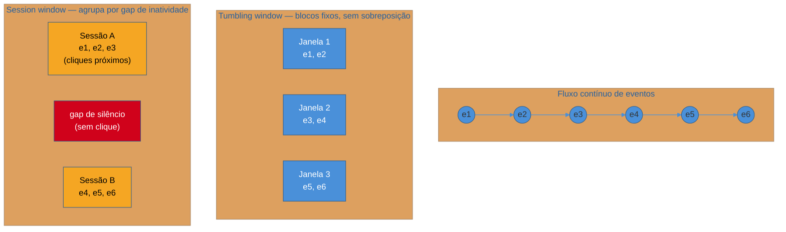
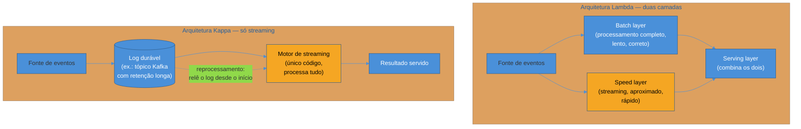

# Dados em movimento

> [!abstract] TL;DR
> A trilha inteira até aqui assumiu, implicitamente, que dado se move em **lotes**: extrai de hora em hora, transforma à noite, o warehouse reflete o mundo de ontem — e para a esmagadora maioria das perguntas de negócio isso é não só suficiente, é a escolha certa. Esta nota fecha o sub-galho de pipelines respondendo à pergunta que fica pendurada desde a abertura da trilha: quando vale a pena trocar **batch** por **streaming** — processar cada evento no instante em que ele acontece, em vez de esperar um lote se acumular? A resposta madura não é "streaming é melhor porque é mais moderno" — é o oposto: **a maioria dos casos ainda é batch, e streaming é a exceção que precisa se justificar**, porque ele troca simplicidade operacional por frescor de segundos, e essa troca só compensa quando a decisão de negócio de fato precisa desse frescor. A nota cobre os conceitos que sustentam streaming analytics — janelas, dado atrasado, micro-batch — contrasta as arquiteturas Lambda e Kappa, e traça uma fronteira explícita: o *mecanismo* de transporte de eventos (Kafka, tópicos, consumer groups) mora em [[03-Dominios/Engenharia/Comunicação entre Sistemas/index|Comunicação entre Sistemas]]; aqui o ângulo é só analytics — quando processar dado em movimento para alimentar decisão e modelo.

> [!question]- Perguntas que esta nota responde
> - Qual é, de fato, o eixo de decisão entre processar em batch e processar em streaming — e por que a maioria dos casos deveria ficar em batch?
> - Quando streaming vale o custo de operar (detecção de fraude, personalização em tempo real) — e quando é desperdício de engenharia (relatório que ninguém olha em tempo real)?
> - O que é uma janela (window) de streaming, e por que "somar em um fluxo infinito" é um problema diferente de "somar uma tabela"?
> - O que é dado atrasado (late-arriving data) e por que event time e processing time não são a mesma coisa?
> - O que é micro-batch, e por que ele existe como meio-termo entre os dois mundos?
> - Qual a diferença entre arquitetura Lambda e arquitetura Kappa, e por que Kappa ganhou terreno nos últimos anos?
> - Onde termina o que esta trilha ensina sobre streaming, e onde começa o que Comunicação entre Sistemas ensina sobre mensageria?

## O alerta que já apareceu, e que esta nota resolve

A primeira nota desta trilha, ao descrever o eixo entre frescor e custo, já deixou um aviso explícito: montar uma arquitetura de streaming — filas, consumidores, janelas de agregação, reprocessamento — para alimentar um relatório que a diretoria olha uma vez por dia é desperdício de engenharia. A complexidade de operar streaming (dado fora de ordem, reprocessamento, garantias de entrega, *backpressure*) não compra frescor que ninguém usa. Essa nota tratava o aviso como regra geral; esta nota, ao fechar o sub-galho de pipelines, entra no detalhe: **o que exatamente streaming resolve que batch não resolve, e como reconhecer o caso raro em que vale pagar o preço.**

Volte ao fio condutor do e-commerce que atravessa a trilha. O time de dados já resolveu ingestão (full load, incremental, CDC — nota 02), transformação (SQL-first, modelos testados — nota 03) e orquestração (DAGs batch agendados — nota 04). O pipeline inteiro roda de hora em hora, ou uma vez por noite, e isso é suficiente para a maior parte do que a empresa precisa saber: faturamento por categoria, taxa de conversão do funil, estoque médio por SKU. Mas duas situações concretas colocam pressão nesse desenho:

1. Durante o checkout, um sistema de **detecção de fraude** precisa decidir, em milissegundos, se aprova ou barra uma transação — esperar o próximo lote batch rodar à meia-noite não é uma opção, a decisão já aconteceu.
2. Na página de produto, um motor de **recomendação** quer refletir o que o cliente acabou de clicar — não o que ele clicou há seis horas, quando rodou o último lote.

Essas duas situações não são "o mesmo problema de sempre, só que com um SLA mais apertado". São uma mudança de *natureza* do processamento: de "processar tudo que se acumulou" para "processar cada coisa assim que ela chega". É esse o eixo que streaming resolve — e é também exatamente por isso que ele custa mais para operar.

## Batch vs streaming: o eixo, revisitado com rigor

**Batch** processa um conjunto delimitado de dados de uma vez — um lote — em intervalos periódicos: a cada hora, a cada noite, a cada semana. O modelo mental é o de uma tabela: o pipeline lê um recorte finito (as linhas que chegaram desde a última execução), aplica a transformação, e escreve o resultado. Toda a maquinaria coberta nas notas 01 a 04 deste sub-galho — ETL/ELT, ingestão incremental, transformação em SQL, orquestração por DAG — pressupõe esse modelo: um início e um fim para cada execução, um estado que se fecha e se persiste, um resultado que pode ser recomputado do zero se algo der errado.

**Streaming** processa um fluxo contínuo e teoricamente infinito de eventos, um a um (ou em micro-lotes muito pequenos), à medida que chegam. Não existe "início e fim" de uma execução — existe um processo de longa duração, sempre ativo, que consome eventos e produz resultado continuamente. O modelo mental muda de tabela para **fluxo**: em vez de perguntar "quais são todas as vendas de fevereiro?", o sistema precisa responder "qual é o total de vendas *agora*, sabendo que fevereiro nunca vai 'terminar' do ponto de vista do sistema — sempre pode chegar mais um evento atrasado"[^kleppmann].

| Dimensão | Batch | Streaming |
|---|---|---|
| Unidade de processamento | Lote finito, delimitado | Evento individual (ou micro-lote), fluxo contínuo |
| Latência típica | Minutos a horas (ou dias) | Milissegundos a segundos |
| Complexidade de construir/operar | Baixa a média | Alta — estado de longa duração, ordenação, reprocessamento |
| Modelo mental | Tabela — início e fim por execução | Fluxo — sem fim, sempre há "mais um evento" |
| Recomputação em caso de erro | Reroda o lote inteiro (ou o intervalo afetado) | Requer reprocessar o log de eventos, ou aceitar perda |
| Exemplo | Faturamento mensal, dashboard de BI diário | Detecção de fraude, recomendação ao vivo, alerta operacional |

A tese sênior desta nota, que vale repetir com todas as letras porque contraria o instinto de "quanto mais em tempo real, melhor": **a maioria dos pipelines de dados de uma organização deveria ser batch.** Streaming não é o próximo passo natural na evolução de um pipeline maduro — é uma ferramenta especializada, com custo operacional real, que se justifica apenas quando a decisão de negócio genuinamente precisa de segundos, não de horas. Tratar streaming como o "nível avançado" que todo pipeline deveria mirar é um erro de julgamento tão comum quanto caro.

> [!warning] "Streaming é o próximo nível de maturidade do pipeline"
> **O que acontece:** depois de dominar ingestão incremental e orquestração batch, um time decide "evoluir" o pipeline principal para streaming, mesmo sem uma decisão de negócio que exija isso — porque streaming parece o passo natural seguinte, tecnicamente mais sofisticado. **Por quê:** streaming não é uma versão "melhor" de batch — é uma resposta a um problema diferente (decisão que precisa de segundos, não de horas). Ele troca a simplicidade de reprocessar um lote inteiro por estado de longa duração, ordenação de eventos fora de ordem, e infraestrutura que precisa ficar no ar 24/7 sem parar (um job batch que falha só atrasa o próximo lote; um job de streaming que cai pode perder eventos ou parar de processar em tempo real algo que o negócio já espera em tempo real). **Como evitar:** a pergunta que precede qualquer decisão de streaming não é "isso é tecnicamente possível?" — é "que decisão de negócio depende deste dado, e em quantos segundos ela precisa ser tomada?". Se a resposta for "um relatório visto uma vez por dia", a resposta certa é batch, ponto final.

## Quando streaming vale — e quando não vale

Streaming se justifica quando três condições aparecem juntas: (1) a decisão que consome o dado acontece em segundos ou poucos minutos; (2) o custo de decidir tarde é alto (fraude não detectada, oportunidade de venda perdida); e (3) o volume e a criticidade do caso de uso comportam o investimento operacional de manter um sistema de streaming no ar. Casos reais onde essas três condições se alinham:

- **Detecção de fraude em tempo real.** Um pagamento precisa ser aprovado ou barrado antes de a transação ser confirmada — segundos, não horas. Um lote batch rodando à meia-noite chegaria tarde demais: a fraude já teria acontecido.
- **Personalização e recomendação ao vivo.** O que o cliente clicou nos últimos minutos é o sinal mais forte para decidir o que mostrar a ele agora — recomendação calculada sobre dado de seis horas atrás perde relevância exatamente na janela de maior intenção de compra.
- **Monitoramento operacional e alertas.** Um pico de erro 500 num serviço de checkout, ou uma fila de mensagens crescendo sem parar, precisa disparar alerta em minutos — esperar o próximo lote de métricas rodar de manhã anularia o propósito do próprio monitoramento.

Onde streaming tipicamente **não** vale — o antipadrão já nomeado na nota de abertura da trilha:

- **Relatório mensal ou de faturamento.** Ninguém decide nada de diferente sabendo o faturamento de fevereiro com um segundo de atraso em vez de um dia.
- **Dashboard que ninguém olha de hora em hora.** Se o consumidor do dado só abre o painel uma vez por dia, streaming entrega frescor que nunca é consumido — puro custo, zero benefício.
- **Análise exploratória e ad-hoc.** Um analista escrevendo uma query nova, testando uma hipótese, não precisa que o dado esteja atualizado ao segundo — ele precisa que o dado esteja *correto* e *bem modelado*, propriedades que batch entrega tão bem quanto streaming, e com bem menos esforço de manutenção.

> [!question]- E o meio-termo — "quase tempo real", tipo a cada 15 minutos?
> Existe, e é um degrau frequentemente subestimado antes de saltar direto para streaming completo. Um pipeline batch que roda a cada 15 minutos, em vez de uma vez por dia, já cobre boa parte dos casos que parecem exigir streaming à primeira vista — um dashboard operacional que precisa de frescor de "quase agora", mas não de milissegundos. A pergunta a fazer antes de construir infraestrutura de streaming de ponta a ponta é sempre: um batch mais frequente resolveria? Se sim, é a escolha mais barata e mais simples de operar. Streaming completo entra em cena quando mesmo minutos de atraso são inaceitáveis — não quando "mais rápido" parece genericamente melhor.

## Conceitos de streaming analytics

Aceito que streaming se justifica em um caso concreto, um conjunto pequeno de conceitos aparece em praticamente qualquer sistema desse tipo — sem depender de qual motor de processamento roda por trás (Flink, Spark Structured Streaming, Kafka Streams, todos citados aqui só como âncora, nunca como tutorial).

### Janelas (windows)

Um fluxo de eventos é, por definição, infinito — não existe "somar todas as vendas" num stream, porque sempre pode chegar mais uma venda. Para transformar um fluxo infinito em algo agregável, o processamento de streaming recorta o tempo em **janelas**: períodos delimitados sobre os quais uma agregação (soma, contagem, média) faz sentido, mesmo que o fluxo continue depois.

- **Tumbling window** (janela fixa, sem sobreposição): recorta o tempo em blocos consecutivos e disjuntos — por exemplo, "total de vendas a cada 5 minutos", onde cada evento pertence a exatamente uma janela.
- **Sliding window** (janela deslizante, com sobreposição): recorta o tempo em blocos que se sobrepõem — por exemplo, "média móvel de transações nos últimos 5 minutos, recalculada a cada 1 minuto", onde um mesmo evento pode contribuir para várias janelas.
- **Session window** (janela de sessão): não tem duração fixa — agrupa eventos que acontecem próximos no tempo, separando grupos por um período de inatividade (por exemplo, "todos os cliques do mesmo usuário até 30 minutos de silêncio contam como uma sessão"). É o padrão natural para medir comportamento de navegação, onde a duração de uma interação varia por usuário.

### Dado atrasado e watermarks de streaming

Num mundo distribuído, eventos nem sempre chegam na ordem em que aconteceram: uma falha de rede momentânea, um dispositivo móvel que ficou offline e reenvia depois, uma fila com múltiplas partições processadas em paralelo — tudo isso pode fazer um evento chegar minutos depois de eventos "mais novos" já terem sido processados. Isso força uma distinção que não existe em batch:

- **Event time** — o momento em que o evento *de fato aconteceu* (o timestamp gravado pelo dispositivo ou aplicação que originou o evento).
- **Processing time** — o momento em que o sistema de streaming *processou* aquele evento (que pode ser segundos, minutos, ou em casos raros muito mais, depois do event time).

Se uma janela de agregação já fechou e produziu resultado, mas depois chega um evento com event time dentro daquela janela (um evento atrasado, ou *late-arriving*), o sistema tem três opções: descartar o evento (simples, mas perde dado), reabrir e recalcular a janela (correto, mas caro), ou aceitar uma margem de tolerância definida antecipadamente. Essa margem é o papel de uma **watermark** de streaming: um marcador que diz, aproximadamente, "eventos com event time anterior a este ponto já foram todos vistos — feche a janela" — aceitando uma margem de atraso configurável antes de considerar a janela definitivamente fechada[^kleppmann][^dean].

> [!question]- Isso é o mesmo conceito de "watermark" da nota de ingestão?
> Não — é uma sobreposição de nome que vale desarmar. Na nota 02 desta trilha, *watermark* (ou "marca d'água") significa o ponto de controle que a ingestão incremental usa para saber até onde já processou uma tabela ("já peguei tudo com `updated_at` até aqui"). Aqui, watermark de streaming é um conceito de *tempo de evento dentro de um fluxo contínuo*: até que ponto no tempo o sistema considera que já viu (quase) todos os eventos, para poder fechar uma janela de agregação com segurança razoável. Os dois nomes vêm da mesma intuição — "até onde já processei" — mas resolvem problemas de naturezas diferentes: um é sobre progresso numa tabela finita, processada em lotes; o outro é sobre tolerância a desordem num fluxo infinito.

### Micro-batch: o meio-termo

Entre processar evento a evento (streaming "puro") e processar um lote inteiro de uma vez (batch clássico) existe um meio-termo amplamente usado na prática: **micro-batch**. A ideia é simples — em vez de reagir a cada evento individualmente, o sistema acumula eventos por uma janela muito curta (segundos, não horas) e processa esse mini-lote de uma vez, repetindo o ciclo continuamente. O Spark Structured Streaming, por exemplo, opera nesse modelo por padrão: por baixo do capô, ele reaproveita o motor de processamento em lote do Spark, rodando repetidamente sobre micro-lotes de poucos segundos, o que aproxima a experiência de streaming (frescor de segundos) reaproveitando um modelo de programação e um motor de execução pensados originalmente para batch[^onehouse].

Micro-batch não é streaming "de verdade" no sentido mais estrito (evento a evento, latência de milissegundos) — mas na prática entrega frescor suficiente para a esmagadora maioria dos casos de uso que "precisam de streaming", com uma complexidade operacional sensivelmente menor do que um motor nativamente orientado a evento único. É um exemplo concreto de como o eixo batch↔streaming não é binário — é um espectro, e o ponto certo nesse espectro depende, de novo, de quanto frescor a decisão realmente exige.

## Arquiteturas Lambda e Kappa

Depois de decidir que uma parte do sistema precisa de streaming, uma pergunta arquitetural aparece: **o streaming substitui o batch, ou convive com ele?** Duas respostas clássicas, com histórias e trade-offs distintos.

### Lambda: duas camadas, combinadas na consulta

A **arquitetura Lambda**, proposta por Nathan Marz por volta de 2011, resolve o problema mantendo **duas camadas de processamento em paralelo**, cada uma cobrindo a fraqueza da outra:

- **Batch layer**: processa o histórico completo, periodicamente, com toda a correção e todo o tempo necessário — é lenta, mas é a fonte da verdade.
- **Speed layer** (ou *streaming layer*): processa apenas os eventos mais recentes, em tempo real, produzindo um resultado aproximado e rapidamente disponível, que cobre a lacuna de frescor entre a última execução do batch e agora.
- **Serving layer**: combina as duas na hora da consulta — o resultado final é a soma (ou merge) do que o batch já fechou com o que o streaming ainda está processando.

O ganho é robustez: se a camada de streaming falhar ou tiver um bug, a camada batch eventualmente reprocessa tudo e corrige o resultado — o sistema nunca depende de uma única camada estar sempre certa. O custo é justamente o que salta aos olhos de qualquer engenheiro: **a mesma lógica de negócio precisa ser implementada duas vezes**, uma em batch, outra em streaming — em linguagens ou motores frequentemente diferentes — e mantida sincronizada ao longo do tempo. Um bug corrigido na camada batch e esquecido na camada speed produz resultados divergentes entre as duas, um tipo de inconsistência sutil e difícil de depurar.

### Kappa: só streaming, reprocessando o log

A **arquitetura Kappa**, proposta por Jay Kreps (um dos criadores do Kafka) em 2014 como resposta direta à dor de manter duas camadas, elimina a camada batch por completo: **tudo é tratado como stream**, inclusive o "histórico". Quando é preciso reprocessar — por causa de um bug corrigido, uma mudança de lógica, ou uma nova métrica que precisa ser recalculada desde o início — o sistema simplesmente **relê o log de eventos desde o começo** (ou desde o ponto necessário), passando pelo mesmo motor de processamento de streaming que já processa o fluxo em tempo real. Não existe uma segunda implementação da lógica de negócio — existe uma implementação só, que roda tanto para o dado novo quanto para o reprocessamento do dado antigo.

Isso só é viável porque plataformas de mensageria modernas (o exemplo canônico é o Kafka) passaram a suportar **retenção durável e configurável de eventos** — um tópico Kafka pode reter semanas, meses, ou indefinidamente, funcionando como um log append-only que serve tanto de canal em tempo real quanto de fonte para reprocessamento histórico. É esse recurso de infraestrutura, mais do que uma ideia puramente conceitual, que tornou Kappa prática — sem um log durável para reler, "reprocessar tudo como stream" seria só um slogan.

| Dimensão | Lambda | Kappa |
|---|---|---|
| Nº de camadas de processamento | Duas (batch + speed) | Uma (só streaming) |
| Lógica de negócio | Implementada duas vezes, em dois motores | Implementada uma vez |
| Reprocessamento histórico | Camada batch dedicada | Releitura do log desde o início |
| Pré-requisito de infraestrutura | Menos exigente (batch é maduro há décadas) | Exige log durável com retenção longa |
| Risco principal | Divergência entre as duas implementações | Motor de streaming precisa suportar bem reprocessamento em volume |
| Maturidade em 2026 | Ainda usada onde já existe batch consolidado | Default mais comum para sistemas novos |

> [!info] Estado em 2026-07-12 — Kappa como default para sistemas novos
> Em 2026, a escolha entre Lambda e Kappa deixou de ser uma dúvida em aberto para a maioria dos times construindo sistema novo: **Kappa tende a ser o default**, justamente porque manter duas implementações da mesma lógica (o custo central de Lambda) raramente compensa quando o motor de streaming e a plataforma de mensageria já suportam bem retenção longa e reprocessamento em escala. Motores como **Apache Flink** (referência para processamento com estado, com *backend* de estado em RocksDB), **Kafka Streams** (para aplicações nativamente construídas sobre Kafka) e **Spark Structured Streaming** (para times já investidos no ecossistema Spark, operando em micro-batch) amadureceram o suficiente para sustentar Kappa em produção sem o dreno operacional que ele exigia dez anos atrás. Um padrão que ganhou força mais recentemente é o "Kappa inspirado em lakehouse": Kafka cobre a ingestão e o processamento em tempo real, mas o armazenamento de longo prazo — a fonte da verdade para reprocessamento pesado — vive numa tabela de lakehouse, não no próprio Kafka; o reprocessamento histórico roda via um motor batch (como Spark) lendo essa tabela, em vez de reler o tópico Kafka do zero. Lambda ainda aparece, principalmente, em organizações que já têm uma camada batch madura e consolidada, onde reescrever tudo em Kappa não paga o próprio custo de migração. Nenhum desses motores é ensinado em tutorial nesta trilha — eles aparecem só como referência de mercado.

## A fronteira com Comunicação entre Sistemas

Chegou o ponto em que esta nota precisa ser explícita sobre o que ela **não** ensina, porque a tentação de "só mais um pouquinho de Kafka" é grande neste tópico.

> [!info] Onde o mecanismo de transporte de eventos mora
> Tudo o que sustenta streaming *como mecanismo de transporte* — o que é um tópico Kafka, como partições distribuem carga e ordenam eventos dentro de uma partição, o que é um *consumer group*, como funcionam garantias de entrega (at-most-once, at-least-once, exactly-once) no nível do broker de mensageria, e o padrão arquitetural mais amplo de integração orientada a evento (*event-driven architecture*) entre sistemas — **mora em [[03-Dominios/Engenharia/Comunicação entre Sistemas/index|Comunicação entre Sistemas]]**, não nesta trilha. Esta nota trata streaming exclusivamente pelo **ângulo de analytics**: quando processar dado em movimento vale a pena para alimentar uma decisão, um relatório, um modelo de ML — e os conceitos de agregação (janelas, watermarks) que esse processamento exige. Se a próxima pergunta que vier à cabeça for "e como o Kafka garante que dois consumidores do mesmo grupo nunca processem o mesmo evento?" ou "como funciona *exactly-once* na prática dentro do protocolo do Kafka?" — essas são perguntas de mensageria, e a resposta está no galho de Comunicação entre Sistemas, não aqui.

Essa fronteira não é burocrática — ela reflete uma divisão real de responsabilidade em qualquer organização madura. O engenheiro de dados que constrói um pipeline de detecção de fraude não precisa saber operar um cluster Kafka do zero — ele precisa saber *consumir* de um tópico que a equipe de plataforma/infraestrutura de mensageria já opera, aplicar uma janela de agregação sobre esses eventos, e escrever o resultado num destino que o time de risco consulta. O "cano" (o tópico, a partição, o broker) é problema de arquitetura de comunicação entre sistemas; o "o que fazer com o dado que passa por ele, para fins de análise e decisão" é engenharia de dados. Times pequenos acumulam as duas responsabilidades na mesma pessoa — mas a distinção conceitual continua valendo, porque ela diz onde cada tipo de bug deveria ser investigado: se o pipeline de fraude está lento porque o tópico Kafka está com lag de consumo, o problema é de mensageria; se ele está gerando resultado errado porque a janela de agregação está mal desenhada, o problema é de streaming analytics.

Vale o mesmo cuidado do lado do armazenamento: um store desenhado para servir consultas sobre dado que chega continuamente — otimizado para escrita de alta vazão e leitura por chave recente, em vez de varredura analítica pesada — é, com frequência, um banco de perfil NoSQL, cuja teoria e trade-offs (consistência eventual, modelo de dados orientado a padrão de acesso) já têm nota própria em [[03-Dominios/Ciência/Banco de Dados/14 - NoSQL e polyglot persistence|Banco de Dados 14]]. Esta nota não repete essa teoria — ela só nomeia onde ela mora, para quando um pipeline de streaming analytics precisar decidir em que tipo de armazenamento gravar seu resultado.

E, para fechar o quadro de fronteiras deste sub-galho inteiro: ingestão via **CDC log-based** — que, como a nota 02 já mostrou, tende naturalmente na direção de streaming, porque reage continuamente a um log de transações — não é reexplicada aqui; ela é o ponto de entrada que alimenta o streaming descrito nesta nota. E **orquestração** de pipelines batch — DAGs, agendamento, backfill —, tratada na nota 04, continua sendo o modelo certo para a maioria dos pipelines desta trilha; streaming não substitui orquestração batch, convive com ela, cobrindo a fatia de casos onde segundos importam.

> [!question]- Streaming muda o que ETL/ELT significam?
> Não muda o vocabulário, mas muda o desenho. As notas 01 e 03 deste sub-galho tratam ETL/ELT assumindo lotes: extrai um recorte, transforma, carrega, repete. Num pipeline de streaming, a mesma ideia de "extrair, transformar, carregar" continua valendo, só que contínua — o T (transformar) acontece evento a evento ou janela a janela, dentro do próprio motor de streaming, em vez de como um passo separado que roda depois que todo o lote já está no warehouse. Isso aproxima transformação de ingestão: num pipeline de streaming bem desenhado, boa parte da lógica que em batch ficaria numa camada de transformação separada (o modelo dbt, por exemplo) já acontece dentro do próprio job de streaming, porque esperar o dado pousar no warehouse para só então transformá-lo destruiria o frescor que justificou usar streaming em primeiro lugar.

> [!question]- Um pipeline de streaming precisa de orquestração como os DAGs da nota 04?
> Não da mesma forma. Um DAG de orquestração batch (nota 04 deste sub-galho) coordena tarefas com início e fim — extrai, depois transforma, depois carrega, numa sequência que se repete a cada execução agendada. Um job de streaming não tem essa forma: ele é um processo de longa duração, sempre ativo, sem "próxima execução" para agendar. O que ele precisa, em vez de um agendador de tarefas, é de infraestrutura de *operação contínua* — reinício automático se o processo cair, monitoramento de métricas como o lag de consumo (o quão atrás o consumidor está do que já foi produzido), e uma estratégia clara de o que fazer quando ele precisa ser atualizado sem perder ou duplicar eventos em trânsito. Esse tipo de operação de sistema de longa duração é o mesmo tipo de preocupação (deploy, observabilidade, confiabilidade em produção) tratado em profundidade na trilha de Operação — não é reensinado aqui.

## Voltando ao e-commerce: onde streaming ajuda, onde batch basta

Fechando o fio condutor da trilha com as duas situações que abriram esta nota:

**Detecção de fraude no checkout** é o caso claro para streaming. Cada tentativa de pagamento gera um evento; um motor de streaming consome esse evento, calcula um score de risco em janelas curtas (por exemplo, "quantas tentativas de pagamento este cartão fez nos últimos 2 minutos" — uma sliding window), e decide aprovar ou barrar antes da transação se completar. Esperar o próximo lote batch rodar à noite significaria aprovar a fraude e só descobrir o problema no dia seguinte — tarde demais para evitar o prejuízo.

**Recomendação em tempo real** também justifica streaming, embora com menos urgência que fraude: um motor consome eventos de clique e visualização de produto, agrupa por sessão (session window — a sessão de navegação de um usuário específico), e ajusta o que aparece na próxima página em segundos. O ganho de conversão em mostrar "produtos parecidos com o que você acabou de ver" cai rapidamente se o dado usado tem seis horas de atraso — a intenção de compra do cliente já mudou.

**Faturamento mensal**, por outro lado, continua sendo batch — e deveria continuar sendo batch mesmo que a empresa já tenha investido em infraestrutura de streaming para fraude e recomendação. Ninguém toma decisão diferente sabendo o faturamento de fevereiro com atraso de um segundo em vez de um dia; rodar essa agregação como streaming seria pagar complexidade operacional sem comprar nada em troca. É perfeitamente normal — e é, de fato, o desenho mais comum em organizações maduras — que os dois modelos convivam lado a lado na mesma plataforma de dados: streaming cobrindo o punhado de casos que genuinamente precisam de segundos, batch cobrindo tudo o resto.

## Em entrevista

Uma pergunta clássica de nível sênior: "quando você escolheria streaming em vez de batch?" A resposta fraca lista tecnologia ("eu usaria Kafka e Flink"). A resposta forte amarra a escolha à decisão de negócio: "eu escolheria streaming quando a decisão que consome o dado precisa acontecer em segundos ou poucos minutos — fraude, personalização ao vivo, alerta operacional — e eu escolheria batch para tudo o mais, porque batch é mais barato de construir, mais simples de depurar, e suficiente para a esmagadora maioria dos relatórios de negócio". Essa resposta sinaliza julgamento de arquitetura, não conhecimento de ferramenta.

Uma pergunta que separa quem entende o trade-off de quem só decorou o vocabulário: "por que a arquitetura Kappa se tornou mais popular que Lambda nos últimos anos?" A resposta madura não diz "porque é mais simples" sem explicar o porquê — ela nomeia o custo específico que Kappa elimina (manter a mesma lógica de negócio implementada duas vezes, em dois motores, e o risco de divergência entre elas) e o pré-requisito que tornou isso viável (log durável com retenção longa, como o Kafka moderno oferece). Uma resposta ainda mais forte reconhece que Lambda continua fazendo sentido em organizações que já têm uma camada batch madura e consolidada — não é que Kappa esteja "certo" e Lambda "errado", é que o cálculo de custo mudou com a maturidade da infraestrutura disponível.

Uma terceira pergunta, mais técnica: "o que é uma watermark num sistema de streaming, e por que ela é necessária?" A resposta fraca confunde watermark de streaming com o watermark de ingestão incremental (um erro de nome fácil de cometer, tratado explicitamente nesta nota). A resposta forte explica o problema real que ela resolve: eventos chegam fora de ordem num sistema distribuído, e uma janela de agregação (por exemplo, "vendas por minuto") precisa, em algum momento, decidir que já viu dado suficiente para fechar aquele minuto e produzir um resultado — mesmo sabendo que, ocasionalmente, algum evento atrasado ainda vai chegar depois. A watermark é o mecanismo que define essa tolerância, aceitando explicitamente uma margem de imprecisão em troca de poder produzir resultado em tempo hábil.

## How to explain in English

> "Most data pipelines should be batch — processing accumulates in finite chunks, run periodically, and that's simpler and cheaper to operate. Streaming processes an unbounded flow of events one at a time, and it only earns its complexity when a business decision genuinely needs to happen in seconds: fraud detection at checkout, live recommendations, operational alerting. Streaming introduces concepts batch doesn't have — windows to aggregate an infinite flow (tumbling, sliding, session), and watermarks to handle events that arrive out of order, tolerating a bounded amount of lateness before closing a window. Architecturally, Lambda keeps two parallel layers — a slow, correct batch layer and a fast, approximate speed layer, merged at query time — while Kappa treats everything as a single stream, reprocessing history by replaying the event log instead of maintaining a separate batch pipeline. Kappa became the more common default once durable, long-retention logs like Kafka matured enough to make full replay practical. Either way, the event transport mechanism itself — topics, partitions, consumer groups, delivery guarantees — is a messaging concern, not a data pipeline concern; this is strictly the analytics angle on data in motion."

| PT | EN |
|----|----|
| Dados em movimento | Data in motion |
| Processamento em lote | Batch processing |
| Processamento em fluxo | Stream processing |
| Micro-lote | Micro-batch |
| Janela (de agregação) | Window |
| Janela fixa (sem sobreposição) | Tumbling window |
| Janela deslizante | Sliding window |
| Janela de sessão | Session window |
| Tempo do evento | Event time |
| Tempo de processamento | Processing time |
| Dado atrasado | Late-arriving data |
| Marca d'água de streaming | Watermark |
| Arquitetura Lambda | Lambda architecture |
| Arquitetura Kappa | Kappa architecture |
| Camada de lote / camada de velocidade | Batch layer / speed layer |
| Log durável de eventos | Durable event log |
| Reprocessamento | Reprocessing / replay |

## O que vem a seguir

Este sub-galho fecha aqui: ETL virou ELT, ingestão capturou o dado bruto com CDC, transformação o modelou em SQL versionado, orquestração organizou tudo isso em DAGs confiáveis, e esta nota tratou a exceção — quando processar dado em movimento, e onde essa exceção termina e a mensageria começa. Mas um pipeline que roda perfeitamente do ponto de vista técnico ainda pode falhar como produto de dados: se ninguém confia no número que ele produz, se uma tabela silenciosamente perde uma categoria de produto por semanas sem ninguém perceber, ou se não existe forma de auditar de onde um dado veio. É esse o assunto do próximo sub-galho — qualidade, confiabilidade e governança do dado que os pipelines entregam.

- [[4 - Qualidade, governança e organização/index|Qualidade, governança e organização]] — abrindo com qualidade e observabilidade de dados: como saber, de forma sistemática, que o pipeline está entregando o que promete

## Fontes

- Kleppmann, Martin — *Designing Data-Intensive Applications*, O'Reilly, 2017 — capítulos sobre stream processing, event time vs processing time, janelas e reprocessamento; fundamentação central desta nota.
- Reis, Joe & Housley, Matt — *Fundamentals of Data Engineering: Plan and Build Robust Data Systems*, O'Reilly, 2022 — capítulo sobre ingestão e processamento em streaming dentro do ciclo de vida da engenharia de dados.
- Marz, Nathan & Warren, James — *Big Data: Principles and Best Practices of Scalable Realtime Data Systems*, Manning, 2015 — formalização original da arquitetura Lambda pelo próprio autor do termo.
- Kreps, Jay — [*Questioning the Lambda Architecture*](https://www.oreilly.com/radar/questioning-the-lambda-architecture/), O'Reilly Radar, 2014 — o artigo que introduz a arquitetura Kappa como alternativa à Lambda.
- Dean, Tyler Akidau et al. — *Streaming Systems: The What, Where, When, and How of Large-Scale Data Processing*, O'Reilly, 2018 — referência canônica sobre watermarks, event time e modelos de janela (o "Dataflow Model" do Google).
- Onehouse — [*Apache Spark Structured Streaming vs Apache Flink vs Apache Kafka Streams*](https://www.onehouse.ai/blog/apache-spark-structured-streaming-vs-apache-flink-vs-apache-kafka-streams-comparing-stream-processing-engines), 2026 — comparação de motores de streaming e estado da arte de micro-batch em 2026, usada no `[!info]` de caducidade.
- Streamkap — [*The Kappa Architecture: Simplifying Data Pipelines with Streaming*](https://streamkap.com/resources-and-guides/kappa-architecture-guide), 2026 — panorama de adoção de Kappa como default em sistemas novos e do padrão "Kappa inspirado em lakehouse".
- [[03-Dominios/Engenharia/Comunicação entre Sistemas/index|Comunicação entre Sistemas]] — onde mora o mecanismo de transporte de eventos (Kafka, tópicos, partições, consumer groups, garantias de entrega) que esta nota deliberadamente não ensina.
- [[03-Dominios/Ciência/Banco de Dados/14 - NoSQL e polyglot persistence|Banco de Dados 14 — NoSQL e polyglot persistence]] — os stores de perfil NoSQL frequentemente usados como destino de resultado de streaming analytics.

[^kleppmann]: Kleppmann, Martin, *Designing Data-Intensive Applications*, O'Reilly, 2017. [^dean]: Akidau, Tyler et al., *Streaming Systems: The What, Where, When, and How of Large-Scale Data Processing*, O'Reilly, 2018. [^onehouse]: Onehouse, *Apache Spark Structured Streaming vs Apache Flink vs Apache Kafka Streams*, 2026.
