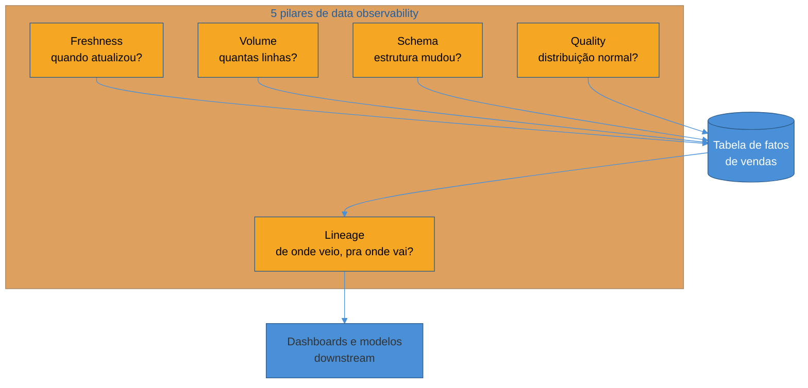

# Qualidade e observabilidade de dados

> [!abstract] TL;DR
> Um pipeline pode rodar todo santo dia sem lançar uma única exceção e, ainda assim, entregar dado errado — silenciosamente. Isso é pior do que um pipeline que quebra: um pipeline quebrado grita; um pipeline que entrega dado ruim sussurra, e o sussurro só vira grito quando alguém da diretoria pergunta por que o faturamento de uma categoria inteira sumiu do relatório nos últimos três meses. **Qualidade de dados** é o conjunto de dimensões (acurácia, completude, consistência, unicidade, validade, freshness) que definem se um dado está "certo" para o uso que se pretende dele. **Data observability** é a disciplina — e o framework de cinco pilares (freshness, volume, schema, quality, lineage) popularizado por Barr Moses e a Monte Carlo — que instrumenta um warehouse para detectar quando essas dimensões degradam, antes que um analista descubra o problema olhando um dashboard errado. Esta nota cobre as duas: como testar dado ativamente (data tests) e como monitorá-lo passivamente (observability), e onde termina a teoria específica de dados e começa a teoria geral de observabilidade de sistemas, que já tem trilha própria em Engenharia/Operação.

> [!question]- Perguntas que esta nota responde
> - Por que "o pipeline terminou sem erro" não é garantia nenhuma de que o dado está correto?
> - Quais são as dimensões que definem "qualidade de dados", e como cada uma falha na prática?
> - O que são testes de dados (data tests), e que tipos de teste cobrem que tipo de problema?
> - Quais são os cinco pilares de data observability, e o que cada um monitora?
> - Como definir SLA/SLO para dados, e o que "error budget" significa quando o produto é uma tabela em vez de uma API?

## O erro que não lança exceção

Volte ao e-commerce da trilha. O pipeline que extrai pedidos do Postgres, transforma no modelo dimensional e carrega a tabela de fatos de vendas no warehouse[^reis] roda toda noite, às 2h, e termina com status de sucesso — sem erro, sem timeout, sem linha de log em vermelho. Do ponto de vista de quem monitora *o pipeline como processo*, está tudo bem: o job rodou, terminou, o próximo passo da orquestração foi disparado.

Só que, três meses depois, alguém da diretoria comercial nota algo estranho: a categoria "Eletrônicos" está com faturamento zerado desde abril. Investigando, descobre-se a causa: uma mudança no sistema de origem renomeou um campo de categoria — de `categoria_id` para `category_id` — e a transformação que popula a dimensão de categoria, escrita para ler o nome antigo, passou a receber `NULL` silenciosamente em vez de erro. O `JOIN` entre fato e dimensão continuou funcionando tecnicamente; ele só parou de casar as linhas de "Eletrônicos" com a categoria certa, e elas foram parar em um bucket de "categoria desconhecida" que ninguém olha no dashboard principal.

Nenhum log gritou. Nenhum alerta disparou. O pipeline "funcionou" em todo sentido que uma orquestração tradicional consegue verificar — e ainda assim entregou um número errado para uma decisão de negócio, por três meses seguidos.

> [!warning] "O pipeline rodou sem erro" não é o mesmo que "o dado está certo"
> **O que acontece:** a equipe de dados monitora status de execução (sucesso/falha, duração, uso de recursos) e considera isso suficiente para confiar no resultado. **Por quê:** falhas de *processo* (exceção, timeout, job travado) e falhas de *conteúdo* (schema mudou, uma categoria some, volume caiu pela metade) são categorias completamente diferentes de problema. Um pipeline bem escrito lida bem com dado ausente ou nulo sem lançar exceção — o que é ótimo para resiliência de processo e péssimo para detectar corrupção silenciosa de conteúdo, porque o processo "trata" o problema em vez de expô-lo. **Como evitar:** monitorar o pipeline como processo é necessário, mas não suficiente. É preciso monitorar o **dado que sai do outro lado** — o que esta nota cobre a partir daqui.

Esse é o ponto de partida da nota: qualidade e observabilidade de dados existem porque o tipo de falha mais caro em um sistema de dados não é o que quebra visivelmente — é o que degrada em silêncio.

## As dimensões de qualidade de dados

"Qualidade de dados" soa abstrato até ser quebrado em dimensões concretas e testáveis. Seis aparecem com mais frequência na literatura e na prática[^reis]:

**Acurácia** — o dado reflete a realidade que ele descreve? Se o preço registrado para um produto é R$ 49,90 mas o preço real cobrado no checkout foi R$ 59,90 (por causa de uma promoção aplicada depois da extração), o dado é tecnicamente válido — está no formato certo, no intervalo certo — mas está *errado*. Acurácia é a dimensão mais difícil de testar automaticamente, porque geralmente exige comparar contra uma fonte de verdade externa.

**Completude** — todo dado que deveria existir, existe? No exemplo de abertura, a falha foi exatamente de completude: linhas de pedido de "Eletrônicos" deixaram de carregar a categoria correta. Completude também cobre casos mais simples: um campo `email` que deveria ser obrigatório mas chega `NULL` em 12% das linhas depois de uma mudança na origem.

**Consistência** — o mesmo fato, representado em lugares diferentes, concorda consigo mesmo? Se a tabela de pedidos diz que um pedido tem status "cancelado" mas a tabela de pagamentos diz que ele foi "estornado" há duas semanas e nunca atualizou o status no fato de vendas, há uma inconsistência entre duas visões do mesmo evento de negócio.

**Unicidade** — cada entidade aparece uma vez só, quando deveria? Um bug de reprocessamento que roda o pipeline duas vezes na mesma noite sem proteção de idempotência duplica cada pedido na tabela de fatos, inflando o faturamento reportado.

**Validade** — o dado respeita as regras de formato e domínio esperadas? Um CEP com 7 dígitos em vez de 8, uma data de nascimento no futuro, um `status` de pedido que não está na lista de valores permitidos ("pago", "cancelado", "estornado", "pendente") — tudo isso é falha de validade, geralmente a mais fácil de capturar com um constraint simples.

**Freshness (atualidade)** — o dado está tão recente quanto o consumidor precisa que esteja? Uma tabela de vendas que deveria atualizar a cada hora mas está parada há dois dias — porque o pipeline upstream falhou silenciosamente ou porque a fonte parou de enviar eventos — é uma falha de freshness, mesmo que todo dado que *está* lá seja perfeitamente acurado.

| Dimensão | Pergunta que ela responde | Exemplo de falha no e-commerce |
|---|---|---|
| Acurácia | O valor reflete a realidade? | Preço registrado difere do preço realmente cobrado |
| Completude | Falta algum dado que deveria existir? | Categoria de "Eletrônicos" vira `NULL` após rename de campo na origem |
| Consistência | O mesmo fato concorda entre tabelas? | Status "cancelado" em pedidos, "estornado" em pagamentos, sem reconciliação |
| Unicidade | Cada entidade aparece uma vez? | Reprocessamento duplica pedidos na tabela de fatos |
| Validade | O formato/domínio está correto? | `status` fora da lista de valores permitidos |
| Freshness | O dado está atualizado o suficiente? | Tabela de vendas parada há 2 dias sem ninguém perceber |

Repare que essas seis dimensões não são igualmente fáceis de automatizar. Validade e unicidade se prestam bem a testes de constraint direto no warehouse. Acurácia geralmente exige comparação com uma fonte externa ou auditoria manual periódica. Freshness e completude ficam no meio — são automatizáveis, mas exigem monitoramento contínuo, não um teste que roda uma vez.

## Testes de dados: verificação ativa

A forma mais direta de proteger essas dimensões é testar o dado, do mesmo jeito que se testa código — só que a asserção não é sobre o comportamento de uma função, é sobre o conteúdo de uma tabela. Três categorias cobrem a maior parte dos casos práticos:

**Testes de esquema e constraint.** Verificam propriedades estruturais simples e baratas de checar: uma coluna não pode ser nula (`not_null`), um valor precisa ser único (`unique`), um valor precisa pertencer a um conjunto fechado (`accepted_values` — por exemplo, `status` só pode ser "pago", "cancelado", "estornado" ou "pendente`), e uma chave estrangeira precisa existir do outro lado da relação (`relationships` — todo `produto_id` na tabela de fatos precisa existir na dimensão de produto). Esse último pega exatamente o bug do exemplo de abertura: se o `JOIN` de categoria começa a produzir `NULL` em massa, um teste de relação entre fato e dimensão falha imediatamente, em vez de esperar três meses para alguém notar no dashboard.

**Testes de volume e distribuição.** Verificam se o *formato agregado* do dado está dentro do esperado — não linha a linha, mas no conjunto. Quantidade de linhas carregadas hoje comparada à média dos últimos 30 dias (uma queda de 90% é suspeita mesmo que nenhuma linha individual esteja "errada"), distribuição de valores numéricos (um `preco_unitario` médio que de repente dobra pode indicar um bug de conversão de moeda), proporção de nulos em uma coluna historicamente sempre preenchida.

**Testes de reconciliação.** Comparam contagens ou somas entre a fonte e o destino do pipeline — quantas linhas existiam no Postgres de origem contra quantas chegaram no warehouse depois da extração e transformação. Uma discrepância aponta para perda de dado em algum ponto do pipeline: um filtro aplicado errado, um erro silencioso de conexão, uma janela de extração incremental mal calculada que pulou um intervalo de tempo.

> [!info] dbt tests e Great Expectations são exemplos, não o assunto
> Ferramentas como **dbt tests** (testes declarados em YAML, rodados como parte do próprio pipeline de transformação) e **Great Expectations** (uma biblioteca Python dedicada a expressar e validar "expectativas" sobre um dataset) implementam essas três categorias de teste na prática, e vale reconhecer os nomes por concretude. Mas esta trilha não ensina nenhuma delas em nível de tutorial — o que importa reter é a categoria de teste e o que ela protege, não a sintaxe de configuração de uma ferramenta específica.

Um detalhe de julgamento que separa um time maduro de um time que só "adicionou testes porque parecia boa prática": nem toda tabela merece o mesmo nível de teste. Uma tabela de fatos de vendas, que alimenta relatório de faturamento direto para a diretoria, merece testes de relação, volume e reconciliação rodando a cada carga. Uma tabela de staging intermediária, que existe só como passo interno de uma transformação maior, pode se dar bem com testes de constraint mais básicos. Testar tudo com o mesmo rigor é desperdício de engenharia — a mesma lição que já apareceu na trilha sobre escolher entre batch e streaming: o investimento em confiabilidade deve ser proporcional ao custo de estar errado.

## Os cinco pilares de data observability

Testes de dados são verificação **ativa** — alguém escreveu uma asserção específica, pensando num tipo de problema específico. Mas o exemplo de abertura desta nota mostra uma classe de falha diferente: ninguém sabia, de antemão, que um `JOIN` de categoria ia começar a produzir `NULL`. Não havia um teste escrito para esse caso específico, porque ninguém previu esse caso específico.

**Data observability** é a resposta a esse problema: em vez de só testar o que você já pensou em testar, você instrumenta o warehouse para monitorar continuamente propriedades gerais do dado e alertar sobre desvios do padrão histórico — mesmo sem saber de antemão qual vai ser a próxima forma de quebra. O framework mais citado do setor, popularizado por Barr Moses (fundadora da Monte Carlo) por volta de 2019, organiza essa vigilância em **cinco pilares**[^moses]:

**1. Freshness** — quando foi a última vez que esta tabela atualizou, e isso está dentro do esperado? Se a tabela de fatos de vendas historicamente atualiza toda noite às 2h e são 9h da manhã sem atualização, isso é um sinal de alerta independente de qualquer linha específica estar certa ou errada — o dado simplesmente parou de fluir.

**2. Volume** — quantas linhas chegaram nesta carga, comparado ao histórico? Uma queda abrupta de volume (a extração pegou só metade da janela de tempo esperada) ou um pico anormal (um bug de duplicação, o mesmo do exemplo de unicidade) aparecem aqui antes de qualquer analista perceber no relatório final.

**3. Schema** — a estrutura da tabela mudou? Uma coluna foi removida, renomeada, teve o tipo alterado (de `integer` para `string`, por exemplo) sem aviso prévio. É exatamente a classe de problema do exemplo de abertura — um rename silencioso na origem — e é o pilar mais diretamente ligado a **data contracts**, que ganham nota própria mais adiante[^contracts].

**4. Quality (distribuição)** — as propriedades estatísticas do conteúdo continuam dentro do padrão histórico? Proporção de nulos numa coluna, cardinalidade de valores distintos, distribuição de um campo numérico. Esse pilar se sobrepõe com os testes de distribuição da seção anterior, mas a diferença é o modo de operação: teste de distribuição é uma asserção que alguém escreveu; monitoramento de qualidade sob esse pilar aprende o padrão histórico automaticamente e alerta sobre desvio, sem que ninguém precise ter previsto a forma exata da anomalia.

**5. Lineage** — de onde este dado veio, e para onde ele vai? Quando um número no dashboard está errado, lineage é o que permite responder "quais tabelas upstream alimentam esta, e qual delas mudou recentemente" em minutos em vez de horas de investigação manual. Lineage também informa **blast radius**: se a tabela de dimensão de produto quebrar, lineage mostra instantaneamente quantos dashboards e modelos downstream dependem dela — informação essencial para priorizar o conserto. O aprofundamento de lineage — como ele é capturado, catalogado e navegado em escala — é o assunto da próxima nota desta trilha[^lineage].

Os cinco pilares não competem com os testes de dados da seção anterior — eles cobrem o espaço que os testes não alcançam. Um teste `relationships` teria pego a falha de categoria do exemplo de abertura, mas só se alguém tivesse pensado em escrevê-lo. Um monitor de schema, rodando de forma automática e sem depender de ninguém prever o caso, teria pego a mesma falha no momento em que o rename aconteceu na origem — dias ou semanas antes de virar um problema visível no dashboard.

> [!info] O nome do vendor muda; o framework fica
> Monte Carlo, Metaplane, Bigeye, Soda, elementary-data — o mercado de ferramentas de data observability é jovem e ativo, e os nomes específicos, preços e feature sets mudam com frequência (estado registrado em 2026). O que vale reter desta nota não é qual ferramenta usar — é o **framework dos cinco pilares** como checklist mental: diante de qualquer tabela crítica, pergunte se ela está coberta em freshness, volume, schema, quality e lineage, independentemente de qual produto (ou script caseiro) faz essa cobertura.

## Detecção de anomalias: threshold estático vs baseline aprendido

Um monitor de volume precisa de algum critério para decidir "isso é anormal". A forma mais simples é um **threshold estático**: alertar se o volume cair abaixo de um número fixo, definido manualmente. É fácil de entender e de depurar, mas quebra facilmente — um e-commerce com sazonalidade forte (Black Friday, Natal) vai disparar falso alerta em todo pico legítimo de vendas, e o mesmo threshold pode ser folgado demais num dia normal, deixando passar uma queda real de 40% que ainda está "acima do número fixo".

A alternativa é um **baseline aprendido**: o sistema observa o padrão histórico daquela métrica específica — volume médio por dia da semana, variância esperada, tendência de crescimento — e alerta sobre desvio estatístico daquele padrão, não de um número fixo. É o que a maioria das ferramentas de data observability modernas faz por baixo do capô para os pilares de volume e quality, e resolve o problema da sazonalidade — mas troca simplicidade de threshold estático por uma caixa mais opaca, que exige mais dado histórico acumulado antes de funcionar bem, e ainda assim erra em mudanças estruturais genuínas (um produto novo lançado, uma campanha de marketing bem-sucedida) que parecem anomalia sem ser.

O risco em qualquer uma das duas abordagens, se calibrado sem cuidado, é o mesmo problema que já tem nota própria em Operação: **fadiga de alerta**. Um monitor de qualidade de dados que dispara vinte alertas por dia, a maioria falso-positivo de sazonalidade normal, ensina o time a ignorar a caixa de entrada de alertas — e é exatamente aí que o alerta real, o que sinaliza a próxima categoria sumindo do faturamento, passa despercebido no meio do ruído. A teoria geral de como calibrar alerting para minimizar fadiga — o que é sinal acionável, o que vira runbook, como medir taxa de falso-positivo — mora inteira em [[03-Dominios/Engenharia/Operação/4 - Observar e responder/03 - Alerting que não gera fadiga|Alerting que não gera fadiga]]; aqui o recorte é só o ângulo específico de dados: a sazonalidade de negócio como fonte particularmente traiçoeira de falso-positivo em métricas de volume.

## SLA e SLO de dados

A teoria geral de **SLI, SLO e error budget** — o que cada termo significa, como medir, como definir a meta certa — já tem nota própria e não é reexplicada aqui: veja [[03-Dominios/Engenharia/Operação/4 - Observar e responder/02 - SLI, SLO e error budgets|SLI, SLO e error budgets]]. O que muda quando esses conceitos se aplicam a dado, em vez de a uma API, é o que vale nomear.

Um **SLA de dados** típico promete duas coisas a quem consome uma tabela: **freshness** ("a tabela `fato_vendas` está no máximo 2 horas atrasada em relação ao Postgres de produção") e **completude** ("99,9% dos pedidos pagos aparecem na tabela de fatos dentro da janela de freshness prometida"). Diferente de um SLA de API, que geralmente fala de latência e disponibilidade de um endpoint, um SLA de dados fala da confiabilidade de um *ativo* — a tabela em si, não uma chamada isolada a ela.

O **error budget** de dados segue a mesma lógica de trade-off da versão de sistema: se o SLO promete freshness de 2 horas com 99% de conformidade no mês, existe um orçamento de "quase 7 horas" de atraso tolerável ao longo do mês antes de estourar a meta. Gastar esse orçamento crescendo a velocidade de entrega de novas features no pipeline (menos tempo de teste, deploys mais arriscados) é uma escolha legítima — desde que feita conscientemente, e não por acidente, do mesmo jeito que um time de produto decide conscientemente gastar error budget de disponibilidade para acelerar entrega de feature.

> [!question]- Quem define o SLA de uma tabela — o data engineer ou o consumidor?
> Na prática madura, os dois, numa negociação parecida com a que já acontece entre times de produto e times de plataforma em qualquer sistema distribuído. O consumidor (o data analyst, o modelo de ML, o dashboard de BI) sabe que frescor a decisão de negócio realmente exige — voltando ao fio condutor desta trilha, "que frescor essa decisão de negócio realmente exige" é a primeira pergunta de qualquer pipeline. O data engineer sabe o que é tecnicamente viável e a que custo. O SLA nasce do encontro dos dois: prometer freshness de 5 minutos para um relatório mensal é desperdício de engenharia; prometer freshness de 24 horas para um painel operacional de logística que o time consulta ao vivo é promessa vazia demais para ser útil.

## Voltando ao e-commerce: instrumentando a tabela de fatos de vendas

Fechando com o mesmo exemplo que abriu a nota: como isso tudo se junta numa tabela real?

A tabela `fato_vendas` ganharia, no mínimo: **testes de constraint** a cada carga (chave estrangeira de `produto_id` e `categoria_id` sempre resolvendo para uma linha válida na dimensão — exatamente o teste que teria pego o bug do rename em minutos, não em três meses); **teste de reconciliação** comparando contagem de pedidos pagos no Postgres de origem contra linhas carregadas na tabela de fatos, na mesma janela de tempo; **monitoramento de freshness**, alertando se a última carga passar de 3 horas de atraso em relação ao SLA acordado com o time comercial; **monitoramento de volume**, com baseline aprendido por dia da semana para tolerar a sazonalidade real do negócio sem gerar fadiga de alerta; **monitoramento de schema**, alertando qualquer mudança de coluna na tabela de origem antes que a transformação silenciosamente comece a descartar dado; e **lineage** documentado o suficiente para que, quando o próximo número estranho aparecer num dashboard, a investigação comece em minutos, seguindo o grafo de dependência, em vez de recomeçar do zero cada vez.

Nenhum desses cinco elementos sozinho teria pego o bug do exemplo de abertura com certeza absoluta — mas a combinação dos cinco pilares, rodando continuamente, reduz de "três meses até alguém notar" para "minutos até o time ser alertado" a janela entre um dado quebrar e alguém saber que ele quebrou. Essa janela — não a ausência de bugs, que é impossível garantir em qualquer sistema real — é a métrica que realmente separa uma plataforma de dados madura de uma que só parece madura até o primeiro incidente silencioso.

## Em entrevista

Uma pergunta comum em entrevista de data engineering sênior: "como você garante que o dado que chega no dashboard está correto?" A resposta fraca fala só de testes: "eu escrevo testes de schema no pipeline". A resposta forte separa as duas camadas desta nota — testes de dados cobrem o que você já pensou em testar; observability cobre o que você não previu — e cita os cinco pilares como checklist, sem se prender a nome de ferramenta específica.

Outra pergunta frequente: "conte sobre uma vez que um pipeline falhou silenciosamente" (ou, em formulação hipotética de entrevista técnica, "que tipo de falha um pipeline pode ter sem lançar erro?"). O ângulo maduro nomeia a diferença entre falha de *processo* (exceção, timeout) e falha de *conteúdo* (schema, volume, distribuição mudando sem erro de execução) — e explica por que a segunda categoria é estruturalmente mais perigosa: ela não aciona nenhum dos alarmes tradicionais de infraestrutura.

Uma terceira, mais avançada: "como você decidiria o SLA de freshness para uma tabela nova?" A resposta que soa sênior não chuta um número — ela nomeia o processo de negociação com o consumidor, ancorado na pergunta "que decisão de negócio depende deste dado, e com que atraso essa decisão ainda é útil", e reconhece o trade-off de error budget: prometer mais frescor do que o necessário é custo de engenharia sem benefício de negócio correspondente.

## How to explain in English

> "Data quality has concrete dimensions — accuracy, completeness, consistency, uniqueness, validity, freshness — and each one fails in a different, specific way. Data tests catch problems you anticipated: schema constraints, row-count reconciliation between source and destination, volume checks. Data observability catches what you didn't anticipate, using five pillars — freshness, volume, schema, quality, and lineage — to continuously monitor a table's health and flag deviations from its historical baseline. The goal isn't zero bugs, which is unrealistic; it's shrinking the gap between a table breaking and someone finding out, from months to minutes."

| PT | EN |
|----|----|
| Qualidade de dados | Data quality |
| Observabilidade de dados | Data observability |
| Acurácia | Accuracy |
| Completude | Completeness |
| Consistência | Consistency |
| Unicidade | Uniqueness |
| Validade | Validity |
| Atualidade / frescor | Freshness |
| Teste de dados | Data test |
| Reconciliação | Reconciliation |
| Cinco pilares | Five pillars |
| Linhagem de dados | Data lineage |
| Detecção de anomalias | Anomaly detection |
| Fadiga de alerta | Alert fatigue |
| Orçamento de erro | Error budget |

## O que vem a seguir

Estabelecemos as dimensões de qualidade, os testes que verificam o que já se prevê, e os cinco pilares de observabilidade que cobrem o que não se prevê. Falta ainda tratar o problema pela raiz: em vez de só detectar quebra depois que ela acontece, é possível **prevenir** boa parte dela na origem, formalizando um acordo explícito entre quem produz o dado e quem consome.

- [[02 - Data contracts e schema evolution]] — como formalizar contratos de dados na origem para evitar que mudanças de schema quebrem consumidores silenciosamente, o mesmo problema de raiz do exemplo de abertura desta nota

## Fontes

- Moses, Barr; Levin, Lior; Sirico, Shane — *Data Quality Fundamentals: A Practitioner's Guide to Building Trustworthy Data Pipelines*, O'Reilly, 2022 — origem do framework dos cinco pilares de data observability (freshness, volume, schema, quality, lineage), formulado pela fundadora da Monte Carlo.
- Reis, Joe & Housley, Matt — *Fundamentals of Data Engineering: Plan and Build Robust Data Systems*, O'Reilly, 2022 — tratamento das dimensões de qualidade de dados como preocupação transversal do ciclo de vida de engenharia de dados.
- dbt Labs — [*About dbt tests*](https://docs.getdbt.com/docs/build/data-tests) — documentação de referência sobre testes de esquema e testes customizados como categoria de verificação de dados.
- Great Expectations — [*Great Expectations documentation*](https://docs.greatexpectations.io/) — biblioteca de referência para expressar e validar expectativas sobre datasets.
- Monte Carlo Data — [*What Is Data Observability? 5 Key Pillars To Know*](https://www.montecarlodata.com/blog-what-is-data-observability/) — formulação de referência dos cinco pilares no contexto de produto, complementar ao livro de Moses et al.

[^reis]: Reis & Housley, *Fundamentals of Data Engineering*, O'Reilly, 2022. [^moses]: Moses, Levin & Sirico, *Data Quality Fundamentals*, O'Reilly, 2022; Monte Carlo Data, *What Is Data Observability? 5 Key Pillars To Know*. [^contracts]: Ver [[02 - Data contracts e schema evolution]], próxima nota desta trilha. [^lineage]: Ver [[03 - Governança, catálogo e lineage]], nota 03 desta trilha.
