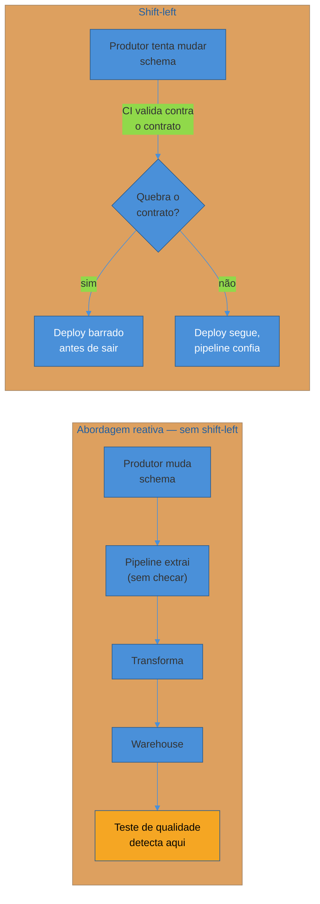

# Data contracts e schema evolution

> [!abstract] TL;DR
> Um pipeline de dados depende de um schema que ele não controla — a tabela de pedidos do time de backend, o tópico de eventos de outro serviço. Quando esse schema muda sem aviso, o pipeline quebra em silêncio: os números continuam saindo do outro lado, só que errados ou vazios, e ninguém percebe até um dashboard de faturamento chegar zerado numa reunião. **Data contract** é o antídoto estrutural: um acordo explícito e versionado entre quem produz o dado e quem consome, cobrindo schema, semântica, garantias de qualidade e ownership — transformando uma dependência implícita e frágil num compromisso testável em CI. O núcleo técnico do contrato é a **compatibilidade de schema**: quais mudanças um produtor pode fazer sem quebrar consumidores existentes (adicionar campo opcional) e quais sempre quebram (remover, renomear, mudar tipo). Esta nota cobre o problema do *silent breakage*, o princípio de **shift-left** (validar na origem, não no fim da linha), as regras de compatibilidade backward/forward/full, onde o contrato vive como código, e o estado dos data contracts como primitivo de warehouse em 2026.

> [!question]- Perguntas que esta nota responde
> - Por que uma mudança de schema no sistema produtor consegue quebrar um dashboard três dias depois, sem nenhum erro visível na hora?
> - O que é, concretamente, um data contract — e em que ele difere de "documentar o schema numa wiki"?
> - O que significa schema backward compatible, forward compatible e full compatible — e que mudanças concretas caem em cada categoria?
> - O que é shift-left, e por que validar o contrato na origem é estruturalmente melhor que testar só no warehouse?
> - Onde um data contract vive na prática — schema como código, CI, schema registry — sem virar tutorial de ferramenta?

## O dashboard que zerou sem nenhum erro

Volte ao e-commerce que abriu esta trilha. O time de backend mantém a tabela `pedidos` no Postgres transacional, e um pipeline extrai dessa tabela todo dia à noite para alimentar a `fato_vendas` do warehouse — a mesma tabela de fatos desenhada na nota 03 do sub-galho de modelagem. Uma das colunas que o pipeline lê é `preco`.

Um dev do time de backend, trabalhando numa feature de preço promocional, decide que `preco` é um nome ambíguo — ele quer distinguir preço unitário de preço com desconto aplicado. Renomeia a coluna para `preco_unitario`, roda a migration, faz o deploy. Do ponto de vista dele, é um refactor local, dentro do domínio dele, sem nenhuma mudança de comportamento visível para o usuário do checkout. Os testes do serviço de pedidos passam. O deploy sobe sem incidente.

Três dias depois, alguém do comercial pergunta por que o dashboard de faturamento está mostrando R$ 0 desde terça-feira.

O que aconteceu: o pipeline noturno continuou rodando, todas as noites, sem lançar exceção nenhuma. A query de extração selecionava a coluna `preco`, que não existe mais — mas dependendo de como a extração foi escrita (um `SELECT *` que virou `SELECT preco` implícito via um ORM, ou um cast permissivo), o resultado não foi um erro fatal. Foi um valor nulo, silenciosamente convertido para zero na agregação do warehouse. O pipeline "funcionou". A tabela `fato_vendas` recebeu linhas novas todas as noites. Só que com faturamento zero em cada uma.

> [!warning] Silent breakage: o pior tipo de quebra
> **O que acontece:** uma mudança de schema na origem não derruba o pipeline — ela degrada o dado silenciosamente, sem exceção, sem alerta, sem nenhum sinal visível até alguém notar o número errado numa reunião de negócio.
> **Por quê:** o produtor do dado (o time de backend) não sabia que a tabela `pedidos` tinha um consumidor a jusante. Não havia lista de quem lê aquele schema, não havia teste que barrasse o deploy, e o pipeline foi escrito de um jeito tolerante o suficiente para não quebrar ruidosamente diante de uma coluna ausente — o que parecia robustez, mas era só adiar o dano para um lugar onde ele é mais caro de diagnosticar.
> **Como evitar:** o assunto desta nota inteira. Em resumo: tornar a dependência explícita (data contract), validar o mais cedo possível (shift-left), e projetar o pipeline para falhar ruidosamente diante de uma mudança de schema, nunca silenciosamente.

O ponto central deste incidente hipotético não é técnico — é organizacional. O dev de backend fez um refactor correto, dentro do seu próprio domínio, seguindo boas práticas de nomenclatura. O erro não foi dele sozinho: foi de um sistema que não deu a ele nenhuma forma de saber, no momento do deploy, que aquela coluna tinha um consumidor fora do radar dele. É exatamente esse gap — a dependência entre produtor e consumidor de dado que existe na prática, mas não existe em lugar nenhum como compromisso explícito — que um data contract fecha.

## O que é um data contract

Um **data contract** é um acordo explícito, versionado, entre quem produz um conjunto de dados e quem consome — cobrindo, tipicamente, quatro dimensões:

- **Schema** — os campos, tipos e estrutura que o consumidor pode esperar encontrar, formalizados como artefato verificável (não como comentário em código ou página de wiki que ninguém lê).
- **Semântica** — o que cada campo *significa*. `preco` é com ou sem imposto? `criado_em` é a hora do pedido ou a hora que ele entrou na fila de processamento? Um schema correto sintaticamente ainda pode enganar semanticamente.
- **Garantias de qualidade e SLA** — com que frequência o dado é atualizado (freshness), que taxa de nulo é aceitável, em quanto tempo uma quebra é corrigida. Este eixo se conecta direto com [[01 - Qualidade e observabilidade de dados]], que trata a validação contínua dessas garantias — o contrato é o que promete o valor, a observabilidade é o que confirma que a promessa está sendo cumprida.
- **Ownership** — quem é responsável quando o contrato quebra. Sem um dono nomeado, "alguém deveria consertar isso" vira ninguém consertando.

O efeito prático de nomear essas quatro coisas por escrito, num artefato versionado, é transformar uma dependência **implícita** — "o pipeline de analytics lê a tabela `pedidos`, mas nada no código do backend registra isso" — numa dependência **explícita** — "a tabela `pedidos` tem um contrato publicado; qualquer mudança que viole esse contrato precisa passar por um processo, não por um deploy silencioso".

> [!question]- Isso não é só documentação de schema com um nome chique?
> A diferença central é **enforcement**. Documentação de schema é descritiva — alguém escreveu o que o schema *era* num certo momento, e nada garante que ela continua correta depois do próximo deploy. Um data contract é prescritivo e, idealmente, **verificado automaticamente**: existe uma checagem — em CI, num schema registry, ou nos dois — que barra ou avisa quando uma mudança viola o que foi prometido. A wiki descreve o passado; o contrato constrange o futuro. É a mesma diferença, em espírito, entre um comentário `// isso deveria estar sincronizado com X` e um teste automatizado que falha se X mudar.

## Shift-left: validar na origem, não no fim da linha

A abordagem reativa — a que o e-commerce tinha antes do incidente — é testar a qualidade do dado só no fim do pipeline: rodar checagens no warehouse, depois que o dado já foi extraído, transformado e carregado. Isso funciona para pegar erros de transformação, mas para um problema de *schema na origem* ela chega tarde demais: o dado ruim já percorreu o pipeline inteiro, já pode ter alimentado um dashboard ou um modelo de ML, e o diagnóstico agora exige rastrear de volta por várias etapas até achar onde a mudança realmente aconteceu.

**Shift-left** é o princípio de mover essa validação para o mais cedo possível — idealmente para o momento em que o produtor emite o dado, antes mesmo dele entrar no pipeline. Na prática, isso significa duas coisas trabalhando juntas:

1. O **produtor** valida a própria mudança contra o contrato publicado, no seu próprio pipeline de CI, antes do deploy — o dev de backend do exemplo teria visto o build falhar ao tentar renomear `preco`, porque existe um teste de contrato rodando ali, não três camadas depois.
2. Quando isso não é possível (o produtor é um sistema de terceiros, ou legado, sem esse tipo de gate), a validação acontece o mais próximo possível do ponto de ingestão — o pipeline recusa dado que não bate com o schema esperado, em vez de aceitar silenciosamente e deixar o erro se propagar.

O ganho de shift-left não é só velocidade de detecção — é **quem** paga o custo de descobrir o problema. Na abordagem reativa, quem descobre é o consumidor, geralmente muito depois, sem contexto sobre o que mudou. No shift-left, quem descobre é o próprio produtor, no momento exato em que ele tem todo o contexto da mudança na cabeça — o lugar mais barato do mundo para corrigir um erro.

> [!question]- Shift-left elimina a necessidade de observabilidade no warehouse?
> Não — os dois se complementam, não competem. Shift-left pega o que é **detectável no schema**: campo removido, tipo mudado, campo renomeado. Mas existe uma classe inteira de problema que só aparece com o dado em mãos — uma coluna que continua existindo e com o tipo certo, mas cujos valores começam a vir errados por um bug de lógica de negócio, ou uma taxa de nulo que sobe de 1% para 40% sem nenhuma mudança de schema. Essa classe é o território da observabilidade contínua, coberta em [[01 - Qualidade e observabilidade de dados]]. Um contrato bem desenhado reduz a superfície de incidentes de schema; ele não substitui monitorar o dado em produção.

## Compatibilidade de schema: o núcleo técnico

Se o contrato promete um schema, a pergunta operacional é: quais mudanças o produtor pode fazer *sem* quebrar o contrato, e quais exigem negociação, deprecation ou uma nova versão? Essa é exatamente a mesma pergunta que a teoria de versionamento de API síncrona resolve para contratos REST/RPC — a nota [[03-Dominios/Engenharia/Comunicação entre Sistemas/3 - Confiabilidade do contrato/02 - Versionamento e evolução de contrato|Versionamento e evolução de contrato]] cobre em profundidade backward/forward compatibility, deprecation e o processo de breaking change para APIs. Esta nota não repete essa teoria — ela aplica o mesmo eixo de compatibilidade ao contrato de **dados**: o schema de uma tabela, de um evento consumido por um pipeline analítico, de um arquivo Parquet num data lake.

As três categorias de compatibilidade, aplicadas a schema de dado[^confluent]:

- **Backward compatible** — um consumidor com o schema *novo* consegue ler dado escrito com o schema *antigo*. É a garantia que importa quando o consumidor evolui antes do produtor reprocessar dado histórico: o pipeline atualizado ainda precisa conseguir ler as partições antigas do data lake.
- **Forward compatible** — um consumidor com o schema *antigo* consegue ler dado escrito com o schema *novo*, ignorando o que não reconhece. É a garantia que importa quando o produtor evolui mais rápido que todos os consumidores conseguem acompanhar — um evento novo chega com um campo extra, e os consumidores mais lentos simplesmente o ignoram sem quebrar.
- **Full compatible** — as duas garantias ao mesmo tempo. É o alvo ideal para schema que é consumido por muitos times em momentos de atualização diferentes, típico de um schema registry corporativo.

Traduzindo isso em mudanças concretas de schema:

| Mudança | Backward compatible? | Forward compatible? | Por quê |
|---|---|---|---|
| Adicionar campo **opcional**, com valor default | Sim | Sim | Consumidor novo lê dado velho usando o default; consumidor velho ignora o campo novo |
| Adicionar campo **obrigatório**, sem default | Não | Sim | Dado velho não tem o campo — consumidor novo que exige presença dele quebra |
| Remover campo que ninguém mais usa | Depende | Depende | Só é seguro se **nenhum** consumidor ativo lê aquele campo — verificável só com um contrato que rastreia consumidores |
| Renomear campo (`preco` → `preco_unitario`) | Não | Não | Do ponto de vista do schema, é uma remoção mais uma adição — quebra os dois sentidos, como no incidente do e-commerce |
| Mudar o tipo de um campo (`int` → `string`) | Não | Não | Nenhum consumidor deserializa `"12.50"` esperando `1250`, nem o inverso — mesmo mudanças aparentemente "compatíveis" de tipo (`int` → `long`) exigem checagem explícita |
| Apertar uma constraint (`nullable` → `not null`, ou reduzir um enum) | Não, para o produtor | — | Dado histórico pode já violar a constraint nova; consumidores que dependiam da flexibilidade anterior quebram |
| Afrouxar uma constraint (`not null` → `nullable`) | Sim, mas com ressalva | — | Consumidores que assumiam presença garantida do campo agora podem receber nulo — tecnicamente compatível no schema, mas pode quebrar lógica downstream |

A regra prática que emerge dessa tabela: **adicionar é quase sempre seguro; remover, renomear e mudar tipo quase nunca são**. É a mesma heurística que a nota de Comunicação estabelece para contrato de API — o que muda, no lado de dados, é que a "renomeação" costuma nascer de um refactor bem-intencionado dentro de um domínio que não pensa em si mesmo como "produtor de API", porque tecnicamente não está expondo endpoint nenhum. É exatamente esse ponto cego — "eu não sei que sou um produtor de contrato" — que o data contract, como artefato explícito, corrige.

> [!question]- E quando remover ou renomear é genuinamente necessário?
> O caminho seguro é o mesmo padrão de deprecation que contratos de API usam: publicar o campo novo ao lado do antigo por um período de transição, migrar os consumidores um a um (o contrato, se tiver ownership registrado, diz exatamente quem precisa migrar), e só então remover o campo antigo — nunca renomear em um único deploy atômico. Caro em disciplina, barato em incidente evitado.

## Onde o contrato vive: schema como código

Um contrato só cumpre a promessa de shift-left se ele for **verificável automaticamente**, não um documento que alguém lembra de atualizar. Na prática, isso aparece em três formas que se combinam:

**Schema como código.** O schema é definido num formato explícito e versionável — JSON Schema, Protobuf, Avro — e vive no mesmo controle de versão que o código do produtor, não numa wiki à parte. Uma mudança de schema é uma mudança de código, revisada em pull request como qualquer outra.

**CI que barra deploy que quebra contrato.** O pipeline de integração contínua do produtor roda uma checagem de compatibilidade contra a versão publicada do contrato antes de permitir o merge ou o deploy — exatamente o gate que teria pego a renomeação de `preco` antes dela sair para produção. Essa checagem pode ser tão simples quanto "o novo schema é um superconjunto compatível do anterior" ou tão rica quanto rodar testes de contrato reais contra consumidores conhecidos.

**Schema registry, para dado em movimento.** Quando o dado trafega como evento — mensageria, streaming —, um schema registry centraliza as versões do schema e aplica a checagem de compatibilidade no momento da publicação, recusando uma mensagem que viole a regra configurada (backward, forward ou full). Esse mecanismo, e como ele se encaixa na arquitetura de mensageria/eventos, é tratado com mais profundidade em [[03-Dominios/Engenharia/Comunicação entre Sistemas/index|Comunicação entre Sistemas]] — aqui o ponto relevante é que o schema registry é, na prática, um data contract automatizado para dado em fluxo: o contrato deixa de ser um documento e vira um gate executável no caminho do dado.

> [!info] Data contracts é área quente e volátil em 2026
> O rótulo "data contract" virou um dos temas mais discutidos da engenharia de dados nos últimos anos, e a onda de ferramentas e produtos em torno dele ainda está se consolidando — plataformas dedicadas de contrato de dados, integrações de contrato em ferramentas de observabilidade, e uma variedade de abordagens (contract-first vs contract-as-test) competindo por padrão de mercado. Os warehouses e frameworks de transformação também estão internalizando o conceito como primitivo de primeira classe — por exemplo, dbt oferece **model contracts** desde a versão 1.5 (2023), permitindo declarar e aplicar (`enforced`) o schema esperado de um modelo antes dele ser materializado[^dbt-contracts], e o ecossistema de ferramentas dedicadas de contrato (workflows de definição, validação e catálogo de contratos) segue evoluindo rápido. Nomes de produto, formatos de arquivo e integrações específicas tendem a mudar de um ano para o outro. O que não muda é o princípio por trás de qualquer ferramenta que se anuncie assim: **tornar a dependência entre produtor e consumidor de dado explícita, versionada e verificada automaticamente, o mais cedo possível no ciclo**. Avalie qualquer ferramenta nova contra esse princípio, não contra o quão recente ou badalada ela é.

## Voltando ao e-commerce: o contrato da fato_vendas

Fechando o exemplo de abertura: com um data contract em vigor, a tabela `pedidos` do backend teria um contrato publicado, algo como:

- **Schema**: `id` (uuid, obrigatório), `preco` (decimal, obrigatório, em centavos, sem imposto), `status` (enum: `pendente`\|`pago`\|`cancelado`), `criado_em` (timestamp, hora de criação do pedido — não da confirmação de pagamento).
- **Freshness prometido**: o pipeline consome via captura de mudanças (o mesmo mecanismo coberto em [[03-Dominios/Engenharia/Dados/3 - Pipelines - movimentação e transformação/02 - Ingestão de dados|Ingestão de dados]]) com atraso máximo de 15 minutos entre a escrita no Postgres e a disponibilidade no warehouse.
- **Dono**: o time de backend de pedidos, nomeado explicitamente — não "o time que mexeu por último".
- **O que quebra o consumidor**: renomear ou remover qualquer um dos quatro campos acima, mudar o tipo de `preco`, ou mudar a semântica de `criado_em` sem publicar uma nova versão do contrato.

Com esse contrato registrado e um teste de compatibilidade rodando no CI do time de backend, a tentativa de renomear `preco` para `preco_unitario` teria falhado o build, com uma mensagem apontando exatamente qual contrato e qual consumidor seriam afetados — antes do deploy, não três dias depois do dashboard zerar. O custo de escrever e manter esse contrato é real: alguém precisa nomeá-lo, publicá-lo, mantê-lo atualizado. Mas é uma fração do custo de diagnosticar, em produção, por que um número de negócio está errado sem nenhum erro visível apontando a causa.

## Em entrevista

Uma pergunta comum, tanto para data engineer quanto para backend sênior que interage com pipelines analíticos: "como você evitaria que uma mudança no seu serviço quebrasse um pipeline de dados que você nem sabia que existia?" A resposta fraca fica no genérico ("comunicação entre times"). A resposta forte nomeia o mecanismo: um data contract publicado e versionado, com uma checagem de compatibilidade rodando em CI antes do deploy — shift-left, não um processo manual de avisar Slack.

Outra pergunta frequente: "que tipo de mudança de schema você consideraria sempre segura, e qual você trataria como breaking change automático?" A resposta madura nomeia a regra sem hesitar: adicionar campo opcional é seguro; remover, renomear ou mudar tipo de campo existente é sempre um breaking change candidato, e exige o mesmo processo de deprecation que qualquer contrato de API usa — nunca um deploy atômico que troca o nome de um campo de uma vez.

Um terceiro eixo, mais avançado: "como você decide entre backward compatible, forward compatible e full compatible como política padrão para um schema registry corporativo?" A resposta que soa sênior reconhece o trade-off: full compatible é o alvo mais seguro, mas também o mais restritivo — ele barra até mudanças que seriam inofensivas se todos os consumidores atualizassem no mesmo dia. Em ambientes com muitos consumidores heterogêneos, atualizando em ritmos diferentes, full compatible costuma valer o custo de restrição extra; em ambientes pequenos, com produtor e consumidor deployados juntos, uma política mais frouxa pode ser aceitável.

## How to explain in English

> "A data contract is an explicit, versioned agreement between the producer of a dataset and its consumers — schema, semantics, quality guarantees, and ownership. It exists because schema changes on the producer side tend to break consumers silently: a column gets renamed inside what looks like a self-contained refactor, and three days later a downstream dashboard is showing zero revenue with no error anywhere. Shift-left means validating that contract as close to the source as possible — ideally in the producer's own CI, before deploy — instead of discovering the break at the end of the pipeline. The technical core is compatibility: additive changes, like a new optional field, are safe; removing, renaming, or retyping an existing field almost never is."

| PT | EN |
|----|----|
| Contrato de dados | Data contract |
| Produtor / consumidor de dados | Data producer / data consumer |
| Quebra silenciosa | Silent breakage |
| Mudança à esquerda (validar na origem) | Shift-left |
| Compatibilidade retroativa | Backward compatibility |
| Compatibilidade prospectiva | Forward compatibility |
| Mudança que quebra o contrato | Breaking change |
| Schema como código | Schema as code |
| Registro de schema | Schema registry |
| Contrato de modelo (dbt) | Model contract |
| Dono do dado | Data owner |

## O que vem a seguir

Estabelecemos o que é um data contract, por que a quebra de schema costuma ser silenciosa, o princípio de shift-left, e as regras de compatibilidade que decidem quais mudanças são seguras. Falta ainda responder a uma pergunta mais ampla: mesmo com contrato e qualidade garantidos campo a campo, como alguém *descobre* que uma tabela existe, entende o que ela significa, e rastreia de onde um número específico veio — em uma organização com centenas de tabelas e dezenas de times?

- [[03 - Governança, catálogo e lineage]] — metadata, catálogo de dados, lineage end-to-end, e como classificar e proteger dado sensível

## Fontes

- dbt Labs — [*Add model contracts*](https://docs.getdbt.com/docs/collaborate/govern/model-contracts) — documentação canônica de model contracts, o primitivo de contrato de dados nativo do dbt (desde 1.5, 2023).
- Reis, Joe & Housley, Matt — *Fundamentals of Data Engineering: Plan and Build Robust Data Systems*, O'Reilly, 2022 — capítulo sobre governança e qualidade de dados, incluindo a origem da preocupação com contrato entre produtor e consumidor no ciclo de vida do dado.
- Confluent — [*Schema Evolution and Compatibility*](https://docs.confluent.io/platform/current/schema-registry/fundamentals/schema-evolution.html) — referência canônica das regras de compatibilidade backward/forward/full aplicadas a schema registry de eventos.
- Skarlinski, Chad — [*The Rise of Data Contracts*](https://www.datacouncil.ai/talks/the-rise-of-data-contracts) — uma das formulações iniciais que popularizou o termo "data contract" como resposta ao problema de silent breakage em pipelines analíticos.

[^dbt-contracts]: dbt Labs, *Add model contracts*, documentação oficial, desde dbt 1.5 (2023).
[^confluent]: Confluent, *Schema Evolution and Compatibility*, documentação de schema registry.
