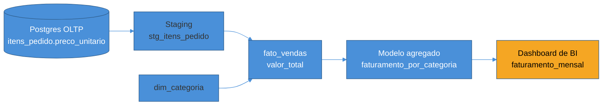

# Governança, catálogo e lineage

> [!abstract] TL;DR
> Um warehouse que começou com dez tabelas bem conhecidas, mantidas por duas pessoas que sabiam de cor o que cada uma significava, vira, em poucos anos, duzentas tabelas mantidas por times diferentes — e ninguém mais sabe qual é a `fato_vendas` "certa", de onde um número no dashboard do CFO realmente veio, se pode confiar nele, ou quem procurar quando ele parece errado. Esse é o problema de escala que **governança de dados** resolve: não é burocracia por burocracia, é a infraestrutura de confiança que permite uma organização crescer sem perder rastreabilidade. Três peças resolvem isso juntas — **metadados** (dado sobre o dado: schema, dono, frescor, sensibilidade), um **data catalog** (o índice pesquisável que torna esses metadados descobríveis) e **data lineage** (o rastro coluna a coluna de onde cada número veio, essencial para análise de impacto e depuração). Sobre essa base assenta a governança propriamente dita — políticas, definições canônicas, ownership — e um recorte que merece atenção redobrada: dado pessoal identificável (**PII**), que a LGPD e a GDPR regulam, e que dentro do warehouse exige classificação, mascaramento e controle de acesso deliberados. Esta nota fecha com a ideia de **data as a product**, que trata datasets como produtos com dono e SLA — a ponte direta para a próxima nota, sobre arquiteturas organizacionais.

> [!question]- Perguntas que esta nota responde
> - Por que uma organização com centenas de tabelas precisa de um catálogo de dados, e o que ele resolve que uma boa documentação em wiki não resolve?
> - O que é data lineage, para que serve na prática (análise de impacto, depuração, auditoria), e como ele se diferencia de "documentação de pipeline"?
> - Onde termina a governança de dados e começa a segurança de sistemas — criptografia, controle de acesso, hashing?
> - O que muda, concretamente, quando uma coluna do warehouse contém PII: classificação, mascaramento, retenção, direitos do titular?
> - O que significa tratar um dataset como "produto de dados", e por que isso prepara a discussão de data mesh?

## O warehouse que ninguém mais entende sozinho

Volte ao e-commerce que abre a trilha. No início, o warehouse tinha uma dúzia de tabelas — `fato_vendas`, `dim_cliente`, `dim_produto`, `dim_tempo` — e as duas pessoas que o mantinham sabiam de cor o que cada coluna significava, porque foram elas que escreveram os modelos. Perguntar "de onde vem esse número?" tinha resposta imediata, porque a resposta morava na cabeça de alguém a um Slack de distância.

Três anos depois, o mesmo warehouse tem duzentas tabelas. O time de marketing criou as próprias tabelas de atribuição de campanha. O time de logística tem um conjunto de fatos sobre entregas. Alguém, em algum momento, criou uma segunda `fato_vendas_v2` porque a primeira "tinha um bug" — e nunca depreciou a original. Um analista novo, tentando responder "qual foi o faturamento de junho", encontra três tabelas com nome parecido, calcula três números diferentes, e não tem como saber qual delas é a fonte de verdade sem perguntar para alguém que talvez já tenha saído da empresa.

Esse não é um problema técnico no sentido de query lenta ou pipeline quebrado — é um problema de **escala organizacional**. Ele aparece exatamente quando o número de pessoas produzindo e consumindo dado cresce mais rápido que a capacidade de qualquer indivíduo carregar o contexto inteiro na cabeça. E ele tem sintomas concretos e caros:

- **Descoberta**: ninguém sabe que uma tabela já existe, então recria a mesma métrica do zero, com uma pequena diferença de lógica — e agora existem dois números "de faturamento" divergentes circulando pela empresa.
- **Confiança**: um dashboard mostra um número estranho, e ninguém sabe se é um bug real, um dado atrasado, ou uma mudança legítima no negócio — porque não há como rastrear de onde aquele número veio.
- **Ownership**: uma tabela crítica para o financeiro depende de um pipeline que só uma pessoa entende, e essa pessoa está de férias quando ele quebra.
- **Risco**: uma coluna com CPF de cliente é exposta, sem querer, a um relatório que qualquer analista pode consultar — porque ninguém classificou aquele dado como sensível.

Nenhum desses sintomas se resolve escrevendo uma query melhor ou otimizando um pipeline. Eles se resolvem com infraestrutura de **metadados**, **descoberta** e **política** — o assunto desta nota.

> [!warning] "Documentação em wiki resolve isso"
> **O que acontece:** o time cria uma página de wiki listando as tabelas principais do warehouse, com uma frase de descrição cada. **Por quê:** a wiki desatualiza no primeiro mês. Ninguém lembra de editá-la quando cria uma tabela nova, renomeia uma coluna ou deprecia um modelo — porque a wiki vive fora do fluxo de trabalho de quem produz o dado. Em pouco tempo, a wiki é menos confiável do que perguntar no Slack. **Como evitar:** metadados que importam precisam viver **perto do dado**, idealmente gerados automaticamente a partir do próprio schema e do próprio pipeline (via introspecção do warehouse, ou como efeito colateral de rodar um job de transformação) — não digitados à mão num documento separado que ninguém tem incentivo de manter.

## Metadados: dado sobre o dado

**Metadados** é a informação que descreve um dado, sem ser o dado em si. Uma tabela tem linhas e colunas — isso é o dado. Quem é dono dela, quando ela foi atualizada pela última vez, o que cada coluna significa, se ela contém informação sensível — isso é metadado.

Vale separar três naturezas de metadado, porque cada uma serve um propósito diferente:

**Metadado técnico** — o que o próprio sistema sabe descrever sozinho: tipo de cada coluna, chave primária, tamanho da tabela, quando o último job de transformação rodou, quantas linhas foram escritas. Em geral extraível por introspecção, sem depender de ninguém digitar nada.

**Metadado de negócio** — o significado que só um humano com contexto de domínio sabe explicar: "esta coluna `status` vale `'pago'` quando o pagamento foi confirmado pelo gateway, não quando o pedido foi criado" ou "cliente ativo, para efeito deste relatório, é quem comprou nos últimos 90 dias". Esse tipo de metadado não emerge do schema — precisa ser escrito por quem entende o negócio, e é exatamente o tipo de definição que costuma divergir silenciosamente entre times até alguém formalizá-la (o tema de definições canônicas, adiante nesta nota).

**Metadado operacional** — o que descreve a saúde e o comportamento do pipeline: frescor da última carga, taxa de erro, popularidade de uso (quantas queries tocam essa tabela por semana, quem são os consumidores mais frequentes). É o metadado que, em geral, alimenta ferramentas de observabilidade — aprofundado na nota anterior desta trilha.

A ideia central é que metadado bem estruturado é o que transforma "confiar no dado" de um ato de fé em uma decisão informada. Um analista que vê "esta tabela foi atualizada há 6 horas, é mantida pelo time de vendas, e tem 40 queries por semana rodando contra ela" tem informação suficiente para decidir se confia nela — sem precisar perguntar para ninguém.

## Data catalog: o índice pesquisável do warehouse

Um **data catalog** é o sistema que coleta esses metadados de todas as fontes — warehouse, pipelines, ferramentas de BI — e os torna **descobríveis e pesquisáveis** num único lugar. Pense nele como o motor de busca do warehouse: em vez de perguntar no Slack "alguém sabe onde tem dado de faturamento?", você busca "faturamento" no catálogo e encontra a tabela certa, com dono, descrição, freshness e popularidade já anexados.

Um catálogo maduro tipicamente responde, sobre qualquer tabela ou coluna:

- **O que é** — descrição de negócio, não só o nome técnico da coluna.
- **Quem é dono** — a pessoa ou time responsável, para quando algo quebra ou uma dúvida surge.
- **Quão fresco está** — quando foi a última atualização, e com que frequência ela se repete.
- **Quão popular é** — quantas queries e dashboards dependem dela, um sinal indireto de quão crítico é não quebrá-la.
- **O que é sensível** — tags de classificação (PII, dado financeiro, dado confidencial), tratadas adiante nesta nota.

Como categoria de ferramenta, catálogos de dados existem em variedade — desde projetos open source como **DataHub** e **Amundsen**, passando por plataformas comerciais de governança como **Collibra**, até camadas de catálogo embutidas no próprio warehouse, como o **Unity Catalog** do Databricks[^datahub]. Nenhuma delas é ensinada aqui em nível de tutorial — o objetivo é você reconhecer a categoria e o que ela resolve, não operar uma ferramenta específica.

> [!info] Categoria de ferramenta em evolução ativa
> O espaço de data catalogs e governança é um dos que mais mudam de nome e de fornecedor dentro do modern data stack — fusões, aquisições e novos entrantes são comuns. O conceito que importa aqui (metadado centralizado, pesquisável, com dono e classificação) é estável; o nome da ferramenta líder do mercado, não.

Um catálogo por si só, no entanto, não resolve a pergunta mais difícil: **de onde exatamente veio este número?** Para isso existe uma peça de metadado mais específica — lineage.

## Data lineage: o rastro coluna a coluna

**Data lineage** (linhagem de dado) é o mapa de como um dado se moveu e se transformou, desde a fonte onde nasceu até o ponto onde alguém o consome. Não é só "esta tabela alimenta aquela outra" — lineage madura rastreia no nível de **coluna**: a coluna `faturamento_mensal` no dashboard do CFO veio da coluna `valor_total` da tabela de fatos de vendas, que por sua vez veio de uma soma de `quantidade * preco_unitario` da tabela de staging, que por sua vez veio da coluna `preco_unitario` da tabela `itens_pedido` no Postgres de produção.

Esse rastro serve a três propósitos concretos, e cada um resolve uma dor real de quem opera um warehouse maduro:

**Análise de impacto.** Antes de renomear, remover ou mudar o tipo de uma coluna na fonte, lineage responde: "o que quebra se eu mexer aqui?" Sem esse mapa, a resposta só se descobre depois que algo quebra em produção — um dashboard fica em branco, um relatório financeiro some uma métrica — e alguém precisa investigar de trás para frente qual mudança causou o estrago.

**Depuração.** Um número no dashboard está claramente errado. Sem lineage, depurar significa abrir cada transformação manualmente e rastrear na mão até achar onde a lógica diverge. Com lineage, o caminho já está mapeado — a investigação começa direto no ponto certo da cadeia.

**Auditoria e compliance.** Em setores regulados, ou simplesmente quando um número vai para um relatório financeiro público, alguém eventualmente pergunta "prove que este número veio de onde você diz que veio, sem intervenção manual no meio do caminho". Lineage é exatamente essa prova.

O diagrama abaixo mostra o lineage do exemplo de faturamento por categoria, da fonte ao dashboard:

Historicamente, cada ferramenta do pipeline (o orquestrador, a ferramenta de transformação, o warehouse) reportava lineage no seu próprio formato proprietário — o que tornava impossível montar o mapa completo ponta a ponta quando um pipeline atravessava várias ferramentas de fornecedores diferentes. **OpenLineage** surgiu como um esforço de padronização: uma especificação aberta para que diferentes ferramentas emitam eventos de lineage num formato comum, permitindo montar o grafo completo mesmo num stack heterogêneo[^openlineage]. Como toda peça tool-neutral desta trilha, o ponto aqui não é aprender a instrumentar OpenLineage — é reconhecer que o problema de "lineage fragmentado entre ferramentas" tem uma resposta de padrão da indústria, não só de fornecedor único.

> [!question]- Lineage não é a mesma coisa que documentação de pipeline?
> Documentação de pipeline descreve, em prosa, o que um job faz — geralmente escrita uma vez e desatualizada logo depois. Lineage é **derivado automaticamente** da própria execução do código de transformação (analisando o SQL, ou capturado como efeito colateral de rodar o pipeline), o que significa que ele nunca fica desatualizado da mesma forma que uma prosa manual fica: se o pipeline muda, o lineage muda junto, porque ele é extraído do comportamento real, não escrito à parte por alguém que pode esquecer de atualizar.

> [!info] Lineage como um dos cinco pilares de observabilidade
> A nota anterior desta trilha, [[01 - Qualidade e observabilidade de dados]], já introduziu lineage como um dos cinco pilares de data observability (ao lado de freshness, volume, schema e quality) — ali o foco era a lente operacional: lineage como sinal de monitoramento, usado para localizar rapidamente a origem de uma anomalia. Aqui o foco é o aprofundamento: lineage como peça de infraestrutura de governança, usada para descoberta, análise de impacto e auditoria — não só para depurar um incidente pontual.

## Governança de dados: política sobre a infraestrutura

Metadado, catálogo e lineage são **infraestrutura** — eles tornam informação disponível. **Governança de dados** é a camada de cima: as políticas, papéis e processos que decidem como essa infraestrutura é usada. Governança responde perguntas como:

- Quem é o **dono** de cada domínio de dado, e quem tem autoridade para mudar sua definição?
- Quais são as **definições canônicas** de métricas de negócio — o que exatamente conta como "cliente ativo", "pedido cancelado", "receita reconhecida" — de forma que dois times não calculem o mesmo conceito de duas formas diferentes?
- Quem pode **acessar** o quê, e sob qual processo de aprovação?
- Quanto tempo um dado deve ser **retido**, e quando ele deve ser expurgado?

O caso das definições canônicas merece destaque porque é onde governança evita um dano silencioso e caro. Sem uma definição única de "cliente ativo", o time de marketing pode contar "comprou nos últimos 90 dias", o time financeiro pode contar "tem assinatura vigente", e ambos os números aparecem, sem aviso, em relatórios diferentes para a mesma diretoria — que nunca sabe qual confiar, porque nenhum dos dois está "errado" isoladamente. Governança madura resolve isso definindo a métrica uma vez, num lugar central e versionado, e fazendo todo mundo consumir a partir dali — não impondo uma regra rígida de cima para baixo sem consulta aos times que vivem a métrica no dia a dia.

Governança não é, e não deveria ser, um comitê que aprova cada mudança de schema com semanas de atraso — isso simplesmente empurra os times de volta para atalhos não governados. A versão que funciona na prática distribui parte da responsabilidade (donos de domínio decidem sobre seus próprios dados) e centraliza só o que precisa ser centralizado (padrões de nomenclatura, política de classificação de sensibilidade, processo mínimo de acesso). Essa tensão entre centralizar e distribuir governança é, de novo, o fio que conecta esta nota à próxima, sobre arquiteturas organizacionais.

## PII no warehouse: o recorte de dado sensível

Um tipo de dado exige atenção redobrada dentro dessa camada de governança: **PII** (*Personally Identifiable Information*, dado pessoal identificável) — nome, CPF, e-mail, endereço, número de telefone, e qualquer combinação de dados que, junta, identifica uma pessoa específica.

> [!info] A mecânica de segurança mora em outro lugar
> Criptografia, hashing, gestão de segredos e controle de acesso como mecanismo técnico já têm trilha inteira dedicada em [[03-Dominios/Engenharia/Segurança/index|Segurança]] — esta nota não reexplica *como* uma cifra funciona ou *como* implementar um hash seguro. O recorte aqui é outro: a **governança** de dado sensível especificamente dentro do warehouse analítico — classificar, mascarar, controlar quem vê o quê, e por quanto tempo reter. É a pergunta "o que fazer com PII no contexto de dados", não "como a criptografia funciona por baixo".

No Brasil, a **LGPD** (Lei Geral de Proteção de Dados) regula o tratamento de dado pessoal; na União Europeia, a **GDPR** cumpre papel equivalente. Sem entrar em detalhe jurídico específico — que foge do escopo desta trilha, e que uma equipe de dados na prática resolve em conjunto com jurídico e compliance, não sozinha —, alguns princípios conceituais atravessam ambas as legislações e moldam diretamente decisões de engenharia de dados:

- **Base legal para tratamento** — dado pessoal só deveria ser coletado e processado quando existe uma justificativa legítima para isso (consentimento do titular, execução de um contrato, cumprimento de obrigação legal, entre outras), não "porque pode ser útil algum dia".
- **Minimização** — coletar e reter só o dado pessoal estritamente necessário para o propósito declarado, não tudo que é tecnicamente possível capturar. Uma tabela de análise de comportamento de compra provavelmente não precisa do CPF do cliente — só de um identificador anônimo o suficiente para juntar com outras tabelas.
- **Direitos do titular** — a pessoa cujo dado está sendo processado tem direito a saber o que é coletado sobre ela, e em muitos casos a pedir correção ou exclusão. Isso tem uma implicação direta e nada trivial de engenharia: se um cliente pede exclusão, o dado dele não vive só numa tabela — pode estar replicado em dezenas de modelos derivados no warehouse, e todos precisam ser alcançados.
- **Retenção limitada** — dado pessoal não deveria ser guardado indefinidamente só porque armazenamento é barato; deveria ter uma política de expiração ligada ao propósito que justificou sua coleta.

Dentro do warehouse, esses princípios se traduzem em práticas concretas:

**Classificação de sensibilidade.** Cada coluna que contém PII deveria ser marcada como tal — no catálogo de dados, como metadado — para que qualquer pessoa consultando o warehouse saiba, sem precisar adivinhar, que está lidando com dado sensível.

**Mascaramento e anonimização.** Um analista que precisa contar "quantos clientes compraram X" não precisa ver o CPF ou o e-mail completo desses clientes — só precisa poder agrupar por cliente. Técnicas de mascaramento (mostrar `***.***.**-01` em vez do CPF completo) ou de **pseudonimização** (substituir o identificador real por um token que ainda permite juntar tabelas, mas não é reversível para quem não tem a chave) resolvem exatamente esse caso: preservar utilidade analítica sem expor o dado bruto.

**Controle de acesso por coluna.** Nem todo consumidor do warehouse deveria enxergar a mesma versão de uma tabela. Um dashboard de vendas agregadas não precisa de acesso a coluna de e-mail; uma investigação de fraude específica pode precisar, sob processo de aprovação. Warehouses modernos oferecem mecanismos de controle de acesso em nível de coluna ou de linha para viabilizar exatamente essa segmentação — a implementação técnica desses controles é, de novo, terreno de [[03-Dominios/Engenharia/Segurança/index|Segurança]].

> [!warning] "A gente cripto­grafa o disco, então está protegido"
> **O que acontece:** o time considera a proteção de PII resolvida porque o armazenamento subjacente do warehouse é criptografado em repouso. **Por quê:** criptografia em repouso protege contra um cenário específico — alguém roubar o disco físico ou o backup. Ela não impede que um analista com acesso de leitura legítimo rode `SELECT cpf FROM dim_cliente` e veja o dado em texto claro. O risco que mascaramento e controle de acesso por coluna endereçam é outro: **acesso legítimo, mas desnecessariamente amplo** — a maior parte dos vazamentos de dado dentro de uma organização não vem de invasão externa, vem de gente com acesso demais para o que o trabalho dela exige. **Como evitar:** trate criptografia em repouso e controle de acesso a colunas sensíveis como camadas complementares, não substitutas uma da outra. A primeira protege contra roubo físico; a segunda protege contra exposição por acesso amplo demais dentro da própria organização.

## Data as a product

Uma mudança de mentalidade que amarra tudo desta nota — metadado, catálogo, lineage, governança, PII — é tratar cada dataset importante como um **produto**, não como um subproduto acidental de um pipeline. Um dataset tratado como produto tem:

- **Um dono** claro, responsável por sua qualidade e evolução — não "de ninguém e de ninguém ao mesmo tempo".
- **Documentação** de negócio, não só schema técnico — o que a tabela significa, não só que colunas ela tem.
- **Um SLA** — garantias explícitas de frescor e disponibilidade, em vez de expectativas implícitas que só se descobrem quando quebram (o tema de data contracts, na nota anterior desta trilha).
- **Consumidores conhecidos** — o dono sabe quem depende do dataset, o que torna análise de impacto e comunicação de mudança possíveis.

Essa mentalidade — dataset como produto, com dono e contrato — é exatamente o que prepara a discussão da próxima nota desta trilha: se cada domínio de negócio (vendas, logística, marketing) passa a tratar seus próprios dados como produto, com governança federada em vez de um único time central aprovando tudo, a organização caminha para uma arquitetura de **data mesh** — o contraponto ao warehouse centralizado tradicional, e o assunto que fecha o corpo desta trilha.

## Fechando no e-commerce: catalogando a dim_cliente

Para amarrar os quatro conceitos desta nota num caso só, volte à `dim_cliente` do warehouse do e-commerce — a dimensão que guarda nome, e-mail, CPF e histórico de cada cliente, usada por praticamente todo relatório que envolve segmentação de cliente.

Governança madura sobre essa tabela, na prática, significa:

1. **Catalogar** — a tabela aparece no data catalog com descrição de negócio ("um registro por cliente, atualizado diariamente a partir do cadastro"), dono declarado (o time de CRM), e tag de frescor visível para qualquer analista antes de usá-la.
2. **Classificar** — as colunas `cpf`, `email` e `telefone` são marcadas como PII no catálogo; colunas como `segmento` e `data_primeiro_pedido` não são.
3. **Mascarar** — a maior parte dos analistas consulta uma view derivada da `dim_cliente` em que `cpf` e `email` aparecem mascarados ou substituídos por um identificador pseudonimizado; só um grupo restrito, sob processo de acesso formal, consulta a tabela com PII em texto claro.
4. **Rastrear via lineage** — quando o dashboard de "clientes ativos por segmento" mostra um número estranho, lineage aponta direto para a `dim_cliente`, e de lá até a fonte no Postgres de cadastro, sem precisar reconstruir esse caminho manualmente a cada investigação.
5. **Tratar como produto** — o time de CRM, dono da `dim_cliente`, publica um SLA de frescor (atualizada até as 6h da manhã) e sabe, porque o catálogo mostra popularidade de uso, que uma mudança de schema ali afeta dezenas de dashboards — então comunica a mudança com antecedência em vez de simplesmente aplicá-la.

Nada disso elimina a complexidade de operar um warehouse grande — mas transforma "ninguém sabe de onde esse número veio" de um risco estrutural recorrente em uma pergunta que o próprio sistema já sabe responder.

## Em entrevista

Um sinal forte de senioridade, em entrevista de engenharia de dados ou de arquitetura, é reconhecer governança como problema de **escala organizacional**, não de ferramenta. Uma resposta fraca lista nomes de produto ("a gente usaria o DataHub"). Uma resposta forte nomeia o sintoma que a governança resolve: "com dezenas de times produzindo tabelas no mesmo warehouse, sem catálogo e sem dono declarado por dataset, você inevitavelmente acumula tabelas duplicadas e números divergentes para a mesma métrica de negócio — o catálogo e a definição canônica de métrica resolvem isso antes que vire uma crise de confiança".

Uma pergunta comum: "como você garantiria que dado sensível de cliente não vaza para um relatório que não deveria ter acesso a ele?" A resposta madura não fala só de criptografia — ela distingue explicitamente proteção contra roubo (criptografia em repouso, controle de acesso ao ambiente) de proteção contra acesso legítimo amplo demais (classificação de PII, mascaramento, controle por coluna), porque a maioria dos incidentes reais de exposição de dado dentro de uma empresa vem do segundo caso, não do primeiro.

Uma pergunta de sistema mais avançada: "um analista está investigando por que o faturamento de março ficou 15% abaixo do esperado — como o design do seu warehouse ajuda nessa investigação?" A resposta que soa sênior descreve o caminho via lineage — partir do número suspeito no dashboard, seguir a cadeia coluna a coluna até a fonte, e comparar com o volume esperado em cada etapa — em vez de descrever uma investigação manual, tabela por tabela, sem apoio de ferramenta.

## How to explain in English

> "As a warehouse grows past a handful of well-known tables, tribal knowledge stops scaling — nobody can keep two hundred tables in their head. Data governance is the infrastructure that replaces tribal knowledge with something searchable and auditable: metadata describing what each table means and who owns it, a data catalog that makes that metadata discoverable, and data lineage that traces, column by column, where a number came from. On top of that sits policy — who owns what, canonical definitions for business metrics, and, for personal data specifically, classification, masking, and access control aligned with regulations like LGPD or GDPR. The end goal is treating important datasets as products: owned, documented, with an explicit SLA — not accidental byproducts of a pipeline."

| PT | EN |
|----|----|
| Governança de dados | Data governance |
| Metadados | Metadata |
| Catálogo de dados | Data catalog |
| Linhagem de dados | Data lineage |
| Análise de impacto | Impact analysis |
| Dado pessoal identificável | Personally Identifiable Information (PII) |
| Classificação de sensibilidade | Sensitivity classification |
| Mascaramento de dado | Data masking |
| Anonimização | Anonymization |
| Pseudonimização | Pseudonymization |
| Minimização de dados | Data minimization |
| Direitos do titular | Data subject rights |
| Retenção de dados | Data retention |
| Definição canônica de métrica | Canonical metric definition |
| Dado como produto | Data as a product |

## O que vem a seguir

Estabelecemos a infraestrutura de confiança — metadado, catálogo, lineage — e a camada de política sobre ela — governança, ownership, PII, data as a product. Falta responder uma pergunta estrutural que essa mentalidade de produto já deixa entrever: quem deveria ser dono do dado, um time central ou cada domínio de negócio? Essa pergunta organizacional fecha o corpo da trilha.

- [[04 - Arquiteturas organizacionais]] — warehouse centralizado vs. data mesh vs. data fabric, e a lei de Conway aplicada a arquitetura de dados

## Fontes

- Reis, Joe & Housley, Matt — *Fundamentals of Data Engineering: Plan and Build Robust Data Systems*, O'Reilly, 2022 — governança, segurança e privacidade como preocupações transversais do ciclo de vida da engenharia de dados.
- Dehghani, Zhamak — *Data Mesh: Delivering Data-Driven Value at Scale*, O'Reilly, 2022 — origem do princípio "data as a product" e da discussão de governança federada, aprofundada na próxima nota.
- OpenLineage — [*OpenLineage: An Open Standard for Data Lineage Collection*](https://openlineage.io/) — especificação aberta de lineage citada como padrão de interoperabilidade entre ferramentas.
- DataHub Project — [*DataHub: The Metadata Platform*](https://datahubproject.io/) — exemplo de data catalog open source, citado como referência de categoria, não como tutorial.
- Autoridade Nacional de Proteção de Dados (ANPD) — [Lei Geral de Proteção de Dados Pessoais (LGPD), Lei nº 13.709/2018](https://www.gov.br/anpd/pt-br) — referência institucional brasileira para os princípios de base legal, minimização e direitos do titular citados nesta nota.

[^datahub]: DataHub Project, *DataHub: The Metadata Platform*; Dehghani, *Data Mesh*, O'Reilly, 2022. [^openlineage]: OpenLineage, *An Open Standard for Data Lineage Collection*.
