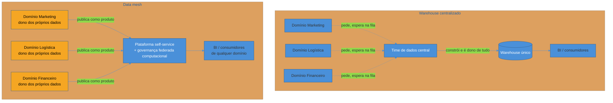

# Arquiteturas organizacionais

> [!abstract] TL;DR
> Toda a trilha, até aqui, assumiu implicitamente um jeito de organizar quem constrói dado: um time central de dados, dono do warehouse e dos pipelines, servindo o resto da empresa. Esse modelo **centralizado** funciona bem enquanto a empresa é pequena o suficiente para um time só carregar o contexto de todos os domínios de negócio — mas, conforme o número de domínios cresce, esse mesmo time vira o gargalo: fila de pedidos, distância do conhecimento de domínio, decisão de modelagem tomada por quem não vive o problema. **Data mesh**, termo cunhado por Zhamak Dehghani em 2019, propõe o oposto: cada domínio de negócio é dono dos próprios dados, publicados como produto (nota anterior desta trilha), sobre uma plataforma self-service, sob governança federada computacional — quatro princípios que, juntos, aplicam de propósito a **Lei de Conway** à arquitetura de dados. **Data fabric** é outra resposta ao mesmo sintoma, mas primariamente tecnológica — uma camada de integração e metadado ativo — em vez de sócio-organizacional. Esta nota fecha o corpo da trilha contrastando as três arquiteturas e, principalmente, blindando contra o erro mais caro de todos: adotar mesh por moda, sem ter o problema de escala organizacional que ele resolve.

> [!question]- Perguntas que esta nota responde
> - Por que um time central de dados, que funcionava bem numa startup, vira um gargalo conforme a empresa cresce?
> - O que são, exatamente, os quatro princípios do data mesh — e por que eles precisam vir juntos, não escolhidos à la carte?
> - Qual a diferença real entre data mesh e data fabric, dois termos que a indústria frequentemente confunde?
> - Como a Lei de Conway explica por que a arquitetura de dados de uma empresa tende a espelhar seu organograma?
> - Quando data mesh é a escolha certa — e quando é over-engineering caro disfarçado de modernização?

## A pergunta que muda com o tamanho da empresa

Volte, pela última vez nesta trilha, ao e-commerce que a abre. No início, ele era uma startup: um Postgres transacional, um time pequeno, e a primeira vez que alguém pediu "faturamento por categoria" e trombou com o problema de rodar analytics direto na produção. A resposta foi construir um warehouse — e um time de dados, ainda que de duas ou três pessoas, para mantê-lo. Esse time modelou o esquema dimensional (nota 03 do sub-galho de warehousing), construiu os pipelines ELT (sub-galho de pipelines), e, mais recentemente, instrumentou qualidade, contratos e governança sobre tudo isso (as três notas anteriores deste sub-galho).

Anos depois, a mesma empresa não é mais uma startup. Existem times de marketing, logística, financeiro, catálogo, atendimento — cada um gerando e consumindo dado próprio. E a mesma pergunta que abriu a trilha inteira — "quem cuida disso?" — volta, só que numa escala diferente: não é mais "onde roda a query", é **quem constrói e quem é dono do dado quando existem dezenas de domínios de negócio, cada um com sua própria complexidade**.

Essa é a pergunta que esta nota responde — e ela é, no fundo, menos sobre tecnologia e mais sobre **organização de times**. A ferramenta que armazena o dado (Snowflake, BigQuery, Databricks) é praticamente a mesma nos três modelos que esta nota cobre. O que muda é quem decide, quem constrói, e quem responde quando algo quebra.

## O modelo centralizado: o padrão que a trilha assumiu até aqui

Até este ponto, a trilha inteira operou sob uma suposição implícita: existe **um time de dados**, dono do warehouse e dos pipelines, que atende pedidos de todos os domínios de negócio. É o modelo mais comum — e, para a maioria das empresas na maior parte de sua história, o modelo certo.

As vantagens são reais e não devem ser descartadas por reflexo:

- **Consistência de modelagem.** Um time só decide como fatos e dimensões se relacionam, o que evita duas versões divergentes de "faturamento" nascendo em paralelo — exatamente o sintoma de ausência de definição canônica que a nota anterior descreveu.
- **Padronização de ferramenta e processo.** Um pipeline ELT, um padrão de nomenclatura, uma forma só de testar qualidade — tudo decidido uma vez, por quem entende profundamente a plataforma.
- **Controle centralizado.** Segurança, classificação de PII, política de acesso — mais fácil de garantir quando um time só é responsável por aplicá-las de ponta a ponta.

O problema não é técnico — é de **capacidade de atenção**. Um time central de dados tem uma fila de pedidos. Conforme o número de domínios de negócio cresce, essa fila cresce junto: o time de marketing quer uma tabela nova de atribuição de campanha, o time de logística quer um modelo de previsão de entrega, o financeiro quer uma métrica nova de churn — todos competindo pelo tempo do mesmo grupo pequeno de pessoas. Dois sintomas aparecem, e ambos já foram mencionados em notas anteriores desta trilha:

1. **O time central vira funil.** Pedidos se acumulam, prazos de entrega de dado novo se alongam, e times de negócio começam a contornar o processo — replicando, na sombra, o mesmo atalho perigoso descrito na nota de abertura da trilha, quando um analista tenta extrair direto do Postgres de produção porque o caminho oficial é lento demais.
2. **O time central fica distante do conhecimento de domínio.** Ninguém no time de dados entende profundamente como o time de logística define "entrega atrasada" tão bem quanto o próprio time de logística entende. Cada pedido de modelagem nova exige uma rodada de tradução — reunião, documento, ida e volta — que introduz atraso e risco de mal-entendido.

> [!question]- Isso significa que centralizar é sempre errado a partir de certo tamanho?
> Não. É perfeitamente possível uma empresa grande operar bem com um time de dados central — desde que ele escale em conjunto com o número de domínios, com processo de priorização claro e investimento constante em self-service (dashboards que os próprios times de negócio conseguem construir sem abrir um chamado, por exemplo). O que esta nota descreve é um **padrão de gargalo**, não uma lei física. A pergunta certa não é "estou centralizado, logo estou errado" — é "meu time central está afogado, e por quê" — desenvolvida mais adiante, na seção sobre hype vs necessidade.

## Data mesh: os quatro princípios

Em 2019, Zhamak Dehghani, então na Thoughtworks, publicou o artigo que batizou **data mesh**[^dehghani-article] — depois expandido no livro *Data Mesh: Delivering Data-Driven Value at Scale*[^dehghani]. A proposta central inverte o modelo centralizado: em vez de um time de dados construindo e sendo dono de tudo, **cada domínio de negócio é dono dos próprios dados** — o time de logística é dono do dado de logística, o time de marketing é dono do dado de marketing, cada um com a mesma responsabilidade de qualidade e disponibilidade que já tem sobre o próprio serviço de produção.

Data mesh não é uma ferramenta, nem um produto que se compra — é uma mudança organizacional e arquitetural que Dehghani estrutura em **quatro princípios**, e o ponto central desta nota é que eles precisam ser adotados **juntos**. Adotar só um deles, isoladamente, não produz o mesmo resultado — e é justamente aí que boa parte das tentativas de mesh falha na prática.

### 1. Ownership orientado a domínio

O primeiro princípio é o corte mais visível: em vez de um time central de dados, **cada domínio de negócio é dono e responsável pelos próprios dados analíticos**, do mesmo jeito que já é dono do próprio serviço transacional. O time de logística, que já opera o sistema que rastreia entregas, passa a também ser dono do modelo analítico de entregas — não delega isso a um time de dados que nunca vai entender o domínio tão bem quanto quem vive nele todo dia.

Isso resolve diretamente o gargalo do modelo centralizado: o time que tem o conhecimento de domínio é o mesmo que constrói e mantém o dado — sem tradução, sem fila, sem espera pela disponibilidade de um time central.

### 2. Dado como produto

O segundo princípio já foi introduzido na nota anterior desta trilha: cada domínio publica seus datasets como **produto**, com dono, documentação de negócio, SLA de frescor e disponibilidade, e descoberta via catálogo — não como subproduto acidental de um pipeline interno (ver [[03 - Governança, catálogo e lineage]]).

No contexto de mesh, esse princípio ganha um peso adicional: sem ele, ownership distribuído degenera rapidamente em caos — cada domínio publicando dado bruto e desestruturado, sem contrato, sem descoberta possível para quem está fora daquele domínio. "Dado como produto" é o que torna o dado de um domínio **consumível** por outro, com a mesma previsibilidade que qualquer API bem desenhada oferece.

### 3. Plataforma self-service

O terceiro princípio resolve um problema óbvio de ownership distribuído: se cada domínio é dono do próprio dado, ninguém quer que cada time reinvente do zero como versionar transformação, como testar qualidade, como orquestrar um pipeline, como publicar num catálogo. Isso recriaria, dentro de cada domínio, todo o trabalho de plataforma que a trilha inteira cobriu — só que multiplicado por N domínios, e provavelmente pior feito em cada um.

A resposta é uma **plataforma de dados self-service**: infraestrutura comum — templates de pipeline, ferramenta de orquestração compartilhada, camada de armazenamento, catálogo central — que qualquer domínio consome sem precisar entender a fundo como ela funciona por baixo. O time de dados central não desaparece no mesh — ele **muda de papel**: em vez de construir pipelines para cada domínio, constrói a plataforma que os domínios usam para construir os próprios pipelines. É a diferença entre ser o funil e ser a infraestrutura que remove a necessidade de um funil.

### 4. Governança federada computacional

O quarto princípio é o que impede que ownership distribuído vire uma bagunça de padrões incompatíveis. **Governança federada** significa que decisões locais (como o time de logística modela seus próprios dados) coexistem com padrões globais obrigatórios (como todo domínio classifica PII, como todo domínio nomeia colunas de data, qual formato de contrato todo dataset publicado precisa seguir) — os mesmos temas de classificação e contrato de dado já cobertos nas notas anteriores deste sub-galho.

A palavra "computacional" no nome do princípio é o detalhe que costuma passar despercebido, e é o que o diferencia de governança tradicional: em vez de um comitê de governança aprovando manualmente cada mudança de schema — o antipadrão já descartado na nota anterior, porque empurra times de volta para atalhos não governados —, os padrões globais são **aplicados automaticamente pela própria plataforma**. Um pipeline que tenta publicar um dataset sem documentação, sem dono declarado, ou com uma coluna de PII não classificada, simplesmente falha a validação automatizada — do mesmo jeito que um data contract quebrado falha um pipeline no modelo já visto na nota 02 deste sub-galho. Governança deixa de depender de aprovação humana lenta e passa a ser regra codificada, verificada em cada publicação.

> [!warning] Adotar só ownership distribuído, sem os outros três princípios
> **O que acontece:** a empresa decide "descentralizar dados" e simplesmente dá a cada domínio a responsabilidade por seus próprios dados — sem investir em plataforma self-service nem em governança federada computacional. **Por quê:** ownership distribuído sozinho não é data mesh, é fragmentação. Cada domínio reinventa sua própria forma de fazer pipeline, ninguém consegue descobrir dado de outro domínio porque não existe padrão de publicação comum, e classificação de PII vira loteria — alguns domínios levam a sério, outros não. O resultado é pior que o modelo centralizado que a mudança tentava resolver: agora existem N pontos de falha em vez de um funil só, sem nenhum dos ganhos de consistência que o time central oferecia. **Como evitar:** tratar os quatro princípios como um pacote. Se a organização não tem apetite ou maturidade para investir nos quatro — em especial na plataforma self-service, que costuma ser o mais caro e o mais fácil de cortar do orçamento —, ela não está pronta para mesh, e o modelo centralizado, mesmo com seus gargalos, ainda é a escolha mais segura.

## Data fabric: uma resposta diferente ao mesmo sintoma

**Data fabric** é outro termo que a indústria usa para descrever arquitetura de dados em escala — e é comum, especialmente em material de marketing de fornecedor, ver os dois termos usados como sinônimos. Não são.

Data fabric é, primariamente, uma abordagem **tecnológica**: uma camada de integração e virtualização de dados, apoiada em **metadado ativo** (metadado que não só descreve o dado, mas que a própria plataforma usa em tempo real para automatizar descoberta, recomendação de junção entre datasets, e otimização de acesso), que conecta fontes de dados heterogêneas e as apresenta de forma unificada a quem consulta — muitas vezes sem que o dado precise ser fisicamente movido ou duplicado[^gartner-fabric].

A diferença central, resumida numa frase: **mesh é primariamente uma mudança sócio-organizacional (quem é dono, quem constrói, como os times se coordenam), enquanto fabric é primariamente uma camada tecnológica (como o dado é integrado e descoberto automaticamente, independente de quem o construiu)**. Um vendor pode empacotar um produto de "data fabric" que resolve integração e descoberta muito bem sem que a empresa tenha mudado nada sobre quem é dono de cada dataset — e uma empresa pode adotar os princípios organizacionais de mesh usando ferramental convencional de warehouse, sem comprar nenhuma plataforma rotulada "fabric".

| Eixo | Data mesh | Data fabric |
|---|---|---|
| Natureza da mudança | Sócio-organizacional (ownership, times) | Tecnológica (integração, metadado ativo) |
| O que resolve primeiro | Quem constrói e é dono do dado | Como dados heterogêneos são descobertos e conectados |
| Depende de reorganizar times? | Sim — é o núcleo da proposta | Não necessariamente |
| Origem do termo | Zhamak Dehghani, Thoughtworks, 2019 | Popularizado por analistas de mercado (Gartner, Forrester) |
| Unidade central | O domínio de negócio, como dono | O metadado ativo, como mecanismo de automação |

Na prática, os dois não são mutuamente excludentes — uma organização pode adotar ownership orientado a domínio (mesh) e usar uma camada de integração e metadado ativo (fabric) como parte da plataforma self-service que sustenta o mesh. Mas confundi-los como a mesma coisa leva a um erro comum: comprar uma ferramenta rotulada "fabric" achando que ela resolve o problema organizacional do time central afogado — quando o gargalo, na maioria dos casos, nunca foi tecnológico.

## Lei de Conway aplicada a dados

Existe um princípio mais antigo que explica por que essa relação entre organização e arquitetura não é coincidência. Em 1967, Melvin Conway observou que "organizações que desenham sistemas são obrigadas a produzir designs que são cópias das estruturas de comunicação dessas organizações"[^conway] — a **Lei de Conway**, hoje um dos princípios centrais de arquitetura de software, com nota própria em [[03-Dominios/Engenharia/Arquitetura/System Design/index|System Design]].

Aplicada a dados, a lei explica os dois modelos vistos nesta nota como espelhos diretos da estrutura organizacional que os produz:

- Uma empresa com **um time de dados central** e todos os outros times pedindo dado a ele produz, inevitavelmente, um **warehouse centralizado** — porque a comunicação flui todo mundo → time central, e a arquitetura de dados reproduz esse fluxo.
- Uma empresa organizada em **domínios de negócio autônomos**, cada um com seu próprio time de produto e engenharia, tende a produzir, naturalmente, dados fragmentados por domínio — com ou sem intenção. Data mesh não inventa essa fragmentação; ele **reconhece** que ela já existe estruturalmente e propõe torná-la deliberada e bem governada, em vez de deixá-la acontecer de forma acidental e sem padrão.

Em outras palavras: **data mesh é, no fundo, aplicar a Lei de Conway de propósito**. Em vez de lutar contra a estrutura de comunicação da organização — tentando forçar um time central a atender dezenas de domínios autônomos, uma luta que o time central sistematicamente perde conforme a empresa cresce —, o mesh alinha a arquitetura de dados à estrutura organizacional que já existe, e adiciona a disciplina (plataforma, governança federada, dado como produto) que impede essa fragmentação de virar bagunça.

> [!question]- Isso significa que eu deveria reorganizar meus times para caber na arquitetura de dados que eu quero?
> É o inverso, e é aqui que a Lei de Conway costuma ser mal aplicada. A recomendação não é reorganizar times de negócio *para* justificar mesh — é reconhecer a estrutura organizacional que **já existe** e perguntar se a arquitetura de dados atual está lutando contra ela ou fluindo com ela. Se a empresa já opera em domínios de negócio autônomos e independentes, um warehouse centralizado provavelmente já está sob a mesma tensão estrutural que gera gargalo em qualquer sistema de software centralizado numa organização descentralizada. Se a empresa ainda é pequena e coesa, forçar uma reorganização em "domínios de dados" só para caber num modelo de mesh é aplicar a lei ao contrário — arquitetura ditando organização, não o oposto.

## Mesh: hype vs necessidade

Esta é a seção de julgamento mais importante da nota, e talvez da trilha inteira: **data mesh resolve um problema de escala organizacional específico — muitos domínios de negócio autônomos, um time central de dados afogado em fila de pedidos.** Fora desse cenário, ele não é uma "versão melhor" ou "mais moderna" de warehouse centralizado — é uma complexidade adicional real (quatro princípios para implementar, uma plataforma self-service para construir e manter, governança federada computacional para codificar) que só se paga quando o problema que resolve de fato existe.

Uma startup com um time de dados de três pessoas e dez tabelas no warehouse não tem o problema que mesh resolve. Adotar mesh nesse estágio significa construir uma plataforma self-service para domínios que ainda nem existem como unidades organizacionais separadas, codificar governança federada para coordenar times que hoje se coordenam trocando uma mensagem no Slack, e pagar todo esse custo de coordenação e ferramental antes de precisar dele. É o mesmo erro de julgamento, em escala arquitetural, do warning sobre construir streaming quando batch diário resolveria, na primeira nota desta trilha — complexidade que não compra um ganho que ninguém está sentindo falta ainda.

A pergunta certa nunca é "mesh ou não mesh" — é **"qual é o meu gargalo real, hoje, com evidência concreta"**. Sinais de que o gargalo é genuinamente organizacional, e mesh (ou pelo menos parte de seus princípios) merece consideração séria:

- O time de dados central tem uma fila de pedidos que cresce mais rápido do que o time consegue atender, mesmo depois de tentar priorização e processo.
- Times de domínio recorrentemente contornam o time central com extrações "provisórias" que nunca são desfeitas — o mesmo atalho perigoso descrito ao longo da trilha, mas agora em escala de múltiplos domínios.
- A empresa já opera, de fato, como domínios de negócio autônomos, com engenharia e produto próprios, e a arquitetura de dados é a única peça ainda forçadamente centralizada.

Sinais de que o gargalo é outra coisa, e mesh não vai resolvê-lo:

- O warehouse é lento ou caro — isso é um problema de modelagem, de motor de armazenamento ou de custo de computação (temas dos sub-galhos anteriores desta trilha), não de ownership organizacional.
- A qualidade do dado é ruim — isso é um problema de observabilidade, testes e contratos de dado (as duas primeiras notas deste sub-galho), que existe e se resolve independentemente de quem é dono de cada tabela.
- O time central está afogado porque está sub-dimensionado para o tamanho da empresa, não porque a estrutura de ownership está errada — nesse caso, a resposta pode ser simplesmente contratar mais gente ou investir em self-service dentro do próprio modelo centralizado, sem trocar o modelo inteiro.

> [!warning] Adotar mesh por moda
> **O que acontece:** a liderança de dados lê o livro de Dehghani, ouve o termo "data mesh" em uma conferência ou em publicações de empresas de tecnologia de ponta, e decide migrar a arquitetura — sem primeiro medir se o gargalo que o time enfrenta hoje é, de fato, organizacional. **Por quê:** mesh nasceu para resolver o problema de organizações do porte de uma Netflix, Uber ou Zalando — dezenas de domínios de negócio genuinamente autônomos, cada um do tamanho de uma empresa média sozinho. Copiar essa solução sem ter o mesmo problema de escala é pagar o custo de coordenação organizacional e de plataforma sem colher o benefício, porque o benefício só existe quando a dor que ele resolve existe. **Como evitar:** exigir evidência concreta do gargalo antes de mudar de arquitetura — tempo médio de fila de pedidos ao time central, número de extrações não-governadas circulando pela empresa, número de domínios de negócio genuinamente autônomos. Se essa evidência não existe, o investimento certo é melhorar o modelo centralizado (mais self-service, melhor priorização, catálogo mais forte), não trocá-lo.

> [!info] O estado do debate em 2026
> O hype em torno de data mesh esfriou visivelmente desde o pico de 2021-2022, quando o termo aparecia em quase toda conferência de dados como a "próxima etapa natural" de qualquer warehouse maduro. O que sobrou, com a poeira assentada, é mais equilibrado: os quatro princípios de Dehghani continuam sendo vocabulário e ferramenta conceitual válidos — em especial "dado como produto" e "governança federada computacional", que muitas organizações adotam parcialmente mesmo sem migrar para mesh completo — mas a adoção de ponta a ponta, com reorganização de times inclusa, permanece rara e concentrada em organizações genuinamente grandes e descentralizadas. A lição predominante entre praticantes seniores hoje é aplicar os princípios onde o gargalo organizacional os justifica, não tratar mesh como destino obrigatório de toda arquitetura de dados madura.

## Fechando a trilha: a jornada do e-commerce

Vale, nesta última nota do corpo da trilha, olhar para trás e ver o caminho inteiro que o e-commerce percorreu. Ele começou com um Postgres bem modelado e uma pergunta que travava o banco de produção — a primeira nota da trilha. Resolveu isso construindo um data warehouse com modelo dimensional, separando de propósito a carga transacional da analítica. Alimentou esse warehouse com pipelines ELT, aprendendo a trocar frescor por robustez conforme a necessidade real do negócio exigia. Sobre esse warehouse, instrumentou qualidade e observabilidade — para que "o número está errado" deixasse de ser descoberto por acidente — e depois contratos de dado, para que mudança de schema parasse de quebrar consumidor sem aviso. Construiu governança, catálogo e lineage, para que duzentas tabelas continuassem navegáveis mesmo sem ninguém carregando o esquema inteiro na cabeça.

E agora, com a empresa grande o suficiente para ter dezenas de domínios de negócio autônomos, chega à pergunta final: **quem deveria ser dono de tudo isso?** Um time central, como sempre foi? Ou cada domínio, com uma plataforma comum e governança federada sustentando a autonomia? Não existe resposta universal — existe a pergunta certa, feita com honestidade sobre onde está o gargalo real, e a disposição de pagar o custo de coordenação que qualquer um dos dois modelos exige.

## Em entrevista

Em entrevistas de nível sênior de arquitetura de dados, o erro mais comum é tratar data mesh como resposta padrão para qualquer pergunta sobre "como você escalaria uma plataforma de dados" — um sinal de quem decorou o termo sem entender o trade-off. Uma resposta forte reconhece que mesh resolve um problema específico de escala organizacional, nomeia os quatro princípios com precisão (não só "descentralizar dados"), e amarra a recomendação a uma evidência concreta de gargalo, não a uma preferência por arquitetura "mais moderna".

Uma pergunta comum: "quando você recomendaria data mesh em vez de um warehouse centralizado?" A resposta madura não responde só em termos de tamanho de empresa — ela nomeia o sintoma (fila crescente no time central, extrações não-governadas circulando, domínios de negócio já genuinamente autônomos) e reconhece explicitamente o custo (plataforma self-service, governança federada computacional) que a mudança exige, sem fingir que mesh é grátis.

Uma pergunta mais avançada, de arquitetura: "qual a diferença entre data mesh e data fabric?" A resposta que soa sênior distingue a natureza da mudança — sócio-organizacional versus tecnológica — em vez de tratar os dois como sinônimos de "arquitetura de dados moderna". Candidatos que confundem os dois termos, tratando-os como intercambiáveis, sinalizam conhecimento superficial de vocabulário de mercado sem entender o que cada abordagem de fato resolve.

Um terceiro eixo, quase sempre presente em entrevistas de liderança técnica: "como a Lei de Conway se aplica a arquitetura de dados?" A resposta forte não cita a lei como curiosidade histórica — ela a usa para explicar por que forçar centralização numa organização já descentralizada tende a falhar estruturalmente, e por que mesh é, na prática, alinhar a arquitetura de dados à estrutura de comunicação que a empresa já tem, não inventar uma estrutura nova.

## How to explain in English

> "As a company grows past a handful of business domains, a single centralized data team inevitably becomes a bottleneck — every domain queues up for the same small group of people, who can never know each domain as deeply as the domain team itself does. Data mesh, coined by Zhamak Dehghani in 2019, proposes the opposite: each business domain owns its own data, publishes it as a product with clear ownership and SLAs, consumes a shared self-service platform instead of rebuilding pipeline infrastructure from scratch, and operates under federated computational governance — global standards enforced automatically rather than approved by committee. This is, at its core, applying Conway's Law on purpose: data architecture mirrors organizational communication structure, so mesh aligns the two instead of fighting them. Data fabric is a different, more technology-centric answer to the same symptom — an integration and active-metadata layer — and shouldn't be confused with mesh's organizational shift. Critically, mesh solves a specific organizational-scale problem; adopting it without that problem is expensive over-engineering."

| PT | EN |
|----|----|
| Arquitetura organizacional de dados | Data organizational architecture |
| Warehouse centralizado | Centralized warehouse |
| Data mesh | Data mesh |
| Data fabric | Data fabric |
| Ownership orientado a domínio | Domain-oriented ownership |
| Dado como produto | Data as a product |
| Plataforma self-service | Self-service data platform |
| Governança federada computacional | Federated computational governance |
| Metadado ativo | Active metadata |
| Lei de Conway | Conway's Law |
| Gargalo organizacional | Organizational bottleneck |
| Over-engineering | Over-engineering |

## O que vem a seguir

Este é o fim do corpo da trilha de engenharia de dados. Cobrimos, ao longo dos quatro sub-galhos, a divisão fundadora OLTP/OLAP e o ciclo de vida do dado; o warehouse e a modelagem dimensional; ingestão e pipelines de movimentação e transformação; e, neste sub-galho final, qualidade, contratos, governança e, agora, arquitetura organizacional. Falta uma síntese que amarre tudo isso num único exercício de projeto — decidir, para uma empresa real e hipotética, cada uma dessas escolhas em conjunto, com os trade-offs que cada nota tratou isoladamente agora competindo entre si pela mesma decisão de arquitetura.

- [[03-Dominios/Engenharia/Dados/Capstone - Desenhando a plataforma de dados de uma empresa do zero|Capstone — Desenhando a plataforma de dados de uma empresa do zero]] — o exercício de síntese que fecha a trilha, aplicando OLTP/OLAP, modelagem dimensional, pipelines, qualidade, governança e arquitetura organizacional numa única decisão de projeto

## Fontes

- Dehghani, Zhamak — *Data Mesh: Delivering Data-Driven Value at Scale*, O'Reilly, 2022 — fonte canônica dos quatro princípios do data mesh e da crítica ao warehouse centralizado como gargalo de escala organizacional.
- Dehghani, Zhamak — [*How to Move Beyond a Monolithic Data Lake to a Distributed Data Mesh*](https://martinfowler.com/articles/data-monolith-to-mesh.html), martinfowler.com, 2019 — artigo original que cunhou o termo "data mesh" e introduziu os quatro princípios pela primeira vez.
- Conway, Melvin E. — [*How Do Committees Invent?*](http://www.melconway.com/Home/Committees_Paper.html), Datamation, 1968 — origem da Lei de Conway, aplicada nesta nota à arquitetura de dados.
- Gartner — *Data Fabric Architecture is Key to Modernizing Data Management and Integration* — referência de mercado para a definição de data fabric como camada de integração apoiada em metadado ativo, citada como contraste ao data mesh.
- Reis, Joe & Housley, Matt — *Fundamentals of Data Engineering: Plan and Build Robust Data Systems*, O'Reilly, 2022 — arquitetura de dados e as preocupações transversais (governança, DataOps) que atravessam qualquer modelo organizacional escolhido.

[^dehghani-article]: Dehghani, Zhamak, *How to Move Beyond a Monolithic Data Lake to a Distributed Data Mesh*, martinfowler.com, 2019. [^dehghani]: Dehghani, Zhamak, *Data Mesh: Delivering Data-Driven Value at Scale*, O'Reilly, 2022. [^gartner-fabric]: Gartner, *Data Fabric Architecture is Key to Modernizing Data Management and Integration*. [^conway]: Conway, Melvin E., *How Do Committees Invent?*, Datamation, 1968.
