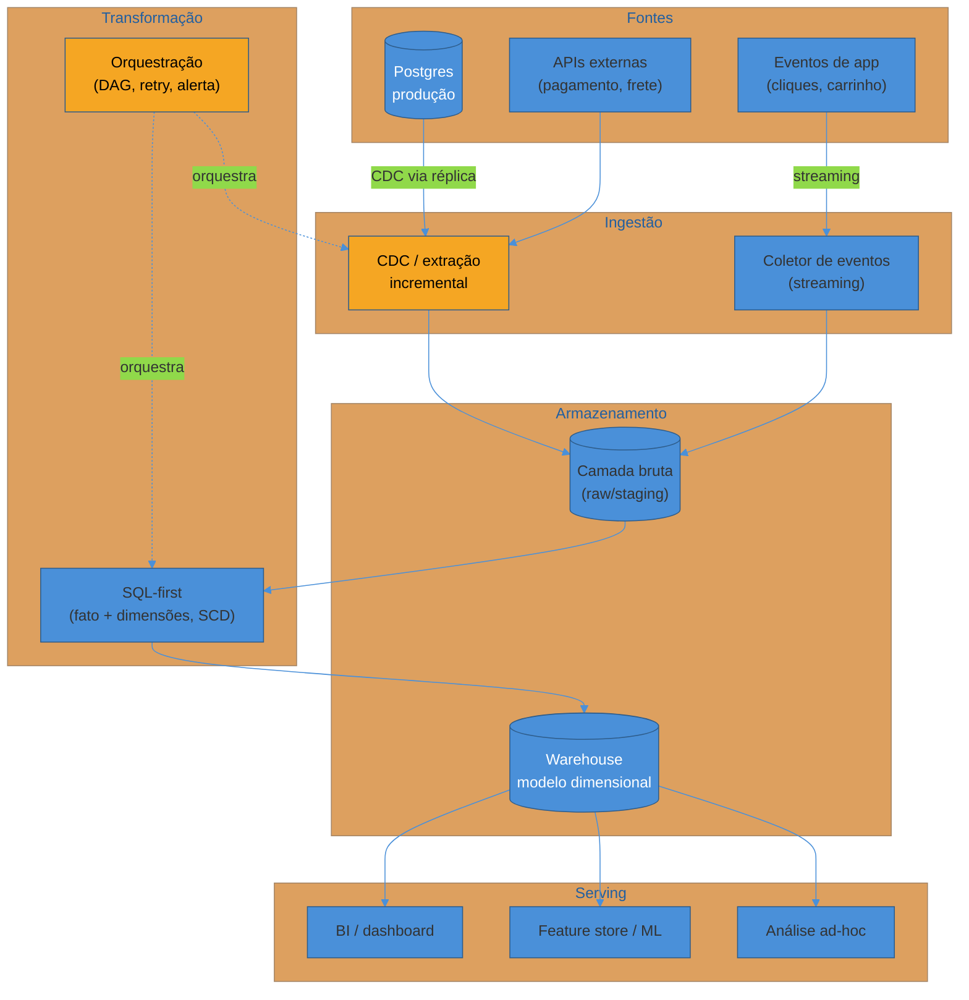
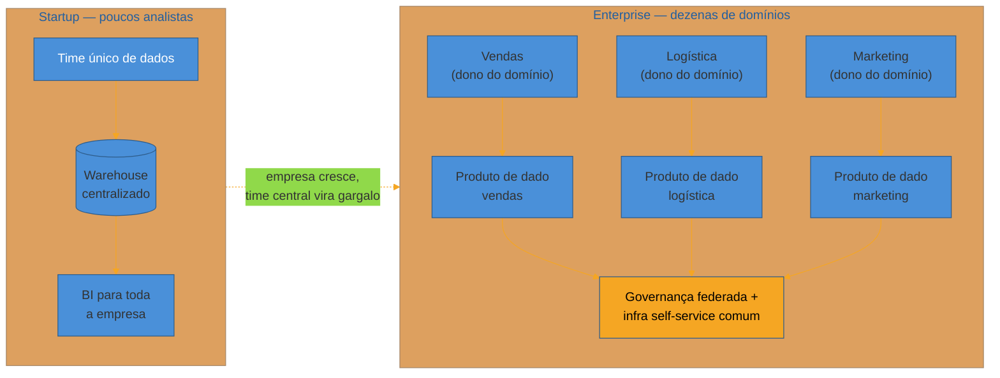
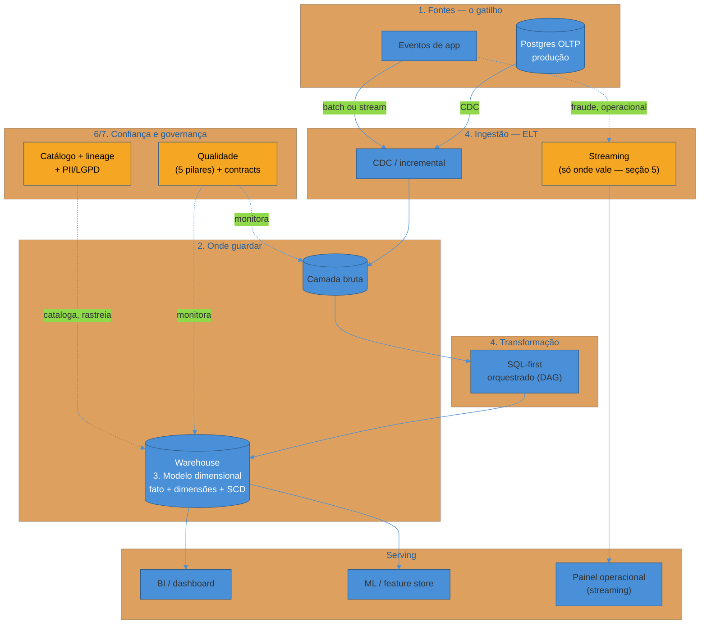

# Capstone - Desenhando a plataforma de dados de uma empresa do zero

> [!abstract] TL;DR
> As 17 notas anteriores desta trilha ensinaram peças isoladas: OLTP vs OLAP, warehouse vs lake, modelagem dimensional, ETL vs ELT, ingestão, transformação, orquestração, streaming, qualidade, governança, arquitetura organizacional. Esta nota é a costura — um walkthrough único, decisão por decisão, desenhando a plataforma de dados de um e-commerce do zero, do primeiro gatilho analítico até a organização do time que sustenta tudo isso quando a empresa cresce de startup a enterprise. Cada decisão aparece na ordem em que apareceria numa sessão de design real, linkada para a nota que a fundamenta e justificada pelo motivo específico deste cenário — nunca repetida do zero, nunca escolhida por moda. O e-commerce é o mesmo fio condutor usado desde a primeira nota da trilha; é cenário ilustrativo, não caso real de nenhum projeto ou cliente específico.

> [!question]- Perguntas que esta nota responde
> - Como as oito decisões centrais de uma plataforma de dados (onde guardar, como modelar, como mover, streaming ou não, como confiar, como governar, como organizar o time) se encaixam numa sequência coerente, não numa lista de tecnologias soltas?
> - O que muda nessas decisões entre uma startup de poucos analistas e uma enterprise com dezenas de times de dados?
> - Como amarrar cada decisão de arquitetura a um trade-off explícito (frescor vs custo, centralizar vs distribuir, simples vs escalável) em vez de escolher por reflexo?
> - Como responder, em entrevista, "como você desenharia a plataforma de dados desta empresa do zero?" com uma narrativa costurada, não uma enumeração de ferramentas?

Um data engineer sênior se senta para desenhar, do zero, a plataforma de dados de um e-commerce que acabou de sair do estágio "só o Postgres de produção resolve" e está prestes a contratar o primeiro analista de dados dedicado. Não existe warehouse, não existe pipeline, não existe time de dados — só o banco transacional que já processa pedidos havia dois anos, e uma pergunta de negócio que acabou de travar esse banco. É o mesmo gatilho que abriu esta trilha inteira, e é o ponto de partida certo para uma sessão de design: nenhuma decisão de plataforma de dados nasce de "qual ferramenta está na moda" — nasce de uma pergunta de negócio que o sistema atual não consegue responder sem se machucar.

O erro mais comum nessa sessão não é escolher a ferramenta errada — é abrir a reunião perguntando "warehouse ou lake, Airflow ou dbt?" como se a resposta fosse uma escolha única, definitiva, para a plataforma inteira. As 17 notas anteriores já desmontaram essa pergunta peça por peça. Esta nota aplica esse desmonte ao ciclo de vida inteiro, decisão por decisão, na ordem em que uma sessão de design real percorreria — do gatilho até a organização do time que vai operar tudo isso por anos.

```mermaid
%%{init: {"theme": "base", "themeVariables": {"primaryColor": "#4A90D9", "primaryBorderColor": "#2E5C8A", "lineColor": "#4A90D9"}}}%%
graph LR
    A["1. O gatilho<br/>OLTP trava"] --> B["2. Onde guardar<br/>warehouse/lake"]
    B --> C["3. Como modelar<br/>dimensional"]
    C --> D["4. Como mover<br/>ELT + ingestão"]
    D --> E["5. Streaming,<br/>onde vale"]
    E --> F["6. Confiar<br/>qualidade"]
    F --> G["7. Governar<br/>catálogo/lineage"]
    G --> H["8. Organizar<br/>o time"]

    style A fill:#F5A623,color:#000
    style E fill:#F5A623,color:#000
    style H fill:#F5A623,color:#000
```

Esse é o roteiro. Cada bloco em âmbar é um ponto onde a decisão errada custa caro — ou em incidente de produção, ou em meses de retrabalho organizacional. Vale prestar atenção redobrada neles, tanto nesta nota quanto numa entrevista real.

## 1. O gatilho: por que separar OLTP de OLAP desde o início

A sessão começa exatamente onde a trilha começou: a diretoria comercial pede "faturamento por categoria, últimos dois anos", alguém escreve a query correta contra o Postgres de produção, e ela ameaça travar o checkout durante o pico de tráfego. O problema não é a query — é rodar uma carga analítica (varredura massiva, agregação pesada) num sistema dimensionado para uma carga transacional (transações curtas, ponto a ponto). A distinção OLTP vs OLAP, e por que o descasamento estrutural entre os dois não se resolve com um índice melhor, está detalhada em [[03-Dominios/Engenharia/Dados/1 - Fundamentos de engenharia de dados/01 - O que é engenharia de dados|O que é engenharia de dados]].

A resposta a esse gatilho não é uma ferramenta — é reconhecer que a pergunta de negócio abriu a necessidade de um **ciclo de vida** inteiro: gerar, ingerir, armazenar, transformar, servir, com qualidade, governança e organização atravessando tudo isso como preocupações transversais, não etapas isoladas. Esse ciclo de vida — o mapa que organiza as sete decisões seguintes desta sessão — é o assunto da [[03-Dominios/Engenharia/Dados/1 - Fundamentos de engenharia de dados/02 - O ciclo de vida da engenharia de dados|nota do ciclo de vida]]. Cada seção a partir daqui resolve uma etapa desse ciclo, na ordem em que uma plataforma nova precisa resolvê-las.

> [!question]- Por que não simplesmente apontar o relatório para uma réplica de leitura e seguir em frente?
> Porque uma réplica de leitura alivia contenção, mas herda o mesmo modelo normalizado e o mesmo motor de armazenamento linha-a-linha — a query ainda precisa de cinco `JOIN`s para responder a mesma pergunta. É um paliativo de curto prazo, não uma resolução do descasamento estrutural. A plataforma de dados existe precisamente para resolver o que a réplica só alivia — como a nota 01 da trilha já detalha.

## 2. Onde guardar: warehouse, lake ou lakehouse

Com o ciclo de vida mapeado, a primeira decisão concreta é onde o dado extraído do Postgres vai morar. Três arquiteturas competem: **data warehouse** (estruturado, otimizado para SQL analítico, schema-on-write), **data lake** (bruto, barato, schema-on-read, aceita qualquer formato) e **lakehouse** (tenta unir os dois — armazenamento barato de lake com camada transacional e catálogo de warehouse por cima). A [[03-Dominios/Engenharia/Dados/1 - Fundamentos de engenharia de dados/03 - Warehouse, lake e lakehouse|nota de warehouse, lake e lakehouse]] detalha os três e o critério de escolha: volume e variedade de dado, maturidade do time, e se a maior parte do consumo é SQL estruturado (warehouse) ou inclui dado não estruturado/ML training (lake ou lakehouse).

Para o e-commerce nesta fase — dado majoritariamente estruturado (pedidos, produtos, clientes), consumo majoritariamente SQL (relatórios, dashboards) — um warehouse gerenciado na nuvem é a escolha natural: menos peça móvel, menos operação de infraestrutura, e o time ainda não tem volume ou variedade que justifique a complexidade adicional de um lake. Essa escolha não é permanente — é o ponto de partida certo para o porte atual, e a seção 8 volta a essa decisão quando a empresa cresce.

A escolha de onde guardar amarra-se imediatamente à escolha de **como** guardar: armazenamento colunar em vez de linha-a-linha, e formato de arquivo (Parquet sendo o padrão de fato para dado analítico em lake ou lakehouse). A [[03-Dominios/Engenharia/Dados/1 - Fundamentos de engenharia de dados/04 - Armazenamento colunar e formatos|nota de armazenamento colunar e formatos]] explica por que ler só as colunas necessárias para uma agregação — em vez da linha inteira — é o que faz o motor analítico varrer milhões de linhas em segundos, não minutos.

## 3. Como modelar: star schema, grão e o problema da história que muda

Com o warehouse escolhido, a pergunta seguinte não é "que ferramenta de BI conectar" — é **como organizar o dado dentro do warehouse** para que ele responda perguntas agregadas sem exigir que quem escreve a query reconstrua o esquema normalizado da aplicação inteira. A resposta canônica, formalizada por Kimball, é a **modelagem dimensional**: uma tabela de fatos (eventos mensuráveis — aqui, cada item vendido) cercada de tabelas de dimensão (produto, cliente, tempo, categoria) que dão contexto a esses eventos. A [[03-Dominios/Engenharia/Dados/2 - Modelagem para analytics/02 - Modelagem dimensional|nota de modelagem dimensional]] detalha o conceito de **grão** — a granularidade exata de uma linha da fato, decisão que precisa vir antes de qualquer coluna ser desenhada — aplicado aqui como "um item de um pedido", não "um pedido inteiro" (que perderia a capacidade de somar por categoria dentro de um mesmo pedido).

A forma física desse modelo — **star schema** (dimensões desnormalizadas, um `JOIN` por dimensão) versus **snowflake** (dimensões normalizadas em sub-tabelas) — e os tipos de fato (transacional, snapshot periódico, snapshot acumulativo) são o assunto da [[03-Dominios/Engenharia/Dados/2 - Modelagem para analytics/03 - Star vs snowflake e tipos de fato|nota de star vs snowflake]]. Para a fato de vendas do e-commerce, star schema vence quase sempre: menos `JOIN`s por query, mais legível para quem consome via BI — o custo de espaço extra da desnormalização é irrelevante frente ao ganho de velocidade de leitura, exatamente o mesmo trade-off que motivou sair do modelo normalizado do Postgres na seção 1.

Um problema que aparece cedo, assim que a dimensão `produto` ganha um histórico de mudanças de categoria ou preço: como registrar que um produto mudou de categoria em março, sem perder a capacidade de calcular corretamente o faturamento histórico "como ele era visto na época"? Esse é o problema das **Slowly Changing Dimensions**, com as estratégias clássicas (Tipo 1: sobrescreve; Tipo 2: nova linha versionada com data de validade) documentadas na [[03-Dominios/Engenharia/Dados/2 - Modelagem para analytics/04 - Slowly Changing Dimensions|nota de SCD]]. Para a dimensão produto do e-commerce, Tipo 2 é quase sempre a escolha certa: perder o histórico de categoria distorceria retroativamente qualquer relatório de "faturamento por categoria" — a pergunta que abriu esta sessão inteira.

## 4. Como mover e transformar: ELT, ingestão e orquestração

Com o destino modelado, falta o pipeline que move o dado do Postgres até as tabelas de fato e dimensão. A primeira decisão de padrão é **ETL vs ELT**: transformar antes de carregar (ETL, o padrão histórico, quando computação era cara e warehouse era caro) ou carregar bruto e transformar dentro do warehouse (ELT, o padrão dominante desde que warehouses na nuvem separaram armazenamento de computação). A [[03-Dominios/Engenharia/Dados/3 - Pipelines - movimentação e transformação/01 - ETL vs ELT|nota de ETL vs ELT]] argumenta por que ELT ganhou: carregar bruto primeiro preserva a fonte original para reprocessamento, e transformar dentro do warehouse aproveita a computação elástica que ele já oferece, em vez de manter um cluster de transformação à parte.

A camada de **ingestão** — como o dado sai do Postgres sem repetir o erro de contenção da seção 1 — cobre extração completa vs incremental, e **change data capture** (ler o write-ahead log do banco em vez de fazer `SELECT` pesado) como a técnica que menos onera a fonte. A [[03-Dominios/Engenharia/Dados/3 - Pipelines - movimentação e transformação/02 - Ingestão de dados|nota de ingestão de dados]] detalha essas opções; para o e-commerce, CDC contra uma réplica de leitura do Postgres é o desenho mais seguro — extração incremental, sem tocar o primário, e capaz de refletir mudanças (inclusive deleções, que uma extração incremental por timestamp perderia) com granularidade fina.

Uma vez o dado bruto carregado no warehouse, a **transformação** — juntar, limpar, agregar, aplicar o modelo dimensional da seção 3 — é hoje majoritariamente feita em SQL versionado, testado e revisado como código de software, o padrão que a [[03-Dominios/Engenharia/Dados/3 - Pipelines - movimentação e transformação/03 - Transformação SQL-first|nota de transformação SQL-first]] descreve (o papel de analytics engineer nasceu exatamente dessa disciplina). E amarrando ingestão e transformação numa sequência confiável e recuperável de passos — extrai às 2h, transforma às 3h, valida às 4h, e sabe o que fazer se qualquer passo falhar — está a **orquestração**, coberta na [[03-Dominios/Engenharia/Dados/3 - Pipelines - movimentação e transformação/04 - Orquestração|nota de orquestração]]: DAGs (grafos acíclicos dirigidos) que expressam dependência entre passos, com retry e alerta quando algo quebra.

## 5. Streaming, onde vale — e onde é desperdício

Toda a movimentação desenhada até aqui é **batch**: roda periodicamente, entrega dado com um atraso de minutos a horas. Para a maioria das perguntas de negócio deste e-commerce — "faturamento do mês passado", "produtos mais vendidos na semana" — esse atraso é irrelevante. Mas duas necessidades específicas quebram essa premissa: um painel operacional que o time de logística consulta *durante* o próprio expediente, e detecção de fraude que precisa reagir no momento da transação, não horas depois.

A [[03-Dominios/Engenharia/Dados/3 - Pipelines - movimentação e transformação/05 - Dados em movimento|nota de dados em movimento]] traça a fronteira entre batch e streaming com o critério certo: não é "streaming é mais moderno", é "que frescor esta decisão de negócio especificamente exige". Para o e-commerce, a resposta madura é híbrida — a maior parte da plataforma continua batch (barato, simples, suficiente), e só os dois casos que genuinamente exigem reação em segundos (fraude, painel operacional) ganham um pipeline de streaming dedicado, com o custo operacional adicional (lidar com eventos fora de ordem, backpressure, reprocessamento) que só se justifica ali.

> [!warning] Construir streaming quando batch diário resolveria
> **O que acontece:** o time monta uma arquitetura de processamento em tempo real para alimentar um relatório que a diretoria só olha uma vez por dia, de manhã. **Por quê:** streaming é ordens de magnitude mais complexo de operar do que um pipeline batch que roda uma vez por noite — complexidade que não compra frescor que ninguém usa é puro custo. **Como evitar:** perguntar primeiro qual frescor a decisão de negócio realmente exige, e só então escolher o mecanismo — nunca o inverso.

## 6. Confiar no que a plataforma entrega: qualidade e contratos

Uma plataforma que move e transforma dado corretamente do ponto de vista técnico ainda pode falhar como produto: se a tabela de faturamento silenciosamente perde uma categoria de produto por três meses, ou se um time upstream muda o formato de um campo sem avisar ninguém, o dano só aparece quando alguém já tomou uma decisão errada em cima do número quebrado. **Qualidade e observabilidade de dados** — os cinco pilares (frescor, volume, esquema, distribuição, linhagem) que permitem detectar esse tipo de falha antes que um analista perceba um número estranho num dashboard — são o assunto da [[03-Dominios/Engenharia/Dados/4 - Qualidade, governança e organização/01 - Qualidade e observabilidade de dados|nota de qualidade e observabilidade]].

Para o e-commerce, o ponto mais sensível é o mesmo que apareceu como risco maior na seção 4: se o pipeline de ingestão falhar silenciosamente numa noite — o CDC perde conexão, ou a réplica atrasa — a tabela de fatos do dia seguinte fica incompleta, e ninguém percebe até a diretoria perguntar por que o faturamento "caiu" de um dia para o outro. Testes de frescor e volume, monitorados automaticamente, são a defesa contra esse cenário específico.

Complementando qualidade — que detecta problema depois que ele acontece — estão os **data contracts**: um acordo explícito e versionado entre quem produz um dado (o time de checkout, dono do Postgres) e quem consome (o pipeline de dados) sobre o formato, o significado e as garantias de evolução de um schema. A [[03-Dominios/Engenharia/Dados/4 - Qualidade, governança e organização/02 - Data contracts e schema evolution|nota de data contracts]] detalha por que essa disciplina evita o problema na origem: se o time de checkout renomeia uma coluna sem avisar, um contrato formal (com validação em CI) quebra o build antes de o pipeline quebrar em produção, em vez de o pipeline falhar silenciosamente às 3h da manhã e alguém descobrir só quando o relatório de manhã estiver errado.

## 7. Governar: quem sabe o que existe, de onde veio, e quem pode ver o quê

Com dado fluindo de forma confiável, a plataforma cresce rápido — mais tabelas, mais times consumindo, mais perguntas de "essa tabela `fct_vendas` ainda é a certa, ou existe uma nova?". Sem governança, uma plataforma de dados vira, em poucos meses, um cemitério de tabelas órfãs que ninguém sabe se ainda são usadas, alimentadas por pipelines que ninguém sabe quem mantém. **Catálogo** (o inventário pesquisável do que existe, com dono e documentação), **lineage** (de onde cada tabela vem, e para onde ela alimenta) e a proteção de dado sensível (PII do cliente — CPF, endereço, histórico de compra — sob LGPD) são o assunto da [[03-Dominios/Engenharia/Dados/4 - Qualidade, governança e organização/03 - Governança, catálogo e lineage|nota de governança, catálogo e lineage]].

Para o e-commerce, o ponto mais concreto é a coluna de CPF ou email do cliente que acaba, sem querer, replicada em três tabelas intermediárias diferentes ao longo do pipeline — cada cópia é uma superfície de risco adicional sob LGPD, e sem lineage documentado ninguém sabe, no dia de um pedido de exclusão de dado (direito do titular), quais tabelas de fato contêm aquele CPF e precisam ser expurgadas. Lineage não é burocracia — é a única forma de responder "onde esse dado sensível está, de fato" quando a pergunta chega com prazo legal.

## 8. Organizar o time: centralizado, ou data mesh conforme a empresa cresce

A última decisão desta sessão não é técnica — é organizacional, e é a que muda mais radicalmente entre a startup do início desta nota e a enterprise que ela pode se tornar. Com um único time de dados pequeno, um **modelo centralizado** — um time de plataforma dono do warehouse inteiro, dos pipelines, e (na prática) de responder a todo pedido de dado novo — funciona bem: menos coordenação, um único ponto de verdade, decisões rápidas porque poucas pessoas decidem.

Conforme a empresa cresce — mais domínios de negócio (vendas, logística, marketing, financeiro), mais times de produto, cada um querendo modelar seu próprio domínio de dado sem depender de fila de um time central sobrecarregado — o modelo centralizado começa a rachar pelas costuras: o time de plataforma vira gargalo, e ninguém no time central entende profundamente o domínio de logística o suficiente para modelar bem a dimensão de entrega. É o ponto onde **data mesh** — domínios de dado descentralizados, cada um dono e responsável pelo seu próprio "produto de dado", com um padrão federado de governança e infraestrutura de self-service comum — começa a se justificar. A [[03-Dominios/Engenharia/Dados/4 - Qualidade, governança e organização/04 - Arquiteturas organizacionais|nota de arquiteturas organizacionais]] detalha os dois modelos e a Lei de Conway como o mecanismo por trás dessa escolha: a estrutura de comunicação da organização acaba, inevitavelmente, se refletindo na estrutura técnica da plataforma — lutar contra isso custa mais do que desenhar a organização e a plataforma juntas.

| Decisão | Startup (poucos analistas) | Enterprise (dezenas de times de dados) |
|---|---|---|
| Onde guardar (seção 2) | Warehouse gerenciado único, sem lake | Lakehouse ou warehouse + lake, por domínio ou compartilhado |
| Como mover (seção 4) | Um pipeline ELT simples, um DAG | Múltiplos pipelines por domínio, orquestração federada |
| Streaming (seção 5) | Só se houver caso de uso muito específico (fraude) | Streaming como capacidade compartilhada, vários domínios consumindo |
| Qualidade (seção 6) | Testes manuais, poucos alertas | Framework de qualidade padronizado, exigido de todo domínio |
| Governança (seção 7) | Planilha ou catálogo leve, um dono informal | Catálogo corporativo, lineage automatizado, política de PII auditada |
| Organização (seção 8) | Time único, centralizado | Data mesh — domínios donos de seus produtos de dado, governança federada |
| Risco principal | Um único ponto de falha (o time inteiro) | Fragmentação, inconsistência entre domínios sem padrão comum |

Nenhum dos dois lados da tabela é "certo" em abstrato — a resposta certa depende do porte, do número de domínios de negócio distintos e da maturidade do time, não da moda. Migrar para data mesh cedo demais, com um único time pequeno, importa a complexidade organizacional de uma enterprise sem o volume que a justifica; ficar centralizado tarde demais, com dez domínios de negócio competindo pela atenção de um time de plataforma sobrecarregado, é o gargalo inverso.

## A plataforma inteira, montada

Juntando as oito decisões numa única imagem — da fonte ao consumo, com qualidade e governança atravessando tudo:

## Reflexão final: como a trilha inteira se costura

A pergunta errada, no começo desta sessão, seria "warehouse ou lake, Airflow ou dbt?" — como se existisse uma resposta única e definitiva. A pergunta certa, que esta sessão respondeu oito vezes, sempre com uma resposta ligada ao porte e ao gargalo real da empresa, foi "que decisão este ponto específico do ciclo de vida exige, dado o que já decidimos antes?" — e a resposta a essa segunda parte é, literalmente, as 17 notas anteriores desta trilha.

Nenhuma das oito decisões foi tomada isoladamente das outras sete. A modelagem dimensional (seção 3) só faz sentido porque o warehouse (seção 2) foi escolhido como destino — um lake bruto não exigiria star schema no mesmo grau. ELT (seção 4) só compensa porque o warehouse na nuvem já separa armazenamento de computação — a mesma decisão da seção 2 pagando dividendo na seção 4. Streaming (seção 5) só se justifica onde o resto da plataforma já provou que batch é a norma e a exceção precisa ser nomeada, não o inverso. E data mesh (seção 8) só vira necessário quando qualidade (seção 6) e governança (seção 7) já provaram, num time centralizado, que a disciplina funciona — sem essa disciplina provada, descentralizar só multiplicaria o caos por N domínios.

É essa interdependência — um grafo de decisões que se sustentam mutuamente, cada uma um trade-off explícito entre frescor e custo, entre centralizar e distribuir, entre simples e escalável — que faz de "desenhar uma plataforma de dados" uma disciplina de julgamento sênior, não uma lista de ferramentas para decorar. A resposta certa depende sempre do porte da empresa e do gargalo real que ela enfrenta agora — nunca da moda do momento.

## Em entrevista

Esta sessão inteira é, quase palavra por palavra, o tipo de walkthrough que aparece em entrevistas de arquitetura de dados sênior — seja como pergunta isolada ("como você desenharia a plataforma de dados desta empresa do zero?") seja como aprofundamento de uma pergunta mais ampla de system design que chega até a camada de dados. O sinal que separa quem decorou nome de ferramenta de quem já pensou nisso de verdade é a ordem em que as decisões aparecem e o motivo dado para cada uma — nunca "eu usaria Snowflake e dbt porque é o que todo mundo usa hoje", sempre "eu separaria OLTP de OLAP porque a carga analítica compete por recurso com o checkout, e só depois disso eu decido modelo e ferramenta".

Três perguntas de acompanhamento comuns, e como esta nota já as respondeu:

- **"Por que não usar streaming para tudo, já que é mais moderno?"** — aponta para a seção 5: o critério é o frescor que a decisão de negócio exige, não a modernidade da tecnologia; streaming em cima de tudo é complexidade sem retorno para a maioria dos relatórios.
- **"Como você garante que ninguém mais vai colocar CPF de cliente numa tabela sem querer?"** — aponta para a seção 7: catálogo, lineage e política de dado sensível auditada, não confiança na boa vontade de quem escreve o pipeline.
- **"Quando você migraria de um time central de dados para data mesh?"** — aponta para a seção 8: quando o número de domínios de negócio cresce a ponto de o time central virar gargalo, e não antes — migrar cedo demais importa complexidade organizacional sem o volume que a justifica.

> [!warning] Responder com uma lista de ferramentas em vez de um grafo de decisões
> **O que acontece:** perguntado "como você desenharia a plataforma de dados desta empresa?", o candidato lista ferramentas — "eu usaria Snowflake, dbt, Airflow, Fivetran, Great Expectations" — sem conectar cada uma a uma etapa específica do ciclo de vida e a um motivo específico. **Por quê:** uma lista de ferramentas, por mais correta que seja individualmente, não demonstra a habilidade que a pergunta testa — a capacidade de mapear cada decisão a um requisito real do cenário, não a familiaridade com nomes de produto. **Como evitar:** narrar a decisão na mesma ordem desta sessão — do gatilho de negócio até a organização do time — nomeando, a cada passo, o trade-off resolvido e por que essa etapa específica pede essa escolha específica, exatamente como as oito seções acima fizeram.

## How to explain in English

> "When I design a data platform from scratch, I don't start with 'warehouse or lake, Airflow or dbt' as if there's one universal answer — I start with the business question that's currently breaking something, because that question tells me what the platform actually needs to do first. For this e-commerce, the trigger was an analytical query contending with checkout traffic on the production Postgres — the classic OLTP/OLAP mismatch. From there, every decision builds on the last one: I pick a warehouse over a raw lake because the workload is mostly structured SQL analytics; I model it dimensionally — star schema, correct grain, Type 2 slowly changing dimensions for anything with a history that matters — because that's what makes aggregate queries fast and correct; I move data with ELT and CDC because cloud warehouses already separate storage from compute, so transforming after load is strictly cheaper than transforming before.
>
> Streaming only enters where a specific decision genuinely needs sub-minute freshness — fraud detection, an operational dashboard someone watches live — never as a default, because the operational complexity of streaming is real and shouldn't be paid for freshness nobody uses. Quality and data contracts come next, because a pipeline that's technically correct but silently drops a category for three months has failed as a product even if no code is 'wrong'. Governance — catalog, lineage, PII handling — matters as soon as more than one team touches the platform, because without it you can't answer 'where does this sensitive field live' when a legal deletion request arrives with a deadline.
>
> The last decision, and the one that changes most with company size, is organizational: a single centralized data team works well with one team and one warehouse, but as the number of independent business domains grows, that team becomes the bottleneck — and that's the specific, provable condition under which data mesh, domain-owned data products with federated governance, starts to pay for itself. None of these eight decisions is right in isolation from company size and the actual bottleneck — that's the judgment the whole design exercises."

| PT | EN |
|----|----|
| Plataforma de dados | Data platform |
| Ciclo de vida da engenharia de dados | Data engineering lifecycle |
| Armazém de dados | Data warehouse |
| Lago de dados | Data lake |
| Modelo dimensional | Dimensional model |
| Tabela de fatos / dimensão | Fact table / dimension table |
| Grão | Grain |
| Dimensão de mudança lenta | Slowly changing dimension (SCD) |
| Captura de mudanças de dados | Change data capture (CDC) |
| Contrato de dados | Data contract |
| Catálogo de dados | Data catalog |
| Linhagem de dados | Data lineage |
| Malha de dados | Data mesh |
| Produto de dado | Data product |

## O que vem a seguir

Com esta nota, a trilha de Engenharia de Dados fecha o arco de fundamentos tool-neutral: OLTP/OLAP, warehouse/lake, modelagem dimensional, ELT/ingestão/transformação/orquestração, streaming, qualidade, governança e organização — as oito decisões que qualquer plataforma de dados séria precisa resolver, independente de qual ferramenta específica implementa cada peça.

O que fica deliberadamente de fora, por design desta trilha, são os **tutoriais de ferramenta** — como configurar um projeto dbt do zero, como escrever uma DAG concreta no Airflow, como operar um cluster Spark, como administrar um warehouse específico (Snowflake, BigQuery, Redshift). Esse ferramental tem lugar natural em `Tecnologia/`, como notas próprias e futuras, no mesmo padrão que a trilha de Comunicação entre Sistemas reservou para si — conceito e julgamento aqui, operação de ferramenta lá.

Duas trilhas irmãs, já completas no vault, aprofundam ângulos vizinhos ao que esta trilha cobriu: [[03-Dominios/Engenharia/Arquitetura/System Design/index|System Design]], que desenha o sistema inteiro (não só a camada de dados), e [[03-Dominios/Engenharia/Comunicação entre Sistemas/index|Comunicação entre Sistemas]], que aprofunda especificamente como os serviços trocam mensagem entre si — inclusive os eventos que, nesta trilha, alimentam a ingestão em streaming da seção 5.

## Fontes

Esta é uma nota de síntese — a pesquisa de fundo já está nas 17 notas dos quatro sub-galhos, cada uma citada e linkada ao longo do texto. As referências abaixo cobrem apenas o que esta nota cita diretamente, fora do que as notas anteriores já documentaram em profundidade.

- Reis, Joe & Housley, Matt — *Fundamentals of Data Engineering: Plan and Build Robust Data Systems*, O'Reilly, 2022 — fonte canônica do ciclo de vida da engenharia de dados que organiza esta sessão inteira.
- Kimball, Ralph & Ross, Margy — *The Data Warehouse Toolkit: The Definitive Guide to Dimensional Modeling*, 3ª edição, Wiley, 2013 — origem da modelagem dimensional aplicada na seção 3.
- Dehghani, Zhamak — *Data Mesh: Delivering Data-Driven Value at Scale*, O'Reilly, 2022 — origem do conceito de data mesh e domínios de dado descentralizados, aplicado na seção 8.
- [[03-Dominios/Engenharia/Comunicação entre Sistemas/Desenhando a comunicação de um sistema do zero|Desenhando a comunicação de um sistema do zero]] — capstone da trilha irmã, cuja estrutura de walkthrough único esta nota replica.

## A trilha completa: as 17 notas, por sub-galho

Para quem chegou aqui direto — o mapa completo do que esta nota costurou, organizado como a trilha foi construída.

**[[03-Dominios/Engenharia/Dados/1 - Fundamentos de engenharia de dados/index|Sub-galho 1 — Fundamentos de engenharia de dados]]** (a divisão fundadora e o ciclo de vida)
- [[03-Dominios/Engenharia/Dados/1 - Fundamentos de engenharia de dados/01 - O que é engenharia de dados|01 — O que é engenharia de dados]]
- [[03-Dominios/Engenharia/Dados/1 - Fundamentos de engenharia de dados/02 - O ciclo de vida da engenharia de dados|02 — O ciclo de vida da engenharia de dados]]
- [[03-Dominios/Engenharia/Dados/1 - Fundamentos de engenharia de dados/03 - Warehouse, lake e lakehouse|03 — Warehouse, lake e lakehouse]]
- [[03-Dominios/Engenharia/Dados/1 - Fundamentos de engenharia de dados/04 - Armazenamento colunar e formatos|04 — Armazenamento colunar e formatos]]

**[[03-Dominios/Engenharia/Dados/2 - Modelagem para analytics/index|Sub-galho 2 — Modelagem para analytics]]** (star schema, grão e SCD)
- [[03-Dominios/Engenharia/Dados/2 - Modelagem para analytics/02 - Modelagem dimensional|02 — Modelagem dimensional]]
- [[03-Dominios/Engenharia/Dados/2 - Modelagem para analytics/03 - Star vs snowflake e tipos de fato|03 — Star vs snowflake e tipos de fato]]
- [[03-Dominios/Engenharia/Dados/2 - Modelagem para analytics/04 - Slowly Changing Dimensions|04 — Slowly Changing Dimensions]]

**[[03-Dominios/Engenharia/Dados/3 - Pipelines - movimentação e transformação/index|Sub-galho 3 — Pipelines: movimentação e transformação]]** (ELT, ingestão, transformação, orquestração, streaming)
- [[03-Dominios/Engenharia/Dados/3 - Pipelines - movimentação e transformação/01 - ETL vs ELT|01 — ETL vs ELT]]
- [[03-Dominios/Engenharia/Dados/3 - Pipelines - movimentação e transformação/02 - Ingestão de dados|02 — Ingestão de dados]]
- [[03-Dominios/Engenharia/Dados/3 - Pipelines - movimentação e transformação/03 - Transformação SQL-first|03 — Transformação SQL-first]]
- [[03-Dominios/Engenharia/Dados/3 - Pipelines - movimentação e transformação/04 - Orquestração|04 — Orquestração]]
- [[03-Dominios/Engenharia/Dados/3 - Pipelines - movimentação e transformação/05 - Dados em movimento|05 — Dados em movimento]]

**[[03-Dominios/Engenharia/Dados/4 - Qualidade, governança e organização/index|Sub-galho 4 — Qualidade, governança e organização]]** (confiar, governar, organizar o time)
- [[03-Dominios/Engenharia/Dados/4 - Qualidade, governança e organização/01 - Qualidade e observabilidade de dados|01 — Qualidade e observabilidade de dados]]
- [[03-Dominios/Engenharia/Dados/4 - Qualidade, governança e organização/02 - Data contracts e schema evolution|02 — Data contracts e schema evolution]]
- [[03-Dominios/Engenharia/Dados/4 - Qualidade, governança e organização/03 - Governança, catálogo e lineage|03 — Governança, catálogo e lineage]]
- [[03-Dominios/Engenharia/Dados/4 - Qualidade, governança e organização/04 - Arquiteturas organizacionais|04 — Arquiteturas organizacionais]]

## Veja também

- [[03-Dominios/Engenharia/Dados/index|Dados]] — o galho-pai e o mapa da trilha inteira
- [[03-Dominios/Engenharia/Arquitetura/System Design/index|System Design]] — a trilha irmã que desenha o sistema inteiro; esta trilha aprofunda especificamente a camada de dados
- [[03-Dominios/Engenharia/Comunicação entre Sistemas/index|Comunicação entre Sistemas]] — a trilha irmã que aprofunda como os serviços trocam mensagem entre si, incluindo os eventos que alimentam ingestão em streaming

> [!info] Sobre o cenário
> O e-commerce usado nesta nota (checkout em Postgres, pergunta analítica travando produção, crescimento até múltiplos domínios de negócio) é um cenário ilustrativo e genérico, escolhido por ser reconhecível em qualquer entrevista ou sessão de design de dados — não é caso real de nenhum projeto ou cliente específico.
