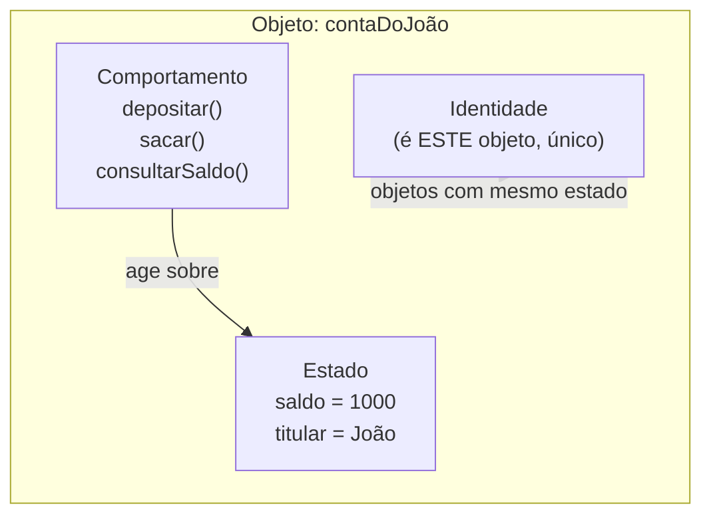
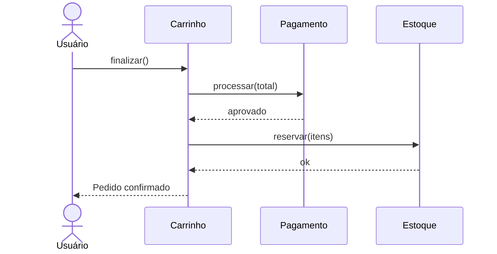
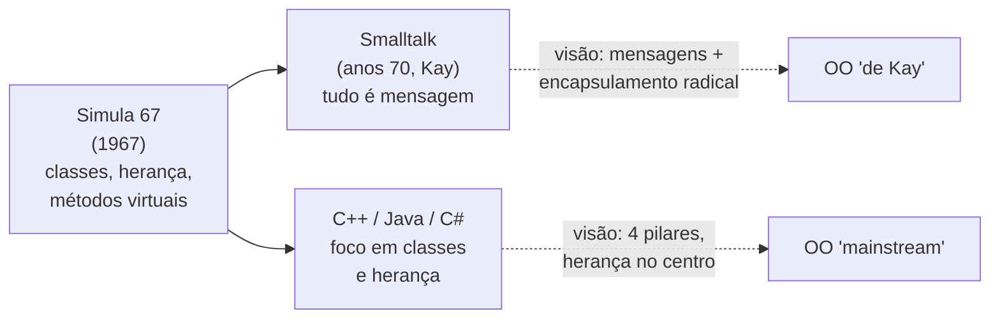
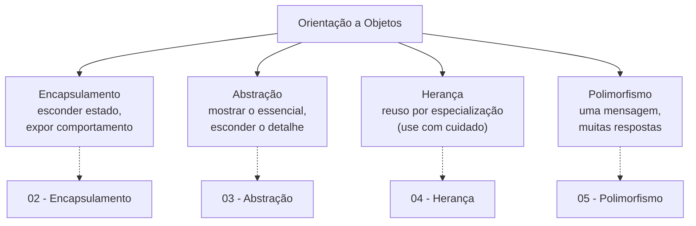

# O que é Orientação a Objetos

> Orientação a Objetos é organizar o software como uma coleção de objetos — pacotes de estado e comportamento, cada um com identidade própria — que colaboram trocando mensagens para representar conceitos do domínio.

Imagine que você precisa modelar um banco em software. Você pode pensar nisso como uma lista de instruções: "leia o saldo, subtraia o valor, grave o saldo". Ou pode pensar como um conjunto de *coisas* que se comportam: uma `Conta` que sabe sacar de si mesma, um `Cliente` que sabe quais contas possui, uma `Transferência` que sabe orquestrar duas contas. Essa segunda forma de pensar é a Orientação a Objetos.

Não é só uma técnica de programação. É uma forma de *modelar a realidade dentro da máquina* — e é por isso que ela domina a engenharia de software há décadas, e por isso aparece em quase toda entrevista de backend.

> [!summary] Em uma linha
> OO é modelar o software como objetos que conhecem a si mesmos (estado), sabem agir (comportamento) e existem como entidades distintas (identidade), colaborando por mensagens.

## O que é um objeto

Antes de falar de classes, herança ou polimorfismo, precisamos do átomo: o **objeto**. Um objeto tem três coisas, e nenhuma delas sozinha o define.

**Estado** — os dados que o objeto carrega. Uma `ContaBancaria` tem um `saldo`, um `titular`, um `numero`. São os atributos, as variáveis internas. O estado é o que o objeto *sabe sobre si*.

**Comportamento** — o que o objeto sabe *fazer*. A conta sabe `depositar(valor)`, `sacar(valor)`, `consultarSaldo()`. São os métodos. E repare: o comportamento age sobre o próprio estado. Quando você chama `sacar`, é a conta mexendo no *seu* saldo — não você mexendo nele de fora.

**Identidade** — e aqui está a parte que mais gente esquece. Um objeto é *distinto de qualquer outro*, mesmo que tenha estado idêntico. Duas contas com o mesmo saldo, o mesmo titular e o mesmo banco ainda são *duas contas diferentes*.

Pense em duas notas de R$ 50 na sua carteira. Elas têm o mesmo valor, a mesma cor, o mesmo desenho. São intercambiáveis para você? Talvez. Mas cada uma tem um número de série único — cada uma é *uma nota específica*. Se você gastar uma, a outra continua na carteira. Identidade é isso: a nota não é definida pelo seu valor, e sim por *ser aquela nota*.

```java
ContaBancaria a = new ContaBancaria("João", 1000);
ContaBancaria b = new ContaBancaria("João", 1000);

// Mesmo estado...
a.consultarSaldo() == b.consultarSaldo(); // true — saldos iguais

// ...mas identidades diferentes:
a == b;          // false — são dois objetos distintos na memória
a == a;          // true  — um objeto é sempre idêntico a si mesmo
```

Essa distinção entre *ter o mesmo estado* e *ser o mesmo objeto* é tão importante que tem uma nota inteira só pra ela: [[09 - Identidade, igualdade e imutabilidade]].

O diagrama abaixo mostra o objeto como esse pacote de três coisas.



**Leitura do diagrama:** o objeto é a caixa inteira. Dentro dela, o comportamento (os métodos) age sobre o estado (os dados) — essa seta para dentro é o coração do encapsulamento. A identidade fica ao lado, lembrando que mesmo dois objetos com estado idêntico não se confundem. Estado responde "o que eu sei", comportamento responde "o que eu faço", identidade responde "quem eu sou".

> [!summary] Em uma linha
> Objeto = estado (o que sabe) + comportamento (o que faz) + identidade (quem é) — os três juntos, nunca um só.

## OO é modelar o domínio com objetos que colaboram

Se um objeto é o átomo, um sistema OO é a *molécula*: muitos objetos, cada um representando um conceito do **domínio** (o mundo do problema), trabalhando juntos.

Numa loja, o domínio tem `Produto`, `Carrinho`, `Pedido`, `Cliente`, `Pagamento`. A grande ideia da OO é: o código deveria *espelhar* esses conceitos. Quando você lê `pedido.adicionarItem(produto, 2)`, você lê quase português. O software vira um modelo do negócio, não um amontoado de funções soltas.

E como os objetos trabalham juntos? **Trocando mensagens** — que, na prática das linguagens mainstream, são chamadas de método. Quando você escreve `carrinho.finalizar()`, está *enviando uma mensagem* "finalize-se" ao carrinho. O carrinho decide como responder; pode, por sua vez, enviar `pagamento.processar()` e `estoque.reservar(itens)`. Ninguém mexe no estado interno de ninguém — todos pedem, educadamente, por mensagens.



**Leitura do diagrama:** cada caixa no topo é um objeto autônomo. As setas são mensagens (chamadas de método) viajando entre eles. Repare que o `Carrinho` não abre o `Pagamento` para mexer em seus dados — ele *pede* "processe esse total" e espera a resposta. Cada objeto é uma pequena caixa-preta responsável por uma parte da história. O sistema inteiro é essa conversa coordenada. Isso é o que se chama de *colaboração por mensagens*.

> [!summary] Em uma linha
> Um sistema OO é um conjunto de objetos do domínio que colaboram por mensagens — cada um cuida do próprio estado e responde a pedidos.

## Duas histórias da OO: Kay vs. mainstream

Aqui vem uma parte que separa quem decorou OO de quem *entende* OO. Há duas visões do que a Orientação a Objetos *é*, e elas não são exatamente a mesma coisa.

### A linhagem: Simula e Smalltalk

A linguagem **Simula 67** (Ole-Johan Dahl e Kristen Nygaard, Noruega) é considerada a primeira a trazer objetos, classes, herança e métodos virtuais. Foi ela que plantou as sementes técnicas.

Mas o *termo* "object-oriented" e a visão mais radical do paradigma vêm de **Alan Kay**, que cunhou a expressão por volta de 1967 e liderou a criação da linguagem **Smalltalk** no Xerox PARC nos anos 70. Kay foi influenciado por Simula — mas levou a ideia para um lugar diferente.

### A visão de Kay: tudo é mensagem

Anos depois, em 2003, Kay esclareceu o que ele queria dizer com "object-oriented":

> "OOP to me means only messaging, local retention and protection and hiding of state-process, and extreme late-binding of all things."

Traduzindo o espírito: para Kay, OO é *só* sobre (1) **mensagens** entre objetos, (2) cada objeto guardando, protegendo e escondendo seu próprio estado-processo, e (3) **late-binding extremo** — decidir o mais tarde possível, em tempo de execução, qual código vai responder a uma mensagem.

Repare no que *não* está na lista de Kay: **herança não aparece**. Classes não aparecem. Para ele, a essência eram objetos autônomos conversando — pense em células de um organismo, cada uma isolada, trocando sinais químicos. A célula não "herda" de outra; ela *responde* a mensagens.

### A visão mainstream: classes e herança

Quando a OO virou a corrente principal — via C++, depois Java, depois C# — o foco se deslocou. O centro de gravidade virou a **classe** e a **herança**. "Orientação a Objetos" passou a ser ensinada como "classes que herdam de outras classes". Encapsulamento, herança, polimorfismo e abstração viraram "os quatro pilares".

Quem está certo? Os dois estão descrevendo coisas reais — mas é honesto dizer que a herança, hoje vista por muitos como pilar central, é mais um *acidente histórico* da forma como Simula e C++ implementaram OO do que a *essência* do paradigma. Tanto que uma nota inteira deste galho defende preferir [[07 - Composição sobre herança]]. A mensagem (o método chamado em um objeto) é mais fundamental do que a árvore de herança.



**Leitura do diagrama:** Simula é a raiz comum. De lá, a história se bifurca: por um caminho, Smalltalk e a visão de Kay (mensagens e encapsulamento extremo, herança em segundo plano); por outro, C++/Java/C# e a visão mainstream (os quatro pilares, herança em destaque). Não é que uma seja falsa — é que quando alguém diz "OO", vale saber de *qual* OO está falando. O senior conhece as duas pontas.

> [!summary] Em uma linha
> A OO original de Kay (Smalltalk) é sobre mensagens e encapsulamento radical; a mainstream (Java/C++) colocou classes e herança no centro — e herança é mais acidente histórico do que essência.

## Classe, objeto, instância: a planta e a casa

Três palavras que iniciantes confundem e que toda entrevista cobra:

- **Classe** é a *planta* (o blueprint). Define quais atributos e métodos os objetos terão. `ContaBancaria` (a classe) descreve que toda conta tem saldo e sabe sacar. A classe não tem saldo — ela *descreve* que contas têm saldo.
- **Objeto** é a *casa construída* a partir da planta. `new ContaBancaria(...)` constrói uma casa real, com saldo real, ocupando memória real.
- **Instância** é só outro nome para um objeto criado a partir de uma classe. "Um objeto é uma instância de uma classe" — a casa é uma instância da planta. Você pode construir mil casas da mesma planta; cada uma é uma instância distinta, com identidade própria.

```python
class ContaBancaria:        # a PLANTA (classe)
    def __init__(self, titular, saldo):
        self.titular = titular
        self.saldo = saldo

conta_joao  = ContaBancaria("João", 1000)   # uma CASA (objeto/instância)
conta_maria = ContaBancaria("Maria", 500)   # outra casa, mesma planta
```

Uma planta; duas casas; duas identidades. (Nem toda linguagem OO trabalha com classes desse jeito — algumas, como JavaScript em sua origem, fazem objetos a partir de outros objetos. Isso é assunto de [[11 - Como o modelo OO difere entre linguagens]].)

> [!summary] Em uma linha
> Classe é a planta, objeto/instância é a casa construída a partir dela — uma planta gera muitas casas, cada uma com identidade própria.

## OO é um paradigma entre vários

OO não é "o jeito certo de programar". É *um* paradigma — uma forma de organizar o pensamento sobre código — ao lado de outros:

- **Imperativo/procedural**: o programa é uma sequência de comandos que mudam estado. Pense numa receita de bolo: faça isto, depois aquilo.
- **Funcional**: o programa é composição de funções puras, sem estado mutável compartilhado. Pense em fórmulas matemáticas encadeadas.
- **Lógico** (Prolog): você declara fatos e regras, e o sistema deduz respostas.

A comparação a fundo entre paradigmas mora num galho futuro de **Paradigmas de Programação** (ainda não escrito neste Codex) — aqui basta saber que OO é uma escolha, não um dogma. E o melhor código senior frequentemente *mistura*: classes OO com métodos escritos em estilo funcional, por exemplo.

Daí o lema que vamos repetir ao longo do galho e fechar no capstone: **OOP é ferramenta, não religião**. Usar objetos para tudo, sempre, até onde uma função simples bastaria, é tão problemático quanto nunca usá-los. Quando OO ajuda e quando atrapalha é tema de [[13 - OO na prática e em entrevista]].

> [!summary] Em uma linha
> OO é uma ferramenta entre paradigmas (imperativo, funcional, lógico), não a única verdade — código senior escolhe e mistura conscientemente.

## O mapa do galho: os 4 pilares

A maior parte do que se ensina como OO mainstream se organiza em quatro pilares. Eles são o esqueleto deste galho — cada um tem sua nota.



**Leitura do diagrama:** os quatro pilares saem do mesmo tronco. **Encapsulamento** é proteger o estado e só deixar passar comportamento — exatamente a parte da definição de Kay sobre "esconder state-process". **Abstração** é expor o *o quê* e esconder o *como*. **Herança** é especializar reusando — poderosa, mas a que mais causa problemas quando mal usada. **Polimorfismo** é o "extreme late-binding" de Kay: a mesma mensagem produzindo respostas diferentes conforme o objeto que a recebe. Cada caixa pontilhada aponta para a nota que aprofunda o pilar.

As notas correspondentes: [[02 - Encapsulamento]], [[03 - Abstração]], [[04 - Herança]], [[05 - Polimorfismo]]. Depois dos pilares, o galho avança para ferramentas e julgamento: [[06 - Interfaces e classes abstratas]], [[07 - Composição sobre herança]], [[08 - Acoplamento e coesão]], [[10 - Rich vs Anemic Domain Model]] e os [[12 - Anti-patterns de OO]].

> [!summary] Em uma linha
> Os 4 pilares — encapsulamento, abstração, herança, polimorfismo — são o mapa do galho, cada um com sua nota dedicada.

## Por que isso importa para um senior

Em entrevista (e no trabalho real), OO bem aplicada não é sobre saber recitar os pilares. É sobre três ganhos concretos:

1. **Modelar o domínio com fidelidade.** Quando seus objetos espelham os conceitos do negócio, o código fica legível e o raciocínio fica próximo da conversa com o time de produto. É a base do [[10 - Rich vs Anemic Domain Model|domínio rico]].
2. **Reduzir acoplamento.** Objetos que escondem seu estado e conversam por mensagens podem mudar por dentro sem quebrar quem os usa. Menos coisas grudadas umas nas outras, mais facilidade para evoluir — tema de [[08 - Acoplamento e coesão]].
3. **Escrever código evolutivo.** Polimorfismo e abstração deixam você adicionar comportamento novo sem reescrever o velho — o sonho de todo sistema que precisa durar anos.

Um senior não usa OO porque "é o paradigma da empresa". Usa porque, *para este problema*, modelar com objetos torna o código mais fácil de entender e mudar. E sabe reconhecer quando não vale a pena.

## Em entrevista

Frases prontas em inglês:

- "Object-oriented programming models software as a collection of objects that bundle **state**, **behavior**, and have a distinct **identity**."
- "Two objects can be *equal* in value but still have *different identity* — they're not the same object."
- "A class is the blueprint; an object is an instance built from it."
- "Objects collaborate by **sending messages** — in practice, calling each other's methods — without touching each other's internal state."
- "Alan Kay, who coined the term, emphasized **messaging and encapsulation** over inheritance. Inheritance is more of a historical accident than the essence of OO."
- "The four pillars are encapsulation, abstraction, inheritance, and polymorphism — but I treat OO as a tool, not a religion: I reach for it when modeling a domain benefits from it."
- "I prefer **composition over inheritance** to keep coupling low and the design flexible."

Vocabulário PT → EN:

| Português | Inglês |
| --- | --- |
| objeto | object |
| estado / atributos | state / attributes (fields) |
| comportamento / métodos | behavior / methods |
| identidade | identity |
| classe | class |
| instância | instance |
| mensagem (chamada de método) | message (method call) |
| domínio | domain |
| encapsulamento | encapsulation |
| abstração | abstraction |
| herança | inheritance |
| polimorfismo | polymorphism |
| acoplamento | coupling |
| coesão | cohesion |
| ligação tardia | late binding |
| planta / projeto | blueprint |

> [!info] Lastro
> **Canônico:** Simula 67 (Dahl e Nygaard) é amplamente reconhecida como a primeira linguagem orientada a objetos; Alan Kay cunhou o termo "object-oriented programming" (por volta de 1966–1967) e liderou a criação do Smalltalk no Xerox PARC. A citação de Kay ("OOP to me means only messaging, local retention and protection and hiding of state-process, and extreme late-binding of all things") é autêntica, de um e-mail de 2003 amplamente reproduzido; ele segue dizendo que isso "can be done in Smalltalk and in LISP".
> **Simplificação didática:** "mensagem = chamada de método" é uma simplificação prática — na visão pura de Kay (e em Smalltalk de verdade) a mensagem é mais abstrata e o late-binding mais radical do que numa chamada de método estática de Java. Tratar herança como "acidente histórico" é uma leitura defensável e popular, não consenso universal. Os "4 pilares" são uma convenção de ensino mainstream, não uma definição formal única.
> **Fontes consultadas:** Wikipédia (Simula, Smalltalk, Alan Kay, Object-oriented programming), e a reprodução da troca de e-mails de 2003 com Kay (userpage.fu-berlin.de/~ram/pub/.../doc_kay_oop_de), via WebSearch em 2026-06-17.

## Veja também

- [[02 - Encapsulamento]]
- [[09 - Identidade, igualdade e imutabilidade]]
- [[07 - Composição sobre herança]]
- [[03-Dominios/Engenharia/Design de Software/SOLID/index|SOLID]]
