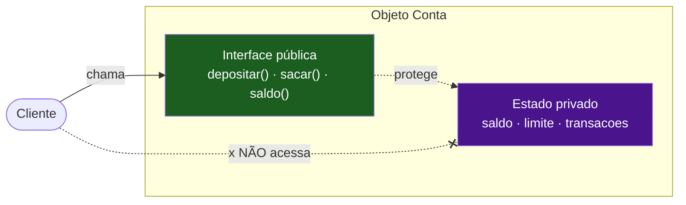
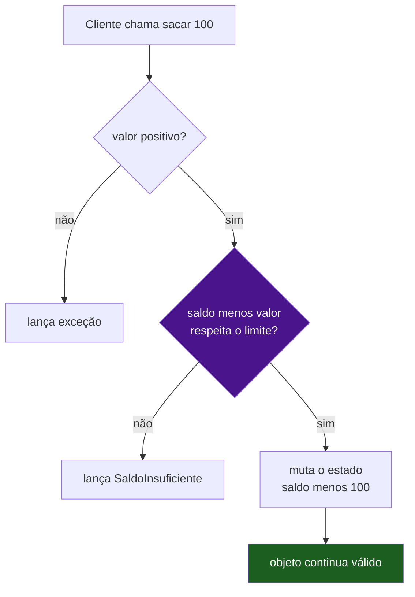

# Encapsulamento

> Esconder o estado interno e expor uma interface pública que **protege as invariantes** do objeto. O pilar não é só "tornar campos privados" — é garantir que o objeto **nunca** entre em estado inválido.

## A cápsula: a metáfora literal

A palavra entrega o conceito: uma **cápsula** de remédio. Por fora, uma superfície lisa e uniforme — você engole e pronto. Por dentro, um pó que você nunca toca, nem precisa entender. A cápsula faz duas coisas ao mesmo tempo: ela **protege o conteúdo** do mundo e **protege o mundo** do conteúdo.

Um objeto bem encapsulado é igual. Ele tem um lado de fora — os métodos públicos, a interface que você chama — e um lado de dentro — os campos, as estruturas de dados, os algoritmos. O cliente conversa só com a casca. O recheio é problema do objeto.

Por que isso importa de verdade? Pergunte a si mesmo: se ninguém de fora depende de **como** a `Conta` guarda o saldo, o que acontece quando eu trocar um `double` por um `BigDecimal`, ou mover o saldo para um cálculo derivado de uma lista de transações? **Nada quebra.** Nenhum cliente sabia. Encapsulamento é o que torna refatoração segura em larga escala — é a fronteira que contém a mudança.



**Leitura do diagrama:** o cliente só alcança a casca verde (a interface). A linha pontilhada cortada mostra o caminho proibido: tocar o estado roxo diretamente. A interface fica *entre* o cliente e o estado, e é exatamente esse "entre" que dá a você liberdade de mexer no roxo sem avisar ninguém.

> Encapsulamento separa o **o quê** (interface estável) do **como** (implementação trocável).

## O ponto profundo: invariantes, não só sigilo

Aqui mora o erro mais comum. Muita gente aprende que encapsulamento é "esconder os dados". Isso é metade da verdade — e a metade menos importante.

A parte que faz a diferença é a **invariante**: uma regra que precisa ser verdadeira o tempo todo, antes e depois de qualquer operação. Numa conta bancária, uma invariante poderia ser *"o saldo nunca fica menor que o negativo do limite"*. Esconder o campo `saldo` só vale alguma coisa se isso me permite **vigiar a fronteira** por onde o saldo muda.

Veja a diferença entre um objeto que esconde e um objeto que **protege**:

```java
public final class Conta {
    private long saldoCentavos;   // estado escondido
    private final long limiteCentavos;

    public Conta(long saldoInicialCentavos, long limiteCentavos) {
        if (limiteCentavos < 0) throw new IllegalArgumentException("limite negativo");
        this.saldoCentavos = saldoInicialCentavos;
        this.limiteCentavos = limiteCentavos;
    }

    // A interface pública guarda a invariante na entrada
    public void sacar(long valorCentavos) {
        if (valorCentavos <= 0)
            throw new IllegalArgumentException("valor deve ser positivo");
        if (saldoCentavos - valorCentavos < -limiteCentavos)
            throw new SaldoInsuficienteException();   // invariante protegida
        saldoCentavos -= valorCentavos;
    }

    public long saldoCentavos() { return saldoCentavos; }  // leitura, sem brecha de escrita
}
```

Repare: não existe nenhuma forma, de fora, de deixar `saldoCentavos` abaixo de `-limiteCentavos`. O construtor valida; o `sacar()` valida. **Toda porta de entrada do estado passa por um guarda.** Isso é encapsulamento de verdade — o objeto se torna incapaz de estar errado.



**Leitura do diagrama:** todo caminho que muta o estado (a caixa final) só é alcançado **depois** de passar pelos dois portões de validação (losangos). Não há atalho. O cliente nunca consegue empurrar o objeto para um estado inválido — as exceções barram as rotas ruins antes de qualquer mutação acontecer.

> Esconder dados é o mecanismo; **proteger invariantes** é o objetivo. Sigilo sem guarda é cofre de porta aberta.

## O anti-padrão: encapsulamento falso

Agora o pecado capital. Olhe este código e pergunte: ele é encapsulado?

```java
public class Conta {
    private long saldo;
    public long getSaldo()           { return saldo; }
    public void setSaldo(long s)     { this.saldo = s; }   // a porta dos fundos
}
```

O campo é `private`. Tem getter, tem setter. Parece "OO de manual". Mas qualquer um pode escrever `conta.setSaldo(-999999)` e a invariante evaporou. O setter público é uma **porta dos fundos** que dá ao mundo o mesmo poder que um campo público daria. Você embrulhou o campo num método e chamou de proteção — mas não protege nada.

Isso tem nome: é o anti-pattern **Exposed Internals** (entranhas expostas), e a praga de gerar getter/setter para tudo automaticamente. Ver [[12 - Anti-patterns de OO]].

A cura é uma mudança de postura, e ela também tem nome. Em vez de **perguntar** o estado, mexer fora e **mandar** o resultado de volta (`if (conta.getSaldo() >= valor) conta.setSaldo(conta.getSaldo() - valor)`), você **manda o objeto fazer o trabalho**: `conta.sacar(valor)`. O objeto, que é o dono do dado, é quem decide. Esse princípio é **Tell, Don't Ask**, e ele vive em [[08 - Acoplamento e coesão]].

A pergunta diagnóstica é simples: *para cada setter público, eu consigo imaginar um cliente que o use para corromper o objeto?* Se sim, esse setter não devia existir — ou devia ser um método de domínio que valida (`reajustarLimite()`), não um `setLimite()` mudo.

> Getter/setter para tudo é encapsulamento de fachada. Se `obj.setX(qualquerCoisa)` pode quebrar a regra, não há regra protegida.

## Visibilidade entre linguagens

Aqui está a parte que pega gente em entrevista: **"private" não significa a mesma coisa em toda linguagem.** O conceito de encapsulamento é universal; o **mecanismo** varia muito. Quem não sabe disso escreve código achando que tem proteção em runtime quando só tem um aviso de compilador.

| Linguagem | Mecanismo | Privacidade **em runtime**? | Observação |
|---|---|---|---|
| **Java** | `private` / `protected` / *package-private* (default) | Sim (a JVM impede acesso fora do escopo) | Reflection ainda fura via `setAccessible(true)` |
| **Python** | convenção `_protegido`; `__nome` faz *name mangling* | Não — é convenção e renomeação | `__x` vira `_Classe__x`; ainda alcançável se você souber o nome |
| **TS** `private` | palavra-chave do TypeScript | **Não** — só compile-time, apagada no JS gerado | Some no `.js` emitido; em runtime o campo é comum |
| **TS/JS** `#campo` | campo privado do ECMAScript (ES2022) | **Sim** — imposto pelo motor JS | Verdadeiramente inacessível de fora; nem reflection alcança |
| **Go** | capitalização do identificador | Sim, **por pacote** | `Maiusculo` = exportado; `minusculo` = privado ao pacote |

**Leitura da tabela:** a coluna que importa é a do meio. Java, Go e `#campo` do JS dão proteção *real* — o ambiente de execução te barra. `private` do TypeScript e o `__` do Python dão proteção *social*: avisam, mas não impedem.

**Python — o `__` e o name mangling.** Python não tem privado de verdade. O `_protegido` (um underscore) é puro acordo de cavalheiros: "não mexa". O `__nome` (dois underscores no início, sem dois no fim) ativa o **name mangling** — o interpretador renomeia mecanicamente `self.__saldo` da classe `Conta` para `self._Conta__saldo`:

```python
class Conta:
    def __init__(self):
        self.__saldo = 0          # vira _Conta__saldo

c = Conta()
# c.__saldo            -> AttributeError (o nome literal não existe)
print(c._Conta__saldo)           # 0  -> ainda alcançável pelo nome manglado
```

Importante: o propósito original do mangling **não é segurança** — é evitar **colisão acidental de nomes** entre uma classe e suas subclasses. O efeito colateral de "ficar mais difícil de acessar por fora" é só isso, um efeito colateral.

**TS `private` vs JS `#campo` — a pegadinha favorita.** O `private` do TypeScript é **apagado na compilação**: o JavaScript emitido tem um campo comum, totalmente acessível. É verificação de tipo, não barreira de runtime. Já o `#campo` (ES2022) é privacidade **dura**, imposta pelo próprio motor — não aparece em `JSON.stringify`, não vaza em reflection, não há como alcançar de fora.

```ts
class Conta {
  private saldoTs = 0;   // some no .js -> sem proteção em runtime
  #saldoReal = 0;        // privado de verdade, em runtime
}
```

**Go — encapsulamento por pacote.** Go nem tem a palavra `private`. A regra é a **inicial do identificador**: maiúscula = exportado (visível fora do pacote), minúscula = não-exportado (privado ao pacote). A unidade de encapsulamento não é a classe — é o **pacote**.

```go
package conta

type Conta struct {
    saldo  int64   // minúsculo -> privado ao pacote conta
    Limite int64   // maiúsculo -> exportado, visível por quem importa
}

func (c *Conta) Sacar(v int64) error { /* guarda a invariante aqui */ }
```

Essa divergência é tão central para entender o paradigma que ganhou nota própria: ver [[11 - Como o modelo OO difere entre linguagens]].

> "Private" é uma promessa em três níveis: barreira de runtime (Java, Go, `#`), checagem de compilador (TS `private`) ou convenção (Python `_`/`__`). Saiba qual você tem.

## Encapsulamento ≠ Abstração

Esses dois pilares vivem grudados e por isso são confundidos. Vale separar com precisão de bisturi, porque entrevistador adora a distinção.

- **Encapsulamento** é o **mecanismo**: o *ato de esconder* o estado e canalizar todo acesso por uma interface. É um "como" — `private`, `#`, capitalização.
- **Abstração** é a **decisão**: *o que* expor, em *qual nível*, modelando o objeto pelo que ele **faz** e não por como funciona por dentro. É um "o quê".

Uma analogia: encapsulamento é a parede do quarto (esconde o que está dentro). Abstração é a planta da casa que decide **onde** colocar a parede e **que portas** abrir. Você pode encapsular bem (tudo privado) e abstrair mal (expor uma interface confusa, vazada, com 30 setters). São eixos distintos. A continuação fina dessa diferença está em [[03 - Abstração]].

> Encapsulamento esconde; abstração escolhe o que vale a pena mostrar. Mecanismo vs. decisão de design.

> [!info] Lastro
> Fatos de linguagem verificados na web (jun/2026), não de memória:
> - **Python**: `__x` na classe `C` é manglado para `_C__x` (só nomes com dois underscores no início e **não** dois no fim); o objetivo canônico é evitar colisão em subclasses, não segurança — confirmado em Real Python e GeeksforGeeks.
> - **JS `#campo`**: padronizado no **ES2022 (ES13)**, privacidade imposta em *runtime* pelo motor (não serializa, não vaza em reflection).
> - **TS `private`**: somente *compile-time*, **apagado** no JavaScript emitido — sem proteção em runtime (docs TypeScript/MDN).
> - **Go**: visibilidade por capitalização da inicial, no escopo do **pacote** (não da classe), conforme spec da linguagem. Os exemplos `Conta` são didáticos e genéricos; não representam nenhum sistema real do usuário.

## Em entrevista

Frases prontas para defender o conceito com naturalidade:

- "**Encapsulation isn't just about hiding data — it's about protecting invariants. The object should be impossible to put into an invalid state.**"
- "**Public getters and setters for everything is fake encapsulation. If any caller can do `account.setBalance(x)`, there's no invariant being guarded.**"
- "**The real payoff is that I can swap the internal implementation without breaking a single client.**"
- "**Watch out — TypeScript's `private` is compile-time only; it's erased in the emitted JavaScript. For true runtime privacy you want `#` fields.**"
- "**In Go there's no `private` keyword; visibility is by capitalization, and the unit of encapsulation is the package, not the class.**"
- "**Instead of asking the object for its state and mutating it from outside, I tell the object what to do — that's Tell, Don't Ask.**"

Vocabulário PT → EN:

| Português | Inglês |
|---|---|
| encapsulamento | encapsulation |
| esconder o estado | to hide the (internal) state |
| invariante | invariant |
| estado inválido | invalid state |
| interface pública | public interface / public API |
| campo privado | private field |
| trocar a implementação | to swap the implementation |
| porta dos fundos | back door |
| name mangling | name mangling |
| apagado na compilação | erased at compile time |
| imposto em runtime | enforced at runtime |
| exportado / não-exportado (Go) | exported / unexported |

## Veja também

- [[01 - O que é Orientação a Objetos]] — objeto como estado + comportamento + identidade; a base do que se encapsula
- [[03 - Abstração]] — o pilar irmão: decidir **o que** expor, não como esconder
- [[08 - Acoplamento e coesão]] — Tell, Don't Ask e Law of Demeter; a postura que o encapsulamento exige
- [[12 - Anti-patterns de OO]] — Exposed Internals e o vício de getter/setter para tudo
- [[11 - Como o modelo OO difere entre linguagens]] — visibilidade em Java, Python, TS/JS e Go
