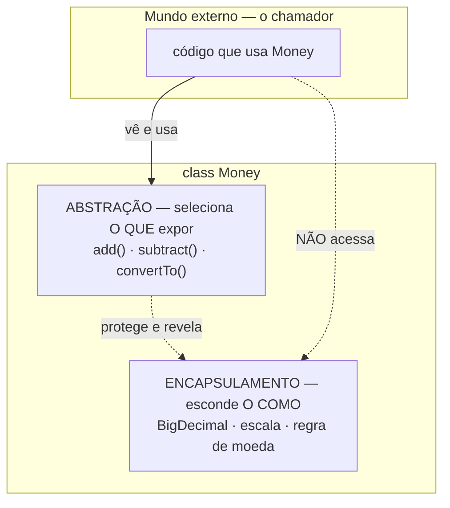
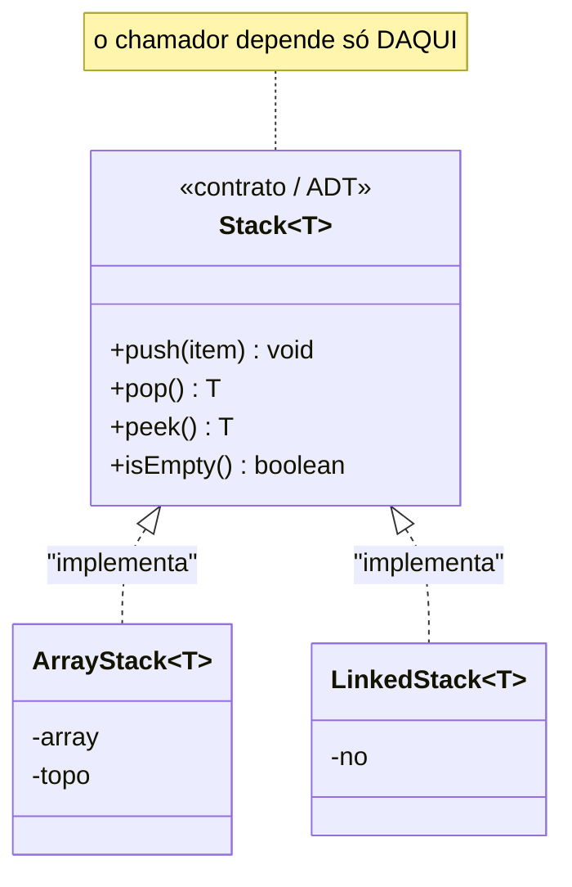

# Abstração

> [!abstract] TL;DR
> Abstração é modelar um conceito pelo que ele **faz**, não por como faz — escolhendo o **nível certo de detalhe** para o problema. Encapsulamento *esconde* o como; abstração *seleciona* o quê expor. As duas andam juntas, mas não são a mesma coisa.

Você dirige um carro sem saber como o motor queima combustível. Você gira o volante, pisa no acelerador, freia. O volante é uma abstração: ele te dá **o que importa para dirigir** e te poupa de **tudo o mais**.

Trocaram o motor a combustão por um elétrico? Você continua girando o volante. Essa é a magia: a abstração sobreviveu à mudança de implementação porque ela nunca prometeu o motor — prometeu *dirigir*.

Abstração, em OO, é a arte de decidir **o que merece um nome** e o que pode sumir.

## Modelar pelo que faz, não como faz

Pergunte a um júnior "o que é uma classe `Pedido`?" e ele descreve os campos: id, lista de itens, status, data. Pergunte a um senior e ele descreve o que ela *faz*: aceita itens, calcula total, é confirmada, é cancelada.

A diferença não é estética. É a diferença entre uma estrutura de dados e uma abstração.

Uma boa abstração responde à pergunta **"o que esse objeto promete?"** antes de "que tripa ele tem dentro?". Os dados são detalhe de implementação. As **operações** são o contrato.

> [!tip] O teste do nome
> Se você consegue descrever um objeto sem citar nenhum campo interno — só verbos —, você tem uma abstração. Se a descrição é uma lista de atributos, você tem um saco de dados (e talvez um [[12 - Anti-patterns de OO|Anemic Domain Model]] à espreita).

## Escolher o nível certo de detalhe

Aqui está o ponto que quase ninguém ensina: abstração **não é** "esconder o máximo possível". É **escolher o nível de detalhe certo para o problema em questão**.

Um motorista quer `dirigir()`. Um mecânico quer `trocarVela()`, `ajustarInjecao()`. São níveis diferentes, e cada um é a abstração *correta* — para o seu usuário.

Abstrair demais cega: se a única operação do carro fosse `usar()`, ninguém saberia dirigir. Abstrair de menos afoga: se você precisa mexer em 40 parafusos para virar à esquerda, não tem volante, tem motor exposto.

> A boa abstração é a que te dá **exatamente os comandos que o seu problema precisa** — nem um a mais, nem um a menos.

## Abstração como Tipo Abstrato de Dados (ADT)

A forma mais limpa de enxergar abstração veio antes mesmo de OO: o **Tipo Abstrato de Dados** (ADT).

Um ADT define um tipo pelo seu **contrato de operações**, e deixa a implementação invisível. O exemplo clássico é a **Stack** (pilha):

```
Stack:
  push(item)   — coloca no topo
  pop()        — retira do topo
  peek()       — espia o topo sem retirar
  isEmpty()    — está vazia?
```

Esse contrato é a abstração. Repare no que ele **não** diz: nada sobre array, nada sobre lista encadeada, nada sobre tamanho fixo. Quem usa uma `Stack` faz `push` e `pop`. O fato de o topo morar num `array[n]` ou num nó com ponteiro `next` é **detalhe de implementação que a abstração engole**.

```java
// Mesmo contrato, duas implementações invisíveis ao chamador.
interface Stack<T> {
    void push(T item);
    T pop();
    T peek();
    boolean isEmpty();
}

class ArrayStack<T>  implements Stack<T> { /* array + índice */ }
class LinkedStack<T> implements Stack<T> { /* nós encadeados */ }
```

Troque `ArrayStack` por `LinkedStack` no dia em que precisar — o código que faz `push/pop` nem percebe. Essa é a promessa cumprida.

A interface aqui *expressa* a abstração em código. Mas — cuidado — abstração e interface **não são sinônimos**. Vamos a isso, porque é onde caem muitas entrevistas. Mais sobre o mecanismo em [[06 - Interfaces e classes abstratas]].

## Abstração ≠ interface

> [!warning] A confusão mais comum
> "Abstração é quando você usa `interface`/`abstract`." **Não.** Interface é *um mecanismo* para expressar abstração. A abstração é o conceito; a interface é uma ferramenta de linguagem. Você pode ter abstração sem nenhuma `interface`.

Veja `Money`. Uma classe que representa dinheiro — sem nenhuma interface — e ainda assim é uma abstração de altíssima qualidade:

```java
public record Money(BigDecimal amount, Currency currency) {

    public Money add(Money other) {
        requireSameCurrency(other);
        return new Money(amount.add(other.amount), currency);
    }

    public Money subtract(Money other) {
        requireSameCurrency(other);
        return new Money(amount.subtract(other.amount), currency);
    }

    public Money convertTo(Currency target, ExchangeRate rate) {
        return new Money(rate.apply(amount), target);
    }

    private void requireSameCurrency(Money other) {
        if (!currency.equals(other.currency))
            throw new IllegalArgumentException("Currency mismatch");
    }
}
```

Onde está a abstração? No fato de que quem usa `Money` pensa em **somar, subtrair, converter** — e *nunca* precisa lembrar:

- que o valor mora num `BigDecimal` (e não num `double`, que arredondaria errado);
- que a escala/precisão decimal é cuidada lá dentro;
- que somar moedas diferentes é proibido e a classe te protege disso.

`Money` esconde a **representação** e expõe **operações de domínio**. Isso é abstração pura — e não há uma `interface` à vista. Sobre por que `Money` quase sempre é imutável e tem `equals` por valor, veja [[09 - Identidade, igualdade e imutabilidade]].

A lição: **abstração é sobre o que você expõe e esconde, não sobre a palavra-chave que você digita.**

### Diagrama 1 — duas faces: abstração seleciona, encapsulamento esconde

Esta é a distinção que separa quem entende OO de quem decorou OO. Abstração e [[02 - Encapsulamento|encapsulamento]] são duas faces da mesma moeda, mas olham para lados diferentes.



**Leitura do diagrama:** o chamador toca só a camada `add/subtract/convertTo` — a **abstração**, que *seleciona* o que vale a pena expor. Por baixo, o **encapsulamento** *esconde* o `BigDecimal` e as regras. A seta tracejada do chamador para o encapsulamento está cortada de propósito: ele não chega lá. Abstração decide **o quê**; encapsulamento garante o **como fica invisível**.

> [!note] Duas faces, uma moeda
> - **Encapsulamento** responde: *"como eu impeço que mexam no meu estado interno?"* (mecanismo, defesa)
> - **Abstração** responde: *"o que vale a pena eu expor, e em que nível?"* (design, modelagem)
>
> Uma classe pode estar encapsulada (campos `private`) e ser uma péssima abstração (expõe `getBigDecimal()` e força o chamador a saber do `BigDecimal`). Encapsular é necessário, mas não suficiente.

## Um único nível de abstração por função

Boa abstração não vive só na classe — vive na **função**. Existe um cheiro de código clássico aqui: **misturar níveis de abstração na mesma função**.

```java
// CHEIRO: três níveis de abstração misturados na mesma função
void processarPedido(Pedido p) {
    validar(p);                                  // alto nível: regra de negócio
    var conn = DriverManager.getConnection(URL); // baixo nível: detalhe de JDBC
    var stmt = conn.prepareStatement("INSERT..."); // baixo nível: SQL cru
    enviarEmailConfirmacao(p);                   // alto nível: regra de negócio
}
```

Ler isso é como ouvir alguém narrar uma viagem assim: "peguei a estrada, virei o pulso 30 graus à esquerda, segui para o norte, contraí o quadríceps para frear". Os verbos de alto nível ("peguei a estrada") e os de baixo nível ("contraí o quadríceps") **brigam** na sua cabeça.

A regra — **Single Level of Abstraction** (SLA) — diz: cada função deve operar **em um único nível**. A versão arrumada:

```java
void processarPedido(Pedido p) {
    validar(p);
    persistir(p);               // o JDBC sumiu para dentro daqui
    enviarEmailConfirmacao(p);
}
```

Agora as três linhas falam a mesma língua: regras de negócio. O JDBC desceu para `persistir()`, no nível dele. Cada função lê como uma frase coerente. Isso é abstração aplicada ao **fluxo**, não só à estrutura. Conecta direto com carga cognitiva e coesão — veja [[08 - Acoplamento e coesão]].

## Toda abstração não-trivial vaza

Hora da má notícia, e ela é importante para não virar um idealista ingênuo de abstração.

**Lei das Abstrações Vazadas** (Joel Spolsky, 2002): *toda abstração não-trivial, em algum grau, vaza.* Mais cedo ou mais tarde o "como" que a abstração prometeu esconder **fura a superfície** e te força a saber o detalhe.

A `Stack` parece perfeita — até a `ArrayStack` estourar a memória com 10 milhões de itens enquanto a `LinkedStack` não estouraria. O contrato `push/pop` não muda, mas a **performance** vazou a implementação. O `Money` parece selado — até um relatório precisar saber a escala decimal exata para casar centavos.

> [!info] Lastro
> A **Lei das Abstrações Vazadas** é de Joel Spolsky ("The Law of Leaky Abstractions", 2002) — canônica e bem aceita, embora seja uma *lei observacional*, não um teorema. O **Tipo Abstrato de Dados (ADT)** é conceito clássico de ciência da computação (Liskov & Zilles, anos 1970), anterior a OO. **Single Level of Abstraction** aparece em *Clean Code* (Robert C. Martin) como heurística de função, não como teorema formal — trate como guia, não dogma. O exemplo `Money` segue o padrão *Value Object* de Fowler (*Patterns of Enterprise Application Architecture*); a forma exata (`record`, `BigDecimal`) é uma simplificação didática — em produção use uma lib monetária (ex.: Joda-Money / JSR-354 Moneta), que cuida de arredondamento e câmbio melhor do que o esboço acima.

Isso **não** invalida abstração — só te avisa para não confiar cegamente. A abstração paga seu preço quando esconde o suficiente para a maioria dos casos; ela não promete esconder *tudo* para *sempre*. Quando a abstração vaza por design ruim (e não por física), vira anti-pattern — a **Leaky Abstraction** catalogada em [[12 - Anti-patterns de OO]]. O tratamento profundo do fenômeno vive no galho Complexidade de Software, em [[06 - Abstrações que vazam]].

### Diagrama 2 — ADT: um contrato sobre muitas implementações

O coração da abstração é **um nome estável sobre implementações intercambiáveis**. O contrato fica de pé enquanto as fundações trocam por baixo.



**Leitura do diagrama:** no topo, o **contrato** `Stack` — quatro operações, zero detalhe de armazenamento. Embaixo, duas implementações concretas, cada uma com seu estado privado (`array` + `topo` versus nós encadeados). As setas tracejadas significam "implementa o contrato". O chamador depende **só do topo**: ele programa contra a abstração, e por isso pode trocar a base sem reescrever nada. *Program to the contract, not the implementation* — a frase que vale ouro em entrevista.

## Em entrevista

Abstração é onde o entrevistador testa se você entende **design**, não só sintaxe. Frases que demonstram profundidade:

- "Abstraction is about **what an object does, not how it does it** — I model behavior first, data second."
- "Abstraction and encapsulation are two sides of the same coin: **encapsulation hides the how, abstraction selects what to expose** and at which level."
- "A `Money` class with `add`, `subtract`, `convert` is an abstraction even **without an interface** — it hides the `BigDecimal` representation and protects domain rules."
- "I keep functions at a **single level of abstraction** — mixing high-level business rules with low-level JDBC in one method is a code smell."
- "**Every non-trivial abstraction leaks**, as Spolsky put it — so I pick the level of detail my problem actually needs, no more, no less."
- "I **program to the contract, not the implementation**, so I can swap an array-backed stack for a linked one without touching callers."

> [!example] Vocabulário PT &rarr; EN
> - abstração &rarr; *abstraction*
> - esconder o como &rarr; *to hide the how*
> - selecionar o que expor &rarr; *to select what to expose*
> - nível de detalhe &rarr; *level of detail*
> - tipo abstrato de dados &rarr; *abstract data type (ADT)*
> - contrato vs. implementação &rarr; *contract vs. implementation*
> - detalhe de implementação &rarr; *implementation detail*
> - abstração vazada &rarr; *leaky abstraction*
> - cheiro de código &rarr; *code smell*
> - programar contra o contrato &rarr; *to program to the contract*
> - misturar níveis &rarr; *to mix levels of abstraction*

## Veja também

- [[02 - Encapsulamento]] — a outra face da moeda: esconder o como
- [[06 - Interfaces e classes abstratas]] — o mecanismo que dá forma em código ao contrato
- [[12 - Anti-patterns de OO]] — Leaky Abstraction e Anemic Model como falhas de abstração
- [[06 - Abstrações que vazam]] — o tratamento profundo da Lei de Spolsky no galho Complexidade
