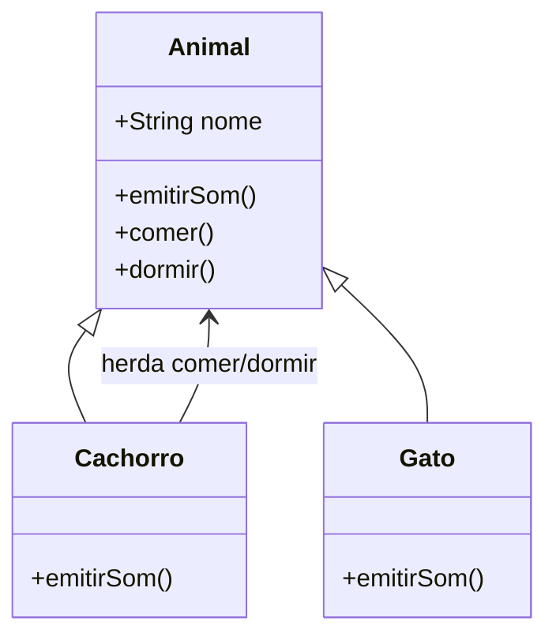
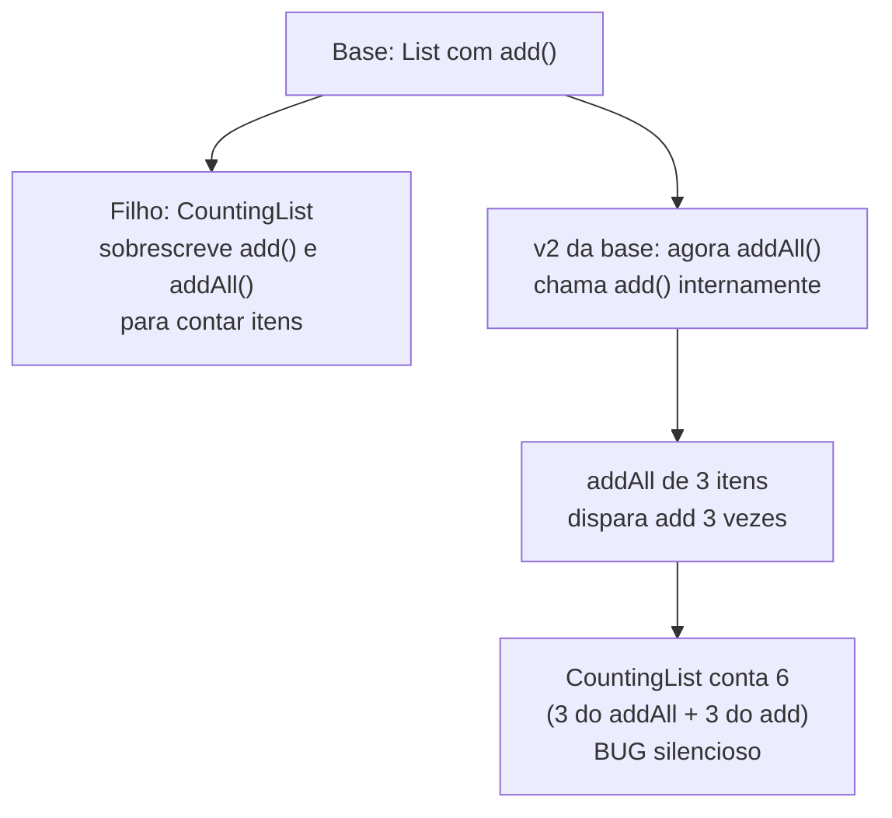
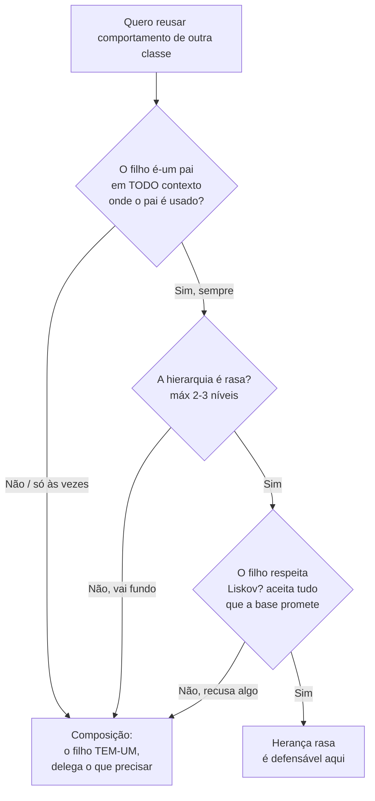
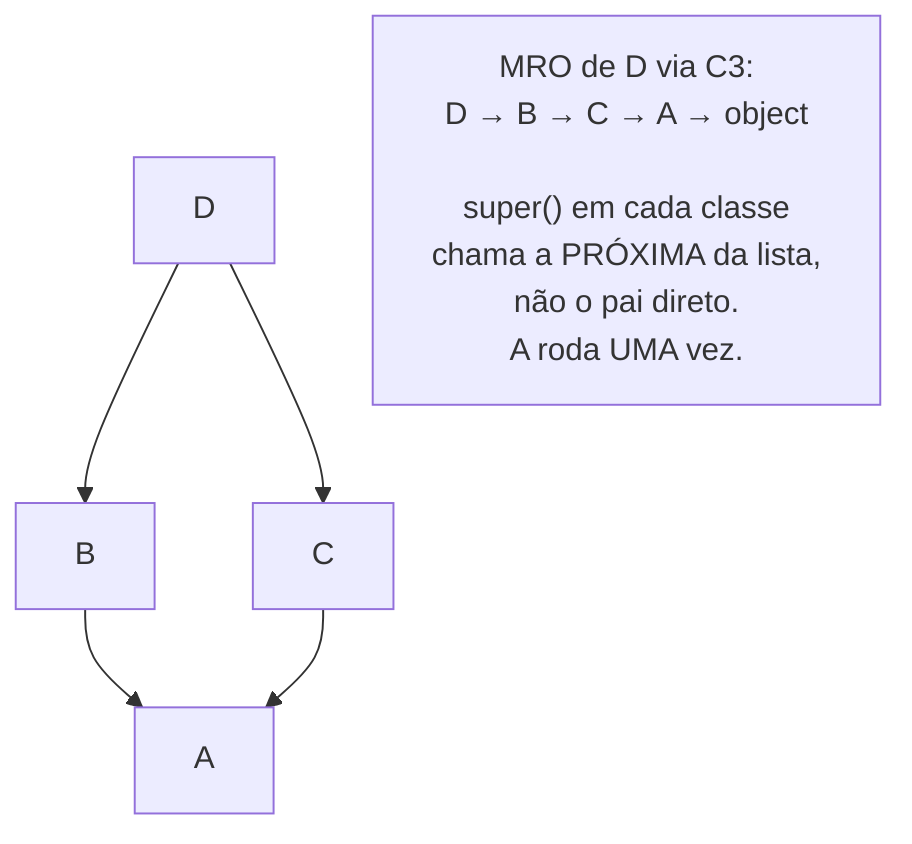
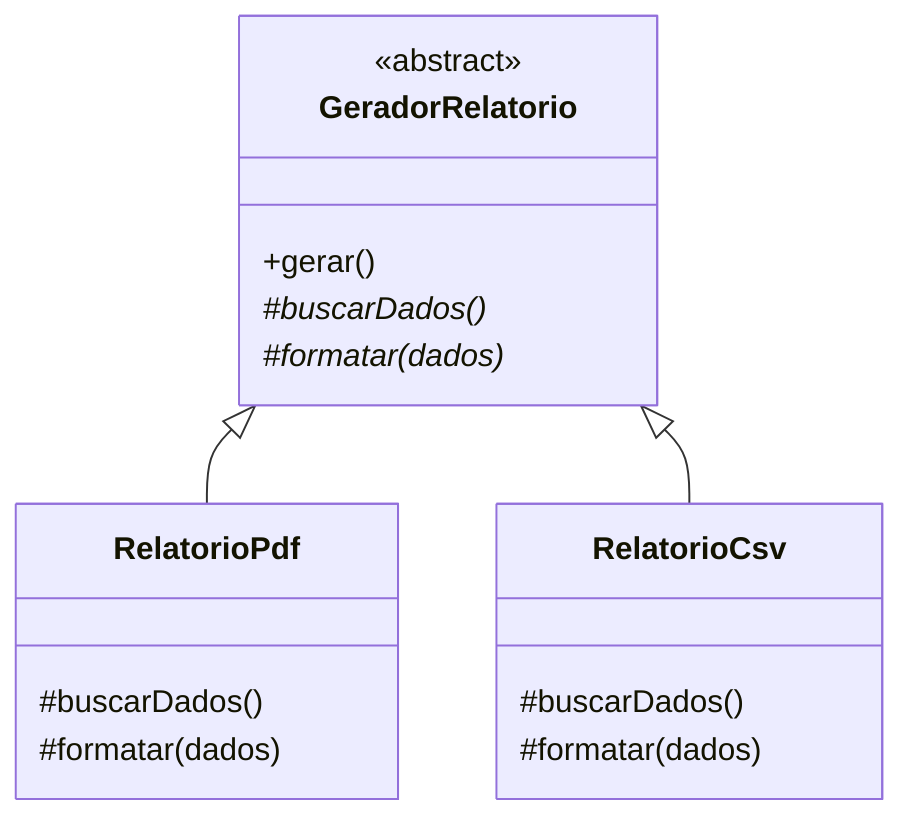

# Herança

> [!abstract] TL;DR
> Herança deixa uma subclasse **reusar e especializar** uma superclasse numa relação **is-a** — e é o pilar de OO com mais armadilhas: cria **acoplamento forte**, quebra encapsulamento entre base e filho, e desmorona em hierarquias profundas. A regra de senior: só herde se o filho **for-um** pai em **todo** contexto onde o pai é usado; na dúvida, prefira [[07 - Composição sobre herança]].

## O que é, sem mistério

Imagine que você já construiu um molde de bolo. Em vez de esculpir um novo do zero, você pega o molde existente e adiciona um detalhe — uma flor na borda. Herança é isso: a **subclasse** começa com tudo que a **superclasse** tem (atributos e métodos) e acrescenta ou troca o que precisa.

Em código, a relação é **is-a** ("é-um"). Um `Cachorro` **é um** `Animal`. Por isso ele herda `comer()` e `dormir()` sem reescrever nada, e ainda pode **sobrescrever** (override) o que diverge.

```java
class Animal {
    protected String nome;
    Animal(String nome) { this.nome = nome; }
    void emitirSom() { System.out.println("..."); }
    void comer()      { System.out.println(nome + " está comendo"); }
}

class Cachorro extends Animal {
    Cachorro(String nome) { super(nome); }   // chama o construtor da base
    @Override
    void emitirSom() { System.out.println("Au au!"); }  // especializa
    // comer() veio de graça, herdado
}
```

`Cachorro` ganhou `comer()` sem digitar uma linha (reuso) e redefiniu `emitirSom()` (especialização). Esse é o "lado bom" da herança — e a parte que cabe num parágrafo. O resto da nota é sobre por que ela machuca quando mal usada.

> [!tip] Resumo em uma linha
> Herança é reuso por especialização numa relação is-a; o preço é acoplamento forte com a base.



**Leitura do diagrama:** a seta de triângulo vazio (`<|--`) é a notação UML de herança e aponta do filho para o pai. `Cachorro` e `Gato` redefinem só `emitirSom()`; `comer()` e `dormir()` descem herdados da base. Note o quanto cada filho **depende** de `Animal` — é dessa dependência que nasce o problema.

## O perigo central: acoplamento forte

Encapsulamento (veja [[02 - Encapsulamento]]) existe para esconder os detalhes internos de uma classe atrás de uma interface pública. Herança **fura** isso. A subclasse não conversa com a base apenas pela interface pública — ela enxerga membros `protected`, depende da ordem das chamadas internas, assume como a base se comporta por dentro. É o acoplamento mais forte que OO oferece.

Por que isso importa? Porque acoplamento forte significa que **mudar a base pode quebrar os filhos** — mesmo sem você tocar nos filhos. Esse fenômeno tem nome: **fragile base class** (classe base frágil).

Pense num arranha-céu onde cada andar foi soldado ao de baixo. Trocar uma viga no térreo pode rachar o 20º andar. Você nem lembrava que aquele andar existia.



**Leitura do diagrama:** o clássico de Bloch. Um `CountingList` sobrescreve `add()` e `addAll()` para contar elementos. Tudo funciona — até a base mudar sua implementação interna e fazer `addAll()` chamar `add()` por baixo dos panos. Agora cada item é contado duas vezes. O filho não mudou. O contrato público não mudou. Mesmo assim quebrou, porque o filho dependia de **como** a base fazia, não só do **que** ela fazia.

> [!warning] Herança quebra o encapsulamento entre base e filho
> Subclasse e superclasse compartilham um espaço íntimo. A base não pode mais evoluir sua mecânica interna livremente sem arriscar os filhos. Isso é exatamente o oposto do que encapsulamento promete. Composição não tem esse problema: o objeto delegado só expõe sua interface pública.

## A pergunta que separa herança boa de má

Antes de escrever `extends`, faça **uma** pergunta:

> O filho **realmente é-um** pai em **qualquer** contexto onde o pai é usado?

O "qualquer contexto" é o detalhe que pega quase todo mundo. O exemplo canônico: `Quadrado` é-um `Retângulo`? Na geometria, sim. Em código onde `Retangulo` tem `setLargura()` e `setAltura()` independentes, **não** — porque mudar só a largura de um quadrado quebra a invariante "lados iguais". O quadrado **recusa** o comportamento que a base oferece.

Esse é o gatilho para olhar **substituibilidade** — o Princípio de Substituição de Liskov (L de [[03-Dominios/Engenharia/Design de Software/SOLID/index|SOLID]]): qualquer lugar que espera a base tem que aceitar o filho **sem surpresas**. Quando o filho recusa ou contradiz um comportamento herdado, isso é o anti-pattern **Refused Bequest** ("herança recusada"), catalogado em [[12 - Anti-patterns de OO]].



**Leitura do diagrama:** três portões antes de liberar a herança. Falhou em **qualquer** um — contexto, profundidade, ou Liskov — a saída é [[07 - Composição sobre herança]]. Repare que o caminho fácil é a composição: herança é a exceção que precisa passar em três testes, não a regra padrão.

## Hierarquias rasas, sempre

Mesmo herança legítima apodrece se vira uma árvore genealógica de cinco andares. `Animal → Mamifero → Canideo → Cachorro → CachorroDeGuarda → ...`. Para entender o `CachorroDeGuarda`, você sobe e desce a hierarquia inteira procurando onde cada método foi definido ou sobrescrito. Esse vai-e-volta cansativo é o **Yo-yo problem** (veja [[12 - Anti-patterns de OO]]).

Regra prática de senior: **máximo 2–3 níveis**. Passou disso, quase sempre dava para modelar com composição e ficar mais claro.

## Como cada linguagem trata herança

Aqui está a parte que mais diverge entre linguagens — e o que distingue uma resposta genérica de uma resposta de senior em entrevista. (O panorama completo vive em [[11 - Como o modelo OO difere entre linguagens]]; aqui ficamos no recorte da herança.)

### Java — herança única de classe, múltiplas interfaces

Uma classe Java estende **uma** superclasse (`extends`) e só uma. Mas implementa **quantas interfaces quiser** (`implements`). Por que essa assimetria? Porque herdar de duas classes herdaria **implementação** de ambas — e se as duas trouxessem o mesmo método, qual vence? Java corta o nó pela raiz: classe é herança única; interface é só contrato, então o compilador combina as assinaturas e acusa conflito se algo não bater. (Desde o Java 8, métodos `default` em interface trazem um pouco de implementação de volta — mas o conflito vira erro de compilação que você resolve à mão.)

```java
class Cachorro extends Animal implements Comparable<Cachorro>, Serializable {
    // UMA superclasse, DUAS interfaces
}
```

### Python — herança múltipla, MRO e super() cooperativo

Python permite herdar de **várias** classes ao mesmo tempo. Isso reabre a porta para o **diamond problem** ("problema do diamante"): se `D` herda de `B` e `C`, e ambas herdam de `A`, qual `metodo()` `D` deve usar quando `B` e `C` divergem?

A resposta de Python é o **MRO** (Method Resolution Order — ordem de resolução de métodos), calculado pelo **algoritmo C3 de linearização**. O C3 produz uma ordem **única e determinística** que respeita três coisas: a ordem em que você listou as bases, o fato de o filho vir antes dos pais, e consistência (sem contradições). Você consulta com `D.__mro__` ou `D.mro()`.

```python
class A:
    def quem(self): print("A")

class B(A):
    def quem(self): print("B"); super().quem()

class C(A):
    def quem(self): print("C"); super().quem()

class D(B, C):
    def quem(self): print("D"); super().quem()

D().quem()         # imprime: D, B, C, A
print(D.__mro__)   # [D, B, C, A, object]
```

O detalhe que surpreende quem vem de Java: `super()` em Python **não** significa "meu pai direto". Significa "o **próximo** na MRO". Por isso `super().quem()` em `B` chama `C` — não `A` — mesmo `B` nunca tendo ouvido falar de `C`. É o **super() cooperativo**: cada classe passa o bastão para a próxima na linearização, e `A` é chamada **uma só vez**, não duas. É o que faz o diamante funcionar sem `A` rodar em dobro.



**Leitura do diagrama:** à esquerda, o diamante real — `D` herda de `B` e `C`, que convergem em `A`. À direita, a MRO que o C3 calcula: uma **fila linear**. Quando `B.quem()` chama `super()`, o próximo da fila não é `A` (o pai de `B`), e sim `C`. É essa releitura de `super()` como "próximo da MRO" que evita chamar `A` duas vezes e resolve o diamante.

### Go — não tem herança (tem embedding)

Go **não tem herança**. Ponto. Não existe `extends`, não existe classe-pai. O que parece herança é **embedding de struct**: você embute um tipo dentro de outro e os métodos do embutido são **promovidos** (method promotion) para o tipo externo, como se fossem dele.

```go
type Animal struct{ Nome string }
func (a Animal) Comer() { fmt.Println(a.Nome, "comendo") }

type Cachorro struct {
    Animal       // embedding (sem nome de campo)
    Raca string
}
// c.Comer() funciona — promovido de Animal. Mas é COMPOSIÇÃO.
```

A diferença é conceitual e importa: embedding é **composição com açúcar sintático**. Não há relação is-a, não há substituibilidade automática de tipos, não há polimorfismo por classe-base. Go fez essa escolha de propósito para forçar [[07 - Composição sobre herança]] como caminho padrão. (Polimorfismo em Go vem de **interfaces**, não de herança — detalhe em [[11 - Como o modelo OO difere entre linguagens]].)

### TypeScript — herança única + interfaces + tipagem estrutural

TS espelha Java na forma — uma classe `extends` uma só e `implements` várias interfaces — mas com uma torção: o sistema de tipos é **estrutural** ("duck typing"), não nominal. Um objeto satisfaz uma interface se **tem a forma certa**, mesmo sem declarar `implements`. Então a "herança de contrato" em TS muitas vezes nem precisa de palavra-chave (mais em [[06 - Interfaces e classes abstratas]]).

> [!info] Lastro
> Pontos canônicos verificados: **Java** tem herança única de classe (`extends` em uma única superclasse) e implementação de múltiplas interfaces — política deliberada para evitar a ambiguidade da herança múltipla de estado/implementação (docs Oracle, "Multiple Inheritance of State, Implementation, and Type"). **Python** usa **MRO via algoritmo C3** e `super()` cooperativo que segue a linearização (não o pai direto), resolvendo o diamante com `A` chamada uma única vez (PEP 253/3119 e docs de `__mro__`). **Go** *não tem* herança nem classes — usa **embedding** de struct com promoção de métodos, que é composição (Go spec; Eli Bendersky, "Embedding in Go"). O **diamond problem** é o caso de ambiguidade da herança múltipla quando dois pais oferecem o mesmo membro. Simplificações conscientes: omiti virtual inheritance do C++ e mixins detalhados; o `super()` cooperativo foi reduzido ao essencial para o nível Iniciado.

## Quando herança É a ferramenta certa

Apesar do tom de alerta, herança não é proibida. Ela brilha em casos específicos, **sempre rasa**:

- **Hierarquia de domínio real e estável** — quando o is-a é genuíno e não vai mudar de forma. Tipos algébricos modelados como hierarquia selada (`sealed`) são um bom exemplo.
- **Template Method** — a base define o esqueleto de um algoritmo e deixa "buracos" (métodos abstratos) para os filhos preencherem. A base controla o fluxo; o filho só preenche passos.
- **Estender classes-base de frameworks** — quando o framework foi *projetado* para você herdar (`extends Component`, `extends Specification`). O contrato de extensão é parte da API.
- **Value objects imutáveis** numa hierarquia pequena, onde não há estado mutável para corromper (veja [[09 - Identidade, igualdade e imutabilidade]]).

Note que classes abstratas costumam ser a **base** legítima da herança: elas existem para serem estendidas e definem o contrato parcial que os filhos completam — o detalhe de quando usar classe abstrata vs interface está em [[06 - Interfaces e classes abstratas]].



**Leitura do diagrama:** Template Method em ação. `gerar()` (concreto, na base) define o fluxo: buscar → formatar → entregar. `buscarDados()` e `formatar()` são abstratos (o `*` marca isso na UML) — cada filho preenche. A base controla a **sequência**; os filhos controlam os **passos**. Hierarquia de um nível só, is-a genuíno, Liskov respeitado: herança defensável.

## Em entrevista

Herança é o pilar onde entrevistador testa **maturidade**, não decoreba. Mostrar que você sabe *quando não usar* vale mais que recitar a definição.

- Sobre o trade-off central: "Inheritance is the tightest coupling in OO — the subclass depends on the base class's internals, not just its public interface."
- Sobre a regra de decisão: "Before I reach for inheritance, I ask whether the child is-a parent in *every* context the parent is used in. If not, I favor composition."
- Sobre o risco da base: "Deep inheritance leads to the fragile base class problem — a change in the base can silently break subclasses you forgot existed."
- Sobre Liskov: "If a subclass refuses or contradicts behavior it inherits, that's a Refused Bequest and a Liskov violation — a sign the is-a relationship was wrong."
- Sobre linguagens (mostra alcance): "Java has single class inheritance but multiple interface inheritance. Python allows multiple inheritance and resolves the diamond with C3 linearization — its `super()` follows the MRO, not the direct parent. Go has no inheritance at all: it uses struct embedding, which is really composition."

**Vocabulário PT → EN:**

| Português | Inglês |
| --- | --- |
| herança | inheritance |
| subclasse / superclasse | subclass / superclass (base class) |
| sobrescrever (sobrescrita) | to override (overriding) |
| relação é-um | is-a relationship |
| acoplamento forte | tight coupling |
| classe base frágil | fragile base class |
| herança única / múltipla | single / multiple inheritance |
| problema do diamante | diamond problem |
| ordem de resolução de métodos | method resolution order (MRO) |
| linearização | linearization |
| herança recusada | refused bequest |
| substituibilidade | substitutability |
| hierarquia rasa / profunda | shallow / deep hierarchy |
| embedding de struct | struct embedding |
| promoção de métodos | method promotion |

## Veja também

- [[01 - O que é Orientação a Objetos]] — objeto, classe, instância: o vocabulário-base
- [[02 - Encapsulamento]] — o que herança fura entre base e filho
- [[03 - Abstração]] — modelar pelo que faz, não como
- [[05 - Polimorfismo]] — o "porquê" mais legítimo de herdar: late binding sobre a base
- [[06 - Interfaces e classes abstratas]] — a base legítima da herança e a alternativa de contrato
- [[07 - Composição sobre herança]] — a alternativa padrão quando o is-a falha
- [[08 - Acoplamento e coesão]] — por que acoplamento forte é o custo central da herança
- [[09 - Identidade, igualdade e imutabilidade]] — value objects como herança segura
- [[10 - Rich vs Anemic Domain Model]] — onde hierarquias de domínio fazem sentido
- [[11 - Como o modelo OO difere entre linguagens]] — Go sem herança, Python MRO, nominal vs estrutural
- [[12 - Anti-patterns de OO]] — Refused Bequest e Yo-yo problem em detalhe
- [[13 - OO na prática e em entrevista]] — o capstone bilíngue
- [[03-Dominios/Engenharia/Design de Software/SOLID/index|SOLID]] — o L (Liskov) que governa quando herdar é legítimo
