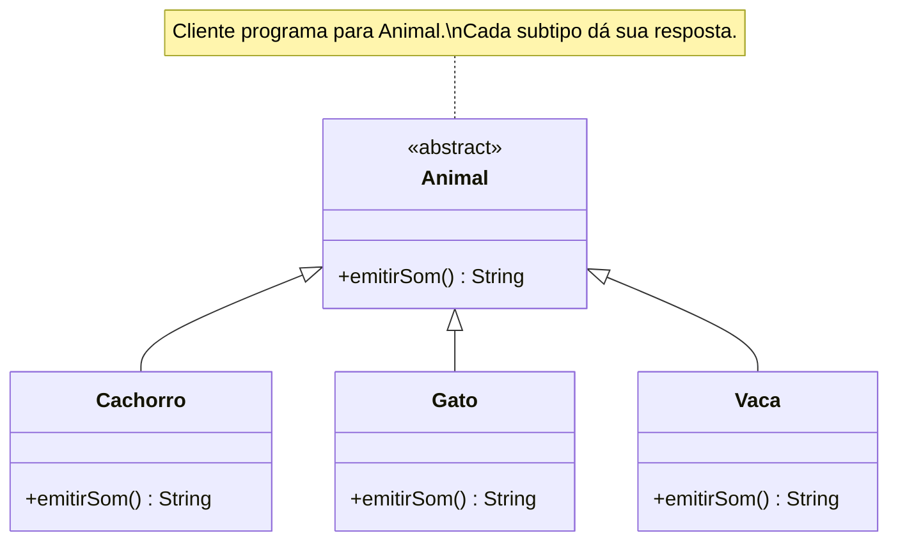
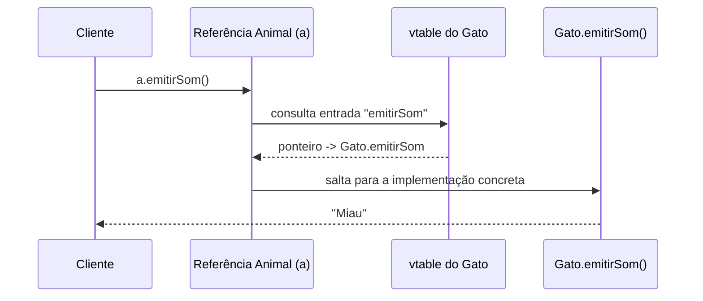
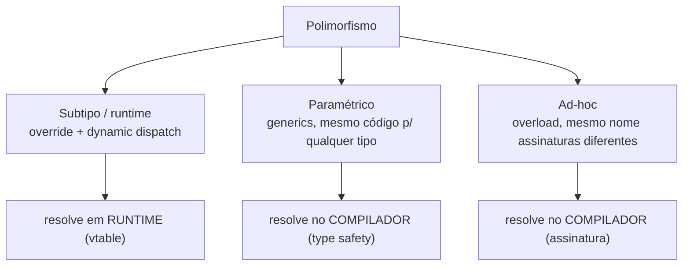

# Polimorfismo

> [!abstract] TL;DR
> Polimorfismo é objetos de tipos diferentes responderem à **mesma interface**: o código cliente fala uma só língua, e cada objeto responde do seu jeito. Tem três sabores — **subtipo** (override + dynamic dispatch), **paramétrico** (generics) e **ad-hoc** (overload) — e é o que torna o Open/Closed possível: caso novo vira classe nova, não vira mais um `case` no `switch`.

## A ideia central: um botão, muitos comportamentos

Você já reparou que o botão de *play* é o mesmo em todo player? No Spotify, no YouTube, no leitor de podcast do seu carro. Você aperta "tocar". Um toca MP3, outro abre um stream HTTP, outro liga o Bluetooth. **Mesma interface, comportamentos diferentes.**

Isso é polimorfismo. A palavra vem do grego: *poly* (muitas) + *morphé* (formas). Muitas formas respondendo ao mesmo nome.

O que importa para você como dev é o que isso desbloqueia: **o código cliente trata todos uniformemente**. Você escreve `player.tocar()` uma vez. Não precisa saber se é Spotify ou YouTube. Não tem `if tipo == "spotify"`. Cada objeto sabe responder por si.

Guarde esta frase, porque ela é a definição operacional: *o cliente conhece a interface, não a implementação*. Liga direto em [[03 - Abstração]] (programar pelo que faz) e [[02 - Encapsulamento]] (o como fica escondido).

E por que "muitas formas"? Porque OO tem **três** mecanismos diferentes que recebem esse mesmo nome. Vamos pelos três.

## 1. Polimorfismo de subtipo (o que cai na entrevista)

É o sabor que você pensa primeiro quando ouve "polimorfismo". Também chamado de **polimorfismo de inclusão** ou **de runtime**.

A receita: uma classe base (ou interface) declara um método; vários subtipos **sobrescrevem** (*override*) esse método; o cliente chama através da referência base; e o objeto **concreto** decide qual versão roda.

```java
abstract class Animal {
    abstract String emitirSom();
}

class Cachorro extends Animal {
    String emitirSom() { return "Au au"; }
}

class Gato extends Animal {
    String emitirSom() { return "Miau"; }
}

class Vaca extends Animal {
    String emitirSom() { return "Muuu"; }
}

// Cliente: trata todos como Animal, não sabe (nem quer saber) o tipo concreto
List<Animal> animais = List.of(new Cachorro(), new Gato(), new Vaca());
for (Animal a : animais) {
    System.out.println(a.emitirSom()); // Au au, Miau, Muuu
}
```

Repare na variável: o tipo *declarado* é `Animal`. O tipo *concreto* só é conhecido em runtime. A linha `a.emitirSom()` parece uma só, mas executa três métodos diferentes.

Vamos ver as peças.



Leitura do diagrama: `Animal` declara o contrato `emitirSom()`. As setas `<|--` apontam para a base — cada subtipo *é-um* `Animal` (relação is-a, vinda de [[04 - Herança]]) e fornece sua própria versão. O cliente segura uma referência `Animal` e nunca olha para baixo na hierarquia.

### O mecanismo: dynamic dispatch e a vtable

Aqui está a pergunta que separa quem decorou de quem entendeu: *como `a.emitirSom()` sabe que `a` é um `Gato`?*

A resposta é **dynamic dispatch** (despacho dinâmico): a escolha de qual implementação chamar é adiada até o **runtime**, quando o tipo concreto do objeto é conhecido. Isso também se chama **late binding** (ligação tardia) — o oposto de *static dispatch*, em que o compilador já resolve tudo.

E como o runtime descobre isso rápido? Com uma **vtable** (*virtual method table*, ou tabela de métodos virtuais). Pense numa lista telefônica por classe:

- Cada classe com métodos sobrescrevíveis tem uma vtable: um array de ponteiros para suas implementações.
- Cada objeto carrega, escondido, um ponteiro para a vtable da sua classe.
- Chamar `a.emitirSom()` vira: "siga o ponteiro do objeto até a vtable, pegue a entrada de `emitirSom`, salte para lá."



Leitura do diagrama: o cliente chama `emitirSom()` numa referência do tipo base. Em vez de saltar direto para um endereço fixo (o que seria *static dispatch*), o runtime consulta a vtable do objeto **concreto** — neste caso a do `Gato` — pega o ponteiro certo e só então executa. O custo é uma indireção a mais (um *lookup*); o ganho é não precisar de nenhum `if/switch`.

> [!tip] Como dizer numa entrevista
> "Late binding *implica* dynamic dispatch, mas não o contrário." Despacho dinâmico é o mecanismo geral de escolher a implementação em runtime; late binding é o caso em que nem o método existia em tempo de compilação (linguagens dinâmicas). Saber a diferença soa senior.

## 2. Polimorfismo paramétrico (generics)

Outro problema, outra forma. Imagine uma `List`. Você quer uma lista de `Animal`, outra de `String`, outra de `int`. Vai escrever `ListaDeAnimal`, `ListaDeString`, `ListaDeInt`? Claro que não.

**Polimorfismo paramétrico** é escrever código que funciona para *qualquer* tipo, deixando o tipo como um **parâmetro**. Em Java/TS/C#/Rust chamamos de **generics**.

```java
List<Animal> animais = new ArrayList<>();
List<String> nomes  = new ArrayList<>();
// Uma única implementação de ArrayList; T é preenchido na chamada.
```

O `T` em `List<T>` é o parâmetro de tipo. A mesma `ArrayList` serve para tudo, e você ganha duas coisas:

- **Type safety**: o compilador impede `animais.add("texto")`. Sem generics, você guardaria tudo como `Object` e voltaria fazendo *casts* perigosos.
- **Reuso**: uma implementação, infinitos tipos.

Entre linguagens:

- **Java/TS/C#** — generics nominais: `List<T>`, `Map<K,V>`, `function id<T>(x: T): T`.
- **Go** — generics chegaram só no **1.18** (2022). Antes, a comunidade usava `interface{}` (hoje `any`) com casts, exatamente o problema que generics resolvem.
- **Python** — sem generics em runtime (é dinâmica), mas o módulo `typing` dá `list[int]`, `Dict[str, int]`, `TypeVar` e `Generic[T]` para os type checkers (mypy, pyright). É verificação estática opcional sobre uma linguagem dinâmica.

> [!note] Subtipo resolve "qual implementação"; paramétrico resolve "qual tipo guardado"
> São ortogonais. `List<Animal>` é generics (paramétrico) *guardando* objetos que respondem por dynamic dispatch (subtipo). Os dois sabores trabalham juntos no mesmo `for`.

## 3. Polimorfismo ad-hoc (overload)

O terceiro sabor é o mais "caso a caso" — daí *ad-hoc*. É o **overload**: o mesmo nome de método com **assinaturas diferentes**, e o compilador escolhe a versão pela quantidade/tipo dos argumentos.

```java
class Console {
    void print(int x)    { /* ... */ }
    void print(String s) { /* ... */ }
    void print(int x, int y) { /* ... */ }
}
```

Diferença crucial em relação ao subtipo: overload é **resolvido em tempo de compilação** (static dispatch). O compilador olha os argumentos e fixa qual `print` chamar. Não há vtable envolvida.

Aqui mora uma armadilha de entrevista: **nem toda linguagem tem overload.**

- **Java** — tem, nativo. Resolução por assinatura no compilador.
- **TypeScript** — usa **overload signatures**: você declara várias assinaturas e *uma só* implementação que as cobre.
  ```typescript
  function buscar(id: number): Usuario;
  function buscar(email: string): Usuario;
  function buscar(chave: number | string): Usuario { /* uma implementação */ }
  ```
- **Python** — **não tem** overload por assinatura: redefinir um método apenas *substitui* o anterior. As saídas idiomáticas são `functools.singledispatch` (despacho pelo tipo do **primeiro** argumento, desde 3.4; `singledispatchmethod` para métodos desde 3.8) ou simplesmente **argumentos default** e `*args`.
- **Go** — **não tem overload de método nem de função**, por decisão de design (simplicidade e resolução previsível). Em Go você usa nomes distintos ou variádicos.

E a **coerção** (*coercion*) é um primo do ad-hoc: quando você faz `1 + 2.0`, o `1` é coagido para `double` para casar com o `+`. Um mesmo operador servindo a tipos diferentes via conversão implícita.



Leitura do diagrama: os três ramos partem do mesmo conceito mas diferem em *quando* e *como* a versão certa é escolhida. Subtipo decide em runtime, via tabela; os outros dois decidem no compilador — um pelo parâmetro de tipo, o outro pela assinatura dos argumentos.

## Duck typing e interfaces estruturais: subtipo sem herança

Tem um jeito de ter polimorfismo de subtipo **sem hierarquia de classes**. É a tipagem **estrutural**: "se tem a forma certa, serve".

O ditado de Python: *"Se anda como um pato e grasna como um pato, é um pato."* Você não pergunta o tipo do objeto — você só chama `.grasnar()`. Se o método existe, funciona; se não, estoura em runtime. Isso é **duck typing**.

```python
class Pato:
    def emitir_som(self): return "Quack"

class Pessoa:
    def emitir_som(self): return "Oi, sou um pato (?)"

def fazer_barulho(coisa):
    print(coisa.emitir_som())  # não importa o tipo, importa o método

fazer_barulho(Pato())     # Quack
fazer_barulho(Pessoa())   # Oi, sou um pato (?)
```

**Go** leva isso para a tipagem estática com **interfaces estruturais**: um tipo satisfaz uma interface se tiver os métodos — sem declarar `implements`. O acoplamento é mínimo; o compilador faz a checagem que o duck typing de Python deixa para o runtime.

```go
type Falante interface {
    EmitirSom() string
}
// Qualquer struct com EmitirSom() string "é" um Falante. Sem implements.
```

Tudo isso é polimorfismo de subtipo — só que o "subtipo" vem da *forma*, não de uma hierarquia explícita. O contraste nominal-vs-estrutural está em [[06 - Interfaces e classes abstratas]], e o panorama por linguagem em [[11 - Como o modelo OO difere entre linguagens]].

## Por que importa: polimorfismo é o motor do Open/Closed

Aqui está a recompensa. Sem polimorfismo, adicionar um animal novo vira isto:

```java
String som(String tipo) {
    switch (tipo) {
        case "cachorro": return "Au au";
        case "gato":     return "Miau";
        // toda vez que surge um animal, você EDITA este switch
    }
}
```

Cada caso novo te força a **abrir** e mexer num código que já funcionava — convite ao bug. Com polimorfismo de subtipo, caso novo é **classe nova**: você cria `Vaca extends Animal`, e o `for` sobre `List<Animal>` já a atende sem tocar numa linha existente.

Isso é literalmente o **Open/Closed Principle**: aberto para extensão, fechado para modificação. O polimorfismo é o mecanismo que o torna possível — ver [[03-Dominios/Engenharia/Design de Software/SOLID/index|SOLID]]. E como o sabor preferido na prática é "novo comportamento = novo objeto plugado", isso conversa direto com [[07 - Composição sobre herança]]: você injeta a estratégia em vez de herdar.

> [!info] Lastro
> O canônico aqui: **dynamic dispatch** = escolher a implementação em runtime; **vtable** é *uma* técnica de implementação dela (a usual em C++/Java HotSpot, que ainda otimiza com inline caching), mas não a única — linguagens dinâmicas usam dicionários de métodos. **Late binding implica dynamic dispatch, não o contrário** (Wikipedia: *Dynamic dispatch*, *Late binding*, *Virtual method table*). Sobre ad-hoc: **Java** tem overload nativo; **TypeScript** usa *overload signatures* sobre uma única implementação; **Python** não tem overload por assinatura (usa `functools.singledispatch` desde 3.4 ou args default); **Go** não tem overload de método/função, por design; **Go generics** chegaram no **1.18** (2022). A taxonomia dos três tipos segue Wikipedia *Polymorphism (computer science)*; "subtipo/paramétrico/ad-hoc" é a divisão clássica de Cardelli & Wegner. Simplificação consciente: o exemplo Animal é didático, não modela domínio real.

## Em entrevista

Polimorfismo é pergunta garantida. O erro do júnior é responder só "subtipo". O senior nomeia os três e explica o mecanismo.

- *"Polymorphism lets objects of different types respond to the same interface, each in its own way."*
- *"There are three flavors: subtype, parametric (generics), and ad-hoc (overloading)."*
- *"Subtype polymorphism is resolved at runtime through dynamic dispatch — the runtime looks up the concrete method in the object's vtable."*
- *"This is what makes the Open/Closed Principle work: a new case is a new class, not another branch in a switch statement."*
- *"Go doesn't have method overloading, and its interfaces are structural — a type satisfies an interface just by having the methods, no `implements` keyword."*

**Vocabulário PT → EN:**

- polimorfismo de subtipo → *subtype polymorphism* (também *inclusion / runtime polymorphism*)
- sobrescrever (override) → *to override* / *method overriding*
- sobrecarregar (overload) → *to overload* / *method overloading*
- despacho dinâmico → *dynamic dispatch*
- ligação tardia → *late binding* (oposto: *early/static binding*)
- tabela de métodos virtuais → *virtual method table (vtable)*
- generics / paramétrico → *generic / parametric polymorphism*
- segurança de tipo → *type safety*
- tipagem nominal vs. estrutural → *nominal vs. structural typing*
- tipagem pato → *duck typing*

## Veja também

- [[04 - Herança]] — a base do polimorfismo de subtipo: is-a e override
- [[03 - Abstração]] — programar para a interface, não a implementação
- [[02 - Encapsulamento]] — o "como" escondido que o polimorfismo explora
- [[06 - Interfaces e classes abstratas]] — contrato vs. implementação; nominal vs. estrutural
- [[07 - Composição sobre herança]] — plugar comportamento em vez de herdar
- [[11 - Como o modelo OO difere entre linguagens]] — overload, generics e duck typing por linguagem
- [[12 - Anti-patterns de OO]] — o `switch` por tipo que polimorfismo elimina
- [[13 - OO na prática e em entrevista]] — capstone e prep bilíngue
- [[03-Dominios/Engenharia/Design de Software/SOLID/index|SOLID]] — Open/Closed depende de polimorfismo
- [[01 - O que é Orientação a Objetos]] — o paradigma de onde tudo parte
