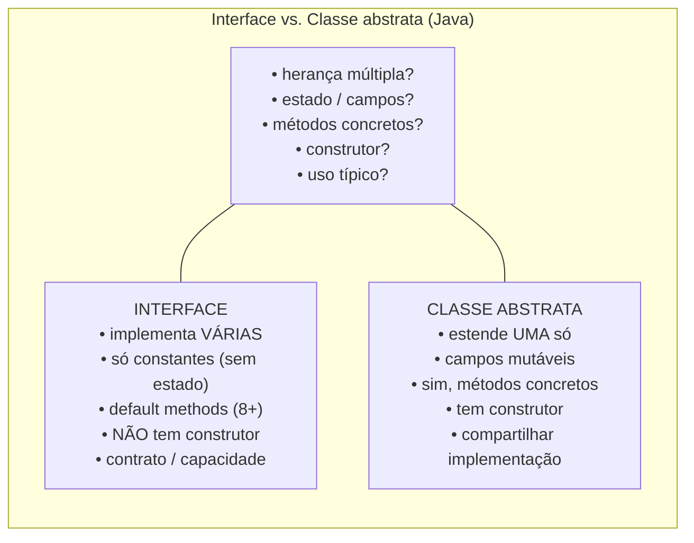
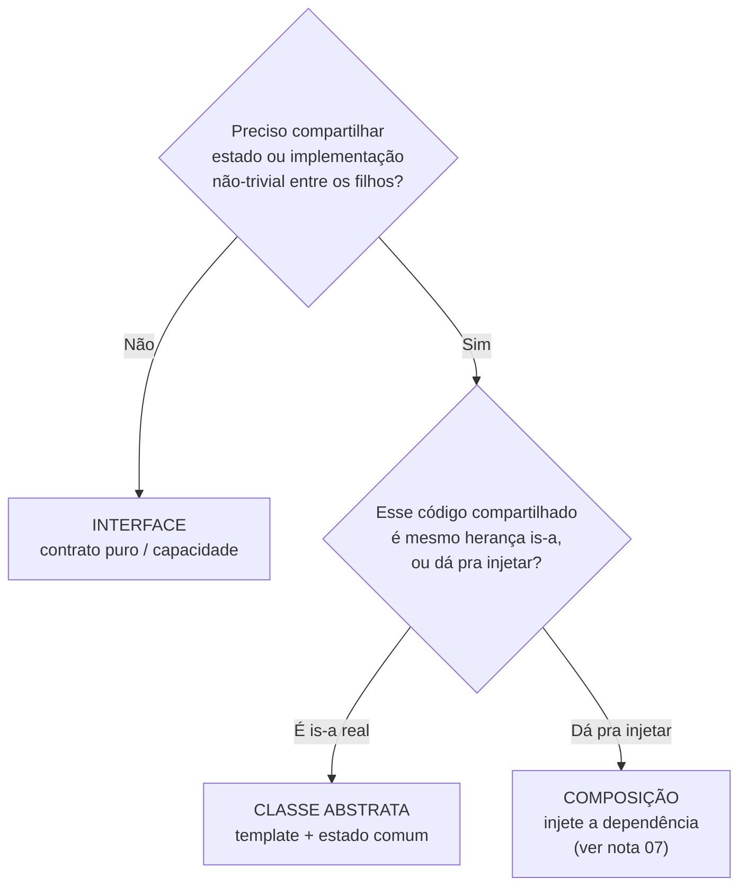
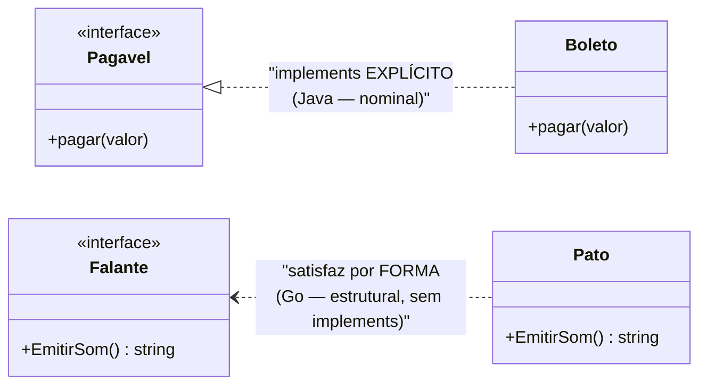

# Interfaces e classes abstratas

> [!abstract] TL;DR
> **Interface** é contrato puro: diz *o quê*, não *como* — define uma **capacidade**. **Classe
> abstrata** é meio-caminho: contrato + **implementação parcial compartilhada**, podendo carregar
> estado entre os filhos. Regra de bolso: **comece com interface**; só migre para abstrata se for
> *mesmo* compartilhar estado ou código não-trivial. E há um eixo que muda tudo entre linguagens —
> **tipagem nominal** (Java/C#: satisfaz se *declara* `implements`) vs. **estrutural** (Go/TS:
> satisfaz se *tem a forma*).

## Duas perguntas, dois objetos

Imagine que você está montando uma cozinha industrial.

A **interface** é a tomada na parede. Ela não te dá comida — ela promete uma coisa só: "encaixe aqui
o plugue certo e você terá energia". Qualquer aparelho que tenha o plugue compatível funciona.
Liquidificador, forno, batedeira: a tomada não sabe nem se importa. Ela define uma **capacidade**.

A **classe abstrata** é a bancada-base que vem semi-montada de fábrica. Já tem o tampo de inox, os
pés niveladores, a estrutura. Mas tem um buraco onde *você* precisa instalar a sua pia específica.
Ela compartilha estrutura pronta com todas as variantes, e deixa um espaço para o resto.

Percebe a diferença? A tomada **só promete**. A bancada **já entrega parte e pede o resto**.

Em código, a pergunta que separa as duas é: *eu só quero garantir um contrato, ou quero também
compartilhar implementação entre os filhos?*

Isso conecta direto com [[03 - Abstração]] (esconder o como por trás do quê) e [[04 - Herança]] (a
relação is-a que a classe abstrata usa). A interface é a forma mais pura de abstração: zero
implementação, só promessa.

## Interface: o contrato puro

Uma interface declara métodos que um tipo **promete** ter, sem dizer como eles funcionam. É um
checklist de capacidades.

```java
interface Pagavel {
    void pagar(BigDecimal valor);
    BigDecimal saldoDevedor();
}
```

Quem implementar `Pagavel` *tem* que fornecer esses dois métodos. A interface não liga se é um
boleto, um cartão ou um Pix — só exige que respondam ao contrato.

Desde o **Java 8**, interfaces ganharam **default methods**: métodos *com corpo* dentro da interface,
usando a palavra `default`. Isso resolveu um problema histórico — permitir **evoluir** uma interface
(adicionar um método) sem quebrar todas as classes que já a implementavam.

```java
interface Pagavel {
    void pagar(BigDecimal valor);
    BigDecimal saldoDevedor();

    default boolean quitado() {        // default method (Java 8+)
        return saldoDevedor().signum() == 0;
    }
}
```

Mas atenção ao detalhe que cai em entrevista: **default methods não têm acesso a estado de instância**.
A interface continua sem campos mutáveis. Um default method só pode chamar outros métodos do contrato
(como `saldoDevedor()` acima) — ele não tem `this.algumCampo` para ler. Interface continua sendo
contrato; o default é só conveniência sobre o próprio contrato.

> [!note] "Mas então interface virou classe abstrata?"
> Quase, e essa é justamente a pergunta-pegadinha. Não: a interface ganhou *implementação*, mas
> **não ganhou estado**. Sem campos de instância, sem construtor. É a fronteira que continua de pé.

## Classe abstrata: implementação parcial + estado

A classe abstrata é uma classe normal que você **não pode instanciar** (`new` é proibido). Ela
existe para ser estendida. Pode ter:

- métodos **concretos** (com corpo, compartilhados pelos filhos),
- métodos **abstratos** (sem corpo, que cada filho preenche),
- **campos mutáveis** (estado compartilhado),
- **construtor** (para inicializar esse estado).

```java
abstract class Conta {
    protected BigDecimal saldo;          // estado mutável compartilhado

    Conta(BigDecimal saldoInicial) {     // construtor: só abstrata tem
        this.saldo = saldoInicial;
    }

    void depositar(BigDecimal v) {        // concreto: vale para todo filho
        saldo = saldo.add(v);
    }

    abstract void sacar(BigDecimal v);    // abstrato: cada conta saca à sua regra
}
```

`ContaCorrente` e `ContaPoupanca` herdam `depositar()` e o campo `saldo` de graça, e só implementam
sua própria regra de `sacar()`. A abstrata **compartilha implementação e estado**; a interface jamais
faria isso.

## O lado a lado

Vamos colocar as diferenças numa tabela só — é exatamente o formato que a entrevista pede.



Leitura do diagrama: cada linha à esquerda é uma pergunta de design; as duas colunas respondem. O
ponto que mais pega gente: uma classe **implementa várias interfaces** mas **estende uma única**
classe abstrata. Por isso interface é o jeito de uma classe ter *muitas* capacidades (é `Pagavel`,
`Serializavel`, `Comparable`), enquanto abstrata te dá uma herança só — e você tem que escolher bem em
quê gastá-la.

A diferença de **estado** é o coração: interface não guarda dado de instância (no máximo constantes
`public static final`); abstrata guarda. E só a abstrata tem **construtor**, porque só ela tem estado
para inicializar.

## A regra prática: comece com interface

Se a tabela acima é o *o quê*, aqui está o *quando*. A heurística que vale para o dia a dia:

> Comece com **interface**. Só migre para **classe abstrata** se descobrir que precisa *mesmo*
> compartilhar **estado** ou **implementação não-trivial** entre os filhos.



Leitura do diagrama: a primeira bifurcação filtra o caso comum — na dúvida, **interface**. Só quando
há código/estado real para compartilhar você desce. E mesmo aí, há um segundo filtro: aquele código
*precisa* vir por herança, ou você consegue **injetar** a peça pronta? Muita vez a "classe abstrata
compartilhada" é só uma dependência esperando para ser composta — é o argumento de
[[07 - Composição sobre herança]]. Herança de abstrata cria acoplamento rígido (o filho fica preso à
hierarquia, ver [[08 - Acoplamento e coesão]]); composição mantém as peças soltas.

Por que começar pela interface? Porque ela é o ponto de menor compromisso. Ela te dá o desacoplamento
do **DIP** (depender do contrato, não da classe concreta — [[03-Dominios/Engenharia/Design de Software/SOLID/index|SOLID]])
sem te amarrar numa hierarquia. Você sempre pode promover uma interface a abstrata depois; o caminho
inverso dói muito mais.

## O conceito-âncora: tipagem nominal vs. estrutural

Aqui o tema fica fundo, e é onde as linguagens **divergem de verdade**. A pergunta é simples:
*quando um tipo "satisfaz" uma interface?*

Há duas respostas no mundo, e elas mudam o design inteiro.

**Tipagem nominal** (Java, C#): um tipo satisfaz uma interface **só se declarar** que a implementa.
O *nome* do contrato importa. Você escreve `class Boleto implements Pagavel`. Sem esse `implements`,
mesmo que `Boleto` tenha métodos idênticos aos de `Pagavel`, ele **não é** um `Pagavel`. A relação é
*explícita e por nome*.

**Tipagem estrutural** (Go, TypeScript): um tipo satisfaz uma interface **se tiver a forma certa** —
os métodos/campos com as assinaturas certas. Ele não declara nada. A relação é *implícita e por
estrutura*.



Leitura do diagrama: nos dois pares, o tipo concreto tem o método que a interface exige. A diferença
é a seta. À esquerda (`<|..`, Java), `Boleto` *declara* `implements Pagavel` — a ligação é desenhada
porque o programador a escreveu. À direita (`<..`, Go), `Pato` **nunca menciona** `Falante`; a
satisfação acontece *automaticamente* porque a forma bate. Em Go isso se chama **interfaces
implícitas**: qualquer tipo com `EmitirSom() string` já *é* um `Falante`, sem uma linha de declaração.

```go
type Falante interface {
    EmitirSom() string
}

type Pato struct{}
func (p Pato) EmitirSom() string { return "Quack" }
// Pato satisfaz Falante automaticamente. Em lugar nenhum dizemos "implements".
```

No **TypeScript** é a mesma ideia (**structural typing**, ou *duck typing em tempo de compilação*):
um objeto serve a um tipo se tiver as propriedades certas, independentemente do nome.

```typescript
interface Falante { emitirSom(): string; }
const pato = { emitirSom: () => "Quack" }; // nunca disse "implements Falante"
const f: Falante = pato;                    // compila: a forma bate
```

E o **Python**? É o meio-termo mais rico dos três:

- **Duck typing puro** em runtime: você só chama `.emitir_som()`; se existe, roda; se não,
  `AttributeError`. Sem checagem prévia.
- **ABC** (Abstract Base Classes): nominal-*ish*. Um tipo é subtipo de uma ABC só se **herdar** dela
  ou for **registrado** via `.register()`. O nome/linhagem importa.
- **Protocol** (PEP 544, Python 3.8+): **estrutural** estático. Um tipo satisfaz um `Protocol` se
  tiver a forma — sem herdar nada. É o "static duck typing" que traz a checagem do mypy/pyright para o
  duck typing do Python.

```python
from typing import Protocol

class Falante(Protocol):          # estrutural
    def emitir_som(self) -> str: ...

class Pato:                       # NÃO herda de Falante
    def emitir_som(self) -> str: return "Quack"

def faz_barulho(x: Falante) -> None: print(x.emitir_som())
faz_barulho(Pato())               # mypy aprova: a forma bate
```

### Por que isso importa para design

Não é trivia acadêmica — muda *como você desenha interfaces*.

**Estrutural (Go) empurra você a interfaces pequenas, definidas pelo consumidor.** Como ninguém
precisa declarar `implements`, é barato definir uma interface de **um método** exatamente onde você a
consome (`io.Reader`, `io.Writer` são o exemplo canônico). O provedor nem sabe que a interface existe.
Isso é o **ISP** (Interface Segregation Principle) levado ao extremo natural — interfaces minúsculas e
focadas, ver [[03-Dominios/Engenharia/Design de Software/SOLID/index|SOLID]].

**Nominal (Java) torna o contrato rastreável e intencional.** Como você *declara* `implements`, a IDE
acha todos os implementadores num clique, e a relação é documentação viva. O custo é a cerimônia: para
trocar de implementação você precisa de uma interface declarada *antes*, e cada classe lista
explicitamente suas capacidades.

O trade-off em uma frase: estrutural é **flexível e acoplamento mínimo**, mas a relação some das
ferramentas (mexer numa struct pode silenciosamente passar a satisfazer — ou deixar de satisfazer —
uma interface); nominal é **explícito e rastreável**, ao custo de cerimônia. O panorama completo por
linguagem está em [[11 - Como o modelo OO difere entre linguagens]].

> [!info] Lastro
> Canônico: **default methods** em interfaces Java existem desde o **Java 8** (2014), e o motivo
> oficial foi a evolução de interfaces sem quebrar implementadores; eles **não acessam estado de
> instância** (interface não tem campos mutáveis, só `public static final`) e interface **não tem
> construtor**. **Go** usa interfaces **implícitas/estruturais** (um tipo satisfaz se tem os métodos,
> sem `implements`), enquanto seus tipos *nomeados* são nominais — é a interface que é estrutural.
> **TypeScript** é estruturalmente tipado (structural typing / duck typing estático). **Python**:
> **ABC** é nominal (herança ou `register()`); **Protocol** (PEP 544, na stdlib desde 3.8) é
> structural subtyping / "static duck typing"; e em runtime há duck typing puro. Fontes: docs Java
> (JLS, default methods), Effective Go / spec Go (interfaces), TypeScript Handbook (*Type
> Compatibility*), PEP 544, Wikipedia *Nominal type system* / *Structural type system* / *Duck typing*.
> Simplificação consciente: os exemplos (`Pagavel`, `Conta`, `Pato`) são didáticos, não modelam
> domínio real; C# também tem default interface methods desde C# 8, citado en passant.

## Em entrevista

A pergunta "interface ou classe abstrata?" é clássica. O júnior recita a tabela; o senior dá a
**regra de decisão** e sabe que a resposta *muda por linguagem*.

- *"An interface is a pure contract — it says what, not how. An abstract class shares partial
  implementation and state among its subclasses."*
- *"Rule of thumb: start with an interface. Only reach for an abstract class if you actually need to
  share state or non-trivial implementation."*
- *"A class can implement many interfaces but extend only one abstract class — that's why interfaces
  model capabilities and abstract classes model a single is-a hierarchy."*
- *"Since Java 8, interfaces can have default methods, but they still can't hold instance state and
  have no constructor — that line still holds."*
- *"Java is nominally typed: a type satisfies an interface only if it explicitly declares `implements`.
  Go and TypeScript are structural — a type satisfies an interface just by having the right shape, no
  declaration needed. Go calls these implicit interfaces."*
- *"This is why Go favors tiny, consumer-defined interfaces — it's the Interface Segregation Principle
  by default — and why depending on interfaces over concretions gives you the Dependency Inversion
  Principle."*

**Vocabulário PT → EN:**

- interface (contrato) → *interface* / *contract*
- classe abstrata → *abstract class*
- implementação parcial → *partial implementation*
- método concreto → *concrete method*
- método/default method → *default method*
- estado / campo mutável → *state* / *mutable field*
- herança múltipla → *multiple inheritance*
- capacidade → *capability*
- tipagem nominal vs. estrutural → *nominal vs. structural typing*
- interfaces implícitas (Go) → *implicit interfaces*
- duck typing estático → *static duck typing*
- regra de bolso → *rule of thumb*

## Veja também

- [[03 - Abstração]] — a interface é a forma mais pura de abstração: só o quê, zero como
- [[04 - Herança]] — a relação is-a que a classe abstrata usa (e a interface evita)
- [[05 - Polimorfismo]] — interfaces e abstratas são o substrato do dynamic dispatch
- [[07 - Composição sobre herança]] — por que muitas "abstratas compartilhadas" deviam ser injetadas
- [[08 - Acoplamento e coesão]] — herdar de abstrata acopla; depender de interface desacopla
- [[11 - Como o modelo OO difere entre linguagens]] — nominal vs. estrutural por linguagem, em detalhe
- [[12 - Anti-patterns de OO]] — hierarquias de abstratas profundas demais
- [[13 - OO na prática e em entrevista]] — capstone e prep bilíngue
- [[03-Dominios/Engenharia/Design de Software/SOLID/index|SOLID]] — ISP (interfaces pequenas) e DIP (dependa do contrato)
- [[Design Patterns]] — Strategy, Template Method e Adapter vivem nessa fronteira
