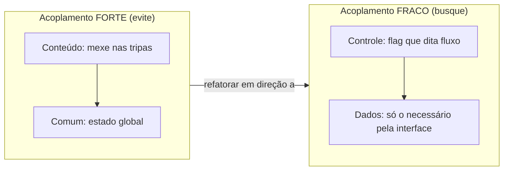
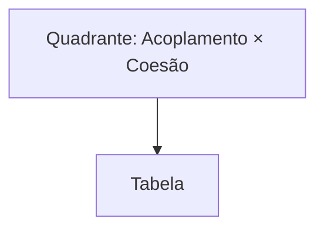
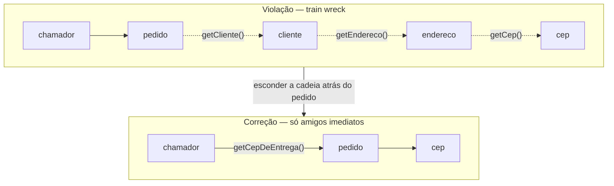
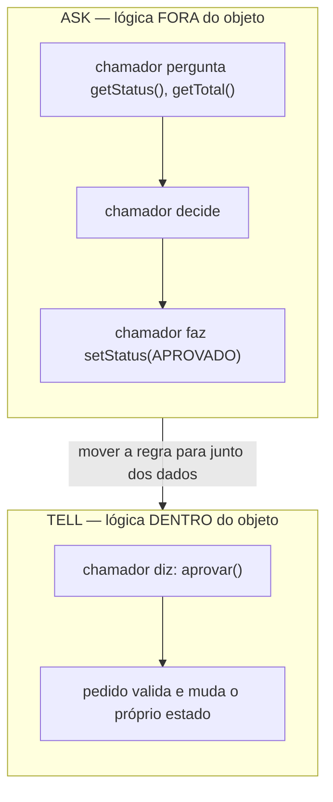
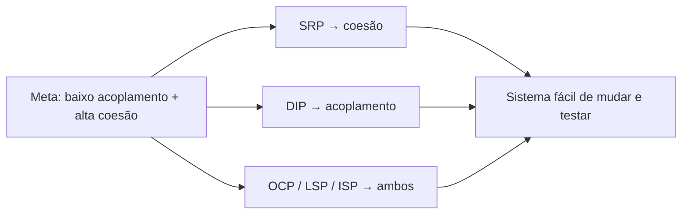

# Acoplamento e coesão

> [!summary] Resumo
> Bom design é **baixo acoplamento** (módulos pouco dependentes entre si) com **alta coesão** (responsabilidades muito relacionadas dentro de cada módulo) — e [[03-Dominios/Engenharia/Design de Software/SOLID/index|SOLID]] é só a engenharia de chegar lá.

Imagine que você está montando uma equipe. Você quer que cada pessoa seja **especialista numa coisa só** (que faça sentido juntar tudo o que ela faz) e que ela **não precise saber o trabalho íntimo das outras** para fazer o seu. A primeira qualidade é coesão. A segunda é baixo acoplamento.

Essas duas palavras são o vocabulário com que você vai julgar quase todo código pelo resto da carreira. Quase todo princípio de design — incluindo o galho inteiro de [[03-Dominios/Engenharia/Design de Software/SOLID/index|SOLID]] — é uma técnica para empurrar um sistema na direção desses dois alvos.

Vamos por partes.

## Acoplamento: quanto um módulo precisa saber do outro

**Acoplamento** é o grau em que um módulo depende dos detalhes de outro. Quanto mais um precisa conhecer das *entranhas* do outro, mais forte (pior) o acoplamento.

Por que acoplamento forte dói? Porque uma mudança aqui obriga uma mudança ali. Você conserta um bug numa classe e três outras quebram. Esse "efeito dominó" é o custo do acoplamento.

Larry Constantine, no fim dos anos 60, classificou os tipos de acoplamento do **mais forte (pior)** ao **mais fraco (melhor)**. A ordem clássica é: **conteúdo → comum → externo → de controle → de marca (stamp) → de dados**.

Vamos olhar quatro deles, do pior para o melhor.

### Conteúdo (content coupling) — o pior

Um módulo mexe direto nas tripas do outro: lê ou altera uma variável interna, salta para o meio de outro código. É como entrar na casa do vizinho pela janela e reorganizar a geladeira dele.

```java
// HORROR: classe A altera campo interno de B
contaB.saldo = contaB.saldo - 100;  // tocou no estado privado conceitual de B
```

Se `Conta` mudar como representa saldo (centavos? `BigDecimal`? duas moedas?), quem mexeu nas tripas quebra. Viola [[02 - Encapsulamento]] na cara.

### Comum (common coupling)

Vários módulos compartilham um **estado global** mutável e leem/escrevem nele. O clássico: aquele `singleton` de configuração ou uma variável global que meio mundo modifica.

```java
Globals.usuarioAtual = ...;   // módulo X escreve
if (Globals.usuarioAtual...) // módulo Y lê — e ninguém sabe quem mudou
```

O problema: quando algo dá errado, quem foi o culpado? Qualquer um dos N módulos. O estado compartilhado vira um campo de batalha sem testemunhas.

### De controle (control coupling)

Um módulo passa para o outro um **flag que dita o fluxo** lá dentro. O chamador não pede um resultado — ele comanda *qual ramo de código* o chamado deve executar.

```java
// flag de controle: o chamador decide o ramo interno do chamado
processar(pedido, /* modo */ 2);   // o que é "2"? só quem escreveu sabe
```

O cheiro: parâmetros booleanos ou inteiros "mágicos" que ligam/desligam comportamento. O chamador agora **conhece a estrutura interna** das decisões do outro. (Aqui o [[05 - Polimorfismo]] costuma ser a cura: cada caso vira um tipo.)

### De dados (data coupling) — o melhor

Os módulos trocam **só os dados que de fato precisam**, via a interface pública, e nada mais. Você passa um `valor`, recebe um `recibo`. Ninguém sabe como o outro é por dentro.

```java
Recibo r = caixa.cobrar(valor);   // só os dados necessários atravessam
```

Esse é o alvo. Acoplamento de dados é inevitável — módulos precisam conversar — mas é o tipo *mais fraco*, e por isso o mais saudável.

> [!tip] Regra de bolso
> Quanto mais a comunicação acontece pela **interface pública** e menos pelas **entranhas**, mais fraco (melhor) o acoplamento. [[06 - Interfaces e classes abstratas]] existem justamente para esconder as entranhas.



Leitura do diagrama: a viagem do design é da esquerda (módulos que conhecem as tripas uns dos outros) para a direita (módulos que só trocam dados pela interface). Todo refactoring de desacoplamento empurra setas nessa direção.

## Coesão: quão relacionado é o que está junto

**Coesão** é o oposto complementar: olha *para dentro* de um módulo e pergunta — o quanto as coisas aqui dentro pertencem umas às outras?

Alta coesão = a classe tem **um propósito claro** e tudo nela serve a esse propósito. Baixa coesão = é uma "gaveta de bagunça" onde jogaram funções que não têm nada a ver entre si.

Constantine também ordenou a coesão, do **pior ao melhor**:

| Nível | Tipo | O que junta as partes | Qualidade |
| --- | --- | --- | --- |
| 1 | **Coincidental** | Nada — agrupamento arbitrário (a "classe `Utils`") | Pior |
| 2 | **Lógica** | "Categoria" parecida, mas naturezas diferentes (um `handle(tipo)` gigante) | Ruim |
| 3 | **Temporal** | Acontecem no mesmo *momento* (tudo que roda no `init()`) | Fraca |
| 4 | **Procedural** | Seguem uma *ordem* de execução | Média |
| 5 | **Comunicacional** | Operam sobre os *mesmos dados* | Boa |
| 6 | **Sequencial** | Saída de uma parte é *entrada* da próxima (linha de montagem) | Muito boa |
| 7 | **Funcional** | Todas contribuem para *uma única tarefa bem definida* | Melhor |

Leitura da tabela: subir o espectro é deixar de juntar coisas por acidente (mesma categoria vaga, mesmo instante) e passar a juntá-las por **fluxo de dados real** e, no topo, por **um único objetivo**. A `class Utils` com `formatarData`, `validarCpf` e `enviarEmail` é coincidental — três estranhos na mesma sala. Já uma `class CalculadoraDeFrete` que só calcula frete é funcional.

> [!question] Como sentir baixa coesão na pele?
> Tente terminar a frase: "Esta classe é responsável por ___." Se você precisa de um "e" ou de uma vírgula ("...por validar pedidos **e** mandar e-mail **e** gravar log"), a coesão está caindo. Uma responsabilidade, uma razão para mudar — que é exatamente o SRP.

## O mantra: eles puxam juntos

Aqui está a parte bonita: **alta coesão e baixo acoplamento tendem a andar de mãos dadas**.

Quando você junta numa classe tudo que pertence a um propósito (alta coesão), os detalhes desse propósito ficam *dentro* dela — então as outras classes não precisam conhecê-los (baixo acoplamento). E vice-versa: quando você espalha um propósito por cinco classes (baixa coesão), elas precisam ficar se chamando e conhecendo as tripas umas das outras (alto acoplamento).



| Coesão ↓ / Acoplamento → | **Baixo acoplamento** | **Alto acoplamento** |
| --- | --- | --- |
| **Alta coesão** | **Ideal** — módulos focados e independentes; o alvo | Raro/instável — costuma colapsar; algo está mal fatiado |
| **Baixa coesão** | Pouco útil — peças soltas que ninguém usa junto | **Pior** — o "big ball of mud": tudo grudado e nada com propósito |

Leitura do quadrante: você mira o canto **superior-esquerdo** (alta coesão, baixo acoplamento) e foge do **inferior-direito** (baixa coesão, alto acoplamento — a bola de lama). O canto superior-direito é instável porque coesão alta naturalmente *empurra* o acoplamento para baixo: se ele persiste alto, provavelmente a fronteira do módulo está errada.

> [!info] Lastro
> Os **seis níveis de acoplamento** (conteúdo, comum, externo, de controle, stamp, de dados) e os **sete de coesão** (coincidental, lógica, temporal, procedural, comunicacional, sequencial, funcional) vêm do *structured design* de **Larry Constantine** — Stevens, Myers & Constantine (1974) e Yourdon & Constantine, *Structured Design* (1979). A **Lei de Demeter** foi proposta por **Ian Holland** na Northeastern University em 1987. Os exemplos de código aqui são simplificações didáticas minhas, não casos reais; a ordenação dos níveis é a canônica das fontes ([Wikipedia: Coupling](https://en.wikipedia.org/wiki/Coupling_(computer_programming)), [Wikipedia: Cohesion](https://en.wikipedia.org/wiki/Cohesion_(computer_science)), [Wikipedia: Law of Demeter](https://en.wikipedia.org/wiki/Law_of_Demeter)).

## Lei de Demeter: fale só com seus amigos imediatos

A **Lei de Demeter** (ou *princípio do menor conhecimento*) é uma regra prática para manter o acoplamento baixo: um método só deve conversar com seus **amigos imediatos** — não com os amigos dos amigos.

Quem são os amigos imediatos de um método? O próprio objeto, seus campos, seus parâmetros e objetos que ele mesmo cria. Só.

O sintoma da violação é o **train wreck** ("trem descarrilhando") — aquela cadeia de pontos:

```java
// VIOLAÇÃO: train wreck — falando com estranhos
String cep = pedido.getCliente().getEndereco().getCep();
```

Por que isso é veneno? Porque o `pedido` agora **conhece a estrutura interna** do cliente *e* do endereço. Se `Endereco` mudar (`getCep()` virar `getCodigoPostal()`), este código quebra — apesar de ele só ter pedido um `Pedido`. Você criou **acoplamento transitivo**: dependeu de coisas que nem deveria saber que existem.

A correção é deixar o objeto certo **expor o que você precisa**:

```java
// CORREÇÃO: o pedido te dá o que você quer, sem expor a cadeia
String cep = pedido.getCepDeEntrega();
```

Agora o `Pedido` lida internamente com cliente e endereço. Se a estrutura interna mudar, conserta-se *num lugar só*. Você fala com seu amigo (`pedido`) e ele resolve com os amigos *dele*.



Leitura do diagrama: na violação, o chamador *atravessa* três objetos (linhas tracejadas = conhecimento de estrutura que vaza). Na correção, ele só toca no `pedido`, que encapsula o caminho. Menos setas saindo do chamador = menos coisas que podem quebrá-lo.

> [!warning] Demeter não é "proibido usar ponto"
> A regra é sobre **navegar estrutura alheia**, não sobre encadear. `stream().filter().map().toList()` encadeia, mas cada chamada devolve o *mesmo tipo de abstração* (um fluxo) — você não está bisbilhotando as tripas de objetos diferentes. O cheiro é quando cada ponto te leva mais fundo em *outra* classe.

## Tell, Don't Ask: leve o comportamento até os dados

Demeter cuida de *com quem* você fala. **Tell, Don't Ask** cuida de *o que* você diz.

A ideia: não **pergunte** o estado de um objeto para então decidir por ele — **diga** a ele o que fazer e deixe que ele decida. Assim a lógica mora junto dos dados que ela usa (alta coesão), em vez de vazar para fora (acoplamento).

Veja a diferença:

```java
// ASK — a lógica do pedido vazou para o chamador
if (pedido.getStatus() == PENDENTE && pedido.getTotal() < LIMITE) {
    pedido.setStatus(APROVADO);
}

// TELL — a regra mora dentro do pedido
pedido.aprovar();   // o pedido sabe quando e como se aprovar
```

No "ASK", a regra de aprovação está espalhada por todo lugar que precisa aprovar pedidos — e qualquer um pode setar `status` errado. No "TELL", a regra está num lugar só, e o objeto protege seus próprios invariantes.



Leitura do diagrama: no ASK, a inteligência está no chamador e os dados estão no objeto — separados, então acoplados e de baixa coesão. No TELL, inteligência e dados estão juntos. É exatamente a diferença entre um modelo anêmico e um rico — veja [[10 - Rich vs Anemic Domain Model]].

## Feature Envy: o método que mora na casa errada

Um primo próximo: **Feature Envy** ("inveja de funcionalidade"). É um método que usa muito mais dados de **outra** classe do que da sua própria. Ele está "com inveja" das features alheias.

```java
// na classe Fatura, mas só mexe em dados de Cliente
double desconto(Cliente c) {
    return c.getIdade() > 60 ? c.getCompras() * 0.1 : 0;
}
```

O cheiro: o método pergunta tudo ao `Cliente` e quase nada à `Fatura`. A cura? **Mude o método para a classe cujos dados ele inveja** — coloque `desconto()` em `Cliente`. Coesão sobe (a lógica vai para perto dos dados), acoplamento cai (a `Fatura` não precisa mais conhecer as entranhas do `Cliente`). Mais cheiros assim em [[12 - Anti-patterns de OO]].

## Conexão com SOLID: a engenharia do mantra

Se acoplamento e coesão são as **metas**, [[03-Dominios/Engenharia/Design de Software/SOLID/index|SOLID]] é o **manual de como atingi-las**. Dois exemplos diretos:

- **SRP** (*Single Responsibility*) é, na essência, **otimizar coesão**: "uma classe, uma razão para mudar" é só outra forma de dizer "alta coesão funcional".
- **DIP** (*Dependency Inversion*) é **otimizar acoplamento**: depender de uma abstração ([[06 - Interfaces e classes abstratas]]) em vez de uma implementação concreta troca acoplamento forte por fraco.

Os outros três (OCP, LSP, ISP) também são, no fundo, manobras de acoplamento e coesão. O galho [[03-Dominios/Engenharia/Design de Software/SOLID/index|SOLID]] inteiro é a engenharia de chegar a **baixo acoplamento + alta coesão** sem ter que adivinhar.



Leitura do diagrama: SOLID não é um conjunto de regras arbitrárias — cada princípio é uma alavanca específica sobre uma das duas metas. Quem entende acoplamento e coesão entende *por que* SOLID existe.

## Em entrevista

Coupling e cohesion aparecem em quase toda discussão de design. Tenha estas falas prontas:

- "**Good design means low coupling and high cohesion** — modules that don't depend on each other's internals, and modules whose parts all serve one purpose."
- "**This is a train wreck — it violates the Law of Demeter.** The caller knows the internal structure of three objects, so any of them can break it."
- "I'd apply **Tell, Don't Ask** here: instead of asking for the state and deciding outside, I'd put the behavior on the object that owns the data."
- "**This method has Feature Envy** — it uses another class's data more than its own, so I'd move it there."
- "**SRP is really about cohesion, and DIP is about coupling** — SOLID is the toolkit for reaching low coupling and high cohesion."

Vocabulário PT → EN:

| Português | Inglês |
| --- | --- |
| acoplamento | coupling |
| coesão | cohesion |
| baixo acoplamento | low coupling |
| alta coesão | high cohesion |
| acoplamento de dados | data coupling |
| acoplamento de controle | control coupling |
| estado compartilhado | shared state |
| Lei de Demeter | Law of Demeter |
| princípio do menor conhecimento | principle of least knowledge |
| cadeia de chamadas / "descarrilamento" | train wreck |
| diga, não pergunte | tell, don't ask |
| inveja de funcionalidade | feature envy |
| efeito dominó / mudança em cascata | ripple effect / cascading change |
| amigo imediato | immediate friend |

## Veja também

- [[01 - O que é Orientação a Objetos]]
- [[02 - Encapsulamento]]
- [[03 - Abstração]]
- [[04 - Herança]]
- [[05 - Polimorfismo]]
- [[06 - Interfaces e classes abstratas]]
- [[07 - Composição sobre herança]]
- [[09 - Identidade, igualdade e imutabilidade]]
- [[10 - Rich vs Anemic Domain Model]]
- [[11 - Como o modelo OO difere entre linguagens]]
- [[12 - Anti-patterns de OO]]
- [[13 - OO na prática e em entrevista]]
- [[03-Dominios/Engenharia/Design de Software/SOLID/index|SOLID]] — a engenharia de atingir baixo acoplamento + alta coesão
