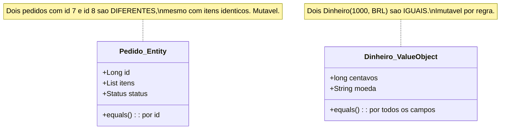
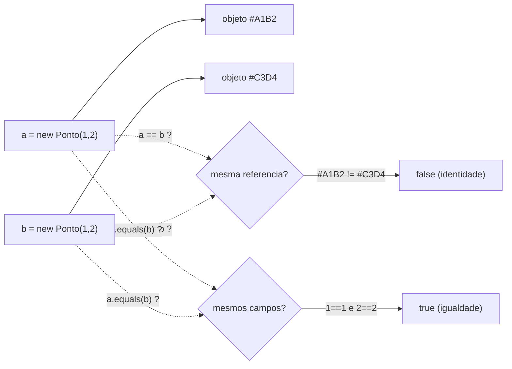
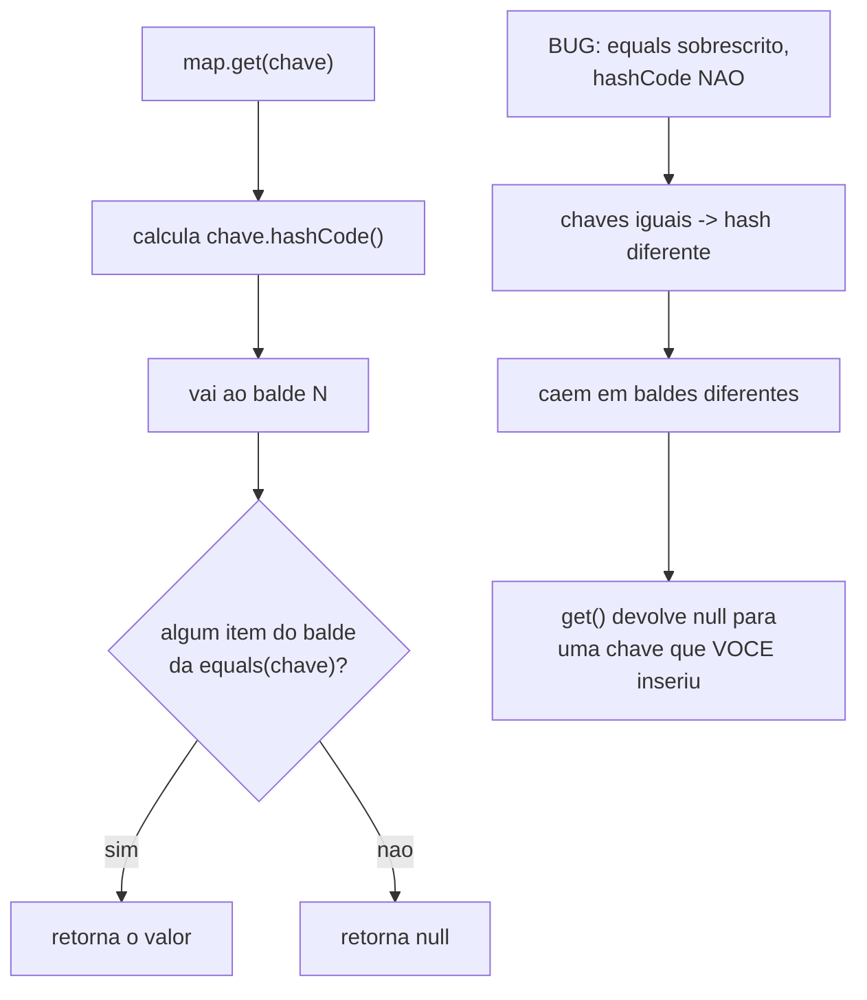
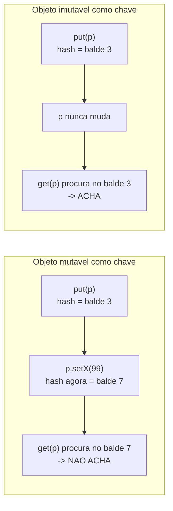

# Identidade, igualdade e imutabilidade

> [!summary] Resumo
> Alguns objetos importam por **quem são** (têm identidade — uma `Entity`, comparada por ID) e outros por **quanto valem** (são valor puro — um `Value Object`, comparado campo a campo e imutável por regra); confundir os dois é a raiz de bugs sutis em `HashMap`, em concorrência e no domínio.

Pense em duas notas de R$ 10. São intercambiáveis: ninguém liga em *qual* das duas você usou pra pagar o café. Elas são iguais porque *valem* o mesmo. Agora pense em duas pessoas chamadas "Maria Silva", nascidas no mesmo dia. Elas não são a mesma pessoa — têm CPFs diferentes, histórias diferentes, contas bancárias diferentes. São *distinguíveis* mesmo parecendo idênticas.

Essa é a fronteira mais importante desta nota. Há objetos que importam por **identidade** (quem são) e objetos que importam por **valor** (quanto representam). A linguagem te dá ferramentas pra dizer qual é qual — e se você usar a ferramenta errada, o código mente.

Vamos por partes.

## Entity e Value Object: a primeira pergunta de modelagem

Antes de escrever qualquer `equals`, faça uma pergunta sobre a classe: *se eu trocar todos os campos por cópias com os mesmos valores, ainda é "a mesma coisa"?*

Se a resposta for "não, eu preciso saber qual instância específica é esta", você tem uma **Entity**. Um `Usuário`, um `Pedido`, uma `Conta`. Dois pedidos com os mesmos itens, mesmo valor e mesma data ainda são **pedidos diferentes** se têm IDs diferentes — porque um cliente fez dois pedidos iguais e os dois precisam existir. Entity tem **identidade própria**, geralmente um ID; costuma ser **mutável** (o pedido muda de status, a conta muda de saldo); e sua igualdade é **por ID**, não pelos campos.

Se a resposta for "sim, dois com os mesmos valores são intercambiáveis", você tem um **Value Object**. Um `Dinheiro(10, BRL)`, uma `Coordenada(lat, lon)`, um `Cpf`. Não tem identidade — `Dinheiro(10, BRL)` é igual a *qualquer outro* `Dinheiro(10, BRL)`, sem perguntar "qual deles". É **imutável por regra** (mais sobre isso adiante) e sua igualdade é **por valor**: todos os campos batem, logo são iguais.

> [!tip] A heurística do crachá
> Entity é o **funcionário**: dois com o mesmo nome são pessoas diferentes, e ele continua o mesmo funcionário mesmo trocando de cargo (estado muda, identidade não). Value Object é a **cédula**: vale pelo número estampado, e ninguém te deve "aquela nota específica" — qualquer nota do mesmo valor quita a dívida.

Essa distinção é a base do **DDD tático** (a modelagem do domínio com tipos ricos). A discussão estratégica — bounded contexts, agregados, ubiquitous language — vive em [[Arquitetura de Software]], e o contraste entre modelo rico e anêmico está em [[10 - Rich vs Anemic Domain Model]]. Aqui ficamos no nível tático: a classe é Entity ou Value Object, e como isso muda o `equals`.



Leitura do diagrama: à esquerda, a `Entity` carrega um `id` e compara por ele — o estado interno (`itens`, `status`) pode mudar ao longo da vida sem que ela deixe de ser "o pedido 7". À direita, o `Value Object` não tem `id`; ele *é* seus campos, e compara por todos eles. A nota presa em cada classe traduz a consequência prática: a Entity distingue instâncias idênticas, o Value Object as funde.

## Identidade vs igualdade: dois "iguais" diferentes

Aqui mora uma confusão clássica de entrevista. Existem **duas perguntas** que parecem a mesma:

1. **Identidade** — "estes dois nomes apontam pro **mesmo objeto** na memória?" É comparação de **referência**.
2. **Igualdade** — "estes dois objetos têm o **mesmo valor**?" É comparação de **conteúdo**.

Em Java, isso é literal e visível: `==` testa **identidade** (mesma referência), `equals()` testa **igualdade** (mesmo valor — *se* você implementou). O exemplo que pega todo mundo:

```java
String a = new String("oi");
String b = new String("oi");

a == b        // false  -> dois objetos distintos na memória
a.equals(b)   // true   -> mesmo valor
```

Sem um `equals` próprio, `equals` da `Object` *cai pra* `==` — ou seja, vira identidade. É por isso que duas instâncias de uma classe sem `equals` nunca são "iguais", nem com os mesmos campos: você está perguntando "valor?" e a linguagem responde "referência". Para uma Entity isso até faz sentido (cada instância é única); para um Value Object, é um bug silencioso.



Leitura do diagrama: as duas variáveis `a` e `b` apontam pra **endereços diferentes** (`#A1B2` e `#C3D4`), então `==` retorna `false` — são objetos distintos. Mas `equals`, quando implementado pra comparar campos, vê `1==1` e `2==2` e retorna `true`. A linha de cima é a pergunta da identidade; a de baixo, a da igualdade. Responder uma quando você queria a outra é o erro.

## O contrato equals/hashCode: as regras que o `HashMap` cobra

Se você decidiu que sua classe é um Value Object e vai sobrescrever `equals`, a JVM te entrega um **contrato** — um conjunto de regras que outras partes da plataforma (coleções, sobretudo) *assumem* que você respeita. Quebrar é legal pro compilador e desastroso em runtime.

O contrato de `equals` tem quatro propriedades, mais uma regra sobre `null`:

| Propriedade | O que exige | Em uma frase |
|---|---|---|
| **Reflexivo** | `x.equals(x)` é `true` | Todo objeto é igual a si mesmo. |
| **Simétrico** | `x.equals(y)` ⇔ `y.equals(x)` | Se A é igual a B, B é igual a A. |
| **Transitivo** | `x.equals(y)` e `y.equals(z)` ⇒ `x.equals(z)` | Igualdade encadeia. |
| **Consistente** | invocações repetidas dão o mesmo resultado (se nada muda) | Não pode oscilar. |
| **null** | `x.equals(null)` é `false` | Nada é igual a "nada". |

Mas a regra que mais machuca não está na lista de `equals` — está na ponte entre `equals` e `hashCode`. **A regra de ouro:**

> Se `a.equals(b)` é `true`, então **obrigatoriamente** `a.hashCode() == b.hashCode()`.

Ou, em prosa: **objetos iguais precisam ter o mesmo hash.** O inverso **não** vale — dois objetos podem ter o mesmo `hashCode` e *não* serem iguais (isso é só uma colisão de hash, perfeitamente normal — veja como tabelas hash tratam colisões em [[Estruturas de Dados]]).

Por que essa regra existe? Porque o `HashMap` (e `HashSet`, e qualquer coisa baseada em hash) busca em **dois passos**: primeiro vai no balde definido pelo `hashCode`, depois compara com `equals` dentro do balde. Se você sobrescreve `equals` mas **esquece** o `hashCode`, dois objetos "iguais" vão parar em **baldes diferentes** — e o mapa jura que a chave não existe, mesmo você tendo acabado de inseri-la.



Leitura do diagrama: o fluxo de cima é o caminho feliz — `hashCode` escolhe o balde, `equals` confirma o item dentro dele. O bloco de baixo mostra o sabotador: com `equals` sem `hashCode`, duas chaves logicamente iguais produzem hashes diferentes, aterrissam em baldes distintos, e o `get` nunca encontra o que o `put` guardou. O mapa não está "bugado" — *você* quebrou o contrato que ele confia.

Um `equals`/`hashCode` correto, à mão:

```java
final class Dinheiro {
    private final long centavos;
    private final String moeda;

    @Override
    public boolean equals(Object o) {
        if (this == o) return true;                 // atalho de identidade
        if (!(o instanceof Dinheiro d)) return false; // tipo + null em um golpe
        return centavos == d.centavos
            && moeda.equals(d.moeda);               // TODOS os campos
    }

    @Override
    public int hashCode() {
        return Objects.hash(centavos, moeda);       // mesmos campos do equals
    }
}
```

Repare na disciplina: `hashCode` usa **exatamente os mesmos campos** que `equals`. Esse é o segredo de não quebrar a regra de ouro — se os campos que decidem igualdade são os mesmos que alimentam o hash, objetos iguais sempre colidem no mesmo balde, como o contrato pede.

E desde o **JDK 16** (preview no JDK 14, segundo preview no 15, final no 16) você nem precisa escrever isso: um `record` gera `equals`, `hashCode` e `toString` automaticamente, todos baseados em todos os componentes.

```java
record Dinheiro(long centavos, String moeda) {}
// equals, hashCode e toString: de graca, corretos, baseados em todos os campos
```

`record` é a forma idiomática de Value Object em Java moderno: imutável por construção e com igualdade por valor sem boilerplate. (Sobre como cada linguagem desenha isso de forma diferente, veja [[11 - Como o modelo OO difere entre linguagens]].)

## Entre linguagens: o mesmo conceito, ferramentas diferentes

A pergunta "igualdade por referência ou por valor?" é universal, mas cada linguagem responde de um jeito — e saber disso é ouro em entrevista poliglota.

| Linguagem | Igualdade de valor | Como obter | Pegadinha |
|---|---|---|---|
| **Java** | `equals` / `hashCode` | sobrescrever os dois, ou usar `record` | sobrescrever um sem o outro quebra `HashMap` |
| **Python** | `__eq__` / `__hash__` | `@dataclass(frozen=True)` gera ambos | definir só `__eq__` torna o objeto **unhashable** |
| **Go** | `==` em structs | nativo, se **todos** os campos forem comparáveis | slice/map/func como campo ⇒ não compila; usa-se `reflect.DeepEqual` |
| **TS/JS** | não existe nativa | implementar à mão ou via lib | `{a:1} === {a:1}` é `false` — só referência |
| **Kotlin** | `data class` | gera `equals`/`hashCode`/`copy` | — |
| **Scala** | `case class` | gera `equals`/`hashCode`/`copy` | — |

Dois detalhes merecem o holofote, porque caem em entrevista:

**Python tem uma armadilha elegante.** Se você define `__eq__` numa classe e **não** define `__hash__`, o Python automaticamente seta `__hash__ = None` — e o objeto vira **unhashable**: não pode ser chave de dict nem entrar num set. A lógica é defensável: se você mudou o que significa "igual", o Python não confia no hash padrão (que se baseia em identidade) e prefere te impedir a deixar você quebrar o dict em silêncio (o oposto da escolha de Java!). A saída limpa é `@dataclass(frozen=True)`: com `eq=True` (default) e `frozen=True`, o dataclass gera `__eq__` **e** `__hash__` juntos, *e* congela os campos — Value Object completo numa linha.

**Go não tem `equals` customizável.** O operador `==` compara structs **campo a campo**, automaticamente, *desde que todos os campos sejam comparáveis*. Se um campo for slice, map ou função (não comparáveis), o `==` nem compila — e você cai pra `reflect.DeepEqual` (que faz comparação profunda, exportados e não exportados, mas é mais lento) ou escreve a comparação à mão. Não há sobrescrita de operador; a igualdade é estrutural ou nada.

**JS/TS não têm igualdade de valor nativa.** `===` e `==` comparam objetos por **referência** — `{a:1} === {a:1}` é sempre `false`, são dois objetos distintos. Igualdade de valor é responsabilidade sua (comparação manual, `JSON.stringify` ingênuo, ou libs como `lodash.isEqual`). É o extremo oposto de Go: lá a estrutura compara de graça, aqui nem com esforço a linguagem ajuda.

## Imutabilidade: por que objetos que não mudam são mais fáceis

Reparou que todo Value Object decente é **imutável**? Não é coincidência. Um objeto imutável é aquele cujo estado **não muda depois de construído** — você não tem setters, e qualquer "modificação" produz uma **nova instância**.

Por que isso é tão bom?

- **Thread-safe de graça.** Se nada muda, não há corrida. Várias threads podem ler o mesmo objeto imutável sem locks, sem `synchronized`, sem medo. (Isso conversa com concorrência em geral — estado compartilhado mutável é a fonte da maioria dos bugs de race condition.)
- **Fácil de raciocinar.** O valor que você viu na linha 10 é o mesmo na linha 90. Não há "quem mexeu nisso no meio do caminho?". O código vira mais previsível.
- **Sem side effects.** Passar um imutável pra uma função é seguro — ela não tem como alterar o seu objeto pelas suas costas.
- **Hashable de forma estável.** Um objeto cujo hash nunca muda é uma **chave de mapa segura**. Se você usa um objeto mutável como chave de `HashMap` e depois muda um campo que entra no `hashCode`, ele "some" do mapa — está no balde antigo, mas você procura no balde novo. Imutabilidade elimina essa classe inteira de bug.



Leitura do diagrama: em cima, um objeto mutável muda um campo *depois* de virar chave; o hash recalculado aponta pra outro balde, e o `get` procura no lugar errado — a chave "evaporou". Embaixo, o objeto imutável mantém o mesmo hash pra sempre, então `put` e `get` concordam no balde. É o argumento concreto de por que Value Objects são imutáveis: pra serem chaves confiáveis.

Como construir imutabilidade na prática? Os padrões:

- **Campos `final`, zero setters.** O esqueleto: tudo é atribuído no construtor e nunca mais.
- **Métodos "with" que retornam nova instância.** Em vez de `setLatitude`, você expõe `comLatitude(novaLat)` que devolve uma **cópia** com a latitude trocada, deixando o original intacto:

```java
record Coordenada(double lat, double lon) {
    Coordenada comLatitude(double novaLat) {
        return new Coordenada(novaLat, this.lon);  // nova instancia, original intacto
    }
}
```

- **Suporte da linguagem:** Java tem `record` e `final`; Python tem `@dataclass(frozen=True)` e `namedtuple`; TS tem `readonly` em campos e `Readonly<T>` em tipos; Kotlin tem `data class` (com `copy`); Scala tem `case class`.

Por fim, a conexão que fecha o ciclo: usar Value Objects imutáveis no lugar de tipos primitivos é o antídoto direto do **Primitive Obsession** (ver [[12 - Anti-patterns de OO]]). Um `Cpf` em vez de `String`, um `Dinheiro` em vez de `BigDecimal` solto, uma `Coordenada` em vez de dois `double` perdidos — cada um é um Value Object imutável com igualdade por valor, validado na construção, impossível de confundir com outro. O domínio fica mais rico e mais seguro.

> [!info] Lastro
> O contrato `equals`/`hashCode` (reflexivo, simétrico, transitivo, consistente; `x.equals(null)` é `false`; iguais ⇒ mesmo `hashCode`) é o cânone do Javadoc de `java.lang.Object`. Java records: preview no JDK 14 (JEP 359), segundo preview no 15 (JEP 384), **final no 16** (JEP 395), gerando `equals`/`hashCode`/`toString` por todos os componentes. Python: definir `__eq__` sem `__hash__` seta `__hash__ = None` (objeto unhashable); `@dataclass(frozen=True)` com `eq=True` gera ambos e congela os campos — fonte: docs de `dataclasses`. Go: `==` compara structs campo a campo se **todos** forem comparáveis (slice/map/func não são) — caso contrário, `reflect.DeepEqual` ou comparação manual; não há operador de igualdade customizável. JS/TS: `===` é só referencial — igualdade de valor é responsabilidade do código. A distinção Entity/Value Object é vocabulário de DDD tático (Evans); a categorização "comparação por identidade vs por valor" é simplificação didática — casos reais têm nuances (ex.: identidade de Entity pode ser natural vs surrogate). Nenhuma experiência pessoal do autor foi assumida.

## Em entrevista

A dupla identidade/igualdade e o contrato `equals`/`hashCode` são perguntas de aquecimento clássicas. Frases que funcionam:

- "An **Entity** has identity — two orders with identical contents are still different orders if they have different IDs. A **Value Object** has no identity — two `Money(10, USD)` instances are equal and interchangeable."
- "In Java, `==` checks **reference identity**, while `equals` checks **value equality** — if you override `equals` for a value type, you **must** override `hashCode` too."
- "The golden rule: **equal objects must have equal hash codes.** The reverse isn't required — distinct objects can share a hash code, that's just a collision."
- "If I override `equals` but forget `hashCode`, my keys land in different buckets and the `HashMap` can't find a key I just inserted."
- "I prefer **immutable** value objects: they're thread-safe, easy to reason about, and make stable map keys. In Java I'd reach for a `record`."
- "Using a `Money` or `Cpf` value object instead of a primitive is how I avoid **primitive obsession**."

Vocabulário PT → EN:

| Português | Inglês |
|---|---|
| identidade | identity |
| igualdade (por valor) | (value) equality |
| referência | reference |
| objeto de valor | value object |
| entidade | entity |
| imutável / imutabilidade | immutable / immutability |
| sobrescrever (um método) | to override |
| contrato | contract |
| reflexivo / simétrico / transitivo | reflexive / symmetric / transitive |
| balde (de hash) | bucket |
| colisão de hash | hash collision |
| sem efeitos colaterais | side-effect-free |
| seguro para threads | thread-safe |

## Veja também

- [[01 - O que é Orientação a Objetos]] — objetos como estado + comportamento; aqui aprofundamos *quando dois objetos são "o mesmo"*.
- [[02 - Encapsulamento]] — campos `final` e ausência de setters são encapsulamento levado ao extremo da imutabilidade.
- [[03 - Abstração]] — Value Objects modelam conceitos do domínio como tipos próprios.
- [[04 - Herança]] e [[05 - Polimorfismo]] — `equals` polimórfico precisa cuidar de subtipos (a simetria quebra fácil com herança).
- [[06 - Interfaces e classes abstratas]] — `Comparable`/`Comparator` complementam igualdade com ordenação.
- [[07 - Composição sobre herança]] — Value Objects compõem Entities (uma `Conta` *tem um* `Dinheiro`).
- [[08 - Acoplamento e coesão]] — tipos de valor coesos reduzem acoplamento a primitivos espalhados.
- [[10 - Rich vs Anemic Domain Model]] — Entity rica encapsula regras; Value Object é peça-chave do modelo rico.
- [[11 - Como o modelo OO difere entre linguagens]] — o mesmo conceito de igualdade, ferramentas diferentes por linguagem.
- [[12 - Anti-patterns de OO]] — **Primitive Obsession**: o anti-pattern que Value Objects curam.
- [[13 - OO na prática e em entrevista]] — onde essas perguntas aparecem ao vivo.
- [[Estruturas de Dados]] — `hashCode`, baldes e colisões: por que o contrato existe.
- [[Arquitetura de Software]] — DDD estratégico (bounded contexts, agregados) além da modelagem tática vista aqui.
